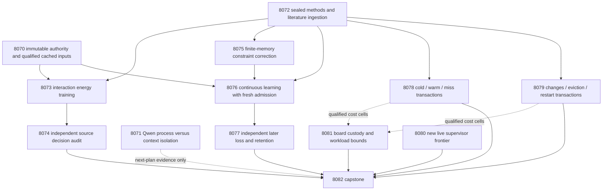
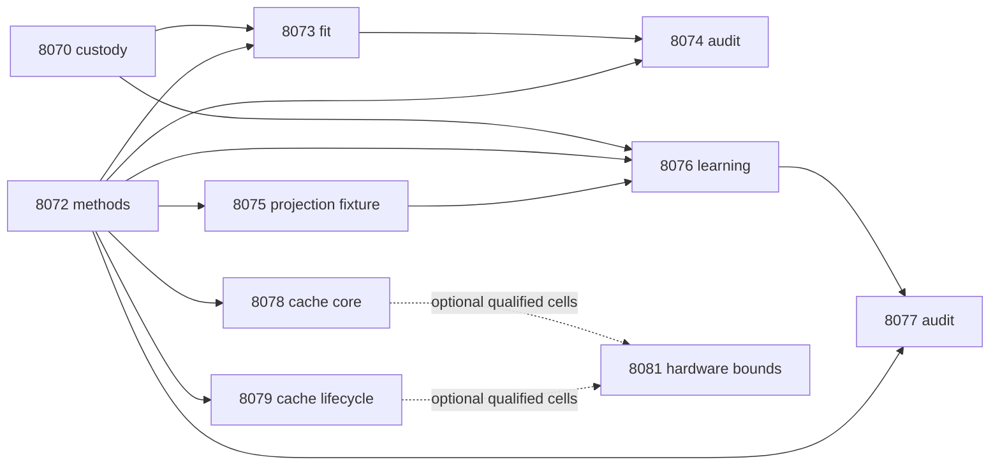

# Carnot Research Roadmap v699 — Constraint-shaped learning, source interactions, and complete feature costs

**Created:** 2026-10-03. **Milestone:** 2026.10.699.
**Status:** Planned; experiment execution and activation remain pending.
**Supersedes:** scheduling for completed milestone 2026.10.698.
**Informed by:** research-program.md, PRD, architecture, terminal V698 evidence,
completed experiment archive, prior roadmap corpus and the V699 literature scan.

The contract contains **13 tasks, Exp8070 through Exp8082**, in exactly the
order below and in `research-roadmap-next.yaml`. Four phases contain 3, 3, 2
and 5 tasks. The complete executable contract includes every prompt and gate.
The previous design is preserved byte-for-byte as
`research-roadmap-v698-preserved-20261003.md`. The active roadmap and conductor
source are unchanged by this planning work.

## What v698 proved

The schedule completed. Several scientific questions remain unanswered.
These findings come from terminal primaries and Exp8069's independent reduction.

| Experiments | Supported result | Consequence |
|---|---|---|
| Exp8057 | Fixture consumer and full task contract qualified | Preserve scoped circular-positive readiness; do not promote it to science |
| Exp8058 | Sealed roles and methods qualified; source and learning readiness 1 | Reuse authenticated complete-response masks and initial head |
| Exp8059 | Eight pilot groups, 32 forwards; one no-source duplicate drifted by 0.0003044915178467278 | Failed unchanged 1e-6 tolerance; fit readiness 0 and disqualified |
| Exp8060–8062 | Source training/evaluation chain skipped | No source-likelihood decision benefit was measured |
| Exp8063 | Constrained gradient pools: 37 useful of 800; 30 of those missed | Candidate quality and admission both matter; this retrospective is not a causal winner |
| Exp8064–8065 | Fresh admission retained the initial head; zero beneficial changed sources | Later cost gain versus reused guard -0.0113636 over 88 source groups; no learning benefit |
| Exp8065 | Fresh retention unchanged; reused-guard retention cost increased 0.0714286 | The joint retention safeguard failed |
| Exp8066 | 2,520 planned rows: 1,476 completed, 784 censored, 260 excluded | 900-second budget did not cover all modes; no complete-service qualification |
| Exp8067 | No new authenticated supervisor outcomes | Valid ARC monitoring null; no new solve or transfer claim |
| Exp8068 | Board custody valid; cache-dependent bound blocked | Preserve each board independently from service measurements |
| Exp8069 | All 13 dispositions accounted for; capstone blocked | All three PRD gaps remain open |

Exp8065's primary interval was approximately [-0.0227273, 0.00639894]. Seeds
are algorithm repetitions over one exposed stream, not independent environments.
Exp8066's completed timing rows are diagnostic; its incomplete matrix cannot
support a complete cache claim. Earlier null and disqualified results remain intact.

## Three biggest gaps to the PRD vision

1. **Useful source-grounded decisions (FR-06/12).** Learned energy has not yet
   improved typed decisions on qualified source evidence. Test three explicit
   interactions in the existing small head. Independently diagnose Qwen numerical
   drift before allocating another expensive likelihood capture chain.
2. **Retained improvement from continuous learning (FR-11).** Changed parameters
   and accepted updates have not established later benefit. Add constraints from
   released feedback and correct candidate geometry before fresh admission.
   Keep future decisions, retention and recovery as independent acceptance tests.
3. **Useful complete-service deployment (FR-05/08/09/10, NFR-01).** Fast arithmetic
   has not delivered useful complete transactions. Complete the cache comparison
   in two bounded partitions. Charge population, misses, invalidation and durable
   storage. Preserve native parity and each device's actual execution scope.

A learned compatibility energy is not ground truth for incomplete extraction.
The source and learning cohorts have historical development exposure. Every task
keeps `generalized_learning_benefit_score=0`. This milestone can establish a
bounded development result, not close general lifelong learning or unseen-data
verification. The source experiment uses qualified historical Qwen captures;
only Exp8071 loads a model now, for a numerical diagnostic.

## Research recorded before design

The dated V699 entry in `research-references.md` was written before this design.
It records every requested primary topic and secondary channel, with access limits.
Semantic Scholar citation endpoints were inaccessible. OpenReview direct PDFs
returned browser challenges. GitHub Trending returned cached pages. These limits
prevent a comprehensive novelty or current trend claim.

| Source | Experiment or boundary |
|---|---|
| [T-SKM-Net](https://arxiv.org/html/2512.10461v1), [author code](https://github.com/IDO-Lab/T-SKM-Net) | Exp8072/8075–8077: finite half-space correction before empirical admission |
| [One-projection optimization](https://arxiv.org/abs/2609.34099) | Charge projection separately from gradients; no transferred nonconvex theorem |
| [Admission auditing](https://arxiv.org/abs/2609.10873) | Preserve candidate commitment, fresh evidence and pool-level opportunity accounting |
| [KAN forgetting](https://arxiv.org/abs/2511.12828) | Exp8077 retention; local support alone grants no protection |
| [Delayed capacity](https://arxiv.org/abs/2503.19856) | Track pending feedback, bounded memory and release order |
| [GASP](https://arxiv.org/abs/2607.04223) | Exp8071 diagnoses fixed-answer scoring; full likelihood capture is deferred |
| [EBT](https://arxiv.org/abs/2507.02092), [ARM–EBM](https://arxiv.org/abs/2512.15605) | Exp8073/8074 retain equal-information controls and exact logistic equivalence |
| [Ising sparsification](https://arxiv.org/abs/2503.01177), [p-dits](https://arxiv.org/abs/2506.00269), [Extropic Z1T](https://extropic.ai/writing/z1t/) | Exp8081 distinguishes compatible operations from complete-service acceleration |

MERITED, PAL, LagONN, ETS and internal-layer hallucination probes remain logged
leads. This design adds no full generator training, generic external-text reranker,
new general solver, FPGA redesign or public ARC re-solve.

## Architecture



The learner sees only released update-role labels. Admission uses committed
candidates and fresh one-use labels. Evaluation reads later/retention outcomes
only after prediction seals. Public feature caches contain no labels or decisions.
The process diagnostic cannot block the independent source-feature or learning
experiments. A failed cache partition cannot erase another partition or board row.

## Phase 1 — Authority, diagnosis and methods (Exp8070–8072)

**Exp8070** binds full design/YAML authority and authenticates usable historical
source and learning inputs independently. Preserve the V698 skip receipts and
absent primaries. Test the actual consumer gate matrix, including fixture classes.

**Exp8071** tests one new explanation for Exp8059 drift: shared process state
surviving native-context replacement. Compare the original fresh-context route
with a fresh executable process for each view, on the same eight pilot groups.
Use full/no-source views, separated duplicates and identical model/build/tokens.
The 64 forwards include two lifetime arms. Keep n_ctx=6384, batch/microbatch256,
flash attention disabled, exact preceding-token alignment, normalization1e-10
and duplicate mean-NLL tolerance1e-6. Cap model work including loads at2400s.
Keep process children bounded and heartbeat from the parent during loads.

This is a diagnostic hypothesis, not an asserted diagnosis or an unchanged
capture rerun. Both routes can fail. A successful fresh-process arm needs all
32 scheduled forwards and current validation. If the old failure does not recur,
report the causal ambiguity. Record conservative throughput and reload costs for
future capture planning. No full192-group likelihood study is scheduled here.

**Exp8072** ingests the selected methods and freezes all branches before outcomes.
It retains original fit64/tune32/evaluation96 and stream256/retention64 identities,
complete-response masks, release delay20 and exposed-development status. Freeze
H1/H2, guards, memory limits, cost matrix and the complete six-mode cache matrix.

Prototype: authenticated manifests, real scoring children and sealed methods.
Validation: private authority/consumer and source-boundary CLIs.
Adversarial checks: changed prompts, class mismatch, stale tokens and future labels.

## Phase 2 — Source decisions and candidate geometry (Exp8073–8075)

**Exp8073** trains small calibrated heads from authenticated cached Qwen scalars
and the eight existing public source features. Keep the additive spline basis
and add only these three terms after fit-only centering/scaling:

- Qwen logit times `overlap_maximum`.
- Qwen logit times `uncovered_fraction_maximum`.
- `numeric_mismatch_maximum` times `negation_mismatch_maximum`.

Fit intercept, scalar-affine, nine-feature linear, additive and interaction heads.
Use identical four-fold source-grouped fit cross-validation and ridge grid
[.0001,.001,.01,.1,1], with a fixed tie rule. Fit geometry uses fit labels only;
affine calibration uses tune labels only. Require at least48 fit groups with8
per class and24 tune groups with4 per class. Cap fitting at600s. Preserve the
numerical convergence checks. For unsupportedness y=1, use E(x,0)=0,
E(x,1)=-f(x) and p(1|x)=sigmoid(f(x)). An equivalent logistic model on exactly
the same basis is a parity control; any gain is a representation result.

**Exp8074** seals predictions for evaluation96 in a process without labels.
A separate evaluator rebuilds features/predictions and opens original complete
human targets. H1 tests interaction versus additive typed cost. Report scalar,
linear and intercept controls. Fixed source-feature permutation and coefficient
ablation diagnose dependence; they do not constitute new primary hypotheses or
actual removal of source text from Qwen. No failed Exp8059 likelihood is reused.

**Exp8075** qualifies a bounded projection kernel and persistent constraint memory.
Let the initial small head have coefficient vector w0, with frozen calibration
f_w(x)=a*B(x)w+b. For each released update label y_j, set s_j=2y_j-1 and
c_j=min(s_j*f_w0(x_j),tau_j), where tau_j=0 for unsupported y=1 and
log(9) for supported y=0. Add the half-space:

`s_j * a * B(x_j) w >= c_j - s_j * b`.

Keep calibration a,b fixed. Retain at most64 newest eligible update-source
constraints. Include the box w0±.5. The initial head is feasible. Starting from
the raw proposal, sample8 constraints and correct the greatest violation with
unit relaxation. Project onto the box after each correction. Stop after256 row
projections or complete residual<=1e-8. Check the full set after termination.
Nonfinite or unsatisfied results cannot be called feasible. Use an incumbent
that satisfies all current constraints; otherwise restore w0 and record the reset.

Compare64 seeded private feasible systems with an independent convex QP reference.
Measure residual, distance and work separately: finite SKM is not necessarily the
nearest-point projection. Include contradictory/zero-norm controls and durable
memory tests. Exact fixture feasibility earns circular-positive scope only.
This is an adaptation of a projection idea, not a reproduction of T-SKM-Net's
trained network and not a certificate about unseen source labels.

Prototype: frozen loadable small heads and a tested finite-memory update kernel.
Validation: label-access order, basis parity, finite-budget full residual checks.
Adversarial checks: target leakage, feature mutation, infeasibility and stale memory.

## Phase 3 — Continuous self-learning (Exp8076–8077)

**Exp8076** keeps the qualified historical head as its initial model. This isolates
candidate geometry from the source representation study. Four arms are frozen,
unconditional raw updates, `ray_fresh` and `projected_fresh`. Each has its own
state. Preserve original256-slot chronology, delay20, seeds101–120 and hash-mod4
roles: bucket0 admission-only, other buckets update-only.

At slots64/128/192, propose four gradients with step.01 and ridge.001 from up to
the newest32 released update rows, minimum16 and2/class. The projected arm uses
the kernel before candidate commitment. The ray arm keeps the raw endpoint.
Gradient and label budgets match; projection work is additional and fully charged.
The mechanism adds memory constraints as feedback arrives, advancing the Tier1/2
self-learning path. It does not merely change old constraint weights.

Commit each endpoint, incumbent, memory and release frontier before taking the
next12 eligible admission labels in release order. Consume each block once.
All adaptive arms wait to the same decision time. Incomplete blocks expire at
the next opportunity or stream end, without cherry-picking replacement labels.
Admission labels never enter gradients or constraint memory.

Both guarded arms choose the largest alpha in [1,.5,.25,.125,0] satisfying the
same empirical fresh-data checks: no extra false accepts versus incumbent or
initial; Brier increase<=.01 and cost increase<=.02 versus initial; nonincreasing
Brier/cost versus incumbent; at least2 labels per class. Projected candidates
also satisfy all current memory inequalities. If none qualifies, preserve the
incumbent when feasible, otherwise restore w0. No beneficial-learning credit
comes from keeping or restoring the frozen head. Cap numerical work at1200s.

**Exp8077** independently replays issue/release/constraint/projection/admission
and durable update events. H2 measures later projected-versus-ray decision cost.
Retention opens after final head seals. Both guarded arms must preserve the
registered retention limits. Inject process death at memory append, candidate
commit, admission consumption and coefficient publication. Recover identical
issued decisions and exactly-once label use.

Prototype: causal persistent constraint addition with fresh admission.
Validation: later actions, independent retention and crash recovery.
Adversarial checks: future labels, duplicated feedback, harmful updates and resets.
Hardware path: bounded sparse CPU operations, a direct Rust path and optional
batched GPU row evaluation. Current Ising fabric requires a different mapping.

## Phase 4 — Complete costs and independent closure (Exp8078–8082)

**Exp8078** runs cold/warm/all-miss transactions. **Exp8079** independently runs
changed10%/eviction/restart. Together they preserve all six original modes,
three observed condition/class pairs, four Python/native cached/uncached arms,
five warmups and30 measured repetitions. Each half plans1260 rows and has its own
1800s measurement budget. Keep warmups as excluded rows. Interleave modes across
repetitions and checkpoint complete arm quartets; report every censored slot.

Use identical complete source/answer bytes and actual loaded native calls.
Require exact public features and discrete state/actions, numerical tolerance
1e-10, and real durable reload. Charge population, hashing, extraction, guards,
FFI, writes, invalidation and recovery. Report cache warm speed, cold/miss
regression and break-even reuse count separately. A complete slow result remains
usable null evidence. Acquisition, original Qwen inference and external feedback
costs remain unknown, not zero. No production default changes.

**Exp8080** reads only authenticated supervisor outcomes after Exp8067. A valid
empty delta satisfies the ARC floor. At least10 new closed firings across3 games
are needed for a curated selection-refinement proposal. No game run, new arm,
source reverse engineering, public re-solve or default change is scheduled.

**Exp8081** preserves KV260 fabric, PolarFire CPU and GateMate physical evidence
independently. Read each cache partition separately; calculate a combined bound
only if both qualify. Map projection operations from qualified receipts when
available. Preserve unknown transfer/acquisition costs and device precision limits.
There is no present hardware execution or procurement.

**Exp8082** independently reduces all13 dispositions and the two primary tests.
A missing upstream yields terminal blocked, not retryable partial. Write the
outcome note and narrow retirement/reopen decisions. Historical publication G1–G4
are reported separately from this milestone's science readiness.

Prototype: complete cache partitions and independent branch reducers.
Validation: loaded-native parity, complete cells, immutable task authority.
Adversarial checks: corrupt caches, missing costs, forged board rows and missing primaries.

## Scientific acceptance and statistical scope

Costs are unsupported accept5, supported reject1, escalation.5 and correct0.
Probability denotes unsupportedness. Accept below.1, reject above.5, otherwise
escalate, including boundary ties. Methods freeze in Exp8072 before outcomes.

| Hypothesis | Primary contrast | Required safeguards |
|---|---|---|
| H1_source_interactions | Additive cost minus interaction cost >=.02 | >=72 complete evaluation source groups, >=8/class, >=5 beneficial changes, no added false accepts, Brier increase<=.01 |
| H2_projected_learning | Ray-fresh cost minus projected-fresh cost >=.02 | >=80 common later groups, >=10/class, >=5 beneficial changes, no per-seed added false accepts versus ray/frozen/unconditional; cost noninferiority within.02 versus frozen/unconditional |

H2 retention needs48 complete groups with8/class. BOTH guarded arms must stay
within.01 Brier and.02 cost of frozen. The common later cohort consists of
update-role sources after the first shared completed admission and before their
own label release. Insufficient support blocks the hypothesis; a measured loss,
no-op or safety/retention failure is a valid null with benefit zero.

Use10000 paired source-group bootstrap draws for H1. H2 uses original256-slot
moving blocks, length32 with16/64 sensitivity. Average seeds within each source.
Report descriptive two-sided95% intervals. For the one-sided margin test,
center paired gain rows at the null margin. Bootstrap centered means to compute
p=(1+count(centered_mean>=observed_gain))/(1+completed_draws). Preserve the full
original time masks for H2 and report censored resamples.

Apply Holm .05 to exactly H1 and H2. Missing, disqualified, unsupported or
safety-failing hypotheses receive family p=1. No diagnostic or speed test can
replace either hypothesis. These intervals describe conditional development
uncertainty; they cannot erase historical model-selection exposure. A future
unexposed cohort is required before generalization or production benefit claims.

The Qwen diagnostic has8 source groups; it measures numerical repeatability only.
Projection fixtures have64 seeded systems; they prove finite fixture behavior only.
Cache repetitions measure one host and workload. Require a lower95% warm speed
ratio>1.2 and cold/all-miss lower ratio>=1/1.05 before scoped reuse-speed credit.
Lifecycle modes receive their own intervals. Neither cache speed nor projection
feasibility closes NFR-01 or the PRD's useful-verification gap.

## Dependency graph and conductor order

The exact conductor order is Exp8070–Exp8082. Every structured upstream exists
earlier in this roadmap. Every readiness edge also checks the producer's
`verdict_class` and `flagged_adversarial=false`.

| Consumer | Structured readiness prerequisites |
|---|---|
| Exp8073 | Exp8070.cached_source_inputs_ready_score; Exp8072.source_protocol_ready_score |
| Exp8074 | Exp8073.interaction_fit_ready_score; Exp8072.source_protocol_ready_score |
| Exp8075 | Exp8072.learning_protocol_ready_score |
| Exp8076 | Exp8070.historical_learning_inputs_ready_score; Exp8072.learning_protocol_ready_score; Exp8075.projection_kernel_ready_score |
| Exp8077 | Exp8076.learning_trajectory_ready_score; Exp8072.learning_protocol_ready_score |
| Exp8078 | Exp8072.service_protocol_ready_score |
| Exp8079 | Exp8072.service_protocol_ready_score |

Scientific/method producers allow only positive/null. Exp8070 custody and
Exp8075 fixture edges additionally allow circular_positive for their named
readiness fields. This exception cannot qualify a scientific benefit.
Exp8071 has no descendants gated on scoring success. Exp8078/8079 are independent.
Exp8080/8081/8082 have no scientific pregates; their readers report each missing
operand rather than lose independent monitoring, custody or capstone evidence.



## Hardware requirements and operating budgets

| Work | Resource | Limit and claim boundary |
|---|---|---|
| Exp8071 | Cached Qwen3.8 Q4_K_M, available CUDA RTX3090, GPU lease and offload evidence | 2400s including loads; 64 forwards; child180s, forward120s; no shared serving changes |
| Source heads | CPU, original public data and qualified scalar receipts | 600s numerical fit; no current LLM call |
| Projection and learning | CPU and host memory | 64 memory constraints, 256 projection steps, 1200s learning; fixed pretrained generator |
| Cache partitions | CPU, actual loaded native extension and private durable storage | 1800s per half, complete pairs and censored rows; no replacement of a mapped library inode |
| KV260 | Historical authenticated fabric receipts | k_max<=5; any future transport uses SSH kria; no present device execution |
| PolarFire | Historical Linux CPU dispatch receipts | Do not infer FPGA fabric execution |
| GateMate | Historical physical/JTAG observation | Preserve0xffffffff until cable/port/power changes; no repeated unchanged probe |
| NPU/TSU/larger FPGA | Deferred | No qualified new access or complete-service case for acquisition |

The wishlist's old missing-Vivado notes do not override later KV260 board
receipts. Existing CPU and CUDA resources suffice. An extra accelerator cannot
remove unmeasured acquisition costs or supply missing scientific benefit.
For any proposed100x compatible-kernel improvement, report the service bound
1/((1-f)+f/100), with f taken from qualified component timings. No local100x
claim follows from this design. Future projection batching has a hardware path;
its actual benefit must beat CPU plus transfer and persistence costs.

Only Exp8071 needs an LLM. Its `MODEL_SPECS` includes
`unsloth/Qwen3.8-27B-GGUF`. It performs teacher-forced scoring, zero generated
tokens, with `model_load_no_generation` and the2s floor. A later tiny generation
canary must use `model_bounded_generation` (10s); actual generation uses
`model_full_generation` (60s). No duration padding. Small legacy models remain
CPU smoke-only. Other tasks use no_model_load, empty MODEL_SPECS and separate
small-head metadata or hash-bound historical model provenance.

Task estimates total550 minutes including implementation and validation. No
individual task exceeds65 planned minutes or the conductor's4800s hard cap.
Each prompt mandates a flushed line per phase and before/after slow operations,
real60-second loop/child heartbeats, and gaps below600s. Files over about200
lines are written across multiple bounded calls with progress between them.

The authority/schema task and GPU process-lifetime diagnostic route to
Claude Opus with100 turns. Projection/cache implementation uses
Codex/gpt-6.1-sol. Routine research uses the conductor's Sonnet default;
ARC/hardware evidence readers use20 turns. No Luna or Gemini task is emitted.
This follows the present user's routing instruction over older defaults.

## Verification, retirement and reconciliation

Relevant existing requirements include REQ-REPORT-7837, REQ-REPORT-7891-V685,
REQ-REPORT-8057/8058, REQ-REPORT-8064/8065/8066 and the publication/receipt
contracts. The planning requirement is REQ-REPORT-PLAN699. Each future code task
must extend the appropriate capability spec and tests before implementation.
No execution result or implementation completion is implied by this plan.

Validate the actual staged files using existing roadmap schema, failure-lineage,
exclusion-manifest, gate cross-reference and exact contract readers. Compare the
full task objects, visible table and canonical digest. Use existing focused
roadmap/consumer tests and private E2E-018 authority routes for this planning change.
Do not run a historical publishing CLI against protected results merely to test
a plan. Experiment execution adds its listed private E2E-015/016/017/019 and
native E2E-003/004 checks as applicable.

Every experiment freezes its validation commands and records real process exits.
Use strict types/lint, changed-code100% statement coverage and spec traceability.
Keep known global health failures separate; a scoped pass is not a global pass.
Publish only after normal exit, independent replay and adversarial checks.
Blocked artifacts name exact failed operands in `gate_check_summary`.
Partial is reserved for incomplete owned work another attempt can finish.

All repeated scopes carry four-field `prior_failures` entries. No retired ID
is reused or placed in a requires chain. The 2026-05-29 standing continuation
exception is cited only for justified transition/continuity work. Unchanged
external-text reranking, importance anchoring, four-expert reweighting,
public ARC solves and repeated hardware probes remain excluded. New constraint
projection changes the candidate geometry; it does not reopen retired
HardNet/DSP repair headlines or importance-weighted residual regularization.

On a repeated failed verdict, preserve evidence and retire that exact failed
mechanism as promised. An unchanged valid empty ARC delta remains mandatory
monitoring, not a failed research attempt. Record any null honestly and state
what new evidence or mechanism would justify another attempt.

## Exact task contract

| Order | ID | Title | Phase | Deliverable |
|---|---|---|---|---|
| 1 | `exp8070-contract-custody` | Bind thirteen tasks and qualify reusable historical inputs | 1 | `results/experiment_8070_v699_contract_custody.json` |
| 2 | `exp8071-process-isolation-diagnostic` | Isolate process lifetime in the failed Qwen duplicate measurement | 1 | `results/experiment_8071_v699_process_isolation_diagnostic.json` |
| 3 | `exp8072-sealed-methods` | Ingest projection methods and seal independent research branches | 1 | `results/experiment_8072_v699_sealed_methods.json` |
| 4 | `exp8073-interaction-energy-fit` | Train calibrated source energies with explicit feature interactions | 2 | `results/experiment_8073_v699_interaction_energy_fit.json` |
| 5 | `exp8074-interaction-decision-audit` | Independently test source interactions and typed decision benefit | 2 | `results/experiment_8074_v699_interaction_decision_audit.json` |
| 6 | `exp8075-constraint-projection-kernel` | Qualify finite-memory half-space correction for small energy updates | 2 | `results/experiment_8075_v699_constraint_projection_kernel.json` |
| 7 | `exp8076-projected-online-learning` | Learn persistent constraints before fresh update admission | 3 | `results/experiment_8076_v699_projected_online_learning.json` |
| 8 | `exp8077-projected-learning-audit` | Reconstruct later benefit retention and projection recovery independently | 3 | `results/experiment_8077_v699_projected_learning_audit.json` |
| 9 | `exp8078-feature-cache-core` | Measure complete cold warm and miss feature transactions | 4 | `results/experiment_8078_v699_feature_cache_core.json` |
| 10 | `exp8079-feature-cache-lifecycle` | Measure changed content eviction and restart feature transactions | 4 | `results/experiment_8079_v699_feature_cache_lifecycle.json` |
| 11 | `exp8080-arc-supervisor-frontier` | Assess new live supervisor outcomes for transferable refinement | 4 | `results/experiment_8080_v699_arc_supervisor_frontier.json` |
| 12 | `exp8081-hardware-workload-boundary` | Preserve board custody and bound corrected service workloads | 4 | `results/experiment_8081_v699_hardware_workload_boundary.json` |
| 13 | `exp8082-capstone` | Independently decide thirteen outcomes and the three PRD gaps | 4 | `results/experiment_8082_v699_capstone.json` |

Canonical complete-task SHA256: `b993d808ec7b1c4e923ac3a23e1665a2e30445a095f0c18ec996aed7e0858c73`.

The JSON below is generated from the same full task objects as the YAML.
It includes every prompt, gate, failure entry and execution field.

<!-- V699_TASK_CONTRACT_START -->
```json
{"milestone":"2026.10.699","tasks":[
{"id":"exp8070-contract-custody","title":"Bind thirteen tasks and qualify reusable historical inputs","phase":1,"track":"science","priority":"high","requires_gpu":false,"max_turns":100,"estimated_wall_time_min":30,"per_unit_rows":true,"milestone":"2026.10.699","deliverable":"results/experiment_8070_v699_contract_custody.json","inference_substrate_class":"no_model_load","MODEL_SPECS":[],"gated_on":[],"prior_failures":[{"experiment_id":"exp7992-contract-methods","verdict":"complete_blocked_authority","addressed_by":"Reuse the repaired parameterized authority reader with immutable full V699 bytes and real negative CLI coverage.","retire_if_same_verdict":true},{"experiment_id":"exp8021-typed-decision-test","verdict":"complete_disqualified_typed_decision_checks","addressed_by":"Authenticate prediction and validation custody before reusing the cached source branch; the new audit will independently reduce a changed head.","retire_if_same_verdict":true}],"agent_type":"claude","model":"opus","operator_override":"2026-05-29 standing operator authorization: routine milestone transition versus exp7992; reuse the repaired authority reader and immutable V699 snapshots.","prompt":"CONTEXT:\nWork in {project_root} on {date}. V698 completed its schedule, but source science was skipped after duplicate drift. Its fresh learner was a null and its cache benchmark was censored. Preserve those outcomes.\nEXISTING CODE TO READ FIRST:\nCLAUDE.md; CODEX.md; ops/e2e-test-plan.md; openspec/capabilities/research-reporting/spec.md; scripts/experiment_template.py; python/carnot/reporting/current_work_receipt.py; python/carnot/reporting/primary_publication.py; ops/exclusion_manifest.yaml; openspec/change-proposals/research-roadmap-vNEXT.md; python/carnot/reporting/roadmap_contract.py; python/carnot/reporting/v685_authority_lifecycle.py; python/carnot/experiment_8057_v698_fixture_consumer_contract.py; results/experiment_8058_v698_sealed_evidence_methods.json; results/experiment_8069_v698_capstone.json; scripts/conductor_gates.py; openspec/change-proposals/research-roadmap-v698-preserved-20261003.md\nTASK:\nBind thirteen tasks and qualify reusable historical inputs. Deliver results/experiment_8070_v699_contract_custody.json, primitive evidence under results/raw/experiment_8070_v699_contract_custody/ and thin runnable scripts/experiments/experiment_8070_v699_contract_custody.py.\nCONCRETE STEPS:\n0. PRECONDITIONS: print a flushed start line. Check named inputs, terminal sidecars, hashes, Python environment and required tools using bounded calls. Preserve external failures as complete_blocked_<resource>, verdict_class=blocked and gate_check_summary with the exact operand. Do not fabricate absent inputs.\n1. Emit a flushed progress line at each phase boundary and before and after every model load, generation, benchmark and subprocess. Use PYTHONUNBUFFERED=1 and print(..., flush=True). Inside long loops and while children run, report elapsed time and real completed/pending units at least every 60 seconds. Keep every gap below 600 seconds. Bound each tool call. Write any file over about 200 lines in several tool calls of at most about 150 lines, with a progress message between calls. Never pad runtime or invent progress.\n2. Read the sources and the V699 statistical contract. Extend applicable REQ-* and SCENARIO-* specifications before code. Write failing tests first, then the smallest reusable implementation. Keep test outputs in private temporary directories. Reuse qualified helpers and preserve existing assertions, prior primary bytes and terminal evidence.\n3. Freeze the complete V699 design and staged/activated invocation YAML through the parameterized authority reader. Compare all thirteen ordered tasks, full prompts, metadata, visible table and canonical task digest. Preserve V698 authority. Do not activate or rewrite research-roadmap.yaml.\n4. Authenticate Exp8058 role manifests, its qualified initial head and referenced public features/Qwen scalar receipts independently. Preserve original model/build/run hashes. Never import Exp8059 likelihoods as qualified features. Export separate cached_source_inputs_ready_score and historical_learning_inputs_ready_score; an invalid branch must not erase the other.\n5. Reconstruct all V698 dispositions, including the actual Exp8060 skip receipt and absent Exp8061/8062 primaries. Resolve by declared deliverable and authenticated task ID. Reject ambiguous filename fallback. Check terminal sidecars rather than trusting readiness integers alone.\n6. Exercise gate matrices through conductor_gates using private fixtures: scientific data allow positive/null only; fixture readiness may also allow circular_positive. Test all six classes, missing fields, zero readiness, tampered hashes and quarantined inputs. Administrative validity never implies scientific benefit.\n7. Exercise E2E-018 private authority CLI. Reuse qualified readers instead of adding another publication framework. Bound non-model work to 600 seconds.\n9. Freeze the required validation-command manifest before measurement. Run focused unit/consumer tests, Ruff check/format, strict mypy for changed Python, 100% changed-code statement coverage and scoped spec coverage. Exercise the stated private real CLI success, blocked, mutation and cold-replay routes from outside the checkout. Native changes require cargo tests, fmt, clippy and a loaded-binding check. Record argv, exit, duration and log hash after normal child exit. Existing global health failures remain separate diagnostics.\n10. Save primitive rows and immutable input/config/code/checkpoint hashes. Independently reconstruct reductions. Run scripts/adversarial_verify.py and strict scripts/verdict_row_consistency_lint.py. Publish through primary_publication after normal process exit and owned validation. Failed owned checks set readiness=0 and class=disqualified. Missing external prerequisites are blocked, not partial. Reconcile openspec/, _bmad/traceability.md, ops/status.md and ops/changelog.md without deleting history.\nREQUIRED ARTIFACT FIELDS:\n- honest_verdict: terminal complete_* string; principle: completed negative findings must not cause accidental retries.\n- verdict_class: positive | circular_positive | null | blocked | disqualified | partial; principle: partial means unfinished owned work that another attempt can finish; unchanged external failures are blocked.\n- verifier_is_oracle, claim_scope; principle: fixture or exact-oracle success cannot earn independent scientific credit.\n- flagged_adversarial, required_checks_passed, validation_receipts, terminal_validation_sidecar_path; principle: readiness requires current owned checks and authenticated terminal publication.\n- inference_substrate, inference_substrate_class, MODEL_SPECS, model_invocation_counts; principle: actual model operations determine duration floors; cited upstream models are not current calls.\n- rows: unit/source/arm/seed/condition, primitive metrics, numerator, denominator, status and exclusion reason; principle: every comparison can be recomputed without repeating the experiment.\n- intended_count, eligible_count, independent_count, completed_count, censored_count, excluded_count, failed_count, sample_size_budget; principle: repetitions and seeds do not create independent source groups.\n- gate_check_summary: check/upstream/path/hash/field/op/expected/observed for every failed prerequisite; principle: missing evidence and measured zero are different failures.\n- random_seed, reproducibility_checksum, source_artifact_hashes, raw_shard_hashes, code_config_hashes, phase_spans; principle: observations remain attributable to exact inputs and work.\n- generalized_learning_benefit_score: 0; principle: the reused development cohorts cannot establish general lifelong improvement.\n- field_principles: an explanation for each additional field; principle: a metric must identify the mistaken inference it prevents.\n- contract_ready_score, cached_source_inputs_ready_score, historical_learning_inputs_ready_score: each 0|1; principle: authority and the two usable historical branches qualify independently.\n- canonical_tasks_sha256, authority_snapshots, gate_matrix_rows, historical_disposition_rows, authenticated_input_manifest; principle: full planning authority and original provenance survive activation.\n- substrate_declaration: aggregation_from_upstream_artifacts or verifier_ensemble_against_cached_candidates as actually executed; inference_substrate_class=no_model_load, MODEL_SPECS=[]; trained_head_specs separately describes small numerical heads; principle: no live-generation claim follows from teacher forcing or cached evidence.\nRun command: cd {project_root} && JAX_PLATFORMS=cpu PYTHONUNBUFFERED=1 .venv/bin/python -u scripts/experiments/experiment_8070_v699_contract_custody.py --date {date}\nDo NOT push. Do NOT modify scripts/research_conductor.py."},
{"id":"exp8071-process-isolation-diagnostic","title":"Isolate process lifetime in the failed Qwen duplicate measurement","phase":1,"track":"science","priority":"high","requires_gpu":true,"max_turns":100,"estimated_wall_time_min":65,"per_unit_rows":true,"milestone":"2026.10.699","deliverable":"results/experiment_8071_v699_process_isolation_diagnostic.json","inference_substrate_class":"model_load_no_generation","MODEL_SPECS":[{"name":"Qwen3.8-27B","hf_id":"unsloth/Qwen3.8-27B-GGUF","quantization":"Q4_K_M"}],"gated_on":[],"prior_failures":[{"experiment_id":"exp8059-fit-source-scoring","verdict":"complete_disqualified_fit_source_scoring","addressed_by":"Test full executable-process isolation against context-only reuse on the exact failed pilot; preserve 1e-6 and measure reload cost. No full capture is retried without a qualified mechanism.","retire_if_same_verdict":true}],"agent_type":"claude","model":"opus","prompt":"CONTEXT:\nWork in {project_root} on {date}. Exp8059 emitted 32 forwards over eight pilot groups. One no-source duplicate differed by 0.0003044915178467278, above the unchanged 1e-6 tolerance. Fresh native contexts did not establish repeatability. The cause is not yet known; this task tests a new isolation hypothesis and does not repeat a full capture.\nEXISTING CODE TO READ FIRST:\nCLAUDE.md; CODEX.md; ops/e2e-test-plan.md; openspec/capabilities/research-reporting/spec.md; scripts/experiment_template.py; python/carnot/reporting/current_work_receipt.py; python/carnot/reporting/primary_publication.py; ops/exclusion_manifest.yaml; openspec/change-proposals/research-roadmap-vNEXT.md; python/carnot/inference/scoring_isolation_8033.py; python/carnot/inference/likelihood_isolation_runtime_8033.py; python/carnot/inference/likelihood_runtime_8022.py; python/carnot/inference/fixed_answer_likelihood_8022.py; python/carnot/experiment_8059_v698_fit_source_scoring.py; results/experiment_8059_v698_fit_source_scoring.json; research-references.md V699 scan\nTASK:\nIsolate process lifetime in the failed Qwen duplicate measurement. Deliver results/experiment_8071_v699_process_isolation_diagnostic.json, primitive evidence under results/raw/experiment_8071_v699_process_isolation_diagnostic/ and thin runnable scripts/experiments/experiment_8071_v699_process_isolation_diagnostic.py.\nCONCRETE STEPS:\n0. PRECONDITIONS: print a flushed start line. Check named inputs, terminal sidecars, hashes, Python environment and required tools using bounded calls. Preserve external failures as complete_blocked_<resource>, verdict_class=blocked and gate_check_summary with the exact operand. Do not fabricate absent inputs.\n1. Emit a flushed progress line at each phase boundary and before and after every model load, generation, benchmark and subprocess. Use PYTHONUNBUFFERED=1 and print(..., flush=True). Inside long loops and while children run, report elapsed time and real completed/pending units at least every 60 seconds. Keep every gap below 600 seconds. Bound each tool call. Write any file over about 200 lines in several tool calls of at most about 150 lines, with a progress message between calls. Never pad runtime or invent progress.\n2. Read the sources and the V699 statistical contract. Extend applicable REQ-* and SCENARIO-* specifications before code. Write failing tests first, then the smallest reusable implementation. Keep test outputs in private temporary directories. Reuse qualified helpers and preserve existing assertions, prior primary bytes and terminal evidence.\n3. Before model work, verify the cached unsloth/Qwen3.8-27B-GGUF Q4_K_M file, tokenizer/build hashes, CUDA offload support and a free GPU lease. Preserve unrelated services. Record actual model allocation and GPU activity. Missing access ends blocked. No CPU headline fallback or model substitution.\n4. Freeze exactly the same eight complete pilot source/answer groups and full/no-source views from Exp8059. Compare current fresh-context scoring with one fresh executable process per view. Both arms use the same model, tokens, n_ctx=6384, n_batch=n_ubatch=256, flash_attn=false, target normalization and evaluation shape. Separate duplicates by other groups. Use a deterministic interleaved schedule: 8 groups x 2 views x 2 repeats x 2 lifetime arms = 64 forwards. No labels enter this diagnostic.\n5. Bound total model work, including all loads, at 2400 seconds, each child at 180 seconds and each forward at 120 seconds. Flush parent heartbeats while children run. Charge reloads, contexts, forwards and cleanup. Persist planned/started/completed/censored slots before advancing. Do not increase budgets or retry a failed duplicate.\n6. Independently recompute every target log probability from immutable owned data. Require exact preceding-token alignment, normalization within 1e-10 and duplicate mean-NLL drift <=1e-6 for every completed group/view in an arm. Save first divergent token, raw score differences and process/context/build identities. Include stale-buffer and shifted-token fixture controls. A diagnostic can be valid while both methods fail.\n7. Export process_isolation_ready_score=1 only if all 32 fresh-process forwards pass unchanged checks and current required validation. Report whether the current arm reproduces the failure. Do not infer a cause when the failure does not recur. Measure per-view/load timing and estimate full 192-group capture cost with conservative upper bounds. Schedule no full source capture in this milestone and change no shared model or ARC defaults. Exercise E2E-015/016 private scorer and real child failure/replay routes.\n9. Freeze the required validation-command manifest before measurement. Run focused unit/consumer tests, Ruff check/format, strict mypy for changed Python, 100% changed-code statement coverage and scoped spec coverage. Exercise the stated private real CLI success, blocked, mutation and cold-replay routes from outside the checkout. Native changes require cargo tests, fmt, clippy and a loaded-binding check. Record argv, exit, duration and log hash after normal child exit. Existing global health failures remain separate diagnostics.\n10. Save primitive rows and immutable input/config/code/checkpoint hashes. Independently reconstruct reductions. Run scripts/adversarial_verify.py and strict scripts/verdict_row_consistency_lint.py. Publish through primary_publication after normal process exit and owned validation. Failed owned checks set readiness=0 and class=disqualified. Missing external prerequisites are blocked, not partial. Reconcile openspec/, _bmad/traceability.md, ops/status.md and ops/changelog.md without deleting history.\nREQUIRED ARTIFACT FIELDS:\n- honest_verdict: terminal complete_* string; principle: completed negative findings must not cause accidental retries.\n- verdict_class: positive | circular_positive | null | blocked | disqualified | partial; principle: partial means unfinished owned work that another attempt can finish; unchanged external failures are blocked.\n- verifier_is_oracle, claim_scope; principle: fixture or exact-oracle success cannot earn independent scientific credit.\n- flagged_adversarial, required_checks_passed, validation_receipts, terminal_validation_sidecar_path; principle: readiness requires current owned checks and authenticated terminal publication.\n- inference_substrate, inference_substrate_class, MODEL_SPECS, model_invocation_counts; principle: actual model operations determine duration floors; cited upstream models are not current calls.\n- rows: unit/source/arm/seed/condition, primitive metrics, numerator, denominator, status and exclusion reason; principle: every comparison can be recomputed without repeating the experiment.\n- intended_count, eligible_count, independent_count, completed_count, censored_count, excluded_count, failed_count, sample_size_budget; principle: repetitions and seeds do not create independent source groups.\n- gate_check_summary: check/upstream/path/hash/field/op/expected/observed for every failed prerequisite; principle: missing evidence and measured zero are different failures.\n- random_seed, reproducibility_checksum, source_artifact_hashes, raw_shard_hashes, code_config_hashes, phase_spans; principle: observations remain attributable to exact inputs and work.\n- generalized_learning_benefit_score: 0; principle: the reused development cohorts cannot establish general lifelong improvement.\n- field_principles: an explanation for each additional field; principle: a metric must identify the mistaken inference it prevents.\n- diagnostic_ready_score, process_isolation_ready_score: 0|1; principle: a complete diagnosis and a usable scoring path are distinct outcomes.\n- lifetime_arm_rows, duplicate_drift_rows, first_divergent_token_rows, token_alignment_checks, normalization_checks; principle: scalar agreement must follow correct token custody.\n- process_ids, context_ids, model_build_hashes, offload_evidence, load_forward_cleanup_seconds, full_capture_budget_projection; principle: a numerically usable route must also have a feasible measured cost.\n- forward_pass_counts, scored_tokens, generated_tokens: 0, model_load_counts; principle: this is teacher forcing with a 2-second floor, not generation.\n- substrate_declaration: live_llm_embedding_extraction (legacy non-generative forward-pass category), model_load_no_generation, operation=teacher_forced_scoring, generated_tokens=0, floor_s=2; MODEL_SPECS includes unsloth/Qwen3.8-27B-GGUF; principle: no live-generation claim follows from teacher forcing or cached evidence.\nRun command: cd {project_root} && JAX_PLATFORMS=cpu PYTHONUNBUFFERED=1 CARNOT_FORCE_LIVE=1 .venv/bin/python -u scripts/experiments/experiment_8071_v699_process_isolation_diagnostic.py --date {date}\nDo NOT push. Do NOT modify scripts/research_conductor.py."},
{"id":"exp8072-sealed-methods","title":"Ingest projection methods and seal independent research branches","phase":1,"track":"science","priority":"high","requires_gpu":false,"max_turns":50,"estimated_wall_time_min":35,"per_unit_rows":true,"milestone":"2026.10.699","deliverable":"results/experiment_8072_v699_sealed_methods.json","inference_substrate_class":"no_model_load","MODEL_SPECS":[],"gated_on":[],"prior_failures":[{"experiment_id":"exp8065-fresh-learning-audit","verdict":"complete_null_fresh_learning_audit","addressed_by":"Change candidate construction with released-feedback half-space projection; retain fresh admission and future/retention checks instead of increasing labels or repeating the same ray update.","retire_if_same_verdict":true},{"experiment_id":"exp8066-content-addressed-feature-service","verdict":"complete_disqualified_feature_service","addressed_by":"Partition the complete six-mode workload into two independent three-mode tasks, preserving all arms and 30 measured repetitions with 1800 seconds per half.","retire_if_same_verdict":true}],"prompt":"CONTEXT:\nWork in {project_root} on {date}. The three gaps are useful source decisions, retained improvement from learning and useful complete-service performance. New experiments use historically exposed development data. V698 found few useful gradient pools and no beneficial changes from its fresh guard.\nEXISTING CODE TO READ FIRST:\nCLAUDE.md; CODEX.md; ops/e2e-test-plan.md; openspec/capabilities/research-reporting/spec.md; scripts/experiment_template.py; python/carnot/reporting/current_work_receipt.py; python/carnot/reporting/primary_publication.py; ops/exclusion_manifest.yaml; openspec/change-proposals/research-roadmap-vNEXT.md; python/carnot/experiment_8058_v698_sealed_evidence_methods.py; python/carnot/verify/evidence_features_7980.py; python/carnot/verify/sparse_energy_7996.py; python/carnot/verify/fresh_feedback_8064.py; results/experiment_8063_v698_admission_opportunity_audit.json; results/experiment_8065_v698_fresh_learning_audit.json; research-references.md V699 scan; research-studying.md\nTASK:\nIngest projection methods and seal independent research branches. Deliver results/experiment_8072_v699_sealed_methods.json, primitive evidence under results/raw/experiment_8072_v699_sealed_methods/ and thin runnable scripts/experiments/experiment_8072_v699_sealed_methods.py.\nCONCRETE STEPS:\n0. PRECONDITIONS: print a flushed start line. Check named inputs, terminal sidecars, hashes, Python environment and required tools using bounded calls. Preserve external failures as complete_blocked_<resource>, verdict_class=blocked and gate_check_summary with the exact operand. Do not fabricate absent inputs.\n1. Emit a flushed progress line at each phase boundary and before and after every model load, generation, benchmark and subprocess. Use PYTHONUNBUFFERED=1 and print(..., flush=True). Inside long loops and while children run, report elapsed time and real completed/pending units at least every 60 seconds. Keep every gap below 600 seconds. Bound each tool call. Write any file over about 200 lines in several tool calls of at most about 150 lines, with a progress message between calls. Never pad runtime or invent progress.\n2. Read the sources and the V699 statistical contract. Extend applicable REQ-* and SCENARIO-* specifications before code. Write failing tests first, then the smallest reusable implementation. Keep test outputs in private temporary directories. Reuse qualified helpers and preserve existing assertions, prior primary bytes and terminal evidence.\n3. Ingest T-SKM-Net (2512.10461), one-projection cost accounting (2609.34099), admission auditing (2609.10873), KAN forgetting (2511.12828), GASP (2607.04223) and ARM-EBM (2512.15605). Use low-concurrency primary-source checks; record access limits. Map adopted/deferred methods and mark the relevant research-studying entries ingested. Do not claim their guarantees transfer to Carnot.\n4. Seal source roles fit64/tune32/evaluation96 and the original stream256/retention64 from authenticated Exp8058 manifests. Retain complete-response eligibility, unknown targets, source hashes, exposure and release delay20. Never replace missing labels or reshuffle after outcomes. Freeze cost: unsupported accept5, supported reject1, escalate.5, correct0; accept p<.1, reject p>.5, else escalate, including ties.\n5. Freeze the source-head comparison from the V699 design: original nine inputs, conditioned additive basis plus three named interaction terms, matched regularization search, scalar/linear/intercept controls and exact equivalent logistic head. Freeze role support minima, prediction/label seals, public-feature permutation and H1 before evaluator access. Do not use unqualified Exp8059 likelihoods.\n6. Freeze projected candidate construction and all four online arms exactly as the V699 design defines. Use the qualified historical small head independently of the new source fit. Freeze hash-mod4 admission/update roles, original slots64/128/192, release+20, four gradients per proposal, step.01, ridge.001, newest32 released update rows and one-use next12 admission labels. Freeze the half-space equations, bounded memory, 256 projection steps, fallback and H2 before learner execution.\n7. Freeze the complete cache workload matrix before either service task. Split cold/warm/all_miss from changed_10pct/eviction/restart. Keep all three original observed condition/class pairs, four implementations, five warmups and thirty paired randomized repetitions. Each half has its own 1800-second measurement budget. Precompute a feasibility estimate from Exp8066 raw timing rows; report overruns without shrinking the matrix.\n8. Export source_protocol_ready_score, learning_protocol_ready_score and service_protocol_ready_score independently. Methods readiness measures protocol validity, not expected benefit. Exercise E2E-015/016 private source separation and cold replay.\n9. Freeze the required validation-command manifest before measurement. Run focused unit/consumer tests, Ruff check/format, strict mypy for changed Python, 100% changed-code statement coverage and scoped spec coverage. Exercise the stated private real CLI success, blocked, mutation and cold-replay routes from outside the checkout. Native changes require cargo tests, fmt, clippy and a loaded-binding check. Record argv, exit, duration and log hash after normal child exit. Existing global health failures remain separate diagnostics.\n10. Save primitive rows and immutable input/config/code/checkpoint hashes. Independently reconstruct reductions. Run scripts/adversarial_verify.py and strict scripts/verdict_row_consistency_lint.py. Publish through primary_publication after normal process exit and owned validation. Failed owned checks set readiness=0 and class=disqualified. Missing external prerequisites are blocked, not partial. Reconcile openspec/, _bmad/traceability.md, ops/status.md and ops/changelog.md without deleting history.\nREQUIRED ARTIFACT FIELDS:\n- honest_verdict: terminal complete_* string; principle: completed negative findings must not cause accidental retries.\n- verdict_class: positive | circular_positive | null | blocked | disqualified | partial; principle: partial means unfinished owned work that another attempt can finish; unchanged external failures are blocked.\n- verifier_is_oracle, claim_scope; principle: fixture or exact-oracle success cannot earn independent scientific credit.\n- flagged_adversarial, required_checks_passed, validation_receipts, terminal_validation_sidecar_path; principle: readiness requires current owned checks and authenticated terminal publication.\n- inference_substrate, inference_substrate_class, MODEL_SPECS, model_invocation_counts; principle: actual model operations determine duration floors; cited upstream models are not current calls.\n- rows: unit/source/arm/seed/condition, primitive metrics, numerator, denominator, status and exclusion reason; principle: every comparison can be recomputed without repeating the experiment.\n- intended_count, eligible_count, independent_count, completed_count, censored_count, excluded_count, failed_count, sample_size_budget; principle: repetitions and seeds do not create independent source groups.\n- gate_check_summary: check/upstream/path/hash/field/op/expected/observed for every failed prerequisite; principle: missing evidence and measured zero are different failures.\n- random_seed, reproducibility_checksum, source_artifact_hashes, raw_shard_hashes, code_config_hashes, phase_spans; principle: observations remain attributable to exact inputs and work.\n- generalized_learning_benefit_score: 0; principle: the reused development cohorts cannot establish general lifelong improvement.\n- field_principles: an explanation for each additional field; principle: a metric must identify the mistaken inference it prevents.\n- source_protocol_ready_score, learning_protocol_ready_score, service_protocol_ready_score: 0|1; principle: a failed scientific branch must not suppress independent work.\n- method_source_map, role_manifests, exposure_rows, eligibility_rules, statistical_plan, candidate_equations, service_matrix, workload_budget_estimate; principle: methods and comparison budgets precede current outcomes.\n- frozen_hypothesis_family: [H1_source_interactions, H2_projected_learning]; principle: diagnostics and deployment timings cannot replace a failed primary hypothesis.\n- substrate_declaration: aggregation_from_upstream_artifacts or verifier_ensemble_against_cached_candidates as actually executed; inference_substrate_class=no_model_load, MODEL_SPECS=[]; trained_head_specs separately describes small numerical heads; principle: no live-generation claim follows from teacher forcing or cached evidence.\nRun command: cd {project_root} && JAX_PLATFORMS=cpu PYTHONUNBUFFERED=1 .venv/bin/python -u scripts/experiments/experiment_8072_v699_sealed_methods.py --date {date}\nDo NOT push. Do NOT modify scripts/research_conductor.py."},
{"id":"exp8073-interaction-energy-fit","title":"Train calibrated source energies with explicit feature interactions","phase":2,"track":"science","priority":"high","requires_gpu":false,"max_turns":50,"estimated_wall_time_min":40,"per_unit_rows":true,"milestone":"2026.10.699","deliverable":"results/experiment_8073_v699_interaction_energy_fit.json","inference_substrate_class":"no_model_load","MODEL_SPECS":[],"gated_on":[{"upstream":"exp8070-contract-custody","artifact_field":"cached_source_inputs_ready_score","op":"==","value":1},{"upstream":"exp8070-contract-custody","artifact_field":"verdict_class","op":"in","value":["positive","null","circular_positive"]},{"upstream":"exp8070-contract-custody","artifact_field":"flagged_adversarial","op":"==","value":false},{"upstream":"exp8072-sealed-methods","artifact_field":"source_protocol_ready_score","op":"==","value":1},{"upstream":"exp8072-sealed-methods","artifact_field":"verdict_class","op":"in","value":["positive","null"]},{"upstream":"exp8072-sealed-methods","artifact_field":"flagged_adversarial","op":"==","value":false}],"prior_failures":[{"experiment_id":"exp7996-sparse-energy-training","verdict":"complete_null_sparse_training","addressed_by":"Add three preregistered cross-feature terms and use the qualified conditioned solver; compare with the unchanged additive basis under matched information and fitting budgets.","retire_if_same_verdict":true},{"experiment_id":"exp8008-conditioned-energy-fit","verdict":"complete_blocked_calibration_target_support","addressed_by":"Use authenticated complete-response masks from Exp8058 and explicit per-role class minima before fitting; do not relabel incomplete annotations.","retire_if_same_verdict":true}],"prompt":"CONTEXT:\nWork in {project_root} on {date}. The qualified historical head uses nine public/Qwen-derived features and additive splines. This experiment changes the representation through three fixed interactions. It does not repair failed likelihoods or claim that writing a classifier as an energy adds information.\nEXISTING CODE TO READ FIRST:\nCLAUDE.md; CODEX.md; ops/e2e-test-plan.md; openspec/capabilities/research-reporting/spec.md; scripts/experiment_template.py; python/carnot/reporting/current_work_receipt.py; python/carnot/reporting/primary_publication.py; ops/exclusion_manifest.yaml; openspec/change-proposals/research-roadmap-vNEXT.md; python/carnot/experiment_8020_v695_qualified_energy_fit.py; python/carnot/experiment_8008_v694_conditioned_energy_fit.py; python/carnot/verify/sparse_energy_7996.py; python/carnot/verify/evidence_features_7980.py; results/experiment_8020_v695_qualified_energy_fit.json; results/experiment_8058_v698_sealed_evidence_methods.json\nTASK:\nTrain calibrated source energies with explicit feature interactions. Deliver results/experiment_8073_v699_interaction_energy_fit.json, primitive evidence under results/raw/experiment_8073_v699_interaction_energy_fit/ and thin runnable scripts/experiments/experiment_8073_v699_interaction_energy_fit.py.\nCONCRETE STEPS:\n0. PRECONDITIONS: print a flushed start line. Check named inputs, terminal sidecars, hashes, Python environment and required tools using bounded calls. Preserve external failures as complete_blocked_<resource>, verdict_class=blocked and gate_check_summary with the exact operand. Do not fabricate absent inputs.\n1. Emit a flushed progress line at each phase boundary and before and after every model load, generation, benchmark and subprocess. Use PYTHONUNBUFFERED=1 and print(..., flush=True). Inside long loops and while children run, report elapsed time and real completed/pending units at least every 60 seconds. Keep every gap below 600 seconds. Bound each tool call. Write any file over about 200 lines in several tool calls of at most about 150 lines, with a progress message between calls. Never pad runtime or invent progress.\n2. Read the sources and the V699 statistical contract. Extend applicable REQ-* and SCENARIO-* specifications before code. Write failing tests first, then the smallest reusable implementation. Keep test outputs in private temporary directories. Reuse qualified helpers and preserve existing assertions, prior primary bytes and terminal evidence.\n3. Read the authenticated source input and methods manifests. Build the same original nine-feature matrix using only qualified historical Qwen scalar captures and public source features. Record the original live model provenance under cited_upstream_artifacts; MODEL_SPECS=[] for this current CPU-only task. Check every joined source and original complete-response target.\n4. Fit all normalization and spline knots on fit rows only. Add exactly three centered interaction terms: Qwen logit x overlap_maximum, Qwen logit x uncovered_fraction_maximum, and numeric_mismatch_maximum x negation_mismatch_maximum. Use the existing conditioned additive spline head as the matched ablation. Do not select interaction identities from evaluation outcomes.\n5. Fit intercept, scalar-affine, nine-feature linear, conditioned additive and interaction-augmented heads. Set E(x,0)=0, E(x,1)=-f(x), p(unsupported)=sigmoid(f(x)). Use identical source-grouped four-fold fit-only cross-validation and ridge grid [.0001,.001,.01,.1,1], with stable tie-breaking. Tune only affine calibration on tune rows. Bound numerical fitting at 600 seconds. Require finite convergence, gradient checks and held-out-role exclusion. Keep the independently evaluated logistic model on exactly the same interaction basis as a numerical equivalence control, not an independent competitor.\n6. Require at least48 complete fit groups with8/class and24 tune groups with4/class. Missing support is blocked. Seal every head, scaler, parameter count, selected ridge, calibration and source role hash before evaluation. Verify save/load prediction parity and a feature-column permutation mutation. Readiness can be1 for a numerically valid model with no improvement.\n7. Exercise E2E-015/016 source-boundary and cold-replay CLIs. Export frozen loadable checkpoints, primitive fitting rows and interaction_fit_ready_score. No current model call, generator update or ARC change is allowed.\n9. Freeze the required validation-command manifest before measurement. Run focused unit/consumer tests, Ruff check/format, strict mypy for changed Python, 100% changed-code statement coverage and scoped spec coverage. Exercise the stated private real CLI success, blocked, mutation and cold-replay routes from outside the checkout. Native changes require cargo tests, fmt, clippy and a loaded-binding check. Record argv, exit, duration and log hash after normal child exit. Existing global health failures remain separate diagnostics.\n10. Save primitive rows and immutable input/config/code/checkpoint hashes. Independently reconstruct reductions. Run scripts/adversarial_verify.py and strict scripts/verdict_row_consistency_lint.py. Publish through primary_publication after normal process exit and owned validation. Failed owned checks set readiness=0 and class=disqualified. Missing external prerequisites are blocked, not partial. Reconcile openspec/, _bmad/traceability.md, ops/status.md and ops/changelog.md without deleting history.\nREQUIRED ARTIFACT FIELDS:\n- honest_verdict: terminal complete_* string; principle: completed negative findings must not cause accidental retries.\n- verdict_class: positive | circular_positive | null | blocked | disqualified | partial; principle: partial means unfinished owned work that another attempt can finish; unchanged external failures are blocked.\n- verifier_is_oracle, claim_scope; principle: fixture or exact-oracle success cannot earn independent scientific credit.\n- flagged_adversarial, required_checks_passed, validation_receipts, terminal_validation_sidecar_path; principle: readiness requires current owned checks and authenticated terminal publication.\n- inference_substrate, inference_substrate_class, MODEL_SPECS, model_invocation_counts; principle: actual model operations determine duration floors; cited upstream models are not current calls.\n- rows: unit/source/arm/seed/condition, primitive metrics, numerator, denominator, status and exclusion reason; principle: every comparison can be recomputed without repeating the experiment.\n- intended_count, eligible_count, independent_count, completed_count, censored_count, excluded_count, failed_count, sample_size_budget; principle: repetitions and seeds do not create independent source groups.\n- gate_check_summary: check/upstream/path/hash/field/op/expected/observed for every failed prerequisite; principle: missing evidence and measured zero are different failures.\n- random_seed, reproducibility_checksum, source_artifact_hashes, raw_shard_hashes, code_config_hashes, phase_spans; principle: observations remain attributable to exact inputs and work.\n- generalized_learning_benefit_score: 0; principle: the reused development cohorts cannot establish general lifelong improvement.\n- field_principles: an explanation for each additional field; principle: a metric must identify the mistaken inference it prevents.\n- interaction_fit_ready_score: 0|1; principle: fitting validity is independent of measured decision benefit.\n- head_checkpoints, basis_equations, interaction_names, normalization_hashes, convergence_rows, gradient_checks, equivalent_logistic_parity; principle: the claimed gain must come from a new representation rather than energy renaming.\n- label_access_events, fit_tune_support, trained_head_specs, optimizer_work; principle: evaluation labels and model capacity remain auditable.\n- substrate_declaration: aggregation_from_upstream_artifacts or verifier_ensemble_against_cached_candidates as actually executed; inference_substrate_class=no_model_load, MODEL_SPECS=[]; trained_head_specs separately describes small numerical heads; principle: no live-generation claim follows from teacher forcing or cached evidence.\nRun command: cd {project_root} && JAX_PLATFORMS=cpu PYTHONUNBUFFERED=1 .venv/bin/python -u scripts/experiments/experiment_8073_v699_interaction_energy_fit.py --date {date}\nDo NOT push. Do NOT modify scripts/research_conductor.py."},
{"id":"exp8074-interaction-decision-audit","title":"Independently test source interactions and typed decision benefit","phase":2,"track":"science","priority":"high","requires_gpu":false,"max_turns":50,"estimated_wall_time_min":35,"per_unit_rows":true,"milestone":"2026.10.699","deliverable":"results/experiment_8074_v699_interaction_decision_audit.json","inference_substrate_class":"no_model_load","MODEL_SPECS":[],"gated_on":[{"upstream":"exp8073-interaction-energy-fit","artifact_field":"interaction_fit_ready_score","op":"==","value":1},{"upstream":"exp8073-interaction-energy-fit","artifact_field":"verdict_class","op":"in","value":["positive","null"]},{"upstream":"exp8073-interaction-energy-fit","artifact_field":"flagged_adversarial","op":"==","value":false},{"upstream":"exp8072-sealed-methods","artifact_field":"source_protocol_ready_score","op":"==","value":1},{"upstream":"exp8072-sealed-methods","artifact_field":"verdict_class","op":"in","value":["positive","null"]},{"upstream":"exp8072-sealed-methods","artifact_field":"flagged_adversarial","op":"==","value":false}],"prior_failures":[{"experiment_id":"exp8021-typed-decision-test","verdict":"complete_disqualified_typed_decision_checks","addressed_by":"Use new interaction checkpoints and independent public-byte prediction reconstruction; require private real evaluator CLI checks before current audit publication.","retire_if_same_verdict":true}],"prompt":"CONTEXT:\nWork in {project_root} on {date}. V698 has no qualified likelihood decision result. This task evaluates the changed small head on qualified cached source evidence. All cohorts remain exposed development material; source-feature dependence is not a new live-Qwen or generic hallucination result.\nEXISTING CODE TO READ FIRST:\nCLAUDE.md; CODEX.md; ops/e2e-test-plan.md; openspec/capabilities/research-reporting/spec.md; scripts/experiment_template.py; python/carnot/reporting/current_work_receipt.py; python/carnot/reporting/primary_publication.py; ops/exclusion_manifest.yaml; openspec/change-proposals/research-roadmap-vNEXT.md; python/carnot/experiment_8021_v695_typed_decision_test.py; python/carnot/verify/learning_benefit_8052.py; python/carnot/reporting/evidence_features_custody_7980.py; results/experiment_8021_v695_typed_decision_test.json; results/experiment_8069_v698_capstone.json\nTASK:\nIndependently test source interactions and typed decision benefit. Deliver results/experiment_8074_v699_interaction_decision_audit.json, primitive evidence under results/raw/experiment_8074_v699_interaction_decision_audit/ and thin runnable scripts/experiments/experiment_8074_v699_interaction_decision_audit.py.\nCONCRETE STEPS:\n0. PRECONDITIONS: print a flushed start line. Check named inputs, terminal sidecars, hashes, Python environment and required tools using bounded calls. Preserve external failures as complete_blocked_<resource>, verdict_class=blocked and gate_check_summary with the exact operand. Do not fabricate absent inputs.\n1. Emit a flushed progress line at each phase boundary and before and after every model load, generation, benchmark and subprocess. Use PYTHONUNBUFFERED=1 and print(..., flush=True). Inside long loops and while children run, report elapsed time and real completed/pending units at least every 60 seconds. Keep every gap below 600 seconds. Bound each tool call. Write any file over about 200 lines in several tool calls of at most about 150 lines, with a progress message between calls. Never pad runtime or invent progress.\n2. Read the sources and the V699 statistical contract. Extend applicable REQ-* and SCENARIO-* specifications before code. Write failing tests first, then the smallest reusable implementation. Keep test outputs in private temporary directories. Reuse qualified helpers and preserve existing assertions, prior primary bytes and terminal evidence.\n3. In a label-blind process, load the sealed heads and evaluation96 public rows. Save every probability and accept/reject/escalate decision before a separate evaluator opens the complete-response human labels. Independently reconstruct the features and predictions from source bytes, original scalar receipts and checkpoint coefficients. Do not import producer aggregate metrics.\n4. Compute H1: additive cost minus interaction cost, target margin.02. Require at least72 complete source groups with8/class, at least5 beneficial changed sources, no additional false accepts and Brier increase<=.01. Compare scalar, linear and intercept controls descriptively. Exact equivalent-logistic parity forbids an energy-unique superiority claim.\n5. Independently recompute 10000 paired source-group bootstrap draws and the one-sided nonzero-margin test defined in the V699 design. Preserve class/support/censor counts. Send the raw H1 p-value to the capstone; unsupported or safety-failing H1 receives family p=1. A measured tie or loss is null, not a broken readiness gate.\n6. Diagnose source-feature dependence by a fixed source-hash cyclic permutation of the eight public features while preserving the original Qwen scalar, labels and group identities. Also set just the three interaction coefficients to zero. Report per-source changes and costs. These are diagnostic interventions on a fixed model, not retrained controls or an additional primary hypothesis. Do not claim source removal from these cached features.\n7. Exercise actual private evaluator CLI success, absent head, future-label mutation and cold-replay routes under E2E-015/016/019. Preserve the V695 failed validation evidence. Export current clean owned validation before setting decision_audit_ready_score.\n9. Freeze the required validation-command manifest before measurement. Run focused unit/consumer tests, Ruff check/format, strict mypy for changed Python, 100% changed-code statement coverage and scoped spec coverage. Exercise the stated private real CLI success, blocked, mutation and cold-replay routes from outside the checkout. Native changes require cargo tests, fmt, clippy and a loaded-binding check. Record argv, exit, duration and log hash after normal child exit. Existing global health failures remain separate diagnostics.\n10. Save primitive rows and immutable input/config/code/checkpoint hashes. Independently reconstruct reductions. Run scripts/adversarial_verify.py and strict scripts/verdict_row_consistency_lint.py. Publish through primary_publication after normal process exit and owned validation. Failed owned checks set readiness=0 and class=disqualified. Missing external prerequisites are blocked, not partial. Reconcile openspec/, _bmad/traceability.md, ops/status.md and ops/changelog.md without deleting history.\nREQUIRED ARTIFACT FIELDS:\n- honest_verdict: terminal complete_* string; principle: completed negative findings must not cause accidental retries.\n- verdict_class: positive | circular_positive | null | blocked | disqualified | partial; principle: partial means unfinished owned work that another attempt can finish; unchanged external failures are blocked.\n- verifier_is_oracle, claim_scope; principle: fixture or exact-oracle success cannot earn independent scientific credit.\n- flagged_adversarial, required_checks_passed, validation_receipts, terminal_validation_sidecar_path; principle: readiness requires current owned checks and authenticated terminal publication.\n- inference_substrate, inference_substrate_class, MODEL_SPECS, model_invocation_counts; principle: actual model operations determine duration floors; cited upstream models are not current calls.\n- rows: unit/source/arm/seed/condition, primitive metrics, numerator, denominator, status and exclusion reason; principle: every comparison can be recomputed without repeating the experiment.\n- intended_count, eligible_count, independent_count, completed_count, censored_count, excluded_count, failed_count, sample_size_budget; principle: repetitions and seeds do not create independent source groups.\n- gate_check_summary: check/upstream/path/hash/field/op/expected/observed for every failed prerequisite; principle: missing evidence and measured zero are different failures.\n- random_seed, reproducibility_checksum, source_artifact_hashes, raw_shard_hashes, code_config_hashes, phase_spans; principle: observations remain attributable to exact inputs and work.\n- generalized_learning_benefit_score: 0; principle: the reused development cohorts cannot establish general lifelong improvement.\n- field_principles: an explanation for each additional field; principle: a metric must identify the mistaken inference it prevents.\n- decision_audit_ready_score, source_interaction_benefit_score: 0|1; principle: a valid null audit remains usable by the capstone.\n- prediction_seal, independent_prediction_rows, label_access_receipt, H1, per_source_cost_brier_rows, source_intervention_rows; principle: labels open after predictions and evidence use is separated from benefit.\n- oracle_distinct_scope, original_model_capture_refs, conditional_development_intervals; principle: cached Qwen provenance cannot be promoted to current inference or independent generalization.\n- substrate_declaration: aggregation_from_upstream_artifacts or verifier_ensemble_against_cached_candidates as actually executed; inference_substrate_class=no_model_load, MODEL_SPECS=[]; trained_head_specs separately describes small numerical heads; principle: no live-generation claim follows from teacher forcing or cached evidence.\nRun command: cd {project_root} && JAX_PLATFORMS=cpu PYTHONUNBUFFERED=1 .venv/bin/python -u scripts/experiments/experiment_8074_v699_interaction_decision_audit.py --date {date}\nDo NOT push. Do NOT modify scripts/research_conductor.py."},
{"id":"exp8075-constraint-projection-kernel","title":"Qualify finite-memory half-space correction for small energy updates","phase":2,"track":"science","priority":"high","requires_gpu":false,"max_turns":50,"estimated_wall_time_min":40,"per_unit_rows":true,"milestone":"2026.10.699","deliverable":"results/experiment_8075_v699_constraint_projection_kernel.json","inference_substrate_class":"no_model_load","MODEL_SPECS":[],"gated_on":[{"upstream":"exp8072-sealed-methods","artifact_field":"learning_protocol_ready_score","op":"==","value":1},{"upstream":"exp8072-sealed-methods","artifact_field":"verdict_class","op":"in","value":["positive","null"]},{"upstream":"exp8072-sealed-methods","artifact_field":"flagged_adversarial","op":"==","value":false}],"prior_failures":[{"experiment_id":"exp8064-fresh-feedback-learning","verdict":"complete_null_fresh_feedback_learning","addressed_by":"Replace a scalar ray-only candidate with bounded half-space correction from released update feedback; retain one-use admission downstream.","retire_if_same_verdict":true}],"agent_type":"codex","model":"gpt-6.1-sol","prompt":"CONTEXT:\nWork in {project_root} on {date}. V698 ray backtracking admitted no beneficial fresh-guard changes. A fixed spline basis permits linear inequalities in coefficient space. This task qualifies candidate geometry only; exact fixture feasibility is circular-positive and grants no learning benefit.\nEXISTING CODE TO READ FIRST:\nCLAUDE.md; CODEX.md; ops/e2e-test-plan.md; openspec/capabilities/research-reporting/spec.md; scripts/experiment_template.py; python/carnot/reporting/current_work_receipt.py; python/carnot/reporting/primary_publication.py; ops/exclusion_manifest.yaml; openspec/change-proposals/research-roadmap-vNEXT.md; python/carnot/verify/sparse_energy_7996.py; python/carnot/verify/fresh_feedback_8064.py; python/carnot/verify/feedback_constrained_8051.py; python/carnot/verify/guarded_transaction_8053.py; results/experiment_8063_v698_admission_opportunity_audit.json; research-references.md V699 T-SKM-Net entry\nTASK:\nQualify finite-memory half-space correction for small energy updates. Deliver results/experiment_8075_v699_constraint_projection_kernel.json, primitive evidence under results/raw/experiment_8075_v699_constraint_projection_kernel/ and thin runnable scripts/experiments/experiment_8075_v699_constraint_projection_kernel.py.\nCONCRETE STEPS:\n0. PRECONDITIONS: print a flushed start line. Check named inputs, terminal sidecars, hashes, Python environment and required tools using bounded calls. Preserve external failures as complete_blocked_<resource>, verdict_class=blocked and gate_check_summary with the exact operand. Do not fabricate absent inputs.\n1. Emit a flushed progress line at each phase boundary and before and after every model load, generation, benchmark and subprocess. Use PYTHONUNBUFFERED=1 and print(..., flush=True). Inside long loops and while children run, report elapsed time and real completed/pending units at least every 60 seconds. Keep every gap below 600 seconds. Bound each tool call. Write any file over about 200 lines in several tool calls of at most about 150 lines, with a progress message between calls. Never pad runtime or invent progress.\n2. Read the sources and the V699 statistical contract. Extend applicable REQ-* and SCENARIO-* specifications before code. Write failing tests first, then the smallest reusable implementation. Keep test outputs in private temporary directories. Reuse qualified helpers and preserve existing assertions, prior primary bytes and terminal evidence.\n3. Implement a small reusable CPU kernel for the V699 half-spaces. For released update row j, use s=2*y-1, frozen calibrated basis phi and initial head w0. Set tau=0 for y=1 and tau=log(9) for y=0. Require s*phi*w >= min(s*phi*w0,tau). Include the frozen calibration intercept in the augmented basis so the inequality uses the actual decision logit. Never derive a constraint from admission, future or retention labels.\n4. Keep at most64 newest eligible released update-source constraints, ordered by original release slot and source ID. Persist additions, evictions and each label's release receipt. Add a fixed coefficient box w0 +/- .5 for numerical containment. The initial head is feasible by construction. Reject nonfinite rows and zero-norm violated constraints explicitly.\n5. Start from the raw gradient proposal. Apply SKM-style correction with sampled batches of8 constraints, choose the greatest violation and use unit relaxation. Enforce the coefficient box after each step. Stop after256 row projections or when all inequalities have residual<=1e-8. A budget-exhausted point is not feasible. Fall back to the incumbent only if it satisfies the complete current set; otherwise restore w0. Log resets and include their cost.\n6. Before integration, compare the kernel with an independent small convex QP reference on64 seeded private feasible systems plus contradictory/degenerate controls. Check feasibility, distance and termination separately; SKM need not equal the nearest-point QP. Test atomic memory round-trip, replay, eviction and late/duplicate labels. Feasibility controls are circular, not generalization samples.\n7. Bound fixtures at300 seconds. Exercise a private real CLI and cold replay under E2E-015/016. Export projection_kernel_ready_score only after all finite-budget and fallback controls pass. Keep the original shipped learner and default settings unchanged.\n9. Freeze the required validation-command manifest before measurement. Run focused unit/consumer tests, Ruff check/format, strict mypy for changed Python, 100% changed-code statement coverage and scoped spec coverage. Exercise the stated private real CLI success, blocked, mutation and cold-replay routes from outside the checkout. Native changes require cargo tests, fmt, clippy and a loaded-binding check. Record argv, exit, duration and log hash after normal child exit. Existing global health failures remain separate diagnostics.\n10. Save primitive rows and immutable input/config/code/checkpoint hashes. Independently reconstruct reductions. Run scripts/adversarial_verify.py and strict scripts/verdict_row_consistency_lint.py. Publish through primary_publication after normal process exit and owned validation. Failed owned checks set readiness=0 and class=disqualified. Missing external prerequisites are blocked, not partial. Reconcile openspec/, _bmad/traceability.md, ops/status.md and ops/changelog.md without deleting history.\nREQUIRED ARTIFACT FIELDS:\n- honest_verdict: terminal complete_* string; principle: completed negative findings must not cause accidental retries.\n- verdict_class: positive | circular_positive | null | blocked | disqualified | partial; principle: partial means unfinished owned work that another attempt can finish; unchanged external failures are blocked.\n- verifier_is_oracle, claim_scope; principle: fixture or exact-oracle success cannot earn independent scientific credit.\n- flagged_adversarial, required_checks_passed, validation_receipts, terminal_validation_sidecar_path; principle: readiness requires current owned checks and authenticated terminal publication.\n- inference_substrate, inference_substrate_class, MODEL_SPECS, model_invocation_counts; principle: actual model operations determine duration floors; cited upstream models are not current calls.\n- rows: unit/source/arm/seed/condition, primitive metrics, numerator, denominator, status and exclusion reason; principle: every comparison can be recomputed without repeating the experiment.\n- intended_count, eligible_count, independent_count, completed_count, censored_count, excluded_count, failed_count, sample_size_budget; principle: repetitions and seeds do not create independent source groups.\n- gate_check_summary: check/upstream/path/hash/field/op/expected/observed for every failed prerequisite; principle: missing evidence and measured zero are different failures.\n- random_seed, reproducibility_checksum, source_artifact_hashes, raw_shard_hashes, code_config_hashes, phase_spans; principle: observations remain attributable to exact inputs and work.\n- generalized_learning_benefit_score: 0; principle: the reused development cohorts cannot establish general lifelong improvement.\n- field_principles: an explanation for each additional field; principle: a metric must identify the mistaken inference it prevents.\n- projection_kernel_ready_score: 0|1; principle: fixture feasibility qualifies the numerical component only.\n- constraint_rows, projection_rows, residual_rows, qp_reference_rows, fallback_rows, release_order_controls; principle: finite iteration limits and known-label memory cannot imply unseen safety.\n- memory_capacity, constraint_bytes, projection_steps, projection_cost_rows, hardware_operation_counts; principle: constraint addition has a bounded CPU/Rust/GPU execution path.\n- substrate_declaration: aggregation_from_upstream_artifacts or verifier_ensemble_against_cached_candidates as actually executed; inference_substrate_class=no_model_load, MODEL_SPECS=[]; trained_head_specs separately describes small numerical heads; principle: no live-generation claim follows from teacher forcing or cached evidence.\nRun command: cd {project_root} && JAX_PLATFORMS=cpu PYTHONUNBUFFERED=1 .venv/bin/python -u scripts/experiments/experiment_8075_v699_constraint_projection_kernel.py --date {date}\nDo NOT push. Do NOT modify scripts/research_conductor.py."},
{"id":"exp8076-projected-online-learning","title":"Learn persistent constraints before fresh update admission","phase":3,"track":"science","priority":"high","requires_gpu":false,"max_turns":50,"estimated_wall_time_min":50,"per_unit_rows":true,"milestone":"2026.10.699","deliverable":"results/experiment_8076_v699_projected_online_learning.json","inference_substrate_class":"no_model_load","MODEL_SPECS":[],"gated_on":[{"upstream":"exp8070-contract-custody","artifact_field":"historical_learning_inputs_ready_score","op":"==","value":1},{"upstream":"exp8070-contract-custody","artifact_field":"verdict_class","op":"in","value":["positive","null","circular_positive"]},{"upstream":"exp8070-contract-custody","artifact_field":"flagged_adversarial","op":"==","value":false},{"upstream":"exp8072-sealed-methods","artifact_field":"learning_protocol_ready_score","op":"==","value":1},{"upstream":"exp8072-sealed-methods","artifact_field":"verdict_class","op":"in","value":["positive","null"]},{"upstream":"exp8072-sealed-methods","artifact_field":"flagged_adversarial","op":"==","value":false},{"upstream":"exp8075-constraint-projection-kernel","artifact_field":"projection_kernel_ready_score","op":"==","value":1},{"upstream":"exp8075-constraint-projection-kernel","artifact_field":"verdict_class","op":"in","value":["positive","null","circular_positive"]},{"upstream":"exp8075-constraint-projection-kernel","artifact_field":"flagged_adversarial","op":"==","value":false}],"prior_failures":[{"experiment_id":"exp8064-fresh-feedback-learning","verdict":"complete_null_fresh_feedback_learning","addressed_by":"Introduce released-feedback constraint addition and multi-directional half-space correction while retaining the original fresh admission roles, margins and clocks.","retire_if_same_verdict":true},{"experiment_id":"exp8065-fresh-learning-audit","verdict":"complete_null_fresh_learning_audit","addressed_by":"Test a changed candidate mechanism with the same future-decision and retention safeguards; no benefit is inferred from update acceptance.","retire_if_same_verdict":true}],"prompt":"CONTEXT:\nWork in {project_root} on {date}. This is continuous self-learning through constraint addition and small-head updates. It changes candidate geometry after V698 found zero beneficial fresh-guard changes. Its qualified historical initial head is independent of the new interaction fit, so scoring or source-head failures cannot block it.\nEXISTING CODE TO READ FIRST:\nCLAUDE.md; CODEX.md; ops/e2e-test-plan.md; openspec/capabilities/research-reporting/spec.md; scripts/experiment_template.py; python/carnot/reporting/current_work_receipt.py; python/carnot/reporting/primary_publication.py; ops/exclusion_manifest.yaml; openspec/change-proposals/research-roadmap-vNEXT.md; python/carnot/verify/fresh_feedback_8064.py; python/carnot/experiment_8064_v698_fresh_feedback_learning.py; python/carnot/verify/causal_online_8025.py; results/experiment_8058_v698_sealed_evidence_methods.json; results/experiment_8064_v698_fresh_feedback_learning.json; results/experiment_8075_v699_constraint_projection_kernel.json\nTASK:\nLearn persistent constraints before fresh update admission. Deliver results/experiment_8076_v699_projected_online_learning.json, primitive evidence under results/raw/experiment_8076_v699_projected_online_learning/ and thin runnable scripts/experiments/experiment_8076_v699_projected_online_learning.py.\nCONCRETE STEPS:\n0. PRECONDITIONS: print a flushed start line. Check named inputs, terminal sidecars, hashes, Python environment and required tools using bounded calls. Preserve external failures as complete_blocked_<resource>, verdict_class=blocked and gate_check_summary with the exact operand. Do not fabricate absent inputs.\n1. Emit a flushed progress line at each phase boundary and before and after every model load, generation, benchmark and subprocess. Use PYTHONUNBUFFERED=1 and print(..., flush=True). Inside long loops and while children run, report elapsed time and real completed/pending units at least every 60 seconds. Keep every gap below 600 seconds. Bound each tool call. Write any file over about 200 lines in several tool calls of at most about 150 lines, with a progress message between calls. Never pad runtime or invent progress.\n2. Read the sources and the V699 statistical contract. Extend applicable REQ-* and SCENARIO-* specifications before code. Write failing tests first, then the smallest reusable implementation. Keep test outputs in private temporary directories. Reuse qualified helpers and preserve existing assertions, prior primary bytes and terminal evidence.\n3. Use the authenticated historical initial head and original stream256, delay20 and retention64. Keep seeds101-120, hash(source_id) mod4 bucket0 for admission and the other buckets for update. Freeze four arms: frozen, unconditional raw gradient, ray_fresh and projected_fresh. Each has its own state and the same exogenous proposal/admission clocks. No new generator training occurs.\n4. At slots64/128/192, use up to the newest32 eligible released update rows, minimum16 and2/class. Propose four gradients with step.01 and ridge.001. Both guarded arms add the same kind of newest64 released constraints. The projected arm corrects its raw endpoint with the qualified256-step kernel; ray_fresh retains its raw endpoint. Equalize gradient and label budgets, then charge the projection's additional work explicitly. Do not call unequal operations equal compute.\n5. Commit each endpoint, incumbent, constraint set and release frontier before selecting the next12 eligible admission-role labels by release order. Consume each admission block once. Admission labels never enter gradients or constraint memory. All adaptive arms wait to the same decision time. Defer a candidate that lacks the complete block before the next opportunity or stream end; do not search for a more favorable block.\n6. Both guarded arms choose the largest alpha in [1,.5,.25,.125,0] passing the unchanged empirical guard on that block: no new false accepts versus initial/incumbent; Brier increase<=.01 and typed-cost increase<=.02 versus initial; nonincreasing Brier/cost versus incumbent; at least2/class. For projected_fresh also require all current half-spaces at residual<=1e-8. If no point qualifies, keep the incumbent, or restore w0 if the new memory makes it infeasible. Record that fallback before later scoring. No theorem of future safety is claimed.\n7. Persist issued probabilities before own-label release, gradients, constraint additions/evictions, candidates, admission consumption, alpha checks, pending states and durable commits. Test future-label mutation and a deliberately harmful update. Seal final heads before retention labels open. Bound numerical execution at1200 seconds and measure per-query/update work and memory.\n8. Exercise E2E-015/016 and private subprocess recovery at memory append, candidate commit, admission consumption and coefficient publication. Export learning_trajectory_ready_score for a fully auditable null or positive trajectory. No-op, all-rejected and reset behavior receive explicit counts and no automatic benefit.\n9. Freeze the required validation-command manifest before measurement. Run focused unit/consumer tests, Ruff check/format, strict mypy for changed Python, 100% changed-code statement coverage and scoped spec coverage. Exercise the stated private real CLI success, blocked, mutation and cold-replay routes from outside the checkout. Native changes require cargo tests, fmt, clippy and a loaded-binding check. Record argv, exit, duration and log hash after normal child exit. Existing global health failures remain separate diagnostics.\n10. Save primitive rows and immutable input/config/code/checkpoint hashes. Independently reconstruct reductions. Run scripts/adversarial_verify.py and strict scripts/verdict_row_consistency_lint.py. Publish through primary_publication after normal process exit and owned validation. Failed owned checks set readiness=0 and class=disqualified. Missing external prerequisites are blocked, not partial. Reconcile openspec/, _bmad/traceability.md, ops/status.md and ops/changelog.md without deleting history.\nREQUIRED ARTIFACT FIELDS:\n- honest_verdict: terminal complete_* string; principle: completed negative findings must not cause accidental retries.\n- verdict_class: positive | circular_positive | null | blocked | disqualified | partial; principle: partial means unfinished owned work that another attempt can finish; unchanged external failures are blocked.\n- verifier_is_oracle, claim_scope; principle: fixture or exact-oracle success cannot earn independent scientific credit.\n- flagged_adversarial, required_checks_passed, validation_receipts, terminal_validation_sidecar_path; principle: readiness requires current owned checks and authenticated terminal publication.\n- inference_substrate, inference_substrate_class, MODEL_SPECS, model_invocation_counts; principle: actual model operations determine duration floors; cited upstream models are not current calls.\n- rows: unit/source/arm/seed/condition, primitive metrics, numerator, denominator, status and exclusion reason; principle: every comparison can be recomputed without repeating the experiment.\n- intended_count, eligible_count, independent_count, completed_count, censored_count, excluded_count, failed_count, sample_size_budget; principle: repetitions and seeds do not create independent source groups.\n- gate_check_summary: check/upstream/path/hash/field/op/expected/observed for every failed prerequisite; principle: missing evidence and measured zero are different failures.\n- random_seed, reproducibility_checksum, source_artifact_hashes, raw_shard_hashes, code_config_hashes, phase_spans; principle: observations remain attributable to exact inputs and work.\n- generalized_learning_benefit_score: 0; principle: the reused development cohorts cannot establish general lifelong improvement.\n- field_principles: an explanation for each additional field; principle: a metric must identify the mistaken inference it prevents.\n- learning_trajectory_ready_score: 0|1; principle: persistent valid learning events need not improve future decisions.\n- constraint_addition_rows, constraint_eviction_rows, projection_rows, fallback_rows, raw_candidate_rows, candidate_commit_rows; principle: the changed mechanism must actually run on released feedback.\n- issued_prediction_rows, feedback_release_rows, admission_consumption_rows, alpha_check_rows, durable_commit_rows, pending_update_rows, final_head_seals; principle: learning is causal and recoverable.\n- per_arm_gradient_label_operation_budgets, cpu_update_costs, memory_bytes; principle: the extra constraint work is charged rather than hidden in matched-budget language.\n- substrate_declaration: aggregation_from_upstream_artifacts or verifier_ensemble_against_cached_candidates as actually executed; inference_substrate_class=no_model_load, MODEL_SPECS=[]; trained_head_specs separately describes small numerical heads; principle: no live-generation claim follows from teacher forcing or cached evidence.\nRun command: cd {project_root} && JAX_PLATFORMS=cpu PYTHONUNBUFFERED=1 .venv/bin/python -u scripts/experiments/experiment_8076_v699_projected_online_learning.py --date {date}\nDo NOT push. Do NOT modify scripts/research_conductor.py."},
{"id":"exp8077-projected-learning-audit","title":"Reconstruct later benefit retention and projection recovery independently","phase":3,"track":"science","priority":"high","requires_gpu":false,"max_turns":50,"estimated_wall_time_min":40,"per_unit_rows":true,"milestone":"2026.10.699","deliverable":"results/experiment_8077_v699_projected_learning_audit.json","inference_substrate_class":"no_model_load","MODEL_SPECS":[],"gated_on":[{"upstream":"exp8076-projected-online-learning","artifact_field":"learning_trajectory_ready_score","op":"==","value":1},{"upstream":"exp8076-projected-online-learning","artifact_field":"verdict_class","op":"in","value":["positive","null"]},{"upstream":"exp8076-projected-online-learning","artifact_field":"flagged_adversarial","op":"==","value":false},{"upstream":"exp8072-sealed-methods","artifact_field":"learning_protocol_ready_score","op":"==","value":1},{"upstream":"exp8072-sealed-methods","artifact_field":"verdict_class","op":"in","value":["positive","null"]},{"upstream":"exp8072-sealed-methods","artifact_field":"flagged_adversarial","op":"==","value":false}],"prior_failures":[{"experiment_id":"exp8065-fresh-learning-audit","verdict":"complete_null_fresh_learning_audit","addressed_by":"Audit new projected candidates against a fresh-admission ray control; preserve required future, retention and recovery checks and independently recompute constraint events.","retire_if_same_verdict":true}],"prompt":"CONTEXT:\nWork in {project_root} on {date}. V698 fresh admission matched the frozen head and lost .0113636 cost versus reused guard on88 later source groups. Reused guard also failed retention. This audit asks whether changing candidate geometry improves later decisions while preserving the original protection requirements.\nEXISTING CODE TO READ FIRST:\nCLAUDE.md; CODEX.md; ops/e2e-test-plan.md; openspec/capabilities/research-reporting/spec.md; scripts/experiment_template.py; python/carnot/reporting/current_work_receipt.py; python/carnot/reporting/primary_publication.py; ops/exclusion_manifest.yaml; openspec/change-proposals/research-roadmap-vNEXT.md; python/carnot/verify/fresh_learning_audit_8065.py; python/carnot/experiment_8065_v698_fresh_learning_audit.py; python/carnot/reporting/learning_recovery_8052.py; results/experiment_8065_v698_fresh_learning_audit.json; results/experiment_8076_v699_projected_online_learning.json\nTASK:\nReconstruct later benefit retention and projection recovery independently. Deliver results/experiment_8077_v699_projected_learning_audit.json, primitive evidence under results/raw/experiment_8077_v699_projected_learning_audit/ and thin runnable scripts/experiments/experiment_8077_v699_projected_learning_audit.py.\nCONCRETE STEPS:\n0. PRECONDITIONS: print a flushed start line. Check named inputs, terminal sidecars, hashes, Python environment and required tools using bounded calls. Preserve external failures as complete_blocked_<resource>, verdict_class=blocked and gate_check_summary with the exact operand. Do not fabricate absent inputs.\n1. Emit a flushed progress line at each phase boundary and before and after every model load, generation, benchmark and subprocess. Use PYTHONUNBUFFERED=1 and print(..., flush=True). Inside long loops and while children run, report elapsed time and real completed/pending units at least every 60 seconds. Keep every gap below 600 seconds. Bound each tool call. Write any file over about 200 lines in several tool calls of at most about 150 lines, with a progress message between calls. Never pad runtime or invent progress.\n2. Read the sources and the V699 statistical contract. Extend applicable REQ-* and SCENARIO-* specifications before code. Write failing tests first, then the smallest reusable implementation. Keep test outputs in private temporary directories. Reuse qualified helpers and preserve existing assertions, prior primary bytes and terminal evidence.\n3. Cold-replay original public features and every issue/release/constraint/projection/admission/commit event without importing producer aggregate reductions. Check all consumed label IDs, coefficients and fallbacks. Recompute later actions before their own labels were released. Reject a later-label leak even if the metric improves.\n4. Compute H2: ray_fresh cost minus projected_fresh cost, margin.02, on common update-role source slots after the first shared admission opportunity. Require at least80 independent source groups and10/class, at least5 beneficial changed sources, no per-seed extra false accepts versus ray_fresh, frozen or unconditional, and cost noninferiority within.02 versus frozen/unconditional.\n5. Open retention64 only after all final head seals. Require48 complete groups and8/class. BOTH guarded arms must stay within .01 Brier and .02 cost of frozen. Retention failure blocks positive benefit, even if projection improves the primary mean. Report all-rejected, reset and no-change results as valid nulls.\n6. Use10000 moving-block draws over the original256-slot timeline, block length32 with16/64 sensitivity. Keep excluded, admission and pending slots in place. Average algorithm seeds within each sampled source. Compute a one-sided margin test; send raw H2 and safety/support status to the capstone. Seeds and bootstrap draws do not enlarge n or establish unseen-environment generalization.\n7. Kill private child processes before/after constraint append, projection fallback, admission consumption and durable coefficient replacement. Compare recovered issued decisions and exactly-once label use with uninterrupted execution. Exercise E2E-015/016 and replay mutation routes. Bound reductions/recovery at900 seconds; publish independent raw rows and current owned checks.\n9. Freeze the required validation-command manifest before measurement. Run focused unit/consumer tests, Ruff check/format, strict mypy for changed Python, 100% changed-code statement coverage and scoped spec coverage. Exercise the stated private real CLI success, blocked, mutation and cold-replay routes from outside the checkout. Native changes require cargo tests, fmt, clippy and a loaded-binding check. Record argv, exit, duration and log hash after normal child exit. Existing global health failures remain separate diagnostics.\n10. Save primitive rows and immutable input/config/code/checkpoint hashes. Independently reconstruct reductions. Run scripts/adversarial_verify.py and strict scripts/verdict_row_consistency_lint.py. Publish through primary_publication after normal process exit and owned validation. Failed owned checks set readiness=0 and class=disqualified. Missing external prerequisites are blocked, not partial. Reconcile openspec/, _bmad/traceability.md, ops/status.md and ops/changelog.md without deleting history.\nREQUIRED ARTIFACT FIELDS:\n- honest_verdict: terminal complete_* string; principle: completed negative findings must not cause accidental retries.\n- verdict_class: positive | circular_positive | null | blocked | disqualified | partial; principle: partial means unfinished owned work that another attempt can finish; unchanged external failures are blocked.\n- verifier_is_oracle, claim_scope; principle: fixture or exact-oracle success cannot earn independent scientific credit.\n- flagged_adversarial, required_checks_passed, validation_receipts, terminal_validation_sidecar_path; principle: readiness requires current owned checks and authenticated terminal publication.\n- inference_substrate, inference_substrate_class, MODEL_SPECS, model_invocation_counts; principle: actual model operations determine duration floors; cited upstream models are not current calls.\n- rows: unit/source/arm/seed/condition, primitive metrics, numerator, denominator, status and exclusion reason; principle: every comparison can be recomputed without repeating the experiment.\n- intended_count, eligible_count, independent_count, completed_count, censored_count, excluded_count, failed_count, sample_size_budget; principle: repetitions and seeds do not create independent source groups.\n- gate_check_summary: check/upstream/path/hash/field/op/expected/observed for every failed prerequisite; principle: missing evidence and measured zero are different failures.\n- random_seed, reproducibility_checksum, source_artifact_hashes, raw_shard_hashes, code_config_hashes, phase_spans; principle: observations remain attributable to exact inputs and work.\n- generalized_learning_benefit_score: 0; principle: the reused development cohorts cannot establish general lifelong improvement.\n- field_principles: an explanation for each additional field; principle: a metric must identify the mistaken inference it prevents.\n- learning_audit_ready_score, projected_learning_benefit_score: 0|1; principle: an independent null remains a valid scientific result.\n- H2, later_source_rows, retention_rows, per_seed_false_accept_rows, recovery_rows, reconstructed_projection_residuals; principle: local feasibility does not replace future usefulness or durable state correctness.\n- qualified_constraint_additions, beneficial_changed_sources, resets, unchanged_sources, uncertainty_scope; principle: a frozen or reset head cannot receive self-learning credit.\n- substrate_declaration: aggregation_from_upstream_artifacts or verifier_ensemble_against_cached_candidates as actually executed; inference_substrate_class=no_model_load, MODEL_SPECS=[]; trained_head_specs separately describes small numerical heads; principle: no live-generation claim follows from teacher forcing or cached evidence.\nRun command: cd {project_root} && JAX_PLATFORMS=cpu PYTHONUNBUFFERED=1 .venv/bin/python -u scripts/experiments/experiment_8077_v699_projected_learning_audit.py --date {date}\nDo NOT push. Do NOT modify scripts/research_conductor.py."},
{"id":"exp8078-feature-cache-core","title":"Measure complete cold warm and miss feature transactions","phase":4,"track":"science","priority":"high","requires_gpu":false,"max_turns":50,"estimated_wall_time_min":55,"per_unit_rows":true,"milestone":"2026.10.699","deliverable":"results/experiment_8078_v699_feature_cache_core.json","inference_substrate_class":"no_model_load","MODEL_SPECS":[],"gated_on":[{"upstream":"exp8072-sealed-methods","artifact_field":"service_protocol_ready_score","op":"==","value":1},{"upstream":"exp8072-sealed-methods","artifact_field":"verdict_class","op":"in","value":["positive","null"]},{"upstream":"exp8072-sealed-methods","artifact_field":"flagged_adversarial","op":"==","value":false}],"prior_failures":[{"experiment_id":"exp8066-content-addressed-feature-service","verdict":"complete_disqualified_feature_service","addressed_by":"Split cold, warm, all_miss into its own1800-second task; retain all three condition/class pairs, four implementations and thirty measured repetitions. Interleave cases and checkpoint complete quartets.","retire_if_same_verdict":true}],"agent_type":"codex","model":"gpt-6.1-sol","prompt":"CONTEXT:\nWork in {project_root} on {date}. Exp8066 attempted all six modes in900 seconds and censored784 rows. Partition the measurement by mode while preserving the entire original comparison, all repetitions and complete transaction costs.\nEXISTING CODE TO READ FIRST:\nCLAUDE.md; CODEX.md; ops/e2e-test-plan.md; openspec/capabilities/research-reporting/spec.md; scripts/experiment_template.py; python/carnot/reporting/current_work_receipt.py; python/carnot/reporting/primary_publication.py; ops/exclusion_manifest.yaml; openspec/change-proposals/research-roadmap-vNEXT.md; python/carnot/verify/content_addressed_features_8066.py; python/carnot/experiment_8066_v698_content_addressed_feature_service.py; python/carnot/verify/guarded_transaction_8053.py; results/experiment_8066_v698_content_addressed_feature_service.json; results/experiment_8053_v697_guarded_transaction_cost.json\nTASK:\nMeasure complete cold warm and miss feature transactions. Deliver results/experiment_8078_v699_feature_cache_core.json, primitive evidence under results/raw/experiment_8078_v699_feature_cache_core/ and thin runnable scripts/experiments/experiment_8078_v699_feature_cache_core.py.\nCONCRETE STEPS:\n0. PRECONDITIONS: print a flushed start line. Check named inputs, terminal sidecars, hashes, Python environment and required tools using bounded calls. Preserve external failures as complete_blocked_<resource>, verdict_class=blocked and gate_check_summary with the exact operand. Do not fabricate absent inputs.\n1. Emit a flushed progress line at each phase boundary and before and after every model load, generation, benchmark and subprocess. Use PYTHONUNBUFFERED=1 and print(..., flush=True). Inside long loops and while children run, report elapsed time and real completed/pending units at least every 60 seconds. Keep every gap below 600 seconds. Bound each tool call. Write any file over about 200 lines in several tool calls of at most about 150 lines, with a progress message between calls. Never pad runtime or invent progress.\n2. Read the sources and the V699 statistical contract. Extend applicable REQ-* and SCENARIO-* specifications before code. Write failing tests first, then the smallest reusable implementation. Keep test outputs in private temporary directories. Reuse qualified helpers and preserve existing assertions, prior primary bytes and terminal evidence.\n3. Use the frozen V699 service matrix and qualified original guarded transactions. Preserve feedback_constrained accepted/rejected and unconstrained accepted groups; four arms are python_cached, python_uncached, native_cached and native_uncached. Import a loaded native extension and prove actual native calls. Reuse the repaired atomic library-copy path. Public features alone may enter the cache; keys bind complete source/answer bytes, extractor code/config and schema.\n4. Run five warmups and thirty paired randomized repetitions for every named mode/condition/class, with identical transaction inputs. Persist each quartet atomically before advancing. Interleave modes across repetitions to prevent terminal starvation. Use an1800-second measurement budget, checkpoint completed pairs and emit all censored rows. Do not reduce repetitions, drop slow modes or infer a complete result from a partial prefix. Charge cache population, hashing, extraction, guards, FFI, durable writes, reload, invalidation and cleanup at their actual boundaries.\n5. Require bit-identical public features and discrete decisions/state. Numerical parity tolerance is1e-10. Check persisted cache and state after real process restart. Report30 paired ratios per cell and10000 paired resamples; these describe this host/workload, not independent workloads. Freeze code before timing. Keep model acquisition, upstream Qwen inference and external feedback costs explicitly unmeasured rather than zero.\n6. Execute exactly these modes: cold, warm, all_miss. Charge cold population within the cold transaction. Warm hits must carry population amortization separately. All-miss sources remain complete original records, with unique identities fixed before timing. Report break-even reuse counts and lower95% cached speed ratios; a speed claim needs warm lower bound>1.2 and cold/all-miss lower bound>=1/1.05.\n7. Exercise E2E-003/004 loaded-binding round trips and E2E-015/016 private service CLI/replay. Export cache_core_ready_score=1 only if every required paired cell completes with parity and owned checks. A slow but complete service is null with readiness1. No production default, source-utility or learning-benefit claim follows from timing.\n9. Freeze the required validation-command manifest before measurement. Run focused unit/consumer tests, Ruff check/format, strict mypy for changed Python, 100% changed-code statement coverage and scoped spec coverage. Exercise the stated private real CLI success, blocked, mutation and cold-replay routes from outside the checkout. Native changes require cargo tests, fmt, clippy and a loaded-binding check. Record argv, exit, duration and log hash after normal child exit. Existing global health failures remain separate diagnostics.\n10. Save primitive rows and immutable input/config/code/checkpoint hashes. Independently reconstruct reductions. Run scripts/adversarial_verify.py and strict scripts/verdict_row_consistency_lint.py. Publish through primary_publication after normal process exit and owned validation. Failed owned checks set readiness=0 and class=disqualified. Missing external prerequisites are blocked, not partial. Reconcile openspec/, _bmad/traceability.md, ops/status.md and ops/changelog.md without deleting history.\nREQUIRED ARTIFACT FIELDS:\n- honest_verdict: terminal complete_* string; principle: completed negative findings must not cause accidental retries.\n- verdict_class: positive | circular_positive | null | blocked | disqualified | partial; principle: partial means unfinished owned work that another attempt can finish; unchanged external failures are blocked.\n- verifier_is_oracle, claim_scope; principle: fixture or exact-oracle success cannot earn independent scientific credit.\n- flagged_adversarial, required_checks_passed, validation_receipts, terminal_validation_sidecar_path; principle: readiness requires current owned checks and authenticated terminal publication.\n- inference_substrate, inference_substrate_class, MODEL_SPECS, model_invocation_counts; principle: actual model operations determine duration floors; cited upstream models are not current calls.\n- rows: unit/source/arm/seed/condition, primitive metrics, numerator, denominator, status and exclusion reason; principle: every comparison can be recomputed without repeating the experiment.\n- intended_count, eligible_count, independent_count, completed_count, censored_count, excluded_count, failed_count, sample_size_budget; principle: repetitions and seeds do not create independent source groups.\n- gate_check_summary: check/upstream/path/hash/field/op/expected/observed for every failed prerequisite; principle: missing evidence and measured zero are different failures.\n- random_seed, reproducibility_checksum, source_artifact_hashes, raw_shard_hashes, code_config_hashes, phase_spans; principle: observations remain attributable to exact inputs and work.\n- generalized_learning_benefit_score: 0; principle: the reused development cohorts cannot establish general lifelong improvement.\n- field_principles: an explanation for each additional field; principle: a metric must identify the mistaken inference it prevents.\n- cache_core_ready_score: 0|1; principle: complete qualified costs are usable even without speedup.\n- component_timing_rows, complete_workload_ratios, cache_hit_miss_rows, population_rows, parity_rows, invalidation_rows; principle: fast cached paths cannot hide population, misses or incorrect reuse.\n- complete_pair_count, planned_cell_counts, censored_cell_counts, native_call_receipts, memory_bytes, break_even_requests, acquisition_cost_status; principle: paired timing and complete-service scope remain explicit.\n- substrate_declaration: aggregation_from_upstream_artifacts or verifier_ensemble_against_cached_candidates as actually executed; inference_substrate_class=no_model_load, MODEL_SPECS=[]; trained_head_specs separately describes small numerical heads; principle: no live-generation claim follows from teacher forcing or cached evidence.\nRun command: cd {project_root} && JAX_PLATFORMS=cpu PYTHONUNBUFFERED=1 .venv/bin/python -u scripts/experiments/experiment_8078_v699_feature_cache_core.py --date {date}\nDo NOT push. Do NOT modify scripts/research_conductor.py."},
{"id":"exp8079-feature-cache-lifecycle","title":"Measure changed content eviction and restart feature transactions","phase":4,"track":"science","priority":"high","requires_gpu":false,"max_turns":50,"estimated_wall_time_min":55,"per_unit_rows":true,"milestone":"2026.10.699","deliverable":"results/experiment_8079_v699_feature_cache_lifecycle.json","inference_substrate_class":"no_model_load","MODEL_SPECS":[],"gated_on":[{"upstream":"exp8072-sealed-methods","artifact_field":"service_protocol_ready_score","op":"==","value":1},{"upstream":"exp8072-sealed-methods","artifact_field":"verdict_class","op":"in","value":["positive","null"]},{"upstream":"exp8072-sealed-methods","artifact_field":"flagged_adversarial","op":"==","value":false}],"prior_failures":[{"experiment_id":"exp8066-content-addressed-feature-service","verdict":"complete_disqualified_feature_service","addressed_by":"Split changed_10pct, eviction, restart into its own1800-second task; retain all three condition/class pairs, four implementations and thirty measured repetitions. Interleave cases and checkpoint complete quartets.","retire_if_same_verdict":true}],"agent_type":"codex","model":"gpt-6.1-sol","prompt":"CONTEXT:\nWork in {project_root} on {date}. Exp8066 attempted all six modes in900 seconds and censored784 rows. Partition the measurement by mode while preserving the entire original comparison, all repetitions and complete transaction costs.\nEXISTING CODE TO READ FIRST:\nCLAUDE.md; CODEX.md; ops/e2e-test-plan.md; openspec/capabilities/research-reporting/spec.md; scripts/experiment_template.py; python/carnot/reporting/current_work_receipt.py; python/carnot/reporting/primary_publication.py; ops/exclusion_manifest.yaml; openspec/change-proposals/research-roadmap-vNEXT.md; python/carnot/verify/content_addressed_features_8066.py; python/carnot/experiment_8066_v698_content_addressed_feature_service.py; python/carnot/verify/guarded_transaction_8053.py; results/experiment_8066_v698_content_addressed_feature_service.json; results/experiment_8053_v697_guarded_transaction_cost.json\nTASK:\nMeasure changed content eviction and restart feature transactions. Deliver results/experiment_8079_v699_feature_cache_lifecycle.json, primitive evidence under results/raw/experiment_8079_v699_feature_cache_lifecycle/ and thin runnable scripts/experiments/experiment_8079_v699_feature_cache_lifecycle.py.\nCONCRETE STEPS:\n0. PRECONDITIONS: print a flushed start line. Check named inputs, terminal sidecars, hashes, Python environment and required tools using bounded calls. Preserve external failures as complete_blocked_<resource>, verdict_class=blocked and gate_check_summary with the exact operand. Do not fabricate absent inputs.\n1. Emit a flushed progress line at each phase boundary and before and after every model load, generation, benchmark and subprocess. Use PYTHONUNBUFFERED=1 and print(..., flush=True). Inside long loops and while children run, report elapsed time and real completed/pending units at least every 60 seconds. Keep every gap below 600 seconds. Bound each tool call. Write any file over about 200 lines in several tool calls of at most about 150 lines, with a progress message between calls. Never pad runtime or invent progress.\n2. Read the sources and the V699 statistical contract. Extend applicable REQ-* and SCENARIO-* specifications before code. Write failing tests first, then the smallest reusable implementation. Keep test outputs in private temporary directories. Reuse qualified helpers and preserve existing assertions, prior primary bytes and terminal evidence.\n3. Use the frozen V699 service matrix and qualified original guarded transactions. Preserve feedback_constrained accepted/rejected and unconstrained accepted groups; four arms are python_cached, python_uncached, native_cached and native_uncached. Import a loaded native extension and prove actual native calls. Reuse the repaired atomic library-copy path. Public features alone may enter the cache; keys bind complete source/answer bytes, extractor code/config and schema.\n4. Run five warmups and thirty paired randomized repetitions for every named mode/condition/class, with identical transaction inputs. Persist each quartet atomically before advancing. Interleave modes across repetitions to prevent terminal starvation. Use an1800-second measurement budget, checkpoint completed pairs and emit all censored rows. Do not reduce repetitions, drop slow modes or infer a complete result from a partial prefix. Charge cache population, hashing, extraction, guards, FFI, durable writes, reload, invalidation and cleanup at their actual boundaries.\n5. Require bit-identical public features and discrete decisions/state. Numerical parity tolerance is1e-10. Check persisted cache and state after real process restart. Report30 paired ratios per cell and10000 paired resamples; these describe this host/workload, not independent workloads. Freeze code before timing. Keep model acquisition, upstream Qwen inference and external feedback costs explicitly unmeasured rather than zero.\n6. Execute exactly these modes: changed_10pct, eviction, restart. Use the predetermined10% content changes, fixed eviction capacity and real process restart sequence. Check source/config/schema mutations and corruption rejection. Charge eviction/reload costs. Publish separate performance for each lifecycle mode; do not infer that warm speed generalizes to these modes.\n7. Exercise E2E-003/004 loaded-binding round trips and E2E-015/016 private service CLI/replay. Export cache_lifecycle_ready_score=1 only if every required paired cell completes with parity and owned checks. A slow but complete service is null with readiness1. No production default, source-utility or learning-benefit claim follows from timing.\n9. Freeze the required validation-command manifest before measurement. Run focused unit/consumer tests, Ruff check/format, strict mypy for changed Python, 100% changed-code statement coverage and scoped spec coverage. Exercise the stated private real CLI success, blocked, mutation and cold-replay routes from outside the checkout. Native changes require cargo tests, fmt, clippy and a loaded-binding check. Record argv, exit, duration and log hash after normal child exit. Existing global health failures remain separate diagnostics.\n10. Save primitive rows and immutable input/config/code/checkpoint hashes. Independently reconstruct reductions. Run scripts/adversarial_verify.py and strict scripts/verdict_row_consistency_lint.py. Publish through primary_publication after normal process exit and owned validation. Failed owned checks set readiness=0 and class=disqualified. Missing external prerequisites are blocked, not partial. Reconcile openspec/, _bmad/traceability.md, ops/status.md and ops/changelog.md without deleting history.\nREQUIRED ARTIFACT FIELDS:\n- honest_verdict: terminal complete_* string; principle: completed negative findings must not cause accidental retries.\n- verdict_class: positive | circular_positive | null | blocked | disqualified | partial; principle: partial means unfinished owned work that another attempt can finish; unchanged external failures are blocked.\n- verifier_is_oracle, claim_scope; principle: fixture or exact-oracle success cannot earn independent scientific credit.\n- flagged_adversarial, required_checks_passed, validation_receipts, terminal_validation_sidecar_path; principle: readiness requires current owned checks and authenticated terminal publication.\n- inference_substrate, inference_substrate_class, MODEL_SPECS, model_invocation_counts; principle: actual model operations determine duration floors; cited upstream models are not current calls.\n- rows: unit/source/arm/seed/condition, primitive metrics, numerator, denominator, status and exclusion reason; principle: every comparison can be recomputed without repeating the experiment.\n- intended_count, eligible_count, independent_count, completed_count, censored_count, excluded_count, failed_count, sample_size_budget; principle: repetitions and seeds do not create independent source groups.\n- gate_check_summary: check/upstream/path/hash/field/op/expected/observed for every failed prerequisite; principle: missing evidence and measured zero are different failures.\n- random_seed, reproducibility_checksum, source_artifact_hashes, raw_shard_hashes, code_config_hashes, phase_spans; principle: observations remain attributable to exact inputs and work.\n- generalized_learning_benefit_score: 0; principle: the reused development cohorts cannot establish general lifelong improvement.\n- field_principles: an explanation for each additional field; principle: a metric must identify the mistaken inference it prevents.\n- cache_lifecycle_ready_score: 0|1; principle: complete qualified costs are usable even without speedup.\n- component_timing_rows, complete_workload_ratios, cache_hit_miss_rows, population_rows, parity_rows, invalidation_rows; principle: fast cached paths cannot hide population, misses or incorrect reuse.\n- complete_pair_count, planned_cell_counts, censored_cell_counts, native_call_receipts, memory_bytes, break_even_requests, acquisition_cost_status; principle: paired timing and complete-service scope remain explicit.\n- substrate_declaration: aggregation_from_upstream_artifacts or verifier_ensemble_against_cached_candidates as actually executed; inference_substrate_class=no_model_load, MODEL_SPECS=[]; trained_head_specs separately describes small numerical heads; principle: no live-generation claim follows from teacher forcing or cached evidence.\nRun command: cd {project_root} && JAX_PLATFORMS=cpu PYTHONUNBUFFERED=1 .venv/bin/python -u scripts/experiments/experiment_8079_v699_feature_cache_lifecycle.py --date {date}\nDo NOT push. Do NOT modify scripts/research_conductor.py."},
{"id":"exp8080-arc-supervisor-frontier","title":"Assess new live supervisor outcomes for transferable refinement","phase":4,"track":"science","priority":"high","requires_gpu":false,"max_turns":20,"estimated_wall_time_min":15,"per_unit_rows":true,"milestone":"2026.10.699","deliverable":"results/experiment_8080_v699_arc_supervisor_frontier.json","inference_substrate_class":"no_model_load","MODEL_SPECS":[],"gated_on":[],"prior_failures":[{"experiment_id":"exp7988-arc-supervisor-delta","verdict":"complete_disqualified_supervisor_delta_prerequisites","addressed_by":"Reuse the now-qualified V698 terminal frontier reader and inspect only new authenticated event bytes; do not repeat the retired failed inventory.","retire_if_same_verdict":true}],"operator_override":"2026-05-29 standing operator authorization: versioned ARC continuation versus exp7988; the reader is now qualified and only the post-Exp8067 frontier is examined. An empty valid delta is terminal null.","prompt":"CONTEXT:\nWork in {project_root} on {date}. The ARC standing floor permits an empty new-outcome report. Exp8067 found no new authenticated outcomes. Inspect only the next evidence frontier; do not rerun solved public games or change the curated arm table without evidence.\nEXISTING CODE TO READ FIRST:\nCLAUDE.md; CODEX.md; ops/e2e-test-plan.md; openspec/capabilities/research-reporting/spec.md; scripts/experiment_template.py; python/carnot/reporting/current_work_receipt.py; python/carnot/reporting/primary_publication.py; ops/exclusion_manifest.yaml; openspec/change-proposals/research-roadmap-vNEXT.md; python/carnot/reporting/arc_supervisor_v691_delta.py; python/carnot/experiment_8067_v698_arc_supervisor_frontier.py; results/experiment_8067_v698_arc_supervisor_frontier.json; ops/arc_solve_registry.yaml; python/carnot/agentic/arc_competition_agent.py; python/carnot/agentic/arc_solver_kit.py\nTASK:\nAssess new live supervisor outcomes for transferable refinement. Deliver results/experiment_8080_v699_arc_supervisor_frontier.json, primitive evidence under results/raw/experiment_8080_v699_arc_supervisor_frontier/ and thin runnable scripts/experiments/experiment_8080_v699_arc_supervisor_frontier.py.\nCONCRETE STEPS:\n0. PRECONDITIONS: print a flushed start line. Check named inputs, terminal sidecars, hashes, Python environment and required tools using bounded calls. Preserve external failures as complete_blocked_<resource>, verdict_class=blocked and gate_check_summary with the exact operand. Do not fabricate absent inputs.\n1. Emit a flushed progress line at each phase boundary and before and after every model load, generation, benchmark and subprocess. Use PYTHONUNBUFFERED=1 and print(..., flush=True). Inside long loops and while children run, report elapsed time and real completed/pending units at least every 60 seconds. Keep every gap below 600 seconds. Bound each tool call. Write any file over about 200 lines in several tool calls of at most about 150 lines, with a progress message between calls. Never pad runtime or invent progress.\n2. Read the sources and the V699 statistical contract. Extend applicable REQ-* and SCENARIO-* specifications before code. Write failing tests first, then the smallest reusable implementation. Keep test outputs in private temporary directories. Reuse qualified helpers and preserve existing assertions, prior primary bytes and terminal evidence.\n3. Authenticate the Exp8067 terminal frontier and registry. Inspect only supervisor receipts after that frontier; authenticate run, event, game, arm, outcome and level-up linkage. Deduplicate by original event identity. Missing custody is blocked; a valid empty frontier is complete_null_no_new_outcomes. Do not reinterpret a missing ledger as empty.\n4. If outcomes exist, emit per-game/per-arm fired, helped, actions_to_levelup and unredirected stagnation rows. Require at least10 new closed firings across3 games before proposing a curated selection refinement. Preserve pending and chronology-unknown events. Compare against prior frontier only as an observational development analysis, never causal benefit.\n5. Inspect live-path reachability for any proposed reusable selection change. No game execution, per-game adapter, offline source reading, exhaustive truth BFS, new arm or default change is part of this task. Registry-precheck any mentioned solve and claim no new solve. Preserve solve_provenance=live_agent_self_discovery only for referenced live attempts.\n6. Reuse the qualified frontier reader and unchanged private E2E-017 empty/malformed/forged-event tests. Bound scanning at180 seconds. Export a durable new frontier, rows and a small follow-up proposal only when evidence warrants one. An empty authenticated delta satisfies the floor with no change.\n9. Freeze the required validation-command manifest before measurement. Run focused unit/consumer tests, Ruff check/format, strict mypy for changed Python, 100% changed-code statement coverage and scoped spec coverage. Exercise the stated private real CLI success, blocked, mutation and cold-replay routes from outside the checkout. Native changes require cargo tests, fmt, clippy and a loaded-binding check. Record argv, exit, duration and log hash after normal child exit. Existing global health failures remain separate diagnostics.\n10. Save primitive rows and immutable input/config/code/checkpoint hashes. Independently reconstruct reductions. Run scripts/adversarial_verify.py and strict scripts/verdict_row_consistency_lint.py. Publish through primary_publication after normal process exit and owned validation. Failed owned checks set readiness=0 and class=disqualified. Missing external prerequisites are blocked, not partial. Reconcile openspec/, _bmad/traceability.md, ops/status.md and ops/changelog.md without deleting history.\nREQUIRED ARTIFACT FIELDS:\n- honest_verdict: terminal complete_* string; principle: completed negative findings must not cause accidental retries.\n- verdict_class: positive | circular_positive | null | blocked | disqualified | partial; principle: partial means unfinished owned work that another attempt can finish; unchanged external failures are blocked.\n- verifier_is_oracle, claim_scope; principle: fixture or exact-oracle success cannot earn independent scientific credit.\n- flagged_adversarial, required_checks_passed, validation_receipts, terminal_validation_sidecar_path; principle: readiness requires current owned checks and authenticated terminal publication.\n- inference_substrate, inference_substrate_class, MODEL_SPECS, model_invocation_counts; principle: actual model operations determine duration floors; cited upstream models are not current calls.\n- rows: unit/source/arm/seed/condition, primitive metrics, numerator, denominator, status and exclusion reason; principle: every comparison can be recomputed without repeating the experiment.\n- intended_count, eligible_count, independent_count, completed_count, censored_count, excluded_count, failed_count, sample_size_budget; principle: repetitions and seeds do not create independent source groups.\n- gate_check_summary: check/upstream/path/hash/field/op/expected/observed for every failed prerequisite; principle: missing evidence and measured zero are different failures.\n- random_seed, reproducibility_checksum, source_artifact_hashes, raw_shard_hashes, code_config_hashes, phase_spans; principle: observations remain attributable to exact inputs and work.\n- generalized_learning_benefit_score: 0; principle: the reused development cohorts cannot establish general lifelong improvement.\n- field_principles: an explanation for each additional field; principle: a metric must identify the mistaken inference it prevents.\n- arc_delta_ready_score: 0|1; principle: empty authenticated monitoring is distinct from missing evidence.\n- prior_frontier, current_frontier, new_event_rows, per_game_results, candidate_refinement, pending_events; principle: repeated events cannot become new transfer evidence.\n- solve_provenance, new_level_solves_claimed: 0, current_game_runs: 0, defaults_changed: false; principle: only reachable live discovery can ever earn solve credit.\n- substrate_declaration: aggregation_from_upstream_artifacts or verifier_ensemble_against_cached_candidates as actually executed; inference_substrate_class=no_model_load, MODEL_SPECS=[]; trained_head_specs separately describes small numerical heads; principle: no live-generation claim follows from teacher forcing or cached evidence.\nRun command: cd {project_root} && JAX_PLATFORMS=cpu PYTHONUNBUFFERED=1 .venv/bin/python -u scripts/experiments/experiment_8080_v699_arc_supervisor_frontier.py --date {date}\nDo NOT push. Do NOT modify scripts/research_conductor.py."},
{"id":"exp8081-hardware-workload-boundary","title":"Preserve board custody and bound corrected service workloads","phase":4,"track":"science","priority":"high","requires_gpu":false,"max_turns":20,"estimated_wall_time_min":20,"per_unit_rows":true,"milestone":"2026.10.699","deliverable":"results/experiment_8081_v699_hardware_workload_boundary.json","inference_substrate_class":"no_model_load","MODEL_SPECS":[],"gated_on":[],"prior_failures":[{"experiment_id":"exp8068-hardware-feature-boundary","verdict":"complete_blocked_new_workload_bound","addressed_by":"Read two independently completed cache partitions and retain partial per-mode bounds; board custody never gates on service readiness.","retire_if_same_verdict":true}],"operator_override":"2026-05-29 standing operator authorization: mandatory KV260, GateMate and PolarFire continuity; use distinct board custody and newly partitioned service evidence without repeating blocked device probes.","prompt":"CONTEXT:\nWork in {project_root} on {date}. Exp8068 preserved valid board custody but lacked qualified new cache costs. Treat every board obligation independently from cache or learning success. This task uses evidence and arithmetic; it performs no new device execution.\nEXISTING CODE TO READ FIRST:\nCLAUDE.md; CODEX.md; ops/e2e-test-plan.md; openspec/capabilities/research-reporting/spec.md; scripts/experiment_template.py; python/carnot/reporting/current_work_receipt.py; python/carnot/reporting/primary_publication.py; ops/exclusion_manifest.yaml; openspec/change-proposals/research-roadmap-vNEXT.md; python/carnot/reporting/hardware_feature_8068.py; python/carnot/experiment_8068_v698_hardware_feature_boundary.py; results/experiment_8068_v698_hardware_feature_boundary.json; research-hardware-wishlist.md; research-references.md V699 Extropic and Ising entries; results/experiment_8078_v699_feature_cache_core.json; results/experiment_8079_v699_feature_cache_lifecycle.json\nTASK:\nPreserve board custody and bound corrected service workloads. Deliver results/experiment_8081_v699_hardware_workload_boundary.json, primitive evidence under results/raw/experiment_8081_v699_hardware_workload_boundary/ and thin runnable scripts/experiments/experiment_8081_v699_hardware_workload_boundary.py.\nCONCRETE STEPS:\n0. PRECONDITIONS: print a flushed start line. Check named inputs, terminal sidecars, hashes, Python environment and required tools using bounded calls. Preserve external failures as complete_blocked_<resource>, verdict_class=blocked and gate_check_summary with the exact operand. Do not fabricate absent inputs.\n1. Emit a flushed progress line at each phase boundary and before and after every model load, generation, benchmark and subprocess. Use PYTHONUNBUFFERED=1 and print(..., flush=True). Inside long loops and while children run, report elapsed time and real completed/pending units at least every 60 seconds. Keep every gap below 600 seconds. Bound each tool call. Write any file over about 200 lines in several tool calls of at most about 150 lines, with a progress message between calls. Never pad runtime or invent progress.\n2. Read the sources and the V699 statistical contract. Extend applicable REQ-* and SCENARIO-* specifications before code. Write failing tests first, then the smallest reusable implementation. Keep test outputs in private temporary directories. Reuse qualified helpers and preserve existing assertions, prior primary bytes and terminal evidence.\n3. Preserve hash-bound KV260 fabric receipts with k_max<=5, PolarFire Linux CPU dispatch receipts and GateMate physical/JTAG0xffffffff blocker as separate board rows. Missing or stale evidence affects its own row. Keep the SSH kria mechanism for a future KV260 run. Do not repeat unchanged JTAG probes, flash hardware, install drivers or start a synthesis job.\n4. Inspect Exp8078 and Exp8079 independently. Use qualified completed cost cells only from positive/null clean terminal artifacts. A missing half blocks a combined six-mode bound, not custody or the other half. Recompute measured component fractions, Amdahl limits and transfer/storage overheads. Distinguish feature extraction, hashing, durable I/O, gradient work and projection.\n5. For projection, use qualified Exp8075/8076 operation/timing receipts when available. Map sparse row dots and bound checks to CPU/Rust and possible GPU batching. Existing KV260 Ising fabric and PolarFire CPU receipts do not prove a projection accelerator. State precision/residual/fallback obligations for any future device mapping.\n6. Require arithmetic-only100x targets to include actual eligible fractions: report 1/((1-f)+f/100), plus the f=1 ideal bound only as an explicit hypothetical. Unknown acquisition/feedback cost prevents a complete-service claim. No vendor TSU throughput is a local measurement. Keep NPU/TSU unqualified and purchase_recommendation=none absent measured need.\n7. Exercise private E2E-016 hardware-custody and missing-cost replay cases. Bound work at180 seconds. Export custody readiness independently of per-mode and combined workload bounds. If only external costs are missing, use terminal blocked with exact gate_check_summary, never partial.\n9. Freeze the required validation-command manifest before measurement. Run focused unit/consumer tests, Ruff check/format, strict mypy for changed Python, 100% changed-code statement coverage and scoped spec coverage. Exercise the stated private real CLI success, blocked, mutation and cold-replay routes from outside the checkout. Native changes require cargo tests, fmt, clippy and a loaded-binding check. Record argv, exit, duration and log hash after normal child exit. Existing global health failures remain separate diagnostics.\n10. Save primitive rows and immutable input/config/code/checkpoint hashes. Independently reconstruct reductions. Run scripts/adversarial_verify.py and strict scripts/verdict_row_consistency_lint.py. Publish through primary_publication after normal process exit and owned validation. Failed owned checks set readiness=0 and class=disqualified. Missing external prerequisites are blocked, not partial. Reconcile openspec/, _bmad/traceability.md, ops/status.md and ops/changelog.md without deleting history.\nREQUIRED ARTIFACT FIELDS:\n- honest_verdict: terminal complete_* string; principle: completed negative findings must not cause accidental retries.\n- verdict_class: positive | circular_positive | null | blocked | disqualified | partial; principle: partial means unfinished owned work that another attempt can finish; unchanged external failures are blocked.\n- verifier_is_oracle, claim_scope; principle: fixture or exact-oracle success cannot earn independent scientific credit.\n- flagged_adversarial, required_checks_passed, validation_receipts, terminal_validation_sidecar_path; principle: readiness requires current owned checks and authenticated terminal publication.\n- inference_substrate, inference_substrate_class, MODEL_SPECS, model_invocation_counts; principle: actual model operations determine duration floors; cited upstream models are not current calls.\n- rows: unit/source/arm/seed/condition, primitive metrics, numerator, denominator, status and exclusion reason; principle: every comparison can be recomputed without repeating the experiment.\n- intended_count, eligible_count, independent_count, completed_count, censored_count, excluded_count, failed_count, sample_size_budget; principle: repetitions and seeds do not create independent source groups.\n- gate_check_summary: check/upstream/path/hash/field/op/expected/observed for every failed prerequisite; principle: missing evidence and measured zero are different failures.\n- random_seed, reproducibility_checksum, source_artifact_hashes, raw_shard_hashes, code_config_hashes, phase_spans; principle: observations remain attributable to exact inputs and work.\n- generalized_learning_benefit_score: 0; principle: the reused development cohorts cannot establish general lifelong improvement.\n- field_principles: an explanation for each additional field; principle: a metric must identify the mistaken inference it prevents.\n- hardware_custody_ready_score, combined_workload_bound_ready_score: 0|1; principle: valid board obligations survive absent science or timing inputs.\n- board_rows, mode_qualification_rows, compatible_component_fractions, acceleration_bounds, projection_precision_obligations; principle: device scope and complete-service limits cannot be interchanged.\n- current_device_execution_count: 0, missing_cost_components, purchase_recommendation; principle: authenticated historical hardware and vendor claims are not new measurements.\n- substrate_declaration: aggregation_from_upstream_artifacts or verifier_ensemble_against_cached_candidates as actually executed; inference_substrate_class=no_model_load, MODEL_SPECS=[]; trained_head_specs separately describes small numerical heads; principle: no live-generation claim follows from teacher forcing or cached evidence.\nRun command: cd {project_root} && JAX_PLATFORMS=cpu PYTHONUNBUFFERED=1 .venv/bin/python -u scripts/experiments/experiment_8081_v699_hardware_workload_boundary.py --date {date}\nDo NOT push. Do NOT modify scripts/research_conductor.py."},
{"id":"exp8082-capstone","title":"Independently decide thirteen outcomes and the three PRD gaps","phase":4,"track":"science","priority":"high","requires_gpu":false,"max_turns":30,"estimated_wall_time_min":30,"per_unit_rows":true,"milestone":"2026.10.699","deliverable":"results/experiment_8082_v699_capstone.json","inference_substrate_class":"no_model_load","MODEL_SPECS":[],"gated_on":[],"prior_failures":[{"experiment_id":"exp8069-capstone","verdict":"complete_blocked_v698_capstone","addressed_by":"Use independent source-feature science and changed candidate geometry; evaluate both cache partitions and a separate process diagnostic rather than cascade the entire milestone from likelihood repeatability.","retire_if_same_verdict":true}],"operator_override":"2026-05-29 standing operator authorization: routine capstone transition versus exp8069; reduce thirteen current outcomes, two primary hypotheses and complete split cache evidence without rewriting past outcomes.","prompt":"CONTEXT:\nWork in {project_root} on {date}. Conductor completion is not scientific success. Preserve all V698 outcomes and decide each V699 branch from primitive evidence. Historical G1-G4 publication readiness is separate from current source utility, learning benefit and deployability.\nEXISTING CODE TO READ FIRST:\nCLAUDE.md; CODEX.md; ops/e2e-test-plan.md; openspec/capabilities/research-reporting/spec.md; scripts/experiment_template.py; python/carnot/reporting/current_work_receipt.py; python/carnot/reporting/primary_publication.py; ops/exclusion_manifest.yaml; openspec/change-proposals/research-roadmap-vNEXT.md; python/carnot/reporting/v698_capstone.py; python/carnot/reporting/v698_capstone_reduction.py; python/carnot/reporting/roadmap_contract.py; scripts/publication_gate.py; results/experiment_8069_v698_capstone.json; research-roadmap-next.yaml; ops/north-star.md\nTASK:\nIndependently decide thirteen outcomes and the three PRD gaps. Deliver results/experiment_8082_v699_capstone.json, primitive evidence under results/raw/experiment_8082_v699_capstone/ and thin runnable scripts/experiments/experiment_8082_v699_capstone.py.\nCONCRETE STEPS:\n0. PRECONDITIONS: print a flushed start line. Check named inputs, terminal sidecars, hashes, Python environment and required tools using bounded calls. Preserve external failures as complete_blocked_<resource>, verdict_class=blocked and gate_check_summary with the exact operand. Do not fabricate absent inputs.\n1. Emit a flushed progress line at each phase boundary and before and after every model load, generation, benchmark and subprocess. Use PYTHONUNBUFFERED=1 and print(..., flush=True). Inside long loops and while children run, report elapsed time and real completed/pending units at least every 60 seconds. Keep every gap below 600 seconds. Bound each tool call. Write any file over about 200 lines in several tool calls of at most about 150 lines, with a progress message between calls. Never pad runtime or invent progress.\n2. Read the sources and the V699 statistical contract. Extend applicable REQ-* and SCENARIO-* specifications before code. Write failing tests first, then the smallest reusable implementation. Keep test outputs in private temporary directories. Reuse qualified helpers and preserve existing assertions, prior primary bytes and terminal evidence.\n3. Compare all thirteen ordered task contracts in preserved design, invocation YAML and producer snapshots. Read actual task artifacts plus terminal sidecars and conductor skip receipts. Authenticate IDs and declared paths. An absent primary stays absent with its real disposition; never synthesize a successful placeholder.\n4. Independently recompute H1 source interactions and H2 projected learning from immutable primitive rows, sealed heads and label-access ledgers. Run Holm .05 over exactly these two preregistered margin tests. Assign p=1 to missing, disqualified, unsupported or safety-failing tests. Keep source dependence, process isolation and cache timing secondary; none can replace a failed primary.\n5. Decide the three PRD gaps separately. Exposed cached cohorts may support bounded development findings only. A qualified process diagnostic does not supply new source-correctness results. Half-space feasibility and accepted updates do not demonstrate future learning. A warm cache speedup does not include acquisition or close the10x native throughput requirement.\n6. Join the two cache partitions by exact workload, code and native-build hashes. Report every mode and condition; refuse complete six-mode credit when either half is absent or disqualified. Recompute break-even and parity checks. Preserve independent ARC empty-delta and all board custody outcomes.\n7. Evaluate every prior_failures entry against the new verdict and mechanism scope. Record exact-repeat retirement with narrow rationale and evidence hashes. Keep mandatory valid empty-delta monitoring distinct from failed scientific reruns. Write explicit reopen conditions and no more than three next research recommendations.\n8. Run scripts/publication_gate.py --json and report G1-G4, paper_ready and unmet_gates as historical publication scope. Write docs/research-notes/milestone_2026_10_699_outcomes.md. Exercise E2E-018 authority and E2E-016 cold reducer CLIs. Bound reduction at600 seconds. External upstream absence makes the capstone terminal blocked, not partial; include usable null branches and keep all claims narrow.\n9. Freeze the required validation-command manifest before measurement. Run focused unit/consumer tests, Ruff check/format, strict mypy for changed Python, 100% changed-code statement coverage and scoped spec coverage. Exercise the stated private real CLI success, blocked, mutation and cold-replay routes from outside the checkout. Native changes require cargo tests, fmt, clippy and a loaded-binding check. Record argv, exit, duration and log hash after normal child exit. Existing global health failures remain separate diagnostics.\n10. Save primitive rows and immutable input/config/code/checkpoint hashes. Independently reconstruct reductions. Run scripts/adversarial_verify.py and strict scripts/verdict_row_consistency_lint.py. Publish through primary_publication after normal process exit and owned validation. Failed owned checks set readiness=0 and class=disqualified. Missing external prerequisites are blocked, not partial. Reconcile openspec/, _bmad/traceability.md, ops/status.md and ops/changelog.md without deleting history.\nREQUIRED ARTIFACT FIELDS:\n- honest_verdict: terminal complete_* string; principle: completed negative findings must not cause accidental retries.\n- verdict_class: positive | circular_positive | null | blocked | disqualified | partial; principle: partial means unfinished owned work that another attempt can finish; unchanged external failures are blocked.\n- verifier_is_oracle, claim_scope; principle: fixture or exact-oracle success cannot earn independent scientific credit.\n- flagged_adversarial, required_checks_passed, validation_receipts, terminal_validation_sidecar_path; principle: readiness requires current owned checks and authenticated terminal publication.\n- inference_substrate, inference_substrate_class, MODEL_SPECS, model_invocation_counts; principle: actual model operations determine duration floors; cited upstream models are not current calls.\n- rows: unit/source/arm/seed/condition, primitive metrics, numerator, denominator, status and exclusion reason; principle: every comparison can be recomputed without repeating the experiment.\n- intended_count, eligible_count, independent_count, completed_count, censored_count, excluded_count, failed_count, sample_size_budget; principle: repetitions and seeds do not create independent source groups.\n- gate_check_summary: check/upstream/path/hash/field/op/expected/observed for every failed prerequisite; principle: missing evidence and measured zero are different failures.\n- random_seed, reproducibility_checksum, source_artifact_hashes, raw_shard_hashes, code_config_hashes, phase_spans; principle: observations remain attributable to exact inputs and work.\n- generalized_learning_benefit_score: 0; principle: the reused development cohorts cannot establish general lifelong improvement.\n- field_principles: an explanation for each additional field; principle: a metric must identify the mistaken inference it prevents.\n- capstone_execution_ready_score, contract_ready_score, canonical_tasks_sha256, task_dispositions; principle: administrative completion requires all thirteen actual outcomes, not thirteen positive results.\n- H1, H2, primary_hypothesis_results, independent_reduction_rows, gap_decisions, science_ready; principle: each PRD gap needs its own independently supported evidence.\n- service_partition_join, retirement_rows, reopen_conditions, publication_gate_results, paper_ready, unmet_gates; principle: historical publication success and a current development milestone have different claim scopes.\n- substrate_declaration: aggregation_from_upstream_artifacts or verifier_ensemble_against_cached_candidates as actually executed; inference_substrate_class=no_model_load, MODEL_SPECS=[]; trained_head_specs separately describes small numerical heads; principle: no live-generation claim follows from teacher forcing or cached evidence.\nRun command: cd {project_root} && JAX_PLATFORMS=cpu PYTHONUNBUFFERED=1 .venv/bin/python -u scripts/experiments/experiment_8082_v699_capstone.py --date {date}\nDo NOT push. Do NOT modify scripts/research_conductor.py."}
]}
```
<!-- V699_TASK_CONTRACT_END -->
