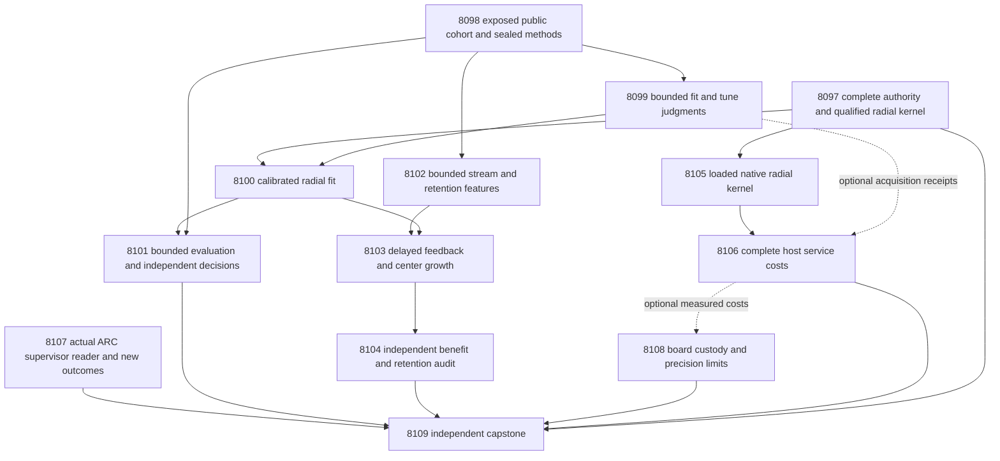

# Carnot Research Roadmap v701 — Measured radial decisions and feedback-grown energy memory

**Created:** 2026-10-04 UTC. **Milestone:** 2026.10.701.
**Status:** Proposed; staged for conductor review, not activated.
**Supersedes:** scheduling for completed milestone 2026.10.700.
**Informed by:** research-program.md, PRD, architecture, operational history,
completed experiments, prior proposals, exclusion records and the V701 literature scan.

The exact contract contains **13 tasks, Exp8097 through Exp8109**, in that order.
The four phases contain **3, 3, 4 and 3 tasks**. The visible table, full executable
JSON and canonical digest below describe exactly `research-roadmap-next.yaml`.
The previous design remains byte-identical in
`research-roadmap-v700-preserved-20261004.md`.
IDs8086–8096 were promised by V700 but never scheduled; this plan does not reuse them.
The active `research-roadmap.yaml` and conductor source remain unchanged.

## What v700 proved

Completion means its actual schedule closed. It does not mean fourteen experiments ran.

| Experiment | Supported result | Planning consequence |
|---|---|---|
| Exp8083 | `complete_disqualified_research-roadmap-vNEXT_md`; readiness0. The design lacks the contract section. The active YAML contains3 tasks, while the design claims14. | Write and validate both full authorities before staging. Preserve the eleven unscheduled promises as history. |
| Exp8084 | `complete_blocked_available_history`; cohort readiness0;789 malformed-history operands;2515 known exclusions; zero selected groups. Its later worker repair preserved this scientific block. | Do not repeat a universal freshness scan as the prerequisite for all science. Declare exposed development explicitly. |
| Exp8085 | `complete_circular_positive_radial_memory_kernel`; readiness1;64 numerical systems; no natural sources. | Reuse the bounded numerical kernel, then qualify nonzero fitted-start admission before learning. |

The planning review found that Exp8085's existing commit helper uses a zero
initial vector in its guard. Its fixture qualification does not cover admission
against a trained initial head. Exp8100/8103 must add that distinct regression.

V699 remains the last natural-data evidence. Exp8074 found cost gain0.005263
on95 sources with one beneficial change. Exp8077 found zero projected-learning
gain on88 sources. These are useful negatives, not evidence for radial learning.
Exp8080 blocked on a nonexistent supervisor module path. Exp8078/8079 measured
host cache modes; neither establishes complete-service acceleration.

## Three biggest gaps against the PRD

1. **Useful independent verification, FR-06/12.** Existing heads do not provide
   qualified independent decision benefit. Test whether radial geometry improves
   source-grounded accept/reject/escalate decisions at matched information.
   This development milestone cannot close GAP-ORACLE-DISTINCT.
2. **Learning that improves future behavior, FR-11.** Changed weights and valid
   checkpoints have not improved later decisions. Test addition of local centers
   from released errors, with matched capacity, admission evidence and retention.
3. **Measured deployment value, FR-05/08 and NFR-01.** Cheap arithmetic does not
   imply cheap verification. Port the new kernel through a real Rust binding and
   account for feature gathering, model acquisition, fallback and durable writes.

The learned energy estimates compatibility. Incomplete extraction does not make
it mathematical ground truth. Hardware and generalization claims stay scoped
to measured evidence. All tasks retain `generalized_learning_benefit_score=0`.

## Research recorded before design

The V701 entry in `research-references.md` was appended before this design.
It covers all eight requested arXiv topics and every secondary channel.
OpenReview challenged direct access. Semantic Scholar citation endpoints failed.
GitHub Trending returned cached pages. This is not an exhaustive novelty search.

| Source | Concrete use or reason to defer |
|---|---|
| [Evidence alignment, August2026](https://arxiv.org/abs/2608.15804) | Exp8099 measures source dependence with duplicate, removed and mismatched controls. No claim to reproduce its trained encoder. |
| [KAC,2025](https://arxiv.org/html/2503.21076v1) and [author code](https://github.com/Ethanhuhuhu/KAC) | Exp8100/8103 test local radial features. KAC uses univariate channels; the Carnot kernel uses multivariate distances. |
| [KAN forgetting,2025](https://arxiv.org/abs/2511.12828) | Exp8104 tests retention explicitly; locality is not a guarantee. |
| [Delayed learning,2026](https://arxiv.org/abs/2602.02634), [finite capacity,2026](https://arxiv.org/abs/2606.11711) | Exp8103/8104 retain issuing states, releases, pending capacity and lost labels. Their regret theorems do not cover this changing-basis policy. |
| [EBT](https://arxiv.org/abs/2507.02092), [ARM–EBM](https://arxiv.org/abs/2512.15605) | Exp8100 uses exact logistic equivalence and equal-information controls. |
| [LagONN](https://arxiv.org/abs/2505.07179), [ETS](https://arxiv.org/abs/2601.21484) | Defer new solver and decoding branches until verifier utility exists. |
| [Sparse Ising connectivity](https://arxiv.org/abs/2503.01177), [Z1T](https://extropic.ai/writing/z1t/) | Exp8108 separates numerical mapping, transfer and full workload costs. No local TSU execution follows. |
| [Bi'anBench](https://arxiv.org/html/2502.19209v1) | Deferred corpus lead. Its synthesized labels cannot silently replace independent human evaluation. |
| [Kona1.0](https://logicalintelligence.com/kona) | Architectural context only; no reproducible method was established. |

## Architecture



Public capture workers receive source and answer bytes only. The evaluator owns
human annotations. Training opens fit and tune labels only. Online updates receive
labels after release. Retention labels open after final states and predictions seal.
The authority task does not become a global GPU prerequisite. Its kernel gate
protects only consumers that need that kernel. ARC, cohort and board work are independent.

## Phase 1 — Bind authority and collect fit evidence (Exp8097–8099)

**Exp8097** binds the complete thirteen-task contract and preserves the three
actual V700 dispositions. It separately qualifies the numerical kernel. Private
activation tests accept a removed staged pathname only with matching active authority.

**Exp8098** records the literature methods and freezes the development protocol.
It changes the claim from historically fresh evidence to explicitly exposed data.
It tests within-run separation without changing Exp8084 or claiming its history
scan passed. Its private prototype rejects label leakage and duplicate roles.

**Exp8099** captures192 fit/tune judgments and96 extra control calls on32 fit
sources. Complete public sources remain intact in the primary arm. Identical,
removed and mismatched sources test source use. Control results cannot change
fit selection or the registered feature set. Changed sources have no inherited
human correctness label. Qualified null transport can pass readiness.

## Phase 2 — Train decisions and seal the later stream (Exp8100–8102)

**Exp8100** fits scalar, linear, additive and radial heads with identical input
information. Independent logistic code checks energy equivalence. A nonzero
fitted-start regression defines the baseline required by subsequent admission.

**Exp8101** captures128 evaluation judgments, commits every head's prediction,
then opens the human targets in a separate evaluator. It tests the registered
radial-versus-additive question. Training aggregates cannot supply its answer.

**Exp8102** captures256 stream and64 retention judgments in one bounded batch.
It preserves missing slots and their original clocks. Its readiness needs valid
transport, not a positive static decision result. Private CLI tests exercise
interrupted capture, excluded responses and cold replay.

## Phase 3 — Learn, audit and measure the native path (Exp8103–8106)

**Exp8103** qualifies the fitted-reference guard before temporal replay. It adds
centers from past errors and compares fixed and random-past alternatives.
All adaptive arms install the same center count at common opportunities.
Rejected coefficient updates retain zero-weight new centers. Record actual
active coefficients too. The estimand is the full selection-and-admission policy.

**Exp8104** independently reconstructs issued states, delayed labels and later
cost. It tests retention and crash recovery with separate reads. Small-panel
compatibility is not a guarantee of no forgetting.

**Exp8105** ports radial evaluation, gradients and state serialization through
an actually loaded PyO3 extension. Fixture-only parity is circular-positive.
It can run without the data branch or a positive learning result.

**Exp8106** compares complete host transactions across six cache lifecycle modes.
It joins available current model receipts separately. A composed estimate is
labeled as such; it is not called a directly measured end-to-end latency.

## Phase 4 — Preserve independent obligations and decide (Exp8107–8109)

**Exp8107** resolves the real supervisor reporting module through its CLI.
It qualifies the reader on private fixtures. Refinement requires new authenticated
redirect outcomes. Qualified no-new-outcomes is a terminal null; a missing
historical frontier is blocked. No live policy or game changes are planned.

**Exp8108** preserves each board's actual evidence independently. It tests
radial quantization on CPU and bounds possible full-service acceleration.
A missing service-cost input does not erase valid per-board custody.

**Exp8109** accounts for every scheduled disposition and independently reduces
scientific rows. It computes stable publication gates separately. It recommends
independent data acquisition only after a promising development mechanism.
The capstone has no positive-science gate and runs even after blocked branches.

Each phase has an executable prototype, empirical checks and adversarial mutations.
Tests run in private temporary storage. No experiment executes during this plan.

## Frozen data and numerical protocol

**Population and exposure.** Use official RAGTruth training responses. The split
field lives on response rows. A public-metadata check found2515 train source IDs
before normalization. All are treated as previously exposed development data.
This is a changed, narrower research claim; Exp8084's block remains valid.

Render complete structured sources through the existing public-source reader.
Normalize rendered text with NFKC, casefold and collapsed whitespace. Join source
IDs and exact normalized hashes, then connected components of five-token-shingle
Jaccard>=.8. Keep an entire connected component in one role. Select one response
by smallest SHA256 of `V701-response` plus response ID among train responses in
the component. Break hash ties by source ID then response ID. Lowest numeric ID
is forbidden: it picks `gpt-4-0613` on every training source in this checkout.

Order components by SHA256 of `V701` plus their smallest normalized source bytes.
Select the first640 public-complete components. Assign consecutive roles fit128,
tune64,evaluation128,stream256,retention64. Freeze public model and task-type
counts. No outcome, label, quality field or parser success selects a replacement.
Reject malformed public sources before selection with an explicit reason.
After selection, exclusions keep their original slots and denominators.

The evaluator maps complete human span annotations to unsupported status.
Absent or incomplete annotation status is unknown, never a negative label.
Require fit>=96 with>=16 per class and tune>=48 with>=8 per class before GPU
capture. Only aggregate support booleans pass to capture workers. The evaluation
and learning support rules below cannot be repaired through label-based resampling.

**Features and fitting.** The input is nine dimensional: Qwen unsupported-risk
logit plus eight Exp7980 public lexical features. Clip the parsed probability
only for the logit transform to [1e-6,1-1e-6], recording clipped rows. Fit mean
and standard deviation on fit data; replace zero standard deviation with one.
Compute geometry inside each of four source-group fit folds.

Fit scalar Qwen-only, linear nine-feature, additive spline and radial heads.
Reuse the established additive basis with its exact basis configuration sealed
in Exp8098. Radial phi_j(x)=exp(-||x-c_j||²/(2*sigma²)). Select16 initial centers
by deterministic farthest-first traversal with fit-source-hash ties; reserve the
next12 fit centers. Sigma is the median positive fit pair distance, or1 if none.
Ridge is selected from [0.0001,0.001,0.01,0.1,1] by mean fit-fold log loss;
choose the largest tied ridge. Exclude intercept from the ridge penalty.
Use at most256 optimizer iterations and600 seconds per fit, with finite
parameters/objective and gradient infinity norm<=1e-7. Incomplete convergence
is not qualified fitting. Do not increase budgets after seeing evaluation results.

Tune alone fits affine logit calibration, including the same calibration step
for every arm. Seal raw and calibrated coefficients. Equivalent logistic code
must reproduce p(unsupported)=sigmoid(f), with E0=0 and E1=-f, within1e-10.
Costs are accept=5*y, reject=1-y and escalate=.5. Choose minimum expected cost;
ties escalate. Always-escalate is an explicit reference. No source intervention
feature enters the preregistered heads.

**Model work.** Only Exp8099,8101,8102 need an LLM. Each includes
`unsloth/Qwen3.8-27B-GGUF` in MODEL_SPECS. Use the cached GGUF and embedded
tokenizer through llama.cpp, with current CUDA offload and owned GPU receipts.
Each call uses the qualified96-token bounded-judgment contract and a120-second
limit. The task caps are288,128,320 calls respectively:736 calls and70656 output
tokens maximum across the milestone. No retries or replacement of started calls.
Resume only unstarted slots under immutable manifests. Context overflow is an
exclusion; never silently truncate evidence. The three tasks are all
`model_bounded_generation` with a10-second floor. No task claims full generation.
Embedding-only or load-only work would require `model_load_no_generation` with
its2-second floor, but no such task is scheduled. Other tasks declare no_model_load.

**Online experiment.** Freeze features before temporal replay. Event order is:
prediction issue and durable commit; candidate commitment at an opportunity;
selection of future admission slots; label release; admission; durable update.
Feedback releases at original slot+20. Missing slots do not compress time.
Pending capacity is32; an unexpected overflow evicts the oldest pending item,
records permanent feedback loss and disqualifies a claim of lossless execution.

Source-ID SHA256 modulo4 assigns admission-only bucket0 and update-only others.
The first64 slots are burn-in. Use opportunities64,128,192, with newest64
released update rows,>=16 available updates and>=4 frozen-head issued errors.
Shared error eligibility determines whether every adaptive arm adds4 centers.
Controls use the reserved fit centers or seeded label-blind past rows. Record
duplicate centers and effective rank; do not conceal degeneracy or add substitutes.
All installed counts match. Append zero coefficients before computing candidates.
The frozen arm retains its original16 centers and never updates.

Each adaptive arm takes four mean-loss SGD steps with eta=.05 and its fit-selected
ridge from its own current coefficients. The global compute budget is1200 seconds.
Commit candidates before selecting the next12 unused admission rows with release
strictly after commitment. Require>=2 per class. All arms share these labels and
wait for the same release slot. A block must finish before the next opportunity
and by slot256; otherwise the whole opportunity defers without label replacement.
Test alpha=[1,.5,.25,.125], selecting the largest passing step. Passing means no
extra false accepts, cost and Brier no worse than incumbent, and cost<=fitted
baseline+.02 and Brier<=fitted baseline+.01 on the admission block. The baseline
uses immutable fitted coefficients with zero padding for new centers. Admission
checks are empirical guards, not independent certification of safety.

Rejected candidates retain old coefficients and zero-weight installed centers.
Persist all pending observations, center identities, weights and used admission
IDs. Seeds101..120 quantify algorithm variability; they are not new data.
Final heads and retention predictions commit before retention labels open.

## Hypotheses, support and decision rules

H1 is radial minus additive typed-decision utility on128 reserved source slots.
H2 is error-center minus fixed-center utility on original stream slots65..256.
Positive gain means control cost minus treatment cost. Minimize cost and Brier.
These are exposed-development diagnostics, not confirmatory population tests.

| Rule | H1 | H2 |
|---|---|---|
| Required support | >=96 complete sources;>=12/class | >=128 complete paired sources;>=8/class;>=8 nonoverlapping16-slot blocks with usable rows |
| Primary effect | Cost-gain97.5% one-sided bootstrap lower bound>.02 | Same gain rule with moving-block bootstrap |
| Useful action changes | >=5 beneficial sources; zero extra false accepts | Same |
| Calibration | Brier increase<=.01 | Report issued-state Brier; retention rules also apply |
| Other controls | Scalar, linear, equivalent logistic, always-escalate | Random-past and frozen; cost increase<=.02 against each |
| Retention | Not a learning claim | >=48 sources;>=8/class; empirical cost increase<=.02 and Brier increase<=.01 versus frozen; no extra false accepts |

Use10000 deterministic bootstrap draws. H1 resamples source groups. H2 averages
seeds within source before moving-block resampling of original slots, primary
block16 and sensitivities8,32. Keep missing masks inside blocks. A draw with no
eligible rows is invalid and remains counted; fewer than9500 valid draws blocks
the interval. The two97.5% one-sided bounds are a conservative two-question
screen. Prior corpus exposure prevents interpreting their nominal coverage as
independent confirmation. Report effect sizes and all harms even when gates fail.

Retention intervals are descriptive. The64-source panel does not prove rare-event
safety or general absence of forgetting. Compute class support and achievable
precision explicitly. Generalized and independent-generalization scores remain0.
A failed scientific effect is null. Missing external inputs are blocked. Failed
owned validation is disqualified. Only unfinished owned work is partial.

## Dependency graph and gate semantics

Solid diagram edges are readiness gates. Exp8100 also needs qualified Exp8085
kernel custody from Exp8097. Exp8101 needs Exp8098 cohort and Exp8100 fit.
Exp8102 needs only Exp8098 cohort. Exp8103 needs fit and stream capture readiness.
Exp8104 needs trajectory readiness. Exp8105 needs numerical kernel custody.
Exp8106 needs native-kernel readiness. Other cost and board joins are optional
subresults with explicit `gate_check_summary` diagnostics. Exp8107–8109 have no
upstream structured gates. All structured gates refer to earlier V701 tasks and
fields named in their upstream REQUIRED ARTIFACT FIELDS.

Readiness means a usable measured input, including valid null science. It never
requires a positive effect. This prevents fixture-class and scientific-null
cascade failures. The canonical task list below is the exact executable graph.

## Hardware requirements and budget

| Tasks | Resources | Planned wall time | Claim boundary |
|---|---|---|---|
| 8097–8098 | CPU, RAM, local source files | 25/35min | Authority and exposed-development methods |
| 8099/8101/8102 | One available CUDA RTX3090, cached Qwen GGUF; second3090 optional for capacity | 60/45/65min | Current bounded generation receipts; no small-model headline fallback |
| 8100/8103/8104 | CPU numerical libraries, bounded memory dictionary | 45/50/35min | Small heads and finite temporal replay |
| 8105–8106 | CPU, Rust/PyO3 toolchain | 45/40min | Loaded native path and matched host service |
| 8107–8109 | CPU, immutable result and board receipts | 25/25/30min | No new board, game or model execution |

Total planning allowance:525 minutes across13 tasks; no individual task targets
the4800-second hard cap. Inference workers stop launching calls at3150 seconds.
Every long phase and child reports real progress at least every60 seconds.
Every silence gap stays below600 seconds. Every file over about200 lines is
written in several tool calls, with a progress message between them.

Existing hardware suffices. Preserve KV260 fabric scope with k_max<=5, PolarFire
Linux CPU-only evidence and GateMate's physical/JTAG block separately. No identical
board probes, purchase, TSU access claim or NPU setup is planned. CPU precision
work does not establish an FPGA speedup. Future FPGA distance/LUT evaluation and
batched GPU updates need a measured mapping before the100x aspiration is credible.
Exp8108 calculates the Amdahl bound from measured non-arithmetic costs.

## Validation, retirement and publication boundaries

Planning validation must check YAML schema, all13 IDs and titles, full JSON equality,
canonical digest, prior-failure entries, gate targets, read paths and prompt rules.
Use existing authority lifecycle private E2E tests and source/evaluator boundary
checks. Do not run historical publishing CLIs against their default results paths.
Preserve any current global test/spec debt; a scoped pass is not a global pass.

Execution uses spec first, tests first and current owned validation. Every new
artifact includes a terminal verdict, closed verdict class, per-unit rows,
principle-annotated fields, substrate declaration and exact failed gate operands.
All prompts demand flushed progress and bounded tool writes. No prompt changes
`scripts/research_conductor.py` or authorizes a push.

Scope matches carry complete prior_failures entries. Standing May29 overrides
apply only to the documented transition, changed lineage and hardware-continuity
cases. No retired experiment is a `requires` or `gated_on` dependency. Exp8107
respects the new-outcome reopening condition. No retired external-text reranking,
energy-as-generator, HardNet repair or per-game solve branch is reopened.

The capstone records stable G1–G4, paper_ready and unmet_gates from the existing
publication tool, with its evidence scope. It leaves independent verifier and
lifelong-learning gaps open. All publication remains operator-only. A promising
finite development result justifies new independent human evidence; a null
retires this unchanged radial configuration rather than another parameter rerun.

## Exact task contract

| Order | ID | Title | Phase | Deliverable |
|---|---|---|---|---|
| 1 | `exp8097-contract-custody` | Bind thirteen tasks and preserve the three actual V700 outcomes | 1 | `results/experiment_8097_v701_contract_custody.json` |
| 2 | `exp8098-development-methods` | Seal exposed development sources and local-memory methods before outcomes | 1 | `results/experiment_8098_v701_development_methods.json` |
| 3 | `exp8099-fit-source-capture` | Capture bounded Qwen fit scores and source-use controls | 1 | `results/experiment_8099_v701_fit_source_capture.json` |
| 4 | `exp8100-radial-energy-fit` | Train calibrated radial energies with equal-information controls | 2 | `results/experiment_8100_v701_radial_energy_fit.json` |
| 5 | `exp8101-development-decision-audit` | Measure reserved development decisions with current Qwen scores | 2 | `results/experiment_8101_v701_development_decision_audit.json` |
| 6 | `exp8102-learning-stream-capture` | Capture bounded stream and retention features without future labels | 2 | `results/experiment_8102_v701_learning_stream_capture.json` |
| 7 | `exp8103-feedback-grown-memory` | Test continuous learning by adding centers from released errors | 3 | `results/experiment_8103_v701_feedback_grown_memory.json` |
| 8 | `exp8104-learning-benefit-audit` | Independently audit later decisions retention and process recovery | 3 | `results/experiment_8104_v701_learning_benefit_audit.json` |
| 9 | `exp8105-native-radial-kernel` | Port bounded radial evaluation through an actual Rust binding | 3 | `results/experiment_8105_v701_native_radial_kernel.json` |
| 10 | `exp8106-radial-service-cost` | Measure full radial transactions and charged model acquisition | 3 | `results/experiment_8106_v701_radial_service_cost.json` |
| 11 | `exp8107-arc-supervisor-evidence` | Qualify the actual supervisor reader and inspect new redirect outcomes | 4 | `results/experiment_8107_v701_arc_supervisor_evidence.json` |
| 12 | `exp8108-radial-hardware-boundary` | Bound radial precision and preserve each board evidence boundary | 4 | `results/experiment_8108_v701_radial_hardware_boundary.json` |
| 13 | `exp8109-capstone` | Independently decide thirteen outcomes and the remaining PRD gaps | 4 | `results/experiment_8109_v701_capstone.json` |

Canonical full-task SHA-256: `7442fceecb78939ae8902583acac26434b1b9683f40605835ffff5e7caba90dd`

The JSON contains complete tasks, including prompts, routing, prior failures and gates.

<!-- V701_TASK_CONTRACT_START -->
```json
{
  "milestone": "2026.10.701",
  "tasks": [
    {"id":"exp8097-contract-custody","title":"Bind thirteen tasks and preserve the three actual V700 outcomes","phase":1,"track":"science","priority":"high","requires_gpu":false,"max_turns":100,"estimated_wall_time_min":25,"per_unit_rows":true,"milestone":"2026.10.701","deliverable":"results/experiment_8097_v701_contract_custody.json","inference_substrate_class":"no_model_load","MODEL_SPECS":[],"gated_on":[],"prior_failures":[{"experiment_id":"exp8083-contract-custody","verdict":"complete_disqualified_research-roadmap-vNEXT_md","addressed_by":"The complete thirteen-row table, full JSON and digest are written and checked before staging; use the parameterized immutable authority reader.","retire_if_same_verdict":true},{"experiment_id":"exp7992-contract-methods","verdict":"complete_blocked_authority","addressed_by":"Keep immutable staged and activated snapshots and test missing-stage lifecycle without reading the mutable live roadmap in fixtures.","retire_if_same_verdict":true}],"agent_type":"claude","model":"opus","operator_override":"2026-05-29 standing operator directive: routine milestone transition; exact scope matches exp7992 but complete V701 authority and immutable activation replace the failed mechanism.","prompt":"CONTEXT:\nWork in {project_root} on {date}. V700 scheduled only three tasks. Its truncated design claimed fourteen and failed its own contract. Preserve this discrepancy without rewriting history.\nEXISTING CODE TO READ FIRST:\nCLAUDE.md; CODEX.md; ops/e2e-test-plan.md; openspec/capabilities/research-reporting/spec.md; openspec/capabilities/verification/spec.md; scripts/experiment_template.py; python/carnot/reporting/current_work_receipt.py; python/carnot/reporting/primary_publication.py; ops/exclusion_manifest.yaml; openspec/change-proposals/research-roadmap-vNEXT.md; python/carnot/reporting/v685_authority_lifecycle.py; python/carnot/reporting/v700_contract_custody.py; results/experiment_8083_v700_contract_custody.json; results/experiment_8084_v700_fresh_cohort_methods.json; results/experiment_8085_v700_radial_memory_kernel.json\nTASK:\nBind thirteen tasks and preserve the three actual V700 outcomes. Deliver results/experiment_8097_v701_contract_custody.json, raw evidence under results/raw/experiment_8097_v701_contract_custody/ and runnable scripts/experiments/experiment_8097_v701_contract_custody.py.\nCONCRETE STEPS:\n0. PRECONDITIONS: emit a flushed start line. Check exact input paths, hashes, terminal sidecars and required tools with bounded calls. Record actual observations. Missing external resources end complete_blocked_<resource>, verdict_class=blocked. Name the check and observed operand in gate_check_summary. Never fabricate inputs.\n1. Emit a flushed progress line at every phase boundary and before and after any model load, generation, benchmark or subprocess. Set PYTHONUNBUFFERED=1 and use print(..., flush=True). Report real completed and pending units inside long loops and while children run at least every 60 seconds. Keep every silence gap below 600 seconds. Bound individual tool calls. Write any file over about 200 lines in several tool calls of at most about 150 lines. Send a progress message between calls. Never pad duration or invent progress.\n2. Read the V701 design and named sources. Add applicable REQ-* and SCENARIO-* requirements before implementation. Write failing tests first. Reuse qualified helpers and a thin experiment CLI. Keep tests and fixtures in private temporary directories. Preserve original assertions, historical primaries and failed receipts.\n3. Bind all thirteen V701 rows, full executable JSON and canonical full-task digest to immutable design and staged snapshots. At activation require matching active bytes. Do not require the staged pathname to survive activation. Parameterize the existing authority reader; do not copy a whole validation stack.\n4. Authenticate and preserve the three actual V700 terminal primaries and their failed or passing receipts. Record the eleven promised but unscheduled IDs8086-8096 as unexecuted scope, not completed experiments. Export contract_ready_score independently of historical scientific validity.\n5. Qualify the actual Exp8085 public kernel input and immutable historical control paths separately. A circular_positive fixture can have kernel_ready_score=1. A consumer must not require a positive science class for fixture readiness. Exercise all twelve E2E-018 authority mutations and missing-stage activation with private files.\n6. Freeze required validation commands before measurement. Run focused unit and consumer tests, Ruff check and format, strict mypy, 100% changed-code statement coverage and scoped spec coverage. Run the named private real CLI success, blocked, mutation and cold-replay checks from outside the checkout. Capture argv, normal exit, duration and log hash. Native edits also require cargo test, fmt, clippy and the actually loaded binding. Record global health failures separately; do not rerun a huge suite as a scientific precondition.\n7. Save primitive rows, denominators, exclusions, input/code/config hashes and phase timings. Recompute reductions independently. Run scripts/adversarial_verify.py and strict scripts/verdict_row_consistency_lint.py. Publish with primary_publication only after normal exit and passing owned checks. Owned validation failure sets readiness=0 and verdict_class=disqualified. Unchanged external blocks are blocked, not partial. Reconcile openspec/, _bmad/traceability.md, ops/status.md and ops/changelog.md without deleting history.\nREQUIRED ARTIFACT FIELDS:\n- honest_verdict: terminal complete_* string; principle: completed negative science must not trigger retries.\n- verdict_class: positive | circular_positive | null | blocked | disqualified | partial; principle: partial means unfinished owned work; missing or blocked upstream evidence is terminal blocked.\n- verifier_is_oracle, claim_scope, exposure_scope, generalized_learning_benefit_score: 0; principle: fixture success and exposed development cannot close independent generalization gaps.\n- flagged_adversarial, required_checks_passed, validation_receipts, terminal_validation_sidecar_path; principle: readiness needs authenticated current checks.\n- preconditions_checked, gate_check_summary: check/upstream/path/hash/field/op/expected/observed; principle: every blocked result identifies the failed check and actual value.\n- inference_substrate, inference_substrate_class, MODEL_SPECS, model_invocation_counts, trained_head_specs; principle: current model work is distinct from cited historical provenance.\n- rows: source_id/unit_id/arm/condition/issued_state/metric/numerator/denominator/status/exclusion_reason; principle: comparative claims must reduce from individual observations.\n- intended_count, eligible_count, independent_count, completed_count, excluded_count, censored_count, failed_count, sample_size_budget; principle: repetitions and seeds do not create independent sources.\n- duration_s, random_seed, reproducibility_checksum, source_artifact_hashes, raw_shard_hashes, code_config_hashes, phase_spans; principle: measurements bind to real time and exact bytes.\n- acceptance_gates, field_principles; principle: each extra field and gate explains which incorrect inference it prevents.\n- contract_ready_score, radial_kernel_ready_score: 0|1; principle: scheduling authority and numerical kernel readiness have independent failure causes.\n- canonical_tasks_sha256, authority_snapshots, historical_dispositions, promised_but_unscheduled_ids; principle: the design cannot invent experiments the conductor never scheduled.\n- inference_substrate=aggregation_from_upstream_artifacts or verifier_ensemble_against_cached_candidates as actually executed; inference_substrate_class=no_model_load; MODEL_SPECS=[]; no current LLM call. principle: the duration floor must describe the actual work.\nRun command: cd {project_root} && JAX_PLATFORMS=cpu PYTHONUNBUFFERED=1 .venv/bin/python -u scripts/experiments/experiment_8097_v701_contract_custody.py --date {date}\nDo NOT push. Do NOT modify scripts/research_conductor.py."},
    {"id":"exp8098-development-methods","title":"Seal exposed development sources and local-memory methods before outcomes","phase":1,"track":"science","priority":"high","requires_gpu":false,"max_turns":50,"estimated_wall_time_min":35,"per_unit_rows":true,"milestone":"2026.10.701","deliverable":"results/experiment_8098_v701_development_methods.json","inference_substrate_class":"no_model_load","MODEL_SPECS":[],"gated_on":[],"prior_failures":[{"experiment_id":"exp8084-fresh-cohort-methods","verdict":"complete_blocked_available_history","addressed_by":"Replace the impossible universal-freshness requirement with an explicitly exposed within-run source-disjoint development study; preserve the old blocked result and keep independent-generalization credit at zero.","retire_if_same_verdict":true}],"prompt":"CONTEXT:\nWork in {project_root} on {date}. V700 had no qualified fresh cohort. V701 explicitly studies previously exposed development data. A new within-run split cannot establish historical or pretraining independence.\nEXISTING CODE TO READ FIRST:\nCLAUDE.md; CODEX.md; ops/e2e-test-plan.md; openspec/capabilities/research-reporting/spec.md; openspec/capabilities/verification/spec.md; scripts/experiment_template.py; python/carnot/reporting/current_work_receipt.py; python/carnot/reporting/primary_publication.py; ops/exclusion_manifest.yaml; openspec/change-proposals/research-roadmap-vNEXT.md; research-references.md; research-studying.md; python/carnot/verify/development_cohort_7994.py; python/carnot/verify/response_targets_7955.py; python/carnot/verify/evidence_features_7980.py; python/carnot/verify/radial_memory_8085.py; data/ragtruth/source_info.jsonl; data/ragtruth/response.jsonl; results/experiment_8084_v700_fresh_cohort_methods.json\nTASK:\nSeal exposed development sources and local-memory methods before outcomes. Deliver results/experiment_8098_v701_development_methods.json, raw evidence under results/raw/experiment_8098_v701_development_methods/ and runnable scripts/experiments/experiment_8098_v701_development_methods.py.\nCONCRETE STEPS:\n0. PRECONDITIONS: emit a flushed start line. Check exact input paths, hashes, terminal sidecars and required tools with bounded calls. Record actual observations. Missing external resources end complete_blocked_<resource>, verdict_class=blocked. Name the check and observed operand in gate_check_summary. Never fabricate inputs.\n1. Emit a flushed progress line at every phase boundary and before and after any model load, generation, benchmark or subprocess. Set PYTHONUNBUFFERED=1 and use print(..., flush=True). Report real completed and pending units inside long loops and while children run at least every 60 seconds. Keep every silence gap below 600 seconds. Bound individual tool calls. Write any file over about 200 lines in several tool calls of at most about 150 lines. Send a progress message between calls. Never pad duration or invent progress.\n2. Read the V701 design and named sources. Add applicable REQ-* and SCENARIO-* requirements before implementation. Write failing tests first. Reuse qualified helpers and a thin experiment CLI. Keep tests and fixtures in private temporary directories. Preserve original assertions, historical primaries and failed receipts.\n3. Ingest evidence alignment2608.15804, KAC2503.21076, forgetting2511.12828, delayed-feedback2602.02634 and capacity2606.11711 from primary sources. Record differences from the actual multivariate radial kernel. Mark the matching research-studying entries ingested. Do not transfer paper guarantees.\n4. Project only public train-split metadata, response text and complete rendered source bytes. The official split lives on response rows. Group by source identity plus normalized source content and five-token-shingle connected components at Jaccard>=.8. Sort clusters by SHA256(V701 plus normalized source bytes). Select one response per cluster by smallest SHA256(V701-response plus response_id), using public bytes only. Freeze generator and task-type strata. Do not use lowest numeric response ID: all2515 train groups select GPT-4 under that rule.\n5. Seal exactly640 source clusters with roles fit128,tune64,evaluation128,stream256,retention64 before decoding labels. Build evaluator-only complete human targets with original span custody. Do not inspect quality or annotation fields for selection. Preserve every excluded or unknown slot without replacement. Known prior exposure is declared, not an eligibility filter. Unknown history cannot become a freshness claim. Insufficient public clusters block data work only.\n6. Freeze all numerical, timing, feedback and statistical rules from the design. Export cohort_ready_score after public/evaluator separation passes. Export fit_support_ready_score separately after evaluator counts meet fit96 with16/class and tune48 with8/class; downstream label-blind capture sees only this boolean. Other role support is diagnostic until its own audit. Compute worst-case precision bounds before GPU work;64 retention groups cannot certify rare-event safety.\n7. Qualify E2E-015/019 private label-contamination, cross-role duplicate, structured-source rendering, source-hash collision, absent-label and immutable role tests. Do not repair or overwrite Exp8084. Record its789 malformed-history observations and2515 exclusions as historical operands, not proof that source data vanished.\n8. Freeze required validation commands before measurement. Run focused unit and consumer tests, Ruff check and format, strict mypy, 100% changed-code statement coverage and scoped spec coverage. Run the named private real CLI success, blocked, mutation and cold-replay checks from outside the checkout. Capture argv, normal exit, duration and log hash. Native edits also require cargo test, fmt, clippy and the actually loaded binding. Record global health failures separately; do not rerun a huge suite as a scientific precondition.\n9. Save primitive rows, denominators, exclusions, input/code/config hashes and phase timings. Recompute reductions independently. Run scripts/adversarial_verify.py and strict scripts/verdict_row_consistency_lint.py. Publish with primary_publication only after normal exit and passing owned checks. Owned validation failure sets readiness=0 and verdict_class=disqualified. Unchanged external blocks are blocked, not partial. Reconcile openspec/, _bmad/traceability.md, ops/status.md and ops/changelog.md without deleting history.\nREQUIRED ARTIFACT FIELDS:\n- honest_verdict: terminal complete_* string; principle: completed negative science must not trigger retries.\n- verdict_class: positive | circular_positive | null | blocked | disqualified | partial; principle: partial means unfinished owned work; missing or blocked upstream evidence is terminal blocked.\n- verifier_is_oracle, claim_scope, exposure_scope, generalized_learning_benefit_score: 0; principle: fixture success and exposed development cannot close independent generalization gaps.\n- flagged_adversarial, required_checks_passed, validation_receipts, terminal_validation_sidecar_path; principle: readiness needs authenticated current checks.\n- preconditions_checked, gate_check_summary: check/upstream/path/hash/field/op/expected/observed; principle: every blocked result identifies the failed check and actual value.\n- inference_substrate, inference_substrate_class, MODEL_SPECS, model_invocation_counts, trained_head_specs; principle: current model work is distinct from cited historical provenance.\n- rows: source_id/unit_id/arm/condition/issued_state/metric/numerator/denominator/status/exclusion_reason; principle: comparative claims must reduce from individual observations.\n- intended_count, eligible_count, independent_count, completed_count, excluded_count, censored_count, failed_count, sample_size_budget; principle: repetitions and seeds do not create independent sources.\n- duration_s, random_seed, reproducibility_checksum, source_artifact_hashes, raw_shard_hashes, code_config_hashes, phase_spans; principle: measurements bind to real time and exact bytes.\n- acceptance_gates, field_principles; principle: each extra field and gate explains which incorrect inference it prevents.\n- cohort_ready_score, fit_support_ready_score: 0|1; principle: public separation and usable fit labels are distinct gates.\n- role_manifests, evaluator_label_manifests, response_selection_rule, public_model_strata, class_support, statistical_plan, method_source_map; principle: no outcome may steer selection or redefine the registered question.\n- exposure_scope: exposed_development_within_run_disjoint; independent_generalization_score: 0; principle: reused corpus access cannot establish an unseen-corpus result.\n- inference_substrate=aggregation_from_upstream_artifacts or verifier_ensemble_against_cached_candidates as actually executed; inference_substrate_class=no_model_load; MODEL_SPECS=[]; no current LLM call. principle: the duration floor must describe the actual work.\nRun command: cd {project_root} && JAX_PLATFORMS=cpu PYTHONUNBUFFERED=1 .venv/bin/python -u scripts/experiments/experiment_8098_v701_development_methods.py --date {date}\nDo NOT push. Do NOT modify scripts/research_conductor.py."},
    {"id":"exp8099-fit-source-capture","title":"Capture bounded Qwen fit scores and source-use controls","phase":1,"track":"science","priority":"high","requires_gpu":true,"max_turns":50,"estimated_wall_time_min":60,"per_unit_rows":true,"milestone":"2026.10.701","deliverable":"results/experiment_8099_v701_fit_source_capture.json","inference_substrate_class":"model_bounded_generation","MODEL_SPECS":["unsloth/Qwen3.8-27B-GGUF"],"gated_on":[{"upstream":"exp8098-development-methods","artifact_field":"cohort_ready_score","op":"==","value":1},{"upstream":"exp8098-development-methods","artifact_field":"fit_support_ready_score","op":"==","value":1}],"prior_failures":[{"experiment_id":"exp8059-fit-source-scoring","verdict":"complete_disqualified_fit_source_scoring","addressed_by":"Use qualified bounded judgment transport instead of unstable supplied-answer likelihood; freeze new exposed-development roles and keep source effects diagnostic.","retire_if_same_verdict":true}],"prompt":"CONTEXT:\nWork in {project_root} on {date}. Qualified bounded judgment transport avoids the disqualified duplicate-likelihood chain. Evidence-alignment research motivates checking whether the judge uses its source.\nEXISTING CODE TO READ FIRST:\nCLAUDE.md; CODEX.md; ops/e2e-test-plan.md; openspec/capabilities/research-reporting/spec.md; openspec/capabilities/verification/spec.md; scripts/experiment_template.py; python/carnot/reporting/current_work_receipt.py; python/carnot/reporting/primary_publication.py; ops/exclusion_manifest.yaml; openspec/change-proposals/research-roadmap-vNEXT.md; python/carnot/verify/qwen_development_capture_7995.py; python/carnot/verify/qwen_response_risk_7958.py; python/carnot/inference/sota_models.py; results/experiment_7995_v693_qwen_development_capture.json\nTASK:\nCapture bounded Qwen fit scores and source-use controls. Deliver results/experiment_8099_v701_fit_source_capture.json, raw evidence under results/raw/experiment_8099_v701_fit_source_capture/ and runnable scripts/experiments/experiment_8099_v701_fit_source_capture.py.\nCONCRETE STEPS:\n0. PRECONDITIONS: emit a flushed start line. Check exact input paths, hashes, terminal sidecars and required tools with bounded calls. Record actual observations. Missing external resources end complete_blocked_<resource>, verdict_class=blocked. Name the check and observed operand in gate_check_summary. Never fabricate inputs.\n1. Emit a flushed progress line at every phase boundary and before and after any model load, generation, benchmark or subprocess. Set PYTHONUNBUFFERED=1 and use print(..., flush=True). Report real completed and pending units inside long loops and while children run at least every 60 seconds. Keep every silence gap below 600 seconds. Bound individual tool calls. Write any file over about 200 lines in several tool calls of at most about 150 lines. Send a progress message between calls. Never pad duration or invent progress.\n2. Read the V701 design and named sources. Add applicable REQ-* and SCENARIO-* requirements before implementation. Write failing tests first. Reuse qualified helpers and a thin experiment CLI. Keep tests and fixtures in private temporary directories. Preserve original assertions, historical primaries and failed receipts.\n3. Use cached_current_model() and the current Qwen GGUF path with its embedded tokenizer through llama.cpp. MODEL_SPECS must include unsloth/Qwen3.8-27B-GGUF. Check CUDA support, actual offload, free memory and a process-owned GPU lease before loading; never stop an unrelated process. Keep model weights frozen. Save GGUF/runtime/chat-template hashes, raw prompts/completions, token counts and current call receipts. Use the qualified Exp7995 risk prompt/parser with its96-token maximum and120s per-call timeout. No retries of started calls and no small-model fallback. This is model_bounded_generation,10s floor, never full generation. Stop launching at3150s to leave time for validation; checkpoint unstarted slots with exact invocation scope. No sleeping to satisfy a floor.\n4. Capture one complete-source judgment for each of128 fit and64 tune slots. On the first32 fit slots by sealed hash order, also run one identical duplicate, one source-removed prompt and one cyclically mismatched source. Keep answer bytes fixed. Maximum288 calls and27648 output tokens. Mark truncation, timeout and invalid probability separately. Preserve all slots. Evaluator labels are unavailable to the worker.\n5. Use source interventions only as mechanistic diagnostics. Compare unsupported probabilities to identical-duplicate variation on32 paired units; report absolute full-minus-control differences and parse rates. Do not assign original human correctness labels to altered sources. Do not demand a nonzero source effect as transport readiness. Changed prompt shapes require a private stubbed transport test before model load.\n6. Export fit_capture_ready_score when hashes, roles, raw call receipts and current required checks pass, with>=96 eligible fit and>=48 eligible tune judgments. This readiness allows a null signal. Exercise private real CLI publication, interrupted-ledger recovery, malformed output, label-access rejection and cold replay.\n7. Freeze required validation commands before measurement. Run focused unit and consumer tests, Ruff check and format, strict mypy, 100% changed-code statement coverage and scoped spec coverage. Run the named private real CLI success, blocked, mutation and cold-replay checks from outside the checkout. Capture argv, normal exit, duration and log hash. Native edits also require cargo test, fmt, clippy and the actually loaded binding. Record global health failures separately; do not rerun a huge suite as a scientific precondition.\n8. Save primitive rows, denominators, exclusions, input/code/config hashes and phase timings. Recompute reductions independently. Run scripts/adversarial_verify.py and strict scripts/verdict_row_consistency_lint.py. Publish with primary_publication only after normal exit and passing owned checks. Owned validation failure sets readiness=0 and verdict_class=disqualified. Unchanged external blocks are blocked, not partial. Reconcile openspec/, _bmad/traceability.md, ops/status.md and ops/changelog.md without deleting history.\nREQUIRED ARTIFACT FIELDS:\n- honest_verdict: terminal complete_* string; principle: completed negative science must not trigger retries.\n- verdict_class: positive | circular_positive | null | blocked | disqualified | partial; principle: partial means unfinished owned work; missing or blocked upstream evidence is terminal blocked.\n- verifier_is_oracle, claim_scope, exposure_scope, generalized_learning_benefit_score: 0; principle: fixture success and exposed development cannot close independent generalization gaps.\n- flagged_adversarial, required_checks_passed, validation_receipts, terminal_validation_sidecar_path; principle: readiness needs authenticated current checks.\n- preconditions_checked, gate_check_summary: check/upstream/path/hash/field/op/expected/observed; principle: every blocked result identifies the failed check and actual value.\n- inference_substrate, inference_substrate_class, MODEL_SPECS, model_invocation_counts, trained_head_specs; principle: current model work is distinct from cited historical provenance.\n- rows: source_id/unit_id/arm/condition/issued_state/metric/numerator/denominator/status/exclusion_reason; principle: comparative claims must reduce from individual observations.\n- intended_count, eligible_count, independent_count, completed_count, excluded_count, censored_count, failed_count, sample_size_budget; principle: repetitions and seeds do not create independent sources.\n- duration_s, random_seed, reproducibility_checksum, source_artifact_hashes, raw_shard_hashes, code_config_hashes, phase_spans; principle: measurements bind to real time and exact bytes.\n- acceptance_gates, field_principles; principle: each extra field and gate explains which incorrect inference it prevents.\n- fit_capture_ready_score: 0|1; principle: transport validity cannot be confused with predictive improvement.\n- capture_manifest, raw_completion_hashes, context_complete, call_ledger, gpu_lease, cuda_offload_receipts; principle: declared SOTA use must correspond to owned current inference.\n- source_intervention_rows, duplicate_variation, source_effect_diagnostics; principle: altered evidence is a sensitivity test without inherited correctness labels.\n- inference_substrate=live_llm_inference; inference_substrate_class=model_bounded_generation (10s floor); MODEL_SPECS includes unsloth/Qwen3.8-27B-GGUF. Current CUDA receipts are mandatory. No full-generation claim. principle: the duration floor must describe the actual work.\nRun command: cd {project_root} && CARNOT_FORCE_LIVE=1 PYTHONUNBUFFERED=1 .venv/bin/python -u scripts/experiments/experiment_8099_v701_fit_source_capture.py --date {date}\nDo NOT push. Do NOT modify scripts/research_conductor.py."},
    {"id":"exp8100-radial-energy-fit","title":"Train calibrated radial energies with equal-information controls","phase":2,"track":"science","priority":"high","requires_gpu":false,"max_turns":50,"estimated_wall_time_min":45,"per_unit_rows":true,"milestone":"2026.10.701","deliverable":"results/experiment_8100_v701_radial_energy_fit.json","inference_substrate_class":"no_model_load","MODEL_SPECS":[],"gated_on":[{"upstream":"exp8097-contract-custody","artifact_field":"radial_kernel_ready_score","op":"==","value":1},{"upstream":"exp8099-fit-source-capture","artifact_field":"fit_capture_ready_score","op":"==","value":1}],"prior_failures":[{"experiment_id":"exp8074-interaction-decision-audit","verdict":"complete_null_interaction_decision_audit","addressed_by":"Replace interaction-only feature geometry with the qualified multivariate radial kernel, using new within-run roles, equal-information controls and frozen human evaluation.","retire_if_same_verdict":true}],"prompt":"CONTEXT:\nWork in {project_root} on {date}. V699 interaction decisions gained only0.005263 over95 sources. V700 qualified a radial numerical kernel but never fitted it to natural responses.\nEXISTING CODE TO READ FIRST:\nCLAUDE.md; CODEX.md; ops/e2e-test-plan.md; openspec/capabilities/research-reporting/spec.md; openspec/capabilities/verification/spec.md; scripts/experiment_template.py; python/carnot/reporting/current_work_receipt.py; python/carnot/reporting/primary_publication.py; ops/exclusion_manifest.yaml; openspec/change-proposals/research-roadmap-vNEXT.md; python/carnot/verify/radial_memory_8085.py; python/carnot/experiment_8085_v700_radial_memory_kernel.py; scripts/experiments/experiment_8073_v699_interaction_energy_fit.py; python/carnot/verify/evidence_features_7980.py\nTASK:\nTrain calibrated radial energies with equal-information controls. Deliver results/experiment_8100_v701_radial_energy_fit.json, raw evidence under results/raw/experiment_8100_v701_radial_energy_fit/ and runnable scripts/experiments/experiment_8100_v701_radial_energy_fit.py.\nCONCRETE STEPS:\n0. PRECONDITIONS: emit a flushed start line. Check exact input paths, hashes, terminal sidecars and required tools with bounded calls. Record actual observations. Missing external resources end complete_blocked_<resource>, verdict_class=blocked. Name the check and observed operand in gate_check_summary. Never fabricate inputs.\n1. Emit a flushed progress line at every phase boundary and before and after any model load, generation, benchmark or subprocess. Set PYTHONUNBUFFERED=1 and use print(..., flush=True). Report real completed and pending units inside long loops and while children run at least every 60 seconds. Keep every silence gap below 600 seconds. Bound individual tool calls. Write any file over about 200 lines in several tool calls of at most about 150 lines. Send a progress message between calls. Never pad duration or invent progress.\n2. Read the V701 design and named sources. Add applicable REQ-* and SCENARIO-* requirements before implementation. Write failing tests first. Reuse qualified helpers and a thin experiment CLI. Keep tests and fixtures in private temporary directories. Preserve original assertions, historical primaries and failed receipts.\n3. Use only eligible V701 fit and tune rows. Build nine features: one bounded Qwen unsupported-risk logit and eight qualified public lexical features. Fit scaling, centers and bandwidth only on fit data, inside each selection fold. Keep evaluation, stream and retention labels inaccessible.\n4. Train scalar, linear, additive-spline and multivariate-radial heads. Use the design ridge grid, source-group folds, convergence rule and calibration procedure. The radial head starts with16 centers and preserves12 reserved fit centers for the matched learning control. Add an exactly equivalent logistic implementation of each final energy parameterization; it is a parity control, not an independent scientific arm.\n5. Minimize binary cross entropy plus declared ridge. Check probability parity<=1e-10 and exact accept/reject/escalate decisions. Report fit and tune Brier, typed cost, convergence, saturation and parameter counts for all arms. Freeze heads and predictions before other labels open. No scalar-to-radial benefit is claimed from fit loss.\n6. Qualify actual nonzero fitted coefficients through the Exp8085 update interface. Its old commit path used a zero initial vector. Define the immutable fitted baseline for later admission explicitly and write a failing regression now. Export energy_fit_ready_score only when frozen-head and independent logistic parity checks pass. Exercise E2E-015/019 plus private real train/freeze/cold-replay routes.\n7. Freeze required validation commands before measurement. Run focused unit and consumer tests, Ruff check and format, strict mypy, 100% changed-code statement coverage and scoped spec coverage. Run the named private real CLI success, blocked, mutation and cold-replay checks from outside the checkout. Capture argv, normal exit, duration and log hash. Native edits also require cargo test, fmt, clippy and the actually loaded binding. Record global health failures separately; do not rerun a huge suite as a scientific precondition.\n8. Save primitive rows, denominators, exclusions, input/code/config hashes and phase timings. Recompute reductions independently. Run scripts/adversarial_verify.py and strict scripts/verdict_row_consistency_lint.py. Publish with primary_publication only after normal exit and passing owned checks. Owned validation failure sets readiness=0 and verdict_class=disqualified. Unchanged external blocks are blocked, not partial. Reconcile openspec/, _bmad/traceability.md, ops/status.md and ops/changelog.md without deleting history.\nREQUIRED ARTIFACT FIELDS:\n- honest_verdict: terminal complete_* string; principle: completed negative science must not trigger retries.\n- verdict_class: positive | circular_positive | null | blocked | disqualified | partial; principle: partial means unfinished owned work; missing or blocked upstream evidence is terminal blocked.\n- verifier_is_oracle, claim_scope, exposure_scope, generalized_learning_benefit_score: 0; principle: fixture success and exposed development cannot close independent generalization gaps.\n- flagged_adversarial, required_checks_passed, validation_receipts, terminal_validation_sidecar_path; principle: readiness needs authenticated current checks.\n- preconditions_checked, gate_check_summary: check/upstream/path/hash/field/op/expected/observed; principle: every blocked result identifies the failed check and actual value.\n- inference_substrate, inference_substrate_class, MODEL_SPECS, model_invocation_counts, trained_head_specs; principle: current model work is distinct from cited historical provenance.\n- rows: source_id/unit_id/arm/condition/issued_state/metric/numerator/denominator/status/exclusion_reason; principle: comparative claims must reduce from individual observations.\n- intended_count, eligible_count, independent_count, completed_count, excluded_count, censored_count, failed_count, sample_size_budget; principle: repetitions and seeds do not create independent sources.\n- duration_s, random_seed, reproducibility_checksum, source_artifact_hashes, raw_shard_hashes, code_config_hashes, phase_spans; principle: measurements bind to real time and exact bytes.\n- acceptance_gates, field_principles; principle: each extra field and gate explains which incorrect inference it prevents.\n- energy_fit_ready_score: 0|1; principle: a finite trained head is required before later decision claims.\n- head_manifest, fit_transform, center_manifest, calibration_manifest, convergence_rows, equivalent_logistic_rows, fitted_initial_state_sha256; principle: all learned choices and frozen-reference semantics must be recoverable.\n- inference_substrate=aggregation_from_upstream_artifacts or verifier_ensemble_against_cached_candidates as actually executed; inference_substrate_class=no_model_load; MODEL_SPECS=[]; no current LLM call. principle: the duration floor must describe the actual work.\nRun command: cd {project_root} && JAX_PLATFORMS=cpu PYTHONUNBUFFERED=1 .venv/bin/python -u scripts/experiments/experiment_8100_v701_radial_energy_fit.py --date {date}\nDo NOT push. Do NOT modify scripts/research_conductor.py."},
    {"id":"exp8101-development-decision-audit","title":"Measure reserved development decisions with current Qwen scores","phase":2,"track":"science","priority":"high","requires_gpu":true,"max_turns":50,"estimated_wall_time_min":45,"per_unit_rows":true,"milestone":"2026.10.701","deliverable":"results/experiment_8101_v701_development_decision_audit.json","inference_substrate_class":"model_bounded_generation","MODEL_SPECS":["unsloth/Qwen3.8-27B-GGUF"],"gated_on":[{"upstream":"exp8098-development-methods","artifact_field":"cohort_ready_score","op":"==","value":1},{"upstream":"exp8100-radial-energy-fit","artifact_field":"energy_fit_ready_score","op":"==","value":1}],"prior_failures":[{"experiment_id":"exp8074-interaction-decision-audit","verdict":"complete_null_interaction_decision_audit","addressed_by":"Evaluate radial geometry and a new sealed development panel with current bounded Qwen calls; retain prior exposure and do not rebrand a development result as independent generalization.","retire_if_same_verdict":true}],"prompt":"CONTEXT:\nWork in {project_root} on {date}. The evaluation source groups are disjoint within V701 but previously exposed to research. This task can establish a bounded development result only.\nEXISTING CODE TO READ FIRST:\nCLAUDE.md; CODEX.md; ops/e2e-test-plan.md; openspec/capabilities/research-reporting/spec.md; openspec/capabilities/verification/spec.md; scripts/experiment_template.py; python/carnot/reporting/current_work_receipt.py; python/carnot/reporting/primary_publication.py; ops/exclusion_manifest.yaml; openspec/change-proposals/research-roadmap-vNEXT.md; python/carnot/verify/qwen_development_capture_7995.py; python/carnot/verify/qwen_response_risk_7958.py; scripts/experiments/experiment_8074_v699_interaction_decision_audit.py; python/carnot/verify/response_targets_7955.py\nTASK:\nMeasure reserved development decisions with current Qwen scores. Deliver results/experiment_8101_v701_development_decision_audit.json, raw evidence under results/raw/experiment_8101_v701_development_decision_audit/ and runnable scripts/experiments/experiment_8101_v701_development_decision_audit.py.\nCONCRETE STEPS:\n0. PRECONDITIONS: emit a flushed start line. Check exact input paths, hashes, terminal sidecars and required tools with bounded calls. Record actual observations. Missing external resources end complete_blocked_<resource>, verdict_class=blocked. Name the check and observed operand in gate_check_summary. Never fabricate inputs.\n1. Emit a flushed progress line at every phase boundary and before and after any model load, generation, benchmark or subprocess. Set PYTHONUNBUFFERED=1 and use print(..., flush=True). Report real completed and pending units inside long loops and while children run at least every 60 seconds. Keep every silence gap below 600 seconds. Bound individual tool calls. Write any file over about 200 lines in several tool calls of at most about 150 lines. Send a progress message between calls. Never pad duration or invent progress.\n2. Read the V701 design and named sources. Add applicable REQ-* and SCENARIO-* requirements before implementation. Write failing tests first. Reuse qualified helpers and a thin experiment CLI. Keep tests and fixtures in private temporary directories. Preserve original assertions, historical primaries and failed receipts.\n3. Use cached_current_model() and the current Qwen GGUF path with its embedded tokenizer through llama.cpp. MODEL_SPECS must include unsloth/Qwen3.8-27B-GGUF. Check CUDA support, actual offload, free memory and a process-owned GPU lease before loading; never stop an unrelated process. Keep model weights frozen. Save GGUF/runtime/chat-template hashes, raw prompts/completions, token counts and current call receipts. Use the qualified Exp7995 risk prompt/parser with its96-token maximum and120s per-call timeout. No retries of started calls and no small-model fallback. This is model_bounded_generation,10s floor, never full generation. Stop launching at3150s to leave time for validation; checkpoint unstarted slots with exact invocation scope. No sleeping to satisfy a floor.\n4. Capture one complete-source judgment on each of128 sealed evaluation slots, maximum128 calls and12288 output tokens. Freeze all arm probabilities and typed actions using the already-frozen heads before the evaluator opens labels. Keep malformed or context-incomplete slots as exclusions; never replace them.\n5. Reduce full-source human-label cost and Brier independently from per-source rows. Primary H1 compares radial against additive-spline at identical information. Also report scalar, linear, equivalent logistic and always-escalate controls. Require at least96 complete sources and12 per class for a decision test. Insufficient support is blocked for H1 while retaining valid capture evidence.\n6. Apply the fixed H1 rules in the design: mean paired cost gain,97.5% one-sided lower bootstrap bound>.02, at least5 beneficial changed sources, zero extra false accepts and Brier increase<=.01. Intervals describe this exposed panel only. Record all directions, including harms. Export decision_audit_ready_score independently from h1_development_signal_score. Never gate continuous-learning work on H1 success.\n7. Exercise E2E-015/019 and private scorer/evaluator process separation, changed-head rejection, source-row join tampering and cold reduction. Use a reducer independent of training aggregates.\n8. Freeze required validation commands before measurement. Run focused unit and consumer tests, Ruff check and format, strict mypy, 100% changed-code statement coverage and scoped spec coverage. Run the named private real CLI success, blocked, mutation and cold-replay checks from outside the checkout. Capture argv, normal exit, duration and log hash. Native edits also require cargo test, fmt, clippy and the actually loaded binding. Record global health failures separately; do not rerun a huge suite as a scientific precondition.\n9. Save primitive rows, denominators, exclusions, input/code/config hashes and phase timings. Recompute reductions independently. Run scripts/adversarial_verify.py and strict scripts/verdict_row_consistency_lint.py. Publish with primary_publication only after normal exit and passing owned checks. Owned validation failure sets readiness=0 and verdict_class=disqualified. Unchanged external blocks are blocked, not partial. Reconcile openspec/, _bmad/traceability.md, ops/status.md and ops/changelog.md without deleting history.\nREQUIRED ARTIFACT FIELDS:\n- honest_verdict: terminal complete_* string; principle: completed negative science must not trigger retries.\n- verdict_class: positive | circular_positive | null | blocked | disqualified | partial; principle: partial means unfinished owned work; missing or blocked upstream evidence is terminal blocked.\n- verifier_is_oracle, claim_scope, exposure_scope, generalized_learning_benefit_score: 0; principle: fixture success and exposed development cannot close independent generalization gaps.\n- flagged_adversarial, required_checks_passed, validation_receipts, terminal_validation_sidecar_path; principle: readiness needs authenticated current checks.\n- preconditions_checked, gate_check_summary: check/upstream/path/hash/field/op/expected/observed; principle: every blocked result identifies the failed check and actual value.\n- inference_substrate, inference_substrate_class, MODEL_SPECS, model_invocation_counts, trained_head_specs; principle: current model work is distinct from cited historical provenance.\n- rows: source_id/unit_id/arm/condition/issued_state/metric/numerator/denominator/status/exclusion_reason; principle: comparative claims must reduce from individual observations.\n- intended_count, eligible_count, independent_count, completed_count, excluded_count, censored_count, failed_count, sample_size_budget; principle: repetitions and seeds do not create independent sources.\n- duration_s, random_seed, reproducibility_checksum, source_artifact_hashes, raw_shard_hashes, code_config_hashes, phase_spans; principle: measurements bind to real time and exact bytes.\n- acceptance_gates, field_principles; principle: each extra field and gate explains which incorrect inference it prevents.\n- decision_audit_ready_score, h1_development_signal_score: 0|1; principle: complete negative measurement is reusable evidence.\n- prediction_commit, evaluator_open_receipt, per_arm_metrics, paired_cost_rows, h1_interval, support_failures; principle: evaluation outcomes cannot select the trained head or disappear from the result.\n- inference_substrate=live_llm_inference; inference_substrate_class=model_bounded_generation (10s floor); MODEL_SPECS includes unsloth/Qwen3.8-27B-GGUF. Current CUDA receipts are mandatory. No full-generation claim. principle: the duration floor must describe the actual work.\nRun command: cd {project_root} && CARNOT_FORCE_LIVE=1 PYTHONUNBUFFERED=1 .venv/bin/python -u scripts/experiments/experiment_8101_v701_development_decision_audit.py --date {date}\nDo NOT push. Do NOT modify scripts/research_conductor.py."},
    {"id":"exp8102-learning-stream-capture","title":"Capture bounded stream and retention features without future labels","phase":2,"track":"science","priority":"high","requires_gpu":true,"max_turns":50,"estimated_wall_time_min":65,"per_unit_rows":true,"milestone":"2026.10.701","deliverable":"results/experiment_8102_v701_learning_stream_capture.json","inference_substrate_class":"model_bounded_generation","MODEL_SPECS":["unsloth/Qwen3.8-27B-GGUF"],"gated_on":[{"upstream":"exp8098-development-methods","artifact_field":"cohort_ready_score","op":"==","value":1}],"prior_failures":[{"experiment_id":"exp8084-fresh-cohort-methods","verdict":"complete_blocked_available_history","addressed_by":"Use the new explicitly exposed source-disjoint cohort rather than requiring the blocked historically fresh allocation; capture only after the replacement cohort passes.","retire_if_same_verdict":true}],"prompt":"CONTEXT:\nWork in {project_root} on {date}. A fresh inference receipt does not make the underlying RAGTruth source historically unseen. This capture supplies features for a later temporal replay.\nEXISTING CODE TO READ FIRST:\nCLAUDE.md; CODEX.md; ops/e2e-test-plan.md; openspec/capabilities/research-reporting/spec.md; openspec/capabilities/verification/spec.md; scripts/experiment_template.py; python/carnot/reporting/current_work_receipt.py; python/carnot/reporting/primary_publication.py; ops/exclusion_manifest.yaml; openspec/change-proposals/research-roadmap-vNEXT.md; python/carnot/verify/qwen_development_capture_7995.py; python/carnot/verify/qwen_response_risk_7958.py; python/carnot/verify/evidence_features_7980.py; results/experiment_7995_v693_qwen_development_capture.json\nTASK:\nCapture bounded stream and retention features without future labels. Deliver results/experiment_8102_v701_learning_stream_capture.json, raw evidence under results/raw/experiment_8102_v701_learning_stream_capture/ and runnable scripts/experiments/experiment_8102_v701_learning_stream_capture.py.\nCONCRETE STEPS:\n0. PRECONDITIONS: emit a flushed start line. Check exact input paths, hashes, terminal sidecars and required tools with bounded calls. Record actual observations. Missing external resources end complete_blocked_<resource>, verdict_class=blocked. Name the check and observed operand in gate_check_summary. Never fabricate inputs.\n1. Emit a flushed progress line at every phase boundary and before and after any model load, generation, benchmark or subprocess. Set PYTHONUNBUFFERED=1 and use print(..., flush=True). Report real completed and pending units inside long loops and while children run at least every 60 seconds. Keep every silence gap below 600 seconds. Bound individual tool calls. Write any file over about 200 lines in several tool calls of at most about 150 lines. Send a progress message between calls. Never pad duration or invent progress.\n2. Read the V701 design and named sources. Add applicable REQ-* and SCENARIO-* requirements before implementation. Write failing tests first. Reuse qualified helpers and a thin experiment CLI. Keep tests and fixtures in private temporary directories. Preserve original assertions, historical primaries and failed receipts.\n3. Use cached_current_model() and the current Qwen GGUF path with its embedded tokenizer through llama.cpp. MODEL_SPECS must include unsloth/Qwen3.8-27B-GGUF. Check CUDA support, actual offload, free memory and a process-owned GPU lease before loading; never stop an unrelated process. Keep model weights frozen. Save GGUF/runtime/chat-template hashes, raw prompts/completions, token counts and current call receipts. Use the qualified Exp7995 risk prompt/parser with its96-token maximum and120s per-call timeout. No retries of started calls and no small-model fallback. This is model_bounded_generation,10s floor, never full generation. Stop launching at3150s to leave time for validation; checkpoint unstarted slots with exact invocation scope. No sleeping to satisfy a floor.\n4. Capture one complete-source judgment for256 stream and64 retention slots, maximum320 calls and30720 output tokens. Use the sealed public-only manifests. No evaluator label, fit decision or source intervention result can alter the roster. Checkpoint each slot; preserve failed and unstarted calls.\n5. Create a feature-only stream in original slot order. Retain missing-feature placeholders so release times remain slot+20 rather than compressed eligible-row indices. Seal retention features separately. Record current model receipts and preparation costs separately from later CPU learning costs.\n6. Export stream_capture_ready_score with at least224 complete stream features and48 retention features plus passing owned checks. This is transport readiness, not class support or benefit. Export exact counts and masks; no positive H1 prerequisite exists. Exercise E2E-015/019, no-retry ledger recovery, future-label rejection and real CLI cold replay.\n7. Freeze required validation commands before measurement. Run focused unit and consumer tests, Ruff check and format, strict mypy, 100% changed-code statement coverage and scoped spec coverage. Run the named private real CLI success, blocked, mutation and cold-replay checks from outside the checkout. Capture argv, normal exit, duration and log hash. Native edits also require cargo test, fmt, clippy and the actually loaded binding. Record global health failures separately; do not rerun a huge suite as a scientific precondition.\n8. Save primitive rows, denominators, exclusions, input/code/config hashes and phase timings. Recompute reductions independently. Run scripts/adversarial_verify.py and strict scripts/verdict_row_consistency_lint.py. Publish with primary_publication only after normal exit and passing owned checks. Owned validation failure sets readiness=0 and verdict_class=disqualified. Unchanged external blocks are blocked, not partial. Reconcile openspec/, _bmad/traceability.md, ops/status.md and ops/changelog.md without deleting history.\nREQUIRED ARTIFACT FIELDS:\n- honest_verdict: terminal complete_* string; principle: completed negative science must not trigger retries.\n- verdict_class: positive | circular_positive | null | blocked | disqualified | partial; principle: partial means unfinished owned work; missing or blocked upstream evidence is terminal blocked.\n- verifier_is_oracle, claim_scope, exposure_scope, generalized_learning_benefit_score: 0; principle: fixture success and exposed development cannot close independent generalization gaps.\n- flagged_adversarial, required_checks_passed, validation_receipts, terminal_validation_sidecar_path; principle: readiness needs authenticated current checks.\n- preconditions_checked, gate_check_summary: check/upstream/path/hash/field/op/expected/observed; principle: every blocked result identifies the failed check and actual value.\n- inference_substrate, inference_substrate_class, MODEL_SPECS, model_invocation_counts, trained_head_specs; principle: current model work is distinct from cited historical provenance.\n- rows: source_id/unit_id/arm/condition/issued_state/metric/numerator/denominator/status/exclusion_reason; principle: comparative claims must reduce from individual observations.\n- intended_count, eligible_count, independent_count, completed_count, excluded_count, censored_count, failed_count, sample_size_budget; principle: repetitions and seeds do not create independent sources.\n- duration_s, random_seed, reproducibility_checksum, source_artifact_hashes, raw_shard_hashes, code_config_hashes, phase_spans; principle: measurements bind to real time and exact bytes.\n- acceptance_gates, field_principles; principle: each extra field and gate explains which incorrect inference it prevents.\n- stream_capture_ready_score: 0|1; principle: a later learner needs qualified features, not a successful static hypothesis.\n- stream_feature_manifest, retention_feature_manifest, call_ledger, original_slot_mask, preparation_cost_rows, cuda_offload_receipts; principle: missing observations must not alter the learner clock or hide model costs.\n- inference_substrate=live_llm_inference; inference_substrate_class=model_bounded_generation (10s floor); MODEL_SPECS includes unsloth/Qwen3.8-27B-GGUF. Current CUDA receipts are mandatory. No full-generation claim. principle: the duration floor must describe the actual work.\nRun command: cd {project_root} && CARNOT_FORCE_LIVE=1 PYTHONUNBUFFERED=1 .venv/bin/python -u scripts/experiments/experiment_8102_v701_learning_stream_capture.py --date {date}\nDo NOT push. Do NOT modify scripts/research_conductor.py."},
    {"id":"exp8103-feedback-grown-memory","title":"Test continuous learning by adding centers from released errors","phase":3,"track":"science","priority":"high","requires_gpu":false,"max_turns":50,"estimated_wall_time_min":50,"per_unit_rows":true,"milestone":"2026.10.701","deliverable":"results/experiment_8103_v701_feedback_grown_memory.json","inference_substrate_class":"no_model_load","MODEL_SPECS":[],"gated_on":[{"upstream":"exp8100-radial-energy-fit","artifact_field":"energy_fit_ready_score","op":"==","value":1},{"upstream":"exp8102-learning-stream-capture","artifact_field":"stream_capture_ready_score","op":"==","value":1}],"prior_failures":[{"experiment_id":"exp8076-projected-online-learning","verdict":"complete_null_projected_online_learning","addressed_by":"Change the representational mechanism from half-space correction to adding past-error radial centers; equalize installed capacity and repair the fitted baseline guard before replay.","retire_if_same_verdict":true}],"prompt":"CONTEXT:\nWork in {project_root} on {date}. FR-11 needs better later decisions. Projected parameter updates gave zero gain. Test adding local basis functions at past error locations with matched capacity.\nEXISTING CODE TO READ FIRST:\nCLAUDE.md; CODEX.md; ops/e2e-test-plan.md; openspec/capabilities/research-reporting/spec.md; openspec/capabilities/verification/spec.md; scripts/experiment_template.py; python/carnot/reporting/current_work_receipt.py; python/carnot/reporting/primary_publication.py; ops/exclusion_manifest.yaml; openspec/change-proposals/research-roadmap-vNEXT.md; python/carnot/verify/radial_memory_8085.py; python/carnot/experiment_8085_v700_radial_memory_kernel.py; scripts/experiments/experiment_8076_v699_projected_online_learning.py; python/carnot/experiment_8064_v698_fresh_feedback_learning.py\nTASK:\nTest continuous learning by adding centers from released errors. Deliver results/experiment_8103_v701_feedback_grown_memory.json, raw evidence under results/raw/experiment_8103_v701_feedback_grown_memory/ and runnable scripts/experiments/experiment_8103_v701_feedback_grown_memory.py.\nCONCRETE STEPS:\n0. PRECONDITIONS: emit a flushed start line. Check exact input paths, hashes, terminal sidecars and required tools with bounded calls. Record actual observations. Missing external resources end complete_blocked_<resource>, verdict_class=blocked. Name the check and observed operand in gate_check_summary. Never fabricate inputs.\n1. Emit a flushed progress line at every phase boundary and before and after any model load, generation, benchmark or subprocess. Set PYTHONUNBUFFERED=1 and use print(..., flush=True). Report real completed and pending units inside long loops and while children run at least every 60 seconds. Keep every silence gap below 600 seconds. Bound individual tool calls. Write any file over about 200 lines in several tool calls of at most about 150 lines. Send a progress message between calls. Never pad duration or invent progress.\n2. Read the V701 design and named sources. Add applicable REQ-* and SCENARIO-* requirements before implementation. Write failing tests first. Reuse qualified helpers and a thin experiment CLI. Keep tests and fixtures in private temporary directories. Preserve original assertions, historical primaries and failed receipts.\n3. Before natural replay, requalify Exp8085 admission with a nonzero fitted start. Pass immutable initial fitted coefficients or their predictions to the guard; never compare to an invented zero vector. Preserve old fixture evidence. Add tests where the zero reference would admit a harmful update and the actual fitted reference rejects it.\n4. Run the frozen, fixed-center, random-past-center and error-center arms on256 original slots for seeds101..120. Issue and durably commit every prediction before its label release at slot+20. Maintain pending capacity32. Expose only released update labels to center selection and gradients. Admission and retention labels never train or select centers.\n5. Use common opportunities64,128,192 and the newest64 eligible released update rows. Rank errors using the common frozen-head issued cost to avoid arm-dependent opportunity support. With at least4 error rows and16 update rows, install4 centers in each adaptive arm: error-ranked, label-blind random past, or unused reserved fit centers. Append zero coefficients so installation alone cannot change predictions. All adaptive dictionaries grow at the same slots and counts, maximum28. When common support is insufficient, skip all arms without replacement.\n6. Take four gradient steps per adaptive arm from its own incumbent under the frozen optimizer budget. Seal each endpoint before selecting the next12 unused admission-only labels whose release is after commitment. Use the same guard rows and release clock for all arms; consume each row only once per opportunity. Evaluate alpha=[1,.5,.25,.125] as one preregistered selection procedure, never as independent tests. Require at least2 admission examples per class. The guard compares candidate with incumbent and immutable fitted baseline. If no step passes, retain old coefficients and zero new coefficients. Record admission and realized effective capacity per arm.\n7. Use equal CPU update budgets and persist dictionaries, coefficients, pending feedback and consumed IDs atomically. Flush rows during long loops. Seal issued predictions, final states and initial states before retention opens. Export learning_trajectory_ready_score independently from scientific gain. This tests the complete center-selection-plus-admission policy; differing accepted coefficients do not isolate center location alone. Exercise private delayed-label, overflow, nonzero-baseline, duplicate-center, missing-label and crash-restart CLI tests.\n8. Freeze required validation commands before measurement. Run focused unit and consumer tests, Ruff check and format, strict mypy, 100% changed-code statement coverage and scoped spec coverage. Run the named private real CLI success, blocked, mutation and cold-replay checks from outside the checkout. Capture argv, normal exit, duration and log hash. Native edits also require cargo test, fmt, clippy and the actually loaded binding. Record global health failures separately; do not rerun a huge suite as a scientific precondition.\n9. Save primitive rows, denominators, exclusions, input/code/config hashes and phase timings. Recompute reductions independently. Run scripts/adversarial_verify.py and strict scripts/verdict_row_consistency_lint.py. Publish with primary_publication only after normal exit and passing owned checks. Owned validation failure sets readiness=0 and verdict_class=disqualified. Unchanged external blocks are blocked, not partial. Reconcile openspec/, _bmad/traceability.md, ops/status.md and ops/changelog.md without deleting history.\nREQUIRED ARTIFACT FIELDS:\n- honest_verdict: terminal complete_* string; principle: completed negative science must not trigger retries.\n- verdict_class: positive | circular_positive | null | blocked | disqualified | partial; principle: partial means unfinished owned work; missing or blocked upstream evidence is terminal blocked.\n- verifier_is_oracle, claim_scope, exposure_scope, generalized_learning_benefit_score: 0; principle: fixture success and exposed development cannot close independent generalization gaps.\n- flagged_adversarial, required_checks_passed, validation_receipts, terminal_validation_sidecar_path; principle: readiness needs authenticated current checks.\n- preconditions_checked, gate_check_summary: check/upstream/path/hash/field/op/expected/observed; principle: every blocked result identifies the failed check and actual value.\n- inference_substrate, inference_substrate_class, MODEL_SPECS, model_invocation_counts, trained_head_specs; principle: current model work is distinct from cited historical provenance.\n- rows: source_id/unit_id/arm/condition/issued_state/metric/numerator/denominator/status/exclusion_reason; principle: comparative claims must reduce from individual observations.\n- intended_count, eligible_count, independent_count, completed_count, excluded_count, censored_count, failed_count, sample_size_budget; principle: repetitions and seeds do not create independent sources.\n- duration_s, random_seed, reproducibility_checksum, source_artifact_hashes, raw_shard_hashes, code_config_hashes, phase_spans; principle: measurements bind to real time and exact bytes.\n- acceptance_gates, field_principles; principle: each extra field and gate explains which incorrect inference it prevents.\n- continuous_self_learning_task: true; learning_trajectory_ready_score: 0|1; principle: a finished trajectory is distinct from beneficial learning.\n- issued_rows, update_rows, admission_rows, dictionary_events, actual_center_counts, active_coefficient_counts, memory_bytes, gradient_budget_rows; principle: capacity and feedback differences cannot masquerade as center-selection benefit.\n- initial_state_sha256, final_state_hashes, label_release_ledger, pending_peak, lost_feedback, retention_opened: false; principle: future and retention labels cannot influence current updates.\n- inference_substrate=aggregation_from_upstream_artifacts or verifier_ensemble_against_cached_candidates as actually executed; inference_substrate_class=no_model_load; MODEL_SPECS=[]; no current LLM call. principle: the duration floor must describe the actual work.\nRun command: cd {project_root} && JAX_PLATFORMS=cpu PYTHONUNBUFFERED=1 .venv/bin/python -u scripts/experiments/experiment_8103_v701_feedback_grown_memory.py --date {date}\nDo NOT push. Do NOT modify scripts/research_conductor.py."},
    {"id":"exp8104-learning-benefit-audit","title":"Independently audit later decisions retention and process recovery","phase":3,"track":"science","priority":"high","requires_gpu":false,"max_turns":50,"estimated_wall_time_min":35,"per_unit_rows":true,"milestone":"2026.10.701","deliverable":"results/experiment_8104_v701_learning_benefit_audit.json","inference_substrate_class":"no_model_load","MODEL_SPECS":[],"gated_on":[{"upstream":"exp8103-feedback-grown-memory","artifact_field":"learning_trajectory_ready_score","op":"==","value":1}],"prior_failures":[{"experiment_id":"exp8077-projected-learning-audit","verdict":"complete_null_projected_learning_audit","addressed_by":"Audit a new matched-capacity radial-growth trajectory with nonzero fitted-start protection rather than repeat the unchanged projected-learning outcomes.","retire_if_same_verdict":true}],"prompt":"CONTEXT:\nWork in {project_root} on {date}. V699 projected learning had no later cost gain. V701 must distinguish durable state changes, finite development improvement and unproved general learning.\nEXISTING CODE TO READ FIRST:\nCLAUDE.md; CODEX.md; ops/e2e-test-plan.md; openspec/capabilities/research-reporting/spec.md; openspec/capabilities/verification/spec.md; scripts/experiment_template.py; python/carnot/reporting/current_work_receipt.py; python/carnot/reporting/primary_publication.py; ops/exclusion_manifest.yaml; openspec/change-proposals/research-roadmap-vNEXT.md; scripts/experiments/experiment_8077_v699_projected_learning_audit.py; python/carnot/verify/radial_memory_8085.py; python/carnot/verify/response_targets_7955.py\nTASK:\nIndependently audit later decisions retention and process recovery. Deliver results/experiment_8104_v701_learning_benefit_audit.json, raw evidence under results/raw/experiment_8104_v701_learning_benefit_audit/ and runnable scripts/experiments/experiment_8104_v701_learning_benefit_audit.py.\nCONCRETE STEPS:\n0. PRECONDITIONS: emit a flushed start line. Check exact input paths, hashes, terminal sidecars and required tools with bounded calls. Record actual observations. Missing external resources end complete_blocked_<resource>, verdict_class=blocked. Name the check and observed operand in gate_check_summary. Never fabricate inputs.\n1. Emit a flushed progress line at every phase boundary and before and after any model load, generation, benchmark or subprocess. Set PYTHONUNBUFFERED=1 and use print(..., flush=True). Report real completed and pending units inside long loops and while children run at least every 60 seconds. Keep every silence gap below 600 seconds. Bound individual tool calls. Write any file over about 200 lines in several tool calls of at most about 150 lines. Send a progress message between calls. Never pad duration or invent progress.\n2. Read the V701 design and named sources. Add applicable REQ-* and SCENARIO-* requirements before implementation. Write failing tests first. Reuse qualified helpers and a thin experiment CLI. Keep tests and fixtures in private temporary directories. Preserve original assertions, historical primaries and failed receipts.\n3. Rebuild all issued probabilities from feature rows and the exact state that issued them. Independently reconstruct release order, zero-weight center installations, gradients, consumed admission IDs and accepted steps. Reject any future-label access, missing committed state or unequal installed-capacity schedule. Do not trust producer summaries.\n4. Primary H2 compares error-center against fixed-center on original slots65..256. Keep every missing slot in its mask. Require>=128 complete paired sources,>=8 per class and>=8 nonoverlapping16-slot blocks with usable rows before the diagnostic interval. Report comparison to random-past centers and frozen as controls. Average seeds within source, never count seeds as independent samples.\n5. Compute the registered moving-block bootstrap and H2 checks. Open64 retention labels only after final state hashes and predictions are sealed. Report retention cost/Brier changes, false accepts, paired intervals and exact support. Test independent process restart at slots80 and176 and one interrupted commit per adaptive arm. Require identical recovered state and future decisions.\n6. Export learning_audit_ready_score after complete authenticated reduction, even for null science. Export h2_development_signal_score only for the design gates; retention support below48 or8/class blocks this score. Report the retention claim as empirical finite-panel compatibility. Never call64 examples a guarantee of no forgetting or rare-event safety. Failed retention or harm makes H2 null; unchanged external gaps make it blocked.\n7. Exercise private real CLI valid, tampered issuing state, stale fitted baseline, future label, changed dictionary and cold-recovery cases. Carry the changed-memory whole-policy interpretation into the artifact. No current LLM runs.\n8. Freeze required validation commands before measurement. Run focused unit and consumer tests, Ruff check and format, strict mypy, 100% changed-code statement coverage and scoped spec coverage. Run the named private real CLI success, blocked, mutation and cold-replay checks from outside the checkout. Capture argv, normal exit, duration and log hash. Native edits also require cargo test, fmt, clippy and the actually loaded binding. Record global health failures separately; do not rerun a huge suite as a scientific precondition.\n9. Save primitive rows, denominators, exclusions, input/code/config hashes and phase timings. Recompute reductions independently. Run scripts/adversarial_verify.py and strict scripts/verdict_row_consistency_lint.py. Publish with primary_publication only after normal exit and passing owned checks. Owned validation failure sets readiness=0 and verdict_class=disqualified. Unchanged external blocks are blocked, not partial. Reconcile openspec/, _bmad/traceability.md, ops/status.md and ops/changelog.md without deleting history.\nREQUIRED ARTIFACT FIELDS:\n- honest_verdict: terminal complete_* string; principle: completed negative science must not trigger retries.\n- verdict_class: positive | circular_positive | null | blocked | disqualified | partial; principle: partial means unfinished owned work; missing or blocked upstream evidence is terminal blocked.\n- verifier_is_oracle, claim_scope, exposure_scope, generalized_learning_benefit_score: 0; principle: fixture success and exposed development cannot close independent generalization gaps.\n- flagged_adversarial, required_checks_passed, validation_receipts, terminal_validation_sidecar_path; principle: readiness needs authenticated current checks.\n- preconditions_checked, gate_check_summary: check/upstream/path/hash/field/op/expected/observed; principle: every blocked result identifies the failed check and actual value.\n- inference_substrate, inference_substrate_class, MODEL_SPECS, model_invocation_counts, trained_head_specs; principle: current model work is distinct from cited historical provenance.\n- rows: source_id/unit_id/arm/condition/issued_state/metric/numerator/denominator/status/exclusion_reason; principle: comparative claims must reduce from individual observations.\n- intended_count, eligible_count, independent_count, completed_count, excluded_count, censored_count, failed_count, sample_size_budget; principle: repetitions and seeds do not create independent sources.\n- duration_s, random_seed, reproducibility_checksum, source_artifact_hashes, raw_shard_hashes, code_config_hashes, phase_spans; principle: measurements bind to real time and exact bytes.\n- acceptance_gates, field_principles; principle: each extra field and gate explains which incorrect inference it prevents.\n- learning_audit_ready_score, h2_development_signal_score: 0|1; principle: honest null reduction remains a successful audit.\n- h2_paired_rows, moving_block_intervals, retention_rows, retention_precision_limits, restart_rows, causal_order_violations; principle: parameter changes cannot substitute for later benefit or retained behavior.\n- inference_substrate=aggregation_from_upstream_artifacts or verifier_ensemble_against_cached_candidates as actually executed; inference_substrate_class=no_model_load; MODEL_SPECS=[]; no current LLM call. principle: the duration floor must describe the actual work.\nRun command: cd {project_root} && JAX_PLATFORMS=cpu PYTHONUNBUFFERED=1 .venv/bin/python -u scripts/experiments/experiment_8104_v701_learning_benefit_audit.py --date {date}\nDo NOT push. Do NOT modify scripts/research_conductor.py."},
    {"id":"exp8105-native-radial-kernel","title":"Port bounded radial evaluation through an actual Rust binding","phase":3,"track":"science","priority":"high","requires_gpu":false,"max_turns":50,"estimated_wall_time_min":45,"per_unit_rows":true,"milestone":"2026.10.701","deliverable":"results/experiment_8105_v701_native_radial_kernel.json","inference_substrate_class":"no_model_load","MODEL_SPECS":[],"gated_on":[{"upstream":"exp8097-contract-custody","artifact_field":"radial_kernel_ready_score","op":"==","value":1}],"prior_failures":[{"experiment_id":"exp8027-native-update-cost","verdict":"complete_disqualified_native_update_cost","addressed_by":"Use the repaired atomic library-publication pattern and a bounded radial operation set; require current loaded-binding parity and normal process exit before measurement.","retire_if_same_verdict":true}],"agent_type":"codex","model":"gpt-6.1-sol","prompt":"CONTEXT:\nWork in {project_root} on {date}. The new radial basis needs a production path. Numerical parity is independently testable even if the natural-data branch is blocked.\nEXISTING CODE TO READ FIRST:\nCLAUDE.md; CODEX.md; ops/e2e-test-plan.md; openspec/capabilities/research-reporting/spec.md; openspec/capabilities/verification/spec.md; scripts/experiment_template.py; python/carnot/reporting/current_work_receipt.py; python/carnot/reporting/primary_publication.py; ops/exclusion_manifest.yaml; openspec/change-proposals/research-roadmap-vNEXT.md; python/carnot/verify/radial_memory_8085.py; scripts/experiments/experiment_8027_v695_native_update_cost.py; crates/carnot-python/Cargo.toml; results/experiment_8085_v700_radial_memory_kernel.json; results/experiment_8027_v695_native_update_cost.json\nTASK:\nPort bounded radial evaluation through an actual Rust binding. Deliver results/experiment_8105_v701_native_radial_kernel.json, raw evidence under results/raw/experiment_8105_v701_native_radial_kernel/ and runnable scripts/experiments/experiment_8105_v701_native_radial_kernel.py.\nCONCRETE STEPS:\n0. PRECONDITIONS: emit a flushed start line. Check exact input paths, hashes, terminal sidecars and required tools with bounded calls. Record actual observations. Missing external resources end complete_blocked_<resource>, verdict_class=blocked. Name the check and observed operand in gate_check_summary. Never fabricate inputs.\n1. Emit a flushed progress line at every phase boundary and before and after any model load, generation, benchmark or subprocess. Set PYTHONUNBUFFERED=1 and use print(..., flush=True). Report real completed and pending units inside long loops and while children run at least every 60 seconds. Keep every silence gap below 600 seconds. Bound individual tool calls. Write any file over about 200 lines in several tool calls of at most about 150 lines. Send a progress message between calls. Never pad duration or invent progress.\n2. Read the V701 design and named sources. Add applicable REQ-* and SCENARIO-* requirements before implementation. Write failing tests first. Reuse qualified helpers and a thin experiment CLI. Keep tests and fixtures in private temporary directories. Preserve original assertions, historical primaries and failed receipts.\n3. Port only radial evaluation, coefficient gradient and center-state serialization to safe Rust with a task-owned PyO3 wrapper. Reuse existing package/build patterns. Test dimensions1,9 and center counts16,20,24,28 on64 seeded systems plus explicit boundary fixtures. Do not port the whole experimental orchestration.\n4. Compare loaded native results with independent float64 NumPy calculations. Require probability absolute error<=1e-10, finite gradients and exact typed-action parity; route probabilities within1e-8 of action thresholds through the canonical float64 fallback in both service arms. Include constant features, duplicate centers, overflow, nonfinite input and corrupted checkpoints.\n5. Cover nonzero fitted-baseline serialization and zero-coefficient center extension. Verify no prediction changes from installing zero coefficients. Stage compiled libraries to new inodes and atomically replace destinations; never truncate an extension already mapped by a process. Run E2E-003/004 through the actual loaded extension and require normal child exit.\n6. Export native_kernel_ready_score after all owned validation passes. Use circular_positive for fixture conformance. Report build time, loaded-library path/hash and fallback frequency. This result cannot claim natural learning, FPGA execution or a10x service speedup. Keep the task independent of V701 GPU capture and trained-head success.\n7. Freeze required validation commands before measurement. Run focused unit and consumer tests, Ruff check and format, strict mypy, 100% changed-code statement coverage and scoped spec coverage. Run the named private real CLI success, blocked, mutation and cold-replay checks from outside the checkout. Capture argv, normal exit, duration and log hash. Native edits also require cargo test, fmt, clippy and the actually loaded binding. Record global health failures separately; do not rerun a huge suite as a scientific precondition.\n8. Save primitive rows, denominators, exclusions, input/code/config hashes and phase timings. Recompute reductions independently. Run scripts/adversarial_verify.py and strict scripts/verdict_row_consistency_lint.py. Publish with primary_publication only after normal exit and passing owned checks. Owned validation failure sets readiness=0 and verdict_class=disqualified. Unchanged external blocks are blocked, not partial. Reconcile openspec/, _bmad/traceability.md, ops/status.md and ops/changelog.md without deleting history.\nREQUIRED ARTIFACT FIELDS:\n- honest_verdict: terminal complete_* string; principle: completed negative science must not trigger retries.\n- verdict_class: positive | circular_positive | null | blocked | disqualified | partial; principle: partial means unfinished owned work; missing or blocked upstream evidence is terminal blocked.\n- verifier_is_oracle, claim_scope, exposure_scope, generalized_learning_benefit_score: 0; principle: fixture success and exposed development cannot close independent generalization gaps.\n- flagged_adversarial, required_checks_passed, validation_receipts, terminal_validation_sidecar_path; principle: readiness needs authenticated current checks.\n- preconditions_checked, gate_check_summary: check/upstream/path/hash/field/op/expected/observed; principle: every blocked result identifies the failed check and actual value.\n- inference_substrate, inference_substrate_class, MODEL_SPECS, model_invocation_counts, trained_head_specs; principle: current model work is distinct from cited historical provenance.\n- rows: source_id/unit_id/arm/condition/issued_state/metric/numerator/denominator/status/exclusion_reason; principle: comparative claims must reduce from individual observations.\n- intended_count, eligible_count, independent_count, completed_count, excluded_count, censored_count, failed_count, sample_size_budget; principle: repetitions and seeds do not create independent sources.\n- duration_s, random_seed, reproducibility_checksum, source_artifact_hashes, raw_shard_hashes, code_config_hashes, phase_spans; principle: measurements bind to real time and exact bytes.\n- acceptance_gates, field_principles; principle: each extra field and gate explains which incorrect inference it prevents.\n- native_kernel_ready_score: 0|1; principle: source or build success alone does not establish a usable Python binding.\n- native_library_sha256, native_library_path, loaded_binding_receipt, parity_rows, fallback_rows, serialization_rows; principle: each native claim must cross the actual language boundary.\n- inference_substrate=aggregation_from_upstream_artifacts or verifier_ensemble_against_cached_candidates as actually executed; inference_substrate_class=no_model_load; MODEL_SPECS=[]; no current LLM call. principle: the duration floor must describe the actual work.\nRun command: cd {project_root} && JAX_PLATFORMS=cpu PYTHONUNBUFFERED=1 .venv/bin/python -u scripts/experiments/experiment_8105_v701_native_radial_kernel.py --date {date}\nDo NOT push. Do NOT modify scripts/research_conductor.py."},
    {"id":"exp8106-radial-service-cost","title":"Measure full radial transactions and charged model acquisition","phase":3,"track":"science","priority":"high","requires_gpu":false,"max_turns":50,"estimated_wall_time_min":40,"per_unit_rows":true,"milestone":"2026.10.701","deliverable":"results/experiment_8106_v701_radial_service_cost.json","inference_substrate_class":"no_model_load","MODEL_SPECS":[],"gated_on":[{"upstream":"exp8105-native-radial-kernel","artifact_field":"native_kernel_ready_score","op":"==","value":1}],"prior_failures":[{"experiment_id":"exp8002-service-cost","verdict":"complete_null_service_cost","addressed_by":"Measure the changed radial evaluation/gradient/serialization workload after current parity validation; separate measured host cost from joined model acquisition instead of repeating stale sparse-service ratios.","retire_if_same_verdict":true}],"operator_override":"2026-05-29 standing operator directive: versioned lineage continuation versus exp8002; new radial operations and current loaded-library checks replace the retired unchanged sparse-service measurement.","prompt":"CONTEXT:\nWork in {project_root} on {date}. Previous warm-cache results did not close NFR-01. Measure the new radial work through complete matched transactions with explicit acquisition costs.\nEXISTING CODE TO READ FIRST:\nCLAUDE.md; CODEX.md; ops/e2e-test-plan.md; openspec/capabilities/research-reporting/spec.md; openspec/capabilities/verification/spec.md; scripts/experiment_template.py; python/carnot/reporting/current_work_receipt.py; python/carnot/reporting/primary_publication.py; ops/exclusion_manifest.yaml; openspec/change-proposals/research-roadmap-vNEXT.md; scripts/experiments/experiment_8078_v699_feature_cache_core.py; scripts/experiments/experiment_8079_v699_feature_cache_lifecycle.py; python/carnot/experiment_8078_v699_feature_cache_core.py; python/carnot/experiment_8079_v699_feature_cache_lifecycle.py; python/carnot/reporting/current_work_receipt.py\nTASK:\nMeasure full radial transactions and charged model acquisition. Deliver results/experiment_8106_v701_radial_service_cost.json, raw evidence under results/raw/experiment_8106_v701_radial_service_cost/ and runnable scripts/experiments/experiment_8106_v701_radial_service_cost.py.\nCONCRETE STEPS:\n0. PRECONDITIONS: emit a flushed start line. Check exact input paths, hashes, terminal sidecars and required tools with bounded calls. Record actual observations. Missing external resources end complete_blocked_<resource>, verdict_class=blocked. Name the check and observed operand in gate_check_summary. Never fabricate inputs.\n1. Emit a flushed progress line at every phase boundary and before and after any model load, generation, benchmark or subprocess. Set PYTHONUNBUFFERED=1 and use print(..., flush=True). Report real completed and pending units inside long loops and while children run at least every 60 seconds. Keep every silence gap below 600 seconds. Bound individual tool calls. Write any file over about 200 lines in several tool calls of at most about 150 lines. Send a progress message between calls. Never pad duration or invent progress.\n2. Read the V701 design and named sources. Add applicable REQ-* and SCENARIO-* requirements before implementation. Write failing tests first. Reuse qualified helpers and a thin experiment CLI. Keep tests and fixtures in private temporary directories. Preserve original assertions, historical primaries and failed receipts.\n3. Freeze code and workload before timing. Compare the identical source-rendering, feature, radial scoring, threshold fallback and durable state path with Python versus loaded Rust arithmetic. Use30 private request families,3 repetitions,6 service modes: cold,warm,miss,content-change,eviction,restart. Use16 and28 centers. Maximum1080 paired measured units plus separately recorded warmups. Alternate arm order by seeded schedule.\n4. Use exact persisted bounded-Qwen judgments as common inputs only when their content/model/template keys match. Charge cache miss rendering and invalidation. Record extraction, lookup, scoring, fallback, update serialization and durable commit times separately. No current model calls occur. Missing qualified current capture leaves acquisition-inclusive estimates blocked, but permits fixture-only CPU cost measurement.\n5. Join available V701 current-call receipts separately for model load and fresh judgment cost. Report a conditional one-request total and stated reuse-count totals1,10,100; never call a sum of separately measured stages a directly measured end-to-end latency. Cold cost includes amortization assumptions; warm-cache results cannot imply cheap first-use verification.\n6. Publish per-mode medians,p95, paired ratios, normal exits and parity mismatches. Export service_cost_ready_score for measured host rows, acquisition_cost_ready_score separately. NFR-01 remains open unless a matched complete deployed service achieves>=10x with the same correctness and workload. Exercise E2E-003/004 and real private CLI changed-content and restart routes.\n7. Freeze required validation commands before measurement. Run focused unit and consumer tests, Ruff check and format, strict mypy, 100% changed-code statement coverage and scoped spec coverage. Run the named private real CLI success, blocked, mutation and cold-replay checks from outside the checkout. Capture argv, normal exit, duration and log hash. Native edits also require cargo test, fmt, clippy and the actually loaded binding. Record global health failures separately; do not rerun a huge suite as a scientific precondition.\n8. Save primitive rows, denominators, exclusions, input/code/config hashes and phase timings. Recompute reductions independently. Run scripts/adversarial_verify.py and strict scripts/verdict_row_consistency_lint.py. Publish with primary_publication only after normal exit and passing owned checks. Owned validation failure sets readiness=0 and verdict_class=disqualified. Unchanged external blocks are blocked, not partial. Reconcile openspec/, _bmad/traceability.md, ops/status.md and ops/changelog.md without deleting history.\nREQUIRED ARTIFACT FIELDS:\n- honest_verdict: terminal complete_* string; principle: completed negative science must not trigger retries.\n- verdict_class: positive | circular_positive | null | blocked | disqualified | partial; principle: partial means unfinished owned work; missing or blocked upstream evidence is terminal blocked.\n- verifier_is_oracle, claim_scope, exposure_scope, generalized_learning_benefit_score: 0; principle: fixture success and exposed development cannot close independent generalization gaps.\n- flagged_adversarial, required_checks_passed, validation_receipts, terminal_validation_sidecar_path; principle: readiness needs authenticated current checks.\n- preconditions_checked, gate_check_summary: check/upstream/path/hash/field/op/expected/observed; principle: every blocked result identifies the failed check and actual value.\n- inference_substrate, inference_substrate_class, MODEL_SPECS, model_invocation_counts, trained_head_specs; principle: current model work is distinct from cited historical provenance.\n- rows: source_id/unit_id/arm/condition/issued_state/metric/numerator/denominator/status/exclusion_reason; principle: comparative claims must reduce from individual observations.\n- intended_count, eligible_count, independent_count, completed_count, excluded_count, censored_count, failed_count, sample_size_budget; principle: repetitions and seeds do not create independent sources.\n- duration_s, random_seed, reproducibility_checksum, source_artifact_hashes, raw_shard_hashes, code_config_hashes, phase_spans; principle: measurements bind to real time and exact bytes.\n- acceptance_gates, field_principles; principle: each extra field and gate explains which incorrect inference it prevents.\n- service_cost_ready_score, acquisition_cost_ready_score: 0|1; principle: unavailable model receipts must not erase valid host measurements or become a zero cost.\n- paired_service_rows, component_cost_rows, acquisition_join_rows, reuse_assumptions, cache_key_schema, nfr01_scope; principle: arithmetic-only speedup does not establish complete-service acceleration.\n- inference_substrate=aggregation_from_upstream_artifacts or verifier_ensemble_against_cached_candidates as actually executed; inference_substrate_class=no_model_load; MODEL_SPECS=[]; no current LLM call. principle: the duration floor must describe the actual work.\nRun command: cd {project_root} && JAX_PLATFORMS=cpu PYTHONUNBUFFERED=1 .venv/bin/python -u scripts/experiments/experiment_8106_v701_radial_service_cost.py --date {date}\nDo NOT push. Do NOT modify scripts/research_conductor.py."},
    {"id":"exp8107-arc-supervisor-evidence","title":"Qualify the actual supervisor reader and inspect new redirect outcomes","phase":4,"track":"science","priority":"high","requires_gpu":false,"max_turns":20,"estimated_wall_time_min":25,"per_unit_rows":true,"milestone":"2026.10.701","deliverable":"results/experiment_8107_v701_arc_supervisor_evidence.json","inference_substrate_class":"no_model_load","MODEL_SPECS":[],"gated_on":[],"prior_failures":[{"experiment_id":"exp8080-arc-supervisor-frontier","verdict":"complete_blocked_experiment_8067_v698_arc_supervisor_frontier","addressed_by":"Resolve the existing reporting module from its CLI and test private reader behavior; refine only newly authenticated redirect outcomes.","retire_if_same_verdict":true},{"experiment_id":"exp7988-arc-supervisor-delta","verdict":"complete_disqualified_supervisor_delta_prerequisites","addressed_by":"Requalify the actual reader, preserve failed historical inputs and require new outcome bytes before reopening the retired refinement scope.","retire_if_same_verdict":true}],"operator_override":"2026-05-29 standing operator directive: versioned lineage continuation versus exp7988; repaired real-module qualification changes the prerequisite, and refinement additionally requires new authenticated events.","prompt":"CONTEXT:\nWork in {project_root} on {date}. The ARC generalization floor remains active. V699 failed on an invented module path, before reading the real supervisor frontier.\nEXISTING CODE TO READ FIRST:\nCLAUDE.md; CODEX.md; ops/e2e-test-plan.md; openspec/capabilities/research-reporting/spec.md; openspec/capabilities/verification/spec.md; scripts/experiment_template.py; python/carnot/reporting/current_work_receipt.py; python/carnot/reporting/primary_publication.py; ops/exclusion_manifest.yaml; openspec/change-proposals/research-roadmap-vNEXT.md; python/carnot/reporting/arc_supervisor_v698_frontier.py; scripts/experiments/experiment_8067_v698_arc_supervisor_frontier.py; tests/python/test_arc_supervisor_frontier_8067.py; results/experiment_8080_v699_arc_supervisor_frontier.json; ops/arc_solve_registry.yaml; python/carnot/agentic/arc_competition_agent.py\nTASK:\nQualify the actual supervisor reader and inspect new redirect outcomes. Deliver results/experiment_8107_v701_arc_supervisor_evidence.json, raw evidence under results/raw/experiment_8107_v701_arc_supervisor_evidence/ and runnable scripts/experiments/experiment_8107_v701_arc_supervisor_evidence.py.\nCONCRETE STEPS:\n0. PRECONDITIONS: emit a flushed start line. Check exact input paths, hashes, terminal sidecars and required tools with bounded calls. Record actual observations. Missing external resources end complete_blocked_<resource>, verdict_class=blocked. Name the check and observed operand in gate_check_summary. Never fabricate inputs.\n1. Emit a flushed progress line at every phase boundary and before and after any model load, generation, benchmark or subprocess. Set PYTHONUNBUFFERED=1 and use print(..., flush=True). Report real completed and pending units inside long loops and while children run at least every 60 seconds. Keep every silence gap below 600 seconds. Bound individual tool calls. Write any file over about 200 lines in several tool calls of at most about 150 lines. Send a progress message between calls. Never pad duration or invent progress.\n2. Read the V701 design and named sources. Add applicable REQ-* and SCENARIO-* requirements before implementation. Write failing tests first. Reuse qualified helpers and a thin experiment CLI. Keep tests and fixtures in private temporary directories. Preserve original assertions, historical primaries and failed receipts.\n3. Resolve the actual imported reporting module from the existing Exp8067 CLI and authenticate both files. Do not construct python/carnot/experiment_8067_v698_arc_supervisor_frontier.py; that path does not exist. Qualify private empty-ledger, missing-event, duplicate-event, corrupted receipt and cold-replay routes under E2E-017.\n4. Compare the current authenticated trajectory_supervisor event frontier with the last qualified frontier. Respect the retired scope: no unchanged failed inventory replay. Reopening scientific refinement requires new redirect outcome bytes and complete owned qualification. If there are no new outcomes, emit one terminal null no-new-outcomes result after qualified reading. If the historical frontier cannot be authenticated, emit blocked with exact operands.\n5. For new outcomes only, report each curated arm fired/helped, resolved_by_levelup,actions_to_levelup and stagnations_unredirected from actual live-path receipts. Do not infer causality from observational helped counts. Recommend only a transferable curated-arm selection change justified by these rows; do not edit the live policy or invent new arms in this task.\n6. Perform registry-precheck and retain original solve provenance if a historical receipt reports progress. Claim zero new solves and no leaderboard change. Export supervisor_reader_ready_score independently from new_outcome_count. This task makes no LLM call, no game replay and no per-game adapter.\n7. Freeze required validation commands before measurement. Run focused unit and consumer tests, Ruff check and format, strict mypy, 100% changed-code statement coverage and scoped spec coverage. Run the named private real CLI success, blocked, mutation and cold-replay checks from outside the checkout. Capture argv, normal exit, duration and log hash. Native edits also require cargo test, fmt, clippy and the actually loaded binding. Record global health failures separately; do not rerun a huge suite as a scientific precondition.\n8. Save primitive rows, denominators, exclusions, input/code/config hashes and phase timings. Recompute reductions independently. Run scripts/adversarial_verify.py and strict scripts/verdict_row_consistency_lint.py. Publish with primary_publication only after normal exit and passing owned checks. Owned validation failure sets readiness=0 and verdict_class=disqualified. Unchanged external blocks are blocked, not partial. Reconcile openspec/, _bmad/traceability.md, ops/status.md and ops/changelog.md without deleting history.\nREQUIRED ARTIFACT FIELDS:\n- honest_verdict: terminal complete_* string; principle: completed negative science must not trigger retries.\n- verdict_class: positive | circular_positive | null | blocked | disqualified | partial; principle: partial means unfinished owned work; missing or blocked upstream evidence is terminal blocked.\n- verifier_is_oracle, claim_scope, exposure_scope, generalized_learning_benefit_score: 0; principle: fixture success and exposed development cannot close independent generalization gaps.\n- flagged_adversarial, required_checks_passed, validation_receipts, terminal_validation_sidecar_path; principle: readiness needs authenticated current checks.\n- preconditions_checked, gate_check_summary: check/upstream/path/hash/field/op/expected/observed; principle: every blocked result identifies the failed check and actual value.\n- inference_substrate, inference_substrate_class, MODEL_SPECS, model_invocation_counts, trained_head_specs; principle: current model work is distinct from cited historical provenance.\n- rows: source_id/unit_id/arm/condition/issued_state/metric/numerator/denominator/status/exclusion_reason; principle: comparative claims must reduce from individual observations.\n- intended_count, eligible_count, independent_count, completed_count, excluded_count, censored_count, failed_count, sample_size_budget; principle: repetitions and seeds do not create independent sources.\n- duration_s, random_seed, reproducibility_checksum, source_artifact_hashes, raw_shard_hashes, code_config_hashes, phase_spans; principle: measurements bind to real time and exact bytes.\n- acceptance_gates, field_principles; principle: each extra field and gate explains which incorrect inference it prevents.\n- supervisor_reader_ready_score: 0|1; new_outcome_count; principle: qualified empty data is distinct from an invented missing path.\n- frontier_hashes, redirect_rows, recommended_generalization_change, new_solve_credit: 0; principle: observations may inform future live-method selection but do not establish an intervention benefit.\n- solve_provenance: live_agent_self_discovery only for authenticated cited live outcomes, otherwise not_applicable_no_solve_claim; principle: no offline or outer-loop solve can earn live credit.\n- inference_substrate=aggregation_from_upstream_artifacts or verifier_ensemble_against_cached_candidates as actually executed; inference_substrate_class=no_model_load; MODEL_SPECS=[]; no current LLM call. principle: the duration floor must describe the actual work.\nRun command: cd {project_root} && JAX_PLATFORMS=cpu PYTHONUNBUFFERED=1 .venv/bin/python -u scripts/experiments/experiment_8107_v701_arc_supervisor_evidence.py --date {date}\nDo NOT push. Do NOT modify scripts/research_conductor.py."},
    {"id":"exp8108-radial-hardware-boundary","title":"Bound radial precision and preserve each board evidence boundary","phase":4,"track":"science","priority":"high","requires_gpu":false,"max_turns":20,"estimated_wall_time_min":25,"per_unit_rows":true,"milestone":"2026.10.701","deliverable":"results/experiment_8108_v701_radial_hardware_boundary.json","inference_substrate_class":"no_model_load","MODEL_SPECS":[],"gated_on":[],"prior_failures":[{"experiment_id":"exp8068-hardware-feature-boundary","verdict":"complete_blocked_new_workload_bound","addressed_by":"Use independently validated new radial-service timings when available; preserve independent board and CPU precision evidence even when the optional cost join is blocked.","retire_if_same_verdict":true}],"operator_override":"2026-05-29 standing operator directive: hardware continuity for KV260, PolarFire and GateMate; preserve terminal receipts and scope new numerical work to radial operations without repeating unchanged board probes.","prompt":"CONTEXT:\nWork in {project_root} on {date}. Local CPU arithmetic can be measured now. KV260 fabric, PolarFire Linux CPU and GateMate physical-block evidence have different meanings.\nEXISTING CODE TO READ FIRST:\nCLAUDE.md; CODEX.md; ops/e2e-test-plan.md; openspec/capabilities/research-reporting/spec.md; openspec/capabilities/verification/spec.md; scripts/experiment_template.py; python/carnot/reporting/current_work_receipt.py; python/carnot/reporting/primary_publication.py; ops/exclusion_manifest.yaml; openspec/change-proposals/research-roadmap-vNEXT.md; python/carnot/reporting/hardware_workload_8081.py; scripts/experiments/experiment_8081_v699_hardware_workload_boundary.py; research-hardware-wishlist.md; results/experiment_8081_v699_hardware_workload_boundary.json; ops/north-star.md\nTASK:\nBound radial precision and preserve each board evidence boundary. Deliver results/experiment_8108_v701_radial_hardware_boundary.json, raw evidence under results/raw/experiment_8108_v701_radial_hardware_boundary/ and runnable scripts/experiments/experiment_8108_v701_radial_hardware_boundary.py.\nCONCRETE STEPS:\n0. PRECONDITIONS: emit a flushed start line. Check exact input paths, hashes, terminal sidecars and required tools with bounded calls. Record actual observations. Missing external resources end complete_blocked_<resource>, verdict_class=blocked. Name the check and observed operand in gate_check_summary. Never fabricate inputs.\n1. Emit a flushed progress line at every phase boundary and before and after any model load, generation, benchmark or subprocess. Set PYTHONUNBUFFERED=1 and use print(..., flush=True). Report real completed and pending units inside long loops and while children run at least every 60 seconds. Keep every silence gap below 600 seconds. Bound individual tool calls. Write any file over about 200 lines in several tool calls of at most about 150 lines. Send a progress message between calls. Never pad duration or invent progress.\n2. Read the V701 design and named sources. Add applicable REQ-* and SCENARIO-* requirements before implementation. Write failing tests first. Reuse qualified helpers and a thin experiment CLI. Keep tests and fixtures in private temporary directories. Preserve original assertions, historical primaries and failed receipts.\n3. Authenticate each board receipt independently and preserve its original workload, code hash and date. KV260 remains qualified only for its recorded fabric workload with k_max<=5. PolarFire evidence is Linux CPU dispatch. GateMate retains the unchanged0xffffffff physical/JTAG blocker. Missing evidence blocks only its board row. Do not repeat identical availability or JTAG probes.\n4. On the64 seeded radial fixture systems, compare float64 with declared8,12,16-bit quantized centers and coefficients. Use outward numerical error bounds plus a float64 fallback near typed-action thresholds. Record domain limits, clipping, maximum probability error and action disagreements. Qualified natural feature/state rows may add a separate observed-domain panel, never replace fixtures or prove a global bound.\n5. If Exp8106 service_cost_ready_score==1, independently join its primitive timings and calculate the maximum possible complete-service speedup when radial arithmetic alone becomes free. Include lookup, transport, fallback and durable writes. If the service input is absent or invalid, publish that exact failed gate as an unavailable cost subresult while keeping board custody and numerical rows.\n6. Report how the learning path could use batched GPU evaluation, a Rust CPU kernel or future FPGA distance/LUT arithmetic. Existing Ising fabric and TSU interfaces do not implement radial centers unchanged. Address the research-program100x target with measured Amdahl bounds and missing hardware requirements, not a promise. No purchase, new bitstream, NPU/TSU claim or board execution is authorized by this task.\n7. Exercise private independent-board failure, mismatched workload, precision-bound violation and cold-replay checks. Any later authorized KV260 action must use bounded SSH reachability, never host SD-card discovery. Export hardware_boundary_ready_score for complete scoped assessment, not hardware acceleration.\n8. Freeze required validation commands before measurement. Run focused unit and consumer tests, Ruff check and format, strict mypy, 100% changed-code statement coverage and scoped spec coverage. Run the named private real CLI success, blocked, mutation and cold-replay checks from outside the checkout. Capture argv, normal exit, duration and log hash. Native edits also require cargo test, fmt, clippy and the actually loaded binding. Record global health failures separately; do not rerun a huge suite as a scientific precondition.\n9. Save primitive rows, denominators, exclusions, input/code/config hashes and phase timings. Recompute reductions independently. Run scripts/adversarial_verify.py and strict scripts/verdict_row_consistency_lint.py. Publish with primary_publication only after normal exit and passing owned checks. Owned validation failure sets readiness=0 and verdict_class=disqualified. Unchanged external blocks are blocked, not partial. Reconcile openspec/, _bmad/traceability.md, ops/status.md and ops/changelog.md without deleting history.\nREQUIRED ARTIFACT FIELDS:\n- honest_verdict: terminal complete_* string; principle: completed negative science must not trigger retries.\n- verdict_class: positive | circular_positive | null | blocked | disqualified | partial; principle: partial means unfinished owned work; missing or blocked upstream evidence is terminal blocked.\n- verifier_is_oracle, claim_scope, exposure_scope, generalized_learning_benefit_score: 0; principle: fixture success and exposed development cannot close independent generalization gaps.\n- flagged_adversarial, required_checks_passed, validation_receipts, terminal_validation_sidecar_path; principle: readiness needs authenticated current checks.\n- preconditions_checked, gate_check_summary: check/upstream/path/hash/field/op/expected/observed; principle: every blocked result identifies the failed check and actual value.\n- inference_substrate, inference_substrate_class, MODEL_SPECS, model_invocation_counts, trained_head_specs; principle: current model work is distinct from cited historical provenance.\n- rows: source_id/unit_id/arm/condition/issued_state/metric/numerator/denominator/status/exclusion_reason; principle: comparative claims must reduce from individual observations.\n- intended_count, eligible_count, independent_count, completed_count, excluded_count, censored_count, failed_count, sample_size_budget; principle: repetitions and seeds do not create independent sources.\n- duration_s, random_seed, reproducibility_checksum, source_artifact_hashes, raw_shard_hashes, code_config_hashes, phase_spans; principle: measurements bind to real time and exact bytes.\n- acceptance_gates, field_principles; principle: each extra field and gate explains which incorrect inference it prevents.\n- hardware_boundary_ready_score: 0|1; principle: honest per-board limitations are a complete assessment.\n- board_rows, precision_rows, fallback_fraction, arithmetic_fraction, conditional_speedup_bound, missing_mapping_operations; principle: connectivity and whole-service overhead limit hardware claims.\n- hardware_execution: false; principle: reused board custody and CPU arithmetic cannot become a current hardware benchmark.\n- inference_substrate=aggregation_from_upstream_artifacts or verifier_ensemble_against_cached_candidates as actually executed; inference_substrate_class=no_model_load; MODEL_SPECS=[]; no current LLM call. principle: the duration floor must describe the actual work.\nRun command: cd {project_root} && JAX_PLATFORMS=cpu PYTHONUNBUFFERED=1 .venv/bin/python -u scripts/experiments/experiment_8108_v701_radial_hardware_boundary.py --date {date}\nDo NOT push. Do NOT modify scripts/research_conductor.py."},
    {"id":"exp8109-capstone","title":"Independently decide thirteen outcomes and the remaining PRD gaps","phase":4,"track":"science","priority":"high","requires_gpu":false,"max_turns":20,"estimated_wall_time_min":30,"per_unit_rows":true,"milestone":"2026.10.701","deliverable":"results/experiment_8109_v701_capstone.json","inference_substrate_class":"no_model_load","MODEL_SPECS":[],"gated_on":[],"prior_failures":[{"experiment_id":"exp8082-capstone","verdict":"complete_blocked_v699_capstone","addressed_by":"Use all13 complete V701 contracts and independently available branches; classify externally missing evidence as blocked once rather than partial retries.","retire_if_same_verdict":true}],"operator_override":"2026-05-29 standing operator directive: routine capstone continuation; summarize the new thirteen-task experiment set and its explicit exposed-development claim boundary.","prompt":"CONTEXT:\nWork in {project_root} on {date}. The milestone is successful when its experiments yield auditable decisions, including nulls. Development signals cannot close the independent verifier or lifelong-learning gaps.\nEXISTING CODE TO READ FIRST:\nCLAUDE.md; CODEX.md; ops/e2e-test-plan.md; openspec/capabilities/research-reporting/spec.md; openspec/capabilities/verification/spec.md; scripts/experiment_template.py; python/carnot/reporting/current_work_receipt.py; python/carnot/reporting/primary_publication.py; ops/exclusion_manifest.yaml; openspec/change-proposals/research-roadmap-vNEXT.md; python/carnot/reporting/v699_capstone.py; python/carnot/reporting/v699_capstone_reduction.py; python/carnot/reporting/v685_authority_lifecycle.py; scripts/publication_gate.py; ops/north-star.md; ops/verifier_gaps.md\nTASK:\nIndependently decide thirteen outcomes and the remaining PRD gaps. Deliver results/experiment_8109_v701_capstone.json, raw evidence under results/raw/experiment_8109_v701_capstone/ and runnable scripts/experiments/experiment_8109_v701_capstone.py.\nCONCRETE STEPS:\n0. PRECONDITIONS: emit a flushed start line. Check exact input paths, hashes, terminal sidecars and required tools with bounded calls. Record actual observations. Missing external resources end complete_blocked_<resource>, verdict_class=blocked. Name the check and observed operand in gate_check_summary. Never fabricate inputs.\n1. Emit a flushed progress line at every phase boundary and before and after any model load, generation, benchmark or subprocess. Set PYTHONUNBUFFERED=1 and use print(..., flush=True). Report real completed and pending units inside long loops and while children run at least every 60 seconds. Keep every silence gap below 600 seconds. Bound individual tool calls. Write any file over about 200 lines in several tool calls of at most about 150 lines. Send a progress message between calls. Never pad duration or invent progress.\n2. Read the V701 design and named sources. Add applicable REQ-* and SCENARIO-* requirements before implementation. Write failing tests first. Reuse qualified helpers and a thin experiment CLI. Keep tests and fixtures in private temporary directories. Preserve original assertions, historical primaries and failed receipts.\n3. Read the immutable V701 authority and account for all13 ordered tasks, including current artifacts, conductor gate-block records and absent outputs. Recompute primitive row reductions and required gate operands. Do not skip flagged_adversarial or invalid inputs silently; preserve them as excluded evidence with a reason, and never aggregate them into benefit.\n4. Independently decide H1 radial development utility,H2 finite delayed-learning utility and the whole-service deployment question. Preserve sample masks, source-level dependence, class support, precision limits and equality-control results. Enforce independent_generalization_score=0 and generalized_learning_benefit_score=0 regardless of promising development effects. Do not promote the data pivot into a new headline.\n5. Reconcile each prior_failures entry against the new terminal verdict. Record same-verdict retirement candidates with exact scope and hashes; do not retire an entire method family from an environmental block. Preserve stated reopen conditions and remaining data requirements. Include the repaired fitted baseline and the unmatched-effective-capacity limitation.\n6. Compute stable G1-G4 using scripts/publication_gate.py --json and bind its evidence scope. Report paper_ready and unmet_gates separately from V701 science readiness. Preserve the existing publication corrigenda and all independent-generalization gaps. No external publication, push, live-policy edit or conductor edit.\n7. Export scope_reduction_compliance and a concrete next-evidence decision: if the exposed radial mechanism is null, retire this exact unchanged configuration; if promising, require a separately acquired independent human-labeled cohort before generalization claims. If upstream work is blocked or missing, this capstone is terminal blocked rather than partial. Exercise private complete/null/missing/tampered input and cold-reduction routes under E2E-018.\n8. Freeze required validation commands before measurement. Run focused unit and consumer tests, Ruff check and format, strict mypy, 100% changed-code statement coverage and scoped spec coverage. Run the named private real CLI success, blocked, mutation and cold-replay checks from outside the checkout. Capture argv, normal exit, duration and log hash. Native edits also require cargo test, fmt, clippy and the actually loaded binding. Record global health failures separately; do not rerun a huge suite as a scientific precondition.\n9. Save primitive rows, denominators, exclusions, input/code/config hashes and phase timings. Recompute reductions independently. Run scripts/adversarial_verify.py and strict scripts/verdict_row_consistency_lint.py. Publish with primary_publication only after normal exit and passing owned checks. Owned validation failure sets readiness=0 and verdict_class=disqualified. Unchanged external blocks are blocked, not partial. Reconcile openspec/, _bmad/traceability.md, ops/status.md and ops/changelog.md without deleting history.\nREQUIRED ARTIFACT FIELDS:\n- honest_verdict: terminal complete_* string; principle: completed negative science must not trigger retries.\n- verdict_class: positive | circular_positive | null | blocked | disqualified | partial; principle: partial means unfinished owned work; missing or blocked upstream evidence is terminal blocked.\n- verifier_is_oracle, claim_scope, exposure_scope, generalized_learning_benefit_score: 0; principle: fixture success and exposed development cannot close independent generalization gaps.\n- flagged_adversarial, required_checks_passed, validation_receipts, terminal_validation_sidecar_path; principle: readiness needs authenticated current checks.\n- preconditions_checked, gate_check_summary: check/upstream/path/hash/field/op/expected/observed; principle: every blocked result identifies the failed check and actual value.\n- inference_substrate, inference_substrate_class, MODEL_SPECS, model_invocation_counts, trained_head_specs; principle: current model work is distinct from cited historical provenance.\n- rows: source_id/unit_id/arm/condition/issued_state/metric/numerator/denominator/status/exclusion_reason; principle: comparative claims must reduce from individual observations.\n- intended_count, eligible_count, independent_count, completed_count, excluded_count, censored_count, failed_count, sample_size_budget; principle: repetitions and seeds do not create independent sources.\n- duration_s, random_seed, reproducibility_checksum, source_artifact_hashes, raw_shard_hashes, code_config_hashes, phase_spans; principle: measurements bind to real time and exact bytes.\n- acceptance_gates, field_principles; principle: each extra field and gate explains which incorrect inference it prevents.\n- capstone_ready_score, task_dispositions, task_contract, retirement_candidates, scope_reduction_compliance; principle: administrative completion cannot conceal unscheduled or blocked science.\n- h1_development_signal_score, h2_development_signal_score: 0|1; independent_generalization_score: 0; principle: exposed-panel results do not establish independent verifier value.\n- publication_gate_results, paper_ready, unmet_gates, external_publication_authorized: false; principle: stable publication gates are distinct from milestone science and operator permission.\n- inference_substrate=aggregation_from_upstream_artifacts or verifier_ensemble_against_cached_candidates as actually executed; inference_substrate_class=no_model_load; MODEL_SPECS=[]; no current LLM call. principle: the duration floor must describe the actual work.\nRun command: cd {project_root} && JAX_PLATFORMS=cpu PYTHONUNBUFFERED=1 .venv/bin/python -u scripts/experiments/experiment_8109_v701_capstone.py --date {date}\nDo NOT push. Do NOT modify scripts/research_conductor.py."}
  ]
}
```
<!-- V701_TASK_CONTRACT_END -->
