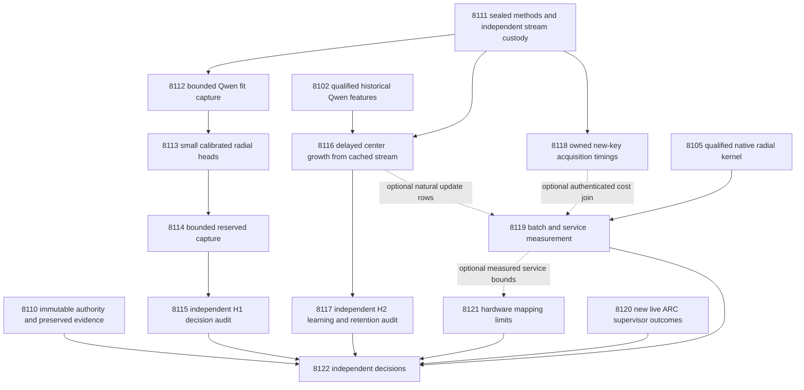

# Carnot Research Roadmap v702 — Source-sensitive decisions and independent online energy memory

**Created:** 2026-10-04 UTC. **Milestone:** 2026.10.702.
**Status:** Proposed; staged for conductor activation.
**Supersedes:** scheduling for completed milestone 2026.10.701.
**Informed by:** the research program, PRD, architecture, complete experiment
archive, operational records, prior proposals, exclusion manifest and current
primary-source research recorded in `research-references.md` before this design.

The exact contract contains **13 tasks, Exp8110 through Exp8122**, in that order.
The four phases contain **3, 3, 4 and 3 tasks**. The visible task table and complete
executable JSON below match `research-roadmap-next.yaml`, including prompts,
gates, model declarations and failure history. The V701 document is preserved
byte-for-byte in `research-roadmap-v701-preserved-20261004.md`.

## What v701 proved

The conductor closed thirteen scheduled tasks. Nine have terminal primaries;
four were gate-skipped. Completion is not a positive scientific result.

| Experiment | Supported finding | Consequence |
|---|---|---|
| 8097 | Contract, historical controls and numerical kernel readiness are 1; the verdict is circular_positive. | Reuse the parameterized authority reader. Do not rebuild governance infrastructure. |
| 8098 | The exposed development cohort qualified: 640 original source-cluster slots. Human-target eligibility is fit127, tune64, evaluation128, stream254, retention64. | Preserve roles and exposure. Do not run another impossible universal-freshness search. |
| 8099 | Disqualified terminal validation; fit readiness0; zero model loads and zero generation calls. The consumer command named absent `tests/python/test_primary_publication.py`. The artifact still declared live bounded generation and was quarantined. | Use the existing `test_primary_publication_7928.py`, validate paths first and derive actual substrate from invocation receipts. Preserve the failed primary. |
| 8100/8101 | Radial fitting and evaluation did not run. Exp8100 has an alternate conductor gate-block artifact; Exp8101 has a skip record. | Radial benefit is untested. A new qualified capture is required for that branch. |
| 8102 | Qualified bounded live capture: 300 completed generation calls; 239/256 stream and61/64 retention slots captured. | Reuse authenticated public features as historical data. No fresh model call is needed to test causal online updates. |
| 8103/8104 | Learning and its audit were skipped behind the failed fitted head. | Initialize learning from a frozen Qwen score and zero residual, independently of batch fitting. |
| 8105 | Real Rust binding qualified512 fixture rows, with zero failed rows; fixture scope is circular_positive. | Reuse the native kernel; do not port it again. |
| 8106 | Host service readiness1, acquisition readiness0;1080 transactions qualified. The overall verdict is blocked on changed-content acquisition. Cold/miss paired ratios were near1, and warm ratios below1. | Native arithmetic has not established complete-service acceleration. Measure new-key acquisition in an explicit model task and test batch crossing separately. |
| 8107 | Actual supervisor reader qualified; no new outcomes. | Inspect only new authenticated redirect outcomes, with a cheap no-firing exit. |
| 8108 | CPU precision and board-boundary assessment qualified. | Preserve per-board limits; no new hardware performance claim exists. |
| 8109 | Capstone execution readiness1, science readiness0; overall blocked. | Keep branch conclusions separate and preserve invalid sources explicitly. |

The current capture code already contains invocation-derived substrate branches.
Exp8112 must exercise them before making further changes; a historical failure
does not imply that the same defect still exists in current source.

## Three biggest gaps against the PRD

1. **Useful, independent verification — FR-06/12.** Calibrated energy decisions
   have not shown reliable advantage over controls with the same information.
   Test local radial geometry, evidence sensitivity and typed decision cost.
   This exposed-development panel cannot close `GAP-ORACLE-DISTINCT`.
2. **Learning that improves later behavior — FR-11.** Valid updates and stored
   states have not established later benefit. Test structural addition of centers
   from released errors, with equal-capacity controls and independent retention.
3. **Deployment value — FR-05/08 and NFR-01.** Fast numerical kernels can lose
   their benefit in feature acquisition, native crossings and durable writes.
   Measure the complete workload and identify the batch crossover, if any.

The energy head estimates support from incomplete evidence. It is not a proof
that arbitrary natural language is correct. Every task keeps
`independent_generalization_score=0` and `generalized_learning_benefit_score=0`.
A later independent corpus is needed for those claims.

## Research incorporated before design

The dated V702 scan in `research-references.md` covers all eight requested
research areas and all secondary channels. Rechecked papers remain prior
knowledge. Semantic Scholar citation endpoints were inaccessible; OpenReview's
forum challenged access; GitHub Trending pages were cached. These limits are
recorded rather than presented as an exhaustive novelty census.

| Source | Experiment use |
|---|---|
| [EAEV, September2026](https://arxiv.org/html/2609.08267v1) | Exp8111/8112 register source perturbations and duplicate variation. This is a narrow diagnostic adaptation, not reproduction of entity verification. |
| [KAC,2025](https://arxiv.org/abs/2503.21076), [author code](https://github.com/Ethanhuhuhu/KAC) | Exp8113/8116 test bounded local radial bases. Carnot uses multivariate distances, unlike KAC's channel-wise construction. |
| [KAN forgetting,2025](https://arxiv.org/abs/2511.12828) | Exp8117 tests retention rather than assuming locality prevents forgetting. |
| [Capacity and delayed feedback,2026](https://arxiv.org/abs/2606.11711) | Exp8116 persists issuing states, pending candidates and delayed labels. Its empirical guards inherit no regret theorem. |
| [On-chip KAN learning,2026](https://arxiv.org/abs/2602.02056) | Exp8119/8121 count updates and memory movement. Spline hardware gains do not transfer unchanged to radial distances. |
| [EBT](https://openreview.net/pdf?id=ZBj3Qp1bYg), [ARM–EBM](https://arxiv.org/abs/2512.15605) | Exp8113 retains an exactly probability-equivalent control. Energy notation adds no information by itself. |
| [FPGA decomposition](https://arxiv.org/abs/2602.15985), [Extropic Z1T](https://extropic.ai/writing/z1t) | Exp8119/8121 charge host work and transfer. Z1T's cited estimates omit final readout and some data movement; they are not Carnot measurements. |
| [LagONN](https://arxiv.org/abs/2505.07179), [ETS](https://arxiv.org/abs/2601.21484) | Defer new solver/decoding branches until a qualified verifier improves decisions. |
| [HalluScoring2026](https://arxiv.org/abs/2609.38355), [Kona1.0](https://logicalintelligence.com/kona) | External-validity lead and architectural context. Neither supplies a drop-in independently labeled local cohort or reproducible Kona implementation. |

## Architecture

The capture worker receives complete public source and answer bytes. The evaluator
owns human annotations. Fit/tune labels never enter the reserved-capture worker.
The online learner receives only released feedback; retention labels stay with
the evaluator until all final predictions are sealed. The independent learning
branch does not depend on Exp8112, Exp8113, Exp8114 or Exp8115.

## V702 numerical freeze — Exp8111, 20261004

The independent numerical contract is sealed in
[v702-methods-and-stream-protocol.md](v702-methods-and-stream-protocol.md).
It preserves the original 640 V701 slots and roles and freezes source
interventions, paired typed costs, fitting, two-hypothesis correction, and
zero-residual delayed memory before new V702 outcomes. Methods and historical
stream readiness are separate. FR-11 has no fitted-head or fit-capture dependency.

## Historical V701 reader compatibility

The following byte-sealed V701 protocol is retained for historical producer
regressions. New V702 outcomes use the independent contract linked above.

## Frozen data and numerical protocol

**Population and exposure.** Use official RAGTruth training responses. The split
field lives on response rows. A public-metadata check found2515 train source IDs
before normalization. All are treated as previously exposed development data.
This is a changed, narrower research claim; Exp8084's block remains valid.

Render complete structured sources through the existing public-source reader.
Normalize rendered text with NFKC, casefold and collapsed whitespace. Join source
IDs and exact normalized hashes, then connected components of five-token-shingle
Jaccard>=.8. Keep an entire connected component in one role. Select one response
by smallest SHA256 of `V701-response` plus response ID among train responses in
the component. Break hash ties by source ID then response ID. Lowest numeric ID
is forbidden: it picks `gpt-4-0613` on every training source in this checkout.

Order components by SHA256 of `V701` plus their smallest normalized source bytes.
Select the first640 public-complete components. Assign consecutive roles fit128,
tune64,evaluation128,stream256,retention64. Freeze public model and task-type
counts. No outcome, label, quality field or parser success selects a replacement.
Reject malformed public sources before selection with an explicit reason.
After selection, exclusions keep their original slots and denominators.

The evaluator maps complete human span annotations to unsupported status.
Absent or incomplete annotation status is unknown, never a negative label.
Require fit>=96 with>=16 per class and tune>=48 with>=8 per class before GPU
capture. Only aggregate support booleans pass to capture workers. The evaluation
and learning support rules below cannot be repaired through label-based resampling.

**Features and fitting.** The input is nine dimensional: Qwen unsupported-risk
logit plus eight Exp7980 public lexical features. Clip the parsed probability
only for the logit transform to [1e-6,1-1e-6], recording clipped rows. Fit mean
and standard deviation on fit data; replace zero standard deviation with one.
Compute geometry inside each of four source-group fit folds.

Fit scalar Qwen-only, linear nine-feature, additive spline and radial heads.
Reuse the established additive basis with its exact basis configuration sealed
in Exp8098. Radial phi_j(x)=exp(-||x-c_j||²/(2*sigma²)). Select16 initial centers
by deterministic farthest-first traversal with fit-source-hash ties; reserve the
next12 fit centers. Sigma is the median positive fit pair distance, or1 if none.
Ridge is selected from [0.0001,0.001,0.01,0.1,1] by mean fit-fold log loss;
choose the largest tied ridge. Exclude intercept from the ridge penalty.
Use at most256 optimizer iterations and600 seconds per fit, with finite
parameters/objective and gradient infinity norm<=1e-7. Incomplete convergence
is not qualified fitting. Do not increase budgets after seeing evaluation results.

Tune alone fits affine logit calibration, including the same calibration step
for every arm. Seal raw and calibrated coefficients. Equivalent logistic code
must reproduce p(unsupported)=sigmoid(f), with E0=0 and E1=-f, within1e-10.
Costs are accept=5*y, reject=1-y and escalate=.5. Choose minimum expected cost;
ties escalate. Always-escalate is an explicit reference. No source intervention
feature enters the preregistered heads.

**Model work.** Only Exp8099,8101,8102 need an LLM. Each includes
`unsloth/Qwen3.8-27B-GGUF` in MODEL_SPECS. Use the cached GGUF and embedded
tokenizer through llama.cpp, with current CUDA offload and owned GPU receipts.
Each call uses the qualified96-token bounded-judgment contract and a120-second
limit. The task caps are288,128,320 calls respectively:736 calls and70656 output
tokens maximum across the milestone. No retries or replacement of started calls.
Resume only unstarted slots under immutable manifests. Context overflow is an
exclusion; never silently truncate evidence. The three tasks are all
`model_bounded_generation` with a10-second floor. No task claims full generation.
Embedding-only or load-only work would require `model_load_no_generation` with
its2-second floor, but no such task is scheduled. Other tasks declare no_model_load.

**Online experiment.** Freeze features before temporal replay. Event order is:
prediction issue and durable commit; candidate commitment at an opportunity;
selection of future admission slots; label release; admission; durable update.
Feedback releases at original slot+20. Missing slots do not compress time.
Pending capacity is32; an unexpected overflow evicts the oldest pending item,
records permanent feedback loss and disqualifies a claim of lossless execution.

Source-ID SHA256 modulo4 assigns admission-only bucket0 and update-only others.
The first64 slots are burn-in. Use opportunities64,128,192, with newest64
released update rows,>=16 available updates and>=4 frozen-head issued errors.
Shared error eligibility determines whether every adaptive arm adds4 centers.
Controls use the reserved fit centers or seeded label-blind past rows. Record
duplicate centers and effective rank; do not conceal degeneracy or add substitutes.
All installed counts match. Append zero coefficients before computing candidates.
The frozen arm retains its original16 centers and never updates.

Each adaptive arm takes four mean-loss SGD steps with eta=.05 and its fit-selected
ridge from its own current coefficients. The global compute budget is1200 seconds.
Commit candidates before selecting the next12 unused admission rows with release
strictly after commitment. Require>=2 per class. All arms share these labels and
wait for the same release slot. A block must finish before the next opportunity
and by slot256; otherwise the whole opportunity defers without label replacement.
Test alpha=[1,.5,.25,.125], selecting the largest passing step. Passing means no
extra false accepts, cost and Brier no worse than incumbent, and cost<=fitted
baseline+.02 and Brier<=fitted baseline+.01 on the admission block. The baseline
uses immutable fitted coefficients with zero padding for new centers. Admission
checks are empirical guards, not independent certification of safety.

Rejected candidates retain old coefficients and zero-weight installed centers.
Persist all pending observations, center identities, weights and used admission
IDs. Seeds101..120 quantify algorithm variability; they are not new data.
Final heads and retention predictions commit before retention labels open.

## Hypotheses, support and decision rules

H1 is radial minus additive typed-decision utility on128 reserved source slots.
H2 is error-center minus fixed-center utility on original stream slots65..256.
Positive gain means control cost minus treatment cost. Minimize cost and Brier.
These are exposed-development diagnostics, not confirmatory population tests.

| Rule | H1 | H2 |
|---|---|---|
| Required support | >=96 complete sources;>=12/class | >=128 complete paired sources;>=8/class;>=8 nonoverlapping16-slot blocks with usable rows |
| Primary effect | Cost-gain97.5% one-sided bootstrap lower bound>.02 | Same gain rule with moving-block bootstrap |
| Useful action changes | >=5 beneficial sources; zero extra false accepts | Same |
| Calibration | Brier increase<=.01 | Report issued-state Brier; retention rules also apply |
| Other controls | Scalar, linear, equivalent logistic, always-escalate | Random-past and frozen; cost increase<=.02 against each |
| Retention | Not a learning claim | >=48 sources;>=8/class; empirical cost increase<=.02 and Brier increase<=.01 versus frozen; no extra false accepts |

Use10000 deterministic bootstrap draws. H1 resamples source groups. H2 averages
seeds within source before moving-block resampling of original slots, primary
block16 and sensitivities8,32. Keep missing masks inside blocks. A draw with no
eligible rows is invalid and remains counted; fewer than9500 valid draws blocks
the interval. The two97.5% one-sided bounds are a conservative two-question
screen. Prior corpus exposure prevents interpreting their nominal coverage as
independent confirmation. Report effect sizes and all harms even when gates fail.

Retention intervals are descriptive. The64-source panel does not prove rare-event
safety or general absence of forgetting. Compute class support and achievable
precision explicitly. Generalized and independent-generalization scores remain0.
A failed scientific effect is null. Missing external inputs are blocked. Failed
owned validation is disqualified. Only unfinished owned work is partial.

## Dependency graph

Historical V701 dependencies are preserved in the V701 design. V702 uses the
architecture and independent memory branch above.
