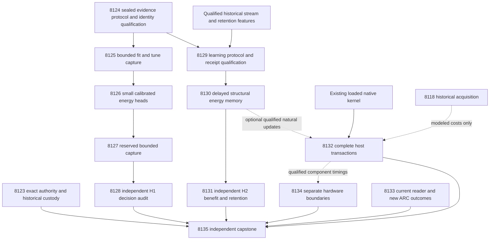

# Carnot Research Roadmap v703 — Evidence-linked decisions and qualified continuous energy learning

**Created:** 2026-10-04. **Milestone:** 2026.10.703.
**Status:** Proposed; experiment execution and activation remain pending.
**Supersedes:** scheduling for completed milestone 2026.10.702.
**Informed by:** research-program.md, the PRD, architecture, completed experiment
archive, operational records, prior proposals, exclusion manifest and primary research.

This contract contains **13 tasks, Exp8123 through Exp8135**, in execution order.
Its four phases contain **3, 3, 4 and 3 tasks**. The exact table and complete JSON
below agree with `research-roadmap-next.yaml`, including full prompts and gates.
The previous document is preserved byte-for-byte in
`research-roadmap-v702-preserved-20261004.md`. Its activation snapshot remains
separate historical evidence. The current active roadmap and conductor are unchanged.

## What v702 proved

The conductor closed thirteen scheduled tasks. Nine have terminal primaries;
four were gate-skipped. The completed archive still ends at V701 at planning
start. The active V702 roadmap and conductor log establish these dispositions.
Completion does not imply a positive scientific result.

| Experiment | Supported result | Next consequence |
|---|---|---|
| 8110 | `complete_blocked_design_exact_task_contract`. The authority reader expects the literal heading `## Exact task contract`. The V702 design did not supply that parser section. | Test the existing parser on the actual staged design before activation. |
| 8111 | Methods and historical stream custody qualified. | Reuse the original source roles and sealed delayed-memory protocol. |
| 8112 | `complete_blocked_qwen_cache_revision`. The failed operand compared the observed revision with `None`; no model invocation occurred. The wrapper populated expected identity after the base check. | Authenticate the expected nested identity before checking it. Model absence is not the diagnosed cause. |
| 8113–8115 | Fitting, reserved capture and decision audit were gate-skipped. | No V702 radial decision result exists to promote or refute. |
| 8116 | `complete_disqualified_owned_validation`. One row-loss mutation branch lacked coverage; terminal adversarial validation timed out. Its executed configuration also differs from the sealed protocol. | Qualify both protocol conformance and complete validator execution before new learning. |
| 8117 | Learning audit was skipped on trajectory readiness. | Require a new qualified trajectory, independently of source fitting. |
| 8118 | Qualified bounded Qwen acquisition: one model load and 48 completed calls. `acquisition_cost_ready_score=1`; live summary recheck was clean. | Reuse its authenticated runtime and historical cost evidence. This proves access, not verifier benefit. |
| 8119 | `complete_disqualified_terminal_validation`; its owned adversarial subprocess timed out. | Test full-size receipt validation before another service benchmark. |
| 8120 | Blocked on a changed reader-code hash relative to historical evidence. | Qualify current reader behavior without rewriting historical hashes. |
| 8121 | Qualified conditional hardware analysis; no service speedup established. | Keep each board's evidence boundary separate from service availability. |
| 8122 | Overall blocked on the design contract and ineligible scientific inputs. | Report branch conclusions independently, with external blocks terminal. |

The learning discrepancy is substantive. Exp8116 used delay8, learning rate.01,
and growth96/128/160. Exp8111 sealed delay20, learning rate.05, and growth64/128/192.
Admission size and role assignment also differ. These observations diagnose
conformance, not a scientific performance claim. Disqualified reductions remain
excluded from benefit claims. The live summary of the large learning artifact
was interrupted while traversing nested provenance; it was not a clean audit.

## Three biggest gaps against the PRD

1. **Useful verification — FR-06/12.** Source-conditioned signals have not
   produced qualified, independently evaluated typed-decision benefit. Test
   evidence-linked features against equally informed statistical controls.
2. **Persistent learning benefit — FR-11.** Updates and durable state do not
   establish that later decisions improve. Test structural center addition
   under the actual sealed protocol, with independent retention and recovery.
3. **Deployment value — FR-05/08, NFR-01.** A native arithmetic kernel does not
   establish complete-service acceleration. Measure transactions and charge
   acquisition, data movement, boundary crossings and durable writes.

All natural-data conclusions retain exposed-development scope. Every task sets
`independent_generalization_score=0` and `generalized_learning_benefit_score=0`.
A small energy head estimates support; it does not prove arbitrary text true.
This milestone can establish a development signal. It cannot close generalization
or oracle-distinct publication gaps using reused development data alone.

## Research incorporated before design

The dated V703 entry in `research-references.md` was written before this design.
It covers all eight requested topics and all secondary channels. Semantic Scholar
citation endpoints were inaccessible. OpenReview's EBT forum challenged access.
GitHub Trending returned cached pages. No exhaustive novelty or citation census
is claimed.

| Source | Use and limit |
|---|---|
| [RT4CHART, revised July 2026](https://arxiv.org/abs/2603.27752) | Exp8124–8128 compare holistic judgments with source-span judgments. Exact span custody does not prove entailment. This is a bounded adaptation, not a complete reproduction. |
| [Capacity-constrained delayed learning, June 2026](https://arxiv.org/abs/2606.11711) | Exp8129–8131 track pending capacity, release order and lost feedback. No convex regret theorem transfers to center growth. |
| [Online constraints with memory, March 2026](https://arxiv.org/abs/2603.21375) | Record state and delay costs alongside empirical learning. No strict safety guarantee is imported. |
| [KAN forgetting, November 2025](https://arxiv.org/abs/2511.12828) | Measure retention and support overlap. Radial centers are not channel-wise KAN splines. |
| [KAN-CL, May 2026](https://arxiv.org/html/2605.12306v1) | Defer new importance anchoring. The existing unchanged anchor mechanism is retired; a paper title does not reopen it. |
| [EBT](https://arxiv.org/abs/2507.02092), [ARM–EBM, May 2026 revision](https://arxiv.org/abs/2512.15605) | Preserve a probability-equivalent logistic control and separate useful evidence from energy notation. |
| [FPGA decomposition](https://arxiv.org/abs/2602.15985), [Extropic Z1T](https://extropic.ai/writing/z1t/) | Exp8132/8134 include host work, readout and movement. Vendor projections are not local speed measurements. |
| [LagONN](https://arxiv.org/abs/2505.07179), [PAL](https://arxiv.org/abs/2503.19466), [ETS](https://arxiv.org/abs/2601.21484) | Defer new solver and decoding branches until useful source verification qualifies. |
| [HalluScoring 2026](https://arxiv.org/abs/2609.38355), [Kona 1.0](https://logicalintelligence.com/kona) | External-validity and architecture leads. Neither qualifies a new local cohort or supplies a reproducible Kona implementation. |

## Architecture



Solid edges express scientific prerequisites. Dotted edges are optional joins.
The authority receipt is administrative; it does not gate every independent
branch. Exp8130 does not depend on new source capture or a batch-trained head.
The capture worker sees public source and answer bytes. The evaluator owns
human annotations. The learner receives only released feedback. Retention
labels stay closed until final predictions are sealed.

## Phase 1 — Qualify inputs and capture paired evidence

**Exp8123–8125.** Verify the exact parser contract. Freeze source roles, prompts
and statistical rules. Repair the diagnosed identity-check order in the future
implementation task, with missing/mismatched identity negative controls.
Then capture holistic and evidence-span Qwen judgments on identical sources.
The prototype is CPU-only and precedes expensive capture. It exercises actual
terminal builders, not a substitute mock publication path.

## Phase 2 — Train and independently evaluate typed decisions

**Exp8126–8128.** Train small calibrated heads with the same public information.
Freeze all model choices before reserved capture. The independent evaluator
reconstructs rows and then opens labels. It tests typed decision loss, calibration,
false acceptance and inference cost. A formatted quote is a feature, not truth.

## Phase 3 — Execute the correct learning protocol and measure costs

**Exp8129–8132.** First qualify every frozen learning operand and full-size
validator execution. Then run continuous center-memory learning from historical
Qwen features, followed by an independent future/retention audit. A separate
service task measures loaded Python/Rust transactions without depending on
learning benefit. It keeps host timing and optional natural-update timing apart.

## Phase 4 — Preserve live-agent and hardware obligations; decide the evidence

**Exp8133–8135.** Qualify the current supervisor reader against preserved events.
Inspect only new outcomes. Preserve the standing ARC generalization task without
re-solving public games. Bound useful acceleration separately for each board.
The capstone reports every scheduled disposition, even when scientific branches
block. It uses the fixed G1–G4 publication gate and performs no publication.

## Frozen study and measurement contract

**Data.** Keep Exp8098's 640 original source-cluster slots: fit128, tune64,
evaluation128, stream256, retention64. Keep complete public sources and original
response selection. Preserve original missing masks. No selection, resplit or
replacement may depend on a label or parser success. Reuse of these sources is
explicitly exposed development, not an independent test corpus.

**Evidence capture.** Each source gets one holistic judgment and one judgment
that supplies at most one verbatim source quote of32 words. Both receive the
same complete source/response and a128-token output ceiling. The span response
contains `p_hallucination` and quote bytes/offsets. An absent or invalid quote
remains recorded; substring equality does not certify semantic support.
Exp8124 freezes prompt bytes and parser rules before any reserved outcome.
Alternate arm order by frozen source hash. Input ceiling is6000 tokens. Exclude
overlong sources whole; do not truncate them into a different task.

Exp8125 has384 main calls and48 diagnostic calls on the first16 fit slots:
holistic duplicate, span removed-source and span cyclic-mismatch. Its total
ceiling is432 calls/55296 output tokens. Exp8127 has256 calls/32768 output tokens.
Each uses one load, a300s load deadline,120s per-call deadline, a3000s stop for
new requests and3120s capture closure. Preserve unstarted slots and reasons.
Remaining time is for owned validation within the4800s hard cap. Neither token
ceilings nor estimated durations authorize padding. Diagnostics on16 sources
are descriptive and never inherit labels across altered evidence.

**Small-head training.** Use twelve features: holistic logit, the existing eight
public lexical features, span logit, valid-quote indicator and quote/source byte
ratio. Clip probabilities to[1e-6,1-1e-6] before logits. Normalize using fit-only
mean/std; zero std becomes1. Recompute geometry within each fit fold. Quote
absence yields validity0 and ratio0; malformed probability makes the pair missing.

Fit scalar holistic, scalar span, mean-probability, linear12, additive cubic,
radial16, equivalent-logistic and always-escalate arms. Full-feature learned
controls see the same twelve features. The additive head uses the existing
cubic construction: fit quantiles .25/.5/.75, endpoint multiplicity4, padding1e-8
and clipping. Use four source folds, ridge[.0001,.001,.01,.1,1], maximum256
iterations and600s total fitting. Select fit-fold mean log loss, with larger
ridge on ties. Use sixteen public farthest-first centers and median positive
fit distance as width; fallback1. Calibrate each arm with tune-only affine
logits. Require equivalent-logistic probabilities within1e-10. Freeze all model
hashes and transformations before evaluation capture. No generator weights change.

**Decisions.** Let y=1 mean hallucination. Accept costs5 for y1 and0 for y0.
Reject costs1 for y0 and0 for y1. Escalation costs.5. Choose the minimum expected
loss; use escalation on exact ties. Lower typed cost, Brier and log loss are
better. Define every reported gain as control loss minus treatment loss.

**Learning.** The JSON in `v702-methods-and-stream-protocol.md` remains the
numerical authority for delayed_memory and statistical_plan.H2. Exp8129 must
parse it and test the executed values, not copy an inconsistent config.
Start from historical Qwen logit plus zero residual. Normalize on original
public slots1..64. Evaluate original slots65..256. Use seeds101..120 only as
robustness repeats. Delay is20 slots, pending capacity32, growth slots64/128/192,
initial centers16, maximum28, four SGD steps, learning rate.05 and ridge.01.
Use newest64 released update rows, minimum16 eligible with4 frozen-offset errors.
Hash source IDs modulo4 to assign admission-only bucket0; others are update-only.
Commit candidates before the next12 unused admission labels arrive; require2/class.
Use step grid1/.5/.25/.125 and the original sealed admission guards and deadlines.
Rejected updates keep installed centers at zero weight. Frozen couplings stay
fixed within a query; structural changes occur across released examples.

Error-selected, fixed-public and random-past centers have equal installed
capacity and update budgets. The frozen Qwen arm never learns. Persist original
slot masks, issuing states, optimizer/RNG state, used labels and pending events.
Overflow evicts the oldest pending event and permanently loses its feedback.
Record that loss. Do not flush future feedback at stream end. Learning gets a
1200s compute budget and checkpoints every32 original slots and each opportunity.
Seal final heads and retention predictions before retention labels open.

**Primary inference.** Exactly two hypotheses use Bonferroni family alpha=.05:
H1 radial versus additive typed cost on reserved evaluation; H2 error-center
versus fixed-public-center cost on later stream slots. Each uses one-sided
97.5% confidence,10000 resamples and at least9500 valid draws. H1 resamples
source clusters. H2 first averages seeds per source, then resamples moving
original-slot blocks of16; sensitivity blocks are8 and32. Preserve missing masks.
Require H1 at least96 complete sources and12/class. Require H2 at least128
complete later sources,8/class and8 nonoverlapping blocks. Retention needs48
sources and8/class. Inadequate support produces feasibility or blocking, not
a claim that a method fails.

For either primary benefit claim, require gain lower bound>.02, at least5
improved sources, no extra false accepts, Brier increase<=.01 and no alternative
comparable control better by>.02 typed cost. H2 additionally requires retention
cost increase<=.02, Brier increase<=.01 and no extra false accepts. A valid null
needs a discriminating positive control and headroom. Quote effects and
perturbations remain exploratory. No sub-percentage-point or rare-event claim
is supported by these small development cohorts.

**Performance.** Exp8132 uses actual Python/native scalar and batch paths at
batch sizes1/4/16/64/256. Each condition gets5 warmups and30 paired batch repeats.
Measure cold/warm/miss/changed-content/eviction/restart with full costs. Require
parity1e-10 and identical decisions. Use10000 paired batch resamples of log
speed ratios. A speed claim needs a one-sided95% lower bound>1; NFR-01 needs10.
Time repetitions are not independent semantic sources. Bound measurement at3000s.
Historical Exp8118 acquisition permits an explicitly modeled cost bound only.
The task does not perform a new LLM call and cannot claim a newly measured
complete model service. Learning update joins are optional and independently gated.

## Dependency and gate contract

Every structured gate references an earlier task in this roadmap. The exact
producer field appears in that producer's REQUIRED ARTIFACT FIELDS.

| Consumer | Required producer fields |
|---|---|
| 8125 | 8124.capture_protocol_ready_score==1 |
| 8126 | 8125.fit_capture_ready_score==1; 8124.methods_ready_score==1 |
| 8127 | 8126.energy_fit_ready_score==1 |
| 8128 | 8127.evaluation_capture_ready_score==1 |
| 8129 | 8124.stream_input_ready_score==1 |
| 8130 | 8129.learning_runner_ready_score==1; 8124.stream_input_ready_score==1 |
| 8131 | 8130.learning_trajectory_ready_score==1 |
| 8123, 8124, 8132–8135 | No structured science gate; optional inputs get separate dispositions. |

Readiness requires normal owned validation and authentic evidence, not a positive
scientific effect. External unchanged blocks use verdict_class=blocked. Owned
validation failures use disqualified. `partial` is only for unfinished owned work.
Each blocked record includes gate_check_summary with the exact observed operand.
Each comparative task exports individual rows. State/log sharding may remove
redundant copies, but must preserve every unit and independently checked reference.

## Hardware requirements and acceleration path

| Work | Required hardware | Budget or boundary |
|---|---|---|
| 8125, 8127 Qwen capture | Owned CUDA lease on the existing RTX3090 pair; native GGUF tokenizer | Frozen unsloth/Qwen3.8-27B-GGUF; about16GB cached weights, context overhead measured before load; bounded generation10s floor |
| Small heads and delayed memory | CPU/system RAM; existing Rust/PyO3 kernel for measurement | CPU small-vector updates; fixed memory capacity; no claim of a measured100x learning gain |
| Service timing | Current loaded native extension and CPU timers | Charge allocation, crossing, serialization, persistence and feature handling |
| KV260 | Existing authenticated fabric evidence | k_max<=5; no new synthesis, flash or board timing |
| PolarFire | Existing authenticated Linux CPU dispatch evidence | CPU execution does not establish fabric acceleration |
| GateMate | Preserved DirtyJTAG0xffffffff evidence | Reopen after a concrete operator-side wiring/power change; no repeated unchanged probe |
| NPU/TSU/future boards | No qualified current workload access | Require supported runtime or authenticated hardware access before device claims |

Every learning mechanism has a hardware path: bounded CPU state updates now,
small-vector Rust kernels next, and batched local-support arithmetic on suitable
GPU/NPU or FPGA fabric later. Exp8134 asks whether removing arithmetic can even
meet the100x target once other costs remain. A negative bound redirects effort
toward the measured bottleneck. No hardware purchase is part of this milestone.

## Execution discipline, retirement and validation

Each prompt mandates flushed progress at phase boundaries, before/after long
calls, and at least every60s inside loops and waits. Gaps remain below600s.
Tool calls stay bounded. Files over about200 lines are written across calls
with progress between them. No bootstrap-only artifact counts as completed work.

Each continuation records its actual prior verdict, diagnosed cause, changed
mechanism/prerequisite and retire_if_same_verdict=true. No retired experiment
ID is reused. No dependency points to a retired task. The source-evidence
comparison is outside the unchanged generic external-text ranker retirement.
The unchanged importance anchor, public-game re-solves and repeated failed
supervisor inventory remain excluded.

Follow spec first, tests first, implementation, scoped checks and reconciliation.
Use E2E-015/019 for source/evaluator boundaries, E2E-018 for authority lifecycle,
E2E-017 for supervisor receipts and E2E-003/004 for the loaded native service.
Run private success, blocked, mutation and cold-replay paths. Preserve100%
changed-code coverage and scoped spec traceability. Global health failures stay
visible but do not trigger an unrelated full-suite rerun for every experiment.

Planning verification uses the actual schema, exclusion/prior-failure lint,
gate audit, parser/digest check and simulated activation in a private directory.
It tests deleted/reordered tasks, changed prompts, stale digests and missing gate
fields. It never activates V703 or changes research-roadmap.yaml. Experiments
retain their own future unit/lint/type/spec/E2E obligations.

## Exact task contract

Exactly thirteen tasks follow, in conductor execution order.

| Order | ID | Title | Phase | Deliverable |
|---|---|---|---|---|
| 1 | `exp8123-contract-custody` | Bind thirteen tasks with the exact authority-reader format | 1 | `results/experiment_8123_v703_contract_custody.json` |
| 2 | `exp8124-evidence-protocol` | Seal evidence-span comparisons and qualify model identity before capture | 1 | `results/experiment_8124_v703_evidence_protocol.json` |
| 3 | `exp8125-fit-evidence-capture` | Capture paired holistic and evidence-span Qwen judgments | 1 | `results/experiment_8125_v703_fit_evidence_capture.json` |
| 4 | `exp8126-evidence-energy-fit` | Train calibrated energy decisions from equal source evidence | 2 | `results/experiment_8126_v703_evidence_energy_fit.json` |
| 5 | `exp8127-reserved-evidence-capture` | Capture reserved Qwen evidence with frozen decision heads | 2 | `results/experiment_8127_v703_reserved_evidence_capture.json` |
| 6 | `exp8128-decision-audit` | Independently test evidence-linked decision benefit and cost | 2 | `results/experiment_8128_v703_decision_audit.json` |
| 7 | `exp8129-learning-protocol-qualification` | Qualify frozen learning semantics and bounded terminal validation | 3 | `results/experiment_8129_v703_learning_protocol_qualification.json` |
| 8 | `exp8130-delayed-energy-memory` | Learn structural energy memory under the sealed delayed-feedback protocol | 3 | `results/experiment_8130_v703_delayed_energy_memory.json` |
| 9 | `exp8131-learning-audit` | Independently measure later learning benefit retention and recovery | 3 | `results/experiment_8131_v703_learning_audit.json` |
| 10 | `exp8132-service-cost` | Measure complete radial service costs with qualified receipt storage | 3 | `results/experiment_8132_v703_service_cost.json` |
| 11 | `exp8133-arc-reader-frontier` | Qualify the current supervisor reader and inspect only new outcomes | 4 | `results/experiment_8133_v703_arc_reader_frontier.json` |
| 12 | `exp8134-hardware-service-boundary` | Bound useful acceleration and preserve each board evidence boundary | 4 | `results/experiment_8134_v703_hardware_service_boundary.json` |
| 13 | `exp8135-capstone` | Decide thirteen outcomes and remaining verification learning and deployment gaps | 4 | `results/experiment_8135_v703_capstone.json` |

Canonical full-task SHA256: `8e04d9811dad7214dca1d2effc008efae31b3fc5ccd45b516c7d4910d6f3fb5c`

The following complete task dictionaries include every prompt and gate.

<!-- V703_TASK_CONTRACT_START -->
```json
{
  "milestone": "2026.10.703",
  "milestone_title": "Evidence-linked decisions and qualified continuous energy learning",
  "milestone_doc": "openspec/change-proposals/research-roadmap-vNEXT.md",
  "tasks": [
    {
      "id": "exp8123-contract-custody",
      "title": "Bind thirteen tasks with the exact authority-reader format",
      "phase": 1,
      "track": "science",
      "priority": "high",
      "requires_gpu": false,
      "max_turns": 100,
      "estimated_wall_time_min": 25,
      "per_unit_rows": true,
      "milestone": "2026.10.703",
      "deliverable": "results/experiment_8123_v703_contract_custody.json",
      "inference_substrate_class": "no_model_load",
      "MODEL_SPECS": [],
      "gated_on": [],
      "prior_failures": [
        {
          "experiment_id": "exp8110-contract-custody",
          "verdict": "complete_blocked_design_exact_task_contract",
          "addressed_by": "The design now uses the exact existing parser heading and full JSON/digest; planning tests the real reader before staging.",
          "retire_if_same_verdict": true
        },
        {
          "experiment_id": "exp8083-contract-custody",
          "verdict": "complete_disqualified_research-roadmap-vNEXT_md",
          "addressed_by": "Generate the table and complete JSON from all thirteen actual YAML tasks; preserve historical design bytes.",
          "retire_if_same_verdict": true
        }
      ],
      "agent_type": "claude",
      "model": "opus",
      "prompt": "CONTEXT:\nWork in {project_root} on {date}. V702 closed thirteen scheduled tasks. Nine primaries exist and four tasks were gate-skipped. Exp8110 and Exp8122 failed design_exact_task_contract because the design lacked the exact parser heading. The archive currently ends at V701; reconcile from the active roadmap and conductor log without inventing an archived V702 record.\nEXISTING CODE TO READ FIRST:\nCLAUDE.md; CODEX.md; ops/e2e-test-plan.md; openspec/capabilities/research-reporting/spec.md; openspec/capabilities/verification/spec.md; scripts/experiment_template.py; python/carnot/reporting/current_work_receipt.py; python/carnot/reporting/primary_publication.py; ops/exclusion_manifest.yaml; openspec/change-proposals/research-roadmap-vNEXT.md; python/carnot/reporting/roadmap_contract.py; python/carnot/reporting/v685_authority_lifecycle.py; scripts/experiments/experiment_8110_v702_contract_custody.py; tests/python/test_contract_custody_8110.py; tests/python/test_experiment_7891_v685_authority_lifecycle.py; results/experiment_8122_v702_capstone.json; openspec/change-proposals/research-roadmap-v702-preserved-20261004.md\nTASK:\nBind thirteen tasks with the exact authority-reader format. Deliver results/experiment_8123_v703_contract_custody.json, primitive evidence under results/raw/experiment_8123_v703_contract_custody/ and runnable scripts/experiments/experiment_8123_v703_contract_custody.py.\nCONCRETE STEPS:\n1. Emit a flushed progress line at each phase boundary and before and after every model load, generation, benchmark and subprocess. Set PYTHONUNBUFFERED=1 and use print(..., flush=True). Report real completed/pending counts inside long loops and child waits at least every 60 seconds. Keep every silence gap below 600 seconds. Poll children in calls of at most 60 seconds. Write any file over about 200 lines in several tool calls of at most about 150 lines. Send a progress message between calls. Do not pad runtime or invent progress.\n2. Check exact input paths, hashes, model/runtime prerequisites and named test paths with bounded calls. Read historical results with scripts/summarize_artifact.py before citing them. Preserve failed primaries. An unchanged external block is terminal complete_blocked_<check>, verdict_class=blocked. Record the actual failing operand in gate_check_summary. Use tests/python/test_primary_publication_7928.py; test_primary_publication.py does not exist.\n3. Extend the applicable REQ-* and SCENARIO-* before implementation. Write failing tests first. Reuse qualified modules with a thin script-path CLI. Keep fixtures and validation outputs in private temporary directories outside results/. Preserve original assertions. Resolve imports when the CLI runs outside the checkout without PYTHONPATH.\n4. Load no LLM. Declare inference_substrate_class=no_model_load and MODEL_SPECS=[]. Use aggregation_from_upstream_artifacts for read-only reductions, or verifier_ensemble_against_cached_candidates for actual CPU feature/head evaluation. Put historical Qwen provenance under cited_upstream_artifacts. Describe small trained heads in trained_head_specs, not as current generator invocations.\n5. Use the literal heading ## Exact task contract, a five-column table and V703_TASK_CONTRACT_START JSON. Bind all thirteen full task dictionaries, including prompts, gates and failure history, to the canonical tasks_digest. Do not weaken parse_design or normalize a malformed heading after the fact.\n6. Exercise staging, activation, staging disappearance and immutable snapshots through the existing parameterized authority lifecycle. During planning, simulate activation only in a private temporary directory. During conductor execution, compare the actual activated V703 authority. Never modify research-roadmap.yaml from this task.\n7. Preserve the original V702 design and its activation snapshot separately; the current document has changed since activation. Reconstruct all thirteen dispositions from exact primaries, alternate blocked records and conductor skips. No completion count is a science result. Reuse each qualified historical input independently of the failed V702 administrative receipt.\n8. Run E2E-018 private authority CLI and mutations. Reject missing/extra/reordered tasks, changed prompts, changed gate fields, stale digests and overwritten snapshots. Export contract readiness only after all authority checks pass.\n9. Freeze validation argv before measurement. Run scoped unit and consumer tests, Ruff check and format, strict mypy, 100% changed-code statement coverage and scoped spec coverage. Execute applicable E2E private CLI success, external block, mutation and cold-replay routes. Capture argv, expected and actual exits, normal exit, log hash and duration. If Rust changes, run cargo test, fmt, clippy and the loaded binding. Keep existing global health failures separate; an unrelated full-suite rerun is not a science prerequisite.\n10. Save primitive rows, raw transcripts and source/code/config hashes. Independently recompute reductions. Run unmodified scripts/adversarial_verify.py and strict scripts/verdict_row_consistency_lint.py through a heartbeat wrapper. Require normal validator exit; a timeout is not a pass. Publish through primary_publication only after passing owned validation. Owned failures disqualify the result and set readiness fields to 0. Reconcile openspec/, _bmad/traceability.md, ops/status.md and ops/changelog.md without deleting history. Do not edit operator-curated publication pages or submit externally.\nREQUIRED ARTIFACT FIELDS:\n- honest_verdict: complete_* terminal string; principle: a completed null or external block is recorded once.\n- verdict_class: positive | circular_positive | null | blocked | disqualified | partial; principle: partial means unfinished owned work that another attempt can finish, never an unchanged external block.\n- verifier_is_oracle, claim_scope, exposure_scope; principle: fixture truth is circular_positive, never a positive natural-data result.\n- independent_generalization_score: 0; generalized_learning_benefit_score: 0; principle: exposed development data cannot establish independent generalization.\n- required_checks_passed, flagged_adversarial, validation_receipts, terminal_validation_sidecar_path; principle: normal owned checks precede publication.\n- gate_check_summary: list of check/upstream/path/hash/artifact_field/op/expected/observed/passed; principle: blocked verdicts identify the actual failing operand.\n- inference_substrate, inference_substrate_class, MODEL_SPECS, model_invocation_counts, call_ledger, trained_head_specs; principle: current execution remains distinct from historical model provenance.\n- rows: unit_id/source_cluster_id/arm/condition/metric/numerator/denominator/status/exclusion_reason; principle: each comparative headline reduces from individual units, with missing units retained.\n- intended_count, eligible_count, independent_count, completed_count, excluded_count, censored_count, failed_count, sample_size_budget; principle: repetitions and seeds do not create independent sources.\n- run_date, duration_s, random_seed, reproducibility_checksum, source_artifact_hashes, raw_shard_hashes, code_config_hashes, phase_spans; principle: each claim binds real work to exact bytes.\n- acceptance_gates, field_principles, cited_upstream_artifacts; principle: explain each threshold and imported field so readers can detect unsupported conclusions.\n- contract_ready_score: 0|1; principle: complete authority agreement is administrative readiness, not scientific benefit.\n- task_contract, canonical_tasks_sha256, authority_snapshots, historical_dispositions; principle: each scheduled task and historical failure stays auditable.\nRun command: cd {project_root} && PYTHONUNBUFFERED=1 JAX_PLATFORMS=cpu .venv/bin/python -u scripts/experiments/experiment_8123_v703_contract_custody.py --date {date}\nDo NOT push. Do NOT modify scripts/research_conductor.py."
    },
    {
      "id": "exp8124-evidence-protocol",
      "title": "Seal evidence-span comparisons and qualify model identity before capture",
      "phase": 1,
      "track": "science",
      "priority": "high",
      "requires_gpu": false,
      "max_turns": 100,
      "estimated_wall_time_min": 40,
      "per_unit_rows": true,
      "milestone": "2026.10.703",
      "deliverable": "results/experiment_8124_v703_evidence_protocol.json",
      "inference_substrate_class": "no_model_load",
      "MODEL_SPECS": [],
      "gated_on": [],
      "prior_failures": [
        {
          "experiment_id": "exp8112-fit-source-capture",
          "verdict": "complete_blocked_qwen_cache_revision",
          "addressed_by": "Populate authenticated nested model_revision before calling the base precondition checker; exercise the real order with missing and mismatched identity tests.",
          "retire_if_same_verdict": true
        },
        {
          "experiment_id": "exp8084-fresh-cohort-methods",
          "verdict": "complete_blocked_available_history",
          "addressed_by": "Preserve exposed development and original source roles; no universal-freshness claim or resplit is attempted.",
          "retire_if_same_verdict": true
        }
      ],
      "agent_type": "claude",
      "model": "opus",
      "prompt": "CONTEXT:\nWork in {project_root} on {date}. Exp8112 compared a real cache revision with None before its wrapper installed the qualified runtime identity. Exp8118 subsequently used the same mandated model successfully. RT4CHART motivates requiring source evidence, but a valid quote does not prove entailment.\nEXISTING CODE TO READ FIRST:\nCLAUDE.md; CODEX.md; ops/e2e-test-plan.md; openspec/capabilities/research-reporting/spec.md; openspec/capabilities/verification/spec.md; scripts/experiment_template.py; python/carnot/reporting/current_work_receipt.py; python/carnot/reporting/primary_publication.py; ops/exclusion_manifest.yaml; openspec/change-proposals/research-roadmap-vNEXT.md; research-references.md; openspec/change-proposals/v702-methods-and-stream-protocol.md; python/carnot/experiment_8112_v702_fit_source_capture.py; python/carnot/experiment_8118_v702_fresh_acquisition_cost.py; python/carnot/experiment_8099_v701_fit_source_capture.py; python/carnot/inference/sota_models.py; python/carnot/verify/development_methods_8098.py; results/experiment_8111_v702_methods_and_stream_custody.json; results/experiment_8118_v702_fresh_acquisition_cost.json; tests/python/test_fit_source_capture_8099.py; tests/python/test_learning_stream_capture_8102.py\nTASK:\nSeal evidence-span comparisons and qualify model identity before capture. Deliver results/experiment_8124_v703_evidence_protocol.json, primitive evidence under results/raw/experiment_8124_v703_evidence_protocol/ and runnable scripts/experiments/experiment_8124_v703_evidence_protocol.py.\nCONCRETE STEPS:\n1. Emit a flushed progress line at each phase boundary and before and after every model load, generation, benchmark and subprocess. Set PYTHONUNBUFFERED=1 and use print(..., flush=True). Report real completed/pending counts inside long loops and child waits at least every 60 seconds. Keep every silence gap below 600 seconds. Poll children in calls of at most 60 seconds. Write any file over about 200 lines in several tool calls of at most about 150 lines. Send a progress message between calls. Do not pad runtime or invent progress.\n2. Check exact input paths, hashes, model/runtime prerequisites and named test paths with bounded calls. Read historical results with scripts/summarize_artifact.py before citing them. Preserve failed primaries. An unchanged external block is terminal complete_blocked_<check>, verdict_class=blocked. Record the actual failing operand in gate_check_summary. Use tests/python/test_primary_publication_7928.py; test_primary_publication.py does not exist.\n3. Extend the applicable REQ-* and SCENARIO-* before implementation. Write failing tests first. Reuse qualified modules with a thin script-path CLI. Keep fixtures and validation outputs in private temporary directories outside results/. Preserve original assertions. Resolve imports when the CLI runs outside the checkout without PYTHONPATH.\n4. Load no LLM. Declare inference_substrate_class=no_model_load and MODEL_SPECS=[]. Use aggregation_from_upstream_artifacts for read-only reductions, or verifier_ensemble_against_cached_candidates for actual CPU feature/head evaluation. Put historical Qwen provenance under cited_upstream_artifacts. Describe small trained heads in trained_head_specs, not as current generator invocations.\n5. Ingest RT4CHART arXiv2603.27752v2 and delayed capacity2606.11711 from primary methods. Record adaptations and limits. Keep KAN-CL importance anchoring deferred under the existing retirement. Update matching research-studying entries as ingested. No inaccessible literature service is a science gate.\n6. Authenticate Exp8098 original 640 source-cluster roles and Exp8111 custody. Preserve fit128/tune64/evaluation128/stream256/retention64 and their original missing masks. Keep exposure_scope=exposed_development_within_run_disjoint. Never resplit or replace sources using labels or parser success.\n7. Build the complete expected runtime identity from authenticated Exp8102/Exp8118 bytes BEFORE evaluating cache revision, GGUF, runtime or template checks. Check nested runtime_identity.model_revision explicitly. Regression-test matching, absent and mutated revisions using the actual production precondition builder. Never delete a failing check or replace the expected value with the observed value to pass it.\n8. Freeze the V703 protocol in the design: one holistic judgment and one source-span judgment per source, each at most128 output tokens. Request p_hallucination and at most one verbatim quote of32 words in the span arm. Validate byte offsets against complete source bytes. A missing/invalid quote is recorded, not a fabricated entailment label. Freeze prompts, parser, order and twelve public features before evaluation labels open.\n9. Keep methods_ready_score and stream_input_ready_score independent of capture_protocol_ready_score. Test zero-call, load-only, current generation and resumed historical branches through real terminal builders using private fixtures. Do not load the model in this task. Run E2E-015/019 source/evaluator separation and consumer-path tests.\n10. Freeze validation argv before measurement. Run scoped unit and consumer tests, Ruff check and format, strict mypy, 100% changed-code statement coverage and scoped spec coverage. Execute applicable E2E private CLI success, external block, mutation and cold-replay routes. Capture argv, expected and actual exits, normal exit, log hash and duration. If Rust changes, run cargo test, fmt, clippy and the loaded binding. Keep existing global health failures separate; an unrelated full-suite rerun is not a science prerequisite.\n11. Save primitive rows, raw transcripts and source/code/config hashes. Independently recompute reductions. Run unmodified scripts/adversarial_verify.py and strict scripts/verdict_row_consistency_lint.py through a heartbeat wrapper. Require normal validator exit; a timeout is not a pass. Publish through primary_publication only after passing owned validation. Owned failures disqualify the result and set readiness fields to 0. Reconcile openspec/, _bmad/traceability.md, ops/status.md and ops/changelog.md without deleting history. Do not edit operator-curated publication pages or submit externally.\nREQUIRED ARTIFACT FIELDS:\n- honest_verdict: complete_* terminal string; principle: a completed null or external block is recorded once.\n- verdict_class: positive | circular_positive | null | blocked | disqualified | partial; principle: partial means unfinished owned work that another attempt can finish, never an unchanged external block.\n- verifier_is_oracle, claim_scope, exposure_scope; principle: fixture truth is circular_positive, never a positive natural-data result.\n- independent_generalization_score: 0; generalized_learning_benefit_score: 0; principle: exposed development data cannot establish independent generalization.\n- required_checks_passed, flagged_adversarial, validation_receipts, terminal_validation_sidecar_path; principle: normal owned checks precede publication.\n- gate_check_summary: list of check/upstream/path/hash/artifact_field/op/expected/observed/passed; principle: blocked verdicts identify the actual failing operand.\n- inference_substrate, inference_substrate_class, MODEL_SPECS, model_invocation_counts, call_ledger, trained_head_specs; principle: current execution remains distinct from historical model provenance.\n- rows: unit_id/source_cluster_id/arm/condition/metric/numerator/denominator/status/exclusion_reason; principle: each comparative headline reduces from individual units, with missing units retained.\n- intended_count, eligible_count, independent_count, completed_count, excluded_count, censored_count, failed_count, sample_size_budget; principle: repetitions and seeds do not create independent sources.\n- run_date, duration_s, random_seed, reproducibility_checksum, source_artifact_hashes, raw_shard_hashes, code_config_hashes, phase_spans; principle: each claim binds real work to exact bytes.\n- acceptance_gates, field_principles, cited_upstream_artifacts; principle: explain each threshold and imported field so readers can detect unsupported conclusions.\n- methods_ready_score, stream_input_ready_score, capture_protocol_ready_score: 0|1; principle: an optional runtime block cannot erase qualified methods or historical learning input.\n- method_freeze, expected_runtime_identity, role_manifests, evaluator_label_manifests, stream_feature_manifest, retention_feature_manifest, protocol_conformance_rows; principle: expected identity and study rules precede observations.\nRun command: cd {project_root} && PYTHONUNBUFFERED=1 JAX_PLATFORMS=cpu .venv/bin/python -u scripts/experiments/experiment_8124_v703_evidence_protocol.py --date {date}\nDo NOT push. Do NOT modify scripts/research_conductor.py."
    },
    {
      "id": "exp8125-fit-evidence-capture",
      "title": "Capture paired holistic and evidence-span Qwen judgments",
      "phase": 1,
      "track": "science",
      "priority": "high",
      "requires_gpu": true,
      "max_turns": 50,
      "estimated_wall_time_min": 65,
      "per_unit_rows": true,
      "milestone": "2026.10.703",
      "deliverable": "results/experiment_8125_v703_fit_evidence_capture.json",
      "inference_substrate_class": "model_bounded_generation",
      "MODEL_SPECS": [
        "unsloth/Qwen3.8-27B-GGUF"
      ],
      "gated_on": [
        {
          "upstream": "exp8124-evidence-protocol",
          "artifact_field": "capture_protocol_ready_score",
          "op": "==",
          "value": 1
        }
      ],
      "prior_failures": [
        {
          "experiment_id": "exp8112-fit-source-capture",
          "verdict": "complete_blocked_qwen_cache_revision",
          "addressed_by": "Gate on Exp8124 production identity qualification; add paired evidence spans instead of rerunning the unchanged malformed preflight.",
          "retire_if_same_verdict": true
        },
        {
          "experiment_id": "exp8099-fit-source-capture",
          "verdict": "complete_disqualified_terminal_validation",
          "addressed_by": "Use existing consumer test paths and invocation-derived provenance, including the zero-call terminal branch.",
          "retire_if_same_verdict": true
        }
      ],
      "agent_type": "codex",
      "model": "gpt-6.1-sol",
      "prompt": "CONTEXT:\nWork in {project_root} on {date}. V702 fit capture ran no model calls because expected revision was absent at check time. This task uses the qualified identity path and tests a bounded source-evidence requirement. Altered source views never inherit the original human label.\nEXISTING CODE TO READ FIRST:\nCLAUDE.md; CODEX.md; ops/e2e-test-plan.md; openspec/capabilities/research-reporting/spec.md; openspec/capabilities/verification/spec.md; scripts/experiment_template.py; python/carnot/reporting/current_work_receipt.py; python/carnot/reporting/primary_publication.py; ops/exclusion_manifest.yaml; openspec/change-proposals/research-roadmap-vNEXT.md; python/carnot/experiment_8118_v702_fresh_acquisition_cost.py; python/carnot/experiment_8102_v701_learning_stream_capture.py; python/carnot/verify/qwen_fit_source_capture_8112.py; results/experiment_8124_v703_evidence_protocol.json; tests/python/test_primary_publication_7928.py; tests/python/test_learning_stream_capture_8102.py\nTASK:\nCapture paired holistic and evidence-span Qwen judgments. Deliver results/experiment_8125_v703_fit_evidence_capture.json, primitive evidence under results/raw/experiment_8125_v703_fit_evidence_capture/ and runnable scripts/experiments/experiment_8125_v703_fit_evidence_capture.py.\nCONCRETE STEPS:\n1. Emit a flushed progress line at each phase boundary and before and after every model load, generation, benchmark and subprocess. Set PYTHONUNBUFFERED=1 and use print(..., flush=True). Report real completed/pending counts inside long loops and child waits at least every 60 seconds. Keep every silence gap below 600 seconds. Poll children in calls of at most 60 seconds. Write any file over about 200 lines in several tool calls of at most about 150 lines. Send a progress message between calls. Do not pad runtime or invent progress.\n2. Check exact input paths, hashes, model/runtime prerequisites and named test paths with bounded calls. Read historical results with scripts/summarize_artifact.py before citing them. Preserve failed primaries. An unchanged external block is terminal complete_blocked_<check>, verdict_class=blocked. Record the actual failing operand in gate_check_summary. Use tests/python/test_primary_publication_7928.py; test_primary_publication.py does not exist.\n3. Extend the applicable REQ-* and SCENARIO-* before implementation. Write failing tests first. Reuse qualified modules with a thin script-path CLI. Keep fixtures and validation outputs in private temporary directories outside results/. Preserve original assertions. Resolve imports when the CLI runs outside the checkout without PYTHONPATH.\n4. Use unsloth/Qwen3.8-27B-GGUF through cached_current_model and the native GGUF tokenizer/chat template. Set CARNOT_FORCE_LIVE=1. Obtain an owned GPU lease and verify CUDA offload. Planned inference_substrate_class=model_bounded_generation has a 10s floor. Derive actual substrate and MODEL_SPECS from owned receipts: no load is no_model_load; a load with no generation is model_load_no_generation (2s); bounded generation is model_bounded_generation. Preserve planned_MODEL_SPECS on an early block. Record PID, argv, model/revision/runtime/template hashes, CUDA memory delta, phase times and token counts. No simulated or small-model headline fallback. Never pad duration.\n5. Capture the original128 fit and64 tune slots through one owned model load. Run holistic and evidence-span prompts on identical complete sources and responses. Alternate arm order by frozen source hash. Use at most384 main calls,128 output tokens/call and6000 input tokens. Exclude overlong complete sources without truncation or replacement.\n6. On the first16 original fit slots, add one holistic duplicate and span-arm removed-source and cyclic-mismatch calls. Total budget is432 calls and55296 output tokens. Fix the mismatch mapping before calls. Compare source sensitivity to duplicate variation as a diagnostic only; sixteen pairs cannot establish a population effect.\n7. Allow300s for loading and120s per call. Stop new calls at3000s and close capture by3120s. Reserve the rest of the4800s task cap for validation and publication. Resume only exact content/model/template/prompt keys. Historical work is excluded from current invocation totals. Do not retry parser failures based on outcomes.\n8. Reparse raw completions independently. Bind quotes to exact source offsets. Retain one row per original slot and arm, including failures. Require at least96 paired fit sources with16/class and48 paired tune sources with8/class for fit_capture_ready_score=1. Quote validity and source sensitivity can be null without invalidating honest transport.\n9. Run E2E-015/019 and private CLI zero-call, successful transport, malformed answer and tampered quote routes. Record feature acquisition cost by source and arm, including the extra evidence call.\n10. Freeze validation argv before measurement. Run scoped unit and consumer tests, Ruff check and format, strict mypy, 100% changed-code statement coverage and scoped spec coverage. Execute applicable E2E private CLI success, external block, mutation and cold-replay routes. Capture argv, expected and actual exits, normal exit, log hash and duration. If Rust changes, run cargo test, fmt, clippy and the loaded binding. Keep existing global health failures separate; an unrelated full-suite rerun is not a science prerequisite.\n11. Save primitive rows, raw transcripts and source/code/config hashes. Independently recompute reductions. Run unmodified scripts/adversarial_verify.py and strict scripts/verdict_row_consistency_lint.py through a heartbeat wrapper. Require normal validator exit; a timeout is not a pass. Publish through primary_publication only after passing owned validation. Owned failures disqualify the result and set readiness fields to 0. Reconcile openspec/, _bmad/traceability.md, ops/status.md and ops/changelog.md without deleting history. Do not edit operator-curated publication pages or submit externally.\nREQUIRED ARTIFACT FIELDS:\n- honest_verdict: complete_* terminal string; principle: a completed null or external block is recorded once.\n- verdict_class: positive | circular_positive | null | blocked | disqualified | partial; principle: partial means unfinished owned work that another attempt can finish, never an unchanged external block.\n- verifier_is_oracle, claim_scope, exposure_scope; principle: fixture truth is circular_positive, never a positive natural-data result.\n- independent_generalization_score: 0; generalized_learning_benefit_score: 0; principle: exposed development data cannot establish independent generalization.\n- required_checks_passed, flagged_adversarial, validation_receipts, terminal_validation_sidecar_path; principle: normal owned checks precede publication.\n- gate_check_summary: list of check/upstream/path/hash/artifact_field/op/expected/observed/passed; principle: blocked verdicts identify the actual failing operand.\n- inference_substrate, inference_substrate_class, MODEL_SPECS, model_invocation_counts, call_ledger, trained_head_specs; principle: current execution remains distinct from historical model provenance.\n- rows: unit_id/source_cluster_id/arm/condition/metric/numerator/denominator/status/exclusion_reason; principle: each comparative headline reduces from individual units, with missing units retained.\n- intended_count, eligible_count, independent_count, completed_count, excluded_count, censored_count, failed_count, sample_size_budget; principle: repetitions and seeds do not create independent sources.\n- run_date, duration_s, random_seed, reproducibility_checksum, source_artifact_hashes, raw_shard_hashes, code_config_hashes, phase_spans; principle: each claim binds real work to exact bytes.\n- acceptance_gates, field_principles, cited_upstream_artifacts; principle: explain each threshold and imported field so readers can detect unsupported conclusions.\n- fit_capture_ready_score: 0|1; principle: head fitting needs sufficient paired labeled sources and passing owned checks.\n- capture_manifest, role_completion_counts, quote_custody_rows, source_intervention_rows, duplicate_variation, capture_budget; principle: evidence use is measured separately from quote formatting.\n- planned_MODEL_SPECS, runtime_identity, gpu_lease, cuda_offload_receipts, raw_completion_hashes, per_call_cost_rows; principle: bounded current work and its cost must be independently replayable.\nRun command: cd {project_root} && PYTHONUNBUFFERED=1 CARNOT_FORCE_LIVE=1 .venv/bin/python -u scripts/experiments/experiment_8125_v703_fit_evidence_capture.py --date {date}\nDo NOT push. Do NOT modify scripts/research_conductor.py."
    },
    {
      "id": "exp8126-evidence-energy-fit",
      "title": "Train calibrated energy decisions from equal source evidence",
      "phase": 2,
      "track": "science",
      "priority": "high",
      "requires_gpu": false,
      "max_turns": 50,
      "estimated_wall_time_min": 45,
      "per_unit_rows": true,
      "milestone": "2026.10.703",
      "deliverable": "results/experiment_8126_v703_evidence_energy_fit.json",
      "inference_substrate_class": "no_model_load",
      "MODEL_SPECS": [],
      "gated_on": [
        {
          "upstream": "exp8125-fit-evidence-capture",
          "artifact_field": "fit_capture_ready_score",
          "op": "==",
          "value": 1
        },
        {
          "upstream": "exp8124-evidence-protocol",
          "artifact_field": "methods_ready_score",
          "op": "==",
          "value": 1
        }
      ],
      "prior_failures": [
        {
          "experiment_id": "exp8113-radial-decision-fit",
          "verdict": "blocked_gate_check_failed",
          "addressed_by": "Use the new identity-qualified paired capture; train evidence-span features with identical-information controls rather than the unavailable V702 fit.",
          "retire_if_same_verdict": true
        },
        {
          "experiment_id": "exp8074-interaction-decision-audit",
          "verdict": "complete_null_interaction_decision_audit",
          "addressed_by": "Introduce independently captured source-span evidence and a radial basis; keep the same-information additive control and explicit development scope.",
          "retire_if_same_verdict": true
        }
      ],
      "prompt": "CONTEXT:\nWork in {project_root} on {date}. Prior radial fitting was gate-skipped. The new comparison tests a small energy head on paired source evidence. It does not update the mandated generator or reopen generic answer reranking.\nEXISTING CODE TO READ FIRST:\nCLAUDE.md; CODEX.md; ops/e2e-test-plan.md; openspec/capabilities/research-reporting/spec.md; openspec/capabilities/verification/spec.md; scripts/experiment_template.py; python/carnot/reporting/current_work_receipt.py; python/carnot/reporting/primary_publication.py; ops/exclusion_manifest.yaml; openspec/change-proposals/research-roadmap-vNEXT.md; python/carnot/verify/radial_memory_8085.py; python/carnot/verify/development_methods_8098.py; python/carnot/autoresearch/calibrated_decision_benchmark.py; results/experiment_8124_v703_evidence_protocol.json; results/experiment_8125_v703_fit_evidence_capture.json; tests/python/test_independent_online_memory_8116.py\nTASK:\nTrain calibrated energy decisions from equal source evidence. Deliver results/experiment_8126_v703_evidence_energy_fit.json, primitive evidence under results/raw/experiment_8126_v703_evidence_energy_fit/ and runnable scripts/experiments/experiment_8126_v703_evidence_energy_fit.py.\nCONCRETE STEPS:\n1. Emit a flushed progress line at each phase boundary and before and after every model load, generation, benchmark and subprocess. Set PYTHONUNBUFFERED=1 and use print(..., flush=True). Report real completed/pending counts inside long loops and child waits at least every 60 seconds. Keep every silence gap below 600 seconds. Poll children in calls of at most 60 seconds. Write any file over about 200 lines in several tool calls of at most about 150 lines. Send a progress message between calls. Do not pad runtime or invent progress.\n2. Check exact input paths, hashes, model/runtime prerequisites and named test paths with bounded calls. Read historical results with scripts/summarize_artifact.py before citing them. Preserve failed primaries. An unchanged external block is terminal complete_blocked_<check>, verdict_class=blocked. Record the actual failing operand in gate_check_summary. Use tests/python/test_primary_publication_7928.py; test_primary_publication.py does not exist.\n3. Extend the applicable REQ-* and SCENARIO-* before implementation. Write failing tests first. Reuse qualified modules with a thin script-path CLI. Keep fixtures and validation outputs in private temporary directories outside results/. Preserve original assertions. Resolve imports when the CLI runs outside the checkout without PYTHONPATH.\n4. Load no LLM. Declare inference_substrate_class=no_model_load and MODEL_SPECS=[]. Use aggregation_from_upstream_artifacts for read-only reductions, or verifier_ensemble_against_cached_candidates for actual CPU feature/head evaluation. Put historical Qwen provenance under cited_upstream_artifacts. Describe small trained heads in trained_head_specs, not as current generator invocations.\n5. Use the frozen twelve features: holistic logit, eight existing public lexical features, span-arm logit, valid-source-quote indicator and quote/source byte ratio. Normalize on fit only, separately within each fold. Missing span evidence remains a recorded value with its validity indicator. Never expose evaluator labels through quote metadata.\n6. Fit scalar holistic, scalar span, mean-probability, linear12, additive cubic and radial16 controls. Give linear/additive/radial the same twelve features and fit/tune examples. Use four fit folds, ridge[.0001,.001,.01,.1,1], at most256 optimizer iterations and600s total fitting. Select mean fit-fold log loss with larger ridge on ties. Use sixteen public farthest-first centers and median positive fit distance as width; fallback width1.\n7. Calibrate every arm with the same tune-only affine-logit procedure. Freeze weights, feature order, transformations, seeds and costs before reserved capture. Include an exactly probability-equivalent logistic representation and always-escalate control. Require equivalent probabilities within1e-10. A naming equivalence is not a benefit.\n8. Use y=1 for hallucination. Freeze accept loss5 for y1 and0 for y0; reject loss1 for y0 and0 for y1; escalate loss.5. Choose minimum expected loss with escalation on ties. Record Brier, log loss and typed cost. H1 compares radial16 with additive cubic using identical evidence. Other controls and quote effects remain secondary.\n9. Exercise nondegenerate, no-headroom and label-leak private fixtures before fitting. Readiness requires finite qualified models and replay, not improved fit accuracy. Report positive-control fixtures as circular_positive. Export energy_fit_ready_score independent of a benefit verdict.\n10. Freeze validation argv before measurement. Run scoped unit and consumer tests, Ruff check and format, strict mypy, 100% changed-code statement coverage and scoped spec coverage. Execute applicable E2E private CLI success, external block, mutation and cold-replay routes. Capture argv, expected and actual exits, normal exit, log hash and duration. If Rust changes, run cargo test, fmt, clippy and the loaded binding. Keep existing global health failures separate; an unrelated full-suite rerun is not a science prerequisite.\n11. Save primitive rows, raw transcripts and source/code/config hashes. Independently recompute reductions. Run unmodified scripts/adversarial_verify.py and strict scripts/verdict_row_consistency_lint.py through a heartbeat wrapper. Require normal validator exit; a timeout is not a pass. Publish through primary_publication only after passing owned validation. Owned failures disqualify the result and set readiness fields to 0. Reconcile openspec/, _bmad/traceability.md, ops/status.md and ops/changelog.md without deleting history. Do not edit operator-curated publication pages or submit externally.\nREQUIRED ARTIFACT FIELDS:\n- honest_verdict: complete_* terminal string; principle: a completed null or external block is recorded once.\n- verdict_class: positive | circular_positive | null | blocked | disqualified | partial; principle: partial means unfinished owned work that another attempt can finish, never an unchanged external block.\n- verifier_is_oracle, claim_scope, exposure_scope; principle: fixture truth is circular_positive, never a positive natural-data result.\n- independent_generalization_score: 0; generalized_learning_benefit_score: 0; principle: exposed development data cannot establish independent generalization.\n- required_checks_passed, flagged_adversarial, validation_receipts, terminal_validation_sidecar_path; principle: normal owned checks precede publication.\n- gate_check_summary: list of check/upstream/path/hash/artifact_field/op/expected/observed/passed; principle: blocked verdicts identify the actual failing operand.\n- inference_substrate, inference_substrate_class, MODEL_SPECS, model_invocation_counts, call_ledger, trained_head_specs; principle: current execution remains distinct from historical model provenance.\n- rows: unit_id/source_cluster_id/arm/condition/metric/numerator/denominator/status/exclusion_reason; principle: each comparative headline reduces from individual units, with missing units retained.\n- intended_count, eligible_count, independent_count, completed_count, excluded_count, censored_count, failed_count, sample_size_budget; principle: repetitions and seeds do not create independent sources.\n- run_date, duration_s, random_seed, reproducibility_checksum, source_artifact_hashes, raw_shard_hashes, code_config_hashes, phase_spans; principle: each claim binds real work to exact bytes.\n- acceptance_gates, field_principles, cited_upstream_artifacts; principle: explain each threshold and imported field so readers can detect unsupported conclusions.\n- energy_fit_ready_score: 0|1; principle: a qualified null model still permits an honest reserved evaluation.\n- model_manifests, feature_manifest, calibration_manifest, optimizer_traces, decision_costs, equivalent_probability_max_error; principle: frozen models and numerical controls distinguish information gain from energy notation.\nRun command: cd {project_root} && PYTHONUNBUFFERED=1 JAX_PLATFORMS=cpu .venv/bin/python -u scripts/experiments/experiment_8126_v703_evidence_energy_fit.py --date {date}\nDo NOT push. Do NOT modify scripts/research_conductor.py."
    },
    {
      "id": "exp8127-reserved-evidence-capture",
      "title": "Capture reserved Qwen evidence with frozen decision heads",
      "phase": 2,
      "track": "science",
      "priority": "high",
      "requires_gpu": true,
      "max_turns": 50,
      "estimated_wall_time_min": 65,
      "per_unit_rows": true,
      "milestone": "2026.10.703",
      "deliverable": "results/experiment_8127_v703_reserved_evidence_capture.json",
      "inference_substrate_class": "model_bounded_generation",
      "MODEL_SPECS": [
        "unsloth/Qwen3.8-27B-GGUF"
      ],
      "gated_on": [
        {
          "upstream": "exp8126-evidence-energy-fit",
          "artifact_field": "energy_fit_ready_score",
          "op": "==",
          "value": 1
        }
      ],
      "prior_failures": [
        {
          "experiment_id": "exp8114-evaluation-capture",
          "verdict": "blocked_gate_check_failed",
          "addressed_by": "Gate on the current qualified head artifact and identity protocol; evaluate the new paired evidence mechanism with frozen predictions.",
          "retire_if_same_verdict": true
        }
      ],
      "agent_type": "codex",
      "model": "gpt-6.1-sol",
      "prompt": "CONTEXT:\nWork in {project_root} on {date}. Exp8114 never ran after the fit gate failed. Reserved sources retain their V701 roles and exposure disclosure. The capture worker must not see human annotations.\nEXISTING CODE TO READ FIRST:\nCLAUDE.md; CODEX.md; ops/e2e-test-plan.md; openspec/capabilities/research-reporting/spec.md; openspec/capabilities/verification/spec.md; scripts/experiment_template.py; python/carnot/reporting/current_work_receipt.py; python/carnot/reporting/primary_publication.py; ops/exclusion_manifest.yaml; openspec/change-proposals/research-roadmap-vNEXT.md; python/carnot/experiment_8102_v701_learning_stream_capture.py; python/carnot/experiment_8118_v702_fresh_acquisition_cost.py; results/experiment_8126_v703_evidence_energy_fit.json; results/experiment_8125_v703_fit_evidence_capture.json; results/experiment_8124_v703_evidence_protocol.json\nTASK:\nCapture reserved Qwen evidence with frozen decision heads. Deliver results/experiment_8127_v703_reserved_evidence_capture.json, primitive evidence under results/raw/experiment_8127_v703_reserved_evidence_capture/ and runnable scripts/experiments/experiment_8127_v703_reserved_evidence_capture.py.\nCONCRETE STEPS:\n1. Emit a flushed progress line at each phase boundary and before and after every model load, generation, benchmark and subprocess. Set PYTHONUNBUFFERED=1 and use print(..., flush=True). Report real completed/pending counts inside long loops and child waits at least every 60 seconds. Keep every silence gap below 600 seconds. Poll children in calls of at most 60 seconds. Write any file over about 200 lines in several tool calls of at most about 150 lines. Send a progress message between calls. Do not pad runtime or invent progress.\n2. Check exact input paths, hashes, model/runtime prerequisites and named test paths with bounded calls. Read historical results with scripts/summarize_artifact.py before citing them. Preserve failed primaries. An unchanged external block is terminal complete_blocked_<check>, verdict_class=blocked. Record the actual failing operand in gate_check_summary. Use tests/python/test_primary_publication_7928.py; test_primary_publication.py does not exist.\n3. Extend the applicable REQ-* and SCENARIO-* before implementation. Write failing tests first. Reuse qualified modules with a thin script-path CLI. Keep fixtures and validation outputs in private temporary directories outside results/. Preserve original assertions. Resolve imports when the CLI runs outside the checkout without PYTHONPATH.\n4. Use unsloth/Qwen3.8-27B-GGUF through cached_current_model and the native GGUF tokenizer/chat template. Set CARNOT_FORCE_LIVE=1. Obtain an owned GPU lease and verify CUDA offload. Planned inference_substrate_class=model_bounded_generation has a 10s floor. Derive actual substrate and MODEL_SPECS from owned receipts: no load is no_model_load; a load with no generation is model_load_no_generation (2s); bounded generation is model_bounded_generation. Preserve planned_MODEL_SPECS on an early block. Record PID, argv, model/revision/runtime/template hashes, CUDA memory delta, phase times and token counts. No simulated or small-model headline fallback. Never pad duration.\n5. Authenticate frozen model, prompt, parser, runtime and role hashes. Capture the original128 evaluation sources with both holistic and span arms. Use at most256 calls,128 output tokens per call,6000 input tokens and32768 total output tokens. Preserve all missing slots. No response, label or parser outcome can choose a replacement.\n6. Use one model load,300s load deadline,120s call deadline and stop new calls at3000s. Close measurement by3120s. Carry exact resumed calls as historical work. Keep current invocation and token totals separate.\n7. Run all frozen heads without evaluation labels. Seal prediction and quote-custody manifests before the evaluator opens annotation files. Require at least96 complete paired sources for evaluation_capture_ready_score=1. Class support is assessed only by the independent audit and cannot drive more capture.\n8. Charge full source rendering, both calls, parsing and decision evaluation. Export paired per-source latency and query counts. Run E2E-015/019 plus private no-label-custody, missing-source, prompt-mutation and cold-replay routes.\n9. Freeze validation argv before measurement. Run scoped unit and consumer tests, Ruff check and format, strict mypy, 100% changed-code statement coverage and scoped spec coverage. Execute applicable E2E private CLI success, external block, mutation and cold-replay routes. Capture argv, expected and actual exits, normal exit, log hash and duration. If Rust changes, run cargo test, fmt, clippy and the loaded binding. Keep existing global health failures separate; an unrelated full-suite rerun is not a science prerequisite.\n10. Save primitive rows, raw transcripts and source/code/config hashes. Independently recompute reductions. Run unmodified scripts/adversarial_verify.py and strict scripts/verdict_row_consistency_lint.py through a heartbeat wrapper. Require normal validator exit; a timeout is not a pass. Publish through primary_publication only after passing owned validation. Owned failures disqualify the result and set readiness fields to 0. Reconcile openspec/, _bmad/traceability.md, ops/status.md and ops/changelog.md without deleting history. Do not edit operator-curated publication pages or submit externally.\nREQUIRED ARTIFACT FIELDS:\n- honest_verdict: complete_* terminal string; principle: a completed null or external block is recorded once.\n- verdict_class: positive | circular_positive | null | blocked | disqualified | partial; principle: partial means unfinished owned work that another attempt can finish, never an unchanged external block.\n- verifier_is_oracle, claim_scope, exposure_scope; principle: fixture truth is circular_positive, never a positive natural-data result.\n- independent_generalization_score: 0; generalized_learning_benefit_score: 0; principle: exposed development data cannot establish independent generalization.\n- required_checks_passed, flagged_adversarial, validation_receipts, terminal_validation_sidecar_path; principle: normal owned checks precede publication.\n- gate_check_summary: list of check/upstream/path/hash/artifact_field/op/expected/observed/passed; principle: blocked verdicts identify the actual failing operand.\n- inference_substrate, inference_substrate_class, MODEL_SPECS, model_invocation_counts, call_ledger, trained_head_specs; principle: current execution remains distinct from historical model provenance.\n- rows: unit_id/source_cluster_id/arm/condition/metric/numerator/denominator/status/exclusion_reason; principle: each comparative headline reduces from individual units, with missing units retained.\n- intended_count, eligible_count, independent_count, completed_count, excluded_count, censored_count, failed_count, sample_size_budget; principle: repetitions and seeds do not create independent sources.\n- run_date, duration_s, random_seed, reproducibility_checksum, source_artifact_hashes, raw_shard_hashes, code_config_hashes, phase_spans; principle: each claim binds real work to exact bytes.\n- acceptance_gates, field_principles, cited_upstream_artifacts; principle: explain each threshold and imported field so readers can detect unsupported conclusions.\n- evaluation_capture_ready_score: 0|1; principle: audit eligibility needs sealed predictions and sufficient complete source pairs.\n- prediction_manifest, capture_manifest, evaluator_access_log, quote_custody_rows, per_call_cost_rows; principle: labels must not affect reserved feature acquisition.\n- planned_MODEL_SPECS, runtime_identity, gpu_lease, cuda_offload_receipts, raw_completion_hashes; principle: historical model use cannot become a current invocation.\nRun command: cd {project_root} && PYTHONUNBUFFERED=1 CARNOT_FORCE_LIVE=1 .venv/bin/python -u scripts/experiments/experiment_8127_v703_reserved_evidence_capture.py --date {date}\nDo NOT push. Do NOT modify scripts/research_conductor.py."
    },
    {
      "id": "exp8128-decision-audit",
      "title": "Independently test evidence-linked decision benefit and cost",
      "phase": 2,
      "track": "science",
      "priority": "high",
      "requires_gpu": false,
      "max_turns": 50,
      "estimated_wall_time_min": 40,
      "per_unit_rows": true,
      "milestone": "2026.10.703",
      "deliverable": "results/experiment_8128_v703_decision_audit.json",
      "inference_substrate_class": "no_model_load",
      "MODEL_SPECS": [],
      "gated_on": [
        {
          "upstream": "exp8127-reserved-evidence-capture",
          "artifact_field": "evaluation_capture_ready_score",
          "op": "==",
          "value": 1
        }
      ],
      "prior_failures": [
        {
          "experiment_id": "exp8115-decision-audit",
          "verdict": "blocked_gate_check_failed",
          "addressed_by": "Require the current sealed paired predictions; independently grade evidence-linked heads rather than consuming the missing V702 chain.",
          "retire_if_same_verdict": true
        }
      ],
      "prompt": "CONTEXT:\nWork in {project_root} on {date}. No V702 source decision comparison ran. Valid quotations only prove source-byte custody. H1 tests calibrated decisions against human annotations on exposed development sources.\nEXISTING CODE TO READ FIRST:\nCLAUDE.md; CODEX.md; ops/e2e-test-plan.md; openspec/capabilities/research-reporting/spec.md; openspec/capabilities/verification/spec.md; scripts/experiment_template.py; python/carnot/reporting/current_work_receipt.py; python/carnot/reporting/primary_publication.py; ops/exclusion_manifest.yaml; openspec/change-proposals/research-roadmap-vNEXT.md; results/experiment_8124_v703_evidence_protocol.json; results/experiment_8126_v703_evidence_energy_fit.json; results/experiment_8127_v703_reserved_evidence_capture.json; python/carnot/experiment_8074_v699_interaction_decision_audit.py; scripts/verdict_row_consistency_lint.py\nTASK:\nIndependently test evidence-linked decision benefit and cost. Deliver results/experiment_8128_v703_decision_audit.json, primitive evidence under results/raw/experiment_8128_v703_decision_audit/ and runnable scripts/experiments/experiment_8128_v703_decision_audit.py.\nCONCRETE STEPS:\n1. Emit a flushed progress line at each phase boundary and before and after every model load, generation, benchmark and subprocess. Set PYTHONUNBUFFERED=1 and use print(..., flush=True). Report real completed/pending counts inside long loops and child waits at least every 60 seconds. Keep every silence gap below 600 seconds. Poll children in calls of at most 60 seconds. Write any file over about 200 lines in several tool calls of at most about 150 lines. Send a progress message between calls. Do not pad runtime or invent progress.\n2. Check exact input paths, hashes, model/runtime prerequisites and named test paths with bounded calls. Read historical results with scripts/summarize_artifact.py before citing them. Preserve failed primaries. An unchanged external block is terminal complete_blocked_<check>, verdict_class=blocked. Record the actual failing operand in gate_check_summary. Use tests/python/test_primary_publication_7928.py; test_primary_publication.py does not exist.\n3. Extend the applicable REQ-* and SCENARIO-* before implementation. Write failing tests first. Reuse qualified modules with a thin script-path CLI. Keep fixtures and validation outputs in private temporary directories outside results/. Preserve original assertions. Resolve imports when the CLI runs outside the checkout without PYTHONPATH.\n4. Load no LLM. Declare inference_substrate_class=no_model_load and MODEL_SPECS=[]. Use aggregation_from_upstream_artifacts for read-only reductions, or verifier_ensemble_against_cached_candidates for actual CPU feature/head evaluation. Put historical Qwen provenance under cited_upstream_artifacts. Describe small trained heads in trained_head_specs, not as current generator invocations.\n5. Reconstruct source clusters, quotations, probabilities and typed decisions from sealed primitives without importing producer reductions. Only then open evaluation annotations. Run source/response/role mutation, probability substitution and future-label negative controls through the real reader.\n6. Require96 complete independent evaluation sources and12 of each class. Reduce seeds within source. Compute10000 paired source bootstraps with at least9500 valid draws. H1 uses one-sided97.5% confidence under the two-hypothesis Bonferroni plan. Define gain=additive typed cost minus radial typed cost; positive means lower loss.\n7. Call development decision benefit only when the gain lower bound exceeds.02, at least5 sources improve, false accepts do not increase, Brier rises by at most.01, and no other equal-information control improves cost over radial by more than.02. Report each operand. Require a discriminating positive control and measured headroom before interpreting a null.\n8. Report source-span versus holistic judgments and source perturbations as exploratory. Include charge for both model calls. Separate quote validity, label prediction, calibration and abstention coverage. Repeated sources and duplicate calls add no independent units.\n9. Emit a qualified terminal null when the scientific gates fail on valid data. An inadequate cohort is blocked or a descriptive feasibility result, never evidence against the mechanism. Preserve independent_generalization_score=0. Run E2E-015/019 and independent cold replay.\n10. Freeze validation argv before measurement. Run scoped unit and consumer tests, Ruff check and format, strict mypy, 100% changed-code statement coverage and scoped spec coverage. Execute applicable E2E private CLI success, external block, mutation and cold-replay routes. Capture argv, expected and actual exits, normal exit, log hash and duration. If Rust changes, run cargo test, fmt, clippy and the loaded binding. Keep existing global health failures separate; an unrelated full-suite rerun is not a science prerequisite.\n11. Save primitive rows, raw transcripts and source/code/config hashes. Independently recompute reductions. Run unmodified scripts/adversarial_verify.py and strict scripts/verdict_row_consistency_lint.py through a heartbeat wrapper. Require normal validator exit; a timeout is not a pass. Publish through primary_publication only after passing owned validation. Owned failures disqualify the result and set readiness fields to 0. Reconcile openspec/, _bmad/traceability.md, ops/status.md and ops/changelog.md without deleting history. Do not edit operator-curated publication pages or submit externally.\nREQUIRED ARTIFACT FIELDS:\n- honest_verdict: complete_* terminal string; principle: a completed null or external block is recorded once.\n- verdict_class: positive | circular_positive | null | blocked | disqualified | partial; principle: partial means unfinished owned work that another attempt can finish, never an unchanged external block.\n- verifier_is_oracle, claim_scope, exposure_scope; principle: fixture truth is circular_positive, never a positive natural-data result.\n- independent_generalization_score: 0; generalized_learning_benefit_score: 0; principle: exposed development data cannot establish independent generalization.\n- required_checks_passed, flagged_adversarial, validation_receipts, terminal_validation_sidecar_path; principle: normal owned checks precede publication.\n- gate_check_summary: list of check/upstream/path/hash/artifact_field/op/expected/observed/passed; principle: blocked verdicts identify the actual failing operand.\n- inference_substrate, inference_substrate_class, MODEL_SPECS, model_invocation_counts, call_ledger, trained_head_specs; principle: current execution remains distinct from historical model provenance.\n- rows: unit_id/source_cluster_id/arm/condition/metric/numerator/denominator/status/exclusion_reason; principle: each comparative headline reduces from individual units, with missing units retained.\n- intended_count, eligible_count, independent_count, completed_count, excluded_count, censored_count, failed_count, sample_size_budget; principle: repetitions and seeds do not create independent sources.\n- run_date, duration_s, random_seed, reproducibility_checksum, source_artifact_hashes, raw_shard_hashes, code_config_hashes, phase_spans; principle: each claim binds real work to exact bytes.\n- acceptance_gates, field_principles, cited_upstream_artifacts; principle: explain each threshold and imported field so readers can detect unsupported conclusions.\n- decision_audit_ready_score, h1_development_signal_score: 0|1; principle: successful audit execution and scientific gain are different outcomes.\n- paired_source_rows, confidence_intervals, multiplicity_plan, headroom_control, annotation_disagreements, cost_frontier; principle: every benefit or null must have inspectable paired evidence and adequate support.\nRun command: cd {project_root} && PYTHONUNBUFFERED=1 JAX_PLATFORMS=cpu .venv/bin/python -u scripts/experiments/experiment_8128_v703_decision_audit.py --date {date}\nDo NOT push. Do NOT modify scripts/research_conductor.py."
    },
    {
      "id": "exp8129-learning-protocol-qualification",
      "title": "Qualify frozen learning semantics and bounded terminal validation",
      "phase": 3,
      "track": "science",
      "priority": "high",
      "requires_gpu": false,
      "max_turns": 100,
      "estimated_wall_time_min": 45,
      "per_unit_rows": true,
      "milestone": "2026.10.703",
      "deliverable": "results/experiment_8129_v703_learning_protocol_qualification.json",
      "inference_substrate_class": "no_model_load",
      "MODEL_SPECS": [],
      "gated_on": [
        {
          "upstream": "exp8124-evidence-protocol",
          "artifact_field": "stream_input_ready_score",
          "op": "==",
          "value": 1
        }
      ],
      "prior_failures": [
        {
          "experiment_id": "exp8116-independent-online-memory",
          "verdict": "complete_disqualified_owned_validation",
          "addressed_by": "Restore the sealed numerical protocol, cover row-loss mutation and qualify a nonduplicating full-size receipt through unchanged validators before natural execution.",
          "retire_if_same_verdict": true
        },
        {
          "experiment_id": "exp8119-batched-service-cost",
          "verdict": "complete_disqualified_terminal_validation",
          "addressed_by": "Qualify reference-based receipt storage against full primitive evidence; the prior adversarial subprocess timed out.",
          "retire_if_same_verdict": true
        }
      ],
      "agent_type": "claude",
      "model": "opus",
      "prompt": "CONTEXT:\nWork in {project_root} on {date}. Exp8116 failed one coverage statement and timed out in adversarial validation. Its executed config also diverges from Exp8111: delay8 versus20, learning rate.01 versus.05, and different growth/admission schedules. Valid numerical rows cannot qualify the frozen experiment when its mechanism changed.\nEXISTING CODE TO READ FIRST:\nCLAUDE.md; CODEX.md; ops/e2e-test-plan.md; openspec/capabilities/research-reporting/spec.md; openspec/capabilities/verification/spec.md; scripts/experiment_template.py; python/carnot/reporting/current_work_receipt.py; python/carnot/reporting/primary_publication.py; ops/exclusion_manifest.yaml; openspec/change-proposals/research-roadmap-vNEXT.md; python/carnot/verify/independent_online_memory_8116.py; python/carnot/reporting/independent_memory_execution_8116.py; tests/python/test_independent_online_memory_8116.py; results/experiment_8116_v702_independent_online_memory.json; openspec/change-proposals/v702-methods-and-stream-protocol.md; scripts/adversarial_verify.py; python/carnot/reporting/primary_publication.py\nTASK:\nQualify frozen learning semantics and bounded terminal validation. Deliver results/experiment_8129_v703_learning_protocol_qualification.json, primitive evidence under results/raw/experiment_8129_v703_learning_protocol_qualification/ and runnable scripts/experiments/experiment_8129_v703_learning_protocol_qualification.py.\nCONCRETE STEPS:\n1. Emit a flushed progress line at each phase boundary and before and after every model load, generation, benchmark and subprocess. Set PYTHONUNBUFFERED=1 and use print(..., flush=True). Report real completed/pending counts inside long loops and child waits at least every 60 seconds. Keep every silence gap below 600 seconds. Poll children in calls of at most 60 seconds. Write any file over about 200 lines in several tool calls of at most about 150 lines. Send a progress message between calls. Do not pad runtime or invent progress.\n2. Check exact input paths, hashes, model/runtime prerequisites and named test paths with bounded calls. Read historical results with scripts/summarize_artifact.py before citing them. Preserve failed primaries. An unchanged external block is terminal complete_blocked_<check>, verdict_class=blocked. Record the actual failing operand in gate_check_summary. Use tests/python/test_primary_publication_7928.py; test_primary_publication.py does not exist.\n3. Extend the applicable REQ-* and SCENARIO-* before implementation. Write failing tests first. Reuse qualified modules with a thin script-path CLI. Keep fixtures and validation outputs in private temporary directories outside results/. Preserve original assertions. Resolve imports when the CLI runs outside the checkout without PYTHONPATH.\n4. Load no LLM. Declare inference_substrate_class=no_model_load and MODEL_SPECS=[]. Use aggregation_from_upstream_artifacts for read-only reductions, or verifier_ensemble_against_cached_candidates for actual CPU feature/head evaluation. Put historical Qwen provenance under cited_upstream_artifacts. Describe small trained heads in trained_head_specs, not as current generator invocations.\n5. Parse the sealed V702 delayed_memory and statistical_plan objects. Compare every executed config operand with the seal. Add regressions that fail on delay, learning rate, growth slot, admission-role, pending-capacity, center-construction or update-budget drift. Load numerical values from a validated protocol object instead of maintaining unrelated constants.\n6. Preserve original-slot event order and delayed releases. Test candidate commitment before any fresh admission label. Test overflow, duplicate feedback, late feedback after restart, unchanged frozen-offset hashes and retention-label isolation. Keep optimizer, centers, RNG, pending capacity32 and consumed IDs durable. Cover the prior untested row-loss mutation return with an actual corrupted row.\n7. Prototype the full expected receipt shape on private fixtures before natural execution. Preserve a per-unit rows list with all source/arm/seed outcomes. Store repeated state snapshots, transcripts and command logs once in hashed shards, with explicit references. Do not recursively copy entire upstream artifacts into every event. Cold replay must still validate every referenced byte and recompute every metric.\n8. Run unchanged adversarial and strict row validators on the full-size fixture with a300s deadline and60s heartbeat. Keep current invocation fields at top level and historical provenance scoped explicitly. If validation still times out, report learning_runner_ready_score=0 and the measured failing command. Do not weaken validators or merely lengthen the deadline. Qualify both successful and externally blocked terminal publication.\n9. Run E2E-015/019 and private CLI success, protocol mutation, row mutation, crash/restart and cold replay. This is a conformance result, with zero claimed natural-data learning benefit.\n10. Freeze validation argv before measurement. Run scoped unit and consumer tests, Ruff check and format, strict mypy, 100% changed-code statement coverage and scoped spec coverage. Execute applicable E2E private CLI success, external block, mutation and cold-replay routes. Capture argv, expected and actual exits, normal exit, log hash and duration. If Rust changes, run cargo test, fmt, clippy and the loaded binding. Keep existing global health failures separate; an unrelated full-suite rerun is not a science prerequisite.\n11. Save primitive rows, raw transcripts and source/code/config hashes. Independently recompute reductions. Run unmodified scripts/adversarial_verify.py and strict scripts/verdict_row_consistency_lint.py through a heartbeat wrapper. Require normal validator exit; a timeout is not a pass. Publish through primary_publication only after passing owned validation. Owned failures disqualify the result and set readiness fields to 0. Reconcile openspec/, _bmad/traceability.md, ops/status.md and ops/changelog.md without deleting history. Do not edit operator-curated publication pages or submit externally.\nREQUIRED ARTIFACT FIELDS:\n- honest_verdict: complete_* terminal string; principle: a completed null or external block is recorded once.\n- verdict_class: positive | circular_positive | null | blocked | disqualified | partial; principle: partial means unfinished owned work that another attempt can finish, never an unchanged external block.\n- verifier_is_oracle, claim_scope, exposure_scope; principle: fixture truth is circular_positive, never a positive natural-data result.\n- independent_generalization_score: 0; generalized_learning_benefit_score: 0; principle: exposed development data cannot establish independent generalization.\n- required_checks_passed, flagged_adversarial, validation_receipts, terminal_validation_sidecar_path; principle: normal owned checks precede publication.\n- gate_check_summary: list of check/upstream/path/hash/artifact_field/op/expected/observed/passed; principle: blocked verdicts identify the actual failing operand.\n- inference_substrate, inference_substrate_class, MODEL_SPECS, model_invocation_counts, call_ledger, trained_head_specs; principle: current execution remains distinct from historical model provenance.\n- rows: unit_id/source_cluster_id/arm/condition/metric/numerator/denominator/status/exclusion_reason; principle: each comparative headline reduces from individual units, with missing units retained.\n- intended_count, eligible_count, independent_count, completed_count, excluded_count, censored_count, failed_count, sample_size_budget; principle: repetitions and seeds do not create independent sources.\n- run_date, duration_s, random_seed, reproducibility_checksum, source_artifact_hashes, raw_shard_hashes, code_config_hashes, phase_spans; principle: each claim binds real work to exact bytes.\n- acceptance_gates, field_principles, cited_upstream_artifacts; principle: explain each threshold and imported field so readers can detect unsupported conclusions.\n- learning_runner_ready_score: 0|1; principle: the learner must implement the frozen protocol and finish real validators before spending another natural-data run.\n- protocol_conformance_rows, receipt_size_rows, validator_timing_rows, recovery_rows; principle: fewer duplicated bytes cannot hide omitted observations or altered semantics.\nRun command: cd {project_root} && PYTHONUNBUFFERED=1 JAX_PLATFORMS=cpu .venv/bin/python -u scripts/experiments/experiment_8129_v703_learning_protocol_qualification.py --date {date}\nDo NOT push. Do NOT modify scripts/research_conductor.py."
    },
    {
      "id": "exp8130-delayed-energy-memory",
      "title": "Learn structural energy memory under the sealed delayed-feedback protocol",
      "phase": 3,
      "track": "science",
      "priority": "high",
      "requires_gpu": false,
      "max_turns": 50,
      "estimated_wall_time_min": 55,
      "per_unit_rows": true,
      "milestone": "2026.10.703",
      "deliverable": "results/experiment_8130_v703_delayed_energy_memory.json",
      "inference_substrate_class": "no_model_load",
      "MODEL_SPECS": [],
      "gated_on": [
        {
          "upstream": "exp8129-learning-protocol-qualification",
          "artifact_field": "learning_runner_ready_score",
          "op": "==",
          "value": 1
        },
        {
          "upstream": "exp8124-evidence-protocol",
          "artifact_field": "stream_input_ready_score",
          "op": "==",
          "value": 1
        }
      ],
      "prior_failures": [
        {
          "experiment_id": "exp8116-independent-online-memory",
          "verdict": "complete_disqualified_owned_validation",
          "addressed_by": "Use Exp8129-qualified execution of the actual frozen20-slot/12-label protocol and bounded receipts; no science is imported from the disqualified run.",
          "retire_if_same_verdict": true
        },
        {
          "experiment_id": "exp8103-feedback-grown-memory",
          "verdict": "blocked_gate_check_failed",
          "addressed_by": "Use the independent historical stream and zero-residual offset; no fit-capture or fitted-head prerequisite remains.",
          "retire_if_same_verdict": true
        }
      ],
      "prompt": "CONTEXT:\nWork in {project_root} on {date}. This is the FR-11 continuous self-learning experiment. It uses qualified historical Qwen features independently of all new source capture and batch fitting. The prior run did not implement the sealed learning protocol and failed owned validation.\nEXISTING CODE TO READ FIRST:\nCLAUDE.md; CODEX.md; ops/e2e-test-plan.md; openspec/capabilities/research-reporting/spec.md; openspec/capabilities/verification/spec.md; scripts/experiment_template.py; python/carnot/reporting/current_work_receipt.py; python/carnot/reporting/primary_publication.py; ops/exclusion_manifest.yaml; openspec/change-proposals/research-roadmap-vNEXT.md; python/carnot/verify/independent_online_memory_8116.py; python/carnot/verify/radial_memory_8085.py; results/experiment_8129_v703_learning_protocol_qualification.json; results/experiment_8124_v703_evidence_protocol.json; openspec/change-proposals/v702-methods-and-stream-protocol.md\nTASK:\nLearn structural energy memory under the sealed delayed-feedback protocol. Deliver results/experiment_8130_v703_delayed_energy_memory.json, primitive evidence under results/raw/experiment_8130_v703_delayed_energy_memory/ and runnable scripts/experiments/experiment_8130_v703_delayed_energy_memory.py.\nCONCRETE STEPS:\n1. Emit a flushed progress line at each phase boundary and before and after every model load, generation, benchmark and subprocess. Set PYTHONUNBUFFERED=1 and use print(..., flush=True). Report real completed/pending counts inside long loops and child waits at least every 60 seconds. Keep every silence gap below 600 seconds. Poll children in calls of at most 60 seconds. Write any file over about 200 lines in several tool calls of at most about 150 lines. Send a progress message between calls. Do not pad runtime or invent progress.\n2. Check exact input paths, hashes, model/runtime prerequisites and named test paths with bounded calls. Read historical results with scripts/summarize_artifact.py before citing them. Preserve failed primaries. An unchanged external block is terminal complete_blocked_<check>, verdict_class=blocked. Record the actual failing operand in gate_check_summary. Use tests/python/test_primary_publication_7928.py; test_primary_publication.py does not exist.\n3. Extend the applicable REQ-* and SCENARIO-* before implementation. Write failing tests first. Reuse qualified modules with a thin script-path CLI. Keep fixtures and validation outputs in private temporary directories outside results/. Preserve original assertions. Resolve imports when the CLI runs outside the checkout without PYTHONPATH.\n4. Load no LLM. Declare inference_substrate_class=no_model_load and MODEL_SPECS=[]. Use aggregation_from_upstream_artifacts for read-only reductions, or verifier_ensemble_against_cached_candidates for actual CPU feature/head evaluation. Put historical Qwen provenance under cited_upstream_artifacts. Describe small trained heads in trained_head_specs, not as current generator invocations.\n5. Start each arm from the immutable historical Qwen logit offset plus exactly zero residual. Use original stream slots1..64 for label-free normalization and warmup. Evaluate slots65..256; retain all missing slots. Use seeds101..120 as robustness repeats, not new independent sources.\n6. Execute the exact sealed mechanism: delay20 slots, pending capacity32, growth opportunities64/128/192, initial16 and maximum28 centers, four SGD steps, learning rate.05, ridge.01. Use the newest64 released update rows and the sealed eligibility/step-grid rules. Hash-based source bucket0 is admission-only. Never substitute original_slot modulo4 or silently shrink admission batches.\n7. Compare error-selected centers, fixed-public centers, random-past centers and frozen Qwen. Install equal numbers of centers at the same opportunities, with zero coefficients until admission. Commit candidates before collecting the next12 unused admission releases; require2/class. Rejected updates retain zero-weight centers. Record proposed versus installed capacity, effective rank and actual state changes.\n8. Use the sealed no-extra-false-accept and cost/Brier admission guards against incumbent and immutable frozen baseline. Freeze coefficients within each query; change structure only across released examples. Track occupancy, overflow and permanently lost feedback. This is a finite development trajectory, not a regret or lifelong-safety theorem.\n9. Limit CPU learning to1200s, checkpoint at every opportunity and every32 original slots. Reopen interrupted state in a fresh process and compare issued predictions and final states. Seal all retention predictions before labels open. Preserve per-source/arm/seed rows; do not include repeated complete state graphs in the terminal JSON.\n10. Require at least128 complete later sources,8/class,8 nonoverlapping blocks, and48 retention sources with8/class for later inferential use. Export learning_trajectory_ready_score from protocol compliance, causal custody and owned validation, independently of learning benefit. Run E2E-015/019 and crash/restart checks.\n11. Freeze validation argv before measurement. Run scoped unit and consumer tests, Ruff check and format, strict mypy, 100% changed-code statement coverage and scoped spec coverage. Execute applicable E2E private CLI success, external block, mutation and cold-replay routes. Capture argv, expected and actual exits, normal exit, log hash and duration. If Rust changes, run cargo test, fmt, clippy and the loaded binding. Keep existing global health failures separate; an unrelated full-suite rerun is not a science prerequisite.\n12. Save primitive rows, raw transcripts and source/code/config hashes. Independently recompute reductions. Run unmodified scripts/adversarial_verify.py and strict scripts/verdict_row_consistency_lint.py through a heartbeat wrapper. Require normal validator exit; a timeout is not a pass. Publish through primary_publication only after passing owned validation. Owned failures disqualify the result and set readiness fields to 0. Reconcile openspec/, _bmad/traceability.md, ops/status.md and ops/changelog.md without deleting history. Do not edit operator-curated publication pages or submit externally.\nREQUIRED ARTIFACT FIELDS:\n- honest_verdict: complete_* terminal string; principle: a completed null or external block is recorded once.\n- verdict_class: positive | circular_positive | null | blocked | disqualified | partial; principle: partial means unfinished owned work that another attempt can finish, never an unchanged external block.\n- verifier_is_oracle, claim_scope, exposure_scope; principle: fixture truth is circular_positive, never a positive natural-data result.\n- independent_generalization_score: 0; generalized_learning_benefit_score: 0; principle: exposed development data cannot establish independent generalization.\n- required_checks_passed, flagged_adversarial, validation_receipts, terminal_validation_sidecar_path; principle: normal owned checks precede publication.\n- gate_check_summary: list of check/upstream/path/hash/artifact_field/op/expected/observed/passed; principle: blocked verdicts identify the actual failing operand.\n- inference_substrate, inference_substrate_class, MODEL_SPECS, model_invocation_counts, call_ledger, trained_head_specs; principle: current execution remains distinct from historical model provenance.\n- rows: unit_id/source_cluster_id/arm/condition/metric/numerator/denominator/status/exclusion_reason; principle: each comparative headline reduces from individual units, with missing units retained.\n- intended_count, eligible_count, independent_count, completed_count, excluded_count, censored_count, failed_count, sample_size_budget; principle: repetitions and seeds do not create independent sources.\n- run_date, duration_s, random_seed, reproducibility_checksum, source_artifact_hashes, raw_shard_hashes, code_config_hashes, phase_spans; principle: each claim binds real work to exact bytes.\n- acceptance_gates, field_principles, cited_upstream_artifacts; principle: explain each threshold and imported field so readers can detect unsupported conclusions.\n- learning_trajectory_ready_score: 0|1; principle: a valid trajectory may show no benefit and still deserves independent audit.\n- issued_state_rows, pending_rows, update_rows, admission_rows, protocol_conformance_rows, final_state_hashes, retention_prediction_manifest; principle: each prediction must precede its feedback and each accepted update must have fresh evidence.\n- effective_center_counts, feedback_occupancy, dropped_feedback_rows, resume_checks; principle: memory capacity and recovery costs travel with the learning claim.\nRun command: cd {project_root} && PYTHONUNBUFFERED=1 JAX_PLATFORMS=cpu .venv/bin/python -u scripts/experiments/experiment_8130_v703_delayed_energy_memory.py --date {date}\nDo NOT push. Do NOT modify scripts/research_conductor.py."
    },
    {
      "id": "exp8131-learning-audit",
      "title": "Independently measure later learning benefit retention and recovery",
      "phase": 3,
      "track": "science",
      "priority": "high",
      "requires_gpu": false,
      "max_turns": 50,
      "estimated_wall_time_min": 40,
      "per_unit_rows": true,
      "milestone": "2026.10.703",
      "deliverable": "results/experiment_8131_v703_learning_audit.json",
      "inference_substrate_class": "no_model_load",
      "MODEL_SPECS": [],
      "gated_on": [
        {
          "upstream": "exp8130-delayed-energy-memory",
          "artifact_field": "learning_trajectory_ready_score",
          "op": "==",
          "value": 1
        }
      ],
      "prior_failures": [
        {
          "experiment_id": "exp8117-learning-audit",
          "verdict": "blocked_gate_check_failed",
          "addressed_by": "Only run after the current protocol-conformant trajectory qualifies; reject the former unqualified config instead of repeating a dead audit chain.",
          "retire_if_same_verdict": true
        }
      ],
      "prompt": "CONTEXT:\nWork in {project_root} on {date}. Exp8117 was skipped after learning readiness stayed zero. H2 must distinguish useful structural learning from valid storage or tiny probability changes that never alter decisions.\nEXISTING CODE TO READ FIRST:\nCLAUDE.md; CODEX.md; ops/e2e-test-plan.md; openspec/capabilities/research-reporting/spec.md; openspec/capabilities/verification/spec.md; scripts/experiment_template.py; python/carnot/reporting/current_work_receipt.py; python/carnot/reporting/primary_publication.py; ops/exclusion_manifest.yaml; openspec/change-proposals/research-roadmap-vNEXT.md; results/experiment_8130_v703_delayed_energy_memory.json; results/experiment_8124_v703_evidence_protocol.json; openspec/change-proposals/v702-methods-and-stream-protocol.md; python/carnot/verify/independent_online_memory_8116.py; scripts/verdict_row_consistency_lint.py\nTASK:\nIndependently measure later learning benefit retention and recovery. Deliver results/experiment_8131_v703_learning_audit.json, primitive evidence under results/raw/experiment_8131_v703_learning_audit/ and runnable scripts/experiments/experiment_8131_v703_learning_audit.py.\nCONCRETE STEPS:\n1. Emit a flushed progress line at each phase boundary and before and after every model load, generation, benchmark and subprocess. Set PYTHONUNBUFFERED=1 and use print(..., flush=True). Report real completed/pending counts inside long loops and child waits at least every 60 seconds. Keep every silence gap below 600 seconds. Poll children in calls of at most 60 seconds. Write any file over about 200 lines in several tool calls of at most about 150 lines. Send a progress message between calls. Do not pad runtime or invent progress.\n2. Check exact input paths, hashes, model/runtime prerequisites and named test paths with bounded calls. Read historical results with scripts/summarize_artifact.py before citing them. Preserve failed primaries. An unchanged external block is terminal complete_blocked_<check>, verdict_class=blocked. Record the actual failing operand in gate_check_summary. Use tests/python/test_primary_publication_7928.py; test_primary_publication.py does not exist.\n3. Extend the applicable REQ-* and SCENARIO-* before implementation. Write failing tests first. Reuse qualified modules with a thin script-path CLI. Keep fixtures and validation outputs in private temporary directories outside results/. Preserve original assertions. Resolve imports when the CLI runs outside the checkout without PYTHONPATH.\n4. Load no LLM. Declare inference_substrate_class=no_model_load and MODEL_SPECS=[]. Use aggregation_from_upstream_artifacts for read-only reductions, or verifier_ensemble_against_cached_candidates for actual CPU feature/head evaluation. Put historical Qwen provenance under cited_upstream_artifacts. Describe small trained heads in trained_head_specs, not as current generator invocations.\n5. Reconstruct issued predictions and releases from raw events using an independent reducer. Check exact protocol conformance, no future/admission/retention leakage, immutable baseline hashes and equality after crash/restart. Tamper with one issue time, label release, decision and state reference to prove the reader rejects each.\n6. Average seeds within each original source for H2. Use10000 paired moving-block resamples with block16 and sensitivity blocks8/32, preserving missing original slots. Require9500 valid draws,128 complete later sources,8/class and8 nonoverlapping blocks. H2 uses one-sided97.5% confidence under the shared two-hypothesis plan.\n7. Define gain=fixed-public-center cost minus error-center cost. Require lower bound>.02, at least5 improved sources, no extra false accepts, Brier increase<=.01 and no other adaptive control cost advantage>.02. Test final retention on at least48 sources with8/class; allow cost increase<=.02, Brier increase<=.01 and zero extra false accepts.\n8. Report acceptance opportunities, changed predictions, effective centers, capacity overflow and headroom. If all typed decisions tie, report a developmental null only after a discriminating positive control passes. Do not claim the entire self-learning architecture is refuted.\n9. Run E2E-015/019 plus independent cold replay and malicious-order fixtures. Emit separate audit readiness and H2 signal. A failed scientific gate is terminal null; externally missing evidence is blocked.\n10. Freeze validation argv before measurement. Run scoped unit and consumer tests, Ruff check and format, strict mypy, 100% changed-code statement coverage and scoped spec coverage. Execute applicable E2E private CLI success, external block, mutation and cold-replay routes. Capture argv, expected and actual exits, normal exit, log hash and duration. If Rust changes, run cargo test, fmt, clippy and the loaded binding. Keep existing global health failures separate; an unrelated full-suite rerun is not a science prerequisite.\n11. Save primitive rows, raw transcripts and source/code/config hashes. Independently recompute reductions. Run unmodified scripts/adversarial_verify.py and strict scripts/verdict_row_consistency_lint.py through a heartbeat wrapper. Require normal validator exit; a timeout is not a pass. Publish through primary_publication only after passing owned validation. Owned failures disqualify the result and set readiness fields to 0. Reconcile openspec/, _bmad/traceability.md, ops/status.md and ops/changelog.md without deleting history. Do not edit operator-curated publication pages or submit externally.\nREQUIRED ARTIFACT FIELDS:\n- honest_verdict: complete_* terminal string; principle: a completed null or external block is recorded once.\n- verdict_class: positive | circular_positive | null | blocked | disqualified | partial; principle: partial means unfinished owned work that another attempt can finish, never an unchanged external block.\n- verifier_is_oracle, claim_scope, exposure_scope; principle: fixture truth is circular_positive, never a positive natural-data result.\n- independent_generalization_score: 0; generalized_learning_benefit_score: 0; principle: exposed development data cannot establish independent generalization.\n- required_checks_passed, flagged_adversarial, validation_receipts, terminal_validation_sidecar_path; principle: normal owned checks precede publication.\n- gate_check_summary: list of check/upstream/path/hash/artifact_field/op/expected/observed/passed; principle: blocked verdicts identify the actual failing operand.\n- inference_substrate, inference_substrate_class, MODEL_SPECS, model_invocation_counts, call_ledger, trained_head_specs; principle: current execution remains distinct from historical model provenance.\n- rows: unit_id/source_cluster_id/arm/condition/metric/numerator/denominator/status/exclusion_reason; principle: each comparative headline reduces from individual units, with missing units retained.\n- intended_count, eligible_count, independent_count, completed_count, excluded_count, censored_count, failed_count, sample_size_budget; principle: repetitions and seeds do not create independent sources.\n- run_date, duration_s, random_seed, reproducibility_checksum, source_artifact_hashes, raw_shard_hashes, code_config_hashes, phase_spans; principle: each claim binds real work to exact bytes.\n- acceptance_gates, field_principles, cited_upstream_artifacts; principle: explain each threshold and imported field so readers can detect unsupported conclusions.\n- learning_audit_ready_score, h2_development_signal_score: 0|1; principle: complete auditing does not imply useful learning.\n- future_loss_rows, retention_rows, confidence_intervals, recovery_rows, headroom_control, protocol_conformance_rows; principle: later decisions, retained skills and causal replay must all support an FR-11 benefit claim.\nRun command: cd {project_root} && PYTHONUNBUFFERED=1 JAX_PLATFORMS=cpu .venv/bin/python -u scripts/experiments/experiment_8131_v703_learning_audit.py --date {date}\nDo NOT push. Do NOT modify scripts/research_conductor.py."
    },
    {
      "id": "exp8132-service-cost",
      "title": "Measure complete radial service costs with qualified receipt storage",
      "phase": 3,
      "track": "science",
      "priority": "high",
      "requires_gpu": false,
      "max_turns": 50,
      "estimated_wall_time_min": 60,
      "per_unit_rows": true,
      "milestone": "2026.10.703",
      "deliverable": "results/experiment_8132_v703_service_cost.json",
      "inference_substrate_class": "no_model_load",
      "MODEL_SPECS": [],
      "gated_on": [],
      "prior_failures": [
        {
          "experiment_id": "exp8119-batched-service-cost",
          "verdict": "complete_disqualified_terminal_validation",
          "addressed_by": "Qualify nonduplicating full-size receipts first and separate host timing from optional learning/acquisition joins; retain all primitive rows.",
          "retire_if_same_verdict": true
        },
        {
          "experiment_id": "exp8106-radial-service-cost",
          "verdict": "complete_blocked_changed_content_current_capture",
          "addressed_by": "Keep historical acquisition as an explicit modeled bound; current host performance has its own readiness and makes no fresh model-service claim.",
          "retire_if_same_verdict": true
        }
      ],
      "agent_type": "codex",
      "model": "gpt-6.1-sol",
      "prompt": "CONTEXT:\nWork in {project_root} on {date}. Exp8119 measured batches but terminal adversarial validation timed out. Exp8118 acquisition is qualified historical evidence. Exp8105 already provides the loaded native kernel; no new port is needed.\nEXISTING CODE TO READ FIRST:\nCLAUDE.md; CODEX.md; ops/e2e-test-plan.md; openspec/capabilities/research-reporting/spec.md; openspec/capabilities/verification/spec.md; scripts/experiment_template.py; python/carnot/reporting/current_work_receipt.py; python/carnot/reporting/primary_publication.py; ops/exclusion_manifest.yaml; openspec/change-proposals/research-roadmap-vNEXT.md; python/carnot/experiment_8119_v702_batched_service_cost.py; tests/python/test_batched_service_cost_8119.py; results/experiment_8118_v702_fresh_acquisition_cost.json; results/experiment_8105_v701_native_radial_kernel.json; results/experiment_8106_v701_radial_service_cost.json; python/carnot/reporting/primary_publication.py\nTASK:\nMeasure complete radial service costs with qualified receipt storage. Deliver results/experiment_8132_v703_service_cost.json, primitive evidence under results/raw/experiment_8132_v703_service_cost/ and runnable scripts/experiments/experiment_8132_v703_service_cost.py.\nCONCRETE STEPS:\n1. Emit a flushed progress line at each phase boundary and before and after every model load, generation, benchmark and subprocess. Set PYTHONUNBUFFERED=1 and use print(..., flush=True). Report real completed/pending counts inside long loops and child waits at least every 60 seconds. Keep every silence gap below 600 seconds. Poll children in calls of at most 60 seconds. Write any file over about 200 lines in several tool calls of at most about 150 lines. Send a progress message between calls. Do not pad runtime or invent progress.\n2. Check exact input paths, hashes, model/runtime prerequisites and named test paths with bounded calls. Read historical results with scripts/summarize_artifact.py before citing them. Preserve failed primaries. An unchanged external block is terminal complete_blocked_<check>, verdict_class=blocked. Record the actual failing operand in gate_check_summary. Use tests/python/test_primary_publication_7928.py; test_primary_publication.py does not exist.\n3. Extend the applicable REQ-* and SCENARIO-* before implementation. Write failing tests first. Reuse qualified modules with a thin script-path CLI. Keep fixtures and validation outputs in private temporary directories outside results/. Preserve original assertions. Resolve imports when the CLI runs outside the checkout without PYTHONPATH.\n4. Load no LLM. Declare inference_substrate_class=no_model_load and MODEL_SPECS=[]. Use aggregation_from_upstream_artifacts for read-only reductions, or verifier_ensemble_against_cached_candidates for actual CPU feature/head evaluation. Put historical Qwen provenance under cited_upstream_artifacts. Describe small trained heads in trained_head_specs, not as current generator invocations.\n5. Qualify full-size private service receipts through unchanged terminal validators before timing. Preserve primitive batch/source/condition rows. Store copied inputs and verbose logs once as hashed references. Keep host_service_ready_score separate from optional learning and model-acquisition joins. An absent natural update cannot invalidate an otherwise complete host measurement.\n6. Compare Python scalar, Python batch, native scalar and native batch at batch sizes1/4/16/64/256. Use the same current loaded extension, source vectors and query order. Measure at least30 independent batch repetitions per condition, after5 explicit warmups. Alternate arm order deterministically. Keep numerical parity at1e-10 and all decision labels identical.\n7. Measure cold, warm, miss, changed-content, eviction and restart transactions, including lookup, feature handling, serialization, boundary crossings and durable writes. Record timer units, input bytes, arithmetic time and full latency. State a3000s measurement ceiling; retain interrupted batch masks rather than silently dropping slow cases.\n8. Reduce paired log-speed ratios with10000 batch bootstraps. Require the one-sided95% lower bound above1 for a speed claim; NFR-01 requires10. Include a zero-arithmetic Amdahl ceiling. Charge the historical Exp8118 acquisition only in explicitly modeled cost bounds with exact matching keys. Do not label those joins as newly measured complete service.\n9. If Exp8130 supplies qualified natural update rows, measure them in a separate branch. Otherwise retain a blocked optional update join and label lifecycle injections as fixtures. Run E2E-003/004 through the real binding plus success, blocked, mutation and cold-replay CLI paths.\n10. Freeze validation argv before measurement. Run scoped unit and consumer tests, Ruff check and format, strict mypy, 100% changed-code statement coverage and scoped spec coverage. Execute applicable E2E private CLI success, external block, mutation and cold-replay routes. Capture argv, expected and actual exits, normal exit, log hash and duration. If Rust changes, run cargo test, fmt, clippy and the loaded binding. Keep existing global health failures separate; an unrelated full-suite rerun is not a science prerequisite.\n11. Save primitive rows, raw transcripts and source/code/config hashes. Independently recompute reductions. Run unmodified scripts/adversarial_verify.py and strict scripts/verdict_row_consistency_lint.py through a heartbeat wrapper. Require normal validator exit; a timeout is not a pass. Publish through primary_publication only after passing owned validation. Owned failures disqualify the result and set readiness fields to 0. Reconcile openspec/, _bmad/traceability.md, ops/status.md and ops/changelog.md without deleting history. Do not edit operator-curated publication pages or submit externally.\nREQUIRED ARTIFACT FIELDS:\n- honest_verdict: complete_* terminal string; principle: a completed null or external block is recorded once.\n- verdict_class: positive | circular_positive | null | blocked | disqualified | partial; principle: partial means unfinished owned work that another attempt can finish, never an unchanged external block.\n- verifier_is_oracle, claim_scope, exposure_scope; principle: fixture truth is circular_positive, never a positive natural-data result.\n- independent_generalization_score: 0; generalized_learning_benefit_score: 0; principle: exposed development data cannot establish independent generalization.\n- required_checks_passed, flagged_adversarial, validation_receipts, terminal_validation_sidecar_path; principle: normal owned checks precede publication.\n- gate_check_summary: list of check/upstream/path/hash/artifact_field/op/expected/observed/passed; principle: blocked verdicts identify the actual failing operand.\n- inference_substrate, inference_substrate_class, MODEL_SPECS, model_invocation_counts, call_ledger, trained_head_specs; principle: current execution remains distinct from historical model provenance.\n- rows: unit_id/source_cluster_id/arm/condition/metric/numerator/denominator/status/exclusion_reason; principle: each comparative headline reduces from individual units, with missing units retained.\n- intended_count, eligible_count, independent_count, completed_count, excluded_count, censored_count, failed_count, sample_size_budget; principle: repetitions and seeds do not create independent sources.\n- run_date, duration_s, random_seed, reproducibility_checksum, source_artifact_hashes, raw_shard_hashes, code_config_hashes, phase_spans; principle: each claim binds real work to exact bytes.\n- acceptance_gates, field_principles, cited_upstream_artifacts; principle: explain each threshold and imported field so readers can detect unsupported conclusions.\n- host_service_ready_score, natural_update_cost_ready_score: 0|1; complete_service_ready_score: 0 unless current end-to-end acquisition was actually measured; principle: branch readiness must match the measured workload.\n- primitive_rows, per_transaction_rows, batch_crossover, paired_intervals, component_cost_rows, modeled_acquisition_bounds; principle: kernel throughput and historical acquisition do not become a fresh complete-service speedup.\nRun command: cd {project_root} && PYTHONUNBUFFERED=1 JAX_PLATFORMS=cpu .venv/bin/python -u scripts/experiments/experiment_8132_v703_service_cost.py --date {date}\nDo NOT push. Do NOT modify scripts/research_conductor.py."
    },
    {
      "id": "exp8133-arc-reader-frontier",
      "title": "Qualify the current supervisor reader and inspect only new outcomes",
      "phase": 4,
      "track": "science",
      "priority": "high",
      "requires_gpu": false,
      "max_turns": 30,
      "estimated_wall_time_min": 30,
      "per_unit_rows": true,
      "milestone": "2026.10.703",
      "deliverable": "results/experiment_8133_v703_arc_reader_frontier.json",
      "inference_substrate_class": "no_model_load",
      "MODEL_SPECS": [],
      "gated_on": [],
      "prior_failures": [
        {
          "experiment_id": "exp8120-arc-supervisor-delta",
          "verdict": "complete_blocked_arc_supervisor_v701_evidence",
          "addressed_by": "Qualify current reader code against preserved raw-event primitives without rewriting historical hashes; only then inspect newly authenticated event IDs.",
          "retire_if_same_verdict": true
        },
        {
          "experiment_id": "exp7988-arc-supervisor-delta",
          "verdict": "complete_disqualified_supervisor_delta_prerequisites",
          "addressed_by": "Repair current reader qualification before inventory; unchanged failed inventories and duplicate outcomes remain excluded.",
          "retire_if_same_verdict": true
        }
      ],
      "prompt": "CONTEXT:\nWork in {project_root} on {date}. Exp8120 blocked because the current V701 reader hash differs from its historical receipt. Repeating that same prerequisite inventory is retired. Qualify current reader behavior against preserved raw events before inspecting a genuinely new frontier.\nEXISTING CODE TO READ FIRST:\nCLAUDE.md; CODEX.md; ops/e2e-test-plan.md; openspec/capabilities/research-reporting/spec.md; openspec/capabilities/verification/spec.md; scripts/experiment_template.py; python/carnot/reporting/current_work_receipt.py; python/carnot/reporting/primary_publication.py; ops/exclusion_manifest.yaml; openspec/change-proposals/research-roadmap-vNEXT.md; python/carnot/reporting/arc_supervisor_v701_evidence.py; python/carnot/reporting/arc_supervisor_v702_delta.py; tests/python/test_arc_supervisor_delta_8120.py; results/experiment_8107_v701_arc_supervisor_evidence.json; results/experiment_8120_v702_arc_supervisor_delta.json; python/carnot/agentic/arc_competition_agent.py; ops/arc_solve_registry.yaml; ops/verifier_gaps.md\nTASK:\nQualify the current supervisor reader and inspect only new outcomes. Deliver results/experiment_8133_v703_arc_reader_frontier.json, primitive evidence under results/raw/experiment_8133_v703_arc_reader_frontier/ and runnable scripts/experiments/experiment_8133_v703_arc_reader_frontier.py.\nCONCRETE STEPS:\n1. Emit a flushed progress line at each phase boundary and before and after every model load, generation, benchmark and subprocess. Set PYTHONUNBUFFERED=1 and use print(..., flush=True). Report real completed/pending counts inside long loops and child waits at least every 60 seconds. Keep every silence gap below 600 seconds. Poll children in calls of at most 60 seconds. Write any file over about 200 lines in several tool calls of at most about 150 lines. Send a progress message between calls. Do not pad runtime or invent progress.\n2. Check exact input paths, hashes, model/runtime prerequisites and named test paths with bounded calls. Read historical results with scripts/summarize_artifact.py before citing them. Preserve failed primaries. An unchanged external block is terminal complete_blocked_<check>, verdict_class=blocked. Record the actual failing operand in gate_check_summary. Use tests/python/test_primary_publication_7928.py; test_primary_publication.py does not exist.\n3. Extend the applicable REQ-* and SCENARIO-* before implementation. Write failing tests first. Reuse qualified modules with a thin script-path CLI. Keep fixtures and validation outputs in private temporary directories outside results/. Preserve original assertions. Resolve imports when the CLI runs outside the checkout without PYTHONPATH.\n4. Load no LLM. Declare inference_substrate_class=no_model_load and MODEL_SPECS=[]. Use aggregation_from_upstream_artifacts for read-only reductions, or verifier_ensemble_against_cached_candidates for actual CPU feature/head evaluation. Put historical Qwen provenance under cited_upstream_artifacts. Describe small trained heads in trained_head_specs, not as current generator invocations.\n5. Read the registry and the original authenticated redirect-event frontier. Preserve the historical reader hash and failure. Compare current code behavior using E2E-017 private raw-event fixtures and exact cold reductions. Do not overwrite the historical hash to make an old claim appear current. A new reader receipt must bind current code, tests and source events.\n6. Inspect only event IDs after the preserved qualified frontier. Deduplicate by run/game/seed/redirect identity. Bound inventory to120s and record scanned, new, malformed and incomplete counts. With zero new authenticated outcomes, terminate complete_null_no_new_outcomes. Do not run games, load a model or repeat solved public levels.\n7. If new events exist, compare fired/helped, actions_to_levelup and stagnations_unredirected by curated arm. Keep game/run as the independent unit. Require at least30 resolved firings across5 games before proposing a priority change. Report smaller panels descriptively. Do not invent a new arm or modify live policy automatically.\n8. Keep an explicit recommendation only when matched within-game evidence and held-game checks support it. No public-game source inspection, hand adapter, offline ground-truth BFS, submission or solve credit is authorized. Historical live outcomes retain their own solve_provenance and must never be relabeled as a new solve.\n9. Run E2E-017 and current-reader mutation, missing evidence, zero-firing and cold-replay checks. Separate supervisor_reader_ready_score from new_outcome_ready_score. Qualifying a reader is not an ARC generalization win.\n10. Freeze validation argv before measurement. Run scoped unit and consumer tests, Ruff check and format, strict mypy, 100% changed-code statement coverage and scoped spec coverage. Execute applicable E2E private CLI success, external block, mutation and cold-replay routes. Capture argv, expected and actual exits, normal exit, log hash and duration. If Rust changes, run cargo test, fmt, clippy and the loaded binding. Keep existing global health failures separate; an unrelated full-suite rerun is not a science prerequisite.\n11. Save primitive rows, raw transcripts and source/code/config hashes. Independently recompute reductions. Run unmodified scripts/adversarial_verify.py and strict scripts/verdict_row_consistency_lint.py through a heartbeat wrapper. Require normal validator exit; a timeout is not a pass. Publish through primary_publication only after passing owned validation. Owned failures disqualify the result and set readiness fields to 0. Reconcile openspec/, _bmad/traceability.md, ops/status.md and ops/changelog.md without deleting history. Do not edit operator-curated publication pages or submit externally.\nREQUIRED ARTIFACT FIELDS:\n- honest_verdict: complete_* terminal string; principle: a completed null or external block is recorded once.\n- verdict_class: positive | circular_positive | null | blocked | disqualified | partial; principle: partial means unfinished owned work that another attempt can finish, never an unchanged external block.\n- verifier_is_oracle, claim_scope, exposure_scope; principle: fixture truth is circular_positive, never a positive natural-data result.\n- independent_generalization_score: 0; generalized_learning_benefit_score: 0; principle: exposed development data cannot establish independent generalization.\n- required_checks_passed, flagged_adversarial, validation_receipts, terminal_validation_sidecar_path; principle: normal owned checks precede publication.\n- gate_check_summary: list of check/upstream/path/hash/artifact_field/op/expected/observed/passed; principle: blocked verdicts identify the actual failing operand.\n- inference_substrate, inference_substrate_class, MODEL_SPECS, model_invocation_counts, call_ledger, trained_head_specs; principle: current execution remains distinct from historical model provenance.\n- rows: unit_id/source_cluster_id/arm/condition/metric/numerator/denominator/status/exclusion_reason; principle: each comparative headline reduces from individual units, with missing units retained.\n- intended_count, eligible_count, independent_count, completed_count, excluded_count, censored_count, failed_count, sample_size_budget; principle: repetitions and seeds do not create independent sources.\n- run_date, duration_s, random_seed, reproducibility_checksum, source_artifact_hashes, raw_shard_hashes, code_config_hashes, phase_spans; principle: each claim binds real work to exact bytes.\n- acceptance_gates, field_principles, cited_upstream_artifacts; principle: explain each threshold and imported field so readers can detect unsupported conclusions.\n- supervisor_reader_ready_score, new_outcome_ready_score: 0|1; principle: repaired access and new behavioral evidence are separate.\n- reader_conformance_rows, event_frontier, per_game_results, arm_recommendations, new_solve_claim: false; principle: recommendations need new live outcomes and confer no solve credit.\nRun command: cd {project_root} && PYTHONUNBUFFERED=1 JAX_PLATFORMS=cpu .venv/bin/python -u scripts/experiments/experiment_8133_v703_arc_reader_frontier.py --date {date}\nDo NOT push. Do NOT modify scripts/research_conductor.py."
    },
    {
      "id": "exp8134-hardware-service-boundary",
      "title": "Bound useful acceleration and preserve each board evidence boundary",
      "phase": 4,
      "track": "hardware",
      "priority": "high",
      "requires_gpu": false,
      "max_turns": 30,
      "estimated_wall_time_min": 30,
      "per_unit_rows": true,
      "milestone": "2026.10.703",
      "deliverable": "results/experiment_8134_v703_hardware_service_boundary.json",
      "inference_substrate_class": "no_model_load",
      "MODEL_SPECS": [],
      "gated_on": [],
      "prior_failures": [
        {
          "experiment_id": "exp8068-hardware-feature-boundary",
          "verdict": "complete_blocked_new_workload_bound",
          "addressed_by": "Keep independent board custody even when service rows fail; compute new batch bounds only from qualified Exp8132 inputs.",
          "retire_if_same_verdict": true
        }
      ],
      "prompt": "CONTEXT:\nWork in {project_root} on {date}. V702 hardware analysis qualified conditional software boundaries, not a service speedup. FPGA continuity must preserve each board separately. No new board access or hardware integration is needed to answer the current workload question.\nEXISTING CODE TO READ FIRST:\nCLAUDE.md; CODEX.md; ops/e2e-test-plan.md; openspec/capabilities/research-reporting/spec.md; openspec/capabilities/verification/spec.md; scripts/experiment_template.py; python/carnot/reporting/current_work_receipt.py; python/carnot/reporting/primary_publication.py; ops/exclusion_manifest.yaml; openspec/change-proposals/research-roadmap-vNEXT.md; research-hardware-wishlist.md; results/experiment_8121_v702_hardware_batch_boundary.json; results/experiment_8108_v701_radial_hardware_boundary.json; results/experiment_8132_v703_service_cost.json; python/carnot/experiment_8121_v702_hardware_batch_boundary.py; tests/python/test_batched_service_cost_8119.py; ops/north-star.md\nTASK:\nBound useful acceleration and preserve each board evidence boundary. Deliver results/experiment_8134_v703_hardware_service_boundary.json, primitive evidence under results/raw/experiment_8134_v703_hardware_service_boundary/ and runnable scripts/experiments/experiment_8134_v703_hardware_service_boundary.py.\nCONCRETE STEPS:\n1. Emit a flushed progress line at each phase boundary and before and after every model load, generation, benchmark and subprocess. Set PYTHONUNBUFFERED=1 and use print(..., flush=True). Report real completed/pending counts inside long loops and child waits at least every 60 seconds. Keep every silence gap below 600 seconds. Poll children in calls of at most 60 seconds. Write any file over about 200 lines in several tool calls of at most about 150 lines. Send a progress message between calls. Do not pad runtime or invent progress.\n2. Check exact input paths, hashes, model/runtime prerequisites and named test paths with bounded calls. Read historical results with scripts/summarize_artifact.py before citing them. Preserve failed primaries. An unchanged external block is terminal complete_blocked_<check>, verdict_class=blocked. Record the actual failing operand in gate_check_summary. Use tests/python/test_primary_publication_7928.py; test_primary_publication.py does not exist.\n3. Extend the applicable REQ-* and SCENARIO-* before implementation. Write failing tests first. Reuse qualified modules with a thin script-path CLI. Keep fixtures and validation outputs in private temporary directories outside results/. Preserve original assertions. Resolve imports when the CLI runs outside the checkout without PYTHONPATH.\n4. Load no LLM. Declare inference_substrate_class=no_model_load and MODEL_SPECS=[]. Use aggregation_from_upstream_artifacts for read-only reductions, or verifier_ensemble_against_cached_candidates for actual CPU feature/head evaluation. Put historical Qwen provenance under cited_upstream_artifacts. Describe small trained heads in trained_head_specs, not as current generator invocations.\n5. Authenticate original board receipts individually. Retain KV260 fabric scope with k_max<=5, PolarFire Linux CPU-only dispatch and GateMate physical/JTAG0xffffffff block. Record dates and hashes. Do not infer current reachability from history or repeat unchanged availability probes.\n6. Use qualified Exp8132 component rows if present. Compute the acceleration ceiling after removing only the measured arithmetic portion. Include memory traffic, native crossings, persistence and any explicitly modeled acquisition. Missing cost is unknown, never zero. Service failure cannot erase independent board custody.\n7. For the bounded16..28-center learner, count distance operations, coefficient touches and pending-event memory at capacity32. Use8/12/16-bit CPU quantization fixtures with float64 fallback and exact decision comparison. This is software analysis, not FPGA synthesis or TSU execution.\n8. Report whether even infinite arithmetic acceleration can reach the100x learning target under each stated workload assumption. Compare full-service and cached-query bounds. The Extropic Z1T readout/transfer omission and FPGA decomposition paper motivate cost accounting, not imported speed factors.\n9. Give a distinct reopen condition for each board, NPU and TSU. Preserve unchanged operator-side GateMate wiring needs. Recommend purchases only if a measured workload bottleneck and a concrete capability requirement justify them; no purchase is executed. Run private blocked-cost, mutated-board, precision/fallback and cold-replay checks.\n10. Freeze validation argv before measurement. Run scoped unit and consumer tests, Ruff check and format, strict mypy, 100% changed-code statement coverage and scoped spec coverage. Execute applicable E2E private CLI success, external block, mutation and cold-replay routes. Capture argv, expected and actual exits, normal exit, log hash and duration. If Rust changes, run cargo test, fmt, clippy and the loaded binding. Keep existing global health failures separate; an unrelated full-suite rerun is not a science prerequisite.\n11. Save primitive rows, raw transcripts and source/code/config hashes. Independently recompute reductions. Run unmodified scripts/adversarial_verify.py and strict scripts/verdict_row_consistency_lint.py through a heartbeat wrapper. Require normal validator exit; a timeout is not a pass. Publish through primary_publication only after passing owned validation. Owned failures disqualify the result and set readiness fields to 0. Reconcile openspec/, _bmad/traceability.md, ops/status.md and ops/changelog.md without deleting history. Do not edit operator-curated publication pages or submit externally.\nREQUIRED ARTIFACT FIELDS:\n- honest_verdict: complete_* terminal string; principle: a completed null or external block is recorded once.\n- verdict_class: positive | circular_positive | null | blocked | disqualified | partial; principle: partial means unfinished owned work that another attempt can finish, never an unchanged external block.\n- verifier_is_oracle, claim_scope, exposure_scope; principle: fixture truth is circular_positive, never a positive natural-data result.\n- independent_generalization_score: 0; generalized_learning_benefit_score: 0; principle: exposed development data cannot establish independent generalization.\n- required_checks_passed, flagged_adversarial, validation_receipts, terminal_validation_sidecar_path; principle: normal owned checks precede publication.\n- gate_check_summary: list of check/upstream/path/hash/artifact_field/op/expected/observed/passed; principle: blocked verdicts identify the actual failing operand.\n- inference_substrate, inference_substrate_class, MODEL_SPECS, model_invocation_counts, call_ledger, trained_head_specs; principle: current execution remains distinct from historical model provenance.\n- rows: unit_id/source_cluster_id/arm/condition/metric/numerator/denominator/status/exclusion_reason; principle: each comparative headline reduces from individual units, with missing units retained.\n- intended_count, eligible_count, independent_count, completed_count, excluded_count, censored_count, failed_count, sample_size_budget; principle: repetitions and seeds do not create independent sources.\n- run_date, duration_s, random_seed, reproducibility_checksum, source_artifact_hashes, raw_shard_hashes, code_config_hashes, phase_spans; principle: each claim binds real work to exact bytes.\n- acceptance_gates, field_principles, cited_upstream_artifacts; principle: explain each threshold and imported field so readers can detect unsupported conclusions.\n- hardware_boundary_ready_score, measured_workload_bound_ready_score: 0|1; principle: qualified board history does not require successful service science.\n- board_rows, workload_operation_rows, quantization_rows, fallback_cost_rows, amdahl_bounds, reopen_conditions; principle: each substrate retains its actual evidence and useful-work limit.\nRun command: cd {project_root} && PYTHONUNBUFFERED=1 JAX_PLATFORMS=cpu .venv/bin/python -u scripts/experiments/experiment_8134_v703_hardware_service_boundary.py --date {date}\nDo NOT push. Do NOT modify scripts/research_conductor.py."
    },
    {
      "id": "exp8135-capstone",
      "title": "Decide thirteen outcomes and remaining verification learning and deployment gaps",
      "phase": 4,
      "track": "science",
      "priority": "high",
      "requires_gpu": false,
      "max_turns": 50,
      "estimated_wall_time_min": 40,
      "per_unit_rows": true,
      "milestone": "2026.10.703",
      "deliverable": "results/experiment_8135_v703_capstone.json",
      "inference_substrate_class": "no_model_load",
      "MODEL_SPECS": [],
      "gated_on": [],
      "prior_failures": [
        {
          "experiment_id": "exp8122-capstone",
          "verdict": "complete_blocked_design_exact_task_contract",
          "addressed_by": "Validate the exact parser contract before staging; independently retain branch conclusions if later scientific prerequisites fail.",
          "retire_if_same_verdict": true
        }
      ],
      "prompt": "CONTEXT:\nWork in {project_root} on {date}. V702 ended with a broken design contract, no qualified source decision comparison, disqualified learning/service artifacts and a reader hash block. This capstone must report each branch independently and preserve unchanged external blocks once.\nEXISTING CODE TO READ FIRST:\nCLAUDE.md; CODEX.md; ops/e2e-test-plan.md; openspec/capabilities/research-reporting/spec.md; openspec/capabilities/verification/spec.md; scripts/experiment_template.py; python/carnot/reporting/current_work_receipt.py; python/carnot/reporting/primary_publication.py; ops/exclusion_manifest.yaml; openspec/change-proposals/research-roadmap-vNEXT.md; python/carnot/reporting/v685_authority_lifecycle.py; scripts/experiments/experiment_8122_v702_capstone.py; results/experiment_8123_v703_contract_custody.json; research-roadmap.yaml; research-roadmap-next.yaml; scripts/publication_gate.py; scripts/recurring_blocker_ledger.py; scripts/verdict_row_consistency_lint.py; ops/verifier_gaps.md\nTASK:\nDecide thirteen outcomes and remaining verification learning and deployment gaps. Deliver results/experiment_8135_v703_capstone.json, primitive evidence under results/raw/experiment_8135_v703_capstone/ and runnable scripts/experiments/experiment_8135_v703_capstone.py.\nCONCRETE STEPS:\n1. Emit a flushed progress line at each phase boundary and before and after every model load, generation, benchmark and subprocess. Set PYTHONUNBUFFERED=1 and use print(..., flush=True). Report real completed/pending counts inside long loops and child waits at least every 60 seconds. Keep every silence gap below 600 seconds. Poll children in calls of at most 60 seconds. Write any file over about 200 lines in several tool calls of at most about 150 lines. Send a progress message between calls. Do not pad runtime or invent progress.\n2. Check exact input paths, hashes, model/runtime prerequisites and named test paths with bounded calls. Read historical results with scripts/summarize_artifact.py before citing them. Preserve failed primaries. An unchanged external block is terminal complete_blocked_<check>, verdict_class=blocked. Record the actual failing operand in gate_check_summary. Use tests/python/test_primary_publication_7928.py; test_primary_publication.py does not exist.\n3. Extend the applicable REQ-* and SCENARIO-* before implementation. Write failing tests first. Reuse qualified modules with a thin script-path CLI. Keep fixtures and validation outputs in private temporary directories outside results/. Preserve original assertions. Resolve imports when the CLI runs outside the checkout without PYTHONPATH.\n4. Load no LLM. Declare inference_substrate_class=no_model_load and MODEL_SPECS=[]. Use aggregation_from_upstream_artifacts for read-only reductions, or verifier_ensemble_against_cached_candidates for actual CPU feature/head evaluation. Put historical Qwen provenance under cited_upstream_artifacts. Describe small trained heads in trained_head_specs, not as current generator invocations.\n5. Bind exactly13 tasks Exp8123 through Exp8135 in the visible table, embedded full JSON, canonical digest and immutable activated authority. Distinguish missing primary, alternate conductor block, terminal null, disqualification and legitimate result. The capstone has no success gate on upstream science and must still run when branches block.\n6. Reduce primitive source, learning and service rows independently. Exclude flagged/disqualified measurements from benefit claims. Report H1 and H2 with their fixed multiplicity and sample support. Keep protocol-conformance failures distinct from valid null science. Preserve exposed-development and oracle distinctions.\n7. Report FR-06/12 source-decision evidence, FR-11 later benefit/retention and FR-05/08/NFR-01 measured service limits separately. Resolve no generalization gap from fixtures or exposed data. Report current ARC reader/frontier evidence and each board obligation without importing historical solve or speedup claims.\n8. Run scripts/publication_gate.py --json for unchanged G1-G4, paper_ready and unmet_gates. Do not redefine the gate or use publication_blocker_count. No paper, package, website, model or leaderboard publication is authorized.\n9. Compare prior_failures verdicts and retirement conditions across all13 tasks. Preserve retirement history; add only mechanically justified repeated-scope retirements. Name exact upstream fields and observed values for every block. Export a falsifiable next action for each unresolved gap. A capstone with externally blocked evidence is verdict_class=blocked, never partial.\n10. Run E2E-018 private authority lifecycle and capstone success, mixed-null, missing-input, disqualified-source, table/prompt mutation and cold-replay routes. Reconcile only supported findings and planned follow-up work.\n11. Freeze validation argv before measurement. Run scoped unit and consumer tests, Ruff check and format, strict mypy, 100% changed-code statement coverage and scoped spec coverage. Execute applicable E2E private CLI success, external block, mutation and cold-replay routes. Capture argv, expected and actual exits, normal exit, log hash and duration. If Rust changes, run cargo test, fmt, clippy and the loaded binding. Keep existing global health failures separate; an unrelated full-suite rerun is not a science prerequisite.\n12. Save primitive rows, raw transcripts and source/code/config hashes. Independently recompute reductions. Run unmodified scripts/adversarial_verify.py and strict scripts/verdict_row_consistency_lint.py through a heartbeat wrapper. Require normal validator exit; a timeout is not a pass. Publish through primary_publication only after passing owned validation. Owned failures disqualify the result and set readiness fields to 0. Reconcile openspec/, _bmad/traceability.md, ops/status.md and ops/changelog.md without deleting history. Do not edit operator-curated publication pages or submit externally.\nREQUIRED ARTIFACT FIELDS:\n- honest_verdict: complete_* terminal string; principle: a completed null or external block is recorded once.\n- verdict_class: positive | circular_positive | null | blocked | disqualified | partial; principle: partial means unfinished owned work that another attempt can finish, never an unchanged external block.\n- verifier_is_oracle, claim_scope, exposure_scope; principle: fixture truth is circular_positive, never a positive natural-data result.\n- independent_generalization_score: 0; generalized_learning_benefit_score: 0; principle: exposed development data cannot establish independent generalization.\n- required_checks_passed, flagged_adversarial, validation_receipts, terminal_validation_sidecar_path; principle: normal owned checks precede publication.\n- gate_check_summary: list of check/upstream/path/hash/artifact_field/op/expected/observed/passed; principle: blocked verdicts identify the actual failing operand.\n- inference_substrate, inference_substrate_class, MODEL_SPECS, model_invocation_counts, call_ledger, trained_head_specs; principle: current execution remains distinct from historical model provenance.\n- rows: unit_id/source_cluster_id/arm/condition/metric/numerator/denominator/status/exclusion_reason; principle: each comparative headline reduces from individual units, with missing units retained.\n- intended_count, eligible_count, independent_count, completed_count, excluded_count, censored_count, failed_count, sample_size_budget; principle: repetitions and seeds do not create independent sources.\n- run_date, duration_s, random_seed, reproducibility_checksum, source_artifact_hashes, raw_shard_hashes, code_config_hashes, phase_spans; principle: each claim binds real work to exact bytes.\n- acceptance_gates, field_principles, cited_upstream_artifacts; principle: explain each threshold and imported field so readers can detect unsupported conclusions.\n- capstone_execution_ready_score, science_ready_score: 0|1; principle: complete accounting can coexist with blocked research.\n- task_dispositions, gap_decisions, h1_development_signal_score, h2_development_signal_score, service_evidence_scope; principle: unrelated branches cannot borrow each others success.\n- G1, G2, G3, G4, paper_ready, unmet_gates, retirement_decisions, next_actions; principle: publication readiness and future work retain stable definitions.\nRun command: cd {project_root} && PYTHONUNBUFFERED=1 JAX_PLATFORMS=cpu .venv/bin/python -u scripts/experiments/experiment_8135_v703_capstone.py --date {date}\nDo NOT push. Do NOT modify scripts/research_conductor.py."
    }
  ]
}
```
<!-- V703_TASK_CONTRACT_END -->
