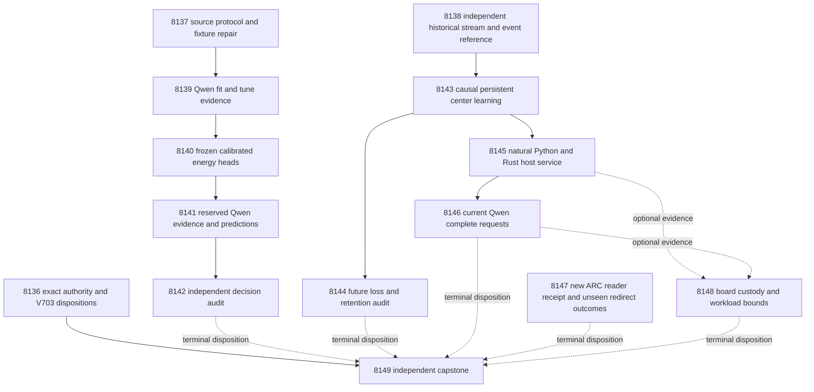

# Carnot Research Roadmap v704 — Executable evidence decisions and independent continuous energy learning

**Milestone:** `2026.10.704`  
**Created:** 2026-10-04  
**Status:** Proposed; staged, not activated  
**Supersedes:** completed execution of `2026.10.703`  
**Task contract:** exactly **14 tasks, Exp8136 through Exp8149**, in the order below.  
**Execution authority:** `research-roadmap-next.yaml`  
**Preserved predecessor:** `research-roadmap-v703-preserved-20261004.md`

This milestone tests source evidence, continuous learning and complete service
costs. It separates source capture from historical learning inputs. A source
protocol failure must not block an otherwise qualified learning experiment.

## What v703 proved

The active roadmap and conductor log establish thirteen scheduled dispositions.
The completed archive currently ends at V702. It is not evidence that V703
scientific work ran. Five primary artifacts exist; seven other tasks were
skipped after the unpublished protocol producer failed.

| Experiment | Observed evidence | Consequence |
|---|---|---|
| 8123 | `complete_null_contract_custody`; contract readiness 1. | Reuse the exact heading/table/JSON/digest reader. |
| 8124 | No primary. Conductor recorded CLI failures and failing pre-tests. | Repair the observed fixture boundary before new capture. |
| 8125–8131 | Seven gate-skipped tasks; the learning prerequisite 8129 also depended on 8124. | Source and learning science did not run. |
| 8132 | `complete_circular_positive_host_service_fixture`; host readiness 1, complete-service and natural-update readiness 0. | Fixture timing cannot establish natural learning or complete service. |
| 8133 | `complete_blocked_validation_command_manifest`; the referenced Exp8120 manifest hash changed. | Qualify a new reader receipt without altering the historical failed expectation. |
| 8134 | Board and host-bound readiness 1; `complete_blocked_complete_service_ready_score`. | Preserve board custody; acquire actual full request costs. |
| 8135 | `complete_blocked_primary_exists`; capstone execution readiness 1, science readiness 0. | Administrative closure does not close the three PRD gaps. |

The exact disposition count is five primaries, one failed unpublished producer
and seven gate skips. All thirteen scheduled tasks are accounted for.

Planning ran the unchanged Exp8124 test file. Nine tests passed; the next test
failed with `PermissionError` when it tried to mutate the read-only
`evidence_capture_manifest.json`. The test never reached replay rejection.
The repair must preserve production seals and allow private mutation tests to
exercise hash rejection. This is a diagnosed implementation boundary, not a
reason to delete the assertion or relax production checks.

Exp8116 also remains disqualified. Its stored configuration has delay 8,
learning rate .01, growth 96/128/160 and eight admission labels. The sealed V702
protocol specifies delay 20, .05, growth 64/128/192 and twelve labels. A claim of
operator override inside a result is not itself an operator directive.

## Three biggest gaps against the PRD

1. **FR-06 / FR-12: useful independent verification decisions.** No V703 source
   comparison ran. Train small energy heads on source-conditioned signals.
   Compare equal-information controls and typed decision cost. Exposed source
   roles permit a development result only. A separate untouched corpus remains
   necessary before closing independent generalization.
2. **FR-11: continuous learning with measured later benefit.** Changing centers
   or weights is insufficient. Execute the declared delayed-feedback schedule,
   then independently measure later loss, retention and restart parity.
   Historical Qwen inputs make this branch independent of new capture.
3. **FR-05 / FR-08 / NFR-01: useful complete-service performance.** Qualified
   fixture arithmetic does not prove production throughput. Measure natural
   host transactions, then fresh model acquisition through durable response
   commit. Preserve workload-specific speed bounds and hardware scope.

## Research incorporated before design

The dated V704 scan was appended to `research-references.md` before task design.
It covers all eight requested primary topics and all six secondary sources.
Semantic Scholar citation endpoints remained inaccessible. GitHub trending
pages were stale. Those limits are recorded; no exhaustive citation coverage
or current trending rank is claimed.

| Source | Mechanism used | Experiment |
|---|---|---|
| [HART](https://arxiv.org/abs/2603.05828), March 2026 | Separate quote custody, semantic judgment and source sensitivity. | 8137, 8139, 8142 |
| [RT4CHART v2](https://arxiv.org/html/2603.27752v2), July 2026 | Continue the restricted evidence-span intervention; do not claim full claim-decomposition reproduction. | 8137–8142 |
| [SURE-RAG](https://arxiv.org/abs/2605.03534), 2026 | Make selective decisions and calibration explicit; preserve natural-versus-controlled target boundaries. | 8140, 8142 |
| [Capacity-constrained delayed learning](https://arxiv.org/abs/2606.11711) and [delay reduction](https://arxiv.org/abs/2602.02634) | Separate issue, release, admission and update events. Account for finite pending capacity. | 8138, 8143, 8144 |
| [KAC](https://arxiv.org/abs/2503.21076) and [KAN forgetting](https://arxiv.org/abs/2511.12828) | Equal-capacity radial controls and explicit retention; no intrinsic nonforgetting claim. | 8140, 8143, 8144 |
| [ARM–EBM](https://arxiv.org/abs/2512.15605) | Verify probability-equivalent logistic and energy parameterizations. | 8140 |
| [Extropic Z1T](https://extropic.ai/writing/z1t) and [higher-order FPGA Ising](https://doi.org/10.1038/s41467-026-71937-4) | Charge readout, movement, host orchestration and persistence. | 8145, 8146, 8148 |

LagONN, EBT, energy-guided decoding and sparse Ising remain relevant background.
No new solver, generator training or decoder steering branch is justified before
qualified verifier utility. KAN importance anchoring and unchanged retired
external-text reranking remain closed. No operator override is fabricated.

## Architecture



Solid edges denote data dependencies. Only the gate table below defines conductor
skip conditions. The capstone has no upstream success gate. The first task is
an administrative receipt; it is not a universal research prerequisite.

## Phase 1 — Qualify independent inputs (Exp8136–Exp8138)

8136 binds the exact fourteen-task authority and predecessor dispositions.
8137 repairs the observed private-fixture failure, ingests source methods and
qualifies only source capture. It does not read the learning stream as a gate.
8138 authenticates historical learning data directly and compares the complete
runner against a small independent event-state reference. Full-size fixture
validation occurs before natural execution. These are the reserved infrastructure
slots; expensive inference does not precede qualified producer contracts.

## Phase 2 — Train and test evidence decisions (Exp8139–Exp8142)

Capture paired holistic and source-span judgments on the fixed fit/tune roles.
Train and freeze small matched heads. Capture reserved predictions without labels.
An independent reducer tests H1 and reports calibration, cost and source controls.
This is the reserved calibrated-decision training work. Qwen weights stay frozen.

## Phase 3 — Learn continuously and measure useful costs (Exp8143–Exp8146)

Run the independently qualified delayed learner on stored Qwen features.
Audit H2, retention and recovery. Measure natural learner states through the
loaded Rust binding. Then measure complete current model requests with the same
natural head. No task can relabel fixture timing as natural evidence.

## Phase 4 — Preserve live-agent and hardware obligations (Exp8147–Exp8149)

Qualify a new ARC reader from current code and raw fixtures. Inspect only unseen
redirect outcomes. Empty authentic ledgers terminate without policy churn.
Compute acceleration bounds from qualified natural costs and preserve each board.
The capstone accounts for every task, including blocks, nulls and disqualifications.

## Frozen study and measurement contract

### Source roles and model capture

Retain Exp8098's original 640 source-cluster slots: fit 128, tune 64,
evaluation 128, stream 256 and retention 64. Keep original masks and response
selection. No resplit or replacement depends on labels, parse success or context
length. `exposure_scope=exposed_development_within_run_disjoint`. This milestone
cannot establish independent generalization from these already exposed sources.

Source tasks use the exact V703 two-arm prompts and parser. Both arms receive
complete source and response bytes. Each gets at most 128 output tokens and
6000 input tokens. Exclude an overlong source whole. The span arm requests a
probability plus at most one 32-word quote and half-open UTF-8 byte offsets.
An invalid/absent quote keeps its valid probability, validity 0 and ratio 0.
Malformed probability makes a pair missing. Quote equality is not entailment.

Exp8139 permits 384 main calls plus 48 diagnostics on the first 16 fit slots:
one holistic duplicate and two span interventions, removed source and cyclic
mismatch. Maximum 432 calls / 55,296 output tokens. Exp8141 permits 256 calls /
32,768 output tokens. Both use one load, a 300-second load deadline and a
120-second call deadline. Stop new requests at 3000 seconds; close at 3120.
Checkpoint every 16 sources. Preserve unstarted and censored slots. These are
bounded generation tasks, even if accumulated wall time exceeds 60 seconds.

Capture readiness needs 96 fit pairs / 48 tune pairs, or 96 evaluation pairs.
Training additionally needs 12 examples per class in each fit/tune role.
The independent evaluator checks 12 per class on evaluation. Transport readiness
never requires a favorable source-sensitivity result. Perturbed sources have no
inherited human target. Diagnostic effects remain exploratory.

### Matched small heads and decisions

The twelve features are holistic logit, eight existing lexical features,
span logit, quote-validity indicator and quote/source-byte ratio. Clip probability
to [1e-6, 1-1e-6]. Normalize with fit-only mean/std; zero std becomes 1.

Use scalar holistic, scalar span, mean probability, linear12, additive cubic,
radial16, equivalent-logistic and always-escalate arms. Full-feature learned
controls use all twelve features. The additive head uses degree 3, fit quantiles
.25/.5/.75, endpoint multiplicity 4, padding 1e-8 and clipping. Recompute geometry
inside four source folds. Ridge grid is [.0001, .001, .01, .1, 1]. Maximum fitting
is 256 iterations and 600 seconds total. Mean fit-fold log loss selects the
model; larger ridge breaks ties. Intercepts are not penalized.

Use sixteen public farthest-first radial centers, SHA256 source ties, and median
positive scaled fit distance as width, fallback 1. Apply the same tune-only
affine-logit calibration procedure to each fitted arm. Freeze all weights,
transforms, calibration and thresholds before reserved capture. No generator
weights change. `E(x,0)=0`, `E(x,1)=-z(x)` must produce the same probabilities
as the logistic control within 1e-10 and identical decisions.

Let y=1 mean hallucination. False accept costs 5; false reject costs 1.
Correct accept/reject costs 0; escalation costs .5. Choose minimum expected
loss and escalate on ties. Define gain as control loss minus treatment loss.
Report typed cost, Brier, log loss, false accepts and coverage for every arm.

### Continuous learning

The machine-readable `delayed_memory` and `statistical_plan.H2` in
`v702-methods-and-stream-protocol.md` remain the numerical authority. Exp8138
must compare executed values, not merely duplicate a config object. Require
224 usable stream sources and 48 retention sources to qualify historical input.

Start from the historical Qwen logit plus exactly zero residual. Normalize only
from original public slots 1–64, with at least 28 usable sources. Evaluate slots
65–256. Seeds 101–120 are repeats within source units. Delay is 20 original
slots; pending capacity is 32. Growth occurs at 64/128/192, adding four centers
each time from 16 initial to at most 28. The update uses four SGD steps,
learning rate .05 and ridge .01. Couplings remain fixed within each query.

Compare error-selected, fixed-public and random released-past centers with equal
capacity and update budgets, plus frozen Qwen. Use newest 64 released update
rows, at least 16 eligible and four frozen-offset issued errors. SHA256(source_id)
modulo 4 assigns bucket 0 to admission only. Commit a trained candidate before
receiving its next twelve unused admission labels; require two per class.
Use step grid 1/.5/.25/.125. Apply the original incumbent and frozen-baseline
cost/Brier guards with no extra false accepts. Expire an incomplete admission
before the next opportunity or slot 256. Rejection keeps installed zero-weight
centers and old coefficients.

Persist issue states, pending events, optimizer/RNG, centers, coefficients,
consumed labels and original masks. Oldest overflow loses feedback permanently.
Do not flush future labels at stream end. Checkpoint every 32 slots and each
opportunity. Bound natural CPU science at 1200 seconds. Seal final heads and
retention predictions before retention labels open. An independent event-state
reference and full-size fixture qualification precede this run. No regret bound
or lifelong safety theorem is inherited from the cited papers.

### Statistical decision rules

There are exactly two primary hypotheses. H1 compares radial with additive typed
cost on reserved source evaluation. H2 compares error-center with fixed-public
center cost on later stream slots. Bonferroni family alpha .05 gives each a
one-sided 97.5% interval. Use 10,000 resamples and at least 9500 valid draws.
H1 resamples source clusters. H2 averages seeds per source before moving-block
resampling of original slots, primary length 16, sensitivity lengths 8 and 32.

H1 needs 96 complete sources and 12 per class. H2 needs 128 complete later sources,
eight per class and eight nonoverlapping blocks. Retention needs 48 sources and
eight per class. Inadequate support yields insufficient-support or blocked
inference, not a conclusion that the architecture fails.

Either benefit claim needs gain lower bound >.02, five improved sources, no extra
false accepts, Brier increase <=.01 and no comparable control advantage >.02 cost.
H2 also requires retention cost increase <=.02, Brier increase <=.01 and no extra
false accepts. Positive controls must distinguish deliberate private corruption
before interpreting a natural null. Fixture success itself is circular evidence.
Do not make rare-event, lifelong-safety or sub-percentage-point claims.

### Natural host and complete-service costs

Exp8145 uses real natural states. Measure Python/native scalar and batch
1/4/16/64/256 paths with five warmups and thirty paired repeats per condition.
Charge lookup, hashing, features, crossings, serialization, fsync and recovery.
Parity tolerance is 1e-10 with identical decisions. At least one accepted and one
rejected natural update are needed to claim both update costs. Missing categories
stay unavailable; synthetic recovery fixtures are labelled separately.

Exp8146 freezes 24 original public retention keys, without labels. Each pair runs
two complete cold requests from identical durable state, alternating Python/native
order. Use the exact historical stream prompt/parser and final nine-feature
natural head. Current generation runs separately in each arm. Reset owned cache
state between arms; preserve source bytes and request semantics. Budget 48 measured
plus eight excluded warmup calls, at most 128 output tokens each: 7168 tokens total.
One 300-second load, 120 seconds per call, stop new work at 2200 seconds and close
at 2400. Record load separately, plus totals with and without startup.

The timer spans ingress through current generation, lexical features, energy,
decision, serialization and durable response commit. All 24 pairs must be complete
with identical generated outputs and numerical/decision parity for a full-service
comparison. Do not exclude divergent or slow pairs to improve the headline.
Smaller or mismatched panels remain descriptive. Use 10,000 paired source resamples
of log latency ratios. A one-sided 95% lower bound >1 supports a bounded speed
claim; >=10 meets NFR-01 for that stated workload. Timing repetitions do not add
independent semantic sources. Preserve the measured null if acquisition dominates.

## Dependency and gate contract

Each gate points to an earlier task in this roadmap. Its exact field appears
in that producer's REQUIRED ARTIFACT FIELDS. Readiness means qualified execution,
not a positive scientific effect. Fixture qualification can correctly have
`verdict_class=circular_positive`; no gate mistakes that for failed conformance.

| Consumer | Required fields, all conjunctive |
|---|---|
| 8139 | 8137.source_protocol_ready_score == 1 |
| 8140 | 8139.fit_capture_ready_score == 1 |
| 8141 | 8140.energy_fit_ready_score == 1 |
| 8142 | 8141.evaluation_capture_ready_score == 1 |
| 8143 | 8138.learning_protocol_ready_score == 1 |
| 8144 | 8143.learning_trajectory_ready_score == 1 |
| 8145 | 8143.learning_trajectory_ready_score == 1 |
| 8146 | 8145.natural_service_ready_score == 1 |
| 8136, 8137, 8138, 8147, 8148, 8149 | No structured upstream gate. Optional inputs receive separate dispositions. |

Exp8148 checks optional cost fields inside independent branches. A blocked cost
measurement cannot erase board history. Exp8149 always runs to close accounting.
No `requires` or `gated_on` references a retired experiment. Historical evidence
is read-only input, individually authenticated rather than assumed current.

## Hardware requirements and acceleration path

| Resource | Required work | Claim boundary |
|---|---|---|
| Existing CUDA RTX 3090 pair, 48 GB combined | Frozen Qwen3.8-27B GGUF in 8139, 8141 and 8146 | Each run must capture current identity/offload evidence. No historical receipt proves a current load. |
| CPU and system memory | Small-head fitting, event replay, audits, durable state | Timings include preparation and persistence; no GPU-training claim. |
| Existing Rust/PyO3 radial binding | Natural scalar/batch scoring and complete-request comparison | Actual loaded extension and runtime hashes, not source-only parity. |
| KV260 | Preserve authenticated fabric history at k<=5 | No new board performance claim or availability probe. |
| PolarFire | Preserve Linux CPU dispatch history | No fabric claim. |
| GateMate | Preserve physical/JTAG `0xffffffff` block | Reopen only after documented cable/port/power/wiring change. |
| NPU / TSU / larger FPGA | Deferred | Reopen after useful measured bottleneck, supported operators and authenticated execution path. |

The learning path is CPU durable memory plus bounded vector arithmetic. Batch
features and small heads can map to GPU/NPU. FPGA requires a supported radial
operator/precision mapping; a Gaussian evaluator is not automatically an Ising
sampler. TSU use requires an actual compatible sampling workload.

Every learning tier must explain the 100x path. Exp8148 computes the optimistic
zero-arithmetic ceiling `S_max=1/(1-f)` from the measured arithmetic fraction f.
Even infinite arithmetic acceleration requires f>=.99 for 100x. If this fails,
redesign host work, acquisition frequency or persistence while preserving causal
semantics before attempting a board port. No purchase is needed for this plan.

### Model and runtime contract

Every current LLM task declares `MODEL_SPECS: [unsloth/Qwen3.8-27B-GGUF]` and
`inference_substrate_class: model_bounded_generation`. These are fixed token
budgets, with a 10-second plausibility floor, not padding instructions.
`model_full_generation` has a 60-second floor and is unused here.
`model_load_no_generation` has a 2-second floor and applies only if actual
execution stops after load. No-load tasks declare empty MODEL_SPECS and
`no_model_load`. Historical model provenance is separate from current calls.
Legacy small models are permitted only in labelled CPU smoke tests.

## Execution discipline, retirement and validation

Every prompt has numbered steps requiring flushed phase-boundary progress and
before/after lines around model loads, generation, benchmarks and subprocesses.
Long loops and waits report actual counts at least every 60 seconds. Tool waits
are at most 60 seconds; no silence gap may reach 600 seconds. Files over about
200 lines are written in chunks of about 150 lines, with progress between calls.
The 4800-second hard cap does not excuse silence. No runtime padding is allowed.

Use the existing publication and raw-shard machinery. Do not recursively embed
large upstream/state graphs. Full-size fixture receipts must pass unchanged
adversarial and strict row validators within 300 seconds each before learning.
Logs and byte hashes must remain accessible through validation and publication.

All tasks name prior failures with four mandatory fields, including
`retire_if_same_verdict: true`. Unpublished predecessors are identified by the
exact conductor status and explicitly lack an honest_verdict. Do not invent
one. New IDs do not authorize unchanged mechanisms. The source repair has a
reproduced fixture failure; the learning repair has measured protocol/validation
mismatches; ARC qualification creates a current receipt without altering the
historical mismatch. No retired ID is reused and no operator override is claimed.

The first three tasks include infrastructure qualification. Complex authority,
protocol and ARC receipt work use Claude Opus with 100 turns. Routine research
uses the default Claude/Sonnet with 50 turns; the hardware analysis uses 30.
No Luna task is proposed. This routing follows the current user directive.

Implementation tasks must extend existing research-reporting, verification,
self-learning or ARC capability requirements before code. They write tests first,
run scoped unit/lint/type/coverage checks and reconcile specs and operational docs.
Every comparative artifact includes per-unit rows. Each blocked artifact uses the
exact `gate_check_summary` field. `partial` means retryable unfinished owned work;
unchanged external blocks are terminal `blocked`. Oracle fixtures cannot establish
an independent verifier result.

Applicable execution E2E checks are E2E-015/019 for source/label isolation,
E2E-016 for capture/replay, E2E-003/004 for native paths, E2E-017 for ARC readers and
E2E-018 for authority/capstone. Planning exercises the existing private E2E-018
CLI tests and staged/activation lifecycle using temporary authority copies.
Historical primary-writing CLI commands are not rerun against live results.
No experiment, activation, external publication or push occurs during planning.

## Exact task contract

Exactly fourteen tasks follow in conductor execution order. The complete JSON
contract includes every prompt, gate, model, prior failure and execution field.

| Order | ID | Title | Phase | Deliverable |
|---|---|---|---|---|
| 1 | `exp8136-contract-custody` | Bind fourteen tasks and preserve the terminal V703 dispositions | 1 | `results/experiment_8136_v704_contract_custody.json` |
| 2 | `exp8137-source-protocol` | Qualify source evidence capture after the private fixture permission failure | 1 | `results/experiment_8137_v704_source_protocol.json` |
| 3 | `exp8138-learning-protocol` | Qualify delayed learning independently of source capture | 1 | `results/experiment_8138_v704_learning_protocol.json` |
| 4 | `exp8139-fit-evidence-capture` | Capture paired Qwen evidence on fixed fit and tune sources | 2 | `results/experiment_8139_v704_fit_evidence_capture.json` |
| 5 | `exp8140-evidence-energy-fit` | Train calibrated energy decisions with equal-information controls | 2 | `results/experiment_8140_v704_evidence_energy_fit.json` |
| 6 | `exp8141-reserved-evidence-capture` | Capture reserved Qwen evidence after every decision head freezes | 2 | `results/experiment_8141_v704_reserved_evidence_capture.json` |
| 7 | `exp8142-decision-audit` | Independently measure evidence-linked calibration and decision value | 2 | `results/experiment_8142_v704_decision_audit.json` |
| 8 | `exp8143-delayed-energy-memory` | Learn persistent energy centers from correctly delayed feedback | 3 | `results/experiment_8143_v704_delayed_energy_memory.json` |
| 9 | `exp8144-learning-audit` | Independently test later learning benefit retention and recovery | 3 | `results/experiment_8144_v704_learning_audit.json` |
| 10 | `exp8145-natural-service-cost` | Measure natural learner transactions through the loaded Rust binding | 3 | `results/experiment_8145_v704_natural_service_cost.json` |
| 11 | `exp8146-live-service-cost` | Measure complete Qwen acquisition and natural scoring transactions | 3 | `results/experiment_8146_v704_live_service_cost.json` |
| 12 | `exp8147-arc-reader-renewal` | Qualify an independent ARC supervisor reader and inspect new outcomes | 4 | `results/experiment_8147_v704_arc_reader_renewal.json` |
| 13 | `exp8148-hardware-workload-boundary` | Bound acceleration from natural workloads and preserve board custody | 4 | `results/experiment_8148_v704_hardware_workload_boundary.json` |
| 14 | `exp8149-capstone` | Decide fourteen outcomes and the remaining PRD gaps independently | 4 | `results/experiment_8149_v704_capstone.json` |

Canonical full-task SHA256: `591cea384a682d274611508206f0486d0a50c763f2277d8a1229c673a4611d16`

<!-- V704_TASK_CONTRACT_START -->
```json
{
  "milestone": "2026.10.704",
  "tasks": [
    {
      "id": "exp8136-contract-custody",
      "title": "Bind fourteen tasks and preserve the terminal V703 dispositions",
      "phase": 1,
      "track": "infrastructure",
      "priority": "high",
      "requires_gpu": false,
      "max_turns": 100,
      "estimated_wall_time_min": 25,
      "per_unit_rows": true,
      "milestone": "2026.10.704",
      "deliverable": "results/experiment_8136_v704_contract_custody.json",
      "inference_substrate_class": "no_model_load",
      "MODEL_SPECS": [],
      "gated_on": [],
      "prior_failures": [
        {
          "experiment_id": "exp8110-contract-custody",
          "verdict": "complete_blocked_design_exact_task_contract",
          "addressed_by": "Reuse the now-qualified Exp8123 reader and exercise the exact V704 heading/table/full-task digest before activation.",
          "retire_if_same_verdict": true
        },
        {
          "experiment_id": "exp8083-contract-custody",
          "verdict": "complete_disqualified_research-roadmap-vNEXT_md",
          "addressed_by": "Generate both documents from all14 actual dictionaries and preserve predecessor design bytes.",
          "retire_if_same_verdict": true
        }
      ],
      "agent_type": "claude",
      "model": "opus",
      "prompt": "CONTEXT:\nWork in {project_root} on {date}. V703 scheduled13 tasks but published only5 primaries. Exp8124 failed before publication and7 dependents were skipped. Exp8123 proved exact authority binding. The archive ends at V702; use the active V703 roadmap and conductor log for this closure.\nEXISTING CODE TO READ FIRST:\nCLAUDE.md; CODEX.md; ops/e2e-test-plan.md; openspec/capabilities/research-reporting/spec.md; openspec/capabilities/verification/spec.md; scripts/experiment_template.py; python/carnot/reporting/current_work_receipt.py; python/carnot/reporting/primary_publication.py; tests/python/test_primary_publication_7928.py; ops/exclusion_manifest.yaml; openspec/change-proposals/research-roadmap-vNEXT.md; python/carnot/reporting/roadmap_contract.py; python/carnot/reporting/v685_authority_lifecycle.py; tests/python/test_experiment_7891_v685_authority_lifecycle.py; results/experiment_8123_v703_contract_custody.json; results/experiment_8135_v703_capstone.json; openspec/change-proposals/research-roadmap-v703-preserved-20261004.md; ops/conductor-log.md\nTASK:\nBind fourteen tasks and preserve the terminal V703 dispositions. Deliver results/experiment_8136_v704_contract_custody.json, primitive evidence under results/raw/experiment_8136_v704_contract_custody/ and runnable scripts/experiments/experiment_8136_v704_contract_custody.py.\nCONCRETE STEPS:\n1. Emit a flushed progress line at every phase boundary. Emit one before and after each model load, generation, benchmark and subprocess. Set PYTHONUNBUFFERED=1 and use print(..., flush=True). Print real completed/pending counts inside long loops and child waits at least every60 seconds. Keep each silence gap below600 seconds. Poll children in tool calls of at most60 seconds. Write files over about200 lines in several tool calls of at most about150 lines. Send a progress message between writes. Never pad duration or invent progress.\n2. Check input paths, hashes and prerequisites with bounded calls. Read cited results through scripts/summarize_artifact.py. Preserve historical failed primaries. An unchanged missing or retired upstream is terminal complete_blocked_<check>, verdict_class=blocked. Record its exact field, expected value and observed value in gate_check_summary. Never use partial for an external block.\n3. Extend the relevant REQ-* and SCENARIO-* before implementation. Write failing tests first. Reuse existing qualified modules through a thin CLI. Keep test and validation outputs in private temporary directories outside results/. Preserve original assertions. Require script-path execution outside the checkout without PYTHONPATH.\n4. Load no LLM. Declare MODEL_SPECS=[] and inference_substrate_class=no_model_load. Use aggregation_from_upstream_artifacts for reductions, or verifier_ensemble_against_cached_candidates for CPU head evaluation. Put historical Qwen identity under cited_upstream_artifacts, not current invocation evidence. Describe trained small heads in trained_head_specs.\n5. Bind exactly14 full task dictionaries Exp8136 through Exp8149. Require the literal heading ## Exact task contract, five-column table, V704_TASK_CONTRACT_START JSON and canonical tasks_digest. Compare prompts, models, gates and complete failure history with the actual activated authority.\n6. Preserve the V703 design bytes separately from its activation snapshot. Reconstruct13 dispositions: five primaries, one failed unpublished producer and seven gate skips. A missing honest_verdict remains missing; label conductor statuses as conductor statuses. Never manufacture a scientific verdict for skipped work.\n7. Exercise staging, activation, staging disappearance and immutable snapshots with the existing parameterized reader. Planning simulation uses private copies only. Never change research-roadmap.yaml. Reject omitted/extra/reordered tasks, stale digest, prompt mutation and gate-field drift.\n8. Run E2E-018 through a private authority CLI and twelve mutations. Export administrative contract readiness independently of every research branch. Do not make this receipt a universal science gate.\n9. Freeze owned validation argv before measurement. Run scoped unit and consumer tests, Ruff check and format, strict mypy, 100% changed-code statement coverage and scoped spec coverage. Run applicable E2E private CLI success, external block, mutation and cold replay. Capture argv, expected/actual exits, normal exit, duration and log hash. If Rust changes, run cargo test, fmt, clippy and the actual loaded binding. Keep existing repository-health failures separate; do not turn an unrelated full-suite rerun into a science prerequisite.\n10. Save primitive rows and transcripts with source/code/config hashes. Independently recompute reductions. Run unmodified scripts/adversarial_verify.py and strict scripts/verdict_row_consistency_lint.py with a60s heartbeat and normal exits. Publish through primary_publication only after owned validation passes. An owned validation failure disqualifies the result and sets readiness0. Reconcile openspec/, _bmad/traceability.md, ops/status.md and ops/changelog.md without deleting history. Do not edit operator-curated publication pages or publish externally.\nREQUIRED ARTIFACT FIELDS:\n- honest_verdict: complete_* terminal string; principle: completed nulls and external blocks are recorded once.\n- verdict_class: positive | circular_positive | null | blocked | disqualified | partial; principle: partial means unfinished owned work only.\n- verifier_is_oracle, claim_scope, exposure_scope; principle: fixture truth is circular_positive, never a positive natural-data result.\n- independent_generalization_score: 0; generalized_learning_benefit_score: 0; principle: exposed development cannot prove external generalization.\n- required_checks_passed, flagged_adversarial, validation_receipts, terminal_validation_sidecar_path; principle: normal owned checks precede publication.\n- gate_check_summary: check/upstream/path/hash/artifact_field/op/expected/observed/passed; principle: every blocked result names the failed operand.\n- inference_substrate, inference_substrate_class, MODEL_SPECS, model_invocation_counts, call_ledger, trained_head_specs; principle: distinguish current execution from imported model provenance.\n- rows: unit_id/source_cluster_id/arm/condition/metric/numerator/denominator/status/exclusion_reason; principle: comparative headlines reduce from per-unit evidence with missing units retained.\n- intended_count, eligible_count, independent_count, completed_count, excluded_count, censored_count, failed_count, sample_size_budget; principle: repeats do not create independent sources.\n- run_date, duration_s, random_seed, reproducibility_checksum, source_artifact_hashes, raw_shard_hashes, code_config_hashes, phase_spans; principle: bind real work to exact bytes.\n- acceptance_gates, field_principles, cited_upstream_artifacts; principle: explain thresholds and imported fields.\n- contract_ready_score: 0|1; principle: authority agreement is administrative, not scientific benefit.\n- task_contract, canonical_tasks_sha256, authority_snapshots, historical_dispositions; principle: preserve the actual13 predecessor outcomes and14 planned tasks.\nRun command: cd {project_root} && PYTHONUNBUFFERED=1 JAX_PLATFORMS=cpu .venv/bin/python -u scripts/experiments/experiment_8136_v704_contract_custody.py --date {date}\nDo NOT push. Do NOT modify scripts/research_conductor.py."
    },
    {
      "id": "exp8137-source-protocol",
      "title": "Qualify source evidence capture after the private fixture permission failure",
      "phase": 1,
      "track": "infrastructure",
      "priority": "high",
      "requires_gpu": false,
      "max_turns": 100,
      "estimated_wall_time_min": 40,
      "per_unit_rows": true,
      "milestone": "2026.10.704",
      "deliverable": "results/experiment_8137_v704_source_protocol.json",
      "inference_substrate_class": "no_model_load",
      "MODEL_SPECS": [],
      "gated_on": [],
      "prior_failures": [
        {
          "experiment_id": "exp8124-evidence-protocol",
          "verdict": "FAIL (conductor; no primary honest_verdict)",
          "addressed_by": "Planning reproduced the exact private-fixture chmod/tamper conflict; repair only this boundary, keep production immutability, and remove stream qualification from this task.",
          "retire_if_same_verdict": true
        },
        {
          "experiment_id": "exp8112-fit-source-capture",
          "verdict": "complete_blocked_qwen_cache_revision",
          "addressed_by": "Use authenticated nested expected identity before observed-cache checks and exercise the actual precondition builder.",
          "retire_if_same_verdict": true
        }
      ],
      "agent_type": "claude",
      "model": "opus",
      "prompt": "CONTEXT:\nWork in {project_root} on {date}. Planning reproduced Exp8124 test_freeze_precedes_evaluator_and_mutated_replay:9 tests passed, then PermissionError while writing evidence_capture_manifest.json. The tamper assertion never ran. Repair that exact boundary before model calls. HART and RT4CHART motivate evidence linkage, not an entailment oracle.\nEXISTING CODE TO READ FIRST:\nCLAUDE.md; CODEX.md; ops/e2e-test-plan.md; openspec/capabilities/research-reporting/spec.md; openspec/capabilities/verification/spec.md; scripts/experiment_template.py; python/carnot/reporting/current_work_receipt.py; python/carnot/reporting/primary_publication.py; tests/python/test_primary_publication_7928.py; ops/exclusion_manifest.yaml; openspec/change-proposals/research-roadmap-vNEXT.md; python/carnot/verify/evidence_protocol_8124.py; tests/python/test_evidence_protocol_8124.py; openspec/change-proposals/v703-evidence-protocol.md; python/carnot/verify/methods_stream_custody_8111.py; python/carnot/experiment_8118_v702_fresh_acquisition_cost.py; python/carnot/inference/sota_models.py; research-references.md; research-studying.md; results/experiment_8102_v701_learning_stream_capture.json; results/experiment_8118_v702_fresh_acquisition_cost.json\nTASK:\nQualify source evidence capture after the private fixture permission failure. Deliver results/experiment_8137_v704_source_protocol.json, primitive evidence under results/raw/experiment_8137_v704_source_protocol/ and runnable scripts/experiments/experiment_8137_v704_source_protocol.py.\nCONCRETE STEPS:\n1. Emit a flushed progress line at every phase boundary. Emit one before and after each model load, generation, benchmark and subprocess. Set PYTHONUNBUFFERED=1 and use print(..., flush=True). Print real completed/pending counts inside long loops and child waits at least every60 seconds. Keep each silence gap below600 seconds. Poll children in tool calls of at most60 seconds. Write files over about200 lines in several tool calls of at most about150 lines. Send a progress message between writes. Never pad duration or invent progress.\n2. Check input paths, hashes and prerequisites with bounded calls. Read cited results through scripts/summarize_artifact.py. Preserve historical failed primaries. An unchanged missing or retired upstream is terminal complete_blocked_<check>, verdict_class=blocked. Record its exact field, expected value and observed value in gate_check_summary. Never use partial for an external block.\n3. Extend the relevant REQ-* and SCENARIO-* before implementation. Write failing tests first. Reuse existing qualified modules through a thin CLI. Keep test and validation outputs in private temporary directories outside results/. Preserve original assertions. Require script-path execution outside the checkout without PYTHONPATH.\n4. Load no LLM. Declare MODEL_SPECS=[] and inference_substrate_class=no_model_load. Use aggregation_from_upstream_artifacts for reductions, or verifier_ensemble_against_cached_candidates for CPU head evaluation. Put historical Qwen identity under cited_upstream_artifacts, not current invocation evidence. Describe trained small heads in trained_head_specs.\n5. Reproduce the existing private-fixture PermissionError first. Keep historical tests and all tamper assertions intact. Separate mutable private mutation fixtures from immutable production seals. Require the original test to reach replay rejection; do not globally remove read-only publication protection or bypass tracked_results_guard.\n6. Ingest HART2603.05828v1, RT4CHART2603.27752v2 and SURE-RAG2605.03534 primary methods. Map evidence attribution, quote custody and selective calibration onto the frozen two-arm test. Save source links and limits; mark matching research-studying entries ingested. Citation-service failure is not a science gate.\n7. Authenticate original Exp8098 source roles fit128/tune64/evaluation128 and missing masks through Exp8111. Do not load or qualify stream/retention features here. Build expected nested runtime_identity.model_revision from authenticated Exp8102/Exp8118 receipts before observed-cache checks. Never fill a missing expectation with the observed value.\n8. Freeze the unchanged V703 holistic and source_span prompt prefixes, twelve features, strict probability parser and UTF-8 quote-offset checks. Preserve one128-token call per arm,6000 input tokens and32-word quote ceiling. Invalid quotes keep probabilities but are not evidence of entailment. Altered-source diagnostics receive no inherited target.\n9. Test actual production identity ordering, missing/mutated identities, private mutable fixture tampering, production immutable seals and current zero-call terminal builders. Require E2E-015/019 plus outside-checkout CLI and cold replay. Export source_protocol_ready_score only after these owned checks and source custody pass. No downstream learning task depends on this field.\n10. Freeze owned validation argv before measurement. Run scoped unit and consumer tests, Ruff check and format, strict mypy, 100% changed-code statement coverage and scoped spec coverage. Run applicable E2E private CLI success, external block, mutation and cold replay. Capture argv, expected/actual exits, normal exit, duration and log hash. If Rust changes, run cargo test, fmt, clippy and the actual loaded binding. Keep existing repository-health failures separate; do not turn an unrelated full-suite rerun into a science prerequisite.\n11. Save primitive rows and transcripts with source/code/config hashes. Independently recompute reductions. Run unmodified scripts/adversarial_verify.py and strict scripts/verdict_row_consistency_lint.py with a60s heartbeat and normal exits. Publish through primary_publication only after owned validation passes. An owned validation failure disqualifies the result and sets readiness0. Reconcile openspec/, _bmad/traceability.md, ops/status.md and ops/changelog.md without deleting history. Do not edit operator-curated publication pages or publish externally.\nREQUIRED ARTIFACT FIELDS:\n- honest_verdict: complete_* terminal string; principle: completed nulls and external blocks are recorded once.\n- verdict_class: positive | circular_positive | null | blocked | disqualified | partial; principle: partial means unfinished owned work only.\n- verifier_is_oracle, claim_scope, exposure_scope; principle: fixture truth is circular_positive, never a positive natural-data result.\n- independent_generalization_score: 0; generalized_learning_benefit_score: 0; principle: exposed development cannot prove external generalization.\n- required_checks_passed, flagged_adversarial, validation_receipts, terminal_validation_sidecar_path; principle: normal owned checks precede publication.\n- gate_check_summary: check/upstream/path/hash/artifact_field/op/expected/observed/passed; principle: every blocked result names the failed operand.\n- inference_substrate, inference_substrate_class, MODEL_SPECS, model_invocation_counts, call_ledger, trained_head_specs; principle: distinguish current execution from imported model provenance.\n- rows: unit_id/source_cluster_id/arm/condition/metric/numerator/denominator/status/exclusion_reason; principle: comparative headlines reduce from per-unit evidence with missing units retained.\n- intended_count, eligible_count, independent_count, completed_count, excluded_count, censored_count, failed_count, sample_size_budget; principle: repeats do not create independent sources.\n- run_date, duration_s, random_seed, reproducibility_checksum, source_artifact_hashes, raw_shard_hashes, code_config_hashes, phase_spans; principle: bind real work to exact bytes.\n- acceptance_gates, field_principles, cited_upstream_artifacts; principle: explain thresholds and imported fields.\n- source_protocol_ready_score: 0|1; principle: qualified source transport precedes GPU capture and cannot veto learning.\n- capture_manifest, expected_runtime_identity, source_role_manifests, source_method_map, fixture_permission_rows; principle: expected identity and methods precede observations.\nRun command: cd {project_root} && PYTHONUNBUFFERED=1 JAX_PLATFORMS=cpu .venv/bin/python -u scripts/experiments/experiment_8137_v704_source_protocol.py --date {date}\nDo NOT push. Do NOT modify scripts/research_conductor.py."
    },
    {
      "id": "exp8138-learning-protocol",
      "title": "Qualify delayed learning independently of source capture",
      "phase": 1,
      "track": "infrastructure",
      "priority": "high",
      "requires_gpu": false,
      "max_turns": 100,
      "estimated_wall_time_min": 55,
      "per_unit_rows": true,
      "milestone": "2026.10.704",
      "deliverable": "results/experiment_8138_v704_learning_protocol.json",
      "inference_substrate_class": "no_model_load",
      "MODEL_SPECS": [],
      "gated_on": [],
      "prior_failures": [
        {
          "experiment_id": "exp8129-learning-protocol-qualification",
          "verdict": "GATE_BLOCK (conductor; no primary honest_verdict)",
          "addressed_by": "Remove the failed source-protocol dependency; authenticate qualified historical stream data directly and test the exact full-size delayed protocol.",
          "retire_if_same_verdict": true
        },
        {
          "experiment_id": "exp8116-independent-online-memory",
          "verdict": "complete_disqualified_owned_validation",
          "addressed_by": "Correct executed protocol mismatches; cover the missing mutation branch and deduplicate evidence before bounded unchanged validators.",
          "retire_if_same_verdict": true
        }
      ],
      "agent_type": "claude",
      "model": "opus",
      "prompt": "CONTEXT:\nWork in {project_root} on {date}. Exp8129 never ran because Exp8124 retired. Exp8116 is disqualified and its delay8/lr.01/admission8 execution differs from the sealed delay20/lr.05/admission12 protocol. This task takes historical stream custody directly, with no source-capture prerequisite.\nEXISTING CODE TO READ FIRST:\nCLAUDE.md; CODEX.md; ops/e2e-test-plan.md; openspec/capabilities/research-reporting/spec.md; openspec/capabilities/verification/spec.md; scripts/experiment_template.py; python/carnot/reporting/current_work_receipt.py; python/carnot/reporting/primary_publication.py; tests/python/test_primary_publication_7928.py; ops/exclusion_manifest.yaml; openspec/change-proposals/research-roadmap-vNEXT.md; openspec/change-proposals/v702-methods-and-stream-protocol.md; python/carnot/verify/methods_stream_custody_8111.py; python/carnot/verify/independent_online_memory_8116.py; python/carnot/reporting/independent_memory_execution_8116.py; tests/python/test_independent_online_memory_8116.py; results/experiment_8111_v702_methods_and_stream_custody.json; results/experiment_8102_v701_learning_stream_capture.json; results/experiment_8116_v702_independent_online_memory.json; research-references.md\nTASK:\nQualify delayed learning independently of source capture. Deliver results/experiment_8138_v704_learning_protocol.json, primitive evidence under results/raw/experiment_8138_v704_learning_protocol/ and runnable scripts/experiments/experiment_8138_v704_learning_protocol.py.\nCONCRETE STEPS:\n1. Emit a flushed progress line at every phase boundary. Emit one before and after each model load, generation, benchmark and subprocess. Set PYTHONUNBUFFERED=1 and use print(..., flush=True). Print real completed/pending counts inside long loops and child waits at least every60 seconds. Keep each silence gap below600 seconds. Poll children in tool calls of at most60 seconds. Write files over about200 lines in several tool calls of at most about150 lines. Send a progress message between writes. Never pad duration or invent progress.\n2. Check input paths, hashes and prerequisites with bounded calls. Read cited results through scripts/summarize_artifact.py. Preserve historical failed primaries. An unchanged missing or retired upstream is terminal complete_blocked_<check>, verdict_class=blocked. Record its exact field, expected value and observed value in gate_check_summary. Never use partial for an external block.\n3. Extend the relevant REQ-* and SCENARIO-* before implementation. Write failing tests first. Reuse existing qualified modules through a thin CLI. Keep test and validation outputs in private temporary directories outside results/. Preserve original assertions. Require script-path execution outside the checkout without PYTHONPATH.\n4. Load no LLM. Declare MODEL_SPECS=[] and inference_substrate_class=no_model_load. Use aggregation_from_upstream_artifacts for reductions, or verifier_ensemble_against_cached_candidates for CPU head evaluation. Put historical Qwen identity under cited_upstream_artifacts, not current invocation evidence. Describe trained small heads in trained_head_specs.\n5. Authenticate original stream256 and retention64 roles, Qwen historical features and missing masks directly from Exp8111/Exp8102. Require224 usable stream and48 retention sources. No dependency on Exp8137, new fit capture or a trained batch head. Validate each imported primitive independently; preserve historical disqualification.\n6. Ingest delayed-feedback2606.11711 and reduction2602.02634 methods. Serialize V702 delayed_memory and statistical_plan.H2 as the numerical authority. Explicitly reject the unsubstantiated operator-override wording in Exp8116 unless a real dated directive exists. This task uses delay20, lr.05, growth64/128/192, SHA256 source buckets and12 future admission labels.\n7. Implement a small independent event-state reference for the declared order. Compare the optimized runner at each prediction, candidate commit, release, admission and durable update. Test missing original slots, overflow, duplicate/reused labels, end-of-stream no-flush, delayed labels after restart and retention isolation. Use four SGD steps and step grid1/.5/.25/.125.\n8. Exercise the complete256-slot,4-arm,20-seed receipt on private fixture data. Store repeated state/transcript bytes once in content-addressed shards, with per-unit rows and checked references. Run unchanged adversarial and strict row validators within300s each with60s heartbeats. A timeout is failed qualification; do not increase the deadline or weaken checks.\n9. Run E2E-015/019, private CLI, mutation, crash/restart and cold replay. Export learning_protocol_ready_score only when input custody, exact protocol execution, full-size receipt validation and owned coverage pass. Fixture truth is circular_positive and carries zero natural learning benefit.\n10. Freeze owned validation argv before measurement. Run scoped unit and consumer tests, Ruff check and format, strict mypy, 100% changed-code statement coverage and scoped spec coverage. Run applicable E2E private CLI success, external block, mutation and cold replay. Capture argv, expected/actual exits, normal exit, duration and log hash. If Rust changes, run cargo test, fmt, clippy and the actual loaded binding. Keep existing repository-health failures separate; do not turn an unrelated full-suite rerun into a science prerequisite.\n11. Save primitive rows and transcripts with source/code/config hashes. Independently recompute reductions. Run unmodified scripts/adversarial_verify.py and strict scripts/verdict_row_consistency_lint.py with a60s heartbeat and normal exits. Publish through primary_publication only after owned validation passes. An owned validation failure disqualifies the result and sets readiness0. Reconcile openspec/, _bmad/traceability.md, ops/status.md and ops/changelog.md without deleting history. Do not edit operator-curated publication pages or publish externally.\nREQUIRED ARTIFACT FIELDS:\n- honest_verdict: complete_* terminal string; principle: completed nulls and external blocks are recorded once.\n- verdict_class: positive | circular_positive | null | blocked | disqualified | partial; principle: partial means unfinished owned work only.\n- verifier_is_oracle, claim_scope, exposure_scope; principle: fixture truth is circular_positive, never a positive natural-data result.\n- independent_generalization_score: 0; generalized_learning_benefit_score: 0; principle: exposed development cannot prove external generalization.\n- required_checks_passed, flagged_adversarial, validation_receipts, terminal_validation_sidecar_path; principle: normal owned checks precede publication.\n- gate_check_summary: check/upstream/path/hash/artifact_field/op/expected/observed/passed; principle: every blocked result names the failed operand.\n- inference_substrate, inference_substrate_class, MODEL_SPECS, model_invocation_counts, call_ledger, trained_head_specs; principle: distinguish current execution from imported model provenance.\n- rows: unit_id/source_cluster_id/arm/condition/metric/numerator/denominator/status/exclusion_reason; principle: comparative headlines reduce from per-unit evidence with missing units retained.\n- intended_count, eligible_count, independent_count, completed_count, excluded_count, censored_count, failed_count, sample_size_budget; principle: repeats do not create independent sources.\n- run_date, duration_s, random_seed, reproducibility_checksum, source_artifact_hashes, raw_shard_hashes, code_config_hashes, phase_spans; principle: bind real work to exact bytes.\n- acceptance_gates, field_principles, cited_upstream_artifacts; principle: explain thresholds and imported fields.\n- learning_protocol_ready_score: 0|1; principle: protocol readiness combines independent historical custody and complete runner conformance.\n- numerical_protocol, stream_feature_manifest, retention_feature_manifest, event_reference_rows, full_size_validation_receipts; principle: fixture readiness does not assert natural learning.\nRun command: cd {project_root} && PYTHONUNBUFFERED=1 JAX_PLATFORMS=cpu .venv/bin/python -u scripts/experiments/experiment_8138_v704_learning_protocol.py --date {date}\nDo NOT push. Do NOT modify scripts/research_conductor.py."
    },
    {
      "id": "exp8139-fit-evidence-capture",
      "title": "Capture paired Qwen evidence on fixed fit and tune sources",
      "phase": 2,
      "track": "science",
      "priority": "high",
      "requires_gpu": true,
      "max_turns": 50,
      "estimated_wall_time_min": 65,
      "per_unit_rows": true,
      "milestone": "2026.10.704",
      "deliverable": "results/experiment_8139_v704_fit_evidence_capture.json",
      "inference_substrate_class": "model_bounded_generation",
      "MODEL_SPECS": [
        "unsloth/Qwen3.8-27B-GGUF"
      ],
      "gated_on": [
        {
          "upstream": "exp8137-source-protocol",
          "artifact_field": "source_protocol_ready_score",
          "op": "==",
          "value": 1
        }
      ],
      "prior_failures": [
        {
          "experiment_id": "exp8125-fit-evidence-capture",
          "verdict": "GATE_BLOCK (conductor; no primary honest_verdict)",
          "addressed_by": "Gate on the new source-only producer with the reproduced private-fixture failure repaired, not retired Exp8124.",
          "retire_if_same_verdict": true
        },
        {
          "experiment_id": "exp8099-fit-source-capture",
          "verdict": "complete_disqualified_terminal_validation",
          "addressed_by": "Use current-invocation terminal builders tested for zero-call/load-only/generation paths; historical identities never imply current generation.",
          "retire_if_same_verdict": true
        }
      ],
      "prompt": "CONTEXT:\nWork in {project_root} on {date}. V703 performed no paired evidence capture. Exp8137 isolates and tests the observed fixture failure. This is the first qualified attempt at the unchanged holistic versus source-span intervention, with descriptive source-removal controls.\nEXISTING CODE TO READ FIRST:\nCLAUDE.md; CODEX.md; ops/e2e-test-plan.md; openspec/capabilities/research-reporting/spec.md; openspec/capabilities/verification/spec.md; scripts/experiment_template.py; python/carnot/reporting/current_work_receipt.py; python/carnot/reporting/primary_publication.py; tests/python/test_primary_publication_7928.py; ops/exclusion_manifest.yaml; openspec/change-proposals/research-roadmap-vNEXT.md; python/carnot/experiment_8118_v702_fresh_acquisition_cost.py; python/carnot/experiment_8102_v701_learning_stream_capture.py; python/carnot/verify/evidence_protocol_8124.py; tests/python/test_fresh_acquisition_cost_8118.py; results/experiment_8137_v704_source_protocol.json; openspec/change-proposals/v703-evidence-protocol.md\nTASK:\nCapture paired Qwen evidence on fixed fit and tune sources. Deliver results/experiment_8139_v704_fit_evidence_capture.json, primitive evidence under results/raw/experiment_8139_v704_fit_evidence_capture/ and runnable scripts/experiments/experiment_8139_v704_fit_evidence_capture.py.\nCONCRETE STEPS:\n1. Emit a flushed progress line at every phase boundary. Emit one before and after each model load, generation, benchmark and subprocess. Set PYTHONUNBUFFERED=1 and use print(..., flush=True). Print real completed/pending counts inside long loops and child waits at least every60 seconds. Keep each silence gap below600 seconds. Poll children in tool calls of at most60 seconds. Write files over about200 lines in several tool calls of at most about150 lines. Send a progress message between writes. Never pad duration or invent progress.\n2. Check input paths, hashes and prerequisites with bounded calls. Read cited results through scripts/summarize_artifact.py. Preserve historical failed primaries. An unchanged missing or retired upstream is terminal complete_blocked_<check>, verdict_class=blocked. Record its exact field, expected value and observed value in gate_check_summary. Never use partial for an external block.\n3. Extend the relevant REQ-* and SCENARIO-* before implementation. Write failing tests first. Reuse existing qualified modules through a thin CLI. Keep test and validation outputs in private temporary directories outside results/. Preserve original assertions. Require script-path execution outside the checkout without PYTHONPATH.\n4. Use the frozen unsloth/Qwen3.8-27B-GGUF in MODEL_SPECS. Declare inference_substrate_class=model_bounded_generation for this fixed token budget; minimum plausible generation duration is10s, without padding. Authenticate cache revision, GGUF, binary and chat template before load. Require current CUDA offload receipts. Record actual calls, tokens, logits/outputs, GPU deltas and phase durations. If no generation occurs, report actual no-load or model_load_no_generation (2s floor) execution; never fabricate invocation evidence or substitute a smoke model.\n5. Require Exp8137.source_protocol_ready_score==1. Use its exact expected identity and frozen public source manifest. Keep fit128/tune64 original slots and masks. Exclude an entire over6000-token source; never truncate or replace using parser success or labels.\n6. Execute one holistic and one source_span call per slot, alternating arm order by frozen source hash. Budget384 main calls. On the first16 fit slots run one holistic duplicate and source_span removed-source/mismatched-source calls:48 diagnostics. Maximum432 calls,55296 output tokens, one load with300s deadline,120s per-call deadline. Stop new calls at3000s and close capture by3120s; retain every unstarted slot.\n7. Save raw outputs, exact request bytes, source IDs, seeds, finish reasons, latency and hashes at each16-source checkpoint. Parse only after capture using the frozen parser. Do not reprompt or repair JSON. Quote absence/invalidity preserves its valid probability. Human labels are inaccessible to this worker.\n8. Compare diagnostic probability movement with duplicate variation. No altered-source correctness labels are inherited. Do not gate transport on a positive source-sensitivity effect. Require at least96 complete fit pairs and48 tune pairs, authenticated current model work, normal terminal checks and honest missing masks for fit_capture_ready_score.\n9. Run E2E-015/016/019 private producer/consumer and replay routes. A valid but small capture remains an insufficient-support result with readiness0, not an invented negative method conclusion.\n10. Freeze owned validation argv before measurement. Run scoped unit and consumer tests, Ruff check and format, strict mypy, 100% changed-code statement coverage and scoped spec coverage. Run applicable E2E private CLI success, external block, mutation and cold replay. Capture argv, expected/actual exits, normal exit, duration and log hash. If Rust changes, run cargo test, fmt, clippy and the actual loaded binding. Keep existing repository-health failures separate; do not turn an unrelated full-suite rerun into a science prerequisite.\n11. Save primitive rows and transcripts with source/code/config hashes. Independently recompute reductions. Run unmodified scripts/adversarial_verify.py and strict scripts/verdict_row_consistency_lint.py with a60s heartbeat and normal exits. Publish through primary_publication only after owned validation passes. An owned validation failure disqualifies the result and sets readiness0. Reconcile openspec/, _bmad/traceability.md, ops/status.md and ops/changelog.md without deleting history. Do not edit operator-curated publication pages or publish externally.\nREQUIRED ARTIFACT FIELDS:\n- honest_verdict: complete_* terminal string; principle: completed nulls and external blocks are recorded once.\n- verdict_class: positive | circular_positive | null | blocked | disqualified | partial; principle: partial means unfinished owned work only.\n- verifier_is_oracle, claim_scope, exposure_scope; principle: fixture truth is circular_positive, never a positive natural-data result.\n- independent_generalization_score: 0; generalized_learning_benefit_score: 0; principle: exposed development cannot prove external generalization.\n- required_checks_passed, flagged_adversarial, validation_receipts, terminal_validation_sidecar_path; principle: normal owned checks precede publication.\n- gate_check_summary: check/upstream/path/hash/artifact_field/op/expected/observed/passed; principle: every blocked result names the failed operand.\n- inference_substrate, inference_substrate_class, MODEL_SPECS, model_invocation_counts, call_ledger, trained_head_specs; principle: distinguish current execution from imported model provenance.\n- rows: unit_id/source_cluster_id/arm/condition/metric/numerator/denominator/status/exclusion_reason; principle: comparative headlines reduce from per-unit evidence with missing units retained.\n- intended_count, eligible_count, independent_count, completed_count, excluded_count, censored_count, failed_count, sample_size_budget; principle: repeats do not create independent sources.\n- run_date, duration_s, random_seed, reproducibility_checksum, source_artifact_hashes, raw_shard_hashes, code_config_hashes, phase_spans; principle: bind real work to exact bytes.\n- acceptance_gates, field_principles, cited_upstream_artifacts; principle: explain thresholds and imported fields.\n- fit_capture_ready_score: 0|1; principle: authentic sufficient paired transport, not scientific benefit.\n- fit_feature_manifest, tune_feature_manifest, raw_reply_manifest, source_intervention_rows, duplicate_variation; principle: complete sources and missing pairs remain auditable.\nRun command: cd {project_root} && PYTHONUNBUFFERED=1 JAX_PLATFORMS=cpu .venv/bin/python -u scripts/experiments/experiment_8139_v704_fit_evidence_capture.py --date {date}\nDo NOT push. Do NOT modify scripts/research_conductor.py."
    },
    {
      "id": "exp8140-evidence-energy-fit",
      "title": "Train calibrated energy decisions with equal-information controls",
      "phase": 2,
      "track": "science",
      "priority": "high",
      "requires_gpu": false,
      "max_turns": 50,
      "estimated_wall_time_min": 40,
      "per_unit_rows": true,
      "milestone": "2026.10.704",
      "deliverable": "results/experiment_8140_v704_evidence_energy_fit.json",
      "inference_substrate_class": "no_model_load",
      "MODEL_SPECS": [],
      "gated_on": [
        {
          "upstream": "exp8139-fit-evidence-capture",
          "artifact_field": "fit_capture_ready_score",
          "op": "==",
          "value": 1
        }
      ],
      "prior_failures": [
        {
          "experiment_id": "exp8126-evidence-energy-fit",
          "verdict": "GATE_BLOCK (conductor; no primary honest_verdict)",
          "addressed_by": "Use qualified new source-only capture; preserve exact matched-control hypothesis rather than retrying a retired producer chain.",
          "retire_if_same_verdict": true
        },
        {
          "experiment_id": "exp8113-radial-decision-fit",
          "verdict": "GATE_BLOCK (conductor; no primary honest_verdict)",
          "addressed_by": "Require paired evidence and tested transport before fitting; no retired capture dependency.",
          "retire_if_same_verdict": true
        }
      ],
      "prompt": "CONTEXT:\nWork in {project_root} on {date}. No V703 energy head was trained. The new qualified capture supplies twelve source features. This advances GAP-ORACLE-DISTINCT and GAP-DETECTOR-AUROC-4208 through calibrated typed decisions without updating the generator.\nEXISTING CODE TO READ FIRST:\nCLAUDE.md; CODEX.md; ops/e2e-test-plan.md; openspec/capabilities/research-reporting/spec.md; openspec/capabilities/verification/spec.md; scripts/experiment_template.py; python/carnot/reporting/current_work_receipt.py; python/carnot/reporting/primary_publication.py; tests/python/test_primary_publication_7928.py; ops/exclusion_manifest.yaml; openspec/change-proposals/research-roadmap-vNEXT.md; python/carnot/verify/development_methods_8098.py; python/carnot/verify/radial_memory_8085.py; results/experiment_8139_v704_fit_evidence_capture.json; results/experiment_8137_v704_source_protocol.json; openspec/change-proposals/v703-evidence-protocol.md; openspec/change-proposals/v702-methods-and-stream-protocol.md; ops/verifier_gaps.md\nTASK:\nTrain calibrated energy decisions with equal-information controls. Deliver results/experiment_8140_v704_evidence_energy_fit.json, primitive evidence under results/raw/experiment_8140_v704_evidence_energy_fit/ and runnable scripts/experiments/experiment_8140_v704_evidence_energy_fit.py.\nCONCRETE STEPS:\n1. Emit a flushed progress line at every phase boundary. Emit one before and after each model load, generation, benchmark and subprocess. Set PYTHONUNBUFFERED=1 and use print(..., flush=True). Print real completed/pending counts inside long loops and child waits at least every60 seconds. Keep each silence gap below600 seconds. Poll children in tool calls of at most60 seconds. Write files over about200 lines in several tool calls of at most about150 lines. Send a progress message between writes. Never pad duration or invent progress.\n2. Check input paths, hashes and prerequisites with bounded calls. Read cited results through scripts/summarize_artifact.py. Preserve historical failed primaries. An unchanged missing or retired upstream is terminal complete_blocked_<check>, verdict_class=blocked. Record its exact field, expected value and observed value in gate_check_summary. Never use partial for an external block.\n3. Extend the relevant REQ-* and SCENARIO-* before implementation. Write failing tests first. Reuse existing qualified modules through a thin CLI. Keep test and validation outputs in private temporary directories outside results/. Preserve original assertions. Require script-path execution outside the checkout without PYTHONPATH.\n4. Load no LLM. Declare MODEL_SPECS=[] and inference_substrate_class=no_model_load. Use aggregation_from_upstream_artifacts for reductions, or verifier_ensemble_against_cached_candidates for CPU head evaluation. Put historical Qwen identity under cited_upstream_artifacts, not current invocation evidence. Describe trained small heads in trained_head_specs.\n5. Require Exp8139.fit_capture_ready_score==1. Join only original fit/tune human labels after public features are sealed. Require96 fit and48 tune pairs with12 examples/class in each role. Missing pairs retain original masks. Reserved evaluation/stream/retention labels are inaccessible.\n6. Train scalar holistic, scalar span, mean probability, linear12, additive cubic, radial16, equivalent-logistic and always-escalate arms under the design numerical contract. Full-feature controls see identical twelve features and label budgets. Apply fit-only normalization and four source folds, ridge[.0001,.001,.01,.1,1],256 iterations and600s total fitting. Select fit-fold log loss; largest ridge breaks ties.\n7. Use16 public farthest-first radial centers with SHA256 ties and median positive fit distance width, fallback1. Recompute geometry inside folds. Calibrate all fitted arms using the same tune-only affine-logit procedure. Freeze weights, calibration, transforms and decision thresholds before evaluation capture.\n8. For y=hallucination, use accept false cost5, reject false cost1 and escalation.5. Escalate on ties. Require equivalent-logistic probabilities within1e-10 and identical decisions. Keep E(x,0)=0, E(x,1)=-z(x), so softmax(-E) matches sigmoid(z). Energy reparameterization itself is not a win.\n9. Record training rows, convergence and controls. Qualify energy_fit_ready_score from support, parity and owned checks, not fit accuracy or improvement. Run E2E-015/019 plus label-leakage and coordinate-mutation tests. No reserved evaluation measurement occurs here.\n10. Freeze owned validation argv before measurement. Run scoped unit and consumer tests, Ruff check and format, strict mypy, 100% changed-code statement coverage and scoped spec coverage. Run applicable E2E private CLI success, external block, mutation and cold replay. Capture argv, expected/actual exits, normal exit, duration and log hash. If Rust changes, run cargo test, fmt, clippy and the actual loaded binding. Keep existing repository-health failures separate; do not turn an unrelated full-suite rerun into a science prerequisite.\n11. Save primitive rows and transcripts with source/code/config hashes. Independently recompute reductions. Run unmodified scripts/adversarial_verify.py and strict scripts/verdict_row_consistency_lint.py with a60s heartbeat and normal exits. Publish through primary_publication only after owned validation passes. An owned validation failure disqualifies the result and sets readiness0. Reconcile openspec/, _bmad/traceability.md, ops/status.md and ops/changelog.md without deleting history. Do not edit operator-curated publication pages or publish externally.\nREQUIRED ARTIFACT FIELDS:\n- honest_verdict: complete_* terminal string; principle: completed nulls and external blocks are recorded once.\n- verdict_class: positive | circular_positive | null | blocked | disqualified | partial; principle: partial means unfinished owned work only.\n- verifier_is_oracle, claim_scope, exposure_scope; principle: fixture truth is circular_positive, never a positive natural-data result.\n- independent_generalization_score: 0; generalized_learning_benefit_score: 0; principle: exposed development cannot prove external generalization.\n- required_checks_passed, flagged_adversarial, validation_receipts, terminal_validation_sidecar_path; principle: normal owned checks precede publication.\n- gate_check_summary: check/upstream/path/hash/artifact_field/op/expected/observed/passed; principle: every blocked result names the failed operand.\n- inference_substrate, inference_substrate_class, MODEL_SPECS, model_invocation_counts, call_ledger, trained_head_specs; principle: distinguish current execution from imported model provenance.\n- rows: unit_id/source_cluster_id/arm/condition/metric/numerator/denominator/status/exclusion_reason; principle: comparative headlines reduce from per-unit evidence with missing units retained.\n- intended_count, eligible_count, independent_count, completed_count, excluded_count, censored_count, failed_count, sample_size_budget; principle: repeats do not create independent sources.\n- run_date, duration_s, random_seed, reproducibility_checksum, source_artifact_hashes, raw_shard_hashes, code_config_hashes, phase_spans; principle: bind real work to exact bytes.\n- acceptance_gates, field_principles, cited_upstream_artifacts; principle: explain thresholds and imported fields.\n- energy_fit_ready_score: 0|1; principle: qualified frozen training is not evidence of held-out benefit.\n- head_manifest, calibration_manifest, fold_rows, parameter_rows, equivalent_probability_max_error; principle: all arms use equal information and reproducible fitting.\nRun command: cd {project_root} && PYTHONUNBUFFERED=1 JAX_PLATFORMS=cpu .venv/bin/python -u scripts/experiments/experiment_8140_v704_evidence_energy_fit.py --date {date}\nDo NOT push. Do NOT modify scripts/research_conductor.py."
    },
    {
      "id": "exp8141-reserved-evidence-capture",
      "title": "Capture reserved Qwen evidence after every decision head freezes",
      "phase": 2,
      "track": "science",
      "priority": "high",
      "requires_gpu": true,
      "max_turns": 50,
      "estimated_wall_time_min": 65,
      "per_unit_rows": true,
      "milestone": "2026.10.704",
      "deliverable": "results/experiment_8141_v704_reserved_evidence_capture.json",
      "inference_substrate_class": "model_bounded_generation",
      "MODEL_SPECS": [
        "unsloth/Qwen3.8-27B-GGUF"
      ],
      "gated_on": [
        {
          "upstream": "exp8140-evidence-energy-fit",
          "artifact_field": "energy_fit_ready_score",
          "op": "==",
          "value": 1
        }
      ],
      "prior_failures": [
        {
          "experiment_id": "exp8127-reserved-evidence-capture",
          "verdict": "GATE_BLOCK (conductor; no primary honest_verdict)",
          "addressed_by": "The new chain qualifies source custody and fitting separately before any reserved model call.",
          "retire_if_same_verdict": true
        }
      ],
      "prompt": "CONTEXT:\nWork in {project_root} on {date}. This worker produces label-blind reserved predictions. HART motivates evidence attribution diagnostics, but neither a valid quote nor the generator probability is a correctness label.\nEXISTING CODE TO READ FIRST:\nCLAUDE.md; CODEX.md; ops/e2e-test-plan.md; openspec/capabilities/research-reporting/spec.md; openspec/capabilities/verification/spec.md; scripts/experiment_template.py; python/carnot/reporting/current_work_receipt.py; python/carnot/reporting/primary_publication.py; tests/python/test_primary_publication_7928.py; ops/exclusion_manifest.yaml; openspec/change-proposals/research-roadmap-vNEXT.md; python/carnot/experiment_8118_v702_fresh_acquisition_cost.py; python/carnot/verify/evidence_protocol_8124.py; results/experiment_8140_v704_evidence_energy_fit.json; results/experiment_8137_v704_source_protocol.json; scripts/experiments/experiment_8139_v704_fit_evidence_capture.py\nTASK:\nCapture reserved Qwen evidence after every decision head freezes. Deliver results/experiment_8141_v704_reserved_evidence_capture.json, primitive evidence under results/raw/experiment_8141_v704_reserved_evidence_capture/ and runnable scripts/experiments/experiment_8141_v704_reserved_evidence_capture.py.\nCONCRETE STEPS:\n1. Emit a flushed progress line at every phase boundary. Emit one before and after each model load, generation, benchmark and subprocess. Set PYTHONUNBUFFERED=1 and use print(..., flush=True). Print real completed/pending counts inside long loops and child waits at least every60 seconds. Keep each silence gap below600 seconds. Poll children in tool calls of at most60 seconds. Write files over about200 lines in several tool calls of at most about150 lines. Send a progress message between writes. Never pad duration or invent progress.\n2. Check input paths, hashes and prerequisites with bounded calls. Read cited results through scripts/summarize_artifact.py. Preserve historical failed primaries. An unchanged missing or retired upstream is terminal complete_blocked_<check>, verdict_class=blocked. Record its exact field, expected value and observed value in gate_check_summary. Never use partial for an external block.\n3. Extend the relevant REQ-* and SCENARIO-* before implementation. Write failing tests first. Reuse existing qualified modules through a thin CLI. Keep test and validation outputs in private temporary directories outside results/. Preserve original assertions. Require script-path execution outside the checkout without PYTHONPATH.\n4. Use the frozen unsloth/Qwen3.8-27B-GGUF in MODEL_SPECS. Declare inference_substrate_class=model_bounded_generation for this fixed token budget; minimum plausible generation duration is10s, without padding. Authenticate cache revision, GGUF, binary and chat template before load. Require current CUDA offload receipts. Record actual calls, tokens, logits/outputs, GPU deltas and phase durations. If no generation occurs, report actual no-load or model_load_no_generation (2s floor) execution; never fabricate invocation evidence or substitute a smoke model.\n5. Require Exp8140.energy_fit_ready_score==1. Verify its frozen heads and Exp8137 capture manifest. Open only the original128 evaluation source/response pairs and masks. No evaluation labels, prompt edits, model tuning or replacement rows.\n6. Use the exact holistic/source_span arms with256 calls and32768 output-token ceiling. Reuse the declared128-token/6000-input limits,300s load deadline and120s per-call deadline. Stop new requests at3000s and close capture by3120s. Checkpoint each16 sources and preserve incomplete pairs.\n7. Apply frozen transforms and all heads to each paired observation. Commit raw replies, quote custody, probabilities and accept/reject/escalate actions before evaluator labels open. Refuse any source or head hash drift.\n8. Export evaluation_capture_ready_score only for96 complete original evaluation pairs plus valid identity, frozen-head custody and owned checks. Class support is checked by the independent evaluator later. Run E2E-015/016/019, no-label worker checks and cold replay.\n9. Freeze owned validation argv before measurement. Run scoped unit and consumer tests, Ruff check and format, strict mypy, 100% changed-code statement coverage and scoped spec coverage. Run applicable E2E private CLI success, external block, mutation and cold replay. Capture argv, expected/actual exits, normal exit, duration and log hash. If Rust changes, run cargo test, fmt, clippy and the actual loaded binding. Keep existing repository-health failures separate; do not turn an unrelated full-suite rerun into a science prerequisite.\n10. Save primitive rows and transcripts with source/code/config hashes. Independently recompute reductions. Run unmodified scripts/adversarial_verify.py and strict scripts/verdict_row_consistency_lint.py with a60s heartbeat and normal exits. Publish through primary_publication only after owned validation passes. An owned validation failure disqualifies the result and sets readiness0. Reconcile openspec/, _bmad/traceability.md, ops/status.md and ops/changelog.md without deleting history. Do not edit operator-curated publication pages or publish externally.\nREQUIRED ARTIFACT FIELDS:\n- honest_verdict: complete_* terminal string; principle: completed nulls and external blocks are recorded once.\n- verdict_class: positive | circular_positive | null | blocked | disqualified | partial; principle: partial means unfinished owned work only.\n- verifier_is_oracle, claim_scope, exposure_scope; principle: fixture truth is circular_positive, never a positive natural-data result.\n- independent_generalization_score: 0; generalized_learning_benefit_score: 0; principle: exposed development cannot prove external generalization.\n- required_checks_passed, flagged_adversarial, validation_receipts, terminal_validation_sidecar_path; principle: normal owned checks precede publication.\n- gate_check_summary: check/upstream/path/hash/artifact_field/op/expected/observed/passed; principle: every blocked result names the failed operand.\n- inference_substrate, inference_substrate_class, MODEL_SPECS, model_invocation_counts, call_ledger, trained_head_specs; principle: distinguish current execution from imported model provenance.\n- rows: unit_id/source_cluster_id/arm/condition/metric/numerator/denominator/status/exclusion_reason; principle: comparative headlines reduce from per-unit evidence with missing units retained.\n- intended_count, eligible_count, independent_count, completed_count, excluded_count, censored_count, failed_count, sample_size_budget; principle: repeats do not create independent sources.\n- run_date, duration_s, random_seed, reproducibility_checksum, source_artifact_hashes, raw_shard_hashes, code_config_hashes, phase_spans; principle: bind real work to exact bytes.\n- acceptance_gates, field_principles, cited_upstream_artifacts; principle: explain thresholds and imported fields.\n- evaluation_capture_ready_score: 0|1; principle: capture readiness does not use unseen class labels.\n- evaluation_feature_manifest, prediction_manifest, head_hashes, raw_reply_manifest; principle: predictions are sealed before evaluation.\nRun command: cd {project_root} && PYTHONUNBUFFERED=1 JAX_PLATFORMS=cpu .venv/bin/python -u scripts/experiments/experiment_8141_v704_reserved_evidence_capture.py --date {date}\nDo NOT push. Do NOT modify scripts/research_conductor.py."
    },
    {
      "id": "exp8142-decision-audit",
      "title": "Independently measure evidence-linked calibration and decision value",
      "phase": 2,
      "track": "science",
      "priority": "high",
      "requires_gpu": false,
      "max_turns": 50,
      "estimated_wall_time_min": 35,
      "per_unit_rows": true,
      "milestone": "2026.10.704",
      "deliverable": "results/experiment_8142_v704_decision_audit.json",
      "inference_substrate_class": "no_model_load",
      "MODEL_SPECS": [],
      "gated_on": [
        {
          "upstream": "exp8141-reserved-evidence-capture",
          "artifact_field": "evaluation_capture_ready_score",
          "op": "==",
          "value": 1
        }
      ],
      "prior_failures": [
        {
          "experiment_id": "exp8128-decision-audit",
          "verdict": "GATE_BLOCK (conductor; no primary honest_verdict)",
          "addressed_by": "Require new qualified reserved predictions rather than missing V703 files; test source-conditioned features with equal-information controls.",
          "retire_if_same_verdict": true
        }
      ],
      "prompt": "CONTEXT:\nWork in {project_root} on {date}. V703 produced no qualified source comparison. This audit tests a limited exposed-development hypothesis, not independent generalization or reproduction of HART/RT4CHART.\nEXISTING CODE TO READ FIRST:\nCLAUDE.md; CODEX.md; ops/e2e-test-plan.md; openspec/capabilities/research-reporting/spec.md; openspec/capabilities/verification/spec.md; scripts/experiment_template.py; python/carnot/reporting/current_work_receipt.py; python/carnot/reporting/primary_publication.py; tests/python/test_primary_publication_7928.py; ops/exclusion_manifest.yaml; openspec/change-proposals/research-roadmap-vNEXT.md; results/experiment_8141_v704_reserved_evidence_capture.json; results/experiment_8140_v704_evidence_energy_fit.json; python/carnot/verify/development_methods_8098.py; scripts/verdict_row_consistency_lint.py; ops/verifier_gaps.md\nTASK:\nIndependently measure evidence-linked calibration and decision value. Deliver results/experiment_8142_v704_decision_audit.json, primitive evidence under results/raw/experiment_8142_v704_decision_audit/ and runnable scripts/experiments/experiment_8142_v704_decision_audit.py.\nCONCRETE STEPS:\n1. Emit a flushed progress line at every phase boundary. Emit one before and after each model load, generation, benchmark and subprocess. Set PYTHONUNBUFFERED=1 and use print(..., flush=True). Print real completed/pending counts inside long loops and child waits at least every60 seconds. Keep each silence gap below600 seconds. Poll children in tool calls of at most60 seconds. Write files over about200 lines in several tool calls of at most about150 lines. Send a progress message between writes. Never pad duration or invent progress.\n2. Check input paths, hashes and prerequisites with bounded calls. Read cited results through scripts/summarize_artifact.py. Preserve historical failed primaries. An unchanged missing or retired upstream is terminal complete_blocked_<check>, verdict_class=blocked. Record its exact field, expected value and observed value in gate_check_summary. Never use partial for an external block.\n3. Extend the relevant REQ-* and SCENARIO-* before implementation. Write failing tests first. Reuse existing qualified modules through a thin CLI. Keep test and validation outputs in private temporary directories outside results/. Preserve original assertions. Require script-path execution outside the checkout without PYTHONPATH.\n4. Load no LLM. Declare MODEL_SPECS=[] and inference_substrate_class=no_model_load. Use aggregation_from_upstream_artifacts for reductions, or verifier_ensemble_against_cached_candidates for CPU head evaluation. Put historical Qwen identity under cited_upstream_artifacts, not current invocation evidence. Describe trained small heads in trained_head_specs.\n5. Require Exp8141.evaluation_capture_ready_score==1. Authenticate human annotation custody separately from predictions. Independently rebuild every feature, probability, decision and loss from primitive inputs; do not import upstream aggregate claims.\n6. Use H1 radial versus additive typed cost. Gain is control loss minus treatment loss. Require96 complete source clusters and12/class. Run10000 paired source-cluster resamples, at least9500 valid, one-sided97.5% confidence under the fixed H1/H2 Bonferroni plan.\n7. An H1 development signal requires gain lower bound>.02, at least5 improved sources, no extra false accepts, Brier increase<=.01 and no comparable control better by>.02 cost. Report all controls, risk/coverage, Brier and log loss. A positive control must distinguish known corrupted fixture probabilities before a natural null is interpretable.\n8. Report evidence-span effect and diagnostics as exploratory. Source removal/mismatch has no inherited correctness labels. Add per-source and source-class rows for every arm, including missing pairs and calibration predictions. Fixed original label limitations remain visible.\n9. Run E2E-015/019 plus independent reduction, reversed-label fixture, row omission, changed head and cold replay. Export audit readiness separately from h1_development_signal_score; a valid null keeps readiness1, missing external evidence is blocked.\n10. Freeze owned validation argv before measurement. Run scoped unit and consumer tests, Ruff check and format, strict mypy, 100% changed-code statement coverage and scoped spec coverage. Run applicable E2E private CLI success, external block, mutation and cold replay. Capture argv, expected/actual exits, normal exit, duration and log hash. If Rust changes, run cargo test, fmt, clippy and the actual loaded binding. Keep existing repository-health failures separate; do not turn an unrelated full-suite rerun into a science prerequisite.\n11. Save primitive rows and transcripts with source/code/config hashes. Independently recompute reductions. Run unmodified scripts/adversarial_verify.py and strict scripts/verdict_row_consistency_lint.py with a60s heartbeat and normal exits. Publish through primary_publication only after owned validation passes. An owned validation failure disqualifies the result and sets readiness0. Reconcile openspec/, _bmad/traceability.md, ops/status.md and ops/changelog.md without deleting history. Do not edit operator-curated publication pages or publish externally.\nREQUIRED ARTIFACT FIELDS:\n- honest_verdict: complete_* terminal string; principle: completed nulls and external blocks are recorded once.\n- verdict_class: positive | circular_positive | null | blocked | disqualified | partial; principle: partial means unfinished owned work only.\n- verifier_is_oracle, claim_scope, exposure_scope; principle: fixture truth is circular_positive, never a positive natural-data result.\n- independent_generalization_score: 0; generalized_learning_benefit_score: 0; principle: exposed development cannot prove external generalization.\n- required_checks_passed, flagged_adversarial, validation_receipts, terminal_validation_sidecar_path; principle: normal owned checks precede publication.\n- gate_check_summary: check/upstream/path/hash/artifact_field/op/expected/observed/passed; principle: every blocked result names the failed operand.\n- inference_substrate, inference_substrate_class, MODEL_SPECS, model_invocation_counts, call_ledger, trained_head_specs; principle: distinguish current execution from imported model provenance.\n- rows: unit_id/source_cluster_id/arm/condition/metric/numerator/denominator/status/exclusion_reason; principle: comparative headlines reduce from per-unit evidence with missing units retained.\n- intended_count, eligible_count, independent_count, completed_count, excluded_count, censored_count, failed_count, sample_size_budget; principle: repeats do not create independent sources.\n- run_date, duration_s, random_seed, reproducibility_checksum, source_artifact_hashes, raw_shard_hashes, code_config_hashes, phase_spans; principle: bind real work to exact bytes.\n- acceptance_gates, field_principles, cited_upstream_artifacts; principle: explain thresholds and imported fields.\n- decision_audit_ready_score, h1_development_signal_score: 0|1; principle: complete audit and scientific improvement are different outcomes.\n- per_source_results, paired_gain_interval, decision_cost_rows, calibration_rows, control_results; principle: each claim reduces from original independent source units.\nRun command: cd {project_root} && PYTHONUNBUFFERED=1 JAX_PLATFORMS=cpu .venv/bin/python -u scripts/experiments/experiment_8142_v704_decision_audit.py --date {date}\nDo NOT push. Do NOT modify scripts/research_conductor.py."
    },
    {
      "id": "exp8143-delayed-energy-memory",
      "title": "Learn persistent energy centers from correctly delayed feedback",
      "phase": 3,
      "track": "science",
      "priority": "high",
      "requires_gpu": false,
      "max_turns": 50,
      "estimated_wall_time_min": 55,
      "per_unit_rows": true,
      "milestone": "2026.10.704",
      "deliverable": "results/experiment_8143_v704_delayed_energy_memory.json",
      "inference_substrate_class": "no_model_load",
      "MODEL_SPECS": [],
      "gated_on": [
        {
          "upstream": "exp8138-learning-protocol",
          "artifact_field": "learning_protocol_ready_score",
          "op": "==",
          "value": 1
        }
      ],
      "prior_failures": [
        {
          "experiment_id": "exp8130-delayed-energy-memory",
          "verdict": "GATE_BLOCK (conductor; no primary honest_verdict)",
          "addressed_by": "Use the independently qualified historical-stream runner; no retired source-protocol prerequisite remains.",
          "retire_if_same_verdict": true
        },
        {
          "experiment_id": "exp8116-independent-online-memory",
          "verdict": "complete_disqualified_owned_validation",
          "addressed_by": "Execute sealed delay20/admission12 semantics and full-size qualified sharded evidence before natural measurement.",
          "retire_if_same_verdict": true
        }
      ],
      "prompt": "CONTEXT:\nWork in {project_root} on {date}. Continuous self-learning is a core FR-11 goal. V703 learning never ran; V702 executed a different protocol and failed owned validation. Exp8138 now qualifies the exact mechanism independently from new LLM calls.\nEXISTING CODE TO READ FIRST:\nCLAUDE.md; CODEX.md; ops/e2e-test-plan.md; openspec/capabilities/research-reporting/spec.md; openspec/capabilities/verification/spec.md; scripts/experiment_template.py; python/carnot/reporting/current_work_receipt.py; python/carnot/reporting/primary_publication.py; tests/python/test_primary_publication_7928.py; ops/exclusion_manifest.yaml; openspec/change-proposals/research-roadmap-vNEXT.md; results/experiment_8138_v704_learning_protocol.json; openspec/change-proposals/v702-methods-and-stream-protocol.md; python/carnot/verify/independent_online_memory_8116.py; python/carnot/reporting/independent_memory_execution_8116.py; tests/python/test_independent_online_memory_8116.py; python/carnot/verify/qwen_learning_stream_capture_8102.py\nTASK:\nLearn persistent energy centers from correctly delayed feedback. Deliver results/experiment_8143_v704_delayed_energy_memory.json, primitive evidence under results/raw/experiment_8143_v704_delayed_energy_memory/ and runnable scripts/experiments/experiment_8143_v704_delayed_energy_memory.py.\nCONCRETE STEPS:\n1. Emit a flushed progress line at every phase boundary. Emit one before and after each model load, generation, benchmark and subprocess. Set PYTHONUNBUFFERED=1 and use print(..., flush=True). Print real completed/pending counts inside long loops and child waits at least every60 seconds. Keep each silence gap below600 seconds. Poll children in tool calls of at most60 seconds. Write files over about200 lines in several tool calls of at most about150 lines. Send a progress message between writes. Never pad duration or invent progress.\n2. Check input paths, hashes and prerequisites with bounded calls. Read cited results through scripts/summarize_artifact.py. Preserve historical failed primaries. An unchanged missing or retired upstream is terminal complete_blocked_<check>, verdict_class=blocked. Record its exact field, expected value and observed value in gate_check_summary. Never use partial for an external block.\n3. Extend the relevant REQ-* and SCENARIO-* before implementation. Write failing tests first. Reuse existing qualified modules through a thin CLI. Keep test and validation outputs in private temporary directories outside results/. Preserve original assertions. Require script-path execution outside the checkout without PYTHONPATH.\n4. Load no LLM. Declare MODEL_SPECS=[] and inference_substrate_class=no_model_load. Use aggregation_from_upstream_artifacts for reductions, or verifier_ensemble_against_cached_candidates for CPU head evaluation. Put historical Qwen identity under cited_upstream_artifacts, not current invocation evidence. Describe trained small heads in trained_head_specs.\n5. Require Exp8138.learning_protocol_ready_score==1. Consume its exact source slots, masks and executable protocol. Start historical Qwen logit plus zero residual; use public warmup slots1..64 only. Evaluate original slots65..256. Do not use the source-trained head or future labels.\n6. Run seeds101..120 as robustness repeats, not independent sources. Keep delay20, pending capacity32, growth64/128/192,16 initial and28 maximum centers, four SGD steps, lr.05 and ridge.01. Use SHA256(source_id) modulo4 bucket0 for admission; all others are update-only.\n7. Compare error-selected centers, fixed-public centers, random released-past centers and frozen Qwen. Match installed capacity and update budget across learned arms. Select from newest64 released updates with at least16 eligible and4 immutable frozen-offset issued errors. Keep duplicate centers and rank loss visible.\n8. Commit a trained candidate before collecting the next12 unused admission labels, requiring2/class. Select largest passing step1/.5/.25/.125. Preserve V702 no-extra-false-accept and incumbent/frozen cost/Brier guards. Expire incomplete admission before the next opportunity or slot256. Rejected updates retain old coefficients and installed zero-weight centers.\n9. Keep couplings fixed inside a query. Persist pending events, issuing-state hashes, coefficients/centers, optimizer/RNG, used labels and masks. Oldest pending overflow loses feedback permanently. Do not flush future labels at stream end. Checkpoint every32 original slots and each opportunity; stop CPU science at1200s.\n10. Compare interrupted/restarted execution in a fresh process with uninterrupted predictions and states. Seal all final heads and retention predictions before retention labels open. Export learning_trajectory_ready_score from conformance/custody/owned checks even for a valid null; the audit decides statistical support and benefit. Run E2E-015/019 and real crash/restart.\n11. Freeze owned validation argv before measurement. Run scoped unit and consumer tests, Ruff check and format, strict mypy, 100% changed-code statement coverage and scoped spec coverage. Run applicable E2E private CLI success, external block, mutation and cold replay. Capture argv, expected/actual exits, normal exit, duration and log hash. If Rust changes, run cargo test, fmt, clippy and the actual loaded binding. Keep existing repository-health failures separate; do not turn an unrelated full-suite rerun into a science prerequisite.\n12. Save primitive rows and transcripts with source/code/config hashes. Independently recompute reductions. Run unmodified scripts/adversarial_verify.py and strict scripts/verdict_row_consistency_lint.py with a60s heartbeat and normal exits. Publish through primary_publication only after owned validation passes. An owned validation failure disqualifies the result and sets readiness0. Reconcile openspec/, _bmad/traceability.md, ops/status.md and ops/changelog.md without deleting history. Do not edit operator-curated publication pages or publish externally.\nREQUIRED ARTIFACT FIELDS:\n- honest_verdict: complete_* terminal string; principle: completed nulls and external blocks are recorded once.\n- verdict_class: positive | circular_positive | null | blocked | disqualified | partial; principle: partial means unfinished owned work only.\n- verifier_is_oracle, claim_scope, exposure_scope; principle: fixture truth is circular_positive, never a positive natural-data result.\n- independent_generalization_score: 0; generalized_learning_benefit_score: 0; principle: exposed development cannot prove external generalization.\n- required_checks_passed, flagged_adversarial, validation_receipts, terminal_validation_sidecar_path; principle: normal owned checks precede publication.\n- gate_check_summary: check/upstream/path/hash/artifact_field/op/expected/observed/passed; principle: every blocked result names the failed operand.\n- inference_substrate, inference_substrate_class, MODEL_SPECS, model_invocation_counts, call_ledger, trained_head_specs; principle: distinguish current execution from imported model provenance.\n- rows: unit_id/source_cluster_id/arm/condition/metric/numerator/denominator/status/exclusion_reason; principle: comparative headlines reduce from per-unit evidence with missing units retained.\n- intended_count, eligible_count, independent_count, completed_count, excluded_count, censored_count, failed_count, sample_size_budget; principle: repeats do not create independent sources.\n- run_date, duration_s, random_seed, reproducibility_checksum, source_artifact_hashes, raw_shard_hashes, code_config_hashes, phase_spans; principle: bind real work to exact bytes.\n- acceptance_gates, field_principles, cited_upstream_artifacts; principle: explain thresholds and imported fields.\n- learning_trajectory_ready_score: 0|1; principle: a complete causal trajectory can have zero benefit.\n- continuous_self_learning_task: true; principle: updates add persistent constraints across released queries.\n- learning_rows, admission_rows, state_manifest, final_head_manifest, retention_predictions, lost_feedback_rows; principle: causal order and every attempted update are reconstructible.\nRun command: cd {project_root} && PYTHONUNBUFFERED=1 JAX_PLATFORMS=cpu .venv/bin/python -u scripts/experiments/experiment_8143_v704_delayed_energy_memory.py --date {date}\nDo NOT push. Do NOT modify scripts/research_conductor.py."
    },
    {
      "id": "exp8144-learning-audit",
      "title": "Independently test later learning benefit retention and recovery",
      "phase": 3,
      "track": "science",
      "priority": "high",
      "requires_gpu": false,
      "max_turns": 50,
      "estimated_wall_time_min": 40,
      "per_unit_rows": true,
      "milestone": "2026.10.704",
      "deliverable": "results/experiment_8144_v704_learning_audit.json",
      "inference_substrate_class": "no_model_load",
      "MODEL_SPECS": [],
      "gated_on": [
        {
          "upstream": "exp8143-delayed-energy-memory",
          "artifact_field": "learning_trajectory_ready_score",
          "op": "==",
          "value": 1
        }
      ],
      "prior_failures": [
        {
          "experiment_id": "exp8131-learning-audit",
          "verdict": "GATE_BLOCK (conductor; no primary honest_verdict)",
          "addressed_by": "Gate on a qualified new causal trajectory rather than a retired shared source prerequisite.",
          "retire_if_same_verdict": true
        },
        {
          "experiment_id": "exp8117-learning-audit",
          "verdict": "GATE_BLOCK (conductor; no primary honest_verdict)",
          "addressed_by": "Full-size protocol and terminal validation now precede natural learning and its audit.",
          "retire_if_same_verdict": true
        }
      ],
      "prompt": "CONTEXT:\nWork in {project_root} on {date}. A changing model is not evidence of improvement. Audit actual later predictions and untouched retention labels after sealing, with seeds nested inside source units.\nEXISTING CODE TO READ FIRST:\nCLAUDE.md; CODEX.md; ops/e2e-test-plan.md; openspec/capabilities/research-reporting/spec.md; openspec/capabilities/verification/spec.md; scripts/experiment_template.py; python/carnot/reporting/current_work_receipt.py; python/carnot/reporting/primary_publication.py; tests/python/test_primary_publication_7928.py; ops/exclusion_manifest.yaml; openspec/change-proposals/research-roadmap-vNEXT.md; results/experiment_8143_v704_delayed_energy_memory.json; results/experiment_8138_v704_learning_protocol.json; openspec/change-proposals/v702-methods-and-stream-protocol.md; python/carnot/reporting/independent_memory_execution_8116.py; scripts/verdict_row_consistency_lint.py\nTASK:\nIndependently test later learning benefit retention and recovery. Deliver results/experiment_8144_v704_learning_audit.json, primitive evidence under results/raw/experiment_8144_v704_learning_audit/ and runnable scripts/experiments/experiment_8144_v704_learning_audit.py.\nCONCRETE STEPS:\n1. Emit a flushed progress line at every phase boundary. Emit one before and after each model load, generation, benchmark and subprocess. Set PYTHONUNBUFFERED=1 and use print(..., flush=True). Print real completed/pending counts inside long loops and child waits at least every60 seconds. Keep each silence gap below600 seconds. Poll children in tool calls of at most60 seconds. Write files over about200 lines in several tool calls of at most about150 lines. Send a progress message between writes. Never pad duration or invent progress.\n2. Check input paths, hashes and prerequisites with bounded calls. Read cited results through scripts/summarize_artifact.py. Preserve historical failed primaries. An unchanged missing or retired upstream is terminal complete_blocked_<check>, verdict_class=blocked. Record its exact field, expected value and observed value in gate_check_summary. Never use partial for an external block.\n3. Extend the relevant REQ-* and SCENARIO-* before implementation. Write failing tests first. Reuse existing qualified modules through a thin CLI. Keep test and validation outputs in private temporary directories outside results/. Preserve original assertions. Require script-path execution outside the checkout without PYTHONPATH.\n4. Load no LLM. Declare MODEL_SPECS=[] and inference_substrate_class=no_model_load. Use aggregation_from_upstream_artifacts for reductions, or verifier_ensemble_against_cached_candidates for CPU head evaluation. Put historical Qwen identity under cited_upstream_artifacts, not current invocation evidence. Describe trained small heads in trained_head_specs.\n5. Require Exp8143.learning_trajectory_ready_score==1. Rebuild issue/release/admission order from primitive events. Check no future label, admission reuse or hidden tail flush. Independently reproduce final states and retention predictions before opening reserved labels.\n6. Use H2 error-center versus fixed-public-center typed cost. Average seeds within each source, then use moving original-slot blocks16 with masks intact; sensitivity blocks8/32. Require128 complete later sources,8/class and8 nonoverlapping blocks. Use10000 resamples,9500 valid and one-sided97.5% confidence.\n7. Benefit requires gain lower bound>.02, at least5 improved sources, no extra false accepts, Brier increase<=.01 and no other matched adaptive control advantage>.02 cost. Retention requires48 sources and8/class; cost increase<=.02, Brier increase<=.01 and zero extra false accepts.\n8. Report changed predictions, accepted/rejected opportunities, installed/effective centers, overflow and available headroom. A discriminating private positive control must pass before interpreting a null. If support is insufficient, report that limitation without concluding self-learning fails.\n9. Run E2E-015/019 plus independent cold replay, missing-state, changed-label and malicious-order fixtures. Export audit readiness and h2_development_signal_score separately. Preserve exposed-development status and explicitly avoid lifelong-safety or convex-regret claims.\n10. Freeze owned validation argv before measurement. Run scoped unit and consumer tests, Ruff check and format, strict mypy, 100% changed-code statement coverage and scoped spec coverage. Run applicable E2E private CLI success, external block, mutation and cold replay. Capture argv, expected/actual exits, normal exit, duration and log hash. If Rust changes, run cargo test, fmt, clippy and the actual loaded binding. Keep existing repository-health failures separate; do not turn an unrelated full-suite rerun into a science prerequisite.\n11. Save primitive rows and transcripts with source/code/config hashes. Independently recompute reductions. Run unmodified scripts/adversarial_verify.py and strict scripts/verdict_row_consistency_lint.py with a60s heartbeat and normal exits. Publish through primary_publication only after owned validation passes. An owned validation failure disqualifies the result and sets readiness0. Reconcile openspec/, _bmad/traceability.md, ops/status.md and ops/changelog.md without deleting history. Do not edit operator-curated publication pages or publish externally.\nREQUIRED ARTIFACT FIELDS:\n- honest_verdict: complete_* terminal string; principle: completed nulls and external blocks are recorded once.\n- verdict_class: positive | circular_positive | null | blocked | disqualified | partial; principle: partial means unfinished owned work only.\n- verifier_is_oracle, claim_scope, exposure_scope; principle: fixture truth is circular_positive, never a positive natural-data result.\n- independent_generalization_score: 0; generalized_learning_benefit_score: 0; principle: exposed development cannot prove external generalization.\n- required_checks_passed, flagged_adversarial, validation_receipts, terminal_validation_sidecar_path; principle: normal owned checks precede publication.\n- gate_check_summary: check/upstream/path/hash/artifact_field/op/expected/observed/passed; principle: every blocked result names the failed operand.\n- inference_substrate, inference_substrate_class, MODEL_SPECS, model_invocation_counts, call_ledger, trained_head_specs; principle: distinguish current execution from imported model provenance.\n- rows: unit_id/source_cluster_id/arm/condition/metric/numerator/denominator/status/exclusion_reason; principle: comparative headlines reduce from per-unit evidence with missing units retained.\n- intended_count, eligible_count, independent_count, completed_count, excluded_count, censored_count, failed_count, sample_size_budget; principle: repeats do not create independent sources.\n- run_date, duration_s, random_seed, reproducibility_checksum, source_artifact_hashes, raw_shard_hashes, code_config_hashes, phase_spans; principle: bind real work to exact bytes.\n- acceptance_gates, field_principles, cited_upstream_artifacts; principle: explain thresholds and imported fields.\n- learning_audit_ready_score, h2_development_signal_score: 0|1; principle: scientific benefit is separate from reconstruction success.\n- per_source_results, paired_gain_interval, retention_rows, restart_parity_rows, causal_order_checks; principle: reconstruct source-level future loss and retained behavior independently.\nRun command: cd {project_root} && PYTHONUNBUFFERED=1 JAX_PLATFORMS=cpu .venv/bin/python -u scripts/experiments/experiment_8144_v704_learning_audit.py --date {date}\nDo NOT push. Do NOT modify scripts/research_conductor.py."
    },
    {
      "id": "exp8145-natural-service-cost",
      "title": "Measure natural learner transactions through the loaded Rust binding",
      "phase": 3,
      "track": "science",
      "priority": "high",
      "requires_gpu": false,
      "max_turns": 50,
      "estimated_wall_time_min": 55,
      "per_unit_rows": true,
      "milestone": "2026.10.704",
      "deliverable": "results/experiment_8145_v704_natural_service_cost.json",
      "inference_substrate_class": "no_model_load",
      "MODEL_SPECS": [],
      "gated_on": [
        {
          "upstream": "exp8143-delayed-energy-memory",
          "artifact_field": "learning_trajectory_ready_score",
          "op": "==",
          "value": 1
        }
      ],
      "prior_failures": [
        {
          "experiment_id": "exp8132-service-cost",
          "verdict": "complete_circular_positive_host_service_fixture",
          "addressed_by": "Replace supplied fixture heads with qualified natural learner states and real update events; retain fixtures only for recovery checks.",
          "retire_if_same_verdict": true
        },
        {
          "experiment_id": "exp8119-batched-service-cost",
          "verdict": "complete_disqualified_terminal_validation",
          "addressed_by": "Reuse qualified receipt lifetime handling and extend it to natural event keys rather than repeating invalid fixture timing.",
          "retire_if_same_verdict": true
        }
      ],
      "prompt": "CONTEXT:\nWork in {project_root} on {date}. Exp8132 qualified host fixture timing only; no natural update join existed. This task consumes actual accepted and rejected update events, separating useful natural work from injected recovery fixtures.\nEXISTING CODE TO READ FIRST:\nCLAUDE.md; CODEX.md; ops/e2e-test-plan.md; openspec/capabilities/research-reporting/spec.md; openspec/capabilities/verification/spec.md; scripts/experiment_template.py; python/carnot/reporting/current_work_receipt.py; python/carnot/reporting/primary_publication.py; tests/python/test_primary_publication_7928.py; ops/exclusion_manifest.yaml; openspec/change-proposals/research-roadmap-vNEXT.md; results/experiment_8143_v704_delayed_energy_memory.json; results/experiment_8132_v703_service_cost.json; results/experiment_8105_v701_native_radial_kernel.json; python/carnot/experiment_8132_v703_service_cost.py; tests/python/test_service_cost_8132.py; tests/python/test_batched_service_cost_8119.py\nTASK:\nMeasure natural learner transactions through the loaded Rust binding. Deliver results/experiment_8145_v704_natural_service_cost.json, primitive evidence under results/raw/experiment_8145_v704_natural_service_cost/ and runnable scripts/experiments/experiment_8145_v704_natural_service_cost.py.\nCONCRETE STEPS:\n1. Emit a flushed progress line at every phase boundary. Emit one before and after each model load, generation, benchmark and subprocess. Set PYTHONUNBUFFERED=1 and use print(..., flush=True). Print real completed/pending counts inside long loops and child waits at least every60 seconds. Keep each silence gap below600 seconds. Poll children in tool calls of at most60 seconds. Write files over about200 lines in several tool calls of at most about150 lines. Send a progress message between writes. Never pad duration or invent progress.\n2. Check input paths, hashes and prerequisites with bounded calls. Read cited results through scripts/summarize_artifact.py. Preserve historical failed primaries. An unchanged missing or retired upstream is terminal complete_blocked_<check>, verdict_class=blocked. Record its exact field, expected value and observed value in gate_check_summary. Never use partial for an external block.\n3. Extend the relevant REQ-* and SCENARIO-* before implementation. Write failing tests first. Reuse existing qualified modules through a thin CLI. Keep test and validation outputs in private temporary directories outside results/. Preserve original assertions. Require script-path execution outside the checkout without PYTHONPATH.\n4. Load no LLM. Declare MODEL_SPECS=[] and inference_substrate_class=no_model_load. Use aggregation_from_upstream_artifacts for reductions, or verifier_ensemble_against_cached_candidates for CPU head evaluation. Put historical Qwen identity under cited_upstream_artifacts, not current invocation evidence. Describe trained small heads in trained_head_specs.\n5. Require Exp8143.learning_trajectory_ready_score==1. Select original natural states and query/update events before timing. Bind source/event keys, states, head hashes and features. At least one accepted and one rejected natural update are required for a complete update-cost claim; missing categories stay unavailable.\n6. Use the actual loaded Rust/PyO3 radial extension and Python equivalent. Compare scalar and batch1/4/16/64/256 query paths on identical frozen natural vectors, with5 warmups and30 paired repetitions per condition. Alternate arm order; require probability parity1e-10 and identical typed decisions.\n7. Measure cold/warm/miss/changed-content/eviction/restart host lifecycles and durable accepted/rejected update transactions. Charge hashing, lookup, feature preparation, native crossings, serialization, fsync and recovery. Recovery injections are fixture rows separate from natural update rows.\n8. Use10000 paired batch bootstraps on log speed ratios. Report one-sided95% lower bounds; >1 permits a speed claim and >=10 meets NFR-01 for that stated host workload. Do not call historical acquisition a measured current full service. Bound timing at2400s and preserve censored repeats.\n9. Run E2E-003/004 through the extension, private CLI failure/cold-replay and changed-state tests. Export natural_service_ready_score for authenticated natural head/query cost even if update categories are absent; export natural_update_cost_ready_score separately. Preserve native build/runtime hashes and independently replay every decision.\n10. Freeze owned validation argv before measurement. Run scoped unit and consumer tests, Ruff check and format, strict mypy, 100% changed-code statement coverage and scoped spec coverage. Run applicable E2E private CLI success, external block, mutation and cold replay. Capture argv, expected/actual exits, normal exit, duration and log hash. If Rust changes, run cargo test, fmt, clippy and the actual loaded binding. Keep existing repository-health failures separate; do not turn an unrelated full-suite rerun into a science prerequisite.\n11. Save primitive rows and transcripts with source/code/config hashes. Independently recompute reductions. Run unmodified scripts/adversarial_verify.py and strict scripts/verdict_row_consistency_lint.py with a60s heartbeat and normal exits. Publish through primary_publication only after owned validation passes. An owned validation failure disqualifies the result and sets readiness0. Reconcile openspec/, _bmad/traceability.md, ops/status.md and ops/changelog.md without deleting history. Do not edit operator-curated publication pages or publish externally.\nREQUIRED ARTIFACT FIELDS:\n- honest_verdict: complete_* terminal string; principle: completed nulls and external blocks are recorded once.\n- verdict_class: positive | circular_positive | null | blocked | disqualified | partial; principle: partial means unfinished owned work only.\n- verifier_is_oracle, claim_scope, exposure_scope; principle: fixture truth is circular_positive, never a positive natural-data result.\n- independent_generalization_score: 0; generalized_learning_benefit_score: 0; principle: exposed development cannot prove external generalization.\n- required_checks_passed, flagged_adversarial, validation_receipts, terminal_validation_sidecar_path; principle: normal owned checks precede publication.\n- gate_check_summary: check/upstream/path/hash/artifact_field/op/expected/observed/passed; principle: every blocked result names the failed operand.\n- inference_substrate, inference_substrate_class, MODEL_SPECS, model_invocation_counts, call_ledger, trained_head_specs; principle: distinguish current execution from imported model provenance.\n- rows: unit_id/source_cluster_id/arm/condition/metric/numerator/denominator/status/exclusion_reason; principle: comparative headlines reduce from per-unit evidence with missing units retained.\n- intended_count, eligible_count, independent_count, completed_count, excluded_count, censored_count, failed_count, sample_size_budget; principle: repeats do not create independent sources.\n- run_date, duration_s, random_seed, reproducibility_checksum, source_artifact_hashes, raw_shard_hashes, code_config_hashes, phase_spans; principle: bind real work to exact bytes.\n- acceptance_gates, field_principles, cited_upstream_artifacts; principle: explain thresholds and imported fields.\n- natural_service_ready_score, natural_update_cost_ready_score: 0|1; principle: query readiness does not invent an absent update category.\n- service_rows, update_cost_rows, final_head_manifest, acquisition_prompt_manifest, paired_speed_intervals, component_cost_rows; principle: full host cost remains separate from current model acquisition.\nRun command: cd {project_root} && PYTHONUNBUFFERED=1 JAX_PLATFORMS=cpu .venv/bin/python -u scripts/experiments/experiment_8145_v704_natural_service_cost.py --date {date}\nDo NOT push. Do NOT modify scripts/research_conductor.py."
    },
    {
      "id": "exp8146-live-service-cost",
      "title": "Measure complete Qwen acquisition and natural scoring transactions",
      "phase": 3,
      "track": "science",
      "priority": "high",
      "requires_gpu": true,
      "max_turns": 50,
      "estimated_wall_time_min": 60,
      "per_unit_rows": true,
      "milestone": "2026.10.704",
      "deliverable": "results/experiment_8146_v704_live_service_cost.json",
      "inference_substrate_class": "model_bounded_generation",
      "MODEL_SPECS": [
        "unsloth/Qwen3.8-27B-GGUF"
      ],
      "gated_on": [
        {
          "upstream": "exp8145-natural-service-cost",
          "artifact_field": "natural_service_ready_score",
          "op": "==",
          "value": 1
        }
      ],
      "prior_failures": [
        {
          "experiment_id": "exp8134-hardware-service-boundary",
          "verdict": "complete_blocked_complete_service_ready_score",
          "addressed_by": "Produce the missing current full request measurement with natural states; no historical acquisition join is called measured service.",
          "retire_if_same_verdict": true
        },
        {
          "experiment_id": "exp8106-radial-service-cost",
          "verdict": "complete_blocked_changed_content_current_capture",
          "addressed_by": "Change from supplied-head host timing to independently executed full Qwen miss transactions; keep a null speed result terminal.",
          "retire_if_same_verdict": true
        }
      ],
      "prompt": "CONTEXT:\nWork in {project_root} on {date}. Exp8134 could not bound complete service because Exp8132 had no current acquisition. Run complete miss transactions with the qualified natural learner, independent of source-head fitting. This is latency measurement, not a new correctness experiment.\nEXISTING CODE TO READ FIRST:\nCLAUDE.md; CODEX.md; ops/e2e-test-plan.md; openspec/capabilities/research-reporting/spec.md; openspec/capabilities/verification/spec.md; scripts/experiment_template.py; python/carnot/reporting/current_work_receipt.py; python/carnot/reporting/primary_publication.py; tests/python/test_primary_publication_7928.py; ops/exclusion_manifest.yaml; openspec/change-proposals/research-roadmap-vNEXT.md; results/experiment_8145_v704_natural_service_cost.json; results/experiment_8118_v702_fresh_acquisition_cost.json; python/carnot/experiment_8118_v702_fresh_acquisition_cost.py; python/carnot/experiment_8102_v701_learning_stream_capture.py; tests/python/test_fresh_acquisition_cost_8118.py; python/carnot/experiment_8132_v703_service_cost.py\nTASK:\nMeasure complete Qwen acquisition and natural scoring transactions. Deliver results/experiment_8146_v704_live_service_cost.json, primitive evidence under results/raw/experiment_8146_v704_live_service_cost/ and runnable scripts/experiments/experiment_8146_v704_live_service_cost.py.\nCONCRETE STEPS:\n1. Emit a flushed progress line at every phase boundary. Emit one before and after each model load, generation, benchmark and subprocess. Set PYTHONUNBUFFERED=1 and use print(..., flush=True). Print real completed/pending counts inside long loops and child waits at least every60 seconds. Keep each silence gap below600 seconds. Poll children in tool calls of at most60 seconds. Write files over about200 lines in several tool calls of at most about150 lines. Send a progress message between writes. Never pad duration or invent progress.\n2. Check input paths, hashes and prerequisites with bounded calls. Read cited results through scripts/summarize_artifact.py. Preserve historical failed primaries. An unchanged missing or retired upstream is terminal complete_blocked_<check>, verdict_class=blocked. Record its exact field, expected value and observed value in gate_check_summary. Never use partial for an external block.\n3. Extend the relevant REQ-* and SCENARIO-* before implementation. Write failing tests first. Reuse existing qualified modules through a thin CLI. Keep test and validation outputs in private temporary directories outside results/. Preserve original assertions. Require script-path execution outside the checkout without PYTHONPATH.\n4. Use the frozen unsloth/Qwen3.8-27B-GGUF in MODEL_SPECS. Declare inference_substrate_class=model_bounded_generation for this fixed token budget; minimum plausible generation duration is10s, without padding. Authenticate cache revision, GGUF, binary and chat template before load. Require current CUDA offload receipts. Record actual calls, tokens, logits/outputs, GPU deltas and phase durations. If no generation occurs, report actual no-load or model_load_no_generation (2s floor) execution; never fabricate invocation evidence or substitute a smoke model.\n5. Require Exp8145.natural_service_ready_score==1. Freeze24 original public retention-source keys in original order, before labels; preserve missing slots. Use the exact historical stream acquisition prompt/parser and qualified final9-feature natural head. Labels remain inaccessible. Authenticate expected model/runtime identity independently from Exp8118.\n6. For each source run two complete cache-miss requests from identical durable starting states, one Python and one native. Use the same greedy seed/prompt and alternate order by source hash. Reset owned test cache entries between arms; do not invent misses by silently changing evidence. Budget48 measured calls plus8 explicitly excluded warmup calls, max128 output tokens each,7168 output tokens total.\n7. Measure request ingress through generation, lexical features, energy, decision, serialization and durable response commit with a monotonic timer. Record startup/model load separately and both with/without startup totals. One model load with300s deadline,120s per call,2200s stop for new calls and2400s capture closure. No fixture timings or historical acquisition are substituted.\n8. Compare request/response bytes and scalar/native outputs for each pair. Keep mismatches and failed pairs in rows; never retain only the favorable latency cases. A complete service claim needs24 complete matched pairs with identical generated outputs and decision parity1e-10; smaller panels are descriptive only. Record both fresh model invocations per pair.\n9. Compute10000 paired source-cluster resamples of log latency ratio. One-sided95% lower bound>1 supports speed and >=10 supports NFR-01 for this bounded service. Any benefit can be diluted by acquisition; a null is useful. Calculate the measured zero-arithmetic ceiling with all host costs included.\n10. Run E2E-003/004 and E2E-015/019 private failure, model-provenance and replay routes. Export complete_service_ready_score from authentic complete rows and checks, independent of speed. Do not change generator weights or publish benchmark claims externally.\n11. Freeze owned validation argv before measurement. Run scoped unit and consumer tests, Ruff check and format, strict mypy, 100% changed-code statement coverage and scoped spec coverage. Run applicable E2E private CLI success, external block, mutation and cold replay. Capture argv, expected/actual exits, normal exit, duration and log hash. If Rust changes, run cargo test, fmt, clippy and the actual loaded binding. Keep existing repository-health failures separate; do not turn an unrelated full-suite rerun into a science prerequisite.\n12. Save primitive rows and transcripts with source/code/config hashes. Independently recompute reductions. Run unmodified scripts/adversarial_verify.py and strict scripts/verdict_row_consistency_lint.py with a60s heartbeat and normal exits. Publish through primary_publication only after owned validation passes. An owned validation failure disqualifies the result and sets readiness0. Reconcile openspec/, _bmad/traceability.md, ops/status.md and ops/changelog.md without deleting history. Do not edit operator-curated publication pages or publish externally.\nREQUIRED ARTIFACT FIELDS:\n- honest_verdict: complete_* terminal string; principle: completed nulls and external blocks are recorded once.\n- verdict_class: positive | circular_positive | null | blocked | disqualified | partial; principle: partial means unfinished owned work only.\n- verifier_is_oracle, claim_scope, exposure_scope; principle: fixture truth is circular_positive, never a positive natural-data result.\n- independent_generalization_score: 0; generalized_learning_benefit_score: 0; principle: exposed development cannot prove external generalization.\n- required_checks_passed, flagged_adversarial, validation_receipts, terminal_validation_sidecar_path; principle: normal owned checks precede publication.\n- gate_check_summary: check/upstream/path/hash/artifact_field/op/expected/observed/passed; principle: every blocked result names the failed operand.\n- inference_substrate, inference_substrate_class, MODEL_SPECS, model_invocation_counts, call_ledger, trained_head_specs; principle: distinguish current execution from imported model provenance.\n- rows: unit_id/source_cluster_id/arm/condition/metric/numerator/denominator/status/exclusion_reason; principle: comparative headlines reduce from per-unit evidence with missing units retained.\n- intended_count, eligible_count, independent_count, completed_count, excluded_count, censored_count, failed_count, sample_size_budget; principle: repeats do not create independent sources.\n- run_date, duration_s, random_seed, reproducibility_checksum, source_artifact_hashes, raw_shard_hashes, code_config_hashes, phase_spans; principle: bind real work to exact bytes.\n- acceptance_gates, field_principles, cited_upstream_artifacts; principle: explain thresholds and imported fields.\n- complete_service_ready_score: 0|1; principle: actual complete transactions cannot be replaced by sums of unrelated timings.\n- request_pair_rows, generated_output_parity, model_load_cost, complete_latency_rows, paired_speed_interval, zero_arithmetic_ceiling; principle: every matched request includes acquisition and durable host work.\nRun command: cd {project_root} && PYTHONUNBUFFERED=1 JAX_PLATFORMS=cpu .venv/bin/python -u scripts/experiments/experiment_8146_v704_live_service_cost.py --date {date}\nDo NOT push. Do NOT modify scripts/research_conductor.py."
    },
    {
      "id": "exp8147-arc-reader-renewal",
      "title": "Qualify an independent ARC supervisor reader and inspect new outcomes",
      "phase": 4,
      "track": "arc",
      "priority": "high",
      "requires_gpu": false,
      "max_turns": 100,
      "estimated_wall_time_min": 35,
      "per_unit_rows": true,
      "milestone": "2026.10.704",
      "deliverable": "results/experiment_8147_v704_arc_reader_renewal.json",
      "inference_substrate_class": "no_model_load",
      "MODEL_SPECS": [],
      "gated_on": [],
      "prior_failures": [
        {
          "experiment_id": "exp8133-arc-reader-frontier",
          "verdict": "complete_blocked_validation_command_manifest",
          "addressed_by": "Freeze and execute a new independent current reader qualification; preserve the old mismatched receipt instead of recursively importing it.",
          "retire_if_same_verdict": true
        },
        {
          "experiment_id": "exp7988-arc-supervisor-delta",
          "verdict": "complete_disqualified_supervisor_delta_prerequisites",
          "addressed_by": "The reopen condition is new independently qualified reader evidence; scan only new event IDs and terminate on no new evidence.",
          "retire_if_same_verdict": true
        }
      ],
      "agent_type": "claude",
      "model": "opus",
      "prompt": "CONTEXT:\nWork in {project_root} on {date}. Exp8133 blocked on a changed Exp8120 validation_command_manifest hash. Copying a new expected hash into the old receipt would erase the failure. Build a new current reader receipt independently, then inspect only previously unseen redirect outcomes.\nEXISTING CODE TO READ FIRST:\nCLAUDE.md; CODEX.md; ops/e2e-test-plan.md; openspec/capabilities/research-reporting/spec.md; openspec/capabilities/verification/spec.md; scripts/experiment_template.py; python/carnot/reporting/current_work_receipt.py; python/carnot/reporting/primary_publication.py; tests/python/test_primary_publication_7928.py; ops/exclusion_manifest.yaml; openspec/change-proposals/research-roadmap-vNEXT.md; scripts/experiments/experiment_8133_v703_arc_reader_frontier.py; results/experiment_8133_v703_arc_reader_frontier.json; results/experiment_8120_v702_arc_supervisor_delta.json; tests/python/test_arc_reader_frontier_8133.py; tests/python/test_arc_supervisor_delta_7874.py; python/carnot/agentic/arc_competition_agent.py; ops/arc_solve_registry.yaml; openspec/capabilities/arc-world-model-trust-energy/spec.md; ops/north-star.md\nTASK:\nQualify an independent ARC supervisor reader and inspect new outcomes. Deliver results/experiment_8147_v704_arc_reader_renewal.json, primitive evidence under results/raw/experiment_8147_v704_arc_reader_renewal/ and runnable scripts/experiments/experiment_8147_v704_arc_reader_renewal.py.\nCONCRETE STEPS:\n1. Emit a flushed progress line at every phase boundary. Emit one before and after each model load, generation, benchmark and subprocess. Set PYTHONUNBUFFERED=1 and use print(..., flush=True). Print real completed/pending counts inside long loops and child waits at least every60 seconds. Keep each silence gap below600 seconds. Poll children in tool calls of at most60 seconds. Write files over about200 lines in several tool calls of at most about150 lines. Send a progress message between writes. Never pad duration or invent progress.\n2. Check input paths, hashes and prerequisites with bounded calls. Read cited results through scripts/summarize_artifact.py. Preserve historical failed primaries. An unchanged missing or retired upstream is terminal complete_blocked_<check>, verdict_class=blocked. Record its exact field, expected value and observed value in gate_check_summary. Never use partial for an external block.\n3. Extend the relevant REQ-* and SCENARIO-* before implementation. Write failing tests first. Reuse existing qualified modules through a thin CLI. Keep test and validation outputs in private temporary directories outside results/. Preserve original assertions. Require script-path execution outside the checkout without PYTHONPATH.\n4. Load no LLM. Declare MODEL_SPECS=[] and inference_substrate_class=no_model_load. Use aggregation_from_upstream_artifacts for reductions, or verifier_ensemble_against_cached_candidates for CPU head evaluation. Put historical Qwen identity under cited_upstream_artifacts, not current invocation evidence. Describe trained small heads in trained_head_specs.\n5. Preserve the failed Exp8120/8133 primary and manifest hashes. Freeze a new current code/validation manifest before running the real reader. Do not require the invalid old validation receipt as readiness authority. Exercise the current reader on independently sealed primitive fixtures and bind each original assertion to the new receipt.\n6. Qualify mutation, missing-operand and empty-ledger routes through E2E-017. A copied hash is not revalidation. Export supervisor_reader_ready_score only after a current normal validation receipt and private cold replay pass. Keep this scope separate from unchanged failed supervisor inventories.\n7. If the reader qualifies, scan only event IDs beyond the authenticated previous frontier, with120s inventory budget. Preserve raw trajectory_supervisor receipts, resolved_by_levelup, actions_to_levelup and stagnations_unredirected. Missing history cannot be replaced by invented zero events. Zero new authentic outcomes is complete_null_no_new_outcomes.\n8. For new outcomes compare curated arm fired/helped counts using game/run units. Require30 resolved firings across5 games before proposing a priority change, matched within-game evidence and held-game checks. Smaller samples stay descriptive. Treat unredirected stagnation as evidence for an outer-loop proposal, never automatically create a new arm.\n9. Precheck ops/arc_solve_registry.yaml and preserve live_agent_self_discovery provenance on historical level events. Do not run games, re-solve levels, read hidden game source, build per-game adapters or claim new solves. This task fulfills the supervisor-refinement branch of the ARC generalization floor. Report recommendations only; no live policy change or submission.\n10. Freeze owned validation argv before measurement. Run scoped unit and consumer tests, Ruff check and format, strict mypy, 100% changed-code statement coverage and scoped spec coverage. Run applicable E2E private CLI success, external block, mutation and cold replay. Capture argv, expected/actual exits, normal exit, duration and log hash. If Rust changes, run cargo test, fmt, clippy and the actual loaded binding. Keep existing repository-health failures separate; do not turn an unrelated full-suite rerun into a science prerequisite.\n11. Save primitive rows and transcripts with source/code/config hashes. Independently recompute reductions. Run unmodified scripts/adversarial_verify.py and strict scripts/verdict_row_consistency_lint.py with a60s heartbeat and normal exits. Publish through primary_publication only after owned validation passes. An owned validation failure disqualifies the result and sets readiness0. Reconcile openspec/, _bmad/traceability.md, ops/status.md and ops/changelog.md without deleting history. Do not edit operator-curated publication pages or publish externally.\nREQUIRED ARTIFACT FIELDS:\n- honest_verdict: complete_* terminal string; principle: completed nulls and external blocks are recorded once.\n- verdict_class: positive | circular_positive | null | blocked | disqualified | partial; principle: partial means unfinished owned work only.\n- verifier_is_oracle, claim_scope, exposure_scope; principle: fixture truth is circular_positive, never a positive natural-data result.\n- independent_generalization_score: 0; generalized_learning_benefit_score: 0; principle: exposed development cannot prove external generalization.\n- required_checks_passed, flagged_adversarial, validation_receipts, terminal_validation_sidecar_path; principle: normal owned checks precede publication.\n- gate_check_summary: check/upstream/path/hash/artifact_field/op/expected/observed/passed; principle: every blocked result names the failed operand.\n- inference_substrate, inference_substrate_class, MODEL_SPECS, model_invocation_counts, call_ledger, trained_head_specs; principle: distinguish current execution from imported model provenance.\n- rows: unit_id/source_cluster_id/arm/condition/metric/numerator/denominator/status/exclusion_reason; principle: comparative headlines reduce from per-unit evidence with missing units retained.\n- intended_count, eligible_count, independent_count, completed_count, excluded_count, censored_count, failed_count, sample_size_budget; principle: repeats do not create independent sources.\n- run_date, duration_s, random_seed, reproducibility_checksum, source_artifact_hashes, raw_shard_hashes, code_config_hashes, phase_spans; principle: bind real work to exact bytes.\n- acceptance_gates, field_principles, cited_upstream_artifacts; principle: explain thresholds and imported fields.\n- supervisor_reader_ready_score, new_outcome_ready_score: 0|1; principle: reader correctness and new behavioral evidence are separate.\n- event_frontier, reader_conformance_rows, per_game_results, arm_recommendations, new_solve_claim: false; principle: empty authentic ledgers do not justify policy churn.\n- solve_provenance: live_agent_self_discovery for cited live level events; principle: inherited events confer no new solve credit.\nRun command: cd {project_root} && PYTHONUNBUFFERED=1 JAX_PLATFORMS=cpu .venv/bin/python -u scripts/experiments/experiment_8147_v704_arc_reader_renewal.py --date {date}\nDo NOT push. Do NOT modify scripts/research_conductor.py."
    },
    {
      "id": "exp8148-hardware-workload-boundary",
      "title": "Bound acceleration from natural workloads and preserve board custody",
      "phase": 4,
      "track": "hardware",
      "priority": "high",
      "requires_gpu": false,
      "max_turns": 30,
      "estimated_wall_time_min": 30,
      "per_unit_rows": true,
      "milestone": "2026.10.704",
      "deliverable": "results/experiment_8148_v704_hardware_workload_boundary.json",
      "inference_substrate_class": "no_model_load",
      "MODEL_SPECS": [],
      "gated_on": [],
      "prior_failures": [
        {
          "experiment_id": "exp8134-hardware-service-boundary",
          "verdict": "complete_blocked_complete_service_ready_score",
          "addressed_by": "Use new current full-service rows when qualified; preserve host-only and board results separately if that independent branch blocks.",
          "retire_if_same_verdict": true
        }
      ],
      "prompt": "CONTEXT:\nWork in {project_root} on {date}. V703 preserved board history and host component bounds. It did not establish a full-service hardware speedup. New natural workload measurements can identify whether arithmetic acceleration would matter.\nEXISTING CODE TO READ FIRST:\nCLAUDE.md; CODEX.md; ops/e2e-test-plan.md; openspec/capabilities/research-reporting/spec.md; openspec/capabilities/verification/spec.md; scripts/experiment_template.py; python/carnot/reporting/current_work_receipt.py; python/carnot/reporting/primary_publication.py; tests/python/test_primary_publication_7928.py; ops/exclusion_manifest.yaml; openspec/change-proposals/research-roadmap-vNEXT.md; results/experiment_8134_v703_hardware_service_boundary.json; results/experiment_8145_v704_natural_service_cost.json; results/experiment_8146_v704_live_service_cost.json; python/carnot/experiment_8134_v703_hardware_service_boundary.py; research-hardware-wishlist.md; research-references.md; ops/north-star.md\nTASK:\nBound acceleration from natural workloads and preserve board custody. Deliver results/experiment_8148_v704_hardware_workload_boundary.json, primitive evidence under results/raw/experiment_8148_v704_hardware_workload_boundary/ and runnable scripts/experiments/experiment_8148_v704_hardware_workload_boundary.py.\nCONCRETE STEPS:\n1. Emit a flushed progress line at every phase boundary. Emit one before and after each model load, generation, benchmark and subprocess. Set PYTHONUNBUFFERED=1 and use print(..., flush=True). Print real completed/pending counts inside long loops and child waits at least every60 seconds. Keep each silence gap below600 seconds. Poll children in tool calls of at most60 seconds. Write files over about200 lines in several tool calls of at most about150 lines. Send a progress message between writes. Never pad duration or invent progress.\n2. Check input paths, hashes and prerequisites with bounded calls. Read cited results through scripts/summarize_artifact.py. Preserve historical failed primaries. An unchanged missing or retired upstream is terminal complete_blocked_<check>, verdict_class=blocked. Record its exact field, expected value and observed value in gate_check_summary. Never use partial for an external block.\n3. Extend the relevant REQ-* and SCENARIO-* before implementation. Write failing tests first. Reuse existing qualified modules through a thin CLI. Keep test and validation outputs in private temporary directories outside results/. Preserve original assertions. Require script-path execution outside the checkout without PYTHONPATH.\n4. Load no LLM. Declare MODEL_SPECS=[] and inference_substrate_class=no_model_load. Use aggregation_from_upstream_artifacts for reductions, or verifier_ensemble_against_cached_candidates for CPU head evaluation. Put historical Qwen identity under cited_upstream_artifacts, not current invocation evidence. Describe trained small heads in trained_head_specs.\n5. Authenticate each existing board receipt independently. Preserve KV260 fabric k_max<=5, PolarFire Linux CPU-only dispatch and GateMate physical/JTAG0xffffffff block. Keep observation dates and exact original hashes. Do not infer current reachability or repeat unchanged probes.\n6. If Exp8145 natural host rows or Exp8146 complete service rows qualify, compute separate bounds from each. Read top-level natural_service_ready_score and complete_service_ready_score exactly. A missing branch records its check/value; it does not erase independent board custody.\n7. Compute S_max=1/(1-f) by removing only the measured arithmetic fraction f. Keep acquisition, memory traffic, conversion, persistence and readout. Missing component cost is unknown. The100x target requires f>=.99 even with infinite arithmetic acceleration; failure requires whole-workload redesign before a board port.\n8. Count actual distance operations, centers touched, bytes moved and pending feedback storage for measured16..28-center states. Run8/12/16-bit CPU quantization and float64 fallback on natural decision margins where available. Preserve fixture-only precision rows separately when natural inputs are absent.\n9. Use Extropic Z1T exclusions and higher-order FPGA methods as cost-boundary cautions, not imported speedups. State separate reopen conditions for KV260, PolarFire, GateMate, NPU and TSU. No purchase, flashing or hardware integration occurs. Run private mutated-board, missing-cost, precision and cold-replay checks.\n10. Freeze owned validation argv before measurement. Run scoped unit and consumer tests, Ruff check and format, strict mypy, 100% changed-code statement coverage and scoped spec coverage. Run applicable E2E private CLI success, external block, mutation and cold replay. Capture argv, expected/actual exits, normal exit, duration and log hash. If Rust changes, run cargo test, fmt, clippy and the actual loaded binding. Keep existing repository-health failures separate; do not turn an unrelated full-suite rerun into a science prerequisite.\n11. Save primitive rows and transcripts with source/code/config hashes. Independently recompute reductions. Run unmodified scripts/adversarial_verify.py and strict scripts/verdict_row_consistency_lint.py with a60s heartbeat and normal exits. Publish through primary_publication only after owned validation passes. An owned validation failure disqualifies the result and sets readiness0. Reconcile openspec/, _bmad/traceability.md, ops/status.md and ops/changelog.md without deleting history. Do not edit operator-curated publication pages or publish externally.\nREQUIRED ARTIFACT FIELDS:\n- honest_verdict: complete_* terminal string; principle: completed nulls and external blocks are recorded once.\n- verdict_class: positive | circular_positive | null | blocked | disqualified | partial; principle: partial means unfinished owned work only.\n- verifier_is_oracle, claim_scope, exposure_scope; principle: fixture truth is circular_positive, never a positive natural-data result.\n- independent_generalization_score: 0; generalized_learning_benefit_score: 0; principle: exposed development cannot prove external generalization.\n- required_checks_passed, flagged_adversarial, validation_receipts, terminal_validation_sidecar_path; principle: normal owned checks precede publication.\n- gate_check_summary: check/upstream/path/hash/artifact_field/op/expected/observed/passed; principle: every blocked result names the failed operand.\n- inference_substrate, inference_substrate_class, MODEL_SPECS, model_invocation_counts, call_ledger, trained_head_specs; principle: distinguish current execution from imported model provenance.\n- rows: unit_id/source_cluster_id/arm/condition/metric/numerator/denominator/status/exclusion_reason; principle: comparative headlines reduce from per-unit evidence with missing units retained.\n- intended_count, eligible_count, independent_count, completed_count, excluded_count, censored_count, failed_count, sample_size_budget; principle: repeats do not create independent sources.\n- run_date, duration_s, random_seed, reproducibility_checksum, source_artifact_hashes, raw_shard_hashes, code_config_hashes, phase_spans; principle: bind real work to exact bytes.\n- acceptance_gates, field_principles, cited_upstream_artifacts; principle: explain thresholds and imported fields.\n- hardware_boundary_ready_score, measured_workload_bound_ready_score: 0|1; principle: history custody can pass while full service remains blocked.\n- board_rows, natural_workload_rows, quantization_rows, fallback_cost_rows, amdahl_bounds, reopen_conditions; principle: distinguish software bounds from measured hardware execution.\nRun command: cd {project_root} && PYTHONUNBUFFERED=1 JAX_PLATFORMS=cpu .venv/bin/python -u scripts/experiments/experiment_8148_v704_hardware_workload_boundary.py --date {date}\nDo NOT push. Do NOT modify scripts/research_conductor.py."
    },
    {
      "id": "exp8149-capstone",
      "title": "Decide fourteen outcomes and the remaining PRD gaps independently",
      "phase": 4,
      "track": "science",
      "priority": "high",
      "requires_gpu": false,
      "max_turns": 50,
      "estimated_wall_time_min": 40,
      "per_unit_rows": true,
      "milestone": "2026.10.704",
      "deliverable": "results/experiment_8149_v704_capstone.json",
      "inference_substrate_class": "no_model_load",
      "MODEL_SPECS": [],
      "gated_on": [],
      "prior_failures": [
        {
          "experiment_id": "exp8135-capstone",
          "verdict": "complete_blocked_primary_exists",
          "addressed_by": "Separate source and learning prerequisites; reduce each available branch without demanding failed administrative ancestors.",
          "retire_if_same_verdict": true
        },
        {
          "experiment_id": "exp8122-capstone",
          "verdict": "complete_blocked_design_exact_task_contract",
          "addressed_by": "Use the qualified exact parser heading, complete JSON and canonical digest, verified during planning.",
          "retire_if_same_verdict": true
        }
      ],
      "prompt": "CONTEXT:\nWork in {project_root} on {date}. V703 closed administratively with no source or learning evidence. This capstone runs regardless of scientific gates and distinguishes actual experiments from skipped or disqualified tasks.\nEXISTING CODE TO READ FIRST:\nCLAUDE.md; CODEX.md; ops/e2e-test-plan.md; openspec/capabilities/research-reporting/spec.md; openspec/capabilities/verification/spec.md; scripts/experiment_template.py; python/carnot/reporting/current_work_receipt.py; python/carnot/reporting/primary_publication.py; tests/python/test_primary_publication_7928.py; ops/exclusion_manifest.yaml; openspec/change-proposals/research-roadmap-vNEXT.md; python/carnot/reporting/v685_authority_lifecycle.py; scripts/experiments/experiment_8135_v703_capstone.py; results/experiment_8136_v704_contract_custody.json; scripts/publication_gate.py; scripts/recurring_blocker_ledger.py; ops/verifier_gaps.md; research-roadmap.yaml; research-roadmap-next.yaml\nTASK:\nDecide fourteen outcomes and the remaining PRD gaps independently. Deliver results/experiment_8149_v704_capstone.json, primitive evidence under results/raw/experiment_8149_v704_capstone/ and runnable scripts/experiments/experiment_8149_v704_capstone.py.\nCONCRETE STEPS:\n1. Emit a flushed progress line at every phase boundary. Emit one before and after each model load, generation, benchmark and subprocess. Set PYTHONUNBUFFERED=1 and use print(..., flush=True). Print real completed/pending counts inside long loops and child waits at least every60 seconds. Keep each silence gap below600 seconds. Poll children in tool calls of at most60 seconds. Write files over about200 lines in several tool calls of at most about150 lines. Send a progress message between writes. Never pad duration or invent progress.\n2. Check input paths, hashes and prerequisites with bounded calls. Read cited results through scripts/summarize_artifact.py. Preserve historical failed primaries. An unchanged missing or retired upstream is terminal complete_blocked_<check>, verdict_class=blocked. Record its exact field, expected value and observed value in gate_check_summary. Never use partial for an external block.\n3. Extend the relevant REQ-* and SCENARIO-* before implementation. Write failing tests first. Reuse existing qualified modules through a thin CLI. Keep test and validation outputs in private temporary directories outside results/. Preserve original assertions. Require script-path execution outside the checkout without PYTHONPATH.\n4. Load no LLM. Declare MODEL_SPECS=[] and inference_substrate_class=no_model_load. Use aggregation_from_upstream_artifacts for reductions, or verifier_ensemble_against_cached_candidates for CPU head evaluation. Put historical Qwen identity under cited_upstream_artifacts, not current invocation evidence. Describe trained small heads in trained_head_specs.\n5. Bind exactly14 tasks Exp8136 through Exp8149 in the visible table, complete machine JSON, canonical digest and immutable activated authority. Independently reconstruct every disposition from primaries, conductor skips and raw evidence. Missing is not null and completion is not positive science.\n6. Reduce H1 source decisions, H2 future learning/retention and service timings independently. Exclude disqualified/flagged rows from benefit claims. Preserve original missing masks, sample support, multiplicity and development exposure. Do not pool timing repetitions or seeds as semantic sources.\n7. Report FR-06/12 verification, FR-11 persistent learning, FR-05/08/NFR-01 service costs and each hardware obligation separately. Record ARC reader/frontier evidence without new solve credit. An unchanged external scientific block yields verdict_class=blocked, not partial.\n8. Run scripts/publication_gate.py --json. Retain stable G1/G2/G3/G4, paper_ready and unmet_gates. Do not redefine publication readiness or claim independent generalization from exposed development. No external publishing is authorized.\n9. Compare each prior_failures entry with authentic actual verdicts. For unpublished predecessors retain exact conductor status and missing honest_verdict. Only mechanically justified repeated-scope failures retire a configuration; do not retire a new method family because its input is missing. Give one falsifiable next action per remaining gap.\n10. Run E2E-018 private authority and capstone mixed-null, missing-input, disqualified-source, prompt/table mutation and cold replay. Reconcile only supported findings. Archive completion counts must describe actual YAML tasks, including all blocked ones.\n11. Freeze owned validation argv before measurement. Run scoped unit and consumer tests, Ruff check and format, strict mypy, 100% changed-code statement coverage and scoped spec coverage. Run applicable E2E private CLI success, external block, mutation and cold replay. Capture argv, expected/actual exits, normal exit, duration and log hash. If Rust changes, run cargo test, fmt, clippy and the actual loaded binding. Keep existing repository-health failures separate; do not turn an unrelated full-suite rerun into a science prerequisite.\n12. Save primitive rows and transcripts with source/code/config hashes. Independently recompute reductions. Run unmodified scripts/adversarial_verify.py and strict scripts/verdict_row_consistency_lint.py with a60s heartbeat and normal exits. Publish through primary_publication only after owned validation passes. An owned validation failure disqualifies the result and sets readiness0. Reconcile openspec/, _bmad/traceability.md, ops/status.md and ops/changelog.md without deleting history. Do not edit operator-curated publication pages or publish externally.\nREQUIRED ARTIFACT FIELDS:\n- honest_verdict: complete_* terminal string; principle: completed nulls and external blocks are recorded once.\n- verdict_class: positive | circular_positive | null | blocked | disqualified | partial; principle: partial means unfinished owned work only.\n- verifier_is_oracle, claim_scope, exposure_scope; principle: fixture truth is circular_positive, never a positive natural-data result.\n- independent_generalization_score: 0; generalized_learning_benefit_score: 0; principle: exposed development cannot prove external generalization.\n- required_checks_passed, flagged_adversarial, validation_receipts, terminal_validation_sidecar_path; principle: normal owned checks precede publication.\n- gate_check_summary: check/upstream/path/hash/artifact_field/op/expected/observed/passed; principle: every blocked result names the failed operand.\n- inference_substrate, inference_substrate_class, MODEL_SPECS, model_invocation_counts, call_ledger, trained_head_specs; principle: distinguish current execution from imported model provenance.\n- rows: unit_id/source_cluster_id/arm/condition/metric/numerator/denominator/status/exclusion_reason; principle: comparative headlines reduce from per-unit evidence with missing units retained.\n- intended_count, eligible_count, independent_count, completed_count, excluded_count, censored_count, failed_count, sample_size_budget; principle: repeats do not create independent sources.\n- run_date, duration_s, random_seed, reproducibility_checksum, source_artifact_hashes, raw_shard_hashes, code_config_hashes, phase_spans; principle: bind real work to exact bytes.\n- acceptance_gates, field_principles, cited_upstream_artifacts; principle: explain thresholds and imported fields.\n- capstone_execution_ready_score, science_ready_score: 0|1; principle: complete accounting can coexist with blocked research.\n- task_dispositions, gap_decisions, h1_development_signal_score, h2_development_signal_score, service_evidence_scope; principle: branch conclusions cannot borrow each others success.\n- G1, G2, G3, G4, paper_ready, unmet_gates, retirement_decisions, next_actions; principle: stable publication and retirement definitions preserve negative evidence.\nRun command: cd {project_root} && PYTHONUNBUFFERED=1 JAX_PLATFORMS=cpu .venv/bin/python -u scripts/experiments/experiment_8149_v704_capstone.py --date {date}\nDo NOT push. Do NOT modify scripts/research_conductor.py."
    }
  ]
}
```
<!-- V704_TASK_CONTRACT_END -->
