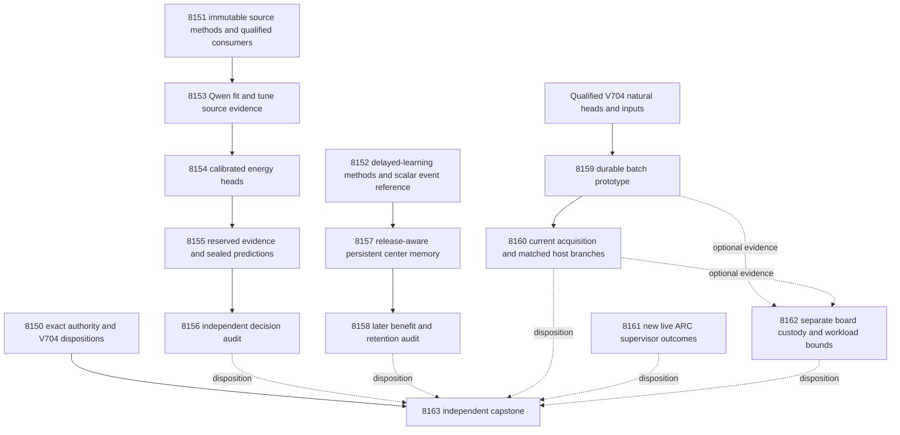

# Carnot Research Roadmap v705 — Immutable evidence methods and useful learning time

**Milestone:** `2026.10.705`  
**Created:** 2026-10-05  
**Status:** Proposed; staged, not activated  
**Supersedes:** completed milestone `2026.10.704`  
**Task contract:** exactly **14 tasks, Exp8150 through Exp8163**, in that order.  
**Execution authority:** `research-roadmap-next.yaml`  
**Preserved predecessor:** `research-roadmap-v704-preserved-20261005.md`

The next milestone repairs a diagnosed source-method dependency and tests whether
energy learning can affect future decisions before the stream ends. It also tests
durable request batching against the measured service bottleneck. The design
retains the v7/v8 structure: previous evidence, architecture, phases, dependencies
and hardware requirements. Its task table and machine contract are executable.

## What v704 proved

V704 scheduled fourteen tasks. Ten primary artifacts exist. Four source tasks
were gate-skipped. Completion of the milestone does not mean all science ran.

| Experiments | Evidence at planning time | Consequence |
|---|---|---|
| 8136 | Contract readiness 1; `complete_null_contract_custody`. | Reuse the qualified authority parser. |
| 8137 | Source custody 1, protocol readiness 0; `complete_disqualified_owned_validation`. | Fix the actual historical-method reader before another model call. |
| 8138 | `complete_circular_positive_protocol_fixture_ready`. | Delayed-event mechanics work on fixtures; that is not natural benefit. |
| 8139–8142 | Four gate skips; no primary artifacts. | No evidence-linked source comparison ran. |
| 8143 | Qualified trajectory; proposals deferred at 128 and 192, admitted at 248 for every seed. | Admission lifetime left almost no usable future exposure. |
| 8144 | 158 later sources, paired cost gain 0, unchanged later probabilities in all arms; 61 retention sources. | Continuous learning benefit remains unproved. |
| 8145 | 900 natural host timing rows; no natural rejected-update category. | Scoring costs are measured; rejected-update cost remains unknown. |
| 8146 | 54 generation calls, one load, 23 matched pairs against 24 required; readiness 0. | Bounded acquisition ran. Independently generated outputs did not match. |
| 8147 | Reader readiness 1, new-outcome readiness 0. | Reuse its reader and frontier; do not create policy churn. |
| 8148 | Board custody and measured workload bounds ready; complete service blocked. | Preserve separate board obligations and qualified host evidence. |
| 8149 | Current primary: `complete_blocked_required_checks_passed`; execution readiness 1, science readiness 0. | Preserve the earlier changelog disqualification separately from the current primary. |

These findings come from the named V704 artifacts and their primitive rows.
`scripts/summarize_artifact.py` independently rechecked 8137, 8144, 8146 and 8149
without adversarial flags. A clean authenticity check does not turn a null into
positive science.

The Exp8137 validation receipt names five failures in
`tests/python/test_development_methods_8098.py`. Each reaches
`development_methods_8098.methods()` and fails with `IndexError`: the old reader
searches mutable `research-roadmap-vNEXT.md` for a V701 heading. Changing the new
roadmap to resemble V701 would hide the dependency bug. Exp8151 binds historical
methods to their preserved file and hash instead.

Exp8144 measured later typed cost `0.6265822784810127` for every learning arm.
The accepted heads changed retention probabilities, but no usable later-stream
probability. This supports a scheduling diagnosis. It does not establish that
radial centers improve decisions once installed earlier.

Exp8146's arithmetic fraction was `0.00026312371842667984`. Removing that work
entirely gives only `1.0002631929707397x` on its measured boundary. A new arithmetic
kernel cannot produce a 100x complete-request gain on that workload.

## Three biggest gaps against the PRD

1. **FR-06 / FR-12 — useful verification decisions.** Source custody exists,
   but the evidence-linked head comparison never ran. Train small calibrated
   energy heads and test typed cost against controls with the same information.
2. **FR-11 — continuous learning that helps later queries.** Updating a head
   after the useful stream is over proves neither adaptation nor retention.
   Measure installation timing, subsequent predictions, later cost and retention.
3. **FR-05 / FR-08 / NFR-01 — useful complete-service performance.** Rust parity
   and arithmetic speed do not prove service throughput. Test durable batches,
   charge queue time, and distinguish composed costs from measured full requests.

All source and learning data remain exposed development evidence. Within-run
role separation is required. Independent generalization remains open even if
H1 or H2 passes. An eventual fresh human-labeled corpus and independent
replication are needed; this plan does not manufacture that evidence.

## Research incorporated before design

The 2026-10-05 entry in `research-references.md` was written before these tasks.
It covers all eight requested primary topics and all six secondary channels.
Semantic Scholar citation endpoints failed. OpenReview paper pages challenged
the browser. GitHub trending responses were stale. No exhaustive citation list,
new conference acceptance or current trending rank is claimed.

| Primary method | Adaptation | Task |
|---|---|---|
| [Delayed-feedback reduction](https://arxiv.org/abs/2602.02634), February 2026 | Separate learning, delayed release, installation and useful remaining horizon. | 8152, 8157–8158 |
| [Capacity-constrained delayed learning](https://arxiv.org/abs/2606.11711), June 2026 | Preserve finite pending capacity and lost-feedback accounting. | 8152, 8157 |
| [HART](https://arxiv.org/abs/2603.05828) and [SURE-RAG](https://arxiv.org/abs/2605.03534), 2026 | Distinguish source custody, semantic evidence, confidence and selective decisions. | 8151, 8153–8156 |
| [Confidence elicitation audit](https://arxiv.org/abs/2608.10008), August 2026 | Ask for the target probability; report calibration together with decision cost. | 8153–8156 |
| [KAC](https://arxiv.org/abs/2503.21076) and [KAN forgetting](https://arxiv.org/abs/2511.12828), 2025 | Equal-capacity radial controls and independent retention. | 8154, 8157–8158 |
| [ARM–EBM](https://arxiv.org/abs/2512.15605), revised May 2026 | Check probability-equivalent energy/logistic parameterizations. | 8154 |
| [Extropic Z1T](https://extropic.ai/writing/z1t) and [FPGA–ASIC co-design](https://arxiv.org/abs/2602.15985), 2026 | Count orchestration, data movement, readout and persistence. | 8159–8160, 8162 |

The scheduling change is a Carnot adaptation. It is not a reproduction of the
papers' convex algorithms and inherits no regret theorem. EBT, LagONN, PAL,
T-SKM-Net, ETS and the Ising learning-to-sample study remain background.
A new generator, decoder or solver branch is deferred until verifier utility
is measured. Recent-window calibration is a future lead, not permission to
reopen the retired unchanged four-expert mixture.

## Architecture



Solid edges show data flow. Only the gate table below defines conductor skips.
The source and learning branches do not gate each other. Service work reads
qualified historical natural heads directly. Contract custody, ARC evidence,
hardware accounting and the capstone have no upstream success gates.

## Phase 1 — Qualify independent methods (Exp8150–Exp8152)

Exp8150 preserves all fourteen V704 dispositions and binds the new authority.
Exp8151 repairs the diagnosed mutable-document dependency. These are the two
infrastructure slots. It keeps the source protocol unchanged and reruns the
original failing consumer tests before new inference.

Exp8152 is the SOTA-ingestion and learning-protocol task. It reads the recorded
primary methods and makes a focused low-concurrency search. It reconstructs the
old event timing, seals the changed schedule, and qualifies an independent scalar
reference. It does not depend on source capture. Its positive controls must expose
an installed update to later predictions, including through a process restart.

## Phase 2 — Measure evidence-linked decisions (Exp8153–Exp8156)

Exp8153 captures fixed fit/tune source evidence through the qualified protocol.
Exp8154 trains and freezes small calibrated energy heads. This is the required
calibrated-decision training slot. Exp8155 seals reserved predictions before
human-label access. Exp8156 independently tests H1 and calibration. The phase
retains equal-information controls and source interventions. No generator weights
change. The prototypes must reject changed roles, head hashes and label leakage.

## Phase 3 — Learn earlier and measure durable costs (Exp8157–Exp8160)

Exp8157 runs the new delayed-learning schedule. Exp8158 independently tests H2,
retention and actual future exposure. A complete null is useful evidence and
terminates without retries. The audit runs even when natural exposure is zero.

Exp8159 tests a durable atomic-batch service with the existing Rust binding.
It uses qualified V704 natural heads, so a learning null does not block it.
Exp8160 measures fresh Qwen acquisition and feeds identical captured bytes to
those host branches. It reports composed costs and one measured reference path
separately. Crash tests must show no lost acknowledged request or duplicate retry.

## Phase 4 — Preserve live-agent and hardware evidence (Exp8161–Exp8163)

Exp8161 reads only new supervisor outcomes after the qualified V704 frontier.
An empty ledger yields a terminal null without reader renewal or policy edits.
Exp8162 preserves KV260, PolarFire and GateMate obligations independently and
bounds acceleration using each available cost branch. Exp8163 accounts for every
scheduled disposition and decides the three PRD gaps independently.

## Frozen study and numerical protocol

### Source roles and bounded capture

Reuse the original Exp8098 roles: fit128, tune64, evaluation128, stream256 and
retention64. Preserve source clusters, response selection and missing masks.
Set `exposure_scope=exposed_development_within_run_disjoint`. Do not resplit or
replace sources based on labels, successful parsing or favorable predictions.

Exp8151 pins the V701 methods reader to the preserved V701 file and hash. The
source prompts and parser remain the V704 protocol. Persist that protocol in a
source-only manifest. It must not depend on historical learning validation.
A private mutation test changes vNEXT while the pinned methods stay identical.
A changed pinned file must fail. Do not copy obsolete headings into vNEXT as a fix.

Both source arms receive complete source and response bytes. They ask for the
probability that the response contains hallucination (`y=1`). Each call permits
6000 input tokens and128 output tokens. Exclude an overlong source whole. The span
arm adds at most one32-word quote with half-open UTF-8 byte offsets. An invalid
quote retains a valid probability with quote validity0 and byte ratio0. A malformed
probability makes the pair missing. Quoted bytes alone are not entailment.

Fit/tune capture permits384 main calls and48 fixed diagnostics on the first16
original fit slots: holistic duplicate, removed source and cyclic mismatched source.
Reserved capture permits256 calls. Interventions have no inherited human target.
Use one model load per task, deadline300 seconds, and120-second per-call deadlines.
Stop new calls at3000 seconds and close by3120. Checkpoint every16 sources.
Preserve all unstarted, failed and censored slots. Readiness requires96 fit and48
tune pairs, or96 evaluation pairs. Trainability additionally needs12 examples per
class in each fit/tune role. The independent evaluator checks evaluation classes.

### Small heads and typed decisions

The twelve features are holistic logit, eight existing lexical features, span
logit, quote validity and quote/source-byte ratio. Clip probabilities to
`[1e-6,1-1e-6]`. Standardize using fit-only means and scales; replace zero scale
with1. All full-feature learned controls receive the same twelve inputs.

Compare scalar holistic, scalar span, mean probability, linear12, additive cubic,
radial16, equivalent logistic and always-escalate. The numerical recipe is the
preserved V704 source-head protocol: cubic degree3, fit quantiles.25/.5/.75,
endpoint multiplicity4, padding1e-8 and clipped support; sixteen public
farthest-first centers with SHA256 ties; width is median positive scaled fit
distance, fallback1. Four source folds rebuild their geometry independently.
Use ridge `.0001/.001/.01/.1/1`, larger ridge on a tied mean fit-fold log loss.
Intercepts are unpenalized. Limit256 iterations and600 seconds total fitting.
Apply the same tune-only affine-logit calibration to each learned arm.

Freeze heads and thresholds before reserved capture. `E(x,0)=0`, `E(x,1)=-z(x)`
must reproduce the logistic probability within1e-10 and exactly match actions.
Energy notation alone supplies no new correctness information.

False acceptance costs5; false rejection costs1; escalation costs.5; correct
acceptance/rejection costs0. Minimize expected cost and escalate on ties. Thus
`p<.1` accepts and `p>.5` rejects; endpoints and the interval between escalate.
Report typed cost, Brier score, log loss, false accepts and coverage for every arm.

### Continuous self-learning with a usable horizon

V705 deliberately changes the V702/V704 schedule. It is not an override of the
old experiment. Exp8152 freezes a new machine-readable protocol with these values:

| Component | V705 value |
|---|---|
| Original stream / retention | 256 /64 source slots, original masks preserved |
| Normalization | Public slots1–64, at least28 usable; no future labels |
| Evaluation | All original slots65–256, intention-to-treat |
| Seeds | 101–120; repeated runs within source units |
| Feedback delay / pending capacity | 20 original slots /32; oldest overflow permanently loses feedback |
| Initial model | Historical Qwen logit plus zero residual,16 public centers |
| Commitment and growth | Slots64 and144; four centers per opportunity; maximum24 |
| Candidate expiry | Slots144 and224, after that slot's release/admission processing |
| Event order | Issue and seal, release, admission, expiry, new commitment |
| Training pool | Newest64 released update rows; minimum16 eligible and four frozen-offset errors |
| Label roles | SHA256(source identity) modulo4: bucket0 admission only; other buckets training |
| Updates | Four SGD steps, learning rate.05, ridge.01; original gradient/weight clipping |
| Admission | Next12 unused post-commit labels, at least two per class; no reuse for training |
| Step grid / guards | 1/.5/.25/.125; original incumbent and frozen-baseline cost/Brier guards; no extra false accepts |

Keep couplings fixed during a query. Match installed capacity and update budgets
across error-selected, fixed-public and random-past center arms. Frozen Qwen is
the reference. Index public center slices by opportunity number. Rejected updates
retain zero-weight new capacity and the old coefficients. Do not shorten delay,
weaken guards or choose the schedule after seeing new outcome labels.

Persist issue-time state, candidate, optimizer, RNG, pending and consumed labels.
Seal retention predictions before retention labels. Test real process recovery
before/after commitment and after admission. Require identical events/actions and
numeric parity within1e-10. Bound total CPU measurement to1200 seconds.

Execution readiness and exposure readiness are separate. The latter needs an
installation by208 and at least32 usable later source predictions issued by changed
state. Neither is a benefit claim. Analyze all evaluation slots even when exposure
is zero. Post-installation-only summaries are exploratory, never the primary test.

### Registered decision rules

H1 tests radial16 against additive cubic on reserved source decisions. H2 tests
error-selected against fixed-public centers across the full later stream. Define
gain as control cost minus treatment cost. These are the only two confirmatory
comparisons within the development study. Apply Bonferroni family alpha.05:
a one-sided97.5% lower gain bound must exceed.02, with at least five improved
sources. This is an operational development gate, not external generalization.

For H1, resample source clusters in10000 paired draws. Require96 complete sources
and12 per class. For H2, average seeds inside each source and resample moving
original-slot blocks of16; show sensitivity at8 and32. Require128 complete sources,
eight per class, and eight nonoverlapping blocks. Preserve original masks.
At least9500 draws must be valid. Seeds, duplicate prompts and timing repetitions
add zero independent semantic units.

Both benefit gates require no additional false accepts, Brier increase at most.01,
and no cost disadvantage over the other relevant controls greater than.02.
H2 also requires useful future exposure and qualified restart parity. Retention
requires48 sources, eight per class, cost increase at most.02, Brier increase at
most.01 and no additional false accepts. Keep underpowered and null outcomes
terminal. Missing external evidence is blocked; owned validation failure is
disqualified. No favorable subset may replace the registered population.

### Durable host batches and current acquisition

Exp8159 changes the persistence boundary, using an explicit atomic-batch API.
Every acknowledgement follows durable commit. Compare serial Python, Python
batch arithmetic with serial commits, native batch arithmetic with serial commits,
and native atomic-batch commits. Each comparison uses the same qualified natural
heads and requests. Batches1/8/32 receive30 paired repetitions per cold/warm/restart
condition. Alternate arm order. Measure both all-at-once arrivals and real4ms
cadence with32ms maximum wait. Charge queue time to request latency.

Report batch throughput, request p50/p95 latency, conversion, serialization,
commit/fsync, response and recovery costs separately. Before/after-commit crash
checks must preserve every acknowledged result exactly once. Stable request IDs
and content hashes deduplicate retries. This prototype measures frozen scoring;
it cannot claim natural rejected-update costs. Atomic-batch results do not imply
the same throughput for independent single-request durability.

Exp8160 selects32 eligible source slots using public bytes/tokenizer checks before
model loading. It allows32 measured calls and eight fixed warmup/canary calls,
with the same bounded token/deadline limits as source capture. At least24 distinct
usable sources qualify its cost comparison. Preserve all initial slots; do not
replace a failed or malformed output after observing it.

Each source has one actual Qwen acquisition. Its identical captured output feeds
each host branch. Report `T_acquisition + T_host` as a **component-composed cost**.
Charge acquisition to every arm in that comparison without pretending it ran
repeatedly. One reference path has separately measured end-to-end latency.
Startup and warmup remain explicit, with amortization over the declared32 requests.
Composed timing cannot close an independently measured deployment-performance gate.

Speed claims require10000 paired-batch log-ratio bootstrap draws and lower95>1.
NFR-01 requires lower95>=10 on its applicable measured workload. Neither speed
nor learning benefit is an execution-readiness gate.

## Dependency and gate contract

Every producer below declares the exact field in its own REQUIRED ARTIFACT FIELDS.
All gates compare the field to1. Their upstream task exists earlier in this YAML.

| Consumer | Upstream | Exact readiness field |
|---|---|---|
| exp8153-fit-evidence-capture | exp8151-source-method-custody | source_protocol_ready_score |
| exp8154-evidence-energy-fit | exp8153-fit-evidence-capture | fit_capture_ready_score |
| exp8154-evidence-energy-fit | exp8153-fit-evidence-capture | fit_trainable_score |
| exp8155-reserved-evidence-capture | exp8154-evidence-energy-fit | energy_fit_ready_score |
| exp8156-decision-audit | exp8155-reserved-evidence-capture | evaluation_capture_ready_score |
| exp8157-release-aware-learning | exp8152-admission-horizon-methods | learning_protocol_ready_score |
| exp8158-learning-benefit-audit | exp8157-release-aware-learning | learning_trajectory_ready_score |
| exp8160-shared-acquisition-cost | exp8159-durable-batch-service | host_batch_ready_score |

Exp8150,8151,8152,8159,8161,8162 and8163 have empty `gated_on` lists. The learning
audit is not pre-gated on exposure or benefit. The hardware task consumes available
branches conditionally. The capstone runs regardless of scientific outcomes.
No `requires:` chain references a retired experiment. Qualified historical inputs
are authenticated data, not instructions to rerun old tasks.

## Hardware requirements and acceleration path

| Resource | Work | Memory / wall budget | Evidence boundary |
|---|---|---|---|
| Existing CPU and RAM | Custody, small-head fitting, learning, audits | Small heads; chunk corpus reads; CPU science<=1200s | No model invocation credit for imported Qwen data. |
| Existing RTX3090 CUDA path | Exp8153,8155,8160 frozen Qwen inference | Cached GGUF about16GB; use measured runtime/KV footprint; one owned model load | Record actual offload and memory delta. No simultaneous benchmark lease. |
| Second RTX3090 | Optional runtime tensor split only if existing runtime requires it |48GB combined inventory is not automatically pooled memory | No dual-GPU scaling claim. |
| Rust/PyO3 | Exp8159 loaded binding and durable batching | Batches1/8/32;45–50min task budget | Bind the actual extension, store and input hashes. |
| KV260 | Exp8162 authenticated fabric history, k_max<=5 | No new integration scheduled | Reopen only for a useful supported workload with transport/device receipts. |
| PolarFire | Exp8162 Linux CPU dispatch history | No new integration scheduled | CPU dispatch is not FPGA fabric execution. |
| GateMate | Exp8162 physical/JTAG0xffffffff block | No unchanged probe | Document cable/port/power/wiring change and valid GM1Ax IDCODE before reopening. |
| NPU / TSU / larger FPGA | Deferred | No acquisition cost or purchase | Need useful operator mapping, toolchain/access and actual execution evidence. |

Nominal task budgets total580 minutes (9h40m); each individual task remains
within the4800-second hard cap. GPU capture can stop earlier with explicit masks.
The CPU learner uses finite memory and bounded vector arithmetic. Its batch work
can map to GPU/NPU; Gaussian radial evaluation is not automatically an Ising
sampling workload. KV260 requires supported operators and precision. TSU requires
a genuine compatible sampling workload and authenticated hardware access.

Exp8162 computes `S_max=1/(1-f)` from measured arithmetic fraction f. The100x target
requires f>=.99 even with infinite arithmetic acceleration. V704 fails that test
for complete requests. Durable batching tests a host-overhead change while
preserving acknowledgements. A null requires a different whole-workload design;
it does not justify an FPGA purchase. Each board keeps a separate obligation.

### Mandated model and substrate classes

Every new task that invokes an LLM declares
`MODEL_SPECS: [unsloth/Qwen3.8-27B-GGUF]`. Exp8153,8155 and8160 use
`model_bounded_generation`, with the10-second floor. Fixed-token source probes
are bounded even when their aggregate runtime exceeds a minute. The60-second
`model_full_generation` floor is unused. A genuine load-only outcome declares
`model_load_no_generation` with its2-second floor and no generation claim.
No-load tasks use `MODEL_SPECS: []` and `no_model_load`.

Floors are plausibility checks, never instructions to pad time. Historical model
identity belongs under imported provenance. Legacy small models are allowed only
as clearly marked CPU smoke tests using the template's `cached_sota_pair()`
pattern; they cannot replace the mandated model in a headline result.

## Execution discipline, retirement and validation

Every prompt has numbered instructions for flushed phase-boundary progress and
before/after messages around model loads, generation, benchmarks and subprocesses.
Long loops and child waits report actual counts at least every60 seconds. Every
silence gap stays below600 seconds. Tool waits are at most60 seconds. Files over
about200 lines are written in several calls of about150 lines, with a progress
message between calls. Agents must not wait silently while composing a huge file.

The first two tasks occupy the infrastructure slots. Exp8152 occupies the SOTA
slot. Exp8154 supplies calibrated-decision training. Exp8157 supplies continuous
self-learning. Exp8161 satisfies the live ARC generalization floor. Exp8162 records
each attached board separately. Exp8151 receives Opus/100 turns for the cross-file
preflight repair. Exp8159 uses Codex/gpt-6.1-sol for the bounded service code.
Other tasks retain the user's requested default synthesis routing. No weak model
is assigned an experiment, analysis or scientific claim.

Every task includes all four mandatory `prior_failures` fields. Missing predecessor
primaries use the recorded `GATE_BLOCKED` disposition; that is not an invented
honest_verdict. The source chain changes its diagnosed prerequisite. The learning
chain changes commitment/expiry timing. The service chain changes persistence and
comparison boundaries. These are explicit changes, not relabeled failed reruns.

The exclusion manifest was read across all three sections. No retired ID is reused.
The plan does not revive importance anchoring, the four-expert mixture, generic
external-text reranking, compact lossy spans or an unchanged failed supervisor
reader. No operator override is invented. Exact repeated-scope outcomes activate
`retire_if_same_verdict: true`; the capstone preserves the reason and evidence.

Every comparative artifact contains per-unit rows. Every blocked artifact contains
`gate_check_summary` with check, upstream, hash, field, operator, expected value,
observed value and pass status. The closed `verdict_class` enum accompanies the
terminal `honest_verdict`. External blocks use `blocked`. `partial` is reserved
for unfinished owned work. Fixture truth uses `circular_positive` and cannot be
promoted into natural-data scientific benefit.

Before implementation, each execution task extends its REQ/SCENARIO specification
and writes failing tests. It reuses qualified code. Tests write only private data.
Owned checks include scoped unit tests,100% changed-code coverage, Ruff check and
format, strict mypy and explicit-path spec coverage. Applicable E2E includes
source transport/cold replay, immutable method mutation, learning process recovery,
service acknowledgement durability and E2E-018 authority lifecycle. Actual Rust
changes also require cargo test/fmt/clippy and loaded-extension parity.

Every phase has a runnable prototype, measurable pass/fail criteria and adversarial
mutations. Run the unchanged adversarial and strict row-consistency validators
before primary publication. Keep normal command exits and hashed logs. An owned
check failure disqualifies that task and sets readiness0. Keep unrelated global
health debt separate; never weaken an existing assertion to obtain a pass.

Planning validation checks YAML schema, prior failures, retirement scope, ARC and
overdue floors, exact table/full-JSON/digest equality, producer gate declarations,
source-path existence, prompt sections and final commands. It runs relevant
schema/authority/gate unit tests and the private E2E-018 lifecycle. This planning
change makes no experiment or hardware result and activates no task.

Reconcile `openspec/`, `_bmad/traceability.md`, `ops/status.md` and
`ops/changelog.md`. Preserve historical evidence. Keep stable publication G1–G4;
no publication is authorized. Leave `research-roadmap.yaml` and
`scripts/research_conductor.py` unchanged. Do not push.

## Exact task contract

Exactly 14 tasks, Exp8150 through Exp8163, in conductor execution order.

| Order | ID | Title | Phase | Deliverable |
|---|---|---|---|---|
| 1 | `exp8150-contract-custody` | Bind fourteen tasks and preserve V704 terminal evidence | 1 | `results/experiment_8150_v705_contract_custody.json` |
| 2 | `exp8151-source-method-custody` | Qualify source capture against immutable historical methods | 1 | `results/experiment_8151_v705_source_method_custody.json` |
| 3 | `exp8152-admission-horizon-methods` | Seal release-aware learning methods and qualify useful future exposure | 1 | `results/experiment_8152_v705_admission_horizon_methods.json` |
| 4 | `exp8153-fit-evidence-capture` | Capture bounded Qwen evidence on fixed fit and tune sources | 2 | `results/experiment_8153_v705_fit_evidence_capture.json` |
| 5 | `exp8154-evidence-energy-fit` | Train calibrated typed decisions from matched source features | 2 | `results/experiment_8154_v705_evidence_energy_fit.json` |
| 6 | `exp8155-reserved-evidence-capture` | Seal reserved Qwen evidence and frozen predictions | 2 | `results/experiment_8155_v705_reserved_evidence_capture.json` |
| 7 | `exp8156-decision-audit` | Independently test evidence-linked calibration and decision cost | 2 | `results/experiment_8156_v705_decision_audit.json` |
| 8 | `exp8157-release-aware-learning` | Learn persistent energy centers with time for later predictions | 3 | `results/experiment_8157_v705_release_aware_learning.json` |
| 9 | `exp8158-learning-benefit-audit` | Audit later learning benefit retention and installation timing | 3 | `results/experiment_8158_v705_learning_benefit_audit.json` |
| 10 | `exp8159-durable-batch-service` | Measure complete atomic batch transactions through Python and Rust | 3 | `results/experiment_8159_v705_durable_batch_service.json` |
| 11 | `exp8160-shared-acquisition-cost` | Measure current Qwen acquisition plus matched durable service branches | 3 | `results/experiment_8160_v705_shared_acquisition_cost.json` |
| 12 | `exp8161-arc-supervisor-frontier` | Inspect only new live supervisor outcomes for transferable refinement | 4 | `results/experiment_8161_v705_arc_supervisor_frontier.json` |
| 13 | `exp8162-hardware-workload-boundary` | Bound durable workload acceleration and preserve each board obligation | 4 | `results/experiment_8162_v705_hardware_workload_boundary.json` |
| 14 | `exp8163-capstone` | Decide fourteen outcomes and the remaining PRD gaps independently | 4 | `results/experiment_8163_v705_capstone.json` |

Canonical full-task SHA256: `e5b15c555c0fc55ef70701723fda12e15263ed4142bb3cd62bd64fdec432aa97`

<!-- V705_TASK_CONTRACT_START -->
```json
{
  "milestone": "2026.10.705",
  "milestone_title": "Immutable evidence methods and learning with time to affect future decisions",
  "milestone_doc": "openspec/change-proposals/research-roadmap-vNEXT.md",
  "tasks": [
    {
      "id": "exp8150-contract-custody",
      "title": "Bind fourteen tasks and preserve V704 terminal evidence",
      "phase": 1,
      "track": "infrastructure",
      "priority": "high",
      "requires_gpu": false,
      "max_turns": 20,
      "estimated_wall_time_min": 20,
      "per_unit_rows": true,
      "milestone": "2026.10.705",
      "deliverable": "results/experiment_8150_v705_contract_custody.json",
      "inference_substrate_class": "no_model_load",
      "MODEL_SPECS": [],
      "gated_on": [],
      "prior_failures": [
        {
          "experiment_id": "exp8110-contract-custody",
          "verdict": "complete_blocked_design_exact_task_contract",
          "addressed_by": "Use the already-qualified parser and exact full-task digest, with V705 mutation tests before activation.",
          "retire_if_same_verdict": true
        }
      ],
      "prompt": "CONTEXT:\nWork in {project_root} on {date}. V704 scheduled 14 tasks. Ten primary artifacts exist and four source tasks were gate-skipped. Contract custody passed; source validation failed, later learning benefit was null, and full-service readiness was zero. The capstone primary is blocked even though the changelog records an earlier disqualification.\nEXISTING CODE TO READ FIRST:\nCLAUDE.md; CODEX.md; ops/e2e-test-plan.md; openspec/capabilities/research-reporting/spec.md; openspec/capabilities/verification/spec.md; scripts/experiment_template.py; python/carnot/reporting/primary_publication.py; ops/exclusion_manifest.yaml; openspec/change-proposals/research-roadmap-vNEXT.md; python/carnot/reporting/roadmap_contract.py; python/carnot/reporting/v685_authority_lifecycle.py; tests/python/test_experiment_7891_v685_authority_lifecycle.py; results/experiment_8136_v704_contract_custody.json; results/experiment_8149_v704_capstone.json; ops/conductor-log.md; openspec/change-proposals/research-roadmap-v704-preserved-20261005.md\nTASK:\nBind fourteen tasks and preserve V704 terminal evidence. Deliver results/experiment_8150_v705_contract_custody.json, primitive evidence under results/raw/experiment_8150_v705_contract_custody/, and runnable scripts/experiments/experiment_8150_v705_contract_custody.py.\nCONCRETE STEPS:\n1. Emit a flushed progress line at each phase boundary and before and after every model load, generation, benchmark, and subprocess. Use PYTHONUNBUFFERED=1 and print(..., flush=True). Inside long loops and child waits, print actual completed/pending counts at least every 60 seconds. Keep every silence gap below 600 seconds. Poll in tool calls of at most 60 seconds. Write files over about 200 lines in several tool calls of at most about 150 lines. Send a progress message between writes. Never pad duration or invent activity.\n2. Check input files, hashes, runtime and gate operands before work. Read cited results with scripts/summarize_artifact.py, then inspect primitive rows. Preserve failed historical primaries. An unchanged external block is terminal complete_blocked_<check>, verdict_class=blocked, with the exact failed operand in gate_check_summary. Never use partial for missing, retired or gate-blocked upstream work.\n3. Extend the relevant REQ-* and SCENARIO-* before implementation. Write failing tests first. Reuse qualified modules through a thin CLI. Put private tests and mutations outside results/. Keep original assertions. Exercise script-path execution outside the checkout without PYTHONPATH. Bind historical methods to immutable versioned files; never parse old methods from mutable vNEXT.\n4. Load no LLM. Set MODEL_SPECS=[] and inference_substrate_class=no_model_load. Use aggregation_from_upstream_artifacts for reductions or verifier_ensemble_against_cached_candidates for CPU head evaluation. Store historical model provenance separately from current call counts. Declare small trained heads in trained_head_specs.\n5. Reuse the qualified authority reader. Bind exactly 14 tasks Exp8150 through Exp8163 in visible table, full machine JSON, canonical digest and activated authority. Do not gate all science on this administrative task.\n6. Snapshot V704 dispositions, primaries and raw validation sidecars. Report current primary and earlier logged verdict separately for Exp8149. Keep four absent source primaries as gate-skipped, not measured nulls.\n7. Run E2E-018 in a private copied authority tree: matching candidate, changed title/prompt/gate/ID/count, stale active milestone and cold replay. Verify the literal Exact task contract heading and complete task digest. Do not activate the milestone from this task.\n8. Freeze owned validation argv before measurement. Run scoped pytest, 100% changed-code statement coverage, Ruff check and format, strict mypy, and explicit-path spec coverage. Run the applicable private E2E success, block, tamper and cold-replay checks. Save command, expected/actual exit, duration and log hash. All required commands must exit normally. Keep unrelated repository-health failures separate. If Rust changes, also run cargo test, fmt, clippy and actual loaded-binding parity.\n9. Save primitive rows and source/code/config hashes. Recompute headlines independently. Run unmodified adversarial_verify.py and strict verdict_row_consistency_lint.py with progress while waiting. Publish through primary_publication only after owned checks pass. An owned failure sets readiness to 0 and verdict_class=disqualified. Reconcile openspec/, _bmad/traceability.md, ops/status.md and ops/changelog.md. Preserve history and operator-curated publication pages. No external publication.\nREQUIRED ARTIFACT FIELDS:\n- honest_verdict: complete_*; verdict_class: positive | circular_positive | null | blocked | disqualified | partial. Principle: only unfinished owned work is retryable partial.\n- verifier_is_oracle, claim_scope, exposure_scope, independent_generalization_score: 0, generalized_learning_benefit_score: 0. Principle: fixtures are circular_positive; exposed development is not independent generalization.\n- required_checks_passed, flagged_adversarial, validation_receipts, terminal_validation_sidecar_path, preconditions_checked. Principle: readiness requires normal owned validation.\n- gate_check_summary: check/upstream/path/hash/artifact_field/op/expected/observed/passed. Principle: blocked results name the actual failed check and value.\n- inference_substrate, inference_substrate_class, MODEL_SPECS, trained_head_specs, model_invocation_counts, call_ledger. Principle: current execution and imported provenance are distinct.\n- rows: unit_id/source_cluster_id/arm/condition/metric/numerator/denominator/status/exclusion_reason. Principle: every comparison is reconstructable per unit.\n- intended_count, eligible_count, independent_count, completed_count, excluded_count, censored_count, failed_count, sample_size_budget. Principle: repeats do not create independent sources.\n- run_date, duration_s, random_seed, reproducibility_checksum, source_artifact_hashes, raw_shard_hashes, code_config_hashes, phase_spans, acceptance_gates, field_principles. Principle: claims bind to measured work and declared thresholds.\n- contract_ready_score: 0|1, task_dispositions, authority_snapshots, canonical_tasks_sha256. Principle: administrative completion grants no scientific credit.\nRun command: cd {project_root} && PYTHONUNBUFFERED=1 JAX_PLATFORMS=cpu .venv/bin/python -u scripts/experiments/experiment_8150_v705_contract_custody.py --date {date}\nDo NOT push. Do NOT modify scripts/research_conductor.py."
    },
    {
      "id": "exp8151-source-method-custody",
      "title": "Qualify source capture against immutable historical methods",
      "phase": 1,
      "track": "infrastructure",
      "priority": "high",
      "requires_gpu": false,
      "max_turns": 100,
      "estimated_wall_time_min": 50,
      "per_unit_rows": true,
      "milestone": "2026.10.705",
      "deliverable": "results/experiment_8151_v705_source_method_custody.json",
      "inference_substrate_class": "no_model_load",
      "MODEL_SPECS": [],
      "gated_on": [],
      "prior_failures": [
        {
          "experiment_id": "exp8137-source-protocol",
          "verdict": "complete_disqualified_owned_validation",
          "addressed_by": "Diagnosed mutable vNEXT heading lookup; pin and hash immutable V701 methods, then run the five unchanged failing consumers.",
          "retire_if_same_verdict": true
        }
      ],
      "prompt": "CONTEXT:\nWork in {project_root} on {date}. Exp8137 failed five development_methods_8098 consumer tests. The reader split mutable vNEXT at a V701 heading that no longer exists. Source custody itself passed. Fix document identity before new model work.\nEXISTING CODE TO READ FIRST:\nCLAUDE.md; CODEX.md; ops/e2e-test-plan.md; openspec/capabilities/research-reporting/spec.md; openspec/capabilities/verification/spec.md; scripts/experiment_template.py; python/carnot/reporting/primary_publication.py; ops/exclusion_manifest.yaml; openspec/change-proposals/research-roadmap-vNEXT.md; python/carnot/verify/development_methods_8098.py; python/carnot/experiment_8098_v701_development_methods.py; python/carnot/verify/source_protocol_8137.py; tests/python/test_development_methods_8098.py; tests/python/test_source_protocol_8137.py; tests/python/test_evidence_protocol_8124.py; results/experiment_8137_v704_source_protocol.json; openspec/change-proposals/research-roadmap-v701-preserved-20261004.md\nTASK:\nQualify source capture against immutable historical methods. Deliver results/experiment_8151_v705_source_method_custody.json, primitive evidence under results/raw/experiment_8151_v705_source_method_custody/, and runnable scripts/experiments/experiment_8151_v705_source_method_custody.py.\nCONCRETE STEPS:\n1. Emit a flushed progress line at each phase boundary and before and after every model load, generation, benchmark, and subprocess. Use PYTHONUNBUFFERED=1 and print(..., flush=True). Inside long loops and child waits, print actual completed/pending counts at least every 60 seconds. Keep every silence gap below 600 seconds. Poll in tool calls of at most 60 seconds. Write files over about 200 lines in several tool calls of at most about 150 lines. Send a progress message between writes. Never pad duration or invent activity.\n2. Check input files, hashes, runtime and gate operands before work. Read cited results with scripts/summarize_artifact.py, then inspect primitive rows. Preserve failed historical primaries. An unchanged external block is terminal complete_blocked_<check>, verdict_class=blocked, with the exact failed operand in gate_check_summary. Never use partial for missing, retired or gate-blocked upstream work.\n3. Extend the relevant REQ-* and SCENARIO-* before implementation. Write failing tests first. Reuse qualified modules through a thin CLI. Put private tests and mutations outside results/. Keep original assertions. Exercise script-path execution outside the checkout without PYTHONPATH. Bind historical methods to immutable versioned files; never parse old methods from mutable vNEXT.\n4. Load no LLM. Set MODEL_SPECS=[] and inference_substrate_class=no_model_load. Use aggregation_from_upstream_artifacts for reductions or verifier_ensemble_against_cached_candidates for CPU head evaluation. Store historical model provenance separately from current call counts. Declare small trained heads in trained_head_specs.\n5. Reproduce the stored IndexError in a private fixture. Make the historical method reader accept an explicit immutable method path and hash. Default V701 consumers to the preserved V701 file, not vNEXT. Reject unknown hashes. Preserve all historical primaries and immutable production seals.\n6. Keep the V704 evidence protocol byte-for-byte: original 640 source roles, paired complete-source prompts, probability target and quote parser. Store its current source-only manifest. Remove learning-stream validation as a source prerequisite; do not resplit sources or inspect reserved labels.\n7. Freeze expected Qwen revision before comparing observed cache identity. Qualify exact prompts, UTF-8 offsets, malformed probabilities, whole-source overlength masks, and private tamper rejection without a model load. New source readiness must not require a positive scientific effect.\n8. Run the original five failed consumer routes plus the source tests and E2E-015/016/019 private fixtures. Change a private vNEXT copy to unrelated headings: historical V701 methods must remain identical. Mutation of the pinned method file must fail.\n9. Freeze owned validation argv before measurement. Run scoped pytest, 100% changed-code statement coverage, Ruff check and format, strict mypy, and explicit-path spec coverage. Run the applicable private E2E success, block, tamper and cold-replay checks. Save command, expected/actual exit, duration and log hash. All required commands must exit normally. Keep unrelated repository-health failures separate. If Rust changes, also run cargo test, fmt, clippy and actual loaded-binding parity.\n10. Save primitive rows and source/code/config hashes. Recompute headlines independently. Run unmodified adversarial_verify.py and strict verdict_row_consistency_lint.py with progress while waiting. Publish through primary_publication only after owned checks pass. An owned failure sets readiness to 0 and verdict_class=disqualified. Reconcile openspec/, _bmad/traceability.md, ops/status.md and ops/changelog.md. Preserve history and operator-curated publication pages. No external publication.\nREQUIRED ARTIFACT FIELDS:\n- honest_verdict: complete_*; verdict_class: positive | circular_positive | null | blocked | disqualified | partial. Principle: only unfinished owned work is retryable partial.\n- verifier_is_oracle, claim_scope, exposure_scope, independent_generalization_score: 0, generalized_learning_benefit_score: 0. Principle: fixtures are circular_positive; exposed development is not independent generalization.\n- required_checks_passed, flagged_adversarial, validation_receipts, terminal_validation_sidecar_path, preconditions_checked. Principle: readiness requires normal owned validation.\n- gate_check_summary: check/upstream/path/hash/artifact_field/op/expected/observed/passed. Principle: blocked results name the actual failed check and value.\n- inference_substrate, inference_substrate_class, MODEL_SPECS, trained_head_specs, model_invocation_counts, call_ledger. Principle: current execution and imported provenance are distinct.\n- rows: unit_id/source_cluster_id/arm/condition/metric/numerator/denominator/status/exclusion_reason. Principle: every comparison is reconstructable per unit.\n- intended_count, eligible_count, independent_count, completed_count, excluded_count, censored_count, failed_count, sample_size_budget. Principle: repeats do not create independent sources.\n- run_date, duration_s, random_seed, reproducibility_checksum, source_artifact_hashes, raw_shard_hashes, code_config_hashes, phase_spans, acceptance_gates, field_principles. Principle: claims bind to measured work and declared thresholds.\n- source_protocol_ready_score: 0|1, source_custody_ready_score: 0|1, pinned_method_paths, source_role_manifests, evidence_protocol, expected_runtime_identity, consumer_validation_rows. Principle: stable producer semantics precede costly capture.\nRun command: cd {project_root} && PYTHONUNBUFFERED=1 JAX_PLATFORMS=cpu .venv/bin/python -u scripts/experiments/experiment_8151_v705_source_method_custody.py --date {date}\nDo NOT push. Do NOT modify scripts/research_conductor.py.",
      "agent_type": "claude",
      "model": "opus"
    },
    {
      "id": "exp8152-admission-horizon-methods",
      "title": "Seal release-aware learning methods and qualify useful future exposure",
      "phase": 1,
      "track": "science",
      "priority": "high",
      "requires_gpu": false,
      "max_turns": 50,
      "estimated_wall_time_min": 45,
      "per_unit_rows": true,
      "milestone": "2026.10.705",
      "deliverable": "results/experiment_8152_v705_admission_horizon_methods.json",
      "inference_substrate_class": "no_model_load",
      "MODEL_SPECS": [],
      "gated_on": [],
      "prior_failures": [
        {
          "experiment_id": "exp8144-learning-audit",
          "verdict": "complete_null_no_later_typed_cost_benefit",
          "addressed_by": "First two proposals expired and the only install was at248; lengthen admission lifetime and commit at64/144 while preserving delay20 and admission12.",
          "retire_if_same_verdict": true
        }
      ],
      "prompt": "CONTEXT:\nWork in {project_root} on {date}. Exp8144 found identical later probabilities on 158 sources. All seeds deferred at slots 128 and 192, then admitted at 248. This is a finite-horizon scheduling failure, not evidence that an installed radial correction cannot help.\nEXISTING CODE TO READ FIRST:\nCLAUDE.md; CODEX.md; ops/e2e-test-plan.md; openspec/capabilities/research-reporting/spec.md; openspec/capabilities/verification/spec.md; scripts/experiment_template.py; python/carnot/reporting/primary_publication.py; ops/exclusion_manifest.yaml; openspec/change-proposals/research-roadmap-vNEXT.md; research-references.md; research-studying.md; scripts/sweep_clusters.py; scripts/sweep_semscholar.py; python/carnot/verify/learning_protocol_8138.py; python/carnot/verify/delayed_energy_memory_8143.py; python/carnot/verify/methods_stream_custody_8111.py; results/experiment_8102_v701_learning_stream_capture.json; results/experiment_8138_v704_learning_protocol.json; results/experiment_8143_v704_delayed_energy_memory.json; results/experiment_8144_v704_learning_audit.json\nTASK:\nSeal release-aware learning methods and qualify useful future exposure. Deliver results/experiment_8152_v705_admission_horizon_methods.json, primitive evidence under results/raw/experiment_8152_v705_admission_horizon_methods/, and runnable scripts/experiments/experiment_8152_v705_admission_horizon_methods.py.\nCONCRETE STEPS:\n1. Emit a flushed progress line at each phase boundary and before and after every model load, generation, benchmark, and subprocess. Use PYTHONUNBUFFERED=1 and print(..., flush=True). Inside long loops and child waits, print actual completed/pending counts at least every 60 seconds. Keep every silence gap below 600 seconds. Poll in tool calls of at most 60 seconds. Write files over about 200 lines in several tool calls of at most about 150 lines. Send a progress message between writes. Never pad duration or invent activity.\n2. Check input files, hashes, runtime and gate operands before work. Read cited results with scripts/summarize_artifact.py, then inspect primitive rows. Preserve failed historical primaries. An unchanged external block is terminal complete_blocked_<check>, verdict_class=blocked, with the exact failed operand in gate_check_summary. Never use partial for missing, retired or gate-blocked upstream work.\n3. Extend the relevant REQ-* and SCENARIO-* before implementation. Write failing tests first. Reuse qualified modules through a thin CLI. Put private tests and mutations outside results/. Keep original assertions. Exercise script-path execution outside the checkout without PYTHONPATH. Bind historical methods to immutable versioned files; never parse old methods from mutable vNEXT.\n4. Load no LLM. Set MODEL_SPECS=[] and inference_substrate_class=no_model_load. Use aggregation_from_upstream_artifacts for reductions or verifier_ensemble_against_cached_candidates for CPU head evaluation. Store historical model provenance separately from current call counts. Declare small trained heads in trained_head_specs.\n5. Ingest the already-recorded delayed-feedback papers arXiv:2602.02634 and 2606.11711, KAC 2503.21076, and SURE-RAG 2605.03534. Use low-concurrency sweeps and read accessible primary methods. Save a 3-5-method mapping with limits; update research-studying.md. No deep-research fan-out. Do not claim convex regret guarantees for nonlinear heads.\n6. Reconstruct V704 candidate commitment, expiry, label arrival, installation and later issue slots from raw events. Do not retrain V704. Freeze the V705 numerical protocol before opening new outcomes. New commitment/growth slots are 64 and 144; expiry slots are 144 and 224. Process issue, release, admission, expiry, then new commitment. No expiry at the old intermediate slot 128.\n7. Keep delay 20, pending capacity 32, one-use 12-label admission with two per class, four SGD steps, learning rate .05, ridge .01 and original guards unchanged. Add four centers per opportunity, from 16 to 24, equally across error-selected/public/random arms. Index reserved public centers by opportunity number, not slot arithmetic. Keep frozen Qwen as a fourth arm.\n8. Authenticate the original 256 stream and 64 retention slots directly from qualified historical captures. No dependency on Exp8151 or new Qwen calls. Keep original missing masks. Require 224 usable stream and 48 retention slots. Normalization uses public slots 1-64; targets release only at issue+20.\n9. Qualify the complete runner against an independent scalar event reference on positive, rejected, late-label, overflow and crash fixtures. The positive fixture must install by 208 and issue at least 32 usable later predictions from changed state. Keep a fixture that reproduces the old expiry failure. This is fixture readiness, never natural benefit. Freeze the exact H2 analysis and small-head configuration in a hashed protocol file.\n10. Freeze owned validation argv before measurement. Run scoped pytest, 100% changed-code statement coverage, Ruff check and format, strict mypy, and explicit-path spec coverage. Run the applicable private E2E success, block, tamper and cold-replay checks. Save command, expected/actual exit, duration and log hash. All required commands must exit normally. Keep unrelated repository-health failures separate. If Rust changes, also run cargo test, fmt, clippy and actual loaded-binding parity.\n11. Save primitive rows and source/code/config hashes. Recompute headlines independently. Run unmodified adversarial_verify.py and strict verdict_row_consistency_lint.py with progress while waiting. Publish through primary_publication only after owned checks pass. An owned failure sets readiness to 0 and verdict_class=disqualified. Reconcile openspec/, _bmad/traceability.md, ops/status.md and ops/changelog.md. Preserve history and operator-curated publication pages. No external publication.\nREQUIRED ARTIFACT FIELDS:\n- honest_verdict: complete_*; verdict_class: positive | circular_positive | null | blocked | disqualified | partial. Principle: only unfinished owned work is retryable partial.\n- verifier_is_oracle, claim_scope, exposure_scope, independent_generalization_score: 0, generalized_learning_benefit_score: 0. Principle: fixtures are circular_positive; exposed development is not independent generalization.\n- required_checks_passed, flagged_adversarial, validation_receipts, terminal_validation_sidecar_path, preconditions_checked. Principle: readiness requires normal owned validation.\n- gate_check_summary: check/upstream/path/hash/artifact_field/op/expected/observed/passed. Principle: blocked results name the actual failed check and value.\n- inference_substrate, inference_substrate_class, MODEL_SPECS, trained_head_specs, model_invocation_counts, call_ledger. Principle: current execution and imported provenance are distinct.\n- rows: unit_id/source_cluster_id/arm/condition/metric/numerator/denominator/status/exclusion_reason. Principle: every comparison is reconstructable per unit.\n- intended_count, eligible_count, independent_count, completed_count, excluded_count, censored_count, failed_count, sample_size_budget. Principle: repeats do not create independent sources.\n- run_date, duration_s, random_seed, reproducibility_checksum, source_artifact_hashes, raw_shard_hashes, code_config_hashes, phase_spans, acceptance_gates, field_principles. Principle: claims bind to measured work and declared thresholds.\n- learning_protocol_ready_score: 0|1, protocol_path, protocol_sha256, method_map, event_reference_rows, historical_installation_rows, future_exposure_fixture_score: 0|1. Principle: a learnable fixture tests causality without qualifying natural benefit.\nRun command: cd {project_root} && PYTHONUNBUFFERED=1 JAX_PLATFORMS=cpu .venv/bin/python -u scripts/experiments/experiment_8152_v705_admission_horizon_methods.py --date {date}\nDo NOT push. Do NOT modify scripts/research_conductor.py."
    },
    {
      "id": "exp8153-fit-evidence-capture",
      "title": "Capture bounded Qwen evidence on fixed fit and tune sources",
      "phase": 2,
      "track": "science",
      "priority": "high",
      "requires_gpu": true,
      "max_turns": 50,
      "estimated_wall_time_min": 65,
      "per_unit_rows": true,
      "milestone": "2026.10.705",
      "deliverable": "results/experiment_8153_v705_fit_evidence_capture.json",
      "inference_substrate_class": "model_bounded_generation",
      "MODEL_SPECS": [
        "unsloth/Qwen3.8-27B-GGUF"
      ],
      "gated_on": [
        {
          "upstream": "exp8151-source-method-custody",
          "artifact_field": "source_protocol_ready_score",
          "op": "==",
          "value": 1
        }
      ],
      "prior_failures": [
        {
          "experiment_id": "exp8139-fit-evidence-capture",
          "verdict": "GATE_BLOCKED",
          "addressed_by": "No primary existed; Exp8137.source_protocol_ready_score was0. Exp8151 pins immutable methods and reruns the diagnosed consumer checks.",
          "retire_if_same_verdict": true
        }
      ],
      "prompt": "CONTEXT:\nWork in {project_root} on {date}. V704 never executed its source comparison because immutable-method validation failed. Exp8151 supplies the changed prerequisite. Capture evidence without choosing examples by labels or favorable parses.\nEXISTING CODE TO READ FIRST:\nCLAUDE.md; CODEX.md; ops/e2e-test-plan.md; openspec/capabilities/research-reporting/spec.md; openspec/capabilities/verification/spec.md; scripts/experiment_template.py; python/carnot/reporting/primary_publication.py; ops/exclusion_manifest.yaml; openspec/change-proposals/research-roadmap-vNEXT.md; results/experiment_8151_v705_source_method_custody.json; python/carnot/verify/evidence_protocol_8124.py; python/carnot/verify/source_protocol_8137.py; scripts/experiments/experiment_8146_v704_live_service_cost.py; scripts/experiment_template.py\nTASK:\nCapture bounded Qwen evidence on fixed fit and tune sources. Deliver results/experiment_8153_v705_fit_evidence_capture.json, primitive evidence under results/raw/experiment_8153_v705_fit_evidence_capture/, and runnable scripts/experiments/experiment_8153_v705_fit_evidence_capture.py.\nCONCRETE STEPS:\n1. Emit a flushed progress line at each phase boundary and before and after every model load, generation, benchmark, and subprocess. Use PYTHONUNBUFFERED=1 and print(..., flush=True). Inside long loops and child waits, print actual completed/pending counts at least every 60 seconds. Keep every silence gap below 600 seconds. Poll in tool calls of at most 60 seconds. Write files over about 200 lines in several tool calls of at most about 150 lines. Send a progress message between writes. Never pad duration or invent activity.\n2. Check input files, hashes, runtime and gate operands before work. Read cited results with scripts/summarize_artifact.py, then inspect primitive rows. Preserve failed historical primaries. An unchanged external block is terminal complete_blocked_<check>, verdict_class=blocked, with the exact failed operand in gate_check_summary. Never use partial for missing, retired or gate-blocked upstream work.\n3. Extend the relevant REQ-* and SCENARIO-* before implementation. Write failing tests first. Reuse qualified modules through a thin CLI. Put private tests and mutations outside results/. Keep original assertions. Exercise script-path execution outside the checkout without PYTHONPATH. Bind historical methods to immutable versioned files; never parse old methods from mutable vNEXT.\n4. Use MODEL_SPECS=[unsloth/Qwen3.8-27B-GGUF] and inference_substrate_class=model_bounded_generation (10-second floor). Require CARNOT_FORCE_LIVE=1 and inference_mode=live_gpu. Freeze cache revision, shard hashes, tokenizer, chat template, llama.cpp build and CUDA offload before loading. Acquire an owned GPU lease; retain memory-delta and device receipts. No simulated or legacy-model headline fallback. Record every attempted/completed/failed/cancelled call and actual tokens. If execution only loads, report model_load_no_generation; never claim generation. Keep duration honest.\n5. Consume Exp8151.source_protocol_ready_score exactly. Use original fit128/tune64 roles and both complete-source prompt arms. Each call has at most 6000 input tokens and 128 output tokens. Keep probability validity separate from quote validity. Do not truncate a source to fit or replace a missing pair.\n6. Run 384 main calls plus at most 48 fixed diagnostics on the first16 original fit slots: holistic duplicate, source removal and cyclic source mismatch. Freeze identity and generation order before load. Do not assign original human targets to interventions.\n7. Use one load with a 300-second deadline and 120-second per-call deadlines. Stop launching at 3000 seconds; close children and checkpoint by3120. Checkpoint each16 source slots. Persist attempted, unstarted, censored and failed slots. Collect real token counts and CUDA execution evidence.\n8. Set fit_capture_ready_score=1 only with qualified validation, 96 fit pairs and48 tune pairs. Require12 per class in each role only for trainability. Source sensitivity is a result, not a readiness gate. Keep predictions separate from evaluator labels. Run E2E-016 transport fixtures, timeout/cancellation and cold replay.\n9. Freeze owned validation argv before measurement. Run scoped pytest, 100% changed-code statement coverage, Ruff check and format, strict mypy, and explicit-path spec coverage. Run the applicable private E2E success, block, tamper and cold-replay checks. Save command, expected/actual exit, duration and log hash. All required commands must exit normally. Keep unrelated repository-health failures separate. If Rust changes, also run cargo test, fmt, clippy and actual loaded-binding parity.\n10. Save primitive rows and source/code/config hashes. Recompute headlines independently. Run unmodified adversarial_verify.py and strict verdict_row_consistency_lint.py with progress while waiting. Publish through primary_publication only after owned checks pass. An owned failure sets readiness to 0 and verdict_class=disqualified. Reconcile openspec/, _bmad/traceability.md, ops/status.md and ops/changelog.md. Preserve history and operator-curated publication pages. No external publication.\nREQUIRED ARTIFACT FIELDS:\n- honest_verdict: complete_*; verdict_class: positive | circular_positive | null | blocked | disqualified | partial. Principle: only unfinished owned work is retryable partial.\n- verifier_is_oracle, claim_scope, exposure_scope, independent_generalization_score: 0, generalized_learning_benefit_score: 0. Principle: fixtures are circular_positive; exposed development is not independent generalization.\n- required_checks_passed, flagged_adversarial, validation_receipts, terminal_validation_sidecar_path, preconditions_checked. Principle: readiness requires normal owned validation.\n- gate_check_summary: check/upstream/path/hash/artifact_field/op/expected/observed/passed. Principle: blocked results name the actual failed check and value.\n- inference_substrate, inference_substrate_class, MODEL_SPECS, trained_head_specs, model_invocation_counts, call_ledger. Principle: current execution and imported provenance are distinct.\n- rows: unit_id/source_cluster_id/arm/condition/metric/numerator/denominator/status/exclusion_reason. Principle: every comparison is reconstructable per unit.\n- intended_count, eligible_count, independent_count, completed_count, excluded_count, censored_count, failed_count, sample_size_budget. Principle: repeats do not create independent sources.\n- run_date, duration_s, random_seed, reproducibility_checksum, source_artifact_hashes, raw_shard_hashes, code_config_hashes, phase_spans, acceptance_gates, field_principles. Principle: claims bind to measured work and declared thresholds.\n- fit_capture_ready_score: 0|1, fit_trainable_score: 0|1, source_pair_rows, quote_validity_rows, source_intervention_rows, model_receipt, capture_manifest, inference_mode. Principle: transport readiness cannot depend on a favorable effect.\nRun command: cd {project_root} && PYTHONUNBUFFERED=1 CARNOT_FORCE_LIVE=1 .venv/bin/python -u scripts/experiments/experiment_8153_v705_fit_evidence_capture.py --date {date}\nDo NOT push. Do NOT modify scripts/research_conductor.py."
    },
    {
      "id": "exp8154-evidence-energy-fit",
      "title": "Train calibrated typed decisions from matched source features",
      "phase": 2,
      "track": "science",
      "priority": "high",
      "requires_gpu": false,
      "max_turns": 50,
      "estimated_wall_time_min": 40,
      "per_unit_rows": true,
      "milestone": "2026.10.705",
      "deliverable": "results/experiment_8154_v705_evidence_energy_fit.json",
      "inference_substrate_class": "no_model_load",
      "MODEL_SPECS": [],
      "gated_on": [
        {
          "upstream": "exp8153-fit-evidence-capture",
          "artifact_field": "fit_capture_ready_score",
          "op": "==",
          "value": 1
        },
        {
          "upstream": "exp8153-fit-evidence-capture",
          "artifact_field": "fit_trainable_score",
          "op": "==",
          "value": 1
        }
      ],
      "prior_failures": [
        {
          "experiment_id": "exp8140-evidence-energy-fit",
          "verdict": "GATE_BLOCKED",
          "addressed_by": "No fit capture ran in V704; use the new qualified same-roadmap fit capture and explicit immutable numerical recipe.",
          "retire_if_same_verdict": true
        }
      ],
      "prompt": "CONTEXT:\nWork in {project_root} on {date}. This is the required calibrated-decision training slot. V704 training was skipped. Train only small source-energy heads. The mandated generator stays frozen.\nEXISTING CODE TO READ FIRST:\nCLAUDE.md; CODEX.md; ops/e2e-test-plan.md; openspec/capabilities/research-reporting/spec.md; openspec/capabilities/verification/spec.md; scripts/experiment_template.py; python/carnot/reporting/primary_publication.py; ops/exclusion_manifest.yaml; openspec/change-proposals/research-roadmap-vNEXT.md; results/experiment_8153_v705_fit_evidence_capture.json; python/carnot/verify/radial_memory_8085.py; python/carnot/verify/development_methods_8098.py; python/carnot/autoresearch/calibrated_decision_benchmark.py; openspec/change-proposals/research-roadmap-v704-preserved-20261005.md\nTASK:\nTrain calibrated typed decisions from matched source features. Deliver results/experiment_8154_v705_evidence_energy_fit.json, primitive evidence under results/raw/experiment_8154_v705_evidence_energy_fit/, and runnable scripts/experiments/experiment_8154_v705_evidence_energy_fit.py.\nCONCRETE STEPS:\n1. Emit a flushed progress line at each phase boundary and before and after every model load, generation, benchmark, and subprocess. Use PYTHONUNBUFFERED=1 and print(..., flush=True). Inside long loops and child waits, print actual completed/pending counts at least every 60 seconds. Keep every silence gap below 600 seconds. Poll in tool calls of at most 60 seconds. Write files over about 200 lines in several tool calls of at most about 150 lines. Send a progress message between writes. Never pad duration or invent activity.\n2. Check input files, hashes, runtime and gate operands before work. Read cited results with scripts/summarize_artifact.py, then inspect primitive rows. Preserve failed historical primaries. An unchanged external block is terminal complete_blocked_<check>, verdict_class=blocked, with the exact failed operand in gate_check_summary. Never use partial for missing, retired or gate-blocked upstream work.\n3. Extend the relevant REQ-* and SCENARIO-* before implementation. Write failing tests first. Reuse qualified modules through a thin CLI. Put private tests and mutations outside results/. Keep original assertions. Exercise script-path execution outside the checkout without PYTHONPATH. Bind historical methods to immutable versioned files; never parse old methods from mutable vNEXT.\n4. Load no LLM. Set MODEL_SPECS=[] and inference_substrate_class=no_model_load. Use aggregation_from_upstream_artifacts for reductions or verifier_ensemble_against_cached_candidates for CPU head evaluation. Store historical model provenance separately from current call counts. Declare small trained heads in trained_head_specs.\n5. Read both capture readiness and fit trainability. Build twelve features: holistic logit, eight existing lexical features, span logit, quote-validity and quote/source-byte ratio. Clip probabilities to[1e-6,1-1e-6]. Use fit-only normalization; zero scale becomes1. Quote validity is never a correctness target.\n6. Fit scalar holistic/span, mean-probability, linear12, additive cubic, radial16 and probability-equivalent logistic controls. Add always-escalate. Use the preserved V704 knot, center, ridge and calibration recipe exactly. Four source folds recompute geometry. The ridge grid is .0001/.001/.01/.1/1; larger ridge breaks tied log loss. Limit256 fit iterations and600 seconds total.\n7. Calibrate affine logits using tune data only. For y=1 hallucination, costs are false accept5, false reject1, escalation.5, correct decision0. Choose minimum expected cost; escalate ties. Verify E(x,0)=0 and E(x,1)=-z agree with logistic probabilities within1e-10 and identical typed actions.\n8. Seal weights, transforms, centers, calibrators and decision rules before reserved source capture. Record all fit failures. Do not select architecture with reserved labels. Run degenerate-label, zero-feature, source-leak and permuted-target fixtures. A probability reparameterization provides no novel correctness evidence.\n9. Freeze owned validation argv before measurement. Run scoped pytest, 100% changed-code statement coverage, Ruff check and format, strict mypy, and explicit-path spec coverage. Run the applicable private E2E success, block, tamper and cold-replay checks. Save command, expected/actual exit, duration and log hash. All required commands must exit normally. Keep unrelated repository-health failures separate. If Rust changes, also run cargo test, fmt, clippy and actual loaded-binding parity.\n10. Save primitive rows and source/code/config hashes. Recompute headlines independently. Run unmodified adversarial_verify.py and strict verdict_row_consistency_lint.py with progress while waiting. Publish through primary_publication only after owned checks pass. An owned failure sets readiness to 0 and verdict_class=disqualified. Reconcile openspec/, _bmad/traceability.md, ops/status.md and ops/changelog.md. Preserve history and operator-curated publication pages. No external publication.\nREQUIRED ARTIFACT FIELDS:\n- honest_verdict: complete_*; verdict_class: positive | circular_positive | null | blocked | disqualified | partial. Principle: only unfinished owned work is retryable partial.\n- verifier_is_oracle, claim_scope, exposure_scope, independent_generalization_score: 0, generalized_learning_benefit_score: 0. Principle: fixtures are circular_positive; exposed development is not independent generalization.\n- required_checks_passed, flagged_adversarial, validation_receipts, terminal_validation_sidecar_path, preconditions_checked. Principle: readiness requires normal owned validation.\n- gate_check_summary: check/upstream/path/hash/artifact_field/op/expected/observed/passed. Principle: blocked results name the actual failed check and value.\n- inference_substrate, inference_substrate_class, MODEL_SPECS, trained_head_specs, model_invocation_counts, call_ledger. Principle: current execution and imported provenance are distinct.\n- rows: unit_id/source_cluster_id/arm/condition/metric/numerator/denominator/status/exclusion_reason. Principle: every comparison is reconstructable per unit.\n- intended_count, eligible_count, independent_count, completed_count, excluded_count, censored_count, failed_count, sample_size_budget. Principle: repeats do not create independent sources.\n- run_date, duration_s, random_seed, reproducibility_checksum, source_artifact_hashes, raw_shard_hashes, code_config_hashes, phase_spans, acceptance_gates, field_principles. Principle: claims bind to measured work and declared thresholds.\n- energy_fit_ready_score: 0|1, frozen_head_manifest, fit_fold_rows, tuning_rows, energy_logistic_parity_rows, training_budget. Principle: same-information controls isolate the learned head contribution.\nRun command: cd {project_root} && PYTHONUNBUFFERED=1 JAX_PLATFORMS=cpu .venv/bin/python -u scripts/experiments/experiment_8154_v705_evidence_energy_fit.py --date {date}\nDo NOT push. Do NOT modify scripts/research_conductor.py."
    },
    {
      "id": "exp8155-reserved-evidence-capture",
      "title": "Seal reserved Qwen evidence and frozen predictions",
      "phase": 2,
      "track": "science",
      "priority": "high",
      "requires_gpu": true,
      "max_turns": 50,
      "estimated_wall_time_min": 65,
      "per_unit_rows": true,
      "milestone": "2026.10.705",
      "deliverable": "results/experiment_8155_v705_reserved_evidence_capture.json",
      "inference_substrate_class": "model_bounded_generation",
      "MODEL_SPECS": [
        "unsloth/Qwen3.8-27B-GGUF"
      ],
      "gated_on": [
        {
          "upstream": "exp8154-evidence-energy-fit",
          "artifact_field": "energy_fit_ready_score",
          "op": "==",
          "value": 1
        }
      ],
      "prior_failures": [
        {
          "experiment_id": "exp8141-reserved-evidence-capture",
          "verdict": "GATE_BLOCKED",
          "addressed_by": "The previous fit chain never ran; consume newly sealed Exp8154 heads after immutable source-method qualification.",
          "retire_if_same_verdict": true
        }
      ],
      "prompt": "CONTEXT:\nWork in {project_root} on {date}. The reserved panel has exposed development sources but remains disjoint within this run. V704 never reached evaluation. Predict before evaluator access.\nEXISTING CODE TO READ FIRST:\nCLAUDE.md; CODEX.md; ops/e2e-test-plan.md; openspec/capabilities/research-reporting/spec.md; openspec/capabilities/verification/spec.md; scripts/experiment_template.py; python/carnot/reporting/primary_publication.py; ops/exclusion_manifest.yaml; openspec/change-proposals/research-roadmap-vNEXT.md; results/experiment_8154_v705_evidence_energy_fit.json; results/experiment_8151_v705_source_method_custody.json; scripts/experiments/experiment_8153_v705_fit_evidence_capture.py; python/carnot/verify/evidence_protocol_8124.py\nTASK:\nSeal reserved Qwen evidence and frozen predictions. Deliver results/experiment_8155_v705_reserved_evidence_capture.json, primitive evidence under results/raw/experiment_8155_v705_reserved_evidence_capture/, and runnable scripts/experiments/experiment_8155_v705_reserved_evidence_capture.py.\nCONCRETE STEPS:\n1. Emit a flushed progress line at each phase boundary and before and after every model load, generation, benchmark, and subprocess. Use PYTHONUNBUFFERED=1 and print(..., flush=True). Inside long loops and child waits, print actual completed/pending counts at least every 60 seconds. Keep every silence gap below 600 seconds. Poll in tool calls of at most 60 seconds. Write files over about 200 lines in several tool calls of at most about 150 lines. Send a progress message between writes. Never pad duration or invent activity.\n2. Check input files, hashes, runtime and gate operands before work. Read cited results with scripts/summarize_artifact.py, then inspect primitive rows. Preserve failed historical primaries. An unchanged external block is terminal complete_blocked_<check>, verdict_class=blocked, with the exact failed operand in gate_check_summary. Never use partial for missing, retired or gate-blocked upstream work.\n3. Extend the relevant REQ-* and SCENARIO-* before implementation. Write failing tests first. Reuse qualified modules through a thin CLI. Put private tests and mutations outside results/. Keep original assertions. Exercise script-path execution outside the checkout without PYTHONPATH. Bind historical methods to immutable versioned files; never parse old methods from mutable vNEXT.\n4. Use MODEL_SPECS=[unsloth/Qwen3.8-27B-GGUF] and inference_substrate_class=model_bounded_generation (10-second floor). Require CARNOT_FORCE_LIVE=1 and inference_mode=live_gpu. Freeze cache revision, shard hashes, tokenizer, chat template, llama.cpp build and CUDA offload before loading. Acquire an owned GPU lease; retain memory-delta and device receipts. No simulated or legacy-model headline fallback. Record every attempted/completed/failed/cancelled call and actual tokens. If execution only loads, report model_load_no_generation; never claim generation. Keep duration honest.\n5. Authenticate every frozen head and the original128 evaluation roles before loading. Use exactly the two qualified complete-source prompts and unchanged parser. Generate at most256 calls, 128 output tokens and6000 input tokens each. Do not inspect labels during capture or revise the fit.\n6. Use one load, 300-second load and120-second call deadlines, launch cutoff3000 seconds and closure3120. Checkpoint each16 sources. Keep invalid quote indicators and every original missing/censored slot. Match runtime identity to fit capture; drift blocks comparability.\n7. Apply all frozen transforms and heads. Seal probabilities, typed actions and source hashes before exposing human targets to the next task. evaluation_capture_ready_score requires96 paired sources and normal validation. Class support is checked by the independent evaluator, not used for replacement.\n8. Run E2E-016 private parser/capture/replay checks and forced failures. Reject changed prompts, role overlap, altered head bytes and predictions generated after evaluator labels were opened.\n9. Freeze owned validation argv before measurement. Run scoped pytest, 100% changed-code statement coverage, Ruff check and format, strict mypy, and explicit-path spec coverage. Run the applicable private E2E success, block, tamper and cold-replay checks. Save command, expected/actual exit, duration and log hash. All required commands must exit normally. Keep unrelated repository-health failures separate. If Rust changes, also run cargo test, fmt, clippy and actual loaded-binding parity.\n10. Save primitive rows and source/code/config hashes. Recompute headlines independently. Run unmodified adversarial_verify.py and strict verdict_row_consistency_lint.py with progress while waiting. Publish through primary_publication only after owned checks pass. An owned failure sets readiness to 0 and verdict_class=disqualified. Reconcile openspec/, _bmad/traceability.md, ops/status.md and ops/changelog.md. Preserve history and operator-curated publication pages. No external publication.\nREQUIRED ARTIFACT FIELDS:\n- honest_verdict: complete_*; verdict_class: positive | circular_positive | null | blocked | disqualified | partial. Principle: only unfinished owned work is retryable partial.\n- verifier_is_oracle, claim_scope, exposure_scope, independent_generalization_score: 0, generalized_learning_benefit_score: 0. Principle: fixtures are circular_positive; exposed development is not independent generalization.\n- required_checks_passed, flagged_adversarial, validation_receipts, terminal_validation_sidecar_path, preconditions_checked. Principle: readiness requires normal owned validation.\n- gate_check_summary: check/upstream/path/hash/artifact_field/op/expected/observed/passed. Principle: blocked results name the actual failed check and value.\n- inference_substrate, inference_substrate_class, MODEL_SPECS, trained_head_specs, model_invocation_counts, call_ledger. Principle: current execution and imported provenance are distinct.\n- rows: unit_id/source_cluster_id/arm/condition/metric/numerator/denominator/status/exclusion_reason. Principle: every comparison is reconstructable per unit.\n- intended_count, eligible_count, independent_count, completed_count, excluded_count, censored_count, failed_count, sample_size_budget. Principle: repeats do not create independent sources.\n- run_date, duration_s, random_seed, reproducibility_checksum, source_artifact_hashes, raw_shard_hashes, code_config_hashes, phase_spans, acceptance_gates, field_principles. Principle: claims bind to measured work and declared thresholds.\n- evaluation_capture_ready_score: 0|1, sealed_prediction_manifest, source_pair_rows, original_role_mask, model_receipt, inference_mode. Principle: the evaluator cannot influence reserved predictions.\nRun command: cd {project_root} && PYTHONUNBUFFERED=1 CARNOT_FORCE_LIVE=1 .venv/bin/python -u scripts/experiments/experiment_8155_v705_reserved_evidence_capture.py --date {date}\nDo NOT push. Do NOT modify scripts/research_conductor.py."
    },
    {
      "id": "exp8156-decision-audit",
      "title": "Independently test evidence-linked calibration and decision cost",
      "phase": 2,
      "track": "science",
      "priority": "high",
      "requires_gpu": false,
      "max_turns": 50,
      "estimated_wall_time_min": 30,
      "per_unit_rows": true,
      "milestone": "2026.10.705",
      "deliverable": "results/experiment_8156_v705_decision_audit.json",
      "inference_substrate_class": "no_model_load",
      "MODEL_SPECS": [],
      "gated_on": [
        {
          "upstream": "exp8155-reserved-evidence-capture",
          "artifact_field": "evaluation_capture_ready_score",
          "op": "==",
          "value": 1
        }
      ],
      "prior_failures": [
        {
          "experiment_id": "exp8142-decision-audit",
          "verdict": "GATE_BLOCKED",
          "addressed_by": "V704 had no reserved predictions; audit the new immutable-method chain and its sealed predictions, not missing historical data.",
          "retire_if_same_verdict": true
        }
      ],
      "prompt": "CONTEXT:\nWork in {project_root} on {date}. V704 has no measured source-decision result. This audit measures only the current exposed-development panel, with independent human targets and matched information.\nEXISTING CODE TO READ FIRST:\nCLAUDE.md; CODEX.md; ops/e2e-test-plan.md; openspec/capabilities/research-reporting/spec.md; openspec/capabilities/verification/spec.md; scripts/experiment_template.py; python/carnot/reporting/primary_publication.py; ops/exclusion_manifest.yaml; openspec/change-proposals/research-roadmap-vNEXT.md; results/experiment_8155_v705_reserved_evidence_capture.json; results/experiment_8154_v705_evidence_energy_fit.json; python/carnot/verify/learning_audit_8144.py; scripts/verdict_row_consistency_lint.py; openspec/change-proposals/research-roadmap-v704-preserved-20261005.md\nTASK:\nIndependently test evidence-linked calibration and decision cost. Deliver results/experiment_8156_v705_decision_audit.json, primitive evidence under results/raw/experiment_8156_v705_decision_audit/, and runnable scripts/experiments/experiment_8156_v705_decision_audit.py.\nCONCRETE STEPS:\n1. Emit a flushed progress line at each phase boundary and before and after every model load, generation, benchmark, and subprocess. Use PYTHONUNBUFFERED=1 and print(..., flush=True). Inside long loops and child waits, print actual completed/pending counts at least every 60 seconds. Keep every silence gap below 600 seconds. Poll in tool calls of at most 60 seconds. Write files over about 200 lines in several tool calls of at most about 150 lines. Send a progress message between writes. Never pad duration or invent activity.\n2. Check input files, hashes, runtime and gate operands before work. Read cited results with scripts/summarize_artifact.py, then inspect primitive rows. Preserve failed historical primaries. An unchanged external block is terminal complete_blocked_<check>, verdict_class=blocked, with the exact failed operand in gate_check_summary. Never use partial for missing, retired or gate-blocked upstream work.\n3. Extend the relevant REQ-* and SCENARIO-* before implementation. Write failing tests first. Reuse qualified modules through a thin CLI. Put private tests and mutations outside results/. Keep original assertions. Exercise script-path execution outside the checkout without PYTHONPATH. Bind historical methods to immutable versioned files; never parse old methods from mutable vNEXT.\n4. Load no LLM. Set MODEL_SPECS=[] and inference_substrate_class=no_model_load. Use aggregation_from_upstream_artifacts for reductions or verifier_ensemble_against_cached_candidates for CPU head evaluation. Store historical model provenance separately from current call counts. Declare small trained heads in trained_head_specs.\n5. Authenticate prediction custody before opening evaluator-only labels. Independently join original source IDs and reconstruct all probabilities, actions and typed costs. Minimum support is96 paired sources and12 per class. Include missing masks and reasons.\n6. H1 is radial16 minus additive-cubic utility, expressed as control cost minus treatment cost. Use10000 source-cluster paired bootstrap draws, one-sided97.5% lower bound>.02, at least5 improved sources, no extra false accepts, Brier increase<=.01 and no other learned control cost disadvantage>.02. Require9500 valid draws. H1 and H2 share Bonferroni alpha.05.\n7. Report every arm against scalar and always-escalate controls. Report source diagnostics separately; interventions have no inherited target. Quote-validity and AUROC alone cannot establish decision benefit. Report intervals as descriptive for exposed development; independent_generalization_score remains0.\n8. Mutate join keys, prediction timestamps, labels, missing rows and aggregate claims in private copies. The independent reducer must reject leakage and aggregate/row mismatch. A valid null is terminal; an absent qualified producer is blocked.\n9. Freeze owned validation argv before measurement. Run scoped pytest, 100% changed-code statement coverage, Ruff check and format, strict mypy, and explicit-path spec coverage. Run the applicable private E2E success, block, tamper and cold-replay checks. Save command, expected/actual exit, duration and log hash. All required commands must exit normally. Keep unrelated repository-health failures separate. If Rust changes, also run cargo test, fmt, clippy and actual loaded-binding parity.\n10. Save primitive rows and source/code/config hashes. Recompute headlines independently. Run unmodified adversarial_verify.py and strict verdict_row_consistency_lint.py with progress while waiting. Publish through primary_publication only after owned checks pass. An owned failure sets readiness to 0 and verdict_class=disqualified. Reconcile openspec/, _bmad/traceability.md, ops/status.md and ops/changelog.md. Preserve history and operator-curated publication pages. No external publication.\nREQUIRED ARTIFACT FIELDS:\n- honest_verdict: complete_*; verdict_class: positive | circular_positive | null | blocked | disqualified | partial. Principle: only unfinished owned work is retryable partial.\n- verifier_is_oracle, claim_scope, exposure_scope, independent_generalization_score: 0, generalized_learning_benefit_score: 0. Principle: fixtures are circular_positive; exposed development is not independent generalization.\n- required_checks_passed, flagged_adversarial, validation_receipts, terminal_validation_sidecar_path, preconditions_checked. Principle: readiness requires normal owned validation.\n- gate_check_summary: check/upstream/path/hash/artifact_field/op/expected/observed/passed. Principle: blocked results name the actual failed check and value.\n- inference_substrate, inference_substrate_class, MODEL_SPECS, trained_head_specs, model_invocation_counts, call_ledger. Principle: current execution and imported provenance are distinct.\n- rows: unit_id/source_cluster_id/arm/condition/metric/numerator/denominator/status/exclusion_reason. Principle: every comparison is reconstructable per unit.\n- intended_count, eligible_count, independent_count, completed_count, excluded_count, censored_count, failed_count, sample_size_budget. Principle: repeats do not create independent sources.\n- run_date, duration_s, random_seed, reproducibility_checksum, source_artifact_hashes, raw_shard_hashes, code_config_hashes, phase_spans, acceptance_gates, field_principles. Principle: claims bind to measured work and declared thresholds.\n- decision_audit_ready_score: 0|1, h1_development_signal_score: 0|1, per_source_results, paired_intervals, calibration_rows, typed_cost_rows, leakage_checks. Principle: benefit is measured independently from artifact readiness.\nRun command: cd {project_root} && PYTHONUNBUFFERED=1 JAX_PLATFORMS=cpu .venv/bin/python -u scripts/experiments/experiment_8156_v705_decision_audit.py --date {date}\nDo NOT push. Do NOT modify scripts/research_conductor.py."
    },
    {
      "id": "exp8157-release-aware-learning",
      "title": "Learn persistent energy centers with time for later predictions",
      "phase": 3,
      "track": "science",
      "priority": "high",
      "requires_gpu": false,
      "max_turns": 50,
      "estimated_wall_time_min": 45,
      "per_unit_rows": true,
      "milestone": "2026.10.705",
      "deliverable": "results/experiment_8157_v705_release_aware_learning.json",
      "inference_substrate_class": "no_model_load",
      "MODEL_SPECS": [],
      "gated_on": [
        {
          "upstream": "exp8152-admission-horizon-methods",
          "artifact_field": "learning_protocol_ready_score",
          "op": "==",
          "value": 1
        }
      ],
      "prior_failures": [
        {
          "experiment_id": "exp8144-learning-audit",
          "verdict": "complete_null_no_later_typed_cost_benefit",
          "addressed_by": "Use the qualified64/144 commitment schedule with80-slot lifetimes; previous64-slot expiries left only a slot248 admission.",
          "retire_if_same_verdict": true
        }
      ],
      "prompt": "CONTEXT:\nWork in {project_root} on {date}. Exp8143 produced an honest trajectory, but its only accepted state arrived at248 and changed no later stream probabilities. Exp8152 changes admission lifetime while preserving causal delay and safety checks. This is the continuous self-learning experiment.\nEXISTING CODE TO READ FIRST:\nCLAUDE.md; CODEX.md; ops/e2e-test-plan.md; openspec/capabilities/research-reporting/spec.md; openspec/capabilities/verification/spec.md; scripts/experiment_template.py; python/carnot/reporting/primary_publication.py; ops/exclusion_manifest.yaml; openspec/change-proposals/research-roadmap-vNEXT.md; results/experiment_8152_v705_admission_horizon_methods.json; python/carnot/verify/learning_protocol_8138.py; python/carnot/verify/delayed_energy_memory_8143.py; python/carnot/reporting/delayed_energy_execution_8143.py; results/experiment_8102_v701_learning_stream_capture.json\nTASK:\nLearn persistent energy centers with time for later predictions. Deliver results/experiment_8157_v705_release_aware_learning.json, primitive evidence under results/raw/experiment_8157_v705_release_aware_learning/, and runnable scripts/experiments/experiment_8157_v705_release_aware_learning.py.\nCONCRETE STEPS:\n1. Emit a flushed progress line at each phase boundary and before and after every model load, generation, benchmark, and subprocess. Use PYTHONUNBUFFERED=1 and print(..., flush=True). Inside long loops and child waits, print actual completed/pending counts at least every 60 seconds. Keep every silence gap below 600 seconds. Poll in tool calls of at most 60 seconds. Write files over about 200 lines in several tool calls of at most about 150 lines. Send a progress message between writes. Never pad duration or invent activity.\n2. Check input files, hashes, runtime and gate operands before work. Read cited results with scripts/summarize_artifact.py, then inspect primitive rows. Preserve failed historical primaries. An unchanged external block is terminal complete_blocked_<check>, verdict_class=blocked, with the exact failed operand in gate_check_summary. Never use partial for missing, retired or gate-blocked upstream work.\n3. Extend the relevant REQ-* and SCENARIO-* before implementation. Write failing tests first. Reuse qualified modules through a thin CLI. Put private tests and mutations outside results/. Keep original assertions. Exercise script-path execution outside the checkout without PYTHONPATH. Bind historical methods to immutable versioned files; never parse old methods from mutable vNEXT.\n4. Load no LLM. Set MODEL_SPECS=[] and inference_substrate_class=no_model_load. Use aggregation_from_upstream_artifacts for reductions or verifier_ensemble_against_cached_candidates for CPU head evaluation. Store historical model provenance separately from current call counts. Declare small trained heads in trained_head_specs.\n5. Load the hashed Exp8152 protocol and historical public features directly. No fit-source or reserved-source dependency. Execute seeds101-120 over all256 original slots. Evaluate slots65-256; preserve missing masks. Initialize16 centers with zero residual on the fixed Qwen logit. Grow four centers at64 and144, at most24.\n6. Use only released update labels to select error centers and fit candidates. Fixed-public and random-past controls receive identical installed capacity, training steps and admission rules. Commit each candidate before its next12 unused admission labels. Delay20 and pending capacity32 stay fixed. Apply the unchanged cost/Brier/no-extra-false-accept guards and step grid1/.5/.25/.125. Expiry is144/224; never retroactively train on admission labels.\n7. Persist issue-time head hashes, predictions, pending slots, consumed labels, candidate states, optimizer, RNG and missing masks. Emit progress within seed/slot loops. Checkpoint every32 slots and each commit/admission. Bound CPU measurement to1200 seconds total and preserve all unfinished slots.\n8. Seal retention predictions before retention-label access. Exercise real separate-process crash/restart at pre-commit, post-commit and post-admission boundaries. Require exact event/decision parity and numeric parity within1e-10.\n9. Report learning_trajectory_ready_score for complete causal execution. Separately report future_exposure_ready_score: an install by208 and at least32 complete later sources issued by changed state. Zero installations or changes is a valid null, not partial. Do not claim benefit; Exp8158 decides it.\n10. Freeze owned validation argv before measurement. Run scoped pytest, 100% changed-code statement coverage, Ruff check and format, strict mypy, and explicit-path spec coverage. Run the applicable private E2E success, block, tamper and cold-replay checks. Save command, expected/actual exit, duration and log hash. All required commands must exit normally. Keep unrelated repository-health failures separate. If Rust changes, also run cargo test, fmt, clippy and actual loaded-binding parity.\n11. Save primitive rows and source/code/config hashes. Recompute headlines independently. Run unmodified adversarial_verify.py and strict verdict_row_consistency_lint.py with progress while waiting. Publish through primary_publication only after owned checks pass. An owned failure sets readiness to 0 and verdict_class=disqualified. Reconcile openspec/, _bmad/traceability.md, ops/status.md and ops/changelog.md. Preserve history and operator-curated publication pages. No external publication.\nREQUIRED ARTIFACT FIELDS:\n- honest_verdict: complete_*; verdict_class: positive | circular_positive | null | blocked | disqualified | partial. Principle: only unfinished owned work is retryable partial.\n- verifier_is_oracle, claim_scope, exposure_scope, independent_generalization_score: 0, generalized_learning_benefit_score: 0. Principle: fixtures are circular_positive; exposed development is not independent generalization.\n- required_checks_passed, flagged_adversarial, validation_receipts, terminal_validation_sidecar_path, preconditions_checked. Principle: readiness requires normal owned validation.\n- gate_check_summary: check/upstream/path/hash/artifact_field/op/expected/observed/passed. Principle: blocked results name the actual failed check and value.\n- inference_substrate, inference_substrate_class, MODEL_SPECS, trained_head_specs, model_invocation_counts, call_ledger. Principle: current execution and imported provenance are distinct.\n- rows: unit_id/source_cluster_id/arm/condition/metric/numerator/denominator/status/exclusion_reason. Principle: every comparison is reconstructable per unit.\n- intended_count, eligible_count, independent_count, completed_count, excluded_count, censored_count, failed_count, sample_size_budget. Principle: repeats do not create independent sources.\n- run_date, duration_s, random_seed, reproducibility_checksum, source_artifact_hashes, raw_shard_hashes, code_config_hashes, phase_spans, acceptance_gates, field_principles. Principle: claims bind to measured work and declared thresholds.\n- learning_trajectory_ready_score: 0|1, future_exposure_ready_score: 0|1, continuous_self_learning_task: true, learning_rows, admission_rows, installation_slots, predictions_after_install, lost_feedback_rows, state_manifest, retention_prediction_manifest, restart_receipt. Principle: training activity is distinct from useful later exposure and benefit.\nRun command: cd {project_root} && PYTHONUNBUFFERED=1 JAX_PLATFORMS=cpu .venv/bin/python -u scripts/experiments/experiment_8157_v705_release_aware_learning.py --date {date}\nDo NOT push. Do NOT modify scripts/research_conductor.py."
    },
    {
      "id": "exp8158-learning-benefit-audit",
      "title": "Audit later learning benefit retention and installation timing",
      "phase": 3,
      "track": "science",
      "priority": "high",
      "requires_gpu": false,
      "max_turns": 50,
      "estimated_wall_time_min": 30,
      "per_unit_rows": true,
      "milestone": "2026.10.705",
      "deliverable": "results/experiment_8158_v705_learning_benefit_audit.json",
      "inference_substrate_class": "no_model_load",
      "MODEL_SPECS": [],
      "gated_on": [
        {
          "upstream": "exp8157-release-aware-learning",
          "artifact_field": "learning_trajectory_ready_score",
          "op": "==",
          "value": 1
        }
      ],
      "prior_failures": [
        {
          "experiment_id": "exp8144-learning-audit",
          "verdict": "complete_null_no_later_typed_cost_benefit",
          "addressed_by": "Audit a changed admission schedule with explicit future-exposure support; V704 probabilities stayed frozen through all usable stream predictions.",
          "retire_if_same_verdict": true
        }
      ],
      "prompt": "CONTEXT:\nWork in {project_root} on {date}. A schedule can pass causal fixtures and still fail on natural feedback. Audit the complete prospective replay, including its unchanged predictions and missing slots. V704 is the preserved negative comparison.\nEXISTING CODE TO READ FIRST:\nCLAUDE.md; CODEX.md; ops/e2e-test-plan.md; openspec/capabilities/research-reporting/spec.md; openspec/capabilities/verification/spec.md; scripts/experiment_template.py; python/carnot/reporting/primary_publication.py; ops/exclusion_manifest.yaml; openspec/change-proposals/research-roadmap-vNEXT.md; results/experiment_8157_v705_release_aware_learning.json; results/experiment_8152_v705_admission_horizon_methods.json; python/carnot/verify/learning_audit_8144.py; results/experiment_8144_v704_learning_audit.json\nTASK:\nAudit later learning benefit retention and installation timing. Deliver results/experiment_8158_v705_learning_benefit_audit.json, primitive evidence under results/raw/experiment_8158_v705_learning_benefit_audit/, and runnable scripts/experiments/experiment_8158_v705_learning_benefit_audit.py.\nCONCRETE STEPS:\n1. Emit a flushed progress line at each phase boundary and before and after every model load, generation, benchmark, and subprocess. Use PYTHONUNBUFFERED=1 and print(..., flush=True). Inside long loops and child waits, print actual completed/pending counts at least every 60 seconds. Keep every silence gap below 600 seconds. Poll in tool calls of at most 60 seconds. Write files over about 200 lines in several tool calls of at most about 150 lines. Send a progress message between writes. Never pad duration or invent activity.\n2. Check input files, hashes, runtime and gate operands before work. Read cited results with scripts/summarize_artifact.py, then inspect primitive rows. Preserve failed historical primaries. An unchanged external block is terminal complete_blocked_<check>, verdict_class=blocked, with the exact failed operand in gate_check_summary. Never use partial for missing, retired or gate-blocked upstream work.\n3. Extend the relevant REQ-* and SCENARIO-* before implementation. Write failing tests first. Reuse qualified modules through a thin CLI. Put private tests and mutations outside results/. Keep original assertions. Exercise script-path execution outside the checkout without PYTHONPATH. Bind historical methods to immutable versioned files; never parse old methods from mutable vNEXT.\n4. Load no LLM. Set MODEL_SPECS=[] and inference_substrate_class=no_model_load. Use aggregation_from_upstream_artifacts for reductions or verifier_ensemble_against_cached_candidates for CPU head evaluation. Store historical model provenance separately from current call counts. Declare small trained heads in trained_head_specs.\n5. Reconstruct every issued state from durable events and released-label custody. Check candidate commitment precedes admission labels; an accepted update affects only later issues. Compute exact installation timing, expired candidates and future prediction counts. Never restrict the primary analysis to successful installations.\n6. H2 compares error-selected versus fixed-public centers on all original slots65-256. Average seeds within each source, then use10000 moving-original-slot bootstrap draws with block16 and sensitivity8/32. Require128 complete sources,8 per class and8 nonoverlapping blocks, with9500 valid draws. Use the frozen one-sided97.5% bound>.02 and at least5 improved sources.\n7. Require future_exposure_ready_score=1, no extra false accepts, Brier increase<=.01 and no random/frozen control cost disadvantage>.02. Retention needs48 complete sources,8 per class, cost increase<=.02, Brier increase<=.01 and zero additional false accepts. All controls retain matched capacity and update budgets.\n8. Report exposure, probability change, typed decision change and cost gain separately. Give intention-to-treat primary rows even if exposure is zero. Post-installation-only results are exploratory. Preserve development scope and all restart failures; null results are terminal.\n9. Run independent positive/no-benefit/late-install/label-leak fixtures and actual cold-replay E2E. Do not reuse the learner reducer for the audit. Reject changed numerical protocol or per-source omissions.\n10. Freeze owned validation argv before measurement. Run scoped pytest, 100% changed-code statement coverage, Ruff check and format, strict mypy, and explicit-path spec coverage. Run the applicable private E2E success, block, tamper and cold-replay checks. Save command, expected/actual exit, duration and log hash. All required commands must exit normally. Keep unrelated repository-health failures separate. If Rust changes, also run cargo test, fmt, clippy and actual loaded-binding parity.\n11. Save primitive rows and source/code/config hashes. Recompute headlines independently. Run unmodified adversarial_verify.py and strict verdict_row_consistency_lint.py with progress while waiting. Publish through primary_publication only after owned checks pass. An owned failure sets readiness to 0 and verdict_class=disqualified. Reconcile openspec/, _bmad/traceability.md, ops/status.md and ops/changelog.md. Preserve history and operator-curated publication pages. No external publication.\nREQUIRED ARTIFACT FIELDS:\n- honest_verdict: complete_*; verdict_class: positive | circular_positive | null | blocked | disqualified | partial. Principle: only unfinished owned work is retryable partial.\n- verifier_is_oracle, claim_scope, exposure_scope, independent_generalization_score: 0, generalized_learning_benefit_score: 0. Principle: fixtures are circular_positive; exposed development is not independent generalization.\n- required_checks_passed, flagged_adversarial, validation_receipts, terminal_validation_sidecar_path, preconditions_checked. Principle: readiness requires normal owned validation.\n- gate_check_summary: check/upstream/path/hash/artifact_field/op/expected/observed/passed. Principle: blocked results name the actual failed check and value.\n- inference_substrate, inference_substrate_class, MODEL_SPECS, trained_head_specs, model_invocation_counts, call_ledger. Principle: current execution and imported provenance are distinct.\n- rows: unit_id/source_cluster_id/arm/condition/metric/numerator/denominator/status/exclusion_reason. Principle: every comparison is reconstructable per unit.\n- intended_count, eligible_count, independent_count, completed_count, excluded_count, censored_count, failed_count, sample_size_budget. Principle: repeats do not create independent sources.\n- run_date, duration_s, random_seed, reproducibility_checksum, source_artifact_hashes, raw_shard_hashes, code_config_hashes, phase_spans, acceptance_gates, field_principles. Principle: claims bind to measured work and declared thresholds.\n- learning_audit_ready_score: 0|1, h2_development_signal_score: 0|1, exposure_rows, per_source_results, paired_gain_interval, retention_rows, restart_parity_rows, causal_order_checks. Principle: installing a model early enough is necessary but insufficient for learning benefit.\nRun command: cd {project_root} && PYTHONUNBUFFERED=1 JAX_PLATFORMS=cpu .venv/bin/python -u scripts/experiments/experiment_8158_v705_learning_benefit_audit.py --date {date}\nDo NOT push. Do NOT modify scripts/research_conductor.py."
    },
    {
      "id": "exp8159-durable-batch-service",
      "title": "Measure complete atomic batch transactions through Python and Rust",
      "phase": 3,
      "track": "science",
      "priority": "high",
      "requires_gpu": false,
      "max_turns": 50,
      "estimated_wall_time_min": 50,
      "per_unit_rows": true,
      "milestone": "2026.10.705",
      "deliverable": "results/experiment_8159_v705_durable_batch_service.json",
      "inference_substrate_class": "no_model_load",
      "MODEL_SPECS": [],
      "gated_on": [],
      "prior_failures": [
        {
          "experiment_id": "exp8145-natural-service-cost",
          "verdict": "complete_null_natural_host_cost_measured_rejection_unavailable",
          "addressed_by": "Change the persistence boundary to explicit atomic batches while retaining strict acknowledgement durability and measured queue latency; do not repeat the arithmetic-only comparison.",
          "retire_if_same_verdict": true
        }
      ],
      "prompt": "CONTEXT:\nWork in {project_root} on {date}. Exp8145 measured natural host operations. Arithmetic was a small fraction and no 10x whole-service benefit was established. Amortize durable transaction overhead at the request-batch boundary and charge queue delay.\nEXISTING CODE TO READ FIRST:\nCLAUDE.md; CODEX.md; ops/e2e-test-plan.md; openspec/capabilities/research-reporting/spec.md; openspec/capabilities/verification/spec.md; scripts/experiment_template.py; python/carnot/reporting/primary_publication.py; ops/exclusion_manifest.yaml; openspec/change-proposals/research-roadmap-vNEXT.md; python/carnot/reporting/natural_service_execution_8145.py; python/carnot/verify/native_radial_8105.py; results/experiment_8145_v704_natural_service_cost.json; results/experiment_8143_v704_delayed_energy_memory.json; crates/carnot-python; research-hardware-wishlist.md\nTASK:\nMeasure complete atomic batch transactions through Python and Rust. Deliver results/experiment_8159_v705_durable_batch_service.json, primitive evidence under results/raw/experiment_8159_v705_durable_batch_service/, and runnable scripts/experiments/experiment_8159_v705_durable_batch_service.py.\nCONCRETE STEPS:\n1. Emit a flushed progress line at each phase boundary and before and after every model load, generation, benchmark, and subprocess. Use PYTHONUNBUFFERED=1 and print(..., flush=True). Inside long loops and child waits, print actual completed/pending counts at least every 60 seconds. Keep every silence gap below 600 seconds. Poll in tool calls of at most 60 seconds. Write files over about 200 lines in several tool calls of at most about 150 lines. Send a progress message between writes. Never pad duration or invent activity.\n2. Check input files, hashes, runtime and gate operands before work. Read cited results with scripts/summarize_artifact.py, then inspect primitive rows. Preserve failed historical primaries. An unchanged external block is terminal complete_blocked_<check>, verdict_class=blocked, with the exact failed operand in gate_check_summary. Never use partial for missing, retired or gate-blocked upstream work.\n3. Extend the relevant REQ-* and SCENARIO-* before implementation. Write failing tests first. Reuse qualified modules through a thin CLI. Put private tests and mutations outside results/. Keep original assertions. Exercise script-path execution outside the checkout without PYTHONPATH. Bind historical methods to immutable versioned files; never parse old methods from mutable vNEXT.\n4. Load no LLM. Set MODEL_SPECS=[] and inference_substrate_class=no_model_load. Use aggregation_from_upstream_artifacts for reductions or verifier_ensemble_against_cached_candidates for CPU head evaluation. Store historical model provenance separately from current call counts. Declare small trained heads in trained_head_specs.\n5. Authenticate qualified V704 natural heads and inputs directly. Do not require new learning success. Build a bounded atomic-batch prototype around the existing store and loaded Rust binding. All decisions return only after durable commit. Never acknowledge an uncommitted result or drop per-request provenance.\n6. Compare Python scalar/serial durable commits, Python batched arithmetic with serial commits, native batched arithmetic with serial commits, and native atomic-batch commit. Use identical preselected request inputs and frozen heads. Batches1/8/32 receive30 paired repetitions under cold, warm and restart conditions; alternate arm order.\n7. Measure two declared arrival modes: all-at-once and a real4ms cadence with32ms maximum batch wait. Use monotonic receipts for enqueue, execution, serialization, commit/fsync and response. Include queue time in each request latency. Report complete batch throughput and p50/p95 request latency; never compare throughput to single-request latency.\n8. Inject crashes before commit and after commit before response. After restart every acknowledged request must exist exactly once; retries deduplicate by stable request ID and input hash. Preserve order and causal state. Benchmark frozen scoring, not online updates; historical absence of rejected updates stays unknown.\n9. Set host_batch_ready_score from completeness, parity and durability only. Report speed separately using10000 paired-batch log-ratio draws and lower95>1; NFR-01 needs lower95>=10. Atomic-batch findings apply to that API, not independent single-request durability. Save the exact native extension hash.\n10. Freeze owned validation argv before measurement. Run scoped pytest, 100% changed-code statement coverage, Ruff check and format, strict mypy, and explicit-path spec coverage. Run the applicable private E2E success, block, tamper and cold-replay checks. Save command, expected/actual exit, duration and log hash. All required commands must exit normally. Keep unrelated repository-health failures separate. If Rust changes, also run cargo test, fmt, clippy and actual loaded-binding parity.\n11. Save primitive rows and source/code/config hashes. Recompute headlines independently. Run unmodified adversarial_verify.py and strict verdict_row_consistency_lint.py with progress while waiting. Publish through primary_publication only after owned checks pass. An owned failure sets readiness to 0 and verdict_class=disqualified. Reconcile openspec/, _bmad/traceability.md, ops/status.md and ops/changelog.md. Preserve history and operator-curated publication pages. No external publication.\nREQUIRED ARTIFACT FIELDS:\n- honest_verdict: complete_*; verdict_class: positive | circular_positive | null | blocked | disqualified | partial. Principle: only unfinished owned work is retryable partial.\n- verifier_is_oracle, claim_scope, exposure_scope, independent_generalization_score: 0, generalized_learning_benefit_score: 0. Principle: fixtures are circular_positive; exposed development is not independent generalization.\n- required_checks_passed, flagged_adversarial, validation_receipts, terminal_validation_sidecar_path, preconditions_checked. Principle: readiness requires normal owned validation.\n- gate_check_summary: check/upstream/path/hash/artifact_field/op/expected/observed/passed. Principle: blocked results name the actual failed check and value.\n- inference_substrate, inference_substrate_class, MODEL_SPECS, trained_head_specs, model_invocation_counts, call_ledger. Principle: current execution and imported provenance are distinct.\n- rows: unit_id/source_cluster_id/arm/condition/metric/numerator/denominator/status/exclusion_reason. Principle: every comparison is reconstructable per unit.\n- intended_count, eligible_count, independent_count, completed_count, excluded_count, censored_count, failed_count, sample_size_budget. Principle: repeats do not create independent sources.\n- run_date, duration_s, random_seed, reproducibility_checksum, source_artifact_hashes, raw_shard_hashes, code_config_hashes, phase_spans, acceptance_gates, field_principles. Principle: claims bind to measured work and declared thresholds.\n- host_batch_ready_score: 0|1, natural_batch_rows, component_cost_rows, request_latency_rows, durability_rows, paired_speed_intervals, native_extension_hash, rejected_update_cost: null. Principle: whole-workload batching must preserve acknowledgements and count wait time.\nRun command: cd {project_root} && PYTHONUNBUFFERED=1 JAX_PLATFORMS=cpu .venv/bin/python -u scripts/experiments/experiment_8159_v705_durable_batch_service.py --date {date}\nDo NOT push. Do NOT modify scripts/research_conductor.py.",
      "agent_type": "codex",
      "model": "gpt-6.1-sol"
    },
    {
      "id": "exp8160-shared-acquisition-cost",
      "title": "Measure current Qwen acquisition plus matched durable service branches",
      "phase": 3,
      "track": "science",
      "priority": "high",
      "requires_gpu": true,
      "max_turns": 50,
      "estimated_wall_time_min": 60,
      "per_unit_rows": true,
      "milestone": "2026.10.705",
      "deliverable": "results/experiment_8160_v705_shared_acquisition_cost.json",
      "inference_substrate_class": "model_bounded_generation",
      "MODEL_SPECS": [
        "unsloth/Qwen3.8-27B-GGUF"
      ],
      "gated_on": [
        {
          "upstream": "exp8159-durable-batch-service",
          "artifact_field": "host_batch_ready_score",
          "op": "==",
          "value": 1
        }
      ],
      "prior_failures": [
        {
          "experiment_id": "exp8146-live-service-cost",
          "verdict": "complete_null_bounded_live_service_cost",
          "addressed_by": "Seal32 public-eligible inputs before capture and share exact current acquisition bytes across host arms; disclose composed costs instead of requiring independent generator parity.",
          "retire_if_same_verdict": true
        }
      ],
      "prompt": "CONTEXT:\nWork in {project_root} on {date}. Exp8146 had23 matched pairs versus24 required and nonidentical independently generated outputs. Its zero-arithmetic ceiling was about1.000263x. Use one charged acquisition per source and identical captured bytes for host comparisons.\nEXISTING CODE TO READ FIRST:\nCLAUDE.md; CODEX.md; ops/e2e-test-plan.md; openspec/capabilities/research-reporting/spec.md; openspec/capabilities/verification/spec.md; scripts/experiment_template.py; python/carnot/reporting/primary_publication.py; ops/exclusion_manifest.yaml; openspec/change-proposals/research-roadmap-vNEXT.md; results/experiment_8159_v705_durable_batch_service.json; python/carnot/experiment_8146_v704_live_service_cost.py; results/experiment_8146_v704_live_service_cost.json; results/experiment_8145_v704_natural_service_cost.json; python/carnot/verify/native_radial_8105.py\nTASK:\nMeasure current Qwen acquisition plus matched durable service branches. Deliver results/experiment_8160_v705_shared_acquisition_cost.json, primitive evidence under results/raw/experiment_8160_v705_shared_acquisition_cost/, and runnable scripts/experiments/experiment_8160_v705_shared_acquisition_cost.py.\nCONCRETE STEPS:\n1. Emit a flushed progress line at each phase boundary and before and after every model load, generation, benchmark, and subprocess. Use PYTHONUNBUFFERED=1 and print(..., flush=True). Inside long loops and child waits, print actual completed/pending counts at least every 60 seconds. Keep every silence gap below 600 seconds. Poll in tool calls of at most 60 seconds. Write files over about 200 lines in several tool calls of at most about 150 lines. Send a progress message between writes. Never pad duration or invent activity.\n2. Check input files, hashes, runtime and gate operands before work. Read cited results with scripts/summarize_artifact.py, then inspect primitive rows. Preserve failed historical primaries. An unchanged external block is terminal complete_blocked_<check>, verdict_class=blocked, with the exact failed operand in gate_check_summary. Never use partial for missing, retired or gate-blocked upstream work.\n3. Extend the relevant REQ-* and SCENARIO-* before implementation. Write failing tests first. Reuse qualified modules through a thin CLI. Put private tests and mutations outside results/. Keep original assertions. Exercise script-path execution outside the checkout without PYTHONPATH. Bind historical methods to immutable versioned files; never parse old methods from mutable vNEXT.\n4. Use MODEL_SPECS=[unsloth/Qwen3.8-27B-GGUF] and inference_substrate_class=model_bounded_generation (10-second floor). Require CARNOT_FORCE_LIVE=1 and inference_mode=live_gpu. Freeze cache revision, shard hashes, tokenizer, chat template, llama.cpp build and CUDA offload before loading. Acquire an owned GPU lease; retain memory-delta and device receipts. No simulated or legacy-model headline fallback. Record every attempted/completed/failed/cancelled call and actual tokens. If execution only loads, report model_load_no_generation; never claim generation. Keep duration honest.\n5. Before loading, seal the first32 original source slots eligible by public tokenizer/context checks and existing prompt manifest. If fewer32 exist, preserve available slots and missing reasons. Selection cannot depend on labels, outputs or successful parsing. Do not top up after measurement.\n6. Use one model load and one bounded generation per source, maximum128 output tokens and6000 input tokens. Allow8 fixed canary/warmup calls, so maximum40 calls. Apply300-second load and120-second per-call deadlines, launch cutoff3000 seconds and closure3120. Record all warmup, acquisition, token and GPU costs.\n7. Hash each captured output once. Feed those identical bytes and features to every qualified Exp8159 service arm. Measure host branches separately, with all transaction and queue costs. Also time one actual end-to-end reference path. Avoid forcing fresh model outputs to be identical across separate calls.\n8. For each arm report composed_request_cost=T_acquisition+T_host and disclose that shared acquisition is charged to each comparison, not physically rerun. Publish actual reference timing separately. Include startup and warmup both explicitly and amortized over the declared32 requests. This is a component-composed comparison, not two independent end-to-end latency trials.\n9. Require24 usable distinct sources for acquisition_composition_ready_score. Keep all32 denominators, timeout and parse losses. Independently reduce speed intervals and zero-arithmetic ceiling. Do not infer an NFR-01 deployment win from composed costs. Run E2E-016 transport and crash/replay checks.\n10. Freeze owned validation argv before measurement. Run scoped pytest, 100% changed-code statement coverage, Ruff check and format, strict mypy, and explicit-path spec coverage. Run the applicable private E2E success, block, tamper and cold-replay checks. Save command, expected/actual exit, duration and log hash. All required commands must exit normally. Keep unrelated repository-health failures separate. If Rust changes, also run cargo test, fmt, clippy and actual loaded-binding parity.\n11. Save primitive rows and source/code/config hashes. Recompute headlines independently. Run unmodified adversarial_verify.py and strict verdict_row_consistency_lint.py with progress while waiting. Publish through primary_publication only after owned checks pass. An owned failure sets readiness to 0 and verdict_class=disqualified. Reconcile openspec/, _bmad/traceability.md, ops/status.md and ops/changelog.md. Preserve history and operator-curated publication pages. No external publication.\nREQUIRED ARTIFACT FIELDS:\n- honest_verdict: complete_*; verdict_class: positive | circular_positive | null | blocked | disqualified | partial. Principle: only unfinished owned work is retryable partial.\n- verifier_is_oracle, claim_scope, exposure_scope, independent_generalization_score: 0, generalized_learning_benefit_score: 0. Principle: fixtures are circular_positive; exposed development is not independent generalization.\n- required_checks_passed, flagged_adversarial, validation_receipts, terminal_validation_sidecar_path, preconditions_checked. Principle: readiness requires normal owned validation.\n- gate_check_summary: check/upstream/path/hash/artifact_field/op/expected/observed/passed. Principle: blocked results name the actual failed check and value.\n- inference_substrate, inference_substrate_class, MODEL_SPECS, trained_head_specs, model_invocation_counts, call_ledger. Principle: current execution and imported provenance are distinct.\n- rows: unit_id/source_cluster_id/arm/condition/metric/numerator/denominator/status/exclusion_reason. Principle: every comparison is reconstructable per unit.\n- intended_count, eligible_count, independent_count, completed_count, excluded_count, censored_count, failed_count, sample_size_budget. Principle: repeats do not create independent sources.\n- run_date, duration_s, random_seed, reproducibility_checksum, source_artifact_hashes, raw_shard_hashes, code_config_hashes, phase_spans, acceptance_gates, field_principles. Principle: claims bind to measured work and declared thresholds.\n- acquisition_composition_ready_score: 0|1, composed_cost_rows, measured_reference_rows, capture_manifest, startup_cost, model_load_cost, source_pair_rows, zero_arithmetic_ceiling, inference_mode, comparison_scope: shared_acquisition_component_composition. Principle: common cost is charged without pretending independent execution.\nRun command: cd {project_root} && PYTHONUNBUFFERED=1 CARNOT_FORCE_LIVE=1 .venv/bin/python -u scripts/experiments/experiment_8160_v705_shared_acquisition_cost.py --date {date}\nDo NOT push. Do NOT modify scripts/research_conductor.py."
    },
    {
      "id": "exp8161-arc-supervisor-frontier",
      "title": "Inspect only new live supervisor outcomes for transferable refinement",
      "phase": 4,
      "track": "arc",
      "priority": "high",
      "requires_gpu": false,
      "max_turns": 20,
      "estimated_wall_time_min": 15,
      "per_unit_rows": true,
      "milestone": "2026.10.705",
      "deliverable": "results/experiment_8161_v705_arc_supervisor_frontier.json",
      "inference_substrate_class": "no_model_load",
      "MODEL_SPECS": [],
      "gated_on": [],
      "prior_failures": [
        {
          "experiment_id": "exp8133-arc-reader-frontier",
          "verdict": "complete_blocked_validation_command_manifest",
          "addressed_by": "Exp8147 qualified a new immutable reader receipt; reuse it and inspect only events beyond its saved frontier, without repeating the invalid historical reader.",
          "retire_if_same_verdict": true
        }
      ],
      "prompt": "CONTEXT:\nWork in {project_root} on {date}. Exp8147 qualified the current supervisor reader and found no new outcomes. Reuse that reader and frontier. An empty authentic ledger satisfies the standing ARC generalization slot without policy churn.\nEXISTING CODE TO READ FIRST:\nCLAUDE.md; CODEX.md; ops/e2e-test-plan.md; openspec/capabilities/research-reporting/spec.md; openspec/capabilities/verification/spec.md; scripts/experiment_template.py; python/carnot/reporting/primary_publication.py; ops/exclusion_manifest.yaml; openspec/change-proposals/research-roadmap-vNEXT.md; results/experiment_8147_v704_arc_reader_renewal.json; scripts/experiments/experiment_8147_v704_arc_reader_renewal.py; python/carnot/agentic/arc_competition_agent.py; python/carnot/agentic/arc_solver_kit.py; ops/arc_solve_registry.yaml; openspec/capabilities/arc-world-model-trust-energy/spec.md\nTASK:\nInspect only new live supervisor outcomes for transferable refinement. Deliver results/experiment_8161_v705_arc_supervisor_frontier.json, primitive evidence under results/raw/experiment_8161_v705_arc_supervisor_frontier/, and runnable scripts/experiments/experiment_8161_v705_arc_supervisor_frontier.py.\nCONCRETE STEPS:\n1. Emit a flushed progress line at each phase boundary and before and after every model load, generation, benchmark, and subprocess. Use PYTHONUNBUFFERED=1 and print(..., flush=True). Inside long loops and child waits, print actual completed/pending counts at least every 60 seconds. Keep every silence gap below 600 seconds. Poll in tool calls of at most 60 seconds. Write files over about 200 lines in several tool calls of at most about 150 lines. Send a progress message between writes. Never pad duration or invent activity.\n2. Check input files, hashes, runtime and gate operands before work. Read cited results with scripts/summarize_artifact.py, then inspect primitive rows. Preserve failed historical primaries. An unchanged external block is terminal complete_blocked_<check>, verdict_class=blocked, with the exact failed operand in gate_check_summary. Never use partial for missing, retired or gate-blocked upstream work.\n3. Extend the relevant REQ-* and SCENARIO-* before implementation. Write failing tests first. Reuse qualified modules through a thin CLI. Put private tests and mutations outside results/. Keep original assertions. Exercise script-path execution outside the checkout without PYTHONPATH. Bind historical methods to immutable versioned files; never parse old methods from mutable vNEXT.\n4. Load no LLM. Set MODEL_SPECS=[] and inference_substrate_class=no_model_load. Use aggregation_from_upstream_artifacts for reductions or verifier_ensemble_against_cached_candidates for CPU head evaluation. Store historical model provenance separately from current call counts. Declare small trained heads in trained_head_specs.\n5. Authenticate Exp8147 reader code and its saved frontier. Read current trajectory_supervisor receipts through the qualified reader. Inspect only new event IDs with outcome fields resolved_by_levelup and actions_to_levelup. No generator call, new game run, or board probe.\n6. If there are no new firings/outcomes, emit complete_null_no_new_outcomes once. Do not renew a reader or change arm priority merely to fill the slot. If code changed, report its exact hash mismatch and block that reader; do not silently bless a new implementation.\n7. For genuine new events, reconstruct per-game arm fired/helped counts and unredirected stagnation. Require30 outcomes across5 games before any priority recommendation. Outcomes are observational; do not call priority associations causal. Leave live arm policy unchanged in this evidence task.\n8. Registry-precheck any cited level against levels_reproduced. Set new_solve_claim=false. Preserve solve_provenance=live_agent_self_discovery only for authenticated live events. Offline adapters, source inspection and outer-loop BFS confer no new solve credit. Run the reader private fixture, duplicate/frontier mutation and cold replay E2E.\n9. Freeze owned validation argv before measurement. Run scoped pytest, 100% changed-code statement coverage, Ruff check and format, strict mypy, and explicit-path spec coverage. Run the applicable private E2E success, block, tamper and cold-replay checks. Save command, expected/actual exit, duration and log hash. All required commands must exit normally. Keep unrelated repository-health failures separate. If Rust changes, also run cargo test, fmt, clippy and actual loaded-binding parity.\n10. Save primitive rows and source/code/config hashes. Recompute headlines independently. Run unmodified adversarial_verify.py and strict verdict_row_consistency_lint.py with progress while waiting. Publish through primary_publication only after owned checks pass. An owned failure sets readiness to 0 and verdict_class=disqualified. Reconcile openspec/, _bmad/traceability.md, ops/status.md and ops/changelog.md. Preserve history and operator-curated publication pages. No external publication.\nREQUIRED ARTIFACT FIELDS:\n- honest_verdict: complete_*; verdict_class: positive | circular_positive | null | blocked | disqualified | partial. Principle: only unfinished owned work is retryable partial.\n- verifier_is_oracle, claim_scope, exposure_scope, independent_generalization_score: 0, generalized_learning_benefit_score: 0. Principle: fixtures are circular_positive; exposed development is not independent generalization.\n- required_checks_passed, flagged_adversarial, validation_receipts, terminal_validation_sidecar_path, preconditions_checked. Principle: readiness requires normal owned validation.\n- gate_check_summary: check/upstream/path/hash/artifact_field/op/expected/observed/passed. Principle: blocked results name the actual failed check and value.\n- inference_substrate, inference_substrate_class, MODEL_SPECS, trained_head_specs, model_invocation_counts, call_ledger. Principle: current execution and imported provenance are distinct.\n- rows: unit_id/source_cluster_id/arm/condition/metric/numerator/denominator/status/exclusion_reason. Principle: every comparison is reconstructable per unit.\n- intended_count, eligible_count, independent_count, completed_count, excluded_count, censored_count, failed_count, sample_size_budget. Principle: repeats do not create independent sources.\n- run_date, duration_s, random_seed, reproducibility_checksum, source_artifact_hashes, raw_shard_hashes, code_config_hashes, phase_spans, acceptance_gates, field_principles. Principle: claims bind to measured work and declared thresholds.\n- supervisor_reader_ready_score: 0|1, new_outcome_ready_score: 0|1, event_frontier, per_game_results, arm_recommendations, new_solve_claim: false, solve_provenance. Principle: only authentic new live events inform generalization work.\nRun command: cd {project_root} && PYTHONUNBUFFERED=1 JAX_PLATFORMS=cpu .venv/bin/python -u scripts/experiments/experiment_8161_v705_arc_supervisor_frontier.py --date {date}\nDo NOT push. Do NOT modify scripts/research_conductor.py."
    },
    {
      "id": "exp8162-hardware-workload-boundary",
      "title": "Bound durable workload acceleration and preserve each board obligation",
      "phase": 4,
      "track": "hardware",
      "priority": "high",
      "requires_gpu": false,
      "max_turns": 30,
      "estimated_wall_time_min": 30,
      "per_unit_rows": true,
      "milestone": "2026.10.705",
      "deliverable": "results/experiment_8162_v705_hardware_workload_boundary.json",
      "inference_substrate_class": "no_model_load",
      "MODEL_SPECS": [],
      "gated_on": [],
      "prior_failures": [
        {
          "experiment_id": "exp8148-hardware-workload-boundary",
          "verdict": "complete_blocked_complete_service_ready_score",
          "addressed_by": "Analyze new durable-batch costs and explicitly composed acquisition costs independently; do not require or relabel the failed24-pair V704 end-to-end contract.",
          "retire_if_same_verdict": true
        }
      ],
      "prompt": "CONTEXT:\nWork in {project_root} on {date}. V704 preserved board custody and measured tiny arithmetic fractions. Full-service readiness remained0. New batching and component-composed costs answer different questions and must retain those boundaries.\nEXISTING CODE TO READ FIRST:\nCLAUDE.md; CODEX.md; ops/e2e-test-plan.md; openspec/capabilities/research-reporting/spec.md; openspec/capabilities/verification/spec.md; scripts/experiment_template.py; python/carnot/reporting/primary_publication.py; ops/exclusion_manifest.yaml; openspec/change-proposals/research-roadmap-vNEXT.md; results/experiment_8148_v704_hardware_workload_boundary.json; results/experiment_8159_v705_durable_batch_service.json; results/experiment_8160_v705_shared_acquisition_cost.json; python/carnot/reporting/precision_fallback_8042.py; research-hardware-wishlist.md; research-references.md; ops/north-star.md\nTASK:\nBound durable workload acceleration and preserve each board obligation. Deliver results/experiment_8162_v705_hardware_workload_boundary.json, primitive evidence under results/raw/experiment_8162_v705_hardware_workload_boundary/, and runnable scripts/experiments/experiment_8162_v705_hardware_workload_boundary.py.\nCONCRETE STEPS:\n1. Emit a flushed progress line at each phase boundary and before and after every model load, generation, benchmark, and subprocess. Use PYTHONUNBUFFERED=1 and print(..., flush=True). Inside long loops and child waits, print actual completed/pending counts at least every 60 seconds. Keep every silence gap below 600 seconds. Poll in tool calls of at most 60 seconds. Write files over about 200 lines in several tool calls of at most about 150 lines. Send a progress message between writes. Never pad duration or invent activity.\n2. Check input files, hashes, runtime and gate operands before work. Read cited results with scripts/summarize_artifact.py, then inspect primitive rows. Preserve failed historical primaries. An unchanged external block is terminal complete_blocked_<check>, verdict_class=blocked, with the exact failed operand in gate_check_summary. Never use partial for missing, retired or gate-blocked upstream work.\n3. Extend the relevant REQ-* and SCENARIO-* before implementation. Write failing tests first. Reuse qualified modules through a thin CLI. Put private tests and mutations outside results/. Keep original assertions. Exercise script-path execution outside the checkout without PYTHONPATH. Bind historical methods to immutable versioned files; never parse old methods from mutable vNEXT.\n4. Load no LLM. Set MODEL_SPECS=[] and inference_substrate_class=no_model_load. Use aggregation_from_upstream_artifacts for reductions or verifier_ensemble_against_cached_candidates for CPU head evaluation. Store historical model provenance separately from current call counts. Declare small trained heads in trained_head_specs.\n5. Authenticate each board receipt independently. Preserve KV260 fabric k_max<=5, PolarFire Linux CPU-only dispatch, and GateMate physical/JTAG0xffffffff block with original dates and hashes. No unchanged probes, purchase or flashing. Preserve the separate unmet terminal conditions for all three boards.\n6. Reduce qualified Exp8159 host-batch costs and Exp8160 composed request costs independently. Read host_batch_ready_score and acquisition_composition_ready_score exactly. A missing branch records its failed check/value without erasing board custody or available host evidence.\n7. Compute S_max=1/(1-f) by removing only measured arithmetic fraction f. Retain acquisition, queue wait, transfer, persistence and readout. Unknown components remain unknown. The100x target requires f>=.99 even with infinite arithmetic speed. If unmet, quantify what whole-workload redesign would need; do not port a tiny host head to a board on that premise.\n8. Count centers touched, distance operations, bytes moved and durable state per batch. Compare8/12/16-bit arithmetic and float64 fallback on the same natural margins; report per-unit parity and fallback cost. Treat these as software bounds, not board execution. Keep fixture-only results separate.\n9. Use Extropic Z1T and FPGA-ASIC2602.15985 as cost-accounting references, not imported speedups. Record separate reopen conditions: qualified fabric workload for KV260, genuine fabric dispatch for PolarFire, documented physical/JTAG change for GateMate, supported operators and authenticated access for NPU/TSU. Run missing-cost and altered-board receipt E2E.\n10. Freeze owned validation argv before measurement. Run scoped pytest, 100% changed-code statement coverage, Ruff check and format, strict mypy, and explicit-path spec coverage. Run the applicable private E2E success, block, tamper and cold-replay checks. Save command, expected/actual exit, duration and log hash. All required commands must exit normally. Keep unrelated repository-health failures separate. If Rust changes, also run cargo test, fmt, clippy and actual loaded-binding parity.\n11. Save primitive rows and source/code/config hashes. Recompute headlines independently. Run unmodified adversarial_verify.py and strict verdict_row_consistency_lint.py with progress while waiting. Publish through primary_publication only after owned checks pass. An owned failure sets readiness to 0 and verdict_class=disqualified. Reconcile openspec/, _bmad/traceability.md, ops/status.md and ops/changelog.md. Preserve history and operator-curated publication pages. No external publication.\nREQUIRED ARTIFACT FIELDS:\n- honest_verdict: complete_*; verdict_class: positive | circular_positive | null | blocked | disqualified | partial. Principle: only unfinished owned work is retryable partial.\n- verifier_is_oracle, claim_scope, exposure_scope, independent_generalization_score: 0, generalized_learning_benefit_score: 0. Principle: fixtures are circular_positive; exposed development is not independent generalization.\n- required_checks_passed, flagged_adversarial, validation_receipts, terminal_validation_sidecar_path, preconditions_checked. Principle: readiness requires normal owned validation.\n- gate_check_summary: check/upstream/path/hash/artifact_field/op/expected/observed/passed. Principle: blocked results name the actual failed check and value.\n- inference_substrate, inference_substrate_class, MODEL_SPECS, trained_head_specs, model_invocation_counts, call_ledger. Principle: current execution and imported provenance are distinct.\n- rows: unit_id/source_cluster_id/arm/condition/metric/numerator/denominator/status/exclusion_reason. Principle: every comparison is reconstructable per unit.\n- intended_count, eligible_count, independent_count, completed_count, excluded_count, censored_count, failed_count, sample_size_budget. Principle: repeats do not create independent sources.\n- run_date, duration_s, random_seed, reproducibility_checksum, source_artifact_hashes, raw_shard_hashes, code_config_hashes, phase_spans, acceptance_gates, field_principles. Principle: claims bind to measured work and declared thresholds.\n- hardware_boundary_ready_score: 0|1, measured_workload_bound_ready_score: 0|1, board_rows, workload_rows, quantization_rows, fallback_cost_rows, amdahl_bounds, reopen_conditions. Principle: custody, software estimates and hardware measurements stay distinct.\nRun command: cd {project_root} && PYTHONUNBUFFERED=1 JAX_PLATFORMS=cpu .venv/bin/python -u scripts/experiments/experiment_8162_v705_hardware_workload_boundary.py --date {date}\nDo NOT push. Do NOT modify scripts/research_conductor.py."
    },
    {
      "id": "exp8163-capstone",
      "title": "Decide fourteen outcomes and the remaining PRD gaps independently",
      "phase": 4,
      "track": "science",
      "priority": "high",
      "requires_gpu": false,
      "max_turns": 50,
      "estimated_wall_time_min": 35,
      "per_unit_rows": true,
      "milestone": "2026.10.705",
      "deliverable": "results/experiment_8163_v705_capstone.json",
      "inference_substrate_class": "no_model_load",
      "MODEL_SPECS": [],
      "gated_on": [],
      "prior_failures": [
        {
          "experiment_id": "exp8149-capstone",
          "verdict": "complete_blocked_required_checks_passed",
          "addressed_by": "Address the diagnosed immutable-method consumer failure and audit changed learning timing; keep branch accounting independent and preserve the earlier logged disqualification separately.",
          "retire_if_same_verdict": true
        }
      ],
      "prompt": "CONTEXT:\nWork in {project_root} on {date}. The capstone always runs, even if scientific gates block. V704 ended with source disqualification, learning null and incomplete full-service evidence. A qualified administrative close is not positive science.\nEXISTING CODE TO READ FIRST:\nCLAUDE.md; CODEX.md; ops/e2e-test-plan.md; openspec/capabilities/research-reporting/spec.md; openspec/capabilities/verification/spec.md; scripts/experiment_template.py; python/carnot/reporting/primary_publication.py; ops/exclusion_manifest.yaml; openspec/change-proposals/research-roadmap-vNEXT.md; results/experiment_8150_v705_contract_custody.json; python/carnot/reporting/v685_authority_lifecycle.py; scripts/experiments/experiment_8149_v704_capstone.py; scripts/publication_gate.py; scripts/recurring_blocker_ledger.py; ops/verifier_gaps.md; research-roadmap.yaml; research-roadmap-next.yaml\nTASK:\nDecide fourteen outcomes and the remaining PRD gaps independently. Deliver results/experiment_8163_v705_capstone.json, primitive evidence under results/raw/experiment_8163_v705_capstone/, and runnable scripts/experiments/experiment_8163_v705_capstone.py.\nCONCRETE STEPS:\n1. Emit a flushed progress line at each phase boundary and before and after every model load, generation, benchmark, and subprocess. Use PYTHONUNBUFFERED=1 and print(..., flush=True). Inside long loops and child waits, print actual completed/pending counts at least every 60 seconds. Keep every silence gap below 600 seconds. Poll in tool calls of at most 60 seconds. Write files over about 200 lines in several tool calls of at most about 150 lines. Send a progress message between writes. Never pad duration or invent activity.\n2. Check input files, hashes, runtime and gate operands before work. Read cited results with scripts/summarize_artifact.py, then inspect primitive rows. Preserve failed historical primaries. An unchanged external block is terminal complete_blocked_<check>, verdict_class=blocked, with the exact failed operand in gate_check_summary. Never use partial for missing, retired or gate-blocked upstream work.\n3. Extend the relevant REQ-* and SCENARIO-* before implementation. Write failing tests first. Reuse qualified modules through a thin CLI. Put private tests and mutations outside results/. Keep original assertions. Exercise script-path execution outside the checkout without PYTHONPATH. Bind historical methods to immutable versioned files; never parse old methods from mutable vNEXT.\n4. Load no LLM. Set MODEL_SPECS=[] and inference_substrate_class=no_model_load. Use aggregation_from_upstream_artifacts for reductions or verifier_ensemble_against_cached_candidates for CPU head evaluation. Store historical model provenance separately from current call counts. Declare small trained heads in trained_head_specs.\n5. Bind exactly14 tasks Exp8150 through Exp8163 in the immutable activated authority, visible table, full task JSON and canonical digest. Independently reconstruct every disposition from raw evidence, primary artifacts and conductor skips. Do not require all branches to succeed.\n6. Recompute H1 source-decision and H2 learning/retention conclusions separately, preserving support, original masks, exposure and multiplicity. Exclude disqualified evidence. Distinguish learning execution, useful future exposure and later benefit. Keep natural data, fixture truth and archived evidence separate.\n7. Report FR-06/12, FR-11 and FR-05/08/NFR-01 gaps separately. Host batching and composed acquisition cost cannot close independent end-to-end deployment performance. Preserve ARC observational scope and all board obligations. External scientific blocks are verdict_class=blocked, never partial.\n8. Run scripts/publication_gate.py --json. Preserve stable G1/G2/G3/G4, paper_ready and unmet_gates; do not redefine them. Compare each prior_failures entry to authentic terminal verdicts. Gate-skipped predecessors have no invented honest_verdict. A repeated outcome retires only the documented same scope, not a method family whose input never ran.\n9. Run E2E-018 private authority and mixed-null, blocked, missing-primary and disqualified-source capstone fixtures. Give one falsifiable next action per remaining gap. Reconcile actual14 scheduled dispositions, including skips, with ops and traceability. No activation or external publication.\n10. Freeze owned validation argv before measurement. Run scoped pytest, 100% changed-code statement coverage, Ruff check and format, strict mypy, and explicit-path spec coverage. Run the applicable private E2E success, block, tamper and cold-replay checks. Save command, expected/actual exit, duration and log hash. All required commands must exit normally. Keep unrelated repository-health failures separate. If Rust changes, also run cargo test, fmt, clippy and actual loaded-binding parity.\n11. Save primitive rows and source/code/config hashes. Recompute headlines independently. Run unmodified adversarial_verify.py and strict verdict_row_consistency_lint.py with progress while waiting. Publish through primary_publication only after owned checks pass. An owned failure sets readiness to 0 and verdict_class=disqualified. Reconcile openspec/, _bmad/traceability.md, ops/status.md and ops/changelog.md. Preserve history and operator-curated publication pages. No external publication.\nREQUIRED ARTIFACT FIELDS:\n- honest_verdict: complete_*; verdict_class: positive | circular_positive | null | blocked | disqualified | partial. Principle: only unfinished owned work is retryable partial.\n- verifier_is_oracle, claim_scope, exposure_scope, independent_generalization_score: 0, generalized_learning_benefit_score: 0. Principle: fixtures are circular_positive; exposed development is not independent generalization.\n- required_checks_passed, flagged_adversarial, validation_receipts, terminal_validation_sidecar_path, preconditions_checked. Principle: readiness requires normal owned validation.\n- gate_check_summary: check/upstream/path/hash/artifact_field/op/expected/observed/passed. Principle: blocked results name the actual failed check and value.\n- inference_substrate, inference_substrate_class, MODEL_SPECS, trained_head_specs, model_invocation_counts, call_ledger. Principle: current execution and imported provenance are distinct.\n- rows: unit_id/source_cluster_id/arm/condition/metric/numerator/denominator/status/exclusion_reason. Principle: every comparison is reconstructable per unit.\n- intended_count, eligible_count, independent_count, completed_count, excluded_count, censored_count, failed_count, sample_size_budget. Principle: repeats do not create independent sources.\n- run_date, duration_s, random_seed, reproducibility_checksum, source_artifact_hashes, raw_shard_hashes, code_config_hashes, phase_spans, acceptance_gates, field_principles. Principle: claims bind to measured work and declared thresholds.\n- capstone_execution_ready_score: 0|1, science_ready_score: 0|1, task_dispositions, gap_decisions, h1_development_signal_score, h2_development_signal_score, service_evidence_scope, G1, G2, G3, G4, paper_ready, unmet_gates, retirement_decisions, next_actions. Principle: complete accounting can coexist with blocked science.\nRun command: cd {project_root} && PYTHONUNBUFFERED=1 JAX_PLATFORMS=cpu .venv/bin/python -u scripts/experiments/experiment_8163_v705_capstone.py --date {date}\nDo NOT push. Do NOT modify scripts/research_conductor.py."
    }
  ]
}
```
<!-- V705_TASK_CONTRACT_END -->
