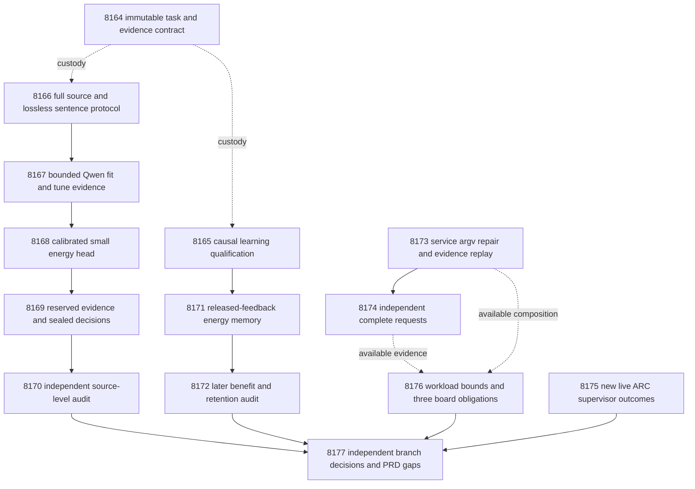

# Carnot Research Roadmap v706 — Sentence evidence and qualified continual learning

**Milestone:** `2026.10.706`  
**Created:** 2026-10-05  
**Status:** Proposed; staged, not activated  
**Supersedes:** completed milestone `2026.10.705`  
**Task contract:** exactly **14 tasks, Exp8164 through Exp8177**, in that order.  
**Execution authority:** `research-roadmap-next.yaml`  
**Preserved predecessor:** `research-roadmap-v705-preserved-20261005.md`

This milestone tests whether complete sentence evidence improves calibrated
verification. It qualifies the already registered online-learning schedule and
measures independent service requests. These three branches have separate gates.
The design follows v7/v8: previous evidence, architecture, phases, dependencies
and hardware. The task table and full embedded contract match the execution YAML.

## What v705 proved

Completion describes the conductor's schedule, not scientific success. Twelve
primary artifacts exist. Two tasks were gate-skipped. The completed archive had
not yet appended V705 at planning time; the active task list, final primaries,
conductor log and operational retrospective supply the current record.

| Experiments | Terminal evidence | Consequence |
|---|---|---|
| 8150 | `complete_null_contract_custody`; contract readiness 1. | Reuse authority readers. |
| 8151 | `complete_null_source_protocol_sealed`; source readiness 1. | Immutable historical method custody now works. |
| 8152 | `complete_disqualified_owned_validation`; learning readiness 0. | Cover its exact checksum-rejection branch before a natural run. |
| 8153 | `complete_null_fit_evidence_capture`; capture and trainability 1. | Reuse original fit/tune sources and matched controls. |
| 8154 | `complete_null_evidence_energy_fit`; fit readiness 1. | Small calibrated heads and equivalent logistic readout are available. |
| 8155 | `complete_null_reserved_evidence_sealed`; capture readiness 1. | Reserved predictions were sealed; historical exposure remains. |
| 8156 | `complete_null_decision_development_null`; H1 score 0. | Test a different evidence representation, not another unchanged fit. |
| 8157–8158 | Gate-blocked; no primary artifacts. | Earlier-admission natural learning remains untested. |
| 8159 | `complete_positive_durable_batch_service_measured`; host readiness 1. | Qualified host batching is not a complete-service deployment claim. |
| 8160 | `complete_disqualified_shared_acquisition_cost`; composition readiness 0. | Repair static-check argv before spending more GPU time. |
| 8161 | `complete_null_no_new_outcomes`; qualified reader, no new events. | Incremental observation can satisfy ARC continuity without churn. |
| 8162 | `complete_blocked_acquisition_composition_ready_score`; board and host bounds ready. | Preserve independent evidence branches. |
| 8163 | `complete_blocked_required_checks_passed`; execution 1, science 0. | Reconcile all actual dispositions, including absent primaries. |

Exp8156 evaluated 98 sources. Radial typed cost was 0.30612244897959184;
scalar-span cost was 0.32142857142857145. The registered comparison was radial
versus additive cubic: mean gain 0.09183673469387756, one-sided 97.5% lower bound
-0.04591836734693878. This did not pass H1. Equivalent logistic predictions
matched radial predictions. These are exposed development findings.

Exp8152's only failing receipt was coverage_report: 498 of 499 statements were
covered. The missing statement was the checksum-rejection return at
`python/carnot/verify/admission_horizon_methods_8152.py:847`. The new qualification
must exercise it; reducing the threshold or deleting that branch is not a fix.
The reported fixture readiness was zero after disqualification. It must be
independently re-established, not inferred from passing numerical tests.

Exp8160's Ruff check and format commands included a pytest node selector as a
filename: `tests/python/test_durable_batch_8159.py::test_crashes_deduplication`.
The scope is a command-argument repair plus independent evidence replay.
Original failing receipts and measurement timestamps remain immutable.

## Three biggest gaps against the PRD

1. **FR-06 / FR-12 — useful verification decisions.** A quote can be present
   while another sentence is unsupported. Test complete sentence evidence and
   a small calibrated energy selector against matched, strong controls.
2. **FR-11 — continuous learning that helps later queries.** Earlier admission
   is registered but untested naturally. Qualify the frozen causal schedule,
   then measure later decisions and separate retention labels.
3. **FR-05 / FR-08 / NFR-01 — complete-service performance.** Host arithmetic
   and composed costs do not measure independent full requests. Qualify the
   service harness, then charge acquisition, queueing, storage and recovery.

Fresh independent labels and independent reproduction remain missing. This
milestone cannot close that gap by reusing exposed sources with a new split.
All natural results retain within-run role separation and explicit development
scope. Both independent-generalization artifact scores remain zero.

## Research incorporated before design

The V706 entry in `research-references.md` was appended before this design.
It records all eight requested primary topics and all six secondary channels.
Semantic Scholar citation APIs were inaccessible. OpenReview challenged the
browser. GitHub trending responses were stale. These limits are recorded rather
than treated as complete citation or repository coverage.

| Source | Concrete use | Claim boundary |
|---|---|---|
| [RT4CHART, revised July 2026](https://arxiv.org/abs/2603.27752v2) | Exp8166–8170 test local evidence relations on complete original sentences. | An adaptation, not a replication of the paper's scores. |
| [Evidence alignment, 2026](https://arxiv.org/abs/2608.15804) | Separate coverage, byte-valid quotes and semantic predictions. | No new encoder training or inferred sentence gold labels. |
| [GASP, July 2026](https://arxiv.org/abs/2607.04223) | Exp8167 includes a fixed source-removal diagnostic. | Elicited probabilities are not GASP token likelihoods. |
| [Delayed feedback, February 2026](https://arxiv.org/abs/2602.02634); [capacity limits, June 2026](https://arxiv.org/abs/2606.11711) | Exp8165/8171/8172 separate issue, release, admission and future exposure. | Nonlinear energy heads inherit no convex regret guarantee. |
| [KAC, 2025](https://arxiv.org/abs/2503.21076); [KAN forgetting, 2025](https://arxiv.org/abs/2511.12828) | Equal-capacity radial controls and explicit retention. | Local support is not a retention guarantee. |
| [Extropic research-agent update, October 1, 2026](https://extropic.ai/writing/baby-thermo-rsi/) | Separate execution readiness from improvement; retain actual hardware access requirements. | Vendor research-agent rewards are not Carnot learning or TSU measurements. |
| [FPGA–Ising decomposition, 2026](https://arxiv.org/abs/2602.15985); [Z1T](https://extropic.ai/writing/z1t) | Exp8176 accounts for orchestration, movement and readout. | No imported speed or efficiency ratio. |

EBT and ARM–EBM support energy-based decision research, with a logistic equivalence
control. Encoded neural constraint solvers and visual energy-guided decoding are
deferred until semantic verifier utility is measured. Kona's public description
provides no reproducible architecture update for this plan.

## v706 architecture



Solid arrows between scientific tasks represent structured readiness gates.
Arrows into the capstone are evidence flow only: its `gated_on` is empty.
The hardware task also runs when a service branch fails. Dotted custody links
are not hidden all-branch gates. GPU work is sequential in conductor order.

## Phase 1 — qualify the methods, experiments 8164–8166

**8164 contract custody** binds the new 14-task list and preserves V705's twelve
primaries and two gate skips. It reuses the qualified authority lifecycle.
**8165 learning qualification** adds the missing checksum-rejection regression.
It preserves the V705 numerical protocol and requires its future-exposure fixture
again. **8166 sentence methods** freezes text partitioning, model budgets,
features, controls and statistical decisions before any new capture.

The new sentence protocol uses the same 128 fit, 64 tune and 128 reserved slots.
It preserves full sources and original answer sentences with byte offsets.
A request holds up to four full sentences. At most two requests are allowed per
source, with 6000 input and 256 output tokens per request. Text that exceeds
those limits stays in the record with an escalation decision. No source or
sentence is shortened to fit. Model-predicted relations are entailed, contradicted
or baseless, each with an unsupported probability and an optional source quote.

Source labels remain original human answer labels. Exact quote membership is a
mechanical feature, not semantic ground truth. The fitting head has at most 16
features: the prior 12 plus mean/max local unsupported probability and the
fractions predicted contradicted/baseless. Sixteen radial centers give a bounded
Gibbs-scale energy head. Its equivalent logistic readout is a parity control.

## Phase 2 — test local evidence, experiments 8167–8170

**8167 fit/tune capture** adds current local evidence through the existing owned
CUDA worker. It reuses historical holistic and quote controls. It permits 384
main calls and 16 fixed source-removal/mismatch diagnostic calls. Trainability
requires at least 96 fit sources, 48 tune sources and 12 targets per class in each.
**8168 energy fit** trains the registered small head and freezes calibration,
typed thresholds and the comparator before reserved predictions.
**8169 reserved capture** permits 256 calls and seals all predictions.
**8170 decision audit** reconstructs every result independently from source rows.

**H1:** compare the local-evidence head with the strongest prior control selected
on tune only from scalar-span, linear12 and radial16. Require at least 96 paired
reserved sources, 12 per class, five improved sources, no extra false accepts,
and Brier increase at most .01. The one-sided 97.5% lower bound of control cost
minus treatment cost must exceed .02. Use 10000 source bootstrap draws with at
least 9500 valid draws. Preserve the V705 typed cost matrix. Missing local output
means escalation in the main comparison. Complete-case results are secondary.

The local max-probability control, feature ablation, all prior controls and exact
logistic representation are descriptive checks. They cannot become a new primary
comparison after results arrive. Even a passing H1 is an exposed development
signal. It cannot establish a generic text-ranking moat or independent benefit.

## Phase 3 — learning and complete requests, experiments 8171–8174

**8171 continuous learning** depends only on qualified Exp8165 methods. The source
capture branch cannot block it. Reuse the original 256-slot stream and 64-slot
retention set. Preserve missing slots and historical exposure. Predict first,
release labels after 20 slots, and keep the 32-event pending limit. Commit at
slots 64/144 and expire at 144/224. Admission uses twelve later one-use labels.
Compare error-selected, fixed-public and random-past centers with frozen Qwen
at equal capacity; preserve the V705 twenty seeds, optimizer and safety grid.

**8172 benefit audit** independently tests unchanged **H2**, error-selected
versus fixed-public centers. Require 128 later sources, eight per class, eight
nonoverlapping blocks, and 48 retention sources with eight per class. Average
seeds within source before the original-slot block bootstrap. Preserve block
length 16, sensitivity lengths 8/32, 10000 draws and at least 9500 valid draws.
The lower one-sided 97.5% cost-gain bound must exceed .02, with five improved
sources, no extra false accepts, Brier increase at most .01 and cost no more than
.02 above other controls. Preserve the immutable retention tolerance exactly.
H1 and H2 share Bonferroni family alpha=.05; neither can spend the other's alpha
if a branch blocks. Report installation and remaining exposure before benefit.

**8173 service validation** repairs the diagnosed pytest-selector/static-path
mix-up. It separately qualifies the runner and any replayable composition.
Original model work stays historical; no new inference occurs in this task.
**8174 complete requests** then compares 24 fixed sources through Python and
native durable batches of eight. Each source has independent acquisition in
both arms: 48 bounded calls plus two warmups, 128 output tokens each.

Record arrival, queueing, generation, parsing, boundary crossing, arithmetic,
persistence and response without double-counting overlapping timers. Report
cold load separately from steady service. Pair on source, not generated bytes.
Nonidentical outputs and changed decisions are measured confounders. A pure
implementation-speed claim requires equivalent behavior. NFR-01 requires a
lower95 ratio of at least 10 on the declared complete request boundary.
All other timing comparisons remain descriptive; host-only and composed costs
are separate scopes. A request timing panel is not an accuracy benchmark.

## Phase 4 — continuity and decisions, experiments 8175–8177

**8175 ARC supervisor delta** uses the qualified Exp8161 reader and its frontier.
No new events means a terminal null and no policy change. Thirty new resolved
outcomes across five games are required before a priority recommendation.
Generalization needs within-game controls and held-game evidence. The task makes
no new solve claim, performs no game-source inspection, and uses no offline BFS.
Imported solves retain provenance and must pass the registry duplicate check.

**8176 hardware boundary** accounts for each available service branch and keeps
three separate board obligations. It computes `1/(1-f)` only for measured
removable arithmetic. A 100x complete-workload target requires `f>=.99` even with
unlimited arithmetic speed. Mixed timers give only optimistic outer bounds.
**8177 capstone** always runs and reconciles fourteen actual dispositions, H1,
H2, service scope, retirement decisions and the stable publication gate G1–G4.
An unchanged external block is terminal `blocked`; it is never retryable `partial`.

## Structured dependency graph

| Consumer | Required producer field, equal to 1 |
|---|---|
| exp8167-fit-sentence-capture | exp8166-sentence-evidence-methods.sentence_protocol_ready_score |
| exp8168-sentence-energy-fit | exp8167-fit-sentence-capture.fit_trainable_score |
| exp8169-reserved-sentence-capture | exp8168-sentence-energy-fit.energy_fit_ready_score |
| exp8170-sentence-decision-audit | exp8169-reserved-sentence-capture.evaluation_capture_ready_score |
| exp8171-released-feedback-learning | exp8165-learning-qualification.learning_protocol_ready_score |
| exp8172-learning-benefit-audit | exp8171-released-feedback-learning.learning_trajectory_ready_score |
| exp8174-complete-request-cost | exp8173-service-validation.service_protocol_ready_score |

All other tasks have empty `gated_on`. Every field above is declared in its
producer's REQUIRED ARTIFACT FIELDS. No `requires` chain names a retired task.
Scientific failure must not remove capstone, board or ARC accounting.

## Hardware and execution requirements

| Resource | Use | Requirement and claim limit |
|---|---|---|
| Two RTX 3090 GPUs, 24 GB each | Exp8167, 8169, 8174 bounded Qwen judgments | Resolve the actual cache and runtime; own a CUDA lease; verify offload. No parallel competing model workers are required. |
| CPU, RAM and local durable storage | Small-head fitting, event replay and audits | Preserve pending state and original masks. Plan for existing cached corpus, model and raw shards; check actual free space before execution. |
| Rust/PyO3 extension | Qualified atomic batch service | Cross the loaded extension, check parity and recovery; a build alone is insufficient. |
| KV260 | Existing fabric receipt and useful workload boundary | Preserve `k_max<=5`; future execution requires authenticated SSH/device timing and a useful measured workload. |
| PolarFire | Independent continuity receipt | Linux CPU dispatch is not FPGA fabric acceleration. Genuine fabric workload and device timing remain owed. |
| GateMate | Independent physical/JTAG blocker record | Preserve `0xffffffff` until a dated cable, power, port, board or DirtyJTAG change. Do not repeat unchanged probes. |
| AMD APU/NPU and Extropic TSU | Deferred acceleration options | Require actual supported operators and authenticated access. No purchase, setup or chip availability is assumed. |

The hardware wishlist has historical inventory conflicts. Recent authenticated
receipts govern operational claims. The hardware task retains a separate row,
terminal condition and reopen requirement for every attached board. The October
Extropic announcement describes future large-scale chip feedback; it does not
supply local hardware.

Every current LLM task uses `MODEL_SPECS: [unsloth/Qwen3.8-27B-GGUF]` and
`model_bounded_generation`, with its 10-second floor. These runs emit fixed-budget
judgments. Full generative workloads would require `model_full_generation`
(60 seconds), and load-only/embedding work `model_load_no_generation` (2 seconds).
Neither is scheduled. CPU fitting and artifact reductions use `no_model_load`,
empty current MODEL_SPECS and explicit historical model provenance. Small trained
heads are declared separately. Legacy models have no headline role.

All tasks require flushed output at phase boundaries and before/after model
load, generation, benchmarks and subprocesses. Real progress also appears inside
long loops and child waits every 60 seconds. No silence gap may reach 600 seconds.
Tool polling stays at most 60 seconds. Files over about 200 lines are written in
several calls, with progress between writes. Model workers stop launching new
calls at 3000 seconds to leave time for closure and validation within 4800 seconds.
Failed and censored attempts remain in the denominator; no duration padding.

Routing follows the current user directive: schema and validation coordination
uses Opus with 100 turns; formulaic capture work uses Codex `gpt-6.1-sol`; routine
training and audits use the default backend. ARC observation uses 20 turns and
hardware accounting 30. No Gemini or Luna task is scheduled. These task-routing
choices are independent of the frozen local model used in the experiments.

## Scope, retirement and validation

The planning scan parsed the complete experiment archive and indexed all 226
previous roadmap documents. It checked current raw findings, prior failure
scopes, the exclusion manifest, known priorities and V705 receipts. The new
sentence study is source-grounded verification on original natural answers.
It does not reopen external generated-text reward ranking against self-consistency,
compact generated spans, importance anchoring or four-expert reweighting.
No retired ID is reused. No fabricated operator override is emitted.

Every task carries all four `prior_failures` subfields. Some predecessors are
qualified nulls included to preserve lineage; their presence does not mean the
predecessor was defective. Exact repeated same-scope outcomes retain mechanical
retirement. New IDs do not authorize an unchanged failed mechanism. Skipped
V705 learning tasks have no invented terminal artifact verdict.

Implementation starts from relevant `REQ-*` and `SCENARIO-*`, then failing tests.
Owned verification requires scoped unit tests, 100% changed-code coverage,
Ruff check/format, strict mypy, explicit-path spec coverage, applicable private
E2E tests and normal exits. Static tools receive filenames; only pytest receives
node selectors. Source capture and audits use E2E-015/019; causal learning uses
E2E-016; native service uses E2E-003/004; authority uses E2E-018. Private tests
must not rewrite historical production artifacts or publication pages.

Each task emits primitive rows and annotated required fields. Honest terminal
verdicts use the closed verdict_class enum. Oracle fixtures are circular_positive;
owned validation failures are disqualified. Missing unchanged external evidence
is blocked, never partial. Only unfinished owned work may request a retry.
Publish only through the qualified primary publisher after unmodified adversarial
and strict row-consistency checks. Reconcile specs, traceability, status and
changelog without pruning history. The plan neither activates the staged YAML
nor changes `scripts/research_conductor.py`. It authorizes no external publication.

Planning verification uses schema, gate, exclusion and priority checks, plus
private authority activation/rejection tests against these exact task bytes.
Results belong in `ops/test-results.md`. Whole-repository health is reported
separately from scoped planning validation.

## Exact task contract

Exactly **14 tasks, Exp8164 through Exp8177**, in conductor order.

| Order | ID | Title | Phase | Deliverable |
|---|---|---|---|---|
| 1 | exp8164-contract-custody | Bind fourteen tasks and preserve V705 terminal evidence | 1 | `results/experiment_8164_v706_contract_custody.json` |
| 2 | exp8165-learning-qualification | Qualify release-aware learning with complete negative replay coverage | 1 | `results/experiment_8165_v706_learning_qualification.json` |
| 3 | exp8166-sentence-evidence-methods | Freeze lossless sentence evidence and a matched decision comparison | 1 | `results/experiment_8166_v706_sentence_evidence_methods.json` |
| 4 | exp8167-fit-sentence-capture | Capture bounded Qwen sentence evidence on fit and tune sources | 2 | `results/experiment_8167_v706_fit_sentence_capture.json` |
| 5 | exp8168-sentence-energy-fit | Train a calibrated typed energy selector from local evidence | 2 | `results/experiment_8168_v706_sentence_energy_fit.json` |
| 6 | exp8169-reserved-sentence-capture | Seal reserved sentence evidence and frozen typed predictions | 2 | `results/experiment_8169_v706_reserved_sentence_capture.json` |
| 7 | exp8170-sentence-decision-audit | Test sentence evidence benefit with source-level uncertainty | 2 | `results/experiment_8170_v706_sentence_decision_audit.json` |
| 8 | exp8171-released-feedback-learning | Measure continuous energy learning while future decisions remain | 3 | `results/experiment_8171_v706_released_feedback_learning.json` |
| 9 | exp8172-learning-benefit-audit | Audit later decision benefit and independent retention labels | 3 | `results/experiment_8172_v706_learning_benefit_audit.json` |
| 10 | exp8173-service-validation | Qualify service validation and replay preserved acquisition evidence | 3 | `results/experiment_8173_v706_service_validation.json` |
| 11 | exp8174-complete-request-cost | Measure independent Qwen requests through durable Python and Rust services | 3 | `results/experiment_8174_v706_complete_request_cost.json` |
| 12 | exp8175-arc-supervisor-delta | Inspect new live supervisor outcomes for transferable arm selection | 4 | `results/experiment_8175_v706_arc_supervisor_delta.json` |
| 13 | exp8176-hardware-workload-boundary | Bound complete-workload acceleration and retain all board obligations | 4 | `results/experiment_8176_v706_hardware_workload_boundary.json` |
| 14 | exp8177-capstone | Decide fourteen outcomes and three remaining PRD gaps | 4 | `results/experiment_8177_v706_capstone.json` |

Canonical full-task SHA-256: `fed76baa26813bbf3c9730eb418e5a2b5b38ea3b99239fd1d449953f970e04e8`

The JSON below preserves every YAML task field, including prompts and failure history.

<!-- V706_TASK_CONTRACT_START -->
```json
{"milestone": "2026.10.706", "tasks": [
{"id": "exp8164-contract-custody", "title": "Bind fourteen tasks and preserve V705 terminal evidence", "phase": 1, "track": "infra", "priority": "high", "requires_gpu": false, "max_turns": 100, "estimated_wall_time_min": 25, "per_unit_rows": true, "milestone": "2026.10.706", "deliverable": "results/experiment_8164_v706_contract_custody.json", "inference_substrate_class": "no_model_load", "MODEL_SPECS": [], "gated_on": [], "prior_failures": [{"experiment_id": "exp8150-contract-custody", "verdict": "complete_null_contract_custody", "addressed_by": "Bind the new 14-task authority and preserve actual V705 disqualifications and gate skips; reuse the qualified parser.", "retire_if_same_verdict": true}], "model": "opus", "prompt": "CONTEXT:\nWork in {project_root} on {date}. V705 produced twelve primary artifacts and two gate skips. Source decisions were null. Learning and acquisition composition had separate owned validation failures. Administrative completion is not positive science.\nEXISTING CODE TO READ FIRST:\nCLAUDE.md; CODEX.md; ops/e2e-test-plan.md; openspec/capabilities/research-reporting/spec.md; openspec/capabilities/verification/spec.md; scripts/experiment_template.py; python/carnot/reporting/primary_publication.py; ops/exclusion_manifest.yaml; openspec/change-proposals/research-roadmap-vNEXT.md; python/carnot/reporting/v685_authority_lifecycle.py; python/carnot/reporting/roadmap_contract.py; results/experiment_8150_v705_contract_custody.json; results/experiment_8163_v705_capstone.json; ops/conductor-log.md; research-roadmap.yaml; research-roadmap-next.yaml\nTASK:\nBind fourteen tasks and preserve V705 terminal evidence. Deliver results/experiment_8164_v706_contract_custody.json, primitive evidence under results/raw/experiment_8164_v706_contract_custody/, and runnable scripts/experiments/experiment_8164_v706_contract_custody.py.\nCONCRETE STEPS:\n1. Emit a flushed progress line at each phase boundary and before and after every model load, generation, benchmark, and subprocess. Use PYTHONUNBUFFERED=1 and print(..., flush=True). Inside long loops and child waits, report actual completed and pending counts at least every 60 seconds. Keep every silence gap below 600 seconds. Poll in tool calls of at most 60 seconds. Write any file over about 200 lines in several tool calls of at most about 150 lines. Send a progress message between writes. Never pad duration or invent activity.\n2. Check actual input paths, hashes, runtime and gate operands before work. Read cited artifacts with scripts/summarize_artifact.py, then inspect primitive rows. Preserve historical primaries. External missing, retired or gate-blocked inputs are terminal complete_blocked_<check>, verdict_class=blocked. Record the exact check and observed value in gate_check_summary. Use partial only for unfinished owned work that another attempt can complete.\n3. Extend relevant REQ-* and SCENARIO-* before implementation. Write failing tests first. Reuse qualified modules through a thin CLI. Keep fixtures and mutations in private temporary directories outside results/. Preserve original assertions. Check direct script execution outside the checkout without PYTHONPATH. Historical methods must use immutable versioned files and hashes, never mutable vNEXT headings.\n4. Load no LLM. Set MODEL_SPECS=[] and inference_substrate_class=no_model_load. Use aggregation_from_upstream_artifacts for reductions or verifier_ensemble_against_cached_candidates for CPU head work. Record historical model provenance separately from zero current model calls. Declare small fitted heads in trained_head_specs.\n5. Bind exactly 14 tasks Exp8164 through Exp8177 to the visible table, full JSON task contract and canonical full-task digest. Use activated authority when staged YAML has moved. Run E2E-018 with private staged and active files. Never overwrite research-roadmap.yaml or activate this plan.\n6. Copy V705 design and input bytes into immutable custody. Preserve the actual primary paths from the V705 task list. Exp8157 and Exp8158 have no primary; record conductor GATE_BLOCK dispositions without inventing honest_verdict strings. Do not derive filenames from task IDs.\n7. Freeze a scope ledger for all prior_failures entries. Record the exact failed receipt for Exp8152 and Exp8160. Do not treat expired schedules, null source results, missing primaries and owned validation failures as one cause. Validate downstream field names against producers in this roadmap.\n8. Read the V706 research-reference entry and preserve its method-to-task mapping. Keep the two predeclared scientific hypotheses, source-cluster units, exposure limits and separate hardware obligations. Capstone must run regardless of branch results.\n9. Freeze owned validation argv before measurement. Give pytest node IDs only to pytest; give Ruff, mypy and spec checks real file paths. Run scoped pytest with all assertions, 100% changed-code statement coverage, Ruff check and format, strict mypy, and explicit-path spec coverage. Run applicable private E2E success, external block, tamper and cold-replay paths. Record argv, expected and actual exit, duration and log hash. Every required check must exit normally. Separate unrelated repository health. If Rust changes, also run scoped cargo test, fmt and clippy, plus actual loaded-binding parity and E2E-003/004.\n10. Save primitive rows and source/code/config hashes. Recompute headlines independently. Run unmodified adversarial_verify.py and strict verdict_row_consistency_lint.py with progress during waits. Publish through primary_publication only after owned checks pass. Owned validation failure sets readiness to 0 and verdict_class=disqualified. Reconcile openspec/, _bmad/traceability.md, ops/status.md and ops/changelog.md. Preserve historical and operator-curated publication pages. No external publication.\nREQUIRED ARTIFACT FIELDS:\n- honest_verdict: complete_*; verdict_class: positive | circular_positive | null | blocked | disqualified | partial. Principle: only unfinished owned work is retryable partial.\n- verifier_is_oracle, claim_scope, exposure_scope, independent_generalization_score: 0, generalized_learning_benefit_score: 0. Principle: fixtures and exposed development do not establish independent generalization.\n- required_checks_passed, flagged_adversarial, validation_receipts, terminal_validation_sidecar_path, preconditions_checked. Principle: readiness requires normal owned validation.\n- gate_check_summary: check/upstream/path/hash/artifact_field/op/expected/observed/passed. Principle: blocked verdicts name the actual failed check and value.\n- inference_substrate, inference_substrate_class, MODEL_SPECS, trained_head_specs, model_invocation_counts, call_ledger, cited_upstream_artifacts: experiment_id/fields_imported/sha256. Principle: current execution and imported provenance remain distinct.\n- rows: unit_id/source_cluster_id/arm/condition/metric/numerator/denominator/status/exclusion_reason. Principle: each comparison is reconstructable per independent unit.\n- intended_count, eligible_count, independent_count, completed_count, excluded_count, censored_count, failed_count, sample_size_budget. Principle: seeds, sentences and repeats do not create independent sources.\n- run_date, duration_s, random_seed, reproducibility_checksum, source_artifact_hashes, raw_shard_hashes, code_config_hashes, phase_spans, acceptance_gates, field_principles. Principle: claims bind to measured work and thresholds frozen before outcomes.\n- contract_ready_score: 0|1, task_dispositions, canonical_tasks_sha256, prior_scope_ledger, literature_mapping. Principle: a complete executable contract prevents silent task omission.\nRun command: cd {project_root} && PYTHONUNBUFFERED=1 JAX_PLATFORMS=cpu .venv/bin/python -u scripts/experiments/experiment_8164_v706_contract_custody.py --date {date}\nDo NOT push. Do NOT modify scripts/research_conductor.py."},
{"id": "exp8165-learning-qualification", "title": "Qualify release-aware learning with complete negative replay coverage", "phase": 1, "track": "infra", "priority": "high", "requires_gpu": false, "max_turns": 100, "estimated_wall_time_min": 35, "per_unit_rows": true, "milestone": "2026.10.706", "deliverable": "results/experiment_8165_v706_learning_qualification.json", "inference_substrate_class": "no_model_load", "MODEL_SPECS": [], "gated_on": [], "prior_failures": [{"experiment_id": "exp8152-admission-horizon-methods", "verdict": "complete_disqualified_owned_validation", "addressed_by": "Exercise the exact uncovered checksum-rejection branch; retain the frozen schedule and require independent future-exposure fixtures before natural learning.", "retire_if_same_verdict": true}], "model": "opus", "prompt": "CONTEXT:\nWork in {project_root} on {date}. Exp8152 failed only coverage_report: one uncovered checksum-rejection line, admission_horizon_methods_8152.py:847. Its numerical protocol is already frozen. Exp8157 and Exp8158 never ran.\nEXISTING CODE TO READ FIRST:\nCLAUDE.md; CODEX.md; ops/e2e-test-plan.md; openspec/capabilities/research-reporting/spec.md; openspec/capabilities/verification/spec.md; scripts/experiment_template.py; python/carnot/reporting/primary_publication.py; ops/exclusion_manifest.yaml; openspec/change-proposals/research-roadmap-vNEXT.md; python/carnot/verify/admission_horizon_methods_8152.py; python/carnot/reporting/admission_horizon_execution_8152.py; tests/python/test_admission_horizon_methods_8152.py; results/experiment_8152_v705_admission_horizon_methods.json; openspec/change-proposals/v705-admission-horizon-protocol.json; results/experiment_8111_v702_methods_and_stream_custody.json\nTASK:\nQualify release-aware learning with complete negative replay coverage. Deliver results/experiment_8165_v706_learning_qualification.json, primitive evidence under results/raw/experiment_8165_v706_learning_qualification/, and runnable scripts/experiments/experiment_8165_v706_learning_qualification.py.\nCONCRETE STEPS:\n1. Emit a flushed progress line at each phase boundary and before and after every model load, generation, benchmark, and subprocess. Use PYTHONUNBUFFERED=1 and print(..., flush=True). Inside long loops and child waits, report actual completed and pending counts at least every 60 seconds. Keep every silence gap below 600 seconds. Poll in tool calls of at most 60 seconds. Write any file over about 200 lines in several tool calls of at most about 150 lines. Send a progress message between writes. Never pad duration or invent activity.\n2. Check actual input paths, hashes, runtime and gate operands before work. Read cited artifacts with scripts/summarize_artifact.py, then inspect primitive rows. Preserve historical primaries. External missing, retired or gate-blocked inputs are terminal complete_blocked_<check>, verdict_class=blocked. Record the exact check and observed value in gate_check_summary. Use partial only for unfinished owned work that another attempt can complete.\n3. Extend relevant REQ-* and SCENARIO-* before implementation. Write failing tests first. Reuse qualified modules through a thin CLI. Keep fixtures and mutations in private temporary directories outside results/. Preserve original assertions. Check direct script execution outside the checkout without PYTHONPATH. Historical methods must use immutable versioned files and hashes, never mutable vNEXT headings.\n4. Load no LLM. Set MODEL_SPECS=[] and inference_substrate_class=no_model_load. Use aggregation_from_upstream_artifacts for reductions or verifier_ensemble_against_cached_candidates for CPU head work. Record historical model provenance separately from zero current model calls. Declare small fitted heads in trained_head_specs.\n5. Reproduce the exact missing checksum-rejection branch with an additive regression. Preserve the original test assertions and coverage threshold. Exercise malformed checksum, rehashed row tamper, protocol hash mutation and valid cold replay. Fix implementation only if these tests reveal a defect.\n6. Reuse the immutable V705 numerical protocol byte-for-byte. Keep opportunities 64/144, expiry 144/224, delay 20, pending capacity 32, 12 later one-use admission labels, 16 initial and 24 maximum centers. Do not select new parameters from observed results.\n7. Rerun private scalar-reference, admission-order, restart, overflow and old-expiry fixtures. Independently require installation by slot 208 and at least 32 later changed predictions on the learnable fixture. If the fixture fails after validation passes, publish the actual failure and do not tune it to force readiness.\n8. Authenticate the original 256 stream slots and 64 retention slots with original missing masks from Exp8111. Separate custody, numerical fixture readiness and owned validation. Publish a new qualification receipt; preserve Exp8152 as disqualified. A fixture passes with circular_positive only and confers no natural learning credit.\n9. Freeze owned validation argv before measurement. Give pytest node IDs only to pytest; give Ruff, mypy and spec checks real file paths. Run scoped pytest with all assertions, 100% changed-code statement coverage, Ruff check and format, strict mypy, and explicit-path spec coverage. Run applicable private E2E success, external block, tamper and cold-replay paths. Record argv, expected and actual exit, duration and log hash. Every required check must exit normally. Separate unrelated repository health. If Rust changes, also run scoped cargo test, fmt and clippy, plus actual loaded-binding parity and E2E-003/004.\n10. Save primitive rows and source/code/config hashes. Recompute headlines independently. Run unmodified adversarial_verify.py and strict verdict_row_consistency_lint.py with progress during waits. Publish through primary_publication only after owned checks pass. Owned validation failure sets readiness to 0 and verdict_class=disqualified. Reconcile openspec/, _bmad/traceability.md, ops/status.md and ops/changelog.md. Preserve historical and operator-curated publication pages. No external publication.\nREQUIRED ARTIFACT FIELDS:\n- honest_verdict: complete_*; verdict_class: positive | circular_positive | null | blocked | disqualified | partial. Principle: only unfinished owned work is retryable partial.\n- verifier_is_oracle, claim_scope, exposure_scope, independent_generalization_score: 0, generalized_learning_benefit_score: 0. Principle: fixtures and exposed development do not establish independent generalization.\n- required_checks_passed, flagged_adversarial, validation_receipts, terminal_validation_sidecar_path, preconditions_checked. Principle: readiness requires normal owned validation.\n- gate_check_summary: check/upstream/path/hash/artifact_field/op/expected/observed/passed. Principle: blocked verdicts name the actual failed check and value.\n- inference_substrate, inference_substrate_class, MODEL_SPECS, trained_head_specs, model_invocation_counts, call_ledger, cited_upstream_artifacts: experiment_id/fields_imported/sha256. Principle: current execution and imported provenance remain distinct.\n- rows: unit_id/source_cluster_id/arm/condition/metric/numerator/denominator/status/exclusion_reason. Principle: each comparison is reconstructable per independent unit.\n- intended_count, eligible_count, independent_count, completed_count, excluded_count, censored_count, failed_count, sample_size_budget. Principle: seeds, sentences and repeats do not create independent sources.\n- run_date, duration_s, random_seed, reproducibility_checksum, source_artifact_hashes, raw_shard_hashes, code_config_hashes, phase_spans, acceptance_gates, field_principles. Principle: claims bind to measured work and thresholds frozen before outcomes.\n- learning_protocol_ready_score: 0|1, future_exposure_fixture_score: 0|1, protocol_path, protocol_sha256, fixture_rows, original_slot_mask. Principle: qualification requires intact causal methods and exercised negative replay, not relabeled historical failure.\nRun command: cd {project_root} && PYTHONUNBUFFERED=1 JAX_PLATFORMS=cpu .venv/bin/python -u scripts/experiments/experiment_8165_v706_learning_qualification.py --date {date}\nDo NOT push. Do NOT modify scripts/research_conductor.py."},
{"id": "exp8166-sentence-evidence-methods", "title": "Freeze lossless sentence evidence and a matched decision comparison", "phase": 1, "track": "infra", "priority": "high", "requires_gpu": false, "max_turns": 100, "estimated_wall_time_min": 35, "per_unit_rows": true, "milestone": "2026.10.706", "deliverable": "results/experiment_8166_v706_sentence_evidence_methods.json", "inference_substrate_class": "no_model_load", "MODEL_SPECS": [], "gated_on": [], "prior_failures": [{"experiment_id": "exp8156-decision-audit", "verdict": "complete_null_decision_development_null", "addressed_by": "Replace one answer-level quote with lossless sentence evidence relations; keep matched existing controls and exposed-data claim limits.", "retire_if_same_verdict": true}], "model": "opus", "prompt": "CONTEXT:\nWork in {project_root} on {date}. Exp8156 found no registered source-decision benefit on 98 exposed sources. One answer-level quote cannot describe support for every sentence. RT4CHART motivates testing local evidence relations while preserving the full source and answer.\nEXISTING CODE TO READ FIRST:\nCLAUDE.md; CODEX.md; ops/e2e-test-plan.md; openspec/capabilities/research-reporting/spec.md; openspec/capabilities/verification/spec.md; scripts/experiment_template.py; python/carnot/reporting/primary_publication.py; ops/exclusion_manifest.yaml; openspec/change-proposals/research-roadmap-vNEXT.md; python/carnot/verify/source_method_custody_8151.py; python/carnot/verify/fit_evidence_capture_8153.py; python/carnot/verify/evidence_energy_fit_8154.py; python/carnot/verify/evidence_protocol_8124.py; results/experiment_8156_v705_decision_audit.json; research-references.md; openspec/change-proposals/research-roadmap-v705-preserved-20261005.md\nTASK:\nFreeze lossless sentence evidence and a matched decision comparison. Deliver results/experiment_8166_v706_sentence_evidence_methods.json, primitive evidence under results/raw/experiment_8166_v706_sentence_evidence_methods/, and runnable scripts/experiments/experiment_8166_v706_sentence_evidence_methods.py.\nCONCRETE STEPS:\n1. Emit a flushed progress line at each phase boundary and before and after every model load, generation, benchmark, and subprocess. Use PYTHONUNBUFFERED=1 and print(..., flush=True). Inside long loops and child waits, report actual completed and pending counts at least every 60 seconds. Keep every silence gap below 600 seconds. Poll in tool calls of at most 60 seconds. Write any file over about 200 lines in several tool calls of at most about 150 lines. Send a progress message between writes. Never pad duration or invent activity.\n2. Check actual input paths, hashes, runtime and gate operands before work. Read cited artifacts with scripts/summarize_artifact.py, then inspect primitive rows. Preserve historical primaries. External missing, retired or gate-blocked inputs are terminal complete_blocked_<check>, verdict_class=blocked. Record the exact check and observed value in gate_check_summary. Use partial only for unfinished owned work that another attempt can complete.\n3. Extend relevant REQ-* and SCENARIO-* before implementation. Write failing tests first. Reuse qualified modules through a thin CLI. Keep fixtures and mutations in private temporary directories outside results/. Preserve original assertions. Check direct script execution outside the checkout without PYTHONPATH. Historical methods must use immutable versioned files and hashes, never mutable vNEXT headings.\n4. Load no LLM. Set MODEL_SPECS=[] and inference_substrate_class=no_model_load. Use aggregation_from_upstream_artifacts for reductions or verifier_ensemble_against_cached_candidates for CPU head work. Record historical model provenance separately from zero current model calls. Declare small fitted heads in trained_head_specs.\n5. Authenticate the original V705 source manifest, roles, full source bytes, answers and baseline outputs. Preserve 128 fit, 64 tune and 128 reserved source slots. Previously exposed data stays exposed_development_within_run_disjoint. No independent-generalization claim or new human labels.\n6. Freeze an immutable v706-sentence-evidence-protocol.json under openspec/change-proposals/. Deterministically partition complete original answer sentences with UTF-8 offsets and exact reconstruction. Keep qualifiers. Each request includes the full source and up to four complete sentences. At most two requests per source, 6000 input tokens and 256 output tokens per request. Over-limit text or missing sentences yields escalation, never truncation or fabricated sentence labels.\n7. Request one p_unsupported and relation (entailed, contradicted, baseless) per indexed sentence, plus a verbatim source quote or null. Validate probabilities, indices, quote membership and UTF-8 offsets independently. Quote validity is not entailment. Retain original answer-level human targets only in their original roles; altered-source diagnostics have no inherited target.\n8. Freeze H1: local-evidence energy head versus the strongest V705 control selected on tune only from scalar_span, linear12 and radial16. Retain all controls descriptively. Use the V705 typed cost matrix, complete source denominators, missing-local escalation, minimum 96 reserved sources and 12 per class. Require cost-gain lower one-sided 97.5% bound >.02, at least five improved sources, no extra false accepts and Brier increase <=.01.\n9. Freeze at most 16 deterministic features: prior 12 features plus local unsupported mean/max, contradicted fraction and baseless fraction. Use one 16-center Gibbs-scale radial energy head and its exactly equivalent logistic readout; no architecture sweep. Fit normalization and centers on fit only. Tune calibration and thresholds only on tune. Compare a local max-probability control and a zero-local-feature ablation.\n10. Keep H2 exactly as the V705 admission protocol; Bonferroni alpha=.05 across H1/H2 means one-sided .025 each. Predeclare source bootstrap 10000 draws, >=9500 valid, and descriptive exposure. Qualify private parser, full-sentence coverage, role-separation and source-mutation E2E before any model capture.\n11. Freeze owned validation argv before measurement. Give pytest node IDs only to pytest; give Ruff, mypy and spec checks real file paths. Run scoped pytest with all assertions, 100% changed-code statement coverage, Ruff check and format, strict mypy, and explicit-path spec coverage. Run applicable private E2E success, external block, tamper and cold-replay paths. Record argv, expected and actual exit, duration and log hash. Every required check must exit normally. Separate unrelated repository health. If Rust changes, also run scoped cargo test, fmt and clippy, plus actual loaded-binding parity and E2E-003/004.\n12. Save primitive rows and source/code/config hashes. Recompute headlines independently. Run unmodified adversarial_verify.py and strict verdict_row_consistency_lint.py with progress during waits. Publish through primary_publication only after owned checks pass. Owned validation failure sets readiness to 0 and verdict_class=disqualified. Reconcile openspec/, _bmad/traceability.md, ops/status.md and ops/changelog.md. Preserve historical and operator-curated publication pages. No external publication.\nREQUIRED ARTIFACT FIELDS:\n- honest_verdict: complete_*; verdict_class: positive | circular_positive | null | blocked | disqualified | partial. Principle: only unfinished owned work is retryable partial.\n- verifier_is_oracle, claim_scope, exposure_scope, independent_generalization_score: 0, generalized_learning_benefit_score: 0. Principle: fixtures and exposed development do not establish independent generalization.\n- required_checks_passed, flagged_adversarial, validation_receipts, terminal_validation_sidecar_path, preconditions_checked. Principle: readiness requires normal owned validation.\n- gate_check_summary: check/upstream/path/hash/artifact_field/op/expected/observed/passed. Principle: blocked verdicts name the actual failed check and value.\n- inference_substrate, inference_substrate_class, MODEL_SPECS, trained_head_specs, model_invocation_counts, call_ledger, cited_upstream_artifacts: experiment_id/fields_imported/sha256. Principle: current execution and imported provenance remain distinct.\n- rows: unit_id/source_cluster_id/arm/condition/metric/numerator/denominator/status/exclusion_reason. Principle: each comparison is reconstructable per independent unit.\n- intended_count, eligible_count, independent_count, completed_count, excluded_count, censored_count, failed_count, sample_size_budget. Principle: seeds, sentences and repeats do not create independent sources.\n- run_date, duration_s, random_seed, reproducibility_checksum, source_artifact_hashes, raw_shard_hashes, code_config_hashes, phase_spans, acceptance_gates, field_principles. Principle: claims bind to measured work and thresholds frozen before outcomes.\n- sentence_protocol_ready_score: 0|1, protocol_path, protocol_sha256, source_manifest, baseline_manifest, method_map, feature_schema, statistical_plan. Principle: local semantic predictions must be measured against intact text and predeclared controls.\nRun command: cd {project_root} && PYTHONUNBUFFERED=1 JAX_PLATFORMS=cpu .venv/bin/python -u scripts/experiments/experiment_8166_v706_sentence_evidence_methods.py --date {date}\nDo NOT push. Do NOT modify scripts/research_conductor.py."},
{"id": "exp8167-fit-sentence-capture", "title": "Capture bounded Qwen sentence evidence on fit and tune sources", "phase": 2, "track": "science", "priority": "high", "requires_gpu": true, "max_turns": 50, "estimated_wall_time_min": 60, "per_unit_rows": true, "milestone": "2026.10.706", "deliverable": "results/experiment_8167_v706_fit_sentence_capture.json", "inference_substrate_class": "model_bounded_generation", "MODEL_SPECS": ["unsloth/Qwen3.8-27B-GGUF"], "gated_on": [{"upstream": "exp8166-sentence-evidence-methods", "artifact_field": "sentence_protocol_ready_score", "op": "==", "value": 1}], "prior_failures": [{"experiment_id": "exp8153-fit-evidence-capture", "verdict": "complete_null_fit_evidence_capture", "addressed_by": "Capture a new lossless local-evidence channel using the qualified worker; reuse existing holistic and span controls rather than recapture them.", "retire_if_same_verdict": true}], "agent_type": "codex", "model": "gpt-6.1-sol", "prompt": "CONTEXT:\nWork in {project_root} on {date}. The sentence protocol changes evidence granularity. Historical V705 outputs supply matched controls; current Qwen calls supply only new local evidence. This task measures transport and source coverage, not benefit.\nEXISTING CODE TO READ FIRST:\nCLAUDE.md; CODEX.md; ops/e2e-test-plan.md; openspec/capabilities/research-reporting/spec.md; openspec/capabilities/verification/spec.md; scripts/experiment_template.py; python/carnot/reporting/primary_publication.py; ops/exclusion_manifest.yaml; openspec/change-proposals/research-roadmap-vNEXT.md; python/carnot/verify/fit_evidence_capture_8153.py; python/carnot/verify/qwen_development_capture_7995.py; results/experiment_8153_v705_fit_evidence_capture.json; results/experiment_8166_v706_sentence_evidence_methods.json; openspec/change-proposals/v706-sentence-evidence-protocol.json\nTASK:\nCapture bounded Qwen sentence evidence on fit and tune sources. Deliver results/experiment_8167_v706_fit_sentence_capture.json, primitive evidence under results/raw/experiment_8167_v706_fit_sentence_capture/, and runnable scripts/experiments/experiment_8167_v706_fit_sentence_capture.py.\nCONCRETE STEPS:\n1. Emit a flushed progress line at each phase boundary and before and after every model load, generation, benchmark, and subprocess. Use PYTHONUNBUFFERED=1 and print(..., flush=True). Inside long loops and child waits, report actual completed and pending counts at least every 60 seconds. Keep every silence gap below 600 seconds. Poll in tool calls of at most 60 seconds. Write any file over about 200 lines in several tool calls of at most about 150 lines. Send a progress message between writes. Never pad duration or invent activity.\n2. Check actual input paths, hashes, runtime and gate operands before work. Read cited artifacts with scripts/summarize_artifact.py, then inspect primitive rows. Preserve historical primaries. External missing, retired or gate-blocked inputs are terminal complete_blocked_<check>, verdict_class=blocked. Record the exact check and observed value in gate_check_summary. Use partial only for unfinished owned work that another attempt can complete.\n3. Extend relevant REQ-* and SCENARIO-* before implementation. Write failing tests first. Reuse qualified modules through a thin CLI. Keep fixtures and mutations in private temporary directories outside results/. Preserve original assertions. Check direct script execution outside the checkout without PYTHONPATH. Historical methods must use immutable versioned files and hashes, never mutable vNEXT headings.\n4. Use only the frozen unsloth/Qwen3.8-27B-GGUF in MODEL_SPECS. Declare live_llm_inference and model_bounded_generation (10s floor) because these are fixed-budget judgments. Resolve and hash the real GGUF, revision and native runtime. Use CARNOT_FORCE_LIVE=1, an owned CUDA lease, real offload receipts and inference_mode=live_gpu. No simulated or legacy-model fallback. Stop new calls at 3000s; reserve closure and validation time inside 4800s. Load timeout 300s; each call timeout 120s. Save exact prompts, outputs, token counts and attempt/status records; retry only transport failure once within the original budget. Never relabel a short run as full generation.\n5. Gate on Exp8166.sentence_protocol_ready_score==1 and authenticate its protocol. Reuse the qualified owned CUDA worker, runtime identity and checkpoint ledger. Check owned validation before expensive calls. Fit and tune source IDs stay in original order; no reserved labels or substitutions.\n6. Process original 128 fit and 64 tune slots. At most two complete-sentence requests per source and 384 main calls total. Each request uses at most 256 output tokens. A source needs full sentence coverage for a local prediction; otherwise preserve its row and escalation disposition. Parser failures, budget censorship and absent historical sources stay distinct.\n7. On the first eight fit sources with eligible full text, make at most one local request with the source removed and one with a fixed mismatched source: 16 diagnostic calls total. Diagnostics have no human labels. Report probability sensitivity and byte-valid evidence separately. This is a GASP-inspired diagnostic, not token-likelihood GASP.\n8. Checkpoint every eight source slots. Record source, sentence, group, prompt, answer and model/runtime hashes and every attempted call. Keep original-label access in the role-specific evaluator. Set fit_trainable_score=1 only with >=96 complete fit sources, >=48 complete tune sources and >=12 original targets per class in each role. Transport readiness alone cannot assert trainability.\n9. Freeze owned validation argv before measurement. Give pytest node IDs only to pytest; give Ruff, mypy and spec checks real file paths. Run scoped pytest with all assertions, 100% changed-code statement coverage, Ruff check and format, strict mypy, and explicit-path spec coverage. Run applicable private E2E success, external block, tamper and cold-replay paths. Record argv, expected and actual exit, duration and log hash. Every required check must exit normally. Separate unrelated repository health. If Rust changes, also run scoped cargo test, fmt and clippy, plus actual loaded-binding parity and E2E-003/004.\n10. Save primitive rows and source/code/config hashes. Recompute headlines independently. Run unmodified adversarial_verify.py and strict verdict_row_consistency_lint.py with progress during waits. Publish through primary_publication only after owned checks pass. Owned validation failure sets readiness to 0 and verdict_class=disqualified. Reconcile openspec/, _bmad/traceability.md, ops/status.md and ops/changelog.md. Preserve historical and operator-curated publication pages. No external publication.\nREQUIRED ARTIFACT FIELDS:\n- honest_verdict: complete_*; verdict_class: positive | circular_positive | null | blocked | disqualified | partial. Principle: only unfinished owned work is retryable partial.\n- verifier_is_oracle, claim_scope, exposure_scope, independent_generalization_score: 0, generalized_learning_benefit_score: 0. Principle: fixtures and exposed development do not establish independent generalization.\n- required_checks_passed, flagged_adversarial, validation_receipts, terminal_validation_sidecar_path, preconditions_checked. Principle: readiness requires normal owned validation.\n- gate_check_summary: check/upstream/path/hash/artifact_field/op/expected/observed/passed. Principle: blocked verdicts name the actual failed check and value.\n- inference_substrate, inference_substrate_class, MODEL_SPECS, trained_head_specs, model_invocation_counts, call_ledger, cited_upstream_artifacts: experiment_id/fields_imported/sha256. Principle: current execution and imported provenance remain distinct.\n- rows: unit_id/source_cluster_id/arm/condition/metric/numerator/denominator/status/exclusion_reason. Principle: each comparison is reconstructable per independent unit.\n- intended_count, eligible_count, independent_count, completed_count, excluded_count, censored_count, failed_count, sample_size_budget. Principle: seeds, sentences and repeats do not create independent sources.\n- run_date, duration_s, random_seed, reproducibility_checksum, source_artifact_hashes, raw_shard_hashes, code_config_hashes, phase_spans, acceptance_gates, field_principles. Principle: claims bind to measured work and thresholds frozen before outcomes.\n- fit_capture_ready_score: 0|1, fit_trainable_score: 0|1, sentence_rows, capture_manifest, diagnostic_rows, gpu_receipts, model_revision, gguf_sha256, runtime_sha256. Principle: counted model work and source coverage precede learned claims.\nRun command: cd {project_root} && CARNOT_FORCE_LIVE=1 PYTHONUNBUFFERED=1 JAX_PLATFORMS=cpu .venv/bin/python -u scripts/experiments/experiment_8167_v706_fit_sentence_capture.py --date {date}\nDo NOT push. Do NOT modify scripts/research_conductor.py."},
{"id": "exp8168-sentence-energy-fit", "title": "Train a calibrated typed energy selector from local evidence", "phase": 2, "track": "science", "priority": "high", "requires_gpu": false, "max_turns": 50, "estimated_wall_time_min": 40, "per_unit_rows": true, "milestone": "2026.10.706", "deliverable": "results/experiment_8168_v706_sentence_energy_fit.json", "inference_substrate_class": "no_model_load", "MODEL_SPECS": [], "gated_on": [{"upstream": "exp8167-fit-sentence-capture", "artifact_field": "fit_trainable_score", "op": "==", "value": 1}], "prior_failures": [{"experiment_id": "exp8154-evidence-energy-fit", "verdict": "complete_null_evidence_energy_fit", "addressed_by": "Train a fixed small head on sentence-level semantic evidence; reuse the qualified training loop and retain a logistic equivalence control.", "retire_if_same_verdict": true}], "prompt": "CONTEXT:\nWork in {project_root} on {date}. FR-06 and FR-12 require useful accept/reject/escalate decisions. The calibrated-decision floor trains a small head on verifier signals; generator weights remain frozen. Existing labels cannot establish generalization.\nEXISTING CODE TO READ FIRST:\nCLAUDE.md; CODEX.md; ops/e2e-test-plan.md; openspec/capabilities/research-reporting/spec.md; openspec/capabilities/verification/spec.md; scripts/experiment_template.py; python/carnot/reporting/primary_publication.py; ops/exclusion_manifest.yaml; openspec/change-proposals/research-roadmap-vNEXT.md; python/carnot/verify/evidence_energy_8154.py; python/carnot/verify/evidence_energy_fit_8154.py; python/carnot/autoresearch/calibrated_decision_benchmark.py; python/carnot/models/gibbs/__init__.py; results/experiment_8167_v706_fit_sentence_capture.json; openspec/change-proposals/v706-sentence-evidence-protocol.json\nTASK:\nTrain a calibrated typed energy selector from local evidence. Deliver results/experiment_8168_v706_sentence_energy_fit.json, primitive evidence under results/raw/experiment_8168_v706_sentence_energy_fit/, and runnable scripts/experiments/experiment_8168_v706_sentence_energy_fit.py.\nCONCRETE STEPS:\n1. Emit a flushed progress line at each phase boundary and before and after every model load, generation, benchmark, and subprocess. Use PYTHONUNBUFFERED=1 and print(..., flush=True). Inside long loops and child waits, report actual completed and pending counts at least every 60 seconds. Keep every silence gap below 600 seconds. Poll in tool calls of at most 60 seconds. Write any file over about 200 lines in several tool calls of at most about 150 lines. Send a progress message between writes. Never pad duration or invent activity.\n2. Check actual input paths, hashes, runtime and gate operands before work. Read cited artifacts with scripts/summarize_artifact.py, then inspect primitive rows. Preserve historical primaries. External missing, retired or gate-blocked inputs are terminal complete_blocked_<check>, verdict_class=blocked. Record the exact check and observed value in gate_check_summary. Use partial only for unfinished owned work that another attempt can complete.\n3. Extend relevant REQ-* and SCENARIO-* before implementation. Write failing tests first. Reuse qualified modules through a thin CLI. Keep fixtures and mutations in private temporary directories outside results/. Preserve original assertions. Check direct script execution outside the checkout without PYTHONPATH. Historical methods must use immutable versioned files and hashes, never mutable vNEXT headings.\n4. Load no LLM. Set MODEL_SPECS=[] and inference_substrate_class=no_model_load. Use aggregation_from_upstream_artifacts for reductions or verifier_ensemble_against_cached_candidates for CPU head work. Record historical model provenance separately from zero current model calls. Declare small fitted heads in trained_head_specs.\n5. Gate on Exp8167.fit_trainable_score==1. Join sentence features to exact historical source hashes. Fit normalization and 16 radial centers on fit only. Preserve original missing masks; no answer text, label, source ID or role indicator becomes a hidden target feature.\n6. Train only the registered small energy head with the qualified Exp8154 optimizer and numerical limits frozen in Exp8166. Export parameters, normalization and energy-to-probability transformation. Construct the exactly equivalent logistic readout and require numerical parity. Treat this equivalence as a control, not a second independent method.\n7. Tune calibration and typed decision thresholds on tune only under the original cost matrix. Select the H1 comparator on tune from the three registered V705 controls. Freeze that choice, heads, thresholds, local max-probability control and zero-local-feature ablation before reserved capture. Publish the immutable manifest with hashes.\n8. Report fit/tune Brier, log loss, typed cost, coverage and false accepts per source. Make no reserved-set quality claim. Replay from saved features and parameters in a separate process. Energy-fit readiness means reproducible training, not demonstrated H1 benefit. Run E2E-015 and private fit/tune leakage mutations.\n9. Freeze owned validation argv before measurement. Give pytest node IDs only to pytest; give Ruff, mypy and spec checks real file paths. Run scoped pytest with all assertions, 100% changed-code statement coverage, Ruff check and format, strict mypy, and explicit-path spec coverage. Run applicable private E2E success, external block, tamper and cold-replay paths. Record argv, expected and actual exit, duration and log hash. Every required check must exit normally. Separate unrelated repository health. If Rust changes, also run scoped cargo test, fmt and clippy, plus actual loaded-binding parity and E2E-003/004.\n10. Save primitive rows and source/code/config hashes. Recompute headlines independently. Run unmodified adversarial_verify.py and strict verdict_row_consistency_lint.py with progress during waits. Publish through primary_publication only after owned checks pass. Owned validation failure sets readiness to 0 and verdict_class=disqualified. Reconcile openspec/, _bmad/traceability.md, ops/status.md and ops/changelog.md. Preserve historical and operator-curated publication pages. No external publication.\nREQUIRED ARTIFACT FIELDS:\n- honest_verdict: complete_*; verdict_class: positive | circular_positive | null | blocked | disqualified | partial. Principle: only unfinished owned work is retryable partial.\n- verifier_is_oracle, claim_scope, exposure_scope, independent_generalization_score: 0, generalized_learning_benefit_score: 0. Principle: fixtures and exposed development do not establish independent generalization.\n- required_checks_passed, flagged_adversarial, validation_receipts, terminal_validation_sidecar_path, preconditions_checked. Principle: readiness requires normal owned validation.\n- gate_check_summary: check/upstream/path/hash/artifact_field/op/expected/observed/passed. Principle: blocked verdicts name the actual failed check and value.\n- inference_substrate, inference_substrate_class, MODEL_SPECS, trained_head_specs, model_invocation_counts, call_ledger, cited_upstream_artifacts: experiment_id/fields_imported/sha256. Principle: current execution and imported provenance remain distinct.\n- rows: unit_id/source_cluster_id/arm/condition/metric/numerator/denominator/status/exclusion_reason. Principle: each comparison is reconstructable per independent unit.\n- intended_count, eligible_count, independent_count, completed_count, excluded_count, censored_count, failed_count, sample_size_budget. Principle: seeds, sentences and repeats do not create independent sources.\n- run_date, duration_s, random_seed, reproducibility_checksum, source_artifact_hashes, raw_shard_hashes, code_config_hashes, phase_spans, acceptance_gates, field_principles. Principle: claims bind to measured work and thresholds frozen before outcomes.\n- energy_fit_ready_score: 0|1, frozen_head_manifest, selected_comparator, trained_head_specs, feature_rows, optimizer_trace, fit_tune_metrics, equivalence_rows. Principle: calibration and selection must precede reserved predictions.\nRun command: cd {project_root} && PYTHONUNBUFFERED=1 JAX_PLATFORMS=cpu .venv/bin/python -u scripts/experiments/experiment_8168_v706_sentence_energy_fit.py --date {date}\nDo NOT push. Do NOT modify scripts/research_conductor.py."},
{"id": "exp8169-reserved-sentence-capture", "title": "Seal reserved sentence evidence and frozen typed predictions", "phase": 2, "track": "science", "priority": "high", "requires_gpu": true, "max_turns": 50, "estimated_wall_time_min": 55, "per_unit_rows": true, "milestone": "2026.10.706", "deliverable": "results/experiment_8169_v706_reserved_sentence_capture.json", "inference_substrate_class": "model_bounded_generation", "MODEL_SPECS": ["unsloth/Qwen3.8-27B-GGUF"], "gated_on": [{"upstream": "exp8168-sentence-energy-fit", "artifact_field": "energy_fit_ready_score", "op": "==", "value": 1}], "prior_failures": [{"experiment_id": "exp8155-reserved-evidence-capture", "verdict": "complete_null_reserved_evidence_sealed", "addressed_by": "Seal new sentence-level predictions under the frozen head while retaining the prior reserved source mask and explicit exposure.", "retire_if_same_verdict": true}], "agent_type": "codex", "model": "gpt-6.1-sol", "prompt": "CONTEXT:\nWork in {project_root} on {date}. The reserved role is disjoint within this run but historically exposed. The fitted head and comparator must be immutable before current reserved Qwen calls.\nEXISTING CODE TO READ FIRST:\nCLAUDE.md; CODEX.md; ops/e2e-test-plan.md; openspec/capabilities/research-reporting/spec.md; openspec/capabilities/verification/spec.md; scripts/experiment_template.py; python/carnot/reporting/primary_publication.py; ops/exclusion_manifest.yaml; openspec/change-proposals/research-roadmap-vNEXT.md; python/carnot/verify/reserved_evidence_capture_8155.py; python/carnot/verify/fit_evidence_capture_8153.py; results/experiment_8155_v705_reserved_evidence_capture.json; results/experiment_8168_v706_sentence_energy_fit.json; openspec/change-proposals/v706-sentence-evidence-protocol.json\nTASK:\nSeal reserved sentence evidence and frozen typed predictions. Deliver results/experiment_8169_v706_reserved_sentence_capture.json, primitive evidence under results/raw/experiment_8169_v706_reserved_sentence_capture/, and runnable scripts/experiments/experiment_8169_v706_reserved_sentence_capture.py.\nCONCRETE STEPS:\n1. Emit a flushed progress line at each phase boundary and before and after every model load, generation, benchmark, and subprocess. Use PYTHONUNBUFFERED=1 and print(..., flush=True). Inside long loops and child waits, report actual completed and pending counts at least every 60 seconds. Keep every silence gap below 600 seconds. Poll in tool calls of at most 60 seconds. Write any file over about 200 lines in several tool calls of at most about 150 lines. Send a progress message between writes. Never pad duration or invent activity.\n2. Check actual input paths, hashes, runtime and gate operands before work. Read cited artifacts with scripts/summarize_artifact.py, then inspect primitive rows. Preserve historical primaries. External missing, retired or gate-blocked inputs are terminal complete_blocked_<check>, verdict_class=blocked. Record the exact check and observed value in gate_check_summary. Use partial only for unfinished owned work that another attempt can complete.\n3. Extend relevant REQ-* and SCENARIO-* before implementation. Write failing tests first. Reuse qualified modules through a thin CLI. Keep fixtures and mutations in private temporary directories outside results/. Preserve original assertions. Check direct script execution outside the checkout without PYTHONPATH. Historical methods must use immutable versioned files and hashes, never mutable vNEXT headings.\n4. Use only the frozen unsloth/Qwen3.8-27B-GGUF in MODEL_SPECS. Declare live_llm_inference and model_bounded_generation (10s floor) because these are fixed-budget judgments. Resolve and hash the real GGUF, revision and native runtime. Use CARNOT_FORCE_LIVE=1, an owned CUDA lease, real offload receipts and inference_mode=live_gpu. No simulated or legacy-model fallback. Stop new calls at 3000s; reserve closure and validation time inside 4800s. Load timeout 300s; each call timeout 120s. Save exact prompts, outputs, token counts and attempt/status records; retry only transport failure once within the original budget. Never relabel a short run as full generation.\n5. Gate on Exp8168.energy_fit_ready_score==1. Authenticate the frozen head, comparator and protocol. Withhold reserved target labels from the capture worker. Preserve all 128 original slots and source hashes.\n6. Use at most 256 calls, two requests per source, and 256 output tokens per request. Apply the identical sentence partition, full-source check and parser from fit capture. Missing or over-budget local evidence must retain an escalation prediction. Never replace difficult sources or shorten text to obtain complete cases.\n7. Freeze all arm probabilities and typed decisions with source IDs, code/config hashes and missingness before the evaluator opens labels. The equivalent logistic head must match energy probabilities. Capture readiness requires authentic completed evidence plus >=96 original sources with frozen comparison predictions; class support is assessed independently by the audit.\n8. Report generation, parse and coverage costs with call-level rows. Keep historical comparator provenance separate from current local calls. Run private withholding, changed-head rejection, checkpoint restart and direct-CLI E2E; do not run the statistical benefit test here.\n9. Freeze owned validation argv before measurement. Give pytest node IDs only to pytest; give Ruff, mypy and spec checks real file paths. Run scoped pytest with all assertions, 100% changed-code statement coverage, Ruff check and format, strict mypy, and explicit-path spec coverage. Run applicable private E2E success, external block, tamper and cold-replay paths. Record argv, expected and actual exit, duration and log hash. Every required check must exit normally. Separate unrelated repository health. If Rust changes, also run scoped cargo test, fmt and clippy, plus actual loaded-binding parity and E2E-003/004.\n10. Save primitive rows and source/code/config hashes. Recompute headlines independently. Run unmodified adversarial_verify.py and strict verdict_row_consistency_lint.py with progress during waits. Publish through primary_publication only after owned checks pass. Owned validation failure sets readiness to 0 and verdict_class=disqualified. Reconcile openspec/, _bmad/traceability.md, ops/status.md and ops/changelog.md. Preserve historical and operator-curated publication pages. No external publication.\nREQUIRED ARTIFACT FIELDS:\n- honest_verdict: complete_*; verdict_class: positive | circular_positive | null | blocked | disqualified | partial. Principle: only unfinished owned work is retryable partial.\n- verifier_is_oracle, claim_scope, exposure_scope, independent_generalization_score: 0, generalized_learning_benefit_score: 0. Principle: fixtures and exposed development do not establish independent generalization.\n- required_checks_passed, flagged_adversarial, validation_receipts, terminal_validation_sidecar_path, preconditions_checked. Principle: readiness requires normal owned validation.\n- gate_check_summary: check/upstream/path/hash/artifact_field/op/expected/observed/passed. Principle: blocked verdicts name the actual failed check and value.\n- inference_substrate, inference_substrate_class, MODEL_SPECS, trained_head_specs, model_invocation_counts, call_ledger, cited_upstream_artifacts: experiment_id/fields_imported/sha256. Principle: current execution and imported provenance remain distinct.\n- rows: unit_id/source_cluster_id/arm/condition/metric/numerator/denominator/status/exclusion_reason. Principle: each comparison is reconstructable per independent unit.\n- intended_count, eligible_count, independent_count, completed_count, excluded_count, censored_count, failed_count, sample_size_budget. Principle: seeds, sentences and repeats do not create independent sources.\n- run_date, duration_s, random_seed, reproducibility_checksum, source_artifact_hashes, raw_shard_hashes, code_config_hashes, phase_spans, acceptance_gates, field_principles. Principle: claims bind to measured work and thresholds frozen before outcomes.\n- evaluation_capture_ready_score: 0|1, prediction_manifest, sentence_rows, call_rows, gpu_receipts, all_predictions_sealed, evaluator_labels_opened: false. Principle: immutable predictions prevent test-label selection.\nRun command: cd {project_root} && CARNOT_FORCE_LIVE=1 PYTHONUNBUFFERED=1 JAX_PLATFORMS=cpu .venv/bin/python -u scripts/experiments/experiment_8169_v706_reserved_sentence_capture.py --date {date}\nDo NOT push. Do NOT modify scripts/research_conductor.py."},
{"id": "exp8170-sentence-decision-audit", "title": "Test sentence evidence benefit with source-level uncertainty", "phase": 2, "track": "science", "priority": "high", "requires_gpu": false, "max_turns": 50, "estimated_wall_time_min": 35, "per_unit_rows": true, "milestone": "2026.10.706", "deliverable": "results/experiment_8170_v706_sentence_decision_audit.json", "inference_substrate_class": "no_model_load", "MODEL_SPECS": [], "gated_on": [{"upstream": "exp8169-reserved-sentence-capture", "artifact_field": "evaluation_capture_ready_score", "op": "==", "value": 1}], "prior_failures": [{"experiment_id": "exp8156-decision-audit", "verdict": "complete_null_decision_development_null", "addressed_by": "Audit new local evidence using a tune-selected strong comparator, source-cluster uncertainty and full-source escalation accounting.", "retire_if_same_verdict": true}], "prompt": "CONTEXT:\nWork in {project_root} on {date}. V705 radial cost was .306122 on 98 sources versus .321429 for scalar span. Its registered radial-versus-additive lower bound was negative. The next result must test the newly frozen mechanism without selecting an easier comparator.\nEXISTING CODE TO READ FIRST:\nCLAUDE.md; CODEX.md; ops/e2e-test-plan.md; openspec/capabilities/research-reporting/spec.md; openspec/capabilities/verification/spec.md; scripts/experiment_template.py; python/carnot/reporting/primary_publication.py; ops/exclusion_manifest.yaml; openspec/change-proposals/research-roadmap-vNEXT.md; python/carnot/verify/decision_audit_8156.py; results/experiment_8156_v705_decision_audit.json; results/experiment_8168_v706_sentence_energy_fit.json; results/experiment_8169_v706_reserved_sentence_capture.json; openspec/change-proposals/v706-sentence-evidence-protocol.json; scripts/verdict_row_consistency_lint.py\nTASK:\nTest sentence evidence benefit with source-level uncertainty. Deliver results/experiment_8170_v706_sentence_decision_audit.json, primitive evidence under results/raw/experiment_8170_v706_sentence_decision_audit/, and runnable scripts/experiments/experiment_8170_v706_sentence_decision_audit.py.\nCONCRETE STEPS:\n1. Emit a flushed progress line at each phase boundary and before and after every model load, generation, benchmark, and subprocess. Use PYTHONUNBUFFERED=1 and print(..., flush=True). Inside long loops and child waits, report actual completed and pending counts at least every 60 seconds. Keep every silence gap below 600 seconds. Poll in tool calls of at most 60 seconds. Write any file over about 200 lines in several tool calls of at most about 150 lines. Send a progress message between writes. Never pad duration or invent activity.\n2. Check actual input paths, hashes, runtime and gate operands before work. Read cited artifacts with scripts/summarize_artifact.py, then inspect primitive rows. Preserve historical primaries. External missing, retired or gate-blocked inputs are terminal complete_blocked_<check>, verdict_class=blocked. Record the exact check and observed value in gate_check_summary. Use partial only for unfinished owned work that another attempt can complete.\n3. Extend relevant REQ-* and SCENARIO-* before implementation. Write failing tests first. Reuse qualified modules through a thin CLI. Keep fixtures and mutations in private temporary directories outside results/. Preserve original assertions. Check direct script execution outside the checkout without PYTHONPATH. Historical methods must use immutable versioned files and hashes, never mutable vNEXT headings.\n4. Load no LLM. Set MODEL_SPECS=[] and inference_substrate_class=no_model_load. Use aggregation_from_upstream_artifacts for reductions or verifier_ensemble_against_cached_candidates for CPU head work. Record historical model provenance separately from zero current model calls. Declare small fitted heads in trained_head_specs.\n5. Gate on Exp8169.evaluation_capture_ready_score==1. Authenticate source labels, frozen predictions and the tune-selected comparator. Independently reconstruct features, probabilities, decisions and per-source metrics without importing producer headlines.\n6. Evaluate all original sources with available authentic targets and historical baseline; retain escalation for incomplete local evidence. Report complete-case diagnostics separately. Require >=96 paired sources and >=12 per class, >=5 improved sources, no extra false accepts and Brier increase <=.01. Use the exact original cost matrix.\n7. Compute H1 paired source bootstrap with 10000 draws and >=9500 valid draws. The one-sided 97.5% lower bound must exceed .02. Seeds and sentence count never inflate n. Show local max-probability, all registered V705 controls, zero-local ablation and equivalent logistic results descriptively; no new hypothesis or comparator after unblinding.\n8. Quantify sentence coverage and error classes against available original annotations without inventing sentence-level human labels. Source-removal and mismatch sensitivity are unlabeled mechanism diagnostics. Report decision_audit_ready_score separately from h1_development_signal_score. A useful exposed result still leaves independent_generalization_score=0.\n9. If H1 fails, retain the new mechanism null and identify whether evidence coverage, calibration or decision threshold limited it from prespecified diagnostics. Do not queue an unchanged rerun. Run E2E-015/019 with aggregate, label-mask and comparator mutations.\n10. Freeze owned validation argv before measurement. Give pytest node IDs only to pytest; give Ruff, mypy and spec checks real file paths. Run scoped pytest with all assertions, 100% changed-code statement coverage, Ruff check and format, strict mypy, and explicit-path spec coverage. Run applicable private E2E success, external block, tamper and cold-replay paths. Record argv, expected and actual exit, duration and log hash. Every required check must exit normally. Separate unrelated repository health. If Rust changes, also run scoped cargo test, fmt and clippy, plus actual loaded-binding parity and E2E-003/004.\n11. Save primitive rows and source/code/config hashes. Recompute headlines independently. Run unmodified adversarial_verify.py and strict verdict_row_consistency_lint.py with progress during waits. Publish through primary_publication only after owned checks pass. Owned validation failure sets readiness to 0 and verdict_class=disqualified. Reconcile openspec/, _bmad/traceability.md, ops/status.md and ops/changelog.md. Preserve historical and operator-curated publication pages. No external publication.\nREQUIRED ARTIFACT FIELDS:\n- honest_verdict: complete_*; verdict_class: positive | circular_positive | null | blocked | disqualified | partial. Principle: only unfinished owned work is retryable partial.\n- verifier_is_oracle, claim_scope, exposure_scope, independent_generalization_score: 0, generalized_learning_benefit_score: 0. Principle: fixtures and exposed development do not establish independent generalization.\n- required_checks_passed, flagged_adversarial, validation_receipts, terminal_validation_sidecar_path, preconditions_checked. Principle: readiness requires normal owned validation.\n- gate_check_summary: check/upstream/path/hash/artifact_field/op/expected/observed/passed. Principle: blocked verdicts name the actual failed check and value.\n- inference_substrate, inference_substrate_class, MODEL_SPECS, trained_head_specs, model_invocation_counts, call_ledger, cited_upstream_artifacts: experiment_id/fields_imported/sha256. Principle: current execution and imported provenance remain distinct.\n- rows: unit_id/source_cluster_id/arm/condition/metric/numerator/denominator/status/exclusion_reason. Principle: each comparison is reconstructable per independent unit.\n- intended_count, eligible_count, independent_count, completed_count, excluded_count, censored_count, failed_count, sample_size_budget. Principle: seeds, sentences and repeats do not create independent sources.\n- run_date, duration_s, random_seed, reproducibility_checksum, source_artifact_hashes, raw_shard_hashes, code_config_hashes, phase_spans, acceptance_gates, field_principles. Principle: claims bind to measured work and thresholds frozen before outcomes.\n- decision_audit_ready_score: 0|1, h1_development_signal_score: 0|1, per_source_results, arm_metrics, paired_intervals, support_passed, safety_passed, coverage_diagnostics. Principle: independent reduction separates measured readiness from decision benefit.\nRun command: cd {project_root} && PYTHONUNBUFFERED=1 JAX_PLATFORMS=cpu .venv/bin/python -u scripts/experiments/experiment_8170_v706_sentence_decision_audit.py --date {date}\nDo NOT push. Do NOT modify scripts/research_conductor.py."},
{"id": "exp8171-released-feedback-learning", "title": "Measure continuous energy learning while future decisions remain", "phase": 3, "track": "science", "priority": "high", "requires_gpu": false, "max_turns": 50, "estimated_wall_time_min": 45, "per_unit_rows": true, "milestone": "2026.10.706", "deliverable": "results/experiment_8171_v706_released_feedback_learning.json", "inference_substrate_class": "no_model_load", "MODEL_SPECS": [], "gated_on": [{"upstream": "exp8165-learning-qualification", "artifact_field": "learning_protocol_ready_score", "op": "==", "value": 1}], "prior_failures": [{"experiment_id": "exp8152-admission-horizon-methods", "verdict": "complete_disqualified_owned_validation", "addressed_by": "Exp8165 specifically qualifies the missing negative replay branch; the new natural run consumes that receipt instead of the disqualified or skipped V705 chain.", "retire_if_same_verdict": true}, {"experiment_id": "exp8143-delayed-energy-memory", "verdict": "complete_null_trajectory_complete_audit_pending", "addressed_by": "Use the already frozen earlier commitment and later expiry schedule so installation can precede future predictions; preserve delay and safety constraints.", "retire_if_same_verdict": true}], "prompt": "CONTEXT:\nWork in {project_root} on {date}. V704 installed its only accepted head at slot 248 and changed no later predictions. V705 registered earlier commitments but the natural run was skipped after an owned coverage failure. The qualified schedule supplies a different usable horizon.\nEXISTING CODE TO READ FIRST:\nCLAUDE.md; CODEX.md; ops/e2e-test-plan.md; openspec/capabilities/research-reporting/spec.md; openspec/capabilities/verification/spec.md; scripts/experiment_template.py; python/carnot/reporting/primary_publication.py; ops/exclusion_manifest.yaml; openspec/change-proposals/research-roadmap-vNEXT.md; python/carnot/verify/admission_horizon_methods_8152.py; python/carnot/verify/delayed_energy_memory_8143.py; results/experiment_8143_v704_delayed_energy_memory.json; results/experiment_8165_v706_learning_qualification.json; openspec/change-proposals/v705-admission-horizon-protocol.json; results/experiment_8111_v702_methods_and_stream_custody.json\nTASK:\nMeasure continuous energy learning while future decisions remain. Deliver results/experiment_8171_v706_released_feedback_learning.json, primitive evidence under results/raw/experiment_8171_v706_released_feedback_learning/, and runnable scripts/experiments/experiment_8171_v706_released_feedback_learning.py.\nCONCRETE STEPS:\n1. Emit a flushed progress line at each phase boundary and before and after every model load, generation, benchmark, and subprocess. Use PYTHONUNBUFFERED=1 and print(..., flush=True). Inside long loops and child waits, report actual completed and pending counts at least every 60 seconds. Keep every silence gap below 600 seconds. Poll in tool calls of at most 60 seconds. Write any file over about 200 lines in several tool calls of at most about 150 lines. Send a progress message between writes. Never pad duration or invent activity.\n2. Check actual input paths, hashes, runtime and gate operands before work. Read cited artifacts with scripts/summarize_artifact.py, then inspect primitive rows. Preserve historical primaries. External missing, retired or gate-blocked inputs are terminal complete_blocked_<check>, verdict_class=blocked. Record the exact check and observed value in gate_check_summary. Use partial only for unfinished owned work that another attempt can complete.\n3. Extend relevant REQ-* and SCENARIO-* before implementation. Write failing tests first. Reuse qualified modules through a thin CLI. Keep fixtures and mutations in private temporary directories outside results/. Preserve original assertions. Check direct script execution outside the checkout without PYTHONPATH. Historical methods must use immutable versioned files and hashes, never mutable vNEXT headings.\n4. Load no LLM. Set MODEL_SPECS=[] and inference_substrate_class=no_model_load. Use aggregation_from_upstream_artifacts for reductions or verifier_ensemble_against_cached_candidates for CPU head work. Record historical model provenance separately from zero current model calls. Declare small fitted heads in trained_head_specs.\n5. Gate only on Exp8165.learning_protocol_ready_score==1. This branch does not require source capture or H1. Authenticate the original 256 stream slots, 64 retention slots and missing-source masks. Treat the data as historically exposed development and replay chronology, not new prospective observations.\n6. Run the exact V705 release-aware numerical protocol with its 20 seeds. Start from the historical Qwen offset and zero residual. Compare error-selected, fixed-public and random-past radial centers against the frozen offset at equal capacity. Preserve 20-slot feedback delay, 32 pending capacity, one-use admission labels and disjoint update roles.\n7. Issue predictions before feedback release. Persist issuing state, event IDs, pending labels, optimizer and RNG state. Commit candidates at slots 64 and 144; retain the registered deadlines 144/224. No admission label may influence its candidate. Missing slots never compress the original clock. Report install time, rejected/deferred candidates, remaining opportunities and later predictions actually changed.\n8. Train using released update labels only, four registered SGD steps per update and the frozen safety grid. Record center IDs, labels consumed and state hashes for every transition. Do not count more admissions as benefit. Freeze final heads and retention predictions before retention labels open.\n9. Run E2E-016 restart, crash-before-release, duplicate feedback, future-label mutation and pending-overflow checks through the real causal learner. Hardware path: CPU durable state plus batched radial arithmetic in the existing Rust/PyO3 kernel; measure update operations and bytes. Leave NPU/FPGA speed as an unmeasured hypothesis.\n10. Freeze owned validation argv before measurement. Give pytest node IDs only to pytest; give Ruff, mypy and spec checks real file paths. Run scoped pytest with all assertions, 100% changed-code statement coverage, Ruff check and format, strict mypy, and explicit-path spec coverage. Run applicable private E2E success, external block, tamper and cold-replay paths. Record argv, expected and actual exit, duration and log hash. Every required check must exit normally. Separate unrelated repository health. If Rust changes, also run scoped cargo test, fmt and clippy, plus actual loaded-binding parity and E2E-003/004.\n11. Save primitive rows and source/code/config hashes. Recompute headlines independently. Run unmodified adversarial_verify.py and strict verdict_row_consistency_lint.py with progress during waits. Publish through primary_publication only after owned checks pass. Owned validation failure sets readiness to 0 and verdict_class=disqualified. Reconcile openspec/, _bmad/traceability.md, ops/status.md and ops/changelog.md. Preserve historical and operator-curated publication pages. No external publication.\nREQUIRED ARTIFACT FIELDS:\n- honest_verdict: complete_*; verdict_class: positive | circular_positive | null | blocked | disqualified | partial. Principle: only unfinished owned work is retryable partial.\n- verifier_is_oracle, claim_scope, exposure_scope, independent_generalization_score: 0, generalized_learning_benefit_score: 0. Principle: fixtures and exposed development do not establish independent generalization.\n- required_checks_passed, flagged_adversarial, validation_receipts, terminal_validation_sidecar_path, preconditions_checked. Principle: readiness requires normal owned validation.\n- gate_check_summary: check/upstream/path/hash/artifact_field/op/expected/observed/passed. Principle: blocked verdicts name the actual failed check and value.\n- inference_substrate, inference_substrate_class, MODEL_SPECS, trained_head_specs, model_invocation_counts, call_ledger, cited_upstream_artifacts: experiment_id/fields_imported/sha256. Principle: current execution and imported provenance remain distinct.\n- rows: unit_id/source_cluster_id/arm/condition/metric/numerator/denominator/status/exclusion_reason. Principle: each comparison is reconstructable per independent unit.\n- intended_count, eligible_count, independent_count, completed_count, excluded_count, censored_count, failed_count, sample_size_budget. Principle: seeds, sentences and repeats do not create independent sources.\n- run_date, duration_s, random_seed, reproducibility_checksum, source_artifact_hashes, raw_shard_hashes, code_config_hashes, phase_spans, acceptance_gates, field_principles. Principle: claims bind to measured work and thresholds frozen before outcomes.\n- learning_trajectory_ready_score: 0|1, trajectory_manifest, event_rows, installation_rows, future_prediction_rows, center_rows, retention_prediction_manifest, feedback_consumption_rows. Principle: continuous self-learning requires causal updates that reach later queries.\nRun command: cd {project_root} && PYTHONUNBUFFERED=1 JAX_PLATFORMS=cpu .venv/bin/python -u scripts/experiments/experiment_8171_v706_released_feedback_learning.py --date {date}\nDo NOT push. Do NOT modify scripts/research_conductor.py."},
{"id": "exp8172-learning-benefit-audit", "title": "Audit later decision benefit and independent retention labels", "phase": 3, "track": "science", "priority": "high", "requires_gpu": false, "max_turns": 50, "estimated_wall_time_min": 35, "per_unit_rows": true, "milestone": "2026.10.706", "deliverable": "results/experiment_8172_v706_learning_benefit_audit.json", "inference_substrate_class": "no_model_load", "MODEL_SPECS": [], "gated_on": [{"upstream": "exp8171-released-feedback-learning", "artifact_field": "learning_trajectory_ready_score", "op": "==", "value": 1}], "prior_failures": [{"experiment_id": "exp8144-learning-audit", "verdict": "complete_null_no_later_typed_cost_benefit", "addressed_by": "Audit newly qualified earlier-installation trajectories rather than replay the late V704 admission with no future changes.", "retire_if_same_verdict": true}], "prompt": "CONTEXT:\nWork in {project_root} on {date}. FR-11 remains open: the last qualified natural audit found no later benefit. Repeated seeds are not new sources. New early-installation trajectories make the registered H2 test possible.\nEXISTING CODE TO READ FIRST:\nCLAUDE.md; CODEX.md; ops/e2e-test-plan.md; openspec/capabilities/research-reporting/spec.md; openspec/capabilities/verification/spec.md; scripts/experiment_template.py; python/carnot/reporting/primary_publication.py; ops/exclusion_manifest.yaml; openspec/change-proposals/research-roadmap-vNEXT.md; python/carnot/verify/learning_audit_8144.py; results/experiment_8144_v704_learning_audit.json; results/experiment_8171_v706_released_feedback_learning.json; openspec/change-proposals/v705-admission-horizon-protocol.json; scripts/verdict_row_consistency_lint.py\nTASK:\nAudit later decision benefit and independent retention labels. Deliver results/experiment_8172_v706_learning_benefit_audit.json, primitive evidence under results/raw/experiment_8172_v706_learning_benefit_audit/, and runnable scripts/experiments/experiment_8172_v706_learning_benefit_audit.py.\nCONCRETE STEPS:\n1. Emit a flushed progress line at each phase boundary and before and after every model load, generation, benchmark, and subprocess. Use PYTHONUNBUFFERED=1 and print(..., flush=True). Inside long loops and child waits, report actual completed and pending counts at least every 60 seconds. Keep every silence gap below 600 seconds. Poll in tool calls of at most 60 seconds. Write any file over about 200 lines in several tool calls of at most about 150 lines. Send a progress message between writes. Never pad duration or invent activity.\n2. Check actual input paths, hashes, runtime and gate operands before work. Read cited artifacts with scripts/summarize_artifact.py, then inspect primitive rows. Preserve historical primaries. External missing, retired or gate-blocked inputs are terminal complete_blocked_<check>, verdict_class=blocked. Record the exact check and observed value in gate_check_summary. Use partial only for unfinished owned work that another attempt can complete.\n3. Extend relevant REQ-* and SCENARIO-* before implementation. Write failing tests first. Reuse qualified modules through a thin CLI. Keep fixtures and mutations in private temporary directories outside results/. Preserve original assertions. Check direct script execution outside the checkout without PYTHONPATH. Historical methods must use immutable versioned files and hashes, never mutable vNEXT headings.\n4. Load no LLM. Set MODEL_SPECS=[] and inference_substrate_class=no_model_load. Use aggregation_from_upstream_artifacts for reductions or verifier_ensemble_against_cached_candidates for CPU head work. Record historical model provenance separately from zero current model calls. Declare small fitted heads in trained_head_specs.\n5. Gate on Exp8171.learning_trajectory_ready_score==1. Independently replay event order, consumed-label roles, center installation and predictions from saved primitives. Do not accept producer benefit fields. Withhold retention labels until all final predictions are sealed.\n6. Test the unchanged H2 error-center versus fixed-public-center typed cost on slots 65..256. Require >=128 paired sources, >=8 per class and >=8 nonoverlapping blocks. Average seed-level differences within source first. Use original-slot moving blocks of 16, sensitivity blocks 8 and 32, original missing masks and 10000 draws with >=9500 valid.\n7. Require the one-sided 97.5% lower gain bound >.02, at least five improved sources, zero extra false accepts, Brier increase <=.01, and cost no more than .02 above each other registered control. Retention requires >=48 sources, >=8 per class and the immutable protocol retention tolerance. Report all safety operands even when the primary bound fails.\n8. Report how many installed heads changed later probabilities and decisions before discussing gain. Separate implementation readiness, future exposure, H2 benefit and retention. A failed unchanged upstream is blocked, never partial. A qualified natural null ends this same schedule/mechanism attempt.\n9. Run private E2E-016 with future-label contamination, one-used-twice admission, missing-mask compression, seed duplication and headline mutations. Leave independent and generalized learning benefit scores at zero because the original stream is exposed.\n10. Freeze owned validation argv before measurement. Give pytest node IDs only to pytest; give Ruff, mypy and spec checks real file paths. Run scoped pytest with all assertions, 100% changed-code statement coverage, Ruff check and format, strict mypy, and explicit-path spec coverage. Run applicable private E2E success, external block, tamper and cold-replay paths. Record argv, expected and actual exit, duration and log hash. Every required check must exit normally. Separate unrelated repository health. If Rust changes, also run scoped cargo test, fmt and clippy, plus actual loaded-binding parity and E2E-003/004.\n11. Save primitive rows and source/code/config hashes. Recompute headlines independently. Run unmodified adversarial_verify.py and strict verdict_row_consistency_lint.py with progress during waits. Publish through primary_publication only after owned checks pass. Owned validation failure sets readiness to 0 and verdict_class=disqualified. Reconcile openspec/, _bmad/traceability.md, ops/status.md and ops/changelog.md. Preserve historical and operator-curated publication pages. No external publication.\nREQUIRED ARTIFACT FIELDS:\n- honest_verdict: complete_*; verdict_class: positive | circular_positive | null | blocked | disqualified | partial. Principle: only unfinished owned work is retryable partial.\n- verifier_is_oracle, claim_scope, exposure_scope, independent_generalization_score: 0, generalized_learning_benefit_score: 0. Principle: fixtures and exposed development do not establish independent generalization.\n- required_checks_passed, flagged_adversarial, validation_receipts, terminal_validation_sidecar_path, preconditions_checked. Principle: readiness requires normal owned validation.\n- gate_check_summary: check/upstream/path/hash/artifact_field/op/expected/observed/passed. Principle: blocked verdicts name the actual failed check and value.\n- inference_substrate, inference_substrate_class, MODEL_SPECS, trained_head_specs, model_invocation_counts, call_ledger, cited_upstream_artifacts: experiment_id/fields_imported/sha256. Principle: current execution and imported provenance remain distinct.\n- rows: unit_id/source_cluster_id/arm/condition/metric/numerator/denominator/status/exclusion_reason. Principle: each comparison is reconstructable per independent unit.\n- intended_count, eligible_count, independent_count, completed_count, excluded_count, censored_count, failed_count, sample_size_budget. Principle: seeds, sentences and repeats do not create independent sources.\n- run_date, duration_s, random_seed, reproducibility_checksum, source_artifact_hashes, raw_shard_hashes, code_config_hashes, phase_spans, acceptance_gates, field_principles. Principle: claims bind to measured work and thresholds frozen before outcomes.\n- learning_audit_ready_score: 0|1, h2_development_signal_score: 0|1, retention_ready_score: 0|1, per_source_results, paired_intervals, retention_rows, causal_checks, installation_exposure_summary. Principle: retained causal evidence is separate from measurable later benefit.\nRun command: cd {project_root} && PYTHONUNBUFFERED=1 JAX_PLATFORMS=cpu .venv/bin/python -u scripts/experiments/experiment_8172_v706_learning_benefit_audit.py --date {date}\nDo NOT push. Do NOT modify scripts/research_conductor.py."},
{"id": "exp8173-service-validation", "title": "Qualify service validation and replay preserved acquisition evidence", "phase": 3, "track": "infra", "priority": "high", "requires_gpu": false, "max_turns": 100, "estimated_wall_time_min": 40, "per_unit_rows": true, "milestone": "2026.10.706", "deliverable": "results/experiment_8173_v706_service_validation.json", "inference_substrate_class": "no_model_load", "MODEL_SPECS": [], "gated_on": [], "prior_failures": [{"experiment_id": "exp8160-shared-acquisition-cost", "verdict": "complete_disqualified_shared_acquisition_cost", "addressed_by": "Separate pytest node selectors from Ruff paths and independently replay preserved components before any new acquisition.", "retire_if_same_verdict": true}], "model": "opus", "prompt": "CONTEXT:\nWork in {project_root} on {date}. Exp8160 passed its numerical tests but Ruff received a pytest node ID as a filename. Its disqualified composition must stay disqualified until a new receipt validates the owned path. This is a diagnosed argument-construction defect.\nEXISTING CODE TO READ FIRST:\nCLAUDE.md; CODEX.md; ops/e2e-test-plan.md; openspec/capabilities/research-reporting/spec.md; openspec/capabilities/verification/spec.md; scripts/experiment_template.py; python/carnot/reporting/primary_publication.py; ops/exclusion_manifest.yaml; openspec/change-proposals/research-roadmap-vNEXT.md; python/carnot/reporting/shared_acquisition_execution_8160.py; python/carnot/verify/shared_acquisition_8160.py; python/carnot/reporting/experiment_7303_validation_scope.py; tests/python/test_shared_acquisition_8160.py; tests/python/test_durable_batch_8159.py; results/experiment_8160_v705_shared_acquisition_cost.json; results/experiment_8159_v705_durable_batch_service.json\nTASK:\nQualify service validation and replay preserved acquisition evidence. Deliver results/experiment_8173_v706_service_validation.json, primitive evidence under results/raw/experiment_8173_v706_service_validation/, and runnable scripts/experiments/experiment_8173_v706_service_validation.py.\nCONCRETE STEPS:\n1. Emit a flushed progress line at each phase boundary and before and after every model load, generation, benchmark, and subprocess. Use PYTHONUNBUFFERED=1 and print(..., flush=True). Inside long loops and child waits, report actual completed and pending counts at least every 60 seconds. Keep every silence gap below 600 seconds. Poll in tool calls of at most 60 seconds. Write any file over about 200 lines in several tool calls of at most about 150 lines. Send a progress message between writes. Never pad duration or invent activity.\n2. Check actual input paths, hashes, runtime and gate operands before work. Read cited artifacts with scripts/summarize_artifact.py, then inspect primitive rows. Preserve historical primaries. External missing, retired or gate-blocked inputs are terminal complete_blocked_<check>, verdict_class=blocked. Record the exact check and observed value in gate_check_summary. Use partial only for unfinished owned work that another attempt can complete.\n3. Extend relevant REQ-* and SCENARIO-* before implementation. Write failing tests first. Reuse qualified modules through a thin CLI. Keep fixtures and mutations in private temporary directories outside results/. Preserve original assertions. Check direct script execution outside the checkout without PYTHONPATH. Historical methods must use immutable versioned files and hashes, never mutable vNEXT headings.\n4. Load no LLM. Set MODEL_SPECS=[] and inference_substrate_class=no_model_load. Use aggregation_from_upstream_artifacts for reductions or verifier_ensemble_against_cached_candidates for CPU head work. Record historical model provenance separately from zero current model calls. Declare small fitted heads in trained_head_specs.\n5. Reproduce the failing Ruff argv containing tests/python/test_durable_batch_8159.py::test_crashes_deduplication. Add regressions separating pytest selectors from static-analysis paths. Keep the crash test selected for pytest. Preserve original assertions and required validation categories.\n6. Use a narrowly scoped fix in the owned service runner. If the shared command builder must change, test every affected caller and record the larger scope. Do not modify conductor gates or scripts/research_conductor.py. Require all owned commands and direct CLI E2E to exit normally before qualification.\n7. Authenticate preserved model transcripts, validation failures, source masks and raw acquisition/service operands from Exp8160 and Exp8159. Run no model calls. Reconstruct composed costs only where every required measured component exists. Missing measurements stay unknown; a qualified runner is not a recovered scientific result.\n8. Publish service_protocol_ready_score for the corrected harness and composition_replay_ready_score separately for available measurements. Bind original measurement code and original durations separately from repair-validation code and time. Never overwrite Exp8160 or present imported CUDA calls as current execution.\n9. Run private E2E-003/004 and E2E-015/019 with the loaded native extension, durable restart, invalid static path, missing timing and tampered receipt. Freeze the next service experiment protocol: distinct full-request repetitions joined by source, explicit generated-output differences and no byte-equality precondition.\n10. Freeze owned validation argv before measurement. Give pytest node IDs only to pytest; give Ruff, mypy and spec checks real file paths. Run scoped pytest with all assertions, 100% changed-code statement coverage, Ruff check and format, strict mypy, and explicit-path spec coverage. Run applicable private E2E success, external block, tamper and cold-replay paths. Record argv, expected and actual exit, duration and log hash. Every required check must exit normally. Separate unrelated repository health. If Rust changes, also run scoped cargo test, fmt and clippy, plus actual loaded-binding parity and E2E-003/004.\n11. Save primitive rows and source/code/config hashes. Recompute headlines independently. Run unmodified adversarial_verify.py and strict verdict_row_consistency_lint.py with progress during waits. Publish through primary_publication only after owned checks pass. Owned validation failure sets readiness to 0 and verdict_class=disqualified. Reconcile openspec/, _bmad/traceability.md, ops/status.md and ops/changelog.md. Preserve historical and operator-curated publication pages. No external publication.\nREQUIRED ARTIFACT FIELDS:\n- honest_verdict: complete_*; verdict_class: positive | circular_positive | null | blocked | disqualified | partial. Principle: only unfinished owned work is retryable partial.\n- verifier_is_oracle, claim_scope, exposure_scope, independent_generalization_score: 0, generalized_learning_benefit_score: 0. Principle: fixtures and exposed development do not establish independent generalization.\n- required_checks_passed, flagged_adversarial, validation_receipts, terminal_validation_sidecar_path, preconditions_checked. Principle: readiness requires normal owned validation.\n- gate_check_summary: check/upstream/path/hash/artifact_field/op/expected/observed/passed. Principle: blocked verdicts name the actual failed check and value.\n- inference_substrate, inference_substrate_class, MODEL_SPECS, trained_head_specs, model_invocation_counts, call_ledger, cited_upstream_artifacts: experiment_id/fields_imported/sha256. Principle: current execution and imported provenance remain distinct.\n- rows: unit_id/source_cluster_id/arm/condition/metric/numerator/denominator/status/exclusion_reason. Principle: each comparison is reconstructable per independent unit.\n- intended_count, eligible_count, independent_count, completed_count, excluded_count, censored_count, failed_count, sample_size_budget. Principle: seeds, sentences and repeats do not create independent sources.\n- run_date, duration_s, random_seed, reproducibility_checksum, source_artifact_hashes, raw_shard_hashes, code_config_hashes, phase_spans, acceptance_gates, field_principles. Principle: claims bind to measured work and thresholds frozen before outcomes.\n- service_protocol_ready_score: 0|1, composition_replay_ready_score: 0|1, original_validation_failures, corrected_command_manifest, imported_cost_rows, measurement_code_hashes, validation_code_hashes. Principle: repaired qualification cannot rewrite measurement history.\nRun command: cd {project_root} && PYTHONUNBUFFERED=1 JAX_PLATFORMS=cpu .venv/bin/python -u scripts/experiments/experiment_8173_v706_service_validation.py --date {date}\nDo NOT push. Do NOT modify scripts/research_conductor.py."},
{"id": "exp8174-complete-request-cost", "title": "Measure independent Qwen requests through durable Python and Rust services", "phase": 3, "track": "deployment", "priority": "high", "requires_gpu": true, "max_turns": 100, "estimated_wall_time_min": 55, "per_unit_rows": true, "milestone": "2026.10.706", "deliverable": "results/experiment_8174_v706_complete_request_cost.json", "inference_substrate_class": "model_bounded_generation", "MODEL_SPECS": ["unsloth/Qwen3.8-27B-GGUF"], "gated_on": [{"upstream": "exp8173-service-validation", "artifact_field": "service_protocol_ready_score", "op": "==", "value": 1}], "prior_failures": [{"experiment_id": "exp8160-shared-acquisition-cost", "verdict": "complete_disqualified_shared_acquisition_cost", "addressed_by": "Use the corrected command boundary and independent whole requests; separate composed evidence and generated-output confounding.", "retire_if_same_verdict": true}, {"experiment_id": "exp8146-live-service-cost", "verdict": "complete_null_bounded_live_service_cost", "addressed_by": "Freeze source pairs before requests and report output differences instead of requiring identical generated bytes; equivalent behavior remains required for an implementation-speed claim.", "retire_if_same_verdict": true}], "model": "opus", "prompt": "CONTEXT:\nWork in {project_root} on {date}. Exp8159 qualified host atomic batching but did not prove complete-service NFR-01. Exp8160 measured a shared-acquisition composition and failed validation. New independent full requests test the actual deployment boundary.\nEXISTING CODE TO READ FIRST:\nCLAUDE.md; CODEX.md; ops/e2e-test-plan.md; openspec/capabilities/research-reporting/spec.md; openspec/capabilities/verification/spec.md; scripts/experiment_template.py; python/carnot/reporting/primary_publication.py; ops/exclusion_manifest.yaml; openspec/change-proposals/research-roadmap-vNEXT.md; python/carnot/verify/shared_acquisition_8160.py; python/carnot/verify/durable_batch_8159.py; python/carnot/reporting/durable_batch_execution_8159.py; results/experiment_8173_v706_service_validation.json; results/experiment_8159_v705_durable_batch_service.json; results/experiment_8102_v701_learning_stream_capture.json\nTASK:\nMeasure independent Qwen requests through durable Python and Rust services. Deliver results/experiment_8174_v706_complete_request_cost.json, primitive evidence under results/raw/experiment_8174_v706_complete_request_cost/, and runnable scripts/experiments/experiment_8174_v706_complete_request_cost.py.\nCONCRETE STEPS:\n1. Emit a flushed progress line at each phase boundary and before and after every model load, generation, benchmark, and subprocess. Use PYTHONUNBUFFERED=1 and print(..., flush=True). Inside long loops and child waits, report actual completed and pending counts at least every 60 seconds. Keep every silence gap below 600 seconds. Poll in tool calls of at most 60 seconds. Write any file over about 200 lines in several tool calls of at most about 150 lines. Send a progress message between writes. Never pad duration or invent activity.\n2. Check actual input paths, hashes, runtime and gate operands before work. Read cited artifacts with scripts/summarize_artifact.py, then inspect primitive rows. Preserve historical primaries. External missing, retired or gate-blocked inputs are terminal complete_blocked_<check>, verdict_class=blocked. Record the exact check and observed value in gate_check_summary. Use partial only for unfinished owned work that another attempt can complete.\n3. Extend relevant REQ-* and SCENARIO-* before implementation. Write failing tests first. Reuse qualified modules through a thin CLI. Keep fixtures and mutations in private temporary directories outside results/. Preserve original assertions. Check direct script execution outside the checkout without PYTHONPATH. Historical methods must use immutable versioned files and hashes, never mutable vNEXT headings.\n4. Use only the frozen unsloth/Qwen3.8-27B-GGUF in MODEL_SPECS. Declare live_llm_inference and model_bounded_generation (10s floor) because these are fixed-budget judgments. Resolve and hash the real GGUF, revision and native runtime. Use CARNOT_FORCE_LIVE=1, an owned CUDA lease, real offload receipts and inference_mode=live_gpu. No simulated or legacy-model fallback. Stop new calls at 3000s; reserve closure and validation time inside 4800s. Load timeout 300s; each call timeout 120s. Save exact prompts, outputs, token counts and attempt/status records; retry only transport failure once within the original budget. Never relabel a short run as full generation.\n5. Gate only on Exp8173.service_protocol_ready_score==1. Reuse the qualified deployed head and original source inputs independently of H1/H2. Freeze the first 24 eligible source IDs before calls and compare Python durable batch versus native atomic batch at batch size 8. Do not substitute sources after observing latency or correctness.\n6. Execute two independent full requests per source, one through each arm, with order counterbalanced by source hash. Each arm owns acquisition, parsing, feature construction, scoring and durable acknowledgement. Use at most 48 main generation calls and two warmups, 128 output tokens each. A long-lived model worker may serve both; separately record cold model load and amortization assumptions.\n7. Record monotonic timestamps for arrival, queue, prefill/generation, parsing, boundary crossing, arithmetic, persistence and response. Count acquisition once per actual request. Never add overlapping inclusive timers. Record independent generated outputs and typed decisions. Join by source ID, not byte equality; report nonidentical outputs and decision changes as real confounders.\n8. Require >=24 complete source pairs for service measurement readiness. Report matched request distributions, p50/p95 and paired source bootstrap intervals. Any generated-output or decision differences prevent a pure implementation-speed claim; classify such timings as descriptive pipeline evidence. NFR-01 closes only with valid equivalent behavior and lower95 speed ratio >=10 on the declared complete boundary.\n9. Compare host-only Exp8159 costs and Exp8173 component composition as separate scopes. Preserve cold/warm startup, queue wait and crash recovery. No new model quality or independence claim follows from this small timing panel. Run loaded-extension parity and private E2E-003/004/015/019 with crash/deduplication and timing-tamper checks.\n10. Freeze owned validation argv before measurement. Give pytest node IDs only to pytest; give Ruff, mypy and spec checks real file paths. Run scoped pytest with all assertions, 100% changed-code statement coverage, Ruff check and format, strict mypy, and explicit-path spec coverage. Run applicable private E2E success, external block, tamper and cold-replay paths. Record argv, expected and actual exit, duration and log hash. Every required check must exit normally. Separate unrelated repository health. If Rust changes, also run scoped cargo test, fmt and clippy, plus actual loaded-binding parity and E2E-003/004.\n11. Save primitive rows and source/code/config hashes. Recompute headlines independently. Run unmodified adversarial_verify.py and strict verdict_row_consistency_lint.py with progress during waits. Publish through primary_publication only after owned checks pass. Owned validation failure sets readiness to 0 and verdict_class=disqualified. Reconcile openspec/, _bmad/traceability.md, ops/status.md and ops/changelog.md. Preserve historical and operator-curated publication pages. No external publication.\nREQUIRED ARTIFACT FIELDS:\n- honest_verdict: complete_*; verdict_class: positive | circular_positive | null | blocked | disqualified | partial. Principle: only unfinished owned work is retryable partial.\n- verifier_is_oracle, claim_scope, exposure_scope, independent_generalization_score: 0, generalized_learning_benefit_score: 0. Principle: fixtures and exposed development do not establish independent generalization.\n- required_checks_passed, flagged_adversarial, validation_receipts, terminal_validation_sidecar_path, preconditions_checked. Principle: readiness requires normal owned validation.\n- gate_check_summary: check/upstream/path/hash/artifact_field/op/expected/observed/passed. Principle: blocked verdicts name the actual failed check and value.\n- inference_substrate, inference_substrate_class, MODEL_SPECS, trained_head_specs, model_invocation_counts, call_ledger, cited_upstream_artifacts: experiment_id/fields_imported/sha256. Principle: current execution and imported provenance remain distinct.\n- rows: unit_id/source_cluster_id/arm/condition/metric/numerator/denominator/status/exclusion_reason. Principle: each comparison is reconstructable per independent unit.\n- intended_count, eligible_count, independent_count, completed_count, excluded_count, censored_count, failed_count, sample_size_budget. Principle: seeds, sentences and repeats do not create independent sources.\n- run_date, duration_s, random_seed, reproducibility_checksum, source_artifact_hashes, raw_shard_hashes, code_config_hashes, phase_spans, acceptance_gates, field_principles. Principle: claims bind to measured work and thresholds frozen before outcomes.\n- complete_service_ready_score: 0|1, equivalent_behavior_score: 0|1, nfr01_met: bool, per_source_request_rows, component_cost_rows, request_latency_rows, output_difference_rows, paired_speed_intervals, gpu_receipts. Principle: independent request timing must retain all acquisition costs and behavior differences.\nRun command: cd {project_root} && CARNOT_FORCE_LIVE=1 PYTHONUNBUFFERED=1 JAX_PLATFORMS=cpu .venv/bin/python -u scripts/experiments/experiment_8174_v706_complete_request_cost.py --date {date}\nDo NOT push. Do NOT modify scripts/research_conductor.py."},
{"id": "exp8175-arc-supervisor-delta", "title": "Inspect new live supervisor outcomes for transferable arm selection", "phase": 4, "track": "arc", "priority": "high", "requires_gpu": false, "max_turns": 20, "estimated_wall_time_min": 15, "per_unit_rows": true, "milestone": "2026.10.706", "deliverable": "results/experiment_8175_v706_arc_supervisor_delta.json", "inference_substrate_class": "no_model_load", "MODEL_SPECS": [], "gated_on": [], "prior_failures": [{"experiment_id": "exp8161-arc-supervisor-frontier", "verdict": "complete_null_no_new_outcomes", "addressed_by": "Read only post-frontier receipts with the already qualified reader; an empty delta terminates without policy churn or repeated games.", "retire_if_same_verdict": true}], "prompt": "CONTEXT:\nWork in {project_root} on {date}. Exp8161 qualified its reader and found zero new outcomes. The standing ARC generalization slot permits a no-firings result. Reuse that reader and examine only event IDs beyond its authenticated frontier.\nEXISTING CODE TO READ FIRST:\nCLAUDE.md; CODEX.md; ops/e2e-test-plan.md; openspec/capabilities/research-reporting/spec.md; openspec/capabilities/verification/spec.md; scripts/experiment_template.py; python/carnot/reporting/primary_publication.py; ops/exclusion_manifest.yaml; openspec/change-proposals/research-roadmap-vNEXT.md; python/carnot/reporting/arc_supervisor_v705_frontier.py; results/experiment_8161_v705_arc_supervisor_frontier.json; python/carnot/agentic/arc_competition_agent.py; ops/arc_solve_registry.yaml; ops/north-star.md\nTASK:\nInspect new live supervisor outcomes for transferable arm selection. Deliver results/experiment_8175_v706_arc_supervisor_delta.json, primitive evidence under results/raw/experiment_8175_v706_arc_supervisor_delta/, and runnable scripts/experiments/experiment_8175_v706_arc_supervisor_delta.py.\nCONCRETE STEPS:\n1. Emit a flushed progress line at each phase boundary and before and after every model load, generation, benchmark, and subprocess. Use PYTHONUNBUFFERED=1 and print(..., flush=True). Inside long loops and child waits, report actual completed and pending counts at least every 60 seconds. Keep every silence gap below 600 seconds. Poll in tool calls of at most 60 seconds. Write any file over about 200 lines in several tool calls of at most about 150 lines. Send a progress message between writes. Never pad duration or invent activity.\n2. Check actual input paths, hashes, runtime and gate operands before work. Read cited artifacts with scripts/summarize_artifact.py, then inspect primitive rows. Preserve historical primaries. External missing, retired or gate-blocked inputs are terminal complete_blocked_<check>, verdict_class=blocked. Record the exact check and observed value in gate_check_summary. Use partial only for unfinished owned work that another attempt can complete.\n3. Extend relevant REQ-* and SCENARIO-* before implementation. Write failing tests first. Reuse qualified modules through a thin CLI. Keep fixtures and mutations in private temporary directories outside results/. Preserve original assertions. Check direct script execution outside the checkout without PYTHONPATH. Historical methods must use immutable versioned files and hashes, never mutable vNEXT headings.\n4. Load no LLM. Set MODEL_SPECS=[] and inference_substrate_class=no_model_load. Use aggregation_from_upstream_artifacts for reductions or verifier_ensemble_against_cached_candidates for CPU head work. Record historical model provenance separately from zero current model calls. Declare small fitted heads in trained_head_specs.\n5. Authenticate Exp8161 frontier and reader qualification. Incrementally read live E3AgentPolicy/make_carnot_agent trajectory_supervisor receipts with resolved_by_levelup and actions_to_levelup. Verify event identity and run provenance; ignore duplicate historical events.\n6. If no new events exist, publish complete_null_no_new_outcomes with zero new model calls. Do not rerun games, change policy, or rebuild the reader. Empty evidence qualifies the standing observational slot. If events exist, emit per-game and per-arm fired/helped counts and unresolved stagnations.\n7. Use the existing threshold of >=30 new resolved outcomes across >=5 games before making an arm-priority recommendation. Match within-game conditions and reserve held-game evidence for transfer claims. Correlation is not causal benefit. Propose no new model-generated arm; curated arm changes require their own evaluated scope.\n8. Registry-precheck levels_reproduced before any solve claim. This task claims no new solve and does not read game source, construct per-game adapters or run offline BFS. For any imported level solve, preserve solve_provenance exactly; only live_agent_self_discovery can receive live credit. Run private duplicate-event, changed-frontier and cold-replay E2E.\n9. Freeze owned validation argv before measurement. Give pytest node IDs only to pytest; give Ruff, mypy and spec checks real file paths. Run scoped pytest with all assertions, 100% changed-code statement coverage, Ruff check and format, strict mypy, and explicit-path spec coverage. Run applicable private E2E success, external block, tamper and cold-replay paths. Record argv, expected and actual exit, duration and log hash. Every required check must exit normally. Separate unrelated repository health. If Rust changes, also run scoped cargo test, fmt and clippy, plus actual loaded-binding parity and E2E-003/004.\n10. Save primitive rows and source/code/config hashes. Recompute headlines independently. Run unmodified adversarial_verify.py and strict verdict_row_consistency_lint.py with progress during waits. Publish through primary_publication only after owned checks pass. Owned validation failure sets readiness to 0 and verdict_class=disqualified. Reconcile openspec/, _bmad/traceability.md, ops/status.md and ops/changelog.md. Preserve historical and operator-curated publication pages. No external publication.\nREQUIRED ARTIFACT FIELDS:\n- honest_verdict: complete_*; verdict_class: positive | circular_positive | null | blocked | disqualified | partial. Principle: only unfinished owned work is retryable partial.\n- verifier_is_oracle, claim_scope, exposure_scope, independent_generalization_score: 0, generalized_learning_benefit_score: 0. Principle: fixtures and exposed development do not establish independent generalization.\n- required_checks_passed, flagged_adversarial, validation_receipts, terminal_validation_sidecar_path, preconditions_checked. Principle: readiness requires normal owned validation.\n- gate_check_summary: check/upstream/path/hash/artifact_field/op/expected/observed/passed. Principle: blocked verdicts name the actual failed check and value.\n- inference_substrate, inference_substrate_class, MODEL_SPECS, trained_head_specs, model_invocation_counts, call_ledger, cited_upstream_artifacts: experiment_id/fields_imported/sha256. Principle: current execution and imported provenance remain distinct.\n- rows: unit_id/source_cluster_id/arm/condition/metric/numerator/denominator/status/exclusion_reason. Principle: each comparison is reconstructable per independent unit.\n- intended_count, eligible_count, independent_count, completed_count, excluded_count, censored_count, failed_count, sample_size_budget. Principle: seeds, sentences and repeats do not create independent sources.\n- run_date, duration_s, random_seed, reproducibility_checksum, source_artifact_hashes, raw_shard_hashes, code_config_hashes, phase_spans, acceptance_gates, field_principles. Principle: claims bind to measured work and thresholds frozen before outcomes.\n- supervisor_reader_ready_score: 0|1, new_outcome_ready_score: 0|1, event_frontier, per_game_results, arm_recommendations, new_solve_claim: false, solve_provenance. Principle: only new authenticated live outcomes inform transferable supervisor choices.\nRun command: cd {project_root} && PYTHONUNBUFFERED=1 JAX_PLATFORMS=cpu .venv/bin/python -u scripts/experiments/experiment_8175_v706_arc_supervisor_delta.py --date {date}\nDo NOT push. Do NOT modify scripts/research_conductor.py."},
{"id": "exp8176-hardware-workload-boundary", "title": "Bound complete-workload acceleration and retain all board obligations", "phase": 4, "track": "hardware", "priority": "high", "requires_gpu": false, "max_turns": 30, "estimated_wall_time_min": 25, "per_unit_rows": true, "milestone": "2026.10.706", "deliverable": "results/experiment_8176_v706_hardware_workload_boundary.json", "inference_substrate_class": "no_model_load", "MODEL_SPECS": [], "gated_on": [], "prior_failures": [{"experiment_id": "exp8162-hardware-workload-boundary", "verdict": "complete_blocked_acquisition_composition_ready_score", "addressed_by": "Consume independently qualified composition or full-request receipts; preserve host and each board evidence branch even if another remains unavailable.", "retire_if_same_verdict": true}], "prompt": "CONTEXT:\nWork in {project_root} on {date}. V705 qualified host workload bounds but acquisition composition was disqualified. New validated service evidence can identify a useful accelerator workload. No new board access or speed is assumed.\nEXISTING CODE TO READ FIRST:\nCLAUDE.md; CODEX.md; ops/e2e-test-plan.md; openspec/capabilities/research-reporting/spec.md; openspec/capabilities/verification/spec.md; scripts/experiment_template.py; python/carnot/reporting/primary_publication.py; ops/exclusion_manifest.yaml; openspec/change-proposals/research-roadmap-vNEXT.md; results/experiment_8162_v705_hardware_workload_boundary.json; results/experiment_8173_v706_service_validation.json; results/experiment_8174_v706_complete_request_cost.json; python/carnot/reporting/precision_fallback_8042.py; research-hardware-wishlist.md; research-references.md; ops/north-star.md\nTASK:\nBound complete-workload acceleration and retain all board obligations. Deliver results/experiment_8176_v706_hardware_workload_boundary.json, primitive evidence under results/raw/experiment_8176_v706_hardware_workload_boundary/, and runnable scripts/experiments/experiment_8176_v706_hardware_workload_boundary.py.\nCONCRETE STEPS:\n1. Emit a flushed progress line at each phase boundary and before and after every model load, generation, benchmark, and subprocess. Use PYTHONUNBUFFERED=1 and print(..., flush=True). Inside long loops and child waits, report actual completed and pending counts at least every 60 seconds. Keep every silence gap below 600 seconds. Poll in tool calls of at most 60 seconds. Write any file over about 200 lines in several tool calls of at most about 150 lines. Send a progress message between writes. Never pad duration or invent activity.\n2. Check actual input paths, hashes, runtime and gate operands before work. Read cited artifacts with scripts/summarize_artifact.py, then inspect primitive rows. Preserve historical primaries. External missing, retired or gate-blocked inputs are terminal complete_blocked_<check>, verdict_class=blocked. Record the exact check and observed value in gate_check_summary. Use partial only for unfinished owned work that another attempt can complete.\n3. Extend relevant REQ-* and SCENARIO-* before implementation. Write failing tests first. Reuse qualified modules through a thin CLI. Keep fixtures and mutations in private temporary directories outside results/. Preserve original assertions. Check direct script execution outside the checkout without PYTHONPATH. Historical methods must use immutable versioned files and hashes, never mutable vNEXT headings.\n4. Load no LLM. Set MODEL_SPECS=[] and inference_substrate_class=no_model_load. Use aggregation_from_upstream_artifacts for reductions or verifier_ensemble_against_cached_candidates for CPU head work. Record historical model provenance separately from zero current model calls. Declare small fitted heads in trained_head_specs.\n5. Authenticate board receipts independently. Preserve KV260 qualified fabric scope k_max<=5, PolarFire Linux CPU-only dispatch, and GateMate physical/JTAG 0xffffffff block with original dates and hashes. Record each board terminal condition separately. No unchanged probing, purchase or flashing.\n6. Read Exp8173.composition_replay_ready_score and Exp8174.complete_service_ready_score exactly. Reduce each available scope separately from Exp8159 host-batch evidence. One missing branch records its check and value without discarding qualified board or host evidence.\n7. Compute Amdahl S_max=1/(1-f) only from measured removable arithmetic. Include source processing, acquisition, transfer, queue, durable storage and readout. Mixed timers provide an optimistic outer bound, never an exact arithmetic fraction. A 100x complete-workload gain needs f>=.99 even with infinite arithmetic speed.\n8. Use the same natural request margins to bound 8/12/16-bit storage and float64 fallback through the existing envelope. Report operation counts, bytes and each fallback cost. Distinguish software estimates, fixed-point implementation and board measurements. Extropic October research-agent rewards and Z1T projections are context, not local execution or speedups.\n9. Keep explicit reopen conditions: a useful fabric workload and SSH transcript for KV260; genuine device-side fabric dispatch for PolarFire; dated physical/JTAG change for GateMate; authenticated access and supported operators for NPU/TSU. Run missing-component and altered-board-receipt E2E. If arithmetic cannot justify acceleration, state the measured bottleneck and a falsifiable whole-workload redesign.\n10. Freeze owned validation argv before measurement. Give pytest node IDs only to pytest; give Ruff, mypy and spec checks real file paths. Run scoped pytest with all assertions, 100% changed-code statement coverage, Ruff check and format, strict mypy, and explicit-path spec coverage. Run applicable private E2E success, external block, tamper and cold-replay paths. Record argv, expected and actual exit, duration and log hash. Every required check must exit normally. Separate unrelated repository health. If Rust changes, also run scoped cargo test, fmt and clippy, plus actual loaded-binding parity and E2E-003/004.\n11. Save primitive rows and source/code/config hashes. Recompute headlines independently. Run unmodified adversarial_verify.py and strict verdict_row_consistency_lint.py with progress during waits. Publish through primary_publication only after owned checks pass. Owned validation failure sets readiness to 0 and verdict_class=disqualified. Reconcile openspec/, _bmad/traceability.md, ops/status.md and ops/changelog.md. Preserve historical and operator-curated publication pages. No external publication.\nREQUIRED ARTIFACT FIELDS:\n- honest_verdict: complete_*; verdict_class: positive | circular_positive | null | blocked | disqualified | partial. Principle: only unfinished owned work is retryable partial.\n- verifier_is_oracle, claim_scope, exposure_scope, independent_generalization_score: 0, generalized_learning_benefit_score: 0. Principle: fixtures and exposed development do not establish independent generalization.\n- required_checks_passed, flagged_adversarial, validation_receipts, terminal_validation_sidecar_path, preconditions_checked. Principle: readiness requires normal owned validation.\n- gate_check_summary: check/upstream/path/hash/artifact_field/op/expected/observed/passed. Principle: blocked verdicts name the actual failed check and value.\n- inference_substrate, inference_substrate_class, MODEL_SPECS, trained_head_specs, model_invocation_counts, call_ledger, cited_upstream_artifacts: experiment_id/fields_imported/sha256. Principle: current execution and imported provenance remain distinct.\n- rows: unit_id/source_cluster_id/arm/condition/metric/numerator/denominator/status/exclusion_reason. Principle: each comparison is reconstructable per independent unit.\n- intended_count, eligible_count, independent_count, completed_count, excluded_count, censored_count, failed_count, sample_size_budget. Principle: seeds, sentences and repeats do not create independent sources.\n- run_date, duration_s, random_seed, reproducibility_checksum, source_artifact_hashes, raw_shard_hashes, code_config_hashes, phase_spans, acceptance_gates, field_principles. Principle: claims bind to measured work and thresholds frozen before outcomes.\n- hardware_boundary_ready_score: 0|1, measured_workload_bound_ready_score: 0|1, board_rows, workload_rows, quantization_rows, fallback_cost_rows, amdahl_bounds, reopen_conditions. Principle: software bounds, device custody and hardware measurements remain separate.\nRun command: cd {project_root} && PYTHONUNBUFFERED=1 JAX_PLATFORMS=cpu .venv/bin/python -u scripts/experiments/experiment_8176_v706_hardware_workload_boundary.py --date {date}\nDo NOT push. Do NOT modify scripts/research_conductor.py."},
{"id": "exp8177-capstone", "title": "Decide fourteen outcomes and three remaining PRD gaps", "phase": 4, "track": "science", "priority": "high", "requires_gpu": false, "max_turns": 50, "estimated_wall_time_min": 35, "per_unit_rows": true, "milestone": "2026.10.706", "deliverable": "results/experiment_8177_v706_capstone.json", "inference_substrate_class": "no_model_load", "MODEL_SPECS": [], "gated_on": [], "prior_failures": [{"experiment_id": "exp8163-capstone", "verdict": "complete_blocked_required_checks_passed", "addressed_by": "Diagnosed validation failures receive narrow qualification tasks; capstone uses independently gated new science and service receipts with actual task-list paths.", "retire_if_same_verdict": true}], "prompt": "CONTEXT:\nWork in {project_root} on {date}. The capstone always runs. V705 had source null evidence, learning skips, qualified host batching and disqualified composition. Administrative closure must not claim scientific success or retry external blocks.\nEXISTING CODE TO READ FIRST:\nCLAUDE.md; CODEX.md; ops/e2e-test-plan.md; openspec/capabilities/research-reporting/spec.md; openspec/capabilities/verification/spec.md; scripts/experiment_template.py; python/carnot/reporting/primary_publication.py; ops/exclusion_manifest.yaml; openspec/change-proposals/research-roadmap-vNEXT.md; python/carnot/reporting/v685_authority_lifecycle.py; scripts/experiments/experiment_8163_v705_capstone.py; results/experiment_8164_v706_contract_custody.json; scripts/publication_gate.py; scripts/recurring_blocker_ledger.py; ops/verifier_gaps.md; research-roadmap.yaml; research-roadmap-next.yaml\nTASK:\nDecide fourteen outcomes and three remaining PRD gaps. Deliver results/experiment_8177_v706_capstone.json, primitive evidence under results/raw/experiment_8177_v706_capstone/, and runnable scripts/experiments/experiment_8177_v706_capstone.py.\nCONCRETE STEPS:\n1. Emit a flushed progress line at each phase boundary and before and after every model load, generation, benchmark, and subprocess. Use PYTHONUNBUFFERED=1 and print(..., flush=True). Inside long loops and child waits, report actual completed and pending counts at least every 60 seconds. Keep every silence gap below 600 seconds. Poll in tool calls of at most 60 seconds. Write any file over about 200 lines in several tool calls of at most about 150 lines. Send a progress message between writes. Never pad duration or invent activity.\n2. Check actual input paths, hashes, runtime and gate operands before work. Read cited artifacts with scripts/summarize_artifact.py, then inspect primitive rows. Preserve historical primaries. External missing, retired or gate-blocked inputs are terminal complete_blocked_<check>, verdict_class=blocked. Record the exact check and observed value in gate_check_summary. Use partial only for unfinished owned work that another attempt can complete.\n3. Extend relevant REQ-* and SCENARIO-* before implementation. Write failing tests first. Reuse qualified modules through a thin CLI. Keep fixtures and mutations in private temporary directories outside results/. Preserve original assertions. Check direct script execution outside the checkout without PYTHONPATH. Historical methods must use immutable versioned files and hashes, never mutable vNEXT headings.\n4. Load no LLM. Set MODEL_SPECS=[] and inference_substrate_class=no_model_load. Use aggregation_from_upstream_artifacts for reductions or verifier_ensemble_against_cached_candidates for CPU head work. Record historical model provenance separately from zero current model calls. Declare small fitted heads in trained_head_specs.\n5. Bind exactly 14 scheduled tasks Exp8164 through Exp8177 to the activated immutable authority, visible table, full JSON and canonical digest. Derive primary paths from that authority. Reconcile every primary or conductor skip independently; never invent verdicts for missing artifacts.\n6. Recompute H1 local-evidence decision and H2 continuous-learning conclusions from qualified primitives with original masks, support and multiplicity. Preserve exposed-development scope and logistic equivalence. Distinguish execution, useful future exposure, natural benefit and retention. Exclude disqualified evidence.\n7. Report FR-06/12, FR-11 and FR-05/08/NFR-01 separately. Keep historical component composition, measured host service and current independent complete requests separate. ARC observation and hardware receipts cannot close science gaps. External unchanged blocks use verdict_class=blocked, never partial.\n8. Run scripts/publication_gate.py --json. Preserve stable G1/G2/G3/G4, paper_ready and unmet_gates. Compare each prior_failures entry to the authentic same-scope outcome. An unchanged repeated verdict retires only that documented scope. A skipped natural test does not retire an untested scientific mechanism.\n9. Run private E2E-018 authority and mixed-null/blocked/missing/disqualified capstone cases. Preserve the V706 literature mapping and state one falsifiable next action per remaining gap. A fresh independently labeled source panel and independent reproduction remain prerequisites for generalization. Reconcile the actual 14 dispositions. No activation or external publication.\n10. Freeze owned validation argv before measurement. Give pytest node IDs only to pytest; give Ruff, mypy and spec checks real file paths. Run scoped pytest with all assertions, 100% changed-code statement coverage, Ruff check and format, strict mypy, and explicit-path spec coverage. Run applicable private E2E success, external block, tamper and cold-replay paths. Record argv, expected and actual exit, duration and log hash. Every required check must exit normally. Separate unrelated repository health. If Rust changes, also run scoped cargo test, fmt and clippy, plus actual loaded-binding parity and E2E-003/004.\n11. Save primitive rows and source/code/config hashes. Recompute headlines independently. Run unmodified adversarial_verify.py and strict verdict_row_consistency_lint.py with progress during waits. Publish through primary_publication only after owned checks pass. Owned validation failure sets readiness to 0 and verdict_class=disqualified. Reconcile openspec/, _bmad/traceability.md, ops/status.md and ops/changelog.md. Preserve historical and operator-curated publication pages. No external publication.\nREQUIRED ARTIFACT FIELDS:\n- honest_verdict: complete_*; verdict_class: positive | circular_positive | null | blocked | disqualified | partial. Principle: only unfinished owned work is retryable partial.\n- verifier_is_oracle, claim_scope, exposure_scope, independent_generalization_score: 0, generalized_learning_benefit_score: 0. Principle: fixtures and exposed development do not establish independent generalization.\n- required_checks_passed, flagged_adversarial, validation_receipts, terminal_validation_sidecar_path, preconditions_checked. Principle: readiness requires normal owned validation.\n- gate_check_summary: check/upstream/path/hash/artifact_field/op/expected/observed/passed. Principle: blocked verdicts name the actual failed check and value.\n- inference_substrate, inference_substrate_class, MODEL_SPECS, trained_head_specs, model_invocation_counts, call_ledger, cited_upstream_artifacts: experiment_id/fields_imported/sha256. Principle: current execution and imported provenance remain distinct.\n- rows: unit_id/source_cluster_id/arm/condition/metric/numerator/denominator/status/exclusion_reason. Principle: each comparison is reconstructable per independent unit.\n- intended_count, eligible_count, independent_count, completed_count, excluded_count, censored_count, failed_count, sample_size_budget. Principle: seeds, sentences and repeats do not create independent sources.\n- run_date, duration_s, random_seed, reproducibility_checksum, source_artifact_hashes, raw_shard_hashes, code_config_hashes, phase_spans, acceptance_gates, field_principles. Principle: claims bind to measured work and thresholds frozen before outcomes.\n- capstone_execution_ready_score: 0|1, science_ready_score: 0|1, task_dispositions, gap_decisions, h1_development_signal_score, h2_development_signal_score, service_evidence_scope, G1, G2, G3, G4, paper_ready, unmet_gates, retirement_decisions, next_actions. Principle: complete accounting can coexist with blocked or null science.\nRun command: cd {project_root} && PYTHONUNBUFFERED=1 JAX_PLATFORMS=cpu .venv/bin/python -u scripts/experiments/experiment_8177_v706_capstone.py --date {date}\nDo NOT push. Do NOT modify scripts/research_conductor.py."}
]}
```
<!-- V706_TASK_CONTRACT_END -->
