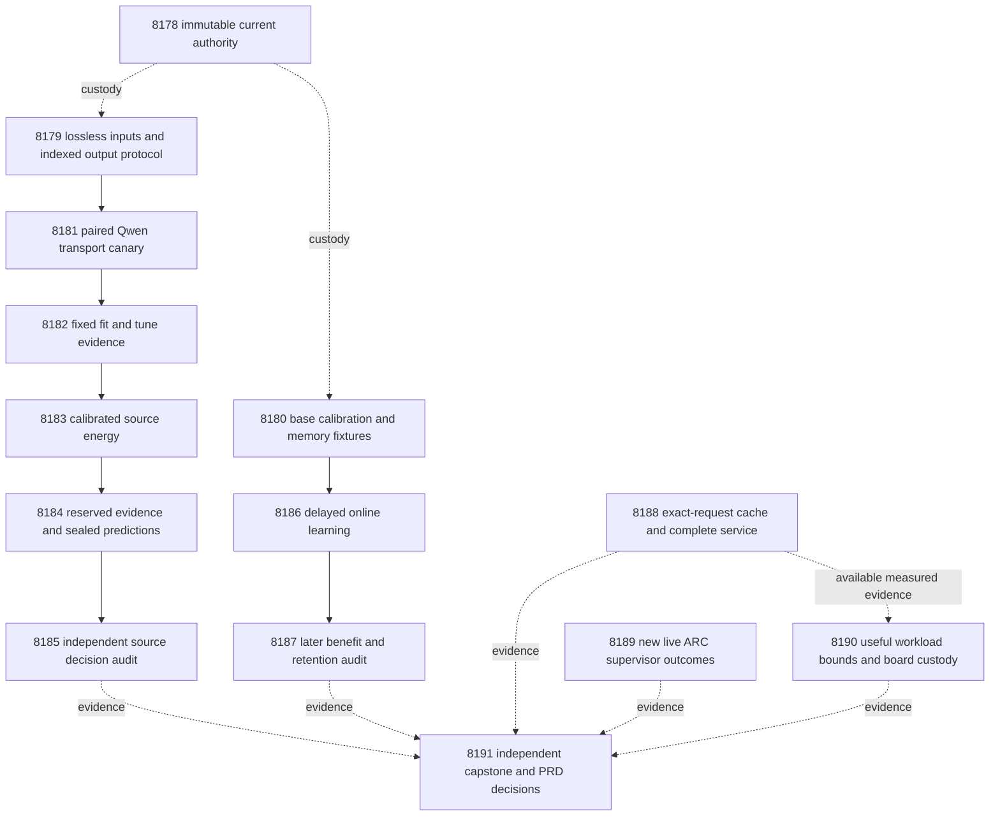

# Carnot Research Roadmap v707 — Bounded evidence and useful decision movement

**Created:** 2026-10-05. **Milestone:** 2026.10.707.
**Status:** Staged for review. Execution and activation remain pending.
**Supersedes:** scheduling for completed milestone 2026.10.706.
**Informed by:** research-program.md, PRD, architecture, terminal artifacts,
conductor history, previous proposals and the V707 literature scan.

The exact contract contains **14 tasks, Exp8178 through Exp8191**, in that order.
Four phases contain **3, 5, 3 and 3 tasks**. The final table, executable JSON and
canonical full-task digest match `research-roadmap-next.yaml`, including prompts.
The prior design is preserved at
`openspec/change-proposals/research-roadmap-v706-preserved-20261005.md`.
The active roadmap and conductor source remain unchanged.

## What v706 proved

V706 scheduled fourteen tasks. Eleven produced primary artifacts; three were
skipped by gates. The completed archive currently ends at V705, so V706 findings
come from its active task list, primary artifacts and conductor log.

| Experiments | Supported result | Consequence |
|---|---|---|
| 8164 | Current contract readiness1; terminal `complete_blocked_sha256` | Bind current authority separately from failed historical custody. |
| 8165 | Qualified release-aware methods and future-exposure fixture | Reuse delay and admission timing. |
| 8166 | Sentence protocol frozen; no semantic benefit measured | Preserve its hypothesis while changing failed transport. |
| 8167 | Zero complete sources of192;14 failed,131 censored,47 excluded | Qualify short indexed output with a live canary before scaling. |
| 8168–8170 | Gate-skipped; no scientific result | Do not describe local sentence evidence as disproven. |
| 8171–8172 | Learning trajectory and retention qualified; H2 null | Timing worked. Test whether saturated base confidence prevents useful changes. |
| 8173 | Service runner qualified; historical composition readiness0 | Use actual complete-request evidence; preserve unavailable composition. |
| 8174 | All48 measured requests completed across24 sources; equivalent behavior1 | Acquisition and queue costs dominate; another kernel comparison is insufficient. |
| 8175 | Qualified supervisor reader, zero new outcomes | Read only the next authenticated event delta. |
| 8176 | Board custody and measured workload bounds ready; historical composition blocked | Keep evidence scopes independent. |
| 8177 | Fourteen dispositions reconciled; capstone blocked on historical hashes | Current administrative completeness does not qualify prior evidence. |

The contract failures include changed repository-health logs and mutable
capability specifications. A new snapshot cannot repair old provenance. The
successor freezes current bytes before mutation and retains old failures.

Exp8172 used158 later sources,77/81 class support and11 blocks. Its available
typed-cost headroom was0.62658. Updates installed at slots138 and214. Across
installation intervals,6360 later probabilities changed, but no later typed
decision changed. Mean cost gain and its lower confidence bound were both0.
This ends another timing-only continuation. A learned base-logit scale is the
new premise; larger coefficients alone are not assumed to help.

Exp8174's Python/native speed ratio was1.07986, with95% interval
[0.69996,1.68278]. Complete-request NFR-01 did not pass. Exp8176 identified
acquisition/queue as the complete-service bottleneck and durable storage as the
host-batch bottleneck. These observations motivate exact-request reuse.

## Three largest gaps to the PRD

1. **FR-06/12: useful verification decisions.** Infrastructure can execute,
   but source-level decision benefit remains unproved. Make sentence evidence
   executable, then compare calibrated small heads with matched controls.
2. **FR-11: learning that changes later decisions beneficially.** Accepted
   updates changed probabilities without changing actions. Learn base calibration
   and local memory from released feedback. Separate shared calibration from
   the extra value of error-selected centers.
3. **FR-05/08 and NFR-01: complete-service deployment value.** Native arithmetic
   does not remove acquisition and storage costs. Measure exact-request reuse
   with cold misses, invalidation, forced refresh and recovery included.

An estimated compatibility energy is not semantic ground truth. All natural
source and stream data remain exposed development evidence. Within-run source
roles prevent a new leak; they do not erase previous exposure. Both independent
and generalized-learning scores remain0. Fresh independently labeled sources
and independent reproduction are required for broader claims.

## Research incorporated before design

The dated V707 entry in `research-references.md` was written before this design.
It records all eight primary topics and six secondary channels, including limits.

| Method | Experiment use | Boundary |
|---|---|---|
| [Grammar-constrained decoding](https://arxiv.org/abs/2502.05111) | 8179–8182 qualify bounded evidence records | Syntax does not prove semantics. |
| [Lost in Space](https://arxiv.org/abs/2502.14969) | 8181 compares matched output formats | Format can change predictions; no format selection on reserved labels. |
| [RT4CHART](https://arxiv.org/abs/2603.27752) | 8182–8185 test local evidence relations | Original human answer labels remain the target. |
| [Continual Calibration](https://arxiv.org/abs/2604.23987) | 8180/8186/8187 separate calibration-only effects and retention | No LLM fine-tuning or inherited exchangeability guarantee. |
| [KAC](https://arxiv.org/abs/2503.21076), [KAN forgetting](https://arxiv.org/abs/2511.12828) | Equal-capacity radial controls and retention | Local support alone does not prevent forgetting. |
| [Delayed optimization](https://arxiv.org/abs/2602.02634), [finite capacity](https://arxiv.org/abs/2606.11711) | Preserve issue/release/commit/admission order | No imported regret theorem. |
| [ARM–EBM](https://arxiv.org/abs/2512.15605), [EBT](https://arxiv.org/abs/2507.02092) | Small conditional energy with logistic equivalence | No generator training or energy-notation advantage. |
| [Ising co-design](https://arxiv.org/abs/2602.15985), [Extropic Z1T](https://extropic.ai/writing/z1t/) | 8190 includes communication and readout | Vendor projections are not local speed measurements. |

OpenReview searches found convergence and energy-conformal work; forum access
was challenged. Semantic Scholar citation APIs failed, so citation coverage is
incomplete. GitHub Trending responses were three weeks old. Author code and
llama.cpp grammar documentation were accessible. Kona provides vendor context,
but no reproducible new training recipe for this plan. Neural Ising dynamics,
encoded neural constraint solvers and energy-guided generation remain deferred
until extraction and useful decision signals justify them.

## Architecture



Solid scientific arrows represent structured readiness gates. Dotted arrows
carry evidence or custody; they do not create hidden all-branch prerequisites.
The capstone, service, ARC and hardware tasks have empty `gated_on` lists.
The hardware reader retains qualified branches when another is unavailable.

## Phase 1 — freeze and qualify methods, Exp8178–Exp8180

**8178** binds fourteen tasks through the existing authority parser. It copies
current authority and completed logs into immutable custody. It preserves V706's
historical hash mismatches separately from current scheduling readiness.

**8179** freezes the transport and scientific protocol. Full original source
and answer text remain in each prompt. Lossless partitions retain byte offsets.
Output contains answer-sentence index, E/C/B relation, unsupported probability
with two decimal digits and up to two source indices. Empty evidence is allowed.
Source indices are predicted evidence addresses, not semantic truth.

Each request covers at most eight complete answer sentences. Two requests per
source are allowed. Limits are6000 input and256 output tokens per request.
More than sixteen answer sentences or excessive input triggers escalation.
The tokenizer must demonstrate that the grammar's worst-case valid output fits
the budget. No source truncation, paraphrase or removed qualifier is permitted.
This differs from retired compact generated-span extraction: the original text
stays complete, and only output addresses are compact.

**8180** ingests calibration and delayed-learning methods and qualifies a new
small-head mechanism. The base score becomes trainable:

`score = a * logit(clip(p_Qwen, 1e-6, 1-1e-6)) + b + w·phi(x)`.

Bounds are `a∈[0,2]`, `b∈[-8,8]`, each `w∈[-4,4]`. The initial state is
`a=1,b=0,w=0`. The objective is mean binary log loss plus
`.01*sum(w*w)/2 + .01*(a-1)^2/2`. Deterministic bounded L-BFGS-B gets200
iterations and projected-gradient tolerance1e-6. Nonconverged candidates cannot
enter admission. Centers stay fixed during each convex fit.

Five arms are calibrated_error_center, calibrated_fixed_center,
calibrated_random_center, calibration_only and frozen_qwen_offset. Adaptive arms
receive the same fit budget. The three growing arms have16 initial and24 maximum
centers. Calibration_only keeps16 centers. It isolates a shared calibration gain
from the incremental value of choosing new local constraints.

Fixtures include learnable saturated scores, no signal, scalar-reference parity,
causal admission and hard-exit recovery. A learnable fixture must install by208
and change32 later typed decisions. Its success is circular_positive only.
Neither fixture success nor an optimizer stopping normally establishes natural
benefit. Natural fitting waits for qualification.

## Phase 2 — make sentence evidence measurable, Exp8181–Exp8185

**8181** runs24 label-blind fit sources through paired short-record prompts,
with and without grammar. A deterministic length-stratified selection is frozen
in8179. The budget is96 calls at most. Grammar readiness requires22 complete
sources, valid references on every accepted record and no increased structural
loss versus the paired arm. No semantic labels select the output syntax.

**8182** captures the original128 fit and64 tune sources. It reuses only matching
canary responses. Their clocks and cost remain historical. Main calls are capped
at384 minus reused calls;16 fixed source-removal/mismatch calls are descriptive.
Missing or partial source records escalate. Trainability still requires96 fit,
48 tune and12 targets per class in each role. Insufficient support is a valid
null. Thresholds cannot be reduced to make the branch run.

**8183** trains the small radial16 energy head with the same sixteen numerical
features registered in V706. It includes prior scalar_span, linear12 and radial16
controls, local_max, local-feature ablation and exact logistic representation.
The primary comparator is selected from V705 controls using original tune costs.
Heads, calibration, cost matrix, thresholds and comparator freeze before8184.

**8184** permits256 bounded calls on128 reserved slots. It seals all source
features and treatment/control decisions before evaluator labels are opened.
Capture readiness and sufficient evaluation support remain separate fields.

**8185** independently tests **H1**: local-evidence radial16 versus the frozen
strongest V705 control. Require96 complete paired sources and12/class. Primary
cost uses all128 intended slots, with missing evidence escalated. Require five
improved sources, zero extra false accepts, Brier increase≤.01 and a one-sided
97.5% bootstrap lower cost-gain bound>.02. Use10,000 source-level draws and at
least9500 valid draws. Complete-case and secondary-control comparisons cannot
replace this primary test. Exact logistic parity rules out a notation-only claim.

## Phase 3 — continuous learning and service value, Exp8186–Exp8188

**8186** runs the new calibrated memory mechanism on authenticated historical
features, independently of sentence capture. **8187** reconstructs its issued
predictions and audits later decisions, retained calibration and restart state.

Keep256 stream slots,64 retention slots and all original missing masks. The
feedback delay is20 slots; pending capacity is32. Commit at64/144 and expire
at144/224. Use newest64 released update-only rows and twelve strictly later,
one-use admission labels. Preserve modulo4 update/admission roles and20 seeds.
Admission interpolates `a,b,w` together under the original safety grid. It does
not fit on admission labels. Retention labels remain inaccessible until final
heads and retention predictions are sealed.

**H2:** calibrated_error_center versus calibrated_fixed_center. Require128 later
sources,8/class and8 nonoverlapping original-slot blocks. Average seeds within
source. Use moving blocks of16, sensitivity8/32,10,000 draws and9500 valid draws.
Require lower97.5% cost gain>.02, five improved sources, zero extra false accepts,
Brier increase≤.01 and cost no more than.02 above the other controls. Retention
requires48 sources,8/class, cost increase≤.02, Brier increase≤.01 and no extra
false accepts against the initial frozen head. Calibration-only improvement
cannot be called structural memory benefit. H1 and H2 each retain alpha=.025;
a blocked branch does not transfer its alpha.

**8188** changes the service question. It tests an explicit deterministic
exact-request response cache on24 fixed Exp8174 sources. Measure cold acquisition
and insertion, identical repeat, forced-refresh duplicate and changed-source miss.
This allows72 current bounded generations plus two warmups,128 tokens each.
Cache raw evidence separately from decisions: head changes recompute decisions;
source/model/prompt/tokenizer/grammar/seed/runtime changes invalidate acquisition.

Time complete arrival-to-response cost, including queue, key hashing, generation,
parsing, native crossing, arithmetic, durable storage and acknowledgement.
Charge priming once. Check output/decision parity against forced refresh and
hard-restart recovery. Output divergence forbids an exact-equivalence speed claim.
Report amortized estimates at hypothetical repeat fractions0,.25,.5,.9; these
are scenarios, not observed deployment traffic. NFR-01 requires a measured
complete-boundary lower95 speed ratio≥10 with equivalent behavior. No new
hardware speed claim follows from cache hits.

## Phase 4 — continuity and independent decisions, Exp8189–Exp8191

**8189** reads only new authenticated live ARC supervisor outcomes after Exp8175's
frontier. No new events means a cheap terminal null and no policy change. Thirty
resolved outcomes across five games are necessary before a recommendation;
matched within-game and held-game evidence remain necessary for transfer.
No new game runs, per-game reverse engineering or solve credit are scheduled.
Imported solve evidence keeps its provenance and registry precheck.

**8190** reduces available cold/hit/invalidation costs and preserves three separate
board obligations. It does not repeat the unavailable historical composition.
That evidence stays unqualified. For each new branch, calculate Amdahl's bound
`1/(1-f)` from removable arithmetic, with transfer, readout, acquisition and
storage retained. Mixed timers give only optimistic bounds. A100x whole-workload
claim needs `f≥.99` even with infinite kernel speed.

**8191** always runs. It independently reduces fourteen dispositions, H1, H2,
calibration-only effects, service costs and board evidence. It preserves the
September28 oracle-distinct corrigendum and stable publication gate G1–G4.
External unchanged blocks use terminal `blocked`, never retryable `partial`.
Administrative readiness cannot become scientific success.

## Structured dependency graph

Every gate uses `op: '=='`, `value: 1`. All other tasks have empty gates.
Each field below appears verbatim in its producer's REQUIRED ARTIFACT FIELDS.

| Consumer | Producer field |
|---|---|
| exp8181-sentence-transport-canary | exp8179-sentence-transport-methods.sentence_protocol_ready_score |
| exp8182-fit-sentence-capture | exp8181-sentence-transport-canary.transport_canary_ready_score |
| exp8183-sentence-energy-fit | exp8182-fit-sentence-capture.fit_trainable_score |
| exp8184-reserved-sentence-capture | exp8183-sentence-energy-fit.energy_fit_ready_score |
| exp8185-sentence-decision-audit | exp8184-reserved-sentence-capture.evaluation_capture_ready_score |
| exp8186-calibrated-online-memory | exp8180-calibrated-memory-methods.calibrated_memory_ready_score |
| exp8186-calibrated-online-memory | exp8180-calibrated-memory-methods.stream_input_ready_score |
| exp8187-learning-benefit-audit | exp8186-calibrated-online-memory.learning_trajectory_ready_score |

No `requires` chain points to a retired task. Historical artifacts are immutable
inputs, not claims that retired tasks will execute again. A failed source gate
cannot remove the independent learning, service, ARC or capstone tasks.

## Hardware and execution requirements

| Resource | Use | Requirement and claim boundary |
|---|---|---|
| Two RTX3090 GPUs,24GB each | 8181/8182/8184/8188 bounded Qwen calls | Resolve the actual cache, own a CUDA lease and verify offload. GPU tasks execute sequentially. |
| CPU, RAM and durable local storage | Small heads, events, evidence cache and audit | Check actual capacity; keep raw responses, immutable logs and recoverable pending state. |
| Loaded Rust/PyO3 extension | Complete request service | Measure actual binding calls, parity, durable acknowledgement and recovery. |
| KV260 | Preserved fabric evidence | Keep `k_max≤5`; useful future workload and authenticated board timings are required. |
| PolarFire | Separate CPU-only dispatch evidence | Linux CPU execution is not FPGA fabric acceleration. |
| GateMate | Separate `0xffffffff` JTAG blocker | Reopen only after a dated physical or JTAG change. |
| AMD APU/NPU, Extropic TSU | Deferred hardware paths | Require supported operators and authenticated access; no purchase or availability assumption. |

The wishlist contains historical inventory conflicts. Authenticated receipts
control operational claims. No new purchase, board setup or flashing is planned.
FR-11's CPU head uses at most24 radial centers; SIMD/batched native evaluation
and bounded state storage provide its deployment path. Hardware feasibility is
measured in the service boundary, not inferred from an isolated operation count.
If arithmetic cannot support100x whole-service improvement, report the failed
premise and target acquisition/storage before further fabric work.

Every LLM task declares `MODEL_SPECS: [unsloth/Qwen3.8-27B-GGUF]` and
`model_bounded_generation`, with the10-second duration floor. Their fixed output
budgets make full-generation classification incorrect. No full-generation or
load-only task is scheduled. Those classes would require60-second and2-second
floors respectively. CPU fitting and reductions use `no_model_load`, empty
current MODEL_SPECS and explicit historical model provenance. Legacy small
models remain CPU smoke tests only. Generator weights stay frozen.

All prompts contain a numbered requirement for flushed phase and call progress.
Long loops and child waits report real progress every60 seconds. Gaps must remain
below600 seconds. Tool polls last at most60 seconds. Files above about200 lines
are written in several calls, with progress messages between writes. Stop new
model calls at3000 seconds; retain checkpoints and finish within4800 seconds.
Neither floors nor timeouts authorize duration padding.

Schema/custody work uses Opus100. Formulaic capture and cache plumbing use Codex
`gpt-6.1-sol`. Routine scientific work keeps the default backend. ARC observation
uses20 turns; software hardware bounds use30. No Luna or Gemini task is scheduled.
Backend routing does not change the mandated local model used as research data.

## Scope, retirement and validation

Every task contains all four prior-failure fields, including true same-verdict
retirement. Exact prior verdicts are read from primary artifacts. Qualified
nulls may appear as lineage; they are not relabeled as validation failures.
Skipped V706 tasks have no invented primary verdict. The new sentence encoding
preserves full text. The changed learning mechanism learns base calibration;
it does not reopen unchanged importance anchoring or four-expert reweighting.
External generated-text reward ranking against self-consistency remains retired.
No retired ID or fabricated operator override is used.

Implementation starts from REQ-* and SCENARIO-*, then failing tests. Required
validation includes scoped unit tests,100% changed-code coverage, Ruff check and
format, strict mypy, explicit-path spec coverage and relevant private E2E routes.
Static tools receive file paths; only pytest receives node selectors. Source work
uses E2E-010/015/019. Learning uses E2E-016. Native service uses E2E-003/004.
Supervisor reading uses E2E-017. Authority and capstone use E2E-018.

Every required check must exit normally. Unrelated repository health stays a
separate observation. Current completed logs are copied into immutable custody;
no command writes into a sealed historical log. Publish only through the existing
primary publisher after unmodified adversarial verification and strict row lint.
Oracle fixtures are circular_positive; owned validation failures are disqualified.
Missing unchanged external inputs are blocked. Only unfinished owned work retries.

Planning checks cover schema, scope/failure history, exclusions, ARC floor,
priority, full contract agreement, gate names, paths, prompt requirements and
private negative mutations. Record actual outcomes in `ops/test-results.md`.
No experiment, activation, push, generator training or external publication occurs
in this planning change.

## Exact task contract

Exactly **14 tasks, Exp8178 through Exp8191**, in conductor order.

| Order | ID | Title | Phase | Deliverable |
|---|---|---|---|---|
| 1 | `exp8178-contract-custody` | Bind fourteen tasks with immutable evidence and separate historical failures | 1 | `results/experiment_8178_v707_contract_custody.json` |
| 2 | `exp8179-sentence-transport-methods` | Freeze bounded evidence records that preserve every input sentence | 1 | `results/experiment_8179_v707_sentence_transport_methods.json` |
| 3 | `exp8180-calibrated-memory-methods` | Qualify learned base calibration before testing new energy centers | 1 | `results/experiment_8180_v707_calibrated_memory_methods.json` |
| 4 | `exp8181-sentence-transport-canary` | Test bounded Qwen evidence transport before scaling capture | 2 | `results/experiment_8181_v707_sentence_transport_canary.json` |
| 5 | `exp8182-fit-sentence-capture` | Collect qualified sentence evidence on fixed fit and tune sources | 2 | `results/experiment_8182_v707_fit_sentence_capture.json` |
| 6 | `exp8183-sentence-energy-fit` | Train calibrated energy decisions with matched source controls | 2 | `results/experiment_8183_v707_sentence_energy_fit.json` |
| 7 | `exp8184-reserved-sentence-capture` | Seal reserved source predictions from frozen evidence heads | 2 | `results/experiment_8184_v707_reserved_sentence_capture.json` |
| 8 | `exp8185-sentence-decision-audit` | Independently test sentence evidence against the frozen comparator | 2 | `results/experiment_8185_v707_sentence_decision_audit.json` |
| 9 | `exp8186-calibrated-online-memory` | Learn energy centers and base calibration from delayed feedback | 3 | `results/experiment_8186_v707_calibrated_online_memory.json` |
| 10 | `exp8187-learning-benefit-audit` | Audit later decision movement calibration retention and restart integrity | 3 | `results/experiment_8187_v707_learning_benefit_audit.json` |
| 11 | `exp8188-exact-request-service` | Measure exact-request reuse including cold acquisition invalidation and recovery | 3 | `results/experiment_8188_v707_exact_request_service.json` |
| 12 | `exp8189-arc-supervisor-frontier` | Inspect new live supervisor outcomes for transferable arm selection | 4 | `results/experiment_8189_v707_arc_supervisor_frontier.json` |
| 13 | `exp8190-hardware-service-boundary` | Bound the measured reuse workload and preserve each board obligation | 4 | `results/experiment_8190_v707_hardware_service_boundary.json` |
| 14 | `exp8191-capstone` | Decide fourteen outcomes and the verification learning and deployment gaps | 4 | `results/experiment_8191_v707_capstone.json` |

Canonical full-task SHA256: `706b4ee1fb42c0ef0a6e3b068d1c25647337b04cac76d71b878d0309a4d4037c`

<!-- V707_TASK_CONTRACT_START -->
```json
{"milestone":"2026.10.707","tasks":[
{"MODEL_SPECS": [], "deliverable": "results/experiment_8178_v707_contract_custody.json", "estimated_wall_time_min": 25, "gated_on": [], "id": "exp8178-contract-custody", "inference_substrate_class": "no_model_load", "max_turns": 100, "milestone": "2026.10.707", "model": "opus", "per_unit_rows": true, "phase": 1, "prior_failures": [{"addressed_by": "Snapshot current authority and completed logs before mutable specs change; report prior hash mismatches separately without repairing or qualifying their historical evidence.", "experiment_id": "exp8164-contract-custody", "retire_if_same_verdict": true, "verdict": "complete_blocked_sha256"}], "priority": "high", "prompt": "CONTEXT:\nWork in {project_root} on {date}. V706 scheduled fourteen tasks, produced eleven primaries and three gate skips. Its contract shape passed, but historical log and specification hashes changed. The original blocked verdict must remain visible.\nEXISTING CODE TO READ FIRST:\nCLAUDE.md; CODEX.md; ops/e2e-test-plan.md; openspec/capabilities/research-reporting/spec.md; openspec/capabilities/verification/spec.md; scripts/experiment_template.py; python/carnot/reporting/primary_publication.py; ops/exclusion_manifest.yaml; openspec/change-proposals/research-roadmap-vNEXT.md; python/carnot/reporting/v685_authority_lifecycle.py; python/carnot/reporting/roadmap_contract.py; results/experiment_8164_v706_contract_custody.json; results/experiment_8177_v706_capstone.json; research-roadmap.yaml; ops/conductor-log.md; openspec/change-proposals/research-roadmap-v706-preserved-20261005.md\nTASK:\nBind fourteen tasks with immutable evidence and separate historical failures. Deliver results/experiment_8178_v707_contract_custody.json, primitive evidence under results/raw/experiment_8178_v707_contract_custody/, and runnable scripts/experiments/experiment_8178_v707_contract_custody.py.\nCONCRETE STEPS:\n1. Emit a flushed progress line at each phase boundary and before and after every model load, generation, benchmark and subprocess. Use PYTHONUNBUFFERED=1 and print(..., flush=True). Inside long loops and child waits, emit actual completed/pending counts at least every 60 seconds. Keep every silence gap below 600 seconds. Poll with tool calls of at most 60 seconds. Write any file over about 200 lines in several tool calls of at most about 150 lines. Send a progress message between writes. Never pad duration or invent activity.\n2. Check actual input paths, hashes, runtime and gate operands first. Read artifacts with scripts/summarize_artifact.py, then inspect primitives. Preserve historical primaries and failed receipts. Missing, retired or gate-blocked external evidence yields complete_blocked_<check> and verdict_class=blocked. gate_check_summary names the check and actual value. Only unfinished owned work may use partial.\n3. Extend relevant REQ-* and SCENARIO-* before implementation. Write failing tests first. Reuse qualified modules through a thin CLI. Keep fixtures outside results/ in private temporary directories. Preserve original assertions. Verify direct script execution outside the checkout without PYTHONPATH. Read historical methods from immutable versioned bytes, never mutable vNEXT headings.\n4. Load no LLM. Set MODEL_SPECS=[] and inference_substrate_class=no_model_load. Use aggregation_from_upstream_artifacts for reductions or verifier_ensemble_against_cached_candidates for CPU heads. Separate imported model provenance from zero current calls. Declare small trained heads in trained_head_specs.\n5. Bind exactly 14 tasks Exp8178 through Exp8191. Check visible table, full JSON and canonical full-task digest through the existing authority reader. Use activated authority when staged YAML has moved. Never activate this plan or edit the active roadmap.\n6. Freeze current design and task bytes in content-addressed custody before any later spec changes. Distinguish current contract_ready_score from historical_evidence_ready_score. Do not make historical failure an implicit prerequisite for independent branches.\n7. Preserve all fourteen V706 dispositions using exact deliverable paths from its task authority. Exp8168, Exp8169 and Exp8170 were gate-skipped. Do not invent scientific verdicts for absent primaries. Compare original expected hashes with current bytes and any authentic saved snapshots; a new snapshot cannot repair old provenance.\n8. Use immutable copies of completed validation logs for current work. Never rerun health checks into historical paths. Record mutable original path, observed version and captured version separately. An unresolved V706 mismatch remains blocked historical evidence without invalidating a correctly bound new contract.\n9. Freeze the scope ledger, literature mapping and validation manifest. Run private E2E-018 staged, activated, staged-absent, prompt-tamper and post-snapshot-spec-change cases. A changed historical hash must remain detected.\n10. Freeze owned validation argv before measurement. Give pytest node selectors only to pytest; give static tools actual file paths. Run scoped pytest, 100% changed-code statement coverage, Ruff check/format, strict mypy and explicit-path spec coverage. Run applicable private E2E success, missing-input, tamper and cold-replay cases. Record argv, expected/actual exit, duration and log hash. Every required check must exit normally. Report unrelated repository health separately. Copy completed logs into immutable custody; never rerun a command into a sealed log. Rust changes also require scoped cargo test/fmt/clippy, loaded-binding parity and E2E-003/004.\n11. Save primitive rows and source/code/config hashes. Recompute headlines independently. Run unmodified adversarial_verify.py and strict verdict_row_consistency_lint.py with progress during waits. Publish through primary_publication only after owned checks pass. Owned validation failure disqualifies and zeros readiness. Reconcile openspec/, _bmad/traceability.md, ops/status.md and ops/changelog.md. Preserve operator-curated pages. No external publication.\nREQUIRED ARTIFACT FIELDS:\n- honest_verdict: complete_*; verdict_class: positive | circular_positive | null | blocked | disqualified | partial. Principle: only unfinished owned work retries.\n- verifier_is_oracle, claim_scope, exposure_scope, independent_generalization_score: 0, generalized_learning_benefit_score: 0. Principle: fixtures and exposed development cannot establish independent benefit.\n- required_checks_passed, flagged_adversarial, validation_receipts, terminal_validation_sidecar_path, preconditions_checked. Principle: readiness requires normal owned validation.\n- gate_check_summary: check/upstream/path/hash/artifact_field/op/expected/observed/passed. Principle: a blocked result names its failed operand.\n- inference_substrate, inference_substrate_class, MODEL_SPECS, trained_head_specs, model_invocation_counts, call_ledger, cited_upstream_artifacts: experiment_id/fields_imported/sha256. Principle: current execution differs from imported provenance.\n- rows: unit_id/source_cluster_id/arm/condition/metric/numerator/denominator/status/exclusion_reason. Principle: comparisons can be independently reduced per unit.\n- intended_count, eligible_count, independent_count, completed_count, excluded_count, censored_count, failed_count, sample_size_budget. Principle: repeats and sentences do not create independent sources.\n- run_date, duration_s, random_seed, reproducibility_checksum, source_artifact_hashes, raw_shard_hashes, code_config_hashes, phase_spans, acceptance_gates, field_principles. Principle: claims bind to actual work and frozen thresholds.\n- contract_ready_score: 0|1, historical_evidence_ready_score: 0|1, canonical_tasks_sha256, task_dispositions, immutable_authority_paths, historical_hash_failures, prior_scope_ledger, literature_mapping. Principle: new scheduling readiness cannot launder old evidence.\nRun command: cd {project_root} && PYTHONUNBUFFERED=1 JAX_PLATFORMS=cpu .venv/bin/python -u scripts/experiments/experiment_8178_v707_contract_custody.py --date {date}\nDo NOT push. Do NOT modify scripts/research_conductor.py.", "requires_gpu": false, "title": "Bind fourteen tasks with immutable evidence and separate historical failures", "track": "infra"},
{"MODEL_SPECS": [], "deliverable": "results/experiment_8179_v707_sentence_transport_methods.json", "estimated_wall_time_min": 35, "gated_on": [], "id": "exp8179-sentence-transport-methods", "inference_substrate_class": "no_model_load", "max_turns": 100, "milestone": "2026.10.707", "model": "opus", "per_unit_rows": true, "phase": 1, "prior_failures": [{"addressed_by": "Replace verbose generated quotes with grammar-bound source indices and a fixed canary; preserve complete text and the original decision hypothesis.", "experiment_id": "exp8167-fit-sentence-capture", "retire_if_same_verdict": true, "verdict": "complete_null_fit_sentence_capture"}], "priority": "high", "prompt": "CONTEXT:\nWork in {project_root} on {date}. Exp8167 produced zero complete sources from 192 intended slots. Records hit the 256-token limit or failed parsing. Copying quotes and verbose fields exhausted transport before semantic evaluation.\nEXISTING CODE TO READ FIRST:\nCLAUDE.md; CODEX.md; ops/e2e-test-plan.md; openspec/capabilities/research-reporting/spec.md; openspec/capabilities/verification/spec.md; scripts/experiment_template.py; python/carnot/reporting/primary_publication.py; ops/exclusion_manifest.yaml; openspec/change-proposals/research-roadmap-vNEXT.md; python/carnot/verify/sentence_methods_8166.py; python/carnot/verify/sentence_evidence_8166.py; python/carnot/verify/fit_sentence_capture_8167.py; results/experiment_8166_v706_sentence_evidence_methods.json; results/experiment_8167_v706_fit_sentence_capture.json; python/carnot/verify/evidence_energy_fit_8154.py; research-references.md\nTASK:\nFreeze bounded evidence records that preserve every input sentence. Deliver results/experiment_8179_v707_sentence_transport_methods.json, primitive evidence under results/raw/experiment_8179_v707_sentence_transport_methods/, and runnable scripts/experiments/experiment_8179_v707_sentence_transport_methods.py.\nCONCRETE STEPS:\n1. Emit a flushed progress line at each phase boundary and before and after every model load, generation, benchmark and subprocess. Use PYTHONUNBUFFERED=1 and print(..., flush=True). Inside long loops and child waits, emit actual completed/pending counts at least every 60 seconds. Keep every silence gap below 600 seconds. Poll with tool calls of at most 60 seconds. Write any file over about 200 lines in several tool calls of at most about 150 lines. Send a progress message between writes. Never pad duration or invent activity.\n2. Check actual input paths, hashes, runtime and gate operands first. Read artifacts with scripts/summarize_artifact.py, then inspect primitives. Preserve historical primaries and failed receipts. Missing, retired or gate-blocked external evidence yields complete_blocked_<check> and verdict_class=blocked. gate_check_summary names the check and actual value. Only unfinished owned work may use partial.\n3. Extend relevant REQ-* and SCENARIO-* before implementation. Write failing tests first. Reuse qualified modules through a thin CLI. Keep fixtures outside results/ in private temporary directories. Preserve original assertions. Verify direct script execution outside the checkout without PYTHONPATH. Read historical methods from immutable versioned bytes, never mutable vNEXT headings.\n4. Load no LLM. Set MODEL_SPECS=[] and inference_substrate_class=no_model_load. Use aggregation_from_upstream_artifacts for reductions or verifier_ensemble_against_cached_candidates for CPU heads. Separate imported model provenance from zero current calls. Declare small trained heads in trained_head_specs.\n5. Read the V707 reference entry and ingest the grammar papers plus RT4CHART into a method-to-task note. Freeze openspec/change-proposals/v707-sentence-transport-protocol.json. Preserve original 128 fit, 64 tune and 128 reserved source roles and all historical exposure.\n6. Partition complete original source and answer text losslessly with byte offsets. Give source segments stable integer indices. Each output item contains answer-sentence index, relation E/C/B, unsupported probability with two decimal digits, and up to two source indices or an empty list. This encodes evidence addresses; it never generates replacement answer spans or drops qualifiers.\n7. Freeze an exact per-request grammar: one record for each of at most eight complete answer sentences, in input order. Maximum two requests per source, 6000 input tokens and 256 output tokens per request. Full source and full answer stay in each prompt. More than16 sentences or an oversized input is an explicit escalation, never truncation. Enumerate worst-case output encodings with the actual tokenizer before capture; grammar-bounded length must fit256.\n8. Compare the identical short-record prompt with and without grammar on24 label-blind fit sources, selected deterministically across answer-length bins. Freeze IDs and arm order now. Require22/24 complete grammar sources, valid references on every accepted record, and no increase in structural loss versus the unconstrained arm. This is transport qualification only.\n9. Preserve the V706 sixteen numerical features and typed-cost matrix. Source indices replace copied quote transport; they do not create semantic gold. Freeze H1 as local-evidence radial16 versus the V705 control chosen by original tune costs. Keep96 reserved paired sources and12/class, cost-gain lower97.5>.02, five improved sources, zero extra false accepts, Brier increase<=.01. Missing records escalate in all-slot analysis. Keep10,000 source bootstrap draws and at least9500 valid draws.\n10. Run private E2E-010/015/019 cases for Unicode, repeated sentences, invalid indices, truncation, partial groups and source tamper. Count preflight eligibility by role without opening reserved labels. If the registered support is unreachable, record that fact and do not relax the gate after capture.\n11. Freeze owned validation argv before measurement. Give pytest node selectors only to pytest; give static tools actual file paths. Run scoped pytest, 100% changed-code statement coverage, Ruff check/format, strict mypy and explicit-path spec coverage. Run applicable private E2E success, missing-input, tamper and cold-replay cases. Record argv, expected/actual exit, duration and log hash. Every required check must exit normally. Report unrelated repository health separately. Copy completed logs into immutable custody; never rerun a command into a sealed log. Rust changes also require scoped cargo test/fmt/clippy, loaded-binding parity and E2E-003/004.\n12. Save primitive rows and source/code/config hashes. Recompute headlines independently. Run unmodified adversarial_verify.py and strict verdict_row_consistency_lint.py with progress during waits. Publish through primary_publication only after owned checks pass. Owned validation failure disqualifies and zeros readiness. Reconcile openspec/, _bmad/traceability.md, ops/status.md and ops/changelog.md. Preserve operator-curated pages. No external publication.\nREQUIRED ARTIFACT FIELDS:\n- honest_verdict: complete_*; verdict_class: positive | circular_positive | null | blocked | disqualified | partial. Principle: only unfinished owned work retries.\n- verifier_is_oracle, claim_scope, exposure_scope, independent_generalization_score: 0, generalized_learning_benefit_score: 0. Principle: fixtures and exposed development cannot establish independent benefit.\n- required_checks_passed, flagged_adversarial, validation_receipts, terminal_validation_sidecar_path, preconditions_checked. Principle: readiness requires normal owned validation.\n- gate_check_summary: check/upstream/path/hash/artifact_field/op/expected/observed/passed. Principle: a blocked result names its failed operand.\n- inference_substrate, inference_substrate_class, MODEL_SPECS, trained_head_specs, model_invocation_counts, call_ledger, cited_upstream_artifacts: experiment_id/fields_imported/sha256. Principle: current execution differs from imported provenance.\n- rows: unit_id/source_cluster_id/arm/condition/metric/numerator/denominator/status/exclusion_reason. Principle: comparisons can be independently reduced per unit.\n- intended_count, eligible_count, independent_count, completed_count, excluded_count, censored_count, failed_count, sample_size_budget. Principle: repeats and sentences do not create independent sources.\n- run_date, duration_s, random_seed, reproducibility_checksum, source_artifact_hashes, raw_shard_hashes, code_config_hashes, phase_spans, acceptance_gates, field_principles. Principle: claims bind to actual work and frozen thresholds.\n- sentence_protocol_ready_score: 0|1, protocol_path, protocol_sha256, canary_source_ids, tokenizer_receipt, maximum_encoded_output_tokens, source_partition_rows, eligibility_by_role, H1. Principle: parseability and statistical support precede semantic claims.\nRun command: cd {project_root} && PYTHONUNBUFFERED=1 JAX_PLATFORMS=cpu .venv/bin/python -u scripts/experiments/experiment_8179_v707_sentence_transport_methods.py --date {date}\nDo NOT push. Do NOT modify scripts/research_conductor.py.", "requires_gpu": false, "title": "Freeze bounded evidence records that preserve every input sentence", "track": "infra"},
{"MODEL_SPECS": [], "deliverable": "results/experiment_8180_v707_calibrated_memory_methods.json", "estimated_wall_time_min": 45, "gated_on": [], "id": "exp8180-calibrated-memory-methods", "inference_substrate_class": "no_model_load", "max_turns": 50, "milestone": "2026.10.707", "per_unit_rows": true, "phase": 1, "prior_failures": [{"addressed_by": "Keep the successful admission schedule; replace the immutable saturated base offset and four-step residual fit with a bounded learned logit scale and converged convex candidate fit.", "experiment_id": "exp8172-learning-benefit-audit", "retire_if_same_verdict": true, "verdict": "complete_null_no_later_typed_cost_benefit"}], "priority": "high", "prompt": "CONTEXT:\nWork in {project_root} on {date}. Exp8172 installed updates at slots138 and214. It found6360 changed later probabilities but zero changed decisions and mean typed-cost gain0 on158 sources. Timing alone no longer explains the null.\nEXISTING CODE TO READ FIRST:\nCLAUDE.md; CODEX.md; ops/e2e-test-plan.md; openspec/capabilities/research-reporting/spec.md; openspec/capabilities/verification/spec.md; scripts/experiment_template.py; python/carnot/reporting/primary_publication.py; ops/exclusion_manifest.yaml; openspec/change-proposals/research-roadmap-vNEXT.md; python/carnot/verify/released_feedback_learning_8171.py; python/carnot/verify/learning_benefit_audit_8172.py; python/carnot/verify/learning_qualification_8165.py; results/experiment_8172_v706_learning_benefit_audit.json; results/experiment_8165_v706_learning_qualification.json; openspec/change-proposals/v705-admission-horizon-protocol.json; research-references.md\nTASK:\nQualify learned base calibration before testing new energy centers. Deliver results/experiment_8180_v707_calibrated_memory_methods.json, primitive evidence under results/raw/experiment_8180_v707_calibrated_memory_methods/, and runnable scripts/experiments/experiment_8180_v707_calibrated_memory_methods.py.\nCONCRETE STEPS:\n1. Emit a flushed progress line at each phase boundary and before and after every model load, generation, benchmark and subprocess. Use PYTHONUNBUFFERED=1 and print(..., flush=True). Inside long loops and child waits, emit actual completed/pending counts at least every 60 seconds. Keep every silence gap below 600 seconds. Poll with tool calls of at most 60 seconds. Write any file over about 200 lines in several tool calls of at most about 150 lines. Send a progress message between writes. Never pad duration or invent activity.\n2. Check actual input paths, hashes, runtime and gate operands first. Read artifacts with scripts/summarize_artifact.py, then inspect primitives. Preserve historical primaries and failed receipts. Missing, retired or gate-blocked external evidence yields complete_blocked_<check> and verdict_class=blocked. gate_check_summary names the check and actual value. Only unfinished owned work may use partial.\n3. Extend relevant REQ-* and SCENARIO-* before implementation. Write failing tests first. Reuse qualified modules through a thin CLI. Keep fixtures outside results/ in private temporary directories. Preserve original assertions. Verify direct script execution outside the checkout without PYTHONPATH. Read historical methods from immutable versioned bytes, never mutable vNEXT headings.\n4. Load no LLM. Set MODEL_SPECS=[] and inference_substrate_class=no_model_load. Use aggregation_from_upstream_artifacts for reductions or verifier_ensemble_against_cached_candidates for CPU heads. Separate imported model provenance from zero current calls. Declare small trained heads in trained_head_specs.\n5. Ingest continual-calibration, delayed-feedback and KAC methods. Write a focused method map and mark ingested leads in research-studying.md. Freeze openspec/change-proposals/v707-calibrated-memory-protocol.json before natural fitting. This is small-head training only.\n6. Reconstruct V706 base-logit margins, residual magnitudes and decision thresholds from its rows. Separate clipping saturation, incomplete optimization and missing representational signal. Publish the measured diagnosis. Preserve the old numerical protocol and its null result.\n7. Use score s=a*logit(clip(p_Qwen,1e-6,1-1e-6))+b+w dot phi(x). Fix a in[0,2], b in[-8,8], each w in[-4,4]. Start a=1,b=0,w=0. Fit mean binary log loss plus .01*sum(w*w)/2 plus .01*(a-1)^2/2 on newest64 released update-only rows. Use deterministic bounded L-BFGS-B, max200 iterations and projected-gradient tolerance1e-6. Record objective and convergence. Nonconverged candidates cannot enter admission.\n8. Freeze five arms: calibrated_error_center, calibrated_fixed_center, calibrated_random_center, calibration_only with16 fixed centers, and frozen_qwen_offset. All adaptive arms fit a,b,w under the same sample and optimizer budget. Growing arms start16 and add4 at opportunities64/144, maximum24. H2 compares calibrated_error_center against calibrated_fixed_center; other arms are controls. Center rules, widths, duplicates and20 seeds remain the qualified V705 rules.\n9. Preserve256 stream slots,64 retention slots, feedback delay20, pending capacity32, opportunity/expiry pairs64/144 and144/224, role hash modulo4, twelve strictly later one-use admission labels, original missing masks and admission safety grid. Admission interpolates a,b,w together from the incumbent; it cannot refit on admission labels. There is no dependence on new sentence capture.\n10. Implement scalar-reference, saturated-logit learnable, no-signal, overflow and hard-restart fixtures. Require convex objective agreement within1e-8 and projected-gradient<=1e-6 for admitted fixtures. On the learnable fixture require installation by208 and32 later changed typed decisions. No-signal fixtures must not claim benefit. Fixture success is circular_positive only.\n11. Keep H2 support128 later sources,8/class,8 original-slot blocks and48 retention sources with8/class. Keep block16, sensitivity8/32, seed means within source,10,000 draws,9500 valid, lower97.5 cost gain>.02, five improved sources, no extra false accepts and Brier increase<=.01. Require retention cost increase<=.02 and Brier<=.01. H1/H2 retain separate alpha=.025. Run E2E-016 private event/replay paths.\n12. Freeze owned validation argv before measurement. Give pytest node selectors only to pytest; give static tools actual file paths. Run scoped pytest, 100% changed-code statement coverage, Ruff check/format, strict mypy and explicit-path spec coverage. Run applicable private E2E success, missing-input, tamper and cold-replay cases. Record argv, expected/actual exit, duration and log hash. Every required check must exit normally. Report unrelated repository health separately. Copy completed logs into immutable custody; never rerun a command into a sealed log. Rust changes also require scoped cargo test/fmt/clippy, loaded-binding parity and E2E-003/004.\n13. Save primitive rows and source/code/config hashes. Recompute headlines independently. Run unmodified adversarial_verify.py and strict verdict_row_consistency_lint.py with progress during waits. Publish through primary_publication only after owned checks pass. Owned validation failure disqualifies and zeros readiness. Reconcile openspec/, _bmad/traceability.md, ops/status.md and ops/changelog.md. Preserve operator-curated pages. No external publication.\nREQUIRED ARTIFACT FIELDS:\n- honest_verdict: complete_*; verdict_class: positive | circular_positive | null | blocked | disqualified | partial. Principle: only unfinished owned work retries.\n- verifier_is_oracle, claim_scope, exposure_scope, independent_generalization_score: 0, generalized_learning_benefit_score: 0. Principle: fixtures and exposed development cannot establish independent benefit.\n- required_checks_passed, flagged_adversarial, validation_receipts, terminal_validation_sidecar_path, preconditions_checked. Principle: readiness requires normal owned validation.\n- gate_check_summary: check/upstream/path/hash/artifact_field/op/expected/observed/passed. Principle: a blocked result names its failed operand.\n- inference_substrate, inference_substrate_class, MODEL_SPECS, trained_head_specs, model_invocation_counts, call_ledger, cited_upstream_artifacts: experiment_id/fields_imported/sha256. Principle: current execution differs from imported provenance.\n- rows: unit_id/source_cluster_id/arm/condition/metric/numerator/denominator/status/exclusion_reason. Principle: comparisons can be independently reduced per unit.\n- intended_count, eligible_count, independent_count, completed_count, excluded_count, censored_count, failed_count, sample_size_budget. Principle: repeats and sentences do not create independent sources.\n- run_date, duration_s, random_seed, reproducibility_checksum, source_artifact_hashes, raw_shard_hashes, code_config_hashes, phase_spans, acceptance_gates, field_principles. Principle: claims bind to actual work and frozen thresholds.\n- calibrated_memory_ready_score: 0|1, stream_input_ready_score: 0|1, protocol_path, protocol_sha256, saturation_rows, optimizer_fixture_rows, future_decision_fixture_score, method_map, H2. Principle: a new calibration mechanism must move fixture decisions before natural learning.\nRun command: cd {project_root} && PYTHONUNBUFFERED=1 JAX_PLATFORMS=cpu .venv/bin/python -u scripts/experiments/experiment_8180_v707_calibrated_memory_methods.py --date {date}\nDo NOT push. Do NOT modify scripts/research_conductor.py.", "requires_gpu": false, "title": "Qualify learned base calibration before testing new energy centers", "track": "science"},
{"MODEL_SPECS": ["unsloth/Qwen3.8-27B-GGUF"], "agent_type": "codex", "deliverable": "results/experiment_8181_v707_sentence_transport_canary.json", "estimated_wall_time_min": 40, "gated_on": [{"artifact_field": "sentence_protocol_ready_score", "op": "==", "upstream": "exp8179-sentence-transport-methods", "value": 1}], "id": "exp8181-sentence-transport-canary", "inference_substrate_class": "model_bounded_generation", "max_turns": 50, "milestone": "2026.10.707", "model": "gpt-6.1-sol", "per_unit_rows": true, "phase": 2, "prior_failures": [{"addressed_by": "A fixed paired canary exercises actual grammar propagation and short index records before the full panel; repeated output-budget failure terminates this transport scope.", "experiment_id": "exp8167-fit-sentence-capture", "retire_if_same_verdict": true, "verdict": "complete_null_fit_sentence_capture"}], "priority": "high", "prompt": "CONTEXT:\nWork in {project_root} on {date}. V706 never reached a usable sentence record. V707 qualifies a short indexed record before any large acquisition. Grammar correctness cannot certify a relation.\nEXISTING CODE TO READ FIRST:\nCLAUDE.md; CODEX.md; ops/e2e-test-plan.md; openspec/capabilities/research-reporting/spec.md; openspec/capabilities/verification/spec.md; scripts/experiment_template.py; python/carnot/reporting/primary_publication.py; ops/exclusion_manifest.yaml; openspec/change-proposals/research-roadmap-vNEXT.md; python/carnot/verify/fit_sentence_capture_8167.py; python/carnot/verify/sentence_evidence_8166.py; results/experiment_8167_v706_fit_sentence_capture.json; results/experiment_8179_v707_sentence_transport_methods.json; openspec/change-proposals/v707-sentence-transport-protocol.json\nTASK:\nTest bounded Qwen evidence transport before scaling capture. Deliver results/experiment_8181_v707_sentence_transport_canary.json, primitive evidence under results/raw/experiment_8181_v707_sentence_transport_canary/, and runnable scripts/experiments/experiment_8181_v707_sentence_transport_canary.py.\nCONCRETE STEPS:\n1. Emit a flushed progress line at each phase boundary and before and after every model load, generation, benchmark and subprocess. Use PYTHONUNBUFFERED=1 and print(..., flush=True). Inside long loops and child waits, emit actual completed/pending counts at least every 60 seconds. Keep every silence gap below 600 seconds. Poll with tool calls of at most 60 seconds. Write any file over about 200 lines in several tool calls of at most about 150 lines. Send a progress message between writes. Never pad duration or invent activity.\n2. Check actual input paths, hashes, runtime and gate operands first. Read artifacts with scripts/summarize_artifact.py, then inspect primitives. Preserve historical primaries and failed receipts. Missing, retired or gate-blocked external evidence yields complete_blocked_<check> and verdict_class=blocked. gate_check_summary names the check and actual value. Only unfinished owned work may use partial.\n3. Extend relevant REQ-* and SCENARIO-* before implementation. Write failing tests first. Reuse qualified modules through a thin CLI. Keep fixtures outside results/ in private temporary directories. Preserve original assertions. Verify direct script execution outside the checkout without PYTHONPATH. Read historical methods from immutable versioned bytes, never mutable vNEXT headings.\n4. Use MODEL_SPECS=[unsloth/Qwen3.8-27B-GGUF], inference_substrate_class=model_bounded_generation and CARNOT_FORCE_LIVE=1. The duration floor is 10 seconds; do not pad time. Resolve cache revision before checking its hash. Own a CUDA lease and record real offload, model/runtime/tokenizer hashes, call start/end, input/output tokens, finish reason and raw responses. No simulated fallback or generator weight updates. Small legacy models are CPU smoke only. Stop new model calls by 3000 seconds, checkpoint every eight sources and reserve closure within 4800 seconds.\n5. Require Exp8179.sentence_protocol_ready_score==1. Authenticate its frozen tokenizer, grammar, IDs and budgets. Compile and test the grammar on CPU before acquiring the GPU. Resolve the installed chat template and disable optional reasoning only through its supported interface; record the actual rendered prompt.\n6. Run the24 predeclared fit sources through short unconstrained and grammar arms in the frozen paired order. Each source permits at most two calls per arm: maximum96 bounded calls. Keep256 output tokens and6000 input tokens per call. No automatic larger-budget retries or label-based selection.\n7. Retain every response, token count and finish reason. Check every sentence record and source index against original text. Compare complete-source yield, truncation, schema errors and timing per source. Report semantic predictions descriptively; do not use fit labels to choose the winning syntax.\n8. Publish transport_canary_ready_score=1 only if22/24 grammar sources are complete, all accepted indices are valid and grammar structural loss does not exceed the paired arm. Unsupported runtime grammar or unreachable serialized length blocks with exact operands. A failed observed yield is a terminal null. Preserve failures; do not fill them with invented probabilities.\n9. Freeze the qualified transport configuration and cache keys. The later fit task may reuse only matching original-condition grammar calls, with their historical provenance and acquisition cost charged once. E2E-010/015/019 check runtime propagation, partial arrays and response tamper.\n10. Freeze owned validation argv before measurement. Give pytest node selectors only to pytest; give static tools actual file paths. Run scoped pytest, 100% changed-code statement coverage, Ruff check/format, strict mypy and explicit-path spec coverage. Run applicable private E2E success, missing-input, tamper and cold-replay cases. Record argv, expected/actual exit, duration and log hash. Every required check must exit normally. Report unrelated repository health separately. Copy completed logs into immutable custody; never rerun a command into a sealed log. Rust changes also require scoped cargo test/fmt/clippy, loaded-binding parity and E2E-003/004.\n11. Save primitive rows and source/code/config hashes. Recompute headlines independently. Run unmodified adversarial_verify.py and strict verdict_row_consistency_lint.py with progress during waits. Publish through primary_publication only after owned checks pass. Owned validation failure disqualifies and zeros readiness. Reconcile openspec/, _bmad/traceability.md, ops/status.md and ops/changelog.md. Preserve operator-curated pages. No external publication.\nREQUIRED ARTIFACT FIELDS:\n- honest_verdict: complete_*; verdict_class: positive | circular_positive | null | blocked | disqualified | partial. Principle: only unfinished owned work retries.\n- verifier_is_oracle, claim_scope, exposure_scope, independent_generalization_score: 0, generalized_learning_benefit_score: 0. Principle: fixtures and exposed development cannot establish independent benefit.\n- required_checks_passed, flagged_adversarial, validation_receipts, terminal_validation_sidecar_path, preconditions_checked. Principle: readiness requires normal owned validation.\n- gate_check_summary: check/upstream/path/hash/artifact_field/op/expected/observed/passed. Principle: a blocked result names its failed operand.\n- inference_substrate, inference_substrate_class, MODEL_SPECS, trained_head_specs, model_invocation_counts, call_ledger, cited_upstream_artifacts: experiment_id/fields_imported/sha256. Principle: current execution differs from imported provenance.\n- rows: unit_id/source_cluster_id/arm/condition/metric/numerator/denominator/status/exclusion_reason. Principle: comparisons can be independently reduced per unit.\n- intended_count, eligible_count, independent_count, completed_count, excluded_count, censored_count, failed_count, sample_size_budget. Principle: repeats and sentences do not create independent sources.\n- run_date, duration_s, random_seed, reproducibility_checksum, source_artifact_hashes, raw_shard_hashes, code_config_hashes, phase_spans, acceptance_gates, field_principles. Principle: claims bind to actual work and frozen thresholds.\n- transport_canary_ready_score: 0|1, qualified_transport_sha256, per_source_results, grammar_receipt, token_budget_rows, response_schema_rows, format_effect_rows. Principle: a bounded live canary gates larger spending without claiming semantic correctness.\nRun command: cd {project_root} && PYTHONUNBUFFERED=1 CARNOT_FORCE_LIVE=1 .venv/bin/python -u scripts/experiments/experiment_8181_v707_sentence_transport_canary.py --date {date}\nDo NOT push. Do NOT modify scripts/research_conductor.py.", "requires_gpu": true, "title": "Test bounded Qwen evidence transport before scaling capture", "track": "science"},
{"MODEL_SPECS": ["unsloth/Qwen3.8-27B-GGUF"], "agent_type": "codex", "deliverable": "results/experiment_8182_v707_fit_sentence_capture.json", "estimated_wall_time_min": 65, "gated_on": [{"artifact_field": "transport_canary_ready_score", "op": "==", "upstream": "exp8181-sentence-transport-canary", "value": 1}], "id": "exp8182-fit-sentence-capture", "inference_substrate_class": "model_bounded_generation", "max_turns": 50, "milestone": "2026.10.707", "model": "gpt-6.1-sol", "per_unit_rows": true, "phase": 2, "prior_failures": [{"addressed_by": "Scale only after a successful indexed-record canary; retain original labels, lossless input and exact transport support gates.", "experiment_id": "exp8167-fit-sentence-capture", "retire_if_same_verdict": true, "verdict": "complete_null_fit_sentence_capture"}], "priority": "high", "prompt": "CONTEXT:\nWork in {project_root} on {date}. The model and transport remain frozen after the canary. This task collects natural source evidence; fitting and reserved evaluation are separate tasks.\nEXISTING CODE TO READ FIRST:\nCLAUDE.md; CODEX.md; ops/e2e-test-plan.md; openspec/capabilities/research-reporting/spec.md; openspec/capabilities/verification/spec.md; scripts/experiment_template.py; python/carnot/reporting/primary_publication.py; ops/exclusion_manifest.yaml; openspec/change-proposals/research-roadmap-vNEXT.md; python/carnot/verify/fit_sentence_capture_8167.py; python/carnot/verify/fit_evidence_capture_8153.py; results/experiment_8181_v707_sentence_transport_canary.json; results/experiment_8179_v707_sentence_transport_methods.json; openspec/change-proposals/v707-sentence-transport-protocol.json\nTASK:\nCollect qualified sentence evidence on fixed fit and tune sources. Deliver results/experiment_8182_v707_fit_sentence_capture.json, primitive evidence under results/raw/experiment_8182_v707_fit_sentence_capture/, and runnable scripts/experiments/experiment_8182_v707_fit_sentence_capture.py.\nCONCRETE STEPS:\n1. Emit a flushed progress line at each phase boundary and before and after every model load, generation, benchmark and subprocess. Use PYTHONUNBUFFERED=1 and print(..., flush=True). Inside long loops and child waits, emit actual completed/pending counts at least every 60 seconds. Keep every silence gap below 600 seconds. Poll with tool calls of at most 60 seconds. Write any file over about 200 lines in several tool calls of at most about 150 lines. Send a progress message between writes. Never pad duration or invent activity.\n2. Check actual input paths, hashes, runtime and gate operands first. Read artifacts with scripts/summarize_artifact.py, then inspect primitives. Preserve historical primaries and failed receipts. Missing, retired or gate-blocked external evidence yields complete_blocked_<check> and verdict_class=blocked. gate_check_summary names the check and actual value. Only unfinished owned work may use partial.\n3. Extend relevant REQ-* and SCENARIO-* before implementation. Write failing tests first. Reuse qualified modules through a thin CLI. Keep fixtures outside results/ in private temporary directories. Preserve original assertions. Verify direct script execution outside the checkout without PYTHONPATH. Read historical methods from immutable versioned bytes, never mutable vNEXT headings.\n4. Use MODEL_SPECS=[unsloth/Qwen3.8-27B-GGUF], inference_substrate_class=model_bounded_generation and CARNOT_FORCE_LIVE=1. The duration floor is 10 seconds; do not pad time. Resolve cache revision before checking its hash. Own a CUDA lease and record real offload, model/runtime/tokenizer hashes, call start/end, input/output tokens, finish reason and raw responses. No simulated fallback or generator weight updates. Small legacy models are CPU smoke only. Stop new model calls by 3000 seconds, checkpoint every eight sources and reserve closure within 4800 seconds.\n5. Require Exp8181.transport_canary_ready_score==1. Iterate the original128 fit and64 tune slots in fixed order. Reuse eligible canary grammar responses only when complete identity keys match. Mark reused calls historical; never relabel their clocks as current inference.\n6. Run at most384 main bounded calls minus authenticated reused calls, plus16 fixed source-removal/mismatch diagnostics on the first8 eligible fit sources. Keep original labels out of prompts. Preserve full text, sentence offsets, reference indices and the original slot mask. Each source either has all required records or escalates.\n7. Checkpoint every8 sources. Preserve all192 intended slots with completed/failed/censored/excluded distinctions. Diagnostic interventions have no inherited human target. Report the absence of headroom honestly. Do not raise token limits, replace sources or continue beyond the frozen wall budget.\n8. Build the V706 local feature vector and retain paired V705 holistic/span controls by source identity. Trainability requires96 complete fit sources and48 tune sources, at least12 original labels per class in each role. Record fit_capture_ready_score separately from fit_trainable_score. If support fails, return a null with no invented rows.\n9. Run private E2E-015/019 ingestion, exact cache identity, missing sentence, wrong source and cold-replay tests. Semantic benefit remains untested until the independent decision audit.\n10. Freeze owned validation argv before measurement. Give pytest node selectors only to pytest; give static tools actual file paths. Run scoped pytest, 100% changed-code statement coverage, Ruff check/format, strict mypy and explicit-path spec coverage. Run applicable private E2E success, missing-input, tamper and cold-replay cases. Record argv, expected/actual exit, duration and log hash. Every required check must exit normally. Report unrelated repository health separately. Copy completed logs into immutable custody; never rerun a command into a sealed log. Rust changes also require scoped cargo test/fmt/clippy, loaded-binding parity and E2E-003/004.\n11. Save primitive rows and source/code/config hashes. Recompute headlines independently. Run unmodified adversarial_verify.py and strict verdict_row_consistency_lint.py with progress during waits. Publish through primary_publication only after owned checks pass. Owned validation failure disqualifies and zeros readiness. Reconcile openspec/, _bmad/traceability.md, ops/status.md and ops/changelog.md. Preserve operator-curated pages. No external publication.\nREQUIRED ARTIFACT FIELDS:\n- honest_verdict: complete_*; verdict_class: positive | circular_positive | null | blocked | disqualified | partial. Principle: only unfinished owned work retries.\n- verifier_is_oracle, claim_scope, exposure_scope, independent_generalization_score: 0, generalized_learning_benefit_score: 0. Principle: fixtures and exposed development cannot establish independent benefit.\n- required_checks_passed, flagged_adversarial, validation_receipts, terminal_validation_sidecar_path, preconditions_checked. Principle: readiness requires normal owned validation.\n- gate_check_summary: check/upstream/path/hash/artifact_field/op/expected/observed/passed. Principle: a blocked result names its failed operand.\n- inference_substrate, inference_substrate_class, MODEL_SPECS, trained_head_specs, model_invocation_counts, call_ledger, cited_upstream_artifacts: experiment_id/fields_imported/sha256. Principle: current execution differs from imported provenance.\n- rows: unit_id/source_cluster_id/arm/condition/metric/numerator/denominator/status/exclusion_reason. Principle: comparisons can be independently reduced per unit.\n- intended_count, eligible_count, independent_count, completed_count, excluded_count, censored_count, failed_count, sample_size_budget. Principle: repeats and sentences do not create independent sources.\n- run_date, duration_s, random_seed, reproducibility_checksum, source_artifact_hashes, raw_shard_hashes, code_config_hashes, phase_spans, acceptance_gates, field_principles. Principle: claims bind to actual work and frozen thresholds.\n- fit_capture_ready_score: 0|1, fit_trainable_score: 0|1, sentence_rows, feature_rows, class_support, diagnostic_rows, reused_call_receipts, acquisition_cost_ledger. Principle: complete source support and capture readiness are separate.\nRun command: cd {project_root} && PYTHONUNBUFFERED=1 CARNOT_FORCE_LIVE=1 .venv/bin/python -u scripts/experiments/experiment_8182_v707_fit_sentence_capture.py --date {date}\nDo NOT push. Do NOT modify scripts/research_conductor.py.", "requires_gpu": true, "title": "Collect qualified sentence evidence on fixed fit and tune sources", "track": "science"},
{"MODEL_SPECS": [], "deliverable": "results/experiment_8183_v707_sentence_energy_fit.json", "estimated_wall_time_min": 40, "gated_on": [{"artifact_field": "fit_trainable_score", "op": "==", "upstream": "exp8182-fit-sentence-capture", "value": 1}], "id": "exp8183-sentence-energy-fit", "inference_substrate_class": "no_model_load", "max_turns": 50, "milestone": "2026.10.707", "per_unit_rows": true, "phase": 2, "prior_failures": [{"addressed_by": "Add complete sentence relations after the answer-level span null; retain matched controls and an unchanged source-level decision criterion. V706 fitting was gate-skipped, not a scientific failure.", "experiment_id": "exp8156-decision-audit", "retire_if_same_verdict": true, "verdict": "complete_null_decision_development_null"}], "priority": "high", "prompt": "CONTEXT:\nWork in {project_root} on {date}. The unexecuted V706 scientific comparison remains open. A useful small energy head must outperform source-matched controls after transport works.\nEXISTING CODE TO READ FIRST:\nCLAUDE.md; CODEX.md; ops/e2e-test-plan.md; openspec/capabilities/research-reporting/spec.md; openspec/capabilities/verification/spec.md; scripts/experiment_template.py; python/carnot/reporting/primary_publication.py; ops/exclusion_manifest.yaml; openspec/change-proposals/research-roadmap-vNEXT.md; python/carnot/verify/evidence_energy_fit_8154.py; python/carnot/verify/sentence_evidence_8166.py; python/carnot/models/gibbs/__init__.py; results/experiment_8154_v705_evidence_energy_fit.json; results/experiment_8182_v707_fit_sentence_capture.json; openspec/change-proposals/v707-sentence-transport-protocol.json\nTASK:\nTrain calibrated energy decisions with matched source controls. Deliver results/experiment_8183_v707_sentence_energy_fit.json, primitive evidence under results/raw/experiment_8183_v707_sentence_energy_fit/, and runnable scripts/experiments/experiment_8183_v707_sentence_energy_fit.py.\nCONCRETE STEPS:\n1. Emit a flushed progress line at each phase boundary and before and after every model load, generation, benchmark and subprocess. Use PYTHONUNBUFFERED=1 and print(..., flush=True). Inside long loops and child waits, emit actual completed/pending counts at least every 60 seconds. Keep every silence gap below 600 seconds. Poll with tool calls of at most 60 seconds. Write any file over about 200 lines in several tool calls of at most about 150 lines. Send a progress message between writes. Never pad duration or invent activity.\n2. Check actual input paths, hashes, runtime and gate operands first. Read artifacts with scripts/summarize_artifact.py, then inspect primitives. Preserve historical primaries and failed receipts. Missing, retired or gate-blocked external evidence yields complete_blocked_<check> and verdict_class=blocked. gate_check_summary names the check and actual value. Only unfinished owned work may use partial.\n3. Extend relevant REQ-* and SCENARIO-* before implementation. Write failing tests first. Reuse qualified modules through a thin CLI. Keep fixtures outside results/ in private temporary directories. Preserve original assertions. Verify direct script execution outside the checkout without PYTHONPATH. Read historical methods from immutable versioned bytes, never mutable vNEXT headings.\n4. Load no LLM. Set MODEL_SPECS=[] and inference_substrate_class=no_model_load. Use aggregation_from_upstream_artifacts for reductions or verifier_ensemble_against_cached_candidates for CPU heads. Separate imported model provenance from zero current calls. Declare small trained heads in trained_head_specs.\n5. Require Exp8182.fit_trainable_score==1. Read only fit/tune features and labels. Freeze their hashes and preserve all missing masks. No new LLM calls or reserved labels.\n6. Reuse the qualified radial16 fit implementation with the exact sixteen features and regularization search frozen in Exp8179. Preserve the original V705 scalar_span, linear12 and radial16 controls and their input information. Include local_max and local-feature ablation as secondary controls.\n7. Fit calibration and typed accept/reject/escalate policy on tune only under the immutable cost matrix. Select the primary comparator from original V705 tune cost with listed-order tie breaking. It cannot change after reserved outcomes. Record optimization termination, calibration loss and per-source predictions.\n8. Compute the exact equivalent logistic representation of every energy head. Numerical parity is required; it is not evidence that energy beats logistic regression. Reject any feature derived from gold labels or future roles.\n9. Seal all heads, thresholds, chosen comparator and prediction code before reserved capture. Run private E2E-015/019 train/eval role leakage, degenerate-feature, missing-arm and model-hash cases. A valid null fit can be ready for an honest reserved test.\n10. Freeze owned validation argv before measurement. Give pytest node selectors only to pytest; give static tools actual file paths. Run scoped pytest, 100% changed-code statement coverage, Ruff check/format, strict mypy and explicit-path spec coverage. Run applicable private E2E success, missing-input, tamper and cold-replay cases. Record argv, expected/actual exit, duration and log hash. Every required check must exit normally. Report unrelated repository health separately. Copy completed logs into immutable custody; never rerun a command into a sealed log. Rust changes also require scoped cargo test/fmt/clippy, loaded-binding parity and E2E-003/004.\n11. Save primitive rows and source/code/config hashes. Recompute headlines independently. Run unmodified adversarial_verify.py and strict verdict_row_consistency_lint.py with progress during waits. Publish through primary_publication only after owned checks pass. Owned validation failure disqualifies and zeros readiness. Reconcile openspec/, _bmad/traceability.md, ops/status.md and ops/changelog.md. Preserve operator-curated pages. No external publication.\nREQUIRED ARTIFACT FIELDS:\n- honest_verdict: complete_*; verdict_class: positive | circular_positive | null | blocked | disqualified | partial. Principle: only unfinished owned work retries.\n- verifier_is_oracle, claim_scope, exposure_scope, independent_generalization_score: 0, generalized_learning_benefit_score: 0. Principle: fixtures and exposed development cannot establish independent benefit.\n- required_checks_passed, flagged_adversarial, validation_receipts, terminal_validation_sidecar_path, preconditions_checked. Principle: readiness requires normal owned validation.\n- gate_check_summary: check/upstream/path/hash/artifact_field/op/expected/observed/passed. Principle: a blocked result names its failed operand.\n- inference_substrate, inference_substrate_class, MODEL_SPECS, trained_head_specs, model_invocation_counts, call_ledger, cited_upstream_artifacts: experiment_id/fields_imported/sha256. Principle: current execution differs from imported provenance.\n- rows: unit_id/source_cluster_id/arm/condition/metric/numerator/denominator/status/exclusion_reason. Principle: comparisons can be independently reduced per unit.\n- intended_count, eligible_count, independent_count, completed_count, excluded_count, censored_count, failed_count, sample_size_budget. Principle: repeats and sentences do not create independent sources.\n- run_date, duration_s, random_seed, reproducibility_checksum, source_artifact_hashes, raw_shard_hashes, code_config_hashes, phase_spans, acceptance_gates, field_principles. Principle: claims bind to actual work and frozen thresholds.\n- energy_fit_ready_score: 0|1, frozen_head_manifest, comparator_id, calibration_rows, fitting_rows, equivalent_logistic_parity, role_access_ledger. Principle: tune selection precedes reserved evaluation.\nRun command: cd {project_root} && PYTHONUNBUFFERED=1 JAX_PLATFORMS=cpu .venv/bin/python -u scripts/experiments/experiment_8183_v707_sentence_energy_fit.py --date {date}\nDo NOT push. Do NOT modify scripts/research_conductor.py.", "requires_gpu": false, "title": "Train calibrated energy decisions with matched source controls", "track": "science"},
{"MODEL_SPECS": ["unsloth/Qwen3.8-27B-GGUF"], "agent_type": "codex", "deliverable": "results/experiment_8184_v707_reserved_sentence_capture.json", "estimated_wall_time_min": 60, "gated_on": [{"artifact_field": "energy_fit_ready_score", "op": "==", "upstream": "exp8183-sentence-energy-fit", "value": 1}], "id": "exp8184-reserved-sentence-capture", "inference_substrate_class": "model_bounded_generation", "max_turns": 50, "milestone": "2026.10.707", "model": "gpt-6.1-sol", "per_unit_rows": true, "phase": 2, "prior_failures": [{"addressed_by": "Reserved acquisition uses only the proven short-record grammar and frozen heads; the original zero-yield transport is not retried unchanged.", "experiment_id": "exp8167-fit-sentence-capture", "retire_if_same_verdict": true, "verdict": "complete_null_fit_sentence_capture"}], "priority": "high", "prompt": "CONTEXT:\nWork in {project_root} on {date}. Reserved source roles are separated within this run, but the corpus was exposed in earlier milestones. These are development results, not independent generalization.\nEXISTING CODE TO READ FIRST:\nCLAUDE.md; CODEX.md; ops/e2e-test-plan.md; openspec/capabilities/research-reporting/spec.md; openspec/capabilities/verification/spec.md; scripts/experiment_template.py; python/carnot/reporting/primary_publication.py; ops/exclusion_manifest.yaml; openspec/change-proposals/research-roadmap-vNEXT.md; python/carnot/verify/fit_sentence_capture_8167.py; results/experiment_8183_v707_sentence_energy_fit.json; results/experiment_8181_v707_sentence_transport_canary.json; openspec/change-proposals/v707-sentence-transport-protocol.json\nTASK:\nSeal reserved source predictions from frozen evidence heads. Deliver results/experiment_8184_v707_reserved_sentence_capture.json, primitive evidence under results/raw/experiment_8184_v707_reserved_sentence_capture/, and runnable scripts/experiments/experiment_8184_v707_reserved_sentence_capture.py.\nCONCRETE STEPS:\n1. Emit a flushed progress line at each phase boundary and before and after every model load, generation, benchmark and subprocess. Use PYTHONUNBUFFERED=1 and print(..., flush=True). Inside long loops and child waits, emit actual completed/pending counts at least every 60 seconds. Keep every silence gap below 600 seconds. Poll with tool calls of at most 60 seconds. Write any file over about 200 lines in several tool calls of at most about 150 lines. Send a progress message between writes. Never pad duration or invent activity.\n2. Check actual input paths, hashes, runtime and gate operands first. Read artifacts with scripts/summarize_artifact.py, then inspect primitives. Preserve historical primaries and failed receipts. Missing, retired or gate-blocked external evidence yields complete_blocked_<check> and verdict_class=blocked. gate_check_summary names the check and actual value. Only unfinished owned work may use partial.\n3. Extend relevant REQ-* and SCENARIO-* before implementation. Write failing tests first. Reuse qualified modules through a thin CLI. Keep fixtures outside results/ in private temporary directories. Preserve original assertions. Verify direct script execution outside the checkout without PYTHONPATH. Read historical methods from immutable versioned bytes, never mutable vNEXT headings.\n4. Use MODEL_SPECS=[unsloth/Qwen3.8-27B-GGUF], inference_substrate_class=model_bounded_generation and CARNOT_FORCE_LIVE=1. The duration floor is 10 seconds; do not pad time. Resolve cache revision before checking its hash. Own a CUDA lease and record real offload, model/runtime/tokenizer hashes, call start/end, input/output tokens, finish reason and raw responses. No simulated fallback or generator weight updates. Small legacy models are CPU smoke only. Stop new model calls by 3000 seconds, checkpoint every eight sources and reserve closure within 4800 seconds.\n5. Require Exp8183.energy_fit_ready_score==1. Authenticate all head, prompt, grammar, runtime and source hashes. Keep reserved evaluator labels inaccessible to the capture worker.\n6. Process the original128 reserved source slots. Permit at most256 bounded calls with the qualified256-output-token grammar. Preserve full text and all source identities. Missing, malformed or oversized records receive escalation in every all-slot comparison.\n7. Write each raw response and complete source feature record before applying the frozen heads. Commit all treatment/control probabilities and decisions plus their hashes before any evaluator label access. Never select another prompt, threshold or comparator.\n8. Publish evaluation_capture_ready_score for qualified sealed predictions, separately from evaluation_support_score requiring96 complete paired sources. Class support is evaluated later by the independent reader. Keep all128 slots and costs for failed attempts.\n9. Run E2E-015/019 private label isolation, prompt mutation, source mismatch and cold replay. No decision benefit claim in this capture task.\n10. Freeze owned validation argv before measurement. Give pytest node selectors only to pytest; give static tools actual file paths. Run scoped pytest, 100% changed-code statement coverage, Ruff check/format, strict mypy and explicit-path spec coverage. Run applicable private E2E success, missing-input, tamper and cold-replay cases. Record argv, expected/actual exit, duration and log hash. Every required check must exit normally. Report unrelated repository health separately. Copy completed logs into immutable custody; never rerun a command into a sealed log. Rust changes also require scoped cargo test/fmt/clippy, loaded-binding parity and E2E-003/004.\n11. Save primitive rows and source/code/config hashes. Recompute headlines independently. Run unmodified adversarial_verify.py and strict verdict_row_consistency_lint.py with progress during waits. Publish through primary_publication only after owned checks pass. Owned validation failure disqualifies and zeros readiness. Reconcile openspec/, _bmad/traceability.md, ops/status.md and ops/changelog.md. Preserve operator-curated pages. No external publication.\nREQUIRED ARTIFACT FIELDS:\n- honest_verdict: complete_*; verdict_class: positive | circular_positive | null | blocked | disqualified | partial. Principle: only unfinished owned work retries.\n- verifier_is_oracle, claim_scope, exposure_scope, independent_generalization_score: 0, generalized_learning_benefit_score: 0. Principle: fixtures and exposed development cannot establish independent benefit.\n- required_checks_passed, flagged_adversarial, validation_receipts, terminal_validation_sidecar_path, preconditions_checked. Principle: readiness requires normal owned validation.\n- gate_check_summary: check/upstream/path/hash/artifact_field/op/expected/observed/passed. Principle: a blocked result names its failed operand.\n- inference_substrate, inference_substrate_class, MODEL_SPECS, trained_head_specs, model_invocation_counts, call_ledger, cited_upstream_artifacts: experiment_id/fields_imported/sha256. Principle: current execution differs from imported provenance.\n- rows: unit_id/source_cluster_id/arm/condition/metric/numerator/denominator/status/exclusion_reason. Principle: comparisons can be independently reduced per unit.\n- intended_count, eligible_count, independent_count, completed_count, excluded_count, censored_count, failed_count, sample_size_budget. Principle: repeats and sentences do not create independent sources.\n- run_date, duration_s, random_seed, reproducibility_checksum, source_artifact_hashes, raw_shard_hashes, code_config_hashes, phase_spans, acceptance_gates, field_principles. Principle: claims bind to actual work and frozen thresholds.\n- evaluation_capture_ready_score: 0|1, evaluation_support_score: 0|1, prediction_manifest, sentence_rows, feature_rows, label_access_ledger, frozen_head_manifest. Principle: outputs are sealed before independent evaluation.\nRun command: cd {project_root} && PYTHONUNBUFFERED=1 CARNOT_FORCE_LIVE=1 .venv/bin/python -u scripts/experiments/experiment_8184_v707_reserved_sentence_capture.py --date {date}\nDo NOT push. Do NOT modify scripts/research_conductor.py.", "requires_gpu": true, "title": "Seal reserved source predictions from frozen evidence heads", "track": "science"},
{"MODEL_SPECS": [], "deliverable": "results/experiment_8185_v707_sentence_decision_audit.json", "estimated_wall_time_min": 35, "gated_on": [{"artifact_field": "evaluation_capture_ready_score", "op": "==", "upstream": "exp8184-reserved-sentence-capture", "value": 1}], "id": "exp8185-sentence-decision-audit", "inference_substrate_class": "no_model_load", "max_turns": 50, "milestone": "2026.10.707", "per_unit_rows": true, "phase": 2, "prior_failures": [{"addressed_by": "Test full sentence evidence instead of one answer-level quote, using a frozen comparator and identical source-level benefit bar.", "experiment_id": "exp8156-decision-audit", "retire_if_same_verdict": true, "verdict": "complete_null_decision_development_null"}], "priority": "high", "prompt": "CONTEXT:\nWork in {project_root} on {date}. Structured output may improve completion while harming semantic calibration. H1 tests source-level decisions with fixed costs and original human labels.\nEXISTING CODE TO READ FIRST:\nCLAUDE.md; CODEX.md; ops/e2e-test-plan.md; openspec/capabilities/research-reporting/spec.md; openspec/capabilities/verification/spec.md; scripts/experiment_template.py; python/carnot/reporting/primary_publication.py; ops/exclusion_manifest.yaml; openspec/change-proposals/research-roadmap-vNEXT.md; results/experiment_8184_v707_reserved_sentence_capture.json; results/experiment_8183_v707_sentence_energy_fit.json; results/experiment_8156_v705_decision_audit.json; python/carnot/verify/learning_benefit_audit_8172.py; openspec/change-proposals/v707-sentence-transport-protocol.json\nTASK:\nIndependently test sentence evidence against the frozen comparator. Deliver results/experiment_8185_v707_sentence_decision_audit.json, primitive evidence under results/raw/experiment_8185_v707_sentence_decision_audit/, and runnable scripts/experiments/experiment_8185_v707_sentence_decision_audit.py.\nCONCRETE STEPS:\n1. Emit a flushed progress line at each phase boundary and before and after every model load, generation, benchmark and subprocess. Use PYTHONUNBUFFERED=1 and print(..., flush=True). Inside long loops and child waits, emit actual completed/pending counts at least every 60 seconds. Keep every silence gap below 600 seconds. Poll with tool calls of at most 60 seconds. Write any file over about 200 lines in several tool calls of at most about 150 lines. Send a progress message between writes. Never pad duration or invent activity.\n2. Check actual input paths, hashes, runtime and gate operands first. Read artifacts with scripts/summarize_artifact.py, then inspect primitives. Preserve historical primaries and failed receipts. Missing, retired or gate-blocked external evidence yields complete_blocked_<check> and verdict_class=blocked. gate_check_summary names the check and actual value. Only unfinished owned work may use partial.\n3. Extend relevant REQ-* and SCENARIO-* before implementation. Write failing tests first. Reuse qualified modules through a thin CLI. Keep fixtures outside results/ in private temporary directories. Preserve original assertions. Verify direct script execution outside the checkout without PYTHONPATH. Read historical methods from immutable versioned bytes, never mutable vNEXT headings.\n4. Load no LLM. Set MODEL_SPECS=[] and inference_substrate_class=no_model_load. Use aggregation_from_upstream_artifacts for reductions or verifier_ensemble_against_cached_candidates for CPU heads. Separate imported model provenance from zero current calls. Declare small trained heads in trained_head_specs.\n5. Require Exp8184.evaluation_capture_ready_score==1. Independently join committed predictions with original evaluator labels using source identity. Check support96 complete paired sources and12/class. Do not score sentences as independent units.\n6. Recompute all128 intended-slot typed costs with missing records escalated. Apply frozen H1: lower one-sided97.5% source-bootstrap cost gain>.02, five improved sources, no extra false accepts and Brier increase<=.01. Use10,000 draws, at least9500 valid and seed7078185. Support failure is a terminal null, not a relaxed threshold.\n7. Report complete-case and all-slot results separately, plus calibration, coverage, source dependence, local_max, ablation and exact logistic parity. Secondary results cannot replace a failed primary test. Invalid source indices are transport failures, not evidence of semantic error.\n8. Retain the September28 oracle-distinct corrigendum. An exposed development win cannot close GAP-ORACLE-DISTINCT, authorize generator training or establish unseen-generator transfer. Distinguish verifier_is_oracle from known prior data exposure.\n9. Run private E2E-015/019 mismatched rows, all-null predictions, wrong class labels and independently recomputed headlines. Preserve every source row and acceptance operand.\n10. Freeze owned validation argv before measurement. Give pytest node selectors only to pytest; give static tools actual file paths. Run scoped pytest, 100% changed-code statement coverage, Ruff check/format, strict mypy and explicit-path spec coverage. Run applicable private E2E success, missing-input, tamper and cold-replay cases. Record argv, expected/actual exit, duration and log hash. Every required check must exit normally. Report unrelated repository health separately. Copy completed logs into immutable custody; never rerun a command into a sealed log. Rust changes also require scoped cargo test/fmt/clippy, loaded-binding parity and E2E-003/004.\n11. Save primitive rows and source/code/config hashes. Recompute headlines independently. Run unmodified adversarial_verify.py and strict verdict_row_consistency_lint.py with progress during waits. Publish through primary_publication only after owned checks pass. Owned validation failure disqualifies and zeros readiness. Reconcile openspec/, _bmad/traceability.md, ops/status.md and ops/changelog.md. Preserve operator-curated pages. No external publication.\nREQUIRED ARTIFACT FIELDS:\n- honest_verdict: complete_*; verdict_class: positive | circular_positive | null | blocked | disqualified | partial. Principle: only unfinished owned work retries.\n- verifier_is_oracle, claim_scope, exposure_scope, independent_generalization_score: 0, generalized_learning_benefit_score: 0. Principle: fixtures and exposed development cannot establish independent benefit.\n- required_checks_passed, flagged_adversarial, validation_receipts, terminal_validation_sidecar_path, preconditions_checked. Principle: readiness requires normal owned validation.\n- gate_check_summary: check/upstream/path/hash/artifact_field/op/expected/observed/passed. Principle: a blocked result names its failed operand.\n- inference_substrate, inference_substrate_class, MODEL_SPECS, trained_head_specs, model_invocation_counts, call_ledger, cited_upstream_artifacts: experiment_id/fields_imported/sha256. Principle: current execution differs from imported provenance.\n- rows: unit_id/source_cluster_id/arm/condition/metric/numerator/denominator/status/exclusion_reason. Principle: comparisons can be independently reduced per unit.\n- intended_count, eligible_count, independent_count, completed_count, excluded_count, censored_count, failed_count, sample_size_budget. Principle: repeats and sentences do not create independent sources.\n- run_date, duration_s, random_seed, reproducibility_checksum, source_artifact_hashes, raw_shard_hashes, code_config_hashes, phase_spans, acceptance_gates, field_principles. Principle: claims bind to actual work and frozen thresholds.\n- decision_audit_ready_score: 0|1, h1_development_signal_score: 0|1, paired_intervals, per_source_results, support_sufficient, label_provenance, secondary_comparisons. Principle: transport success and decision utility are separate.\nRun command: cd {project_root} && PYTHONUNBUFFERED=1 JAX_PLATFORMS=cpu .venv/bin/python -u scripts/experiments/experiment_8185_v707_sentence_decision_audit.py --date {date}\nDo NOT push. Do NOT modify scripts/research_conductor.py.", "requires_gpu": false, "title": "Independently test sentence evidence against the frozen comparator", "track": "science"},
{"MODEL_SPECS": [], "deliverable": "results/experiment_8186_v707_calibrated_online_memory.json", "estimated_wall_time_min": 45, "gated_on": [{"artifact_field": "calibrated_memory_ready_score", "op": "==", "upstream": "exp8180-calibrated-memory-methods", "value": 1}, {"artifact_field": "stream_input_ready_score", "op": "==", "upstream": "exp8180-calibrated-memory-methods", "value": 1}], "id": "exp8186-calibrated-online-memory", "inference_substrate_class": "no_model_load", "max_turns": 50, "milestone": "2026.10.707", "per_unit_rows": true, "phase": 3, "prior_failures": [{"addressed_by": "Earlier installation worked but never changed decisions; train the base-logit scale jointly under fixed causal feedback and convergence checks, with calibration-only and equal-capacity controls.", "experiment_id": "exp8172-learning-benefit-audit", "retire_if_same_verdict": true, "verdict": "complete_null_no_later_typed_cost_benefit"}], "priority": "high", "prompt": "CONTEXT:\nWork in {project_root} on {date}. This is the continuous self-learning experiment. The new mechanism can change the saturated base score, while the qualified V706 delay and admission schedule stays fixed.\nEXISTING CODE TO READ FIRST:\nCLAUDE.md; CODEX.md; ops/e2e-test-plan.md; openspec/capabilities/research-reporting/spec.md; openspec/capabilities/verification/spec.md; scripts/experiment_template.py; python/carnot/reporting/primary_publication.py; ops/exclusion_manifest.yaml; openspec/change-proposals/research-roadmap-vNEXT.md; python/carnot/verify/released_feedback_learning_8171.py; python/carnot/reporting/released_feedback_execution_8171.py; results/experiment_8180_v707_calibrated_memory_methods.json; results/experiment_8171_v706_released_feedback_learning.json; openspec/change-proposals/v707-calibrated-memory-protocol.json\nTASK:\nLearn energy centers and base calibration from delayed feedback. Deliver results/experiment_8186_v707_calibrated_online_memory.json, primitive evidence under results/raw/experiment_8186_v707_calibrated_online_memory/, and runnable scripts/experiments/experiment_8186_v707_calibrated_online_memory.py.\nCONCRETE STEPS:\n1. Emit a flushed progress line at each phase boundary and before and after every model load, generation, benchmark and subprocess. Use PYTHONUNBUFFERED=1 and print(..., flush=True). Inside long loops and child waits, emit actual completed/pending counts at least every 60 seconds. Keep every silence gap below 600 seconds. Poll with tool calls of at most 60 seconds. Write any file over about 200 lines in several tool calls of at most about 150 lines. Send a progress message between writes. Never pad duration or invent activity.\n2. Check actual input paths, hashes, runtime and gate operands first. Read artifacts with scripts/summarize_artifact.py, then inspect primitives. Preserve historical primaries and failed receipts. Missing, retired or gate-blocked external evidence yields complete_blocked_<check> and verdict_class=blocked. gate_check_summary names the check and actual value. Only unfinished owned work may use partial.\n3. Extend relevant REQ-* and SCENARIO-* before implementation. Write failing tests first. Reuse qualified modules through a thin CLI. Keep fixtures outside results/ in private temporary directories. Preserve original assertions. Verify direct script execution outside the checkout without PYTHONPATH. Read historical methods from immutable versioned bytes, never mutable vNEXT headings.\n4. Load no LLM. Set MODEL_SPECS=[] and inference_substrate_class=no_model_load. Use aggregation_from_upstream_artifacts for reductions or verifier_ensemble_against_cached_candidates for CPU heads. Separate imported model provenance from zero current calls. Declare small trained heads in trained_head_specs.\n5. Require Exp8180.calibrated_memory_ready_score==1 and stream_input_ready_score==1. Authenticate historical stream and retention features independently of sentence capture. Copy the original256/64 slot masks. Keep current model calls zero.\n6. Run all five registered arms and20 seeds through the scalar-checked event engine. Issue each prediction and persist its state before label release. Train candidates only from the newest64 released update rows at opportunities64/144. Record base-scale, intercept, coefficient, gradient, objective, iterations and convergence per candidate.\n7. Commit candidates before selecting the next12 one-use admission labels released strictly later. Preserve delay20, capacity32, expiry144/224 and the original step grid. Interpolate the full parameter vector, including base calibration. Do not use retention or future evaluation labels to admit candidates.\n8. Keep equal installed capacity and optimizer budgets for the three growing arms. Keep calibration_only as an explicit lower-capacity control. Record duplicate centers, effective rank, installation time, later eligible predictions and changed typed decisions separately from changed probabilities.\n9. Checkpoint durable pending state, RNG, optimizer state, labels already consumed and installed head. Exercise a private hard-exit restart and exact continuation parity. Seal final heads and all retention predictions before evaluator labels are opened. Report actual CPU update cost and bytes per update; a 100x hardware target remains a measured feasibility question.\n10. Publish learning_trajectory_ready_score when conformance and owned checks pass, even if all candidates are rejected. The independent audit owns benefit claims. Run E2E-016 private delay, admission contamination, nonconvergence and restart paths.\n11. Freeze owned validation argv before measurement. Give pytest node selectors only to pytest; give static tools actual file paths. Run scoped pytest, 100% changed-code statement coverage, Ruff check/format, strict mypy and explicit-path spec coverage. Run applicable private E2E success, missing-input, tamper and cold-replay cases. Record argv, expected/actual exit, duration and log hash. Every required check must exit normally. Report unrelated repository health separately. Copy completed logs into immutable custody; never rerun a command into a sealed log. Rust changes also require scoped cargo test/fmt/clippy, loaded-binding parity and E2E-003/004.\n12. Save primitive rows and source/code/config hashes. Recompute headlines independently. Run unmodified adversarial_verify.py and strict verdict_row_consistency_lint.py with progress during waits. Publish through primary_publication only after owned checks pass. Owned validation failure disqualifies and zeros readiness. Reconcile openspec/, _bmad/traceability.md, ops/status.md and ops/changelog.md. Preserve operator-curated pages. No external publication.\nREQUIRED ARTIFACT FIELDS:\n- honest_verdict: complete_*; verdict_class: positive | circular_positive | null | blocked | disqualified | partial. Principle: only unfinished owned work retries.\n- verifier_is_oracle, claim_scope, exposure_scope, independent_generalization_score: 0, generalized_learning_benefit_score: 0. Principle: fixtures and exposed development cannot establish independent benefit.\n- required_checks_passed, flagged_adversarial, validation_receipts, terminal_validation_sidecar_path, preconditions_checked. Principle: readiness requires normal owned validation.\n- gate_check_summary: check/upstream/path/hash/artifact_field/op/expected/observed/passed. Principle: a blocked result names its failed operand.\n- inference_substrate, inference_substrate_class, MODEL_SPECS, trained_head_specs, model_invocation_counts, call_ledger, cited_upstream_artifacts: experiment_id/fields_imported/sha256. Principle: current execution differs from imported provenance.\n- rows: unit_id/source_cluster_id/arm/condition/metric/numerator/denominator/status/exclusion_reason. Principle: comparisons can be independently reduced per unit.\n- intended_count, eligible_count, independent_count, completed_count, excluded_count, censored_count, failed_count, sample_size_budget. Principle: repeats and sentences do not create independent sources.\n- run_date, duration_s, random_seed, reproducibility_checksum, source_artifact_hashes, raw_shard_hashes, code_config_hashes, phase_spans, acceptance_gates, field_principles. Principle: claims bind to actual work and frozen thresholds.\n- learning_trajectory_ready_score: 0|1, continuous_self_learning_task: true, event_rows, optimizer_rows, admission_rows, installation_rows, future_prediction_rows, feedback_consumption_rows, retention_prediction_manifest, restart_receipt, hardware_receipt. Principle: learning means causal updates whose later effects can be checked.\nRun command: cd {project_root} && PYTHONUNBUFFERED=1 JAX_PLATFORMS=cpu .venv/bin/python -u scripts/experiments/experiment_8186_v707_calibrated_online_memory.py --date {date}\nDo NOT push. Do NOT modify scripts/research_conductor.py.", "requires_gpu": false, "title": "Learn energy centers and base calibration from delayed feedback", "track": "science"},
{"MODEL_SPECS": [], "deliverable": "results/experiment_8187_v707_learning_benefit_audit.json", "estimated_wall_time_min": 35, "gated_on": [{"artifact_field": "learning_trajectory_ready_score", "op": "==", "upstream": "exp8186-calibrated-online-memory", "value": 1}], "id": "exp8187-learning-benefit-audit", "inference_substrate_class": "no_model_load", "max_turns": 50, "milestone": "2026.10.707", "per_unit_rows": true, "phase": 3, "prior_failures": [{"addressed_by": "Audit the new jointly calibrated head, preserving the old null and testing whether center growth adds value beyond shared calibration.", "experiment_id": "exp8172-learning-benefit-audit", "retire_if_same_verdict": true, "verdict": "complete_null_no_later_typed_cost_benefit"}], "priority": "high", "prompt": "CONTEXT:\nWork in {project_root} on {date}. V706 had adequate headroom and support, yet zero changed decisions. This audit must distinguish calibration benefit from value added by error-selected centers.\nEXISTING CODE TO READ FIRST:\nCLAUDE.md; CODEX.md; ops/e2e-test-plan.md; openspec/capabilities/research-reporting/spec.md; openspec/capabilities/verification/spec.md; scripts/experiment_template.py; python/carnot/reporting/primary_publication.py; ops/exclusion_manifest.yaml; openspec/change-proposals/research-roadmap-vNEXT.md; python/carnot/verify/learning_benefit_audit_8172.py; python/carnot/reporting/learning_benefit_execution_8172.py; results/experiment_8172_v706_learning_benefit_audit.json; results/experiment_8186_v707_calibrated_online_memory.json; openspec/change-proposals/v707-calibrated-memory-protocol.json\nTASK:\nAudit later decision movement calibration retention and restart integrity. Deliver results/experiment_8187_v707_learning_benefit_audit.json, primitive evidence under results/raw/experiment_8187_v707_learning_benefit_audit/, and runnable scripts/experiments/experiment_8187_v707_learning_benefit_audit.py.\nCONCRETE STEPS:\n1. Emit a flushed progress line at each phase boundary and before and after every model load, generation, benchmark and subprocess. Use PYTHONUNBUFFERED=1 and print(..., flush=True). Inside long loops and child waits, emit actual completed/pending counts at least every 60 seconds. Keep every silence gap below 600 seconds. Poll with tool calls of at most 60 seconds. Write any file over about 200 lines in several tool calls of at most about 150 lines. Send a progress message between writes. Never pad duration or invent activity.\n2. Check actual input paths, hashes, runtime and gate operands first. Read artifacts with scripts/summarize_artifact.py, then inspect primitives. Preserve historical primaries and failed receipts. Missing, retired or gate-blocked external evidence yields complete_blocked_<check> and verdict_class=blocked. gate_check_summary names the check and actual value. Only unfinished owned work may use partial.\n3. Extend relevant REQ-* and SCENARIO-* before implementation. Write failing tests first. Reuse qualified modules through a thin CLI. Keep fixtures outside results/ in private temporary directories. Preserve original assertions. Verify direct script execution outside the checkout without PYTHONPATH. Read historical methods from immutable versioned bytes, never mutable vNEXT headings.\n4. Load no LLM. Set MODEL_SPECS=[] and inference_substrate_class=no_model_load. Use aggregation_from_upstream_artifacts for reductions or verifier_ensemble_against_cached_candidates for CPU heads. Separate imported model provenance from zero current calls. Declare small trained heads in trained_head_specs.\n5. Require Exp8186.learning_trajectory_ready_score==1. Reconstruct predictions from issued states and source features with an independent scalar reducer. Check candidate commitment, label release, one-use admission and restart parity before scoring.\n6. Apply registered H2 comparing calibrated_error_center with calibrated_fixed_center. Average20 seeds inside each original source. Require128 later sources,8/class and8 nonoverlapping original-slot blocks. Use original missing masks, block16 with8/32 sensitivity,10,000 draws and9500 valid. Lower one-sided97.5% cost gain must exceed.02, with five improved sources, no extra false accepts and Brier increase<=.01.\n7. Compare against calibrated_random_center, calibration_only and frozen_qwen_offset descriptively. H2 also requires cost no more than.02 above any other control. If only shared calibration helps, record that result without claiming structural constraint-memory benefit.\n8. Open independent retention labels only after verifying sealed final-head predictions. Require48 retained sources and8/class; relative to the initial frozen head require cost increase<=.02, Brier<=.01 and no extra false accepts. Count decision changes and probability changes independently.\n9. Report all rejected and nonconverged candidates, optimizer work, installation exposure and headroom. A repeated zero-decision or zero-benefit result ends this changed mechanism scope; do not propose a later expiry as its remedy. Generalized_learning_benefit_score and independent_generalization_score remain0.\n10. Run E2E-016 private early-label, reused-admission, forged-state, wrong-class and seed-as-unit mutations. Publish complete source rows and acceptance operands.\n11. Freeze owned validation argv before measurement. Give pytest node selectors only to pytest; give static tools actual file paths. Run scoped pytest, 100% changed-code statement coverage, Ruff check/format, strict mypy and explicit-path spec coverage. Run applicable private E2E success, missing-input, tamper and cold-replay cases. Record argv, expected/actual exit, duration and log hash. Every required check must exit normally. Report unrelated repository health separately. Copy completed logs into immutable custody; never rerun a command into a sealed log. Rust changes also require scoped cargo test/fmt/clippy, loaded-binding parity and E2E-003/004.\n12. Save primitive rows and source/code/config hashes. Recompute headlines independently. Run unmodified adversarial_verify.py and strict verdict_row_consistency_lint.py with progress during waits. Publish through primary_publication only after owned checks pass. Owned validation failure disqualifies and zeros readiness. Reconcile openspec/, _bmad/traceability.md, ops/status.md and ops/changelog.md. Preserve operator-curated pages. No external publication.\nREQUIRED ARTIFACT FIELDS:\n- honest_verdict: complete_*; verdict_class: positive | circular_positive | null | blocked | disqualified | partial. Principle: only unfinished owned work retries.\n- verifier_is_oracle, claim_scope, exposure_scope, independent_generalization_score: 0, generalized_learning_benefit_score: 0. Principle: fixtures and exposed development cannot establish independent benefit.\n- required_checks_passed, flagged_adversarial, validation_receipts, terminal_validation_sidecar_path, preconditions_checked. Principle: readiness requires normal owned validation.\n- gate_check_summary: check/upstream/path/hash/artifact_field/op/expected/observed/passed. Principle: a blocked result names its failed operand.\n- inference_substrate, inference_substrate_class, MODEL_SPECS, trained_head_specs, model_invocation_counts, call_ledger, cited_upstream_artifacts: experiment_id/fields_imported/sha256. Principle: current execution differs from imported provenance.\n- rows: unit_id/source_cluster_id/arm/condition/metric/numerator/denominator/status/exclusion_reason. Principle: comparisons can be independently reduced per unit.\n- intended_count, eligible_count, independent_count, completed_count, excluded_count, censored_count, failed_count, sample_size_budget. Principle: repeats and sentences do not create independent sources.\n- run_date, duration_s, random_seed, reproducibility_checksum, source_artifact_hashes, raw_shard_hashes, code_config_hashes, phase_spans, acceptance_gates, field_principles. Principle: claims bind to actual work and frozen thresholds.\n- learning_audit_ready_score: 0|1, h2_development_signal_score: 0|1, retention_ready_score: 0|1, causal_checks, paired_intervals, per_source_results, installation_exposure_summary, calibration_only_effect, restart_parity_rows. Principle: probability movement and later useful decisions are different outcomes.\nRun command: cd {project_root} && PYTHONUNBUFFERED=1 JAX_PLATFORMS=cpu .venv/bin/python -u scripts/experiments/experiment_8187_v707_learning_benefit_audit.py --date {date}\nDo NOT push. Do NOT modify scripts/research_conductor.py.", "requires_gpu": false, "title": "Audit later decision movement calibration retention and restart integrity", "track": "science"},
{"MODEL_SPECS": ["unsloth/Qwen3.8-27B-GGUF"], "agent_type": "codex", "deliverable": "results/experiment_8188_v707_exact_request_service.json", "estimated_wall_time_min": 65, "gated_on": [], "id": "exp8188-exact-request-service", "inference_substrate_class": "model_bounded_generation", "max_turns": 50, "milestone": "2026.10.707", "model": "gpt-6.1-sol", "per_unit_rows": true, "phase": 3, "prior_failures": [{"addressed_by": "Target measured acquisition dominance with exact-request reuse and forced-refresh parity, rather than another arithmetic implementation comparison.", "experiment_id": "exp8174-complete-request-cost", "retire_if_same_verdict": true, "verdict": "complete_null_complete_request_cost"}], "priority": "high", "prompt": "CONTEXT:\nWork in {project_root} on {date}. Exp8174 completed48 live requests with equivalent behavior but a Python/native speed ratio1.080 and95% interval[.700,1.683]. Acquisition and queue dominate. Arithmetic alone cannot close NFR-01.\nEXISTING CODE TO READ FIRST:\nCLAUDE.md; CODEX.md; ops/e2e-test-plan.md; openspec/capabilities/research-reporting/spec.md; openspec/capabilities/verification/spec.md; scripts/experiment_template.py; python/carnot/reporting/primary_publication.py; ops/exclusion_manifest.yaml; openspec/change-proposals/research-roadmap-vNEXT.md; python/carnot/verify/complete_request_8174.py; python/carnot/reporting/complete_request_execution_8174.py; results/experiment_8174_v706_complete_request_cost.json; results/experiment_8159_v705_durable_batch_service.json; python/carnot/reporting/service_validation_8173.py; results/experiment_8176_v706_hardware_workload_boundary.json\nTASK:\nMeasure exact-request reuse including cold acquisition invalidation and recovery. Deliver results/experiment_8188_v707_exact_request_service.json, primitive evidence under results/raw/experiment_8188_v707_exact_request_service/, and runnable scripts/experiments/experiment_8188_v707_exact_request_service.py.\nCONCRETE STEPS:\n1. Emit a flushed progress line at each phase boundary and before and after every model load, generation, benchmark and subprocess. Use PYTHONUNBUFFERED=1 and print(..., flush=True). Inside long loops and child waits, emit actual completed/pending counts at least every 60 seconds. Keep every silence gap below 600 seconds. Poll with tool calls of at most 60 seconds. Write any file over about 200 lines in several tool calls of at most about 150 lines. Send a progress message between writes. Never pad duration or invent activity.\n2. Check actual input paths, hashes, runtime and gate operands first. Read artifacts with scripts/summarize_artifact.py, then inspect primitives. Preserve historical primaries and failed receipts. Missing, retired or gate-blocked external evidence yields complete_blocked_<check> and verdict_class=blocked. gate_check_summary names the check and actual value. Only unfinished owned work may use partial.\n3. Extend relevant REQ-* and SCENARIO-* before implementation. Write failing tests first. Reuse qualified modules through a thin CLI. Keep fixtures outside results/ in private temporary directories. Preserve original assertions. Verify direct script execution outside the checkout without PYTHONPATH. Read historical methods from immutable versioned bytes, never mutable vNEXT headings.\n4. Use MODEL_SPECS=[unsloth/Qwen3.8-27B-GGUF], inference_substrate_class=model_bounded_generation and CARNOT_FORCE_LIVE=1. The duration floor is 10 seconds; do not pad time. Resolve cache revision before checking its hash. Own a CUDA lease and record real offload, model/runtime/tokenizer hashes, call start/end, input/output tokens, finish reason and raw responses. No simulated fallback or generator weight updates. Small legacy models are CPU smoke only. Stop new model calls by 3000 seconds, checkpoint every eight sources and reserve closure within 4800 seconds.\n5. Use the qualified complete-request runner and loaded native extension. Freeze a service protocol before requests. This service explicitly memoizes a deterministic fixed-seed verification response for identical input bytes. It does not promise a fresh stochastic sample. Keep a forced-refresh control.\n6. Build a content-addressed key over complete source and answer bytes, model GGUF/revision, tokenizer, runtime, rendered prompt, grammar, generation parameters, seed and request schema. Cache raw verifier evidence separately from decisions. A changed small-head version must recompute the decision from cached evidence; changed acquisition operands must miss.\n7. Use24 source IDs fixed from the original Exp8174 panel. Randomize source-paired execution order. For each source measure cold miss and durable insertion, exact repeat hit, forced-refresh duplicate, and changed-source miss. Maximum72 current bounded generations plus two warmups, each128 output tokens. Keep unstarted and failed requests in the ledger.\n8. Time arrival-to-response, queue, load, generation, parse, key hashing, read/write, loaded Rust crossing, arithmetic and acknowledgement without overlap double counting. Compare byte and decision parity with forced refresh. Record stochastic divergence; it forbids an exact-equivalence speed claim. Include restart, corruption, model/prompt/seed changes and head-update fixtures.\n9. Report cold and repeat distributions separately. Charge priming once. Estimate amortized cost at explicitly hypothetical repeat fractions0,.25,.5,.9 using observed component rows; do not claim those fractions occur naturally. NFR-01 needs a measured complete-boundary lower95 speed ratio>=10 with equivalent behavior. Repeated-request benefit alone is conditional evidence.\n10. Run E2E-003/004 and private complete CLI recovery checks. Cache corruption must fail closed and force reacquisition. Reconcile request identity with per-source rows. No generator updates or device changes.\n11. Freeze owned validation argv before measurement. Give pytest node selectors only to pytest; give static tools actual file paths. Run scoped pytest, 100% changed-code statement coverage, Ruff check/format, strict mypy and explicit-path spec coverage. Run applicable private E2E success, missing-input, tamper and cold-replay cases. Record argv, expected/actual exit, duration and log hash. Every required check must exit normally. Report unrelated repository health separately. Copy completed logs into immutable custody; never rerun a command into a sealed log. Rust changes also require scoped cargo test/fmt/clippy, loaded-binding parity and E2E-003/004.\n12. Save primitive rows and source/code/config hashes. Recompute headlines independently. Run unmodified adversarial_verify.py and strict verdict_row_consistency_lint.py with progress during waits. Publish through primary_publication only after owned checks pass. Owned validation failure disqualifies and zeros readiness. Reconcile openspec/, _bmad/traceability.md, ops/status.md and ops/changelog.md. Preserve operator-curated pages. No external publication.\nREQUIRED ARTIFACT FIELDS:\n- honest_verdict: complete_*; verdict_class: positive | circular_positive | null | blocked | disqualified | partial. Principle: only unfinished owned work retries.\n- verifier_is_oracle, claim_scope, exposure_scope, independent_generalization_score: 0, generalized_learning_benefit_score: 0. Principle: fixtures and exposed development cannot establish independent benefit.\n- required_checks_passed, flagged_adversarial, validation_receipts, terminal_validation_sidecar_path, preconditions_checked. Principle: readiness requires normal owned validation.\n- gate_check_summary: check/upstream/path/hash/artifact_field/op/expected/observed/passed. Principle: a blocked result names its failed operand.\n- inference_substrate, inference_substrate_class, MODEL_SPECS, trained_head_specs, model_invocation_counts, call_ledger, cited_upstream_artifacts: experiment_id/fields_imported/sha256. Principle: current execution differs from imported provenance.\n- rows: unit_id/source_cluster_id/arm/condition/metric/numerator/denominator/status/exclusion_reason. Principle: comparisons can be independently reduced per unit.\n- intended_count, eligible_count, independent_count, completed_count, excluded_count, censored_count, failed_count, sample_size_budget. Principle: repeats and sentences do not create independent sources.\n- run_date, duration_s, random_seed, reproducibility_checksum, source_artifact_hashes, raw_shard_hashes, code_config_hashes, phase_spans, acceptance_gates, field_principles. Principle: claims bind to actual work and frozen thresholds.\n- cached_service_ready_score: 0|1, equivalent_behavior_score: 0|1, request_rows, cache_identity_rows, invalidation_rows, restart_rows, component_cost_rows, paired_speed_intervals, amortized_cost_scenarios, measured_repeat_frequency, nfr01_met. Principle: conditional reuse savings include acquisition and cannot imply observed traffic or hardware gains.\nRun command: cd {project_root} && PYTHONUNBUFFERED=1 CARNOT_FORCE_LIVE=1 .venv/bin/python -u scripts/experiments/experiment_8188_v707_exact_request_service.py --date {date}\nDo NOT push. Do NOT modify scripts/research_conductor.py.", "requires_gpu": true, "title": "Measure exact-request reuse including cold acquisition invalidation and recovery", "track": "science"},
{"MODEL_SPECS": [], "deliverable": "results/experiment_8189_v707_arc_supervisor_frontier.json", "estimated_wall_time_min": 15, "gated_on": [], "id": "exp8189-arc-supervisor-frontier", "inference_substrate_class": "no_model_load", "max_turns": 20, "milestone": "2026.10.707", "per_unit_rows": true, "phase": 4, "prior_failures": [{"addressed_by": "Advance only the qualified outcome frontier; an unchanged ledger completes a cheap terminal null with no repeated game runs or fabricated refinement.", "experiment_id": "exp8175-arc-supervisor-delta", "retire_if_same_verdict": true, "verdict": "complete_null_no_new_outcomes"}], "priority": "high", "prompt": "CONTEXT:\nWork in {project_root} on {date}. Exp8175 qualified the supervisor reader and found no new outcomes. The ARC floor permits a cheap terminal null when the ledger has not advanced.\nEXISTING CODE TO READ FIRST:\nCLAUDE.md; CODEX.md; ops/e2e-test-plan.md; openspec/capabilities/research-reporting/spec.md; openspec/capabilities/verification/spec.md; scripts/experiment_template.py; python/carnot/reporting/primary_publication.py; ops/exclusion_manifest.yaml; openspec/change-proposals/research-roadmap-vNEXT.md; python/carnot/agentic/arc_competition_agent.py; python/carnot/agentic/arc_solver_kit.py; scripts/experiments/experiment_8175_v706_arc_supervisor_delta.py; results/experiment_8175_v706_arc_supervisor_delta.json; ops/arc_solve_registry.yaml; ops/north-star.md\nTASK:\nInspect new live supervisor outcomes for transferable arm selection. Deliver results/experiment_8189_v707_arc_supervisor_frontier.json, primitive evidence under results/raw/experiment_8189_v707_arc_supervisor_frontier/, and runnable scripts/experiments/experiment_8189_v707_arc_supervisor_frontier.py.\nCONCRETE STEPS:\n1. Emit a flushed progress line at each phase boundary and before and after every model load, generation, benchmark and subprocess. Use PYTHONUNBUFFERED=1 and print(..., flush=True). Inside long loops and child waits, emit actual completed/pending counts at least every 60 seconds. Keep every silence gap below 600 seconds. Poll with tool calls of at most 60 seconds. Write any file over about 200 lines in several tool calls of at most about 150 lines. Send a progress message between writes. Never pad duration or invent activity.\n2. Check actual input paths, hashes, runtime and gate operands first. Read artifacts with scripts/summarize_artifact.py, then inspect primitives. Preserve historical primaries and failed receipts. Missing, retired or gate-blocked external evidence yields complete_blocked_<check> and verdict_class=blocked. gate_check_summary names the check and actual value. Only unfinished owned work may use partial.\n3. Extend relevant REQ-* and SCENARIO-* before implementation. Write failing tests first. Reuse qualified modules through a thin CLI. Keep fixtures outside results/ in private temporary directories. Preserve original assertions. Verify direct script execution outside the checkout without PYTHONPATH. Read historical methods from immutable versioned bytes, never mutable vNEXT headings.\n4. Load no LLM. Set MODEL_SPECS=[] and inference_substrate_class=no_model_load. Use aggregation_from_upstream_artifacts for reductions or verifier_ensemble_against_cached_candidates for CPU heads. Separate imported model provenance from zero current calls. Declare small trained heads in trained_head_specs.\n5. Authenticate the qualified Exp8175 reader and its stored event frontier. Read only new trajectory_supervisor receipts from the live E3AgentPolicy/make_carnot_agent path. Reuse the reader unchanged when its hash and receipts qualify; no fresh broad history scan.\n6. Inspect only unseen event identities and newly resolved outcomes after the frontier. Record fired/helped/actions-to-levelup by game and arm, plus unresolved stagnation. Registry-precheck any imported solve provenance. No game-source reading, offline BFS, per-game adapter or new game execution.\n7. When no new outcomes exist, publish complete_null_no_new_outcomes without changing the arm table or launching models. This is an authorized generalization-floor observation, not evidence of progress. If an input hash changed, report the exact external block.\n8. Require30 new resolved outcomes across5 games before recommending priority changes. Recommendations also need matched within-game comparisons and reserved held-game evidence. Observational association alone cannot establish causal transfer. Propose only selection among existing curated arms.\n9. Run private E2E-017 empty, duplicate, unresolved, wrong-frontier and tampered-reader cases. Record solve_provenance for imported claims, no new solve credit and zero current model calls.\n10. Freeze owned validation argv before measurement. Give pytest node selectors only to pytest; give static tools actual file paths. Run scoped pytest, 100% changed-code statement coverage, Ruff check/format, strict mypy and explicit-path spec coverage. Run applicable private E2E success, missing-input, tamper and cold-replay cases. Record argv, expected/actual exit, duration and log hash. Every required check must exit normally. Report unrelated repository health separately. Copy completed logs into immutable custody; never rerun a command into a sealed log. Rust changes also require scoped cargo test/fmt/clippy, loaded-binding parity and E2E-003/004.\n11. Save primitive rows and source/code/config hashes. Recompute headlines independently. Run unmodified adversarial_verify.py and strict verdict_row_consistency_lint.py with progress during waits. Publish through primary_publication only after owned checks pass. Owned validation failure disqualifies and zeros readiness. Reconcile openspec/, _bmad/traceability.md, ops/status.md and ops/changelog.md. Preserve operator-curated pages. No external publication.\nREQUIRED ARTIFACT FIELDS:\n- honest_verdict: complete_*; verdict_class: positive | circular_positive | null | blocked | disqualified | partial. Principle: only unfinished owned work retries.\n- verifier_is_oracle, claim_scope, exposure_scope, independent_generalization_score: 0, generalized_learning_benefit_score: 0. Principle: fixtures and exposed development cannot establish independent benefit.\n- required_checks_passed, flagged_adversarial, validation_receipts, terminal_validation_sidecar_path, preconditions_checked. Principle: readiness requires normal owned validation.\n- gate_check_summary: check/upstream/path/hash/artifact_field/op/expected/observed/passed. Principle: a blocked result names its failed operand.\n- inference_substrate, inference_substrate_class, MODEL_SPECS, trained_head_specs, model_invocation_counts, call_ledger, cited_upstream_artifacts: experiment_id/fields_imported/sha256. Principle: current execution differs from imported provenance.\n- rows: unit_id/source_cluster_id/arm/condition/metric/numerator/denominator/status/exclusion_reason. Principle: comparisons can be independently reduced per unit.\n- intended_count, eligible_count, independent_count, completed_count, excluded_count, censored_count, failed_count, sample_size_budget. Principle: repeats and sentences do not create independent sources.\n- run_date, duration_s, random_seed, reproducibility_checksum, source_artifact_hashes, raw_shard_hashes, code_config_hashes, phase_spans, acceptance_gates, field_principles. Principle: claims bind to actual work and frozen thresholds.\n- supervisor_reader_ready_score: 0|1, new_outcome_ready_score: 0|1, event_frontier, per_game_results, arm_recommendations, new_solve_claim: false, solve_provenance. Principle: only new authenticated live outcomes can inform transferable selection.\nRun command: cd {project_root} && PYTHONUNBUFFERED=1 JAX_PLATFORMS=cpu .venv/bin/python -u scripts/experiments/experiment_8189_v707_arc_supervisor_frontier.py --date {date}\nDo NOT push. Do NOT modify scripts/research_conductor.py.", "requires_gpu": false, "title": "Inspect new live supervisor outcomes for transferable arm selection", "track": "arc"},
{"MODEL_SPECS": [], "deliverable": "results/experiment_8190_v707_hardware_service_boundary.json", "estimated_wall_time_min": 25, "gated_on": [], "id": "exp8190-hardware-service-boundary", "inference_substrate_class": "no_model_load", "max_turns": 30, "milestone": "2026.10.707", "per_unit_rows": true, "phase": 4, "prior_failures": [{"addressed_by": "Use the new exact-request workload and qualified complete requests; do not require the unavailable historical composition to estimate this different boundary.", "experiment_id": "exp8176-hardware-workload-boundary", "retire_if_same_verdict": true, "verdict": "complete_blocked_composition_replay_ready_score"}], "priority": "high", "prompt": "CONTEXT:\nWork in {project_root} on {date}. Exp8176 qualified host and full-request bounds but remained blocked on an unavailable historical composition branch. The new question is the removable cost after exact-request reuse.\nEXISTING CODE TO READ FIRST:\nCLAUDE.md; CODEX.md; ops/e2e-test-plan.md; openspec/capabilities/research-reporting/spec.md; openspec/capabilities/verification/spec.md; scripts/experiment_template.py; python/carnot/reporting/primary_publication.py; ops/exclusion_manifest.yaml; openspec/change-proposals/research-roadmap-vNEXT.md; python/carnot/reporting/hardware_workload_8176.py; python/carnot/reporting/hardware_workload_inputs_8176.py; python/carnot/reporting/precision_fallback_8042.py; results/experiment_8176_v706_hardware_workload_boundary.json; results/experiment_8174_v706_complete_request_cost.json; results/experiment_8188_v707_exact_request_service.json; research-hardware-wishlist.md; research-references.md; ops/north-star.md\nTASK:\nBound the measured reuse workload and preserve each board obligation. Deliver results/experiment_8190_v707_hardware_service_boundary.json, primitive evidence under results/raw/experiment_8190_v707_hardware_service_boundary/, and runnable scripts/experiments/experiment_8190_v707_hardware_service_boundary.py.\nCONCRETE STEPS:\n1. Emit a flushed progress line at each phase boundary and before and after every model load, generation, benchmark and subprocess. Use PYTHONUNBUFFERED=1 and print(..., flush=True). Inside long loops and child waits, emit actual completed/pending counts at least every 60 seconds. Keep every silence gap below 600 seconds. Poll with tool calls of at most 60 seconds. Write any file over about 200 lines in several tool calls of at most about 150 lines. Send a progress message between writes. Never pad duration or invent activity.\n2. Check actual input paths, hashes, runtime and gate operands first. Read artifacts with scripts/summarize_artifact.py, then inspect primitives. Preserve historical primaries and failed receipts. Missing, retired or gate-blocked external evidence yields complete_blocked_<check> and verdict_class=blocked. gate_check_summary names the check and actual value. Only unfinished owned work may use partial.\n3. Extend relevant REQ-* and SCENARIO-* before implementation. Write failing tests first. Reuse qualified modules through a thin CLI. Keep fixtures outside results/ in private temporary directories. Preserve original assertions. Verify direct script execution outside the checkout without PYTHONPATH. Read historical methods from immutable versioned bytes, never mutable vNEXT headings.\n4. Load no LLM. Set MODEL_SPECS=[] and inference_substrate_class=no_model_load. Use aggregation_from_upstream_artifacts for reductions or verifier_ensemble_against_cached_candidates for CPU heads. Separate imported model provenance from zero current calls. Declare small trained heads in trained_head_specs.\n5. Authenticate each original board receipt independently. Preserve KV260 qualified fabric scope k_max<=5, PolarFire Linux CPU-only dispatch and GateMate physical/JTAG0xffffffff with original dates/hashes. No unchanged availability probes, flashing or purchases.\n6. Read Exp8188.cached_service_ready_score exactly. Reduce its qualified cold, hit and invalidation branches independently. Preserve Exp8174 complete-request measurements as historical context. Historical Exp8173 composition remains unqualified and is outside this new workload estimand; do not relabel or repair it.\n7. Compute Amdahl S_max=1/(1-f) only from actually removable arithmetic for each branch. Include acquisition, queue, key hashing, durable storage, transfer and readout. Mixed timers allow only an optimistic bound. A100x complete-workload gain needs f>=.99 even with infinite kernel speed.\n8. Report8/12/16-bit storage envelopes and float64 fallback using existing qualified numerical code. Do not measure a new quantized kernel here. Keep cache-hit scenario weighting explicitly hypothetical unless actual deployment traffic exists.\n9. Give each board a separate status, terminal condition and reopen condition. KV260 needs a useful measured workload and SSH/device receipt; PolarFire needs real fabric dispatch; GateMate needs a dated physical/JTAG change; NPU/TSU need supported operators and authenticated access. Extropic projections cannot replace local timing.\n10. Run private altered-receipt and missing-component checks. Preserve all qualified branches if another blocks. If arithmetic remains negligible, name acquisition/storage as the measured bottleneck and defer hardware spending.\n11. Freeze owned validation argv before measurement. Give pytest node selectors only to pytest; give static tools actual file paths. Run scoped pytest, 100% changed-code statement coverage, Ruff check/format, strict mypy and explicit-path spec coverage. Run applicable private E2E success, missing-input, tamper and cold-replay cases. Record argv, expected/actual exit, duration and log hash. Every required check must exit normally. Report unrelated repository health separately. Copy completed logs into immutable custody; never rerun a command into a sealed log. Rust changes also require scoped cargo test/fmt/clippy, loaded-binding parity and E2E-003/004.\n12. Save primitive rows and source/code/config hashes. Recompute headlines independently. Run unmodified adversarial_verify.py and strict verdict_row_consistency_lint.py with progress during waits. Publish through primary_publication only after owned checks pass. Owned validation failure disqualifies and zeros readiness. Reconcile openspec/, _bmad/traceability.md, ops/status.md and ops/changelog.md. Preserve operator-curated pages. No external publication.\nREQUIRED ARTIFACT FIELDS:\n- honest_verdict: complete_*; verdict_class: positive | circular_positive | null | blocked | disqualified | partial. Principle: only unfinished owned work retries.\n- verifier_is_oracle, claim_scope, exposure_scope, independent_generalization_score: 0, generalized_learning_benefit_score: 0. Principle: fixtures and exposed development cannot establish independent benefit.\n- required_checks_passed, flagged_adversarial, validation_receipts, terminal_validation_sidecar_path, preconditions_checked. Principle: readiness requires normal owned validation.\n- gate_check_summary: check/upstream/path/hash/artifact_field/op/expected/observed/passed. Principle: a blocked result names its failed operand.\n- inference_substrate, inference_substrate_class, MODEL_SPECS, trained_head_specs, model_invocation_counts, call_ledger, cited_upstream_artifacts: experiment_id/fields_imported/sha256. Principle: current execution differs from imported provenance.\n- rows: unit_id/source_cluster_id/arm/condition/metric/numerator/denominator/status/exclusion_reason. Principle: comparisons can be independently reduced per unit.\n- intended_count, eligible_count, independent_count, completed_count, excluded_count, censored_count, failed_count, sample_size_budget. Principle: repeats and sentences do not create independent sources.\n- run_date, duration_s, random_seed, reproducibility_checksum, source_artifact_hashes, raw_shard_hashes, code_config_hashes, phase_spans, acceptance_gates, field_principles. Principle: claims bind to actual work and frozen thresholds.\n- hardware_boundary_ready_score: 0|1, measured_workload_bound_ready_score: 0|1, board_rows, workload_rows, amdahl_bounds, quantization_rows, fallback_cost_rows, reopen_conditions. Principle: separate board custody from software bounds and historical unavailable branches.\nRun command: cd {project_root} && PYTHONUNBUFFERED=1 JAX_PLATFORMS=cpu .venv/bin/python -u scripts/experiments/experiment_8190_v707_hardware_service_boundary.py --date {date}\nDo NOT push. Do NOT modify scripts/research_conductor.py.", "requires_gpu": false, "title": "Bound the measured reuse workload and preserve each board obligation", "track": "hardware"},
{"MODEL_SPECS": [], "deliverable": "results/experiment_8191_v707_capstone.json", "estimated_wall_time_min": 35, "gated_on": [], "id": "exp8191-capstone", "inference_substrate_class": "no_model_load", "max_turns": 50, "milestone": "2026.10.707", "per_unit_rows": true, "phase": 4, "prior_failures": [{"addressed_by": "Use immutable current authority and independently qualified branches; retain old hash failures as historical dispositions instead of mutable global prerequisites.", "experiment_id": "exp8177-capstone", "retire_if_same_verdict": true, "verdict": "complete_blocked_sha256"}], "priority": "high", "prompt": "CONTEXT:\nWork in {project_root} on {date}. The capstone always executes. It must preserve null, blocked and disqualified branches, even when the current task contract and its own validation pass.\nEXISTING CODE TO READ FIRST:\nCLAUDE.md; CODEX.md; ops/e2e-test-plan.md; openspec/capabilities/research-reporting/spec.md; openspec/capabilities/verification/spec.md; scripts/experiment_template.py; python/carnot/reporting/primary_publication.py; ops/exclusion_manifest.yaml; openspec/change-proposals/research-roadmap-vNEXT.md; python/carnot/reporting/v706_capstone.py; python/carnot/reporting/v685_authority_lifecycle.py; results/experiment_8177_v706_capstone.json; results/experiment_8178_v707_contract_custody.json; scripts/publication_gate.py; scripts/recurring_blocker_ledger.py; ops/verifier_gaps.md; research-roadmap.yaml; research-roadmap-next.yaml\nTASK:\nDecide fourteen outcomes and the verification learning and deployment gaps. Deliver results/experiment_8191_v707_capstone.json, primitive evidence under results/raw/experiment_8191_v707_capstone/, and runnable scripts/experiments/experiment_8191_v707_capstone.py.\nCONCRETE STEPS:\n1. Emit a flushed progress line at each phase boundary and before and after every model load, generation, benchmark and subprocess. Use PYTHONUNBUFFERED=1 and print(..., flush=True). Inside long loops and child waits, emit actual completed/pending counts at least every 60 seconds. Keep every silence gap below 600 seconds. Poll with tool calls of at most 60 seconds. Write any file over about 200 lines in several tool calls of at most about 150 lines. Send a progress message between writes. Never pad duration or invent activity.\n2. Check actual input paths, hashes, runtime and gate operands first. Read artifacts with scripts/summarize_artifact.py, then inspect primitives. Preserve historical primaries and failed receipts. Missing, retired or gate-blocked external evidence yields complete_blocked_<check> and verdict_class=blocked. gate_check_summary names the check and actual value. Only unfinished owned work may use partial.\n3. Extend relevant REQ-* and SCENARIO-* before implementation. Write failing tests first. Reuse qualified modules through a thin CLI. Keep fixtures outside results/ in private temporary directories. Preserve original assertions. Verify direct script execution outside the checkout without PYTHONPATH. Read historical methods from immutable versioned bytes, never mutable vNEXT headings.\n4. Load no LLM. Set MODEL_SPECS=[] and inference_substrate_class=no_model_load. Use aggregation_from_upstream_artifacts for reductions or verifier_ensemble_against_cached_candidates for CPU heads. Separate imported model provenance from zero current calls. Declare small trained heads in trained_head_specs.\n5. Bind exactly14 tasks Exp8178 through Exp8191 to immutable activated authority. Read actual deliverable paths from the full task list. Reconcile all primaries and conductor gate skips, including this capstone. Never infer filenames from IDs or invent honest_verdict for absent artifacts.\n6. Recompute H1 and H2 from qualified source rows. Keep frozen support, missing masks, cost definitions and multiplicity. Distinguish transport, calibration-only benefit, center-growth benefit, retained performance and independent generalization. The last remains unproved on exposed data.\n7. Report FR-06/12, FR-11 and FR-05/08/NFR-01 separately. Separate current scheduling readiness from unresolved historical hash failures. Separate complete request timing, conditional exact-repeat savings and hardware bounds. Do not cascade historical integrity into unrelated new scientific validity.\n8. Run scripts/publication_gate.py --json. Emit stable G1/G2/G3/G4, paper_ready and unmet_gates without redefining them. Preserve the September28 oracle-distinct corrigendum and operator-only external publication.\n9. Compare all declared prior_failures with their exact same-scope outcomes. Repeated verdicts mechanically retire only that scope. Skipped tests do not retire an untested scientific hypothesis. State a falsifiable next action for each open gap, including fresh independent labels before a generalization claim.\n10. Run private E2E-018 mixed-null/blocked/disqualified/missing cases and post-snapshot mutation checks. An unchanged external failure is terminal blocked, never retryable partial. Administrative completeness cannot become positive science.\n11. Freeze owned validation argv before measurement. Give pytest node selectors only to pytest; give static tools actual file paths. Run scoped pytest, 100% changed-code statement coverage, Ruff check/format, strict mypy and explicit-path spec coverage. Run applicable private E2E success, missing-input, tamper and cold-replay cases. Record argv, expected/actual exit, duration and log hash. Every required check must exit normally. Report unrelated repository health separately. Copy completed logs into immutable custody; never rerun a command into a sealed log. Rust changes also require scoped cargo test/fmt/clippy, loaded-binding parity and E2E-003/004.\n12. Save primitive rows and source/code/config hashes. Recompute headlines independently. Run unmodified adversarial_verify.py and strict verdict_row_consistency_lint.py with progress during waits. Publish through primary_publication only after owned checks pass. Owned validation failure disqualifies and zeros readiness. Reconcile openspec/, _bmad/traceability.md, ops/status.md and ops/changelog.md. Preserve operator-curated pages. No external publication.\nREQUIRED ARTIFACT FIELDS:\n- honest_verdict: complete_*; verdict_class: positive | circular_positive | null | blocked | disqualified | partial. Principle: only unfinished owned work retries.\n- verifier_is_oracle, claim_scope, exposure_scope, independent_generalization_score: 0, generalized_learning_benefit_score: 0. Principle: fixtures and exposed development cannot establish independent benefit.\n- required_checks_passed, flagged_adversarial, validation_receipts, terminal_validation_sidecar_path, preconditions_checked. Principle: readiness requires normal owned validation.\n- gate_check_summary: check/upstream/path/hash/artifact_field/op/expected/observed/passed. Principle: a blocked result names its failed operand.\n- inference_substrate, inference_substrate_class, MODEL_SPECS, trained_head_specs, model_invocation_counts, call_ledger, cited_upstream_artifacts: experiment_id/fields_imported/sha256. Principle: current execution differs from imported provenance.\n- rows: unit_id/source_cluster_id/arm/condition/metric/numerator/denominator/status/exclusion_reason. Principle: comparisons can be independently reduced per unit.\n- intended_count, eligible_count, independent_count, completed_count, excluded_count, censored_count, failed_count, sample_size_budget. Principle: repeats and sentences do not create independent sources.\n- run_date, duration_s, random_seed, reproducibility_checksum, source_artifact_hashes, raw_shard_hashes, code_config_hashes, phase_spans, acceptance_gates, field_principles. Principle: claims bind to actual work and frozen thresholds.\n- capstone_execution_ready_score: 0|1, science_ready_score: 0|1, task_dispositions, gap_decisions, h1_development_signal_score, h2_development_signal_score, calibration_only_effect, service_evidence_scope, G1, G2, G3, G4, paper_ready, unmet_gates, retirement_decisions, next_actions. Principle: full accounting can coexist with null or blocked science.\nRun command: cd {project_root} && PYTHONUNBUFFERED=1 JAX_PLATFORMS=cpu .venv/bin/python -u scripts/experiments/experiment_8191_v707_capstone.py --date {date}\nDo NOT push. Do NOT modify scripts/research_conductor.py.", "requires_gpu": false, "title": "Decide fourteen outcomes and the verification learning and deployment gaps", "track": "science"}
]}
```
<!-- V707_TASK_CONTRACT_END -->
