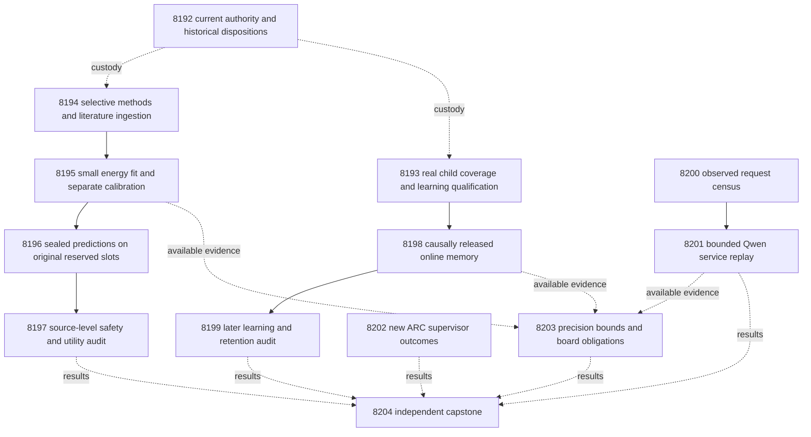

# Carnot Research Roadmap v708 — Selective decisions and qualified continual learning

**Created:** 2026-10-06. **Milestone:** 2026.10.708.
**Status:** Planned and staged; no activation or experiments run by this planning task.
**Supersedes:** scheduling for completed milestone 2026.10.707.
**Informed by:** research-program.md, PRD, architecture, completed experiment history,
V707 primaries and conductor dispositions, previous proposals and the V708 source scan.

The task contract is **13 tasks, Exp8192 through Exp8204**, in that exact order.
Four phases contain **3, 3, 4 and 3 tasks**. The visible table, embedded complete
JSON tasks and canonical digest below match `research-roadmap-next.yaml`.
The prior design is preserved at
`openspec/change-proposals/research-roadmap-v707-preserved-20261006.md`.
The active roadmap and conductor source remain unchanged.

## What v707 proved

The active authority scheduled fourteen tasks. Twelve primary artifacts exist;
Exp8186 and Exp8187 were skipped by gates. The completed archive ends at V706
at planning time. Thus V707 results use its authority, primaries and conductor log.
An operationally completed task is not necessarily a positive scientific result.

| Experiment | Supported result | Next consequence |
|---|---|---|
| 8178 | Current contract ready; historical hash failures retained | Freeze current authorities separately from historical qualification. |
| 8179–8182 | Sentence protocol, paired transport canary and fit capture qualified | Reuse authenticated features instead of repeating extraction. |
| 8183–8185 | Energy fit and evaluation executed; H1 was null | Test whether safer decision selection can use the existing signal. |
| 8180 | Learnable fixture passed; owned coverage failed at 384/386 statements | Repair real hard-exit coverage before natural learning. |
| 8186–8187 | Gate skips; no natural calibrated-learning result | Preserve the untested hypothesis and use a qualified new prerequisite. |
| 8188 | Conditional exact-repeat benefit; natural frequency unavailable | Freeze an ordinary request trace before new inference. |
| 8189 | Reader qualified; zero new supervisor outcomes | Inspect only a changed authenticated frontier. |
| 8190 | Workload bounds recorded; no whole-workload hardware win | Measure decision precision and retain separate board obligations. |
| 8191 | Fourteen dispositions reduced; scientific readiness blocked | Always run the capstone, even if a branch is blocked. |

Exp8185 had 97 complete source pairs, with class counts 46 and 51. Across all
128 intended slots, local evidence cost was 0.37109375 versus 0.3515625 for the
frozen radial control. Mean gain was -0.01953125; the one-sided 97.5% lower bound
was -0.13671875. Fourteen sources improved, but two extra false accepts violated
safety. Equivalent logistic probabilities and decisions matched. This supports
a decision-policy experiment; it does not support another identical capture.

Exp8180 diagnosed 87 clipped sources among 158 completed sources. The largest
old residual was 0.1410, below the smallest decision margin of 0.4626. Its new
learnable fixture installed at slot 140 and changed 57 later decisions. However,
the coverage-save branch before `os._exit` missed two statements. Its terminal
class is disqualified. Fixture performance cannot substitute for owned validation.

Exp8188's conditional exact-repeat speed ratio was 8.4089, with 95% interval
[7.2968, 10.2144], across 24 sources. `measured_repeat_frequency` was null;
`nfr01_met` was false. This is not a measured deployment speedup. The PRD's
NFR-01 remains 10x Rust/Python throughput. The V707 capstone's suggested >1 ratio
and 100 ms threshold do not replace the PRD requirement.

## Three largest gaps to the PRD

1. **FR-06/12: useful, safe verification decisions.** Live evidence extraction
   works, but the selected actions did not beat the control safely. Train small
   energy heads with separate calibration, then let ambiguous label sets escalate.
2. **FR-11: useful later decisions from continuous learning.** Timing was
   previously qualified; calibrated natural learning still lacks a valid run.
   Close the exact validation gap and independently test learning and retention.
3. **FR-05/08 and NFR-01: complete deployment value.** Isolated arithmetic and
   constructed cache hits do not establish service throughput. Measure a frozen
   ordinary research trace, with startup, misses and durable storage included.

These tasks advance constraint verification and the hybrid ARC architecture.
They do not train the generator, establish semantic truth from energy alone,
or claim hidden-game generalization from public data. All reused source and
stream cohorts remain **exposed development**. Within-run label separation is
necessary but cannot erase that exposure. Independent-generalization and
generalized-learning scores stay zero throughout this milestone.

## Research incorporated before design

The dated V708 entry in `research-references.md` was written before these tasks.
It records searches across every requested primary topic and secondary channel.

| Source | Concrete use | Limit |
|---|---|---|
| [Energy-conformal classification](https://openreview.net/pdf?id=zCwTMRtASZ) and [author code](https://github.com/navidattar/Energy-Based-Conformal-Classification) | 8194–8197 test class-conditional prediction sets | Use the probability-only baseline; arbitrary logit shifts must not create a signal. |
| [Continual Calibration](https://arxiv.org/abs/2604.23987) | 8193/8198/8199 separate probability, action and retention effects | No generator fine-tuning or inherited exchangeability guarantee. |
| [Delayed conformal inference](https://arxiv.org/abs/2609.07251) | Preserve issue/release/admission clocks and pending memory | A historical replay is not a prospective coverage guarantee. |
| [KAC](https://arxiv.org/abs/2503.21076) | Equal-budget radial growth controls | Local support does not establish retention. |
| [KANtize](https://arxiv.org/abs/2603.17230) and [local online learning](https://arxiv.org/abs/2602.02056) | 8203 tests precision and decision margins | Spline hardware results do not establish radial-kernel support. |
| [EBT](https://arxiv.org/abs/2507.02092), [ARM–EBM](https://arxiv.org/abs/2512.15605) | Conditional energy with equivalent logistic control | Energy notation cannot create a correctness advantage. |
| [RT4CHART](https://arxiv.org/abs/2603.27752), [NSVIF](https://arxiv.org/abs/2601.17789) | Retain source evidence and semantic/execution boundaries | Parseability and constraint satisfaction do not prove extraction correctness. |
| [Ising co-design](https://arxiv.org/abs/2602.15985), [Extropic Z1T](https://extropic.ai/writing/z1t/) | 8203 includes transfer, readout and host work | Vendor numbers are not local measurements. |

OpenReview's direct pages were challenged; indexed paper text and author code
were available. Semantic Scholar citation endpoints failed for both requested
papers, so citing-paper coverage is incomplete. Hugging Face surfaced OpenHalDet
and SIRIN as later integration leads. GitHub Trending responses were about three
weeks old. Kona supplied vendor architecture context, not a reproducible new
training recipe. ETS and neural Ising dynamics remain deferred until useful
verification decisions justify steering or sampler changes. FaithBench has
already appeared in V653–V657; downloading it does not create a fresh cohort.

## Architecture

Solid arrows are structured execution gates. Dotted arrows carry evidence;
they do not create hidden all-branch prerequisites. Authority, ARC, hardware
and capstone tasks always run. The service census is independent of both science
branches. Qualified nulls remain available to downstream audits.

## Phase 1 — methods and qualification, Exp8192–Exp8194

**8192** binds thirteen complete tasks using the existing authority lifecycle.
It snapshots current authorities and completed logs. Historical hash failures
remain separate. It preserves all fourteen V707 dispositions, including skips.

**8193** repairs the exact coverage failure through a real instrumented child.
The child must save coverage, exit 73, resume and contribute its measured data
to combined coverage. No skipped statements, relaxed threshold or mocked exit
can qualify the task. The V707 numerical method remains unchanged. New evidence
lives under Exp8193; Exp8180 remains disqualified. Fixture qualification requires
installation by slot 208, at least 32 later changed decisions, objective parity
within 1e-8, projected-gradient tolerance 1e-6 and exact restart state. Stream
custody has a separate readiness field. Fixture success is circular_positive.

**8194** ingests the research methods and freezes the selective-decision protocol.
Keep the original 128 fit, 64 tune and 128 reserved source slots. Sort fit sources
by SHA256 of source ID plus the literal `v708-fit-role`: first 96 fit heads;
remaining 32 fit temperatures. The 64 tune sources calibrate prediction sets only.
All source IDs and masks freeze before reserved row-level labels are reopened.

For unsupported label y=1 and probability p1, use nonconformity `A_y=1-p_y`.
For each class, fix alpha=.05. Its threshold is the
`ceil((n_y+1)*.95)`-th sorted calibration score. An out-of-range index gives
infinity. Include a class when its score is at most its threshold. Singleton
{0} accepts; singleton {1} rejects; empty or two-label sets escalate. Missing
evidence escalates. This targets class-conditional coverage under exchangeability;
it does not bound the fraction of errors among accepted predictions. The actual
reused cohort does not establish the assumptions for a deployment guarantee.

Use scalar-reference fixtures for ties, missing classes, small samples, missing
evidence and leakage. Check common-logit-shift invariance. Do not introduce
unidentified free-energy modulation into a binary logistic head.

## Phase 2 — train, seal and audit selective decisions, Exp8195–Exp8197

**8195** trains local_evidence_radial16 and radial16 feature-control heads on
the same 96-source role. Retain the V707 feature definitions, center rule and
regularization. Fit one positive temperature in [.25,4] on each head's separate
32-source role. Use all 64 calibration sources only for class thresholds.
Require at least 72 head-fit sources, 24 temperature sources with eight per class,
and 48 calibration sources with twenty per class. No threshold is selected on
reserved labels. Probability-equivalent logistic scoring must agree within 1e-10.

The seven arms are local_set, local_point, radial_set, radial_point,
frozen_v707_radial, equivalent_logistic_set and always_escalate. Point arms use
the original cost matrix and Bayes thresholds. Freeze heads, temperatures,
quantiles, costs, feature order and source hashes before evaluation.

**8196** seals all seven arms on every original reserved slot. It imports existing
Qwen features with original call clocks and makes zero model calls. It preserves
missing evidence and source identity. Labels open only after predictions seal.
Low support is recorded but does not prevent a completed audit of the null.

**8197** independently tests **H1: local_set versus frozen_v707_radial**.
The denominator is all 128 intended slots. Missing evidence escalates in every
arm. Require 96 complete pairs and twelve sources per class. Use 10,000 paired
source bootstrap draws, with at least 9,500 valid draws. Promotion requires:

- One-sided 97.5% lower typed-cost gain greater than .02.
- At least five improved sources and zero extra false accepts.
- Brier increase no greater than .01.

Report complete-case results and wrapper/feature contrasts as secondary.
Report class coverage, singleton coverage, error among unsupported sources and
error among accepts with separate denominators and binomial intervals. Equivalent
logistic predictions cannot be described as an energy-specific win. All-escalate
is a control, not success. Any positive result is a development signal only.

## Phase 3 — continuous learning and observed request costs, Exp8198–Exp8201

**8198** runs the unchanged calibrated-memory protocol after Exp8193 qualifies
both methods and stream custody. Use 256 original stream slots, 64 retention
slots and twenty seeds. Preserve delay 20, pending capacity 32, opportunity slots
64/144 and expiry slots 144/224. Candidates commit before twelve strictly later,
one-use admission labels. Modulo-four roles remain unchanged.

The score is `a*logit(clip(p_Qwen,1e-6,1-1e-6))+b+w·phi`.
Bounds are a∈[0,2], b∈[-8,8], w∈[-4,4]. Fit the newest 64 released update-only
rows using mean log loss plus `.005*sum(w*w)+.005*(a-1)^2`. Deterministic bounded
L-BFGS-B has 200 iterations and projected-gradient tolerance 1e-6. Nonconverged
candidates cannot enter admission. Interpolate a,b,w together without fitting
on admission labels. Grow sixteen centers to at most twenty-four.

The five arms remain calibrated_error_center, calibrated_fixed_center,
calibrated_random_center, calibration_only and frozen_qwen_offset.
`calibration_only` retains sixteen fixed centers; its name does not mean a
zero-feature temperature model. Persist issued state, feedback, admissions,
parameters and RNG. Seal retention predictions before reading retention labels.

**8199** independently tests **H2: calibrated_error_center versus
calibrated_fixed_center**. Require 128 later source pairs, eight per class and
eight original-slot blocks. Average seeds within source. Use moving blocks of
16, sensitivities 8/32, 10,000 draws and at least 9,500 valid draws. Require lower
one-sided 97.5% cost gain>.02, five improved sources, no extra false accepts,
Brier increase≤.01 and cost no more than .02 above each other control.
Retention needs 48 sources, eight per class, cost increase≤.02, Brier increase≤.01
and no extra false accepts versus the initial head. Restart state/predictions
must match exactly. Shared calibration gain is separate from structural memory.
H1 and H2 each retain alpha=.025; a blocked branch transfers no alpha.

**8200** inventories authenticated model call ledgers from V701–V707. It removes
warmups, designed duplicates, retries and forced hit/invalidation cases. Freeze
the last 96 eligible first-attempt research requests in original issue order,
with at least 24 source clusters and a supported qualified schema. Missing
request bytes or chronology cannot be synthesized. Zero observed hits is valid.
A support deficit blocks only the service benchmark.

Original exact identities include model/runtime, prompt/template, schema,
grammar, tokenizer, source/answer bytes, seed and sampling settings. Report actual
identity hits separately from a replay mapped to the current runtime. The latter
is a controlled research scenario. Neither is production-demand evidence.

**8201** measures Python/no reuse, Rust/no reuse, Python/exact reuse and
Rust/exact reuse on that frozen sequence, each with a separate empty durable
store. Preserve within-arm request order; freeze randomized arm order. Run the
actual PyO3 binding and pinned Qwen model. Budgets are 384 main calls plus two
warmups, with original bounded outputs at most 256 tokens. No silent truncation.

Include acquisition, queue, parsing, cache identity/lookup, evaluation, commit
and startup. Allocate one measured model startup per arm and label the allocation;
keep actual load counts separate. Report steady-state results separately.
Compare caching effects separately from Python/Rust effects. Require 96 matched
requests, 24 source clusters and semantic parity. Use 10,000 paired source-cluster
bootstrap draws with at least 9,500 valid. A speed benefit needs lower95>1;
NFR-01 requires lower95≥10 for the complete Python/Rust boundary. Conditional
cache gains cannot close NFR-01. Censor unfinished calls visibly.
