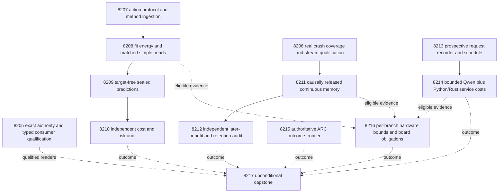

# Carnot Research Roadmap v709 — Constrained decisions and measurable learning

**Created:** 2026-10-06. **Milestone:** 2026.10.709.
**Title:** Acceptance-constrained energy decisions, recoverable learning, and prospective request evidence.
**Status:** Proposed and staged. This planning change does not activate tasks or run experiments.
**Supersedes:** scheduling for completed milestone 2026.10.708.
**Prior design:** `openspec/change-proposals/research-roadmap-v708-preserved-20261006.md`.

The exact contract is **13 tasks, Exp8205 through Exp8217**, in that order.
Four phases contain **3, 3, 4 and 3 tasks**. The visible task table, full JSON
contract and canonical digest below are generated from the same task objects as
`research-roadmap-next.yaml`. Both artifacts are required for activation.

## What v708 proved

Completion is an execution disposition, not evidence that a hypothesis succeeded.
At planning time the completed archive ends at V707. V708 has thirteen scheduled
tasks, ten primary artifacts and three pre-gate skips. Its active authority,
primitive results and conductor log establish the following record.

| Experiments | Observed result | Consequence |
|---|---|---|
| 8192 | Current design lacked the exact contract section; historical hash failures persisted | Emit and validate the real table, complete task JSON and digest before staging. |
| 8193 | Owned coverage missed four profiler callback statements,54–57 | Replace that instrumentation mechanism, keeping the learning method unchanged. |
| 8194–8196 | Selective protocol, fit and sealed evaluation qualified | Reuse authenticated source features and original missingness. |
| 8197 | Qualified selective-policy null, with greater cost and two extra false accepts | Retire the unchanged singleton-set policy; test a different allowed-action mechanism. |
| 8198–8199 | Pre-gate skips after learning qualification failed | Natural calibrated structural-memory benefit remains untested. |
| 8200–8201 | Census found zero reconstructable requests; service trial skipped | Record source condition and clocks before the next real request. |
| 8202 | Missing hardcoded live-state file blocked supervisor inspection | Resolve authority from the actual receipt producer. |
| 8203 | Precision rows existed; missing sibling results blocked combined readiness | Preserve each available workload branch independently. |
| 8204 | Eight focused pytest setup errors; receipt shape errors also recorded | Qualify child scratch lifetime and terminal readers before the next capstone. |

Exp8197's H1 mean cost gain was **-0.11328125** on128 intended slots;
its one-sided97.5% lower bound was **-0.234375**. There were97 complete pairs,
21 improved sources and two extra false accepts. The frozen baseline cost was
0.3515625; local_set cost was0.46484375. The gain failed despite adequate support.
The baseline accepted only four sources, all correct. It rejected eight correct
complete sources and escalated nine incorrect complete sources. Those errors
leave room to improve reject/escalate choices without granting new acceptance.
This headroom calculation uses already exposed outcomes and is a design choice,
not a prospective result or a reason to lower the original scientific threshold.

Exp8200 excluded1570 entries for unavailable original source condition and195
for unavailable issue time. Inventing those values from file timestamps would
not repair the trace. Exp8204 recorded a missing pytest parent and
`string indices must be integers, not 'str'` while consuming receipt fields.
The latter requires a fixture reproducing the actual field shape before repair.
No historical result is rewritten by this plan.

## Three largest gaps to the PRD

1. **FR-06/12: useful, safe verification decisions.** Qualified evidence has not
   yielded safe incremental decision value. Train a small conditional energy head
   with explicit action costs, a baseline acceptance constraint and matched simple
   controls. Keep the human source labels outside inference.
2. **FR-11: continuous learning that improves later decisions.** Recovery and
   calibration infrastructure repeatedly failed qualification before the natural
   test. Use supported hard-exit coverage, then independently test center growth
   beyond shared calibration and evaluate retention on separate labels.
3. **FR-05/08 and NFR-01: measurable deployment value.** Incomplete historical
   request identities prevent valid service accounting. Record prospective bounded
   Qwen requests and actual Python/Rust operations. Retain the original10x target
   and the separate requirement for representative deployment evidence.

The underlying research program still prioritizes faithful extraction. V707's
sentence transport is reused because its transport gate passed; that does not
make its semantic judgments ground truth. This milestone tests decision use of
that evidence and does not reopen retired generic text-reranking experiments.
ARC generalization and each attached-board obligation retain explicit slots.

## Research incorporated before design

The V709 entry in `research-references.md` was written before the task list.
All requested primary topics and secondary channels were searched. These are
method adaptations; no external result is imported as a Carnot measurement.

| Primary source | Use | Boundary |
|---|---|---|
| [Judge, Retrieve, or Abstain,2608.17994](https://arxiv.org/abs/2608.17994) | 8207–8210 separate decision permission, calibration and accepted-verdict risk | Historical exposure prevents a new population guarantee; searched thresholds need multiplicity correction or independent calibration. |
| [Cost-Saving LLM Cascades,2502.09054](https://arxiv.org/abs/2502.09054) | Explicit error/escalation costs in the new action policy | Escalation is unresolved work with a cost, not an automatically correct answer. |
| [KAN forgetting,2511.12828](https://arxiv.org/abs/2511.12828) and [KAC,2503.21076](https://arxiv.org/abs/2503.21076) | 8211–8212 compare radial growth to calibration and measure overlap/retention | Local activation support does not prove non-forgetting. |
| [EBT,2507.02092](https://arxiv.org/abs/2507.02092) and [ARM–EBM,2512.15605](https://arxiv.org/abs/2512.15605) | Small conditional energies and equivalent-logistic control | Energy notation does not itself improve correctness. |
| [FPGA–ASIC co-design,2602.15985](https://arxiv.org/abs/2602.15985) and [Extropic Z1T](https://extropic.ai/writing/z1t/) | 8216 complete-workload bounds and operator compatibility | Vendor projections do not establish local hardware access. |

Recent neural constraint acquisition, pre-generation soft-target probes, neural
Ising dynamics, ETS and diffusion TraceDet remain deferred leads. They require
new data or execution paths and do not fix the measured current blockers.
OpenReview PDF access hit browser challenges; official ICLR proceedings confirmed
EBT's conference listing. Semantic Scholar citation endpoints for both requested
papers were inaccessible, so citing-paper coverage is incomplete. Hugging Face
and GitHub discovery were checked; Trending pages were crawled three weeks earlier.
Kona's public architecture supplied no reproducible new training recipe.

## Architecture



Solid arrows are structured `gated_on` conditions. Dotted arrows carry optional
or administrative evidence; they are not hidden global prerequisites. The two
science branches and the service branch can fail independently. Authority, ARC,
hardware and capstone tasks run unconditionally. Valid null producers remain
eligible for independent audits.

## Phase 1 — qualify execution and freeze the changed method

**8205** binds the thirteen tasks and qualifies authority/terminal consumers.
It reproduces actual mapping/list receipt failures and the pytest scratch-parent
failure before implementing narrow fixes. It keeps historical invalidity separate
from current administrative readiness. This is a concrete schema qualification
experiment, not another archive/activate task; it never activates the roadmap.

**8206** changes the failed coverage mechanism. Installed Coverage.py7.14.1
supports `patch = _exit`, which saves measured data before calling the original
hard exit. Run legacy training directly under that configuration, preserving
actual exit73, crash-state bytes and resumed equality. Remove the profiler from
the new route; do not exclude its missing lines to manufacture qualification.
Keep the existing numerical fixture and learning protocol. This tests execution,
not scientific learning benefit.

**8207** ingests the risk/abstention literature and freezes a new decision rule.
Let `p_bad` come from normalized good/bad energies. Expected costs remain:
accept=`5*p_bad`, reject=`1-p_bad`, escalate=`0.5`. Every input permits reject
and escalate; accept is permitted only when the original frozen V707 baseline
accepts it. Choose the minimum expected cost among permitted actions, escalating
on a tie or missing evidence. Consequently the accepted set is a subset of the
baseline accepted set for every input. This bounds the relative number of false
accepts; it does not bound conditional error rate or certify the baseline.

## Phase 2 — train, seal, independently evaluate

**8208** actually fits bounded small conditional-energy parameters and a
capacity-matched additive/simple head on identical qualified source features.
Training, temperature tuning and source identity roles remain separate. It seals
normalizers, radial geometry, weights, selected simple control and policy before
evaluation. Equivalent logistic probabilities must match energy probabilities.

**8209** seals target-free predictions for all128 original reserved slots.
It retains the31 slots without complete paired features as escalation records.
The evaluator cannot open labels until prediction bytes and access order are
sealed. This boundary is meaningful within the invocation, but the dataset is
still exposed development after repeated earlier evaluations.

**8210** independently recomputes source-level costs, probabilities and H1.
It separately reports a policy gain over the original baseline and the energy
increment over an equally restricted simple control. Neither a safety mask alone
nor an identical-logistic comparison can establish learned energy superiority.

## Phase 3 — continuous learning and prospective service evidence

**8211** runs the previously blocked calibrated-memory hypothesis after8206
qualifies. Keep issue, release and admission clocks; compare shared calibration
with fixed, random and error-selected centers under the existing seed/slot budget.
Support-overlap diagnostics follow the KAN forgetting paper but cannot choose
updates using retention labels. Real crash/resume and future-label mutation tests
must preserve the causal record. Generator weights never change.

**8212** averages seeds within sources and independently evaluates later cost,
Brier score, decision movement and retention. Calibrated-error-center must improve
beyond calibrated-fixed-center; shared base calibration receives separate credit.
Historical replay cannot establish generalized lifelong learning.

**8213** qualifies an append-only request recorder before any new Qwen request.
It writes source condition, input bytes, full decoding configuration and issue
clocks before inference, then separately records completion/failure/censoring.
It freezes24 fit-source identities in fixed identity order. Scripted HTTP fixtures
prove transport and recording only, with no live-model claim.

**8214** executes that bounded schedule using the mandated Qwen GGUF: one request
per source,128 output tokens maximum,120-second per-call deadline and3600-second
measurement deadline. It measures complete durable Python/Rust branches over the
same actual acquired output and reports shared-acquisition accounting explicitly.
Startup is charged once to each workload; failures remain in all-slot totals.
This is a designed research workload, not ordinary deployment traffic. Cache hits
are not injected. At least20 independent complete pairs are needed for intervals.
The task does not close NFR-01 even if an isolated kernel is fast.

## Phase 4 — ARC, attached boards and independent reconciliation

**8215** fixes the supervisor locator's absent hardcoded-state assumption using
paths named by actual producer/configuration authority. It inspects only new
redirect outcomes; an authenticated empty ledger is a valid null. Missing authority
is blocked. Any arm-selection proposal is descriptive until separately tested on
the live path. No games, model calls, default changes or new solves occur here.
This satisfies the standing ARC generalization floor through supervisor refinement.

**8216** handles each available scientific/service branch independently and
measures numerical decision stability for the new head. It reports transfer,
readout, persistence and acquisition costs in the acceleration bound. Each attached
board has its own evidence and reopening row; unavailable siblings do not erase
valid rows. The task targets all three boards through evidence/obligation review.

**8217** always reduces all thirteen task dispositions, including itself and
conductor skips. The current consumer harness must qualify even when scientific
inputs are absent. External blocks receive `blocked`, owned failures receive
`disqualified`, and valid negative science receives `null`. None is a reason to
label unfinished external evidence `partial` and trigger redundant retries.

## Scientific acceptance and decision gates

There are exactly two primary hypotheses, sharing family alpha0.05 with
one-sided alpha0.025 each. Both compare costs using independent source units.

| Hypothesis | Registered test | Support and safety |
|---|---|---|
| H1: constrained energy adds value over the tune-selected restricted simple head |10000 paired source-cluster bootstrap draws;97.5% lower cost-gain bound >0.02 |>=96 complete sources,>=12 per class,>=9500 valid draws,>=5 improved sources,zero extra false accepts,Brier increase<=0.01; original-baseline cost degradation<=0.02 |
| H2: calibrated error-selected memory helps beyond calibrated fixed centers |10000 original-slot moving-block bootstrap draws after seed averaging;primary block16,descriptive8/32 sensitivity;97.5% lower gain >0.02 |>=128 complete later sources,>=8 per class,>=8 nonoverlapping blocks,>=9500 valid draws,>=5 improved sources,zero extra false accepts,Brier increase<=0.01 |
| H2 retention guard | Separate sealed retention cohort,never used for admission |>=48 complete sources,>=8 per class,cost increase<=0.02,Brier increase<=0.01,zero extra false accepts;other causal controls use the frozen0.02 cost margin |

All-slot masks and missing-value costs are retained. The original H2 protocol
remains authoritative; H1's changed action rule is not silently introduced into
H2. Every required gate has a principle annotation in the task prompt. Additional
contrasts and risk curves are descriptive. No test promotes independent
source generalization or generalized learning from these exposed cohorts.

A readiness score means an executable producer or audit qualifies, not that its
hypothesis won. A valid null must not cascade-block a consumer. Conversely, a
false acceptance gate cannot carry a positive verdict class. Oracle-defined
correctness uses `circular_positive` and cannot establish an oracle-distinct moat.

## Hardware requirements and budget

| Tasks | Resources | Wall estimate |
|---|---|---|
|8205–8213 | CPU,existing Python/JAX/scipy environment,private storage;no LLM load |20–50min each |
|8214 | One owned RTX3090 CUDA lease for cached Qwen3.8-27B Q4_K_M,about16GB model plus KV/workspace;existing native extension/toolchain |65min including validation |
|8215 | CPU and authenticated ARC receipt files |35min |
|8216 | CPU and existing per-board evidence;no board access required |25min |
|8217 | CPU,immutable source/validation evidence |45min |

The host has two RTX3090s,24GB each. No task requires dual-GPU integration or a
new purchase. Reserve a free device without evicting other work; inadequate
capacity is a resource block. Task8214 declares `model_bounded_generation`
with a10-second duration floor because its token budget is small and fixed.
The60-second `model_full_generation` floor applies only to real full generative
work; a load-only embedding probe would use `model_load_no_generation` at2seconds.
All other tasks declare `no_model_load`,empty MODEL_SPECS and zero current calls.
Legacy small models are CPU smoke fixtures only, never headline substitutions.

KV260 retains historical fabric evidence at `k_max<=5`; a useful new workload
needs authenticated SSH/device execution and transfer-inclusive timings. PolarFire
retains Linux CPU-only dispatch until real fabric evidence exists. GateMate's
`0xffffffff` JTAG boundary requires a dated physical change before another device
attempt. NPU and TSU access remain unqualified. Extropic projections do not change
those facts. No board is flashed by this milestone's evidence-review task.

Every learning tier has an explicit acceleration mapping in8216. The proposed
100x path must be bounded by the observed serial share; a ceiling below100x is a
request to change workload structure, not grounds to invent a hardware speedup.
The PRD's10x Rust/Python requirement remains unchanged and is not satisfied by
designed cache repeats or a shared-acquisition accounting exercise.

## Failure discipline and execution budget

All thirteen tasks carry four-field prior_failures entries with exact verdicts
and `retire_if_same_verdict: true`. The meaningful changes are the explicit
allowed-action mechanism, supported hard-exit coverage, prospective request
recording, producer-authorized ARC locator, branch-local hardware accounting,
and actual authority/consumer qualification. A new ID alone never reopens a
retired mechanism. Standing2026-05-29 continuation overrides identify the changed
scope where applicable; there are no requires chains to retired IDs.

Routine synthesis/experiments use the conductor's Claude default. Formulaic
prediction transport and established service execution use Codex gpt-6.1-sol.
Schema/preflight/coordination tasks use Opus with100turns as requested. No Luna
experiment or claim task is scheduled. Pure bounded wiring uses30turns; ordinary
research stays at50. Aggregate estimate is495minutes, including branch work that
may be pre-gate skipped; no task estimates more than65minutes. Each process must
still respect its own bounded commands and the conductor's hard4800-second cap.

Every prompt includes numbered progress and file-size steps: flushed boundary
messages,before/after long calls,heartbeat within60seconds,loop counts and gaps
under600seconds. Files over about200lines are written in<=150-line chunks with
progress between calls. Subprocesses have deadlines and process-group cleanup.
No prompt permits a fake bootstrap-only terminal result,hand-edited coverage,
weakening assertions or modifying the conductor.

## Verification and reconciliation

For planning, parse the staged YAML with safe_load,check13 ordered tasks and
unique deliverables,compare the visible table/full JSON/canonical digest using
`python/carnot/reporting/roadmap_contract.py` and
`python/carnot/reporting/v685_authority_lifecycle.py`,and test a private activation
copy with first_id8205,count13,milestone2026.10.709. The real active roadmap is
expected to remain V708. Mutation checks must fail changed titles/prompts/gates,
count/order and digest. Confirm every gate points to an earlier task and names a
field in that producer's REQUIRED ARTIFACT FIELDS exactly.

Run exclusion-manifest,harness-fit and ARC-floor linters; focused gate/exclusion
unit tests; E2E-018's private CLI tests; scoped spec coverage; documentation
reconciliation. Record broader pre-existing failures without claiming a global
pass. No implementation code is changed by planning,so full Rust/JAX performance
or live-GPU E2E execution is not part of this planning verification.

Each experiment owns relevant spec/test-first changes,100% measured changed-code
coverage,Ruff/format/strict mypy,scoped spec traceability,affected consumer tests
and the applicable E2E commands named in its prompt. It must cold-replay primitive
rows and pass unchanged publication/adversarial/row validators before terminal
publication. No test writes experimental claims into protected results paths.
The capstone reconciles specs,_bmad/traceability.md,ops/status.md and ops/changelog.md.
Historical artifacts and public-document claim boundaries remain preserved.

## Exact task contract

The following table is executable scope,not an aspirational list. The machine
contract contains the complete task objects,including prompts,routing,failure
history,models and gates. Its canonical digest uses sorted-key compact UTF-8 JSON
with ensure_ascii=False,matching the existing authority lifecycle implementation.

| Order | Task ID | Title | Phase | Deliverable |
|---|---|---|---|---|
| 1 | exp8205-contract-consumer-qualification | Bind thirteen tasks and qualify authority and terminal readers | 1 | results/experiment_8205_v709_contract_consumer_qualification.json |
| 2 | exp8206-hard-exit-learning-qualification | Qualify unchanged learning with Coverage.py hard-exit persistence | 1 | results/experiment_8206_v709_hard_exit_learning_qualification.json |
| 3 | exp8207-restricted-action-methods | Freeze an acceptance-constrained energy decision experiment | 1 | results/experiment_8207_v709_restricted_action_methods.json |
| 4 | exp8208-restricted-energy-fit | Train matched energy and simple heads under the same action constraint | 2 | results/experiment_8208_v709_restricted_energy_fit.json |
| 5 | exp8209-restricted-sealed-evaluation | Seal constrained predictions on every original reserved source | 2 | results/experiment_8209_v709_restricted_sealed_evaluation.json |
| 6 | exp8210-restricted-decision-audit | Independently test constrained action utility and remaining risk | 2 | results/experiment_8210_v709_restricted_decision_audit.json |
| 7 | exp8211-calibrated-memory-trajectory | Run delayed-feedback learning after genuine crash qualification | 3 | results/experiment_8211_v709_calibrated_memory_trajectory.json |
| 8 | exp8212-memory-benefit-audit | Measure later learning benefit and independent retention | 3 | results/experiment_8212_v709_memory_benefit_audit.json |
| 9 | exp8213-prospective-request-recorder | Qualify request identity and issue clocks before live acquisition | 3 | results/experiment_8213_v709_prospective_request_recorder.json |
| 10 | exp8214-prospective-service-measurement | Measure bounded Qwen acquisition and complete durable service branches | 3 | results/experiment_8214_v709_prospective_service_measurement.json |
| 11 | exp8215-arc-authoritative-frontier | Resolve actual supervisor receipt authority and inspect new outcomes | 4 | results/experiment_8215_v709_arc_authoritative_frontier.json |
| 12 | exp8216-hardware-workload-obligations | Bound available workloads and preserve separate obligations for every board | 4 | results/experiment_8216_v709_hardware_workload_obligations.json |
| 13 | exp8217-capstone | Reconcile thirteen outcomes without conflating execution and science | 4 | results/experiment_8217_v709_capstone.json |

Canonical full-task SHA256: `ae081e802885f62acf2d6892a4895f67ecf16997f0b8ccb58a5466f067f02801`

### Structured dependency fields

| Consumer | Producer | Required field | Condition |
|---|---|---|---|
| exp8208-restricted-energy-fit | exp8207-restricted-action-methods | `action_protocol_ready_score` | `== 1` |
| exp8209-restricted-sealed-evaluation | exp8208-restricted-energy-fit | `action_fit_ready_score` | `== 1` |
| exp8210-restricted-decision-audit | exp8209-restricted-sealed-evaluation | `sealed_action_ready_score` | `== 1` |
| exp8211-calibrated-memory-trajectory | exp8206-hard-exit-learning-qualification | `calibrated_memory_ready_score` | `== 1` |
| exp8211-calibrated-memory-trajectory | exp8206-hard-exit-learning-qualification | `stream_input_ready_score` | `== 1` |
| exp8212-memory-benefit-audit | exp8211-calibrated-memory-trajectory | `learning_trajectory_ready_score` | `== 1` |
| exp8214-prospective-service-measurement | exp8213-prospective-request-recorder | `request_recorder_ready_score` | `== 1` |

Tasks8205,8206,8207,8213,8215,8216 and8217 have no conductor pre-gate.

<!-- V709_TASK_CONTRACT_START -->
```json
{
  "milestone": "2026.10.709",
  "tasks": [
    {"MODEL_SPECS": [], "deliverable": "results/experiment_8205_v709_contract_consumer_qualification.json", "estimated_wall_time_min": 45, "gated_on": [], "id": "exp8205-contract-consumer-qualification", "inference_substrate_class": "no_model_load", "max_turns": 100, "milestone": "2026.10.709", "model": "opus", "operator_override": "2026-05-29 operator directive (standing): routine milestone transition; scope matches exp8192/exp7992, but V709 carries a complete machine contract and qualified typed readers.", "per_unit_rows": true, "phase": 1, "prior_failures": [{"addressed_by": "Emit the parser-required full contract and separate current authority from immutable historical failures.", "experiment_id": "exp8192-contract-custody", "retire_if_same_verdict": true, "verdict": "complete_blocked_sha256"}, {"addressed_by": "Qualify actual terminal-reader field shapes and create a durable pytest parent before child execution.", "experiment_id": "exp8204-capstone", "retire_if_same_verdict": true, "verdict": "complete_disqualified_owned_validation"}], "priority": "high", "prompt": "CONTEXT:\nWork in {project_root} on {date}. V708 scheduled thirteen tasks, produced ten primaries and three gate skips. Its design lacked the exact machine contract; the capstone also encountered dict/list receipt errors and a pytest scratch-parent failure. These are execution defects, not negative scientific evidence.\nEXISTING CODE TO READ FIRST:\nCLAUDE.md; CODEX.md; ops/e2e-test-plan.md; openspec/capabilities/research-reporting/spec.md; openspec/capabilities/verification/spec.md; scripts/experiment_template.py; python/carnot/reporting/primary_publication.py; ops/exclusion_manifest.yaml; openspec/change-proposals/research-roadmap-vNEXT.md; python/carnot/reporting/roadmap_contract.py; python/carnot/reporting/v685_authority_lifecycle.py; python/carnot/reporting/v708_contract_custody.py; python/carnot/reporting/v708_capstone_inputs.py; python/carnot/reporting/v708_capstone.py; results/experiment_8192_v708_contract_custody.json; results/experiment_8204_v708_capstone.json; openspec/change-proposals/research-roadmap-v708-preserved-20261006.md\nTASK:\nCreate a narrow V709 authority and consumer qualification receipt. Use the parameterized existing parser with first_id=8205 and count=13; do not infer readiness from a copied summary. Deliver results/experiment_8205_v709_contract_consumer_qualification.json, with executable runner scripts/experiments/experiment_8205_v709_contract_consumer_qualification.py and primitive evidence in results/raw/experiment_8205_v709_contract_consumer_qualification/. Keep historical primary artifacts immutable.\nCONCRETE STEPS:\n0. PRECONDITIONS (before substantive work): Check the named input paths, schemas, Python environment and writable private scratch. Authenticate only the prerequisites of this branch; a missing optional sibling is a recorded disposition, not an invented input. Record literal commands, outputs and exit codes. If a required external resource is absent, emit a terminal blocked verdict with the failed operand and stop dependent work; never fabricate measurements.\n1. Emit a flushed progress line at every phase boundary and immediately before and after each model load, generation, benchmark and subprocess. Emit real completed/pending counts inside long loops and a heartbeat at most every 60 seconds while a child is running; keep every output gap below 600 seconds. Split commands into bounded batches and enforce child deadlines with process-group cleanup. Write any file over about 200 lines in several tool calls of at most about 150 lines each, with a progress message between calls; no single huge file-writing tool call.\n2. Before implementation, extend the relevant existing capability spec with REQ-* and SCENARIO-* for this task. Write focused tests first, including failure and real CLI paths; keep original assertions. Use scripts/experiment_template.py where appropriate, reuse qualified primitives, and avoid another copied validation framework. Keep scratch outside the repository root and test artifacts outside protected results paths.\n3. Snapshot the full V709 design, staged YAML if present, activated YAML, manifest and finished V708 conductor rows. Before activation report staged readiness separately; after activation accept an absent staging file only when activated bytes match the full design digest. Preserve all thirteen V708 dispositions, including three pre-gate skips and every historical hash failure.\n4. Reproduce the V708 consumer TypeError using actual saved code_config_hashes and terminal-evidence shapes. Add explicit adapters only for documented mapping/list schema versions, reject malformed entries, and exercise real terminal readers without replacing them with passed=True. Save the failing operand if the suspected shape is not the cause.\n5. Qualify the future capstone harness with an invocation-owned parent above all pytest basetemp children, retained for the entire child lifetime. Run a tiny actual pytest child and a failing child; keep logs durable. Test missing, altered and malformed receipts and a legitimately skipped branch without suppressing their failures.\n6. Independently compare the 13-row visible table, embedded complete JSON task list and canonical SHA256 against YAML. Mutation controls must reject count, order, title, prompt, gate spelling and digest changes. Historical qualification failures do not change current scheduling readiness, and current administrative readiness never repairs old science.\n7. Freeze the exact owned validation commands before measurement. Run focused unit tests, measured 100% coverage of changed Python and real CLI/child statements, scoped Ruff/format/strict mypy, scripts/check_spec_coverage.py --files <owned-test-files>, affected consumers, and applicable E2E-018 private authority CLI checks from ops/e2e-test-plan.md using private scratch. Freeze and report any unrelated repository-health failures separately; do not weaken required checks or claim global green. Failed owned validation means disqualified, not positive.\n8. Cold-replay primitive rows in a fresh process and pass the unchanged terminal publication validator, scripts/adversarial_verify.py --json results/experiment_8205_v709_contract_consumer_qualification.json, and scripts/verdict_row_consistency_lint.py --strict results/experiment_8205_v709_contract_consumer_qualification.json. Validate a private candidate before atomic primary publication. Preserve subprocess exit status, complete stdout/stderr hashes, measurement clocks and code/config hashes; do not relabel historical work as current. Reconcile specs, _bmad/traceability.md, ops/status.md and ops/changelog.md. Do not edit research-roadmap.yaml or activate this roadmap.\nREQUIRED ARTIFACT FIELDS:\nexperiment_id, task_id, milestone, run_date: principle: Bind this result to its exact task and invocation.\nhonest_verdict, verdict_class: principle: Record terminal state honestly; verdict_class is exactly positive | circular_positive | null | blocked | disqualified | partial. Terminal honest_verdict uses complete_*; partial is only unfinished owned work, never unchanged external blocks.\ngate_check_summary: principle: For every blocked verdict record upstream ID/path/hash, exact field, operator, expected and observed value; absent is different from zero.\ninference_substrate, inference_substrate_class, MODEL_SPECS, model_invocation_counts: principle: Declare actual execution; this task uses no_model_load and MODEL_SPECS=[]. Use aggregation_from_upstream_artifacts for reductions, verifier_ensemble_against_cached_candidates for CPU fitting/scoring, and live_llm_inference for actual bounded Qwen calls. Cached provenance is not a new model call. No padding runtime to meet duration floors.\npreconditions_checked, duration_s, random_seed, reproducibility_checksum, source_artifact_hashes, cited_upstream_artifacts: principle: Make resource availability and imported fields independently auditable; hash copied source bytes and exact configurations.\nrows, intended_count, completed_count, failed_count, censored_count, excluded_count, independent_count: principle: Emit each source/request/seed/condition with its actual metric and denominator, including missing slots; repeats and seeds are not independent sources.\nverifier_is_oracle, exposure_scope, independent_generalization_score, generalized_learning_benefit_score: principle: Separate executable truth from learned verification; reused data remain exposed development and both generalization scores stay zero. An oracle-based success is circular_positive.\nacceptance_gates, field_principles, validation_receipts, required_checks_passed, raw_shard_hashes, code_config_hashes: principle: Explain each gate, preserve real exit evidence and reconstruct conclusions from immutable primitives. Every failed acceptance gate forbids positive class.\ncontract_ready_score: principle: One only for exact current authority agreement and passing owned validation.\nconsumer_reader_ready_score: principle: One only after real schema variants, invalid receipts and child scratch lifecycle qualify.\ntask_dispositions, authority_snapshots, canonical_tasks_sha256, historical_required_failures: principle: Preserve prior failures while binding the actual current task list.\nRun command: cd {project_root} && PYTHONPATH=python:. .venv/bin/python -u scripts/experiments/experiment_8205_v709_contract_consumer_qualification.py --date {date}\nDo NOT push. Do NOT modify scripts/research_conductor.py.", "requires_gpu": false, "title": "Bind thirteen tasks and qualify authority and terminal readers", "track": "infra"},
    {"MODEL_SPECS": [], "deliverable": "results/experiment_8206_v709_hard_exit_learning_qualification.json", "estimated_wall_time_min": 45, "gated_on": [], "id": "exp8206-hard-exit-learning-qualification", "inference_substrate_class": "no_model_load", "max_turns": 100, "milestone": "2026.10.709", "model": "opus", "operator_override": "2026-05-29 operator directive (standing): versioned qualification continuation of exp8180/8193; built-in Coverage.py hard-exit persistence replaces the failed profiler mechanism.", "per_unit_rows": true, "phase": 1, "prior_failures": [{"addressed_by": "Use installed Coverage.py patch=_exit in a directly measured real child instead of an unmeasured profiler callback.", "experiment_id": "exp8193-learning-qualification", "retire_if_same_verdict": true, "verdict": "complete_disqualified_owned_validation"}, {"addressed_by": "Save executed hard-exit coverage with the supported coverage hook; retain the exact fixture and numerical protocol.", "experiment_id": "exp8180-calibrated-memory-methods", "retire_if_same_verdict": true, "verdict": "complete_disqualified_owned_validation"}], "priority": "high", "prompt": "CONTEXT:\nWork in {project_root} on {date}. Exp8180 missed two legacy hard-exit statements. Exp8193 fixed that attempt with a profiler callback but missed its own four callback statements (54-57), so calibrated natural learning never ran. Installed Coverage.py 7.14.1 has built-in patch=_exit and calls the original exit after saving.\nEXISTING CODE TO READ FIRST:\nCLAUDE.md; CODEX.md; ops/e2e-test-plan.md; openspec/capabilities/research-reporting/spec.md; openspec/capabilities/verification/spec.md; scripts/experiment_template.py; python/carnot/reporting/primary_publication.py; ops/exclusion_manifest.yaml; openspec/change-proposals/research-roadmap-vNEXT.md; python/carnot/verify/calibrated_memory_methods_8180.py; python/carnot/verify/learning_qualification_8193.py; python/carnot/reporting/learning_qualification_execution_8193.py; tests/python/test_learning_qualification_8193.py; openspec/change-proposals/v707-calibrated-memory-protocol.json; python/carnot/verify/released_feedback_learning_8171.py; results/experiment_8193_v708_learning_qualification.json; results/experiment_8172_v706_learning_benefit_audit.json\nTASK:\nReplace the unmeasured profiler-based qualification route with invocation-local Coverage.py patch=_exit configuration, while retaining the existing numerical learning method and its acceptance gates. Deliver results/experiment_8206_v709_hard_exit_learning_qualification.json, with executable runner scripts/experiments/experiment_8206_v709_hard_exit_learning_qualification.py and primitive evidence in results/raw/experiment_8206_v709_hard_exit_learning_qualification/. Keep historical primary artifacts immutable.\nCONCRETE STEPS:\n0. PRECONDITIONS (before substantive work): Check the named input paths, schemas, Python environment and writable private scratch. Authenticate only the prerequisites of this branch; a missing optional sibling is a recorded disposition, not an invented input. Record literal commands, outputs and exit codes. If a required external resource is absent, emit a terminal blocked verdict with the failed operand and stop dependent work; never fabricate measurements.\n1. Emit a flushed progress line at every phase boundary and immediately before and after each model load, generation, benchmark and subprocess. Emit real completed/pending counts inside long loops and a heartbeat at most every 60 seconds while a child is running; keep every output gap below 600 seconds. Split commands into bounded batches and enforce child deadlines with process-group cleanup. Write any file over about 200 lines in several tool calls of at most about 150 lines each, with a progress message between calls; no single huge file-writing tool call.\n2. Before implementation, extend the relevant existing capability spec with REQ-* and SCENARIO-* for this task. Write focused tests first, including failure and real CLI paths; keep original assertions. Use scripts/experiment_template.py where appropriate, reuse qualified primitives, and avoid another copied validation framework. Keep scratch outside the repository root and test artifacts outside protected results paths.\n3. Verify the installed coverage version and _exit patch implementation. Freeze a private coverage configuration using patch=_exit and parallel child data files. Invoke the legacy trainer directly under coverage before import; do not chain the sys.setprofile wrapper, mock away the hard exit, exclude owned lines, or edit counters.\n4. Run the same known-learnable fixture through uninterrupted, real exit-73, and resumed child processes. Preserve the actual exit status, save pending prediction state before release, and require identical resumed parameters, clocks, issued rows and pending state. Test at least two distinct crash slots and the no-crash path.\n5. Combine only this invocation's measured child/unit coverage; require all newly owned statements plus the legacy save/flush/exit statements to be measured. The fixture must still install by slot208 and change at least32 later decisions under the frozen protocol. Fixture labels establish readiness only.\n6. Authenticate the original learning-stream bytes, delayed labels, role manifests and separate retention cohort from the qualified Exp8171/8172 chain. Keep exposure and historical failures explicit. Set stream_input_ready_score independently of the fixture result; freeze H2 unchanged before opening new trajectory outcomes.\n7. Freeze the exact owned validation commands before measurement. Run focused unit tests, measured 100% coverage of changed Python and real CLI/child statements, scoped Ruff/format/strict mypy, scripts/check_spec_coverage.py --files <owned-test-files>, affected consumers, and applicable E2E-015/019 plus the task-owned hard-exit/resume CLI from ops/e2e-test-plan.md using private scratch. Freeze and report any unrelated repository-health failures separately; do not weaken required checks or claim global green. Failed owned validation means disqualified, not positive.\n8. Cold-replay primitive rows in a fresh process and pass the unchanged terminal publication validator, scripts/adversarial_verify.py --json results/experiment_8206_v709_hard_exit_learning_qualification.json, and scripts/verdict_row_consistency_lint.py --strict results/experiment_8206_v709_hard_exit_learning_qualification.json. Validate a private candidate before atomic primary publication. Preserve subprocess exit status, complete stdout/stderr hashes, measurement clocks and code/config hashes; do not relabel historical work as current. Reconcile specs, _bmad/traceability.md, ops/status.md and ops/changelog.md. Do not edit research-roadmap.yaml or activate this roadmap.\nREQUIRED ARTIFACT FIELDS:\nexperiment_id, task_id, milestone, run_date: principle: Bind this result to its exact task and invocation.\nhonest_verdict, verdict_class: principle: Record terminal state honestly; verdict_class is exactly positive | circular_positive | null | blocked | disqualified | partial. Terminal honest_verdict uses complete_*; partial is only unfinished owned work, never unchanged external blocks.\ngate_check_summary: principle: For every blocked verdict record upstream ID/path/hash, exact field, operator, expected and observed value; absent is different from zero.\ninference_substrate, inference_substrate_class, MODEL_SPECS, model_invocation_counts: principle: Declare actual execution; this task uses no_model_load and MODEL_SPECS=[]. Use aggregation_from_upstream_artifacts for reductions, verifier_ensemble_against_cached_candidates for CPU fitting/scoring, and live_llm_inference for actual bounded Qwen calls. Cached provenance is not a new model call. No padding runtime to meet duration floors.\npreconditions_checked, duration_s, random_seed, reproducibility_checksum, source_artifact_hashes, cited_upstream_artifacts: principle: Make resource availability and imported fields independently auditable; hash copied source bytes and exact configurations.\nrows, intended_count, completed_count, failed_count, censored_count, excluded_count, independent_count: principle: Emit each source/request/seed/condition with its actual metric and denominator, including missing slots; repeats and seeds are not independent sources.\nverifier_is_oracle, exposure_scope, independent_generalization_score, generalized_learning_benefit_score: principle: Separate executable truth from learned verification; reused data remain exposed development and both generalization scores stay zero. An oracle-based success is circular_positive.\nacceptance_gates, field_principles, validation_receipts, required_checks_passed, raw_shard_hashes, code_config_hashes: principle: Explain each gate, preserve real exit evidence and reconstruct conclusions from immutable primitives. Every failed acceptance gate forbids positive class.\ncalibrated_memory_ready_score: principle: One requires genuine hard exit, exact recovery, unchanged numerical fixture gates and complete owned coverage.\nstream_input_ready_score: principle: One requires authenticated original stream and retention bytes; it does not assert learning benefit.\nchild_exit_rows, coverage_statement_counts, restart_state_hashes, numerical_protocol_sha256: principle: Prove the changed measurement mechanism without changing the learning hypothesis.\nRun command: cd {project_root} && PYTHONPATH=python:. .venv/bin/python -u scripts/experiments/experiment_8206_v709_hard_exit_learning_qualification.py --date {date}\nDo NOT push. Do NOT modify scripts/research_conductor.py.", "requires_gpu": false, "title": "Qualify unchanged learning with Coverage.py hard-exit persistence", "track": "infra"},
    {"MODEL_SPECS": [], "deliverable": "results/experiment_8207_v709_restricted_action_methods.json", "estimated_wall_time_min": 35, "gated_on": [], "id": "exp8207-restricted-action-methods", "inference_substrate_class": "no_model_load", "max_turns": 50, "milestone": "2026.10.709", "operator_override": "2026-05-29 operator directive (standing): changed source-decision continuation of exp8197; permission-constrained actions replace singleton-set selection, without reopening generic external-text reranking.", "per_unit_rows": true, "phase": 1, "prior_failures": [{"addressed_by": "Replace unrestricted singleton-set actions with a baseline-acceptance constraint and cost-minimizing reject/escalate decisions, with matched restricted simple controls.", "experiment_id": "exp8197-selective-decision-audit", "retire_if_same_verdict": true, "verdict": "complete_null_selective_decision_null"}], "priority": "high", "prompt": "CONTEXT:\nWork in {project_root} on {date}. V708 local_set increased cost by0.11328125 and added two false accepts. The frozen control accepted four correct sources, wrongly rejected eight complete sources and escalated nine incorrect complete sources. The changed question concerns reject/escalate choices while preserving the baseline acceptance permission.\nEXISTING CODE TO READ FIRST:\nCLAUDE.md; CODEX.md; ops/e2e-test-plan.md; openspec/capabilities/research-reporting/spec.md; openspec/capabilities/verification/spec.md; scripts/experiment_template.py; python/carnot/reporting/primary_publication.py; ops/exclusion_manifest.yaml; openspec/change-proposals/research-roadmap-vNEXT.md; research-references.md; research-studying.md; python/carnot/verify/selective_rule_8194.py; python/carnot/verify/selective_energy_fit_8195.py; python/carnot/verify/selective_decision_audit_8197.py; results/experiment_8197_v708_selective_decision_audit.json; openspec/change-proposals/v707-calibrated-memory-protocol.json\nTASK:\nRegister a small conditional-energy selector with an explicit allowed-action set and equal-information controls. Ingest the literature into methods; retire the unchanged class-conditional singleton policy. Deliver results/experiment_8207_v709_restricted_action_methods.json, with executable runner scripts/experiments/experiment_8207_v709_restricted_action_methods.py and primitive evidence in results/raw/experiment_8207_v709_restricted_action_methods/. Keep historical primary artifacts immutable.\nCONCRETE STEPS:\n0. PRECONDITIONS (before substantive work): Check the named input paths, schemas, Python environment and writable private scratch. Authenticate only the prerequisites of this branch; a missing optional sibling is a recorded disposition, not an invented input. Record literal commands, outputs and exit codes. If a required external resource is absent, emit a terminal blocked verdict with the failed operand and stop dependent work; never fabricate measurements.\n1. Emit a flushed progress line at every phase boundary and immediately before and after each model load, generation, benchmark and subprocess. Emit real completed/pending counts inside long loops and a heartbeat at most every 60 seconds while a child is running; keep every output gap below 600 seconds. Split commands into bounded batches and enforce child deadlines with process-group cleanup. Write any file over about 200 lines in several tool calls of at most about 150 lines each, with a progress message between calls; no single huge file-writing tool call.\n2. Before implementation, extend the relevant existing capability spec with REQ-* and SCENARIO-* for this task. Write focused tests first, including failure and real CLI paths; keep original assertions. Use scripts/experiment_template.py where appropriate, reuse qualified primitives, and avoid another copied validation framework. Keep scratch outside the repository root and test artifacts outside protected results paths.\n3. Read the V709 planning scan; retrieve at most three primary updates at low concurrency if network is available. Map arXiv2608.17994 risk-controlled judging,2502.09054 costed abstention and2511.12828 forgetting diagnostics to concrete methods. Record access failures and freeze this version before fitting; no open-ended search or new foundation-model track.\n4. Freeze the existing source identities and fit/tune/reserved roles. Reused sources remain exposed development. Fit-only features may use qualified sentence/source evidence; target labels never enter decision-time features. Preserve all128 reserved slots with missing evidence mapped to escalate and no post-hoc source replacement.\n5. Define p_bad=exp(-E_bad)/(exp(-E_good)+exp(-E_bad)). Keep costs exactly correct=0,false_accept=5,false_reject=1,escalate=0.5. Available actions are {{reject,escalate}}, adding accept only when the frozen V707 baseline also accepts that same input. Minimize expected cost over these actions; ties escalate. The accepted set must be a subset of baseline accepts for all inputs, not only observed labels.\n6. Register energy and capacity-matched additive/logistic heads with the SAME information, training budget, permission mask and temperature tuning; retain the equivalent-logistic identity control, original baseline, original local_set and always-escalate controls. Select the primary simple control on tune data only. Empty/constant-score and shuffled-label fixtures must expose degenerate behavior. Do not call the deterministic permission mask a learned correctness oracle.\n7. Freeze H1 before fitting: one-sided97.5% source-cluster bootstrap lower cost-gain bound >0.02 against the tune-selected simple control, at least5 improved sources, zero extra false accepts, Brier degradation <=0.01, and cost degradation <=0.02 against the original baseline. Require >=96 complete independent sources and >=12 per class,10000 draws with >=9500 valid. H2 retains its existing0.025 alpha so the two primary tests share family alpha0.05. All other contrasts are descriptive. Accepted-output error bounds with four accepts are descriptive and cannot certify a5% population risk.\n8. Freeze the exact owned validation commands before measurement. Run focused unit tests, measured 100% coverage of changed Python and real CLI/child statements, scoped Ruff/format/strict mypy, scripts/check_spec_coverage.py --files <owned-test-files>, affected consumers, and applicable E2E-015/019 from ops/e2e-test-plan.md using private scratch. Freeze and report any unrelated repository-health failures separately; do not weaken required checks or claim global green. Failed owned validation means disqualified, not positive.\n9. Cold-replay primitive rows in a fresh process and pass the unchanged terminal publication validator, scripts/adversarial_verify.py --json results/experiment_8207_v709_restricted_action_methods.json, and scripts/verdict_row_consistency_lint.py --strict results/experiment_8207_v709_restricted_action_methods.json. Validate a private candidate before atomic primary publication. Preserve subprocess exit status, complete stdout/stderr hashes, measurement clocks and code/config hashes; do not relabel historical work as current. Reconcile specs, _bmad/traceability.md, ops/status.md and ops/changelog.md. Do not edit research-roadmap.yaml or activate this roadmap.\nREQUIRED ARTIFACT FIELDS:\nexperiment_id, task_id, milestone, run_date: principle: Bind this result to its exact task and invocation.\nhonest_verdict, verdict_class: principle: Record terminal state honestly; verdict_class is exactly positive | circular_positive | null | blocked | disqualified | partial. Terminal honest_verdict uses complete_*; partial is only unfinished owned work, never unchanged external blocks.\ngate_check_summary: principle: For every blocked verdict record upstream ID/path/hash, exact field, operator, expected and observed value; absent is different from zero.\ninference_substrate, inference_substrate_class, MODEL_SPECS, model_invocation_counts: principle: Declare actual execution; this task uses no_model_load and MODEL_SPECS=[]. Use aggregation_from_upstream_artifacts for reductions, verifier_ensemble_against_cached_candidates for CPU fitting/scoring, and live_llm_inference for actual bounded Qwen calls. Cached provenance is not a new model call. No padding runtime to meet duration floors.\npreconditions_checked, duration_s, random_seed, reproducibility_checksum, source_artifact_hashes, cited_upstream_artifacts: principle: Make resource availability and imported fields independently auditable; hash copied source bytes and exact configurations.\nrows, intended_count, completed_count, failed_count, censored_count, excluded_count, independent_count: principle: Emit each source/request/seed/condition with its actual metric and denominator, including missing slots; repeats and seeds are not independent sources.\nverifier_is_oracle, exposure_scope, independent_generalization_score, generalized_learning_benefit_score: principle: Separate executable truth from learned verification; reused data remain exposed development and both generalization scores stay zero. An oracle-based success is circular_positive.\nacceptance_gates, field_principles, validation_receipts, required_checks_passed, raw_shard_hashes, code_config_hashes: principle: Explain each gate, preserve real exit evidence and reconstruct conclusions from immutable primitives. Every failed acceptance gate forbids positive class.\naction_protocol_ready_score: principle: One means a frozen executable permission/cost protocol and its negative fixtures pass, independent of future benefit.\nprotocol_path, protocol_sha256, role_manifest, literature_mapping, acceptance_subset_proof: principle: Bind exact methods and the structural count bound; the bound is relative to baseline, not a semantic or population guarantee.\nH1, H2, primary_control_selection_rule, exposure_scope: principle: Prevent post-evaluation comparator selection and reused-data generalization claims.\nRun command: cd {project_root} && PYTHONPATH=python:. .venv/bin/python -u scripts/experiments/experiment_8207_v709_restricted_action_methods.py --date {date}\nDo NOT push. Do NOT modify scripts/research_conductor.py.", "requires_gpu": false, "title": "Freeze an acceptance-constrained energy decision experiment", "track": "research"},
    {"MODEL_SPECS": [], "deliverable": "results/experiment_8208_v709_restricted_energy_fit.json", "estimated_wall_time_min": 35, "gated_on": [{"artifact_field": "action_protocol_ready_score", "op": "==", "upstream": "exp8207-restricted-action-methods", "value": 1}], "id": "exp8208-restricted-energy-fit", "inference_substrate_class": "no_model_load", "max_turns": 50, "milestone": "2026.10.709", "per_unit_rows": true, "phase": 2, "prior_failures": [{"addressed_by": "Keep qualified features but train and freeze heads for the new acceptance-constrained action protocol and matched restricted controls.", "experiment_id": "exp8195-selective-energy-fit", "retire_if_same_verdict": true, "verdict": "complete_null_selective_fit_sealed"}], "priority": "high", "prompt": "CONTEXT:\nWork in {project_root} on {date}. The source evidence transport already qualified in V707. New capture would not resolve the failed V708 action rule. Exp8207 defines a different allowed-action mechanism and equal-information controls.\nEXISTING CODE TO READ FIRST:\nCLAUDE.md; CODEX.md; ops/e2e-test-plan.md; openspec/capabilities/research-reporting/spec.md; openspec/capabilities/verification/spec.md; scripts/experiment_template.py; python/carnot/reporting/primary_publication.py; ops/exclusion_manifest.yaml; openspec/change-proposals/research-roadmap-vNEXT.md; python/carnot/verify/sentence_energy_8183.py; python/carnot/verify/selective_energy_fit_8195.py; python/carnot/verify/selective_rule_8194.py; results/experiment_8182_v707_fit_sentence_capture.json; results/experiment_8195_v708_selective_energy_fit.json; results/experiment_8207_v709_restricted_action_methods.json\nTASK:\nTrain actual small energy parameters and matched simple controls on the frozen fit/tune roles; seal heads and action choices before reserved evaluation. Deliver results/experiment_8208_v709_restricted_energy_fit.json, with executable runner scripts/experiments/experiment_8208_v709_restricted_energy_fit.py and primitive evidence in results/raw/experiment_8208_v709_restricted_energy_fit/. Keep historical primary artifacts immutable.\nCONCRETE STEPS:\n0. PRECONDITIONS (before substantive work): Check the named input paths, schemas, Python environment and writable private scratch. Authenticate only the prerequisites of this branch; a missing optional sibling is a recorded disposition, not an invented input. Record literal commands, outputs and exit codes. If a required external resource is absent, emit a terminal blocked verdict with the failed operand and stop dependent work; never fabricate measurements.\n1. Emit a flushed progress line at every phase boundary and immediately before and after each model load, generation, benchmark and subprocess. Emit real completed/pending counts inside long loops and a heartbeat at most every 60 seconds while a child is running; keep every output gap below 600 seconds. Split commands into bounded batches and enforce child deadlines with process-group cleanup. Write any file over about 200 lines in several tool calls of at most about 150 lines each, with a progress message between calls; no single huge file-writing tool call.\n2. Before implementation, extend the relevant existing capability spec with REQ-* and SCENARIO-* for this task. Write focused tests first, including failure and real CLI paths; keep original assertions. Use scripts/experiment_template.py where appropriate, reuse qualified primitives, and avoid another copied validation framework. Keep scratch outside the repository root and test artifacts outside protected results paths.\n3. Require action_protocol_ready_score==1 from Exp8207 and authenticate its protocol hash. Resolve original fit/tune feature shards through their exact manifest references; never infer labels from filenames or import reserved labels for model selection.\n4. Reuse the qualified bounded Gaussian/radial feature implementation and fit-only centers. Optimize the registered binary conditional NLL plus ridge using the original finite hyperparameter grid and deterministic optimizer budget; select temperature on the separate tune role. Fit the capacity-matched additive control with the same features and budget. Record loss trajectories and actual before/after parameter hashes.\n5. Apply the identical allowed-action mask and original cost matrix to every trainable arm. Require equivalent energy/logistic probabilities within1e-10 and exact decision parity, invariant under common energy shifts. Run constant-feature and shuffled-target diagnostics separately; count sources, not optimization seeds, as independent units.\n6. Seal all weights, normalizers, center geometry, primary simple-control choice, costs, masks and hashes. Write train/tune-only per-source rows plus serialized heads. readiness means the fit is valid and sealed; a valid null fit does not block independent evaluation. Reserved outcomes must remain unopened in this invocation.\n7. Freeze the exact owned validation commands before measurement. Run focused unit tests, measured 100% coverage of changed Python and real CLI/child statements, scoped Ruff/format/strict mypy, scripts/check_spec_coverage.py --files <owned-test-files>, affected consumers, and applicable E2E-015/019 from ops/e2e-test-plan.md using private scratch. Freeze and report any unrelated repository-health failures separately; do not weaken required checks or claim global green. Failed owned validation means disqualified, not positive.\n8. Cold-replay primitive rows in a fresh process and pass the unchanged terminal publication validator, scripts/adversarial_verify.py --json results/experiment_8208_v709_restricted_energy_fit.json, and scripts/verdict_row_consistency_lint.py --strict results/experiment_8208_v709_restricted_energy_fit.json. Validate a private candidate before atomic primary publication. Preserve subprocess exit status, complete stdout/stderr hashes, measurement clocks and code/config hashes; do not relabel historical work as current. Reconcile specs, _bmad/traceability.md, ops/status.md and ops/changelog.md. Do not edit research-roadmap.yaml or activate this roadmap.\nREQUIRED ARTIFACT FIELDS:\nexperiment_id, task_id, milestone, run_date: principle: Bind this result to its exact task and invocation.\nhonest_verdict, verdict_class: principle: Record terminal state honestly; verdict_class is exactly positive | circular_positive | null | blocked | disqualified | partial. Terminal honest_verdict uses complete_*; partial is only unfinished owned work, never unchanged external blocks.\ngate_check_summary: principle: For every blocked verdict record upstream ID/path/hash, exact field, operator, expected and observed value; absent is different from zero.\ninference_substrate, inference_substrate_class, MODEL_SPECS, model_invocation_counts: principle: Declare actual execution; this task uses no_model_load and MODEL_SPECS=[]. Use aggregation_from_upstream_artifacts for reductions, verifier_ensemble_against_cached_candidates for CPU fitting/scoring, and live_llm_inference for actual bounded Qwen calls. Cached provenance is not a new model call. No padding runtime to meet duration floors.\npreconditions_checked, duration_s, random_seed, reproducibility_checksum, source_artifact_hashes, cited_upstream_artifacts: principle: Make resource availability and imported fields independently auditable; hash copied source bytes and exact configurations.\nrows, intended_count, completed_count, failed_count, censored_count, excluded_count, independent_count: principle: Emit each source/request/seed/condition with its actual metric and denominator, including missing slots; repeats and seeds are not independent sources.\nverifier_is_oracle, exposure_scope, independent_generalization_score, generalized_learning_benefit_score: principle: Separate executable truth from learned verification; reused data remain exposed development and both generalization scores stay zero. An oracle-based success is circular_positive.\nacceptance_gates, field_principles, validation_receipts, required_checks_passed, raw_shard_hashes, code_config_hashes: principle: Explain each gate, preserve real exit evidence and reconstruct conclusions from immutable primitives. Every failed acceptance gate forbids positive class.\naction_fit_ready_score: principle: One requires real parameter fitting, complete validation and immutable heads, not a favorable tune score.\nfrozen_heads_path, frozen_heads_sha256, fit_rows, parameter_hashes, selected_simple_control: principle: Allow independent reconstruction of training and prevent hidden model-selection changes.\nequivalent_logistic_parity, common_shift_invariance, reserved_outcomes_opened: principle: Energy notation and exposed labels cannot manufacture a benefit.\nRun command: cd {project_root} && PYTHONPATH=python:. .venv/bin/python -u scripts/experiments/experiment_8208_v709_restricted_energy_fit.py --date {date}\nDo NOT push. Do NOT modify scripts/research_conductor.py.", "requires_gpu": false, "title": "Train matched energy and simple heads under the same action constraint", "track": "research"},
    {"MODEL_SPECS": [], "agent_type": "codex", "deliverable": "results/experiment_8209_v709_restricted_sealed_evaluation.json", "estimated_wall_time_min": 20, "gated_on": [{"artifact_field": "action_fit_ready_score", "op": "==", "upstream": "exp8208-restricted-energy-fit", "value": 1}], "id": "exp8209-restricted-sealed-evaluation", "inference_substrate_class": "no_model_load", "max_turns": 30, "milestone": "2026.10.709", "model": "gpt-6.1-sol", "per_unit_rows": true, "phase": 2, "prior_failures": [{"addressed_by": "Evaluate a new constrained action mechanism against the original slots; transport and source capture are reused without new inference.", "experiment_id": "exp8196-selective-sealed-evaluation", "retire_if_same_verdict": true, "verdict": "complete_null_selective_predictions_sealed"}], "priority": "high", "prompt": "CONTEXT:\nWork in {project_root} on {date}. The evaluation cohort has been exposed across prior milestones. This task establishes a clean within-run prediction/label boundary and remains a development replay.\nEXISTING CODE TO READ FIRST:\nCLAUDE.md; CODEX.md; ops/e2e-test-plan.md; openspec/capabilities/research-reporting/spec.md; openspec/capabilities/verification/spec.md; scripts/experiment_template.py; python/carnot/reporting/primary_publication.py; ops/exclusion_manifest.yaml; openspec/change-proposals/research-roadmap-vNEXT.md; python/carnot/verify/selective_sealed_evaluation_8196.py; results/experiment_8184_v707_reserved_sentence_capture.json; results/experiment_8196_v708_selective_sealed_evaluation.json; results/experiment_8207_v709_restricted_action_methods.json; results/experiment_8208_v709_restricted_energy_fit.json\nTASK:\nProduce immutable target-free predictions for all128 original evaluation slots from Exp8208 heads and the original frozen baseline. Deliver results/experiment_8209_v709_restricted_sealed_evaluation.json, with executable runner scripts/experiments/experiment_8209_v709_restricted_sealed_evaluation.py and primitive evidence in results/raw/experiment_8209_v709_restricted_sealed_evaluation/. Keep historical primary artifacts immutable.\nCONCRETE STEPS:\n0. PRECONDITIONS (before substantive work): Check the named input paths, schemas, Python environment and writable private scratch. Authenticate only the prerequisites of this branch; a missing optional sibling is a recorded disposition, not an invented input. Record literal commands, outputs and exit codes. If a required external resource is absent, emit a terminal blocked verdict with the failed operand and stop dependent work; never fabricate measurements.\n1. Emit a flushed progress line at every phase boundary and immediately before and after each model load, generation, benchmark and subprocess. Emit real completed/pending counts inside long loops and a heartbeat at most every 60 seconds while a child is running; keep every output gap below 600 seconds. Split commands into bounded batches and enforce child deadlines with process-group cleanup. Write any file over about 200 lines in several tool calls of at most about 150 lines each, with a progress message between calls; no single huge file-writing tool call.\n2. Before implementation, extend the relevant existing capability spec with REQ-* and SCENARIO-* for this task. Write focused tests first, including failure and real CLI paths; keep original assertions. Use scripts/experiment_template.py where appropriate, reuse qualified primitives, and avoid another copied validation framework. Keep scratch outside the repository root and test artifacts outside protected results paths.\n3. Require action_fit_ready_score==1 from Exp8208. Reconstruct the128-slot identity roster and original missingness before opening features. Use only the input/source/answer/feature fields allowed in the sealed protocol; reject evaluator targets and derived label tokens.\n4. Run the frozen energy head, tune-selected simple control, equivalent-logistic control and descriptive reference arms. Save raw energies,p_bad,allowed actions,chosen action,baseline action,head hash and source identity for each slot. Missing evidence stays an escalated slot in every arm; do not discard it.\n5. Check acceptance-set inclusion over all slots and adversarial fixtures; any new accept outside the baseline permission is a disqualification. Seal predictions and an access ledger before a separate evaluator can open labels. Keep zero current LLM calls and historical Qwen provenance separate.\n6. Freeze the exact owned validation commands before measurement. Run focused unit tests, measured 100% coverage of changed Python and real CLI/child statements, scoped Ruff/format/strict mypy, scripts/check_spec_coverage.py --files <owned-test-files>, affected consumers, and applicable E2E-015/019 from ops/e2e-test-plan.md using private scratch. Freeze and report any unrelated repository-health failures separately; do not weaken required checks or claim global green. Failed owned validation means disqualified, not positive.\n7. Cold-replay primitive rows in a fresh process and pass the unchanged terminal publication validator, scripts/adversarial_verify.py --json results/experiment_8209_v709_restricted_sealed_evaluation.json, and scripts/verdict_row_consistency_lint.py --strict results/experiment_8209_v709_restricted_sealed_evaluation.json. Validate a private candidate before atomic primary publication. Preserve subprocess exit status, complete stdout/stderr hashes, measurement clocks and code/config hashes; do not relabel historical work as current. Reconcile specs, _bmad/traceability.md, ops/status.md and ops/changelog.md. Do not edit research-roadmap.yaml or activate this roadmap.\nREQUIRED ARTIFACT FIELDS:\nexperiment_id, task_id, milestone, run_date: principle: Bind this result to its exact task and invocation.\nhonest_verdict, verdict_class: principle: Record terminal state honestly; verdict_class is exactly positive | circular_positive | null | blocked | disqualified | partial. Terminal honest_verdict uses complete_*; partial is only unfinished owned work, never unchanged external blocks.\ngate_check_summary: principle: For every blocked verdict record upstream ID/path/hash, exact field, operator, expected and observed value; absent is different from zero.\ninference_substrate, inference_substrate_class, MODEL_SPECS, model_invocation_counts: principle: Declare actual execution; this task uses no_model_load and MODEL_SPECS=[]. Use aggregation_from_upstream_artifacts for reductions, verifier_ensemble_against_cached_candidates for CPU fitting/scoring, and live_llm_inference for actual bounded Qwen calls. Cached provenance is not a new model call. No padding runtime to meet duration floors.\npreconditions_checked, duration_s, random_seed, reproducibility_checksum, source_artifact_hashes, cited_upstream_artifacts: principle: Make resource availability and imported fields independently auditable; hash copied source bytes and exact configurations.\nrows, intended_count, completed_count, failed_count, censored_count, excluded_count, independent_count: principle: Emit each source/request/seed/condition with its actual metric and denominator, including missing slots; repeats and seeds are not independent sources.\nverifier_is_oracle, exposure_scope, independent_generalization_score, generalized_learning_benefit_score: principle: Separate executable truth from learned verification; reused data remain exposed development and both generalization scores stay zero. An oracle-based success is circular_positive.\nacceptance_gates, field_principles, validation_receipts, required_checks_passed, raw_shard_hashes, code_config_hashes: principle: Explain each gate, preserve real exit evidence and reconstruct conclusions from immutable primitives. Every failed acceptance gate forbids positive class.\nsealed_action_ready_score: principle: One means every intended slot is represented and predictions were sealed before current evaluator access.\npredictions_path, predictions_sha256, prediction_rows, label_access_ledger: principle: Support cold evaluator reconstruction and expose missing slots.\nacceptance_subset_violations, model_invocation_counts: principle: A deterministic permission violation invalidates this policy; cached features are not live calls.\nRun command: cd {project_root} && PYTHONPATH=python:. .venv/bin/python -u scripts/experiments/experiment_8209_v709_restricted_sealed_evaluation.py --date {date}\nDo NOT push. Do NOT modify scripts/research_conductor.py.", "requires_gpu": false, "title": "Seal constrained predictions on every original reserved source", "track": "research"},
    {"MODEL_SPECS": [], "deliverable": "results/experiment_8210_v709_restricted_decision_audit.json", "estimated_wall_time_min": 25, "gated_on": [{"artifact_field": "sealed_action_ready_score", "op": "==", "upstream": "exp8209-restricted-sealed-evaluation", "value": 1}], "id": "exp8210-restricted-decision-audit", "inference_substrate_class": "no_model_load", "max_turns": 50, "milestone": "2026.10.709", "per_unit_rows": true, "phase": 2, "prior_failures": [{"addressed_by": "Audit the changed acceptance-constrained policy and compare to an equally constrained simple head rather than repeating singleton-set selection.", "experiment_id": "exp8197-selective-decision-audit", "retire_if_same_verdict": true, "verdict": "complete_null_selective_decision_null"}], "priority": "high", "prompt": "CONTEXT:\nWork in {project_root} on {date}. V708 had enough complete pairs to test its hypothesis and failed. The new audit must distinguish useful action restrictions from incremental value of the energy head.\nEXISTING CODE TO READ FIRST:\nCLAUDE.md; CODEX.md; ops/e2e-test-plan.md; openspec/capabilities/research-reporting/spec.md; openspec/capabilities/verification/spec.md; scripts/experiment_template.py; python/carnot/reporting/primary_publication.py; ops/exclusion_manifest.yaml; openspec/change-proposals/research-roadmap-vNEXT.md; python/carnot/verify/selective_decision_audit_8197.py; results/experiment_8197_v708_selective_decision_audit.json; results/experiment_8207_v709_restricted_action_methods.json; results/experiment_8208_v709_restricted_energy_fit.json; results/experiment_8209_v709_restricted_sealed_evaluation.json\nTASK:\nImplement an independent numerical reducer over sealed predictions and original human source labels. Test only the registered H1; report exact failures and retain qualified null evidence. Deliver results/experiment_8210_v709_restricted_decision_audit.json, with executable runner scripts/experiments/experiment_8210_v709_restricted_decision_audit.py and primitive evidence in results/raw/experiment_8210_v709_restricted_decision_audit/. Keep historical primary artifacts immutable.\nCONCRETE STEPS:\n0. PRECONDITIONS (before substantive work): Check the named input paths, schemas, Python environment and writable private scratch. Authenticate only the prerequisites of this branch; a missing optional sibling is a recorded disposition, not an invented input. Record literal commands, outputs and exit codes. If a required external resource is absent, emit a terminal blocked verdict with the failed operand and stop dependent work; never fabricate measurements.\n1. Emit a flushed progress line at every phase boundary and immediately before and after each model load, generation, benchmark and subprocess. Emit real completed/pending counts inside long loops and a heartbeat at most every 60 seconds while a child is running; keep every output gap below 600 seconds. Split commands into bounded batches and enforce child deadlines with process-group cleanup. Write any file over about 200 lines in several tool calls of at most about 150 lines each, with a progress message between calls; no single huge file-writing tool call.\n2. Before implementation, extend the relevant existing capability spec with REQ-* and SCENARIO-* for this task. Write focused tests first, including failure and real CLI paths; keep original assertions. Use scripts/experiment_template.py where appropriate, reuse qualified primitives, and avoid another copied validation framework. Keep scratch outside the repository root and test artifacts outside protected results paths.\n3. Require sealed_action_ready_score==1 from Exp8209. Verify all hashes and label access order, then independently join human labels by original source identity. Recompute action costs from the frozen matrix rather than importing producer aggregates. Keep missing-slot escalation costs in the128-slot denominator and report complete-pair metrics separately.\n4. Run the preregistered10000-draw paired source-cluster bootstrap at one-sided alpha0.025. Require support>=96 complete sources and>=12 per class,>0.02 lower gain bound against the frozen tune-selected simple control,>=5 improved sources,no extra false accepts,Brier increase<=0.01 and original-baseline cost increase<=0.02. No condition may be dropped after evaluation.\n5. Report separate policy-versus-original and energy-versus-matched-simple contrasts. The equivalent-logistic arm must tie numerically. Show acceptance coverage, false-accept counts, conditional accepted-error rates and intervals with their own denominators; zero new false accepts is a structural relative-count result, not population safety. All-escalate and identical-arm outcomes remain null.\n6. Attempt row/label/mask/denominator mutations and prove cold replay rejects them. Report any exposed-development signal only with independent_generalization_score=0; preserve the unchanged local_set retirement. A valid negative result sets audit readiness1 with verdict_class=null.\n7. Freeze the exact owned validation commands before measurement. Run focused unit tests, measured 100% coverage of changed Python and real CLI/child statements, scoped Ruff/format/strict mypy, scripts/check_spec_coverage.py --files <owned-test-files>, affected consumers, and applicable E2E-015/019 from ops/e2e-test-plan.md using private scratch. Freeze and report any unrelated repository-health failures separately; do not weaken required checks or claim global green. Failed owned validation means disqualified, not positive.\n8. Cold-replay primitive rows in a fresh process and pass the unchanged terminal publication validator, scripts/adversarial_verify.py --json results/experiment_8210_v709_restricted_decision_audit.json, and scripts/verdict_row_consistency_lint.py --strict results/experiment_8210_v709_restricted_decision_audit.json. Validate a private candidate before atomic primary publication. Preserve subprocess exit status, complete stdout/stderr hashes, measurement clocks and code/config hashes; do not relabel historical work as current. Reconcile specs, _bmad/traceability.md, ops/status.md and ops/changelog.md. Do not edit research-roadmap.yaml or activate this roadmap.\nREQUIRED ARTIFACT FIELDS:\nexperiment_id, task_id, milestone, run_date: principle: Bind this result to its exact task and invocation.\nhonest_verdict, verdict_class: principle: Record terminal state honestly; verdict_class is exactly positive | circular_positive | null | blocked | disqualified | partial. Terminal honest_verdict uses complete_*; partial is only unfinished owned work, never unchanged external blocks.\ngate_check_summary: principle: For every blocked verdict record upstream ID/path/hash, exact field, operator, expected and observed value; absent is different from zero.\ninference_substrate, inference_substrate_class, MODEL_SPECS, model_invocation_counts: principle: Declare actual execution; this task uses no_model_load and MODEL_SPECS=[]. Use aggregation_from_upstream_artifacts for reductions, verifier_ensemble_against_cached_candidates for CPU fitting/scoring, and live_llm_inference for actual bounded Qwen calls. Cached provenance is not a new model call. No padding runtime to meet duration floors.\npreconditions_checked, duration_s, random_seed, reproducibility_checksum, source_artifact_hashes, cited_upstream_artifacts: principle: Make resource availability and imported fields independently auditable; hash copied source bytes and exact configurations.\nrows, intended_count, completed_count, failed_count, censored_count, excluded_count, independent_count: principle: Emit each source/request/seed/condition with its actual metric and denominator, including missing slots; repeats and seeds are not independent sources.\nverifier_is_oracle, exposure_scope, independent_generalization_score, generalized_learning_benefit_score: principle: Separate executable truth from learned verification; reused data remain exposed development and both generalization scores stay zero. An oracle-based success is circular_positive.\nacceptance_gates, field_principles, validation_receipts, required_checks_passed, raw_shard_hashes, code_config_hashes: principle: Explain each gate, preserve real exit evidence and reconstruct conclusions from immutable primitives. Every failed acceptance gate forbids positive class.\naction_audit_ready_score: principle: One denotes an authenticated independent audit, even for a null result.\nH1, policy_gain, energy_increment_gain, acceptance_risk_rows, h1_development_signal_score: principle: Separate scientific contrasts and prevent a structural permission proof from becoming a semantic verifier claim.\nRun command: cd {project_root} && PYTHONPATH=python:. .venv/bin/python -u scripts/experiments/experiment_8210_v709_restricted_decision_audit.py --date {date}\nDo NOT push. Do NOT modify scripts/research_conductor.py.", "requires_gpu": false, "title": "Independently test constrained action utility and remaining risk", "track": "research"},
    {"MODEL_SPECS": [], "deliverable": "results/experiment_8211_v709_calibrated_memory_trajectory.json", "estimated_wall_time_min": 50, "gated_on": [{"artifact_field": "calibrated_memory_ready_score", "op": "==", "upstream": "exp8206-hard-exit-learning-qualification", "value": 1}, {"artifact_field": "stream_input_ready_score", "op": "==", "upstream": "exp8206-hard-exit-learning-qualification", "value": 1}], "id": "exp8211-calibrated-memory-trajectory", "inference_substrate_class": "no_model_load", "max_turns": 50, "milestone": "2026.10.709", "operator_override": "2026-05-29 operator directive (standing): versioned FR-11 continuation of exp8186/8198; a supported hard-exit measurement prerequisite replaces the failed callback chain.", "per_unit_rows": true, "phase": 3, "prior_failures": [{"addressed_by": "Replace its disqualified qualification dependency with Exp8206 built-in hard-exit coverage; the natural learning hypothesis was not run.", "experiment_id": "exp8198-calibrated-online-memory", "retire_if_same_verdict": true, "verdict": "blocked_gate_check_failed"}, {"addressed_by": "Use one independently qualified child and authenticated stream rather than the failed Exp8180 wrapper.", "experiment_id": "exp8186-calibrated-online-memory", "retire_if_same_verdict": true, "verdict": "blocked_gate_check_failed"}], "priority": "high", "prompt": "CONTEXT:\nWork in {project_root} on {date}. V708 calibrated online memory and its audit were pre-gate skipped. The hypothesis is untested on the natural stream; Exp8206 changes the failed execution prerequisite, not the numerical learning method.\nEXISTING CODE TO READ FIRST:\nCLAUDE.md; CODEX.md; ops/e2e-test-plan.md; openspec/capabilities/research-reporting/spec.md; openspec/capabilities/verification/spec.md; scripts/experiment_template.py; python/carnot/reporting/primary_publication.py; ops/exclusion_manifest.yaml; openspec/change-proposals/research-roadmap-vNEXT.md; python/carnot/verify/calibrated_memory_methods_8180.py; python/carnot/verify/released_feedback_learning_8171.py; python/carnot/verify/learning_benefit_audit_8172.py; openspec/change-proposals/v707-calibrated-memory-protocol.json; results/experiment_8206_v709_hard_exit_learning_qualification.json; results/experiment_8171_v706_released_feedback_learning.json; results/experiment_8172_v706_learning_benefit_audit.json\nTASK:\nExecute continuous Tier-1 base calibration and Tier-2 learned radial centers on the original delayed-feedback stream, retaining causal chronology and equal-budget controls. Deliver results/experiment_8211_v709_calibrated_memory_trajectory.json, with executable runner scripts/experiments/experiment_8211_v709_calibrated_memory_trajectory.py and primitive evidence in results/raw/experiment_8211_v709_calibrated_memory_trajectory/. Keep historical primary artifacts immutable.\nCONCRETE STEPS:\n0. PRECONDITIONS (before substantive work): Check the named input paths, schemas, Python environment and writable private scratch. Authenticate only the prerequisites of this branch; a missing optional sibling is a recorded disposition, not an invented input. Record literal commands, outputs and exit codes. If a required external resource is absent, emit a terminal blocked verdict with the failed operand and stop dependent work; never fabricate measurements.\n1. Emit a flushed progress line at every phase boundary and immediately before and after each model load, generation, benchmark and subprocess. Emit real completed/pending counts inside long loops and a heartbeat at most every 60 seconds while a child is running; keep every output gap below 600 seconds. Split commands into bounded batches and enforce child deadlines with process-group cleanup. Write any file over about 200 lines in several tool calls of at most about 150 lines each, with a progress message between calls; no single huge file-writing tool call.\n2. Before implementation, extend the relevant existing capability spec with REQ-* and SCENARIO-* for this task. Write focused tests first, including failure and real CLI paths; keep original assertions. Use scripts/experiment_template.py where appropriate, reuse qualified primitives, and avoid another copied validation framework. Keep scratch outside the repository root and test artifacts outside protected results paths.\n3. Require both calibrated_memory_ready_score==1 and stream_input_ready_score==1 from Exp8206. Bind the frozen V707 numerical protocol and original stream/retention bytes. This learning branch is independent of Exp8207-8210; do not silently import their changed action restriction.\n4. For each original slot, durably issue predictions before feedback release, append raw outcome only at its registered release time, then update pending/admitted state. Use the unchanged seed roster101-120 and original192 later stream slots. Retain no-feedback, calibrated-fixed-center, calibrated-random-center, calibrated-error-center and uncalibrated controls exactly as the frozen protocol defines; every shared calibration arm uses identical available labels and update budgets.\n5. Install error-selected radial centers only under the preregistered admission horizon while future requests remain. Report installed centers, influence on later energies/probabilities/actions, update exposure and activation-support overlap with earlier centers. Support overlap is a diagnostic from arXiv2511.12828, not a retention label or new tuning objective.\n6. Measure one uninterrupted and one genuine hard-exit/resumed trajectory through the qualified child runner. Require identical issued rows and recovered pending state. Future-label mutation must leave all earlier predictions unchanged; test duplicate delivery, late/out-of-order feedback and rollback. Never permute a future-origin label into a causal control.\n7. Write every source/seed/arm/time row and seal trajectory bytes before opening separate retention labels. A trajectory may be valid with no changed decisions; record null without inventing learning benefit. Record CPU update/storage bytes and operations for the hardware follow-up; generator weights remain immutable.\n8. Freeze the exact owned validation commands before measurement. Run focused unit tests, measured 100% coverage of changed Python and real CLI/child statements, scoped Ruff/format/strict mypy, scripts/check_spec_coverage.py --files <owned-test-files>, affected consumers, and applicable E2E-015/019 from ops/e2e-test-plan.md using private scratch. Freeze and report any unrelated repository-health failures separately; do not weaken required checks or claim global green. Failed owned validation means disqualified, not positive.\n9. Cold-replay primitive rows in a fresh process and pass the unchanged terminal publication validator, scripts/adversarial_verify.py --json results/experiment_8211_v709_calibrated_memory_trajectory.json, and scripts/verdict_row_consistency_lint.py --strict results/experiment_8211_v709_calibrated_memory_trajectory.json. Validate a private candidate before atomic primary publication. Preserve subprocess exit status, complete stdout/stderr hashes, measurement clocks and code/config hashes; do not relabel historical work as current. Reconcile specs, _bmad/traceability.md, ops/status.md and ops/changelog.md. Do not edit research-roadmap.yaml or activate this roadmap.\nREQUIRED ARTIFACT FIELDS:\nexperiment_id, task_id, milestone, run_date: principle: Bind this result to its exact task and invocation.\nhonest_verdict, verdict_class: principle: Record terminal state honestly; verdict_class is exactly positive | circular_positive | null | blocked | disqualified | partial. Terminal honest_verdict uses complete_*; partial is only unfinished owned work, never unchanged external blocks.\ngate_check_summary: principle: For every blocked verdict record upstream ID/path/hash, exact field, operator, expected and observed value; absent is different from zero.\ninference_substrate, inference_substrate_class, MODEL_SPECS, model_invocation_counts: principle: Declare actual execution; this task uses no_model_load and MODEL_SPECS=[]. Use aggregation_from_upstream_artifacts for reductions, verifier_ensemble_against_cached_candidates for CPU fitting/scoring, and live_llm_inference for actual bounded Qwen calls. Cached provenance is not a new model call. No padding runtime to meet duration floors.\npreconditions_checked, duration_s, random_seed, reproducibility_checksum, source_artifact_hashes, cited_upstream_artifacts: principle: Make resource availability and imported fields independently auditable; hash copied source bytes and exact configurations.\nrows, intended_count, completed_count, failed_count, censored_count, excluded_count, independent_count: principle: Emit each source/request/seed/condition with its actual metric and denominator, including missing slots; repeats and seeds are not independent sources.\nverifier_is_oracle, exposure_scope, independent_generalization_score, generalized_learning_benefit_score: principle: Separate executable truth from learned verification; reused data remain exposed development and both generalization scores stay zero. An oracle-based success is circular_positive.\nacceptance_gates, field_principles, validation_receipts, required_checks_passed, raw_shard_hashes, code_config_hashes: principle: Explain each gate, preserve real exit evidence and reconstruct conclusions from immutable primitives. Every failed acceptance gate forbids positive class.\nlearning_trajectory_ready_score: principle: One requires complete causal rows, identity custody, recovery and owned validation; it does not require favorable learning.\ncontinuous_self_learning_task, no_model_weight_mutation: principle: Set both true: small energy memory changes across queries while generator weights stay fixed.\ntrajectory_path, trajectory_sha256, issued_rows, release_rows, admission_rows, support_overlap_rows, restart_state_hashes: principle: Expose chronology, actual structural updates and later influence for an independent reducer.\nRun command: cd {project_root} && PYTHONPATH=python:. .venv/bin/python -u scripts/experiments/experiment_8211_v709_calibrated_memory_trajectory.py --date {date}\nDo NOT push. Do NOT modify scripts/research_conductor.py.", "requires_gpu": false, "title": "Run delayed-feedback learning after genuine crash qualification", "track": "learning"},
    {"MODEL_SPECS": [], "deliverable": "results/experiment_8212_v709_memory_benefit_audit.json", "estimated_wall_time_min": 30, "gated_on": [{"artifact_field": "learning_trajectory_ready_score", "op": "==", "upstream": "exp8211-calibrated-memory-trajectory", "value": 1}], "id": "exp8212-memory-benefit-audit", "inference_substrate_class": "no_model_load", "max_turns": 50, "milestone": "2026.10.709", "per_unit_rows": true, "phase": 3, "prior_failures": [{"addressed_by": "Consume a new qualified Exp8211 trajectory after hard-exit qualification; do not re-audit absent V708 rows.", "experiment_id": "exp8199-learning-benefit-audit", "retire_if_same_verdict": true, "verdict": "blocked_gate_check_failed"}], "priority": "high", "prompt": "CONTEXT:\nWork in {project_root} on {date}. Prior learning audits were skipped when the calibrated-memory prerequisite failed. KAN locality alone does not establish retention, and shared calibration can explain gains that would otherwise be attributed to new centers.\nEXISTING CODE TO READ FIRST:\nCLAUDE.md; CODEX.md; ops/e2e-test-plan.md; openspec/capabilities/research-reporting/spec.md; openspec/capabilities/verification/spec.md; scripts/experiment_template.py; python/carnot/reporting/primary_publication.py; ops/exclusion_manifest.yaml; openspec/change-proposals/research-roadmap-vNEXT.md; python/carnot/verify/learning_benefit_audit_8172.py; openspec/change-proposals/v707-calibrated-memory-protocol.json; results/experiment_8172_v706_learning_benefit_audit.json; results/experiment_8211_v709_calibrated_memory_trajectory.json; research-references.md\nTASK:\nIndependently reduce pre-update prediction rows and held-out retention labels under the unchanged H2 protocol, separating calibration-only and structural-memory effects. Deliver results/experiment_8212_v709_memory_benefit_audit.json, with executable runner scripts/experiments/experiment_8212_v709_memory_benefit_audit.py and primitive evidence in results/raw/experiment_8212_v709_memory_benefit_audit/. Keep historical primary artifacts immutable.\nCONCRETE STEPS:\n0. PRECONDITIONS (before substantive work): Check the named input paths, schemas, Python environment and writable private scratch. Authenticate only the prerequisites of this branch; a missing optional sibling is a recorded disposition, not an invented input. Record literal commands, outputs and exit codes. If a required external resource is absent, emit a terminal blocked verdict with the failed operand and stop dependent work; never fabricate measurements.\n1. Emit a flushed progress line at every phase boundary and immediately before and after each model load, generation, benchmark and subprocess. Emit real completed/pending counts inside long loops and a heartbeat at most every 60 seconds while a child is running; keep every output gap below 600 seconds. Split commands into bounded batches and enforce child deadlines with process-group cleanup. Write any file over about 200 lines in several tool calls of at most about 150 lines each, with a progress message between calls; no single huge file-writing tool call.\n2. Before implementation, extend the relevant existing capability spec with REQ-* and SCENARIO-* for this task. Write focused tests first, including failure and real CLI paths; keep original assertions. Use scripts/experiment_template.py where appropriate, reuse qualified primitives, and avoid another copied validation framework. Keep scratch outside the repository root and test artifacts outside protected results paths.\n3. Require learning_trajectory_ready_score==1 from Exp8211. Authenticate predictions, issue/release/admission clocks and state hashes. Recompute costs and Brier scores independently; seeds are repeated executions within an original source, not additional independent examples.\n4. Keep the existing H2: calibrated-error-center versus calibrated-fixed-center,>=128 complete later sources,>=8 per class and>=8 nonoverlapping blocks. Average seeds per source, then perform10000 moving-block bootstrap draws over original slot order with primary block16 and descriptive8/32 sensitivity; preserve missing masks and require>=9500 valid draws. One-sided97.5% lower cost-gain bound must exceed0.02,>=5 sources improve,extra false accepts<=0 and Brier degradation<=0.01.\n5. Open independent retention labels only after the trajectory is sealed. Require>=48 complete retention sources and>=8 per class; retention cost degradation<=0.02,Brier degradation<=0.01 and extra false accepts<=0. Check calibration-only and random-center controls with the frozen<=0.02 cost margin. Report probability movement, action movement and center contribution separately; no decision movement means no decision-benefit claim.\n6. Reconstruct hard-exit/resume equality and future-label mutation invariance from primitive logs. Correlate activation overlap with retention errors descriptively; do not use it to select a post-hoc winner. A valid null qualifies the audit; an external missing trajectory is blocked, never partial.\n7. Freeze the exact owned validation commands before measurement. Run focused unit tests, measured 100% coverage of changed Python and real CLI/child statements, scoped Ruff/format/strict mypy, scripts/check_spec_coverage.py --files <owned-test-files>, affected consumers, and applicable E2E-015/019 from ops/e2e-test-plan.md using private scratch. Freeze and report any unrelated repository-health failures separately; do not weaken required checks or claim global green. Failed owned validation means disqualified, not positive.\n8. Cold-replay primitive rows in a fresh process and pass the unchanged terminal publication validator, scripts/adversarial_verify.py --json results/experiment_8212_v709_memory_benefit_audit.json, and scripts/verdict_row_consistency_lint.py --strict results/experiment_8212_v709_memory_benefit_audit.json. Validate a private candidate before atomic primary publication. Preserve subprocess exit status, complete stdout/stderr hashes, measurement clocks and code/config hashes; do not relabel historical work as current. Reconcile specs, _bmad/traceability.md, ops/status.md and ops/changelog.md. Do not edit research-roadmap.yaml or activate this roadmap.\nREQUIRED ARTIFACT FIELDS:\nexperiment_id, task_id, milestone, run_date: principle: Bind this result to its exact task and invocation.\nhonest_verdict, verdict_class: principle: Record terminal state honestly; verdict_class is exactly positive | circular_positive | null | blocked | disqualified | partial. Terminal honest_verdict uses complete_*; partial is only unfinished owned work, never unchanged external blocks.\ngate_check_summary: principle: For every blocked verdict record upstream ID/path/hash, exact field, operator, expected and observed value; absent is different from zero.\ninference_substrate, inference_substrate_class, MODEL_SPECS, model_invocation_counts: principle: Declare actual execution; this task uses no_model_load and MODEL_SPECS=[]. Use aggregation_from_upstream_artifacts for reductions, verifier_ensemble_against_cached_candidates for CPU fitting/scoring, and live_llm_inference for actual bounded Qwen calls. Cached provenance is not a new model call. No padding runtime to meet duration floors.\npreconditions_checked, duration_s, random_seed, reproducibility_checksum, source_artifact_hashes, cited_upstream_artifacts: principle: Make resource availability and imported fields independently auditable; hash copied source bytes and exact configurations.\nrows, intended_count, completed_count, failed_count, censored_count, excluded_count, independent_count: principle: Emit each source/request/seed/condition with its actual metric and denominator, including missing slots; repeats and seeds are not independent sources.\nverifier_is_oracle, exposure_scope, independent_generalization_score, generalized_learning_benefit_score: principle: Separate executable truth from learned verification; reused data remain exposed development and both generalization scores stay zero. An oracle-based success is circular_positive.\nacceptance_gates, field_principles, validation_receipts, required_checks_passed, raw_shard_hashes, code_config_hashes: principle: Explain each gate, preserve real exit evidence and reconstruct conclusions from immutable primitives. Every failed acceptance gate forbids positive class.\nlearning_audit_ready_score: principle: One means independent causal and retention reductions completed under the registered method.\nH2, calibration_only_effect, structural_memory_effect, retention_rows, h2_development_signal_score: principle: Do not credit shared calibration to memory growth or exposed replay to independent lifelong learning.\nRun command: cd {project_root} && PYTHONPATH=python:. .venv/bin/python -u scripts/experiments/experiment_8212_v709_memory_benefit_audit.py --date {date}\nDo NOT push. Do NOT modify scripts/research_conductor.py.", "requires_gpu": false, "title": "Measure later learning benefit and independent retention", "track": "learning"},
    {"MODEL_SPECS": [], "deliverable": "results/experiment_8213_v709_prospective_request_recorder.json", "estimated_wall_time_min": 40, "gated_on": [], "id": "exp8213-prospective-request-recorder", "inference_substrate_class": "no_model_load", "max_turns": 100, "milestone": "2026.10.709", "model": "opus", "per_unit_rows": true, "phase": 3, "prior_failures": [{"addressed_by": "Record original source condition and issue clocks before new requests rather than reconstructing fields absent from historical summaries.", "experiment_id": "exp8200-request-trace-census", "retire_if_same_verdict": true, "verdict": "complete_blocked_reconstructable_request_count"}], "priority": "high", "prompt": "CONTEXT:\nWork in {project_root} on {date}. Exp8200 found zero reconstructable requests:1570 inventory entries lacked original source condition and195 lacked issue time. Historical reconstruction cannot create missing clocks. Exp8201 therefore never ran.\nEXISTING CODE TO READ FIRST:\nCLAUDE.md; CODEX.md; ops/e2e-test-plan.md; openspec/capabilities/research-reporting/spec.md; openspec/capabilities/verification/spec.md; scripts/experiment_template.py; python/carnot/reporting/primary_publication.py; ops/exclusion_manifest.yaml; openspec/change-proposals/research-roadmap-vNEXT.md; python/carnot/reporting/request_trace_inventory_8200.py; python/carnot/verify/request_trace_8200.py; python/carnot/verify/exact_request_8188.py; python/carnot/verify/complete_request_8174.py; python/carnot/verify/fit_sentence_capture_8182.py; results/experiment_8200_v708_request_trace_census.json; results/experiment_8182_v707_fit_sentence_capture.json\nTASK:\nBuild an invocation-local append-only recorder at the actual request boundary and qualify it before any new model call. The resulting stream is a declared research workload, not deployment traffic. Deliver results/experiment_8213_v709_prospective_request_recorder.json, with executable runner scripts/experiments/experiment_8213_v709_prospective_request_recorder.py and primitive evidence in results/raw/experiment_8213_v709_prospective_request_recorder/. Keep historical primary artifacts immutable.\nCONCRETE STEPS:\n0. PRECONDITIONS (before substantive work): Check the named input paths, schemas, Python environment and writable private scratch. Authenticate only the prerequisites of this branch; a missing optional sibling is a recorded disposition, not an invented input. Record literal commands, outputs and exit codes. If a required external resource is absent, emit a terminal blocked verdict with the failed operand and stop dependent work; never fabricate measurements.\n1. Emit a flushed progress line at every phase boundary and immediately before and after each model load, generation, benchmark and subprocess. Emit real completed/pending counts inside long loops and a heartbeat at most every 60 seconds while a child is running; keep every output gap below 600 seconds. Split commands into bounded batches and enforce child deadlines with process-group cleanup. Write any file over about 200 lines in several tool calls of at most about 150 lines each, with a progress message between calls; no single huge file-writing tool call.\n2. Before implementation, extend the relevant existing capability spec with REQ-* and SCENARIO-* for this task. Write focused tests first, including failure and real CLI paths; keep original assertions. Use scripts/experiment_template.py where appropriate, reuse qualified primitives, and avoid another copied validation framework. Keep scratch outside the repository root and test artifacts outside protected results paths.\n3. Define a versioned request envelope carrying issue sequence,UTC and monotonic clocks,source/answer/condition hashes,prompt bytes,model and GGUF hash,chat-template/runtime hash,decoding parameters including seed,request ID,parent/retry ID and completion status. Bind the semantic cache key to all output-affecting inputs; exclude wall-clock IDs from semantic equality but retain them as event identity.\n4. Persist issue before calling inference, then separately persist completion,error or censoring. Test restart between issue and completion,partial JSONL tail,duplicate IDs,hash drift,template/seed change and non-generation events using a local scripted HTTP peer. No fixture row is a real Qwen measurement.\n5. Seal a prospective schedule of24 source identities from the already qualified Exp8182 fit roster, selected by a fixed identity order before current timing or outcome access. Freeze full original source condition and a single bounded sentence-evidence request per source with max_tokens=128 and one transport attempt. Do not insert repeats to improve cache-hit rates; explicitly label the designed research demand.\n6. Qualify request-to-Python/Rust service joins using actual existing service signatures and deterministic fixtures. Preserve startup,encode,lookup,inference,score,commit/fsync and readout spans without double-counting nested spans. Use a private parent for subprocess scratch and real negative CLI/replay tests. Freeze the qualified recorder and service configuration for Exp8214.\n7. Freeze the exact owned validation commands before measurement. Run focused unit tests, measured 100% coverage of changed Python and real CLI/child statements, scoped Ruff/format/strict mypy, scripts/check_spec_coverage.py --files <owned-test-files>, affected consumers, and applicable E2E-015/019 and the new scripted request-boundary CLI from ops/e2e-test-plan.md using private scratch. Freeze and report any unrelated repository-health failures separately; do not weaken required checks or claim global green. Failed owned validation means disqualified, not positive.\n8. Cold-replay primitive rows in a fresh process and pass the unchanged terminal publication validator, scripts/adversarial_verify.py --json results/experiment_8213_v709_prospective_request_recorder.json, and scripts/verdict_row_consistency_lint.py --strict results/experiment_8213_v709_prospective_request_recorder.json. Validate a private candidate before atomic primary publication. Preserve subprocess exit status, complete stdout/stderr hashes, measurement clocks and code/config hashes; do not relabel historical work as current. Reconcile specs, _bmad/traceability.md, ops/status.md and ops/changelog.md. Do not edit research-roadmap.yaml or activate this roadmap.\nREQUIRED ARTIFACT FIELDS:\nexperiment_id, task_id, milestone, run_date: principle: Bind this result to its exact task and invocation.\nhonest_verdict, verdict_class: principle: Record terminal state honestly; verdict_class is exactly positive | circular_positive | null | blocked | disqualified | partial. Terminal honest_verdict uses complete_*; partial is only unfinished owned work, never unchanged external blocks.\ngate_check_summary: principle: For every blocked verdict record upstream ID/path/hash, exact field, operator, expected and observed value; absent is different from zero.\ninference_substrate, inference_substrate_class, MODEL_SPECS, model_invocation_counts: principle: Declare actual execution; this task uses no_model_load and MODEL_SPECS=[]. Use aggregation_from_upstream_artifacts for reductions, verifier_ensemble_against_cached_candidates for CPU fitting/scoring, and live_llm_inference for actual bounded Qwen calls. Cached provenance is not a new model call. No padding runtime to meet duration floors.\npreconditions_checked, duration_s, random_seed, reproducibility_checksum, source_artifact_hashes, cited_upstream_artifacts: principle: Make resource availability and imported fields independently auditable; hash copied source bytes and exact configurations.\nrows, intended_count, completed_count, failed_count, censored_count, excluded_count, independent_count: principle: Emit each source/request/seed/condition with its actual metric and denominator, including missing slots; repeats and seeds are not independent sources.\nverifier_is_oracle, exposure_scope, independent_generalization_score, generalized_learning_benefit_score: principle: Separate executable truth from learned verification; reused data remain exposed development and both generalization scores stay zero. An oracle-based success is circular_positive.\nacceptance_gates, field_principles, validation_receipts, required_checks_passed, raw_shard_hashes, code_config_hashes: principle: Explain each gate, preserve real exit evidence and reconstruct conclusions from immutable primitives. Every failed acceptance gate forbids positive class.\nrequest_recorder_ready_score: principle: One requires complete issue/completion envelopes, real fixture boundary tests and immutable prospective schedule.\nrequest_schema_version, schedule_path, schedule_sha256, fixture_rows, envelope_roundtrip_rows: principle: Prevent a missing historical field from being silently invented.\nworkload_scope, deployment_demand_observed: principle: Set scope to designed_research_requests and deployment_demand_observed=false; this is not a natural-frequency estimate.\nRun command: cd {project_root} && PYTHONPATH=python:. .venv/bin/python -u scripts/experiments/experiment_8213_v709_prospective_request_recorder.py --date {date}\nDo NOT push. Do NOT modify scripts/research_conductor.py.", "requires_gpu": false, "title": "Qualify request identity and issue clocks before live acquisition", "track": "infra"},
    {"MODEL_SPECS": [{"backend": "llama.cpp CUDA", "hf_id": "unsloth/Qwen3.8-27B-GGUF", "quantization": "Q4_K_M", "role": "headline"}], "agent_type": "codex", "deliverable": "results/experiment_8214_v709_prospective_service_measurement.json", "estimated_wall_time_min": 65, "gated_on": [{"artifact_field": "request_recorder_ready_score", "op": "==", "upstream": "exp8213-prospective-request-recorder", "value": 1}], "id": "exp8214-prospective-service-measurement", "inference_substrate_class": "model_bounded_generation", "max_turns": 50, "milestone": "2026.10.709", "model": "gpt-6.1-sol", "per_unit_rows": true, "phase": 3, "prior_failures": [{"addressed_by": "Use new prospective request envelopes and a declared bounded workload instead of an unavailable reconstructed trace.", "experiment_id": "exp8201-observed-service-cost", "retire_if_same_verdict": true, "verdict": "blocked_gate_check_failed"}, {"addressed_by": "Measure joined prospective request events and actual durable stage costs; do not rerun a scalar-only service claim.", "experiment_id": "exp8174-complete-request-cost", "retire_if_same_verdict": true, "verdict": "complete_null_complete_request_cost"}], "priority": "high", "prompt": "CONTEXT:\nWork in {project_root} on {date}. A prospective recorder now makes issue clocks and request identity observable. This experiment tests a fixed24-source research workload; it cannot estimate natural deployment repeat frequency.\nEXISTING CODE TO READ FIRST:\nCLAUDE.md; CODEX.md; ops/e2e-test-plan.md; openspec/capabilities/research-reporting/spec.md; openspec/capabilities/verification/spec.md; scripts/experiment_template.py; python/carnot/reporting/primary_publication.py; ops/exclusion_manifest.yaml; openspec/change-proposals/research-roadmap-vNEXT.md; python/carnot/inference/sota_models.py; python/carnot/verify/fit_sentence_capture_8182.py; python/carnot/verify/complete_request_8174.py; python/carnot/verify/durable_batch_8159.py; python/carnot/verify/exact_request_8188.py; results/experiment_8213_v709_prospective_request_recorder.json; results/experiment_8174_v706_complete_request_cost.json; results/experiment_8188_v707_exact_request_service.json\nTASK:\nRun the recorded bounded Qwen schedule and charge current acquisition to matched complete Python/Rust service paths. Separate observed current work, counterfactual shared acquisition accounting and deployment evidence. Deliver results/experiment_8214_v709_prospective_service_measurement.json, with executable runner scripts/experiments/experiment_8214_v709_prospective_service_measurement.py and primitive evidence in results/raw/experiment_8214_v709_prospective_service_measurement/. Keep historical primary artifacts immutable.\nCONCRETE STEPS:\n0. PRECONDITIONS (before substantive work): Resolve cached_current_model() from python/carnot/inference/sota_models.py; require the pinned Qwen GGUF and its hash, CUDA-capable llama.cpp, an owned GPU lease, adequate free VRAM and an available existing Rust extension/build toolchain. Capture the actual device/offload evidence before inference; no small-model or CPU headline fallback. Record literal commands, outputs and exit codes. If a required external resource is absent, emit a terminal blocked verdict with the failed operand and stop dependent work; never fabricate measurements.\n1. Emit a flushed progress line at every phase boundary and immediately before and after each model load, generation, benchmark and subprocess. Emit real completed/pending counts inside long loops and a heartbeat at most every 60 seconds while a child is running; keep every output gap below 600 seconds. Split commands into bounded batches and enforce child deadlines with process-group cleanup. Write any file over about 200 lines in several tool calls of at most about 150 lines each, with a progress message between calls; no single huge file-writing tool call.\n2. Before implementation, extend the relevant existing capability spec with REQ-* and SCENARIO-* for this task. Write focused tests first, including failure and real CLI paths; keep original assertions. Use scripts/experiment_template.py where appropriate, reuse qualified primitives, and avoid another copied validation framework. Keep scratch outside the repository root and test artifacts outside protected results paths.\n3. Require request_recorder_ready_score==1 from Exp8213. MODEL_SPECS must contain unsloth/Qwen3.8-27B-GGUF. Resolve Q4_K_M locally, verify the GPU lease,GGUF hash,embedded chat template and actual offload. Declare inference_substrate=live_llm_inference and inference_substrate_class=model_bounded_generation with its10-second measured floor:24 fixed requests of at most128 output tokens each. A long load does not convert bounded generation into full generation.\n4. Execute all24 scheduled requests once in the frozen order, with per-call timeout120s and total measurement deadline3600s. Persist issue before generation,flush before/after every call and heartbeat during it. Capture tokens,raw responses,model-load/startup and real CUDA evidence. Failed or truncated outputs remain in the schedule with their costs; do not manufacture valid features.\n5. Pass each valid completion to both the existing Python and loaded Rust durable service using matched fresh stores; randomize the branch execution order with the fixed seed. Measure conversion,scoring,pending state,commit/fsync and readout, and require output/state parity. Record actual native extension hash and current code identity. No new learner or winner-dependent representation is introduced here.\n6. Report raw measured stage times and a clearly labeled matched shared-acquisition accounting comparison: each arm is charged the same actual generator work plus its own measured downstream work. Charge model startup once to each complete workload total. Do not call this two independent generative executions or an end-to-end deployment speedup. Keep cache disabled in the primary comparison; count only genuine exact repetitions in the designed sequence as descriptive evidence.\n7. Require>=20 complete independent pairs for a paired latency interval; otherwise record a terminal blocked_support result with every attempted request retained. Report all24-slot wall time including failures,serialization/storage overhead and an Amdahl ceiling from measured shares. NFR-01 remains a10x threshold; nfr01_met=false for this designed/shared-acquisition scope even if a microkernel ratio is large. No purchase or deployment follows.\n8. Freeze the exact owned validation commands before measurement. Run focused unit tests, measured 100% coverage of changed Python and real CLI/child statements, scoped Ruff/format/strict mypy, scripts/check_spec_coverage.py --files <owned-test-files>, affected consumers, and applicable E2E-003/004 through the owned loaded extension, E2E-015/019 and request recorder replay from ops/e2e-test-plan.md using private scratch. Freeze and report any unrelated repository-health failures separately; do not weaken required checks or claim global green. Failed owned validation means disqualified, not positive.\n9. Cold-replay primitive rows in a fresh process and pass the unchanged terminal publication validator, scripts/adversarial_verify.py --json results/experiment_8214_v709_prospective_service_measurement.json, and scripts/verdict_row_consistency_lint.py --strict results/experiment_8214_v709_prospective_service_measurement.json. Validate a private candidate before atomic primary publication. Preserve subprocess exit status, complete stdout/stderr hashes, measurement clocks and code/config hashes; do not relabel historical work as current. Reconcile specs, _bmad/traceability.md, ops/status.md and ops/changelog.md. Do not edit research-roadmap.yaml or activate this roadmap.\nREQUIRED ARTIFACT FIELDS:\nexperiment_id, task_id, milestone, run_date: principle: Bind this result to its exact task and invocation.\nhonest_verdict, verdict_class: principle: Record terminal state honestly; verdict_class is exactly positive | circular_positive | null | blocked | disqualified | partial. Terminal honest_verdict uses complete_*; partial is only unfinished owned work, never unchanged external blocks.\ngate_check_summary: principle: For every blocked verdict record upstream ID/path/hash, exact field, operator, expected and observed value; absent is different from zero.\ninference_substrate, inference_substrate_class, MODEL_SPECS, model_invocation_counts: principle: Declare actual execution; this task uses model_bounded_generation and MODEL_SPECS=[{{\"hf_id\": \"unsloth/Qwen3.8-27B-GGUF\", \"quantization\": \"Q4_K_M\", \"role\": \"headline\", \"backend\": \"llama.cpp CUDA\"}}]. Use aggregation_from_upstream_artifacts for reductions, verifier_ensemble_against_cached_candidates for CPU fitting/scoring, and live_llm_inference for actual bounded Qwen calls. Cached provenance is not a new model call. No padding runtime to meet duration floors.\npreconditions_checked, duration_s, random_seed, reproducibility_checksum, source_artifact_hashes, cited_upstream_artifacts: principle: Make resource availability and imported fields independently auditable; hash copied source bytes and exact configurations.\nrows, intended_count, completed_count, failed_count, censored_count, excluded_count, independent_count: principle: Emit each source/request/seed/condition with its actual metric and denominator, including missing slots; repeats and seeds are not independent sources.\nverifier_is_oracle, exposure_scope, independent_generalization_score, generalized_learning_benefit_score: principle: Separate executable truth from learned verification; reused data remain exposed development and both generalization scores stay zero. An oracle-based success is circular_positive.\nacceptance_gates, field_principles, validation_receipts, required_checks_passed, raw_shard_hashes, code_config_hashes: principle: Explain each gate, preserve real exit evidence and reconstruct conclusions from immutable primitives. Every failed acceptance gate forbids positive class.\nservice_measurement_ready_score: principle: One requires current request evidence,>=20 pairs,actual native parity and complete cost accounting, independent of speed benefit.\nrequest_rows, stage_cost_rows, complete_workload_totals, native_extension_sha256, measured_gpu_provenance: principle: Tie each timing and output to a real current operation.\nshared_acquisition_accounting, cold_start_cost_s, paired_ratio_ci95, amdahl_ceiling: principle: Distinguish measured stages and charged counterfactual totals.\nworkload_scope, deployment_demand_observed, measured_repeat_frequency, nfr01_met: principle: Designed research scope,false,null,false respectively; naturally occurring repeats within the design may be reported separately.\nRun command: cd {project_root} && PYTHONPATH=python:. .venv/bin/python -u scripts/experiments/experiment_8214_v709_prospective_service_measurement.py --date {date}\nDo NOT push. Do NOT modify scripts/research_conductor.py.", "requires_gpu": true, "title": "Measure bounded Qwen acquisition and complete durable service branches", "track": "deployment"},
    {"MODEL_SPECS": [], "deliverable": "results/experiment_8215_v709_arc_authoritative_frontier.json", "estimated_wall_time_min": 35, "gated_on": [], "id": "exp8215-arc-authoritative-frontier", "inference_substrate_class": "no_model_load", "max_turns": 100, "milestone": "2026.10.709", "model": "opus", "operator_override": "2026-05-29 operator directive (standing): versioned ARC continuation of exp7988/8202 with a producer-authorized receipt locator; it does not repeat the unchanged failed inventory.", "per_unit_rows": true, "phase": 4, "prior_failures": [{"addressed_by": "Resolve receipt paths from their actual live producer and explicit locator schema instead of requiring an absent hardcoded state file.", "experiment_id": "exp8202-arc-supervisor-frontier", "retire_if_same_verdict": true, "verdict": "complete_blocked_authenticate_live_state_is_file"}, {"addressed_by": "Qualify the changed locator and current reader before delta inspection; unchanged historical prerequisite failures remain recorded.", "experiment_id": "exp7988-arc-supervisor-delta", "retire_if_same_verdict": true, "verdict": "complete_disqualified_supervisor_delta_prerequisites"}], "priority": "high", "prompt": "CONTEXT:\nWork in {project_root} on {date}. Exp8202 blocked on a hardcoded ops/arc_live_agent_state.json that was absent. Exp8189 previously found no new outcomes. A missing invented pointer is not evidence that the live supervisor has no history.\nEXISTING CODE TO READ FIRST:\nCLAUDE.md; CODEX.md; ops/e2e-test-plan.md; openspec/capabilities/research-reporting/spec.md; openspec/capabilities/verification/spec.md; scripts/experiment_template.py; python/carnot/reporting/primary_publication.py; ops/exclusion_manifest.yaml; openspec/change-proposals/research-roadmap-vNEXT.md; python/carnot/reporting/arc_supervisor_v708_frontier.py; python/carnot/reporting/arc_supervisor_v707_frontier.py; scripts/arc_bench.py; scripts/arc_supervisor_refine.py; python/carnot/agentic/arc_competition_agent.py; ops/arc_solve_registry.yaml; ops/arc_bench_latest.json; results/experiment_8189_v707_arc_supervisor_frontier.json; results/experiment_8202_v708_arc_supervisor_frontier.json\nTASK:\nQualify an evidence locator from the actual live supervisor producers, then perform a bounded delta read for transferable curated-arm selection. Do not invent a state file to satisfy a reader. Deliver results/experiment_8215_v709_arc_authoritative_frontier.json, with executable runner scripts/experiments/experiment_8215_v709_arc_authoritative_frontier.py and primitive evidence in results/raw/experiment_8215_v709_arc_authoritative_frontier/. Keep historical primary artifacts immutable.\nCONCRETE STEPS:\n0. PRECONDITIONS (before substantive work): Check the named input paths, schemas, Python environment and writable private scratch. Authenticate only the prerequisites of this branch; a missing optional sibling is a recorded disposition, not an invented input. Record literal commands, outputs and exit codes. If a required external resource is absent, emit a terminal blocked verdict with the failed operand and stop dependent work; never fabricate measurements.\n1. Emit a flushed progress line at every phase boundary and immediately before and after each model load, generation, benchmark and subprocess. Emit real completed/pending counts inside long loops and a heartbeat at most every 60 seconds while a child is running; keep every output gap below 600 seconds. Split commands into bounded batches and enforce child deadlines with process-group cleanup. Write any file over about 200 lines in several tool calls of at most about 150 lines each, with a progress message between calls; no single huge file-writing tool call.\n2. Before implementation, extend the relevant existing capability spec with REQ-* and SCENARIO-* for this task. Write focused tests first, including failure and real CLI paths; keep original assertions. Use scripts/experiment_template.py where appropriate, reuse qualified primitives, and avoid another copied validation framework. Keep scratch outside the repository root and test artifacts outside protected results paths.\n3. Read registry and the current producer/configuration code to identify authoritative supervisor receipts and frontier references. Freeze only paths actually named by a producer manifest,configuration or explicit CLI input. Authenticate task/run identity,hashes,live entrypoint and outcome schema; file modification time cannot establish event chronology.\n4. Replace the hardcoded absent-state assumption with an explicit versioned locator input. Prove the reader accepts an authenticated empty ledger, distinguishes missing authority from empty outcomes, rejects altered/foreign receipts and resumes from the last qualified Exp8189 frontier. Use bounded private fixtures for qualification and keep fixture events out of real counts.\n5. Inspect only new redirect outcomes carrying fired/helped,resolved_by_levelup,actions_to_levelup and censored windows. Group by game and existing curated arm; do not count duplicate receipts. If no new authenticated events exist, emit complete_null_no_new_outcomes once. If no authority can be established, emit blocked with the exact missing operand; do not run games to fill the ledger.\n6. For real new outcomes, report a leave-one-game-out descriptive arm-selection proposal and sample support. Keep default priorities unchanged until a separate controlled live-path comparison. AVO adaptation here is persistent state and selection among curated arms on the27B live path, not model-generated arm invention. Registry-precheck prevents any duplicate solve credit.\n7. Freeze the exact owned validation commands before measurement. Run focused unit tests, measured 100% coverage of changed Python and real CLI/child statements, scoped Ruff/format/strict mypy, scripts/check_spec_coverage.py --files <owned-test-files>, affected consumers, and applicable E2E-017 and the new authority-locator direct CLI from ops/e2e-test-plan.md using private scratch. Freeze and report any unrelated repository-health failures separately; do not weaken required checks or claim global green. Failed owned validation means disqualified, not positive.\n8. Cold-replay primitive rows in a fresh process and pass the unchanged terminal publication validator, scripts/adversarial_verify.py --json results/experiment_8215_v709_arc_authoritative_frontier.json, and scripts/verdict_row_consistency_lint.py --strict results/experiment_8215_v709_arc_authoritative_frontier.json. Validate a private candidate before atomic primary publication. Preserve subprocess exit status, complete stdout/stderr hashes, measurement clocks and code/config hashes; do not relabel historical work as current. Reconcile specs, _bmad/traceability.md, ops/status.md and ops/changelog.md. Do not edit research-roadmap.yaml or activate this roadmap.\nREQUIRED ARTIFACT FIELDS:\nexperiment_id, task_id, milestone, run_date: principle: Bind this result to its exact task and invocation.\nhonest_verdict, verdict_class: principle: Record terminal state honestly; verdict_class is exactly positive | circular_positive | null | blocked | disqualified | partial. Terminal honest_verdict uses complete_*; partial is only unfinished owned work, never unchanged external blocks.\ngate_check_summary: principle: For every blocked verdict record upstream ID/path/hash, exact field, operator, expected and observed value; absent is different from zero.\ninference_substrate, inference_substrate_class, MODEL_SPECS, model_invocation_counts: principle: Declare actual execution; this task uses no_model_load and MODEL_SPECS=[]. Use aggregation_from_upstream_artifacts for reductions, verifier_ensemble_against_cached_candidates for CPU fitting/scoring, and live_llm_inference for actual bounded Qwen calls. Cached provenance is not a new model call. No padding runtime to meet duration floors.\npreconditions_checked, duration_s, random_seed, reproducibility_checksum, source_artifact_hashes, cited_upstream_artifacts: principle: Make resource availability and imported fields independently auditable; hash copied source bytes and exact configurations.\nrows, intended_count, completed_count, failed_count, censored_count, excluded_count, independent_count: principle: Emit each source/request/seed/condition with its actual metric and denominator, including missing slots; repeats and seeds are not independent sources.\nverifier_is_oracle, exposure_scope, independent_generalization_score, generalized_learning_benefit_score: principle: Separate executable truth from learned verification; reused data remain exposed development and both generalization scores stay zero. An oracle-based success is circular_positive.\nacceptance_gates, field_principles, validation_receipts, required_checks_passed, raw_shard_hashes, code_config_hashes: principle: Explain each gate, preserve real exit evidence and reconstruct conclusions from immutable primitives. Every failed acceptance gate forbids positive class.\nsupervisor_reader_ready_score, arc_delta_ready_score: principle: Separate qualified locator/reader behavior from existence of current authenticated outcomes.\nauthority_locator_rows, prior_frontier, current_frontier, per_game_results, per_arm_results, new_outcome_count: principle: Trace each real event to its producing live run; empty is not missing.\nsolve_provenance, new_level_solves_claimed, defaults_changed: principle: Set provenance to live_agent_self_discovery for imported eligible live events,claim zero new solves and leave defaults unchanged; fixtures are separately development_proxy.\nRun command: cd {project_root} && PYTHONPATH=python:. .venv/bin/python -u scripts/experiments/experiment_8215_v709_arc_authoritative_frontier.py --date {date}\nDo NOT push. Do NOT modify scripts/research_conductor.py.", "requires_gpu": false, "title": "Resolve actual supervisor receipt authority and inspect new outcomes", "track": "arc"},
    {"MODEL_SPECS": [], "deliverable": "results/experiment_8216_v709_hardware_workload_obligations.json", "estimated_wall_time_min": 25, "gated_on": [], "id": "exp8216-hardware-workload-obligations", "inference_substrate_class": "no_model_load", "max_turns": 50, "milestone": "2026.10.709", "operator_override": "2026-05-29 operator directive (standing): required KV260/GateMate/PolarFire continuity; scope matches exp8203, but branch-local accounting replaces the absent-sibling cascade.", "per_unit_rows": true, "phase": 4, "prior_failures": [{"addressed_by": "Make sibling evidence branch-local and assess the new constrained head/prospective workload independently; unavailable branches keep explicit blockers.", "experiment_id": "exp8203-hardware-decision-boundary", "retire_if_same_verdict": true, "verdict": "complete_blocked_exists"}], "priority": "high", "prompt": "CONTEXT:\nWork in {project_root} on {date}. Exp8203 recorded valid precision rows but its combined readiness was blocked by absent learning/service siblings. Available evidence must remain useful without implying that missing workload branches ran. KV260 fabric,PolarFire Linux CPU-only and GateMate physical/JTAG limitations remain distinct.\nEXISTING CODE TO READ FIRST:\nCLAUDE.md; CODEX.md; ops/e2e-test-plan.md; openspec/capabilities/research-reporting/spec.md; openspec/capabilities/verification/spec.md; scripts/experiment_template.py; python/carnot/reporting/primary_publication.py; ops/exclusion_manifest.yaml; openspec/change-proposals/research-roadmap-vNEXT.md; python/carnot/reporting/hardware_decision_8203.py; python/carnot/reporting/hardware_decision_inputs_8203.py; results/experiment_8203_v708_hardware_decision_boundary.json; results/experiment_8190_v707_hardware_service_boundary.json; research-hardware-wishlist.md; ops/hardware-bringup-prep.md; results/experiment_8208_v709_restricted_energy_fit.json; results/experiment_8211_v709_calibrated_memory_trajectory.json; results/experiment_8214_v709_prospective_service_measurement.json\nTASK:\nCompute a per-branch hardware feasibility report and retain an explicit obligation row for KV260,PolarFire and GateMate. Use current measured work where eligible and historical facts only with their original scope. Deliver results/experiment_8216_v709_hardware_workload_obligations.json, with executable runner scripts/experiments/experiment_8216_v709_hardware_workload_obligations.py and primitive evidence in results/raw/experiment_8216_v709_hardware_workload_obligations/. Keep historical primary artifacts immutable.\nCONCRETE STEPS:\n0. PRECONDITIONS (before substantive work): Check the named input paths, schemas, Python environment and writable private scratch. Authenticate only the prerequisites of this branch; a missing optional sibling is a recorded disposition, not an invented input. Record literal commands, outputs and exit codes. If a required external resource is absent, emit a terminal blocked verdict with the failed operand and stop dependent work; never fabricate measurements.\n1. Emit a flushed progress line at every phase boundary and immediately before and after each model load, generation, benchmark and subprocess. Emit real completed/pending counts inside long loops and a heartbeat at most every 60 seconds while a child is running; keep every output gap below 600 seconds. Split commands into bounded batches and enforce child deadlines with process-group cleanup. Write any file over about 200 lines in several tool calls of at most about 150 lines each, with a progress message between calls; no single huge file-writing tool call.\n2. Before implementation, extend the relevant existing capability spec with REQ-* and SCENARIO-* for this task. Write focused tests first, including failure and real CLI paths; keep original assertions. Use scripts/experiment_template.py where appropriate, reuse qualified primitives, and avoid another copied validation framework. Keep scratch outside the repository root and test artifacts outside protected results paths.\n3. Authenticate each optional producer separately. Reduce valid action-head,learning and prospective-service evidence independently; mark a missing/disqualified branch blocked with its exact field and continue other branches. Do not turn a valid hardware-boundary report into a claim that all workloads qualified.\n4. For the new action head, evaluate float64,float32 and fixed16 probability/decision deviations on all eligible rows and enforce the acceptance permission after numeric conversion. Report exact fallback count and measured CPU fallback cost for ambiguous margins. Do not repeat the old precision table as new evidence; inputs must be the new head or the branch is explicitly unavailable.\n5. For each available learning/service branch, calculate transfer/storage/fsync/readout costs and a complete-workload Amdahl upper bound, including model acquisition where it occurred. Map Tier1 updates to CPU counters,Tier2 radial memory to CPU/Rust plus possible FPGA batching,Tier3 prediction to GPU/NPU only with access,Tier4 structure changes to future fabric reconfiguration. Answer the100x question using the measured serial fraction; if the ceiling is below100, state which workload share must change.\n6. Emit separate KV260,PolarFire and GateMate rows with last authenticated evidence,actual substrate and next concrete reopen condition. KV260 keeps k_max<=5 and SSH-delivered fabric scope; PolarFire stays CPU-only until real fabric dispatch; GateMate needs a dated physical/JTAG change resolving0xffffffff. Preserve NPU/TSU access gaps and vendor/local distinctions. This task performs no board operation,flashing,install or purchase; therefore MODEL_SPECS=[] and no_model_load are truthful.\n7. Freeze the exact owned validation commands before measurement. Run focused unit tests, measured 100% coverage of changed Python and real CLI/child statements, scoped Ruff/format/strict mypy, scripts/check_spec_coverage.py --files <owned-test-files>, affected consumers, and applicable E2E-015/019 plus independent branch/precision replay from ops/e2e-test-plan.md using private scratch. Freeze and report any unrelated repository-health failures separately; do not weaken required checks or claim global green. Failed owned validation means disqualified, not positive.\n8. Cold-replay primitive rows in a fresh process and pass the unchanged terminal publication validator, scripts/adversarial_verify.py --json results/experiment_8216_v709_hardware_workload_obligations.json, and scripts/verdict_row_consistency_lint.py --strict results/experiment_8216_v709_hardware_workload_obligations.json. Validate a private candidate before atomic primary publication. Preserve subprocess exit status, complete stdout/stderr hashes, measurement clocks and code/config hashes; do not relabel historical work as current. Reconcile specs, _bmad/traceability.md, ops/status.md and ops/changelog.md. Do not edit research-roadmap.yaml or activate this roadmap.\nREQUIRED ARTIFACT FIELDS:\nexperiment_id, task_id, milestone, run_date: principle: Bind this result to its exact task and invocation.\nhonest_verdict, verdict_class: principle: Record terminal state honestly; verdict_class is exactly positive | circular_positive | null | blocked | disqualified | partial. Terminal honest_verdict uses complete_*; partial is only unfinished owned work, never unchanged external blocks.\ngate_check_summary: principle: For every blocked verdict record upstream ID/path/hash, exact field, operator, expected and observed value; absent is different from zero.\ninference_substrate, inference_substrate_class, MODEL_SPECS, model_invocation_counts: principle: Declare actual execution; this task uses no_model_load and MODEL_SPECS=[]. Use aggregation_from_upstream_artifacts for reductions, verifier_ensemble_against_cached_candidates for CPU fitting/scoring, and live_llm_inference for actual bounded Qwen calls. Cached provenance is not a new model call. No padding runtime to meet duration floors.\npreconditions_checked, duration_s, random_seed, reproducibility_checksum, source_artifact_hashes, cited_upstream_artifacts: principle: Make resource availability and imported fields independently auditable; hash copied source bytes and exact configurations.\nrows, intended_count, completed_count, failed_count, censored_count, excluded_count, independent_count: principle: Emit each source/request/seed/condition with its actual metric and denominator, including missing slots; repeats and seeds are not independent sources.\nverifier_is_oracle, exposure_scope, independent_generalization_score, generalized_learning_benefit_score: principle: Separate executable truth from learned verification; reused data remain exposed development and both generalization scores stay zero. An oracle-based success is circular_positive.\nacceptance_gates, field_principles, validation_receipts, required_checks_passed, raw_shard_hashes, code_config_hashes: principle: Explain each gate, preserve real exit evidence and reconstruct conclusions from immutable primitives. Every failed acceptance gate forbids positive class.\nhardware_boundary_ready_score, branch_readiness: principle: One indicates a qualified evidence reducer; absent optional science branches remain explicitly blocked within it.\nprecision_rows, fallback_cost_rows, workload_rows, amdahl_bounds: principle: Use current primitive operations to bound acceleration rather than quoting isolated kernel ratios.\nboard_rows, reopen_conditions, current_device_execution_count: principle: Three separately named attached-board obligations; current_device_execution_count=0 prevents documentation from posing as new hardware execution.\nRun command: cd {project_root} && PYTHONPATH=python:. .venv/bin/python -u scripts/experiments/experiment_8216_v709_hardware_workload_obligations.py --date {date}\nDo NOT push. Do NOT modify scripts/research_conductor.py.", "requires_gpu": false, "title": "Bound available workloads and preserve separate obligations for every board", "track": "hardware"},
    {"MODEL_SPECS": [], "deliverable": "results/experiment_8217_v709_capstone.json", "estimated_wall_time_min": 45, "gated_on": [], "id": "exp8217-capstone", "inference_substrate_class": "no_model_load", "max_turns": 100, "milestone": "2026.10.709", "model": "opus", "operator_override": "2026-05-29 operator directive (standing): routine milestone capstone continuation of exp8204; concrete receipt-schema and scratch-lifecycle repairs are qualified by exp8205.", "per_unit_rows": true, "phase": 4, "prior_failures": [{"addressed_by": "Use qualified receipt-shape readers and persistent pytest scratch parents,with a complete V709 design contract and independent branch accounting.", "experiment_id": "exp8204-capstone", "retire_if_same_verdict": true, "verdict": "complete_disqualified_owned_validation"}], "priority": "high", "prompt": "CONTEXT:\nWork in {project_root} on {date}. The V708 capstone failed owned pytest setup and some receipt readers even though its selected-policy numerical null was real. V709 has a qualified consumer harness and a full exact task contract; scientific nulls and external blocks remain legitimate terminal outcomes.\nEXISTING CODE TO READ FIRST:\nCLAUDE.md; CODEX.md; ops/e2e-test-plan.md; openspec/capabilities/research-reporting/spec.md; openspec/capabilities/verification/spec.md; scripts/experiment_template.py; python/carnot/reporting/primary_publication.py; ops/exclusion_manifest.yaml; openspec/change-proposals/research-roadmap-vNEXT.md; python/carnot/reporting/v708_capstone.py; python/carnot/reporting/v708_capstone_inputs.py; python/carnot/reporting/v708_capstone_science.py; python/carnot/reporting/v685_authority_lifecycle.py; scripts/publication_gate.py; results/experiment_8204_v708_capstone.json; results/experiment_8205_v709_contract_consumer_qualification.json; ops/north-star.md; research-roadmap.yaml; research-roadmap-next.yaml; ops/conductor-log.md\nTASK:\nAlways produce a complete thirteen-disposition capstone with independent H1/H2/service reductions where eligible. Use blocked for unchanged missing inputs,disqualified for owned validation failure,and null for valid negative science. Deliver results/experiment_8217_v709_capstone.json, with executable runner scripts/experiments/experiment_8217_v709_capstone.py and primitive evidence in results/raw/experiment_8217_v709_capstone/. Keep historical primary artifacts immutable.\nCONCRETE STEPS:\n0. PRECONDITIONS (before substantive work): Check the named input paths, schemas, Python environment and writable private scratch. Authenticate only the prerequisites of this branch; a missing optional sibling is a recorded disposition, not an invented input. Record literal commands, outputs and exit codes. If a required external resource is absent, emit a terminal blocked verdict with the failed operand and stop dependent work; never fabricate measurements.\n1. Emit a flushed progress line at every phase boundary and immediately before and after each model load, generation, benchmark and subprocess. Emit real completed/pending counts inside long loops and a heartbeat at most every 60 seconds while a child is running; keep every output gap below 600 seconds. Split commands into bounded batches and enforce child deadlines with process-group cleanup. Write any file over about 200 lines in several tool calls of at most about 150 lines each, with a progress message between calls; no single huge file-writing tool call.\n2. Before implementation, extend the relevant existing capability spec with REQ-* and SCENARIO-* for this task. Write focused tests first, including failure and real CLI paths; keep original assertions. Use scripts/experiment_template.py where appropriate, reuse qualified primitives, and avoid another copied validation framework. Keep scratch outside the repository root and test artifacts outside protected results paths.\n3. Read the frozen activation authorities from Exp8205 if qualified. If unavailable, independently snapshot and validate the current V709 activated task list against this design; report the failed original contract separately. Never substitute the current active roadmap for a historical snapshot, or mark staged bytes activated during planning.\n4. Use the qualified typed reader and private scratch lifecycle from Exp8205. Enumerate exactly exp8205 through exp8217 including self,with separate states for producer,pre-gate skip,missing,disqualified and self-owned completion. Preserve gate operands and retired-scope matches. No global success count may omit a skipped task.\n5. Independently recompute H1 from sealed source rows,H2 from causal/retention rows,and service costs from current request/stage rows. Keep policy-versus-baseline,energy increment,calibration-only and structural-memory effects distinct. Preserve both primary alpha0.025 tests; exposed development leaves independent_generalization_score and generalized_learning_benefit_score at0.\n6. Check every upstream prior_failures entry against the exact artifact verdict or the conductor pre-gate record. Retire only the same failed scope/configuration when the same verdict recurs; do not retire an untested hypothesis merely because a prerequisite blocked it. Update exclusion records only for supported exact matches and retain all historical text.\n7. Report the three PRD gaps,ARC outcome custody and all board obligations. Require cold-inclusive independent deployment evidence and the original10x threshold for an NFR-01 claim; the designed shared-acquisition study cannot close it. Keep publication gates unchanged; no external publication or package push. An execution-valid capstone with externally blocked science has verdict_class=blocked,not partial.\n8. Freeze the exact owned validation commands before measurement. Run focused unit tests, measured 100% coverage of changed Python and real CLI/child statements, scoped Ruff/format/strict mypy, scripts/check_spec_coverage.py --files <owned-test-files>, affected consumers, and applicable E2E-018 private authority CLI,E2E-015/019 and all affected scientific reducers from ops/e2e-test-plan.md using private scratch. Freeze and report any unrelated repository-health failures separately; do not weaken required checks or claim global green. Failed owned validation means disqualified, not positive.\n9. Cold-replay primitive rows in a fresh process and pass the unchanged terminal publication validator, scripts/adversarial_verify.py --json results/experiment_8217_v709_capstone.json, and scripts/verdict_row_consistency_lint.py --strict results/experiment_8217_v709_capstone.json. Validate a private candidate before atomic primary publication. Preserve subprocess exit status, complete stdout/stderr hashes, measurement clocks and code/config hashes; do not relabel historical work as current. Reconcile specs, _bmad/traceability.md, ops/status.md and ops/changelog.md. Do not edit research-roadmap.yaml or activate this roadmap.\nREQUIRED ARTIFACT FIELDS:\nexperiment_id, task_id, milestone, run_date: principle: Bind this result to its exact task and invocation.\nhonest_verdict, verdict_class: principle: Record terminal state honestly; verdict_class is exactly positive | circular_positive | null | blocked | disqualified | partial. Terminal honest_verdict uses complete_*; partial is only unfinished owned work, never unchanged external blocks.\ngate_check_summary: principle: For every blocked verdict record upstream ID/path/hash, exact field, operator, expected and observed value; absent is different from zero.\ninference_substrate, inference_substrate_class, MODEL_SPECS, model_invocation_counts: principle: Declare actual execution; this task uses no_model_load and MODEL_SPECS=[]. Use aggregation_from_upstream_artifacts for reductions, verifier_ensemble_against_cached_candidates for CPU fitting/scoring, and live_llm_inference for actual bounded Qwen calls. Cached provenance is not a new model call. No padding runtime to meet duration floors.\npreconditions_checked, duration_s, random_seed, reproducibility_checksum, source_artifact_hashes, cited_upstream_artifacts: principle: Make resource availability and imported fields independently auditable; hash copied source bytes and exact configurations.\nrows, intended_count, completed_count, failed_count, censored_count, excluded_count, independent_count: principle: Emit each source/request/seed/condition with its actual metric and denominator, including missing slots; repeats and seeds are not independent sources.\nverifier_is_oracle, exposure_scope, independent_generalization_score, generalized_learning_benefit_score: principle: Separate executable truth from learned verification; reused data remain exposed development and both generalization scores stay zero. An oracle-based success is circular_positive.\nacceptance_gates, field_principles, validation_receipts, required_checks_passed, raw_shard_hashes, code_config_hashes: principle: Explain each gate, preserve real exit evidence and reconstruct conclusions from immutable primitives. Every failed acceptance gate forbids positive class.\ncapstone_execution_ready_score, science_ready_score, task_dispositions, canonical_tasks_sha256: principle: Report current owned validity separately from each scientific branch and all thirteen scheduled outcomes.\nH1, H2, gap_decisions, service_evidence_scope, retirement_decisions, board_obligations: principle: Keep results,scope limits and exact retirement decisions traceable to primitive evidence.\npaper_ready, external_publication_authorized: principle: Use unchanged publication-gate semantics; external_publication_authorized=false regardless of manuscript readiness.\nRun command: cd {project_root} && PYTHONPATH=python:. .venv/bin/python -u scripts/experiments/experiment_8217_v709_capstone.py --date {date}\nDo NOT push. Do NOT modify scripts/research_conductor.py.", "requires_gpu": false, "title": "Reconcile thirteen outcomes without conflating execution and science", "track": "infra"}
  ]
}
```
<!-- V709_TASK_CONTRACT_END -->
