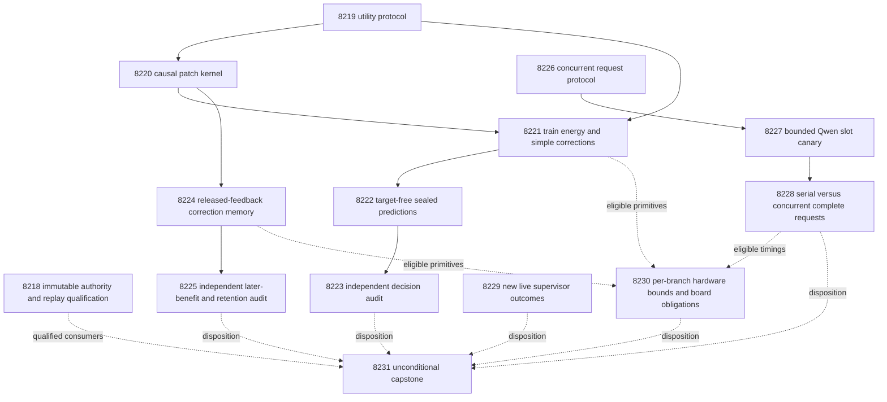

# Carnot Research Roadmap v710 — Utility corrections and acquisition cost

**Created:** 2026-10-06. **Milestone:** 2026.10.710.
**Title:** Utility-calibrated energy corrections, delayed learning, and concurrent acquisition.
**Status:** Proposed; not activated. No experiment is executed by this planning change.
**Previous design:** `research-roadmap-v709-preserved-20261006.md` preserves V709 byte for byte.

The contract contains **14 tasks, Exp8218 through Exp8231**, in that order.
Four phases contain **3, 3, 4 and 4 tasks**. The table, complete JSON contract,
canonical digest and `research-roadmap-next.yaml` contain the same task objects.

## What v709 proved

All thirteen scheduled tasks produced primary artifacts. The completed archive
currently ends at V708. V709 evidence comes from the active roadmap, original
artifacts and conductor log. Some completion clocks fall on October 7 UTC.
Execution completion is separate from scientific success.

| Evidence | Finding | Consequence |
|---|---|---|
| Exp8205 | Authority and consumer qualification passed as circular-positive evidence | Reuse the corrected readers; preserve historical failed dispositions. |
| Exp8206 | Real hard-exit coverage and exact recovery qualified | Reuse the recovery mechanism; no new generic crash framework. |
| Exp8207–8209 | Restricted policy, fitted heads and predictions sealed | Reuse original source roles, features, missingness and acceptance permissions. |
| Exp8210 | H1 failed benefit thresholds; terminal audit also disqualified through a wrong frozen replay CLI | Preserve the original failure. Qualify repaired CLI separately before citing replay evidence. |
| Exp8211–8212 | Causal learning executed; error-selected centers did not improve later decisions | Replace center selection with bounded utility corrections, keeping strong controls. |
| Exp8213–8214 | Prospective recorder qualified; 21 of 24 service sources completed | Test the dominant acquisition work with independent requests. |
| Exp8215 | Real supervisor authority qualified; zero new outcomes | Reuse its frontier and exit early when no new bytes exist. |
| Exp8216 | Board obligations and CPU workload boundaries qualified | Preserve each board independently of scientific branch failure. |
| Exp8217 | Capstone disqualified on owned validation and producer code-hash drift | Reproduce the affected-reader failure and bind immutable producer code. |

Exp8210's retained H1 operands report mean cost gain **0.00390625** over restricted
logistic, lower one-sided bound **-0.01171875**, and only **3** improved sources.
There were **97** complete sources among **128** intended slots. This failed the
registered benefit gate. These are historical disqualified audit operands, not
new qualified results. The repaired audit CLI exists; a new qualification must
not overwrite or silently upgrade the original primary.

Exp8212 is a qualified scientific null. Error-selected centers had mean later
cost **0.5443038**, versus **0.5126582** for fixed centers on complete sources.
The paired gain was **-0.0316456**, with lower bound **-0.090625** and **zero**
improved source averages. Support was adequate: 158 complete sources, 77/81 by
class. Retention qualified against the old frozen baseline. That does not erase
the loss against fixed centers or establish a general learning benefit.

Exp8214's shared-acquisition latency ratio was **0.9968**, interval
**[0.9844, 1.0112]**. Removing all measured Python scoring could yield at most
**1.000077864x** under its accounting assumptions. Acquisition and durable host
work dominate. This was a designed workload with shared generation, not two
independent deployment services. Neither Rust's 10x goal nor a hardware speedup
was established.

## Three largest gaps to the PRD

1. **FR-06/12: decisions that use verification evidence well.** Calibrated
   source evidence still lacks useful incremental action value. Test bounded
   utility corrections on an energy head and on equally corrected simple heads.
   Preserve independent labels, action costs and the acceptance permission mask.
2. **FR-11: persistent learning that improves later queries.** Recovery now
   works, but adding error-selected centers failed. Test released-label residual
   corrections, shared global calibration and genuinely later admission labels.
   Require later decision benefit and independent retention.
3. **FR-05/08 and NFR-01: meaningful deployment efficiency.** Faster scoring
   cannot materially improve the measured workload. Test independent serial and
   concurrent acquisition while measuring whole requests. Preserve Rust parity
   and the original 10x target; concurrency alone cannot satisfy that target.

The research program still prioritizes faithful constraint extraction. The plan
uses the qualified sentence transport, without treating its semantic judgments
as truth. It develops an off-ARC decision capability; no transfer to the live ARC
policy is assumed. ARC generalization and every attached-board obligation retain
explicit tasks. Retired generic external-text reranking, generator training and
public-game re-solving remain outside scope.

## Research incorporated before design

The V710 source scan was appended to `research-references.md` before this design.
It covers every requested primary topic and secondary channel. New methods are
adaptations, not imported Carnot results.

| Primary source | Use | Limit |
|---|---|---|
| [Utility calibration, 2510.25458](https://arxiv.org/abs/2510.25458), [AISTATS 2026](https://proceedings.mlr.press/v300/hegazy26a.html) | Exp8219–8225 test finite residual witnesses and bounded probability patches | Use a fixed finite dictionary; do not claim the paper's full method or guarantees. |
| [Calibrated multiaccuracy, 2504.15206](https://arxiv.org/abs/2504.15206) | Global-only, local-only and combined controls | Theory does not establish validity on this exposed delayed stream. |
| [Continual Calibration, 2604.23987](https://arxiv.org/abs/2604.23987) | Separate later utility and retained uncertainty | No generator tuning or exchangeability claim. |
| [EBT, 2507.02092](https://arxiv.org/abs/2507.02092) and [ARM/EBM, 2512.15605](https://arxiv.org/abs/2512.15605) | Small conditional energies and equivalent probability controls | Taking negative logs creates no independent verifier advantage. |
| [FPGA decomposition, 2602.15985](https://arxiv.org/abs/2602.15985), [Extropic Z1T](https://extropic.ai/writing/z1t/) | Complete-workload and operator-mapping bounds | Vendor projections do not establish access or Carnot speed. |

NSVIF, neural constraint acquisition, KAN/KAC, neural Ising dynamics and ETS
were checked. They remain references rather than additional speculative task
branches. HalluTruthQA-4K and MPMMine are later corpus leads requiring licensing,
exposure and task-fit checks. No fresh-data claim follows from their discovery.
OpenReview presented browser challenges. Semantic Scholar citation requests for
both named papers failed, leaving citation coverage incomplete. Hugging Face
provided discovery leads checked against primary papers. GitHub Trending pages
were three weeks stale. Kona supplied no reproducible new local training recipe.

## Architecture

Solid arrows are structured gates. Dotted arrows are evidence use, not hidden
prerequisites. Administrative qualification cannot block every science branch.
Static fitting cannot block the independent learning stream. Valid nulls remain
eligible for audits. ARC, board custody and capstone run unconditionally.

## Phase 1 — Qualify evidence and freeze the changed mechanism

**Exp8218** binds fourteen tasks and authenticates historical replay. It uses
parameterized authority readers. It reproduces the exact affected-consumer
failure from Exp8217's log, then qualifies repaired consumers with immutable
producer code. It also exercises Exp8210's corrected frozen CLI privately.
Historical failed artifacts retain their verdicts.

**Exp8219** freezes the finite utility-correction protocol. It reads fit/tune
residuals only. Its method file is
`openspec/change-proposals/v710-utility-patch-protocol.json`. The baseline
probability defines five intervals: [0,.1), [.1,.25), [.25,.5), [.5,.75),
[.75,1]. The dictionary contains these intervals, the global group, and each
interval intersected with the original baseline reject action. Duplicate public
fit membership vectors are removed in fixed order. This yields at most eleven
predicates; no source ID or label-derived predicate is permitted.

For current probability p, group g and n fit rows, compute
r_g = sum(g_i * (y_i-p_i))/n. Require at least eight distinct group members.
Choose largest absolute r_g, with fixed-order ties. Set
`delta = clip(0.5 * mean(y-p within group), -0.05, 0.05)`.
Update group members with `clip(p+delta, 1e-6, 1-1e-6)`. Stop when the largest
eligible absolute residual is at most .01 or four patches have been proposed.
This is a fixed-dictionary adaptation of utility patching. The binary costs are
affine in y, so group probability residuals also identify action-cost residuals.
Escalation's fixed cost supplies no truth information.

Encode the resulting conditional energies as
`E_good=-log(1-p)` and `E_bad=-log(p)`. The patch coefficients are learned;
these energies are not a new correctness oracle. Direct probabilities and
normalized energies must match at 1e-10. Utility calibration is measured against
this finite registered dictionary; it is not full calibration over all groups.

**Exp8220** qualifies the patch evaluator and delayed state machine on private
fixtures. It reuses real exit73 coverage from Exp8206. It checks normalization,
clipping, support, empty/duplicate groups, no-write rejection, delayed admission
and complete resumed state. Fixtures must exercise an admitted change before at
least 32 later decisions. Fixture credit is circular-positive only.

## Phase 2 — Train corrections, seal predictions and measure decisions

**Exp8221** trains on the original fit roles and selects patch depth 0–4 on
original tune roles. It preserves the authenticated V709 base heads. The arms
are original energy/simple, global-only correction on each, group correction on
each, local-only, and random-group controls. Global means the all-source group;
local-only excludes that group. Group correction may choose either. Random
controls draw supported predicates without inspecting residual magnitude, then
fit their coefficient on the same labels. All receive the same four-step and
label budgets. Seeds 101–120 describe random-control variability only.

Choose the simple/global primary comparator by tune cost, then Brier, then
fixed arm name. The equally group-corrected simple head remains a mandatory
comparison, even if another comparator wins tuning. Freeze the entire selection
rule and selected arm before reserved evaluation. A zero-patch optimum is valid.

**Exp8222** issues target-free predictions for every original reserved slot.
It retains all 128 slots and missingness. No new capture or replacement source
is allowed. Seal probabilities, actions, permissions and state hashes before
opening evaluator labels. The invocation's ordering does not undo historical
exposure.

**Exp8223** independently recomputes H1. It distinguishes useful calibration
from an energy-specific gain. A patch helping only the simple head cannot be
called an energy advantage. It uses the corrected audit-specific replay CLI and
rejects rehashed aggregate mutations.

Actions minimize expected cost: accept=5*p_bad, reject=1-p_bad, escalate=.5.
Accept is allowed only for sources accepted by the original frozen V707 baseline.
Reject and escalate remain available. Ties and missing evidence escalate.
This bounds false-accept count relative to the baseline accepted set. It does
not certify that baseline or bound error rate among the remaining accepts.

## Phase 3 — Test continuous learning and qualify acquisition concurrency

**Exp8224** runs an independent Tier-1/Tier-2 learning experiment. It starts
from the historical Qwen offset, not the static fit. Arms are frozen,
global-only, global-plus-group, local-only and global-plus-random-group.
Global scale/intercept fitting uses the qualified convex optimizer on released
update rows. Global-only then receives four all-source patch steps. Local-only
omits global fitting and the all-source predicate. Local correction uses the registered finite dictionary and four
patches per opportunity. It replaces error-center growth; it does not merely
increase the old center budget.

Keep the original 256-slot stream, 20-slot label delay, public warmup slots1–64,
SHA256 role assignment and candidate opportunities64/144. Use the newest64
released update-role rows. Commit a candidate before choosing its next12 unused
admission rows, whose labels release strictly later. Require two labels per
class. Expire candidates at144/224. Interpolation uses the original grid
1/.5/.25/.125. For the patch representation, interpolate final probabilities
between incumbent and candidate; serialize that mixture exactly. Admission
requires no extra false accepts and no cost/Brier worsening versus incumbent,
plus original frozen-head bounds of .02 cost and .01 Brier. Admission labels
never fit the patch. No admitted candidate is also a valid outcome.

Persist predicates, ordered deltas, global parameters, mixtures, issue state,
pending labels, consumed IDs, RNG and missing masks. Two opportunities allow at
most eight ordered patch operations. Do not merge clipped operations unless
exact equivalence holds. Measure CPU update time and state bytes. This is a
hardware-compatible lookup/add representation, but durable storage costs remain.

**Exp8225** independently evaluates the original 192 later slots65–256 and
64 retention sources. Seeds are averaged inside each source. The all-slot cost
endpoint retains missing observations at escalation cost. Retention labels open
only after final heads and predictions are sealed. Compare retention to both
frozen and global-only, rather than claiming success only against a weak offset.

**Exp8226** qualifies request accounting with a private scripted HTTP peer.
It uses the existing llama.cpp server with two slots in both arms; client
concurrency changes from1 to2. It freezes four canary sources and 24 separate
measurement sources from fit identities in hash order. It tests interleaving,
identity isolation, queued failure and recovery. Its protocol is
`openspec/change-proposals/v710-concurrent-acquisition-protocol.json`.

**Exp8227** runs the bounded real-Qwen canary: eight calls, at most128 output
tokens per call, 120-second request timeout and 900-second measurement cap.
Require at least three complete source pairs, both slots exercised and no
identity cross-talk. Record output differences; do not infer speed or accuracy
from four sources. No CPU or small-model fallback may impersonate the mandate.

## Phase 4 — Measure complete requests and reconcile every branch

**Exp8228** runs two 24-source sweeps per acquisition arm: serial/concurrent,
then concurrent/serial. Each request has a separate real generation, for96 calls.
Per-source seed, model, prompt and decode settings stay fixed across arms.
Output identity and schema checks remain visible. Queueing, startup, generation,
normalization, Rust binding, fsync, checkpoint and shutdown receive actual clocks.
The total measurement cap is3000seconds; unfinished slots stay censored.

Report warm throughput and actual cold-inclusive workload makespan separately.
Charge one measured startup per arm workload; report sweep startup policy in the
frozen protocol. Repetitions create no new independent sources. At least20 source
pairs are needed for descriptive source-resampled latency intervals. Two sweeps
cannot support a population confidence interval for throughput. A timing gain
with lower valid completion count is not a qualified service improvement.
Holding Rust service fixed means this comparison cannot satisfy NFR-01's10x
Rust-versus-Python requirement. It is still a designed workload.

**Exp8229** reads only authenticated ARC supervisor outcomes after Exp8215's
frontier. It checks the solve registry and proposes transferable selection over
existing curated arms only if new outcomes exist. An empty frontier is an
immediate valid null satisfying the ARC floor. No model, game, adapter, default
priority, new arm or leaderboard submission changes in this task.

**Exp8230** evaluates each available branch independently. It maps correction
lookup/add work to possible CPU/Rust/FPGA implementations, measures numerical
fallback on recorded inputs, and bounds complete-workload acceleration. Missing
service evidence cannot erase the separate KV260, PolarFire and GateMate rows.

**Exp8231** runs unconditionally. It accounts for all14 scheduled outcomes,
reconstructs H1/H2, preserves disqualification and computes the existing stable
G1–G4 publication gate. Its additional deliverable is
`docs/research-notes/v710-outcomes.md`. It records exact repeated-verdict
retirement with scope-specific reopening conditions. Unchanged external blocks
use `blocked`; failed owned validation uses `disqualified`, never `partial`.

## Dependency graph and producer field contract

Every listed gate also checks `verdict_class in [positive, null, circular_positive]`
and `flagged_adversarial == false`. Each readiness score requires passing owned
validation; consumers also authenticate the Boolean `required_checks_passed`. Consumers authenticate terminal sidecars and
claim scope. A fixture score cannot stand in for natural scientific evidence.
Readiness is separate from scientific benefit, so qualified nulls continue.

| Consumer | Same-roadmap readiness prerequisites |
|---|---|
|8218,8219 | None |
|8220 |8219.utility_protocol_ready_score |
|8221 |8219.utility_protocol_ready_score;8220.patch_kernel_ready_score |
|8222 |8221.utility_fit_ready_score |
|8223 |8222.utility_predictions_ready_score |
|8224 |8220.patch_stream_ready_score |
|8225 |8224.utility_trajectory_ready_score |
|8226 | None |
|8227 |8226.concurrent_protocol_ready_score |
|8228 |8227.concurrent_canary_ready_score |
|8229,8230,8231 | None; optional branch evidence is checked locally |

All readiness values above must equal1. The exact field appears in its producer
prompt's REQUIRED ARTIFACT FIELDS. No gate or requires-chain points to a retired
or out-of-roadmap task. Missing historical prerequisites are diagnosed inline.
An absent field is a broken contract; a present zero is a measured failed gate.
Both retain the exact operand in `gate_check_summary`.

## Statistical contract and stop rules

| Requirement | H1: static group correction | H2: delayed correction memory |
|---|---|---|
| Primary comparison | Group-corrected energy vs tune-selected simple/global comparator | Global-plus-group vs global-only |
| Original universe |128 reserved slots |192 later original slots |
| Complete paired support |>=96 sources and12/class |>=128 sources,8/class,8 nonoverlapping16-slot blocks |
| Cost success |One-sided97.5% lower gain bound>.02;>=5 improved sources |Same |
| Resampling |10000 paired source-cluster draws |10000 original-slot moving-block draws, length16;8/32 sensitivity |
| Valid draws |>=9500 |>=9500 |
| Calibration protection |Brier increase<=.01 vs primary |Same |
| False accepts |No increase vs primary or original baseline |No per-seed increase vs global-only; frozen permission prevents new accepts |
| Other controls |Cost increase<=.02 vs original baseline and equally patched simple |Cost increase<=.02 vs frozen and random-group |
| Retention |Not used for static selection |64 sources,>=48 complete,8/class; no extra false accepts, Brier+.01/cost+.02 at most vs both frozen/global-only |

Only H1/H2 are benefit hypotheses. Bonferroni alpha=.025 each keeps their family
alpha at.05 without dropping a failed branch from the family. These are finite
exposed-development comparisons, not new population guarantees. Timing and
utility-witness summaries remain descriptive; exploratory arms cannot replace
the primary after labels open.

For the learning stream, the acceptance permission comes from that stream's
frozen offset decisions, not the separate static V707 cohort. This keeps the
learning branch independent. Every learning arm uses the same frozen permission.
All-slot costs include unavailable source slots as escalation cost. Brier and
utility residual metrics require labels and retain their explicit denominator.
Report complete-case diagnostics separately. Labels are source annotations,
not executable semantic ground truth.

A resource failure stops only dependent work. No task replaces missing data,
changes a threshold after evaluation, invents a gate operand, or sleeps to meet
a duration floor. A valid scientific null is terminal. Repeated failed scopes
carry `retire_if_same_verdict: true`; no third identical attempt follows.

## Hardware requirements and runtime budget

| Tasks | Resources | Bound |
|---|---|---|
|8218–8226 |CPU, existing numerical environment and private storage |25–45min estimates; numerical fitting600s and learning1200s caps |
|8227 |One free RTX3090, cached Qwen GGUF, private two-slot server |30min estimate;900s measurement cap |
|8228 |Same device class and owned server, existing Rust extension |65min estimate;3000s measurement cap plus bounded validation |
|8229 |CPU and authenticated live receipt files |15min; immediate exit for unchanged frontier |
|8230 |CPU and historical board evidence |25min; no board access |
|8231 |CPU and immutable primitives/receipts |45min estimate |

The host has two24GB RTX3090s. The mandate is
`unsloth/Qwen3.8-27B-GGUF`, Q4_K_M, roughly16GB plus runtime/KV memory.
Both model tasks declare `model_bounded_generation` with a10-second floor.
No task requests a full generative run or an embedding-only load. Those classes
would be `model_full_generation` at60s and `model_load_no_generation` at2s.
All other tasks declare `no_model_load`, empty MODEL_SPECS and zero current calls.
Legacy small models may only be CPU fixtures, never headline substitutes.

Preflight must prove two-slot memory capacity without evicting live ARC work.
No task requires dual-GPU integration, an additional model, a purchase or a new
model download. The canary may block honestly if the installed server cannot
support the frozen configuration. Do not silently reduce context per request.
The total estimate is510minutes across14 tasks; every task remains below the
4800-second conductor hard cap. Structured gates skip ineligible descendants.

KV260 retains historical fabric scope with `k_max<=5`; a new device claim needs
SSH/device transcripts and transfer-inclusive timings. PolarFire remains Linux
CPU-only dispatch until fabric evidence exists. GateMate retains its physical
JTAG blocker until a dated cable/port/power change. NPU and TSU access remain
unqualified. The wishlist is monitored; a purchase cannot fix calibration or
an acquisition-dominated workload. A100x learning path is an architectural target,
not an achieved service bound.

## Failure discipline, routing and execution

Each task carries the four required prior-failure fields, including exact prior
verdict and `retire_if_same_verdict: true`. The changed mechanisms are explicit:
immutable historical replay, finite utility patches, released-label correction
memory, and independently executed concurrent acquisition. Reused positive
mechanics are not proposed as new scientific wins. The ARC frontier review is
anti-churn: no new evidence means no implementation or rerun.

The manifest was read before design. This plan does not reopen retired generic
text reranking, unchanged importance anchoring, four-expert reweighting, compact
span capture, or any retired ARC generation lever. No retired experiment ID is
reused. Historical failure references are evidence, not execution dependencies.
Any newly detected scope match must be resolved before activation, not hidden
by changing a task title or inventing operator permission.

Routing follows this request's current instructions. Schema/receipt coordination
in8218/8226 uses Opus with100turns. Formulaic patch mechanics and prediction
transport in8220/8222, and the established bounded canary in8227, use Codex
`gpt-6.1-sol`. Other research uses the default backend. ARC's bounded evidence
review gets20turns; ordinary research stays at50. No Luna or Gemini task is
scheduled. Older repository routing defaults do not override this request.

Every prompt requires numbered progress and file-size steps. Flush at each
phase boundary and before/after model load, generation, benchmark and subprocess.
Emit real counts inside loops and heartbeat at most every60seconds while waiting
on children. Keep all output gaps below600seconds. Split files above about200
lines into tool writes of at most about150lines, with progress between calls.
Use bounded process groups and preserve actual exit status. No terminal artifact
may be a bootstrap-only declaration of success.

## Verification and reconciliation

Planning changes only documents, specifications and the staged task contract.
The active `research-roadmap.yaml` and `scripts/research_conductor.py` remain
byte-identical. The preserved V709 design remains byte-identical to its original.
No tasks are activated, model runs started, board commands issued or changes pushed.

Validate with the existing roadmap schema, prior-failure, exclusion-manifest,
harness-fit, ARC-floor and priority checks. Use the parameterized contract parser
and authority reader with milestone2026.10.710, first_id8218 and count14. Test a
private matching activation copy; the real active milestone must remain V709.
Exercise negative mutations of count, order, title, prompt, gate spelling, model,
deliverable and digest. Also verify placeholder formatting and all producer-field
spelling. Run focused unit tests and E2E-018's private CLI tests, then scoped lint
and spec coverage. Preserve broader repository failures as separate diagnostics.

Experiments must extend their detailed specs before implementation and write
tests first. Each owns100percent measured changed-code coverage, including actual
CLI/child paths; Ruff, strict mypy, spec tracing and affected E2E checks. Native
code changes require cargo tests, fmt, clippy and real loaded-binding parity.
The plan reuses the current native service and does not require a new Rust port.
Every producer cold-replays immutable primitives and passes unchanged terminal,
adversarial and strict row validators before atomic publication.

Reconcile `openspec/`, `_bmad/traceability.md`, `ops/status.md` and
`ops/changelog.md` without deleting history. Record the three PRD gaps, failed
hypotheses and specific reopening conditions. Planning completion is not
scientific completion or publication readiness.

