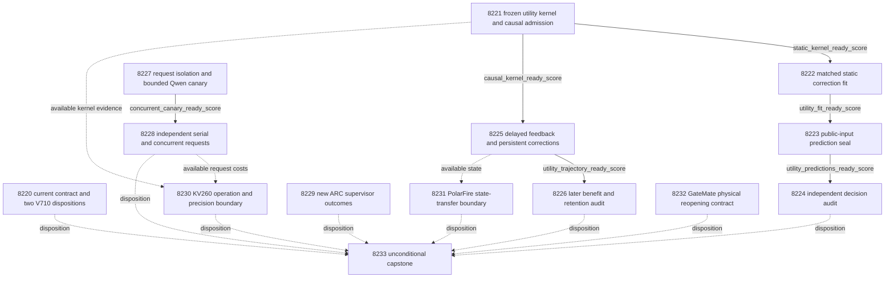

# Carnot Research Roadmap v711 — Execute utility corrections

**Created:** 2026-10-06. **Milestone:** 2026.10.711.
**Title:** Execute utility corrections, test delayed learning, and measure acquisition concurrency.
**Status:** Proposed. This planning change runs no research experiments and does not activate the roadmap.
**Previous design:** `research-roadmap-v710-preserved-20261006.md` preserves V710 byte for byte.

The execution contract contains **14 tasks, Exp8220 through Exp8233**, in that
order. Four phases contain **2, 3, 3 and 6 tasks**. The visible table, complete
JSON contract and `research-roadmap-next.yaml` contain exactly the same tasks.
The canonical digest binds every task field, including each full prompt.

## What V710 proved

V710 activated **two tasks**, Exp8218 and Exp8219. Its design promised fourteen,
Exp8218–8231. Twelve design entries never entered its execution YAML. The
conductor log records two completions. The completed archive currently ends at
V709; V710 evidence comes from its active YAML, primary artifacts and log.
Some completion timestamps are October 7 UTC. Completion is not scientific success.

| Actual evidence | Finding | Next consequence |
|---|---|---|
| Exp8218 contract/replay qualification | `complete_disqualified_original_code_bytes`; both readiness scores are zero; 356 failed checks, including 353 original-code checks | Preserve the failure. Qualify current authority prospectively without another archive-wide reconstruction. |
| Exp8219 utility methods | `complete_null_utility_patch_methods`; `utility_protocol_ready_score=1`; owned checks pass | Execute this frozen method. No utility or learning improvement was measured. |
| V710 unexecuted design | Kernel, fits, seals, learning, concurrency and capstone were proposals only | New tasks may use their rationale, never cite them as completed prerequisites. |

V709 remains the latest numerical baseline. Exp8212 found later mean cost
0.5443038 for error-selected centers versus 0.5126582 for fixed centers. Its
paired gain was -0.0316456. The qualified result is a learning null. Exp8214's
shared-acquisition latency ratio was 0.9968, interval [0.9844, 1.0112]. Eliminating
all measured Python scoring could yield only about 1.000078x under that workload.
These motivate a changed correction mechanism and acquisition-level measurement.

Exp8210's original primary remains disqualified. Its retained H1 operands had
cost gain 0.00390625 and lower bound -0.01171875 across 128 intended slots,
with 97 complete sources. The repaired audit CLI is reusable; its repair does
not retroactively qualify that historical primary. Exp8215's authoritative
ARC frontier has no new supervisor outcomes at its recorded boundary.

## Three biggest gaps to the PRD

1. **FR-06/12: useful verified decisions.** Current evidence does not establish
   useful incremental action value over matched simple heads. Train bounded
   corrections on existing sentence/verifier evidence. Test actual decision cost,
   calibration and false accepts. Extraction quality remains a limiting input.
2. **FR-11: persistent learning that benefits later queries.** Recovery works,
   but error-center growth lost to fixed centers. Replace it with released-label
   residual corrections. Require later decision benefit and independent retention.
3. **FR-05/08, NFR-01: deployment gains at request scale.** Scoring is a tiny
   part of prior request cost. Measure independent serial/concurrent generation
   and durable service costs. Preserve the unmet 10x Rust target separately.

The north star remains live ARC hidden-game discovery. Its reserved task uses
new environment-grounded outcomes for transferable supervisor selection. The
static and continual decision experiments remain off-ARC. Neither implies ARC
transfer. No generator training, retired generic text reranking, energy-as-
generator experiment or repeated public-game solve is included.

## Research incorporated before design

The V711 source scan was added to `research-references.md` before these tasks.
It checks all eight requested topics and all secondary channels.

| Source | Experiment use | Claim boundary |
|---|---|---|
| [Utility calibration, 2510.25458](https://arxiv.org/abs/2510.25458) | Exp8221–8226 execute the bounded finite-group adaptation frozen by Exp8219 | This is an empirical adaptation, not the paper's full algorithm or theorem. |
| [Global calibration and multiaccuracy, 2504.15206](https://arxiv.org/abs/2504.15206) | Global-only, local-only and combined controls | Delayed exposed streams do not inherit population guarantees. |
| [Online recalibration, 2607.19689](https://arxiv.org/abs/2607.19689) | Exp8226 separates calibration, excess Brier loss and action cost | No approachability algorithm or regret-rate claim is made. |
| [Environment-grounded auditing, 2609.00652](https://arxiv.org/abs/2609.00652) | Exp8229 distinguishes supervisor self-reports from actual progress | Observational redirects do not establish causal arm superiority. |
| [KAN forgetting, 2511.12828](https://arxiv.org/abs/2511.12828) | Independent retention remains mandatory | Local support alone does not prevent forgetting. |
| [FPGA co-design, 2602.15985](https://arxiv.org/abs/2602.15985), [Extropic Z1T](https://extropic.ai/writing/z1t/) | Exp8230–8232 preserve operation, transfer and physical-access boundaries | Vendor estimates are not Carnot device timings. |

EBT, ARM/EBM, NSVIF, neural constraint acquisition, neural Ising machines, ETS,
KAC and recent hallucination work were checked. New detector/corpus leads remain
future work until licensing, exposure, feature access and task fit are established.
The current scientific method stays frozen. OpenReview returned a browser
challenge. Semantic Scholar citation-list requests for both anchor papers failed;
citation coverage is incomplete. Hugging Face supplied discovery indexes.
GitHub Trending responses were three weeks stale. Kona supplied architecture
positioning but no checked executable local recipe.

## Architecture and dependency graph



Solid arrows are structured gates. Dotted arrows are optional evidence use.
Missing optional inputs stay visible and do not erase board obligations.
The administrative task cannot block the science branches. Static fitting cannot
block the independent delayed stream. Valid nulls continue to their audits.

## Phase 1 — Bind the current contract and qualify the frozen kernel

**Exp8220** records the two actual V710 outcomes and the twelve unexecuted design
entries. It binds all fourteen V711 tasks using current authority readers.
It snapshots current owned sources before validation. Historical missing original
bytes retain their failed or unavailable status. This is a narrower current
custody task, not another historical reconstruction or scientific prerequisite.

**Exp8221** implements and tests the frozen Exp8219 patch evaluator and causal
admission state. It adds `v711-execution-bindings.json` with only protocol hashes
and task-ID mappings. The V710 protocol remains byte-identical. No statistical,
source-role or numerical choices change because tasks moved to V711.

The public baseline probability defines five intervals: [0,.1), [.1,.25),
[.25,.5), [.5,.75), [.75,1]. The registered dictionary includes the global group
and interval/reject intersections, with duplicate public fit vectors removed.
Use the actual frozen dictionary, not a reconstructed label-selected dictionary.
For each group, compute `sum(g*(y-p))/n_all_training_rows`. Require eight distinct
members. Select the greatest absolute residual; break ties by fixed group order.
Apply `delta=clip(.5*mean(y-p within group),-.05,.05)` to group members, then clip
probabilities to [1e-6,1-1e-6]. Stop at residual<=.01 or four steps.

Serialize `E_good=-log(1-p)` and `E_bad=-log(p)`. Direct probability and normalized
energy must agree at 1e-10. The energy representation provides no extra truth.
Qualify sequential clipping, empty support, failed admission, real hard exit
and exact recovery on private fixtures. Fixtures must admit a change before at
least 32 later decisions. Their verdict is circular-positive mechanics only.

## Phase 2 — Fit, seal and independently audit static decisions

**Exp8222** fits the fifteen registered arms: energy, additive and logistic,
each with original, global, group, local and random correction. Preserve labels,
features, permissions and the four-step budget. Random controls select supported
groups without residual-magnitude access. Seeds101–120 add no independent sources.
Choose depth 0–4 using original tune roles. Zero patches is a valid optimum.

Select the comparator from the protocol's exact eligible list:
`additive_original`, `logistic_original`, `energy_global`, `additive_global`,
`logistic_global`. Minimize all-slot tune cost, then Brier, then fixed name.
Keep equally group-patched additive/logistic comparisons mandatory. Freeze all
selection before reserved evaluation. Do not refit the base heads or change roles.

**Exp8223** seals public-input predictions for all 128 original reserved slots.
Missing sources remain present. The worker cannot read evaluator labels.
Minimize expected costs accept=5*p_bad, reject=1-p_bad, escalate=.5. Accept only
within the original V707 accepted set; ties and missing evidence escalate.
This restricts false-accept count, not conditional precision or baseline truth.

**Exp8224** opens labels after authenticating the seal and independently tests
H1. It uses its own frozen audit CLI, including fresh-process tamper checks.
It separates an energy-specific advantage from improvements shared by simple
heads. Reusing exposed data remains development evidence, even with a new seal.

## Phase 3 — Test continuous learning and qualify independent acquisition

**Exp8225** implements FR-11 through persistent Tier-1/Tier-2 corrections. It
starts from the historical Qwen offset, independently of static fitting.
Arms are frozen, global-only, global-plus-group, local-only and global-plus-random.
Global arms retain the qualified scale/intercept optimizer. Global-only receives
four all-source patch steps. Other adaptive arms receive the same four-step
budget on their registered dictionaries. This replaces error-selected centers.

Keep the original 256 slots, delay 20, warmup 1–64, SHA256 role assignment,
update opportunities 64/144 and expiry 144/224. Use newest 64 released update rows.
Commit candidate bytes before selecting twelve unused future admission rows.
Require two labels/class. Admission labels never fit a patch. Interpolate final
probabilities on the fixed 1/.5/.25/.125 grid. Require no extra false accepts
or cost/Brier worsening against the incumbent, plus frozen-head limits of
.02 cost and .01 Brier. No admitted candidate is a valid null outcome.

Save global parameters, predicates, ordered clipped deltas, exact probability
mixtures, pending predictions/labels, consumed IDs, missing masks and RNG state.
Use real exit 73 at slots 90/170 with Coverage.py `patch=_exit`. Compare complete
resumed state with uninterrupted execution. Measure update/lookup cost and bytes.
At most eight ordered patch operations arise from two opportunities. The state
has a CPU/Rust lookup-and-add path and possible device mapping; 100x acceleration
is a target to bound, not an achieved result.

**Exp8226** audits 192 later slots 65–256 and 64 separate retention sources.
It opens retention labels only after final heads and predictions are sealed.
Report calibration residuals, excess Brier loss and actual action cost separately.
Test retention against both frozen and global-only predictors. Recovered state,
changed probabilities or lower residual calibration cannot alone satisfy H2.

**Exp8227** qualifies request isolation before a bounded real-Qwen canary.
Freeze four canary and24 disjoint measurement sources from public fit identities.
Use a private scripted HTTP peer to test interleaving, queues, failure and resume.
Then run eight real requests, at most128 output tokens each, with 120-second
request deadlines and 900-second measurement cap. Require three complete pairs,
both slots exercised and no identity cross-talk. No speed claim follows.

Use one free RTX3090 and a private llama.cpp server with two 4096-token slots
in both arms. Only client concurrency changes,1 versus2. Preflight memory and
leases; do not disturb live ARC. Freeze the protocol before any timing evidence.
No cache miss, occupied device or unsupported server authorizes model substitution.

## Phase 4 — Measure service costs and retain every independent obligation

**Exp8228** runs 24 sources per arm across two sweeps: serial/concurrent followed
by concurrent/serial. Each of 96 calls generates independently. Start and stop a
fresh server for each sweep/arm workload, charging all four cold starts and
shutdowns, two per arm. At most two generation slots run concurrently on one GPU.
Use matching per-source prompts/seeds, temperature 0 and 128 output tokens.
Disable request/prefix reuse. Hold the existing Rust durable service fixed.

Measure issue, queue, generation, normalization, dispatch, fsync and shutdown.
Cap measurement at 3000 seconds and retain censored slots. At least 20 paired sources
support descriptive source-resampled latency intervals. Report warm throughput
and cold-inclusive makespans separately. Two sweeps cannot establish population
throughput confidence. Fewer valid completions disqualify a faster-arm claim.
Schema validity does not establish answer quality. This comparison cannot prove
10x Rust-versus-Python performance because Rust is held fixed.

**Exp8229** inspects only new authenticated ARC supervisor outcomes after
Exp8215. No new bytes or firings yields an immediate valid null. Actual environment
progress, arm support and cross-game overlap govern any selection recommendation.
Self-reports remain descriptive. No games, models, adapters, live priority changes
or solves are run. `solve_claims=[]` and `credited_new_levels=0`.

**Exp8230** gives KV260 a separate operation and precision boundary. Compare
FP64 with a Q16.16 lookup/add reference on available frozen rows. Measure action
changes and fallback. Unsupported operations stay CPU; no approximation deploys.
Bound full-request gains with measured eligible fractions and transfer obligations.
Retain k_max<=5 and historical fabric scope. No new RTL or board probe is scheduled.

**Exp8231** gives PolarFire a separate state-transfer contract. Measure host
serialization bytes and exact decode parity on available correction states.
Specify hash/version checks, durable commit and restart. Preserve CPU-only Linux
evidence. Neither host timing nor link-rate estimates become board performance.

**Exp8232** preserves GateMate's `0xffffffff` physical block and writes a concrete
reopening contract. It records dated cable/port/power evidence if present, without
retrying JTAG. An unchanged external block is terminal `blocked`, not `partial`.

**Exp8233** runs regardless of branch gates. It accounts for thirteen upstream
outcomes plus its own execution row. It recomputes eligible H1/H2, preserves failed
and missing operands, reports each board and ARC, and runs the stable G1–G4 gate.
It writes `docs/research-notes/v711-outcomes.md`. It cannot promote historical
failures or pretend the unexecuted V710 tasks produced evidence.

## Gate fields and execution order

Every structured prerequisite also requires `required_checks_passed == true`,
`flagged_adversarial == false` and `verdict_class in [positive, null, circular_positive]`.
Consumers authenticate terminal sidecars, source bytes and claim scope.
Every field below appears verbatim in its producer's REQUIRED ARTIFACT FIELDS.

| Consumer | Same-roadmap prerequisite, each equal to 1 |
|---|---|
| Exp8222 | Exp8221.static_kernel_ready_score |
| Exp8223 | Exp8222.utility_fit_ready_score |
| Exp8224 | Exp8223.utility_predictions_ready_score |
| Exp8225 | Exp8221.causal_kernel_ready_score |
| Exp8226 | Exp8225.utility_trajectory_ready_score |
| Exp8228 | Exp8227.concurrent_canary_ready_score |
| Exp8220,8221,8227,8229–8233 | No structured gate; authenticate required historical or optional branch inputs locally |

There are no out-of-roadmap or retired execution dependencies. Historical IDs
appear as provenance and prior-failure records only. A missing gate field is a
contract defect; a present zero is a failed qualification. Preserve the exact
operand and observed value in `gate_check_summary`. Never rename readiness fields.

## Statistical contract and stop rules

The frozen Exp8219 protocol owns all numerical choices. The task-ID mapping
changes execution ownership only. H1/H2 remain the two benefit hypotheses.
Bonferroni one-sided alpha=.025 each preserves family alpha=.05. A blocked branch
does not donate its alpha. Other comparisons are controls or descriptive checks.

| Requirement | H1 static correction | H2 continual correction |
|---|---|---|
| Primary comparison | energy_group vs frozen tune-selected comparator | global-plus-group vs global-only |
| Original universe |128 reserved slots |192 later slots |
| Complete paired support |96 sources,12/class |128 sources,8/class,8 nonoverlapping16-slot blocks |
| Cost gate |One-sided97.5% lower gain bound>.02; five improved sources |Same |
| Resampling |10000 original-source cluster draws |10000 moving original-slot blocks, length16;8/32 sensitivity |
| Valid draws |At least 9500 |At least 9500 |
| Brier protection |Increase<=.01 vs primary |Same |
| False accepts |No increase vs primary or original baseline |No per-seed increase vs global-only; frozen permission restricts accepts |
| Other controls |Cost increase<=.02 vs original and equally patched simple |Cost increase<=.02 vs frozen and random-group |
| Retention |Unused for selection |64 sources;48 complete,8/class; cost+.02/Brier+.01 at most and no extra false accepts vs frozen and global-only |

All-slot costs retain unavailable decisions at escalation cost. Brier and residual
metrics use available labels with explicit denominators. Seeds and repeated
requests do not increase independent source count. Stream permissions come from
that stream's frozen offset, separate from static V707 permissions.

This is a finite exposed-development study, not an unbiased population test.
Keep independent_generalization_score and generalized_learning_benefit_score zero.
A successful H1/H2 can be reported only as a qualified development signal.
Source annotations are not an executable semantic oracle. Oracle-defined fixture
success must carry `verifier_is_oracle=true` and `verdict_class=circular_positive`.

Valid nulls finish once. Missing external prerequisites use `blocked`, never
`partial`; failed owned checks use `disqualified` and readiness zero. Every prior
failure includes its exact verdict, changed mechanism and permanent retirement
signal. If the same verdict repeats, retire that substantive scope and name a
falsifiable reopening condition. Do not reopen a retired scope by changing its ID.

## Hardware and runtime requirements

| Tasks | Resources | Bound |
|---|---|---|
|8220–8226 |CPU, existing numerical environment, private scratch and durable storage |25–50min estimates; fitting 600s; trajectory 1200s |
|8227 |One free 24GB RTX3090, cached Qwen Q4_K_M, private two-slot server |45 min estimate;900 s canary measurement |
|8228 |Same GPU class, server, existing Rust durable service |65 min estimate;3000 s measurement |
|8229 |Authenticated live receipt files, CPU |15 min; immediate exit on unchanged frontier |
|8230–8232 |CPU and historical board evidence |25/20/15 min; no new device access |
|8233 |CPU and immutable current evidence |40 min |

Total estimated work is 485minutes across 14 independently bounded tasks. Each
fits within the 4800-second conductor cap. Every prompt requires phase progress,
pre/post call lines, loop counts and 60-second child heartbeats. Keep all gaps
below 600seconds. Write files over about 200lines in multiple tool calls, with
progress between calls. Budgets are estimates, never authorization to pad time.

The host inventory provides two RTX3090s with 24GB each. This milestone uses one
free device at a time. The current model mandate is
`unsloth/Qwen3.8-27B-GGUF`, Q4_K_M, roughly16GB plus runtime/KV memory. Actual
preflight must establish available memory. Resolve the cached GGUF and embedded
chat template; no small-model fallback may become headline evidence.

Exp8227/8228 declare `model_bounded_generation` (10-second floor), because all
calls have a small fixed 128-token limit. All other tasks use `no_model_load`
and empty MODEL_SPECS. No task claims full generation or embedding extraction.
Those would require `model_full_generation` (60s) or `model_load_no_generation`
(2s), respectively. Record actual model calls, not names inherited from inputs.

The hardware wishlist does not justify a purchase here. KV260 remains limited
to its qualified fabric scope with k_max<=5; future access uses `ssh kria`.
PolarFire remains Linux CPU dispatch. GateMate requires physical-change evidence.
NPU and TSU remain unqualified. Extropic's sparse co-design is a future mapping
lead, not available local compute. All three boards have separate tasks and
cannot vanish behind a failed science gate. Whole-request bounds precede any
claim that a faster kernel achieves the learning program's 100x hardware target.

## Execution, validation and reconciliation

Routing follows this request's explicit instructions. Current schema/authority
work in 8220 and request isolation/server qualification in 8227 use `model: opus`
with 100 turns. Formulaic kernel and seal work in 8221/8223 use Codex `gpt-6.1-sol`.
Routine research uses the default backend. Short receipt/documentation audits
use 20 turns; the KV260 numerical boundary uses 30. No Gemini or Luna task is queued.
The request's routing instructions take precedence over older repository defaults.

All implementation tasks first extend an existing capability with REQ-* and
SCENARIO-* items, then write failing tests. Reuse the existing publication,
recorder, source-boundary and hard-exit mechanisms. Do not modify the conductor.
Freeze current owned validation commands before measurement. Require real CLI
and child coverage, scoped lint/type/spec checks, relevant E2E checks and fresh
process replay. Run validators against a private candidate before atomic primary
publication. Preserve historical evidence and distinguish current code snapshots
from missing historical originals. Bound unrelated repository-health diagnostics.

Planning verification uses the existing contract/authority readers, exclusion
and gate tests, scoped lint/spec checks and private E2E-018 CLI tests. It checks
full task equality, digest, sequential IDs, all gate-field spellings, model
substrates, prior-failure fields and unchanged protected files. The real active
roadmap stays V710 until a later conductor activation. Private activation fixtures
cannot serve as activation evidence.

Reconcile this plan in `_bmad/traceability.md`, `ops/status.md` and
`ops/changelog.md`. The OpenSpec design is the plan; it does not claim implemented
requirements. Each later task reconciles its changed capability specs and ops
docs. Keep the current global traceability failures separate from scoped passes.
No experiment activation, external publication, push or conductor edit occurs
in this planning change.

## Exact task contract

| Order | Task ID | Title | Phase | Deliverable |
|---|---|---|---|---|
| 1 | `exp8220-current-contract` | Bind fourteen current tasks and preserve the two actual V710 outcomes | 1 | `results/experiment_8220_v711_current_contract.json` |
| 2 | `exp8221-utility-kernel` | Qualify the frozen correction kernel and causal admission state | 1 | `results/experiment_8221_v711_utility_kernel.json` |
| 3 | `exp8222-utility-fit` | Fit matched energy and simple corrections on the original fit and tune roles | 2 | `results/experiment_8222_v711_utility_fit.json` |
| 4 | `exp8223-utility-seal` | Seal corrected predictions for every original reserved source | 2 | `results/experiment_8223_v711_utility_seal.json` |
| 5 | `exp8224-utility-audit` | Test corrected decision utility against equally adapted controls | 2 | `results/experiment_8224_v711_utility_audit.json` |
| 6 | `exp8225-delayed-utility-learning` | Learn persistent group corrections from causally released feedback | 3 | `results/experiment_8225_v711_delayed_utility_learning.json` |
| 7 | `exp8226-learning-audit` | Audit later utility proper loss and retention from frozen learning traces | 3 | `results/experiment_8226_v711_learning_audit.json` |
| 8 | `exp8227-concurrency-canary` | Freeze request isolation and qualify a bounded two-slot Qwen canary | 3 | `results/experiment_8227_v711_concurrency_canary.json` |
| 9 | `exp8228-concurrent-service` | Measure independent serial and concurrent requests with complete cost accounting | 4 | `results/experiment_8228_v711_concurrent_service.json` |
| 10 | `exp8229-arc-outcome-delta` | Inspect new environment-grounded supervisor outcomes for cross-game selection | 4 | `results/experiment_8229_v711_arc_outcome_delta.json` |
| 11 | `exp8230-kv260-workload-boundary` | Bound KV260 utility-kernel work and whole-request acceleration | 4 | `results/experiment_8230_v711_kv260_workload_boundary.json` |
| 12 | `exp8231-polarfire-state-boundary` | Specify PolarFire transfer and persistence for the learned correction state | 4 | `results/experiment_8231_v711_polarfire_state_boundary.json` |
| 13 | `exp8232-gatemate-continuity` | Preserve the GateMate physical blocker and freeze conditions for reopening | 4 | `results/experiment_8232_v711_gatemate_continuity.json` |
| 14 | `exp8233-capstone` | Reconcile fourteen outcomes and decide whether each PRD gap moved | 4 | `results/experiment_8233_v711_capstone.json` |

Canonical full-task SHA-256: `2c60af9a3c95364bd77cf26affba5d55a6edfeab342b84a3e098b7000294c53c`

The complete JSON below is generated from the same task objects as the YAML.
It includes full prompts, gates, routing, model specifications and failure lineage.

<!-- V711_TASK_CONTRACT_START -->
```json
{
  "milestone": "2026.10.711",
  "tasks": [
    {
      "id": "exp8220-current-contract",
      "title": "Bind fourteen current tasks and preserve the two actual V710 outcomes",
      "phase": 1,
      "track": "infra",
      "priority": "high",
      "requires_gpu": false,
      "max_turns": 100,
      "estimated_wall_time_min": 30,
      "per_unit_rows": true,
      "milestone": "2026.10.711",
      "deliverable": "results/experiment_8220_v711_current_contract.json",
      "inference_substrate_class": "no_model_load",
      "MODEL_SPECS": [],
      "gated_on": [],
      "prior_failures": [
        {
          "experiment_id": "exp8218-contract-replay-qualification",
          "verdict": "complete_disqualified_original_code_bytes",
          "addressed_by": "Replace archive-wide reconstruction with prospective current-source custody; preserve missing originals as historical unavailable operands. The fully emitted fourteen-task V711 contract fixes the prior count mismatch.",
          "retire_if_same_verdict": true
        }
      ],
      "model": "opus",
      "prompt": "CONTEXT:\nWork in {project_root} on {date}. V710 activated only Exp8218 and Exp8219. Its design claimed fourteen tasks. Exp8218 is complete_disqualified_original_code_bytes; Exp8219 has utility_protocol_ready_score=1. The archive currently stops at V709.\nEXISTING CODE TO READ FIRST:\nCLAUDE.md; CODEX.md; ops/e2e-test-plan.md; openspec/capabilities/research-reporting/spec.md; openspec/capabilities/verification/spec.md; scripts/experiment_template.py; python/carnot/reporting/primary_publication.py; ops/exclusion_manifest.yaml; openspec/change-proposals/research-roadmap-vNEXT.md; python/carnot/reporting/roadmap_contract.py; python/carnot/reporting/v685_authority_lifecycle.py; python/carnot/reporting/v709_qualification.py; results/experiment_8218_v710_contract_replay_qualification.json; results/experiment_8219_v710_utility_patch_methods.json; openspec/change-proposals/research-roadmap-v710-preserved-20261006.md\nTASK:\nBind fourteen current tasks and preserve the two actual V710 outcomes. Deliver results/experiment_8220_v711_current_contract.json. Create the thin runner scripts/experiments/experiment_8220_v711_current_contract.py. Store primitive evidence under results/raw/experiment_8220_v711_current_contract/. Keep execution readiness separate from benefit.\nCONCRETE STEPS:\n0. PRECONDITIONS: Emit a flushed start line. Authenticate named inputs, schemas, writable private scratch and resources. Record actual commands and exits. Missing external evidence yields complete_blocked_<operand> with verdict_class=blocked. Do not fabricate inputs or substitute missing rows.\n1. Emit a flushed progress line at every phase boundary. Emit lines before and after each model load, generation, benchmark and subprocess. Print completed/pending counts inside long loops. Emit a heartbeat at least every 60 seconds while a child runs. Keep every output gap below 600 seconds. Use unbuffered output, bounded child deadlines and process-group cleanup. Write any file over about 200 lines in several tool calls of at most about 150 lines. Send a progress message between file-writing calls. Split long work into resumable batches; no single huge tool call. Do not pad runtime.\n2. Extend the relevant REQ-* and SCENARIO-* before implementation. Write focused failing tests first. Exercise real CLI and failure paths. Keep original tests and assertions. Reuse qualified helpers. Keep scratch outside the repository root and fixture outputs outside results/. Follow the V711 design. No generator weight changes or external publication.\n3. Declare no_model_load, MODEL_SPECS=[] and zero current LLM calls. Use aggregation_from_upstream_artifacts for reductions, or verifier_ensemble_against_cached_candidates for numerical fitting/scoring. Declare trained_head_specs separately. Historical Qwen provenance is not a current invocation.\n4. Bind V711 with first_id=8220 and count=14. Compare visible table, complete JSON, canonical digest and staged YAML. After activation compare the real active YAML. Never copy the staged YAML into the active slot to claim activation. Test count, order, prompt, title, gate, model and digest mutations using private fixtures.\n5. Snapshot current owned source/config bytes before validation and replay. Record V710 as two scheduled outcomes and twelve unexecuted design entries. Preserve Exp8218 original-code failures and Exp8219 registered, unmeasured H1/H2. Do not attempt another archive-wide reconstruction of unavailable original code.\n6. Qualify only the current authority CLI and receipt reader on valid, tampered and externally blocked private cases. Missing historical originals remain unavailable evidence, separate from current authority readiness. Do not upgrade historical dispositions. Store current snapshots for the capstone; this administrative result is not a science-branch gate.\n7. Run applicable private E2E-018 from ops/e2e-test-plan.md using private fixtures. Freeze exact owned commands before measurement. Run relevant unit/consumer tests, measured 100% changed-code coverage including real CLI/child statements, scoped Ruff check/format, strict mypy and scripts/check_spec_coverage.py --files <owned-test-files>. Preserve argv, expected/actual exits, full stdout/stderr hashes and clocks. Keep bounded repository-health diagnostics separate; existing failures do not become a global pass.\n8. Cold-replay primitives in a fresh process. Validate a private candidate through unchanged primary_publication terminal checks, scripts/adversarial_verify.py --json <private-candidate> and scripts/verdict_row_consistency_lint.py --strict <private-candidate>. Publish atomically to results/experiment_8220_v711_current_contract.json only after normal exit and required checks. Preserve historical primary bytes. Reconcile openspec/, _bmad/traceability.md, ops/status.md and ops/changelog.md. Do not modify research-roadmap.yaml.\nREQUIRED ARTIFACT FIELDS:\nexperiment_id, task_id, milestone, run_date: principle: Bind evidence to the actual invocation.\nhonest_verdict, verdict_class: principle: Use complete_* terminal verdicts and exactly positive | circular_positive | null | blocked | disqualified | partial. Partial means unfinished owned work only. Unchanged external blocks are blocked.\ngate_check_summary: principle: Each blocked result names upstream/path/hash, exact field, operator, expected and observed value. Missing differs from measured zero.\ninference_substrate, inference_substrate_class, MODEL_SPECS, model_invocation_counts: principle: Actual current operations determine duration floors; cached provenance is not a model call.\nrows, intended_count, completed_count, failed_count, censored_count, excluded_count, independent_count: principle: Preserve every unit/arm/condition and metric with its numerator, denominator and missing status. Seeds and repeats do not add independent sources.\nverifier_is_oracle, exposure_scope, independent_generalization_score, generalized_learning_benefit_score: principle: Oracle-defined success is circular_positive. Reused development data cannot prove independent generalization; both generalization scores stay zero here.\nflagged_adversarial, required_checks_passed, acceptance_gates, validation_receipts, terminal_validation_sidecar_path: principle: Failed owned checks disqualify and set readiness to zero. Readiness alone is not scientific benefit.\npreconditions_checked, duration_s, random_seed, reproducibility_checksum, source_artifact_hashes, code_config_hashes, raw_shard_hashes, phase_spans: principle: Preserve actual work clocks and independently checkable input bytes.\ncited_upstream_artifacts, field_principles: principle: Name imported fields and their hashes. Explain each added field.\ncurrent_contract_ready_score: principle: One means the actual current contract and its owned checks agree, not that missing historical bytes were recovered.\nhistorical_dispositions, unexecuted_v710_design_entries, canonical_tasks_sha256, current_code_snapshots: principle: Prevent promises and current bytes from impersonating executed history.\nRun command: cd {project_root} && PYTHONPATH=python:. PYTHONUNBUFFERED=1 .venv/bin/python -u scripts/experiments/experiment_8220_v711_current_contract.py --date {date}\nDo NOT push. Do NOT modify scripts/research_conductor.py."
    },
    {
      "id": "exp8221-utility-kernel",
      "title": "Qualify the frozen correction kernel and causal admission state",
      "phase": 1,
      "track": "science",
      "priority": "high",
      "requires_gpu": false,
      "max_turns": 50,
      "estimated_wall_time_min": 45,
      "per_unit_rows": true,
      "milestone": "2026.10.711",
      "deliverable": "results/experiment_8221_v711_utility_kernel.json",
      "inference_substrate_class": "no_model_load",
      "MODEL_SPECS": [],
      "gated_on": [],
      "prior_failures": [
        {
          "experiment_id": "exp8212-memory-benefit-audit",
          "verdict": "complete_null_independent_memory_benefit_audit",
          "addressed_by": "Replace error-selected center growth with the Exp8219 frozen residual-patch mechanism; qualify state and future-label admission before natural learning.",
          "retire_if_same_verdict": true
        }
      ],
      "agent_type": "codex",
      "model": "gpt-6.1-sol",
      "prompt": "CONTEXT:\nWork in {project_root} on {date}. Exp8219 froze the method and authenticated usable fit/tune inputs. Its protocol is unmeasured. Error-center growth in Exp8212 lost to fixed centers; finite group corrections are a different mechanism.\nEXISTING CODE TO READ FIRST:\nCLAUDE.md; CODEX.md; ops/e2e-test-plan.md; openspec/capabilities/research-reporting/spec.md; openspec/capabilities/verification/spec.md; scripts/experiment_template.py; python/carnot/reporting/primary_publication.py; ops/exclusion_manifest.yaml; openspec/change-proposals/research-roadmap-vNEXT.md; python/carnot/verify/utility_patch_methods_8219.py; openspec/change-proposals/v710-utility-patch-protocol.json; python/carnot/verify/calibrated_memory_methods_8180.py; python/carnot/verify/admission_horizon_methods_8152.py; tests/python/test_hard_exit_learning_qualification_8206.py; results/experiment_8219_v710_utility_patch_methods.json\nTASK:\nQualify the frozen correction kernel and causal admission state. Deliver results/experiment_8221_v711_utility_kernel.json. Create the thin runner scripts/experiments/experiment_8221_v711_utility_kernel.py. Store primitive evidence under results/raw/experiment_8221_v711_utility_kernel/. Keep execution readiness separate from benefit.\nCONCRETE STEPS:\n0. PRECONDITIONS: Emit a flushed start line. Authenticate named inputs, schemas, writable private scratch and resources. Record actual commands and exits. Missing external evidence yields complete_blocked_<operand> with verdict_class=blocked. Do not fabricate inputs or substitute missing rows.\n1. Emit a flushed progress line at every phase boundary. Emit lines before and after each model load, generation, benchmark and subprocess. Print completed/pending counts inside long loops. Emit a heartbeat at least every 60 seconds while a child runs. Keep every output gap below 600 seconds. Use unbuffered output, bounded child deadlines and process-group cleanup. Write any file over about 200 lines in several tool calls of at most about 150 lines. Send a progress message between file-writing calls. Split long work into resumable batches; no single huge tool call. Do not pad runtime.\n2. Extend the relevant REQ-* and SCENARIO-* before implementation. Write focused failing tests first. Exercise real CLI and failure paths. Keep original tests and assertions. Reuse qualified helpers. Keep scratch outside the repository root and fixture outputs outside results/. Follow the V711 design. No generator weight changes or external publication.\n3. Declare no_model_load, MODEL_SPECS=[] and zero current LLM calls. Use aggregation_from_upstream_artifacts for reductions, or verifier_ensemble_against_cached_candidates for numerical fitting/scoring. Declare trained_head_specs separately. Historical Qwen provenance is not a current invocation.\n4. Authenticate Exp8219 protocol and its named primitive inputs. Write openspec/change-proposals/v711-execution-bindings.json containing the original protocol hash and task-ID mappings only. Freeze current source snapshots. Preserve all numerical methods, comparator eligibility, source roles, witness order and H1/H2 seeds. Historical planning prose is reference material, not an immutable current-code prerequisite.\n5. Implement the exact frozen patch evaluator. Use baseline-defined group membership; require eight distinct members. Select the largest absolute residual with fixed ties. Set delta=clip(.5*mean(y-p within group),-.05,.05). Clip probabilities to [1e-6,1-1e-6]. Stop at residual<=.01 or four steps. Normalize E_good=-log(1-p), E_bad=-log(p), matching direct probabilities at 1e-10. Test unsupported/duplicate/empty groups and sequential clipping.\n6. Qualify delayed admission with public warmup1-64, delay20, opportunities64/144, expiry144/224 and twelve unused later admission labels. Use newest64 released update-role rows. Require two labels/class. Admission labels never fit a candidate. Interpolate final probabilities on 1/.5/.25/.125 and retain exact mixture state. Preserve the protocol safety and no-worsening gates.\n7. Use private deterministic fixtures that admit a patch before at least32 later decisions. Demonstrate a rejected write leaves state unchanged. Exercise genuine exit73 at slots90/170 under Coverage.py patch=_exit and exact resumed state equality. Record actual exits, pending IDs, RNG, predicates, deltas, mixtures and consumed feedback. Reuse the qualified crash mechanism; do not create another general recovery framework.\n8. Freeze a small kernel API and serialized-state schema for static and continual consumers. Emit separate static_kernel_ready_score and causal_kernel_ready_score. Each requires its own real checks. Fixtures qualify mechanics as circular_positive; they establish no natural learning benefit.\n9. Run applicable E2E-020 and private E2E-015/019 from ops/e2e-test-plan.md using private fixtures. Freeze exact owned commands before measurement. Run relevant unit/consumer tests, measured 100% changed-code coverage including real CLI/child statements, scoped Ruff check/format, strict mypy and scripts/check_spec_coverage.py --files <owned-test-files>. Preserve argv, expected/actual exits, full stdout/stderr hashes and clocks. Keep bounded repository-health diagnostics separate; existing failures do not become a global pass.\n10. Cold-replay primitives in a fresh process. Validate a private candidate through unchanged primary_publication terminal checks, scripts/adversarial_verify.py --json <private-candidate> and scripts/verdict_row_consistency_lint.py --strict <private-candidate>. Publish atomically to results/experiment_8221_v711_utility_kernel.json only after normal exit and required checks. Preserve historical primary bytes. Reconcile openspec/, _bmad/traceability.md, ops/status.md and ops/changelog.md. Do not modify research-roadmap.yaml.\nREQUIRED ARTIFACT FIELDS:\nexperiment_id, task_id, milestone, run_date: principle: Bind evidence to the actual invocation.\nhonest_verdict, verdict_class: principle: Use complete_* terminal verdicts and exactly positive | circular_positive | null | blocked | disqualified | partial. Partial means unfinished owned work only. Unchanged external blocks are blocked.\ngate_check_summary: principle: Each blocked result names upstream/path/hash, exact field, operator, expected and observed value. Missing differs from measured zero.\ninference_substrate, inference_substrate_class, MODEL_SPECS, model_invocation_counts: principle: Actual current operations determine duration floors; cached provenance is not a model call.\nrows, intended_count, completed_count, failed_count, censored_count, excluded_count, independent_count: principle: Preserve every unit/arm/condition and metric with its numerator, denominator and missing status. Seeds and repeats do not add independent sources.\nverifier_is_oracle, exposure_scope, independent_generalization_score, generalized_learning_benefit_score: principle: Oracle-defined success is circular_positive. Reused development data cannot prove independent generalization; both generalization scores stay zero here.\nflagged_adversarial, required_checks_passed, acceptance_gates, validation_receipts, terminal_validation_sidecar_path: principle: Failed owned checks disqualify and set readiness to zero. Readiness alone is not scientific benefit.\npreconditions_checked, duration_s, random_seed, reproducibility_checksum, source_artifact_hashes, code_config_hashes, raw_shard_hashes, phase_spans: principle: Preserve actual work clocks and independently checkable input bytes.\ncited_upstream_artifacts, field_principles: principle: Name imported fields and their hashes. Explain each added field.\nstatic_kernel_ready_score, causal_kernel_ready_score: principle: Independent readiness fields prevent a stream defect from blocking valid static evaluation.\nprotocol_sha256, execution_bindings_path, kernel_code_snapshots, state_schema, crash_controls, energy_probability_error: principle: Bind unchanged scientific choices to the executable kernel and genuine recovery evidence.\nRun command: cd {project_root} && PYTHONPATH=python:. PYTHONUNBUFFERED=1 .venv/bin/python -u scripts/experiments/experiment_8221_v711_utility_kernel.py --date {date}\nDo NOT push. Do NOT modify scripts/research_conductor.py."
    },
    {
      "id": "exp8222-utility-fit",
      "title": "Fit matched energy and simple corrections on the original fit and tune roles",
      "phase": 2,
      "track": "science",
      "priority": "high",
      "requires_gpu": false,
      "max_turns": 50,
      "estimated_wall_time_min": 40,
      "per_unit_rows": true,
      "milestone": "2026.10.711",
      "deliverable": "results/experiment_8222_v711_utility_fit.json",
      "inference_substrate_class": "no_model_load",
      "MODEL_SPECS": [],
      "gated_on": [
        {
          "upstream": "exp8221-utility-kernel",
          "artifact_field": "static_kernel_ready_score",
          "op": "==",
          "value": 1
        },
        {
          "upstream": "exp8221-utility-kernel",
          "artifact_field": "required_checks_passed",
          "op": "==",
          "value": true
        },
        {
          "upstream": "exp8221-utility-kernel",
          "artifact_field": "flagged_adversarial",
          "op": "==",
          "value": false
        },
        {
          "upstream": "exp8221-utility-kernel",
          "artifact_field": "verdict_class",
          "op": "in",
          "value": [
            "positive",
            "null",
            "circular_positive"
          ]
        }
      ],
      "prior_failures": [
        {
          "experiment_id": "exp8208-restricted-energy-fit",
          "verdict": "complete_null_restricted_energy_fit",
          "addressed_by": "Execute newly frozen finite utility corrections on matched energy and simple heads; preserve original evidence and action constraints.",
          "retire_if_same_verdict": true
        }
      ],
      "prompt": "CONTEXT:\nWork in {project_root} on {date}. V710 did not execute fitting. Exp8219 supplies a frozen finite utility protocol. The V709 restricted fit was a valid null, so useful decision benefit remains open.\nEXISTING CODE TO READ FIRST:\nCLAUDE.md; CODEX.md; ops/e2e-test-plan.md; openspec/capabilities/research-reporting/spec.md; openspec/capabilities/verification/spec.md; scripts/experiment_template.py; python/carnot/reporting/primary_publication.py; ops/exclusion_manifest.yaml; openspec/change-proposals/research-roadmap-vNEXT.md; python/carnot/verify/utility_patch_methods_8219.py; python/carnot/verify/restricted_energy_8208.py; python/carnot/verify/restricted_action_rule_8207.py; openspec/change-proposals/v710-utility-patch-protocol.json; results/experiment_8221_v711_utility_kernel.json\nTASK:\nFit matched energy and simple corrections on the original fit and tune roles. Deliver results/experiment_8222_v711_utility_fit.json. Create the thin runner scripts/experiments/experiment_8222_v711_utility_fit.py. Store primitive evidence under results/raw/experiment_8222_v711_utility_fit/. Keep execution readiness separate from benefit.\nCONCRETE STEPS:\n0. PRECONDITIONS: Emit a flushed start line. Authenticate named inputs, schemas, writable private scratch and resources. Record actual commands and exits. Missing external evidence yields complete_blocked_<operand> with verdict_class=blocked. Do not fabricate inputs or substitute missing rows.\n1. Emit a flushed progress line at every phase boundary. Emit lines before and after each model load, generation, benchmark and subprocess. Print completed/pending counts inside long loops. Emit a heartbeat at least every 60 seconds while a child runs. Keep every output gap below 600 seconds. Use unbuffered output, bounded child deadlines and process-group cleanup. Write any file over about 200 lines in several tool calls of at most about 150 lines. Send a progress message between file-writing calls. Split long work into resumable batches; no single huge tool call. Do not pad runtime.\n2. Extend the relevant REQ-* and SCENARIO-* before implementation. Write focused failing tests first. Exercise real CLI and failure paths. Keep original tests and assertions. Reuse qualified helpers. Keep scratch outside the repository root and fixture outputs outside results/. Follow the V711 design. No generator weight changes or external publication.\n3. Declare no_model_load, MODEL_SPECS=[] and zero current LLM calls. Use aggregation_from_upstream_artifacts for reductions, or verifier_ensemble_against_cached_candidates for numerical fitting/scoring. Declare trained_head_specs separately. Historical Qwen provenance is not a current invocation.\n4. Load the qualified current static kernel and authenticated V709 base heads. Train only on the original head_fit rows. Keep temperature and set-calibration roles unchanged. Do not open reserved or retention targets. Bound numeric fitting to600seconds with checkpointed arm completion.\n5. Fit all fifteen frozen arms: energy/additive/logistic crossed with original/global/group/local/random. Preserve matched labels, features, four-step budgets and action permissions. Local excludes the all-source group. Random selects supported predicates without residual-magnitude access, then fits deltas using the same labels. Use seeds101-120 only for random controls.\n6. Select patch depth0-4 on the original tune roles. Select the primary comparator from Exp8219 comparator.eligible, including energy_global, by all-slot tune cost, then Brier, then fixed name. Keep equally group-patched additive/logistic mandatory. Freeze selected arms and depth before evaluation. A zero-depth choice is valid.\n7. Emit per-source/arm/seed probabilities, energies, actions, witness residuals, learned deltas, actual fit costs and role hashes. Preserve every unavailable source. This task measures fitting and calibration; leave H1 benefit to the independent audit. Seal model weights and current execution code for downstream replay.\n8. Run applicable E2E-015/019 from ops/e2e-test-plan.md using private fixtures. Freeze exact owned commands before measurement. Run relevant unit/consumer tests, measured 100% changed-code coverage including real CLI/child statements, scoped Ruff check/format, strict mypy and scripts/check_spec_coverage.py --files <owned-test-files>. Preserve argv, expected/actual exits, full stdout/stderr hashes and clocks. Keep bounded repository-health diagnostics separate; existing failures do not become a global pass.\n9. Cold-replay primitives in a fresh process. Validate a private candidate through unchanged primary_publication terminal checks, scripts/adversarial_verify.py --json <private-candidate> and scripts/verdict_row_consistency_lint.py --strict <private-candidate>. Publish atomically to results/experiment_8222_v711_utility_fit.json only after normal exit and required checks. Preserve historical primary bytes. Reconcile openspec/, _bmad/traceability.md, ops/status.md and ops/changelog.md. Do not modify research-roadmap.yaml.\nREQUIRED ARTIFACT FIELDS:\nexperiment_id, task_id, milestone, run_date: principle: Bind evidence to the actual invocation.\nhonest_verdict, verdict_class: principle: Use complete_* terminal verdicts and exactly positive | circular_positive | null | blocked | disqualified | partial. Partial means unfinished owned work only. Unchanged external blocks are blocked.\ngate_check_summary: principle: Each blocked result names upstream/path/hash, exact field, operator, expected and observed value. Missing differs from measured zero.\ninference_substrate, inference_substrate_class, MODEL_SPECS, model_invocation_counts: principle: Actual current operations determine duration floors; cached provenance is not a model call.\nrows, intended_count, completed_count, failed_count, censored_count, excluded_count, independent_count: principle: Preserve every unit/arm/condition and metric with its numerator, denominator and missing status. Seeds and repeats do not add independent sources.\nverifier_is_oracle, exposure_scope, independent_generalization_score, generalized_learning_benefit_score: principle: Oracle-defined success is circular_positive. Reused development data cannot prove independent generalization; both generalization scores stay zero here.\nflagged_adversarial, required_checks_passed, acceptance_gates, validation_receipts, terminal_validation_sidecar_path: principle: Failed owned checks disqualify and set readiness to zero. Readiness alone is not scientific benefit.\npreconditions_checked, duration_s, random_seed, reproducibility_checksum, source_artifact_hashes, code_config_hashes, raw_shard_hashes, phase_spans: principle: Preserve actual work clocks and independently checkable input bytes.\ncited_upstream_artifacts, field_principles: principle: Name imported fields and their hashes. Explain each added field.\nutility_fit_ready_score: principle: One means complete, reproducible fit and selection artifacts with passing checks, including a valid zero-patch optimum.\ntrained_head_specs, fitted_heads_path, frozen_comparator, selected_depths, fit_tune_role_hashes, utility_residuals: principle: Make model fitting and selection independently reconstructible.\nRun command: cd {project_root} && PYTHONPATH=python:. PYTHONUNBUFFERED=1 .venv/bin/python -u scripts/experiments/experiment_8222_v711_utility_fit.py --date {date}\nDo NOT push. Do NOT modify scripts/research_conductor.py."
    },
    {
      "id": "exp8223-utility-seal",
      "title": "Seal corrected predictions for every original reserved source",
      "phase": 2,
      "track": "science",
      "priority": "high",
      "requires_gpu": false,
      "max_turns": 30,
      "estimated_wall_time_min": 25,
      "per_unit_rows": true,
      "milestone": "2026.10.711",
      "deliverable": "results/experiment_8223_v711_utility_seal.json",
      "inference_substrate_class": "no_model_load",
      "MODEL_SPECS": [],
      "gated_on": [
        {
          "upstream": "exp8222-utility-fit",
          "artifact_field": "utility_fit_ready_score",
          "op": "==",
          "value": 1
        },
        {
          "upstream": "exp8222-utility-fit",
          "artifact_field": "required_checks_passed",
          "op": "==",
          "value": true
        },
        {
          "upstream": "exp8222-utility-fit",
          "artifact_field": "flagged_adversarial",
          "op": "==",
          "value": false
        },
        {
          "upstream": "exp8222-utility-fit",
          "artifact_field": "verdict_class",
          "op": "in",
          "value": [
            "positive",
            "null",
            "circular_positive"
          ]
        }
      ],
      "prior_failures": [
        {
          "experiment_id": "exp8209-restricted-sealed-evaluation",
          "verdict": "complete_null_restricted_predictions_sealed",
          "addressed_by": "Seal newly fitted residual-corrected heads rather than repeat the unchanged restricted heads; retain exposure and missingness.",
          "retire_if_same_verdict": true
        }
      ],
      "agent_type": "codex",
      "model": "gpt-6.1-sol",
      "prompt": "CONTEXT:\nWork in {project_root} on {date}. Exp8222 freezes the fitted heads and comparator before reserved evaluation. Historical source exposure remains; a new prediction seal does not make this cohort fresh.\nEXISTING CODE TO READ FIRST:\nCLAUDE.md; CODEX.md; ops/e2e-test-plan.md; openspec/capabilities/research-reporting/spec.md; openspec/capabilities/verification/spec.md; scripts/experiment_template.py; python/carnot/reporting/primary_publication.py; ops/exclusion_manifest.yaml; openspec/change-proposals/research-roadmap-vNEXT.md; python/carnot/verify/restricted_action_rule_8207.py; scripts/experiments/experiment_8209_v709_restricted_sealed_evaluation.py; results/experiment_8222_v711_utility_fit.json; openspec/change-proposals/v710-utility-patch-protocol.json\nTASK:\nSeal corrected predictions for every original reserved source. Deliver results/experiment_8223_v711_utility_seal.json. Create the thin runner scripts/experiments/experiment_8223_v711_utility_seal.py. Store primitive evidence under results/raw/experiment_8223_v711_utility_seal/. Keep execution readiness separate from benefit.\nCONCRETE STEPS:\n0. PRECONDITIONS: Emit a flushed start line. Authenticate named inputs, schemas, writable private scratch and resources. Record actual commands and exits. Missing external evidence yields complete_blocked_<operand> with verdict_class=blocked. Do not fabricate inputs or substitute missing rows.\n1. Emit a flushed progress line at every phase boundary. Emit lines before and after each model load, generation, benchmark and subprocess. Print completed/pending counts inside long loops. Emit a heartbeat at least every 60 seconds while a child runs. Keep every output gap below 600 seconds. Use unbuffered output, bounded child deadlines and process-group cleanup. Write any file over about 200 lines in several tool calls of at most about 150 lines. Send a progress message between file-writing calls. Split long work into resumable batches; no single huge tool call. Do not pad runtime.\n2. Extend the relevant REQ-* and SCENARIO-* before implementation. Write focused failing tests first. Exercise real CLI and failure paths. Keep original tests and assertions. Reuse qualified helpers. Keep scratch outside the repository root and fixture outputs outside results/. Follow the V711 design. No generator weight changes or external publication.\n3. Declare no_model_load, MODEL_SPECS=[] and zero current LLM calls. Use aggregation_from_upstream_artifacts for reductions, or verifier_ensemble_against_cached_candidates for numerical fitting/scoring. Declare trained_head_specs separately. Historical Qwen provenance is not a current invocation.\n4. Load only public features and sealed model parameters. Produce probabilities and typed accept/reject/escalate decisions for all128 original reserved slots. Do not expose labels to prediction code. Keep the original missing masks and unavailable inputs; no replacement or recapture.\n5. Minimize expected costs accept=5*p_bad, reject=1-p_bad, escalate=.5. Allow accept only within the original V707 accepted set. Escalate ties and missing evidence. Record baseline permission, chosen action, state hash and every arm probability.\n6. Seal predictions and code/config hashes before label access by the separate audit. Cold-replay from original public rows with direct-probability and normalized-energy parity. Negative fixtures must reject label-bearing inputs, changed heads and rehashed aggregate tampering. Keep labels_opened=false.\n7. Run applicable E2E-015/019 from ops/e2e-test-plan.md using private fixtures. Freeze exact owned commands before measurement. Run relevant unit/consumer tests, measured 100% changed-code coverage including real CLI/child statements, scoped Ruff check/format, strict mypy and scripts/check_spec_coverage.py --files <owned-test-files>. Preserve argv, expected/actual exits, full stdout/stderr hashes and clocks. Keep bounded repository-health diagnostics separate; existing failures do not become a global pass.\n8. Cold-replay primitives in a fresh process. Validate a private candidate through unchanged primary_publication terminal checks, scripts/adversarial_verify.py --json <private-candidate> and scripts/verdict_row_consistency_lint.py --strict <private-candidate>. Publish atomically to results/experiment_8223_v711_utility_seal.json only after normal exit and required checks. Preserve historical primary bytes. Reconcile openspec/, _bmad/traceability.md, ops/status.md and ops/changelog.md. Do not modify research-roadmap.yaml.\nREQUIRED ARTIFACT FIELDS:\nexperiment_id, task_id, milestone, run_date: principle: Bind evidence to the actual invocation.\nhonest_verdict, verdict_class: principle: Use complete_* terminal verdicts and exactly positive | circular_positive | null | blocked | disqualified | partial. Partial means unfinished owned work only. Unchanged external blocks are blocked.\ngate_check_summary: principle: Each blocked result names upstream/path/hash, exact field, operator, expected and observed value. Missing differs from measured zero.\ninference_substrate, inference_substrate_class, MODEL_SPECS, model_invocation_counts: principle: Actual current operations determine duration floors; cached provenance is not a model call.\nrows, intended_count, completed_count, failed_count, censored_count, excluded_count, independent_count: principle: Preserve every unit/arm/condition and metric with its numerator, denominator and missing status. Seeds and repeats do not add independent sources.\nverifier_is_oracle, exposure_scope, independent_generalization_score, generalized_learning_benefit_score: principle: Oracle-defined success is circular_positive. Reused development data cannot prove independent generalization; both generalization scores stay zero here.\nflagged_adversarial, required_checks_passed, acceptance_gates, validation_receipts, terminal_validation_sidecar_path: principle: Failed owned checks disqualify and set readiness to zero. Readiness alone is not scientific benefit.\npreconditions_checked, duration_s, random_seed, reproducibility_checksum, source_artifact_hashes, code_config_hashes, raw_shard_hashes, phase_spans: principle: Preserve actual work clocks and independently checkable input bytes.\ncited_upstream_artifacts, field_principles: principle: Name imported fields and their hashes. Explain each added field.\nutility_predictions_ready_score: principle: One requires all intended slots accounted for and a valid target-free prediction seal.\nsealed_predictions_path, prediction_sha256, labels_opened, permission_mask_sha256: principle: Prevent retrospective selection or missing-slot deletion.\nRun command: cd {project_root} && PYTHONPATH=python:. PYTHONUNBUFFERED=1 .venv/bin/python -u scripts/experiments/experiment_8223_v711_utility_seal.py --date {date}\nDo NOT push. Do NOT modify scripts/research_conductor.py."
    },
    {
      "id": "exp8224-utility-audit",
      "title": "Test corrected decision utility against equally adapted controls",
      "phase": 2,
      "track": "science",
      "priority": "high",
      "requires_gpu": false,
      "max_turns": 50,
      "estimated_wall_time_min": 35,
      "per_unit_rows": true,
      "milestone": "2026.10.711",
      "deliverable": "results/experiment_8224_v711_utility_audit.json",
      "inference_substrate_class": "no_model_load",
      "MODEL_SPECS": [],
      "gated_on": [
        {
          "upstream": "exp8223-utility-seal",
          "artifact_field": "utility_predictions_ready_score",
          "op": "==",
          "value": 1
        },
        {
          "upstream": "exp8223-utility-seal",
          "artifact_field": "required_checks_passed",
          "op": "==",
          "value": true
        },
        {
          "upstream": "exp8223-utility-seal",
          "artifact_field": "flagged_adversarial",
          "op": "==",
          "value": false
        },
        {
          "upstream": "exp8223-utility-seal",
          "artifact_field": "verdict_class",
          "op": "in",
          "value": [
            "positive",
            "null",
            "circular_positive"
          ]
        }
      ],
      "prior_failures": [
        {
          "experiment_id": "exp8210-restricted-decision-audit",
          "verdict": "complete_disqualified_restricted_decision_audit",
          "addressed_by": "Use the repaired audit-specific manifest pattern with current immutable producer snapshots; evaluate a changed patch mechanism and preserve the historical audit failure.",
          "retire_if_same_verdict": true
        }
      ],
      "prompt": "CONTEXT:\nWork in {project_root} on {date}. V709 H1 showed a small gain with a negative lower bound; its original audit also disqualified. V711 tests the new patch mechanism with its own qualified audit CLI.\nEXISTING CODE TO READ FIRST:\nCLAUDE.md; CODEX.md; ops/e2e-test-plan.md; openspec/capabilities/research-reporting/spec.md; openspec/capabilities/verification/spec.md; scripts/experiment_template.py; python/carnot/reporting/primary_publication.py; ops/exclusion_manifest.yaml; openspec/change-proposals/research-roadmap-vNEXT.md; python/carnot/verify/restricted_decision_audit_8210.py; tests/python/test_restricted_decision_audit_8210.py; results/experiment_8223_v711_utility_seal.json; openspec/change-proposals/v710-utility-patch-protocol.json\nTASK:\nTest corrected decision utility against equally adapted controls. Deliver results/experiment_8224_v711_utility_audit.json. Create the thin runner scripts/experiments/experiment_8224_v711_utility_audit.py. Store primitive evidence under results/raw/experiment_8224_v711_utility_audit/. Keep execution readiness separate from benefit.\nCONCRETE STEPS:\n0. PRECONDITIONS: Emit a flushed start line. Authenticate named inputs, schemas, writable private scratch and resources. Record actual commands and exits. Missing external evidence yields complete_blocked_<operand> with verdict_class=blocked. Do not fabricate inputs or substitute missing rows.\n1. Emit a flushed progress line at every phase boundary. Emit lines before and after each model load, generation, benchmark and subprocess. Print completed/pending counts inside long loops. Emit a heartbeat at least every 60 seconds while a child runs. Keep every output gap below 600 seconds. Use unbuffered output, bounded child deadlines and process-group cleanup. Write any file over about 200 lines in several tool calls of at most about 150 lines. Send a progress message between file-writing calls. Split long work into resumable batches; no single huge tool call. Do not pad runtime.\n2. Extend the relevant REQ-* and SCENARIO-* before implementation. Write focused failing tests first. Exercise real CLI and failure paths. Keep original tests and assertions. Reuse qualified helpers. Keep scratch outside the repository root and fixture outputs outside results/. Follow the V711 design. No generator weight changes or external publication.\n3. Declare no_model_load, MODEL_SPECS=[] and zero current LLM calls. Use aggregation_from_upstream_artifacts for reductions, or verifier_ensemble_against_cached_candidates for numerical fitting/scoring. Declare trained_head_specs separately. Historical Qwen provenance is not a current invocation.\n4. Authenticate the V711 prediction seal before opening evaluator labels. Reduce each source independently using original labels and all128 intended slots. Charge unavailable decisions escalation cost. Report complete-case metrics separately with explicit denominators.\n5. Recompute registered H1 unchanged: energy_group versus the frozen tune-selected comparator. Require96 complete paired sources,12/class,10000 source-cluster bootstrap draws and at least9500 valid draws. Use the protocol seed and one-sided alpha=.025. Require lower cost-gain bound>.02 and five improved sources.\n6. Enforce Brier increase<=.01 and zero extra false accepts against the primary comparator and original baseline. Enforce cost increase<=.02 versus the original baseline and equally group-patched simple controls. Report energy-specific advantage separately from a shared calibration effect. No optional arm may replace H1.\n7. Freeze this audit CLI, not an upstream producer CLI. Exercise valid replay and rehashed aggregate tampering from outside the checkout without PYTHONPATH. Use immutable current producer snapshots; missing historical originals cannot become an audit-wide prerequisite. Set h1_development_signal_score only when every registered benefit condition passes.\n8. Run applicable E2E-021 and private E2E-015/019 from ops/e2e-test-plan.md using private fixtures. Freeze exact owned commands before measurement. Run relevant unit/consumer tests, measured 100% changed-code coverage including real CLI/child statements, scoped Ruff check/format, strict mypy and scripts/check_spec_coverage.py --files <owned-test-files>. Preserve argv, expected/actual exits, full stdout/stderr hashes and clocks. Keep bounded repository-health diagnostics separate; existing failures do not become a global pass.\n9. Cold-replay primitives in a fresh process. Validate a private candidate through unchanged primary_publication terminal checks, scripts/adversarial_verify.py --json <private-candidate> and scripts/verdict_row_consistency_lint.py --strict <private-candidate>. Publish atomically to results/experiment_8224_v711_utility_audit.json only after normal exit and required checks. Preserve historical primary bytes. Reconcile openspec/, _bmad/traceability.md, ops/status.md and ops/changelog.md. Do not modify research-roadmap.yaml.\nREQUIRED ARTIFACT FIELDS:\nexperiment_id, task_id, milestone, run_date: principle: Bind evidence to the actual invocation.\nhonest_verdict, verdict_class: principle: Use complete_* terminal verdicts and exactly positive | circular_positive | null | blocked | disqualified | partial. Partial means unfinished owned work only. Unchanged external blocks are blocked.\ngate_check_summary: principle: Each blocked result names upstream/path/hash, exact field, operator, expected and observed value. Missing differs from measured zero.\ninference_substrate, inference_substrate_class, MODEL_SPECS, model_invocation_counts: principle: Actual current operations determine duration floors; cached provenance is not a model call.\nrows, intended_count, completed_count, failed_count, censored_count, excluded_count, independent_count: principle: Preserve every unit/arm/condition and metric with its numerator, denominator and missing status. Seeds and repeats do not add independent sources.\nverifier_is_oracle, exposure_scope, independent_generalization_score, generalized_learning_benefit_score: principle: Oracle-defined success is circular_positive. Reused development data cannot prove independent generalization; both generalization scores stay zero here.\nflagged_adversarial, required_checks_passed, acceptance_gates, validation_receipts, terminal_validation_sidecar_path: principle: Failed owned checks disqualify and set readiness to zero. Readiness alone is not scientific benefit.\npreconditions_checked, duration_s, random_seed, reproducibility_checksum, source_artifact_hashes, code_config_hashes, raw_shard_hashes, phase_spans: principle: Preserve actual work clocks and independently checkable input bytes.\ncited_upstream_artifacts, field_principles: principle: Name imported fields and their hashes. Explain each added field.\nutility_audit_ready_score, h1_development_signal_score: principle: Successful audit execution is distinct from a scientifically qualified development effect.\nH1, per_source_deltas, calibration_and_cost_comparisons, bootstrap_diagnostics, comparator_sha256: principle: Headline claims must be recomputable from paired source outcomes.\nRun command: cd {project_root} && PYTHONPATH=python:. PYTHONUNBUFFERED=1 .venv/bin/python -u scripts/experiments/experiment_8224_v711_utility_audit.py --date {date}\nDo NOT push. Do NOT modify scripts/research_conductor.py."
    },
    {
      "id": "exp8225-delayed-utility-learning",
      "title": "Learn persistent group corrections from causally released feedback",
      "phase": 3,
      "track": "learning",
      "priority": "high",
      "requires_gpu": false,
      "max_turns": 50,
      "estimated_wall_time_min": 50,
      "per_unit_rows": true,
      "milestone": "2026.10.711",
      "deliverable": "results/experiment_8225_v711_delayed_utility_learning.json",
      "inference_substrate_class": "no_model_load",
      "MODEL_SPECS": [],
      "gated_on": [
        {
          "upstream": "exp8221-utility-kernel",
          "artifact_field": "causal_kernel_ready_score",
          "op": "==",
          "value": 1
        },
        {
          "upstream": "exp8221-utility-kernel",
          "artifact_field": "required_checks_passed",
          "op": "==",
          "value": true
        },
        {
          "upstream": "exp8221-utility-kernel",
          "artifact_field": "flagged_adversarial",
          "op": "==",
          "value": false
        },
        {
          "upstream": "exp8221-utility-kernel",
          "artifact_field": "verdict_class",
          "op": "in",
          "value": [
            "positive",
            "null",
            "circular_positive"
          ]
        }
      ],
      "prior_failures": [
        {
          "experiment_id": "exp8211-calibrated-memory-trajectory",
          "verdict": "complete_null_causal_trajectory_benefit_reserved_for_8212",
          "addressed_by": "Replace error-center additions with released-feedback group residual corrections while retaining qualified causal timing and recovery.",
          "retire_if_same_verdict": true
        },
        {
          "experiment_id": "exp8212-memory-benefit-audit",
          "verdict": "complete_null_independent_memory_benefit_audit",
          "addressed_by": "Compare combined correction memory against equally calibrated global-only and random-group controls, with later decision and retention gates.",
          "retire_if_same_verdict": true
        }
      ],
      "prompt": "CONTEXT:\nWork in {project_root} on {date}. This is the continuous self-learning experiment for FR-11. V709 error-selected centers lost to fixed centers. The frozen Exp8219 patch mechanism replaces center growth and keeps an equally adaptive global control.\nEXISTING CODE TO READ FIRST:\nCLAUDE.md; CODEX.md; ops/e2e-test-plan.md; openspec/capabilities/research-reporting/spec.md; openspec/capabilities/verification/spec.md; scripts/experiment_template.py; python/carnot/reporting/primary_publication.py; ops/exclusion_manifest.yaml; openspec/change-proposals/research-roadmap-vNEXT.md; python/carnot/verify/calibrated_memory_methods_8180.py; python/carnot/verify/admission_horizon_methods_8152.py; python/carnot/reporting/calibrated_trajectory_execution_8211.py; openspec/change-proposals/v710-utility-patch-protocol.json; results/experiment_8221_v711_utility_kernel.json\nTASK:\nLearn persistent group corrections from causally released feedback. Deliver results/experiment_8225_v711_delayed_utility_learning.json. Create the thin runner scripts/experiments/experiment_8225_v711_delayed_utility_learning.py. Store primitive evidence under results/raw/experiment_8225_v711_delayed_utility_learning/. Keep execution readiness separate from benefit.\nCONCRETE STEPS:\n0. PRECONDITIONS: Emit a flushed start line. Authenticate named inputs, schemas, writable private scratch and resources. Record actual commands and exits. Missing external evidence yields complete_blocked_<operand> with verdict_class=blocked. Do not fabricate inputs or substitute missing rows.\n1. Emit a flushed progress line at every phase boundary. Emit lines before and after each model load, generation, benchmark and subprocess. Print completed/pending counts inside long loops. Emit a heartbeat at least every 60 seconds while a child runs. Keep every output gap below 600 seconds. Use unbuffered output, bounded child deadlines and process-group cleanup. Write any file over about 200 lines in several tool calls of at most about 150 lines. Send a progress message between file-writing calls. Split long work into resumable batches; no single huge tool call. Do not pad runtime.\n2. Extend the relevant REQ-* and SCENARIO-* before implementation. Write focused failing tests first. Exercise real CLI and failure paths. Keep original tests and assertions. Reuse qualified helpers. Keep scratch outside the repository root and fixture outputs outside results/. Follow the V711 design. No generator weight changes or external publication.\n3. Declare no_model_load, MODEL_SPECS=[] and zero current LLM calls. Use aggregation_from_upstream_artifacts for reductions, or verifier_ensemble_against_cached_candidates for numerical fitting/scoring. Declare trained_head_specs separately. Historical Qwen provenance is not a current invocation.\n4. Use the original256-slot stream, original SHA256 role assignment,20-slot label delay and warmup1-64. Start from the historical Qwen offset, independently of static fitting. Keep frozen, global-only, global-plus-group, local-only and global-plus-random arms. Use the same stream-frozen accept permission in every arm.\n5. At opportunities64/144 use the newest64 released update-role rows. Global arms use the existing scale/intercept optimizer. Give global-only four all-source corrections; give combined/local/random arms the frozen four-step dictionary budget. Preserve support, ties, clipping, seeds101-120 and all missing slots. Bound natural trajectory work to1200seconds.\n6. Commit candidate bytes before selecting the next12 unused admission rows. Their labels must release strictly after commitment. Require two labels/class. Expire at144/224. Admit only when the fixed interpolation grid meets no extra false accepts and no cost/Brier worsening versus incumbent, plus frozen-head bounds .02 cost/.01 Brier. Never fit on admission or retention labels.\n7. Persist issue-time predictions before feedback release. Save global parameters, ordered clipped deltas, predicates, exact mixtures, RNG, consumed IDs, pending labels and missing masks. Exercise actual crash/restart at slots90/170 using the qualified kernel. Compare complete resumed state with uninterrupted execution.\n8. Seal final states and retention predictions before opening retention labels. Emit per-slot/arm/seed learning rows, admitted updates, affected later decisions, CPU update/lookup costs and state bytes. No admitted change is a valid terminal null. A changed probability alone is not a learning benefit. Leave H2 and retention verdicts to Exp8226.\n9. Run applicable E2E-020 and private E2E-015/019 from ops/e2e-test-plan.md using private fixtures. Freeze exact owned commands before measurement. Run relevant unit/consumer tests, measured 100% changed-code coverage including real CLI/child statements, scoped Ruff check/format, strict mypy and scripts/check_spec_coverage.py --files <owned-test-files>. Preserve argv, expected/actual exits, full stdout/stderr hashes and clocks. Keep bounded repository-health diagnostics separate; existing failures do not become a global pass.\n10. Cold-replay primitives in a fresh process. Validate a private candidate through unchanged primary_publication terminal checks, scripts/adversarial_verify.py --json <private-candidate> and scripts/verdict_row_consistency_lint.py --strict <private-candidate>. Publish atomically to results/experiment_8225_v711_delayed_utility_learning.json only after normal exit and required checks. Preserve historical primary bytes. Reconcile openspec/, _bmad/traceability.md, ops/status.md and ops/changelog.md. Do not modify research-roadmap.yaml.\nREQUIRED ARTIFACT FIELDS:\nexperiment_id, task_id, milestone, run_date: principle: Bind evidence to the actual invocation.\nhonest_verdict, verdict_class: principle: Use complete_* terminal verdicts and exactly positive | circular_positive | null | blocked | disqualified | partial. Partial means unfinished owned work only. Unchanged external blocks are blocked.\ngate_check_summary: principle: Each blocked result names upstream/path/hash, exact field, operator, expected and observed value. Missing differs from measured zero.\ninference_substrate, inference_substrate_class, MODEL_SPECS, model_invocation_counts: principle: Actual current operations determine duration floors; cached provenance is not a model call.\nrows, intended_count, completed_count, failed_count, censored_count, excluded_count, independent_count: principle: Preserve every unit/arm/condition and metric with its numerator, denominator and missing status. Seeds and repeats do not add independent sources.\nverifier_is_oracle, exposure_scope, independent_generalization_score, generalized_learning_benefit_score: principle: Oracle-defined success is circular_positive. Reused development data cannot prove independent generalization; both generalization scores stay zero here.\nflagged_adversarial, required_checks_passed, acceptance_gates, validation_receipts, terminal_validation_sidecar_path: principle: Failed owned checks disqualify and set readiness to zero. Readiness alone is not scientific benefit.\npreconditions_checked, duration_s, random_seed, reproducibility_checksum, source_artifact_hashes, code_config_hashes, raw_shard_hashes, phase_spans: principle: Preserve actual work clocks and independently checkable input bytes.\ncited_upstream_artifacts, field_principles: principle: Name imported fields and their hashes. Explain each added field.\nutility_trajectory_ready_score: principle: One means a complete causal trajectory and exact recovery, regardless of scientific benefit.\ntrajectory_path, update_log, release_log, final_states_path, retention_predictions_path, later_decision_changes, update_timing_rows, memory_bytes: principle: Demonstrate that released feedback changed subsequent decisions with a persistent, measurable state.\nRun command: cd {project_root} && PYTHONPATH=python:. PYTHONUNBUFFERED=1 .venv/bin/python -u scripts/experiments/experiment_8225_v711_delayed_utility_learning.py --date {date}\nDo NOT push. Do NOT modify scripts/research_conductor.py."
    },
    {
      "id": "exp8226-learning-audit",
      "title": "Audit later utility proper loss and retention from frozen learning traces",
      "phase": 3,
      "track": "learning",
      "priority": "high",
      "requires_gpu": false,
      "max_turns": 50,
      "estimated_wall_time_min": 35,
      "per_unit_rows": true,
      "milestone": "2026.10.711",
      "deliverable": "results/experiment_8226_v711_learning_audit.json",
      "inference_substrate_class": "no_model_load",
      "MODEL_SPECS": [],
      "gated_on": [
        {
          "upstream": "exp8225-delayed-utility-learning",
          "artifact_field": "utility_trajectory_ready_score",
          "op": "==",
          "value": 1
        },
        {
          "upstream": "exp8225-delayed-utility-learning",
          "artifact_field": "required_checks_passed",
          "op": "==",
          "value": true
        },
        {
          "upstream": "exp8225-delayed-utility-learning",
          "artifact_field": "flagged_adversarial",
          "op": "==",
          "value": false
        },
        {
          "upstream": "exp8225-delayed-utility-learning",
          "artifact_field": "verdict_class",
          "op": "in",
          "value": [
            "positive",
            "null",
            "circular_positive"
          ]
        }
      ],
      "prior_failures": [
        {
          "experiment_id": "exp8212-memory-benefit-audit",
          "verdict": "complete_null_independent_memory_benefit_audit",
          "addressed_by": "Audit newly trained finite corrections, with the same primary support and retention gates plus explicit proper-loss accounting.",
          "retire_if_same_verdict": true
        }
      ],
      "prompt": "CONTEXT:\nWork in {project_root} on {date}. Online recalibration research separates calibration from excess proper loss. V711 must additionally show lower later action cost. Reused source sequences establish only an exposed-development effect.\nEXISTING CODE TO READ FIRST:\nCLAUDE.md; CODEX.md; ops/e2e-test-plan.md; openspec/capabilities/research-reporting/spec.md; openspec/capabilities/verification/spec.md; scripts/experiment_template.py; python/carnot/reporting/primary_publication.py; ops/exclusion_manifest.yaml; openspec/change-proposals/research-roadmap-vNEXT.md; python/carnot/verify/memory_benefit_audit_8212.py; scripts/experiments/experiment_8212_v709_memory_benefit_audit.py; results/experiment_8225_v711_delayed_utility_learning.json; openspec/change-proposals/v710-utility-patch-protocol.json; research-references.md\nTASK:\nAudit later utility proper loss and retention from frozen learning traces. Deliver results/experiment_8226_v711_learning_audit.json. Create the thin runner scripts/experiments/experiment_8226_v711_learning_audit.py. Store primitive evidence under results/raw/experiment_8226_v711_learning_audit/. Keep execution readiness separate from benefit.\nCONCRETE STEPS:\n0. PRECONDITIONS: Emit a flushed start line. Authenticate named inputs, schemas, writable private scratch and resources. Record actual commands and exits. Missing external evidence yields complete_blocked_<operand> with verdict_class=blocked. Do not fabricate inputs or substitute missing rows.\n1. Emit a flushed progress line at every phase boundary. Emit lines before and after each model load, generation, benchmark and subprocess. Print completed/pending counts inside long loops. Emit a heartbeat at least every 60 seconds while a child runs. Keep every output gap below 600 seconds. Use unbuffered output, bounded child deadlines and process-group cleanup. Write any file over about 200 lines in several tool calls of at most about 150 lines. Send a progress message between file-writing calls. Split long work into resumable batches; no single huge tool call. Do not pad runtime.\n2. Extend the relevant REQ-* and SCENARIO-* before implementation. Write focused failing tests first. Exercise real CLI and failure paths. Keep original tests and assertions. Reuse qualified helpers. Keep scratch outside the repository root and fixture outputs outside results/. Follow the V711 design. No generator weight changes or external publication.\n3. Declare no_model_load, MODEL_SPECS=[] and zero current LLM calls. Use aggregation_from_upstream_artifacts for reductions, or verifier_ensemble_against_cached_candidates for numerical fitting/scoring. Declare trained_head_specs separately. Historical Qwen provenance is not a current invocation.\n4. Authenticate trajectory and final-state seals. Audit predictions at issue time, label-release times, update/admission role separation and complete restart state. Open retention labels only after authenticating final predictions. Evaluate original192 later slots65-256 and64 retention slots.\n5. Recompute H2 combined versus global-only using seeds averaged within each source. Use original-slot moving blocks of16, sensitivities8/32,10000 draws and at least9500 valid draws. Require128 complete sources,8/class and8 nonoverlapping blocks. Keep the frozen seed and one-sided alpha=.025 even if H1 was blocked.\n6. Require the lower later-cost gain bound>.02 and five improved sources. Require Brier increase<=.01 and zero per-seed extra false accepts versus global-only. Keep frozen/random cost degradation<=.02. Retention requires48 complete sources,8/class and no extra false accepts, cost+.02/Brier+.01 at most versus both frozen and global-only.\n7. Report finite-witness residual calibration, excess Brier loss and actual decision cost as distinct quantities. This audit incorporates arXiv:2607.19689 as a comparison principle, not an implementation or guarantee of its algorithm. Report support and overlap; do not tune on retention or claim distribution-free safety.\n8. Independently recompute primitive rows and inject rehashed metric mutations in private fixtures. Distinguish no admitted changes, admitted but ineffective changes, harmful changes and qualified benefit. External missing trajectories use blocked, not partial. Emit h2_development_signal_score only for all registered conditions.\n9. Run applicable E2E-020 and private E2E-015/019 from ops/e2e-test-plan.md using private fixtures. Freeze exact owned commands before measurement. Run relevant unit/consumer tests, measured 100% changed-code coverage including real CLI/child statements, scoped Ruff check/format, strict mypy and scripts/check_spec_coverage.py --files <owned-test-files>. Preserve argv, expected/actual exits, full stdout/stderr hashes and clocks. Keep bounded repository-health diagnostics separate; existing failures do not become a global pass.\n10. Cold-replay primitives in a fresh process. Validate a private candidate through unchanged primary_publication terminal checks, scripts/adversarial_verify.py --json <private-candidate> and scripts/verdict_row_consistency_lint.py --strict <private-candidate>. Publish atomically to results/experiment_8226_v711_learning_audit.json only after normal exit and required checks. Preserve historical primary bytes. Reconcile openspec/, _bmad/traceability.md, ops/status.md and ops/changelog.md. Do not modify research-roadmap.yaml.\nREQUIRED ARTIFACT FIELDS:\nexperiment_id, task_id, milestone, run_date: principle: Bind evidence to the actual invocation.\nhonest_verdict, verdict_class: principle: Use complete_* terminal verdicts and exactly positive | circular_positive | null | blocked | disqualified | partial. Partial means unfinished owned work only. Unchanged external blocks are blocked.\ngate_check_summary: principle: Each blocked result names upstream/path/hash, exact field, operator, expected and observed value. Missing differs from measured zero.\ninference_substrate, inference_substrate_class, MODEL_SPECS, model_invocation_counts: principle: Actual current operations determine duration floors; cached provenance is not a model call.\nrows, intended_count, completed_count, failed_count, censored_count, excluded_count, independent_count: principle: Preserve every unit/arm/condition and metric with its numerator, denominator and missing status. Seeds and repeats do not add independent sources.\nverifier_is_oracle, exposure_scope, independent_generalization_score, generalized_learning_benefit_score: principle: Oracle-defined success is circular_positive. Reused development data cannot prove independent generalization; both generalization scores stay zero here.\nflagged_adversarial, required_checks_passed, acceptance_gates, validation_receipts, terminal_validation_sidecar_path: principle: Failed owned checks disqualify and set readiness to zero. Readiness alone is not scientific benefit.\npreconditions_checked, duration_s, random_seed, reproducibility_checksum, source_artifact_hashes, code_config_hashes, raw_shard_hashes, phase_spans: principle: Preserve actual work clocks and independently checkable input bytes.\ncited_upstream_artifacts, field_principles: principle: Name imported fields and their hashes. Explain each added field.\nlearning_audit_ready_score, h2_development_signal_score: principle: Audit validity and later learning benefit are separate verdicts.\nH2, retention, calibration_residuals, excess_brier, later_action_cost, per_source_deltas, bootstrap_diagnostics: principle: Calibration improvement cannot substitute for decision improvement or retained capability.\nRun command: cd {project_root} && PYTHONPATH=python:. PYTHONUNBUFFERED=1 .venv/bin/python -u scripts/experiments/experiment_8226_v711_learning_audit.py --date {date}\nDo NOT push. Do NOT modify scripts/research_conductor.py."
    },
    {
      "id": "exp8227-concurrency-canary",
      "title": "Freeze request isolation and qualify a bounded two-slot Qwen canary",
      "phase": 3,
      "track": "inference",
      "priority": "high",
      "requires_gpu": true,
      "max_turns": 100,
      "estimated_wall_time_min": 45,
      "per_unit_rows": true,
      "milestone": "2026.10.711",
      "deliverable": "results/experiment_8227_v711_concurrency_canary.json",
      "inference_substrate_class": "model_bounded_generation",
      "MODEL_SPECS": [
        {
          "hf_id": "unsloth/Qwen3.8-27B-GGUF",
          "quantization": "Q4_K_M"
        }
      ],
      "gated_on": [],
      "prior_failures": [
        {
          "experiment_id": "exp8214-prospective-service-measurement",
          "verdict": "complete_null_shared_acquisition_accounting",
          "addressed_by": "Change shared generation to independent serial versus concurrent requests; qualify actual slot isolation and include acquisition and durable storage costs.",
          "retire_if_same_verdict": true
        }
      ],
      "model": "opus",
      "prompt": "CONTEXT:\nWork in {project_root} on {date}. Exp8214 qualified shared-acquisition accounting but showed no useful full-service speedup. V711 changes independent request concurrency while holding model and service settings fixed.\nEXISTING CODE TO READ FIRST:\nCLAUDE.md; CODEX.md; ops/e2e-test-plan.md; openspec/capabilities/research-reporting/spec.md; openspec/capabilities/verification/spec.md; scripts/experiment_template.py; python/carnot/reporting/primary_publication.py; ops/exclusion_manifest.yaml; openspec/change-proposals/research-roadmap-vNEXT.md; python/carnot/verify/request_recorder_8213.py; python/carnot/verify/prospective_service_8214.py; python/carnot/reporting/prospective_service_execution_8214.py; tests/python/test_prospective_request_recorder_8213.py; python/carnot/inference/sota_models.py; results/experiment_8214_v709_prospective_service_measurement.json\nTASK:\nFreeze request isolation and qualify a bounded two-slot Qwen canary. Deliver results/experiment_8227_v711_concurrency_canary.json. Create the thin runner scripts/experiments/experiment_8227_v711_concurrency_canary.py. Store primitive evidence under results/raw/experiment_8227_v711_concurrency_canary/. Keep execution readiness separate from benefit.\nCONCRETE STEPS:\n0. PRECONDITIONS: Emit a flushed start line. Authenticate named inputs, schemas, writable private scratch and resources. Record actual commands and exits. Missing external evidence yields complete_blocked_<operand> with verdict_class=blocked. Do not fabricate inputs or substitute missing rows.\n1. Emit a flushed progress line at every phase boundary. Emit lines before and after each model load, generation, benchmark and subprocess. Print completed/pending counts inside long loops. Emit a heartbeat at least every 60 seconds while a child runs. Keep every output gap below 600 seconds. Use unbuffered output, bounded child deadlines and process-group cleanup. Write any file over about 200 lines in several tool calls of at most about 150 lines. Send a progress message between file-writing calls. Split long work into resumable batches; no single huge tool call. Do not pad runtime.\n2. Extend the relevant REQ-* and SCENARIO-* before implementation. Write focused failing tests first. Exercise real CLI and failure paths. Keep original tests and assertions. Reuse qualified helpers. Keep scratch outside the repository root and fixture outputs outside results/. Follow the V711 design. No generator weight changes or external publication.\n3. Use MODEL_SPECS with unsloth/Qwen3.8-27B-GGUF Q4_K_M. Resolve cached_current_model and the GGUF chat template. Set CARNOT_FORCE_LIVE=1. Declare live_llm_inference and model_bounded_generation (10s floor). Preserve measured GPU/model/template hashes and token counts. A cache or GPU miss blocks; a legacy model cannot replace this model.\n4. Before any model call, write openspec/change-proposals/v711-concurrent-acquisition-protocol.json. Freeze four canary sources and24 separate benchmark sources from public fit identities in hash order. Freeze model/template/tokenizer,128 maximum output tokens, context4096 per slot, seeds, temperature0, prompt serialization,120-second request timeout and cache-off behavior.\n5. Qualify the recorder and concurrency scheduler against a private scripted HTTP peer. Test interleaving, request identity isolation, queued failure, partial tails and restart. Reuse the real recorder. Freeze request clocks for issue/queue/start/first-token/end/durability. Fixture evidence remains circular_positive.\n6. Use one free RTX3090 and an owned llama.cpp server configured with two slots in both arms. Client concurrency is1 versus2. Preflight actual memory for Q4_K_M plus two4096-token slots. Preserve existing ARC/GPU leases. Do not restart a shared server or lower context silently. If unsupported or occupied, emit blocked with the exact operand.\n7. Run eight independent real-Qwen canary requests, four source pairs, at most128 output tokens each. Cap measured canary work at900seconds. Require at leastthree complete pairs, both slots exercised, no cross-talk and valid durable request identities. Record model load, generation, token and shutdown spans. Do not infer accuracy or speed from four sources.\n8. Freeze two-sweep benchmark order serial/concurrent then concurrent/serial. Each sweep/arm workload starts and stops a fresh owned server. Charge all four cold starts and shutdowns, two per arm. Record actual launch order. Bind all96 intended independent calls before Exp8228. Keep every failure and censoring rule. Seal the protocol before performance evidence.\n9. Run applicable E2E-022 and private E2E-015/019 from ops/e2e-test-plan.md using private fixtures. Freeze exact owned commands before measurement. Run relevant unit/consumer tests, measured 100% changed-code coverage including real CLI/child statements, scoped Ruff check/format, strict mypy and scripts/check_spec_coverage.py --files <owned-test-files>. Preserve argv, expected/actual exits, full stdout/stderr hashes and clocks. Keep bounded repository-health diagnostics separate; existing failures do not become a global pass.\n10. Cold-replay primitives in a fresh process. Validate a private candidate through unchanged primary_publication terminal checks, scripts/adversarial_verify.py --json <private-candidate> and scripts/verdict_row_consistency_lint.py --strict <private-candidate>. Publish atomically to results/experiment_8227_v711_concurrency_canary.json only after normal exit and required checks. Preserve historical primary bytes. Reconcile openspec/, _bmad/traceability.md, ops/status.md and ops/changelog.md. Do not modify research-roadmap.yaml.\nREQUIRED ARTIFACT FIELDS:\nexperiment_id, task_id, milestone, run_date: principle: Bind evidence to the actual invocation.\nhonest_verdict, verdict_class: principle: Use complete_* terminal verdicts and exactly positive | circular_positive | null | blocked | disqualified | partial. Partial means unfinished owned work only. Unchanged external blocks are blocked.\ngate_check_summary: principle: Each blocked result names upstream/path/hash, exact field, operator, expected and observed value. Missing differs from measured zero.\ninference_substrate, inference_substrate_class, MODEL_SPECS, model_invocation_counts: principle: Actual current operations determine duration floors; cached provenance is not a model call.\nrows, intended_count, completed_count, failed_count, censored_count, excluded_count, independent_count: principle: Preserve every unit/arm/condition and metric with its numerator, denominator and missing status. Seeds and repeats do not add independent sources.\nverifier_is_oracle, exposure_scope, independent_generalization_score, generalized_learning_benefit_score: principle: Oracle-defined success is circular_positive. Reused development data cannot prove independent generalization; both generalization scores stay zero here.\nflagged_adversarial, required_checks_passed, acceptance_gates, validation_receipts, terminal_validation_sidecar_path: principle: Failed owned checks disqualify and set readiness to zero. Readiness alone is not scientific benefit.\npreconditions_checked, duration_s, random_seed, reproducibility_checksum, source_artifact_hashes, code_config_hashes, raw_shard_hashes, phase_spans: principle: Preserve actual work clocks and independently checkable input bytes.\ncited_upstream_artifacts, field_principles: principle: Name imported fields and their hashes. Explain each added field.\nconcurrent_canary_ready_score: principle: One requires both qualified request isolation and actual bounded Qwen slot evidence.\nconcurrent_protocol_path, concurrent_protocol_sha256, canary_pairs, model_path_sha256, gpu_lease, server_argv, context_per_slot, generated_tokens: principle: Bind the benchmark to real model and request operations.\nRun command: cd {project_root} && PYTHONPATH=python:. PYTHONUNBUFFERED=1 .venv/bin/python -u scripts/experiments/experiment_8227_v711_concurrency_canary.py --date {date}\nDo NOT push. Do NOT modify scripts/research_conductor.py."
    },
    {
      "id": "exp8228-concurrent-service",
      "title": "Measure independent serial and concurrent requests with complete cost accounting",
      "phase": 4,
      "track": "inference",
      "priority": "high",
      "requires_gpu": true,
      "max_turns": 50,
      "estimated_wall_time_min": 65,
      "per_unit_rows": true,
      "milestone": "2026.10.711",
      "deliverable": "results/experiment_8228_v711_concurrent_service.json",
      "inference_substrate_class": "model_bounded_generation",
      "MODEL_SPECS": [
        {
          "hf_id": "unsloth/Qwen3.8-27B-GGUF",
          "quantization": "Q4_K_M"
        }
      ],
      "gated_on": [
        {
          "upstream": "exp8227-concurrency-canary",
          "artifact_field": "concurrent_canary_ready_score",
          "op": "==",
          "value": 1
        },
        {
          "upstream": "exp8227-concurrency-canary",
          "artifact_field": "required_checks_passed",
          "op": "==",
          "value": true
        },
        {
          "upstream": "exp8227-concurrency-canary",
          "artifact_field": "flagged_adversarial",
          "op": "==",
          "value": false
        },
        {
          "upstream": "exp8227-concurrency-canary",
          "artifact_field": "verdict_class",
          "op": "in",
          "value": [
            "positive",
            "null",
            "circular_positive"
          ]
        }
      ],
      "prior_failures": [
        {
          "experiment_id": "exp8214-prospective-service-measurement",
          "verdict": "complete_null_shared_acquisition_accounting",
          "addressed_by": "Run independent real generation per arm under a qualified two-slot schedule instead of sharing acquisition across services.",
          "retire_if_same_verdict": true
        }
      ],
      "prompt": "CONTEXT:\nWork in {project_root} on {date}. Exp8227 freezes the request protocol and qualifies real Qwen slots. The question is acquisition throughput and complete request cost, not Rust-versus-Python speed or independent reasoning quality.\nEXISTING CODE TO READ FIRST:\nCLAUDE.md; CODEX.md; ops/e2e-test-plan.md; openspec/capabilities/research-reporting/spec.md; openspec/capabilities/verification/spec.md; scripts/experiment_template.py; python/carnot/reporting/primary_publication.py; ops/exclusion_manifest.yaml; openspec/change-proposals/research-roadmap-vNEXT.md; python/carnot/verify/prospective_service_8214.py; python/carnot/verify/request_recorder_8213.py; python/carnot/verify/complete_request_8174.py; results/experiment_8227_v711_concurrency_canary.json; openspec/change-proposals/v711-concurrent-acquisition-protocol.json\nTASK:\nMeasure independent serial and concurrent requests with complete cost accounting. Deliver results/experiment_8228_v711_concurrent_service.json. Create the thin runner scripts/experiments/experiment_8228_v711_concurrent_service.py. Store primitive evidence under results/raw/experiment_8228_v711_concurrent_service/. Keep execution readiness separate from benefit.\nCONCRETE STEPS:\n0. PRECONDITIONS: Emit a flushed start line. Authenticate named inputs, schemas, writable private scratch and resources. Record actual commands and exits. Missing external evidence yields complete_blocked_<operand> with verdict_class=blocked. Do not fabricate inputs or substitute missing rows.\n1. Emit a flushed progress line at every phase boundary. Emit lines before and after each model load, generation, benchmark and subprocess. Print completed/pending counts inside long loops. Emit a heartbeat at least every 60 seconds while a child runs. Keep every output gap below 600 seconds. Use unbuffered output, bounded child deadlines and process-group cleanup. Write any file over about 200 lines in several tool calls of at most about 150 lines. Send a progress message between file-writing calls. Split long work into resumable batches; no single huge tool call. Do not pad runtime.\n2. Extend the relevant REQ-* and SCENARIO-* before implementation. Write focused failing tests first. Exercise real CLI and failure paths. Keep original tests and assertions. Reuse qualified helpers. Keep scratch outside the repository root and fixture outputs outside results/. Follow the V711 design. No generator weight changes or external publication.\n3. Use MODEL_SPECS with unsloth/Qwen3.8-27B-GGUF Q4_K_M. Resolve cached_current_model and the GGUF chat template. Set CARNOT_FORCE_LIVE=1. Declare live_llm_inference and model_bounded_generation (10s floor). Preserve measured GPU/model/template hashes and token counts. A cache or GPU miss blocks; a legacy model cannot replace this model.\n4. Authenticate the canary and protocol. Run24 sources per arm in each of two frozen sweeps,96 independent generations total. Hold the existing Rust durable service fixed. Per-source prompts and seeds match across arms. Disable exact-request and prefix reuse for this comparison. Retain distinct response and request IDs.\n5. Execute the counterbalanced sweeps without exceeding two total active generation slots. Charge a fresh measured startup and shutdown to each sweep/arm workload, two per arm, as frozen. Measure queueing, inference, normalization, Rust dispatch, fsync and persistence. Record the actual server lifetime, memory and token spans. No copied generation may represent an independent arm.\n6. Cap measurement at3000seconds. Checkpoint after each source pair or completed request. Use120-second request deadlines and live heartbeats. Preserve all96 intended requests with failure/censoring status. Complete at least20 paired sources for descriptive latency intervals; fewer produces an insufficient-support null, not invented rows.\n7. Report per-source paired latency intervals, warm throughput and measured cold-inclusive makespans separately. Two sweeps cannot support a population throughput confidence claim. Report valid completion counts, output hashes/schema changes and token counts. A faster arm with fewer valid completions cannot qualify as an improvement.\n8. Recompute acquisition and scoring fractions and Amdahl upper bounds from measured spans. Preserve NFR-01 as unmet: this comparison holds Rust fixed and cannot prove10x Rust-versus-Python speed. Make no hallucination or answer-quality gain claim from schema validity. Frozen source exposure remains a designed development workload.\n9. Run applicable E2E-022 and private E2E-015/019 from ops/e2e-test-plan.md using private fixtures. Freeze exact owned commands before measurement. Run relevant unit/consumer tests, measured 100% changed-code coverage including real CLI/child statements, scoped Ruff check/format, strict mypy and scripts/check_spec_coverage.py --files <owned-test-files>. Preserve argv, expected/actual exits, full stdout/stderr hashes and clocks. Keep bounded repository-health diagnostics separate; existing failures do not become a global pass.\n10. Cold-replay primitives in a fresh process. Validate a private candidate through unchanged primary_publication terminal checks, scripts/adversarial_verify.py --json <private-candidate> and scripts/verdict_row_consistency_lint.py --strict <private-candidate>. Publish atomically to results/experiment_8228_v711_concurrent_service.json only after normal exit and required checks. Preserve historical primary bytes. Reconcile openspec/, _bmad/traceability.md, ops/status.md and ops/changelog.md. Do not modify research-roadmap.yaml.\nREQUIRED ARTIFACT FIELDS:\nexperiment_id, task_id, milestone, run_date: principle: Bind evidence to the actual invocation.\nhonest_verdict, verdict_class: principle: Use complete_* terminal verdicts and exactly positive | circular_positive | null | blocked | disqualified | partial. Partial means unfinished owned work only. Unchanged external blocks are blocked.\ngate_check_summary: principle: Each blocked result names upstream/path/hash, exact field, operator, expected and observed value. Missing differs from measured zero.\ninference_substrate, inference_substrate_class, MODEL_SPECS, model_invocation_counts: principle: Actual current operations determine duration floors; cached provenance is not a model call.\nrows, intended_count, completed_count, failed_count, censored_count, excluded_count, independent_count: principle: Preserve every unit/arm/condition and metric with its numerator, denominator and missing status. Seeds and repeats do not add independent sources.\nverifier_is_oracle, exposure_scope, independent_generalization_score, generalized_learning_benefit_score: principle: Oracle-defined success is circular_positive. Reused development data cannot prove independent generalization; both generalization scores stay zero here.\nflagged_adversarial, required_checks_passed, acceptance_gates, validation_receipts, terminal_validation_sidecar_path: principle: Failed owned checks disqualify and set readiness to zero. Readiness alone is not scientific benefit.\npreconditions_checked, duration_s, random_seed, reproducibility_checksum, source_artifact_hashes, code_config_hashes, raw_shard_hashes, phase_spans: principle: Preserve actual work clocks and independently checkable input bytes.\ncited_upstream_artifacts, field_principles: principle: Name imported fields and their hashes. Explain each added field.\nconcurrent_service_ready_score: principle: One means sufficient authenticated request evidence and owned checks, not necessarily a timing win.\nrequest_rows_path, sweep_makespans, cold_costs, latency_intervals, valid_completion_counts, token_totals, acquisition_fraction, scoring_speedup_upper_bound: principle: Expose all costs and quality limits behind a service comparison.\nRun command: cd {project_root} && PYTHONPATH=python:. PYTHONUNBUFFERED=1 .venv/bin/python -u scripts/experiments/experiment_8228_v711_concurrent_service.py --date {date}\nDo NOT push. Do NOT modify scripts/research_conductor.py."
    },
    {
      "id": "exp8229-arc-outcome-delta",
      "title": "Inspect new environment-grounded supervisor outcomes for cross-game selection",
      "phase": 4,
      "track": "arc",
      "priority": "high",
      "requires_gpu": false,
      "max_turns": 20,
      "estimated_wall_time_min": 15,
      "per_unit_rows": true,
      "milestone": "2026.10.711",
      "deliverable": "results/experiment_8229_v711_arc_outcome_delta.json",
      "inference_substrate_class": "no_model_load",
      "MODEL_SPECS": [],
      "gated_on": [],
      "prior_failures": [
        {
          "experiment_id": "exp7988-arc-supervisor-delta",
          "verdict": "complete_disqualified_supervisor_delta_prerequisites",
          "addressed_by": "Use Exp8215 shipped authority locator and its authenticated frontier; inspect only new outcomes. Empty frontier exits immediately without the retired unchanged inventory.",
          "retire_if_same_verdict": true
        },
        {
          "experiment_id": "exp8215-arc-authoritative-frontier",
          "verdict": "complete_null_no_new_outcomes",
          "addressed_by": "Inspect only later authenticated receipt bytes, with environment outcomes separated from self-reported confidence; unchanged bytes cause an immediate terminal null.",
          "retire_if_same_verdict": true
        }
      ],
      "prompt": "CONTEXT:\nWork in {project_root} on {date}. Exp8215 qualified the actual producer authority and found zero new outcomes. The ARC floor permits an immediate null when the authenticated frontier has not changed.\nEXISTING CODE TO READ FIRST:\nCLAUDE.md; CODEX.md; ops/e2e-test-plan.md; openspec/capabilities/research-reporting/spec.md; openspec/capabilities/verification/spec.md; scripts/experiment_template.py; python/carnot/reporting/primary_publication.py; ops/exclusion_manifest.yaml; openspec/change-proposals/research-roadmap-vNEXT.md; python/carnot/reporting/arc_authoritative_frontier_8215.py; python/carnot/reporting/arc_authoritative_execution_8215.py; python/carnot/agentic/arc_competition_agent.py; ops/arc_solve_registry.yaml; results/experiment_8215_v709_arc_authoritative_frontier.json; openspec/capabilities/arc-world-model-trust-energy/spec.md; research-references.md\nTASK:\nInspect new environment-grounded supervisor outcomes for cross-game selection. Deliver results/experiment_8229_v711_arc_outcome_delta.json. Create the thin runner scripts/experiments/experiment_8229_v711_arc_outcome_delta.py. Store primitive evidence under results/raw/experiment_8229_v711_arc_outcome_delta/. Keep execution readiness separate from benefit.\nCONCRETE STEPS:\n0. PRECONDITIONS: Emit a flushed start line. Authenticate named inputs, schemas, writable private scratch and resources. Record actual commands and exits. Missing external evidence yields complete_blocked_<operand> with verdict_class=blocked. Do not fabricate inputs or substitute missing rows.\n1. Emit a flushed progress line at every phase boundary. Emit lines before and after each model load, generation, benchmark and subprocess. Print completed/pending counts inside long loops. Emit a heartbeat at least every 60 seconds while a child runs. Keep every output gap below 600 seconds. Use unbuffered output, bounded child deadlines and process-group cleanup. Write any file over about 200 lines in several tool calls of at most about 150 lines. Send a progress message between file-writing calls. Split long work into resumable batches; no single huge tool call. Do not pad runtime.\n2. Extend the relevant REQ-* and SCENARIO-* before implementation. Write focused failing tests first. Exercise real CLI and failure paths. Keep original tests and assertions. Reuse qualified helpers. Keep scratch outside the repository root and fixture outputs outside results/. Follow the V711 design. No generator weight changes or external publication.\n3. Declare no_model_load, MODEL_SPECS=[] and zero current LLM calls. Use aggregation_from_upstream_artifacts for reductions, or verifier_ensemble_against_cached_candidates for numerical fitting/scoring. Declare trained_head_specs separately. Historical Qwen provenance is not a current invocation.\n4. Check the solve registry and Exp8215 frontier first. Authenticate only new supervisor outcome receipts through the qualified producer locator. If no new bytes or no firings exist, emit complete_null_no_new_outcomes immediately. Do not rerun unchanged failed inventories or public games.\n5. For genuine new outcomes, compare curated arms using resolved_by_levelup, actions_to_levelup, fired/helped counts and stagnations_unredirected. Separate prior selection propensity and game/context support. Compare model confidence or rationales only descriptively; actual environment progress is the outcome, following arXiv:2609.00652.\n6. Use leave-one-game-out analysis only when independent games and arm overlap support it. Emit per-game/arm rows and confounding limits. Recommend selection changes only with supported transferable evidence. Do not create new arms, change live priorities, load a model, run a game, or submit a leaderboard result.\n7. Preserve the live-agent discovery boundary. No game-level solve is claimed; solve_claims=[] and credited_new_levels=0. Authenticate original provenance for cited outcomes. A development proxy or outer-loop reconstruction cannot become a live solve.\n8. Run applicable E2E-017/023 from ops/e2e-test-plan.md using private fixtures. Freeze exact owned commands before measurement. Run relevant unit/consumer tests, measured 100% changed-code coverage including real CLI/child statements, scoped Ruff check/format, strict mypy and scripts/check_spec_coverage.py --files <owned-test-files>. Preserve argv, expected/actual exits, full stdout/stderr hashes and clocks. Keep bounded repository-health diagnostics separate; existing failures do not become a global pass.\n9. Cold-replay primitives in a fresh process. Validate a private candidate through unchanged primary_publication terminal checks, scripts/adversarial_verify.py --json <private-candidate> and scripts/verdict_row_consistency_lint.py --strict <private-candidate>. Publish atomically to results/experiment_8229_v711_arc_outcome_delta.json only after normal exit and required checks. Preserve historical primary bytes. Reconcile openspec/, _bmad/traceability.md, ops/status.md and ops/changelog.md. Do not modify research-roadmap.yaml.\nREQUIRED ARTIFACT FIELDS:\nexperiment_id, task_id, milestone, run_date: principle: Bind evidence to the actual invocation.\nhonest_verdict, verdict_class: principle: Use complete_* terminal verdicts and exactly positive | circular_positive | null | blocked | disqualified | partial. Partial means unfinished owned work only. Unchanged external blocks are blocked.\ngate_check_summary: principle: Each blocked result names upstream/path/hash, exact field, operator, expected and observed value. Missing differs from measured zero.\ninference_substrate, inference_substrate_class, MODEL_SPECS, model_invocation_counts: principle: Actual current operations determine duration floors; cached provenance is not a model call.\nrows, intended_count, completed_count, failed_count, censored_count, excluded_count, independent_count: principle: Preserve every unit/arm/condition and metric with its numerator, denominator and missing status. Seeds and repeats do not add independent sources.\nverifier_is_oracle, exposure_scope, independent_generalization_score, generalized_learning_benefit_score: principle: Oracle-defined success is circular_positive. Reused development data cannot prove independent generalization; both generalization scores stay zero here.\nflagged_adversarial, required_checks_passed, acceptance_gates, validation_receipts, terminal_validation_sidecar_path: principle: Failed owned checks disqualify and set readiness to zero. Readiness alone is not scientific benefit.\npreconditions_checked, duration_s, random_seed, reproducibility_checksum, source_artifact_hashes, code_config_hashes, raw_shard_hashes, phase_spans: principle: Preserve actual work clocks and independently checkable input bytes.\ncited_upstream_artifacts, field_principles: principle: Name imported fields and their hashes. Explain each added field.\narc_delta_ready_score, new_outcome_count, frontier_sha256, selection_recommendations: principle: Only new authenticated environment evidence can justify transferable supervisor changes.\nsolve_provenance, solve_claims, credited_new_levels: principle: Use live_agent_self_discovery only for authenticated live receipts; null when no solve evidence is present. This task credits zero new solves.\nRun command: cd {project_root} && PYTHONPATH=python:. PYTHONUNBUFFERED=1 .venv/bin/python -u scripts/experiments/experiment_8229_v711_arc_outcome_delta.py --date {date}\nDo NOT push. Do NOT modify scripts/research_conductor.py."
    },
    {
      "id": "exp8230-kv260-workload-boundary",
      "title": "Bound KV260 utility-kernel work and whole-request acceleration",
      "phase": 4,
      "track": "hardware",
      "priority": "high",
      "requires_gpu": false,
      "max_turns": 30,
      "estimated_wall_time_min": 25,
      "per_unit_rows": true,
      "milestone": "2026.10.711",
      "deliverable": "results/experiment_8230_v711_kv260_workload_boundary.json",
      "inference_substrate_class": "no_model_load",
      "MODEL_SPECS": [],
      "gated_on": [],
      "prior_failures": [
        {
          "experiment_id": "exp8216-hardware-workload-obligations",
          "verdict": "complete_null_hardware_workload_obligations",
          "addressed_by": "Replace the generic workload summary with current correction-operation and fixed-point evidence for KV260; preserve missing branches and prohibit unchanged bring-up retries.",
          "retire_if_same_verdict": true
        }
      ],
      "prompt": "CONTEXT:\nWork in {project_root} on {date}. Exp8216 preserved qualified KV260 fabric scope but proved no full-service speedup. New utility kernels may have a different operation mix; acquisition still dominates prior measured requests.\nEXISTING CODE TO READ FIRST:\nCLAUDE.md; CODEX.md; ops/e2e-test-plan.md; openspec/capabilities/research-reporting/spec.md; openspec/capabilities/verification/spec.md; scripts/experiment_template.py; python/carnot/reporting/primary_publication.py; ops/exclusion_manifest.yaml; openspec/change-proposals/research-roadmap-vNEXT.md; python/carnot/reporting/hardware_workload_obligations_8216.py; results/experiment_8216_v709_hardware_workload_obligations.json; research-hardware-wishlist.md; ops/hardware-bringup-prep.md; results/experiment_8221_v711_utility_kernel.json; results/experiment_8225_v711_delayed_utility_learning.json; results/experiment_8228_v711_concurrent_service.json\nTASK:\nBound KV260 utility-kernel work and whole-request acceleration. Deliver results/experiment_8230_v711_kv260_workload_boundary.json. Create the thin runner scripts/experiments/experiment_8230_v711_kv260_workload_boundary.py. Store primitive evidence under results/raw/experiment_8230_v711_kv260_workload_boundary/. Keep execution readiness separate from benefit.\nCONCRETE STEPS:\n0. PRECONDITIONS: Emit a flushed start line. Authenticate named inputs, schemas, writable private scratch and resources. Record actual commands and exits. Missing external evidence yields complete_blocked_<operand> with verdict_class=blocked. Do not fabricate inputs or substitute missing rows.\n1. Emit a flushed progress line at every phase boundary. Emit lines before and after each model load, generation, benchmark and subprocess. Print completed/pending counts inside long loops. Emit a heartbeat at least every 60 seconds while a child runs. Keep every output gap below 600 seconds. Use unbuffered output, bounded child deadlines and process-group cleanup. Write any file over about 200 lines in several tool calls of at most about 150 lines. Send a progress message between file-writing calls. Split long work into resumable batches; no single huge tool call. Do not pad runtime.\n2. Extend the relevant REQ-* and SCENARIO-* before implementation. Write focused failing tests first. Exercise real CLI and failure paths. Keep original tests and assertions. Reuse qualified helpers. Keep scratch outside the repository root and fixture outputs outside results/. Follow the V711 design. No generator weight changes or external publication.\n3. Declare no_model_load, MODEL_SPECS=[] and zero current LLM calls. Use aggregation_from_upstream_artifacts for reductions, or verifier_ensemble_against_cached_candidates for numerical fitting/scoring. Declare trained_head_specs separately. Historical Qwen provenance is not a current invocation.\n4. Authenticate each available V711 branch separately. Retain unavailable or disqualified branches with exact fields and hashes. Do not gate the KV260 obligation on success of static learning or service timing.\n5. Classify actual kernel operations: interval lookup, ordered clipped adds, global calibration, log normalization and durable host state. Identify which operations the existing quadratic Ising fabric actually supports. Do not call this piecewise correction an Ising sampler or propose new RTL.\n6. On available frozen kernel fixtures and natural rows, compare FP64 with a declared Q16.16 lookup/add reference. Preserve clipping order. Count action differences and fallback rates; unsupported operations remain CPU. Report fixture and natural rows separately. No approximation is deployed.\n7. Use authenticated whole-request spans to compute1/(1-f) as an ideal upper bound for eliminating only the eligible work. Include transfer/readout and durable host obligations in any practical estimate. If timings are missing, leave the bound unavailable rather than reuse unrelated latency.\n8. Retain KV260 k_max<=5 and the historical fabric transcript scope. This task performs no board probe or flash. Future availability checks use ssh kria, never a host storage-device check. Report precisely which current evidence would justify a transfer-inclusive board experiment. TSU/NPU access remains unqualified.\n9. Run applicable E2E-015/019 from ops/e2e-test-plan.md using private fixtures. Freeze exact owned commands before measurement. Run relevant unit/consumer tests, measured 100% changed-code coverage including real CLI/child statements, scoped Ruff check/format, strict mypy and scripts/check_spec_coverage.py --files <owned-test-files>. Preserve argv, expected/actual exits, full stdout/stderr hashes and clocks. Keep bounded repository-health diagnostics separate; existing failures do not become a global pass.\n10. Cold-replay primitives in a fresh process. Validate a private candidate through unchanged primary_publication terminal checks, scripts/adversarial_verify.py --json <private-candidate> and scripts/verdict_row_consistency_lint.py --strict <private-candidate>. Publish atomically to results/experiment_8230_v711_kv260_workload_boundary.json only after normal exit and required checks. Preserve historical primary bytes. Reconcile openspec/, _bmad/traceability.md, ops/status.md and ops/changelog.md. Do not modify research-roadmap.yaml.\nREQUIRED ARTIFACT FIELDS:\nexperiment_id, task_id, milestone, run_date: principle: Bind evidence to the actual invocation.\nhonest_verdict, verdict_class: principle: Use complete_* terminal verdicts and exactly positive | circular_positive | null | blocked | disqualified | partial. Partial means unfinished owned work only. Unchanged external blocks are blocked.\ngate_check_summary: principle: Each blocked result names upstream/path/hash, exact field, operator, expected and observed value. Missing differs from measured zero.\ninference_substrate, inference_substrate_class, MODEL_SPECS, model_invocation_counts: principle: Actual current operations determine duration floors; cached provenance is not a model call.\nrows, intended_count, completed_count, failed_count, censored_count, excluded_count, independent_count: principle: Preserve every unit/arm/condition and metric with its numerator, denominator and missing status. Seeds and repeats do not add independent sources.\nverifier_is_oracle, exposure_scope, independent_generalization_score, generalized_learning_benefit_score: principle: Oracle-defined success is circular_positive. Reused development data cannot prove independent generalization; both generalization scores stay zero here.\nflagged_adversarial, required_checks_passed, acceptance_gates, validation_receipts, terminal_validation_sidecar_path: principle: Failed owned checks disqualify and set readiness to zero. Readiness alone is not scientific benefit.\npreconditions_checked, duration_s, random_seed, reproducibility_checksum, source_artifact_hashes, code_config_hashes, raw_shard_hashes, phase_spans: principle: Preserve actual work clocks and independently checkable input bytes.\ncited_upstream_artifacts, field_principles: principle: Name imported fields and their hashes. Explain each added field.\nkv260_boundary_ready_score, kv260_obligation, operation_mapping, precision_rows, whole_request_bounds: principle: Keep numerical feasibility, hardware access and measured service acceleration distinct.\nRun command: cd {project_root} && PYTHONPATH=python:. PYTHONUNBUFFERED=1 .venv/bin/python -u scripts/experiments/experiment_8230_v711_kv260_workload_boundary.py --date {date}\nDo NOT push. Do NOT modify scripts/research_conductor.py."
    },
    {
      "id": "exp8231-polarfire-state-boundary",
      "title": "Specify PolarFire transfer and persistence for the learned correction state",
      "phase": 4,
      "track": "hardware",
      "priority": "high",
      "requires_gpu": false,
      "max_turns": 20,
      "estimated_wall_time_min": 20,
      "per_unit_rows": true,
      "milestone": "2026.10.711",
      "deliverable": "results/experiment_8231_v711_polarfire_state_boundary.json",
      "inference_substrate_class": "no_model_load",
      "MODEL_SPECS": [],
      "gated_on": [],
      "prior_failures": [
        {
          "experiment_id": "exp8216-hardware-workload-obligations",
          "verdict": "complete_null_hardware_workload_obligations",
          "addressed_by": "Specialize the obligation to the new correction-state transfer and durable commit contract, while retaining CPU-only board evidence.",
          "retire_if_same_verdict": true
        }
      ],
      "prompt": "CONTEXT:\nWork in {project_root} on {date}. PolarFire has historical Linux CPU dispatch evidence. That is not fabric acceleration. V711 creates a new bounded state representation whose transfer and persistence costs need an explicit boundary.\nEXISTING CODE TO READ FIRST:\nCLAUDE.md; CODEX.md; ops/e2e-test-plan.md; openspec/capabilities/research-reporting/spec.md; openspec/capabilities/verification/spec.md; scripts/experiment_template.py; python/carnot/reporting/primary_publication.py; ops/exclusion_manifest.yaml; openspec/change-proposals/research-roadmap-vNEXT.md; python/carnot/reporting/hardware_workload_obligations_8216.py; results/experiment_8216_v709_hardware_workload_obligations.json; research-hardware-wishlist.md; ops/hardware-bringup-prep.md; results/experiment_8221_v711_utility_kernel.json; results/experiment_8225_v711_delayed_utility_learning.json\nTASK:\nSpecify PolarFire transfer and persistence for the learned correction state. Deliver results/experiment_8231_v711_polarfire_state_boundary.json. Create the thin runner scripts/experiments/experiment_8231_v711_polarfire_state_boundary.py. Store primitive evidence under results/raw/experiment_8231_v711_polarfire_state_boundary/. Keep execution readiness separate from benefit.\nCONCRETE STEPS:\n0. PRECONDITIONS: Emit a flushed start line. Authenticate named inputs, schemas, writable private scratch and resources. Record actual commands and exits. Missing external evidence yields complete_blocked_<operand> with verdict_class=blocked. Do not fabricate inputs or substitute missing rows.\n1. Emit a flushed progress line at every phase boundary. Emit lines before and after each model load, generation, benchmark and subprocess. Print completed/pending counts inside long loops. Emit a heartbeat at least every 60 seconds while a child runs. Keep every output gap below 600 seconds. Use unbuffered output, bounded child deadlines and process-group cleanup. Write any file over about 200 lines in several tool calls of at most about 150 lines. Send a progress message between file-writing calls. Split long work into resumable batches; no single huge tool call. Do not pad runtime.\n2. Extend the relevant REQ-* and SCENARIO-* before implementation. Write focused failing tests first. Exercise real CLI and failure paths. Keep original tests and assertions. Reuse qualified helpers. Keep scratch outside the repository root and fixture outputs outside results/. Follow the V711 design. No generator weight changes or external publication.\n3. Declare no_model_load, MODEL_SPECS=[] and zero current LLM calls. Use aggregation_from_upstream_artifacts for reductions, or verifier_ensemble_against_cached_candidates for numerical fitting/scoring. Declare trained_head_specs separately. Historical Qwen provenance is not a current invocation.\n4. Authenticate the latest PolarFire obligation independently of other science branches. Retain Linux CPU-only dispatch provenance. Do not claim fabric use, current SSH reachability or a fresh device timing.\n5. From available qualified kernel state, enumerate predicates, ordered corrections, global parameters, exact mixtures and checksum fields. Measure serialized bytes and host encode/decode parity on frozen state examples. Distinguish natural states from private fixtures. This host measurement does not represent board performance.\n6. Write a transfer-inclusive follow-up contract covering payload hash equality, version rejection, durable commit, restart and all host/network costs. Bound transport bandwidth symbolically unless measured board clocks already exist. Do not substitute advertised link rates for measured latency.\n7. Emit separate completed, blocked and future device obligations. If the learning branch is blocked, preserve its exact reason while still completing the existing board-state inventory. No physical probe, install, flash or unchanged bring-up retry is authorized by this task.\n8. Run applicable E2E-015/019 from ops/e2e-test-plan.md using private fixtures. Freeze exact owned commands before measurement. Run relevant unit/consumer tests, measured 100% changed-code coverage including real CLI/child statements, scoped Ruff check/format, strict mypy and scripts/check_spec_coverage.py --files <owned-test-files>. Preserve argv, expected/actual exits, full stdout/stderr hashes and clocks. Keep bounded repository-health diagnostics separate; existing failures do not become a global pass.\n9. Cold-replay primitives in a fresh process. Validate a private candidate through unchanged primary_publication terminal checks, scripts/adversarial_verify.py --json <private-candidate> and scripts/verdict_row_consistency_lint.py --strict <private-candidate>. Publish atomically to results/experiment_8231_v711_polarfire_state_boundary.json only after normal exit and required checks. Preserve historical primary bytes. Reconcile openspec/, _bmad/traceability.md, ops/status.md and ops/changelog.md. Do not modify research-roadmap.yaml.\nREQUIRED ARTIFACT FIELDS:\nexperiment_id, task_id, milestone, run_date: principle: Bind evidence to the actual invocation.\nhonest_verdict, verdict_class: principle: Use complete_* terminal verdicts and exactly positive | circular_positive | null | blocked | disqualified | partial. Partial means unfinished owned work only. Unchanged external blocks are blocked.\ngate_check_summary: principle: Each blocked result names upstream/path/hash, exact field, operator, expected and observed value. Missing differs from measured zero.\ninference_substrate, inference_substrate_class, MODEL_SPECS, model_invocation_counts: principle: Actual current operations determine duration floors; cached provenance is not a model call.\nrows, intended_count, completed_count, failed_count, censored_count, excluded_count, independent_count: principle: Preserve every unit/arm/condition and metric with its numerator, denominator and missing status. Seeds and repeats do not add independent sources.\nverifier_is_oracle, exposure_scope, independent_generalization_score, generalized_learning_benefit_score: principle: Oracle-defined success is circular_positive. Reused development data cannot prove independent generalization; both generalization scores stay zero here.\nflagged_adversarial, required_checks_passed, acceptance_gates, validation_receipts, terminal_validation_sidecar_path: principle: Failed owned checks disqualify and set readiness to zero. Readiness alone is not scientific benefit.\npreconditions_checked, duration_s, random_seed, reproducibility_checksum, source_artifact_hashes, code_config_hashes, raw_shard_hashes, phase_spans: principle: Preserve actual work clocks and independently checkable input bytes.\ncited_upstream_artifacts, field_principles: principle: Name imported fields and their hashes. Explain each added field.\npolarfire_boundary_ready_score, polarfire_obligation, serialized_state_rows, transfer_contract_path: principle: Make the portable state concrete without converting host checks into device evidence.\nRun command: cd {project_root} && PYTHONPATH=python:. PYTHONUNBUFFERED=1 .venv/bin/python -u scripts/experiments/experiment_8231_v711_polarfire_state_boundary.py --date {date}\nDo NOT push. Do NOT modify scripts/research_conductor.py."
    },
    {
      "id": "exp8232-gatemate-continuity",
      "title": "Preserve the GateMate physical blocker and freeze conditions for reopening",
      "phase": 4,
      "track": "hardware",
      "priority": "high",
      "requires_gpu": false,
      "max_turns": 20,
      "estimated_wall_time_min": 15,
      "per_unit_rows": true,
      "milestone": "2026.10.711",
      "deliverable": "results/experiment_8232_v711_gatemate_continuity.json",
      "inference_substrate_class": "no_model_load",
      "MODEL_SPECS": [],
      "gated_on": [],
      "prior_failures": [
        {
          "experiment_id": "exp8216-hardware-workload-obligations",
          "verdict": "complete_null_hardware_workload_obligations",
          "addressed_by": "Create a board-specific physical-change and evidence contract from the current obligation; do not rerun the unchanged JTAG mechanism.",
          "retire_if_same_verdict": true
        }
      ],
      "prompt": "CONTEXT:\nWork in {project_root} on {date}. GateMate retains the historical 0xffffffff JTAG observation. New software experiments cannot repair an unchanged physical setup. Its obligation must remain visible without another doomed probe.\nEXISTING CODE TO READ FIRST:\nCLAUDE.md; CODEX.md; ops/e2e-test-plan.md; openspec/capabilities/research-reporting/spec.md; openspec/capabilities/verification/spec.md; scripts/experiment_template.py; python/carnot/reporting/primary_publication.py; ops/exclusion_manifest.yaml; openspec/change-proposals/research-roadmap-vNEXT.md; python/carnot/reporting/hardware_workload_obligations_8216.py; results/experiment_8216_v709_hardware_workload_obligations.json; ops/hardware-bringup-prep.md; docs/jtag-wiring-gatemate-dirtyjtag.md; research-hardware-wishlist.md; ops/known-issues.md\nTASK:\nPreserve the GateMate physical blocker and freeze conditions for reopening. Deliver results/experiment_8232_v711_gatemate_continuity.json. Create the thin runner scripts/experiments/experiment_8232_v711_gatemate_continuity.py. Store primitive evidence under results/raw/experiment_8232_v711_gatemate_continuity/. Keep execution readiness separate from benefit.\nCONCRETE STEPS:\n0. PRECONDITIONS: Emit a flushed start line. Authenticate named inputs, schemas, writable private scratch and resources. Record actual commands and exits. Missing external evidence yields complete_blocked_<operand> with verdict_class=blocked. Do not fabricate inputs or substitute missing rows.\n1. Emit a flushed progress line at every phase boundary. Emit lines before and after each model load, generation, benchmark and subprocess. Print completed/pending counts inside long loops. Emit a heartbeat at least every 60 seconds while a child runs. Keep every output gap below 600 seconds. Use unbuffered output, bounded child deadlines and process-group cleanup. Write any file over about 200 lines in several tool calls of at most about 150 lines. Send a progress message between file-writing calls. Split long work into resumable batches; no single huge tool call. Do not pad runtime.\n2. Extend the relevant REQ-* and SCENARIO-* before implementation. Write focused failing tests first. Exercise real CLI and failure paths. Keep original tests and assertions. Reuse qualified helpers. Keep scratch outside the repository root and fixture outputs outside results/. Follow the V711 design. No generator weight changes or external publication.\n3. Declare no_model_load, MODEL_SPECS=[] and zero current LLM calls. Use aggregation_from_upstream_artifacts for reductions, or verifier_ensemble_against_cached_candidates for numerical fitting/scoring. Declare trained_head_specs separately. Historical Qwen provenance is not a current invocation.\n4. Authenticate the latest GateMate evidence and any dated operator cable/port/power change. Record whether such a change exists. Do not perform a JTAG retry or infer a change from wall-clock time.\n5. Write docs/research-notes/v711-gatemate-reopen.md. Name the exact observed blocker, required physical change, expected IDCODE evidence and n16 tile/hash smoke acceptance. Keep host file presence separate from flash and on-device success.\n6. Reconcile one explicit board row with paths, hashes, terminal-state flags and required next evidence. Even if a change is recorded, this task remains a documentation audit; a future device experiment must preflight it. An unchanged external block uses complete_blocked_gatemate_physical_change and verdict_class=blocked, never partial.\n7. Validate the evidence reducer using private changed/unchanged/missing-receipt fixtures. Do not turn fabricated fixture hardware into current board status. This task runs regardless of verifier or GPU branch gates.\n8. Run applicable E2E-015/019 from ops/e2e-test-plan.md using private fixtures. Freeze exact owned commands before measurement. Run relevant unit/consumer tests, measured 100% changed-code coverage including real CLI/child statements, scoped Ruff check/format, strict mypy and scripts/check_spec_coverage.py --files <owned-test-files>. Preserve argv, expected/actual exits, full stdout/stderr hashes and clocks. Keep bounded repository-health diagnostics separate; existing failures do not become a global pass.\n9. Cold-replay primitives in a fresh process. Validate a private candidate through unchanged primary_publication terminal checks, scripts/adversarial_verify.py --json <private-candidate> and scripts/verdict_row_consistency_lint.py --strict <private-candidate>. Publish atomically to results/experiment_8232_v711_gatemate_continuity.json only after normal exit and required checks. Preserve historical primary bytes. Reconcile openspec/, _bmad/traceability.md, ops/status.md and ops/changelog.md. Do not modify research-roadmap.yaml.\nREQUIRED ARTIFACT FIELDS:\nexperiment_id, task_id, milestone, run_date: principle: Bind evidence to the actual invocation.\nhonest_verdict, verdict_class: principle: Use complete_* terminal verdicts and exactly positive | circular_positive | null | blocked | disqualified | partial. Partial means unfinished owned work only. Unchanged external blocks are blocked.\ngate_check_summary: principle: Each blocked result names upstream/path/hash, exact field, operator, expected and observed value. Missing differs from measured zero.\ninference_substrate, inference_substrate_class, MODEL_SPECS, model_invocation_counts: principle: Actual current operations determine duration floors; cached provenance is not a model call.\nrows, intended_count, completed_count, failed_count, censored_count, excluded_count, independent_count: principle: Preserve every unit/arm/condition and metric with its numerator, denominator and missing status. Seeds and repeats do not add independent sources.\nverifier_is_oracle, exposure_scope, independent_generalization_score, generalized_learning_benefit_score: principle: Oracle-defined success is circular_positive. Reused development data cannot prove independent generalization; both generalization scores stay zero here.\nflagged_adversarial, required_checks_passed, acceptance_gates, validation_receipts, terminal_validation_sidecar_path: principle: Failed owned checks disqualify and set readiness to zero. Readiness alone is not scientific benefit.\npreconditions_checked, duration_s, random_seed, reproducibility_checksum, source_artifact_hashes, code_config_hashes, raw_shard_hashes, phase_spans: principle: Preserve actual work clocks and independently checkable input bytes.\ncited_upstream_artifacts, field_principles: principle: Name imported fields and their hashes. Explain each added field.\ngatemate_obligation_ready_score, gatemate_obligation, physical_change_evidence, reopen_contract_path: principle: Preserve the board obligation and actionable reopening condition without inventing hardware progress.\nRun command: cd {project_root} && PYTHONPATH=python:. PYTHONUNBUFFERED=1 .venv/bin/python -u scripts/experiments/experiment_8232_v711_gatemate_continuity.py --date {date}\nDo NOT push. Do NOT modify scripts/research_conductor.py."
    },
    {
      "id": "exp8233-capstone",
      "title": "Reconcile fourteen outcomes and decide whether each PRD gap moved",
      "phase": 4,
      "track": "synthesis",
      "priority": "high",
      "requires_gpu": false,
      "max_turns": 50,
      "estimated_wall_time_min": 40,
      "per_unit_rows": true,
      "milestone": "2026.10.711",
      "deliverable": "results/experiment_8233_v711_capstone.json",
      "inference_substrate_class": "no_model_load",
      "MODEL_SPECS": [],
      "gated_on": [],
      "prior_failures": [
        {
          "experiment_id": "exp8217-capstone",
          "verdict": "complete_disqualified_owned_validation",
          "addressed_by": "Use a bounded current consumer manifest and immutable invocation snapshots. Preserve missing historical code without making it a false current-source requirement.",
          "retire_if_same_verdict": true
        },
        {
          "experiment_id": "exp8218-contract-replay-qualification",
          "verdict": "complete_disqualified_original_code_bytes",
          "addressed_by": "Account for the two actual V710 tasks and all fourteen V711 tasks; do not rerun unavailable archive-wide original-code reconstruction.",
          "retire_if_same_verdict": true
        }
      ],
      "prompt": "CONTEXT:\nWork in {project_root} on {date}. V710 completed two scheduled tasks, not the fourteen described in its stale contract. V711 must account for exactly fourteen outcomes and preserve null, blocked and disqualified branches without futile retries.\nEXISTING CODE TO READ FIRST:\nCLAUDE.md; CODEX.md; ops/e2e-test-plan.md; openspec/capabilities/research-reporting/spec.md; openspec/capabilities/verification/spec.md; scripts/experiment_template.py; python/carnot/reporting/primary_publication.py; ops/exclusion_manifest.yaml; openspec/change-proposals/research-roadmap-vNEXT.md; python/carnot/reporting/v709_capstone.py; python/carnot/reporting/v709_capstone_science.py; python/carnot/reporting/roadmap_contract.py; scripts/publication_gate.py; results/experiment_8220_v711_current_contract.json; openspec/change-proposals/research-roadmap-v710-preserved-20261006.md; ops/exclusion_manifest.yaml\nTASK:\nReconcile fourteen outcomes and decide whether each PRD gap moved. Deliver results/experiment_8233_v711_capstone.json. Create the thin runner scripts/experiments/experiment_8233_v711_capstone.py. Store primitive evidence under results/raw/experiment_8233_v711_capstone/. Keep execution readiness separate from benefit.\nCONCRETE STEPS:\n0. PRECONDITIONS: Emit a flushed start line. Authenticate named inputs, schemas, writable private scratch and resources. Record actual commands and exits. Missing external evidence yields complete_blocked_<operand> with verdict_class=blocked. Do not fabricate inputs or substitute missing rows.\n1. Emit a flushed progress line at every phase boundary. Emit lines before and after each model load, generation, benchmark and subprocess. Print completed/pending counts inside long loops. Emit a heartbeat at least every 60 seconds while a child runs. Keep every output gap below 600 seconds. Use unbuffered output, bounded child deadlines and process-group cleanup. Write any file over about 200 lines in several tool calls of at most about 150 lines. Send a progress message between file-writing calls. Split long work into resumable batches; no single huge tool call. Do not pad runtime.\n2. Extend the relevant REQ-* and SCENARIO-* before implementation. Write focused failing tests first. Exercise real CLI and failure paths. Keep original tests and assertions. Reuse qualified helpers. Keep scratch outside the repository root and fixture outputs outside results/. Follow the V711 design. No generator weight changes or external publication.\n3. Declare no_model_load, MODEL_SPECS=[] and zero current LLM calls. Use aggregation_from_upstream_artifacts for reductions, or verifier_ensemble_against_cached_candidates for numerical fitting/scoring. Declare trained_head_specs separately. Historical Qwen provenance is not a current invocation.\n4. Run unconditionally. Enumerate Exp8220-8233 from the exact contract. Record thirteen upstream dispositions plus this capstone own execution row. Include conductor pre-gate blocked artifacts, missing outputs, failed checks and actual executed task counts. Never reduce the contract to successful outputs.\n5. Authenticate current evidence through immutable invocation snapshots and documented schemas. Do not require unavailable V709 original code or silently upgrade Exp8218. Missing historical operands stay historical limitations. Use the existing audit-specific replay CLI pattern rather than inheriting a producer command.\n6. Recompute H1/H2 from eligible V711 primitive rows. Separate owned execution readiness, exposed-development signals and independent generalization. Keep H1/H2 family alpha fixed. Retain negative/blocked branches. Reconcile the energy-specific control, later learning and retention, and complete request accounting.\n7. Keep separate KV260, PolarFire and GateMate rows regardless of branch results. Reconcile ARC new-outcome support and zero new solve credit. State the three remaining PRD gaps explicitly. Decide continue, retire or await named evidence for each mechanism; repeated prior verdicts trigger scope-specific retirement with a falsifiable reopening condition.\n8. Run scripts/publication_gate.py --json and preserve actual G1-G4, paper_ready and unmet_gates. Do not publish externally. Write docs/research-notes/v711-outcomes.md from artifact-backed numbers only. If required external inputs remain unavailable, use complete_blocked_upstream_evidence with verdict_class=blocked. Owned failed checks mean disqualified; neither means partial.\n9. Validate the current capstone on private all-null, externally blocked, tampered and complete fixtures before natural reduction. Bind a small explicit current consumer manifest; no unbounded archive health repair. Retain global health failures separately. A qualified null is a finished scientific result.\n10. Run applicable private E2E-018/021 and E2E-015/019 from ops/e2e-test-plan.md using private fixtures. Freeze exact owned commands before measurement. Run relevant unit/consumer tests, measured 100% changed-code coverage including real CLI/child statements, scoped Ruff check/format, strict mypy and scripts/check_spec_coverage.py --files <owned-test-files>. Preserve argv, expected/actual exits, full stdout/stderr hashes and clocks. Keep bounded repository-health diagnostics separate; existing failures do not become a global pass.\n11. Cold-replay primitives in a fresh process. Validate a private candidate through unchanged primary_publication terminal checks, scripts/adversarial_verify.py --json <private-candidate> and scripts/verdict_row_consistency_lint.py --strict <private-candidate>. Publish atomically to results/experiment_8233_v711_capstone.json only after normal exit and required checks. Preserve historical primary bytes. Reconcile openspec/, _bmad/traceability.md, ops/status.md and ops/changelog.md. Do not modify research-roadmap.yaml.\nREQUIRED ARTIFACT FIELDS:\nexperiment_id, task_id, milestone, run_date: principle: Bind evidence to the actual invocation.\nhonest_verdict, verdict_class: principle: Use complete_* terminal verdicts and exactly positive | circular_positive | null | blocked | disqualified | partial. Partial means unfinished owned work only. Unchanged external blocks are blocked.\ngate_check_summary: principle: Each blocked result names upstream/path/hash, exact field, operator, expected and observed value. Missing differs from measured zero.\ninference_substrate, inference_substrate_class, MODEL_SPECS, model_invocation_counts: principle: Actual current operations determine duration floors; cached provenance is not a model call.\nrows, intended_count, completed_count, failed_count, censored_count, excluded_count, independent_count: principle: Preserve every unit/arm/condition and metric with its numerator, denominator and missing status. Seeds and repeats do not add independent sources.\nverifier_is_oracle, exposure_scope, independent_generalization_score, generalized_learning_benefit_score: principle: Oracle-defined success is circular_positive. Reused development data cannot prove independent generalization; both generalization scores stay zero here.\nflagged_adversarial, required_checks_passed, acceptance_gates, validation_receipts, terminal_validation_sidecar_path: principle: Failed owned checks disqualify and set readiness to zero. Readiness alone is not scientific benefit.\npreconditions_checked, duration_s, random_seed, reproducibility_checksum, source_artifact_hashes, code_config_hashes, raw_shard_hashes, phase_spans: principle: Preserve actual work clocks and independently checkable input bytes.\ncited_upstream_artifacts, field_principles: principle: Name imported fields and their hashes. Explain each added field.\ncapstone_execution_ready_score, science_ready_score, h1_development_signal_score, h2_development_signal_score: principle: A completed milestone does not imply scientific benefit.\ntask_dispositions, three_prd_gaps, board_obligations, retirements, g1, g2, g3, g4, paper_ready, unmet_gates: principle: Reconcile all scheduled work against stable claim and publication rules.\nRun command: cd {project_root} && PYTHONPATH=python:. PYTHONUNBUFFERED=1 .venv/bin/python -u scripts/experiments/experiment_8233_v711_capstone.py --date {date}\nDo NOT push. Do NOT modify scripts/research_conductor.py."
    }
  ]
}
```
<!-- V711_TASK_CONTRACT_END -->
