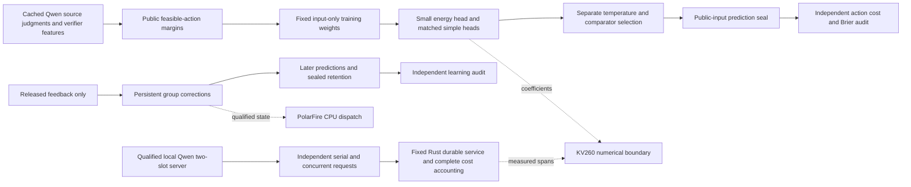
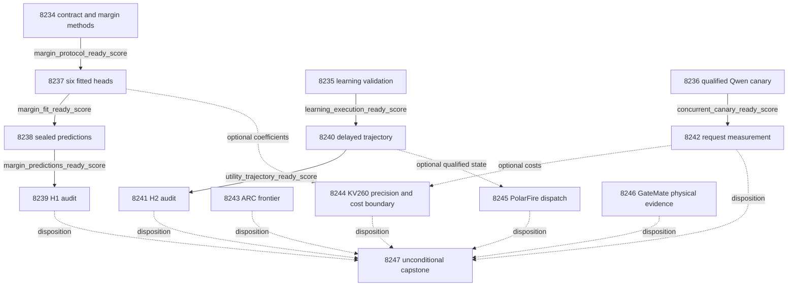

# Carnot Research Roadmap v712 — Decision-sensitive energy training

**Created:** 2026-10-07. **Milestone:** 2026.10.712.
**Title:** Decision-sensitive energy training, qualified delayed learning, and independent request costs.
**Status:** Proposed. Planning does not activate or execute these experiments.
**Previous design:** `research-roadmap-v711-preserved-20261007.md` preserves V711.

The execution contract contains **14 tasks, Exp8234 through Exp8247**, in that
order. Four phases contain **3, 3, 3 and 5 tasks**. The visible task table,
complete JSON task objects and `research-roadmap-next.yaml` agree. The canonical
digest covers every task field, including each full prompt.

## What V711 proved

V711 scheduled fourteen tasks. Twelve ran; two were pre-gate blocked. The
completed archive currently ends at V710. V711's active YAML, primary artifacts
and conductor log provide its completed evidence. An operational retrospective
counts twelve executed experiments; this does not reduce the fourteen-task
contract. Execution completion is distinct from scientific success.

| Evidence | Finding | Next consequence |
|---|---|---|
| Exp8220 current authority | Qualified current contract; readiness 1 | Reuse current authority, without another archive reconstruction. |
| Exp8221 utility kernel | Static and causal readiness 1; fixture evidence is circular-positive | Reuse the mathematical kernel and causal protocol. |
| Exp8222–8224 static correction | Qualified null on 128 intended slots, 97 complete; energy_group and energy_global have cost 45.5/128; zero improved sources; lower gain bound 0 | Stop unchanged residual-patch fitting. Test a different training objective with equal-information controls. |
| Exp8225 learning | Disqualified: 567/569 covered statements; uncovered schema-error and replay-log-hash paths | Qualify these exact paths before natural execution. H2 is not a scientific null yet. |
| Exp8226 learning audit | `blocked_gate_check_failed` | Preserve the block; require a qualified current trajectory. |
| Exp8227 concurrency canary | Disqualified: 465/466 covered statements; request-error reducer uncovered; zero loads and generations attempted | Cover the HTTP-error path, then perform the real canary. |
| Exp8228 concurrency measurement | `blocked_gate_check_failed` | This comparison remains unexecuted. |
| Exp8229 ARC frontier | Qualified reader, no new outcomes | Inspect only new authenticated outcomes; grant no new solve credit. |
| Exp8230 KV260 | External service-span block; boundary reader readiness 1 | Use new coefficients and current cost evidence when available. |
| Exp8231 PolarFire | Disqualified by Ruff formatting and invalid mypy argv | Fix known validation defects before a bounded dispatch attempt. |
| Exp8232 GateMate | Physical-change block; obligation readiness 1 | Retain its evidence and exact reopening condition; no identical JTAG retry. |
| Exp8233 capstone | Execution readiness 1, science readiness 0, all three PRD gaps open | Keep scientific findings, external blocks and owned failures separate. |

Primary paths follow `results/experiment_<id>_v711_<slug>.json`, as listed in
V711's preserved contract. The two pre-gate files instead are
`results/experiment_8226_learning_audit.json` and
`results/experiment_8228_concurrent_service.json`. Consumers must resolve them
by exact task identity and retain their actual paths and hashes.

## Three biggest gaps to the PRD

1. **FR-06/12 — decisions that use verification effectively.** Available
   sentence/verifier features and calibrated probabilities do not yet show
   useful action benefit over matched simple heads. Test training near the
   actual action boundary. Keep extraction quality as an unresolved input limit.
2. **FR-11 — learning that helps later queries and retains earlier knowledge.**
   The new group-correction learner has primitive trajectories but failed owned
   validation. Qualify mechanics, then independently test later benefit and
   retention. Calibration or recovery alone cannot close this gap.
3. **FR-05/08 and NFR-01 — gains over the complete request.** The previous
   service used shared acquisition and scoring occupied a tiny fraction of cost.
   Measure independent requests and real cold costs. A concurrency gain is
   separate from the PRD's unmet 10x Rust/Python inference target.

The standing ARC generalization and three attached-board obligations remain
explicit. These are independent of off-ARC decision results. Generator weights,
public-game solve counts and official test data remain outside this milestone.

## Research incorporated before design

The dated V712 scan was written to `research-references.md` before this design.
It covers all eight required topics and all six secondary sources.

| Finding | Use in this milestone | Limit |
|---|---|---|
| [Decision-calibrated uncertainty, 2606.10187](https://arxiv.org/abs/2606.10187) | Exp8234/8237–8239 test training weights based on public action margins | Our weighted log-loss heuristic is not the paper's conformal algorithm and inherits no guarantee. |
| [Representation/calibration decomposition, 2606.16034](https://arxiv.org/abs/2606.16034) | Record probability changes separately from changed decisions | Temporal-classification results do not establish Carnot benefit. |
| [Online recalibration, 2607.19689](https://arxiv.org/abs/2607.19689) | Exp8241 separates calibration, proper loss and action cost | No approachability or regret theorem is claimed. |
| [ARM/EBM equivalence, 2512.15605](https://arxiv.org/abs/2512.15605) | Require direct-probability versus normalized-energy parity | Equivalent representation supplies no independent correctness signal. |
| [KAN forgetting, 2511.12828](https://arxiv.org/abs/2511.12828) | Retention remains mandatory | Local support does not guarantee retention. |
| [FPGA co-design, 2602.15985](https://arxiv.org/abs/2602.15985), [Extropic Z1T](https://extropic.ai/writing/z1t/) | Include host, transfer and incompatible operations in hardware bounds | Vendor estimates are not local device measurements. |

New leads for later extraction work include entity-evidence alignment
[2609.08267](https://arxiv.org/abs/2609.08267) and citation-level faithfulness
[2609.22774](https://arxiv.org/abs/2609.22774). New NFA-constrained generation
[2609.40185](https://arxiv.org/abs/2609.40185) remains deferred until a useful
verifier and matching constraint class exist. EBT, NSVIF, Ising, KAN and ETS
were checked without reopening retired generator or generic text-reranker work.

OpenReview supplied the ICLR 2026 EBT PDF and under-review submissions.
Semantic Scholar citation endpoints for both seed papers failed; citation
coverage is incomplete. Hugging Face supplied a Spilled Energy discovery page.
GitHub Trending returned three-week-old pages, so current ranks are unknown.
Kona remains architectural context without a checked local execution recipe.

## Architecture



Static training and delayed learning do not depend on each other's success.
Cached source judgments are historical model provenance. Only the canary and
request measurement invoke the mandated local model in this milestone.

## Phase 1 — Freeze methods and qualify specific failed paths

**Exp8234** binds fourteen current tasks and freezes a new numerical protocol.
It retains original sixteen-feature inputs, source roles and 128 reserved slots.
Its administrative and method-readiness scores are separate. It does not recover
unavailable historical code or change the active roadmap during planning.

The native, frozen Qwen probability `p0` supplies an input-only weight. The
feasible expected costs are `accept=5*p0`, `reject=1-p0`, `escalate=0.5`.
Accept is available only in the original V707 accepted set. Let `d` be the
second-smallest minus smallest feasible cost. Set `w=1+4*exp(-d/0.05)`.
This keeps weights in [1,5] and emphasizes inputs near an action tie. Labels do
not define weights. Missing evidence stays missing. This is a testable heuristic.

Six arms cross energy/additive/logistic with uniform/margin weighting. Use each
existing 17-coefficient basis, the original fold geometry and ridge candidates,
and matched optimization budgets. The objective is weighted mean binary log
loss plus the original ridge term. Uniform weights are exactly one. Temperature
calibration uses unweighted log loss on its separate role. No utility patches
are added after fitting. Freeze exact constants and source hashes before fitting.

**Exp8235** qualifies the unchanged delayed learner. Its targeted tests reach
the schema-error branch after byte checks pass and reject modified replay logs.
The measured coverage report missed precisely these paths. Preserve hard-exit
recovery and all existing assertions. Bind only execution/task mappings to the
original scientific protocol. Qualification cannot promote Exp8225's old result.

**Exp8236** first covers the canary's failed-response reducer through a scripted
HTTP peer. Only after complete owned validation does it lease an available GPU
and run eight real requests. The four canary sources and 24 benchmark sources
remain disjoint under the existing frozen protocol. Three complete source pairs,
both slots and no source/request cross-talk are required. Zero model calls remain
zero calls; a planned model declaration cannot become an inference receipt.

## Phase 2 — Fit, seal and independently test decision value

**Exp8237** performs real small-head fitting under the frozen objective. It
records fold-level losses, weights, convergence and before/after parameter hashes.
The same features and labels are available to every arm. This advances the
calibrated typed-decision training floor without updating the 27B generator.

Select the primary comparator using calibration-role cost, then unweighted
Brier, then fixed arm order. Eligible comparators are the four simple-head
variants, uniform energy and the frozen V711 energy_global. Equally weighted
additive and logistic comparisons are mandatory. Do not select on reserved labels.
A qualified fit can pass readiness when there is no development benefit.

**Exp8238** runs a public-input-only worker over all 128 original reserved slots.
It records each arm's probability, permitted actions, expected losses and final
action. Missing evidence and ties escalate. It seals complete head and prediction
bytes before the audit opens labels. A seal does not erase historical exposure.

**Exp8239** independently recomputes H1. The all-slot cost denominator remains
128. Require at least 96 complete sources, at least 12 of each class, at least
five improved sources, and a 97.5% lower paired cost-gain bound above 0.02 versus
the frozen primary. Use 10,000 source-cluster bootstrap draws, seed 7128239, and
at least 9,500 valid draws. Preserve original missing masks.

Require no additional false accepts and Brier worsening at most 0.01 against
the primary and historical accepted baseline. Cost worsening must be at most
0.02 against equally weighted simple heads and the historical baseline. These
controls limit observed damage; they do not certify that baseline decisions
are true. Report conditional precision and acceptance count separately.

The weighted energy arm must beat equal-information controls before claiming
an energy-specific advantage. Lower proper loss without lower action cost does
not pass H1. If this objective is null, retire the narrow margin-only variant on
this cohort. New independent evidence or a different extraction signal is the
next opening condition; another threshold or coefficient rename is insufficient.

## Phase 3 — Evaluate continual learning and independent acquisition

**Exp8240** executes the original delayed group-correction protocol only after
Exp8235 qualifies its wrapper. It runs independently of the static branch.
Preserve 256 slots, delay 20, warmup 1–64, hash-assigned roles, opportunities
64/144, expiry 144/224, newest 64 released update rows and original seeds.

Arms remain frozen, global-only, global-plus-group, local-only and
global-plus-random. Commit candidate state before selecting twelve unused future
admission labels; require two labels/class. Admission labels never fit a patch.
Retain interpolation weights 1/.5/.25/.125 and original safety/no-worsening gates.
Measure lookup/update latency and persistent bytes. Use genuine exit 73 at slots
90/170 with exact state recovery. Seal predictions on the separate 64 retention
sources before opening their labels. No admitted patch is a valid null.

**Exp8241** reconstructs causally issued predictions on 192 later slots 65–256.
H2 retains the prior 97.5% lower cost-gain threshold above 0.02, five improved
sources, at least 128 complete later slots, eight per class and eight
nonoverlapping blocks. Use 10,000 moving original-slot-block draws, primary block
16 and sensitivity blocks 8/32. Average seeds within each source; require 9,500
valid draws. This is exposed-stream development evidence, not deployment proof.

Compare global-plus-group with global-only and retain frozen/local/random
controls. Apply each original per-seed false-accept gate. Retention requires at
least 48/64 complete sources and eight/class, cost worsening at most 0.02,
Brier worsening at most 0.01 and zero extra false accepts against both frozen
and global-only. Calibration, excess proper loss, action benefit and retention
are separate metrics. H1 and H2 each use alpha 0.025; neither is selected after
seeing the other branch.

**Exp8242** measures 24 sources per arm in two counterbalanced sweeps: 96
independent Qwen generations. Hold the Rust durable service fixed. Match source,
prompt and seed across arms, with distinct requests and responses. Only client
concurrency changes, one versus two; both arms use the same two-slot server.
Disable exact-request/prefix reuse for this comparison.

Bound each generation at 128 tokens and 120 seconds; cap measurement at 3,000
seconds. Charge a fresh startup/shutdown for each sweep/arm workload. Record
queue, inference, normalization, service, fsync and persistence costs. Preserve
all intended failures and censoring. At least 20 paired sources are required
for descriptive latency intervals. Two sweeps are insufficient for a population
throughput interval. A faster arm with fewer valid completions cannot qualify.
Schema validity cannot establish answer quality. Capture GPU telemetry during
the actual requests, not only before or after them.

## Phase 4 — Generalization, hardware boundaries and the final decision

**Exp8243** checks only new authoritative supervisor receipts beyond Exp8229.
Join redirects to actual environment transitions. Use leave-one-game-out arm
summaries when at least three games and ten grounded redirects per compared arm
exist. Observational support can justify a general refinement specification,
not causal superiority or a live policy change. No new outcomes means a terminal
no-new-outcome record. No model call, public-game re-solve or solve credit occurs.

**Exp8244** retains the KV260 obligation and tests the precision sensitivity of
new head coefficients with the existing CPU evaluator. Compare 8/16-bit
representations through per-source probabilities and decisions. The inference
operation family is unchanged; do not repeat an unchanged sampler benchmark.
Whole-request bounds use only qualified new service spans. Missing spans cannot
erase numerical evidence or be replaced with old timings labeled current.
Keep quadratic-fabric, nonlinear-basis and host-persistence operations distinct.
No hardware timing, new RTL, flashing or device availability probe is proposed.

**Exp8245** repairs the known PolarFire formatting and mypy-command failures,
then attempts one bounded board-local dispatch. A portable packet binds source,
state, query and expected-output hashes. Use qualified natural learner state
when available; otherwise use a qualified static utility fixture and limit the
claim to mechanics. Preflight SSH, board Python and private temporary storage.
A reachable board runs a self-contained evaluator under a 60-second deadline.
Record actual output hashes. A Linux CPU run is not FPGA-fabric acceleration.
Unreachable hardware yields a named external block without repeated probing.

**Exp8246** carries the unchanged GateMate physical blocker and checks only new
dated operator evidence. The exact condition remains a changed cable/port/power
setup followed by a GM1Ax IDCODE and n16 flashed-tile smoke. This task documents
the next probe; it never repeats the unchanged JTAG command. This bounded evidence
update fulfills board continuity without inventing hardware progress.

**Exp8247** runs unconditionally. It records all fourteen dispositions, including
conductor pre-gate artifacts at their actual paths. It recomputes eligible H1/H2,
keeps three separate board rows and ARC limits, and records the fixed G1–G4
publication gate. Historical disqualifications stay historical. External missing
inputs mean blocked; owned failed checks mean disqualified. Neither means partial.

## Dependency graph



Solid edges are structured gates. Every gated producer declares the exact field
in its own REQUIRED ARTIFACT FIELDS. Gates also require passed owned checks,
no adversarial flag and a qualified verdict class. Dotted edges consume available
evidence and never remove obligations. Valid nulls can continue to audits.

## Hardware requirements and runtime bounds

| Resource | Planned use | Claim boundary |
|---|---|---|
| CPU and system RAM | Small-head fits, bootstrap reduction, persistent learning and private validation | Software measurements; no simulated live inference. |
| 2x RTX 3090 inventory | Exp8236 and Exp8242 need one free GPU with enough memory for cached Q4_K_M and two 4096-token slots | Preflight lease/VRAM and protect live ARC. No forced multi-GPU load. |
| Local GGUF | `unsloth/Qwen3.8-27B-GGUF`, Q4_K_M, actual cache/template hashes | Only this model can satisfy current LLM tasks. No generator training. |
| KV260 | Historical fabric scope plus new CPU precision/bound analysis; k_max<=5 | No new device execution or speed claim. SSH is the device precondition for future board work. |
| PolarFire | One bounded SSH Linux CPU dispatch after host qualification | Hash-matched workload completion is distinct from FPGA acceleration. |
| GateMate | Dated physical-change evidence and next-probe contract | No unchanged JTAG retry or flash claim. |
| NPU, TSU and larger FPGA wishlist | Deferred; assess only operation compatibility | No access, installation, purchase or hardware-efficiency claim is assumed. |

Exp8236 and Exp8242 declare **model_bounded_generation**, with the 10-second
floor, because their completions have fixed small token budgets. Neither is a
full-generation run. If a task executes no model call, its result records the
actual no-model substrate and separate planned model. Other tasks declare
**no_model_load** and `MODEL_SPECS: []`. Historical model provenance is not a
current invocation. A future embeddings-only task would use
model_load_no_generation (2 seconds); actual full generation would use
model_full_generation (60 seconds). Neither is scheduled here.

Continuous learning has a concrete acceleration path: bounded group predicates,
clipped additions and global calibration on CPU, portable state and Rust
scoring, then compatible comparisons/additions on FPGA. Measure parameter
accesses, durable bytes, update/lookup time and the fraction of total request
cost. The program's 100x hardware ambition is a target, not a measured result;
report when the observed workload makes it unattainable.

Every prompt mandates flushed phase lines, lines before/after long calls,
progress inside loops and at least 60-second child heartbeats. Every gap stays
below 600 seconds. File writes over about 200 lines are split across tool calls,
with a progress message between them. Per-request and task deadlines preserve
failures and censoring; no runtime padding or fabricated completion is allowed.

## Failure lineage, scope and verification

Each task includes complete `prior_failures` entries with prior verdict,
concrete changed mechanism/prerequisite and `retire_if_same_verdict: true`.
New IDs avoid retired-ID reuse. No `requires` chain points at a retired task.
The unchanged delayed scientific method is resumed only after a named coverage
repair. Concurrency is previously unexecuted. Mandatory ARC/GateMate continuity
uses new evidence frontiers without repeating retired failed probes.

The plan does not reopen PHASE D text reranking, energy-as-generator, public-game
solving, importance anchoring or frozen injected-error certificate heads. Its
static treatment uses existing numerical source/verifier features and changes
only the fitting objective. A new name never authorizes an unchanged failed scope.

Before implementation, each executor must extend relevant REQ/SCENARIO specs
and write focused failing tests. Preserve existing assertions, historic results
and operator-curated documents. Validate owned unit/consumer tests, real CLI and
child paths, measured 100% changed-code coverage, scoped Ruff, strict mypy and
spec coverage. Relevant private E2E checks are named per task. Scope current
health diagnostics separately from required owned validation.

Publish through existing primary-publication, adversarial and strict row checks,
then cold-replay in a fresh process. Fixtures stay outside `results/`. Preserve
all intended unit rows, missingness and check receipts. Every result declares a
closed verdict class and every blocked result names the exact failed gate.
No new implementation or scientific result is produced by this planning change.

## Exact task contract

The following table and complete JSON describe the same fourteen tasks as the
YAML. Canonical tasks SHA-256 uses UTF-8 JSON with `sort_keys=True`,
`separators=(",", ":")`, and `ensure_ascii=False`, without a trailing newline.

Canonical complete-task SHA256: `28255e818d0391cba23fc85d0c345b940cbba11071470c9da8197c76be70df5c`

| Order | Task ID | Title | Phase | Deliverable |
|---|---|---|---|---|
| 1 | `exp8234-decision-margin-methods` | Bind fourteen tasks and freeze decision-margin training controls | 1 | `results/experiment_8234_v712_decision_margin_methods.json` |
| 2 | `exp8235-learning-validation` | Qualify the existing delayed learner through its uncovered failure paths | 1 | `results/experiment_8235_v712_learning_validation.json` |
| 3 | `exp8236-qualified-concurrency-canary` | Cover request-error reduction and qualify real bounded Qwen concurrency | 1 | `results/experiment_8236_v712_qualified_concurrency_canary.json` |
| 4 | `exp8237-margin-energy-training` | Train matched energy and simple policies with decision-sensitive loss | 2 | `results/experiment_8237_v712_margin_energy_training.json` |
| 5 | `exp8238-margin-prediction-seal` | Seal all reserved decisions from the frozen margin-trained heads | 2 | `results/experiment_8238_v712_margin_prediction_seal.json` |
| 6 | `exp8239-margin-decision-audit` | Test margin-trained decision value against equally trained controls | 2 | `results/experiment_8239_v712_margin_decision_audit.json` |
| 7 | `exp8240-qualified-delayed-learning` | Run the unchanged continuous learner after complete execution qualification | 3 | `results/experiment_8240_v712_qualified_delayed_learning.json` |
| 8 | `exp8241-delayed-benefit-audit` | Measure later decision benefit and independent retention from qualified state | 3 | `results/experiment_8241_v712_delayed_benefit_audit.json` |
| 9 | `exp8242-independent-concurrent-service` | Measure independent serial and concurrent Qwen requests including cold costs | 3 | `results/experiment_8242_v712_independent_concurrent_service.json` |
| 10 | `exp8243-arc-supervisor-frontier` | Inspect new supervisor outcomes for transferable cross-game arm selection | 4 | `results/experiment_8243_v712_arc_supervisor_frontier.json` |
| 11 | `exp8244-kv260-decision-boundary` | Bound KV260 precision effects on new decision heads and complete request costs | 4 | `results/experiment_8244_v712_kv260_decision_boundary.json` |
| 12 | `exp8245-polarfire-state-dispatch` | Qualify PolarFire transfer validation and attempt a bounded board-local state dispatch | 4 | `results/experiment_8245_v712_polarfire_state_dispatch.json` |
| 13 | `exp8246-gatemate-change-ledger` | Carry GateMate physical-change evidence into the next executable reopen decision | 4 | `results/experiment_8246_v712_gatemate_change_ledger.json` |
| 14 | `exp8247-capstone` | Reconcile all fourteen outcomes and retire unchanged decision-only nulls | 4 | `results/experiment_8247_v712_capstone.json` |

<!-- V712_TASK_CONTRACT_START -->
```json
{"milestone":"2026.10.712","tasks":[
{"id": "exp8234-decision-margin-methods", "title": "Bind fourteen tasks and freeze decision-margin training controls", "phase": 1, "track": "science", "priority": "high", "requires_gpu": false, "max_turns": 100, "estimated_wall_time_min": 40, "per_unit_rows": true, "milestone": "2026.10.712", "deliverable": "results/experiment_8234_v712_decision_margin_methods.json", "inference_substrate_class": "no_model_load", "MODEL_SPECS": [], "gated_on": [], "prior_failures": [{"experiment_id": "exp8224-utility-audit", "verdict": "complete_null_utility_audit", "addressed_by": "Replace fixed-head residual patches with label-independent decision-margin weighting during fitting; require matched weighted simple controls and retire this objective if the registered benefit remains null.", "retire_if_same_verdict": true}], "model": "opus", "prompt": "CONTEXT:\nWork in {project_root} on {date}. V711 scheduled fourteen tasks; twelve executed and two were pre-gate blocked. Exp8224 found zero action gain over energy_global. Residual calibration did not change the useful decision boundary. The new mechanism changes the training objective, not evidence, action permissions or generator weights.\nEXISTING CODE TO READ FIRST:\nCLAUDE.md; CODEX.md; ops/e2e-test-plan.md; openspec/capabilities/research-reporting/spec.md; openspec/capabilities/verification/spec.md; scripts/experiment_template.py; python/carnot/reporting/primary_publication.py; ops/exclusion_manifest.yaml; openspec/change-proposals/research-roadmap-vNEXT.md; python/carnot/reporting/roadmap_contract.py; python/carnot/reporting/v711_current_contract.py; python/carnot/verify/restricted_energy_8208.py; python/carnot/verify/restricted_action_rule_8207.py; python/carnot/verify/utility_patch_methods_8219.py; results/experiment_8224_v711_utility_audit.json; results/experiment_8233_v711_capstone.json; research-references.md\nTASK:\nBind fourteen tasks and freeze decision-margin training controls. Deliver results/experiment_8234_v712_decision_margin_methods.json. Create the thin runner scripts/experiments/experiment_8234_v712_decision_margin_methods.py. Store primitive evidence under results/raw/experiment_8234_v712_decision_margin_methods/. Separate execution readiness from benefit.\nCONCRETE STEPS:\n0. PRECONDITIONS: Emit a flushed start line. Authenticate input schemas and hashes, current writable private scratch and required resources. Record commands and exits. Missing external operands produce complete_blocked_<operand>, verdict_class=blocked. Do not invent inputs or silently replace missing rows.\n1. Emit a flushed progress line at every phase boundary and before and after every model load, generation, benchmark and subprocess. Print completed/pending counts inside long loops and a heartbeat at least every 60 seconds while children run. Keep every output gap below 600 seconds. Use unbuffered output, bounded child deadlines and process-group cleanup. Write any file over about 200 lines in several tool calls of at most about 150 lines, with a progress message between calls. Split long work into resumable batches; no single huge tool call. Do not pad runtime.\n2. Extend the relevant REQ-* and SCENARIO-* before implementation. Write focused failing tests first. Preserve existing tests and assertions. Use private fixtures outside results/ and scratch outside the repository root. Freeze owned validation commands before measurement. No generator weight updates or external publication.\n3. Declare no_model_load, MODEL_SPECS=[] and zero current LLM calls. Use aggregation_from_upstream_artifacts for reductions or verifier_ensemble_against_cached_candidates for fitting/scoring. Describe trained_head_specs separately; historical Qwen provenance is not a current call.\n4. Bind first_id=8234 and count=14 against the visible table, complete JSON and canonical digest. Compare staged authority now and actual active authority after activation; never copy staged YAML into the active slot. Preserve V711 in research-roadmap-v711-preserved-20261007.md. Snapshot owned current sources; no archive-wide reconstruction. Contract readiness is independent of scientific method readiness.\n5. Freeze openspec/change-proposals/v712-decision-margin-protocol.json before fitting. Authenticate the original V707/V709 sixteen-feature source rows, head_fit/temperature_fit/calibration/reserved roles and 128 reserved slots. Keep already exposed sources explicitly exposed development. Do not select new roles using outcomes or access official test data.\n6. Use p0 from the frozen native Qwen probability before any label-trained calibration. Compute expected losses accept=5*p0, reject=1-p0, escalate=.5; accept is feasible only in the historical V707 accepted set. Let d be second-smallest minus smallest feasible loss. Set w=1+4*exp(-d/.05), computed without labels and bounded in [1,5]. Missing p0 or features preserves a missing slot. This decision-sensitive weighting is a heuristic inspired by arXiv:2606.10187, not conformal inference.\n7. Freeze six fits: radial energy, additive and logistic, each uniform-weighted and margin-weighted. Reuse each original 17-coefficient basis and parameter initialization. Minimize weighted mean binary log loss plus the existing ridge term; uniform means w=1. Keep identical fold geometry, ridge candidates, folds, iteration/deadline budget and unweighted temperature calibration across paired arms. Do not add post-fit utility patches. Freeze exact numerical constants from qualified source code into the protocol.\n8. Choose the primary comparator only on calibration-role data from four simple-head variants plus uniform energy and the frozen V711 energy_global. Choose lowest all-slot decision cost, then unweighted Brier, then fixed arm order. Require weighted energy comparisons with both equally weighted simple heads. Freeze H1 lower 97.5% paired source-bootstrap gain>.02, >=5 improved sources, >=96 complete/128 and >=12/class; Brier worsening<=.01, zero extra false accepts, and cost worsening<=.02 against each simple control and historical accepted baseline. Ten thousand draws, seed7128239; no widening acceptance permissions.\n9. Freeze H2 as the unchanged V710/V711 delayed protocol, including alpha=.025 and independent retention. H1/H2 each spend alpha=.025. Validate weight derivatives by finite differences and the uniform limit, duplicate roles, label-independent weights and non-firing null controls on private fixtures. Methods readiness means executable methods, not an observed benefit.\n10. Run applicable private E2E-018/021 from ops/e2e-test-plan.md. Run relevant unit and consumer tests, measured 100% changed-code coverage including real CLI/child statements, scoped Ruff check/format, strict mypy, and scripts/check_spec_coverage.py --files <owned-test-files>. Preserve argv, expected/actual exits, clocks and full stdout/stderr hashes. Keep bounded repository-health diagnostics separate; known failures do not become a global pass.\n11. Cold-replay primitives in a fresh process, including negative/tamper cases. Validate a private candidate through unchanged primary_publication terminal checks, scripts/adversarial_verify.py --json <private-candidate> and scripts/verdict_row_consistency_lint.py --strict <private-candidate>. Publish atomically to results/experiment_8234_v712_decision_margin_methods.json after normal exit and required checks; retain honest failure artifacts and historical primary bytes. Reconcile openspec/, _bmad/traceability.md, ops/status.md and ops/changelog.md. Do not modify research-roadmap.yaml.\nREQUIRED ARTIFACT FIELDS:\nexperiment_id, task_id, milestone, run_date: principle: Identify the actual invocation.\nhonest_verdict, verdict_class: principle: Use complete_* terminal verdicts and exactly positive | circular_positive | null | blocked | disqualified | partial. Partial means unfinished owned work; unchanged external failures mean blocked.\ngate_check_summary: principle: Every blocked result names upstream/path/hash, exact field, operator, expected and observed value. Missing evidence differs from measured zero.\ninference_substrate, inference_substrate_class, MODEL_SPECS, model_invocation_counts: principle: Record actual current calls; cached provenance does not imply a model load.\nrows, intended_count, completed_count, failed_count, censored_count, excluded_count, independent_count: principle: Retain every unit/arm/condition, metric numerator/denominator and missing status. Seeds and repeats do not add independent sources.\nverifier_is_oracle, exposure_scope, independent_generalization_score, generalized_learning_benefit_score: principle: Oracle-defined success is circular_positive. Reused development sources cannot establish independent generalization; both generalization scores remain zero here.\nrequired_checks_passed, flagged_adversarial, acceptance_gates, validation_receipts, terminal_validation_sidecar_path: principle: Failed owned checks disqualify and set readiness to zero. Readiness is separate from scientific benefit.\npreconditions_checked, duration_s, random_seed, reproducibility_checksum, source_artifact_hashes, code_config_hashes, raw_shard_hashes, phase_spans: principle: Bind actual work, code and input bytes to independently replayable evidence.\ncited_upstream_artifacts, field_principles: principle: Name imported fields and hashes, and explain each added field.\ncurrent_contract_ready_score, margin_protocol_ready_score: principle: Expose separate administrative and science-method readiness.\nprotocol_path, protocol_sha256, objective_equations, frozen_roles, current_code_snapshots, canonical_tasks_sha256: principle: Fix training and selection before evaluation.\nRun command: cd {project_root} && PYTHONPATH=python:. PYTHONUNBUFFERED=1 .venv/bin/python -u scripts/experiments/experiment_8234_v712_decision_margin_methods.py --date {date}\nDo NOT push. Do NOT modify scripts/research_conductor.py."},
{"id": "exp8235-learning-validation", "title": "Qualify the existing delayed learner through its uncovered failure paths", "phase": 1, "track": "infra", "priority": "high", "requires_gpu": false, "max_turns": 100, "estimated_wall_time_min": 45, "per_unit_rows": true, "milestone": "2026.10.712", "deliverable": "results/experiment_8235_v712_learning_validation.json", "inference_substrate_class": "no_model_load", "MODEL_SPECS": [], "gated_on": [], "prior_failures": [{"experiment_id": "exp8225-delayed-utility-learning", "verdict": "complete_disqualified_owned_validation", "addressed_by": "Exercise the two named missing exception/tamper paths through real private CLI coverage before a natural run; keep the scientific learner unchanged.", "retire_if_same_verdict": true}], "model": "opus", "prompt": "CONTEXT:\nWork in {project_root} on {date}. Exp8225 is complete_disqualified_owned_validation. Its coverage report missed delayed_utility_execution_8225.py lines367 and595: authenticated-schema failure and replay log-hash mismatch. This is a diagnosed execution defect, not a failed scientific H2.\nEXISTING CODE TO READ FIRST:\nCLAUDE.md; CODEX.md; ops/e2e-test-plan.md; openspec/capabilities/research-reporting/spec.md; openspec/capabilities/verification/spec.md; scripts/experiment_template.py; python/carnot/reporting/primary_publication.py; ops/exclusion_manifest.yaml; openspec/change-proposals/research-roadmap-vNEXT.md; python/carnot/verify/delayed_utility_execution_8225.py; python/carnot/verify/delayed_utility_learning_8225.py; python/carnot/verify/utility_kernel_8221.py; tests/python/test_delayed_utility_learning_8225.py; results/experiment_8225_v711_delayed_utility_learning.json; openspec/change-proposals/v710-utility-patch-protocol.json\nTASK:\nQualify the existing delayed learner through its uncovered failure paths. Deliver results/experiment_8235_v712_learning_validation.json. Create the thin runner scripts/experiments/experiment_8235_v712_learning_validation.py. Store primitive evidence under results/raw/experiment_8235_v712_learning_validation/. Separate execution readiness from benefit.\nCONCRETE STEPS:\n0. PRECONDITIONS: Emit a flushed start line. Authenticate input schemas and hashes, current writable private scratch and required resources. Record commands and exits. Missing external operands produce complete_blocked_<operand>, verdict_class=blocked. Do not invent inputs or silently replace missing rows.\n1. Emit a flushed progress line at every phase boundary and before and after every model load, generation, benchmark and subprocess. Print completed/pending counts inside long loops and a heartbeat at least every 60 seconds while children run. Keep every output gap below 600 seconds. Use unbuffered output, bounded child deadlines and process-group cleanup. Write any file over about 200 lines in several tool calls of at most about 150 lines, with a progress message between calls. Split long work into resumable batches; no single huge tool call. Do not pad runtime.\n2. Extend the relevant REQ-* and SCENARIO-* before implementation. Write focused failing tests first. Preserve existing tests and assertions. Use private fixtures outside results/ and scratch outside the repository root. Freeze owned validation commands before measurement. No generator weight updates or external publication.\n3. Declare no_model_load, MODEL_SPECS=[] and zero current LLM calls. Use aggregation_from_upstream_artifacts for reductions or verifier_ensemble_against_cached_candidates for fitting/scoring. Describe trained_head_specs separately; historical Qwen provenance is not a current call.\n4. Authenticate the failed coverage receipt and original trajectory/state bytes. Add private cases that reach the schema exception after passing byte checks and the actual cold-replay stdout/stderr mismatch branch. Preserve every original assertion; do not use coverage exclusions, lower thresholds or replace observed exits.\n5. Run real CLI and exit73 recovery paths with the existing Coverage.py patch=_exit configuration. Use the current source line map rather than assuming line numbers remained fixed. Combine unit, CLI and child coverage and require 100% of owned statements before any natural trajectory is requested.\n6. Freeze a bounded consumer manifest with qualified numerical kernel, restored wrapper, cold replay and failure controls. Write openspec/change-proposals/v712-learning-execution-bindings.json with protocol hashes and task-ID mappings only. Preserve V710/V711 numerical methods, feedback roles and admission gates exactly.\n7. Emit learning_execution_ready_score=1 only when current validation passes. Preserve the historical Exp8225 primary as disqualified. No learning-benefit or probability-improvement claim follows from private qualification.\n8. Run applicable private E2E-020/021 from ops/e2e-test-plan.md. Run relevant unit and consumer tests, measured 100% changed-code coverage including real CLI/child statements, scoped Ruff check/format, strict mypy, and scripts/check_spec_coverage.py --files <owned-test-files>. Preserve argv, expected/actual exits, clocks and full stdout/stderr hashes. Keep bounded repository-health diagnostics separate; known failures do not become a global pass.\n9. Cold-replay primitives in a fresh process, including negative/tamper cases. Validate a private candidate through unchanged primary_publication terminal checks, scripts/adversarial_verify.py --json <private-candidate> and scripts/verdict_row_consistency_lint.py --strict <private-candidate>. Publish atomically to results/experiment_8235_v712_learning_validation.json after normal exit and required checks; retain honest failure artifacts and historical primary bytes. Reconcile openspec/, _bmad/traceability.md, ops/status.md and ops/changelog.md. Do not modify research-roadmap.yaml.\nREQUIRED ARTIFACT FIELDS:\nexperiment_id, task_id, milestone, run_date: principle: Identify the actual invocation.\nhonest_verdict, verdict_class: principle: Use complete_* terminal verdicts and exactly positive | circular_positive | null | blocked | disqualified | partial. Partial means unfinished owned work; unchanged external failures mean blocked.\ngate_check_summary: principle: Every blocked result names upstream/path/hash, exact field, operator, expected and observed value. Missing evidence differs from measured zero.\ninference_substrate, inference_substrate_class, MODEL_SPECS, model_invocation_counts: principle: Record actual current calls; cached provenance does not imply a model load.\nrows, intended_count, completed_count, failed_count, censored_count, excluded_count, independent_count: principle: Retain every unit/arm/condition, metric numerator/denominator and missing status. Seeds and repeats do not add independent sources.\nverifier_is_oracle, exposure_scope, independent_generalization_score, generalized_learning_benefit_score: principle: Oracle-defined success is circular_positive. Reused development sources cannot establish independent generalization; both generalization scores remain zero here.\nrequired_checks_passed, flagged_adversarial, acceptance_gates, validation_receipts, terminal_validation_sidecar_path: principle: Failed owned checks disqualify and set readiness to zero. Readiness is separate from scientific benefit.\npreconditions_checked, duration_s, random_seed, reproducibility_checksum, source_artifact_hashes, code_config_hashes, raw_shard_hashes, phase_spans: principle: Bind actual work, code and input bytes to independently replayable evidence.\ncited_upstream_artifacts, field_principles: principle: Name imported fields and hashes, and explain each added field.\nlearning_execution_ready_score: principle: Gate natural execution on actual coverage and recovery, not assertions of success.\noriginal_failure_receipt, covered_failure_paths, coverage_statement_counts, execution_bindings_path, scientific_protocol_sha256: principle: Explain and prove the changed execution prerequisite.\nRun command: cd {project_root} && PYTHONPATH=python:. PYTHONUNBUFFERED=1 .venv/bin/python -u scripts/experiments/experiment_8235_v712_learning_validation.py --date {date}\nDo NOT push. Do NOT modify scripts/research_conductor.py."},
{"id": "exp8236-qualified-concurrency-canary", "title": "Cover request-error reduction and qualify real bounded Qwen concurrency", "phase": 1, "track": "infra", "priority": "high", "requires_gpu": true, "max_turns": 100, "estimated_wall_time_min": 55, "per_unit_rows": true, "milestone": "2026.10.712", "deliverable": "results/experiment_8236_v712_qualified_concurrency_canary.json", "inference_substrate_class": "model_bounded_generation", "MODEL_SPECS": [{"hf_id": "unsloth/Qwen3.8-27B-GGUF", "quantization": "Q4_K_M"}], "gated_on": [], "prior_failures": [{"experiment_id": "exp8227-concurrency-canary", "verdict": "complete_disqualified_owned_validation", "addressed_by": "Cover its single missing request-error reducer branch with a real HTTP failure fixture before GPU work; then execute the previously unattempted bounded requests.", "retire_if_same_verdict": true}], "model": "opus", "prompt": "CONTEXT:\nWork in {project_root} on {date}. Exp8227 attempted zero model loads and zero generation calls. Its only failed owned coverage statement was concurrency_execution_8227.py line107, the error-response reducer. Concurrency has not been measured.\nEXISTING CODE TO READ FIRST:\nCLAUDE.md; CODEX.md; ops/e2e-test-plan.md; openspec/capabilities/research-reporting/spec.md; openspec/capabilities/verification/spec.md; scripts/experiment_template.py; python/carnot/reporting/primary_publication.py; ops/exclusion_manifest.yaml; openspec/change-proposals/research-roadmap-vNEXT.md; python/carnot/reporting/concurrency_execution_8227.py; python/carnot/verify/concurrency_canary_8227.py; python/carnot/inference/concurrency_runtime_8227.py; results/experiment_8227_v711_concurrency_canary.json; openspec/change-proposals/v711-concurrent-acquisition-protocol.json; python/carnot/verify/request_recorder_8213.py\nTASK:\nCover request-error reduction and qualify real bounded Qwen concurrency. Deliver results/experiment_8236_v712_qualified_concurrency_canary.json. Create the thin runner scripts/experiments/experiment_8236_v712_qualified_concurrency_canary.py. Store primitive evidence under results/raw/experiment_8236_v712_qualified_concurrency_canary/. Separate execution readiness from benefit.\nCONCRETE STEPS:\n0. PRECONDITIONS: Emit a flushed start line. Authenticate input schemas and hashes, current writable private scratch and required resources. Record commands and exits. Missing external operands produce complete_blocked_<operand>, verdict_class=blocked. Do not invent inputs or silently replace missing rows.\n1. Emit a flushed progress line at every phase boundary and before and after every model load, generation, benchmark and subprocess. Print completed/pending counts inside long loops and a heartbeat at least every 60 seconds while children run. Keep every output gap below 600 seconds. Use unbuffered output, bounded child deadlines and process-group cleanup. Write any file over about 200 lines in several tool calls of at most about 150 lines, with a progress message between calls. Split long work into resumable batches; no single huge tool call. Do not pad runtime.\n2. Extend the relevant REQ-* and SCENARIO-* before implementation. Write focused failing tests first. Preserve existing tests and assertions. Use private fixtures outside results/ and scratch outside the repository root. Freeze owned validation commands before measurement. No generator weight updates or external publication.\n3. Use MODEL_SPECS including unsloth/Qwen3.8-27B-GGUF Q4_K_M through cached_current_model and the actual GGUF chat template. Set CARNOT_FORCE_LIVE=1. Declare live_llm_inference and model_bounded_generation (10-second floor) only for actual bounded generation. Record GPU/model/template hashes, offload and tokens. A GPU/cache miss blocks; do not substitute legacy models. If no call runs, record no_model_load and zero calls in the artifact; keep the planned model separately.\n4. Reproduce and cover the actual error-response branch with a scripted HTTP peer returning failed responses, cancellation and interleaved IDs. Require complete owned unit/CLI/child coverage before acquiring a GPU. Freeze the existing four canary and24 disjoint benchmark sources and unchanged request protocol under v712-concurrency-execution-bindings.json.\n5. Preflight cached Q4_K_M model bytes, exact server executable/template, GPU lease, free memory, port and two4096-token slots. Use one available RTX3090 with identical two-slot server configuration in both arms. Do not disturb the live ARC service or force two GPUs. Missing resources yield blocked with measured resource values.\n6. Run eight real canary requests, four serial and four concurrent, with matched source/seed but independent request and response IDs. Bound each completion at128 tokens and120seconds; bound the canary at900seconds. Use client concurrency1 versus2 only. Disable request/prefix reuse. Measure load, queue, tokens, slot identity, normalization and shutdown separately.\n7. Require at least three complete source pairs, both slots exercised, correct source/request mapping and no cross-talk. Report natural duration against the10-second bounded-generation floor without padding. Failed completeness is a terminal null or blocked external condition, not a fabricated readiness score. Preserve all eight intended rows and original Exp8227 bytes.\n8. Freeze current runtime and protocol bytes for the downstream independent request measurement. The canary grants concurrent_canary_ready_score only for current validated requests; it makes no speed or reasoning-quality claim.\n9. Run applicable private E2E-022 from ops/e2e-test-plan.md. Run relevant unit and consumer tests, measured 100% changed-code coverage including real CLI/child statements, scoped Ruff check/format, strict mypy, and scripts/check_spec_coverage.py --files <owned-test-files>. Preserve argv, expected/actual exits, clocks and full stdout/stderr hashes. Keep bounded repository-health diagnostics separate; known failures do not become a global pass.\n10. Cold-replay primitives in a fresh process, including negative/tamper cases. Validate a private candidate through unchanged primary_publication terminal checks, scripts/adversarial_verify.py --json <private-candidate> and scripts/verdict_row_consistency_lint.py --strict <private-candidate>. Publish atomically to results/experiment_8236_v712_qualified_concurrency_canary.json after normal exit and required checks; retain honest failure artifacts and historical primary bytes. Reconcile openspec/, _bmad/traceability.md, ops/status.md and ops/changelog.md. Do not modify research-roadmap.yaml.\nREQUIRED ARTIFACT FIELDS:\nexperiment_id, task_id, milestone, run_date: principle: Identify the actual invocation.\nhonest_verdict, verdict_class: principle: Use complete_* terminal verdicts and exactly positive | circular_positive | null | blocked | disqualified | partial. Partial means unfinished owned work; unchanged external failures mean blocked.\ngate_check_summary: principle: Every blocked result names upstream/path/hash, exact field, operator, expected and observed value. Missing evidence differs from measured zero.\ninference_substrate, inference_substrate_class, MODEL_SPECS, model_invocation_counts: principle: Record actual current calls; cached provenance does not imply a model load.\nrows, intended_count, completed_count, failed_count, censored_count, excluded_count, independent_count: principle: Retain every unit/arm/condition, metric numerator/denominator and missing status. Seeds and repeats do not add independent sources.\nverifier_is_oracle, exposure_scope, independent_generalization_score, generalized_learning_benefit_score: principle: Oracle-defined success is circular_positive. Reused development sources cannot establish independent generalization; both generalization scores remain zero here.\nrequired_checks_passed, flagged_adversarial, acceptance_gates, validation_receipts, terminal_validation_sidecar_path: principle: Failed owned checks disqualify and set readiness to zero. Readiness is separate from scientific benefit.\npreconditions_checked, duration_s, random_seed, reproducibility_checksum, source_artifact_hashes, code_config_hashes, raw_shard_hashes, phase_spans: principle: Bind actual work, code and input bytes to independently replayable evidence.\ncited_upstream_artifacts, field_principles: principle: Name imported fields and hashes, and explain each added field.\nconcurrent_canary_ready_score: principle: Qualify actual bounded requests and both slots before a benchmark.\ncoverage_statement_counts, request_rows_path, canary_pairs, generated_tokens, measured_generation_s, server_argv, gpu_lease, protocol_sha256: principle: Separate qualification, real model work and timing evidence.\nRun command: cd {project_root} && PYTHONPATH=python:. PYTHONUNBUFFERED=1 .venv/bin/python -u scripts/experiments/experiment_8236_v712_qualified_concurrency_canary.py --date {date}\nDo NOT push. Do NOT modify scripts/research_conductor.py."},
{"id": "exp8237-margin-energy-training", "title": "Train matched energy and simple policies with decision-sensitive loss", "phase": 2, "track": "science", "priority": "high", "requires_gpu": false, "max_turns": 50, "estimated_wall_time_min": 40, "per_unit_rows": true, "milestone": "2026.10.712", "deliverable": "results/experiment_8237_v712_margin_energy_training.json", "inference_substrate_class": "no_model_load", "MODEL_SPECS": [], "gated_on": [{"upstream": "exp8234-decision-margin-methods", "artifact_field": "margin_protocol_ready_score", "op": "==", "value": 1}, {"upstream": "exp8234-decision-margin-methods", "artifact_field": "required_checks_passed", "op": "==", "value": true}, {"upstream": "exp8234-decision-margin-methods", "artifact_field": "flagged_adversarial", "op": "==", "value": false}, {"upstream": "exp8234-decision-margin-methods", "artifact_field": "verdict_class", "op": "in", "value": ["positive", "null", "circular_positive"]}], "prior_failures": [{"experiment_id": "exp8222-utility-fit", "verdict": "complete_null_utility_fit", "addressed_by": "Refit the same small bases under a label-independent margin-weighted proper loss with matched unweighted and weighted simple controls; do not repeat fixed-head patch selection.", "retire_if_same_verdict": true}], "prompt": "CONTEXT:\nWork in {project_root} on {date}. V711 residual patches tied the global energy control on every reserved action. This experiment tests whether fitting near actual decision margins helps, while holding source evidence and acceptance permissions fixed. It fulfills the calibrated typed-decision training floor.\nEXISTING CODE TO READ FIRST:\nCLAUDE.md; CODEX.md; ops/e2e-test-plan.md; openspec/capabilities/research-reporting/spec.md; openspec/capabilities/verification/spec.md; scripts/experiment_template.py; python/carnot/reporting/primary_publication.py; ops/exclusion_manifest.yaml; openspec/change-proposals/research-roadmap-vNEXT.md; python/carnot/verify/restricted_energy_8208.py; python/carnot/verify/restricted_action_rule_8207.py; python/carnot/verify/evidence_energy_8154.py; python/carnot/verify/utility_fit_8222.py; results/experiment_8234_v712_decision_margin_methods.json\nTASK:\nTrain matched energy and simple policies with decision-sensitive loss. Deliver results/experiment_8237_v712_margin_energy_training.json. Create the thin runner scripts/experiments/experiment_8237_v712_margin_energy_training.py. Store primitive evidence under results/raw/experiment_8237_v712_margin_energy_training/. Separate execution readiness from benefit.\nCONCRETE STEPS:\n0. PRECONDITIONS: Emit a flushed start line. Authenticate input schemas and hashes, current writable private scratch and required resources. Record commands and exits. Missing external operands produce complete_blocked_<operand>, verdict_class=blocked. Do not invent inputs or silently replace missing rows.\n1. Emit a flushed progress line at every phase boundary and before and after every model load, generation, benchmark and subprocess. Print completed/pending counts inside long loops and a heartbeat at least every 60 seconds while children run. Keep every output gap below 600 seconds. Use unbuffered output, bounded child deadlines and process-group cleanup. Write any file over about 200 lines in several tool calls of at most about 150 lines, with a progress message between calls. Split long work into resumable batches; no single huge tool call. Do not pad runtime.\n2. Extend the relevant REQ-* and SCENARIO-* before implementation. Write focused failing tests first. Preserve existing tests and assertions. Use private fixtures outside results/ and scratch outside the repository root. Freeze owned validation commands before measurement. No generator weight updates or external publication.\n3. Declare no_model_load, MODEL_SPECS=[] and zero current LLM calls. Use aggregation_from_upstream_artifacts for reductions or verifier_ensemble_against_cached_candidates for fitting/scoring. Describe trained_head_specs separately; historical Qwen provenance is not a current call.\n4. Authenticate the frozen V712 methods and original fit/tune manifests. Implement a parameterized weighted log-loss solver around the qualified numerical core, with analytic gradient checked against finite differences. Validate w=1 reproduces the uniform objective at1e-10. Never read reserved labels.\n5. Fit the six registered arms using equal17-coefficient bases per family, source-level folds, identical regularization candidates and optimizer budgets. Compute decision margins only from frozen native probabilities and permitted actions. Save every fold source ID, weight, initial/final objective, gradient, convergence and parameter hash. No utility patches or group-residual selection.\n6. Select regularization within original head_fit folds using each registered objective. Calibrate temperature on the separate temperature_fit role using unweighted log loss. Choose the primary comparator on calibration-role all-slot cost, Brier and frozen ties. Save equally weighted additive/logistic comparisons. Temperature or ridge choices may not use reserved sources.\n7. Emit an executable frozen head bundle and Python scoring API returning accept/reject/escalate, p_bad and normalized energies. Check direct probability/energy equivalence at1e-10. Zero benefit or no changed decisions remains a valid fit outcome with margin_fit_ready_score=1 if mechanics qualify; do not gate on a positive development effect.\n8. Run applicable private E2E-015/019/021 from ops/e2e-test-plan.md. Run relevant unit and consumer tests, measured 100% changed-code coverage including real CLI/child statements, scoped Ruff check/format, strict mypy, and scripts/check_spec_coverage.py --files <owned-test-files>. Preserve argv, expected/actual exits, clocks and full stdout/stderr hashes. Keep bounded repository-health diagnostics separate; known failures do not become a global pass.\n9. Cold-replay primitives in a fresh process, including negative/tamper cases. Validate a private candidate through unchanged primary_publication terminal checks, scripts/adversarial_verify.py --json <private-candidate> and scripts/verdict_row_consistency_lint.py --strict <private-candidate>. Publish atomically to results/experiment_8237_v712_margin_energy_training.json after normal exit and required checks; retain honest failure artifacts and historical primary bytes. Reconcile openspec/, _bmad/traceability.md, ops/status.md and ops/changelog.md. Do not modify research-roadmap.yaml.\nREQUIRED ARTIFACT FIELDS:\nexperiment_id, task_id, milestone, run_date: principle: Identify the actual invocation.\nhonest_verdict, verdict_class: principle: Use complete_* terminal verdicts and exactly positive | circular_positive | null | blocked | disqualified | partial. Partial means unfinished owned work; unchanged external failures mean blocked.\ngate_check_summary: principle: Every blocked result names upstream/path/hash, exact field, operator, expected and observed value. Missing evidence differs from measured zero.\ninference_substrate, inference_substrate_class, MODEL_SPECS, model_invocation_counts: principle: Record actual current calls; cached provenance does not imply a model load.\nrows, intended_count, completed_count, failed_count, censored_count, excluded_count, independent_count: principle: Retain every unit/arm/condition, metric numerator/denominator and missing status. Seeds and repeats do not add independent sources.\nverifier_is_oracle, exposure_scope, independent_generalization_score, generalized_learning_benefit_score: principle: Oracle-defined success is circular_positive. Reused development sources cannot establish independent generalization; both generalization scores remain zero here.\nrequired_checks_passed, flagged_adversarial, acceptance_gates, validation_receipts, terminal_validation_sidecar_path: principle: Failed owned checks disqualify and set readiness to zero. Readiness is separate from scientific benefit.\npreconditions_checked, duration_s, random_seed, reproducibility_checksum, source_artifact_hashes, code_config_hashes, raw_shard_hashes, phase_spans: principle: Bind actual work, code and input bytes to independently replayable evidence.\ncited_upstream_artifacts, field_principles: principle: Name imported fields and hashes, and explain each added field.\nmargin_fit_ready_score: principle: Valid fits and frozen selection qualify evaluation regardless of observed benefit.\ntrained_head_specs, trained_heads_path, fit_fold_rows, margin_weight_rows, optimizer_receipts, comparator_name, comparator_sha256, energy_probability_error: principle: Expose real learned parameters and matched information access.\nRun command: cd {project_root} && PYTHONPATH=python:. PYTHONUNBUFFERED=1 .venv/bin/python -u scripts/experiments/experiment_8237_v712_margin_energy_training.py --date {date}\nDo NOT push. Do NOT modify scripts/research_conductor.py."},
{"id": "exp8238-margin-prediction-seal", "title": "Seal all reserved decisions from the frozen margin-trained heads", "phase": 2, "track": "science", "priority": "high", "requires_gpu": false, "max_turns": 50, "estimated_wall_time_min": 30, "per_unit_rows": true, "milestone": "2026.10.712", "deliverable": "results/experiment_8238_v712_margin_prediction_seal.json", "inference_substrate_class": "no_model_load", "MODEL_SPECS": [], "gated_on": [{"upstream": "exp8237-margin-energy-training", "artifact_field": "margin_fit_ready_score", "op": "==", "value": 1}, {"upstream": "exp8237-margin-energy-training", "artifact_field": "required_checks_passed", "op": "==", "value": true}, {"upstream": "exp8237-margin-energy-training", "artifact_field": "flagged_adversarial", "op": "==", "value": false}, {"upstream": "exp8237-margin-energy-training", "artifact_field": "verdict_class", "op": "in", "value": ["positive", "null", "circular_positive"]}], "prior_failures": [{"experiment_id": "exp8223-utility-seal", "verdict": "complete_null_utility_seal", "addressed_by": "Seal newly fitted margin-weighted and uniform heads under a new frozen protocol; preserve all original missing slots and the exposed-development boundary.", "retire_if_same_verdict": true}], "prompt": "CONTEXT:\nWork in {project_root} on {date}. The comparison uses the same128 exposed development slots. A new prediction seal protects this execution but cannot undo prior source exposure.\nEXISTING CODE TO READ FIRST:\nCLAUDE.md; CODEX.md; ops/e2e-test-plan.md; openspec/capabilities/research-reporting/spec.md; openspec/capabilities/verification/spec.md; scripts/experiment_template.py; python/carnot/reporting/primary_publication.py; ops/exclusion_manifest.yaml; openspec/change-proposals/research-roadmap-vNEXT.md; python/carnot/verify/utility_seal_8223.py; python/carnot/verify/utility_seal_execution_8223.py; results/experiment_8237_v712_margin_energy_training.json; results/experiment_8234_v712_decision_margin_methods.json\nTASK:\nSeal all reserved decisions from the frozen margin-trained heads. Deliver results/experiment_8238_v712_margin_prediction_seal.json. Create the thin runner scripts/experiments/experiment_8238_v712_margin_prediction_seal.py. Store primitive evidence under results/raw/experiment_8238_v712_margin_prediction_seal/. Separate execution readiness from benefit.\nCONCRETE STEPS:\n0. PRECONDITIONS: Emit a flushed start line. Authenticate input schemas and hashes, current writable private scratch and required resources. Record commands and exits. Missing external operands produce complete_blocked_<operand>, verdict_class=blocked. Do not invent inputs or silently replace missing rows.\n1. Emit a flushed progress line at every phase boundary and before and after every model load, generation, benchmark and subprocess. Print completed/pending counts inside long loops and a heartbeat at least every 60 seconds while children run. Keep every output gap below 600 seconds. Use unbuffered output, bounded child deadlines and process-group cleanup. Write any file over about 200 lines in several tool calls of at most about 150 lines, with a progress message between calls. Split long work into resumable batches; no single huge tool call. Do not pad runtime.\n2. Extend the relevant REQ-* and SCENARIO-* before implementation. Write focused failing tests first. Preserve existing tests and assertions. Use private fixtures outside results/ and scratch outside the repository root. Freeze owned validation commands before measurement. No generator weight updates or external publication.\n3. Declare no_model_load, MODEL_SPECS=[] and zero current LLM calls. Use aggregation_from_upstream_artifacts for reductions or verifier_ensemble_against_cached_candidates for fitting/scoring. Describe trained_head_specs separately; historical Qwen provenance is not a current call.\n4. Authenticate all head, role, method and comparator hashes. Start a public-input-only worker with no evaluator-label path. Execute the frozen API on all128 original slots without dropping missing features or substituting clean cases.\n5. Record every arm/source probability, public margin, feasible expected loss, chosen action, baseline mask, missing reason and source hash. Ties and missing evidence escalate. Accept only inside the original V707 accepted set. Retain failed/censored/excluded slots in the intended denominator.\n6. Seal predictions and complete head bytes before the separate audit opens labels. Record an access manifest proving prediction inputs omit labels. Validate missing, duplicate, reordered, head-mutated and label-injected private fixtures. This task measures neither H1 nor a generalization gain.\n7. Run applicable private E2E-019/021 from ops/e2e-test-plan.md. Run relevant unit and consumer tests, measured 100% changed-code coverage including real CLI/child statements, scoped Ruff check/format, strict mypy, and scripts/check_spec_coverage.py --files <owned-test-files>. Preserve argv, expected/actual exits, clocks and full stdout/stderr hashes. Keep bounded repository-health diagnostics separate; known failures do not become a global pass.\n8. Cold-replay primitives in a fresh process, including negative/tamper cases. Validate a private candidate through unchanged primary_publication terminal checks, scripts/adversarial_verify.py --json <private-candidate> and scripts/verdict_row_consistency_lint.py --strict <private-candidate>. Publish atomically to results/experiment_8238_v712_margin_prediction_seal.json after normal exit and required checks; retain honest failure artifacts and historical primary bytes. Reconcile openspec/, _bmad/traceability.md, ops/status.md and ops/changelog.md. Do not modify research-roadmap.yaml.\nREQUIRED ARTIFACT FIELDS:\nexperiment_id, task_id, milestone, run_date: principle: Identify the actual invocation.\nhonest_verdict, verdict_class: principle: Use complete_* terminal verdicts and exactly positive | circular_positive | null | blocked | disqualified | partial. Partial means unfinished owned work; unchanged external failures mean blocked.\ngate_check_summary: principle: Every blocked result names upstream/path/hash, exact field, operator, expected and observed value. Missing evidence differs from measured zero.\ninference_substrate, inference_substrate_class, MODEL_SPECS, model_invocation_counts: principle: Record actual current calls; cached provenance does not imply a model load.\nrows, intended_count, completed_count, failed_count, censored_count, excluded_count, independent_count: principle: Retain every unit/arm/condition, metric numerator/denominator and missing status. Seeds and repeats do not add independent sources.\nverifier_is_oracle, exposure_scope, independent_generalization_score, generalized_learning_benefit_score: principle: Oracle-defined success is circular_positive. Reused development sources cannot establish independent generalization; both generalization scores remain zero here.\nrequired_checks_passed, flagged_adversarial, acceptance_gates, validation_receipts, terminal_validation_sidecar_path: principle: Failed owned checks disqualify and set readiness to zero. Readiness is separate from scientific benefit.\npreconditions_checked, duration_s, random_seed, reproducibility_checksum, source_artifact_hashes, code_config_hashes, raw_shard_hashes, phase_spans: principle: Bind actual work, code and input bytes to independently replayable evidence.\ncited_upstream_artifacts, field_principles: principle: Name imported fields and hashes, and explain each added field.\nmargin_predictions_ready_score: principle: All intended slots and immutable predictions must be present before labels open.\npredictions_path, predictions_sha256, public_worker_input_manifest, original_reserved_mask, frozen_head_hashes: principle: Preserve the prediction/evaluation boundary and historic exposure.\nRun command: cd {project_root} && PYTHONPATH=python:. PYTHONUNBUFFERED=1 .venv/bin/python -u scripts/experiments/experiment_8238_v712_margin_prediction_seal.py --date {date}\nDo NOT push. Do NOT modify scripts/research_conductor.py."},
{"id": "exp8239-margin-decision-audit", "title": "Test margin-trained decision value against equally trained controls", "phase": 2, "track": "science", "priority": "high", "requires_gpu": false, "max_turns": 50, "estimated_wall_time_min": 40, "per_unit_rows": true, "milestone": "2026.10.712", "deliverable": "results/experiment_8239_v712_margin_decision_audit.json", "inference_substrate_class": "no_model_load", "MODEL_SPECS": [], "gated_on": [{"upstream": "exp8238-margin-prediction-seal", "artifact_field": "margin_predictions_ready_score", "op": "==", "value": 1}, {"upstream": "exp8238-margin-prediction-seal", "artifact_field": "required_checks_passed", "op": "==", "value": true}, {"upstream": "exp8238-margin-prediction-seal", "artifact_field": "flagged_adversarial", "op": "==", "value": false}, {"upstream": "exp8238-margin-prediction-seal", "artifact_field": "verdict_class", "op": "in", "value": ["positive", "null", "circular_positive"]}], "prior_failures": [{"experiment_id": "exp8224-utility-audit", "verdict": "complete_null_utility_audit", "addressed_by": "Evaluate newly trained margin-weighted heads with equal-objective controls; require actual action benefit and stop this narrow objective if it remains null.", "retire_if_same_verdict": true}], "prompt": "CONTEXT:\nWork in {project_root} on {date}. Exp8224 was a qualified null with97 complete sources out of128 and zero improved sources versus energy_global. H1 now tests a changed fitting objective, not renamed residual patches.\nEXISTING CODE TO READ FIRST:\nCLAUDE.md; CODEX.md; ops/e2e-test-plan.md; openspec/capabilities/research-reporting/spec.md; openspec/capabilities/verification/spec.md; scripts/experiment_template.py; python/carnot/reporting/primary_publication.py; ops/exclusion_manifest.yaml; openspec/change-proposals/research-roadmap-vNEXT.md; python/carnot/verify/utility_audit_8224.py; python/carnot/verify/utility_audit_execution_8224.py; results/experiment_8238_v712_margin_prediction_seal.json; results/experiment_8234_v712_decision_margin_methods.json\nTASK:\nTest margin-trained decision value against equally trained controls. Deliver results/experiment_8239_v712_margin_decision_audit.json. Create the thin runner scripts/experiments/experiment_8239_v712_margin_decision_audit.py. Store primitive evidence under results/raw/experiment_8239_v712_margin_decision_audit/. Separate execution readiness from benefit.\nCONCRETE STEPS:\n0. PRECONDITIONS: Emit a flushed start line. Authenticate input schemas and hashes, current writable private scratch and required resources. Record commands and exits. Missing external operands produce complete_blocked_<operand>, verdict_class=blocked. Do not invent inputs or silently replace missing rows.\n1. Emit a flushed progress line at every phase boundary and before and after every model load, generation, benchmark and subprocess. Print completed/pending counts inside long loops and a heartbeat at least every 60 seconds while children run. Keep every output gap below 600 seconds. Use unbuffered output, bounded child deadlines and process-group cleanup. Write any file over about 200 lines in several tool calls of at most about 150 lines, with a progress message between calls. Split long work into resumable batches; no single huge tool call. Do not pad runtime.\n2. Extend the relevant REQ-* and SCENARIO-* before implementation. Write focused failing tests first. Preserve existing tests and assertions. Use private fixtures outside results/ and scratch outside the repository root. Freeze owned validation commands before measurement. No generator weight updates or external publication.\n3. Declare no_model_load, MODEL_SPECS=[] and zero current LLM calls. Use aggregation_from_upstream_artifacts for reductions or verifier_ensemble_against_cached_candidates for fitting/scoring. Describe trained_head_specs separately; historical Qwen provenance is not a current call.\n4. Authenticate the public prediction seal, frozen comparator and evaluator labels in a fresh audit process. Recompute actions, all-slot cost, complete-case Brier and false-accept counts from per-source rows. Do not inherit producer headline aggregates.\n5. Run the registered10000 paired source-cluster bootstrap draws with seed7128239 and97.5% confidence, preserving all128 slots and fixed missing masks. Report97.5% lower cost-gain bound, effective independent sources, at least9500 valid draws, at least96 complete sources and12/class. Apply all frozen H1 cost, Brier, false-accept and five-improved-source gates.\n6. Compare weighted energy with the tune-selected primary, uniform energy, equally weighted additive and logistic, and V711 energy_global. Separate shared weighting benefit from an energy-specific advantage. Emit action-switch matrices, margin strata and every source delta. Probability movement without action benefit fails H1.\n7. If H1 is null, retire this exact margin-only objective on the exposed cohort and recommend new independent source evidence or a different extraction mechanism before another calibration variant. Do not declare a broad impossibility or an independent-generalization success. Use an audit-specific frozen CLI and tamper both predictions and aggregates.\n8. Run applicable private E2E-019/021 from ops/e2e-test-plan.md. Run relevant unit and consumer tests, measured 100% changed-code coverage including real CLI/child statements, scoped Ruff check/format, strict mypy, and scripts/check_spec_coverage.py --files <owned-test-files>. Preserve argv, expected/actual exits, clocks and full stdout/stderr hashes. Keep bounded repository-health diagnostics separate; known failures do not become a global pass.\n9. Cold-replay primitives in a fresh process, including negative/tamper cases. Validate a private candidate through unchanged primary_publication terminal checks, scripts/adversarial_verify.py --json <private-candidate> and scripts/verdict_row_consistency_lint.py --strict <private-candidate>. Publish atomically to results/experiment_8239_v712_margin_decision_audit.json after normal exit and required checks; retain honest failure artifacts and historical primary bytes. Reconcile openspec/, _bmad/traceability.md, ops/status.md and ops/changelog.md. Do not modify research-roadmap.yaml.\nREQUIRED ARTIFACT FIELDS:\nexperiment_id, task_id, milestone, run_date: principle: Identify the actual invocation.\nhonest_verdict, verdict_class: principle: Use complete_* terminal verdicts and exactly positive | circular_positive | null | blocked | disqualified | partial. Partial means unfinished owned work; unchanged external failures mean blocked.\ngate_check_summary: principle: Every blocked result names upstream/path/hash, exact field, operator, expected and observed value. Missing evidence differs from measured zero.\ninference_substrate, inference_substrate_class, MODEL_SPECS, model_invocation_counts: principle: Record actual current calls; cached provenance does not imply a model load.\nrows, intended_count, completed_count, failed_count, censored_count, excluded_count, independent_count: principle: Retain every unit/arm/condition, metric numerator/denominator and missing status. Seeds and repeats do not add independent sources.\nverifier_is_oracle, exposure_scope, independent_generalization_score, generalized_learning_benefit_score: principle: Oracle-defined success is circular_positive. Reused development sources cannot establish independent generalization; both generalization scores remain zero here.\nrequired_checks_passed, flagged_adversarial, acceptance_gates, validation_receipts, terminal_validation_sidecar_path: principle: Failed owned checks disqualify and set readiness to zero. Readiness is separate from scientific benefit.\npreconditions_checked, duration_s, random_seed, reproducibility_checksum, source_artifact_hashes, code_config_hashes, raw_shard_hashes, phase_spans: principle: Bind actual work, code and input bytes to independently replayable evidence.\ncited_upstream_artifacts, field_principles: principle: Name imported fields and hashes, and explain each added field.\nmargin_audit_ready_score, h1_development_signal_score, energy_specific_advantage_score: principle: Separate reproducible evaluation, registered development benefit and energy-specific value.\nH1, per_source_deltas, calibration_and_cost_comparisons, action_switch_rows, bootstrap_diagnostics, mechanism_disposition: principle: Make a null and its scope as recheckable as a positive.\nRun command: cd {project_root} && PYTHONPATH=python:. PYTHONUNBUFFERED=1 .venv/bin/python -u scripts/experiments/experiment_8239_v712_margin_decision_audit.py --date {date}\nDo NOT push. Do NOT modify scripts/research_conductor.py."},
{"id": "exp8240-qualified-delayed-learning", "title": "Run the unchanged continuous learner after complete execution qualification", "phase": 3, "track": "science", "priority": "high", "requires_gpu": false, "max_turns": 50, "estimated_wall_time_min": 50, "per_unit_rows": true, "milestone": "2026.10.712", "deliverable": "results/experiment_8240_v712_qualified_delayed_learning.json", "inference_substrate_class": "no_model_load", "MODEL_SPECS": [], "gated_on": [{"upstream": "exp8235-learning-validation", "artifact_field": "learning_execution_ready_score", "op": "==", "value": 1}, {"upstream": "exp8235-learning-validation", "artifact_field": "required_checks_passed", "op": "==", "value": true}, {"upstream": "exp8235-learning-validation", "artifact_field": "flagged_adversarial", "op": "==", "value": false}, {"upstream": "exp8235-learning-validation", "artifact_field": "verdict_class", "op": "in", "value": ["positive", "null", "circular_positive"]}], "prior_failures": [{"experiment_id": "exp8225-delayed-utility-learning", "verdict": "complete_disqualified_owned_validation", "addressed_by": "Natural execution is gated on Exp8235 proving both uncovered exception/tamper routes and exact crash recovery; retain all original scientific constants.", "retire_if_same_verdict": true}], "prompt": "CONTEXT:\nWork in {project_root} on {date}. FR-11 remains unmeasured by a qualified V711 trajectory because Exp8225 missed two required coverage paths. Exp8235 qualifies those paths without changing the causal learner or inspecting new retention labels.\nEXISTING CODE TO READ FIRST:\nCLAUDE.md; CODEX.md; ops/e2e-test-plan.md; openspec/capabilities/research-reporting/spec.md; openspec/capabilities/verification/spec.md; scripts/experiment_template.py; python/carnot/reporting/primary_publication.py; ops/exclusion_manifest.yaml; openspec/change-proposals/research-roadmap-vNEXT.md; python/carnot/verify/delayed_utility_learning_8225.py; python/carnot/verify/delayed_utility_execution_8225.py; python/carnot/verify/utility_kernel_8221.py; results/experiment_8235_v712_learning_validation.json; openspec/change-proposals/v710-utility-patch-protocol.json; openspec/change-proposals/v707-calibrated-memory-protocol.json\nTASK:\nRun the unchanged continuous learner after complete execution qualification. Deliver results/experiment_8240_v712_qualified_delayed_learning.json. Create the thin runner scripts/experiments/experiment_8240_v712_qualified_delayed_learning.py. Store primitive evidence under results/raw/experiment_8240_v712_qualified_delayed_learning/. Separate execution readiness from benefit.\nCONCRETE STEPS:\n0. PRECONDITIONS: Emit a flushed start line. Authenticate input schemas and hashes, current writable private scratch and required resources. Record commands and exits. Missing external operands produce complete_blocked_<operand>, verdict_class=blocked. Do not invent inputs or silently replace missing rows.\n1. Emit a flushed progress line at every phase boundary and before and after every model load, generation, benchmark and subprocess. Print completed/pending counts inside long loops and a heartbeat at least every 60 seconds while children run. Keep every output gap below 600 seconds. Use unbuffered output, bounded child deadlines and process-group cleanup. Write any file over about 200 lines in several tool calls of at most about 150 lines, with a progress message between calls. Split long work into resumable batches; no single huge tool call. Do not pad runtime.\n2. Extend the relevant REQ-* and SCENARIO-* before implementation. Write focused failing tests first. Preserve existing tests and assertions. Use private fixtures outside results/ and scratch outside the repository root. Freeze owned validation commands before measurement. No generator weight updates or external publication.\n3. Declare no_model_load, MODEL_SPECS=[] and zero current LLM calls. Use aggregation_from_upstream_artifacts for reductions or verifier_ensemble_against_cached_candidates for fitting/scoring. Describe trained_head_specs separately; historical Qwen provenance is not a current call.\n4. Authenticate the scientific protocols and new execution binding. Run independently of margin training. Preserve256 stream slots, delay20, warmup1-64, original hash-assigned roles, opportunities64/144, expiry144/224, newest64 released update rows and the exact original seeds. No reset or role change after seeing outcomes.\n5. Run frozen, global-only, global-plus-group, local-only and global-plus-random arms at equal budgets. Fit only released update-role labels; commit candidate bytes before selecting twelve unused future admission labels. Require two labels/class and unchanged interpolation1/.5/.25/.125, no-worsening admission and frozen-head safety gates. No admitted update is a valid null.\n6. Persist probabilities at issue time, pending labels, consumed IDs, global parameters, ordered clipped patches, mixture state and RNG. Exercise genuine exit73 at slots90/170, compare all resumed state with uninterrupted execution and retain rejected updates. Measure lookup/update time, coefficient touches, state and durable-write bytes for the CPU/Rust/FPGA path.\n7. Use the original retained64-source public inputs only to seal final retention predictions. Keep retention labels unavailable until Exp8241. Publish a new current trajectory after all checks; preserve Exp8225 failed primary and original timings. Exposed replay is development learning, not a fresh deployment or independent generalization result.\n8. Run applicable private E2E-020/021 from ops/e2e-test-plan.md. Run relevant unit and consumer tests, measured 100% changed-code coverage including real CLI/child statements, scoped Ruff check/format, strict mypy, and scripts/check_spec_coverage.py --files <owned-test-files>. Preserve argv, expected/actual exits, clocks and full stdout/stderr hashes. Keep bounded repository-health diagnostics separate; known failures do not become a global pass.\n9. Cold-replay primitives in a fresh process, including negative/tamper cases. Validate a private candidate through unchanged primary_publication terminal checks, scripts/adversarial_verify.py --json <private-candidate> and scripts/verdict_row_consistency_lint.py --strict <private-candidate>. Publish atomically to results/experiment_8240_v712_qualified_delayed_learning.json after normal exit and required checks; retain honest failure artifacts and historical primary bytes. Reconcile openspec/, _bmad/traceability.md, ops/status.md and ops/changelog.md. Do not modify research-roadmap.yaml.\nREQUIRED ARTIFACT FIELDS:\nexperiment_id, task_id, milestone, run_date: principle: Identify the actual invocation.\nhonest_verdict, verdict_class: principle: Use complete_* terminal verdicts and exactly positive | circular_positive | null | blocked | disqualified | partial. Partial means unfinished owned work; unchanged external failures mean blocked.\ngate_check_summary: principle: Every blocked result names upstream/path/hash, exact field, operator, expected and observed value. Missing evidence differs from measured zero.\ninference_substrate, inference_substrate_class, MODEL_SPECS, model_invocation_counts: principle: Record actual current calls; cached provenance does not imply a model load.\nrows, intended_count, completed_count, failed_count, censored_count, excluded_count, independent_count: principle: Retain every unit/arm/condition, metric numerator/denominator and missing status. Seeds and repeats do not add independent sources.\nverifier_is_oracle, exposure_scope, independent_generalization_score, generalized_learning_benefit_score: principle: Oracle-defined success is circular_positive. Reused development sources cannot establish independent generalization; both generalization scores remain zero here.\nrequired_checks_passed, flagged_adversarial, acceptance_gates, validation_receipts, terminal_validation_sidecar_path: principle: Failed owned checks disqualify and set readiness to zero. Readiness is separate from scientific benefit.\npreconditions_checked, duration_s, random_seed, reproducibility_checksum, source_artifact_hashes, code_config_hashes, raw_shard_hashes, phase_spans: principle: Bind actual work, code and input bytes to independently replayable evidence.\ncited_upstream_artifacts, field_principles: principle: Name imported fields and hashes, and explain each added field.\nutility_trajectory_ready_score: principle: A causal complete trajectory with qualified checks is auditable even when learning is null.\ntrajectory_path, release_log, update_log, restart_state_hashes, retention_predictions_path, retention_labels_opened, later_decision_changes, update_timing_rows, memory_bytes: principle: Tie later decisions and storage cost to actual admitted feedback.\nRun command: cd {project_root} && PYTHONPATH=python:. PYTHONUNBUFFERED=1 .venv/bin/python -u scripts/experiments/experiment_8240_v712_qualified_delayed_learning.py --date {date}\nDo NOT push. Do NOT modify scripts/research_conductor.py."},
{"id": "exp8241-delayed-benefit-audit", "title": "Measure later decision benefit and independent retention from qualified state", "phase": 3, "track": "science", "priority": "high", "requires_gpu": false, "max_turns": 50, "estimated_wall_time_min": 40, "per_unit_rows": true, "milestone": "2026.10.712", "deliverable": "results/experiment_8241_v712_delayed_benefit_audit.json", "inference_substrate_class": "no_model_load", "MODEL_SPECS": [], "gated_on": [{"upstream": "exp8240-qualified-delayed-learning", "artifact_field": "utility_trajectory_ready_score", "op": "==", "value": 1}, {"upstream": "exp8240-qualified-delayed-learning", "artifact_field": "required_checks_passed", "op": "==", "value": true}, {"upstream": "exp8240-qualified-delayed-learning", "artifact_field": "flagged_adversarial", "op": "==", "value": false}, {"upstream": "exp8240-qualified-delayed-learning", "artifact_field": "verdict_class", "op": "in", "value": ["positive", "null", "circular_positive"]}], "prior_failures": [{"experiment_id": "exp8226-learning-audit", "verdict": "blocked_gate_check_failed", "addressed_by": "Use the same scientific audit only after a new current trajectory clears measured coverage and causal recovery; exact upstream gate fields are declared here.", "retire_if_same_verdict": true}], "prompt": "CONTEXT:\nWork in {project_root} on {date}. Exp8226 was cascade-blocked on Exp8225.utility_trajectory_ready_score=0 and failed owned validation. The new upstream can provide a qualified trajectory without borrowing success from fixtures.\nEXISTING CODE TO READ FIRST:\nCLAUDE.md; CODEX.md; ops/e2e-test-plan.md; openspec/capabilities/research-reporting/spec.md; openspec/capabilities/verification/spec.md; scripts/experiment_template.py; python/carnot/reporting/primary_publication.py; ops/exclusion_manifest.yaml; openspec/change-proposals/research-roadmap-vNEXT.md; python/carnot/verify/utility_audit_8224.py; python/carnot/verify/delayed_utility_learning_8225.py; python/carnot/verify/memory_benefit_audit_8212.py; results/experiment_8240_v712_qualified_delayed_learning.json; openspec/change-proposals/v710-utility-patch-protocol.json\nTASK:\nMeasure later decision benefit and independent retention from qualified state. Deliver results/experiment_8241_v712_delayed_benefit_audit.json. Create the thin runner scripts/experiments/experiment_8241_v712_delayed_benefit_audit.py. Store primitive evidence under results/raw/experiment_8241_v712_delayed_benefit_audit/. Separate execution readiness from benefit.\nCONCRETE STEPS:\n0. PRECONDITIONS: Emit a flushed start line. Authenticate input schemas and hashes, current writable private scratch and required resources. Record commands and exits. Missing external operands produce complete_blocked_<operand>, verdict_class=blocked. Do not invent inputs or silently replace missing rows.\n1. Emit a flushed progress line at every phase boundary and before and after every model load, generation, benchmark and subprocess. Print completed/pending counts inside long loops and a heartbeat at least every 60 seconds while children run. Keep every output gap below 600 seconds. Use unbuffered output, bounded child deadlines and process-group cleanup. Write any file over about 200 lines in several tool calls of at most about 150 lines, with a progress message between calls. Split long work into resumable batches; no single huge tool call. Do not pad runtime.\n2. Extend the relevant REQ-* and SCENARIO-* before implementation. Write focused failing tests first. Preserve existing tests and assertions. Use private fixtures outside results/ and scratch outside the repository root. Freeze owned validation commands before measurement. No generator weight updates or external publication.\n3. Declare no_model_load, MODEL_SPECS=[] and zero current LLM calls. Use aggregation_from_upstream_artifacts for reductions or verifier_ensemble_against_cached_candidates for fitting/scoring. Describe trained_head_specs separately; historical Qwen provenance is not a current call.\n4. Cold-reconstruct every issued prediction from feedback released strictly before issuance and committed state. Join192 later slots65-256, source clusters, action costs and original missing masks. Compare global-plus-group versus global-only, frozen, local-only and global-plus-random at equal label access.\n5. Open the64 independent retention labels only after authenticating final heads and sealed retention predictions. Report Brier, calibration residual, false accepts and actual decision cost separately. Retention sources are separate from the stream, but inherited historical exposure remains explicit.\n6. Apply unchanged H2:97.5% lower cost-gain>.02, >=5 improved sources, >=128 complete later slots, >=8/class, >=8 nonoverlapping blocks. Run10000 moving-slot-block draws, primary block16 and sensitivity8/32; average seeds within source, require9500 valid draws. Apply per-seed safety and retention gates against frozen and global-only: >=48/64 complete, >=8/class, cost worsening<=.02, Brier worsening<=.01, zero extra false accepts.\n7. Report install times and number of later predictions reached. State recovery, probability changes or lower calibration residual alone cannot satisfy H2. A qualified null is terminal. External missing trajectory/labels is blocked, never partial. Preserve every negative or disqualified upstream disposition.\n8. Run applicable private E2E-020/021 from ops/e2e-test-plan.md. Run relevant unit and consumer tests, measured 100% changed-code coverage including real CLI/child statements, scoped Ruff check/format, strict mypy, and scripts/check_spec_coverage.py --files <owned-test-files>. Preserve argv, expected/actual exits, clocks and full stdout/stderr hashes. Keep bounded repository-health diagnostics separate; known failures do not become a global pass.\n9. Cold-replay primitives in a fresh process, including negative/tamper cases. Validate a private candidate through unchanged primary_publication terminal checks, scripts/adversarial_verify.py --json <private-candidate> and scripts/verdict_row_consistency_lint.py --strict <private-candidate>. Publish atomically to results/experiment_8241_v712_delayed_benefit_audit.json after normal exit and required checks; retain honest failure artifacts and historical primary bytes. Reconcile openspec/, _bmad/traceability.md, ops/status.md and ops/changelog.md. Do not modify research-roadmap.yaml.\nREQUIRED ARTIFACT FIELDS:\nexperiment_id, task_id, milestone, run_date: principle: Identify the actual invocation.\nhonest_verdict, verdict_class: principle: Use complete_* terminal verdicts and exactly positive | circular_positive | null | blocked | disqualified | partial. Partial means unfinished owned work; unchanged external failures mean blocked.\ngate_check_summary: principle: Every blocked result names upstream/path/hash, exact field, operator, expected and observed value. Missing evidence differs from measured zero.\ninference_substrate, inference_substrate_class, MODEL_SPECS, model_invocation_counts: principle: Record actual current calls; cached provenance does not imply a model load.\nrows, intended_count, completed_count, failed_count, censored_count, excluded_count, independent_count: principle: Retain every unit/arm/condition, metric numerator/denominator and missing status. Seeds and repeats do not add independent sources.\nverifier_is_oracle, exposure_scope, independent_generalization_score, generalized_learning_benefit_score: principle: Oracle-defined success is circular_positive. Reused development sources cannot establish independent generalization; both generalization scores remain zero here.\nrequired_checks_passed, flagged_adversarial, acceptance_gates, validation_receipts, terminal_validation_sidecar_path: principle: Failed owned checks disqualify and set readiness to zero. Readiness is separate from scientific benefit.\npreconditions_checked, duration_s, random_seed, reproducibility_checksum, source_artifact_hashes, code_config_hashes, raw_shard_hashes, phase_spans: principle: Bind actual work, code and input bytes to independently replayable evidence.\ncited_upstream_artifacts, field_principles: principle: Name imported fields and hashes, and explain each added field.\nlearning_audit_ready_score, h2_development_signal_score: principle: Audit completion is distinct from actual later-query benefit.\nH2, per_source_deltas, retention_rows, install_exposure_rows, block_bootstrap_diagnostics, excess_brier_rows: principle: Separate proper loss, calibration, utility and forgetting.\nRun command: cd {project_root} && PYTHONPATH=python:. PYTHONUNBUFFERED=1 .venv/bin/python -u scripts/experiments/experiment_8241_v712_delayed_benefit_audit.py --date {date}\nDo NOT push. Do NOT modify scripts/research_conductor.py."},
{"id": "exp8242-independent-concurrent-service", "title": "Measure independent serial and concurrent Qwen requests including cold costs", "phase": 3, "track": "science", "priority": "high", "requires_gpu": true, "max_turns": 50, "estimated_wall_time_min": 65, "per_unit_rows": true, "milestone": "2026.10.712", "deliverable": "results/experiment_8242_v712_independent_concurrent_service.json", "inference_substrate_class": "model_bounded_generation", "MODEL_SPECS": [{"hf_id": "unsloth/Qwen3.8-27B-GGUF", "quantization": "Q4_K_M"}], "gated_on": [{"upstream": "exp8236-qualified-concurrency-canary", "artifact_field": "concurrent_canary_ready_score", "op": "==", "value": 1}, {"upstream": "exp8236-qualified-concurrency-canary", "artifact_field": "required_checks_passed", "op": "==", "value": true}, {"upstream": "exp8236-qualified-concurrency-canary", "artifact_field": "flagged_adversarial", "op": "==", "value": false}, {"upstream": "exp8236-qualified-concurrency-canary", "artifact_field": "verdict_class", "op": "in", "value": ["positive", "null", "circular_positive"]}], "prior_failures": [{"experiment_id": "exp8228-concurrent-service", "verdict": "blocked_gate_check_failed", "addressed_by": "Gate the previously unexecuted experiment on a new coverage-qualified real-Qwen canary; measure each arm independently instead of reusing shared acquisition.", "retire_if_same_verdict": true}], "prompt": "CONTEXT:\nWork in {project_root} on {date}. Exp8228 never ran because the canary failed owned validation. Previous shared-acquisition accounting could not measure concurrency. This is a designed request workload, not an observed production demand distribution.\nEXISTING CODE TO READ FIRST:\nCLAUDE.md; CODEX.md; ops/e2e-test-plan.md; openspec/capabilities/research-reporting/spec.md; openspec/capabilities/verification/spec.md; scripts/experiment_template.py; python/carnot/reporting/primary_publication.py; ops/exclusion_manifest.yaml; openspec/change-proposals/research-roadmap-vNEXT.md; python/carnot/inference/concurrency_runtime_8227.py; python/carnot/verify/concurrency_canary_8227.py; python/carnot/verify/prospective_service_8214.py; python/carnot/verify/request_recorder_8213.py; results/experiment_8236_v712_qualified_concurrency_canary.json; openspec/change-proposals/v711-concurrent-acquisition-protocol.json\nTASK:\nMeasure independent serial and concurrent Qwen requests including cold costs. Deliver results/experiment_8242_v712_independent_concurrent_service.json. Create the thin runner scripts/experiments/experiment_8242_v712_independent_concurrent_service.py. Store primitive evidence under results/raw/experiment_8242_v712_independent_concurrent_service/. Separate execution readiness from benefit.\nCONCRETE STEPS:\n0. PRECONDITIONS: Emit a flushed start line. Authenticate input schemas and hashes, current writable private scratch and required resources. Record commands and exits. Missing external operands produce complete_blocked_<operand>, verdict_class=blocked. Do not invent inputs or silently replace missing rows.\n1. Emit a flushed progress line at every phase boundary and before and after every model load, generation, benchmark and subprocess. Print completed/pending counts inside long loops and a heartbeat at least every 60 seconds while children run. Keep every output gap below 600 seconds. Use unbuffered output, bounded child deadlines and process-group cleanup. Write any file over about 200 lines in several tool calls of at most about 150 lines, with a progress message between calls. Split long work into resumable batches; no single huge tool call. Do not pad runtime.\n2. Extend the relevant REQ-* and SCENARIO-* before implementation. Write focused failing tests first. Preserve existing tests and assertions. Use private fixtures outside results/ and scratch outside the repository root. Freeze owned validation commands before measurement. No generator weight updates or external publication.\n3. Use MODEL_SPECS including unsloth/Qwen3.8-27B-GGUF Q4_K_M through cached_current_model and the actual GGUF chat template. Set CARNOT_FORCE_LIVE=1. Declare live_llm_inference and model_bounded_generation (10-second floor) only for actual bounded generation. Record GPU/model/template hashes, offload and tokens. A GPU/cache miss blocks; do not substitute legacy models. If no call runs, record no_model_load and zero calls in the artifact; keep the planned model separately.\n4. Authenticate qualified canary/runtime/protocol bytes. Run24 benchmark sources per arm in two counterbalanced sweeps,96 independent generations total, with the frozen prompts/seeds,128-token limits and120-second request deadlines. Keep a single two-slot server configuration; change only client concurrency1 versus2. No reuse of another arm response.\n5. Hold the qualified Rust durable service fixed. Disable exact-request/prefix cache reuse and retain distinct request/response IDs. Charge a fresh measured model/server startup and shutdown to each sweep/arm workload. Measure queue, prefill/decode, normalization, dispatch, fsync and persistence spans. Capture GPU utilization/memory only while the measured process is active.\n6. Cap measurement at3000seconds with checkpoints and heartbeats after each request and during pending calls. Preserve all96 intended rows, failed/censored work and startup failures. At least20 paired sources support descriptive per-source latency intervals; fewer is an insufficient-support null. Count valid completions and output/token differences per arm.\n7. Report warm throughput and cold-inclusive makespans separately. Two sweeps do not support a population throughput confidence interval. A faster arm with fewer valid completions cannot qualify as improvement. Do not infer answer quality from parse success. Recompute acquisition/scoring fractions and the measured Amdahl bound; NFR-01 Rust10x remains untested by a comparison that holds Rust fixed.\n8. Run applicable private E2E-022 from ops/e2e-test-plan.md. Run relevant unit and consumer tests, measured 100% changed-code coverage including real CLI/child statements, scoped Ruff check/format, strict mypy, and scripts/check_spec_coverage.py --files <owned-test-files>. Preserve argv, expected/actual exits, clocks and full stdout/stderr hashes. Keep bounded repository-health diagnostics separate; known failures do not become a global pass.\n9. Cold-replay primitives in a fresh process, including negative/tamper cases. Validate a private candidate through unchanged primary_publication terminal checks, scripts/adversarial_verify.py --json <private-candidate> and scripts/verdict_row_consistency_lint.py --strict <private-candidate>. Publish atomically to results/experiment_8242_v712_independent_concurrent_service.json after normal exit and required checks; retain honest failure artifacts and historical primary bytes. Reconcile openspec/, _bmad/traceability.md, ops/status.md and ops/changelog.md. Do not modify research-roadmap.yaml.\nREQUIRED ARTIFACT FIELDS:\nexperiment_id, task_id, milestone, run_date: principle: Identify the actual invocation.\nhonest_verdict, verdict_class: principle: Use complete_* terminal verdicts and exactly positive | circular_positive | null | blocked | disqualified | partial. Partial means unfinished owned work; unchanged external failures mean blocked.\ngate_check_summary: principle: Every blocked result names upstream/path/hash, exact field, operator, expected and observed value. Missing evidence differs from measured zero.\ninference_substrate, inference_substrate_class, MODEL_SPECS, model_invocation_counts: principle: Record actual current calls; cached provenance does not imply a model load.\nrows, intended_count, completed_count, failed_count, censored_count, excluded_count, independent_count: principle: Retain every unit/arm/condition, metric numerator/denominator and missing status. Seeds and repeats do not add independent sources.\nverifier_is_oracle, exposure_scope, independent_generalization_score, generalized_learning_benefit_score: principle: Oracle-defined success is circular_positive. Reused development sources cannot establish independent generalization; both generalization scores remain zero here.\nrequired_checks_passed, flagged_adversarial, acceptance_gates, validation_receipts, terminal_validation_sidecar_path: principle: Failed owned checks disqualify and set readiness to zero. Readiness is separate from scientific benefit.\npreconditions_checked, duration_s, random_seed, reproducibility_checksum, source_artifact_hashes, code_config_hashes, raw_shard_hashes, phase_spans: principle: Bind actual work, code and input bytes to independently replayable evidence.\ncited_upstream_artifacts, field_principles: principle: Name imported fields and hashes, and explain each added field.\nconcurrent_service_ready_score: principle: Complete authenticated request measurements qualify cost analysis without requiring a speed win.\nrequest_rows_path, sweep_makespans, latency_intervals, valid_completion_counts, token_totals, active_gpu_telemetry, cold_costs, acquisition_fraction, scoring_speedup_upper_bound, nfr01_met: principle: Retain the complete workload boundary and limited independence of repeated sweeps.\nRun command: cd {project_root} && PYTHONPATH=python:. PYTHONUNBUFFERED=1 .venv/bin/python -u scripts/experiments/experiment_8242_v712_independent_concurrent_service.py --date {date}\nDo NOT push. Do NOT modify scripts/research_conductor.py."},
{"id": "exp8243-arc-supervisor-frontier", "title": "Inspect new supervisor outcomes for transferable cross-game arm selection", "phase": 4, "track": "arc", "priority": "high", "requires_gpu": false, "max_turns": 20, "estimated_wall_time_min": 15, "per_unit_rows": true, "milestone": "2026.10.712", "deliverable": "results/experiment_8243_v712_arc_supervisor_frontier.json", "inference_substrate_class": "no_model_load", "MODEL_SPECS": [], "gated_on": [], "prior_failures": [{"experiment_id": "exp8229-arc-outcome-delta", "verdict": "complete_null_no_new_outcomes", "addressed_by": "Mandatory ARC continuation checks only post-frontier producer receipts with the already qualified authority reader; no repeat game or failed historical inventory. No new bytes means stop immediately with the unchanged evidence boundary.", "retire_if_same_verdict": true}], "prompt": "CONTEXT:\nWork in {project_root} on {date}. Exp8229 qualified the current receipt reader but found no new environment-grounded outcomes. The standing ARC generalization floor reserves this bounded current-frontier task; it does not authorize repeating solved public levels.\nEXISTING CODE TO READ FIRST:\nCLAUDE.md; CODEX.md; ops/e2e-test-plan.md; openspec/capabilities/research-reporting/spec.md; openspec/capabilities/verification/spec.md; scripts/experiment_template.py; python/carnot/reporting/primary_publication.py; ops/exclusion_manifest.yaml; openspec/change-proposals/research-roadmap-vNEXT.md; python/carnot/agentic/arc_competition_agent.py; python/carnot/agentic/arc_solver_kit.py; python/carnot/reporting/arc_authoritative_frontier_8215.py; results/experiment_8229_v711_arc_outcome_delta.json; ops/arc_solve_registry.yaml; openspec/capabilities/arc-world-model-trust-energy/spec.md\nTASK:\nInspect new supervisor outcomes for transferable cross-game arm selection. Deliver results/experiment_8243_v712_arc_supervisor_frontier.json. Create the thin runner scripts/experiments/experiment_8243_v712_arc_supervisor_frontier.py. Store primitive evidence under results/raw/experiment_8243_v712_arc_supervisor_frontier/. Separate execution readiness from benefit.\nCONCRETE STEPS:\n0. PRECONDITIONS: Emit a flushed start line. Authenticate input schemas and hashes, current writable private scratch and required resources. Record commands and exits. Missing external operands produce complete_blocked_<operand>, verdict_class=blocked. Do not invent inputs or silently replace missing rows.\n1. Emit a flushed progress line at every phase boundary and before and after every model load, generation, benchmark and subprocess. Print completed/pending counts inside long loops and a heartbeat at least every 60 seconds while children run. Keep every output gap below 600 seconds. Use unbuffered output, bounded child deadlines and process-group cleanup. Write any file over about 200 lines in several tool calls of at most about 150 lines, with a progress message between calls. Split long work into resumable batches; no single huge tool call. Do not pad runtime.\n2. Extend the relevant REQ-* and SCENARIO-* before implementation. Write focused failing tests first. Preserve existing tests and assertions. Use private fixtures outside results/ and scratch outside the repository root. Freeze owned validation commands before measurement. No generator weight updates or external publication.\n3. Declare no_model_load, MODEL_SPECS=[] and zero current LLM calls. Use aggregation_from_upstream_artifacts for reductions or verifier_ensemble_against_cached_candidates for fitting/scoring. Describe trained_head_specs separately; historical Qwen provenance is not a current call.\n4. Registry-precheck banked levels and resolve the actual producer-authority receipt paths with the qualified reader. Read only new bytes beyond Exp8229 frontier hashes. No model calls, game execution, per-game adapter, offline BFS or new solve claim are included.\n5. Join trajectory_supervisor redirect IDs to actual environment level transitions, resolved_by_levelup, actions_to_levelup, arm fired/helped and stagnations_unredirected. Keep game/source provenance and duplicate handling explicit. A supervisor self-report alone is not a grounded outcome.\n6. If new support exists, compute leave-one-game-out arm summaries and action-to-progress evidence, retaining zero-progress outcomes. Propose a general arm change only with >=3 games and >=10 grounded redirects per compared arm; this is observational support, not causal superiority. Write a candidate refinement specification without modifying live priority. If support is absent, preserve a terminal no-new-outcome result with an exact reopen condition; do not reprocess the old inventory.\n7. Write docs/research-notes/v712-arc-supervisor-frontier.md. Keep new solve credit zero. Test the current reader against private new/unchanged/tampered receipts; fixtures cannot create a current game outcome.\n8. Run applicable private E2E-017/023 from ops/e2e-test-plan.md. Run relevant unit and consumer tests, measured 100% changed-code coverage including real CLI/child statements, scoped Ruff check/format, strict mypy, and scripts/check_spec_coverage.py --files <owned-test-files>. Preserve argv, expected/actual exits, clocks and full stdout/stderr hashes. Keep bounded repository-health diagnostics separate; known failures do not become a global pass.\n9. Cold-replay primitives in a fresh process, including negative/tamper cases. Validate a private candidate through unchanged primary_publication terminal checks, scripts/adversarial_verify.py --json <private-candidate> and scripts/verdict_row_consistency_lint.py --strict <private-candidate>. Publish atomically to results/experiment_8243_v712_arc_supervisor_frontier.json after normal exit and required checks; retain honest failure artifacts and historical primary bytes. Reconcile openspec/, _bmad/traceability.md, ops/status.md and ops/changelog.md. Do not modify research-roadmap.yaml.\nREQUIRED ARTIFACT FIELDS:\nexperiment_id, task_id, milestone, run_date: principle: Identify the actual invocation.\nhonest_verdict, verdict_class: principle: Use complete_* terminal verdicts and exactly positive | circular_positive | null | blocked | disqualified | partial. Partial means unfinished owned work; unchanged external failures mean blocked.\ngate_check_summary: principle: Every blocked result names upstream/path/hash, exact field, operator, expected and observed value. Missing evidence differs from measured zero.\ninference_substrate, inference_substrate_class, MODEL_SPECS, model_invocation_counts: principle: Record actual current calls; cached provenance does not imply a model load.\nrows, intended_count, completed_count, failed_count, censored_count, excluded_count, independent_count: principle: Retain every unit/arm/condition, metric numerator/denominator and missing status. Seeds and repeats do not add independent sources.\nverifier_is_oracle, exposure_scope, independent_generalization_score, generalized_learning_benefit_score: principle: Oracle-defined success is circular_positive. Reused development sources cannot establish independent generalization; both generalization scores remain zero here.\nrequired_checks_passed, flagged_adversarial, acceptance_gates, validation_receipts, terminal_validation_sidecar_path: principle: Failed owned checks disqualify and set readiness to zero. Readiness is separate from scientific benefit.\npreconditions_checked, duration_s, random_seed, reproducibility_checksum, source_artifact_hashes, code_config_hashes, raw_shard_hashes, phase_spans: principle: Bind actual work, code and input bytes to independently replayable evidence.\ncited_upstream_artifacts, field_principles: principle: Name imported fields and hashes, and explain each added field.\narc_delta_ready_score, arc_evidence_ready_score, new_outcome_count: principle: Separate reader validity from sufficient new cross-game evidence.\nfrontier_hashes, per_game_results, arm_support_rows, proposed_generalization_change, solve_provenance: principle: Record live_agent_self_discovery only for authenticated live outcomes; grant zero new level solves here.\nRun command: cd {project_root} && PYTHONPATH=python:. PYTHONUNBUFFERED=1 .venv/bin/python -u scripts/experiments/experiment_8243_v712_arc_supervisor_frontier.py --date {date}\nDo NOT push. Do NOT modify scripts/research_conductor.py."},
{"id": "exp8244-kv260-decision-boundary", "title": "Bound KV260 precision effects on new decision heads and complete request costs", "phase": 4, "track": "hardware", "priority": "high", "requires_gpu": false, "max_turns": 100, "estimated_wall_time_min": 35, "per_unit_rows": true, "milestone": "2026.10.712", "deliverable": "results/experiment_8244_v712_kv260_decision_boundary.json", "inference_substrate_class": "no_model_load", "MODEL_SPECS": [], "gated_on": [], "prior_failures": [{"experiment_id": "exp8230-kv260-workload-boundary", "verdict": "complete_blocked_service_spans_or_external_operand", "addressed_by": "Consume newly qualified request spans when available and assess new coefficient decision sensitivity; retain useful numerical evidence independently of missing service spans.", "retire_if_same_verdict": true}], "model": "opus", "prompt": "CONTEXT:\nWork in {project_root} on {date}. Exp8230 preserved the KV260 obligation but lacked qualified service spans. New margin-trained coefficients can alter decision sensitivity even though the inference operation family is unchanged.\nEXISTING CODE TO READ FIRST:\nCLAUDE.md; CODEX.md; ops/e2e-test-plan.md; openspec/capabilities/research-reporting/spec.md; openspec/capabilities/verification/spec.md; scripts/experiment_template.py; python/carnot/reporting/primary_publication.py; ops/exclusion_manifest.yaml; openspec/change-proposals/research-roadmap-vNEXT.md; python/carnot/reporting/hardware_workload_obligations_8216.py; results/experiment_8230_v711_kv260_workload_boundary.json; results/experiment_8237_v712_margin_energy_training.json; results/experiment_8242_v712_independent_concurrent_service.json; research-hardware-wishlist.md; ops/hardware-bringup-prep.md\nTASK:\nBound KV260 precision effects on new decision heads and complete request costs. Deliver results/experiment_8244_v712_kv260_decision_boundary.json. Create the thin runner scripts/experiments/experiment_8244_v712_kv260_decision_boundary.py. Store primitive evidence under results/raw/experiment_8244_v712_kv260_decision_boundary/. Separate execution readiness from benefit.\nCONCRETE STEPS:\n0. PRECONDITIONS: Emit a flushed start line. Authenticate input schemas and hashes, current writable private scratch and required resources. Record commands and exits. Missing external operands produce complete_blocked_<operand>, verdict_class=blocked. Do not invent inputs or silently replace missing rows.\n1. Emit a flushed progress line at every phase boundary and before and after every model load, generation, benchmark and subprocess. Print completed/pending counts inside long loops and a heartbeat at least every 60 seconds while children run. Keep every output gap below 600 seconds. Use unbuffered output, bounded child deadlines and process-group cleanup. Write any file over about 200 lines in several tool calls of at most about 150 lines, with a progress message between calls. Split long work into resumable batches; no single huge tool call. Do not pad runtime.\n2. Extend the relevant REQ-* and SCENARIO-* before implementation. Write focused failing tests first. Preserve existing tests and assertions. Use private fixtures outside results/ and scratch outside the repository root. Freeze owned validation commands before measurement. No generator weight updates or external publication.\n3. Declare no_model_load, MODEL_SPECS=[] and zero current LLM calls. Use aggregation_from_upstream_artifacts for reductions or verifier_ensemble_against_cached_candidates for fitting/scoring. Describe trained_head_specs separately; historical Qwen provenance is not a current call.\n4. Authenticate available head and request artifacts independently. Preserve the explicit KV260 obligation if either branch is unavailable. Do not use their scientific benefit as a condition for recording board status. Reuse the existing operation model; do not rerun an unchanged sampler benchmark.\n5. On qualified new head bytes, evaluate8/16-bit coefficient representation using the existing CPU precision evaluator. Count probability errors, changed actions and false-accept changes per original public source. Separate coefficient quantization from the existing Ising fabric capability; exponentials, normalization, nonlinear bases and host persistence are not automatically supported by the quadratic fabric.\n6. Use qualified current request spans only to recompute the maximum whole-request gain if compatible scoring became free. Report numerical error and action sensitivity even when service spans are blocked. Label CPU evaluation and Amdahl estimates as software/bounds. Preserve k_max<=5 and the established historical board evidence.\n7. Write docs/research-notes/v712-kv260-decision-boundary.md with the exact missing device operations and workload evidence needed for a future measured deployment. No RTL, flashing, purchase, new SSH availability probe or hardware speedup claim is included. Existing SSH evidence is historical, not current board execution.\n8. Run applicable private E2E-015/019 from ops/e2e-test-plan.md. Run relevant unit and consumer tests, measured 100% changed-code coverage including real CLI/child statements, scoped Ruff check/format, strict mypy, and scripts/check_spec_coverage.py --files <owned-test-files>. Preserve argv, expected/actual exits, clocks and full stdout/stderr hashes. Keep bounded repository-health diagnostics separate; known failures do not become a global pass.\n9. Cold-replay primitives in a fresh process, including negative/tamper cases. Validate a private candidate through unchanged primary_publication terminal checks, scripts/adversarial_verify.py --json <private-candidate> and scripts/verdict_row_consistency_lint.py --strict <private-candidate>. Publish atomically to results/experiment_8244_v712_kv260_decision_boundary.json after normal exit and required checks; retain honest failure artifacts and historical primary bytes. Reconcile openspec/, _bmad/traceability.md, ops/status.md and ops/changelog.md. Do not modify research-roadmap.yaml.\nREQUIRED ARTIFACT FIELDS:\nexperiment_id, task_id, milestone, run_date: principle: Identify the actual invocation.\nhonest_verdict, verdict_class: principle: Use complete_* terminal verdicts and exactly positive | circular_positive | null | blocked | disqualified | partial. Partial means unfinished owned work; unchanged external failures mean blocked.\ngate_check_summary: principle: Every blocked result names upstream/path/hash, exact field, operator, expected and observed value. Missing evidence differs from measured zero.\ninference_substrate, inference_substrate_class, MODEL_SPECS, model_invocation_counts: principle: Record actual current calls; cached provenance does not imply a model load.\nrows, intended_count, completed_count, failed_count, censored_count, excluded_count, independent_count: principle: Retain every unit/arm/condition, metric numerator/denominator and missing status. Seeds and repeats do not add independent sources.\nverifier_is_oracle, exposure_scope, independent_generalization_score, generalized_learning_benefit_score: principle: Oracle-defined success is circular_positive. Reused development sources cannot establish independent generalization; both generalization scores remain zero here.\nrequired_checks_passed, flagged_adversarial, acceptance_gates, validation_receipts, terminal_validation_sidecar_path: principle: Failed owned checks disqualify and set readiness to zero. Readiness is separate from scientific benefit.\npreconditions_checked, duration_s, random_seed, reproducibility_checksum, source_artifact_hashes, code_config_hashes, raw_shard_hashes, phase_spans: principle: Bind actual work, code and input bytes to independently replayable evidence.\ncited_upstream_artifacts, field_principles: principle: Name imported fields and hashes, and explain each added field.\nkv260_boundary_ready_score, kv260_obligation: principle: Keep the board obligation independent of upstream scientific wins.\nprecision_rows, operation_compatibility, measured_service_spans, whole_request_bound, current_device_execution_count: principle: Distinguish new numerical sensitivity, unavailable operands and measured hardware.\nRun command: cd {project_root} && PYTHONPATH=python:. PYTHONUNBUFFERED=1 .venv/bin/python -u scripts/experiments/experiment_8244_v712_kv260_decision_boundary.py --date {date}\nDo NOT push. Do NOT modify scripts/research_conductor.py."},
{"id": "exp8245-polarfire-state-dispatch", "title": "Qualify PolarFire transfer validation and attempt a bounded board-local state dispatch", "phase": 4, "track": "hardware", "priority": "high", "requires_gpu": false, "max_turns": 100, "estimated_wall_time_min": 45, "per_unit_rows": true, "milestone": "2026.10.712", "deliverable": "results/experiment_8245_v712_polarfire_state_dispatch.json", "inference_substrate_class": "no_model_load", "MODEL_SPECS": [], "gated_on": [], "prior_failures": [{"experiment_id": "exp8231-polarfire-state-boundary", "verdict": "complete_disqualified_owned_checks", "addressed_by": "Fix the known formatting and mypy-argv defects before dispatch; use independently qualified static state if the learner is unavailable, without promoting the failed historical artifact.", "retire_if_same_verdict": true}], "model": "opus", "prompt": "CONTEXT:\nWork in {project_root} on {date}. Exp8231 was disqualified by a Ruff-format failure and an invalid mypy argv. Its transfer specification exists but does not prove current board execution or learned-state validity.\nEXISTING CODE TO READ FIRST:\nCLAUDE.md; CODEX.md; ops/e2e-test-plan.md; openspec/capabilities/research-reporting/spec.md; openspec/capabilities/verification/spec.md; scripts/experiment_template.py; python/carnot/reporting/primary_publication.py; ops/exclusion_manifest.yaml; openspec/change-proposals/research-roadmap-vNEXT.md; python/carnot/reporting/polarfire_state_boundary_8231.py; python/carnot/reporting/polarfire_boundary_execution_8231.py; tests/python/test_polarfire_state_boundary_8231.py; results/experiment_8231_v711_polarfire_state_boundary.json; results/experiment_8221_v711_utility_kernel.json; results/experiment_8240_v712_qualified_delayed_learning.json; research-hardware-wishlist.md\nTASK:\nQualify PolarFire transfer validation and attempt a bounded board-local state dispatch. Deliver results/experiment_8245_v712_polarfire_state_dispatch.json. Create the thin runner scripts/experiments/experiment_8245_v712_polarfire_state_dispatch.py. Store primitive evidence under results/raw/experiment_8245_v712_polarfire_state_dispatch/. Separate execution readiness from benefit.\nCONCRETE STEPS:\n0. PRECONDITIONS: Emit a flushed start line. Authenticate input schemas and hashes, current writable private scratch and required resources. Record commands and exits. Missing external operands produce complete_blocked_<operand>, verdict_class=blocked. Do not invent inputs or silently replace missing rows.\n1. Emit a flushed progress line at every phase boundary and before and after every model load, generation, benchmark and subprocess. Print completed/pending counts inside long loops and a heartbeat at least every 60 seconds while children run. Keep every output gap below 600 seconds. Use unbuffered output, bounded child deadlines and process-group cleanup. Write any file over about 200 lines in several tool calls of at most about 150 lines, with a progress message between calls. Split long work into resumable batches; no single huge tool call. Do not pad runtime.\n2. Extend the relevant REQ-* and SCENARIO-* before implementation. Write focused failing tests first. Preserve existing tests and assertions. Use private fixtures outside results/ and scratch outside the repository root. Freeze owned validation commands before measurement. No generator weight updates or external publication.\n3. Declare no_model_load, MODEL_SPECS=[] and zero current LLM calls. Use aggregation_from_upstream_artifacts for reductions or verifier_ensemble_against_cached_candidates for fitting/scoring. Describe trained_head_specs separately; historical Qwen provenance is not a current call.\n4. Reproduce the two owned failures. Format only owned code and construct mypy argv as distinct valid module/file arguments. Preserve original tests and add a regression that executes the frozen command. Require all owned lint/type/unit/CLI/coverage checks before any board contact. Historical Exp8231 remains disqualified.\n5. Freeze a portable transfer packet with schema, state bytes, query bytes, expected output hashes and exact evaluator source. Use qualified current learner state when available; otherwise use the qualified static utility-kernel fixture, explicitly mechanics-only. Never certify disqualified learner state by copying it. Write docs/research-notes/v712-polarfire-dispatch.md.\n6. Preflight only ssh -o ConnectTimeout=5 -o BatchMode=yes polarfire true, board Python and a writable private board temporary directory. If reachable, transfer the small self-contained evaluator/packet, execute with a60-second deadline and compare output/state hashes with the host. Preserve full command transcripts and clean only the task-owned remote temporary directory. If unavailable, emit the exact external block without retries.\n7. Keep schema, host parity and board results separate. Any actual run uses inference_substrate=hardware_smoke with no_model_load; no run uses aggregation_from_upstream_artifacts. PolarFire Linux CPU dispatch is not FPGA-fabric acceleration. A valid static fixture can prove dispatch mechanics only; no speed or learning gain follows.\n8. Run applicable private E2E-015/019 from ops/e2e-test-plan.md. Run relevant unit and consumer tests, measured 100% changed-code coverage including real CLI/child statements, scoped Ruff check/format, strict mypy, and scripts/check_spec_coverage.py --files <owned-test-files>. Preserve argv, expected/actual exits, clocks and full stdout/stderr hashes. Keep bounded repository-health diagnostics separate; known failures do not become a global pass.\n9. Cold-replay primitives in a fresh process, including negative/tamper cases. Validate a private candidate through unchanged primary_publication terminal checks, scripts/adversarial_verify.py --json <private-candidate> and scripts/verdict_row_consistency_lint.py --strict <private-candidate>. Publish atomically to results/experiment_8245_v712_polarfire_state_dispatch.json after normal exit and required checks; retain honest failure artifacts and historical primary bytes. Reconcile openspec/, _bmad/traceability.md, ops/status.md and ops/changelog.md. Do not modify research-roadmap.yaml.\nREQUIRED ARTIFACT FIELDS:\nexperiment_id, task_id, milestone, run_date: principle: Identify the actual invocation.\nhonest_verdict, verdict_class: principle: Use complete_* terminal verdicts and exactly positive | circular_positive | null | blocked | disqualified | partial. Partial means unfinished owned work; unchanged external failures mean blocked.\ngate_check_summary: principle: Every blocked result names upstream/path/hash, exact field, operator, expected and observed value. Missing evidence differs from measured zero.\ninference_substrate, inference_substrate_class, MODEL_SPECS, model_invocation_counts: principle: Record actual current calls; cached provenance does not imply a model load.\nrows, intended_count, completed_count, failed_count, censored_count, excluded_count, independent_count: principle: Retain every unit/arm/condition, metric numerator/denominator and missing status. Seeds and repeats do not add independent sources.\nverifier_is_oracle, exposure_scope, independent_generalization_score, generalized_learning_benefit_score: principle: Oracle-defined success is circular_positive. Reused development sources cannot establish independent generalization; both generalization scores remain zero here.\nrequired_checks_passed, flagged_adversarial, acceptance_gates, validation_receipts, terminal_validation_sidecar_path: principle: Failed owned checks disqualify and set readiness to zero. Readiness is separate from scientific benefit.\npreconditions_checked, duration_s, random_seed, reproducibility_checksum, source_artifact_hashes, code_config_hashes, raw_shard_hashes, phase_spans: principle: Bind actual work, code and input bytes to independently replayable evidence.\ncited_upstream_artifacts, field_principles: principle: Name imported fields and hashes, and explain each added field.\npolarfire_validation_ready_score, polarfire_workload_validated, polarfire_obligation: principle: Separate current validation, actual board dispatch and retained obligations.\npacket_path, packet_sha256, state_origin, host_expected_hashes, board_transcript_path, board_output_hashes, current_device_execution_count: principle: Bind the workload and device claim to real bytes and commands.\nRun command: cd {project_root} && PYTHONPATH=python:. PYTHONUNBUFFERED=1 .venv/bin/python -u scripts/experiments/experiment_8245_v712_polarfire_state_dispatch.py --date {date}\nDo NOT push. Do NOT modify scripts/research_conductor.py."},
{"id": "exp8246-gatemate-change-ledger", "title": "Carry GateMate physical-change evidence into the next executable reopen decision", "phase": 4, "track": "hardware", "priority": "high", "requires_gpu": false, "max_turns": 20, "estimated_wall_time_min": 10, "per_unit_rows": true, "milestone": "2026.10.712", "deliverable": "results/experiment_8246_v712_gatemate_change_ledger.json", "inference_substrate_class": "no_model_load", "MODEL_SPECS": [], "gated_on": [], "prior_failures": [{"experiment_id": "exp8232-gatemate-continuity", "verdict": "complete_blocked_gatemate_physical_change", "addressed_by": "Required board-continuity audit consumes only newly dated physical-change evidence and reuses the qualified reader; it never repeats the blocked JTAG technique.", "retire_if_same_verdict": true}], "prompt": "CONTEXT:\nWork in {project_root} on {date}. Exp8232 retains the0xffffffff JTAG observation and no authenticated physical change. The hardware-continuity rule requires this board obligation to stay visible. Repeating the unchanged detect command has no new hypothesis.\nEXISTING CODE TO READ FIRST:\nCLAUDE.md; CODEX.md; ops/e2e-test-plan.md; openspec/capabilities/research-reporting/spec.md; openspec/capabilities/verification/spec.md; scripts/experiment_template.py; python/carnot/reporting/primary_publication.py; ops/exclusion_manifest.yaml; openspec/change-proposals/research-roadmap-vNEXT.md; results/experiment_8232_v711_gatemate_continuity.json; docs/research-notes/v711-gatemate-reopen.md; docs/jtag-wiring-gatemate-dirtyjtag.md; ops/hardware-bringup-prep.md; research-hardware-wishlist.md; ops/known-issues.md\nTASK:\nCarry GateMate physical-change evidence into the next executable reopen decision. Deliver results/experiment_8246_v712_gatemate_change_ledger.json. Create the thin runner scripts/experiments/experiment_8246_v712_gatemate_change_ledger.py. Store primitive evidence under results/raw/experiment_8246_v712_gatemate_change_ledger/. Separate execution readiness from benefit.\nCONCRETE STEPS:\n0. PRECONDITIONS: Emit a flushed start line. Authenticate input schemas and hashes, current writable private scratch and required resources. Record commands and exits. Missing external operands produce complete_blocked_<operand>, verdict_class=blocked. Do not invent inputs or silently replace missing rows.\n1. Emit a flushed progress line at every phase boundary and before and after every model load, generation, benchmark and subprocess. Print completed/pending counts inside long loops and a heartbeat at least every 60 seconds while children run. Keep every output gap below 600 seconds. Use unbuffered output, bounded child deadlines and process-group cleanup. Write any file over about 200 lines in several tool calls of at most about 150 lines, with a progress message between calls. Split long work into resumable batches; no single huge tool call. Do not pad runtime.\n2. Extend the relevant REQ-* and SCENARIO-* before implementation. Write focused failing tests first. Preserve existing tests and assertions. Use private fixtures outside results/ and scratch outside the repository root. Freeze owned validation commands before measurement. No generator weight updates or external publication.\n3. Declare no_model_load, MODEL_SPECS=[] and zero current LLM calls. Use aggregation_from_upstream_artifacts for reductions or verifier_ensemble_against_cached_candidates for fitting/scoring. Describe trained_head_specs separately; historical Qwen provenance is not a current call.\n4. Reuse the qualified GateMate obligation reader and stored frontier. Inspect only new dated operator cable/port/power evidence since Exp8232. Do not issue a JTAG retry, infer a physical change from time, or create another generic hardware reader.\n5. Write docs/research-notes/v712-gatemate-change-ledger.md with the exact previous receipt/hash, changed or unchanged setup, expected GM1Ax IDCODE and n16 tile/hash-smoke acceptance. A source file or bitstream on the host is not flashing or board success.\n6. If no physical change exists, publish complete_blocked_gatemate_physical_change, verdict_class=blocked, and a retained obligation row once. If a documented change exists, record a concrete future probe contract; this task remains an evidence update with zero device execution. Mandatory continuity does not reopen the retired unchanged probe.\n7. Run applicable private E2E-015/019 from ops/e2e-test-plan.md. Run relevant unit and consumer tests, measured 100% changed-code coverage including real CLI/child statements, scoped Ruff check/format, strict mypy, and scripts/check_spec_coverage.py --files <owned-test-files>. Preserve argv, expected/actual exits, clocks and full stdout/stderr hashes. Keep bounded repository-health diagnostics separate; known failures do not become a global pass.\n8. Cold-replay primitives in a fresh process, including negative/tamper cases. Validate a private candidate through unchanged primary_publication terminal checks, scripts/adversarial_verify.py --json <private-candidate> and scripts/verdict_row_consistency_lint.py --strict <private-candidate>. Publish atomically to results/experiment_8246_v712_gatemate_change_ledger.json after normal exit and required checks; retain honest failure artifacts and historical primary bytes. Reconcile openspec/, _bmad/traceability.md, ops/status.md and ops/changelog.md. Do not modify research-roadmap.yaml.\nREQUIRED ARTIFACT FIELDS:\nexperiment_id, task_id, milestone, run_date: principle: Identify the actual invocation.\nhonest_verdict, verdict_class: principle: Use complete_* terminal verdicts and exactly positive | circular_positive | null | blocked | disqualified | partial. Partial means unfinished owned work; unchanged external failures mean blocked.\ngate_check_summary: principle: Every blocked result names upstream/path/hash, exact field, operator, expected and observed value. Missing evidence differs from measured zero.\ninference_substrate, inference_substrate_class, MODEL_SPECS, model_invocation_counts: principle: Record actual current calls; cached provenance does not imply a model load.\nrows, intended_count, completed_count, failed_count, censored_count, excluded_count, independent_count: principle: Retain every unit/arm/condition, metric numerator/denominator and missing status. Seeds and repeats do not add independent sources.\nverifier_is_oracle, exposure_scope, independent_generalization_score, generalized_learning_benefit_score: principle: Oracle-defined success is circular_positive. Reused development sources cannot establish independent generalization; both generalization scores remain zero here.\nrequired_checks_passed, flagged_adversarial, acceptance_gates, validation_receipts, terminal_validation_sidecar_path: principle: Failed owned checks disqualify and set readiness to zero. Readiness is separate from scientific benefit.\npreconditions_checked, duration_s, random_seed, reproducibility_checksum, source_artifact_hashes, code_config_hashes, raw_shard_hashes, phase_spans: principle: Bind actual work, code and input bytes to independently replayable evidence.\ncited_upstream_artifacts, field_principles: principle: Name imported fields and hashes, and explain each added field.\ngatemate_obligation_ready_score, gatemate_obligation, physical_change_evidence, reopen_contract_path, current_device_execution_count: principle: Keep a falsifiable next step without inventing physical progress.\nRun command: cd {project_root} && PYTHONPATH=python:. PYTHONUNBUFFERED=1 .venv/bin/python -u scripts/experiments/experiment_8246_v712_gatemate_change_ledger.py --date {date}\nDo NOT push. Do NOT modify scripts/research_conductor.py."},
{"id": "exp8247-capstone", "title": "Reconcile all fourteen outcomes and retire unchanged decision-only nulls", "phase": 4, "track": "synthesis", "priority": "high", "requires_gpu": false, "max_turns": 50, "estimated_wall_time_min": 40, "per_unit_rows": true, "milestone": "2026.10.712", "deliverable": "results/experiment_8247_v712_capstone.json", "inference_substrate_class": "no_model_load", "MODEL_SPECS": [], "gated_on": [], "prior_failures": [{"experiment_id": "exp8233-capstone", "verdict": "complete_blocked_upstream_evidence", "addressed_by": "Use current qualified learning/concurrency producers and exact task-ID resolution for conductor gate artifacts; retain external blocks and historical disqualifications without futile partial retries.", "retire_if_same_verdict": true}], "prompt": "CONTEXT:\nWork in {project_root} on {date}. V711 completed its execution contract but did not close any of the three PRD gaps. V712 must preserve every scheduled outcome and distinguish new measurement from validation repairs.\nEXISTING CODE TO READ FIRST:\nCLAUDE.md; CODEX.md; ops/e2e-test-plan.md; openspec/capabilities/research-reporting/spec.md; openspec/capabilities/verification/spec.md; scripts/experiment_template.py; python/carnot/reporting/primary_publication.py; ops/exclusion_manifest.yaml; openspec/change-proposals/research-roadmap-vNEXT.md; python/carnot/reporting/v711_capstone.py; python/carnot/reporting/roadmap_contract.py; scripts/publication_gate.py; results/experiment_8233_v711_capstone.json; results/experiment_8234_v712_decision_margin_methods.json; ops/verifier_gaps.md\nTASK:\nReconcile all fourteen outcomes and retire unchanged decision-only nulls. Deliver results/experiment_8247_v712_capstone.json. Create the thin runner scripts/experiments/experiment_8247_v712_capstone.py. Store primitive evidence under results/raw/experiment_8247_v712_capstone/. Separate execution readiness from benefit.\nCONCRETE STEPS:\n0. PRECONDITIONS: Emit a flushed start line. Authenticate input schemas and hashes, current writable private scratch and required resources. Record commands and exits. Missing external operands produce complete_blocked_<operand>, verdict_class=blocked. Do not invent inputs or silently replace missing rows.\n1. Emit a flushed progress line at every phase boundary and before and after every model load, generation, benchmark and subprocess. Print completed/pending counts inside long loops and a heartbeat at least every 60 seconds while children run. Keep every output gap below 600 seconds. Use unbuffered output, bounded child deadlines and process-group cleanup. Write any file over about 200 lines in several tool calls of at most about 150 lines, with a progress message between calls. Split long work into resumable batches; no single huge tool call. Do not pad runtime.\n2. Extend the relevant REQ-* and SCENARIO-* before implementation. Write focused failing tests first. Preserve existing tests and assertions. Use private fixtures outside results/ and scratch outside the repository root. Freeze owned validation commands before measurement. No generator weight updates or external publication.\n3. Declare no_model_load, MODEL_SPECS=[] and zero current LLM calls. Use aggregation_from_upstream_artifacts for reductions or verifier_ensemble_against_cached_candidates for fitting/scoring. Describe trained_head_specs separately; historical Qwen provenance is not a current call.\n4. Run unconditionally. Enumerate Exp8234-8247 exactly: thirteen upstream dispositions plus this capstone execution row. Resolve each declared deliverable; if absent, inspect the conductor gate artifact by exact task_id and experiment_id, preserving its actual path and hash. V711 pre-gate outputs omitted the v711 filename segment; do not report these as nonexistent experiments. No filename guessing may substitute an unrelated artifact.\n5. Bind full current task objects, digest and activation snapshot. Replay qualified branch primitives with audit-specific entrypoints. Preserve V711 coverage/format failures and12 executed plus2 gate-blocked dispositions; repair qualification never rewrites historical results.\n6. Recompute H1/H2 and equal-information controls from current eligible rows. Distinguish execution readiness, exposed-development benefit, retention and independent generalization. Apply alpha=.025 to each hypothesis. Report qualified nulls and blocked inputs without declaring partial. No learning or decision branch gates capstone execution.\n7. Retire the exact margin-only objective on this exposed cohort if it again fails its registered decision-benefit gate. Do not propose another coefficient/threshold rename. Require a materially different extraction signal or independently sourced cohort before reopening. Keep the unchanged delayed protocol outcome separate from the static mechanism.\n8. Reconcile independent request completion, cold costs, limited sweep support, ARC new-outcome support and all three board obligations. Keep NFR-01 unmet unless an actual matched Rust/Python10x result exists. Run scripts/publication_gate.py --json and retain g1..g4, paper_ready and unmet_gates without external publication.\n9. Write docs/research-notes/v712-outcomes.md with artifact-backed numbers, remaining three PRD gaps and one next evidence condition per branch. External missing operands mean complete_blocked_upstream_evidence; failed owned checks mean disqualified. A valid all-null milestone is terminal. Test complete/null/blocked/tampered private cases with a bounded current consumer manifest.\n10. Run applicable private E2E-018/021 from ops/e2e-test-plan.md. Run relevant unit and consumer tests, measured 100% changed-code coverage including real CLI/child statements, scoped Ruff check/format, strict mypy, and scripts/check_spec_coverage.py --files <owned-test-files>. Preserve argv, expected/actual exits, clocks and full stdout/stderr hashes. Keep bounded repository-health diagnostics separate; known failures do not become a global pass.\n11. Cold-replay primitives in a fresh process, including negative/tamper cases. Validate a private candidate through unchanged primary_publication terminal checks, scripts/adversarial_verify.py --json <private-candidate> and scripts/verdict_row_consistency_lint.py --strict <private-candidate>. Publish atomically to results/experiment_8247_v712_capstone.json after normal exit and required checks; retain honest failure artifacts and historical primary bytes. Reconcile openspec/, _bmad/traceability.md, ops/status.md and ops/changelog.md. Do not modify research-roadmap.yaml.\nREQUIRED ARTIFACT FIELDS:\nexperiment_id, task_id, milestone, run_date: principle: Identify the actual invocation.\nhonest_verdict, verdict_class: principle: Use complete_* terminal verdicts and exactly positive | circular_positive | null | blocked | disqualified | partial. Partial means unfinished owned work; unchanged external failures mean blocked.\ngate_check_summary: principle: Every blocked result names upstream/path/hash, exact field, operator, expected and observed value. Missing evidence differs from measured zero.\ninference_substrate, inference_substrate_class, MODEL_SPECS, model_invocation_counts: principle: Record actual current calls; cached provenance does not imply a model load.\nrows, intended_count, completed_count, failed_count, censored_count, excluded_count, independent_count: principle: Retain every unit/arm/condition, metric numerator/denominator and missing status. Seeds and repeats do not add independent sources.\nverifier_is_oracle, exposure_scope, independent_generalization_score, generalized_learning_benefit_score: principle: Oracle-defined success is circular_positive. Reused development sources cannot establish independent generalization; both generalization scores remain zero here.\nrequired_checks_passed, flagged_adversarial, acceptance_gates, validation_receipts, terminal_validation_sidecar_path: principle: Failed owned checks disqualify and set readiness to zero. Readiness is separate from scientific benefit.\npreconditions_checked, duration_s, random_seed, reproducibility_checksum, source_artifact_hashes, code_config_hashes, raw_shard_hashes, phase_spans: principle: Bind actual work, code and input bytes to independently replayable evidence.\ncited_upstream_artifacts, field_principles: principle: Name imported fields and hashes, and explain each added field.\ncapstone_execution_ready_score, science_ready_score, h1_development_signal_score, h2_development_signal_score: principle: A completed execution contract is not a scientific win.\ntask_dispositions, three_prd_gaps, board_obligations, retirements, g1, g2, g3, g4, paper_ready, unmet_gates: principle: Account for every task and keep the publication target fixed.\nRun command: cd {project_root} && PYTHONPATH=python:. PYTHONUNBUFFERED=1 .venv/bin/python -u scripts/experiments/experiment_8247_v712_capstone.py --date {date}\nDo NOT push. Do NOT modify scripts/research_conductor.py."}
]}
```
<!-- V712_TASK_CONTRACT_END -->
