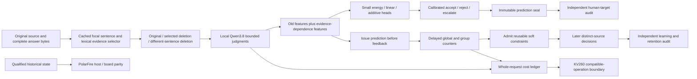
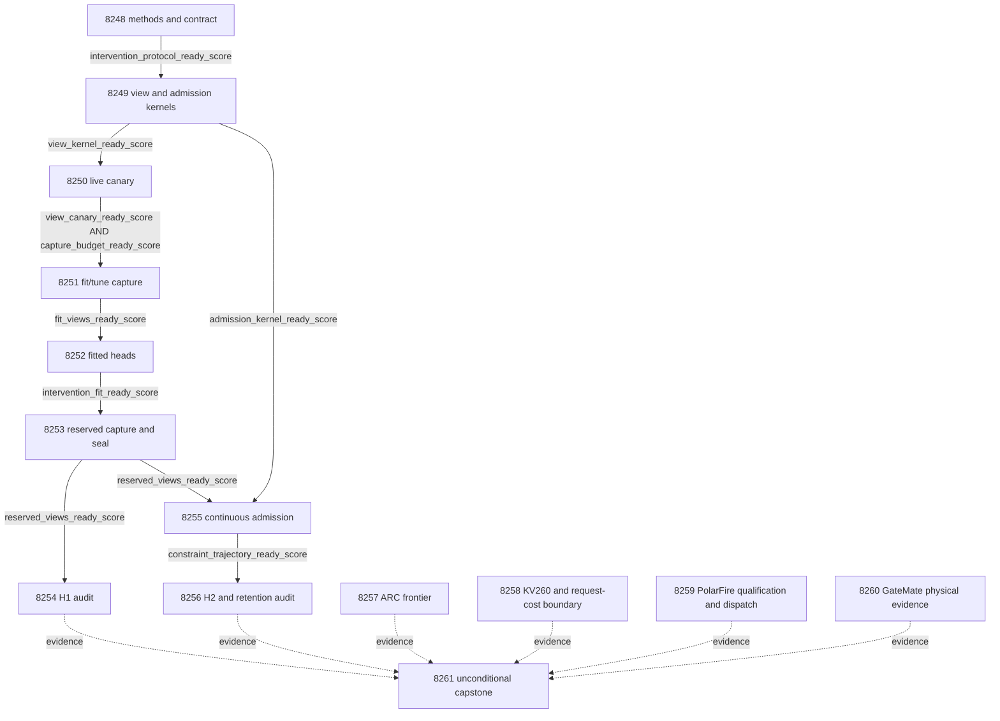

# Carnot Research Roadmap v713 — Source-evidence interventions

Canonical full-task SHA-256: `72cbedd3aebae12e162f230a1138478b6ada1fdb8ff87724e2908e1765e16fea`

**Created:** 2026-10-07. **Milestone:** 2026.10.713.
**Title:** Source-evidence interventions, continuous constraint admission, and complete request accounting.
**Status:** Proposed. Planning does not activate or execute experiments.
**Previous design:** `research-roadmap-v712-preserved-20261007.md` preserves V712.

The execution contract contains **14 tasks, Exp8248 through Exp8261**, in that
order. Four phases contain **3, 3, 3 and 5 tasks**. The task table, full JSON
objects and `research-roadmap-next.yaml` must agree. The canonical digest covers
all task fields, including complete prompts. No experiment ID is reused.

## What V712 proved

All fourteen tasks executed. Execution completion does not mean scientific
success. The archive currently ends at V711. V712's active roadmap, primary
artifacts and dated conductor log establish its actual completed task set.

| Evidence | Qualified finding | Consequence |
|---|---|---|
| Exp8234 | Current contract and margin-method readiness 1 | Reuse the qualified contract readers. |
| Exp8235 | Delayed learner validation qualified | Reuse durable issue/release and crash recovery. |
| Exp8236 | Eight canary requests; request-isolation mechanics qualified | Reuse the local bounded request route. Its fixture criterion is circular-positive. |
| Exp8237–8239 | H1 null; 97/128 complete, 30 failed, one excluded; mean gain -0.01953125; lower bound -0.04296875 | Retire the margin-only objective on this exposed cohort. |
| Exp8240–8241 | Causal trajectory qualified; 158/192 complete; incremental group-memory cost gain 0 | Change the information and admission mechanism. Do not repeat unchanged utility corrections. |
| Exp8242 | 84/96 valid requests over two sweeps; 42 valid per arm | Keep failures and cold costs. No broad deployment gain or Rust/Python 10x result. |
| Exp8243 | Reader qualified; zero new supervisor outcomes | Inspect only new outcomes; an unchanged frontier is a cheap null. |
| Exp8244 | Numerical boundary qualified; no new device execution | Measure the new workload's compatible operations and complete cost. |
| Exp8245 | Disqualified: 404/405 statements covered; schema exception path at line167 missed | Add the specific negative fixture before one bounded board dispatch. |
| Exp8246 | Physical-change block; obligation reader qualified | Preserve GateMate's 0xffffffff observation without another unchanged probe. |
| Exp8247 | All fourteen dispositions recorded; execution readiness 1, science readiness 0 | Keep all three PRD gaps open. |

Evidence: `results/experiment_8239_v712_margin_decision_audit.json`,
`results/experiment_8241_v712_delayed_benefit_audit.json`,
`results/experiment_8242_v712_independent_concurrent_service.json`, and
`results/experiment_8247_v712_capstone.json`. Exact prior task paths also remain
in the preserved design. V712's `paper_ready=true` concerns its fixed publication
gate. It does not establish a new verification or learning benefit.

## Three biggest gaps to the PRD

1. **FR-06/12: useful evidence for verified decisions.** Calibrated heads and
   decision weighting did not improve actions. New source-intervention features
   test the extraction bottleneck directly. Equal-information simple heads
   determine whether any gain comes from evidence or the energy model.
2. **FR-11: constraints that improve later queries without forgetting.**
   Recovery and counter updates work. Incremental group benefit remains null.
   Admit reusable evidence-dependence constraints from released feedback, then
   test later distinct-source decisions and a separate retention panel.
3. **FR-05/08 and NFR-01: deployment value across the complete request.**
   New evidence requires extra LLM calls. Measure those calls and durable update
   costs. Bound what existing hardware can accelerate. The 10x Rust/Python target
   remains open; this milestone does not promise a speculative native rewrite.

The ARC generalization slot and each attached-board obligation remain explicit.
The plan updates small verification heads and counter state. It does not train
the mandated generator, solve public games again, or publish externally.

## Research incorporated before design

The V713 source scan was appended to `research-references.md` before this design.
It covers all eight primary topics and all six required secondary sources.

| Finding | Experiment use | Claim boundary |
|---|---|---|
| [Entity verification, 2609.08267](https://arxiv.org/abs/2609.08267) | Exp8248–8254 test source dependence through matched deletions | This adaptation removes evidence; it is not the paper's stability algorithm or a reproduction. |
| [SEVA, 2606.29713](https://arxiv.org/abs/2606.29713) | Exp8255–8256 test diagnostics becoming reusable constraints | Borrow the question, not generator RL; separate retention is mandatory. |
| [Delayed ACI, 2609.07251](https://arxiv.org/abs/2609.07251) | Predict before delayed feedback becomes available | Our Beta-count learner inherits no conformal guarantee. |
| [ARM/EBM equivalence, 2512.15605](https://arxiv.org/abs/2512.15605) | Probability-equivalent and equal-information controls | Reparameterization alone is not correctness. |
| [Online KAN, 2602.02056](https://arxiv.org/abs/2602.02056), [forgetting, 2511.12828](https://arxiv.org/abs/2511.12828) | Count state touches and test retention | Sparse local state does not guarantee retention or local FPGA speed. |
| [FPGA co-design, 2602.15985](https://arxiv.org/abs/2602.15985), [Z1T](https://extropic.ai/writing/z1t/) | Exp8258 includes host, transfer and unsupported operations | Vendor projections exclude costs that Carnot must measure. |

EBT, neural Ising learning, NSVIF, ETS and DCCD remain relevant context.
No generator training, generic external-text reranker, or unqualified decoder
steering is reopened. Semantic Scholar citation endpoints failed. OpenReview
PDF challenges and three-week-old GitHub Trending pages limit discovery.
Kona supplies architectural context but no checked local reproduction recipe.
These limits are documented rather than interpreted as an absence of research.

## Architecture



The deleted views are deliberate source interventions. They never replace the
original answer or its human target. Each view retains exact source byte maps.
An unsupported probability is a prediction, not an executable truth oracle.
Independent labels, source-disjoint roles and equal-information controls protect
that distinction. Every reused cohort remains exposed development.

## Phase 1 — Freeze methods and qualify new mechanics

**Exp8248** binds the complete contract and freezes the protocol. Use the
original fit=128, tune=64 and evaluation=128 slots. Split tune by ascending original source_cluster_id
into calibration=32 and selection=32. Use the same ordering to split evaluation into a 96-source stream
and 32-source retention panel. The static audit uses all 128 evaluation slots.
Neither static fitting nor online learning may access retention targets.
Current partitioning does not erase historical development exposure.

Pick one focal complete answer sentence by its cached V707 unsupported
probability, with index tie-breaking. Select one complete source sentence with maximum casefolded Unicode word-set
Jaccard overlap with the focal sentence. Break all ties by original index.
Compare original evidence, removal of that sentence, and removal of the different
complete sentence with nearest embedded-token length. Record length mismatch
and overlap; no hard matching cutoff or post-result exclusion is allowed. Whole
sentences preserve answer qualifiers; original-to-view source maps expose every
removed byte. No second complete source sentence means unavailable features. A different
sentence is not certified irrelevant. No source is substituted. No human annotation determines a view or focal sentence.

**Exp8249** implements pure view transformations and the small causal admission
kernel. It reuses V707 transport and V712 persistence. Qualification includes
Unicode, redundant evidence, no controls, invalid offsets, future labels and
real crash recovery. Fixture success is circular-positive. View and admission
readiness have separate fields. This is the second infrastructure slot.

**Exp8250** runs twelve fit-source triplets, at most 36 actual calls. Each emits
at most 64 tokens under the qualified grammar. Require nine complete triplets,
exact custody and no cross-talk. No human labels are inspected. An all-zero
feature response can qualify transport. Forecast each larger capture using
actual token and canary timings. Scale only when the full planned capture fits
2400 measurement seconds plus 900 validation seconds. Reserve 1200 seconds
for implementation, tests and closeout: 4500 seconds total. Exp8249 prequalifies
the shared capture adapter. Each capture rechecks remaining total-task time
before starting; elapsed authoring time reduces its measurement allowance. Do not shrink cohorts after results.

## Phase 2 — Capture evidence, train and seal decisions

**Exp8251** captures the 192 fit/tune slots, at most 576 calls. **Exp8252** fits
heads and freezes all decisions. **Exp8253** captures the 128 evaluation slots,
at most 384 calls, then seals predictions without reading human targets.
Capture tasks checkpoint after eight sources. They retain failed and unstarted
slots, emit progress inside loops and stop before their frozen measurement cap.

Five new features augment the original sixteen: current original-view
unsupported probability, selected-deletion delta, control-deletion delta, and the
difference of those deltas, and normalized removal-length difference. Three heads receive the same twenty-one inputs and
eligible training rows. Radial energy uses twenty-one fit-only centers, linear
logistic uses twenty-one inputs, and additive uses twenty-one scalar basis terms.
Each has 22 coefficients. Preserve the qualified optimizer and ridge grid.
Use unweighted log loss. Record actual coefficient changes and convergence.

The sixteen-feature energy ablation gets separate fit-only geometry. A second
energy control gets nineteen inputs: the old sixteen, current original
probability, control-deletion delta and removal-length difference. Each ablation
has twenty-one independent fit-only centers and 22 coefficients. Retain
frozen V707 decisions, raw model probability, always-escalate, and a
probability-equivalent energy control. Calibration uses one tune half; comparator
selection uses the other. Selection is by decision cost, then Brier, then fixed
arm order. All choices and head hashes are sealed before evaluation.

For unsupported target y=1, realized costs are accept=5y, reject=1-y and
escalate=.5. Acceptance stays inside the frozen V707 accepted set. Choose the
allowed action with the lowest expected cost. Ties escalate. Unavailable new features use the same frozen V707 probability
and action for every current head. Missing frozen results escalate. Shared
fallback cannot earn a treatment gain; its acquisition cost remains counted. This conservative policy stays unchanged across head arms.

Every current LLM task declares `unsloth/Qwen3.8-27B-GGUF`, Q4_K_M, in
`MODEL_SPECS`. Exp8250/8251/8253 use **model_bounded_generation (10s floor)**:
their output budgets are small and fixed. They use the embedded GGUF tokenizer
and chat template, live CUDA and owned GPU leases. No duration is padded.
CPU readers and small-head fitting declare **no_model_load**, an empty model
list and zero current LLM calls. Historical model provenance is separate.
No load-only or full-generation task is proposed. Those classes retain their
2s and 60s floors when the actual work requires them.

## Phase 3 — Independent decision and continuous-learning tests

**Exp8254** independently reconstructs H1 from primitive view outputs, sealed
predictions and human targets. H1 uses all 128 intended slots, including missing
feature escalations. Require 72 complete sources and twelve per class. Use
10,000 source-cluster bootstrap draws and a one-sided 97.5 percent lower bound.
The bound on cost improvement must exceed .02; at least five sources improve.
Require no extra false accepts, Brier worsening <=.01 and cost worsening <=.02
against every equal-information control and the frozen baseline. Report
complete-case results separately. A new feature helping every head is distinct
from an energy-specific advantage. A qualified null can retire this exact method only after a learnable positive
control passes and allowed-action oracle headroom exceeds .02 on five sources.
Otherwise record a non-informative null. Oracle actions stay inside the audit.

**Exp8255** runs continuous constraint admission on the 96-source stream.
It uses the static head and the new evidence features, independently of H1's
success. A group key has only three public bits: cached E versus non-E relation,
selected-deletion delta >.1, and absolute control-deletion delta >.1. This gives
eight reusable groups. Keys never encode source identity, text or gold labels.

Global and group unsupported rates have Beta(1,1) priors. With n released
observations, lambda=n/(n+16). First compute
`p_global=(1-lambda_global)*p_static+lambda_global*global_rate`.
Admit a group after eight distinct released sources. Then use
`p=(1-lambda_group)*p_global+lambda_group*group_rate`; otherwise use p_global.
This adds a bounded soft energy correction. It is not a hard truth certificate.
A source with missing new features uses shared frozen fallback. Its valid due
label updates global counts identically across adaptive arms, but no group.
Retention labels never update state.

Predict and persist first; then release feedback from eight slots earlier.
All arms receive the same delayed labels. Compare frozen, global-only,
global-plus-evidence-group, and global-plus-random-group arms. The random arm
uses eight buckets fixed before labels. Seeds 101–103 affect random groups
only. They do not increase the independent sample count. Record later distinct
sources on which admitted constraints actually change decisions. Counter
updates alone do not establish learning benefit.

Reuse qualified process-exit persistence at slots 40 and 72. Require exact
resumed states, pending feedback and predictions. Measure pure counter work,
durable transaction cost, state bytes and coefficient touches separately.
Tier 1 runs on CPU now; bounded state and sparse updates define a hardware path.
No claim of 100x acceleration follows without measured complete-workload timing.

**Exp8256** independently audits H2 and retention. Require 64 complete stream
sources, eight per class, and eight nonoverlapping blocks of eight slots.
Average seeds within source before moving-block bootstrap. Use block length
eight, sensitivity lengths four and sixteen, 10,000 draws, and alpha=.025.
Require lower cost gain >.02 against global-only, five improved sources and
all registered cost, Brier and false-accept controls. Require a passing
learnable delayed-feedback control and available oracle action headroom before
interpreting a null. Uninformative nulls cannot justify scientific retirement. Enforce false-accept
constraints per seed. Require later distinct-source use of admitted constraints.

The final states predict on 32 retention sources without seeing their targets.
Seal predictions first. Require 20 complete sources and five per class, Brier
worsening <=.01, cost worsening <=.02 and zero extra false accepts versus frozen
and global-only. H2 passes only with both later benefit and retention. It remains
exposed-development causal replay. Both generalization scores stay zero.

H1 and H2 each receive alpha=.025. Their two registered benefit claims therefore
share a .05 family budget. Other comparisons are controls or descriptive
mechanism diagnostics. Missing support is blocked; a completed test with no
benefit is null. Both are terminal. Current instructions use `partial` only for
unfinished work that another attempt can complete.

## Phase 4 — Live-agent evidence, deployment boundaries and reconciliation

**Exp8257** inspects only new authenticated supervisor outcomes. No new firings
means a cheap null, satisfying the ARC anti-churn rule. With supported outcomes,
compute leave-one-game-out arm ordering. Require three games and two arms with
five firings each before proposing a change. This observational audit cannot
claim a causal policy win, new solve, or leaderboard result. It changes no live
arm table and runs no game. Authenticated live solve provenance stays explicit.

**Exp8258** maps new acquisition and memory operations to the actual KV260
operation set. It uses measured current whole-request spans, including cold
starts and persistence. Bound ideal acceleration by `1/(1-f)` using only
compatible measured work. Missing clocks remain missing. Historical quadratic
fabric with k_max<=5 cannot execute Gaussian bases, LLM generation or durable
commits by assertion. Q8.8 and Q16.16 checks report overflow, numerical error,
action changes and fallback. They are CPU numerical evidence, not board timing.

**Exp8259** adds the exact missing PolarFire schema-path fixture, then reuses
the unchanged evaluator and qualified Exp8240 state. Only after owned validation
passes does it attempt one SSH dispatch with a 60-second board deadline.
Require exact host/board hashes. The venue is board Linux CPU, not FPGA fabric.
The task remains independent of current H1/H2 so null science cannot block a
useful mechanics check.

**Exp8260** records only new dated GateMate physical evidence. With no change,
retain the terminal block once. No unchanged JTAG retry is scheduled.
**Exp8261** runs unconditionally and reconciles all fourteen dispositions,
including pre-gate artifacts at their actual paths. It checks H1/H2 independently,
records all three board obligations, and preserves G1–G4 and `paper_ready`.
Audit replays bind their own entrypoints; a producer CLI cannot stand in for one.
Historical disqualifications and missing external operands remain visible.

## Dependency graph and gate semantics



Each solid arrow is an exact structured YAML gate requiring the named field
`== 1`. Every upstream field appears in that producer's REQUIRED ARTIFACT FIELDS.
Every upstream task is earlier in this roadmap. Administrative readiness,
scientific benefit and artifact completeness are separate. The capstone, ARC
and three board tasks have no science-success pre-gates. They record unavailable
operands instead of pretending they ran a missing workload.

## Hardware requirements and allocation

| Resource | Required work | Bound or access condition |
|---|---|---|
| CPU and system RAM | Frozen source views, small-head training, audits, counter memory | Existing .venv, private scratch, durable local storage; no new hardware purchase. |
| One RTX 3090 CUDA lease | Exp8250, Exp8251, Exp8253 with cached Qwen3.8 Q4_K_M | Verify free capacity and ownership. One server per capture; do not take a busy GPU. |
| Second RTX 3090 | Optional availability only | No claim of two-GPU acceleration and no requirement to load two models. |
| KV260 | Exp8258 operation and numerical boundary | Historical quadratic fabric, k_max<=5. Future access is `ssh kria`. No new board run in this plan. |
| PolarFire | Exp8259 fixed packet dispatch | SSH, board Python, private storage; 60-second remote deadline; exact output hashes. |
| GateMate | Exp8260 physical-change ledger | Dated setup change needed before future GM1Ax detect and flashed n16 smoke. |
| XDNA NPU / Extropic TSU | Deferred | No qualified local access established. No SDK installation or purchase task. |

The hardware wishlist is context. Current authenticated evidence overrides stale
inventory prose. Additional RAM or a production FPGA is not a prerequisite.
Sparse state may later justify FPGA matching; LLM acquisition must still be
included in any acceleration claim. Vendor estimates remain separate.

## Prior failures, scope changes and stop conditions

All fourteen tasks contain four-field `prior_failures` records with
`retire_if_same_verdict: true`. The source-view kernel and canary explicitly
cite Exp7854's failed fixture validation. Their new route uses V707's qualified
transport and V712's qualified persistence. The standing 2026-05-29 lineage
continuation directive covers false-positive retirement matches; it does not
reopen unchanged fixture-only work or the retired compact-span extractor.

Before retiring either science mechanism, require a passing learnable control
and sufficient permissible-action oracle headroom. Control rows are separate
from natural data and carry circular-positive mechanics claims.

The static branch names Exp8239's null and retirement. It changes information,
not loss coefficients or thresholds. The learning branch names Exp8241's null.
It changes both the evidence and constraint-admission mechanism. PolarFire
names the exact missed path in Exp8245. GateMate's mandatory continuity audit
retains its blocker and never retries the unchanged physical technique.

All branches preserve old results. No `requires` chain references a retired
experiment. A same-verdict recurrence retires its precise scope. Infrastructure
readiness cannot become a scientific success. Missing current support yields a
named terminal block. Invalid owned checks yield disqualified. No branch gets
three futile retries by labeling unchanged external incompleteness `partial`.

## Execution and validation contract

Every prompt has CONTEXT, EXISTING CODE TO READ FIRST, TASK and numbered CONCRETE
STEPS. Every task requires progress at phase boundaries, before and after long
calls, within loops, and at least every 60 seconds while children run. Output
gaps remain below 600 seconds. Files over about 200 lines require multiple tool
calls with progress between calls. Every prompt ends with its run command and
`Do NOT push. Do NOT modify scripts/research_conductor.py.`

Specs and failing tests precede implementation. Every task runs its affected
unit/consumer checks, measured changed-code coverage, lint, strict typing,
scoped spec coverage and applicable private E2E checks. Full health diagnostics
retain their actual failures separately. Natural measurements never come from
fixtures. Cold replay, unchanged adversarial verification and strict row checks
precede atomic terminal publication. Tests use private paths outside results/.

Schema/method coordination (Exp8248) and hardware integration (Exp8259) use
Opus with max_turns=100, as requested. The pure kernel (Exp8249) uses Codex
with gpt-6.1-sol. Routine experiments retain default Sonnet. Diagnostics use
20 turns; the KV260 boundary uses 30. No experiment uses Luna or requires a
new agent backend. The default routing here follows the current planning
request rather than the older local Codex-default prose.

The plan changes no implementation code. Planning validation checks schema,
retirements, exact task/gate agreement, prompt substitution and private E2E-018
contract readers. It does not claim the proposed experiments passed.

## Public-input feasibility check

A read-only planning census found too few cached citations for the original
candidate selection rule. The final lexical selector removes that dependency.
The census read source bytes, cached predictions and feature availability only.
It ran no model and inspected no target fields. All eligible sources have at
least two complete source sentences.

| Role | Intended | Eligible before new inference |
|---|---:|---:|
| Fit | 128 | 105 |
| Calibration | 32 | 28 |
| Comparator selection | 32 | 25 |
| Evaluation | 128 | 97 |
| Online stream | 96 | 73 |
| Retention | 32 | 24 |

Inputs are the Exp8182 and Exp8184 primary artifacts and their bound
`primitive_calls.json` shards. Sort original source_cluster_id ascending before
splitting roles. Prospective complete-source floors are fit80, tune40,
evaluation72, stream64 and retention20. Class support and confidence gates
remain mandatory. These floors allow capture failures without changing the
cohort after results. They do not guarantee statistical power.

Approximate word-count matching had long tails. The final method therefore uses
nearest embedded-token length without a hard ten-percent exclusion. It records
a normalized removal-length feature and descriptive mismatch/overlap strata.
The different-sentence control is not certified irrelevant. No outcome-based
exclusions or matching changes are permitted.

## Exact task contract

The following table is the conductor order. Every task has its own primary
JSON deliverable. The JSON appendix contains the full task objects, not a
projection of selected fields.

| Order | ID | Title | Phase | Deliverable |
|---|---|---|---|---|
| 1 | `exp8248-evidence-intervention-methods` | Bind fourteen tasks and freeze matched source-evidence interventions | 1 | `results/experiment_8248_v713_evidence_intervention_methods.json` |
| 2 | `exp8249-evidence-view-kernel` | Qualify complete-sentence views and delayed constraint admission mechanics | 1 | `results/experiment_8249_v713_evidence_view_kernel.json` |
| 3 | `exp8250-evidence-view-canary` | Measure bounded Qwen response to selected and length-controlled deletions | 1 | `results/experiment_8250_v713_evidence_view_canary.json` |
| 4 | `exp8251-fit-view-capture` | Capture source-intervention features on frozen fit and tune sources | 2 | `results/experiment_8251_v713_fit_view_capture.json` |
| 5 | `exp8252-intervention-energy-fit` | Train calibrated energy decisions from evidence-dependence features | 2 | `results/experiment_8252_v713_intervention_energy_fit.json` |
| 6 | `exp8253-reserved-view-seal` | Capture and seal intervention decisions for every reserved source | 2 | `results/experiment_8253_v713_reserved_view_seal.json` |
| 7 | `exp8254-intervention-benefit-audit` | Independently test source-intervention decision benefit | 3 | `results/experiment_8254_v713_intervention_benefit_audit.json` |
| 8 | `exp8255-continuous-constraint-admission` | Learn reusable soft constraints from delayed attribution feedback | 3 | `results/experiment_8255_v713_continuous_constraint_admission.json` |
| 9 | `exp8256-constraint-learning-audit` | Audit later constraint benefit and sealed retention | 3 | `results/experiment_8256_v713_constraint_learning_audit.json` |
| 10 | `exp8257-arc-outcome-frontier` | Inspect new live supervisor outcomes for cross-game arm selection | 4 | `results/experiment_8257_v713_arc_outcome_frontier.json` |
| 11 | `exp8258-kv260-evidence-cost-boundary` | Bound new evidence and learning costs against the KV260 operation set | 4 | `results/experiment_8258_v713_kv260_evidence_cost_boundary.json` |
| 12 | `exp8259-polarfire-dispatch-qualification` | Cover the known PolarFire schema path and dispatch qualified state | 4 | `results/experiment_8259_v713_polarfire_dispatch_qualification.json` |
| 13 | `exp8260-gatemate-physical-delta` | Carry GateMate physical-change evidence and its exact reopening condition | 4 | `results/experiment_8260_v713_gatemate_physical_delta.json` |
| 14 | `exp8261-capstone` | Reconcile fourteen outcomes and decide whether evidence or learning improved | 4 | `results/experiment_8261_v713_capstone.json` |

<!-- V713_TASK_CONTRACT_START -->
```json
{"milestone": "2026.10.713", "tasks": [
{"id": "exp8248-evidence-intervention-methods", "title": "Bind fourteen tasks and freeze matched source-evidence interventions", "phase": 1, "track": "infrastructure", "priority": "high", "requires_gpu": false, "max_turns": 100, "estimated_wall_time_min": 40, "per_unit_rows": true, "milestone": "2026.10.713", "deliverable": "results/experiment_8248_v713_evidence_intervention_methods.json", "inference_substrate_class": "no_model_load", "MODEL_SPECS": [], "gated_on": [], "prior_failures": [{"experiment_id": "exp8239-margin-decision-audit", "verdict": "complete_null_margin_decision_audit", "addressed_by": "The retired margin-only objective is replaced by new matched source-removal features; all loss coefficients stay unweighted.", "retire_if_same_verdict": true}, {"experiment_id": "exp8247-capstone", "verdict": "complete_blocked_upstream_evidence", "addressed_by": "Bind current task authority directly and preserve blocked scientific inputs without requiring them for the administrative contract.", "retire_if_same_verdict": true}], "model": "opus", "prompt": "CONTEXT:\nWork in {project_root} on {date}. V712 executed fourteen tasks. Exp8239 found mean cost gain -0.01953125 with lower bound -0.04296875. Exp8241 found zero incremental group-memory gain. Stop margin-only tuning. Test new source intervention features on the qualified sentence transport.\nEXISTING CODE TO READ FIRST:\nCLAUDE.md; CODEX.md; ops/e2e-test-plan.md; openspec/capabilities/research-reporting/spec.md; openspec/capabilities/verification/spec.md; scripts/experiment_template.py; python/carnot/reporting/primary_publication.py; ops/exclusion_manifest.yaml; openspec/change-proposals/research-roadmap-vNEXT.md; python/carnot/reporting/v711_current_contract.py; python/carnot/reporting/roadmap_contract.py; python/carnot/reporting/decision_margin_methods_8234.py; python/carnot/verify/sentence_transport_8179.py; python/carnot/verify/sentence_energy_8183.py; results/experiment_8239_v712_margin_decision_audit.json; results/experiment_8241_v712_delayed_benefit_audit.json; results/experiment_8247_v712_capstone.json; research-references.md\nTASK:\nBind fourteen tasks and freeze matched source-evidence interventions. Deliver results/experiment_8248_v713_evidence_intervention_methods.json. Create the thin runner scripts/experiments/experiment_8248_v713_evidence_intervention_methods.py. Store primitive evidence under results/raw/experiment_8248_v713_evidence_intervention_methods/. Keep execution readiness separate from scientific benefit.\nCONCRETE STEPS:\n0. PRECONDITIONS: Emit a flushed start line. Authenticate required inputs and qualified terminal sidecars. Check private scratch and required tools before measurement. Missing external resources produce complete_blocked_<operand>, verdict_class=blocked. Record failed operands in gate_check_summary. Do not invent data or replace missing units.\n1. Emit a flushed progress line at every phase boundary. Emit one before and after every model load, generation, benchmark and subprocess. Print completed/pending counts inside long loops. Print a heartbeat at least every 60 seconds while children run. Keep every output gap below 600 seconds. Use unbuffered output, bounded deadlines and process-group cleanup. Write any file over about 200 lines in several tool calls of at most about 150 lines. Send a progress message between calls. Split work into resumable batches; no single huge tool call. Do not pad runtime.\n2. Add relevant REQ-* and SCENARIO-* before implementation. Write focused failing tests first. Preserve existing tests and assertions. Reuse qualified modules through small adapters. Freeze owned validation commands before measurement. Use private fixtures outside results/ and scratch outside the repository root. Do not update generator weights or publish externally.\n3. Declare no_model_load, MODEL_SPECS=[] and zero current LLM calls. Use aggregation_from_upstream_artifacts for reductions or verifier_ensemble_against_cached_candidates for small-head fitting/scoring. Record trained_head_specs separately. Reading the embedded vocabulary without neural weights is tokenizer-only work, not a model inference call.\n4. Bind exactly fourteen tasks, Exp8248 through Exp8261. Snapshot full task objects, the design, and active/staged authorities. During planning, activation is not required. At execution, verify the actual activated contract. Reuse the existing canonical digest and authority readers. Preserve V712 and its fourteen dispositions. Do not modify the active roadmap or reconstruct archived primaries.\n5. Write openspec/change-proposals/v713-evidence-intervention-protocol.json. Preserve V707 original fit=128, tune=64 and evaluation=128 source slots. Partition the 128 evaluation slots by ascending original source_cluster_id into stream=96 and retention=32. The static audit may evaluate all 128, but neither static fitting nor the online learner may read retention targets. Prove fit/tune/evaluation disjointness by original source hash. All are exposed development. Reject any stream/retention overlap with fit/tune roles; do not invent replacement sources. Seal labels separately from public inputs.\n6. Freeze one focal complete answer sentence per source using the highest cached V707 p_unsupported; break ties by sentence index. Choose one complete source sentence by maximum Jaccard overlap of casefolded Unicode word-token sets with the focal sentence; ties use the original sentence index, including zero-overlap ties. This lexical selector uses no cached citation or human label. Keep the complete original answer in each prompt. Build original, selected-evidence-deleted and nonselected-deletion source views. The control is the different complete source sentence with nearest embedded-token length; ties use its original index. Record signed removed-token difference divided by original source token count as a fifth feature. A control is nonselected, not certified irrelevant. No second complete source sentence means a named unavailable feature row. Record lexical-overlap strength and match distance as diagnostics. Never use a human error span to select a view.\n7. Freeze five added features: current original-view p_unsupported, selected-deletion probability change, control-deletion probability change, their difference, and normalized removal-length difference. Keep the sixteen historical features. These are model predictions, not entailment certificates. Measure the difference against matched controls with independent human targets. No compact rewritten claims, answer-option reranking or source-specific certificate gates.\n8. Freeze three 22-coefficient heads on the twenty-one inputs: radial energy with twenty-one fit-only centers, linear logistic, and additive with twenty-one fixed scalar bases. Reuse qualified optimization and tune-role calibration. Copy exact inherited ridge candidates and solver constants into this protocol before capture. Also fit the sixteen-feature energy ablation and a control-deletion-only energy head on nineteen inputs: the original sixteen, current original probability, control delta and removal-length difference. Give both ablations twenty-one fit-only centers and independent geometry. Retain frozen V707 decisions. Use unweighted log loss, no retired margin weighting. Split the 64 tune sources by ascending original source_cluster_id into calibration=32 and selection=32 before any fitting. Freeze comparator selection by selection-role decision cost, then Brier, then fixed arm order.\n9. Freeze cost C(accept,y)=5y, C(reject,y)=1-y, C(escalate,y)=0.5, with y=1 meaning unsupported. Keep accept limited to the frozen V707 accepted set. Choose the allowed action with lowest expected cost; ties escalate. When new views are unavailable, every current head uses the same frozen V707 probability/action; if that is unavailable, all escalate. Fallback rows cannot earn treatment gain. H1 requires a one-sided 97.5 percent source-cluster bootstrap lower cost gain above .02, at least five improved sources, at least 72 complete evaluation sources and twelve per class. Require no extra false accepts, Brier worsening <=.01 and cost worsening <=.02 versus every equal-information control and frozen baseline. Use 10,000 draws, seed 7138248; missing slots remain in the 128 denominator. H1 is development evidence only.\n10. Freeze the new continuous mechanism: add reusable soft constraint terms from released evidence-dependence groups, using delayed Beta counts and a global backoff. Keys may contain only coarse bins of the three view probabilities and relation type. They must never contain source IDs, hashes, quoted text or gold error types. Exp8255 implements this rule and Exp8256 audits it. Reserve alpha=.025 separately for H2. Use 96 stream slots, minimum 64 complete, eight per class and eight nonoverlapping blocks of eight slots. Hold 32 retention slots, minimum 20 complete and five per class. H2 requires a 97.5 percent moving-block-bootstrap lower cost gain above .02 versus global-only, five improved sources, no extra false accepts, Brier worsening <=.01 and cost worsening <=.02 versus all controls. Test block lengths 8, 4 and 16 with 10,000 draws and seed 7138256. Require retention Brier worsening <=.01, cost worsening <=.02 and zero extra false accepts versus frozen and global-only. Serialize all exact constants before capture.\n11. Run applicable private E2E-018/021 checks from ops/e2e-test-plan.md. Run relevant unit and consumer tests. Measure 100 percent changed-code statement coverage, including real CLI and child statements. Run scoped Ruff check/format, strict mypy and scripts/check_spec_coverage.py --files <owned-test-files>. Preserve actual argv, exits, clocks and stdout/stderr hashes. Keep bounded repository-health diagnostics separate; known failures do not establish a global pass.\n12. Cold-replay primitive evidence in a fresh process. Include negative and rehashed-tamper cases. Validate a private candidate with unchanged primary_publication terminal checks, scripts/adversarial_verify.py --json <private-candidate> and scripts/verdict_row_consistency_lint.py --strict <private-candidate>. Publish atomically after normal exit and required checks. Preserve historical primary bytes and honest failure artifacts. Reconcile openspec/, _bmad/traceability.md, ops/status.md and ops/changelog.md. Do not modify research-roadmap.yaml.\nREQUIRED ARTIFACT FIELDS:\nexperiment_id, task_id, milestone, run_date: principle: Identify the actual invocation.\nhonest_verdict, verdict_class: principle: Use complete_* terminal verdicts and one of positive | circular_positive | null | blocked | disqualified | partial. Partial means unfinished owned work. Unchanged external failures mean blocked.\ngate_check_summary: principle: Each block names the upstream, actual path/hash, exact field, operator, expected value and observed value. Missing evidence differs from a measured zero.\ninference_substrate, inference_substrate_class, MODEL_SPECS, model_invocation_counts: principle: Record actual current calls separately from historical model provenance.\nrows, intended_count, completed_count, failed_count, censored_count, excluded_count, independent_count: principle: Preserve every source, condition and arm, including missing units. Record metric numerators and denominators. Repeats and seeds do not add independent sources.\nverifier_is_oracle, exposure_scope, independent_generalization_score, generalized_learning_benefit_score: principle: Oracle-defined success is circular_positive. All reused sources are exposed development. Both generalization scores remain zero in this milestone.\nrequired_checks_passed, flagged_adversarial, acceptance_gates, validation_receipts, terminal_validation_sidecar_path: principle: Failed owned checks disqualify the result and set readiness to zero. Readiness does not imply benefit.\npreconditions_checked, duration_s, random_seed, reproducibility_checksum, source_artifact_hashes, code_config_hashes, raw_shard_hashes, phase_spans: principle: Bind real work to replayable primitive evidence and actual code/configuration bytes.\ncited_upstream_artifacts, field_principles: principle: Name each imported field and hash. Explain the evidentiary purpose of each added field.\ncurrent_contract_ready_score, intervention_protocol_ready_score, protocol_path, protocol_sha256, canonical_tasks_sha256, role_manifest_hashes: principle: Administrative agreement and a frozen method are separate prerequisites.\nH1, H2, feature_definitions, control_matching_rule, intervention_scope: principle: Fix methods before outcomes; altered evidence does not change the original truth label.\nRun command: cd {project_root} && PYTHONPATH=python:. PYTHONUNBUFFERED=1 .venv/bin/python -u scripts/experiments/experiment_8248_v713_evidence_intervention_methods.py --date {date}\nDo NOT push. Do NOT modify scripts/research_conductor.py."},
{"id": "exp8249-evidence-view-kernel", "title": "Qualify complete-sentence views and delayed constraint admission mechanics", "phase": 1, "track": "infrastructure", "priority": "high", "requires_gpu": false, "max_turns": 50, "estimated_wall_time_min": 40, "per_unit_rows": true, "milestone": "2026.10.713", "deliverable": "results/experiment_8249_v713_evidence_view_kernel.json", "inference_substrate_class": "no_model_load", "MODEL_SPECS": [], "gated_on": [{"upstream": "exp8248-evidence-intervention-methods", "artifact_field": "intervention_protocol_ready_score", "op": "==", "value": 1}], "prior_failures": [{"experiment_id": "exp7854-intervention-protocol", "verdict": "complete_disqualified_required_checks", "addressed_by": "Replace the failed fixture-only framework with small pure adapters around qualified V707 transport and V712 crash persistence; cover every new branch before live calls.", "retire_if_same_verdict": true}], "agent_type": "codex", "model": "gpt-6.1-sol", "operator_override": "2026-05-29 operator directive (standing): versioned lineage continuation versus exp7800, exp7839 and exp7854. Qualified V707 transport and V712 persistence replace their failed fixture harness; new matched whole-sentence deletion measures a different feature.", "prompt": "CONTEXT:\nWork in {project_root} on {date}. Exp7854 failed fixture validation before any model call. V707 subsequently qualified intact sentence transport. Build the small view transformation and bounded counter-state delta on those qualified primitives. Do not recreate the old intervention harness.\nEXISTING CODE TO READ FIRST:\nCLAUDE.md; CODEX.md; ops/e2e-test-plan.md; openspec/capabilities/research-reporting/spec.md; openspec/capabilities/verification/spec.md; scripts/experiment_template.py; python/carnot/reporting/primary_publication.py; ops/exclusion_manifest.yaml; openspec/change-proposals/research-roadmap-vNEXT.md; python/carnot/verify/sentence_evidence_8166.py; python/carnot/verify/sentence_transport_8179.py; python/carnot/verify/sentence_labels_7942.py; python/carnot/verify/fit_sentence_capture_8182.py; scripts/experiments/experiment_8240_v712_qualified_delayed_learning.py; results/experiment_7854_v682_intervention_protocol.json; results/experiment_8235_v712_learning_validation.json; results/experiment_8248_v713_evidence_intervention_methods.json\nTASK:\nQualify complete-sentence views and delayed constraint admission mechanics. Deliver results/experiment_8249_v713_evidence_view_kernel.json. Create the thin runner scripts/experiments/experiment_8249_v713_evidence_view_kernel.py. Store primitive evidence under results/raw/experiment_8249_v713_evidence_view_kernel/. Keep execution readiness separate from scientific benefit.\nCONCRETE STEPS:\n0. PRECONDITIONS: Emit a flushed start line. Authenticate required inputs and qualified terminal sidecars. Check private scratch and required tools before measurement. Missing external resources produce complete_blocked_<operand>, verdict_class=blocked. Record failed operands in gate_check_summary. Do not invent data or replace missing units.\n1. Emit a flushed progress line at every phase boundary. Emit one before and after every model load, generation, benchmark and subprocess. Print completed/pending counts inside long loops. Print a heartbeat at least every 60 seconds while children run. Keep every output gap below 600 seconds. Use unbuffered output, bounded deadlines and process-group cleanup. Write any file over about 200 lines in several tool calls of at most about 150 lines. Send a progress message between calls. Split work into resumable batches; no single huge tool call. Do not pad runtime.\n2. Add relevant REQ-* and SCENARIO-* before implementation. Write focused failing tests first. Preserve existing tests and assertions. Reuse qualified modules through small adapters. Freeze owned validation commands before measurement. Use private fixtures outside results/ and scratch outside the repository root. Do not update generator weights or publish externally.\n3. Declare no_model_load, MODEL_SPECS=[] and zero current LLM calls. Use aggregation_from_upstream_artifacts for reductions or verifier_ensemble_against_cached_candidates for small-head fitting/scoring. Record trained_head_specs separately. Reading the embedded vocabulary without neural weights is tokenizer-only work, not a model inference call.\n4. Implement the protocol view constructor as a small pure function. Preserve original UTF-8 offsets and an explicit original-to-view sentence map. Removing whole selected evidence changes the source condition intentionally. It must not shorten the answer, drop answer qualifiers or manufacture a claim. Empty sources and unavailable length controls are valid diagnostic outcomes, not synthesized support.\n5. Prequalify the shared capture adapter and role-binding interface here so later live tasks need no new acquisition infrastructure. Use scripted peers to test missing citations, repeated evidence, Unicode, negation, redundant supporting sentences, bad addresses, empty sources and context overflow. Distinguish byte-valid output from semantic truth. Reject partial records and hash drift. Test that swapping only the human label cannot change a request, view, feature or group key.\n6. Qualify the incremental memory state using the existing durable issue/release ledger. Use Beta(1,1) counts for global and group unsupported rates. Admit a new group only after eight released observations from distinct source clusters. Set lambda=n/(n+16); p_global=(1-lambda_global)*p_static+lambda_global*global_rate. For admitted groups use p=(1-lambda_group)*p_global+lambda_group*group_rate; otherwise use p_global. The global-only control stops at p_global. Freeze eight public groups: cached relation E versus non-E, selected-deletion delta >.1, and control-deletion absolute delta >.1. Each admitted group adds a soft energy term through this mixture; none is a hard truth constraint.\n7. Require all arms to see the same releases. At step t, predict and durably record before labels issued at t-8 may be released. Reject future feedback and duplicate source updates. Valid due labels from missing-feature slots update global counters identically across adaptive arms. Such slots update no group, including random groups. Retention labels never update any state. Qualify zero-state identity, bounded probabilities, exact restart, changed output on an eligible fixture, and no changes before admission. Define a private learnable stream with group-conditional error rates and delayed labels. Require the actual admission kernel to lower later decision cost versus global-only while retaining the earlier panel. Include an equal-size shuffled-group negative control. Keep this control separate from all natural rows. Fixture gains are circular_positive, not natural learning. Reuse crash coverage patching from Exp8235 instead of copying its full reporting stack.\n8. Cover the new kernel and CLI in a compact current validation manifest. Do not alter primary_publication, conductor gates, validation thresholds or historical result files. Emit separate view_kernel_ready_score and admission_kernel_ready_score; one failing component must not falsely qualify the other.\n9. Run applicable private E2E-019/020 checks from ops/e2e-test-plan.md. Run relevant unit and consumer tests. Measure 100 percent changed-code statement coverage, including real CLI and child statements. Run scoped Ruff check/format, strict mypy and scripts/check_spec_coverage.py --files <owned-test-files>. Preserve actual argv, exits, clocks and stdout/stderr hashes. Keep bounded repository-health diagnostics separate; known failures do not establish a global pass.\n10. Cold-replay primitive evidence in a fresh process. Include negative and rehashed-tamper cases. Validate a private candidate with unchanged primary_publication terminal checks, scripts/adversarial_verify.py --json <private-candidate> and scripts/verdict_row_consistency_lint.py --strict <private-candidate>. Publish atomically after normal exit and required checks. Preserve historical primary bytes and honest failure artifacts. Reconcile openspec/, _bmad/traceability.md, ops/status.md and ops/changelog.md. Do not modify research-roadmap.yaml.\nREQUIRED ARTIFACT FIELDS:\nexperiment_id, task_id, milestone, run_date: principle: Identify the actual invocation.\nhonest_verdict, verdict_class: principle: Use complete_* terminal verdicts and one of positive | circular_positive | null | blocked | disqualified | partial. Partial means unfinished owned work. Unchanged external failures mean blocked.\ngate_check_summary: principle: Each block names the upstream, actual path/hash, exact field, operator, expected value and observed value. Missing evidence differs from a measured zero.\ninference_substrate, inference_substrate_class, MODEL_SPECS, model_invocation_counts: principle: Record actual current calls separately from historical model provenance.\nrows, intended_count, completed_count, failed_count, censored_count, excluded_count, independent_count: principle: Preserve every source, condition and arm, including missing units. Record metric numerators and denominators. Repeats and seeds do not add independent sources.\nverifier_is_oracle, exposure_scope, independent_generalization_score, generalized_learning_benefit_score: principle: Oracle-defined success is circular_positive. All reused sources are exposed development. Both generalization scores remain zero in this milestone.\nrequired_checks_passed, flagged_adversarial, acceptance_gates, validation_receipts, terminal_validation_sidecar_path: principle: Failed owned checks disqualify the result and set readiness to zero. Readiness does not imply benefit.\npreconditions_checked, duration_s, random_seed, reproducibility_checksum, source_artifact_hashes, code_config_hashes, raw_shard_hashes, phase_spans: principle: Bind real work to replayable primitive evidence and actual code/configuration bytes.\ncited_upstream_artifacts, field_principles: principle: Name each imported field and hash. Explain the evidentiary purpose of each added field.\nview_kernel_ready_score, admission_kernel_ready_score, kernel_hashes, mutation_rows, state_schema, qualified_transport_reference: principle: Gate each new mechanism on its own tested behavior.\nview_byte_maps, admission_events, rejection_reasons: principle: Make custody, causal admission and negative controls independently replayable.\nRun command: cd {project_root} && PYTHONPATH=python:. PYTHONUNBUFFERED=1 .venv/bin/python -u scripts/experiments/experiment_8249_v713_evidence_view_kernel.py --date {date}\nDo NOT push. Do NOT modify scripts/research_conductor.py."},
{"id": "exp8250-evidence-view-canary", "title": "Measure bounded Qwen response to selected and length-controlled deletions", "phase": 1, "track": "verification", "priority": "high", "requires_gpu": true, "max_turns": 50, "estimated_wall_time_min": 50, "per_unit_rows": true, "milestone": "2026.10.713", "deliverable": "results/experiment_8250_v713_evidence_view_canary.json", "inference_substrate_class": "model_bounded_generation", "MODEL_SPECS": [{"hf_id": "unsloth/Qwen3.8-27B-GGUF", "quantization": "Q4_K_M"}], "gated_on": [{"upstream": "exp8249-evidence-view-kernel", "artifact_field": "view_kernel_ready_score", "op": "==", "value": 1}], "prior_failures": [{"experiment_id": "exp7854-intervention-protocol", "verdict": "complete_disqualified_required_checks", "addressed_by": "Live transport now uses the qualified V707 parser and the current pure view kernel, with complete owned validation before capture.", "retire_if_same_verdict": true}], "operator_override": "2026-05-29 operator directive (standing): versioned continuation versus exp7854. Use qualified V707 transport and the tested current view kernel for a real bounded live canary; do not repeat fixture-only requalification.", "prompt": "CONTEXT:\nWork in {project_root} on {date}. The source-view mechanism needs current live evidence. V707 transport success does not establish useful evidence sensitivity. This canary measures syntax and feasible acquisition cost before scaling.\nEXISTING CODE TO READ FIRST:\nCLAUDE.md; CODEX.md; ops/e2e-test-plan.md; openspec/capabilities/research-reporting/spec.md; openspec/capabilities/verification/spec.md; scripts/experiment_template.py; python/carnot/reporting/primary_publication.py; ops/exclusion_manifest.yaml; openspec/change-proposals/research-roadmap-vNEXT.md; python/carnot/verify/sentence_transport_canary_8181.py; python/carnot/verify/sentence_transport_8179.py; python/carnot/inference/sota_models.py; scripts/experiments/experiment_8236_v712_qualified_concurrency_canary.py; results/experiment_8249_v713_evidence_view_kernel.json; results/experiment_8248_v713_evidence_intervention_methods.json\nTASK:\nMeasure bounded Qwen response to selected and length-controlled deletions. Deliver results/experiment_8250_v713_evidence_view_canary.json. Create the thin runner scripts/experiments/experiment_8250_v713_evidence_view_canary.py. Store primitive evidence under results/raw/experiment_8250_v713_evidence_view_canary/. Keep execution readiness separate from scientific benefit.\nCONCRETE STEPS:\n0. PRECONDITIONS: Emit a flushed start line. Authenticate required inputs and qualified terminal sidecars. Check private scratch and required tools before measurement. Missing external resources produce complete_blocked_<operand>, verdict_class=blocked. Record failed operands in gate_check_summary. Do not invent data or replace missing units.\n1. Emit a flushed progress line at every phase boundary. Emit one before and after every model load, generation, benchmark and subprocess. Print completed/pending counts inside long loops. Print a heartbeat at least every 60 seconds while children run. Keep every output gap below 600 seconds. Use unbuffered output, bounded deadlines and process-group cleanup. Write any file over about 200 lines in several tool calls of at most about 150 lines. Send a progress message between calls. Split work into resumable batches; no single huge tool call. Do not pad runtime.\n2. Add relevant REQ-* and SCENARIO-* before implementation. Write focused failing tests first. Preserve existing tests and assertions. Reuse qualified modules through small adapters. Freeze owned validation commands before measurement. Use private fixtures outside results/ and scratch outside the repository root. Do not update generator weights or publish externally.\n3. Declare MODEL_SPECS with unsloth/Qwen3.8-27B-GGUF, Q4_K_M and its resolved GGUF hash. Use cached_current_model(), the embedded tokenizer/chat template and an owned CUDA GPU lease. Set CARNOT_FORCE_LIVE=1. Record live_gpu_gguf and model_bounded_generation: each call has a fixed small output budget. The duration floor is 10 seconds; never pad it. Block on unavailable model/CUDA or an unqualified lease. Record load/generation counts, response bytes, tokens, monotonic clocks and in-flight GPU telemetry. No simulated or small-model headline fallback.\n4. Use the first twelve label-blind eligible fit slots in ascending original source_cluster_id order. Retain the full intended twelve-slot roster even if a source lacks a matched control. Run all three views for the one focal sentence, at most 36 calls. Use temperature zero, seed 7138250 and at most 64 generated tokens per call. Derive the grammar bound with the embedded tokenizer first; an insufficient budget blocks that slot instead of truncating its answer.\n5. Reuse qualified transport and owned server lifecycle. Each view gets a unique request ID, fresh request state, unchanged answer bytes and source-view hash. Rotate the three view orders by source index. Preserve error responses and no-op interventions. Do not tune prompts, thresholds, control matching or source selection after observing outputs.\n6. Require at least nine complete source triplets, no request cross-talk and exact view/answer custody. Record missing-control frequency, syntax yield and probability-change distributions without reading human labels. Readiness depends on transport and custody, never on favorable effect direction. An all-zero effect is qualified null evidence.\n7. Measure current cold load, prefill, generation, serialization and shutdown spans. Forecast full fit/tune and reserved capture time from token counts and conservative canary timings. Set capture_budget_ready_score=1 only if each planned capture fits a 2400-second measurement budget plus at most 900 seconds validation. Reserve 1200 seconds for implementation, tests and closeout, giving a planned total of 4500 seconds. Exp8249 must prequalify the shared capture adapter; capture tasks only bind roles and paths. Before starting each capture, recheck the total elapsed budget and stop if its remaining allowance cannot fit the frozen roster. Otherwise block scale-up and retain a concrete cost estimate. Do not silently shrink a cohort or declare a larger wall-time estimate.\n8. Run applicable private E2E-015/019 checks from ops/e2e-test-plan.md. Run relevant unit and consumer tests. Measure 100 percent changed-code statement coverage, including real CLI and child statements. Run scoped Ruff check/format, strict mypy and scripts/check_spec_coverage.py --files <owned-test-files>. Preserve actual argv, exits, clocks and stdout/stderr hashes. Keep bounded repository-health diagnostics separate; known failures do not establish a global pass.\n9. Cold-replay primitive evidence in a fresh process. Include negative and rehashed-tamper cases. Validate a private candidate with unchanged primary_publication terminal checks, scripts/adversarial_verify.py --json <private-candidate> and scripts/verdict_row_consistency_lint.py --strict <private-candidate>. Publish atomically after normal exit and required checks. Preserve historical primary bytes and honest failure artifacts. Reconcile openspec/, _bmad/traceability.md, ops/status.md and ops/changelog.md. Do not modify research-roadmap.yaml.\nREQUIRED ARTIFACT FIELDS:\nexperiment_id, task_id, milestone, run_date: principle: Identify the actual invocation.\nhonest_verdict, verdict_class: principle: Use complete_* terminal verdicts and one of positive | circular_positive | null | blocked | disqualified | partial. Partial means unfinished owned work. Unchanged external failures mean blocked.\ngate_check_summary: principle: Each block names the upstream, actual path/hash, exact field, operator, expected value and observed value. Missing evidence differs from a measured zero.\ninference_substrate, inference_substrate_class, MODEL_SPECS, model_invocation_counts: principle: Record actual current calls separately from historical model provenance.\nrows, intended_count, completed_count, failed_count, censored_count, excluded_count, independent_count: principle: Preserve every source, condition and arm, including missing units. Record metric numerators and denominators. Repeats and seeds do not add independent sources.\nverifier_is_oracle, exposure_scope, independent_generalization_score, generalized_learning_benefit_score: principle: Oracle-defined success is circular_positive. All reused sources are exposed development. Both generalization scores remain zero in this milestone.\nrequired_checks_passed, flagged_adversarial, acceptance_gates, validation_receipts, terminal_validation_sidecar_path: principle: Failed owned checks disqualify the result and set readiness to zero. Readiness does not imply benefit.\npreconditions_checked, duration_s, random_seed, reproducibility_checksum, source_artifact_hashes, code_config_hashes, raw_shard_hashes, phase_spans: principle: Bind real work to replayable primitive evidence and actual code/configuration bytes.\ncited_upstream_artifacts, field_principles: principle: Name each imported field and hash. Explain the evidentiary purpose of each added field.\nview_canary_ready_score, capture_budget_ready_score, request_rows, complete_triplets, projected_capture_seconds: principle: Separate transport success from affordability and semantic benefit.\nmodel_path_sha256, server_argv, generated_tokens, active_gpu_telemetry, service_phase_spans: principle: Authenticate actual bounded local generation and every cost component.\nRun command: cd {project_root} && PYTHONPATH=python:. PYTHONUNBUFFERED=1 .venv/bin/python -u scripts/experiments/experiment_8250_v713_evidence_view_canary.py --date {date}\nDo NOT push. Do NOT modify scripts/research_conductor.py."},
{"id": "exp8251-fit-view-capture", "title": "Capture source-intervention features on frozen fit and tune sources", "phase": 2, "track": "verification", "priority": "high", "requires_gpu": true, "max_turns": 50, "estimated_wall_time_min": 75, "per_unit_rows": true, "milestone": "2026.10.713", "deliverable": "results/experiment_8251_v713_fit_view_capture.json", "inference_substrate_class": "model_bounded_generation", "MODEL_SPECS": [{"hf_id": "unsloth/Qwen3.8-27B-GGUF", "quantization": "Q4_K_M"}], "gated_on": [{"upstream": "exp8250-evidence-view-canary", "artifact_field": "view_canary_ready_score", "op": "==", "value": 1}, {"upstream": "exp8250-evidence-view-canary", "artifact_field": "capture_budget_ready_score", "op": "==", "value": 1}], "prior_failures": [{"experiment_id": "exp8185-sentence-decision-audit", "verdict": "complete_null_sentence_decision_null", "addressed_by": "Collect targeted cited-versus-matched deletion differences for every eligible source, replacing descriptive source-removal probes with features used by the decision model.", "retire_if_same_verdict": true}], "prompt": "CONTEXT:\nWork in {project_root} on {date}. The view canary established a bounded route and a measured budget. Capture new features without changing the original source roles or inferring correctness from a perturbation.\nEXISTING CODE TO READ FIRST:\nCLAUDE.md; CODEX.md; ops/e2e-test-plan.md; openspec/capabilities/research-reporting/spec.md; openspec/capabilities/verification/spec.md; scripts/experiment_template.py; python/carnot/reporting/primary_publication.py; ops/exclusion_manifest.yaml; openspec/change-proposals/research-roadmap-vNEXT.md; python/carnot/verify/fit_sentence_capture_8182.py; python/carnot/verify/sentence_transport_8179.py; python/carnot/verify/sentence_energy_8183.py; results/experiment_8182_v707_fit_sentence_capture.json; results/experiment_8250_v713_evidence_view_canary.json; results/experiment_8248_v713_evidence_intervention_methods.json\nTASK:\nCapture source-intervention features on frozen fit and tune sources. Deliver results/experiment_8251_v713_fit_view_capture.json. Create the thin runner scripts/experiments/experiment_8251_v713_fit_view_capture.py. Store primitive evidence under results/raw/experiment_8251_v713_fit_view_capture/. Keep execution readiness separate from scientific benefit.\nCONCRETE STEPS:\n0. PRECONDITIONS: Emit a flushed start line. Authenticate required inputs and qualified terminal sidecars. Check private scratch and required tools before measurement. Missing external resources produce complete_blocked_<operand>, verdict_class=blocked. Record failed operands in gate_check_summary. Do not invent data or replace missing units.\n1. Emit a flushed progress line at every phase boundary. Emit one before and after every model load, generation, benchmark and subprocess. Print completed/pending counts inside long loops. Print a heartbeat at least every 60 seconds while children run. Keep every output gap below 600 seconds. Use unbuffered output, bounded deadlines and process-group cleanup. Write any file over about 200 lines in several tool calls of at most about 150 lines. Send a progress message between calls. Split work into resumable batches; no single huge tool call. Do not pad runtime.\n2. Add relevant REQ-* and SCENARIO-* before implementation. Write focused failing tests first. Preserve existing tests and assertions. Reuse qualified modules through small adapters. Freeze owned validation commands before measurement. Use private fixtures outside results/ and scratch outside the repository root. Do not update generator weights or publish externally.\n3. Declare MODEL_SPECS with unsloth/Qwen3.8-27B-GGUF, Q4_K_M and its resolved GGUF hash. Use cached_current_model(), the embedded tokenizer/chat template and an owned CUDA GPU lease. Set CARNOT_FORCE_LIVE=1. Record live_gpu_gguf and model_bounded_generation: each call has a fixed small output budget. The duration floor is 10 seconds; never pad it. Block on unavailable model/CUDA or an unqualified lease. Record load/generation counts, response bytes, tokens, monotonic clocks and in-flight GPU telemetry. No simulated or small-model headline fallback.\n4. Capture three focal-sentence views for each original fit=128 and tune=64 slot, at most 576 bounded calls. Use the frozen canary configuration, at most 64 output tokens, one owned server and fixed view rotation. Check exact context lengths before each call. Never truncate natural text, inject retries selected by quality, or substitute source IDs.\n5. Write a durable request issue row before dispatch. Checkpoint completed triplets after each eight-source batch. Resume only identical source/view/model/configuration hashes. End measurement by the smaller of 2400 seconds and the remaining total-task budget minus 1200 seconds; retain all unstarted or incomplete source rows. Keep each output gap below 600 seconds even during prefill. Do not open reserved labels or sources in this task.\n6. Join the five new features to the original sixteen by source identity and role. Use the qualified source-level human target only for fit/tune roles. Any missing required view leaves all new treatment features unavailable. Every current head uses the same frozen V707 probability/action on that source, or escalates if the frozen result is unavailable. Preserve both intent-to-measure and complete-case counts. Require at least 80 complete fit sources and 40 complete tune sources, with twelve of each class in fit and eight of each class in each tune half. Low support is an external evidence block, not a syntax failure.\n7. Record complete acquisition costs, including startup, context preparation, source intervention, queueing, generation, durable writes and shutdown. Reuse existing durable Python/Rust receipt formats where applicable; do not label cached scoring as an independent request. Save primitive feature and clock shards for the later hardware boundary.\n8. Run applicable private E2E-015/019 checks from ops/e2e-test-plan.md. Run relevant unit and consumer tests. Measure 100 percent changed-code statement coverage, including real CLI and child statements. Run scoped Ruff check/format, strict mypy and scripts/check_spec_coverage.py --files <owned-test-files>. Preserve actual argv, exits, clocks and stdout/stderr hashes. Keep bounded repository-health diagnostics separate; known failures do not establish a global pass.\n9. Cold-replay primitive evidence in a fresh process. Include negative and rehashed-tamper cases. Validate a private candidate with unchanged primary_publication terminal checks, scripts/adversarial_verify.py --json <private-candidate> and scripts/verdict_row_consistency_lint.py --strict <private-candidate>. Publish atomically after normal exit and required checks. Preserve historical primary bytes and honest failure artifacts. Reconcile openspec/, _bmad/traceability.md, ops/status.md and ops/changelog.md. Do not modify research-roadmap.yaml.\nREQUIRED ARTIFACT FIELDS:\nexperiment_id, task_id, milestone, run_date: principle: Identify the actual invocation.\nhonest_verdict, verdict_class: principle: Use complete_* terminal verdicts and one of positive | circular_positive | null | blocked | disqualified | partial. Partial means unfinished owned work. Unchanged external failures mean blocked.\ngate_check_summary: principle: Each block names the upstream, actual path/hash, exact field, operator, expected value and observed value. Missing evidence differs from a measured zero.\ninference_substrate, inference_substrate_class, MODEL_SPECS, model_invocation_counts: principle: Record actual current calls separately from historical model provenance.\nrows, intended_count, completed_count, failed_count, censored_count, excluded_count, independent_count: principle: Preserve every source, condition and arm, including missing units. Record metric numerators and denominators. Repeats and seeds do not add independent sources.\nverifier_is_oracle, exposure_scope, independent_generalization_score, generalized_learning_benefit_score: principle: Oracle-defined success is circular_positive. All reused sources are exposed development. Both generalization scores remain zero in this milestone.\nrequired_checks_passed, flagged_adversarial, acceptance_gates, validation_receipts, terminal_validation_sidecar_path: principle: Failed owned checks disqualify the result and set readiness to zero. Readiness does not imply benefit.\npreconditions_checked, duration_s, random_seed, reproducibility_checksum, source_artifact_hashes, code_config_hashes, raw_shard_hashes, phase_spans: principle: Bind real work to replayable primitive evidence and actual code/configuration bytes.\ncited_upstream_artifacts, field_principles: principle: Name each imported field and hash. Explain the evidentiary purpose of each added field.\nfit_views_ready_score, fit_view_rows_path, feature_schema, role_counts, class_support: principle: Eligible feature support is explicit and independent of benefit.\nrequest_rows, service_phase_spans, acquisition_seconds, missing_control_rows: principle: Record cost and every intended source, including failed or unmatched views.\nRun command: cd {project_root} && PYTHONPATH=python:. PYTHONUNBUFFERED=1 .venv/bin/python -u scripts/experiments/experiment_8251_v713_fit_view_capture.py --date {date}\nDo NOT push. Do NOT modify scripts/research_conductor.py."},
{"id": "exp8252-intervention-energy-fit", "title": "Train calibrated energy decisions from evidence-dependence features", "phase": 2, "track": "learning", "priority": "high", "requires_gpu": false, "max_turns": 50, "estimated_wall_time_min": 45, "per_unit_rows": true, "milestone": "2026.10.713", "deliverable": "results/experiment_8252_v713_intervention_energy_fit.json", "inference_substrate_class": "no_model_load", "MODEL_SPECS": [], "gated_on": [{"upstream": "exp8251-fit-view-capture", "artifact_field": "fit_views_ready_score", "op": "==", "value": 1}], "prior_failures": [{"experiment_id": "exp8239-margin-decision-audit", "verdict": "complete_null_margin_decision_audit", "addressed_by": "Unweighted training now receives measured evidence-dependence features and matched equal-information simple heads; the retired margin-only objective stays closed.", "retire_if_same_verdict": true}], "prompt": "CONTEXT:\nWork in {project_root} on {date}. V712 margin-only fitting is retired. This task changes observable evidence while holding the training objective fixed. It satisfies the calibrated typed-decision training floor.\nEXISTING CODE TO READ FIRST:\nCLAUDE.md; CODEX.md; ops/e2e-test-plan.md; openspec/capabilities/research-reporting/spec.md; openspec/capabilities/verification/spec.md; scripts/experiment_template.py; python/carnot/reporting/primary_publication.py; ops/exclusion_manifest.yaml; openspec/change-proposals/research-roadmap-vNEXT.md; python/carnot/verify/sentence_energy_8183.py; python/carnot/verify/sentence_energy_fit_8183.py; python/carnot/verify/evidence_energy_8154.py; results/experiment_8251_v713_fit_view_capture.json; results/experiment_8248_v713_evidence_intervention_methods.json; results/experiment_8239_v712_margin_decision_audit.json\nTASK:\nTrain calibrated energy decisions from evidence-dependence features. Deliver results/experiment_8252_v713_intervention_energy_fit.json. Create the thin runner scripts/experiments/experiment_8252_v713_intervention_energy_fit.py. Store primitive evidence under results/raw/experiment_8252_v713_intervention_energy_fit/. Keep execution readiness separate from scientific benefit.\nCONCRETE STEPS:\n0. PRECONDITIONS: Emit a flushed start line. Authenticate required inputs and qualified terminal sidecars. Check private scratch and required tools before measurement. Missing external resources produce complete_blocked_<operand>, verdict_class=blocked. Record failed operands in gate_check_summary. Do not invent data or replace missing units.\n1. Emit a flushed progress line at every phase boundary. Emit one before and after every model load, generation, benchmark and subprocess. Print completed/pending counts inside long loops. Print a heartbeat at least every 60 seconds while children run. Keep every output gap below 600 seconds. Use unbuffered output, bounded deadlines and process-group cleanup. Write any file over about 200 lines in several tool calls of at most about 150 lines. Send a progress message between calls. Split work into resumable batches; no single huge tool call. Do not pad runtime.\n2. Add relevant REQ-* and SCENARIO-* before implementation. Write focused failing tests first. Preserve existing tests and assertions. Reuse qualified modules through small adapters. Freeze owned validation commands before measurement. Use private fixtures outside results/ and scratch outside the repository root. Do not update generator weights or publish externally.\n3. Declare no_model_load, MODEL_SPECS=[] and zero current LLM calls. Use aggregation_from_upstream_artifacts for reductions or verifier_ensemble_against_cached_candidates for small-head fitting/scoring. Record trained_head_specs separately. Reading the embedded vocabulary without neural weights is tokenizer-only work, not a model inference call.\n4. Fit the three twenty-one-input heads exactly as frozen: radial energy, linear logistic and additive, each with 22 coefficients. Construct centers, scaling and additive basis statistics from fit sources only. Reuse the qualified solver, ridge grid and convergence criteria from V707. Use the exact inherited grid frozen by Exp8248; do not edit the protocol after capture. Preserve source-cluster folds. No label-derived view selection or generator weight updates.\n5. Fit the sixteen-feature radial ablation and the nineteen-feature control-deletion-only radial arm using their independent fit-only geometry and twenty-one centers. Run the identical trainer, calibrator and action decoder on a private learnable fixture before natural fitting; require known informative features to reduce decision cost by more than .02 versus the no-signal ablation. Also run a shuffled-feature negative control. Record actual deltas. Fixture success is circular_positive mechanics only. Include frozen V707, raw Qwen probability, always-escalate and probability-equivalent energy controls. Use the same eligible training rows and optimization budgets for matched arms. Report coefficients before/after, train losses, convergence, parameter counts and normalized energy/probability parity.\n6. Calibrate on the frozen 32-source calibration role. Select the primary simple comparator only on the separate 32-source selection role, using cost then Brier then fixed order. Fix the energy treatment in advance. Never use evaluation targets, update the allowed accept set, or reintroduce margin weights. If a tune half lacks frozen class support, publish blocked with exact counts.\n7. Seal all head parameters, comparator choice, feature order, action rule and hashes. Emit fit readiness when numerical and validation checks pass even if tune benefit is null. Record tune results as development diagnostics only. Store head artifacts under results/raw/experiment_8252_v713_intervention_energy_fit/heads/.\n8. Run applicable private E2E-015/019 checks from ops/e2e-test-plan.md. Run relevant unit and consumer tests. Measure 100 percent changed-code statement coverage, including real CLI and child statements. Run scoped Ruff check/format, strict mypy and scripts/check_spec_coverage.py --files <owned-test-files>. Preserve actual argv, exits, clocks and stdout/stderr hashes. Keep bounded repository-health diagnostics separate; known failures do not establish a global pass.\n9. Cold-replay primitive evidence in a fresh process. Include negative and rehashed-tamper cases. Validate a private candidate with unchanged primary_publication terminal checks, scripts/adversarial_verify.py --json <private-candidate> and scripts/verdict_row_consistency_lint.py --strict <private-candidate>. Publish atomically after normal exit and required checks. Preserve historical primary bytes and honest failure artifacts. Reconcile openspec/, _bmad/traceability.md, ops/status.md and ops/changelog.md. Do not modify research-roadmap.yaml.\nREQUIRED ARTIFACT FIELDS:\nexperiment_id, task_id, milestone, run_date: principle: Identify the actual invocation.\nhonest_verdict, verdict_class: principle: Use complete_* terminal verdicts and one of positive | circular_positive | null | blocked | disqualified | partial. Partial means unfinished owned work. Unchanged external failures mean blocked.\ngate_check_summary: principle: Each block names the upstream, actual path/hash, exact field, operator, expected value and observed value. Missing evidence differs from a measured zero.\ninference_substrate, inference_substrate_class, MODEL_SPECS, model_invocation_counts: principle: Record actual current calls separately from historical model provenance.\nrows, intended_count, completed_count, failed_count, censored_count, excluded_count, independent_count: principle: Preserve every source, condition and arm, including missing units. Record metric numerators and denominators. Repeats and seeds do not add independent sources.\nverifier_is_oracle, exposure_scope, independent_generalization_score, generalized_learning_benefit_score: principle: Oracle-defined success is circular_positive. All reused sources are exposed development. Both generalization scores remain zero in this milestone.\nrequired_checks_passed, flagged_adversarial, acceptance_gates, validation_receipts, terminal_validation_sidecar_path: principle: Failed owned checks disqualify the result and set readiness to zero. Readiness does not imply benefit.\npreconditions_checked, duration_s, random_seed, reproducibility_checksum, source_artifact_hashes, code_config_hashes, raw_shard_hashes, phase_spans: principle: Bind real work to replayable primitive evidence and actual code/configuration bytes.\ncited_upstream_artifacts, field_principles: principle: Name each imported field and hash. Explain the evidentiary purpose of each added field.\nintervention_fit_ready_score, heads_path, heads_sha256, primary_comparator, comparator_sha256, calibration_split_hash: principle: Freeze all choices before reserved inference.\ntrained_head_specs, coefficient_rows, tune_rows, equivalence_error: principle: Verify actual small-head learning and fair comparisons without asserting an energy advantage from representation alone.\npositive_control_rows, positive_control_passed, oracle_headroom, informative_null_qualified: principle: Qualify controls and action headroom before interpreting or retiring null findings. Oracle values are audit-only; producers record not_evaluated when unavailable.\nRun command: cd {project_root} && PYTHONPATH=python:. PYTHONUNBUFFERED=1 .venv/bin/python -u scripts/experiments/experiment_8252_v713_intervention_energy_fit.py --date {date}\nDo NOT push. Do NOT modify scripts/research_conductor.py."},
{"id": "exp8253-reserved-view-seal", "title": "Capture and seal intervention decisions for every reserved source", "phase": 2, "track": "verification", "priority": "high", "requires_gpu": true, "max_turns": 50, "estimated_wall_time_min": 75, "per_unit_rows": true, "milestone": "2026.10.713", "deliverable": "results/experiment_8253_v713_reserved_view_seal.json", "inference_substrate_class": "model_bounded_generation", "MODEL_SPECS": [{"hf_id": "unsloth/Qwen3.8-27B-GGUF", "quantization": "Q4_K_M"}], "gated_on": [{"upstream": "exp8252-intervention-energy-fit", "artifact_field": "intervention_fit_ready_score", "op": "==", "value": 1}], "prior_failures": [{"experiment_id": "exp8239-margin-decision-audit", "verdict": "complete_null_margin_decision_audit", "addressed_by": "The reserved panel tests a different extraction signal with frozen models; it does not rerun the retired margin-only fit.", "retire_if_same_verdict": true}], "prompt": "CONTEXT:\nWork in {project_root} on {date}. The fit task sealed heads without reserved labels. Capture new views on all original evaluation slots and prepare the public feature stream for delayed learning.\nEXISTING CODE TO READ FIRST:\nCLAUDE.md; CODEX.md; ops/e2e-test-plan.md; openspec/capabilities/research-reporting/spec.md; openspec/capabilities/verification/spec.md; scripts/experiment_template.py; python/carnot/reporting/primary_publication.py; ops/exclusion_manifest.yaml; openspec/change-proposals/research-roadmap-vNEXT.md; python/carnot/verify/reserved_sentence_capture_8184.py; python/carnot/verify/fit_sentence_capture_8182.py; python/carnot/verify/sentence_energy_8183.py; results/experiment_8252_v713_intervention_energy_fit.json; results/experiment_8248_v713_evidence_intervention_methods.json; results/experiment_8184_v707_reserved_sentence_capture.json\nTASK:\nCapture and seal intervention decisions for every reserved source. Deliver results/experiment_8253_v713_reserved_view_seal.json. Create the thin runner scripts/experiments/experiment_8253_v713_reserved_view_seal.py. Store primitive evidence under results/raw/experiment_8253_v713_reserved_view_seal/. Keep execution readiness separate from scientific benefit.\nCONCRETE STEPS:\n0. PRECONDITIONS: Emit a flushed start line. Authenticate required inputs and qualified terminal sidecars. Check private scratch and required tools before measurement. Missing external resources produce complete_blocked_<operand>, verdict_class=blocked. Record failed operands in gate_check_summary. Do not invent data or replace missing units.\n1. Emit a flushed progress line at every phase boundary. Emit one before and after every model load, generation, benchmark and subprocess. Print completed/pending counts inside long loops. Print a heartbeat at least every 60 seconds while children run. Keep every output gap below 600 seconds. Use unbuffered output, bounded deadlines and process-group cleanup. Write any file over about 200 lines in several tool calls of at most about 150 lines. Send a progress message between calls. Split work into resumable batches; no single huge tool call. Do not pad runtime.\n2. Add relevant REQ-* and SCENARIO-* before implementation. Write focused failing tests first. Preserve existing tests and assertions. Reuse qualified modules through small adapters. Freeze owned validation commands before measurement. Use private fixtures outside results/ and scratch outside the repository root. Do not update generator weights or publish externally.\n3. Declare MODEL_SPECS with unsloth/Qwen3.8-27B-GGUF, Q4_K_M and its resolved GGUF hash. Use cached_current_model(), the embedded tokenizer/chat template and an owned CUDA GPU lease. Set CARNOT_FORCE_LIVE=1. Record live_gpu_gguf and model_bounded_generation: each call has a fixed small output budget. The duration floor is 10 seconds; never pad it. Block on unavailable model/CUDA or an unqualified lease. Record load/generation counts, response bytes, tokens, monotonic clocks and in-flight GPU telemetry. No simulated or small-model headline fallback.\n4. Use a public-input worker with no label-file access. Capture original, selected-deletion and nonselected control-deletion views for all 128 frozen evaluation slots, at most 384 calls. Use the unchanged bounded configuration and grammar. Retain the original incomplete and excluded sources; do not silently replace the roster.\n5. Apply every sealed head to identical available features. Action ties escalate. Missing views use the same frozen V707 probability/action for every current head, or shared escalation if the frozen result is unavailable. Write probability, permitted actions, expected costs and actual selected action for every source and arm. Seal prediction bytes before any audit reads evaluation targets. No fitting, calibration, prompt changes or selective retries are permitted.\n6. Export label-free feature records for the frozen 96-source stream and 32-source retention panel. Keep both panels disjoint from fit/tune. Preserve original timestamps and label authority in a separate release interface. Current role separation does not erase earlier development exposure.\n7. Checkpoint after each eight-source batch. Stop measurement by the smaller of 2400 seconds and the remaining total-task budget minus 1200 seconds and retain unstarted rows. Record exact current service spans and cold costs for all views. Emit reserved_views_ready_score when the sealed roster and custody are complete, even with unavailable features. Report completeness separately so scientific support gates remain auditable.\n8. Run applicable private E2E-015/019 checks from ops/e2e-test-plan.md. Run relevant unit and consumer tests. Measure 100 percent changed-code statement coverage, including real CLI and child statements. Run scoped Ruff check/format, strict mypy and scripts/check_spec_coverage.py --files <owned-test-files>. Preserve actual argv, exits, clocks and stdout/stderr hashes. Keep bounded repository-health diagnostics separate; known failures do not establish a global pass.\n9. Cold-replay primitive evidence in a fresh process. Include negative and rehashed-tamper cases. Validate a private candidate with unchanged primary_publication terminal checks, scripts/adversarial_verify.py --json <private-candidate> and scripts/verdict_row_consistency_lint.py --strict <private-candidate>. Publish atomically after normal exit and required checks. Preserve historical primary bytes and honest failure artifacts. Reconcile openspec/, _bmad/traceability.md, ops/status.md and ops/changelog.md. Do not modify research-roadmap.yaml.\nREQUIRED ARTIFACT FIELDS:\nexperiment_id, task_id, milestone, run_date: principle: Identify the actual invocation.\nhonest_verdict, verdict_class: principle: Use complete_* terminal verdicts and one of positive | circular_positive | null | blocked | disqualified | partial. Partial means unfinished owned work. Unchanged external failures mean blocked.\ngate_check_summary: principle: Each block names the upstream, actual path/hash, exact field, operator, expected value and observed value. Missing evidence differs from a measured zero.\ninference_substrate, inference_substrate_class, MODEL_SPECS, model_invocation_counts: principle: Record actual current calls separately from historical model provenance.\nrows, intended_count, completed_count, failed_count, censored_count, excluded_count, independent_count: principle: Preserve every source, condition and arm, including missing units. Record metric numerators and denominators. Repeats and seeds do not add independent sources.\nverifier_is_oracle, exposure_scope, independent_generalization_score, generalized_learning_benefit_score: principle: Oracle-defined success is circular_positive. All reused sources are exposed development. Both generalization scores remain zero in this milestone.\nrequired_checks_passed, flagged_adversarial, acceptance_gates, validation_receipts, terminal_validation_sidecar_path: principle: Failed owned checks disqualify the result and set readiness to zero. Readiness does not imply benefit.\npreconditions_checked, duration_s, random_seed, reproducibility_checksum, source_artifact_hashes, code_config_hashes, raw_shard_hashes, phase_spans: principle: Bind real work to replayable primitive evidence and actual code/configuration bytes.\ncited_upstream_artifacts, field_principles: principle: Name each imported field and hash. Explain the evidentiary purpose of each added field.\nreserved_views_ready_score, prediction_seal_path, prediction_seal_sha256, feature_rows_path, stream_manifest_hash, retention_manifest_hash: principle: Freeze predictions and separate feedback roles before target access.\nrequest_rows, service_phase_spans, arm_decisions, unavailable_feature_rows: principle: Reconstruct all decisions and complete acquisition cost from actual evidence.\nRun command: cd {project_root} && PYTHONPATH=python:. PYTHONUNBUFFERED=1 .venv/bin/python -u scripts/experiments/experiment_8253_v713_reserved_view_seal.py --date {date}\nDo NOT push. Do NOT modify scripts/research_conductor.py."},
{"id": "exp8254-intervention-benefit-audit", "title": "Independently test source-intervention decision benefit", "phase": 3, "track": "verification", "priority": "high", "requires_gpu": false, "max_turns": 50, "estimated_wall_time_min": 40, "per_unit_rows": true, "milestone": "2026.10.713", "deliverable": "results/experiment_8254_v713_intervention_benefit_audit.json", "inference_substrate_class": "no_model_load", "MODEL_SPECS": [], "gated_on": [{"upstream": "exp8253-reserved-view-seal", "artifact_field": "reserved_views_ready_score", "op": "==", "value": 1}], "prior_failures": [{"experiment_id": "exp8239-margin-decision-audit", "verdict": "complete_null_margin_decision_audit", "addressed_by": "Audit new source intervention features with equal-information controls; preserve the prior negative objective as retired.", "retire_if_same_verdict": true}], "prompt": "CONTEXT:\nWork in {project_root} on {date}. Prediction seals exist before target access. The independent reader must distinguish useful new information from an energy-specific advantage and from response sensitivity alone.\nEXISTING CODE TO READ FIRST:\nCLAUDE.md; CODEX.md; ops/e2e-test-plan.md; openspec/capabilities/research-reporting/spec.md; openspec/capabilities/verification/spec.md; scripts/experiment_template.py; python/carnot/reporting/primary_publication.py; ops/exclusion_manifest.yaml; openspec/change-proposals/research-roadmap-vNEXT.md; python/carnot/verify/sentence_decision_audit_8185.py; scripts/experiments/experiment_8239_v712_margin_decision_audit.py; python/carnot/verify/sentence_labels_7942.py; results/experiment_8253_v713_reserved_view_seal.json; results/experiment_8252_v713_intervention_energy_fit.json; results/experiment_8248_v713_evidence_intervention_methods.json\nTASK:\nIndependently test source-intervention decision benefit. Deliver results/experiment_8254_v713_intervention_benefit_audit.json. Create the thin runner scripts/experiments/experiment_8254_v713_intervention_benefit_audit.py. Store primitive evidence under results/raw/experiment_8254_v713_intervention_benefit_audit/. Keep execution readiness separate from scientific benefit.\nCONCRETE STEPS:\n0. PRECONDITIONS: Emit a flushed start line. Authenticate required inputs and qualified terminal sidecars. Check private scratch and required tools before measurement. Missing external resources produce complete_blocked_<operand>, verdict_class=blocked. Record failed operands in gate_check_summary. Do not invent data or replace missing units.\n1. Emit a flushed progress line at every phase boundary. Emit one before and after every model load, generation, benchmark and subprocess. Print completed/pending counts inside long loops. Print a heartbeat at least every 60 seconds while children run. Keep every output gap below 600 seconds. Use unbuffered output, bounded deadlines and process-group cleanup. Write any file over about 200 lines in several tool calls of at most about 150 lines. Send a progress message between calls. Split work into resumable batches; no single huge tool call. Do not pad runtime.\n2. Add relevant REQ-* and SCENARIO-* before implementation. Write focused failing tests first. Preserve existing tests and assertions. Reuse qualified modules through small adapters. Freeze owned validation commands before measurement. Use private fixtures outside results/ and scratch outside the repository root. Do not update generator weights or publish externally.\n3. Declare no_model_load, MODEL_SPECS=[] and zero current LLM calls. Use aggregation_from_upstream_artifacts for reductions or verifier_ensemble_against_cached_candidates for small-head fitting/scoring. Record trained_head_specs separately. Reading the embedded vocabulary without neural weights is tokenizer-only work, not a model inference call.\n4. Authenticate the frozen predictions, their independent human targets and source identities. Recompute all twenty-one features from raw view probabilities. Reject target-derived feature selection, view hash mismatch, incomplete source joins and any producer-reported aggregate that differs from the rows. Use an audit-specific replay entrypoint.\n5. Recompute H1 on all 128 intended slots using the frozen .025 alpha, 10,000 source-cluster bootstrap draws and fixed missing-slot escalation costs. Report complete-case estimates separately. Test the frozen treatment against the calibration-selected simple comparator and every mandatory control. Preserve both positive and negative source deltas; do not count conditions or seeds as independent examples.\n6. Report whether source interventions help any head, and separately whether the energy head beats equally informed simple heads. Recompute Brier, log loss, false accepts, coverage and action-switch matrices. Report changes versus the no-intervention ablation, matched control deletion and frozen V707 baseline. Report removal-length mismatch and lexical-overlap strata without outcome-based exclusions. A different source sentence is not certified irrelevant. Evidence sensitivity alone is not factual correctness. Set energy_specific_advantage_score=1 only if H1 passes and one-sided 97.5 percent lower cost gains exceed zero versus both equal-information simple heads. This is a conjunction, not a post-hoc winner claim.\n7. Run adversarial controls: exchange human labels while freezing features, perturb a source map, rehash a wrong aggregate, and test all-escalate and all-zero-delta fixtures. Compute oracle cost under the SAME allowed actions solely in the independent audit. Never feed oracle actions to training or inference. If H1 fails with qualified support, a passing learnable control and sufficient oracle headroom, publish complete_null_intervention_decision_benefit. If controls or headroom cannot qualify an informative test, publish complete_null_noninformative_intervention with explicit operands and no scientific retirement. If support is insufficient, publish complete_blocked_intervention_support with exact failed values. Do not gate continuous-learning execution on a positive H1.\n8. Write docs/research-notes/v713-intervention-audit.md. State that this is exposed-development evidence. If the mechanism is null, retire this exact extraction-plus-head construction only when both its learnable control passes and permissible-action oracle headroom exceeds .02 with at least five improvable sources; otherwise record a non-informative null and the missing condition; no renamed threshold sweep.\n9. Run applicable private E2E-019/021 checks from ops/e2e-test-plan.md. Run relevant unit and consumer tests. Measure 100 percent changed-code statement coverage, including real CLI and child statements. Run scoped Ruff check/format, strict mypy and scripts/check_spec_coverage.py --files <owned-test-files>. Preserve actual argv, exits, clocks and stdout/stderr hashes. Keep bounded repository-health diagnostics separate; known failures do not establish a global pass.\n10. Cold-replay primitive evidence in a fresh process. Include negative and rehashed-tamper cases. Validate a private candidate with unchanged primary_publication terminal checks, scripts/adversarial_verify.py --json <private-candidate> and scripts/verdict_row_consistency_lint.py --strict <private-candidate>. Publish atomically after normal exit and required checks. Preserve historical primary bytes and honest failure artifacts. Reconcile openspec/, _bmad/traceability.md, ops/status.md and ops/changelog.md. Do not modify research-roadmap.yaml.\nREQUIRED ARTIFACT FIELDS:\nexperiment_id, task_id, milestone, run_date: principle: Identify the actual invocation.\nhonest_verdict, verdict_class: principle: Use complete_* terminal verdicts and one of positive | circular_positive | null | blocked | disqualified | partial. Partial means unfinished owned work. Unchanged external failures mean blocked.\ngate_check_summary: principle: Each block names the upstream, actual path/hash, exact field, operator, expected value and observed value. Missing evidence differs from a measured zero.\ninference_substrate, inference_substrate_class, MODEL_SPECS, model_invocation_counts: principle: Record actual current calls separately from historical model provenance.\nrows, intended_count, completed_count, failed_count, censored_count, excluded_count, independent_count: principle: Preserve every source, condition and arm, including missing units. Record metric numerators and denominators. Repeats and seeds do not add independent sources.\nverifier_is_oracle, exposure_scope, independent_generalization_score, generalized_learning_benefit_score: principle: Oracle-defined success is circular_positive. All reused sources are exposed development. Both generalization scores remain zero in this milestone.\nrequired_checks_passed, flagged_adversarial, acceptance_gates, validation_receipts, terminal_validation_sidecar_path: principle: Failed owned checks disqualify the result and set readiness to zero. Readiness does not imply benefit.\npreconditions_checked, duration_s, random_seed, reproducibility_checksum, source_artifact_hashes, code_config_hashes, raw_shard_hashes, phase_spans: principle: Bind real work to replayable primitive evidence and actual code/configuration bytes.\ncited_upstream_artifacts, field_principles: principle: Name each imported field and hash. Explain the evidentiary purpose of each added field.\nintervention_audit_ready_score, h1_development_signal_score, energy_specific_advantage_score, H1, bootstrap_diagnostics: principle: Separate a valid audit from decision benefit and from an energy-specific effect.\nper_source_deltas, action_switch_rows, calibration_rows, mechanism_disposition: principle: Make every comparative claim reducible from paired source rows.\npositive_control_rows, positive_control_passed, oracle_headroom, informative_null_qualified: principle: Qualify controls and action headroom before interpreting or retiring null findings. Oracle values are audit-only; producers record not_evaluated when unavailable.\nRun command: cd {project_root} && PYTHONPATH=python:. PYTHONUNBUFFERED=1 .venv/bin/python -u scripts/experiments/experiment_8254_v713_intervention_benefit_audit.py --date {date}\nDo NOT push. Do NOT modify scripts/research_conductor.py."},
{"id": "exp8255-continuous-constraint-admission", "title": "Learn reusable soft constraints from delayed attribution feedback", "phase": 3, "track": "learning", "priority": "high", "requires_gpu": false, "max_turns": 50, "estimated_wall_time_min": 60, "per_unit_rows": true, "milestone": "2026.10.713", "deliverable": "results/experiment_8255_v713_continuous_constraint_admission.json", "inference_substrate_class": "no_model_load", "MODEL_SPECS": [], "gated_on": [{"upstream": "exp8249-evidence-view-kernel", "artifact_field": "admission_kernel_ready_score", "op": "==", "value": 1}, {"upstream": "exp8253-reserved-view-seal", "artifact_field": "reserved_views_ready_score", "op": "==", "value": 1}], "prior_failures": [{"experiment_id": "exp8241-delayed-benefit-audit", "verdict": "complete_null_delayed_decision_benefit", "addressed_by": "Replace utility-bin residual correction with new evidence-dependence group admission and fresh current features; compare against global and equally sized random groups with held retention.", "retire_if_same_verdict": true}], "prompt": "CONTEXT:\nWork in {project_root} on {date}. Exp8241 found no incremental gain from global-plus-group utility corrections. This attempt adds bounded evidence-dependence constraints from current source interventions, with prequential predictions and unchanged independent human labels. It is causal replay on exposed development, not a live user-learning claim.\nEXISTING CODE TO READ FIRST:\nCLAUDE.md; CODEX.md; ops/e2e-test-plan.md; openspec/capabilities/research-reporting/spec.md; openspec/capabilities/verification/spec.md; scripts/experiment_template.py; python/carnot/reporting/primary_publication.py; ops/exclusion_manifest.yaml; openspec/change-proposals/research-roadmap-vNEXT.md; scripts/experiments/experiment_8240_v712_qualified_delayed_learning.py; scripts/experiments/experiment_8235_v712_learning_validation.py; python/carnot/verify/sentence_energy_8183.py; results/experiment_8249_v713_evidence_view_kernel.json; results/experiment_8253_v713_reserved_view_seal.json; results/experiment_8248_v713_evidence_intervention_methods.json; results/experiment_8241_v712_delayed_benefit_audit.json\nTASK:\nLearn reusable soft constraints from delayed attribution feedback. Deliver results/experiment_8255_v713_continuous_constraint_admission.json. Create the thin runner scripts/experiments/experiment_8255_v713_continuous_constraint_admission.py. Store primitive evidence under results/raw/experiment_8255_v713_continuous_constraint_admission/. Keep execution readiness separate from scientific benefit.\nCONCRETE STEPS:\n0. PRECONDITIONS: Emit a flushed start line. Authenticate required inputs and qualified terminal sidecars. Check private scratch and required tools before measurement. Missing external resources produce complete_blocked_<operand>, verdict_class=blocked. Record failed operands in gate_check_summary. Do not invent data or replace missing units.\n1. Emit a flushed progress line at every phase boundary. Emit one before and after every model load, generation, benchmark and subprocess. Print completed/pending counts inside long loops. Print a heartbeat at least every 60 seconds while children run. Keep every output gap below 600 seconds. Use unbuffered output, bounded deadlines and process-group cleanup. Write any file over about 200 lines in several tool calls of at most about 150 lines. Send a progress message between calls. Split work into resumable batches; no single huge tool call. Do not pad runtime.\n2. Add relevant REQ-* and SCENARIO-* before implementation. Write focused failing tests first. Preserve existing tests and assertions. Reuse qualified modules through small adapters. Freeze owned validation commands before measurement. Use private fixtures outside results/ and scratch outside the repository root. Do not update generator weights or publish externally.\n3. Declare no_model_load, MODEL_SPECS=[] and zero current LLM calls. Use aggregation_from_upstream_artifacts for reductions or verifier_ensemble_against_cached_candidates for small-head fitting/scoring. Record trained_head_specs separately. Reading the embedded vocabulary without neural weights is tokenizer-only work, not a model inference call.\n4. Use the frozen 96-source stream from Exp8253. Load the sealed static energy head. Create a fresh durable state for each seed 101, 102 and 103. The seeds define only the random-group negative control; source order remains fixed. Preserve all missing slots and original source identities. Do not read retention labels.\n5. At each stream slot, record every arm prediction and issued state before releasing feedback from eight slots earlier. A private release service may expose only the due independent human label. The learner cannot access unreleased labels. Apply the qualified Beta-count admission kernel from Exp8249. At least eight distinct released sources must precede a new group constraint. Keep an append-only admission/deactivation ledger and exact source deduplication.\n6. Compare frozen energy, global-only adaptation, global-plus-evidence-group admission and global-plus-random-group admission. Random keys are drawn from public source hash and seed before labels; use the same eight-bin size, prior, admission threshold and memory cap. A source hash selects a random negative-control bucket only; it cannot be a fitted feature or a per-source memory key. Every adaptive arm sees identical released labels and cost limits. Due labels from missing-feature slots update only global counts, never group counts. Missing new views share the frozen V707 fallback across all arms; absent frozen results escalate. Retention never updates state.\n7. Record whether an admitted constraint fires on a later distinct source and changes its decision. A counter update alone does not establish structural or predictive benefit. Log per-update coefficient/counter touches, bytes, CPU compute time and durable transaction time. Separate pure counter latency from persistence and GPU acquisition. This provides the CPU-now and hardware-later path for FR-11.\n8. Run the frozen private learnable-stream control through the same actual runtime and record later-cost and retention operands separately. Run genuine process exits at slots 40 and 72 using the qualified Coverage.py hard-exit method. Resume into exact state, pending feedback and prediction parity against uninterrupted runs. Preserve failed crash attempts. Seal the final states and all prequential predictions. The independent audit owns H2 and retention conclusions; this task cannot tune against them.\n9. Run applicable private E2E-019/020 checks from ops/e2e-test-plan.md. Run relevant unit and consumer tests. Measure 100 percent changed-code statement coverage, including real CLI and child statements. Run scoped Ruff check/format, strict mypy and scripts/check_spec_coverage.py --files <owned-test-files>. Preserve actual argv, exits, clocks and stdout/stderr hashes. Keep bounded repository-health diagnostics separate; known failures do not establish a global pass.\n10. Cold-replay primitive evidence in a fresh process. Include negative and rehashed-tamper cases. Validate a private candidate with unchanged primary_publication terminal checks, scripts/adversarial_verify.py --json <private-candidate> and scripts/verdict_row_consistency_lint.py --strict <private-candidate>. Publish atomically after normal exit and required checks. Preserve historical primary bytes and honest failure artifacts. Reconcile openspec/, _bmad/traceability.md, ops/status.md and ops/changelog.md. Do not modify research-roadmap.yaml.\nREQUIRED ARTIFACT FIELDS:\nexperiment_id, task_id, milestone, run_date: principle: Identify the actual invocation.\nhonest_verdict, verdict_class: principle: Use complete_* terminal verdicts and one of positive | circular_positive | null | blocked | disqualified | partial. Partial means unfinished owned work. Unchanged external failures mean blocked.\ngate_check_summary: principle: Each block names the upstream, actual path/hash, exact field, operator, expected value and observed value. Missing evidence differs from a measured zero.\ninference_substrate, inference_substrate_class, MODEL_SPECS, model_invocation_counts: principle: Record actual current calls separately from historical model provenance.\nrows, intended_count, completed_count, failed_count, censored_count, excluded_count, independent_count: principle: Preserve every source, condition and arm, including missing units. Record metric numerators and denominators. Repeats and seeds do not add independent sources.\nverifier_is_oracle, exposure_scope, independent_generalization_score, generalized_learning_benefit_score: principle: Oracle-defined success is circular_positive. All reused sources are exposed development. Both generalization scores remain zero in this milestone.\nrequired_checks_passed, flagged_adversarial, acceptance_gates, validation_receipts, terminal_validation_sidecar_path: principle: Failed owned checks disqualify the result and set readiness to zero. Readiness does not imply benefit.\npreconditions_checked, duration_s, random_seed, reproducibility_checksum, source_artifact_hashes, code_config_hashes, raw_shard_hashes, phase_spans: principle: Bind real work to replayable primitive evidence and actual code/configuration bytes.\ncited_upstream_artifacts, field_principles: principle: Name each imported field and hash. Explain the evidentiary purpose of each added field.\nconstraint_trajectory_ready_score, trajectory_path, trajectory_sha256, final_state_hashes, admission_ledger_path: principle: Prove causal structural admission and exact recovery without inferring benefit.\nissued_prediction_rows, feedback_release_rows, later_constraint_use_rows, update_cost_rows, restart_parity: principle: Show what changed before each later decision and its full update cost.\npositive_control_rows, positive_control_passed, oracle_headroom, informative_null_qualified: principle: Qualify controls and action headroom before interpreting or retiring null findings. Oracle values are audit-only; producers record not_evaluated when unavailable.\nRun command: cd {project_root} && PYTHONPATH=python:. PYTHONUNBUFFERED=1 .venv/bin/python -u scripts/experiments/experiment_8255_v713_continuous_constraint_admission.py --date {date}\nDo NOT push. Do NOT modify scripts/research_conductor.py."},
{"id": "exp8256-constraint-learning-audit", "title": "Audit later constraint benefit and sealed retention", "phase": 3, "track": "learning", "priority": "high", "requires_gpu": false, "max_turns": 50, "estimated_wall_time_min": 40, "per_unit_rows": true, "milestone": "2026.10.713", "deliverable": "results/experiment_8256_v713_constraint_learning_audit.json", "inference_substrate_class": "no_model_load", "MODEL_SPECS": [], "gated_on": [{"upstream": "exp8255-continuous-constraint-admission", "artifact_field": "constraint_trajectory_ready_score", "op": "==", "value": 1}], "prior_failures": [{"experiment_id": "exp8241-delayed-benefit-audit", "verdict": "complete_null_delayed_decision_benefit", "addressed_by": "Evaluate the new evidence-dependence admission trajectory with a sealed retention panel; do not replay the unchanged utility-correction null.", "retire_if_same_verdict": true}], "prompt": "CONTEXT:\nWork in {project_root} on {date}. The online trajectory is sealed. Its valid execution does not prove that learned group structure helps later decisions. Retention targets have not been available to the learner.\nEXISTING CODE TO READ FIRST:\nCLAUDE.md; CODEX.md; ops/e2e-test-plan.md; openspec/capabilities/research-reporting/spec.md; openspec/capabilities/verification/spec.md; scripts/experiment_template.py; python/carnot/reporting/primary_publication.py; ops/exclusion_manifest.yaml; openspec/change-proposals/research-roadmap-vNEXT.md; scripts/experiments/experiment_8241_v712_delayed_benefit_audit.py; python/carnot/reporting/primary_publication.py; results/experiment_8255_v713_continuous_constraint_admission.json; results/experiment_8253_v713_reserved_view_seal.json; results/experiment_8248_v713_evidence_intervention_methods.json\nTASK:\nAudit later constraint benefit and sealed retention. Deliver results/experiment_8256_v713_constraint_learning_audit.json. Create the thin runner scripts/experiments/experiment_8256_v713_constraint_learning_audit.py. Store primitive evidence under results/raw/experiment_8256_v713_constraint_learning_audit/. Keep execution readiness separate from scientific benefit.\nCONCRETE STEPS:\n0. PRECONDITIONS: Emit a flushed start line. Authenticate required inputs and qualified terminal sidecars. Check private scratch and required tools before measurement. Missing external resources produce complete_blocked_<operand>, verdict_class=blocked. Record failed operands in gate_check_summary. Do not invent data or replace missing units.\n1. Emit a flushed progress line at every phase boundary. Emit one before and after every model load, generation, benchmark and subprocess. Print completed/pending counts inside long loops. Print a heartbeat at least every 60 seconds while children run. Keep every output gap below 600 seconds. Use unbuffered output, bounded deadlines and process-group cleanup. Write any file over about 200 lines in several tool calls of at most about 150 lines. Send a progress message between calls. Split work into resumable batches; no single huge tool call. Do not pad runtime.\n2. Add relevant REQ-* and SCENARIO-* before implementation. Write focused failing tests first. Preserve existing tests and assertions. Reuse qualified modules through small adapters. Freeze owned validation commands before measurement. Use private fixtures outside results/ and scratch outside the repository root. Do not update generator weights or publish externally.\n3. Declare no_model_load, MODEL_SPECS=[] and zero current LLM calls. Use aggregation_from_upstream_artifacts for reductions or verifier_ensemble_against_cached_candidates for small-head fitting/scoring. Record trained_head_specs separately. Reading the embedded vocabulary without neural weights is tokenizer-only work, not a model inference call.\n4. Replay issuance and release order from primitives in a fresh process. Reject future labels, duplicate updates, per-source keys and a constraint credited before admission. Recompute later distinct-source uses and every arm decision from the exact prior state. Verify every crash/resume hash.\n5. Evaluate the frozen final states on the 32 retention sources through a worker with public features only. Seal those predictions before the independent reader accesses retention labels. Do not use retention to select groups, seeds, thresholds, epochs or model states. Record retention read boundaries.\n6. Verify the actual learnable-control result. Compute allowed-action oracle headroom only in this audit, retaining it as an upper bound. Require gain above .02 and five potentially improvable later sources before interpreting a null. Compute registered H2 on all 96 stream slots. Average seeds within source before block resampling. Use block length eight, lengths four and sixteen as sensitivity analyses, 10,000 draws, seed 7138256 and alpha=.025. Require the frozen support floors, lower gain >.02 versus global-only, five improved sources, zero extra false accepts and all Brier/cost controls. Enforce the same no-extra-false-accept rule per seed. Report random-group and frozen comparisons separately.\n7. Enforce the 32-source retention gate: at least 20 complete and five per class, Brier worsening <=.01, cost worsening <=.02 and zero extra false accepts versus frozen and global-only. Require at least one admitted group to affect a later distinct-source decision before any structural-learning claim. H2 must pass both later benefit and retention. An unchanged external support shortage is blocked, never partial.\n8. Write docs/research-notes/v713-continuous-learning-audit.md. Compare complete counter, persistence and acquisition costs. Keep generalized_learning_benefit_score=0 because the cohort is exposed development. Retire this exact group/admission mechanism only after a passing learnable delayed-feedback control, sufficient allowed-action oracle headroom and qualified natural support. Otherwise emit complete_null_noninformative_learning and retain the exact missing condition; do not infer a learning limitation.\n9. Run applicable private E2E-019/020/021 checks from ops/e2e-test-plan.md. Run relevant unit and consumer tests. Measure 100 percent changed-code statement coverage, including real CLI and child statements. Run scoped Ruff check/format, strict mypy and scripts/check_spec_coverage.py --files <owned-test-files>. Preserve actual argv, exits, clocks and stdout/stderr hashes. Keep bounded repository-health diagnostics separate; known failures do not establish a global pass.\n10. Cold-replay primitive evidence in a fresh process. Include negative and rehashed-tamper cases. Validate a private candidate with unchanged primary_publication terminal checks, scripts/adversarial_verify.py --json <private-candidate> and scripts/verdict_row_consistency_lint.py --strict <private-candidate>. Publish atomically after normal exit and required checks. Preserve historical primary bytes and honest failure artifacts. Reconcile openspec/, _bmad/traceability.md, ops/status.md and ops/changelog.md. Do not modify research-roadmap.yaml.\nREQUIRED ARTIFACT FIELDS:\nexperiment_id, task_id, milestone, run_date: principle: Identify the actual invocation.\nhonest_verdict, verdict_class: principle: Use complete_* terminal verdicts and one of positive | circular_positive | null | blocked | disqualified | partial. Partial means unfinished owned work. Unchanged external failures mean blocked.\ngate_check_summary: principle: Each block names the upstream, actual path/hash, exact field, operator, expected value and observed value. Missing evidence differs from a measured zero.\ninference_substrate, inference_substrate_class, MODEL_SPECS, model_invocation_counts: principle: Record actual current calls separately from historical model provenance.\nrows, intended_count, completed_count, failed_count, censored_count, excluded_count, independent_count: principle: Preserve every source, condition and arm, including missing units. Record metric numerators and denominators. Repeats and seeds do not add independent sources.\nverifier_is_oracle, exposure_scope, independent_generalization_score, generalized_learning_benefit_score: principle: Oracle-defined success is circular_positive. All reused sources are exposed development. Both generalization scores remain zero in this milestone.\nrequired_checks_passed, flagged_adversarial, acceptance_gates, validation_receipts, terminal_validation_sidecar_path: principle: Failed owned checks disqualify the result and set readiness to zero. Readiness does not imply benefit.\npreconditions_checked, duration_s, random_seed, reproducibility_checksum, source_artifact_hashes, code_config_hashes, raw_shard_hashes, phase_spans: principle: Bind real work to replayable primitive evidence and actual code/configuration bytes.\ncited_upstream_artifacts, field_principles: principle: Name each imported field and hash. Explain the evidentiary purpose of each added field.\nconstraint_learning_audit_ready_score, h2_development_signal_score, H2, retention_gate, block_bootstrap_diagnostics: principle: Later benefit and retention must both qualify independently.\nper_source_deltas, retention_rows, causal_violation_rows, later_constraint_use_count, mechanism_disposition: principle: Trace every learning claim to later distinct sources and unchanged held retention.\npositive_control_rows, positive_control_passed, oracle_headroom, informative_null_qualified: principle: Qualify controls and action headroom before interpreting or retiring null findings. Oracle values are audit-only; producers record not_evaluated when unavailable.\nRun command: cd {project_root} && PYTHONPATH=python:. PYTHONUNBUFFERED=1 .venv/bin/python -u scripts/experiments/experiment_8256_v713_constraint_learning_audit.py --date {date}\nDo NOT push. Do NOT modify scripts/research_conductor.py."},
{"id": "exp8257-arc-outcome-frontier", "title": "Inspect new live supervisor outcomes for cross-game arm selection", "phase": 4, "track": "arc", "priority": "high", "requires_gpu": false, "max_turns": 20, "estimated_wall_time_min": 15, "per_unit_rows": true, "milestone": "2026.10.713", "deliverable": "results/experiment_8257_v713_arc_outcome_frontier.json", "inference_substrate_class": "no_model_load", "MODEL_SPECS": [], "gated_on": [], "prior_failures": [{"experiment_id": "exp8243-arc-supervisor-frontier", "verdict": "complete_null_no_new_outcomes", "addressed_by": "Mandatory anti-churn continuation inspects only a new event frontier and exits cheaply when unchanged; it does not repeat game runs or rebuild readers.", "retire_if_same_verdict": true}], "prompt": "CONTEXT:\nWork in {project_root} on {date}. Exp8243 qualified its reader and found no new outcomes. The ARC standing floor permits a zero-work null when no redirects fired. Only new authenticated environment outcomes can support cross-game selection.\nEXISTING CODE TO READ FIRST:\nCLAUDE.md; CODEX.md; ops/e2e-test-plan.md; openspec/capabilities/research-reporting/spec.md; openspec/capabilities/verification/spec.md; scripts/experiment_template.py; python/carnot/reporting/primary_publication.py; ops/exclusion_manifest.yaml; openspec/change-proposals/research-roadmap-vNEXT.md; scripts/experiments/experiment_8243_v712_arc_supervisor_frontier.py; python/carnot/reporting/arc_supervisor_v707_frontier.py; python/carnot/agentic/arc_competition_agent.py; ops/arc_solve_registry.yaml; openspec/capabilities/arc-world-model-trust-energy/spec.md; results/experiment_8243_v712_arc_supervisor_frontier.json; ops/north-star.md\nTASK:\nInspect new live supervisor outcomes for cross-game arm selection. Deliver results/experiment_8257_v713_arc_outcome_frontier.json. Create the thin runner scripts/experiments/experiment_8257_v713_arc_outcome_frontier.py. Store primitive evidence under results/raw/experiment_8257_v713_arc_outcome_frontier/. Keep execution readiness separate from scientific benefit.\nCONCRETE STEPS:\n0. PRECONDITIONS: Emit a flushed start line. Authenticate required inputs and qualified terminal sidecars. Check private scratch and required tools before measurement. Missing external resources produce complete_blocked_<operand>, verdict_class=blocked. Record failed operands in gate_check_summary. Do not invent data or replace missing units.\n1. Emit a flushed progress line at every phase boundary. Emit one before and after every model load, generation, benchmark and subprocess. Print completed/pending counts inside long loops. Print a heartbeat at least every 60 seconds while children run. Keep every output gap below 600 seconds. Use unbuffered output, bounded deadlines and process-group cleanup. Write any file over about 200 lines in several tool calls of at most about 150 lines. Send a progress message between calls. Split work into resumable batches; no single huge tool call. Do not pad runtime.\n2. Add relevant REQ-* and SCENARIO-* before implementation. Write focused failing tests first. Preserve existing tests and assertions. Reuse qualified modules through small adapters. Freeze owned validation commands before measurement. Use private fixtures outside results/ and scratch outside the repository root. Do not update generator weights or publish externally.\n3. Declare no_model_load, MODEL_SPECS=[] and zero current LLM calls. Use aggregation_from_upstream_artifacts for reductions or verifier_ensemble_against_cached_candidates for small-head fitting/scoring. Record trained_head_specs separately. Reading the embedded vocabulary without neural weights is tokenizer-only work, not a model inference call.\n4. Reuse the qualified frontier reader and exact receipt authority from Exp8243. Scan only bytes after its stored frontier. Inspect trajectory_supervisor redirects, resolved_by_levelup, actions_to_levelup and stagnations_unredirected. Authenticate game/run identities and timestamps. Do not launch games or load a model for this audit.\n5. If no new outcomes exist, emit complete_null_no_new_outcomes immediately after bounded validation. This satisfies the generalization floor. Do not create a new generic reader, infer success from action counts or manufacture an arm proposal.\n6. When outcomes exist, emit per-game/per-arm rows with support and missingness. Estimate leave-one-game-out arm ordering only when at least three games and two arms with at least five firings per arm overlap. Otherwise report insufficient support without selecting an arm. Outcomes are observational; no causal improvement claim follows.\n7. Write docs/research-notes/v713-arc-outcome-frontier.md with one falsifiable future arm-selection change if supported. Keep the actual live arm table unchanged in this read-only task. Carry the Qwen3.8 generator pin and AVO supervision/memory rationale. Grant no level-solve credit, registry increment or leaderboard submission.\n8. Run applicable private E2E-015/019 checks from ops/e2e-test-plan.md. Run relevant unit and consumer tests. Measure 100 percent changed-code statement coverage, including real CLI and child statements. Run scoped Ruff check/format, strict mypy and scripts/check_spec_coverage.py --files <owned-test-files>. Preserve actual argv, exits, clocks and stdout/stderr hashes. Keep bounded repository-health diagnostics separate; known failures do not establish a global pass.\n9. Cold-replay primitive evidence in a fresh process. Include negative and rehashed-tamper cases. Validate a private candidate with unchanged primary_publication terminal checks, scripts/adversarial_verify.py --json <private-candidate> and scripts/verdict_row_consistency_lint.py --strict <private-candidate>. Publish atomically after normal exit and required checks. Preserve historical primary bytes and honest failure artifacts. Reconcile openspec/, _bmad/traceability.md, ops/status.md and ops/changelog.md. Do not modify research-roadmap.yaml.\nREQUIRED ARTIFACT FIELDS:\nexperiment_id, task_id, milestone, run_date: principle: Identify the actual invocation.\nhonest_verdict, verdict_class: principle: Use complete_* terminal verdicts and one of positive | circular_positive | null | blocked | disqualified | partial. Partial means unfinished owned work. Unchanged external failures mean blocked.\ngate_check_summary: principle: Each block names the upstream, actual path/hash, exact field, operator, expected value and observed value. Missing evidence differs from a measured zero.\ninference_substrate, inference_substrate_class, MODEL_SPECS, model_invocation_counts: principle: Record actual current calls separately from historical model provenance.\nrows, intended_count, completed_count, failed_count, censored_count, excluded_count, independent_count: principle: Preserve every source, condition and arm, including missing units. Record metric numerators and denominators. Repeats and seeds do not add independent sources.\nverifier_is_oracle, exposure_scope, independent_generalization_score, generalized_learning_benefit_score: principle: Oracle-defined success is circular_positive. All reused sources are exposed development. Both generalization scores remain zero in this milestone.\nrequired_checks_passed, flagged_adversarial, acceptance_gates, validation_receipts, terminal_validation_sidecar_path: principle: Failed owned checks disqualify the result and set readiness to zero. Readiness does not imply benefit.\npreconditions_checked, duration_s, random_seed, reproducibility_checksum, source_artifact_hashes, code_config_hashes, raw_shard_hashes, phase_spans: principle: Bind real work to replayable primitive evidence and actual code/configuration bytes.\ncited_upstream_artifacts, field_principles: principle: Name each imported field and hash. Explain the evidentiary purpose of each added field.\narc_delta_ready_score, arc_evidence_ready_score, new_outcome_count, receipt_frontier, per_game_results: principle: Distinguish reader readiness from new cross-game evidence.\nsolve_provenance, credited_new_levels, proposed_arm_change: principle: This task claims zero new solves. Retained live outcomes use live_agent_self_discovery only when authenticated; development proxies retain development_proxy.\nRun command: cd {project_root} && PYTHONPATH=python:. PYTHONUNBUFFERED=1 .venv/bin/python -u scripts/experiments/experiment_8257_v713_arc_outcome_frontier.py --date {date}\nDo NOT push. Do NOT modify scripts/research_conductor.py."},
{"id": "exp8258-kv260-evidence-cost-boundary", "title": "Bound new evidence and learning costs against the KV260 operation set", "phase": 4, "track": "hardware", "priority": "high", "requires_gpu": false, "max_turns": 30, "estimated_wall_time_min": 30, "per_unit_rows": true, "milestone": "2026.10.713", "deliverable": "results/experiment_8258_v713_kv260_evidence_cost_boundary.json", "inference_substrate_class": "no_model_load", "MODEL_SPECS": [], "gated_on": [], "prior_failures": [{"experiment_id": "exp8244-kv260-decision-boundary", "verdict": "complete_null_kv260_decision_boundary", "addressed_by": "Evaluate the new three-view acquisition and admitted counter workload; reuse the qualified boundary reader instead of another identical precision sweep.", "retire_if_same_verdict": true}], "prompt": "CONTEXT:\nWork in {project_root} on {date}. V712 qualified a numerical boundary without new device work. Current intervention calls add real acquisition cost. Sparse memory updates need a separate operation map; a Gaussian energy head is not a quadratic Ising workload.\nEXISTING CODE TO READ FIRST:\nCLAUDE.md; CODEX.md; ops/e2e-test-plan.md; openspec/capabilities/research-reporting/spec.md; openspec/capabilities/verification/spec.md; scripts/experiment_template.py; python/carnot/reporting/primary_publication.py; ops/exclusion_manifest.yaml; openspec/change-proposals/research-roadmap-vNEXT.md; scripts/experiments/experiment_8244_v712_kv260_decision_boundary.py; results/experiment_8244_v712_kv260_decision_boundary.json; results/experiment_8242_v712_independent_concurrent_service.json; results/experiment_8251_v713_fit_view_capture.json; results/experiment_8253_v713_reserved_view_seal.json; results/experiment_8255_v713_continuous_constraint_admission.json; research-hardware-wishlist.md; ops/hardware-bringup-prep.md\nTASK:\nBound new evidence and learning costs against the KV260 operation set. Deliver results/experiment_8258_v713_kv260_evidence_cost_boundary.json. Create the thin runner scripts/experiments/experiment_8258_v713_kv260_evidence_cost_boundary.py. Store primitive evidence under results/raw/experiment_8258_v713_kv260_evidence_cost_boundary/. Keep execution readiness separate from scientific benefit.\nCONCRETE STEPS:\n0. PRECONDITIONS: Emit a flushed start line. Authenticate required inputs and qualified terminal sidecars. Check private scratch and required tools before measurement. Missing external resources produce complete_blocked_<operand>, verdict_class=blocked. Record failed operands in gate_check_summary. Do not invent data or replace missing units.\n1. Emit a flushed progress line at every phase boundary. Emit one before and after every model load, generation, benchmark and subprocess. Print completed/pending counts inside long loops. Print a heartbeat at least every 60 seconds while children run. Keep every output gap below 600 seconds. Use unbuffered output, bounded deadlines and process-group cleanup. Write any file over about 200 lines in several tool calls of at most about 150 lines. Send a progress message between calls. Split work into resumable batches; no single huge tool call. Do not pad runtime.\n2. Add relevant REQ-* and SCENARIO-* before implementation. Write focused failing tests first. Preserve existing tests and assertions. Reuse qualified modules through small adapters. Freeze owned validation commands before measurement. Use private fixtures outside results/ and scratch outside the repository root. Do not update generator weights or publish externally.\n3. Declare no_model_load, MODEL_SPECS=[] and zero current LLM calls. Use aggregation_from_upstream_artifacts for reductions or verifier_ensemble_against_cached_candidates for small-head fitting/scoring. Record trained_head_specs separately. Reading the embedded vocabulary without neural weights is tokenizer-only work, not a model inference call.\n4. Run unconditionally. Reuse qualified hardware evidence and numerical boundary readers. Resolve current capture, small-head and counter-update primitives when eligible. Missing current science operands must yield named boundary rows, while the KV260 obligation remains readable. Do not gate hardware accounting on a scientific win.\n5. Build an operation ledger for source segmentation, three Qwen requests, scalar features, Gaussian/additive heads, count lookup, counter update, persistence and transfers. Mark the historically supported KV260 quadratic fabric scope k_max<=5. Do not map Gaussian bases, token generation or durable database commits to that fabric without implemented numerical evidence.\n6. Recompute whole-request phase shares from actual current spans, counting each cold start once. Report sequential latency and observed parallel makespan separately; do not sum overlapping requests. Bound ideal compatible-kernel acceleration by 1/(1-f), with f from measured eligible spans. If no compatible measured span exists, report f=0 and the resulting bound, or unavailable when clocks are absent. Keep the NFR-01 Rust/Python 10x target unmet unless measured matched evidence already proves it.\n7. Use actual coefficients and admitted state for bounded fixed-point error checks at Q8.8 and Q16.16. Report overflow, probability error, action flips and CPU fallback. Run synthetic fixtures separately when no eligible natural state exists. The fixture is a numerical mechanics result, not natural head benefit or an FPGA measurement.\n8. Write docs/research-notes/v713-kv260-evidence-cost.md. Retain the exact existing board transcript/hash and SSH-only access path ssh kria. This task schedules no probe, new RTL, synthesis or flash. State the exact useful compatible workload needed to reopen device timing. Preserve NPU/TSU access limits and vendor estimate boundaries.\n9. Run applicable private E2E-015/019 checks from ops/e2e-test-plan.md. Run relevant unit and consumer tests. Measure 100 percent changed-code statement coverage, including real CLI and child statements. Run scoped Ruff check/format, strict mypy and scripts/check_spec_coverage.py --files <owned-test-files>. Preserve actual argv, exits, clocks and stdout/stderr hashes. Keep bounded repository-health diagnostics separate; known failures do not establish a global pass.\n10. Cold-replay primitive evidence in a fresh process. Include negative and rehashed-tamper cases. Validate a private candidate with unchanged primary_publication terminal checks, scripts/adversarial_verify.py --json <private-candidate> and scripts/verdict_row_consistency_lint.py --strict <private-candidate>. Publish atomically after normal exit and required checks. Preserve historical primary bytes and honest failure artifacts. Reconcile openspec/, _bmad/traceability.md, ops/status.md and ops/changelog.md. Do not modify research-roadmap.yaml.\nREQUIRED ARTIFACT FIELDS:\nexperiment_id, task_id, milestone, run_date: principle: Identify the actual invocation.\nhonest_verdict, verdict_class: principle: Use complete_* terminal verdicts and one of positive | circular_positive | null | blocked | disqualified | partial. Partial means unfinished owned work. Unchanged external failures mean blocked.\ngate_check_summary: principle: Each block names the upstream, actual path/hash, exact field, operator, expected value and observed value. Missing evidence differs from a measured zero.\ninference_substrate, inference_substrate_class, MODEL_SPECS, model_invocation_counts: principle: Record actual current calls separately from historical model provenance.\nrows, intended_count, completed_count, failed_count, censored_count, excluded_count, independent_count: principle: Preserve every source, condition and arm, including missing units. Record metric numerators and denominators. Repeats and seeds do not add independent sources.\nverifier_is_oracle, exposure_scope, independent_generalization_score, generalized_learning_benefit_score: principle: Oracle-defined success is circular_positive. All reused sources are exposed development. Both generalization scores remain zero in this milestone.\nrequired_checks_passed, flagged_adversarial, acceptance_gates, validation_receipts, terminal_validation_sidecar_path: principle: Failed owned checks disqualify the result and set readiness to zero. Readiness does not imply benefit.\npreconditions_checked, duration_s, random_seed, reproducibility_checksum, source_artifact_hashes, code_config_hashes, raw_shard_hashes, phase_spans: principle: Bind real work to replayable primitive evidence and actual code/configuration bytes.\ncited_upstream_artifacts, field_principles: principle: Name each imported field and hash. Explain the evidentiary purpose of each added field.\nkv260_boundary_ready_score, operation_rows, phase_cost_rows, fixed_point_rows, ideal_whole_request_bound: principle: Bound compatible computation within complete observed request costs.\nkv260_obligation, current_device_execution_count, nfr01_met, source_cost_scope: principle: Retain hardware obligations and separate historical fabric evidence from current host measurements.\nRun command: cd {project_root} && PYTHONPATH=python:. PYTHONUNBUFFERED=1 .venv/bin/python -u scripts/experiments/experiment_8258_v713_kv260_evidence_cost_boundary.py --date {date}\nDo NOT push. Do NOT modify scripts/research_conductor.py."},
{"id": "exp8259-polarfire-dispatch-qualification", "title": "Cover the known PolarFire schema path and dispatch qualified state", "phase": 4, "track": "hardware", "priority": "high", "requires_gpu": false, "max_turns": 100, "estimated_wall_time_min": 50, "per_unit_rows": true, "milestone": "2026.10.713", "deliverable": "results/experiment_8259_v713_polarfire_dispatch_qualification.json", "inference_substrate_class": "no_model_load", "MODEL_SPECS": [], "gated_on": [], "prior_failures": [{"experiment_id": "exp8245-polarfire-state-dispatch", "verdict": "complete_disqualified_polarfire_state_dispatch", "addressed_by": "A targeted authenticated-but-schema-invalid fixture covers the one missed exception branch before reusing the existing evaluator for a single bounded SSH dispatch.", "retire_if_same_verdict": true}], "model": "opus", "prompt": "CONTEXT:\nWork in {project_root} on {date}. Exp8245 failed 100 percent coverage: 404 of 405 statements were covered. The uncovered line167 adds a schema failure after prior byte checks pass. No current device execution was credited. This task fixes that precise validation gap before one bounded dispatch.\nEXISTING CODE TO READ FIRST:\nCLAUDE.md; CODEX.md; ops/e2e-test-plan.md; openspec/capabilities/research-reporting/spec.md; openspec/capabilities/verification/spec.md; scripts/experiment_template.py; python/carnot/reporting/primary_publication.py; ops/exclusion_manifest.yaml; openspec/change-proposals/research-roadmap-vNEXT.md; python/carnot/reporting/polarfire_state_dispatch_8245.py; python/carnot/reporting/polarfire_dispatch_execution_8245.py; python/carnot/reporting/polarfire_packet_evaluator_8245.py; tests/python/test_polarfire_state_dispatch_8245.py; results/experiment_8245_v712_polarfire_state_dispatch.json; results/experiment_8240_v712_qualified_delayed_learning.json; ops/hardware-bringup-prep.md; research-hardware-wishlist.md\nTASK:\nCover the known PolarFire schema path and dispatch qualified state. Deliver results/experiment_8259_v713_polarfire_dispatch_qualification.json. Create the thin runner scripts/experiments/experiment_8259_v713_polarfire_dispatch_qualification.py. Store primitive evidence under results/raw/experiment_8259_v713_polarfire_dispatch_qualification/. Keep execution readiness separate from scientific benefit.\nCONCRETE STEPS:\n0. PRECONDITIONS: Emit a flushed start line. Authenticate required inputs and qualified terminal sidecars. Check private scratch and required tools before measurement. Missing external resources produce complete_blocked_<operand>, verdict_class=blocked. Record failed operands in gate_check_summary. Do not invent data or replace missing units.\n1. Emit a flushed progress line at every phase boundary. Emit one before and after every model load, generation, benchmark and subprocess. Print completed/pending counts inside long loops. Print a heartbeat at least every 60 seconds while children run. Keep every output gap below 600 seconds. Use unbuffered output, bounded deadlines and process-group cleanup. Write any file over about 200 lines in several tool calls of at most about 150 lines. Send a progress message between calls. Split work into resumable batches; no single huge tool call. Do not pad runtime.\n2. Add relevant REQ-* and SCENARIO-* before implementation. Write focused failing tests first. Preserve existing tests and assertions. Reuse qualified modules through small adapters. Freeze owned validation commands before measurement. Use private fixtures outside results/ and scratch outside the repository root. Do not update generator weights or publish externally.\n3. Declare no_model_load, MODEL_SPECS=[] and zero current LLM calls. Use aggregation_from_upstream_artifacts for reductions or verifier_ensemble_against_cached_candidates for small-head fitting/scoring. Record trained_head_specs separately. Reading the embedded vocabulary without neural weights is tokenizer-only work, not a model inference call.\n4. Preserve the Exp8245 primary and failure logs. Add a private fixture whose authenticated input passes earlier hashes but raises a schema exception before any failed check exists. Assert the required_input_schema_and_hash row and cover the exact exception path at line167. Keep all original tests and failure assertions. Do not lower coverage or add exclusions.\n5. Run the complete unchanged owned validation manifest, including real CLI statements. Bind the existing evaluator and packet schema through a thin current runner. Use the already-qualified Exp8240 natural state for this mechanics task; no dependency on current H1/H2 is needed. Do not invent a new board protocol or claim learned benefit from dispatch.\n6. Only after owned validation passes, check ssh -o ConnectTimeout=5 -o BatchMode=yes polarfire true, board Python and private temporary storage. Stop on a named external block. Copy a hash-bound packet and self-contained existing evaluator. Run one board-local Linux CPU evaluation with a 60-second deadline. Capture commands, stdout/stderr, packet and output hashes. Clean the private board directory.\n7. Require exact host/board output hashes on all fixed packet queries. Record polarfire_workload_validated only from the authenticated board transcript. SSH reachability alone, a local simulation or a host-generated output cannot satisfy it. Preserve transfer-inclusive clocks. This is CPU dispatch, not FPGA-fabric acceleration or a speedup claim.\n8. Run applicable private E2E-015/019 checks from ops/e2e-test-plan.md. Run relevant unit and consumer tests. Measure 100 percent changed-code statement coverage, including real CLI and child statements. Run scoped Ruff check/format, strict mypy and scripts/check_spec_coverage.py --files <owned-test-files>. Preserve actual argv, exits, clocks and stdout/stderr hashes. Keep bounded repository-health diagnostics separate; known failures do not establish a global pass.\n9. Cold-replay primitive evidence in a fresh process. Include negative and rehashed-tamper cases. Validate a private candidate with unchanged primary_publication terminal checks, scripts/adversarial_verify.py --json <private-candidate> and scripts/verdict_row_consistency_lint.py --strict <private-candidate>. Publish atomically after normal exit and required checks. Preserve historical primary bytes and honest failure artifacts. Reconcile openspec/, _bmad/traceability.md, ops/status.md and ops/changelog.md. Do not modify research-roadmap.yaml.\nREQUIRED ARTIFACT FIELDS:\nexperiment_id, task_id, milestone, run_date: principle: Identify the actual invocation.\nhonest_verdict, verdict_class: principle: Use complete_* terminal verdicts and one of positive | circular_positive | null | blocked | disqualified | partial. Partial means unfinished owned work. Unchanged external failures mean blocked.\ngate_check_summary: principle: Each block names the upstream, actual path/hash, exact field, operator, expected value and observed value. Missing evidence differs from a measured zero.\ninference_substrate, inference_substrate_class, MODEL_SPECS, model_invocation_counts: principle: Record actual current calls separately from historical model provenance.\nrows, intended_count, completed_count, failed_count, censored_count, excluded_count, independent_count: principle: Preserve every source, condition and arm, including missing units. Record metric numerators and denominators. Repeats and seeds do not add independent sources.\nverifier_is_oracle, exposure_scope, independent_generalization_score, generalized_learning_benefit_score: principle: Oracle-defined success is circular_positive. All reused sources are exposed development. Both generalization scores remain zero in this milestone.\nrequired_checks_passed, flagged_adversarial, acceptance_gates, validation_receipts, terminal_validation_sidecar_path: principle: Failed owned checks disqualify the result and set readiness to zero. Readiness does not imply benefit.\npreconditions_checked, duration_s, random_seed, reproducibility_checksum, source_artifact_hashes, code_config_hashes, raw_shard_hashes, phase_spans: principle: Bind real work to replayable primitive evidence and actual code/configuration bytes.\ncited_upstream_artifacts, field_principles: principle: Name each imported field and hash. Explain the evidentiary purpose of each added field.\npolarfire_validation_ready_score, polarfire_workload_validated, coverage_statement_counts, packet_sha256, board_transcript_path, board_output_hashes: principle: Distinguish corrected validation from actual device parity.\npolarfire_obligation, current_device_execution_count, state_origin, transfer_seconds, board_cpu_seconds: principle: Bind mechanics claims to real operations and qualified state.\nRun command: cd {project_root} && PYTHONPATH=python:. PYTHONUNBUFFERED=1 .venv/bin/python -u scripts/experiments/experiment_8259_v713_polarfire_dispatch_qualification.py --date {date}\nDo NOT push. Do NOT modify scripts/research_conductor.py."},
{"id": "exp8260-gatemate-physical-delta", "title": "Carry GateMate physical-change evidence and its exact reopening condition", "phase": 4, "track": "hardware", "priority": "high", "requires_gpu": false, "max_turns": 20, "estimated_wall_time_min": 10, "per_unit_rows": true, "milestone": "2026.10.713", "deliverable": "results/experiment_8260_v713_gatemate_physical_delta.json", "inference_substrate_class": "no_model_load", "MODEL_SPECS": [], "gated_on": [], "prior_failures": [{"experiment_id": "exp8246-gatemate-change-ledger", "verdict": "complete_blocked_gatemate_physical_change", "addressed_by": "Required continuity consumes only a new physical-evidence frontier and preserves the qualified reader; it does not repeat the blocked JTAG technique.", "retire_if_same_verdict": true}], "operator_override": "2026-05-29 operator directive (standing): active hardware continuity versus exp8246 and prior GateMate physical blockers. Audit only new setup evidence; unchanged detect/flash attempts remain closed.", "prompt": "CONTEXT:\nWork in {project_root} on {date}. Exp8246 retained the unchanged 0xffffffff JTAG block. Mandatory hardware continuity requires a visible obligation, not another identical detect attempt.\nEXISTING CODE TO READ FIRST:\nCLAUDE.md; CODEX.md; ops/e2e-test-plan.md; openspec/capabilities/research-reporting/spec.md; openspec/capabilities/verification/spec.md; scripts/experiment_template.py; python/carnot/reporting/primary_publication.py; ops/exclusion_manifest.yaml; openspec/change-proposals/research-roadmap-vNEXT.md; scripts/experiments/experiment_8246_v712_gatemate_change_ledger.py; results/experiment_8246_v712_gatemate_change_ledger.json; docs/research-notes/v712-gatemate-change-ledger.md; docs/jtag-wiring-gatemate-dirtyjtag.md; ops/operator-followup.md; ops/hardware-bringup-prep.md; research-hardware-wishlist.md\nTASK:\nCarry GateMate physical-change evidence and its exact reopening condition. Deliver results/experiment_8260_v713_gatemate_physical_delta.json. Create the thin runner scripts/experiments/experiment_8260_v713_gatemate_physical_delta.py. Store primitive evidence under results/raw/experiment_8260_v713_gatemate_physical_delta/. Keep execution readiness separate from scientific benefit.\nCONCRETE STEPS:\n0. PRECONDITIONS: Emit a flushed start line. Authenticate required inputs and qualified terminal sidecars. Check private scratch and required tools before measurement. Missing external resources produce complete_blocked_<operand>, verdict_class=blocked. Record failed operands in gate_check_summary. Do not invent data or replace missing units.\n1. Emit a flushed progress line at every phase boundary. Emit one before and after every model load, generation, benchmark and subprocess. Print completed/pending counts inside long loops. Print a heartbeat at least every 60 seconds while children run. Keep every output gap below 600 seconds. Use unbuffered output, bounded deadlines and process-group cleanup. Write any file over about 200 lines in several tool calls of at most about 150 lines. Send a progress message between calls. Split work into resumable batches; no single huge tool call. Do not pad runtime.\n2. Add relevant REQ-* and SCENARIO-* before implementation. Write focused failing tests first. Preserve existing tests and assertions. Reuse qualified modules through small adapters. Freeze owned validation commands before measurement. Use private fixtures outside results/ and scratch outside the repository root. Do not update generator weights or publish externally.\n3. Declare no_model_load, MODEL_SPECS=[] and zero current LLM calls. Use aggregation_from_upstream_artifacts for reductions or verifier_ensemble_against_cached_candidates for small-head fitting/scoring. Record trained_head_specs separately. Reading the embedded vocabulary without neural weights is tokenizer-only work, not a model inference call.\n4. Reuse the qualified physical-change ledger. Inspect only dated operator cable, port, power or board changes after the Exp8246 evidence frontier. Preserve its exact original transcript/hash. Passage of time or a new milestone is not a physical change.\n5. Write docs/research-notes/v713-gatemate-physical-delta.md with a changed/unchanged row and explicit reopening condition. The condition is a documented setup change, authenticated GM1Ax IDCODE, then a flashed n16 tile with sample/hash smoke evidence. A host bitstream is not board execution.\n6. If no new physical evidence exists, emit complete_blocked_gatemate_physical_change with verdict_class=blocked once. If evidence exists, freeze the next probe contract and label the physical change separately from successful bring-up. This task runs no JTAG retries and makes no new device claim.\n7. Run applicable private E2E-015/019 checks from ops/e2e-test-plan.md. Run relevant unit and consumer tests. Measure 100 percent changed-code statement coverage, including real CLI and child statements. Run scoped Ruff check/format, strict mypy and scripts/check_spec_coverage.py --files <owned-test-files>. Preserve actual argv, exits, clocks and stdout/stderr hashes. Keep bounded repository-health diagnostics separate; known failures do not establish a global pass.\n8. Cold-replay primitive evidence in a fresh process. Include negative and rehashed-tamper cases. Validate a private candidate with unchanged primary_publication terminal checks, scripts/adversarial_verify.py --json <private-candidate> and scripts/verdict_row_consistency_lint.py --strict <private-candidate>. Publish atomically after normal exit and required checks. Preserve historical primary bytes and honest failure artifacts. Reconcile openspec/, _bmad/traceability.md, ops/status.md and ops/changelog.md. Do not modify research-roadmap.yaml.\nREQUIRED ARTIFACT FIELDS:\nexperiment_id, task_id, milestone, run_date: principle: Identify the actual invocation.\nhonest_verdict, verdict_class: principle: Use complete_* terminal verdicts and one of positive | circular_positive | null | blocked | disqualified | partial. Partial means unfinished owned work. Unchanged external failures mean blocked.\ngate_check_summary: principle: Each block names the upstream, actual path/hash, exact field, operator, expected value and observed value. Missing evidence differs from a measured zero.\ninference_substrate, inference_substrate_class, MODEL_SPECS, model_invocation_counts: principle: Record actual current calls separately from historical model provenance.\nrows, intended_count, completed_count, failed_count, censored_count, excluded_count, independent_count: principle: Preserve every source, condition and arm, including missing units. Record metric numerators and denominators. Repeats and seeds do not add independent sources.\nverifier_is_oracle, exposure_scope, independent_generalization_score, generalized_learning_benefit_score: principle: Oracle-defined success is circular_positive. All reused sources are exposed development. Both generalization scores remain zero in this milestone.\nrequired_checks_passed, flagged_adversarial, acceptance_gates, validation_receipts, terminal_validation_sidecar_path: principle: Failed owned checks disqualify the result and set readiness to zero. Readiness does not imply benefit.\npreconditions_checked, duration_s, random_seed, reproducibility_checksum, source_artifact_hashes, code_config_hashes, raw_shard_hashes, phase_spans: principle: Bind real work to replayable primitive evidence and actual code/configuration bytes.\ncited_upstream_artifacts, field_principles: principle: Name each imported field and hash. Explain the evidentiary purpose of each added field.\ngatemate_obligation_ready_score, gatemate_obligation, physical_change_evidence, reopen_contract_path, current_device_execution_count: principle: Preserve a falsifiable board obligation without inventing physical progress.\nRun command: cd {project_root} && PYTHONPATH=python:. PYTHONUNBUFFERED=1 .venv/bin/python -u scripts/experiments/experiment_8260_v713_gatemate_physical_delta.py --date {date}\nDo NOT push. Do NOT modify scripts/research_conductor.py."},
{"id": "exp8261-capstone", "title": "Reconcile fourteen outcomes and decide whether evidence or learning improved", "phase": 4, "track": "synthesis", "priority": "high", "requires_gpu": false, "max_turns": 50, "estimated_wall_time_min": 40, "per_unit_rows": true, "milestone": "2026.10.713", "deliverable": "results/experiment_8261_v713_capstone.json", "inference_substrate_class": "no_model_load", "MODEL_SPECS": [], "gated_on": [], "prior_failures": [{"experiment_id": "exp8247-capstone", "verdict": "complete_blocked_upstream_evidence", "addressed_by": "Use current exact gate fields and audit-specific frozen replay commands; account for terminal nulls and external blocks without partial retries.", "retire_if_same_verdict": true}], "prompt": "CONTEXT:\nWork in {project_root} on {date}. V712 closed execution gaps but all three PRD benefit gaps remained open. The V713 capstone must preserve fourteen actual dispositions and distinguish scientific nulls, missing external operands and owned validation failures.\nEXISTING CODE TO READ FIRST:\nCLAUDE.md; CODEX.md; ops/e2e-test-plan.md; openspec/capabilities/research-reporting/spec.md; openspec/capabilities/verification/spec.md; scripts/experiment_template.py; python/carnot/reporting/primary_publication.py; ops/exclusion_manifest.yaml; openspec/change-proposals/research-roadmap-vNEXT.md; python/carnot/reporting/v712_capstone.py; python/carnot/reporting/v712_capstone_evidence.py; python/carnot/reporting/roadmap_contract.py; results/experiment_8247_v712_capstone.json; results/experiment_8248_v713_evidence_intervention_methods.json; scripts/publication_gate.py; ops/verifier_gaps.md; research-references.md\nTASK:\nReconcile fourteen outcomes and decide whether evidence or learning improved. Deliver results/experiment_8261_v713_capstone.json. Create the thin runner scripts/experiments/experiment_8261_v713_capstone.py. Store primitive evidence under results/raw/experiment_8261_v713_capstone/. Keep execution readiness separate from scientific benefit.\nCONCRETE STEPS:\n0. PRECONDITIONS: Emit a flushed start line. Authenticate required inputs and qualified terminal sidecars. Check private scratch and required tools before measurement. Missing external resources produce complete_blocked_<operand>, verdict_class=blocked. Record failed operands in gate_check_summary. Do not invent data or replace missing units.\n1. Emit a flushed progress line at every phase boundary. Emit one before and after every model load, generation, benchmark and subprocess. Print completed/pending counts inside long loops. Print a heartbeat at least every 60 seconds while children run. Keep every output gap below 600 seconds. Use unbuffered output, bounded deadlines and process-group cleanup. Write any file over about 200 lines in several tool calls of at most about 150 lines. Send a progress message between calls. Split work into resumable batches; no single huge tool call. Do not pad runtime.\n2. Add relevant REQ-* and SCENARIO-* before implementation. Write focused failing tests first. Preserve existing tests and assertions. Reuse qualified modules through small adapters. Freeze owned validation commands before measurement. Use private fixtures outside results/ and scratch outside the repository root. Do not update generator weights or publish externally.\n3. Declare no_model_load, MODEL_SPECS=[] and zero current LLM calls. Use aggregation_from_upstream_artifacts for reductions or verifier_ensemble_against_cached_candidates for small-head fitting/scoring. Record trained_head_specs separately. Reading the embedded vocabulary without neural weights is tokenizer-only work, not a model inference call.\n4. Run unconditionally. Enumerate Exp8248 through Exp8261 exactly: thirteen upstream tasks and this capstone. Resolve declared outputs first. Resolve conductor gate artifacts by exact task_id and experiment_id when paths differ, retaining actual paths and hashes. Record missing files, failed fields and measured zeros as different dispositions.\n5. Check full task equality among design JSON, visible table and activation snapshot. Reuse the canonical digest. Freeze each branch audit command with its own entrypoint and input schema; never reuse a producer CLI as its audit replay. V712 had an audit_specific_cold_replay_exit=1 operand. Retain that historical failure and test both valid and tampered current replay commands.\n6. Recompute eligible H1/H2 from source primitives and registered .025 per-hypothesis thresholds. Separate source-information gain, energy-specific gain, later constraint use and retention. Preserve zero independent/generalized scores on exposed development. A valid all-null milestone is terminal. Do not choose a new comparator or replace a failed cohort after seeing results.\n7. Account for every live Qwen load and generation from capture ledgers. Reconcile complete acquisition costs, compatible-kernel bounds, ARC new-outcome support, PolarFire real device evidence and GateMate physical evidence. Record all three PRD gaps separately. Successful infrastructure or a passed transport canary cannot close a scientific gap.\n8. Apply retire_if_same_verdict for scope-matched predecessors. Retire exact current science mechanisms that repeat an informative registered null with sufficient support, a passing learnable control and available oracle action headroom; reopening needs changed evidence or mechanism. Carry required hardware and ARC anti-churn obligations without re-running blocked probes. External missing operands mean blocked. Failed owned checks mean disqualified. Neither means partial.\n9. Run scripts/publication_gate.py --json and retain g1, g2, g3, g4, paper_ready and unmet_gates. V712 recorded paper_ready=true; that historical publication gate does not establish V713 benefit. Write docs/research-notes/v713-outcomes.md with numbers linked to primitive artifacts and one next evidence condition per branch. Do not publish externally.\n10. Run applicable private E2E-018/021 checks from ops/e2e-test-plan.md. Run relevant unit and consumer tests. Measure 100 percent changed-code statement coverage, including real CLI and child statements. Run scoped Ruff check/format, strict mypy and scripts/check_spec_coverage.py --files <owned-test-files>. Preserve actual argv, exits, clocks and stdout/stderr hashes. Keep bounded repository-health diagnostics separate; known failures do not establish a global pass.\n11. Cold-replay primitive evidence in a fresh process. Include negative and rehashed-tamper cases. Validate a private candidate with unchanged primary_publication terminal checks, scripts/adversarial_verify.py --json <private-candidate> and scripts/verdict_row_consistency_lint.py --strict <private-candidate>. Publish atomically after normal exit and required checks. Preserve historical primary bytes and honest failure artifacts. Reconcile openspec/, _bmad/traceability.md, ops/status.md and ops/changelog.md. Do not modify research-roadmap.yaml.\nREQUIRED ARTIFACT FIELDS:\nexperiment_id, task_id, milestone, run_date: principle: Identify the actual invocation.\nhonest_verdict, verdict_class: principle: Use complete_* terminal verdicts and one of positive | circular_positive | null | blocked | disqualified | partial. Partial means unfinished owned work. Unchanged external failures mean blocked.\ngate_check_summary: principle: Each block names the upstream, actual path/hash, exact field, operator, expected value and observed value. Missing evidence differs from a measured zero.\ninference_substrate, inference_substrate_class, MODEL_SPECS, model_invocation_counts: principle: Record actual current calls separately from historical model provenance.\nrows, intended_count, completed_count, failed_count, censored_count, excluded_count, independent_count: principle: Preserve every source, condition and arm, including missing units. Record metric numerators and denominators. Repeats and seeds do not add independent sources.\nverifier_is_oracle, exposure_scope, independent_generalization_score, generalized_learning_benefit_score: principle: Oracle-defined success is circular_positive. All reused sources are exposed development. Both generalization scores remain zero in this milestone.\nrequired_checks_passed, flagged_adversarial, acceptance_gates, validation_receipts, terminal_validation_sidecar_path: principle: Failed owned checks disqualify the result and set readiness to zero. Readiness does not imply benefit.\npreconditions_checked, duration_s, random_seed, reproducibility_checksum, source_artifact_hashes, code_config_hashes, raw_shard_hashes, phase_spans: principle: Bind real work to replayable primitive evidence and actual code/configuration bytes.\ncited_upstream_artifacts, field_principles: principle: Name each imported field and hash. Explain the evidentiary purpose of each added field.\ncapstone_execution_ready_score, science_ready_score, h1_development_signal_score, h2_development_signal_score: principle: A complete execution contract does not imply scientific success.\ntask_dispositions, three_prd_gaps, board_obligations, retirements, g1, g2, g3, g4, paper_ready, unmet_gates: principle: Account for every task and preserve the fixed publication target.\nRun command: cd {project_root} && PYTHONPATH=python:. PYTHONUNBUFFERED=1 .venv/bin/python -u scripts/experiments/experiment_8261_v713_capstone.py --date {date}\nDo NOT push. Do NOT modify scripts/research_conductor.py."}
]}
```
<!-- V713_TASK_CONTRACT_END -->
