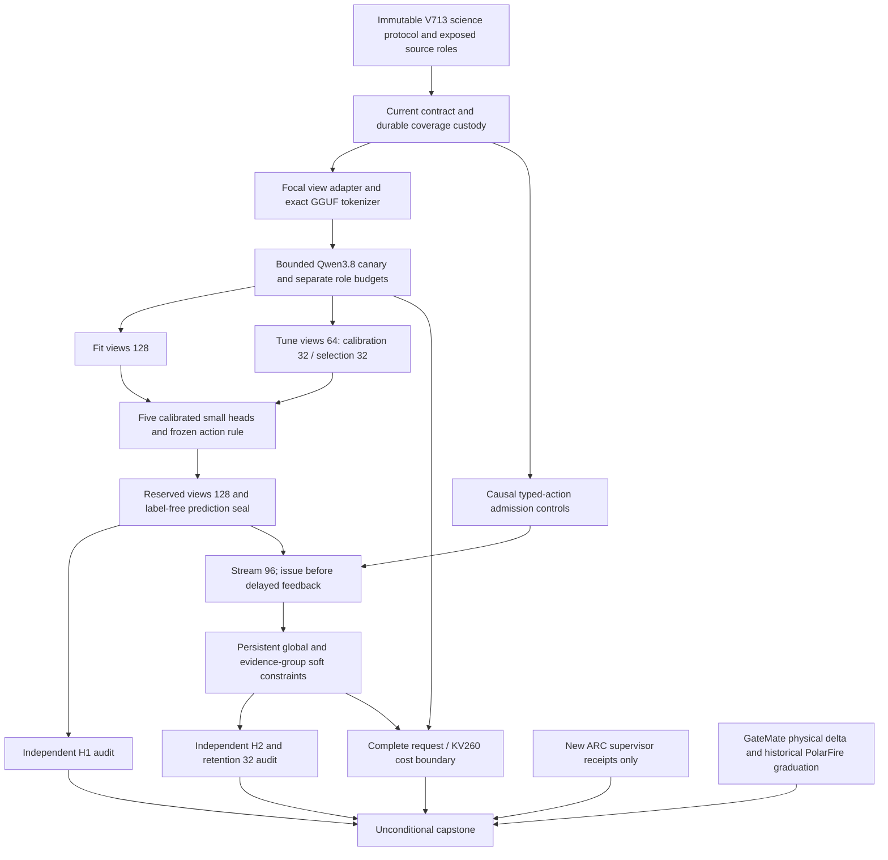
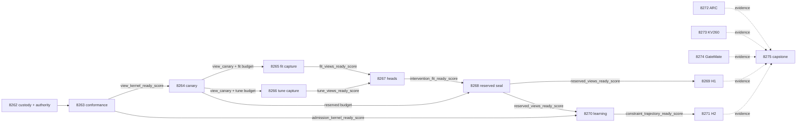

# Research roadmap V714 — Qualified evidence interventions and causal decision learning

Milestone: **2026.10.714**. Planned on 2026-10-07 after the V713 scheduling
cycle completed. Status: **staged planning; no activation or new measurements**.
The execution contract is **14 tasks, Exp8262 through Exp8275, in that order**,
across four phases (3 + 4 + 3 + 4 tasks). The complete machine contract below
contains exactly the same full task objects as `research-roadmap-next.yaml`.

## Purpose and the three largest PRD gaps

1. **Useful verification decisions (FR-06/FR-12).** Carnot has authenticated
   transport and calibrated heads, but source-intervention decision benefit is
   unmeasured. V712's margin-head mean gain was -0.01953125 with lower bound
   -0.04296875; changing energy representation alone did not help. Qualify the
   frozen evidence intervention and compare equally informed decision heads.
   All sources remain exposed development; this cannot close independent
   generalization or establish the PRD's broad reliability target.
2. **Continuous self-learning with retained behavior (FR-11).** Durable counters
   and restart parity are useful mechanisms, but V712's delayed benefit was zero.
   V713 did not execute its new group-admission learner. Test whether a constraint
   admitted from delayed outcomes changes a later distinct source's decision and
   lowers decision cost while preserving an untouched retention panel. Train
   small typed-decision heads and memory only; keep the generator frozen.
3. **Measured complete-service efficiency and deployability (FR-05/FR-08/NFR-01).**
   Existing device/host evidence does not prove a 10x Rust/Python service gain.
   Capture tokenization, inference, decisions, persistence, transfers and startup
   costs together. Attribute only compatible operations to KV260. Preserve the
   real PolarFire CPU dispatch result and GateMate's physical blocker.

These priorities follow `research-program.md`, the PRD and the energy-verifies /
refinement-generates architecture. Energy-as-generator, renamed margin sweeps,
unchanged failed hardware probes and generator training stay retired/deferred.

## What V713 proved, and what it did not

| Evidence | Actual outcome | Consequence |
|---|---|---|
| Exp8248 | Current authority and frozen intervention protocol qualified | Reuse immutable science choices; bind a new execution contract. |
| Exp8249 | `complete_disqualified_evidence_view_kernel`; final coverage path absent; readiness zero | Repair durable receipt custody and separately qualify protocol conformance. |
| Exp8250 | `blocked_gate_check_failed` at `results/experiment_8250_evidence_view_canary.json` | This is a conductor pre-gate record, not a live canary or the declared primary. |
| Exp8251–Exp8256 | Six declared primaries absent; upstream-retirement skips in the log | H1/H2 are unmeasured. Do not turn absent work into a scientific null or invent producer verdicts. |
| Exp8257 | `complete_null_no_new_outcomes` | Inspect only genuinely new supervisor outcomes. |
| Exp8258 | `complete_blocked_capture`; historical Exp8242 timing operands | Current capture costs remain unavailable; historical bounds retain their scope. |
| Exp8259 | Qualified circular-positive dispatch; 512/512 rows, 256 independent inputs; actual device execution; `polarfire_workload_validated=true` | PolarFire reaches its defined dispatch terminal state. This is board-local Linux CPU parity, not FPGA acceleration. |
| Exp8260 | `complete_blocked_gatemate_physical_change`; no new JTAG execution | Carry the precise physical reopening condition without another probe. |
| Exp8261 | Qualified capstone execution, science blocked; seven executed tasks, one pre-gate record, six absent outputs | Administrative completion is distinct from science execution or benefit. |

The research archive currently ends at V712. These V713 statements come from the
activated fourteen-task roadmap, current primaries, byte-bound sidecars and
`ops/conductor-log.md`. Preserve the entire V713 design at
`openspec/change-proposals/research-roadmap-v713-preserved-20261007.md`.

### The concrete change that makes continuation justified

Exp8249's validation commands exited zero and its coverage report measured
319/319 statements without exclusions. The manifest wrote `coverage.json` under
private temporary scratch, while the final reader expected
`raw/logs/changed_code_coverage.json`. Scratch was then deleted. V714 copies the
actual command's output durably before cleanup, validates exact owned file
identity and counts, and cold-replays after the scratch directory is gone.
It never lowers coverage or rewrites the disqualified historical primary.

Inspection also found implementation/protocol differences: UTF-8 byte lengths
instead of embedded-token lengths; all-answer grouped requests with a 256-token
default instead of one focal response bounded at 64; a blockwise shuffled group
instead of the frozen source-hash/seed assignment; and binary fixture loss
instead of the deployed accept/reject/escalate cost. Exp8263 qualifies corrected
adapters with the same production decoder, including a 96-slot shape control
and a separate learnable stress control. This is an execution correction to an
unmeasured hypothesis, not an opportunity to retune it.

## Research incorporated before experiment design

The dated V714 section of `research-references.md` records the primary and
secondary scan, including access failures and stale results.

- [Structured decoding and its semantic gap (2026-09)](https://arxiv.org/abs/2609.23742)
  supplies the new separation of request conformance from independent decision
  utility (Exp8263/8264 versus Exp8269). No small-model effect is extrapolated to
  the mandated 27B model.
- [Evidence-Aligned Entity Verification](https://arxiv.org/abs/2609.08267)
  motivates matched evidence deletion as a feature, not a truth certificate
  (Exp8264–Exp8269). This is a narrow adaptation, not a paper reproduction.
- [SEVA](https://arxiv.org/abs/2606.29713),
  [delayed-feedback inference](https://arxiv.org/abs/2609.07251),
  [online spline-local KAN](https://arxiv.org/abs/2602.02056) and
  [KAN forgetting](https://arxiv.org/abs/2511.12828) inform causal updates,
  bounded state and separate retention (Exp8263/8270/8271). No conformal theorem
  or KAN hardware performance is claimed for the Beta-count mechanism.
- [ARM-EBM](https://arxiv.org/abs/2512.15605) motivates equal-information controls;
  [FPGA–ASIC orchestration work](https://arxiv.org/abs/2602.15985) motivates the
  complete-request cost boundary (Exp8273).

EBT, neural Ising dynamics, exact neural constraint layers, ETS and constrained
diffusion were considered. They do not justify a new generator/sampler track
before verifier utility and a compatible workload qualify. OpenReview access
was partial; Semantic Scholar citation inventory remains incomplete. Extropic
and Kona product pages establish no new local hardware or executable recipe.
GitHub Trending snapshots were stale; the author structured-generation repo
was inspected independently. No dependency or hardware purchase is proposed.

## Architecture



The public-input worker cannot read evaluation labels. Independent audit/release
workers own label access. Three views retain the full answer and differ only in
complete source-sentence deletion. Syntactic validity, custody, semantic utility,
energy-specific utility and retained learning are distinct outputs.

## Frozen scientific contract

`openspec/change-proposals/v713-evidence-intervention-protocol.json` remains
unchanged, SHA-256
`f4c06e17a9f8eb72f1be80b265ab7e3507cbc5f6f3b918df6421fe49dae02018`.
Exp8262 creates a separate V714 execution binding. It does not refreeze science.

- Original source roles: fit128, tune64 (calibration32/selection32), evaluation128
  (stream96/retention32), sorted original IDs within the prescribed partitions.
  Original source hashes must remain disjoint. Public-input eligibility counts
  from prior planning were 105/53/97; these are not current capture successes.
- One focal complete answer sentence: maximum cached V707 unsupported probability,
  tie by original index. Selected complete source sentence: maximum Unicode-word
  Jaccard overlap with the focal sentence, tie by index. Control: a *different*
  complete source sentence nearest in exact embedded-token length, tie by index.
  Nonselected does not mean irrelevant. Missing controls stay unavailable.
- Five new features join the historical sixteen: current original probability,
  selected-deletion delta, control-deletion delta, their difference, and signed
  removal-length mismatch normalized by original source token count.
- Energy21, logistic21 and additive21 each have 22 coefficients. Energy16 and
  control-only energy19 are ablations with independent fit-only geometry and
  21 centers. The unchanged protocol fixes ridge grid, optimizer, calibration
  and source folds. Calibrate only on calibration32; select the simple comparator
  on selection32 using cost, then Brier, then fixed order. No evaluation tuning.
- With unsupported target y=1: accept costs 5y, reject costs 1-y, escalate costs
  .5. Accept is allowed only in the frozen V707 accepted set; ties escalate.
  Every arm shares the frozen V707 probability **and action** on missing views,
  or shared escalation only when that baseline is absent. Missing rows remain
  in all intended denominators and contribute zero paired treatment gain.
- H1: all128; >=72 complete, >=12 per class; 10,000 paired source-cluster draws,
  seed7138248, >=9,500 valid draws, alpha=.025. Require lower cost gain >.02
  against the preselected simple comparator, >=5 improved sources, no additional
  false accepts and Brier/cost worsening <=.01/.02 against all mandatory controls.
  Energy-specific credit additionally requires positive lower gain against both
  equally informed simple heads. Feature value and energy value are separate.
- Online mechanism: Beta(1,1) global and eight-group counts, lambda=n/(n+16),
  eight distinct released sources before group admission. Group bits are cached
  E/non-E, selected delta>.1, abs(control delta)>.1. Random buckets use source
  hash plus seeds101/102/103 with the exact frozen encoding established before
  natural updates. This use of source hashes is a negative control, not memory.
  Issue/fsync prediction at t before releasing t-8. Missing features update
  global counts only; retention never updates. Final not-yet-due feedback stays
  pending. Genuine exits at slots40/72 must resume identical state/predictions.
- H2: all96 stream slots; >=64 complete, >=8 per class, >=8 nonoverlapping blocks
  of eight slots. Average seeds within source; 10,000 circular moving-block
  draws, primary block8 and sensitivity4/16, seed7138256, >=9,500 valid draws,
  alpha=.025. Lower gain>.02 versus global-only, >=5 improvements, no additional
  false accepts (also per seed), Brier/cost bounds .01/.02. Report frozen and
  random-group controls. Retention32 requires >=20 complete, >=5 per class,
  no extra false accepts and Brier/cost worsening <=.01/.02 versus frozen and
  global-only. A group must affect a later distinct source's decision.

Only support-qualified nulls with an actual typed-decision learnable control,
permissible-action oracle headroom>.02 and >=5 improvable sources can retire a
scientific mechanism. Oracle values are audit-only and never fed to a producer.
Fixtures are circular mechanics; insufficient support is blocked; a test lacking
headroom is noninformative. Both generalization scores remain zero throughout.

## Phases and experiment deliverables

### Phase 1 — qualify actual execution (Exp8262–Exp8264)

- **Exp8262:** current fourteen-task authority plus durable coverage custody.
  Cold replay must work after temporary scratch deletion; invalid reports fail.
  Produces separate `current_contract_ready_score` and
  `coverage_custody_ready_score`. Keep the implementation a thin current adapter.
- **Exp8263:** exact-token view matching, single-focal response schema, reusable
  role-bound capture runner and causal typed-action controls. A 96+32 shape
  fixture checks feasibility/missingness without demanding natural gain; a
  separate 384-slot learnable fixture checks actual cost improvement and retained
  behavior. Independent `view_kernel_ready_score` and
  `admission_kernel_ready_score` prevent one mechanism qualifying the other.
- **Exp8264:** real Qwen canary on the first twelve eligible fit sources, up to
  36 calls with <=64 output tokens each. Require nine complete triplets, correct
  custody and no cross-talk. Forecast fit/tune/reserved budgets independently.
  Never gate readiness on favorable evidence sensitivity.

### Phase 2 — measure views and train decisions (Exp8265–Exp8268)

- **Exp8265:** original fit128, <=384 calls, >=80 complete and >=12/class.
- **Exp8266:** original tune64, <=192 calls, >=40 complete and >=8/class in
  each frozen tune half. This split reduces per-invocation cost without changing
  source membership. Its execution gate is independent of fit success.
- **Exp8267:** train the five prescribed calibrated heads, matched controls and
  fixed decision decoder. This satisfies the calibrated typed-decision training
  floor. Seal parameters and comparator before reserved inference.
- **Exp8268:** all evaluation128, <=384 calls, sealed predictions and label-free
  stream/retention feature manifests. Custody readiness can pass with missing
  views; the independent audits enforce scientific support floors.

### Phase 3 — independently test utility and continuous learning (Exp8269–Exp8271)

- **Exp8269:** independent H1 reduction, source-information versus energy-specific
  benefit, all missing-slot costs, adversarial controls and audit-only headroom.
- **Exp8270:** continuous admission from delayed attribution outcomes; frozen,
  global-only, evidence-group and seeded random-group arms. Log later distinct
  uses, full update costs and exact crash recovery. H1 success is not a gate.
- **Exp8271:** independently reconstruct H2 and retained behavior, with a separate
  retention prediction seal before label access. Count an admitted term only
  when it changes a later distinct decision. Do not train on retention.

### Phase 4 — independent obligations and synthesis (Exp8272–Exp8275)

- **Exp8272:** only new authenticated ARC supervisor receipts after Exp8257's
  frontier. No new outcomes means cheap terminal null. No game runs, solve credit
  or arm-table edits; cross-game support governs any future proposal.
- **Exp8273:** whole-request costs and the KV260 compatible-operation boundary.
  New current spans and historical timings remain distinguishable. No new FPGA
  probe or speed claim; unavailable clocks are unavailable, not zero.
- **Exp8274:** GateMate physical evidence after Exp8260's frontier. No change
  means one terminal blocked audit and no JTAG retry. A changed setup defines a
  later probe contract rather than falsely establishing successful bring-up.
- **Exp8275:** unconditional fourteen-task disposition/claim audit, exact producer
  lookup, H1/H2 reduction where eligible, complete costs and publication gates.
  Authenticate Exp8259's terminal/adversarial evidence for PolarFire graduation.
  External missing science is terminal blocked, never a retryable partial.

Each task's exact primary file path appears in the task table below. Each owns a
thin same-stem CLI under `scripts/experiments/` and raw evidence under
`results/raw/<primary-stem>/`. These are planned deliverables, not files claimed
already implemented by this planning change.

## Dependency graph and gate contracts



The YAML contains full exact field names and conjunctive op/value gates. Every
field is declared in its upstream task's REQUIRED ARTIFACT FIELDS; every gated
producer exists earlier in this roadmap. Phase4 tasks have no pre-gates.
Exp8263's view and admission readiness are separate. H1 is not upstream of H2.
Missing outputs/fields are broken or absent evidence, not measured zero.

## Hardware, model and runtime requirements

| Resource | Use and boundary |
|---|---|
| Existing CUDA GPU with owned lease | Exp8264/8265/8266/8268 only. `unsloth/Qwen3.8-27B-GGUF`, Q4_K_M; exact file/hash, embedded tokenizer and template; live GPU telemetry. No substitute headline model. |
| CPU, RAM and durable local scratch | Contract readers, exact vocabulary processing, small heads, causal state and bootstrap audits. No neural-weight load in these tasks. Imported Qwen outputs are historical provenance. |
| KV260 via `ssh kria` | Exp8273 keeps the board obligation visible and reuses its actual transcript. Historically supported quadratic scope k<=5; no host SD-card check, Gaussian-head mapping, fresh synthesis/flash or unmeasured speedup. |
| GateMate A1-EVB-2M | Exp8274 requires a real dated physical change before any future IDCODE/flash effort. Existing all-ones IDCODE does not improve because a milestone changed. |
| PolarFire SoC | Exp8259's adversarial-verified board-local CPU hash parity satisfies the defined terminal dispatch state. It graduates from a dedicated slot; Exp8275 reauthenticates graduation. No FPGA-fabric or acceleration claim. |
| TSU/NPU or new boards | No assumed access or purchase; vendor estimates remain external context. |

The four live tasks declare `model_bounded_generation` (10-second floor), because
all requests have small fixed output budgets. They are not full-generation tasks
merely because they have many rows. No current task needs `model_full_generation`
(60 seconds) or neural model-load-only work (2 seconds). Tokenizer metadata
processing has no model inference and records its own source hash. Never pad a
run to meet a floor. Block a genuinely unavailable model/GPU; no small-model
replacement for headline evidence. The live ARC generator pin remains unchanged.

Canary scale-up requires each capture's conservative estimate to fit 2400 seconds
of measurement plus <=900 validation and 1200 implementation/closeout, planned
4500 seconds below the 4800-second hard cap. Stop by the tighter live remaining
budget; preserve incomplete intended rows. Bound per-call deadlines, checkpoint
every eight sources and reuse qualified role adapters. There are at most 996
scheduled view calls before exact canary reuse (36+384+192+384); actual eligibility
and shared provenance lower new work. Never claim that maximum as executed work.

Every prompt has a numbered progress requirement: flushed lines at phase edges
and before/after every long load, generation, benchmark or subprocess; completed
counts inside loops and <=60-second child heartbeats. Every output gap stays below
600 seconds. Files over about 200 lines are written in several tool calls of
about 150 lines with progress between. Large model-authored tool calls cannot
silently consume the stall allowance. Wall-time estimates are budgets, not
permission to emit no output.

## Execution discipline, validation and stopping rules

Use existing capability requirements before implementation, tests first, scoped
unit/consumer tests, 100% changed-code statement coverage including real CLI and
child branches, Ruff/format, strict mypy, relevant spec coverage and private E2E
checks. The receipt fix must preserve durable measurement through cold replay.
Primary publication and validation thresholds remain unchanged. Every comparison
has per-unit rows, exact denominators and independent-unit accounting.

All fourteen tasks declare complete prior-failure entries with
`retire_if_same_verdict: true`. Current IDs are new; no retired upstream appears
in a dependency chain. Known failed science is not renamed and rerun unchanged.
The historical Exp8251–8256 skips have no invented producer verdicts; their
failure lineage names the actual Exp8249/8250 block and prior measured nulls.

Exp8262/8263 route directly to Opus (max_turns100) because they bind validation
schemas and multiple execution interfaces. The remaining established experiments
use default Claude/Sonnet with the bounded budgets recorded in YAML; simple ARC
and physical-delta audits use20. This plan contains no new cartridge, verifier
encoding, sampler or dataset-generator task needing formulaic Codex routing, and
no luna task. The historical codex allocation for the mixed Exp8249 kernel is
superseded by the schema/conformance risk in this continuation.

Every artifact declares `verdict_class` from the closed enum. Oracle/fixture
success is circular_positive. Owned failed checks mean disqualified and no
qualified readiness for the affected claim. Missing external inputs mean blocked
with exact `gate_check_summary` operands. Only owned incomplete work is partial.
Readiness fields never imply positive scientific findings. All exposed-development
generalization scores remain zero, even if H1 or H2 passes.

Planning verification uses the existing authority parser on staged authorities,
full-task/digest equality, gate and prompt checks, exclusion-manifest lint,
scoped unit/spec checks and private authority CLI E2E-018. It does not execute a
historical CLI against primary `results/` paths. The active roadmap and conductor
remain byte-identical to their pre-planning snapshots. Research references, this
OpenSpec proposal, traceability and ops documents are reconciled as planned work.

## Exact task contract

The visible table, embedded full-task JSON, canonical digest and staged YAML
must agree exactly. The digest covers **all task fields and complete prompts**,
using JSON with sorted keys, separators `,`/`:` and `ensure_ascii=False`.

| order | id | title | phase | deliverable |
|---|---|---|---|---|
| 1 | `exp8262-coverage-custody` | Bind the current contract and retain coverage evidence through cold replay | 1 | `results/experiment_8262_v714_coverage_custody.json` |
| 2 | `exp8263-protocol-conformance` | Qualify focal GGUF-tokenized requests and causal typed-decision controls | 1 | `results/experiment_8263_v714_protocol_conformance.json` |
| 3 | `exp8264-evidence-view-canary` | Measure bounded Qwen response to selected and length-controlled deletions | 1 | `results/experiment_8264_v714_evidence_view_canary.json` |
| 4 | `exp8265-fit-view-capture` | Capture evidence views on one hundred twenty-eight frozen fit sources | 2 | `results/experiment_8265_v714_fit_view_capture.json` |
| 5 | `exp8266-tune-view-capture` | Capture calibration and selection views on sixty-four frozen tune sources | 2 | `results/experiment_8266_v714_tune_view_capture.json` |
| 6 | `exp8267-intervention-energy-fit` | Train calibrated energy decisions from evidence-dependence features | 2 | `results/experiment_8267_v714_intervention_energy_fit.json` |
| 7 | `exp8268-reserved-view-seal` | Capture and seal intervention decisions for every reserved source | 2 | `results/experiment_8268_v714_reserved_view_seal.json` |
| 8 | `exp8269-intervention-benefit-audit` | Independently test source-intervention decision benefit | 3 | `results/experiment_8269_v714_intervention_benefit_audit.json` |
| 9 | `exp8270-continuous-constraint-admission` | Learn reusable soft constraints from delayed attribution feedback | 3 | `results/experiment_8270_v714_continuous_constraint_admission.json` |
| 10 | `exp8271-constraint-learning-audit` | Audit later constraint benefit and sealed retention | 3 | `results/experiment_8271_v714_constraint_learning_audit.json` |
| 11 | `exp8272-arc-outcome-frontier` | Inspect new live supervisor outcomes for cross-game arm selection | 4 | `results/experiment_8272_v714_arc_outcome_frontier.json` |
| 12 | `exp8273-kv260-evidence-cost-boundary` | Bound new evidence and learning costs against the KV260 operation set | 4 | `results/experiment_8273_v714_kv260_evidence_cost_boundary.json` |
| 13 | `exp8274-gatemate-physical-delta` | Carry GateMate physical-change evidence and its exact reopening condition | 4 | `results/experiment_8274_v714_gatemate_physical_delta.json` |
| 14 | `exp8275-capstone` | Reconcile fourteen outcomes and decide whether evidence or learning improved | 4 | `results/experiment_8275_v714_capstone.json` |

Canonical full-task SHA-256: `1fd11d14182fd3e4b8a53abcb2eb8c8c98c4690309178788bb39ff17386a2686`

<!-- V714_TASK_CONTRACT_START -->
```json
{"milestone": "2026.10.714", "tasks": [
{
  "id": "exp8262-coverage-custody",
  "title": "Bind the current contract and retain coverage evidence through cold replay",
  "phase": 1,
  "track": "infrastructure",
  "priority": "high",
  "requires_gpu": false,
  "max_turns": 100,
  "estimated_wall_time_min": 50,
  "per_unit_rows": true,
  "milestone": "2026.10.714",
  "deliverable": "results/experiment_8262_v714_coverage_custody.json",
  "inference_substrate_class": "no_model_load",
  "MODEL_SPECS": [],
  "gated_on": [],
  "prior_failures": [
    {
      "experiment_id": "exp8249-evidence-view-kernel",
      "verdict": "complete_disqualified_evidence_view_kernel",
      "addressed_by": "Exp8249 read raw/logs/changed_code_coverage.json while its manifest wrote temporary coverage.json, then deleted it. Persist and authenticate the actual receipt output before cleanup; independently correct tokenizer, focal response and typed-decision controls. Never lower coverage or upgrade the historical primary.",
      "retire_if_same_verdict": true
    },
    {
      "experiment_id": "exp8261-capstone",
      "verdict": "complete_blocked_upstream_evidence",
      "addressed_by": "Current administrative qualification binds its own evidence; unexecuted V713 science stays blocked and does not gate the new authority check.",
      "retire_if_same_verdict": true
    }
  ],
  "model": "opus",
  "prompt": "CONTEXT:\nWork in {project_root} on {date}. V713 completed its scheduling cycle, but six downstream primaries are absent and H1/H2 were unmeasured. Exp8249 had all command exits zero and 319/319 covered statements; the final reader used a nonexistent path after temporary cleanup. This is a receipt-custody defect, not scientific null evidence.\nEXISTING CODE TO READ FIRST:\nCLAUDE.md; CODEX.md; ops/e2e-test-plan.md; openspec/capabilities/research-reporting/spec.md; openspec/capabilities/verification/spec.md; scripts/experiment_template.py; python/carnot/reporting/primary_publication.py; ops/exclusion_manifest.yaml; openspec/change-proposals/research-roadmap-vNEXT.md; openspec/change-proposals/v713-evidence-intervention-protocol.json; python/carnot/reporting/v685_authority_lifecycle.py; python/carnot/reporting/v711_current_contract.py; python/carnot/reporting/evidence_intervention_methods_8248.py; python/carnot/reporting/methods_stream_execution_8111.py; python/carnot/verify/evidence_view_execution_8249.py; results/experiment_8248_v713_evidence_intervention_methods.json; results/experiment_8249_v713_evidence_view_kernel.json; results/experiment_8261_v713_capstone.json; openspec/change-proposals/research-roadmap-v713-preserved-20261007.md\nTASK:\nBind the current contract and retain coverage evidence through cold replay. Deliver results/experiment_8262_v714_coverage_custody.json. Create the thin runner scripts/experiments/experiment_8262_v714_coverage_custody.py. Store primitive evidence under results/raw/experiment_8262_v714_coverage_custody/. Keep execution readiness separate from scientific benefit.\nCONCRETE STEPS:\n0. PRECONDITIONS: Emit a flushed start line. Authenticate required inputs and qualified terminal sidecars. Check private scratch and required tools before measurement. Missing external resources produce complete_blocked_<operand>, verdict_class=blocked. Record failed operands in gate_check_summary. Do not invent data or replace missing units.\n1. Emit a flushed progress line at every phase boundary. Emit one before and after every model load, generation, benchmark and subprocess. Print completed/pending counts inside long loops. Print a heartbeat at least every 60 seconds while children run. Keep every output gap below 600 seconds. Use unbuffered output, bounded deadlines and process-group cleanup. Write any file over about 200 lines in several tool calls of at most about 150 lines. Send a progress message between calls. Split work into resumable batches; no single huge tool call. Do not pad runtime.\n2. Add relevant REQ-* and SCENARIO-* before implementation. Write focused failing tests first. Preserve existing tests and assertions. Reuse qualified modules through small adapters. Freeze owned validation commands before measurement. Use private fixtures outside results/ and scratch outside the repository root. Do not update generator weights or publish externally.\n3. Declare no_model_load, MODEL_SPECS=[] and zero current LLM calls. Use aggregation_from_upstream_artifacts for reductions or verifier_ensemble_against_cached_candidates for small-head fitting/scoring. Record trained_head_specs separately. Reading the embedded vocabulary without neural weights is tokenizer-only work, not a model inference call.\n4. Bind exactly fourteen full task objects, Exp8262 through Exp8275, to the visible table, embedded JSON, canonical digest and actual active authority at execution. Planning agreement is separate from activation. Preserve V713 history byte-for-byte. Do not modify active scheduling, conductor code or shared validators.\n5. Authenticate the immutable science protocol openspec/change-proposals/v713-evidence-intervention-protocol.json, SHA-256 f4c06e17a9f8eb72f1be80b265ab7e3507cbc5f6f3b918df6421fe49dae02018. Write openspec/change-proposals/v714-evidence-execution-contract.json binding that unchanged science hash, the fourteen current producer paths and current gate fields. Preserve source roles, thresholds, costs, seeds and missing-view fallback. An upstream task number embedded in the historical protocol is provenance, not a current gate.\n6. Trace the actual validation manifest output path. Add a small current runner adapter that reads the explicit coverage JSON command operand, copies the report and command receipt atomically into current durable raw evidence before TemporaryDirectory cleanup, and binds their hashes. Validate complete owned file identity, nonzero statement counts, covered equals total, zero exclusions and actual exits; do not infer coverage from console text or default absent counts to success. Preserve the historical failed primary.\n7. Test the real non-fixture orchestration branch with private scripted validation children: positive measured coverage survives deletion of scratch; missing, stale, wrong-owned-file, partial coverage, failed-child and rehashed-tampered reports fail. Make the cold reader recompute totals from the durable report in a new process after the original scratch is gone. A fixture shortcut setting readiness cannot satisfy this gate.\n8. Prequalify a reusable durable-coverage hook for the next thin runner. Emit coverage_custody_ready_score and current_contract_ready_score independently, each requiring its own actual tests. Document the producer/consumer path contract and every historical upstream disposition; do not require prior science success to qualify a current reader.\n9. Run applicable private E2E-018 checks from ops/e2e-test-plan.md. Run relevant unit and consumer tests. Measure 100 percent changed-code statement coverage, including real CLI and child statements. Run scoped Ruff check/format, strict mypy and scripts/check_spec_coverage.py --files <owned-test-files>. Preserve actual argv, exits, clocks and stdout/stderr hashes. Keep bounded repository-health diagnostics separate; known failures do not establish a global pass.\n10. Cold-replay primitive evidence in a fresh process. Include negative and rehashed-tamper cases. Validate a private candidate with unchanged primary_publication terminal checks, scripts/adversarial_verify.py --json <private-candidate> and scripts/verdict_row_consistency_lint.py --strict <private-candidate>. Publish atomically after normal exit and required checks. Preserve historical primary bytes and honest failure artifacts. Reconcile openspec/, _bmad/traceability.md, ops/status.md and ops/changelog.md. Do not modify research-roadmap.yaml.\nREQUIRED ARTIFACT FIELDS:\nexperiment_id, task_id, milestone, run_date: principle: Identify the actual invocation.\nhonest_verdict, verdict_class: principle: Use complete_* terminal verdicts and one of positive | circular_positive | null | blocked | disqualified | partial. Partial means unfinished owned work. Unchanged external failures mean blocked.\ngate_check_summary: principle: Each block names the upstream, actual path/hash, exact field, operator, expected value and observed value. Missing evidence differs from a measured zero.\ninference_substrate, inference_substrate_class, MODEL_SPECS, model_invocation_counts: principle: Record actual current calls separately from historical model provenance.\nrows, intended_count, completed_count, failed_count, censored_count, excluded_count, independent_count: principle: Preserve every source, condition and arm, including missing units. Record metric numerators and denominators. Repeats and seeds do not add independent sources.\nverifier_is_oracle, exposure_scope, independent_generalization_score, generalized_learning_benefit_score: principle: Oracle-defined success is circular_positive. All reused sources are exposed development. Both generalization scores remain zero in this milestone.\nrequired_checks_passed, flagged_adversarial, acceptance_gates, validation_receipts, terminal_validation_sidecar_path: principle: Failed owned checks disqualify the result and set readiness to zero. Readiness does not imply benefit.\npreconditions_checked, duration_s, random_seed, reproducibility_checksum, source_artifact_hashes, code_config_hashes, raw_shard_hashes, phase_spans: principle: Bind real work to replayable primitive evidence and actual code/configuration bytes.\ncited_upstream_artifacts, field_principles: principle: Name each imported field and hash. Explain the evidentiary purpose of each added field.\ncoverage_custody_ready_score, current_contract_ready_score, canonical_tasks_sha256, execution_contract_path, execution_contract_sha256: principle: Current authority and durable validation are administrative readiness only.\ncoverage_report_path, coverage_report_sha256, coverage_command_receipt, owned_statement_counts, scratch_removed, cold_replay_rows: principle: Recover measured coverage after scratch cleanup and reject invalid provenance.\nRun command: cd {project_root} && PYTHONPATH=python:. PYTHONUNBUFFERED=1 .venv/bin/python -u scripts/experiments/experiment_8262_v714_coverage_custody.py --date {date}\nDo NOT push. Do NOT modify scripts/research_conductor.py."
},
{
  "id": "exp8263-protocol-conformance",
  "title": "Qualify focal GGUF-tokenized requests and causal typed-decision controls",
  "phase": 1,
  "track": "infrastructure",
  "priority": "high",
  "requires_gpu": false,
  "max_turns": 100,
  "estimated_wall_time_min": 70,
  "per_unit_rows": true,
  "milestone": "2026.10.714",
  "deliverable": "results/experiment_8263_v714_protocol_conformance.json",
  "inference_substrate_class": "no_model_load",
  "MODEL_SPECS": [],
  "gated_on": [
    {
      "upstream": "exp8262-coverage-custody",
      "artifact_field": "coverage_custody_ready_score",
      "op": "==",
      "value": 1
    },
    {
      "upstream": "exp8262-coverage-custody",
      "artifact_field": "current_contract_ready_score",
      "op": "==",
      "value": 1
    }
  ],
  "prior_failures": [
    {
      "experiment_id": "exp8249-evidence-view-kernel",
      "verdict": "complete_disqualified_evidence_view_kernel",
      "addressed_by": "Exp8249 read raw/logs/changed_code_coverage.json while its manifest wrote temporary coverage.json, then deleted it. Persist and authenticate the actual receipt output before cleanup; independently correct tokenizer, focal response and typed-decision controls. Never lower coverage or upgrade the historical primary.",
      "retire_if_same_verdict": true
    },
    {
      "experiment_id": "exp7854-intervention-protocol",
      "verdict": "complete_disqualified_required_checks",
      "addressed_by": "Replace the failed fixture-only framework with small pure adapters around qualified V707 transport and V712 crash persistence; cover every new branch before live calls.",
      "retire_if_same_verdict": true
    }
  ],
  "model": "opus",
  "prompt": "CONTEXT:\nWork in {project_root} on {date}. Exp8249 used UTF-8 byte length for matching, requested all answer groups with a 256-token default, and qualified binary loss on a 384-slot fixture. Those do not establish conformance to the frozen one-focal, 64-token, typed-decision science. The new structured-decoding paper (arXiv:2609.23742) motivates separate structural and semantic endpoints.\nEXISTING CODE TO READ FIRST:\nCLAUDE.md; CODEX.md; ops/e2e-test-plan.md; openspec/capabilities/research-reporting/spec.md; openspec/capabilities/verification/spec.md; scripts/experiment_template.py; python/carnot/reporting/primary_publication.py; ops/exclusion_manifest.yaml; openspec/change-proposals/research-roadmap-vNEXT.md; openspec/change-proposals/v713-evidence-intervention-protocol.json; python/carnot/verify/evidence_intervention_8248.py; python/carnot/verify/evidence_view_kernel_8249.py; python/carnot/verify/evidence_view_execution_8249.py; python/carnot/verify/sentence_transport_8179.py; python/carnot/verify/fit_sentence_capture_8182.py; python/carnot/reporting/evidence_intervention_methods_8248.py; python/carnot/verify/sentence_energy_8183.py; results/experiment_8249_v713_evidence_view_kernel.json; results/experiment_8262_v714_coverage_custody.json; research-references.md\nTASK:\nQualify focal GGUF-tokenized requests and causal typed-decision controls. Deliver results/experiment_8263_v714_protocol_conformance.json. Create the thin runner scripts/experiments/experiment_8263_v714_protocol_conformance.py. Store primitive evidence under results/raw/experiment_8263_v714_protocol_conformance/. Keep execution readiness separate from scientific benefit.\nCONCRETE STEPS:\n0. PRECONDITIONS: Emit a flushed start line. Authenticate required inputs and qualified terminal sidecars. Check private scratch and required tools before measurement. Missing external resources produce complete_blocked_<operand>, verdict_class=blocked. Record failed operands in gate_check_summary. Do not invent data or replace missing units.\n1. Emit a flushed progress line at every phase boundary. Emit one before and after every model load, generation, benchmark and subprocess. Print completed/pending counts inside long loops. Print a heartbeat at least every 60 seconds while children run. Keep every output gap below 600 seconds. Use unbuffered output, bounded deadlines and process-group cleanup. Write any file over about 200 lines in several tool calls of at most about 150 lines. Send a progress message between calls. Split work into resumable batches; no single huge tool call. Do not pad runtime.\n2. Add relevant REQ-* and SCENARIO-* before implementation. Write focused failing tests first. Preserve existing tests and assertions. Reuse qualified modules through small adapters. Freeze owned validation commands before measurement. Use private fixtures outside results/ and scratch outside the repository root. Do not update generator weights or publish externally.\n3. Declare no_model_load, MODEL_SPECS=[] and zero current LLM calls. Use aggregation_from_upstream_artifacts for reductions or verifier_ensemble_against_cached_candidates for small-head fitting/scoring. Record trained_head_specs separately. Reading the embedded vocabulary without neural weights is tokenizer-only work, not a model inference call.\n4. Import the qualified pure offset mapping and issue/release journal; implement only narrow current adapters. Derive exact token lengths with the mandated Qwen3.8 GGUF embedded tokenizer and bind its metadata/hash. Reading vocabulary without loading neural weights is tokenizer-only no_model_load; no byte/word proxy is permitted. If obtaining the exact tokenizer requires unavailable resources, block explicitly. Keep complete original answer bytes and original source sentence offsets.\n5. Construct exactly one focal output schema and request per view, with a required response index equal to the chosen original focal_index, regardless of its position or the number of other sentences. Preserve the entire original answer in the prompt; replace only the response selection and source condition. Freeze grammar/token bounds, template hash, temperature zero, seed 7138250 and at most 64 output tokens. Do not call the inherited all-sentence request splitter. Use token-exact context admission and block overflow rather than truncating natural text.\n6. Use the frozen maximum-Jaccard complete-source selector and distinct nearest-token-length deletion control. Test Unicode cases where byte and token rankings disagree; focal indices beyond the first eight; multi-sentence answers; ties, duplicate text, bad source addresses, negation, redundant evidence, no second sentence, empty views and insufficient output/context budget. Require only the focal item, correct source-view citation maps and identical answer bytes; structural validity is not semantic correctness. Swapping human labels must leave requests, selections and feature/group keys unchanged.\n7. Qualify a shared role-bound capture runner here: every intended slot recorded, one server lifetime, durable issue before dispatch, atomic checkpoints each eight sources, exact resume keys and phase timings. Scripted peers exercise real request/parse paths, timeout/partial/duplicate replies, dropped children, and source-role drift. Later GPU tasks bind fit, tune or evaluation manifests without inventing acquisition infrastructure.\n8. Implement the existing frozen Beta(1,1), n/(n+16) global/group mixtures with eight groups and admission after eight distinct released sources. Keys use cached E/non-E, selected delta >.1, abs(control delta) >.1. Random controls use a specified stable hash encoding of original source hash and seeds 101/102/103, modulo eight, before label access; record exact encoding in the execution contract. A blockwise permutation is not this control. Hash use is only a negative-control assignment, never learned source memory.\n9. Use the actual allowed-action decoder C(accept,y)=5y, C(reject,y)=1-y, C(escalate,y)=.5, ties escalate and accept restricted to the frozen baseline set. Test issue and fsync before release from t-8, identical releases across arms, no future/duplicate updates, missing-feature global-only updates, shared fallback actions and zero group updates from missing rows; retention never updates. Check exact uninterrupted/hard-exit resume state including pending feedback at slots40/72.\n10. Freeze two private control rosters before running either: a 96-slot natural-shape stream plus 32 untouched retention slots tests admission feasibility, missingness and zero-admission outcomes without requiring a gain; a 384-slot learnable stream with independently specified group-conditional labels and a separate retention panel tests whether this SAME typed-action runtime can reduce later cost >.02 versus global-only with at least five improvements, no extra false accepts and retained cost <=.02/Brier <=.01 worsening. Include identical-budget seeded random groups and no-signal controls. Report rows, state hashes, admission times and actual decision costs; binary threshold loss is insufficient. Fixture gains are circular_positive mechanics only.\n11. Use Exp8262 durable coverage custody in the real runner. Emit view_kernel_ready_score from request/tokenizer/capture conformance and admission_kernel_ready_score from causal typed-action controls independently; a failed owned check sets the affected readiness to zero and disqualifies its claim. Do not require natural benefit or any human-label direction for view readiness. Save separate component validation receipts so causal control work cannot falsely qualify transport.\n12. Run applicable private E2E-019/020 checks from ops/e2e-test-plan.md. Run relevant unit and consumer tests. Measure 100 percent changed-code statement coverage, including real CLI and child statements. Run scoped Ruff check/format, strict mypy and scripts/check_spec_coverage.py --files <owned-test-files>. Preserve actual argv, exits, clocks and stdout/stderr hashes. Keep bounded repository-health diagnostics separate; known failures do not establish a global pass.\n13. Cold-replay primitive evidence in a fresh process. Include negative and rehashed-tamper cases. Validate a private candidate with unchanged primary_publication terminal checks, scripts/adversarial_verify.py --json <private-candidate> and scripts/verdict_row_consistency_lint.py --strict <private-candidate>. Publish atomically after normal exit and required checks. Preserve historical primary bytes and honest failure artifacts. Reconcile openspec/, _bmad/traceability.md, ops/status.md and ops/changelog.md. Do not modify research-roadmap.yaml.\nREQUIRED ARTIFACT FIELDS:\nexperiment_id, task_id, milestone, run_date: principle: Identify the actual invocation.\nhonest_verdict, verdict_class: principle: Use complete_* terminal verdicts and one of positive | circular_positive | null | blocked | disqualified | partial. Partial means unfinished owned work. Unchanged external failures mean blocked.\ngate_check_summary: principle: Each block names the upstream, actual path/hash, exact field, operator, expected value and observed value. Missing evidence differs from a measured zero.\ninference_substrate, inference_substrate_class, MODEL_SPECS, model_invocation_counts: principle: Record actual current calls separately from historical model provenance.\nrows, intended_count, completed_count, failed_count, censored_count, excluded_count, independent_count: principle: Preserve every source, condition and arm, including missing units. Record metric numerators and denominators. Repeats and seeds do not add independent sources.\nverifier_is_oracle, exposure_scope, independent_generalization_score, generalized_learning_benefit_score: principle: Oracle-defined success is circular_positive. All reused sources are exposed development. Both generalization scores remain zero in this milestone.\nrequired_checks_passed, flagged_adversarial, acceptance_gates, validation_receipts, terminal_validation_sidecar_path: principle: Failed owned checks disqualify the result and set readiness to zero. Readiness does not imply benefit.\npreconditions_checked, duration_s, random_seed, reproducibility_checksum, source_artifact_hashes, code_config_hashes, raw_shard_hashes, phase_spans: principle: Bind real work to replayable primitive evidence and actual code/configuration bytes.\ncited_upstream_artifacts, field_principles: principle: Name each imported field and hash. Explain the evidentiary purpose of each added field.\nview_kernel_ready_score, admission_kernel_ready_score, tokenizer_metadata_sha256, response_schema_sha256, frozen_science_sha256, component_validation_receipts: principle: Gate actual conformance independently for requests and learning.\nrequest_control_rows, view_byte_maps, random_group_encoding, admission_events, decision_control_rows, natural_shape_control_rows, learnable_control_rows, positive_control_passed: principle: Exercise the production decoder and causal journal with explicit synthetic scope.\nRun command: cd {project_root} && PYTHONPATH=python:. PYTHONUNBUFFERED=1 .venv/bin/python -u scripts/experiments/experiment_8263_v714_protocol_conformance.py --date {date}\nDo NOT push. Do NOT modify scripts/research_conductor.py."
},
{
  "id": "exp8264-evidence-view-canary",
  "title": "Measure bounded Qwen response to selected and length-controlled deletions",
  "phase": 1,
  "track": "verification",
  "priority": "high",
  "requires_gpu": true,
  "max_turns": 50,
  "estimated_wall_time_min": 50,
  "per_unit_rows": true,
  "milestone": "2026.10.714",
  "deliverable": "results/experiment_8264_v714_evidence_view_canary.json",
  "inference_substrate_class": "model_bounded_generation",
  "MODEL_SPECS": [
    {
      "hf_id": "unsloth/Qwen3.8-27B-GGUF",
      "quantization": "Q4_K_M"
    }
  ],
  "gated_on": [
    {
      "upstream": "exp8263-protocol-conformance",
      "artifact_field": "view_kernel_ready_score",
      "op": "==",
      "value": 1
    }
  ],
  "prior_failures": [
    {
      "experiment_id": "exp7854-intervention-protocol",
      "verdict": "complete_disqualified_required_checks",
      "addressed_by": "Live transport now uses the qualified V707 parser and the current pure view kernel, with complete owned validation before capture.",
      "retire_if_same_verdict": true
    },
    {
      "experiment_id": "exp8249-evidence-view-kernel",
      "verdict": "complete_disqualified_evidence_view_kernel",
      "addressed_by": "Exp8249 read raw/logs/changed_code_coverage.json while its manifest wrote temporary coverage.json, then deleted it. Persist and authenticate the actual receipt output before cleanup; independently correct tokenizer, focal response and typed-decision controls. Never lower coverage or upgrade the historical primary.",
      "retire_if_same_verdict": true
    },
    {
      "experiment_id": "exp8250-evidence-view-canary",
      "verdict": "blocked_gate_check_failed",
      "addressed_by": "The current prerequisite proves durable coverage and exact focal requests. Gate on the new declared producer fields; preserve the old pre-gate artifact as a block, not a measurement.",
      "retire_if_same_verdict": true
    }
  ],
  "prompt": "CONTEXT:\nWork in {project_root} on {date}. The source-view mechanism needs current live evidence. V707 transport success does not establish useful evidence sensitivity. This canary measures syntax and feasible acquisition cost before scaling.\nEXISTING CODE TO READ FIRST:\nopenspec/change-proposals/v713-evidence-intervention-protocol.json; openspec/change-proposals/v714-evidence-execution-contract.json; CLAUDE.md; CODEX.md; ops/e2e-test-plan.md; openspec/capabilities/research-reporting/spec.md; openspec/capabilities/verification/spec.md; scripts/experiment_template.py; python/carnot/reporting/primary_publication.py; ops/exclusion_manifest.yaml; openspec/change-proposals/research-roadmap-vNEXT.md; python/carnot/verify/sentence_transport_canary_8181.py; python/carnot/verify/sentence_transport_8179.py; python/carnot/inference/sota_models.py; scripts/experiments/experiment_8236_v712_qualified_concurrency_canary.py; results/experiment_8263_v714_protocol_conformance.json; results/experiment_8262_v714_coverage_custody.json\nTASK:\nMeasure bounded Qwen response to selected and length-controlled deletions. Deliver results/experiment_8264_v714_evidence_view_canary.json. Create the thin runner scripts/experiments/experiment_8264_v714_evidence_view_canary.py. Store primitive evidence under results/raw/experiment_8264_v714_evidence_view_canary/. Keep execution readiness separate from scientific benefit.\nCONCRETE STEPS:\n0. PRECONDITIONS: Emit a flushed start line. Authenticate required inputs and qualified terminal sidecars. Check private scratch and required tools before measurement. Missing external resources produce complete_blocked_<operand>, verdict_class=blocked. Record failed operands in gate_check_summary. Do not invent data or replace missing units.\n1. Emit a flushed progress line at every phase boundary. Emit one before and after every model load, generation, benchmark and subprocess. Print completed/pending counts inside long loops. Print a heartbeat at least every 60 seconds while children run. Keep every output gap below 600 seconds. Use unbuffered output, bounded deadlines and process-group cleanup. Write any file over about 200 lines in several tool calls of at most about 150 lines. Send a progress message between calls. Split work into resumable batches; no single huge tool call. Do not pad runtime.\n2. Add relevant REQ-* and SCENARIO-* before implementation. Write focused failing tests first. Preserve existing tests and assertions. Reuse qualified modules through small adapters. Freeze owned validation commands before measurement. Use private fixtures outside results/ and scratch outside the repository root. Do not update generator weights or publish externally.\n3. Declare MODEL_SPECS with unsloth/Qwen3.8-27B-GGUF, Q4_K_M and its resolved GGUF hash. Use cached_current_model(), the embedded tokenizer/chat template and an owned CUDA GPU lease. Set CARNOT_FORCE_LIVE=1. Record live_gpu_gguf and model_bounded_generation: each call has a fixed small output budget. The duration floor is 10 seconds; never pad it. Block on unavailable model/CUDA or an unqualified lease. Record load/generation counts, response bytes, tokens, monotonic clocks and in-flight GPU telemetry. No simulated or small-model headline fallback.\n4. Use the first twelve label-blind eligible fit slots in ascending original source_cluster_id order. Retain the full intended twelve-slot roster even if a source lacks a matched control. Run all three views for the one focal sentence, at most 36 calls. Use temperature zero, seed 7138250 and at most 64 generated tokens per call. Derive the grammar bound with the embedded tokenizer first; an insufficient budget blocks that slot instead of truncating its answer.\n5. Reuse qualified transport and owned server lifecycle. Each view gets a unique request ID, fresh request state, unchanged answer bytes and source-view hash. Rotate the three view orders by source index. Preserve error responses and no-op interventions. Do not tune prompts, thresholds, control matching or source selection after observing outputs.\n6. Require at least nine complete source triplets, no request cross-talk and exact view/answer custody. Record missing-control frequency, syntax yield and probability-change distributions without reading human labels. Readiness depends on transport and custody, never on favorable effect direction. An all-zero effect is qualified null evidence.\n7. Measure current cold load, prefill, generation, serialization and shutdown spans. Forecast separate fit=128, tune=64 and reserved=128 capture times from token counts and conservative canary timings. Set separate fit_capture_budget_ready_score, tune_capture_budget_ready_score and reserved_capture_budget_ready_score to 1 only when the corresponding roster fits a 2400-second measurement budget plus at most 900 seconds validation. Reserve 1200 seconds for implementation, tests and closeout, giving a planned total of 4500 seconds. Exp8263 must prequalify the shared capture adapter; capture tasks only bind roles and paths. Before starting each capture, recheck the total elapsed budget and stop if its remaining allowance cannot fit the frozen roster. Otherwise block scale-up and retain a concrete cost estimate. Do not silently shrink a cohort or declare a larger wall-time estimate.\n8. Run applicable private E2E-015/019 checks from ops/e2e-test-plan.md. Run relevant unit and consumer tests. Measure 100 percent changed-code statement coverage, including real CLI and child statements. Run scoped Ruff check/format, strict mypy and scripts/check_spec_coverage.py --files <owned-test-files>. Preserve actual argv, exits, clocks and stdout/stderr hashes. Keep bounded repository-health diagnostics separate; known failures do not establish a global pass.\n9. Cold-replay primitive evidence in a fresh process. Include negative and rehashed-tamper cases. Validate a private candidate with unchanged primary_publication terminal checks, scripts/adversarial_verify.py --json <private-candidate> and scripts/verdict_row_consistency_lint.py --strict <private-candidate>. Publish atomically after normal exit and required checks. Preserve historical primary bytes and honest failure artifacts. Reconcile openspec/, _bmad/traceability.md, ops/status.md and ops/changelog.md. Do not modify research-roadmap.yaml.\n10. Authenticate the unchanged science protocol openspec/change-proposals/v713-evidence-intervention-protocol.json (SHA-256 f4c06e17a9f8eb72f1be80b265ab7e3507cbc5f6f3b918df6421fe49dae02018) and the current execution contract. Import only current qualified producer fields at their declared paths. Preserve historical failed primaries. Current gate readiness is separate from positive scientific benefit.\n11. Bind all budgets to the actual focal-only response schema and embedded-token counts. Forecast with the slower conservative tail timing plus load/setup/shutdown and retry allowance; cannot use byte lengths or all-sentence historical timings as a focal measurement. A budget failure blocks only that capture branch. Successful syntax and a zero intervention effect can both be reported honestly.\nREQUIRED ARTIFACT FIELDS:\nexperiment_id, task_id, milestone, run_date: principle: Identify the actual invocation.\nhonest_verdict, verdict_class: principle: Use complete_* terminal verdicts and one of positive | circular_positive | null | blocked | disqualified | partial. Partial means unfinished owned work. Unchanged external failures mean blocked.\ngate_check_summary: principle: Each block names the upstream, actual path/hash, exact field, operator, expected value and observed value. Missing evidence differs from a measured zero.\ninference_substrate, inference_substrate_class, MODEL_SPECS, model_invocation_counts: principle: Record actual current calls separately from historical model provenance.\nrows, intended_count, completed_count, failed_count, censored_count, excluded_count, independent_count: principle: Preserve every source, condition and arm, including missing units. Record metric numerators and denominators. Repeats and seeds do not add independent sources.\nverifier_is_oracle, exposure_scope, independent_generalization_score, generalized_learning_benefit_score: principle: Oracle-defined success is circular_positive. All reused sources are exposed development. Both generalization scores remain zero in this milestone.\nrequired_checks_passed, flagged_adversarial, acceptance_gates, validation_receipts, terminal_validation_sidecar_path: principle: Failed owned checks disqualify the result and set readiness to zero. Readiness does not imply benefit.\npreconditions_checked, duration_s, random_seed, reproducibility_checksum, source_artifact_hashes, code_config_hashes, raw_shard_hashes, phase_spans: principle: Bind real work to replayable primitive evidence and actual code/configuration bytes.\ncited_upstream_artifacts, field_principles: principle: Name each imported field and hash. Explain the evidentiary purpose of each added field.\nview_canary_ready_score, fit_capture_budget_ready_score, tune_capture_budget_ready_score, reserved_capture_budget_ready_score, request_rows, complete_triplets, projected_capture_seconds: principle: Separate transport success from affordability and semantic benefit.\nmodel_path_sha256, server_argv, generated_tokens, active_gpu_telemetry, service_phase_spans: principle: Authenticate actual bounded local generation and every cost component.\nfrozen_science_sha256, execution_contract_sha256: principle: Keep unchanged scientific choices distinct from repaired execution bindings.\nRun command: cd {project_root} && PYTHONPATH=python:. PYTHONUNBUFFERED=1 .venv/bin/python -u scripts/experiments/experiment_8264_v714_evidence_view_canary.py --date {date}\nDo NOT push. Do NOT modify scripts/research_conductor.py."
},
{
  "id": "exp8265-fit-view-capture",
  "title": "Capture evidence views on one hundred twenty-eight frozen fit sources",
  "phase": 2,
  "track": "verification",
  "priority": "high",
  "requires_gpu": true,
  "max_turns": 50,
  "estimated_wall_time_min": 75,
  "per_unit_rows": true,
  "milestone": "2026.10.714",
  "deliverable": "results/experiment_8265_v714_fit_view_capture.json",
  "inference_substrate_class": "model_bounded_generation",
  "MODEL_SPECS": [
    {
      "hf_id": "unsloth/Qwen3.8-27B-GGUF",
      "quantization": "Q4_K_M"
    }
  ],
  "gated_on": [
    {
      "upstream": "exp8264-evidence-view-canary",
      "artifact_field": "view_canary_ready_score",
      "op": "==",
      "value": 1
    },
    {
      "upstream": "exp8264-evidence-view-canary",
      "artifact_field": "fit_capture_budget_ready_score",
      "op": "==",
      "value": 1
    }
  ],
  "prior_failures": [
    {
      "experiment_id": "exp8185-sentence-decision-audit",
      "verdict": "complete_null_sentence_decision_null",
      "addressed_by": "Collect targeted cited-versus-matched deletion differences for every eligible source, replacing descriptive source-removal probes with features used by the decision model.",
      "retire_if_same_verdict": true
    },
    {
      "experiment_id": "exp8249-evidence-view-kernel",
      "verdict": "complete_disqualified_evidence_view_kernel",
      "addressed_by": "Exp8249 read raw/logs/changed_code_coverage.json while its manifest wrote temporary coverage.json, then deleted it. Persist and authenticate the actual receipt output before cleanup; independently correct tokenizer, focal response and typed-decision controls. Never lower coverage or upgrade the historical primary.",
      "retire_if_same_verdict": true
    },
    {
      "experiment_id": "exp8250-evidence-view-canary",
      "verdict": "blocked_gate_check_failed",
      "addressed_by": "Capture uses the repaired prerequisite and its own independently forecast role budget. The old combined 192-source task never ran; splitting fit and tune preserves frozen membership and prevents an oversized invocation.",
      "retire_if_same_verdict": true
    }
  ],
  "prompt": "CONTEXT:\nWork in {project_root} on {date}. The view canary established a bounded route and a measured budget. Capture new features without changing the original source roles or inferring correctness from a perturbation.\nEXISTING CODE TO READ FIRST:\nopenspec/change-proposals/v713-evidence-intervention-protocol.json; openspec/change-proposals/v714-evidence-execution-contract.json; CLAUDE.md; CODEX.md; ops/e2e-test-plan.md; openspec/capabilities/research-reporting/spec.md; openspec/capabilities/verification/spec.md; scripts/experiment_template.py; python/carnot/reporting/primary_publication.py; ops/exclusion_manifest.yaml; openspec/change-proposals/research-roadmap-vNEXT.md; python/carnot/verify/fit_sentence_capture_8182.py; python/carnot/verify/sentence_transport_8179.py; python/carnot/verify/sentence_energy_8183.py; results/experiment_8182_v707_fit_sentence_capture.json; results/experiment_8264_v714_evidence_view_canary.json; results/experiment_8262_v714_coverage_custody.json\nTASK:\nCapture evidence views on one hundred twenty-eight frozen fit sources. Deliver results/experiment_8265_v714_fit_view_capture.json. Create the thin runner scripts/experiments/experiment_8265_v714_fit_view_capture.py. Store primitive evidence under results/raw/experiment_8265_v714_fit_view_capture/. Keep execution readiness separate from scientific benefit.\nCONCRETE STEPS:\n0. PRECONDITIONS: Emit a flushed start line. Authenticate required inputs and qualified terminal sidecars. Check private scratch and required tools before measurement. Missing external resources produce complete_blocked_<operand>, verdict_class=blocked. Record failed operands in gate_check_summary. Do not invent data or replace missing units.\n1. Emit a flushed progress line at every phase boundary. Emit one before and after every model load, generation, benchmark and subprocess. Print completed/pending counts inside long loops. Print a heartbeat at least every 60 seconds while children run. Keep every output gap below 600 seconds. Use unbuffered output, bounded deadlines and process-group cleanup. Write any file over about 200 lines in several tool calls of at most about 150 lines. Send a progress message between calls. Split work into resumable batches; no single huge tool call. Do not pad runtime.\n2. Add relevant REQ-* and SCENARIO-* before implementation. Write focused failing tests first. Preserve existing tests and assertions. Reuse qualified modules through small adapters. Freeze owned validation commands before measurement. Use private fixtures outside results/ and scratch outside the repository root. Do not update generator weights or publish externally.\n3. Declare MODEL_SPECS with unsloth/Qwen3.8-27B-GGUF, Q4_K_M and its resolved GGUF hash. Use cached_current_model(), the embedded tokenizer/chat template and an owned CUDA GPU lease. Set CARNOT_FORCE_LIVE=1. Record live_gpu_gguf and model_bounded_generation: each call has a fixed small output budget. The duration floor is 10 seconds; never pad it. Block on unavailable model/CUDA or an unqualified lease. Record load/generation counts, response bytes, tokens, monotonic clocks and in-flight GPU telemetry. No simulated or small-model headline fallback.\n4. Capture three focal-sentence views for each original fit=128 slot, at most 384 bounded calls. Bind only this role; the other role is a separate task. Use the frozen canary configuration, at most 64 output tokens, one owned server and fixed view rotation. Check exact context lengths before each call. Never truncate natural text, inject retries selected by quality, or substitute source IDs.\n5. Write a durable request issue row before dispatch. Checkpoint completed triplets after each eight-source batch. Resume only identical source/view/model/configuration hashes. End measurement by the smaller of 2400 seconds and the remaining total-task budget minus 1200 seconds; retain all unstarted or incomplete source rows. Keep each output gap below 600 seconds even during prefill. Do not open reserved labels or sources in this task.\n6. Join the five new features to the original sixteen by source identity and role. Use the qualified source-level human target only for this fit role after label-blind requests and features are sealed. Any missing required view leaves all new treatment features unavailable. Every current head uses the same frozen V707 probability/action on that source, or escalates if the frozen result is unavailable. Preserve both intent-to-measure and complete-case counts. Require at least 80 complete fit sources and twelve of each class. Low support is an external evidence block, not a syntax failure.\n7. Record complete acquisition costs, including startup, context preparation, source intervention, queueing, generation, durable writes and shutdown. Reuse existing durable Python/Rust receipt formats where applicable; do not label cached scoring as an independent request. Save primitive feature and clock shards for the later hardware boundary.\n8. Run applicable private E2E-015/019 checks from ops/e2e-test-plan.md. Run relevant unit and consumer tests. Measure 100 percent changed-code statement coverage, including real CLI and child statements. Run scoped Ruff check/format, strict mypy and scripts/check_spec_coverage.py --files <owned-test-files>. Preserve actual argv, exits, clocks and stdout/stderr hashes. Keep bounded repository-health diagnostics separate; known failures do not establish a global pass.\n9. Cold-replay primitive evidence in a fresh process. Include negative and rehashed-tamper cases. Validate a private candidate with unchanged primary_publication terminal checks, scripts/adversarial_verify.py --json <private-candidate> and scripts/verdict_row_consistency_lint.py --strict <private-candidate>. Publish atomically after normal exit and required checks. Preserve historical primary bytes and honest failure artifacts. Reconcile openspec/, _bmad/traceability.md, ops/status.md and ops/changelog.md. Do not modify research-roadmap.yaml.\n10. Authenticate the unchanged science protocol openspec/change-proposals/v713-evidence-intervention-protocol.json (SHA-256 f4c06e17a9f8eb72f1be80b265ab7e3507cbc5f6f3b918df6421fe49dae02018) and the current execution contract. Import only current qualified producer fields at their declared paths. Preserve historical failed primaries. Current gate readiness is separate from positive scientific benefit.\n11. Reuse qualified canary rows for an overlapping source only when complete source/view/model/config hashes and the public predeclared request match byte-for-byte; mark them imported and never count them as new GPU work or extra independent sources. Preserve failed/absent rows. Distinguish all intended slots from eligible, newly attempted and imported calls in cost accounting.\nREQUIRED ARTIFACT FIELDS:\nexperiment_id, task_id, milestone, run_date: principle: Identify the actual invocation.\nhonest_verdict, verdict_class: principle: Use complete_* terminal verdicts and one of positive | circular_positive | null | blocked | disqualified | partial. Partial means unfinished owned work. Unchanged external failures mean blocked.\ngate_check_summary: principle: Each block names the upstream, actual path/hash, exact field, operator, expected value and observed value. Missing evidence differs from a measured zero.\ninference_substrate, inference_substrate_class, MODEL_SPECS, model_invocation_counts: principle: Record actual current calls separately from historical model provenance.\nrows, intended_count, completed_count, failed_count, censored_count, excluded_count, independent_count: principle: Preserve every source, condition and arm, including missing units. Record metric numerators and denominators. Repeats and seeds do not add independent sources.\nverifier_is_oracle, exposure_scope, independent_generalization_score, generalized_learning_benefit_score: principle: Oracle-defined success is circular_positive. All reused sources are exposed development. Both generalization scores remain zero in this milestone.\nrequired_checks_passed, flagged_adversarial, acceptance_gates, validation_receipts, terminal_validation_sidecar_path: principle: Failed owned checks disqualify the result and set readiness to zero. Readiness does not imply benefit.\npreconditions_checked, duration_s, random_seed, reproducibility_checksum, source_artifact_hashes, code_config_hashes, raw_shard_hashes, phase_spans: principle: Bind real work to replayable primitive evidence and actual code/configuration bytes.\ncited_upstream_artifacts, field_principles: principle: Name each imported field and hash. Explain the evidentiary purpose of each added field.\nfit_views_ready_score, fit_view_rows_path, feature_schema, role_counts, class_support: principle: Eligible feature support is explicit and independent of benefit.\nrequest_rows, service_phase_spans, acquisition_seconds, missing_control_rows: principle: Record cost and every intended source, including failed or unmatched views.\nfrozen_science_sha256, execution_contract_sha256: principle: Keep unchanged scientific choices distinct from repaired execution bindings.\nRun command: cd {project_root} && PYTHONPATH=python:. PYTHONUNBUFFERED=1 .venv/bin/python -u scripts/experiments/experiment_8265_v714_fit_view_capture.py --date {date}\nDo NOT push. Do NOT modify scripts/research_conductor.py."
},
{
  "id": "exp8266-tune-view-capture",
  "title": "Capture calibration and selection views on sixty-four frozen tune sources",
  "phase": 2,
  "track": "verification",
  "priority": "high",
  "requires_gpu": true,
  "max_turns": 50,
  "estimated_wall_time_min": 55,
  "per_unit_rows": true,
  "milestone": "2026.10.714",
  "deliverable": "results/experiment_8266_v714_tune_view_capture.json",
  "inference_substrate_class": "model_bounded_generation",
  "MODEL_SPECS": [
    {
      "hf_id": "unsloth/Qwen3.8-27B-GGUF",
      "quantization": "Q4_K_M"
    }
  ],
  "gated_on": [
    {
      "upstream": "exp8264-evidence-view-canary",
      "artifact_field": "view_canary_ready_score",
      "op": "==",
      "value": 1
    },
    {
      "upstream": "exp8264-evidence-view-canary",
      "artifact_field": "tune_capture_budget_ready_score",
      "op": "==",
      "value": 1
    }
  ],
  "prior_failures": [
    {
      "experiment_id": "exp8185-sentence-decision-audit",
      "verdict": "complete_null_sentence_decision_null",
      "addressed_by": "Collect targeted cited-versus-matched deletion differences for every eligible source, replacing descriptive source-removal probes with features used by the decision model.",
      "retire_if_same_verdict": true
    },
    {
      "experiment_id": "exp8249-evidence-view-kernel",
      "verdict": "complete_disqualified_evidence_view_kernel",
      "addressed_by": "Exp8249 read raw/logs/changed_code_coverage.json while its manifest wrote temporary coverage.json, then deleted it. Persist and authenticate the actual receipt output before cleanup; independently correct tokenizer, focal response and typed-decision controls. Never lower coverage or upgrade the historical primary.",
      "retire_if_same_verdict": true
    },
    {
      "experiment_id": "exp8250-evidence-view-canary",
      "verdict": "blocked_gate_check_failed",
      "addressed_by": "Capture uses the repaired prerequisite and its own independently forecast role budget. The old combined 192-source task never ran; splitting fit and tune preserves frozen membership and prevents an oversized invocation.",
      "retire_if_same_verdict": true
    }
  ],
  "prompt": "CONTEXT:\nWork in {project_root} on {date}. The view canary established a bounded route and a measured budget. Capture new features without changing the original source roles or inferring correctness from a perturbation.\nEXISTING CODE TO READ FIRST:\nopenspec/change-proposals/v713-evidence-intervention-protocol.json; openspec/change-proposals/v714-evidence-execution-contract.json; CLAUDE.md; CODEX.md; ops/e2e-test-plan.md; openspec/capabilities/research-reporting/spec.md; openspec/capabilities/verification/spec.md; scripts/experiment_template.py; python/carnot/reporting/primary_publication.py; ops/exclusion_manifest.yaml; openspec/change-proposals/research-roadmap-vNEXT.md; python/carnot/verify/fit_sentence_capture_8182.py; python/carnot/verify/sentence_transport_8179.py; python/carnot/verify/sentence_energy_8183.py; results/experiment_8182_v707_fit_sentence_capture.json; results/experiment_8264_v714_evidence_view_canary.json; results/experiment_8262_v714_coverage_custody.json\nTASK:\nCapture calibration and selection views on sixty-four frozen tune sources. Deliver results/experiment_8266_v714_tune_view_capture.json. Create the thin runner scripts/experiments/experiment_8266_v714_tune_view_capture.py. Store primitive evidence under results/raw/experiment_8266_v714_tune_view_capture/. Keep execution readiness separate from scientific benefit.\nCONCRETE STEPS:\n0. PRECONDITIONS: Emit a flushed start line. Authenticate required inputs and qualified terminal sidecars. Check private scratch and required tools before measurement. Missing external resources produce complete_blocked_<operand>, verdict_class=blocked. Record failed operands in gate_check_summary. Do not invent data or replace missing units.\n1. Emit a flushed progress line at every phase boundary. Emit one before and after every model load, generation, benchmark and subprocess. Print completed/pending counts inside long loops. Print a heartbeat at least every 60 seconds while children run. Keep every output gap below 600 seconds. Use unbuffered output, bounded deadlines and process-group cleanup. Write any file over about 200 lines in several tool calls of at most about 150 lines. Send a progress message between calls. Split work into resumable batches; no single huge tool call. Do not pad runtime.\n2. Add relevant REQ-* and SCENARIO-* before implementation. Write focused failing tests first. Preserve existing tests and assertions. Reuse qualified modules through small adapters. Freeze owned validation commands before measurement. Use private fixtures outside results/ and scratch outside the repository root. Do not update generator weights or publish externally.\n3. Declare MODEL_SPECS with unsloth/Qwen3.8-27B-GGUF, Q4_K_M and its resolved GGUF hash. Use cached_current_model(), the embedded tokenizer/chat template and an owned CUDA GPU lease. Set CARNOT_FORCE_LIVE=1. Record live_gpu_gguf and model_bounded_generation: each call has a fixed small output budget. The duration floor is 10 seconds; never pad it. Block on unavailable model/CUDA or an unqualified lease. Record load/generation counts, response bytes, tokens, monotonic clocks and in-flight GPU telemetry. No simulated or small-model headline fallback.\n4. Capture three focal-sentence views for each original tune=64 slot, at most 192 bounded calls. Bind only this role; the other role is a separate task. Use the frozen canary configuration, at most 64 output tokens, one owned server and fixed view rotation. Check exact context lengths before each call. Never truncate natural text, inject retries selected by quality, or substitute source IDs.\n5. Write a durable request issue row before dispatch. Checkpoint completed triplets after each eight-source batch. Resume only identical source/view/model/configuration hashes. End measurement by the smaller of 2400 seconds and the remaining total-task budget minus 1200 seconds; retain all unstarted or incomplete source rows. Keep each output gap below 600 seconds even during prefill. Do not open reserved labels or sources in this task.\n6. Join the five new features to the original sixteen by source identity and role. Use the qualified source-level human target only for this tune role after label-blind requests and features are sealed. Any missing required view leaves all new treatment features unavailable. Every current head uses the same frozen V707 probability/action on that source, or escalates if the frozen result is unavailable. Preserve both intent-to-measure and complete-case counts. Require at least 40 complete tune sources, with eight of each class in each frozen 32-source calibration and selection half. Never reshuffle the halves to obtain support. Low support is an external evidence block, not a syntax failure.\n7. Record complete acquisition costs, including startup, context preparation, source intervention, queueing, generation, durable writes and shutdown. Reuse existing durable Python/Rust receipt formats where applicable; do not label cached scoring as an independent request. Save primitive feature and clock shards for the later hardware boundary.\n8. Run applicable private E2E-015/019 checks from ops/e2e-test-plan.md. Run relevant unit and consumer tests. Measure 100 percent changed-code statement coverage, including real CLI and child statements. Run scoped Ruff check/format, strict mypy and scripts/check_spec_coverage.py --files <owned-test-files>. Preserve actual argv, exits, clocks and stdout/stderr hashes. Keep bounded repository-health diagnostics separate; known failures do not establish a global pass.\n9. Cold-replay primitive evidence in a fresh process. Include negative and rehashed-tamper cases. Validate a private candidate with unchanged primary_publication terminal checks, scripts/adversarial_verify.py --json <private-candidate> and scripts/verdict_row_consistency_lint.py --strict <private-candidate>. Publish atomically after normal exit and required checks. Preserve historical primary bytes and honest failure artifacts. Reconcile openspec/, _bmad/traceability.md, ops/status.md and ops/changelog.md. Do not modify research-roadmap.yaml.\n10. Authenticate the unchanged science protocol openspec/change-proposals/v713-evidence-intervention-protocol.json (SHA-256 f4c06e17a9f8eb72f1be80b265ab7e3507cbc5f6f3b918df6421fe49dae02018) and the current execution contract. Import only current qualified producer fields at their declared paths. Preserve historical failed primaries. Current gate readiness is separate from positive scientific benefit.\n11. Reuse qualified canary rows for an overlapping source only when complete source/view/model/config hashes and the public predeclared request match byte-for-byte; mark them imported and never count them as new GPU work or extra independent sources. Preserve failed/absent rows. Distinguish all intended slots from eligible, newly attempted and imported calls in cost accounting.\nREQUIRED ARTIFACT FIELDS:\nexperiment_id, task_id, milestone, run_date: principle: Identify the actual invocation.\nhonest_verdict, verdict_class: principle: Use complete_* terminal verdicts and one of positive | circular_positive | null | blocked | disqualified | partial. Partial means unfinished owned work. Unchanged external failures mean blocked.\ngate_check_summary: principle: Each block names the upstream, actual path/hash, exact field, operator, expected value and observed value. Missing evidence differs from a measured zero.\ninference_substrate, inference_substrate_class, MODEL_SPECS, model_invocation_counts: principle: Record actual current calls separately from historical model provenance.\nrows, intended_count, completed_count, failed_count, censored_count, excluded_count, independent_count: principle: Preserve every source, condition and arm, including missing units. Record metric numerators and denominators. Repeats and seeds do not add independent sources.\nverifier_is_oracle, exposure_scope, independent_generalization_score, generalized_learning_benefit_score: principle: Oracle-defined success is circular_positive. All reused sources are exposed development. Both generalization scores remain zero in this milestone.\nrequired_checks_passed, flagged_adversarial, acceptance_gates, validation_receipts, terminal_validation_sidecar_path: principle: Failed owned checks disqualify the result and set readiness to zero. Readiness does not imply benefit.\npreconditions_checked, duration_s, random_seed, reproducibility_checksum, source_artifact_hashes, code_config_hashes, raw_shard_hashes, phase_spans: principle: Bind real work to replayable primitive evidence and actual code/configuration bytes.\ncited_upstream_artifacts, field_principles: principle: Name each imported field and hash. Explain the evidentiary purpose of each added field.\ntune_views_ready_score, tune_view_rows_path, feature_schema, role_counts, class_support: principle: Eligible feature support is explicit and independent of benefit.\nrequest_rows, service_phase_spans, acquisition_seconds, missing_control_rows: principle: Record cost and every intended source, including failed or unmatched views.\nfrozen_science_sha256, execution_contract_sha256: principle: Keep unchanged scientific choices distinct from repaired execution bindings.\nRun command: cd {project_root} && PYTHONPATH=python:. PYTHONUNBUFFERED=1 .venv/bin/python -u scripts/experiments/experiment_8266_v714_tune_view_capture.py --date {date}\nDo NOT push. Do NOT modify scripts/research_conductor.py."
},
{
  "id": "exp8267-intervention-energy-fit",
  "title": "Train calibrated energy decisions from evidence-dependence features",
  "phase": 2,
  "track": "learning",
  "priority": "high",
  "requires_gpu": false,
  "max_turns": 50,
  "estimated_wall_time_min": 45,
  "per_unit_rows": true,
  "milestone": "2026.10.714",
  "deliverable": "results/experiment_8267_v714_intervention_energy_fit.json",
  "inference_substrate_class": "no_model_load",
  "MODEL_SPECS": [],
  "gated_on": [
    {
      "upstream": "exp8265-fit-view-capture",
      "artifact_field": "fit_views_ready_score",
      "op": "==",
      "value": 1
    },
    {
      "upstream": "exp8266-tune-view-capture",
      "artifact_field": "tune_views_ready_score",
      "op": "==",
      "value": 1
    }
  ],
  "prior_failures": [
    {
      "experiment_id": "exp8239-margin-decision-audit",
      "verdict": "complete_null_margin_decision_audit",
      "addressed_by": "Unweighted training now receives measured evidence-dependence features and matched equal-information simple heads; the retired margin-only objective stays closed.",
      "retire_if_same_verdict": true
    },
    {
      "experiment_id": "exp8249-evidence-view-kernel",
      "verdict": "complete_disqualified_evidence_view_kernel",
      "addressed_by": "Exp8249 read raw/logs/changed_code_coverage.json while its manifest wrote temporary coverage.json, then deleted it. Persist and authenticate the actual receipt output before cleanup; independently correct tokenizer, focal response and typed-decision controls. Never lower coverage or upgrade the historical primary.",
      "retire_if_same_verdict": true
    }
  ],
  "prompt": "CONTEXT:\nWork in {project_root} on {date}. V712 margin-only fitting is retired. This task changes observable evidence while holding the training objective fixed. It satisfies the calibrated typed-decision training floor.\nEXISTING CODE TO READ FIRST:\nopenspec/change-proposals/v713-evidence-intervention-protocol.json; openspec/change-proposals/v714-evidence-execution-contract.json; CLAUDE.md; CODEX.md; ops/e2e-test-plan.md; openspec/capabilities/research-reporting/spec.md; openspec/capabilities/verification/spec.md; scripts/experiment_template.py; python/carnot/reporting/primary_publication.py; ops/exclusion_manifest.yaml; openspec/change-proposals/research-roadmap-vNEXT.md; python/carnot/verify/sentence_energy_8183.py; python/carnot/verify/sentence_energy_fit_8183.py; python/carnot/verify/evidence_energy_8154.py; results/experiment_8265_v714_fit_view_capture.json; results/experiment_8262_v714_coverage_custody.json; results/experiment_8239_v712_margin_decision_audit.json\nTASK:\nTrain calibrated energy decisions from evidence-dependence features. Deliver results/experiment_8267_v714_intervention_energy_fit.json. Create the thin runner scripts/experiments/experiment_8267_v714_intervention_energy_fit.py. Store primitive evidence under results/raw/experiment_8267_v714_intervention_energy_fit/. Keep execution readiness separate from scientific benefit.\nCONCRETE STEPS:\n0. PRECONDITIONS: Emit a flushed start line. Authenticate required inputs and qualified terminal sidecars. Check private scratch and required tools before measurement. Missing external resources produce complete_blocked_<operand>, verdict_class=blocked. Record failed operands in gate_check_summary. Do not invent data or replace missing units.\n1. Emit a flushed progress line at every phase boundary. Emit one before and after every model load, generation, benchmark and subprocess. Print completed/pending counts inside long loops. Print a heartbeat at least every 60 seconds while children run. Keep every output gap below 600 seconds. Use unbuffered output, bounded deadlines and process-group cleanup. Write any file over about 200 lines in several tool calls of at most about 150 lines. Send a progress message between calls. Split work into resumable batches; no single huge tool call. Do not pad runtime.\n2. Add relevant REQ-* and SCENARIO-* before implementation. Write focused failing tests first. Preserve existing tests and assertions. Reuse qualified modules through small adapters. Freeze owned validation commands before measurement. Use private fixtures outside results/ and scratch outside the repository root. Do not update generator weights or publish externally.\n3. Declare no_model_load, MODEL_SPECS=[] and zero current LLM calls. Use aggregation_from_upstream_artifacts for reductions or verifier_ensemble_against_cached_candidates for small-head fitting/scoring. Record trained_head_specs separately. Reading the embedded vocabulary without neural weights is tokenizer-only work, not a model inference call.\n4. Fit the three twenty-one-input heads exactly as frozen: radial energy, linear logistic and additive, each with 22 coefficients. Construct centers, scaling and additive basis statistics from fit sources only. Reuse the qualified solver, ridge grid and convergence criteria from V707. Use the exact inherited grid frozen by Exp8262; do not edit the protocol after capture. Preserve source-cluster folds. No label-derived view selection or generator weight updates.\n5. Fit the sixteen-feature radial ablation and the nineteen-feature control-deletion-only radial arm using their independent fit-only geometry and twenty-one centers. Run the identical trainer, calibrator and action decoder on a private learnable fixture before natural fitting; require known informative features to reduce decision cost by more than .02 versus the no-signal ablation. Also run a shuffled-feature negative control. Record actual deltas. Fixture success is circular_positive mechanics only. Include frozen V707, raw Qwen probability, always-escalate and probability-equivalent energy controls. Use the same eligible training rows and optimization budgets for matched arms. Report coefficients before/after, train losses, convergence, parameter counts and normalized energy/probability parity.\n6. Calibrate on the frozen 32-source calibration role. Select the primary simple comparator only on the separate 32-source selection role, using cost then Brier then fixed order. Fix the energy treatment in advance. Never use evaluation targets, update the allowed accept set, or reintroduce margin weights. If a tune half lacks frozen class support, publish blocked with exact counts.\n7. Seal all head parameters, comparator choice, feature order, action rule and hashes. Emit fit readiness when numerical and validation checks pass even if tune benefit is null. Record tune results as development diagnostics only. Store head artifacts under results/raw/experiment_8267_v714_intervention_energy_fit/heads/.\n8. Run applicable private E2E-015/019 checks from ops/e2e-test-plan.md. Run relevant unit and consumer tests. Measure 100 percent changed-code statement coverage, including real CLI and child statements. Run scoped Ruff check/format, strict mypy and scripts/check_spec_coverage.py --files <owned-test-files>. Preserve actual argv, exits, clocks and stdout/stderr hashes. Keep bounded repository-health diagnostics separate; known failures do not establish a global pass.\n9. Cold-replay primitive evidence in a fresh process. Include negative and rehashed-tamper cases. Validate a private candidate with unchanged primary_publication terminal checks, scripts/adversarial_verify.py --json <private-candidate> and scripts/verdict_row_consistency_lint.py --strict <private-candidate>. Publish atomically after normal exit and required checks. Preserve historical primary bytes and honest failure artifacts. Reconcile openspec/, _bmad/traceability.md, ops/status.md and ops/changelog.md. Do not modify research-roadmap.yaml.\n10. Authenticate the unchanged science protocol openspec/change-proposals/v713-evidence-intervention-protocol.json (SHA-256 f4c06e17a9f8eb72f1be80b265ab7e3507cbc5f6f3b918df6421fe49dae02018) and the current execution contract. Import only current qualified producer fields at their declared paths. Preserve historical failed primaries. Current gate readiness is separate from positive scientific benefit.\n11. Authenticate fit rows from results/experiment_8265_v714_fit_view_capture.json and tune rows from results/experiment_8266_v714_tune_view_capture.json separately. Require disjoint original source hashes and full 128/64 intended rosters. Join the two producer schemas explicitly. The trained typed-decision heads satisfy the calibrated-decision floor; no generator parameters change.\nREQUIRED ARTIFACT FIELDS:\nexperiment_id, task_id, milestone, run_date: principle: Identify the actual invocation.\nhonest_verdict, verdict_class: principle: Use complete_* terminal verdicts and one of positive | circular_positive | null | blocked | disqualified | partial. Partial means unfinished owned work. Unchanged external failures mean blocked.\ngate_check_summary: principle: Each block names the upstream, actual path/hash, exact field, operator, expected value and observed value. Missing evidence differs from a measured zero.\ninference_substrate, inference_substrate_class, MODEL_SPECS, model_invocation_counts: principle: Record actual current calls separately from historical model provenance.\nrows, intended_count, completed_count, failed_count, censored_count, excluded_count, independent_count: principle: Preserve every source, condition and arm, including missing units. Record metric numerators and denominators. Repeats and seeds do not add independent sources.\nverifier_is_oracle, exposure_scope, independent_generalization_score, generalized_learning_benefit_score: principle: Oracle-defined success is circular_positive. All reused sources are exposed development. Both generalization scores remain zero in this milestone.\nrequired_checks_passed, flagged_adversarial, acceptance_gates, validation_receipts, terminal_validation_sidecar_path: principle: Failed owned checks disqualify the result and set readiness to zero. Readiness does not imply benefit.\npreconditions_checked, duration_s, random_seed, reproducibility_checksum, source_artifact_hashes, code_config_hashes, raw_shard_hashes, phase_spans: principle: Bind real work to replayable primitive evidence and actual code/configuration bytes.\ncited_upstream_artifacts, field_principles: principle: Name each imported field and hash. Explain the evidentiary purpose of each added field.\nintervention_fit_ready_score, heads_path, heads_sha256, primary_comparator, comparator_sha256, calibration_split_hash: principle: Freeze all choices before reserved inference.\ntrained_head_specs, coefficient_rows, tune_rows, equivalence_error: principle: Verify actual small-head learning and fair comparisons without asserting an energy advantage from representation alone.\npositive_control_rows, positive_control_passed, oracle_headroom, informative_null_qualified: principle: Qualify controls and action headroom before interpreting or retiring null findings. Oracle values are audit-only; producers record not_evaluated when unavailable.\nfrozen_science_sha256, execution_contract_sha256: principle: Keep unchanged scientific choices distinct from repaired execution bindings.\nRun command: cd {project_root} && PYTHONPATH=python:. PYTHONUNBUFFERED=1 .venv/bin/python -u scripts/experiments/experiment_8267_v714_intervention_energy_fit.py --date {date}\nDo NOT push. Do NOT modify scripts/research_conductor.py."
},
{
  "id": "exp8268-reserved-view-seal",
  "title": "Capture and seal intervention decisions for every reserved source",
  "phase": 2,
  "track": "verification",
  "priority": "high",
  "requires_gpu": true,
  "max_turns": 50,
  "estimated_wall_time_min": 75,
  "per_unit_rows": true,
  "milestone": "2026.10.714",
  "deliverable": "results/experiment_8268_v714_reserved_view_seal.json",
  "inference_substrate_class": "model_bounded_generation",
  "MODEL_SPECS": [
    {
      "hf_id": "unsloth/Qwen3.8-27B-GGUF",
      "quantization": "Q4_K_M"
    }
  ],
  "gated_on": [
    {
      "upstream": "exp8267-intervention-energy-fit",
      "artifact_field": "intervention_fit_ready_score",
      "op": "==",
      "value": 1
    },
    {
      "upstream": "exp8264-evidence-view-canary",
      "artifact_field": "reserved_capture_budget_ready_score",
      "op": "==",
      "value": 1
    }
  ],
  "prior_failures": [
    {
      "experiment_id": "exp8239-margin-decision-audit",
      "verdict": "complete_null_margin_decision_audit",
      "addressed_by": "The reserved panel tests a different extraction signal with frozen models; it does not rerun the retired margin-only fit.",
      "retire_if_same_verdict": true
    },
    {
      "experiment_id": "exp8249-evidence-view-kernel",
      "verdict": "complete_disqualified_evidence_view_kernel",
      "addressed_by": "Exp8249 read raw/logs/changed_code_coverage.json while its manifest wrote temporary coverage.json, then deleted it. Persist and authenticate the actual receipt output before cleanup; independently correct tokenizer, focal response and typed-decision controls. Never lower coverage or upgrade the historical primary.",
      "retire_if_same_verdict": true
    }
  ],
  "prompt": "CONTEXT:\nWork in {project_root} on {date}. The fit task sealed heads without reserved labels. Capture new views on all original evaluation slots and prepare the public feature stream for delayed learning.\nEXISTING CODE TO READ FIRST:\nopenspec/change-proposals/v713-evidence-intervention-protocol.json; openspec/change-proposals/v714-evidence-execution-contract.json; CLAUDE.md; CODEX.md; ops/e2e-test-plan.md; openspec/capabilities/research-reporting/spec.md; openspec/capabilities/verification/spec.md; scripts/experiment_template.py; python/carnot/reporting/primary_publication.py; ops/exclusion_manifest.yaml; openspec/change-proposals/research-roadmap-vNEXT.md; python/carnot/verify/reserved_sentence_capture_8184.py; python/carnot/verify/fit_sentence_capture_8182.py; python/carnot/verify/sentence_energy_8183.py; results/experiment_8267_v714_intervention_energy_fit.json; results/experiment_8262_v714_coverage_custody.json; results/experiment_8184_v707_reserved_sentence_capture.json\nTASK:\nCapture and seal intervention decisions for every reserved source. Deliver results/experiment_8268_v714_reserved_view_seal.json. Create the thin runner scripts/experiments/experiment_8268_v714_reserved_view_seal.py. Store primitive evidence under results/raw/experiment_8268_v714_reserved_view_seal/. Keep execution readiness separate from scientific benefit.\nCONCRETE STEPS:\n0. PRECONDITIONS: Emit a flushed start line. Authenticate required inputs and qualified terminal sidecars. Check private scratch and required tools before measurement. Missing external resources produce complete_blocked_<operand>, verdict_class=blocked. Record failed operands in gate_check_summary. Do not invent data or replace missing units.\n1. Emit a flushed progress line at every phase boundary. Emit one before and after every model load, generation, benchmark and subprocess. Print completed/pending counts inside long loops. Print a heartbeat at least every 60 seconds while children run. Keep every output gap below 600 seconds. Use unbuffered output, bounded deadlines and process-group cleanup. Write any file over about 200 lines in several tool calls of at most about 150 lines. Send a progress message between calls. Split work into resumable batches; no single huge tool call. Do not pad runtime.\n2. Add relevant REQ-* and SCENARIO-* before implementation. Write focused failing tests first. Preserve existing tests and assertions. Reuse qualified modules through small adapters. Freeze owned validation commands before measurement. Use private fixtures outside results/ and scratch outside the repository root. Do not update generator weights or publish externally.\n3. Declare MODEL_SPECS with unsloth/Qwen3.8-27B-GGUF, Q4_K_M and its resolved GGUF hash. Use cached_current_model(), the embedded tokenizer/chat template and an owned CUDA GPU lease. Set CARNOT_FORCE_LIVE=1. Record live_gpu_gguf and model_bounded_generation: each call has a fixed small output budget. The duration floor is 10 seconds; never pad it. Block on unavailable model/CUDA or an unqualified lease. Record load/generation counts, response bytes, tokens, monotonic clocks and in-flight GPU telemetry. No simulated or small-model headline fallback.\n4. Use a public-input worker with no label-file access. Capture original, selected-deletion and nonselected control-deletion views for all 128 frozen evaluation slots, at most 384 calls. Use the unchanged bounded configuration and grammar. Retain the original incomplete and excluded sources; do not silently replace the roster.\n5. Apply every sealed head to identical available features. Action ties escalate. Missing views use the same frozen V707 probability/action for every current head, or shared escalation if the frozen result is unavailable. Write probability, permitted actions, expected costs and actual selected action for every source and arm. Seal prediction bytes before any audit reads evaluation targets. No fitting, calibration, prompt changes or selective retries are permitted.\n6. Export label-free feature records for the frozen 96-source stream and 32-source retention panel. Keep both panels disjoint from fit/tune. Preserve original timestamps and label authority in a separate release interface. Current role separation does not erase earlier development exposure.\n7. Checkpoint after each eight-source batch. Stop measurement by the smaller of 2400 seconds and the remaining total-task budget minus 1200 seconds and retain unstarted rows. Record exact current service spans and cold costs for all views. Emit reserved_views_ready_score when the sealed roster and custody are complete, even with unavailable features. Report completeness separately so scientific support gates remain auditable.\n8. Run applicable private E2E-015/019 checks from ops/e2e-test-plan.md. Run relevant unit and consumer tests. Measure 100 percent changed-code statement coverage, including real CLI and child statements. Run scoped Ruff check/format, strict mypy and scripts/check_spec_coverage.py --files <owned-test-files>. Preserve actual argv, exits, clocks and stdout/stderr hashes. Keep bounded repository-health diagnostics separate; known failures do not establish a global pass.\n9. Cold-replay primitive evidence in a fresh process. Include negative and rehashed-tamper cases. Validate a private candidate with unchanged primary_publication terminal checks, scripts/adversarial_verify.py --json <private-candidate> and scripts/verdict_row_consistency_lint.py --strict <private-candidate>. Publish atomically after normal exit and required checks. Preserve historical primary bytes and honest failure artifacts. Reconcile openspec/, _bmad/traceability.md, ops/status.md and ops/changelog.md. Do not modify research-roadmap.yaml.\n10. Authenticate the unchanged science protocol openspec/change-proposals/v713-evidence-intervention-protocol.json (SHA-256 f4c06e17a9f8eb72f1be80b265ab7e3507cbc5f6f3b918df6421fe49dae02018) and the current execution contract. Import only current qualified producer fields at their declared paths. Preserve historical failed primaries. Current gate readiness is separate from positive scientific benefit.\nREQUIRED ARTIFACT FIELDS:\nexperiment_id, task_id, milestone, run_date: principle: Identify the actual invocation.\nhonest_verdict, verdict_class: principle: Use complete_* terminal verdicts and one of positive | circular_positive | null | blocked | disqualified | partial. Partial means unfinished owned work. Unchanged external failures mean blocked.\ngate_check_summary: principle: Each block names the upstream, actual path/hash, exact field, operator, expected value and observed value. Missing evidence differs from a measured zero.\ninference_substrate, inference_substrate_class, MODEL_SPECS, model_invocation_counts: principle: Record actual current calls separately from historical model provenance.\nrows, intended_count, completed_count, failed_count, censored_count, excluded_count, independent_count: principle: Preserve every source, condition and arm, including missing units. Record metric numerators and denominators. Repeats and seeds do not add independent sources.\nverifier_is_oracle, exposure_scope, independent_generalization_score, generalized_learning_benefit_score: principle: Oracle-defined success is circular_positive. All reused sources are exposed development. Both generalization scores remain zero in this milestone.\nrequired_checks_passed, flagged_adversarial, acceptance_gates, validation_receipts, terminal_validation_sidecar_path: principle: Failed owned checks disqualify the result and set readiness to zero. Readiness does not imply benefit.\npreconditions_checked, duration_s, random_seed, reproducibility_checksum, source_artifact_hashes, code_config_hashes, raw_shard_hashes, phase_spans: principle: Bind real work to replayable primitive evidence and actual code/configuration bytes.\ncited_upstream_artifacts, field_principles: principle: Name each imported field and hash. Explain the evidentiary purpose of each added field.\nreserved_views_ready_score, prediction_seal_path, prediction_seal_sha256, feature_rows_path, stream_manifest_hash, retention_manifest_hash: principle: Freeze predictions and separate feedback roles before target access.\nrequest_rows, service_phase_spans, arm_decisions, unavailable_feature_rows: principle: Reconstruct all decisions and complete acquisition cost from actual evidence.\nfrozen_science_sha256, execution_contract_sha256: principle: Keep unchanged scientific choices distinct from repaired execution bindings.\nRun command: cd {project_root} && PYTHONPATH=python:. PYTHONUNBUFFERED=1 .venv/bin/python -u scripts/experiments/experiment_8268_v714_reserved_view_seal.py --date {date}\nDo NOT push. Do NOT modify scripts/research_conductor.py."
},
{
  "id": "exp8269-intervention-benefit-audit",
  "title": "Independently test source-intervention decision benefit",
  "phase": 3,
  "track": "verification",
  "priority": "high",
  "requires_gpu": false,
  "max_turns": 50,
  "estimated_wall_time_min": 40,
  "per_unit_rows": true,
  "milestone": "2026.10.714",
  "deliverable": "results/experiment_8269_v714_intervention_benefit_audit.json",
  "inference_substrate_class": "no_model_load",
  "MODEL_SPECS": [],
  "gated_on": [
    {
      "upstream": "exp8268-reserved-view-seal",
      "artifact_field": "reserved_views_ready_score",
      "op": "==",
      "value": 1
    }
  ],
  "prior_failures": [
    {
      "experiment_id": "exp8239-margin-decision-audit",
      "verdict": "complete_null_margin_decision_audit",
      "addressed_by": "Audit new source intervention features with equal-information controls; preserve the prior negative objective as retired.",
      "retire_if_same_verdict": true
    },
    {
      "experiment_id": "exp8249-evidence-view-kernel",
      "verdict": "complete_disqualified_evidence_view_kernel",
      "addressed_by": "Exp8249 read raw/logs/changed_code_coverage.json while its manifest wrote temporary coverage.json, then deleted it. Persist and authenticate the actual receipt output before cleanup; independently correct tokenizer, focal response and typed-decision controls. Never lower coverage or upgrade the historical primary.",
      "retire_if_same_verdict": true
    }
  ],
  "prompt": "CONTEXT:\nWork in {project_root} on {date}. Prediction seals exist before target access. The independent reader must distinguish useful new information from an energy-specific advantage and from response sensitivity alone.\nEXISTING CODE TO READ FIRST:\nopenspec/change-proposals/v713-evidence-intervention-protocol.json; openspec/change-proposals/v714-evidence-execution-contract.json; CLAUDE.md; CODEX.md; ops/e2e-test-plan.md; openspec/capabilities/research-reporting/spec.md; openspec/capabilities/verification/spec.md; scripts/experiment_template.py; python/carnot/reporting/primary_publication.py; ops/exclusion_manifest.yaml; openspec/change-proposals/research-roadmap-vNEXT.md; python/carnot/verify/sentence_decision_audit_8185.py; scripts/experiments/experiment_8239_v712_margin_decision_audit.py; python/carnot/verify/sentence_labels_7942.py; results/experiment_8268_v714_reserved_view_seal.json; results/experiment_8267_v714_intervention_energy_fit.json; results/experiment_8262_v714_coverage_custody.json\nTASK:\nIndependently test source-intervention decision benefit. Deliver results/experiment_8269_v714_intervention_benefit_audit.json. Create the thin runner scripts/experiments/experiment_8269_v714_intervention_benefit_audit.py. Store primitive evidence under results/raw/experiment_8269_v714_intervention_benefit_audit/. Keep execution readiness separate from scientific benefit.\nCONCRETE STEPS:\n0. PRECONDITIONS: Emit a flushed start line. Authenticate required inputs and qualified terminal sidecars. Check private scratch and required tools before measurement. Missing external resources produce complete_blocked_<operand>, verdict_class=blocked. Record failed operands in gate_check_summary. Do not invent data or replace missing units.\n1. Emit a flushed progress line at every phase boundary. Emit one before and after every model load, generation, benchmark and subprocess. Print completed/pending counts inside long loops. Print a heartbeat at least every 60 seconds while children run. Keep every output gap below 600 seconds. Use unbuffered output, bounded deadlines and process-group cleanup. Write any file over about 200 lines in several tool calls of at most about 150 lines. Send a progress message between calls. Split work into resumable batches; no single huge tool call. Do not pad runtime.\n2. Add relevant REQ-* and SCENARIO-* before implementation. Write focused failing tests first. Preserve existing tests and assertions. Reuse qualified modules through small adapters. Freeze owned validation commands before measurement. Use private fixtures outside results/ and scratch outside the repository root. Do not update generator weights or publish externally.\n3. Declare no_model_load, MODEL_SPECS=[] and zero current LLM calls. Use aggregation_from_upstream_artifacts for reductions or verifier_ensemble_against_cached_candidates for small-head fitting/scoring. Record trained_head_specs separately. Reading the embedded vocabulary without neural weights is tokenizer-only work, not a model inference call.\n4. Authenticate the frozen predictions, their independent human targets and source identities. Recompute all twenty-one features from raw view probabilities. Reject target-derived feature selection, view hash mismatch, incomplete source joins and any producer-reported aggregate that differs from the rows. Use an audit-specific replay entrypoint.\n5. Recompute H1 on all 128 intended slots using the frozen .025 alpha, 10,000 source-cluster bootstrap draws and the frozen shared-baseline missing-slot costs. Report complete-case estimates separately. Test the frozen treatment against the calibration-selected simple comparator and every mandatory control. Preserve both positive and negative source deltas; do not count conditions or seeds as independent examples.\n6. Report whether source interventions help any head, and separately whether the energy head beats equally informed simple heads. Recompute Brier, log loss, false accepts, coverage and action-switch matrices. Report changes versus the no-intervention ablation, matched control deletion and frozen V707 baseline. Report removal-length mismatch and lexical-overlap strata without outcome-based exclusions. A different source sentence is not certified irrelevant. Evidence sensitivity alone is not factual correctness. Set energy_specific_advantage_score=1 only if H1 passes and one-sided 97.5 percent lower cost gains exceed zero versus both equal-information simple heads. This is a conjunction, not a post-hoc winner claim.\n7. Run adversarial controls: exchange human labels while freezing features, perturb a source map, rehash a wrong aggregate, and test all-escalate and all-zero-delta fixtures. Compute oracle cost under the SAME allowed actions solely in the independent audit. Never feed oracle actions to training or inference. If H1 fails with qualified support, a passing learnable control and sufficient oracle headroom, publish complete_null_intervention_decision_benefit. If controls or headroom cannot qualify an informative test, publish complete_null_noninformative_intervention with explicit operands and no scientific retirement. If support is insufficient, publish complete_blocked_intervention_support with exact failed values. Do not gate continuous-learning execution on a positive H1.\n8. Write docs/research-notes/v714-intervention-audit.md. State that this is exposed-development evidence. If the mechanism is null, retire this exact extraction-plus-head construction only when both its learnable control passes and permissible-action oracle headroom exceeds .02 with at least five improvable sources; otherwise record a non-informative null and the missing condition; no renamed threshold sweep.\n9. Run applicable private E2E-019/021 checks from ops/e2e-test-plan.md. Run relevant unit and consumer tests. Measure 100 percent changed-code statement coverage, including real CLI and child statements. Run scoped Ruff check/format, strict mypy and scripts/check_spec_coverage.py --files <owned-test-files>. Preserve actual argv, exits, clocks and stdout/stderr hashes. Keep bounded repository-health diagnostics separate; known failures do not establish a global pass.\n10. Cold-replay primitive evidence in a fresh process. Include negative and rehashed-tamper cases. Validate a private candidate with unchanged primary_publication terminal checks, scripts/adversarial_verify.py --json <private-candidate> and scripts/verdict_row_consistency_lint.py --strict <private-candidate>. Publish atomically after normal exit and required checks. Preserve historical primary bytes and honest failure artifacts. Reconcile openspec/, _bmad/traceability.md, ops/status.md and ops/changelog.md. Do not modify research-roadmap.yaml.\n11. Authenticate the unchanged science protocol openspec/change-proposals/v713-evidence-intervention-protocol.json (SHA-256 f4c06e17a9f8eb72f1be80b265ab7e3507cbc5f6f3b918df6421fe49dae02018) and the current execution contract. Import only current qualified producer fields at their declared paths. Preserve historical failed primaries. Current gate readiness is separate from positive scientific benefit.\n12. Missing-view rows use the shared frozen V707 probability AND actual action, or escalation only if that baseline is absent. Do not charge every missing row an invented escalation cost. Recompute fallback parity across arms; the primary numerator includes all 128 intended units, each fallback treatment gain exactly zero.\nREQUIRED ARTIFACT FIELDS:\nexperiment_id, task_id, milestone, run_date: principle: Identify the actual invocation.\nhonest_verdict, verdict_class: principle: Use complete_* terminal verdicts and one of positive | circular_positive | null | blocked | disqualified | partial. Partial means unfinished owned work. Unchanged external failures mean blocked.\ngate_check_summary: principle: Each block names the upstream, actual path/hash, exact field, operator, expected value and observed value. Missing evidence differs from a measured zero.\ninference_substrate, inference_substrate_class, MODEL_SPECS, model_invocation_counts: principle: Record actual current calls separately from historical model provenance.\nrows, intended_count, completed_count, failed_count, censored_count, excluded_count, independent_count: principle: Preserve every source, condition and arm, including missing units. Record metric numerators and denominators. Repeats and seeds do not add independent sources.\nverifier_is_oracle, exposure_scope, independent_generalization_score, generalized_learning_benefit_score: principle: Oracle-defined success is circular_positive. All reused sources are exposed development. Both generalization scores remain zero in this milestone.\nrequired_checks_passed, flagged_adversarial, acceptance_gates, validation_receipts, terminal_validation_sidecar_path: principle: Failed owned checks disqualify the result and set readiness to zero. Readiness does not imply benefit.\npreconditions_checked, duration_s, random_seed, reproducibility_checksum, source_artifact_hashes, code_config_hashes, raw_shard_hashes, phase_spans: principle: Bind real work to replayable primitive evidence and actual code/configuration bytes.\ncited_upstream_artifacts, field_principles: principle: Name each imported field and hash. Explain the evidentiary purpose of each added field.\nintervention_audit_ready_score, h1_development_signal_score, energy_specific_advantage_score, H1, bootstrap_diagnostics: principle: Separate a valid audit from decision benefit and from an energy-specific effect.\nper_source_deltas, action_switch_rows, calibration_rows, mechanism_disposition: principle: Make every comparative claim reducible from paired source rows.\npositive_control_rows, positive_control_passed, oracle_headroom, informative_null_qualified: principle: Qualify controls and action headroom before interpreting or retiring null findings. Oracle values are audit-only; producers record not_evaluated when unavailable.\nfrozen_science_sha256, execution_contract_sha256: principle: Keep unchanged scientific choices distinct from repaired execution bindings.\nRun command: cd {project_root} && PYTHONPATH=python:. PYTHONUNBUFFERED=1 .venv/bin/python -u scripts/experiments/experiment_8269_v714_intervention_benefit_audit.py --date {date}\nDo NOT push. Do NOT modify scripts/research_conductor.py."
},
{
  "id": "exp8270-continuous-constraint-admission",
  "title": "Learn reusable soft constraints from delayed attribution feedback",
  "phase": 3,
  "track": "learning",
  "priority": "high",
  "requires_gpu": false,
  "max_turns": 50,
  "estimated_wall_time_min": 60,
  "per_unit_rows": true,
  "milestone": "2026.10.714",
  "deliverable": "results/experiment_8270_v714_continuous_constraint_admission.json",
  "inference_substrate_class": "no_model_load",
  "MODEL_SPECS": [],
  "gated_on": [
    {
      "upstream": "exp8263-protocol-conformance",
      "artifact_field": "admission_kernel_ready_score",
      "op": "==",
      "value": 1
    },
    {
      "upstream": "exp8268-reserved-view-seal",
      "artifact_field": "reserved_views_ready_score",
      "op": "==",
      "value": 1
    }
  ],
  "prior_failures": [
    {
      "experiment_id": "exp8241-delayed-benefit-audit",
      "verdict": "complete_null_delayed_decision_benefit",
      "addressed_by": "Replace utility-bin residual correction with new evidence-dependence group admission and fresh current features; compare against global and equally sized random groups with held retention.",
      "retire_if_same_verdict": true
    },
    {
      "experiment_id": "exp8249-evidence-view-kernel",
      "verdict": "complete_disqualified_evidence_view_kernel",
      "addressed_by": "Exp8249 read raw/logs/changed_code_coverage.json while its manifest wrote temporary coverage.json, then deleted it. Persist and authenticate the actual receipt output before cleanup; independently correct tokenizer, focal response and typed-decision controls. Never lower coverage or upgrade the historical primary.",
      "retire_if_same_verdict": true
    }
  ],
  "prompt": "CONTEXT:\nWork in {project_root} on {date}. Exp8241 found no incremental gain from global-plus-group utility corrections. This attempt adds bounded evidence-dependence constraints from current source interventions, with prequential predictions and unchanged independent human labels. It is causal replay on exposed development, not a live user-learning claim.\nEXISTING CODE TO READ FIRST:\nopenspec/change-proposals/v713-evidence-intervention-protocol.json; openspec/change-proposals/v714-evidence-execution-contract.json; CLAUDE.md; CODEX.md; ops/e2e-test-plan.md; openspec/capabilities/research-reporting/spec.md; openspec/capabilities/verification/spec.md; scripts/experiment_template.py; python/carnot/reporting/primary_publication.py; ops/exclusion_manifest.yaml; openspec/change-proposals/research-roadmap-vNEXT.md; scripts/experiments/experiment_8240_v712_qualified_delayed_learning.py; scripts/experiments/experiment_8235_v712_learning_validation.py; python/carnot/verify/sentence_energy_8183.py; results/experiment_8263_v714_protocol_conformance.json; results/experiment_8268_v714_reserved_view_seal.json; results/experiment_8262_v714_coverage_custody.json; results/experiment_8241_v712_delayed_benefit_audit.json\nTASK:\nLearn reusable soft constraints from delayed attribution feedback. Deliver results/experiment_8270_v714_continuous_constraint_admission.json. Create the thin runner scripts/experiments/experiment_8270_v714_continuous_constraint_admission.py. Store primitive evidence under results/raw/experiment_8270_v714_continuous_constraint_admission/. Keep execution readiness separate from scientific benefit.\nCONCRETE STEPS:\n0. PRECONDITIONS: Emit a flushed start line. Authenticate required inputs and qualified terminal sidecars. Check private scratch and required tools before measurement. Missing external resources produce complete_blocked_<operand>, verdict_class=blocked. Record failed operands in gate_check_summary. Do not invent data or replace missing units.\n1. Emit a flushed progress line at every phase boundary. Emit one before and after every model load, generation, benchmark and subprocess. Print completed/pending counts inside long loops. Print a heartbeat at least every 60 seconds while children run. Keep every output gap below 600 seconds. Use unbuffered output, bounded deadlines and process-group cleanup. Write any file over about 200 lines in several tool calls of at most about 150 lines. Send a progress message between calls. Split work into resumable batches; no single huge tool call. Do not pad runtime.\n2. Add relevant REQ-* and SCENARIO-* before implementation. Write focused failing tests first. Preserve existing tests and assertions. Reuse qualified modules through small adapters. Freeze owned validation commands before measurement. Use private fixtures outside results/ and scratch outside the repository root. Do not update generator weights or publish externally.\n3. Declare no_model_load, MODEL_SPECS=[] and zero current LLM calls. Use aggregation_from_upstream_artifacts for reductions or verifier_ensemble_against_cached_candidates for small-head fitting/scoring. Record trained_head_specs separately. Reading the embedded vocabulary without neural weights is tokenizer-only work, not a model inference call.\n4. Use the frozen 96-source stream from Exp8268. Load the sealed static energy head. Create a fresh durable state for each seed 101, 102 and 103. The seeds define only the random-group negative control; source order remains fixed. Preserve all missing slots and original source identities. Do not read retention labels.\n5. At each stream slot, record every arm prediction and issued state before releasing feedback from eight slots earlier. A private release service may expose only the due independent human label. The learner cannot access unreleased labels. Apply the qualified Beta-count admission kernel from Exp8263. At least eight distinct released sources must precede a new group constraint. Keep an append-only admission/deactivation ledger and exact source deduplication.\n6. Compare frozen energy, global-only adaptation, global-plus-evidence-group admission and global-plus-random-group admission. Random keys are drawn from public source hash and seed before labels; use the same eight-bin size, prior, admission threshold and memory cap. A source hash selects a random negative-control bucket only; it cannot be a fitted feature or a per-source memory key. Every adaptive arm sees identical released labels and cost limits. Due labels from missing-feature slots update only global counts, never group counts. Missing new views share the frozen V707 fallback across all arms; absent frozen results escalate. Retention never updates state.\n7. Record whether an admitted constraint fires on a later distinct source and changes its decision. A counter update alone does not establish structural or predictive benefit. Log per-update coefficient/counter touches, bytes, CPU compute time and durable transaction time. Separate pure counter latency from persistence and GPU acquisition. This provides the CPU-now and hardware-later path for FR-11.\n8. Run the frozen private learnable-stream control through the same actual runtime and record later-cost and retention operands separately. Run genuine process exits at slots 40 and 72 using the qualified Coverage.py hard-exit method. Resume into exact state, pending feedback and prediction parity against uninterrupted runs. Preserve failed crash attempts. Seal the final states and all prequential predictions. The independent audit owns H2 and retention conclusions; this task cannot tune against them.\n9. Run applicable private E2E-019/020 checks from ops/e2e-test-plan.md. Run relevant unit and consumer tests. Measure 100 percent changed-code statement coverage, including real CLI and child statements. Run scoped Ruff check/format, strict mypy and scripts/check_spec_coverage.py --files <owned-test-files>. Preserve actual argv, exits, clocks and stdout/stderr hashes. Keep bounded repository-health diagnostics separate; known failures do not establish a global pass.\n10. Cold-replay primitive evidence in a fresh process. Include negative and rehashed-tamper cases. Validate a private candidate with unchanged primary_publication terminal checks, scripts/adversarial_verify.py --json <private-candidate> and scripts/verdict_row_consistency_lint.py --strict <private-candidate>. Publish atomically after normal exit and required checks. Preserve historical primary bytes and honest failure artifacts. Reconcile openspec/, _bmad/traceability.md, ops/status.md and ops/changelog.md. Do not modify research-roadmap.yaml.\n11. Authenticate the unchanged science protocol openspec/change-proposals/v713-evidence-intervention-protocol.json (SHA-256 f4c06e17a9f8eb72f1be80b265ab7e3507cbc5f6f3b918df6421fe49dae02018) and the current execution contract. Import only current qualified producer fields at their declared paths. Preserve historical failed primaries. Current gate readiness is separate from positive scientific benefit.\n12. The learnable fixture and natural run must call the same typed-action function and seed-hash group assignment qualified in Exp8263. End the natural stream with not-yet-due feedback still pending; neither flush it into the learned state nor read retention targets. Mechanistic admission and changed later decisions are reported even when the independent H2 gain is null.\nREQUIRED ARTIFACT FIELDS:\nexperiment_id, task_id, milestone, run_date: principle: Identify the actual invocation.\nhonest_verdict, verdict_class: principle: Use complete_* terminal verdicts and one of positive | circular_positive | null | blocked | disqualified | partial. Partial means unfinished owned work. Unchanged external failures mean blocked.\ngate_check_summary: principle: Each block names the upstream, actual path/hash, exact field, operator, expected value and observed value. Missing evidence differs from a measured zero.\ninference_substrate, inference_substrate_class, MODEL_SPECS, model_invocation_counts: principle: Record actual current calls separately from historical model provenance.\nrows, intended_count, completed_count, failed_count, censored_count, excluded_count, independent_count: principle: Preserve every source, condition and arm, including missing units. Record metric numerators and denominators. Repeats and seeds do not add independent sources.\nverifier_is_oracle, exposure_scope, independent_generalization_score, generalized_learning_benefit_score: principle: Oracle-defined success is circular_positive. All reused sources are exposed development. Both generalization scores remain zero in this milestone.\nrequired_checks_passed, flagged_adversarial, acceptance_gates, validation_receipts, terminal_validation_sidecar_path: principle: Failed owned checks disqualify the result and set readiness to zero. Readiness does not imply benefit.\npreconditions_checked, duration_s, random_seed, reproducibility_checksum, source_artifact_hashes, code_config_hashes, raw_shard_hashes, phase_spans: principle: Bind real work to replayable primitive evidence and actual code/configuration bytes.\ncited_upstream_artifacts, field_principles: principle: Name each imported field and hash. Explain the evidentiary purpose of each added field.\nconstraint_trajectory_ready_score, trajectory_path, trajectory_sha256, final_state_hashes, admission_ledger_path: principle: Prove causal structural admission and exact recovery without inferring benefit.\nissued_prediction_rows, feedback_release_rows, later_constraint_use_rows, update_cost_rows, restart_parity: principle: Show what changed before each later decision and its full update cost.\npositive_control_rows, positive_control_passed, oracle_headroom, informative_null_qualified: principle: Qualify controls and action headroom before interpreting or retiring null findings. Oracle values are audit-only; producers record not_evaluated when unavailable.\nfrozen_science_sha256, execution_contract_sha256: principle: Keep unchanged scientific choices distinct from repaired execution bindings.\nRun command: cd {project_root} && PYTHONPATH=python:. PYTHONUNBUFFERED=1 .venv/bin/python -u scripts/experiments/experiment_8270_v714_continuous_constraint_admission.py --date {date}\nDo NOT push. Do NOT modify scripts/research_conductor.py."
},
{
  "id": "exp8271-constraint-learning-audit",
  "title": "Audit later constraint benefit and sealed retention",
  "phase": 3,
  "track": "learning",
  "priority": "high",
  "requires_gpu": false,
  "max_turns": 50,
  "estimated_wall_time_min": 40,
  "per_unit_rows": true,
  "milestone": "2026.10.714",
  "deliverable": "results/experiment_8271_v714_constraint_learning_audit.json",
  "inference_substrate_class": "no_model_load",
  "MODEL_SPECS": [],
  "gated_on": [
    {
      "upstream": "exp8270-continuous-constraint-admission",
      "artifact_field": "constraint_trajectory_ready_score",
      "op": "==",
      "value": 1
    }
  ],
  "prior_failures": [
    {
      "experiment_id": "exp8241-delayed-benefit-audit",
      "verdict": "complete_null_delayed_decision_benefit",
      "addressed_by": "Evaluate the new evidence-dependence admission trajectory with a sealed retention panel; do not replay the unchanged utility-correction null.",
      "retire_if_same_verdict": true
    },
    {
      "experiment_id": "exp8249-evidence-view-kernel",
      "verdict": "complete_disqualified_evidence_view_kernel",
      "addressed_by": "Exp8249 read raw/logs/changed_code_coverage.json while its manifest wrote temporary coverage.json, then deleted it. Persist and authenticate the actual receipt output before cleanup; independently correct tokenizer, focal response and typed-decision controls. Never lower coverage or upgrade the historical primary.",
      "retire_if_same_verdict": true
    }
  ],
  "prompt": "CONTEXT:\nWork in {project_root} on {date}. The online trajectory is sealed. Its valid execution does not prove that learned group structure helps later decisions. Retention targets have not been available to the learner.\nEXISTING CODE TO READ FIRST:\nopenspec/change-proposals/v713-evidence-intervention-protocol.json; openspec/change-proposals/v714-evidence-execution-contract.json; CLAUDE.md; CODEX.md; ops/e2e-test-plan.md; openspec/capabilities/research-reporting/spec.md; openspec/capabilities/verification/spec.md; scripts/experiment_template.py; python/carnot/reporting/primary_publication.py; ops/exclusion_manifest.yaml; openspec/change-proposals/research-roadmap-vNEXT.md; scripts/experiments/experiment_8241_v712_delayed_benefit_audit.py; python/carnot/reporting/primary_publication.py; results/experiment_8270_v714_continuous_constraint_admission.json; results/experiment_8268_v714_reserved_view_seal.json; results/experiment_8262_v714_coverage_custody.json\nTASK:\nAudit later constraint benefit and sealed retention. Deliver results/experiment_8271_v714_constraint_learning_audit.json. Create the thin runner scripts/experiments/experiment_8271_v714_constraint_learning_audit.py. Store primitive evidence under results/raw/experiment_8271_v714_constraint_learning_audit/. Keep execution readiness separate from scientific benefit.\nCONCRETE STEPS:\n0. PRECONDITIONS: Emit a flushed start line. Authenticate required inputs and qualified terminal sidecars. Check private scratch and required tools before measurement. Missing external resources produce complete_blocked_<operand>, verdict_class=blocked. Record failed operands in gate_check_summary. Do not invent data or replace missing units.\n1. Emit a flushed progress line at every phase boundary. Emit one before and after every model load, generation, benchmark and subprocess. Print completed/pending counts inside long loops. Print a heartbeat at least every 60 seconds while children run. Keep every output gap below 600 seconds. Use unbuffered output, bounded deadlines and process-group cleanup. Write any file over about 200 lines in several tool calls of at most about 150 lines. Send a progress message between calls. Split work into resumable batches; no single huge tool call. Do not pad runtime.\n2. Add relevant REQ-* and SCENARIO-* before implementation. Write focused failing tests first. Preserve existing tests and assertions. Reuse qualified modules through small adapters. Freeze owned validation commands before measurement. Use private fixtures outside results/ and scratch outside the repository root. Do not update generator weights or publish externally.\n3. Declare no_model_load, MODEL_SPECS=[] and zero current LLM calls. Use aggregation_from_upstream_artifacts for reductions or verifier_ensemble_against_cached_candidates for small-head fitting/scoring. Record trained_head_specs separately. Reading the embedded vocabulary without neural weights is tokenizer-only work, not a model inference call.\n4. Replay issuance and release order from primitives in a fresh process. Reject future labels, duplicate updates, per-source keys and a constraint credited before admission. Recompute later distinct-source uses and every arm decision from the exact prior state. Verify every crash/resume hash.\n5. Evaluate the frozen final states on the 32 retention sources through a worker with public features only. Seal those predictions before the independent reader accesses retention labels. Do not use retention to select groups, seeds, thresholds, epochs or model states. Record retention read boundaries.\n6. Verify the actual learnable-control result. Compute allowed-action oracle headroom only in this audit, retaining it as an upper bound. Require gain above .02 and five potentially improvable later sources before interpreting a null. Compute registered H2 on all 96 stream slots. Average seeds within source before block resampling. Use block length eight, lengths four and sixteen as sensitivity analyses, 10,000 draws, seed 7138256 and alpha=.025. Require the frozen support floors, lower gain >.02 versus global-only, five improved sources, zero extra false accepts and all Brier/cost controls. Enforce the same no-extra-false-accept rule per seed. Report random-group and frozen comparisons separately.\n7. Enforce the 32-source retention gate: at least 20 complete and five per class, Brier worsening <=.01, cost worsening <=.02 and zero extra false accepts versus frozen and global-only. Require at least one admitted group to affect a later distinct-source decision before any structural-learning claim. H2 must pass both later benefit and retention. An unchanged external support shortage is blocked, never partial.\n8. Write docs/research-notes/v714-continuous-learning-audit.md. Compare complete counter, persistence and acquisition costs. Keep generalized_learning_benefit_score=0 because the cohort is exposed development. Retire this exact group/admission mechanism only after a passing learnable delayed-feedback control, sufficient allowed-action oracle headroom and qualified natural support. Otherwise emit complete_null_noninformative_learning and retain the exact missing condition; do not infer a learning limitation.\n9. Run applicable private E2E-019/020/021 checks from ops/e2e-test-plan.md. Run relevant unit and consumer tests. Measure 100 percent changed-code statement coverage, including real CLI and child statements. Run scoped Ruff check/format, strict mypy and scripts/check_spec_coverage.py --files <owned-test-files>. Preserve actual argv, exits, clocks and stdout/stderr hashes. Keep bounded repository-health diagnostics separate; known failures do not establish a global pass.\n10. Cold-replay primitive evidence in a fresh process. Include negative and rehashed-tamper cases. Validate a private candidate with unchanged primary_publication terminal checks, scripts/adversarial_verify.py --json <private-candidate> and scripts/verdict_row_consistency_lint.py --strict <private-candidate>. Publish atomically after normal exit and required checks. Preserve historical primary bytes and honest failure artifacts. Reconcile openspec/, _bmad/traceability.md, ops/status.md and ops/changelog.md. Do not modify research-roadmap.yaml.\n11. Authenticate the unchanged science protocol openspec/change-proposals/v713-evidence-intervention-protocol.json (SHA-256 f4c06e17a9f8eb72f1be80b265ab7e3507cbc5f6f3b918df6421fe49dae02018) and the current execution contract. Import only current qualified producer fields at their declared paths. Preserve historical failed primaries. Current gate readiness is separate from positive scientific benefit.\nREQUIRED ARTIFACT FIELDS:\nexperiment_id, task_id, milestone, run_date: principle: Identify the actual invocation.\nhonest_verdict, verdict_class: principle: Use complete_* terminal verdicts and one of positive | circular_positive | null | blocked | disqualified | partial. Partial means unfinished owned work. Unchanged external failures mean blocked.\ngate_check_summary: principle: Each block names the upstream, actual path/hash, exact field, operator, expected value and observed value. Missing evidence differs from a measured zero.\ninference_substrate, inference_substrate_class, MODEL_SPECS, model_invocation_counts: principle: Record actual current calls separately from historical model provenance.\nrows, intended_count, completed_count, failed_count, censored_count, excluded_count, independent_count: principle: Preserve every source, condition and arm, including missing units. Record metric numerators and denominators. Repeats and seeds do not add independent sources.\nverifier_is_oracle, exposure_scope, independent_generalization_score, generalized_learning_benefit_score: principle: Oracle-defined success is circular_positive. All reused sources are exposed development. Both generalization scores remain zero in this milestone.\nrequired_checks_passed, flagged_adversarial, acceptance_gates, validation_receipts, terminal_validation_sidecar_path: principle: Failed owned checks disqualify the result and set readiness to zero. Readiness does not imply benefit.\npreconditions_checked, duration_s, random_seed, reproducibility_checksum, source_artifact_hashes, code_config_hashes, raw_shard_hashes, phase_spans: principle: Bind real work to replayable primitive evidence and actual code/configuration bytes.\ncited_upstream_artifacts, field_principles: principle: Name each imported field and hash. Explain the evidentiary purpose of each added field.\nconstraint_learning_audit_ready_score, h2_development_signal_score, H2, retention_gate, block_bootstrap_diagnostics: principle: Later benefit and retention must both qualify independently.\nper_source_deltas, retention_rows, causal_violation_rows, later_constraint_use_count, mechanism_disposition: principle: Trace every learning claim to later distinct sources and unchanged held retention.\npositive_control_rows, positive_control_passed, oracle_headroom, informative_null_qualified: principle: Qualify controls and action headroom before interpreting or retiring null findings. Oracle values are audit-only; producers record not_evaluated when unavailable.\nfrozen_science_sha256, execution_contract_sha256: principle: Keep unchanged scientific choices distinct from repaired execution bindings.\nRun command: cd {project_root} && PYTHONPATH=python:. PYTHONUNBUFFERED=1 .venv/bin/python -u scripts/experiments/experiment_8271_v714_constraint_learning_audit.py --date {date}\nDo NOT push. Do NOT modify scripts/research_conductor.py."
},
{
  "id": "exp8272-arc-outcome-frontier",
  "title": "Inspect new live supervisor outcomes for cross-game arm selection",
  "phase": 4,
  "track": "arc",
  "priority": "high",
  "requires_gpu": false,
  "max_turns": 20,
  "estimated_wall_time_min": 15,
  "per_unit_rows": true,
  "milestone": "2026.10.714",
  "deliverable": "results/experiment_8272_v714_arc_outcome_frontier.json",
  "inference_substrate_class": "no_model_load",
  "MODEL_SPECS": [],
  "gated_on": [],
  "prior_failures": [
    {
      "experiment_id": "exp8257-arc-outcome-frontier",
      "verdict": "complete_null_no_new_outcomes",
      "addressed_by": "Mandatory ARC continuity audits only bytes beyond the latest authenticated frontier; no new firings means cheap terminal null, no rerun of games or reader framework.",
      "retire_if_same_verdict": true
    }
  ],
  "prompt": "CONTEXT:\nWork in {project_root} on {date}. Exp8243 qualified its reader and found no new outcomes. The ARC standing floor permits a zero-work null when no redirects fired. Only new authenticated environment outcomes can support cross-game selection.\nEXISTING CODE TO READ FIRST:\nCLAUDE.md; CODEX.md; ops/e2e-test-plan.md; openspec/capabilities/research-reporting/spec.md; openspec/capabilities/verification/spec.md; scripts/experiment_template.py; python/carnot/reporting/primary_publication.py; ops/exclusion_manifest.yaml; openspec/change-proposals/research-roadmap-vNEXT.md; scripts/experiments/experiment_8243_v712_arc_supervisor_frontier.py; python/carnot/reporting/arc_supervisor_v707_frontier.py; python/carnot/agentic/arc_competition_agent.py; ops/arc_solve_registry.yaml; openspec/capabilities/arc-world-model-trust-energy/spec.md; results/experiment_8243_v712_arc_supervisor_frontier.json; ops/north-star.md\nTASK:\nInspect new live supervisor outcomes for cross-game arm selection. Deliver results/experiment_8272_v714_arc_outcome_frontier.json. Create the thin runner scripts/experiments/experiment_8272_v714_arc_outcome_frontier.py. Store primitive evidence under results/raw/experiment_8272_v714_arc_outcome_frontier/. Keep execution readiness separate from scientific benefit.\nCONCRETE STEPS:\n0. PRECONDITIONS: Emit a flushed start line. Authenticate required inputs and qualified terminal sidecars. Check private scratch and required tools before measurement. Missing external resources produce complete_blocked_<operand>, verdict_class=blocked. Record failed operands in gate_check_summary. Do not invent data or replace missing units.\n1. Emit a flushed progress line at every phase boundary. Emit one before and after every model load, generation, benchmark and subprocess. Print completed/pending counts inside long loops. Print a heartbeat at least every 60 seconds while children run. Keep every output gap below 600 seconds. Use unbuffered output, bounded deadlines and process-group cleanup. Write any file over about 200 lines in several tool calls of at most about 150 lines. Send a progress message between calls. Split work into resumable batches; no single huge tool call. Do not pad runtime.\n2. Add relevant REQ-* and SCENARIO-* before implementation. Write focused failing tests first. Preserve existing tests and assertions. Reuse qualified modules through small adapters. Freeze owned validation commands before measurement. Use private fixtures outside results/ and scratch outside the repository root. Do not update generator weights or publish externally.\n3. Declare no_model_load, MODEL_SPECS=[] and zero current LLM calls. Use aggregation_from_upstream_artifacts for reductions or verifier_ensemble_against_cached_candidates for small-head fitting/scoring. Record trained_head_specs separately. Reading the embedded vocabulary without neural weights is tokenizer-only work, not a model inference call.\n4. Reuse the qualified frontier reader and exact receipt authority from Exp8257. Scan only bytes after its stored frontier; read results/experiment_8257_v713_arc_outcome_frontier.json and its authenticated receipts first. Inspect trajectory_supervisor redirects, resolved_by_levelup, actions_to_levelup and stagnations_unredirected. Authenticate game/run identities and timestamps. Do not launch games or load a model for this audit.\n5. If no new outcomes exist, emit complete_null_no_new_outcomes immediately after bounded validation. This satisfies the generalization floor. Do not create a new generic reader, infer success from action counts or manufacture an arm proposal.\n6. When outcomes exist, emit per-game/per-arm rows with support and missingness. Estimate leave-one-game-out arm ordering only when at least three games and two arms with at least five firings per arm overlap. Otherwise report insufficient support without selecting an arm. Outcomes are observational; no causal improvement claim follows.\n7. Write docs/research-notes/v714-arc-outcome-frontier.md with one falsifiable future arm-selection change if supported. Keep the actual live arm table unchanged in this read-only task. Carry the Qwen3.8 generator pin and AVO supervision/memory rationale. Grant no level-solve credit, registry increment or leaderboard submission.\n8. Run applicable private E2E-015/019 checks from ops/e2e-test-plan.md. Run relevant unit and consumer tests. Measure 100 percent changed-code statement coverage, including real CLI and child statements. Run scoped Ruff check/format, strict mypy and scripts/check_spec_coverage.py --files <owned-test-files>. Preserve actual argv, exits, clocks and stdout/stderr hashes. Keep bounded repository-health diagnostics separate; known failures do not establish a global pass.\n9. Cold-replay primitive evidence in a fresh process. Include negative and rehashed-tamper cases. Validate a private candidate with unchanged primary_publication terminal checks, scripts/adversarial_verify.py --json <private-candidate> and scripts/verdict_row_consistency_lint.py --strict <private-candidate>. Publish atomically after normal exit and required checks. Preserve historical primary bytes and honest failure artifacts. Reconcile openspec/, _bmad/traceability.md, ops/status.md and ops/changelog.md. Do not modify research-roadmap.yaml.\n10. Read ops/arc_solve_registry.yaml before classifying any live outcome. Do not re-solve a reached level or credit source inspection, offline ground-truth BFS or a hand GameAdapter. This is an observational cross-game supervisory audit with credited_new_levels=0, not a live generator run.\nREQUIRED ARTIFACT FIELDS:\nexperiment_id, task_id, milestone, run_date: principle: Identify the actual invocation.\nhonest_verdict, verdict_class: principle: Use complete_* terminal verdicts and one of positive | circular_positive | null | blocked | disqualified | partial. Partial means unfinished owned work. Unchanged external failures mean blocked.\ngate_check_summary: principle: Each block names the upstream, actual path/hash, exact field, operator, expected value and observed value. Missing evidence differs from a measured zero.\ninference_substrate, inference_substrate_class, MODEL_SPECS, model_invocation_counts: principle: Record actual current calls separately from historical model provenance.\nrows, intended_count, completed_count, failed_count, censored_count, excluded_count, independent_count: principle: Preserve every source, condition and arm, including missing units. Record metric numerators and denominators. Repeats and seeds do not add independent sources.\nverifier_is_oracle, exposure_scope, independent_generalization_score, generalized_learning_benefit_score: principle: Oracle-defined success is circular_positive. All reused sources are exposed development. Both generalization scores remain zero in this milestone.\nrequired_checks_passed, flagged_adversarial, acceptance_gates, validation_receipts, terminal_validation_sidecar_path: principle: Failed owned checks disqualify the result and set readiness to zero. Readiness does not imply benefit.\npreconditions_checked, duration_s, random_seed, reproducibility_checksum, source_artifact_hashes, code_config_hashes, raw_shard_hashes, phase_spans: principle: Bind real work to replayable primitive evidence and actual code/configuration bytes.\ncited_upstream_artifacts, field_principles: principle: Name each imported field and hash. Explain the evidentiary purpose of each added field.\narc_delta_ready_score, arc_evidence_ready_score, new_outcome_count, receipt_frontier, per_game_results: principle: Distinguish reader readiness from new cross-game evidence.\nsolve_provenance, credited_new_levels, proposed_arm_change: principle: This task claims zero new solves. Retained live outcomes use live_agent_self_discovery only when authenticated; development proxies retain development_proxy.\nRun command: cd {project_root} && PYTHONPATH=python:. PYTHONUNBUFFERED=1 .venv/bin/python -u scripts/experiments/experiment_8272_v714_arc_outcome_frontier.py --date {date}\nDo NOT push. Do NOT modify scripts/research_conductor.py."
},
{
  "id": "exp8273-kv260-evidence-cost-boundary",
  "title": "Bound new evidence and learning costs against the KV260 operation set",
  "phase": 4,
  "track": "hardware",
  "priority": "high",
  "requires_gpu": false,
  "max_turns": 30,
  "estimated_wall_time_min": 30,
  "per_unit_rows": true,
  "milestone": "2026.10.714",
  "deliverable": "results/experiment_8273_v714_kv260_evidence_cost_boundary.json",
  "inference_substrate_class": "no_model_load",
  "MODEL_SPECS": [],
  "gated_on": [],
  "prior_failures": [
    {
      "experiment_id": "exp8258-kv260-evidence-cost-boundary",
      "verdict": "complete_blocked_capture",
      "addressed_by": "New focal-only capture and update receipts, if qualified, replace absent current operands. Missing current spans remain unavailable, not historical timings relabeled as current; retain the mandatory board obligation without another device probe.",
      "retire_if_same_verdict": true
    }
  ],
  "prompt": "CONTEXT:\nWork in {project_root} on {date}. V712 qualified a numerical boundary without new device work. Current intervention calls add real acquisition cost. Sparse memory updates need a separate operation map; a Gaussian energy head is not a quadratic Ising workload.\nEXISTING CODE TO READ FIRST:\nCLAUDE.md; CODEX.md; ops/e2e-test-plan.md; openspec/capabilities/research-reporting/spec.md; openspec/capabilities/verification/spec.md; scripts/experiment_template.py; python/carnot/reporting/primary_publication.py; ops/exclusion_manifest.yaml; openspec/change-proposals/research-roadmap-vNEXT.md; scripts/experiments/experiment_8244_v712_kv260_decision_boundary.py; results/experiment_8244_v712_kv260_decision_boundary.json; results/experiment_8242_v712_independent_concurrent_service.json; results/experiment_8265_v714_fit_view_capture.json; results/experiment_8268_v714_reserved_view_seal.json; results/experiment_8270_v714_continuous_constraint_admission.json; research-hardware-wishlist.md; ops/hardware-bringup-prep.md\nTASK:\nBound new evidence and learning costs against the KV260 operation set. Deliver results/experiment_8273_v714_kv260_evidence_cost_boundary.json. Create the thin runner scripts/experiments/experiment_8273_v714_kv260_evidence_cost_boundary.py. Store primitive evidence under results/raw/experiment_8273_v714_kv260_evidence_cost_boundary/. Keep execution readiness separate from scientific benefit.\nCONCRETE STEPS:\n0. PRECONDITIONS: Emit a flushed start line. Authenticate required inputs and qualified terminal sidecars. Check private scratch and required tools before measurement. Missing external resources produce complete_blocked_<operand>, verdict_class=blocked. Record failed operands in gate_check_summary. Do not invent data or replace missing units.\n1. Emit a flushed progress line at every phase boundary. Emit one before and after every model load, generation, benchmark and subprocess. Print completed/pending counts inside long loops. Print a heartbeat at least every 60 seconds while children run. Keep every output gap below 600 seconds. Use unbuffered output, bounded deadlines and process-group cleanup. Write any file over about 200 lines in several tool calls of at most about 150 lines. Send a progress message between calls. Split work into resumable batches; no single huge tool call. Do not pad runtime.\n2. Add relevant REQ-* and SCENARIO-* before implementation. Write focused failing tests first. Preserve existing tests and assertions. Reuse qualified modules through small adapters. Freeze owned validation commands before measurement. Use private fixtures outside results/ and scratch outside the repository root. Do not update generator weights or publish externally.\n3. Declare no_model_load, MODEL_SPECS=[] and zero current LLM calls. Use aggregation_from_upstream_artifacts for reductions or verifier_ensemble_against_cached_candidates for small-head fitting/scoring. Record trained_head_specs separately. Reading the embedded vocabulary without neural weights is tokenizer-only work, not a model inference call.\n4. Run unconditionally. Reuse qualified hardware evidence and numerical boundary readers. Resolve current capture, small-head and counter-update primitives when eligible. Missing current science operands must yield named boundary rows, while the KV260 obligation remains readable. Do not gate hardware accounting on a scientific win.\n5. Build an operation ledger for source segmentation, three Qwen requests, scalar features, Gaussian/additive heads, count lookup, counter update, persistence and transfers. Mark the historically supported KV260 quadratic fabric scope k_max<=5. Do not map Gaussian bases, token generation or durable database commits to that fabric without implemented numerical evidence.\n6. Recompute whole-request phase shares from actual current spans, counting each cold start once. Report sequential latency and observed parallel makespan separately; do not sum overlapping requests. Bound ideal compatible-kernel acceleration by 1/(1-f), with f from measured eligible spans. If no compatible measured span exists, report f=0 and the resulting bound, or unavailable when clocks are absent. Keep the NFR-01 Rust/Python 10x target unmet unless measured matched evidence already proves it.\n7. Use actual coefficients and admitted state for bounded fixed-point error checks at Q8.8 and Q16.16. Report overflow, probability error, action flips and CPU fallback. Run synthetic fixtures separately when no eligible natural state exists. The fixture is a numerical mechanics result, not natural head benefit or an FPGA measurement.\n8. Write docs/research-notes/v714-kv260-evidence-cost.md. Retain the exact existing board transcript/hash and SSH-only access path ssh kria. This task schedules no probe, new RTL, synthesis or flash. State the exact useful compatible workload needed to reopen device timing. Preserve NPU/TSU access limits and vendor estimate boundaries.\n9. Run applicable private E2E-015/019 checks from ops/e2e-test-plan.md. Run relevant unit and consumer tests. Measure 100 percent changed-code statement coverage, including real CLI and child statements. Run scoped Ruff check/format, strict mypy and scripts/check_spec_coverage.py --files <owned-test-files>. Preserve actual argv, exits, clocks and stdout/stderr hashes. Keep bounded repository-health diagnostics separate; known failures do not establish a global pass.\n10. Cold-replay primitive evidence in a fresh process. Include negative and rehashed-tamper cases. Validate a private candidate with unchanged primary_publication terminal checks, scripts/adversarial_verify.py --json <private-candidate> and scripts/verdict_row_consistency_lint.py --strict <private-candidate>. Publish atomically after normal exit and required checks. Preserve historical primary bytes and honest failure artifacts. Reconcile openspec/, _bmad/traceability.md, ops/status.md and ops/changelog.md. Do not modify research-roadmap.yaml.\n11. Separate imported canary rows, actual new fit/tune/reserved requests, cold loads and audit-only cached scoring. Bind each cost row to its invocation. Exp8258 used historical Exp8242 spans because current captures did not exist; retain that scope instead of reporting their f=0 bound as current. A complete current request includes tokenization, three view requests, head scoring, durable feedback, host/transfer and shutdown costs. The FPGA-ASIC co-design literature motivates this boundary, not a claimed board speedup.\nREQUIRED ARTIFACT FIELDS:\nexperiment_id, task_id, milestone, run_date: principle: Identify the actual invocation.\nhonest_verdict, verdict_class: principle: Use complete_* terminal verdicts and one of positive | circular_positive | null | blocked | disqualified | partial. Partial means unfinished owned work. Unchanged external failures mean blocked.\ngate_check_summary: principle: Each block names the upstream, actual path/hash, exact field, operator, expected value and observed value. Missing evidence differs from a measured zero.\ninference_substrate, inference_substrate_class, MODEL_SPECS, model_invocation_counts: principle: Record actual current calls separately from historical model provenance.\nrows, intended_count, completed_count, failed_count, censored_count, excluded_count, independent_count: principle: Preserve every source, condition and arm, including missing units. Record metric numerators and denominators. Repeats and seeds do not add independent sources.\nverifier_is_oracle, exposure_scope, independent_generalization_score, generalized_learning_benefit_score: principle: Oracle-defined success is circular_positive. All reused sources are exposed development. Both generalization scores remain zero in this milestone.\nrequired_checks_passed, flagged_adversarial, acceptance_gates, validation_receipts, terminal_validation_sidecar_path: principle: Failed owned checks disqualify the result and set readiness to zero. Readiness does not imply benefit.\npreconditions_checked, duration_s, random_seed, reproducibility_checksum, source_artifact_hashes, code_config_hashes, raw_shard_hashes, phase_spans: principle: Bind real work to replayable primitive evidence and actual code/configuration bytes.\ncited_upstream_artifacts, field_principles: principle: Name each imported field and hash. Explain the evidentiary purpose of each added field.\nkv260_boundary_ready_score, operation_rows, phase_cost_rows, fixed_point_rows, ideal_whole_request_bound: principle: Bound compatible computation within complete observed request costs.\nkv260_obligation, current_device_execution_count, nfr01_met, source_cost_scope: principle: Retain hardware obligations and separate historical fabric evidence from current host measurements.\nRun command: cd {project_root} && PYTHONPATH=python:. PYTHONUNBUFFERED=1 .venv/bin/python -u scripts/experiments/experiment_8273_v714_kv260_evidence_cost_boundary.py --date {date}\nDo NOT push. Do NOT modify scripts/research_conductor.py."
},
{
  "id": "exp8274-gatemate-physical-delta",
  "title": "Carry GateMate physical-change evidence and its exact reopening condition",
  "phase": 4,
  "track": "hardware",
  "priority": "high",
  "requires_gpu": false,
  "max_turns": 20,
  "estimated_wall_time_min": 10,
  "per_unit_rows": true,
  "milestone": "2026.10.714",
  "deliverable": "results/experiment_8274_v714_gatemate_physical_delta.json",
  "inference_substrate_class": "no_model_load",
  "MODEL_SPECS": [],
  "gated_on": [],
  "prior_failures": [
    {
      "experiment_id": "exp8260-gatemate-physical-delta",
      "verdict": "complete_blocked_gatemate_physical_change",
      "addressed_by": "Mandatory board continuity reads only a new dated physical-change frontier. Unchanged hardware produces one terminal blocked audit and no repeated JTAG/flash attempt; retain the exact reopening evidence.",
      "retire_if_same_verdict": true
    }
  ],
  "prompt": "CONTEXT:\nWork in {project_root} on {date}. Exp8246 retained the unchanged 0xffffffff JTAG block. Mandatory hardware continuity requires a visible obligation, not another identical detect attempt.\nEXISTING CODE TO READ FIRST:\nCLAUDE.md; CODEX.md; ops/e2e-test-plan.md; openspec/capabilities/research-reporting/spec.md; openspec/capabilities/verification/spec.md; scripts/experiment_template.py; python/carnot/reporting/primary_publication.py; ops/exclusion_manifest.yaml; openspec/change-proposals/research-roadmap-vNEXT.md; scripts/experiments/experiment_8246_v712_gatemate_change_ledger.py; results/experiment_8246_v712_gatemate_change_ledger.json; docs/research-notes/v712-gatemate-change-ledger.md; docs/jtag-wiring-gatemate-dirtyjtag.md; ops/operator-followup.md; ops/hardware-bringup-prep.md; research-hardware-wishlist.md\nTASK:\nCarry GateMate physical-change evidence and its exact reopening condition. Deliver results/experiment_8274_v714_gatemate_physical_delta.json. Create the thin runner scripts/experiments/experiment_8274_v714_gatemate_physical_delta.py. Store primitive evidence under results/raw/experiment_8274_v714_gatemate_physical_delta/. Keep execution readiness separate from scientific benefit.\nCONCRETE STEPS:\n0. PRECONDITIONS: Emit a flushed start line. Authenticate required inputs and qualified terminal sidecars. Check private scratch and required tools before measurement. Missing external resources produce complete_blocked_<operand>, verdict_class=blocked. Record failed operands in gate_check_summary. Do not invent data or replace missing units.\n1. Emit a flushed progress line at every phase boundary. Emit one before and after every model load, generation, benchmark and subprocess. Print completed/pending counts inside long loops. Print a heartbeat at least every 60 seconds while children run. Keep every output gap below 600 seconds. Use unbuffered output, bounded deadlines and process-group cleanup. Write any file over about 200 lines in several tool calls of at most about 150 lines. Send a progress message between calls. Split work into resumable batches; no single huge tool call. Do not pad runtime.\n2. Add relevant REQ-* and SCENARIO-* before implementation. Write focused failing tests first. Preserve existing tests and assertions. Reuse qualified modules through small adapters. Freeze owned validation commands before measurement. Use private fixtures outside results/ and scratch outside the repository root. Do not update generator weights or publish externally.\n3. Declare no_model_load, MODEL_SPECS=[] and zero current LLM calls. Use aggregation_from_upstream_artifacts for reductions or verifier_ensemble_against_cached_candidates for small-head fitting/scoring. Record trained_head_specs separately. Reading the embedded vocabulary without neural weights is tokenizer-only work, not a model inference call.\n4. Reuse the qualified physical-change ledger. Inspect only dated operator cable, port, power or board changes after the Exp8260 evidence frontier, read from results/experiment_8260_v713_gatemate_physical_delta.json. Preserve its exact original transcript/hash. Passage of time or a new milestone is not a physical change.\n5. Write docs/research-notes/v714-gatemate-physical-delta.md with a changed/unchanged row and explicit reopening condition. The condition is a documented setup change, authenticated GM1Ax IDCODE, then a flashed n16 tile with sample/hash smoke evidence. A host bitstream is not board execution.\n6. If no new physical evidence exists, emit complete_blocked_gatemate_physical_change with verdict_class=blocked once. If evidence exists, freeze the next probe contract and label the physical change separately from successful bring-up. This task runs no JTAG retries and makes no new device claim.\n7. Run applicable private E2E-015/019 checks from ops/e2e-test-plan.md. Run relevant unit and consumer tests. Measure 100 percent changed-code statement coverage, including real CLI and child statements. Run scoped Ruff check/format, strict mypy and scripts/check_spec_coverage.py --files <owned-test-files>. Preserve actual argv, exits, clocks and stdout/stderr hashes. Keep bounded repository-health diagnostics separate; known failures do not establish a global pass.\n8. Cold-replay primitive evidence in a fresh process. Include negative and rehashed-tamper cases. Validate a private candidate with unchanged primary_publication terminal checks, scripts/adversarial_verify.py --json <private-candidate> and scripts/verdict_row_consistency_lint.py --strict <private-candidate>. Publish atomically after normal exit and required checks. Preserve historical primary bytes and honest failure artifacts. Reconcile openspec/, _bmad/traceability.md, ops/status.md and ops/changelog.md. Do not modify research-roadmap.yaml.\nREQUIRED ARTIFACT FIELDS:\nexperiment_id, task_id, milestone, run_date: principle: Identify the actual invocation.\nhonest_verdict, verdict_class: principle: Use complete_* terminal verdicts and one of positive | circular_positive | null | blocked | disqualified | partial. Partial means unfinished owned work. Unchanged external failures mean blocked.\ngate_check_summary: principle: Each block names the upstream, actual path/hash, exact field, operator, expected value and observed value. Missing evidence differs from a measured zero.\ninference_substrate, inference_substrate_class, MODEL_SPECS, model_invocation_counts: principle: Record actual current calls separately from historical model provenance.\nrows, intended_count, completed_count, failed_count, censored_count, excluded_count, independent_count: principle: Preserve every source, condition and arm, including missing units. Record metric numerators and denominators. Repeats and seeds do not add independent sources.\nverifier_is_oracle, exposure_scope, independent_generalization_score, generalized_learning_benefit_score: principle: Oracle-defined success is circular_positive. All reused sources are exposed development. Both generalization scores remain zero in this milestone.\nrequired_checks_passed, flagged_adversarial, acceptance_gates, validation_receipts, terminal_validation_sidecar_path: principle: Failed owned checks disqualify the result and set readiness to zero. Readiness does not imply benefit.\npreconditions_checked, duration_s, random_seed, reproducibility_checksum, source_artifact_hashes, code_config_hashes, raw_shard_hashes, phase_spans: principle: Bind real work to replayable primitive evidence and actual code/configuration bytes.\ncited_upstream_artifacts, field_principles: principle: Name each imported field and hash. Explain the evidentiary purpose of each added field.\ngatemate_obligation_ready_score, gatemate_obligation, physical_change_evidence, reopen_contract_path, current_device_execution_count: principle: Preserve a falsifiable board obligation without inventing physical progress.\nRun command: cd {project_root} && PYTHONPATH=python:. PYTHONUNBUFFERED=1 .venv/bin/python -u scripts/experiments/experiment_8274_v714_gatemate_physical_delta.py --date {date}\nDo NOT push. Do NOT modify scripts/research_conductor.py."
},
{
  "id": "exp8275-capstone",
  "title": "Reconcile fourteen outcomes and decide whether evidence or learning improved",
  "phase": 4,
  "track": "synthesis",
  "priority": "high",
  "requires_gpu": false,
  "max_turns": 50,
  "estimated_wall_time_min": 40,
  "per_unit_rows": true,
  "milestone": "2026.10.714",
  "deliverable": "results/experiment_8275_v714_capstone.json",
  "inference_substrate_class": "no_model_load",
  "MODEL_SPECS": [],
  "gated_on": [],
  "prior_failures": [
    {
      "experiment_id": "exp8261-capstone",
      "verdict": "complete_blocked_upstream_evidence",
      "addressed_by": "Repair coverage custody and protocol conformance before the branch; audit exact current producers and legacy alternate gate-path evidence separately. Missing external science is terminal blocked and does not cause capstone retries.",
      "retire_if_same_verdict": true
    }
  ],
  "prompt": "CONTEXT:\nWork in {project_root} on {date}. V713 had seven executed tasks, one conductor pre-gate artifact and six absent downstream primaries. H1/H2 were blocked_unmeasured. Exp8259 qualified real board-local CPU dispatch and reached the defined PolarFire terminal condition. The current capstone must preserve each evidence scope and never describe missing work as a measured null.\nEXISTING CODE TO READ FIRST:\nCLAUDE.md; CODEX.md; ops/e2e-test-plan.md; openspec/capabilities/research-reporting/spec.md; openspec/capabilities/verification/spec.md; scripts/experiment_template.py; python/carnot/reporting/primary_publication.py; ops/exclusion_manifest.yaml; openspec/change-proposals/research-roadmap-vNEXT.md; openspec/change-proposals/v713-evidence-intervention-protocol.json; python/carnot/reporting/v713_capstone.py; python/carnot/reporting/roadmap_contract.py; python/carnot/reporting/primary_publication.py; scripts/publication_gate.py; results/experiment_8261_v713_capstone.json; results/experiment_8250_evidence_view_canary.json; results/experiment_8259_v713_polarfire_dispatch_qualification.json; ops/arc_solve_registry.yaml; research-hardware-wishlist.md\nTASK:\nReconcile fourteen outcomes and decide whether evidence or learning improved. Deliver results/experiment_8275_v714_capstone.json. Create the thin runner scripts/experiments/experiment_8275_v714_capstone.py. Store primitive evidence under results/raw/experiment_8275_v714_capstone/. Keep execution readiness separate from scientific benefit.\nCONCRETE STEPS:\n0. PRECONDITIONS: Emit a flushed start line. Authenticate required inputs and qualified terminal sidecars. Check private scratch and required tools before measurement. Missing external resources produce complete_blocked_<operand>, verdict_class=blocked. Record failed operands in gate_check_summary. Do not invent data or replace missing units.\n1. Emit a flushed progress line at every phase boundary. Emit one before and after every model load, generation, benchmark and subprocess. Print completed/pending counts inside long loops. Print a heartbeat at least every 60 seconds while children run. Keep every output gap below 600 seconds. Use unbuffered output, bounded deadlines and process-group cleanup. Write any file over about 200 lines in several tool calls of at most about 150 lines. Send a progress message between calls. Split work into resumable batches; no single huge tool call. Do not pad runtime.\n2. Add relevant REQ-* and SCENARIO-* before implementation. Write focused failing tests first. Preserve existing tests and assertions. Reuse qualified modules through small adapters. Freeze owned validation commands before measurement. Use private fixtures outside results/ and scratch outside the repository root. Do not update generator weights or publish externally.\n3. Declare no_model_load, MODEL_SPECS=[] and zero current LLM calls. Use aggregation_from_upstream_artifacts for reductions or verifier_ensemble_against_cached_candidates for small-head fitting/scoring. Record trained_head_specs separately. Reading the embedded vocabulary without neural weights is tokenizer-only work, not a model inference call.\n4. Run unconditionally. Enumerate exactly Exp8262 through Exp8275: thirteen upstream tasks and this capstone. Resolve declared primary paths first; when a pre-gate artifact has another name, verify task_id or exact experiment ID plus bound conductor gate receipt, preserve the actual path/hash and mark the evidence type. Never invent a producer honest_verdict for an absent primary. Reconcile archive lag separately: research-complete.yaml stopped at V712 at planning, so V713 history comes from its activated roadmap, primaries and conductor log.\n5. Check full task equality, visible table, canonical digest and activation snapshot with the existing reader. Keep current contract readiness independent from upstream positive verdicts. Use each branch audit entrypoint for independent fresh-process replay, including valid and rehashed-tamper controls. If an external upstream is absent or unchanged gate-blocked, publish terminal blocked, not partial; failed owned validation disqualifies.\n6. Recompute H1 and H2 only where independent audits and primitives qualify. Preserve all intended denominators, shared fallback, selected comparator and registered alpha=.025 each. Separate information gain, energy-specific advantage, later distinct-source constraint use, and retention. Both generalization scores remain zero on exposed development. Support-qualified scientific nulls are terminal; no outcome-dependent replacement cohort or retuning.\n7. Reconcile bounded Qwen load/generation counts and complete acquisition/update costs across four live tasks, counting imported canary evidence once. Record unavailable current spans as unavailable. Read independent ARC, KV260 and GateMate reports even if science is blocked; these tasks have no science-success gates.\n8. Authenticate the unchanged Exp8259 primary and byte-bound terminal/adversarial sidecars before confirming PolarFire graduation: required_checks_passed=true, flagged_adversarial=false, polarfire_workload_validated=true, actual device dispatch and output hash parity. Record board-local Linux CPU scope, not FPGA fabric acceleration or scientific benefit. If its evidence cannot authenticate, retain an unmet obligation and exact failed operand; do not silently graduate or rerun hardware in this task.\n9. For KV260 and GateMate retain their precise remaining terminal conditions, historical transcript hashes and current physical-change requirements. No host storage prerequisite for KV260, no GateMate probe absent real setup change. Reconcile the three PRD gaps, all current task dispositions and inherited hardware status independently.\n10. Apply same-verdict retirement entries honestly. Retire an exact science mechanism for an informative null only when support, actual typed-action positive control and permissible-action oracle headroom qualify; external missing evidence is not a limitation of the hypothesis. ARC/hardware anti-churn audits may retain an obligation without repeating the retired probe. Do not change the exclusion/conductor machinery.\n11. Run scripts/publication_gate.py --json with bounded child monitoring; retain g1,g2,g3,g4,paper_ready,unmet_gates and the actual gate output hash. A historical or current paper_ready flag does not establish new scientific benefit. Write docs/research-notes/v714-outcomes.md with one falsifiable next evidence condition per branch. Reconcile specs and ops documentation without external publication.\n12. Run applicable private E2E-018/021 checks from ops/e2e-test-plan.md. Run relevant unit and consumer tests. Measure 100 percent changed-code statement coverage, including real CLI and child statements. Run scoped Ruff check/format, strict mypy and scripts/check_spec_coverage.py --files <owned-test-files>. Preserve actual argv, exits, clocks and stdout/stderr hashes. Keep bounded repository-health diagnostics separate; known failures do not establish a global pass.\n13. Cold-replay primitive evidence in a fresh process. Include negative and rehashed-tamper cases. Validate a private candidate with unchanged primary_publication terminal checks, scripts/adversarial_verify.py --json <private-candidate> and scripts/verdict_row_consistency_lint.py --strict <private-candidate>. Publish atomically after normal exit and required checks. Preserve historical primary bytes and honest failure artifacts. Reconcile openspec/, _bmad/traceability.md, ops/status.md and ops/changelog.md. Do not modify research-roadmap.yaml.\nREQUIRED ARTIFACT FIELDS:\nexperiment_id, task_id, milestone, run_date: principle: Identify the actual invocation.\nhonest_verdict, verdict_class: principle: Use complete_* terminal verdicts and one of positive | circular_positive | null | blocked | disqualified | partial. Partial means unfinished owned work. Unchanged external failures mean blocked.\ngate_check_summary: principle: Each block names the upstream, actual path/hash, exact field, operator, expected value and observed value. Missing evidence differs from a measured zero.\ninference_substrate, inference_substrate_class, MODEL_SPECS, model_invocation_counts: principle: Record actual current calls separately from historical model provenance.\nrows, intended_count, completed_count, failed_count, censored_count, excluded_count, independent_count: principle: Preserve every source, condition and arm, including missing units. Record metric numerators and denominators. Repeats and seeds do not add independent sources.\nverifier_is_oracle, exposure_scope, independent_generalization_score, generalized_learning_benefit_score: principle: Oracle-defined success is circular_positive. All reused sources are exposed development. Both generalization scores remain zero in this milestone.\nrequired_checks_passed, flagged_adversarial, acceptance_gates, validation_receipts, terminal_validation_sidecar_path: principle: Failed owned checks disqualify the result and set readiness to zero. Readiness does not imply benefit.\npreconditions_checked, duration_s, random_seed, reproducibility_checksum, source_artifact_hashes, code_config_hashes, raw_shard_hashes, phase_spans: principle: Bind real work to replayable primitive evidence and actual code/configuration bytes.\ncited_upstream_artifacts, field_principles: principle: Name each imported field and hash. Explain the evidentiary purpose of each added field.\ncapstone_execution_ready_score, science_ready_score, h1_development_signal_score, h2_development_signal_score: principle: Administrative completion, eligible science and positive findings are separate.\ntask_dispositions, three_prd_gaps, board_obligations, polarfire_graduation, polarfire_terminal_evidence_hashes, retirements, g1, g2, g3, g4, paper_ready, unmet_gates: principle: Account for every current task and board using authenticated evidence without inflating claims.\nactual_executed_task_count, pre_gate_count, missing_output_count, live_call_accounting, current_capture_cost_scope: principle: Missing primary outputs are not null results and imported calls are not new execution.\nRun command: cd {project_root} && PYTHONPATH=python:. PYTHONUNBUFFERED=1 .venv/bin/python -u scripts/experiments/experiment_8275_v714_capstone.py --date {date}\nDo NOT push. Do NOT modify scripts/research_conductor.py."
}
]}
```
<!-- V714_TASK_CONTRACT_END -->
