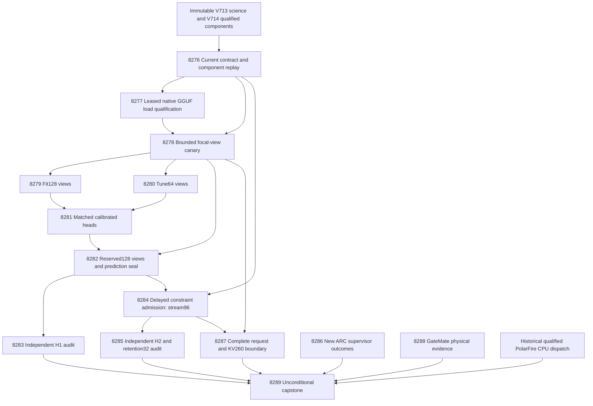

# Research roadmap V715 — Backend-qualified evidence interventions and continuous constraint learning

Milestone: **2026.10.715**. Planned on **2026-10-08**, after V714 completed
its scheduling cycle. Status: **staged; not activated or experimentally run**.
The execution contract is **14 tasks, Exp8276 through Exp8289, in that order**,
across four phases (3 + 4 + 3 + 4). The exact task table and full JSON task
objects below agree with `research-roadmap-next.yaml`.

## Purpose and the three largest PRD gaps

1. **Verification that improves real decisions (FR-06/FR-12).** Transport,
   calibration and energy evaluation exist, but source-intervention utility is
   still unmeasured. V712's margin-head cost gain was -0.01953125, with lower
   bound -0.04296875. V713 and V714 never measured the proposed feature change.
   Qualify actual model access, then test the frozen evidence features against
   equally informed simple heads. All reused sources are exposed development;
   a successful result would not establish independent generalization.
2. **Continuous self-learning that changes later behavior (FR-11).** Durable
   state and qualified typed-action controls are available. V712's measured
   learning benefit was zero; V714's new constraint-admission mechanism did not
   execute on natural data. Test delayed constraint admission, later use on a
   distinct source, cost reduction and retention. Learning updates small heads
   and counters; it does not train the mandated generator.
3. **Reliable local execution and complete service efficiency
   (FR-05/FR-08/NFR-01).** A failing PyTorch CUDA precheck stopped a llama.cpp
   workload. Historical board timings do not establish useful end-to-end speed.
   Qualify the leased native backend and count cold load, tokenization, three
   view requests, scoring, persistence, transfers and shutdown. Bound only the
   work the KV260 fabric actually supports. Preserve PolarFire's qualified CPU
   dispatch and GateMate's physical blocker.

The hybrid architecture remains: the generator proposes, energy verifies,
independent outcomes train or reject changes. ARC's standing generalization
slot examines new live supervisor evidence without manufacturing game runs.

## What V714 proved, and what it did not

| Evidence | Observed result | Consequence |
|---|---|---|
| Exp8262 | `complete_null_coverage_custody`; coverage and contract readiness both 1; owned checks pass | Reuse durable coverage custody; do not rebuild it. |
| Exp8263 | `complete_circular_positive_protocol_conformance`; view and admission readiness both 1 | Exact-token focal requests and causal typed-action controls qualify as mechanics, not natural benefit. |
| Exp8264 | `complete_blocked_CUDA_runtime_available`; PyTorch reports Error 101, invalid device ordinal | Native llama.cpp was not qualified or disproved; diagnose and test the actual owned backend. |
| Exp8265–Exp8271 | Seven declared primary outputs absent; conductor records upstream-retirement skips | Capture, trained intervention heads, H1 and natural H2 remain unmeasured. Missing work is not a null result. |
| Exp8272 | `complete_null_no_new_outcomes` | Read only the next authenticated supervisor delta. |
| Exp8273 | `complete_blocked_capture` | Current full-service operands remain unavailable. |
| Exp8274 | `complete_blocked_gatemate_physical_change` | No JTAG retry without a dated physical setup change. |
| Exp8275 | `complete_blocked_upstream_evidence`; owned checks pass | Preserve all fourteen dispositions; administrative completion is separate from science. |

The archive ends at V713 at planning time. V714 evidence comes from its active
roadmap, primaries, terminal sidecars and conductor log. Its complete design is
preserved at `openspec/change-proposals/research-roadmap-v714-preserved-20261008.md`.
Seven tasks executed; seven downstream declared primaries are absent. Exp8264
is an executed blocked artifact, not a missing canary or a semantic null.

### The concrete execution change

`python/carnot/verify/evidence_view_execution_8264.py::cuda_preflight` invokes
`.venv/bin/python` and gates on `torch.cuda.is_available()`. Its saved stderr
reports `cudaGetDeviceCount()` Error 101. Actual capture uses the native
llama-server through `evidence_view_live_8264.py` and the existing owned lease
lifecycle. The planning read-only inventory sees **one** RTX 3090,
UUID `GPU-7971baff-9583-eaa6-2292-393f930a28f9`, at index 0. The historical
inventory lists two; this observation does not establish why one is absent.

Exp8277 tests a fresh child bound to an available permitted UUID and consistent
process-local ordinal. It preserves intentional access masks, requires a valid
lease, real CUDA offload and PID-bound residency, and blocks on native failure.
PyTorch evidence remains diagnostic rather than a substitute for this backend.
No driver reset, reboot, install, or killing another owner's process is planned.
This is a falsifiable backend qualification, not an assumption that remapping
will fix CUDA. Exp8278 remains gated on its actual result.

## Research incorporated before experiment design

The dated V715 section in `research-references.md` was appended before this design.
All requested primary and secondary areas were checked; access limits are recorded.

- [Evidence-Aligned Entity Verification](https://arxiv.org/abs/2609.08267) and
  [RT4CHART](https://arxiv.org/abs/2603.27752) motivate complete sentence custody
  and matched source deletions in Exp8278–Exp8283. These are narrow adaptations,
  not reproductions; neither deletion sensitivity nor an LLM verdict is truth.
- [Verify to Amplify, revised September 2026](https://arxiv.org/abs/2603.03538v5)
  motivates separate false-accept, false-reject and abstention endpoints in
  Exp8283/Exp8285. The frozen protocol and acceptance rules remain unchanged.
- [Delayed-feedback inference](https://arxiv.org/abs/2609.07251) motivates
  release/admission/later-use timing rows in Exp8284/Exp8285.
  [SEVA](https://arxiv.org/abs/2606.29713) and
  [KAN-CL](https://arxiv.org/abs/2605.12306) reinforce causal feedback and a
  separate retention check. No conformal or KAN theorem is claimed for counts.
- [ARM-EBM](https://arxiv.org/abs/2512.15605) motivates matched probability
  controls in Exp8281; energy parameterization alone cannot establish correctness.
- [FPGA–ASIC co-design](https://arxiv.org/abs/2602.15985) and
  [Extropic Z1T](https://extropic.ai/writing/z1t/) motivate Exp8287's compatible
  operation ledger and complete request boundary. Vendor estimates are not
  measurements on Carnot's boards.

EBT, HardNet++, Neural Ising Machines and ETS were considered. A new generator,
projection or sampler branch does not address the present access/utility gaps.
OpenReview direct access hit browser challenges; Semantic Scholar citation
inventory was unavailable; GitHub Trending snapshots were stale. Kona supplies
architecture context without an inspected local implementation recipe. No
new dependency, corpus purchase, hardware purchase or external publication is planned.

## Architecture



The producer sees public source/answer bytes. Separate audit and feedback-release
workers own labels. Grammar conformance, transport readiness, information value,
energy-specific value and retained learning have different gates.

## Frozen scientific contract

`openspec/change-proposals/v713-evidence-intervention-protocol.json` remains
unchanged, SHA-256
`f4c06e17a9f8eb72f1be80b265ab7e3507cbc5f6f3b918df6421fe49dae02018`.
Exp8276 creates a separate V715 execution binding. It does not refreeze science.

- Original source roles: fit128, tune64 (calibration32/selection32), evaluation128
  (stream96/retention32), sorted original IDs within the prescribed partitions.
  Original source hashes must remain disjoint. Public-input eligibility counts
  from prior planning were 105/53/97; these are not current capture successes.
- One focal complete answer sentence: maximum cached V707 unsupported probability,
  tie by original index. Selected complete source sentence: maximum Unicode-word
  Jaccard overlap with the focal sentence, tie by index. Control: a *different*
  complete source sentence nearest in exact embedded-token length, tie by index.
  Nonselected does not mean irrelevant. Missing controls stay unavailable.
- Five new features join the historical sixteen: current original probability,
  selected-deletion delta, control-deletion delta, their difference, and signed
  removal-length mismatch normalized by original source token count.
- Energy21, logistic21 and additive21 each have 22 coefficients. Energy16 and
  control-only energy19 are ablations with independent fit-only geometry and
  21 centers. The unchanged protocol fixes ridge grid, optimizer, calibration
  and source folds. Calibrate only on calibration32; select the simple comparator
  on selection32 using cost, then Brier, then fixed order. No evaluation tuning.
- With unsupported target y=1: accept costs 5y, reject costs 1-y, escalate costs
  .5. Accept is allowed only in the frozen V707 accepted set; ties escalate.
  Every arm shares the frozen V707 probability **and action** on missing views,
  or shared escalation only when that baseline is absent. Missing rows remain
  in all intended denominators and contribute zero paired treatment gain.
- H1: all128; >=72 complete, >=12 per class; 10,000 paired source-cluster draws,
  seed7138248, >=9,500 valid draws, alpha=.025. Require lower cost gain >.02
  against the preselected simple comparator, >=5 improved sources, no additional
  false accepts and Brier/cost worsening <=.01/.02 against all mandatory controls.
  Energy-specific credit additionally requires positive lower gain against both
  equally informed simple heads. Feature value and energy value are separate.
- Online mechanism: Beta(1,1) global and eight-group counts, lambda=n/(n+16),
  eight distinct released sources before group admission. Group bits are cached
  E/non-E, selected delta>.1, abs(control delta)>.1. Random buckets use source
  hash plus seeds101/102/103 with the exact frozen encoding established before
  natural updates. This use of source hashes is a negative control, not memory.
  Issue/fsync prediction at t before releasing t-8. Missing features update
  global counts only; retention never updates. Final not-yet-due feedback stays
  pending. Genuine exits at slots40/72 must resume identical state/predictions.
- H2: all96 stream slots; >=64 complete, >=8 per class, >=8 nonoverlapping blocks
  of eight slots. Average seeds within source; 10,000 circular moving-block
  draws, primary block8 and sensitivity4/16, seed7138256, >=9,500 valid draws,
  alpha=.025. Lower gain>.02 versus global-only, >=5 improvements, no additional
  false accepts (also per seed), Brier/cost bounds .01/.02. Report frozen and
  random-group controls. Retention32 requires >=20 complete, >=5 per class,
  no extra false accepts and Brier/cost worsening <=.01/.02 versus frozen and
  global-only. A group must affect a later distinct source's decision.

Only support-qualified nulls with an actual typed-decision learnable control,
permissible-action oracle headroom>.02 and >=5 improvable sources can retire a
scientific mechanism. Oracle values are audit-only and never fed to a producer.
Fixtures are circular mechanics; insufficient support is blocked; a test lacking
headroom is noninformative. Both generalization scores remain zero throughout.


## Phases and experiment deliverables

### Phase 1 — reuse qualified science interfaces and test native access (Exp8276–Exp8278)

- **Exp8276:** bind fourteen current tasks and cold-replay V714's qualified
  coverage/view/admission components. Write a separate V715 execution binding.
  Emit independent contract, coverage, view and admission readiness fields.
  This task reuses established modules; it does not redo the science design.
- **Exp8277:** qualify Qwen GGUF loading through the actual leased llama.cpp
  backend in a fresh child with explicit device identity. No text generation.
  Record backend/device mapping, offload, residency and owned cleanup. A failure
  blocks only the acquisition chain and leaves precise native diagnostics.
- **Exp8278:** first twelve label-blind eligible fit sources, three views,
  at most 36 calls with 64 output tokens each. Require at least nine complete
  triplets, no cross-talk and source/answer custody. Forecast fit, tune and
  reserved budgets separately. Zero semantic effect can still qualify transport.

### Phase 2 — acquire the frozen evidence and fit matched heads (Exp8279–Exp8282)

- **Exp8279:** fit128, at most 384 calls. At least 80 complete and 12 per class.
- **Exp8280:** tune64, at most 192 calls. At least 40 complete, with at least
  eight per class in each original calibration/selection half. Independent of
  fit completion; both capture tasks consume the same qualified adapter.
- **Exp8281:** train energy21, logistic21 and additive21 plus radial16 and
  control-only radial19 ablations. Equal information, coefficient budgets and
  optimization discipline; calibrate on calibration32 and select the simple
  comparator on selection32. Seal before reserved inference. This fulfills
  the standing calibrated-decision training floor.
- **Exp8282:** evaluation128, at most 384 calls. Seal all predictions before
  target access. Produce public-only stream96 and retention32 manifests.
  Preserve missing slots. Prediction custody does not imply statistical support.

### Phase 3 — test decisions and continuous constraint learning (Exp8283–Exp8285)

- **Exp8283:** independently recompute H1, asymmetric errors, calibration,
  fallback costs and energy-specific advantage. Use the audit-only permissible
  action oracle only for headroom, never for producer inputs or target repair.
- **Exp8284:** execute Tier 1/2 continuous self-learning. Use delayed independent
  labels to admit bounded reusable soft constraints. Compare frozen, global,
  evidence-group and seeded random-group arms. A constraint must influence a
  later distinct source. Persist pending predictions and exact state through
  genuine exits. Record CPU update/lookup latency and state size. H1 success
  is not a prerequisite for testing learning.
- **Exp8285:** independently reconstruct H2 and sealed retention. Report
  release-to-admission and admission-to-use intervals and separate false accepts,
  missed detections and abstention. Keep the registered delay, order and alpha.
  Distinguish insufficient support, no headroom, informative null and benefit.

### Phase 4 — independent obligations and synthesis (Exp8286–Exp8289)

- **Exp8286:** new authenticated live supervisor outcomes after Exp8272's exact
  frontier. No new evidence means one cheap terminal null. Evaluate transferable
  arm selection only when cross-game support qualifies; no new game run, solve
  claim, arm invention or live-policy change. This meets the ARC standing floor.
- **Exp8287:** complete request costs, supported KV260 operations and bounded
  fixed-point checks. Reduce available branches even when science is null.
  Missing current clocks remain unavailable. No new board probe or speed claim.
- **Exp8288:** new GateMate cable/port/power evidence after Exp8274's frontier.
  Preserve the unchanged physical block once. No JTAG retry. New physical
  evidence can define a future probe contract; it cannot establish flashing.
- **Exp8289:** unconditional fourteen-slot reconciliation. Independently replay
  qualified science, preserve absent/pre-gate records, inspect board obligations
  and compute the existing G1–G4 publication gate. External incompleteness is
  terminal `blocked`; `partial` is only unfinished owned work.

## Dependency graph and gate contracts

All gates use `op: ==`, `value: 1`. Every producer is earlier in this roadmap,
and every field appears in that producer's REQUIRED ARTIFACT FIELDS.

| Consumer | Producer and exact field |
|---|---|
| Exp8277 | Exp8276 `current_contract_ready_score` |
| Exp8278 | Exp8276 `view_kernel_ready_score`; Exp8277 `gguf_backend_ready_score` |
| Exp8279 | Exp8278 `view_canary_ready_score`, `fit_capture_budget_ready_score` |
| Exp8280 | Exp8278 `view_canary_ready_score`, `tune_capture_budget_ready_score` |
| Exp8281 | Exp8279 `fit_views_ready_score`; Exp8280 `tune_views_ready_score` |
| Exp8282 | Exp8281 `intervention_fit_ready_score`; Exp8278 `reserved_capture_budget_ready_score` |
| Exp8283 | Exp8282 `reserved_views_ready_score` |
| Exp8284 | Exp8276 `admission_kernel_ready_score`; Exp8282 `reserved_views_ready_score` |
| Exp8285 | Exp8284 `constraint_trajectory_ready_score` |
| Exp8276, Exp8286–Exp8289 | Ungated; preserve their own blocked/null/disqualified evidence |

External source failures are recorded with upstream ID, actual path/hash, exact
field, expected and observed value in `gate_check_summary`. A measured zero,
missing field and missing artifact are different states. No current `requires`
chain references a retired experiment. Historical inputs are provenance only.

## Hardware, model and runtime requirements

- **CPU/RAM:** small-head fitting, feature assembly, independent reductions,
  bounded eight-group counters and journal persistence. Each learning update has
  a CPU path; batching may later use GPU/NPU and compatible term lookup may use
  FPGA. Report measured limits; do not assert a 100x acceleration without data.
- **GPU:** plan for one available 24 GB RTX 3090, leased by UUID at execution.
  A second historical card is not a prerequisite. Do not override another owner,
  intentional visibility restrictions or stale driver failure. The circa 16 GB
  Q4_K_M GGUF must fit with context/KV overhead under the established lease gate.
- **LLM:** every current LLM task declares `unsloth/Qwen3.8-27B-GGUF`, Q4_K_M,
  resolved model hash, embedded tokenizer/chat template, and live GPU receipts.
  Exp8277 is `model_load_no_generation` (2-second floor). Exp8278/8279/8280/8282
  are `model_bounded_generation` (10-second floor): each request emits at most
  64 tokens. No task is `model_full_generation`; its 60-second floor applies
  only to real generative workloads. Never pad time to clear a floor. Cached
  reductions and small-head training use `no_model_load`, `MODEL_SPECS: []`,
  zero current LLM calls and separate trained-head metadata. Legacy small models
  remain optional CPU smoke fixtures and supply no headline result.
- **KV260:** preserve authenticated board evidence and supported quadratic work
  at `k_max<=5`, reached via `ssh kria`. Gaussian bases, text generation and
  durable commits are not supported fabric operations by assertion. Use measured
  service share f for the ideal bound `1/(1-f)`; no clocks means unavailable.
- **PolarFire:** Exp8259 reached `polarfire_workload_validated=true` with actual
  board-local Linux CPU dispatch and hash parity. Capstone re-authenticates its
  qualified sidecars. No repeated mandatory task after that terminal state;
  graduation does not claim FPGA acceleration.
- **GateMate:** unchanged `0xffffffff` blocker. Reopen only after a documented
  physical change, authenticated GM1Ax IDCODE, then n16 flash/sample/hash evidence.
- **Wishlist:** no new purchase required. Existing GPU access is the immediate
  constraint. NPU and TSU remain unqualified; Extropic's estimates do not justify
  hardware acquisition. The legacy wishlist's earlier hardware statuses are
  superseded by dated receipts when they conflict.

## Execution discipline, validation and stopping rules

Every prompt contains numbered requirements for flushed phase messages, lines
before and after model load/generation/benchmark/subprocess calls, and heartbeat
or completed/pending counts inside long loops. Children are monitored at least
every 60 seconds. Keep every output gap below 600 seconds. A silent task can die
at 1200 seconds despite a larger estimate; no task may depend on that estimate
as a substitute for progress. Files over about 200 lines are written in chunks
of at most about 150 lines, with a progress message between tool calls.

Capture work has a 2400-second measurement allowance and at most 900 seconds
validation, reserving 1200 seconds for implementation/tests/closeout (4500 seconds
planned, below the 4800-second hard cap). Before each cohort, use the canary's
conservative tail timing plus cold setup, shutdown and retry costs. If the frozen
roster cannot fit, block that branch with measured costs; do not shrink the cohort.
The independent fit/tune tasks prevent one oversized capture from holding both.

All experiments use spec-first, tests-first work, the existing terminal publisher,
primitive receipts and current invocation hashes. Keep runners thin and reuse
qualified modules. Run applicable private E2E checks from `ops/e2e-test-plan.md`,
focused unit/consumer checks, complete changed-code statement coverage including
CLI/child statements, scoped Ruff/format/strict mypy and spec coverage. Cold replay
must reject rehashed aggregate tampering. Each comparison emits per-unit rows,
including missing/censored/excluded units, raw denominators and independent counts.

`verdict_class` is one of `positive`, `circular_positive`, `null`, `blocked`,
`disqualified`, `partial`. Mechanical oracle/fixture results are circular.
Owned-check failure disqualifies readiness. External unchanged failure blocks;
only unfinished owned work uses retryable `partial`. Every reused failed scope
has all four `prior_failures` members, including `retire_if_same_verdict: true`.
No operator override is invented. A scope may be scientifically retired only
with adequate support, a passing typed-action learnable control and audit-only
headroom. Failure to obtain observations never establishes a scientific null.

Phase acceptance is falsifiable: Phase 1 needs qualified native execution and
transport; Phase 2 needs valid captures, matched training and prediction custody;
Phase 3 needs independent H1/H2 and retention reduction; Phase 4 needs all task
dispositions and precise hardware obligations. A capstone can finish honestly
blocked even when all of its own validation passes. No release, leaderboard
submission, generator training, conductor modification or push is scheduled.

Opus with 100 turns is reserved for Exp8276's authority/component qualification
and Exp8277's hardware/backend integration. Routine measurements and synthesis
retain the default Claude backend and 50 turns; read-only ARC/GateMate work uses
20 and KV260 accounting 30. No formulaic new verifier, game cartridge or dataset
pipeline requires a Codex task in this continuation. This routing follows the
current user directive, which supersedes older repository-wide backend defaults.

### Planning validation and claim boundary

The planning checks use the existing roadmap schema, gate audit, exclusion lint,
ARC floor/precondition lint, hardware continuity checker and exact contract
parser. Relevant validator unit tests and private E2E-015/017/019/020 exercises
check the reused planning assumptions. Their outcomes are recorded in the ops
planning entry; they do not run the planned science or qualify current CUDA.
The original active YAML, conductor and frozen science protocol remain unchanged.

## Exact task contract

The table and JSON below contain exactly **14 tasks, Exp8276 through Exp8289**.
The JSON stores complete task objects, including prompts, priors, gates, model
and substrate declarations. Its parsed objects must equal the staged YAML list.
The table is independently parsed by the existing `roadmap_contract` reader.

| Order | Task ID | Title | Phase | Deliverable |
|---|---|---|---|---|
| 1 | `exp8276-current-contract-readiness` | Bind fourteen tasks and reuse qualified evidence and learning kernels | 1 | `results/experiment_8276_v715_current_contract_readiness.json` |
| 2 | `exp8277-lease-backend-qualification` | Qualify the leased llama.cpp backend under explicit device identity | 1 | `results/experiment_8277_v715_lease_backend_qualification.json` |
| 3 | `exp8278-evidence-view-canary` | Measure bounded Qwen response to selected and length-controlled deletions | 1 | `results/experiment_8278_v715_evidence_view_canary.json` |
| 4 | `exp8279-fit-view-capture` | Capture evidence views on one hundred twenty-eight frozen fit sources | 2 | `results/experiment_8279_v715_fit_view_capture.json` |
| 5 | `exp8280-tune-view-capture` | Capture calibration and selection views on sixty-four frozen tune sources | 2 | `results/experiment_8280_v715_tune_view_capture.json` |
| 6 | `exp8281-intervention-energy-fit` | Train calibrated energy decisions from evidence-dependence features | 2 | `results/experiment_8281_v715_intervention_energy_fit.json` |
| 7 | `exp8282-reserved-view-seal` | Capture and seal intervention decisions for every reserved source | 2 | `results/experiment_8282_v715_reserved_view_seal.json` |
| 8 | `exp8283-intervention-benefit-audit` | Independently test source-intervention decision benefit | 3 | `results/experiment_8283_v715_intervention_benefit_audit.json` |
| 9 | `exp8284-continuous-constraint-admission` | Learn reusable soft constraints from delayed attribution feedback | 3 | `results/experiment_8284_v715_continuous_constraint_admission.json` |
| 10 | `exp8285-constraint-learning-audit` | Audit later constraint benefit and sealed retention | 3 | `results/experiment_8285_v715_constraint_learning_audit.json` |
| 11 | `exp8286-arc-outcome-frontier` | Inspect new live supervisor outcomes for cross-game arm selection | 4 | `results/experiment_8286_v715_arc_outcome_frontier.json` |
| 12 | `exp8287-kv260-evidence-cost-boundary` | Bound new evidence and learning costs against the KV260 operation set | 4 | `results/experiment_8287_v715_kv260_evidence_cost_boundary.json` |
| 13 | `exp8288-gatemate-physical-delta` | Carry GateMate physical-change evidence and its exact reopening condition | 4 | `results/experiment_8288_v715_gatemate_physical_delta.json` |
| 14 | `exp8289-capstone` | Reconcile fourteen outcomes and decide whether evidence or learning improved | 4 | `results/experiment_8289_v715_capstone.json` |

<!-- V715_TASK_CONTRACT_START -->
```json
{
  "milestone": "2026.10.715",
  "tasks": [
    {
      "id": "exp8276-current-contract-readiness",
      "title": "Bind fourteen tasks and reuse qualified evidence and learning kernels",
      "phase": 1,
      "track": "infrastructure",
      "priority": "high",
      "requires_gpu": false,
      "max_turns": 100,
      "estimated_wall_time_min": 45,
      "per_unit_rows": true,
      "milestone": "2026.10.715",
      "deliverable": "results/experiment_8276_v715_current_contract_readiness.json",
      "inference_substrate_class": "no_model_load",
      "MODEL_SPECS": [],
      "gated_on": [],
      "model": "opus",
      "prior_failures": [
        {
          "experiment_id": "exp8249-evidence-view-kernel",
          "verdict": "complete_disqualified_evidence_view_kernel",
          "addressed_by": "V714 shipped durable coverage custody and conforming focal/typed-action adapters. Reuse and authenticate those bytes, with current execution bindings only; do not repeat the failed private-path reader.",
          "retire_if_same_verdict": true
        },
        {
          "experiment_id": "exp8275-capstone",
          "verdict": "complete_blocked_upstream_evidence",
          "addressed_by": "Freeze all fourteen V714 dispositions and distinguish seven absent cascade outputs from measured results. Current readiness does not demand upstream science success.",
          "retire_if_same_verdict": true
        }
      ],
      "prompt": "CONTEXT:\nWork in {project_root} on {date}. V714 qualified Exp8262 coverage custody and Exp8263 focal-tokenizer and admission controls. Exp8264 blocked with CUDA Error 101 before any model load. Seven following outputs are absent, not scientific nulls. Reuse successful mechanics; bind V715 separately from the unchanged science.\nEXISTING CODE TO READ FIRST:\nCLAUDE.md; CODEX.md; ops/e2e-test-plan.md; openspec/capabilities/research-reporting/spec.md; openspec/capabilities/verification/spec.md; scripts/experiment_template.py; python/carnot/reporting/primary_publication.py; ops/exclusion_manifest.yaml; openspec/change-proposals/research-roadmap-vNEXT.md; research-references.md; python/carnot/reporting/roadmap_contract.py; python/carnot/reporting/evidence_intervention_methods_8248.py; python/carnot/reporting/coverage_custody_8262.py; python/carnot/verify/protocol_conformance_8263.py; python/carnot/verify/focal_capture_8263.py; python/carnot/verify/typed_admission_8263.py; tests/python/test_protocol_conformance_8263.py; results/experiment_8262_v714_coverage_custody.json; results/experiment_8263_v714_protocol_conformance.json; results/experiment_8264_v714_evidence_view_canary.json; results/experiment_8275_v714_capstone.json; openspec/change-proposals/v713-evidence-intervention-protocol.json\nTASK:\nDeliver results/experiment_8276_v715_current_contract_readiness.json. Create the thin runner scripts/experiments/experiment_8276_v715_current_contract_readiness.py. Store primitive evidence under results/raw/experiment_8276_v715_current_contract_readiness/.\nCONCRETE STEPS:\n0. Emit a flushed start line. Authenticate inputs and bound terminal sidecars. Missing external operands yield complete_blocked_<operand>, verdict_class=blocked, and gate_check_summary with exact failed values. Failed owned checks disqualify readiness. Do not fabricate missing data.\n1. Emit a flushed progress line at every phase boundary, and before and after every model load, generation, benchmark and subprocess. Print completed/pending counts inside long loops and a heartbeat at least every 60 seconds while children run. Keep every output gap below 600 seconds. Use unbuffered output, bounded deadlines and process-group cleanup. Write any file over about 200 lines in several tool calls of at most about 150 lines, with a progress message between calls. Split work into resumable batches; no single huge tool call. Do not pad runtime.\n2. Add relevant REQ-* and SCENARIO-* before implementation, then focused failing tests. Preserve existing assertions. Reuse qualified modules through thin adapters. Freeze owned validation commands. Put private fixtures outside results/ and scratch outside the repository root. Keep generator weights frozen.\n3. Declare no_model_load, MODEL_SPECS=[] and aggregation_from_upstream_artifacts. Record zero current LLM calls. Embedded-tokenizer vocabulary access does not load neural weights.\n4. Bind the design table and full JSON task contract to all fourteen staged/activated tasks Exp8276 through Exp8289, in order. Use the existing reader with explicit current milestone and range. Snapshot original authorities, code and configurations. Cold replay reads frozen snapshots, never demands that a later live roadmap still has this milestone. Staged agreement is not activation. Do not edit the conductor or validators.\n5. Write openspec/change-proposals/v715-evidence-execution-contract.json as an execution binding. Preserve openspec/change-proposals/v713-evidence-intervention-protocol.json SHA-256 f4c06e17a9f8eb72f1be80b265ab7e3507cbc5f6f3b918df6421fe49dae02018. Map every gate to the current task and exact declared artifact path. Import historical qualified components with byte-bound sidecars; current readiness must not be copied from a stale success flag.\n6. Run the existing private coverage-custody and protocol-conformance tests with current thin bindings, without redesigning their scientific controls. Verify durable coverage after private scratch deletion, actual embedded-token counts, exactly one focal response at <=64 tokens, independent view/admission validation, causal issue-before-release and genuine crash resume. Reuse the natural-shape and learnable typed-action fixtures; fixture success is circular_positive only.\n7. Emit current_contract_ready_score, coverage_custody_ready_score, view_kernel_ready_score and admission_kernel_ready_score independently. Each requires applicable owned checks and authenticated primitives; set only the affected field to zero on failure. Freeze source-role manifests and all intended units. Record the V714 canary failure and each cascade skip without inventing honest_verdict strings for missing primaries.\n8. Run applicable private E2E-015/019 checks from ops/e2e-test-plan.md, plus task-specific checks below. Run focused unit and consumer tests, 100 percent changed-code statement coverage including CLI/child statements, scoped Ruff check/format, strict mypy and scripts/check_spec_coverage.py --files <owned-test-files>. Preserve actual argv, exits, clocks and stdout/stderr hashes. Keep repository-health diagnostics separate; never report a global pass from scoped checks.\n9. Cold-replay primitives in a fresh process, including rehashed-tamper and negative controls. Validate a private candidate with unchanged primary_publication terminal checks, scripts/adversarial_verify.py --json <private-candidate> and scripts/verdict_row_consistency_lint.py --strict <private-candidate>. Publish atomically after normal exit and owned validation. Preserve historical primaries. Reconcile openspec/, _bmad/traceability.md, ops/status.md and ops/changelog.md. Do not modify research-roadmap.yaml.\nREQUIRED ARTIFACT FIELDS:\nexperiment_id, task_id, milestone, run_date: principle: Identify the actual invocation.\nhonest_verdict, verdict_class: principle: Use complete_* terminal verdicts and one of positive | circular_positive | null | blocked | disqualified | partial. Partial means unfinished owned work. Unchanged external failures mean blocked.\ngate_check_summary: principle: Each block names the upstream, actual path/hash, exact field, operator, expected value and observed value. Missing evidence differs from a measured zero.\ninference_substrate, inference_substrate_class, MODEL_SPECS, model_invocation_counts: principle: Record actual current calls separately from historical model provenance.\nrows, intended_count, completed_count, failed_count, censored_count, excluded_count, independent_count: principle: Preserve every source, condition and arm, including missing units. Record metric numerators and denominators. Repeats and seeds do not add independent sources.\nverifier_is_oracle, exposure_scope, independent_generalization_score, generalized_learning_benefit_score: principle: Oracle-defined success is circular_positive. All reused sources are exposed development. Both generalization scores remain zero in this milestone.\nrequired_checks_passed, flagged_adversarial, acceptance_gates, validation_receipts, terminal_validation_sidecar_path: principle: Failed owned checks disqualify the result and set readiness to zero. Readiness does not imply benefit.\npreconditions_checked, duration_s, random_seed, reproducibility_checksum, source_artifact_hashes, code_config_hashes, raw_shard_hashes, phase_spans: principle: Bind real work to replayable primitive evidence and actual code/configuration bytes.\ncited_upstream_artifacts, field_principles: principle: Name each imported field and hash. Explain the evidentiary purpose of each added field.\ncurrent_contract_ready_score, coverage_custody_ready_score, view_kernel_ready_score, admission_kernel_ready_score: principle: Separate current authority from independent qualified components.\ncanonical_tasks_sha256, authority_snapshots, historical_dispositions, frozen_science_sha256, execution_contract_sha256, component_validation_receipts: principle: Keep original science and historical results immutable while binding new execution.\n\nRun command: cd {project_root} && PYTHONPATH=python:. PYTHONUNBUFFERED=1 .venv/bin/python -u scripts/experiments/experiment_8276_v715_current_contract_readiness.py --date {date}\nDo NOT push. Do NOT modify scripts/research_conductor.py."
    },
    {
      "id": "exp8277-lease-backend-qualification",
      "title": "Qualify the leased llama.cpp backend under explicit device identity",
      "phase": 1,
      "track": "hardware",
      "priority": "high",
      "requires_gpu": true,
      "max_turns": 100,
      "estimated_wall_time_min": 60,
      "per_unit_rows": true,
      "milestone": "2026.10.715",
      "deliverable": "results/experiment_8277_v715_lease_backend_qualification.json",
      "inference_substrate_class": "model_load_no_generation",
      "MODEL_SPECS": [
        {
          "hf_id": "unsloth/Qwen3.8-27B-GGUF",
          "quantization": "Q4_K_M"
        }
      ],
      "gated_on": [
        {
          "upstream": "exp8276-current-contract-readiness",
          "artifact_field": "current_contract_ready_score",
          "op": "==",
          "value": 1
        }
      ],
      "model": "opus",
      "prior_failures": [
        {
          "experiment_id": "exp8264-evidence-view-canary",
          "verdict": "complete_blocked_CUDA_runtime_available",
          "addressed_by": "The PyTorch availability check failed with invalid device ordinal before llama.cpp launched. Qualify the actual GGUF backend in a fresh child tied to a leased GPU UUID, preserving both backend failures and the original precheck receipt. Device enumeration alone never qualifies execution.",
          "retire_if_same_verdict": true
        }
      ],
      "prompt": "CONTEXT:\nWork in {project_root} on {date}. Exp8264 failed a PyTorch CUDA availability check with invalid device ordinal before launching llama.cpp. The generator actually uses the cached native llama-server. Planning sees one RTX 3090; historical two-card ordinals are unsafe assumptions. The cause of Error 101 is not yet proved. Test the leased backend without weakening GPU evidence.\nEXISTING CODE TO READ FIRST:\nCLAUDE.md; CODEX.md; ops/e2e-test-plan.md; openspec/capabilities/research-reporting/spec.md; openspec/capabilities/verification/spec.md; scripts/experiment_template.py; python/carnot/reporting/primary_publication.py; ops/exclusion_manifest.yaml; openspec/change-proposals/research-roadmap-vNEXT.md; research-references.md; python/carnot/verify/evidence_view_execution_8264.py; python/carnot/verify/evidence_view_live_8264.py; python/carnot/experiment_7969_v691_qwen_calibration_capture.py; python/carnot/inference/llama_cpp_process.py; python/carnot/inference/sota_models.py; results/experiment_8264_v714_evidence_view_canary.json; ops/known-issues.md; results/experiment_8276_v715_current_contract_readiness.json\nTASK:\nDeliver results/experiment_8277_v715_lease_backend_qualification.json. Create the thin runner scripts/experiments/experiment_8277_v715_lease_backend_qualification.py. Store primitive evidence under results/raw/experiment_8277_v715_lease_backend_qualification/.\nCONCRETE STEPS:\n0. Emit a flushed start line. Authenticate inputs and bound terminal sidecars. Missing external operands yield complete_blocked_<operand>, verdict_class=blocked, and gate_check_summary with exact failed values. Failed owned checks disqualify readiness. Do not fabricate missing data.\n1. Emit a flushed progress line at every phase boundary, and before and after every model load, generation, benchmark and subprocess. Print completed/pending counts inside long loops and a heartbeat at least every 60 seconds while children run. Keep every output gap below 600 seconds. Use unbuffered output, bounded deadlines and process-group cleanup. Write any file over about 200 lines in several tool calls of at most about 150 lines, with a progress message between calls. Split work into resumable batches; no single huge tool call. Do not pad runtime.\n2. Add relevant REQ-* and SCENARIO-* before implementation, then focused failing tests. Preserve existing assertions. Reuse qualified modules through thin adapters. Freeze owned validation commands. Put private fixtures outside results/ and scratch outside the repository root. Keep generator weights frozen.\n3. Declare MODEL_SPECS=[unsloth/Qwen3.8-27B-GGUF, Q4_K_M] with resolved GGUF hash; use cached_current_model(), embedded tokenizer/chat template and CARNOT_FORCE_LIVE=1. Record live_gpu_gguf only on actual GPU loading. Declare model_load_no_generation (2-second floor), zero generation attempts and actual model-load counters. No completion, embedding or warm-up token generation is allowed in this task. Do not pad runtime.\n4. Preserve Exp8264 preflight stdout/stderr/argv and its Error 101 verbatim. Record only relevant device-mask variables, nvidia-smi UUID/index/memory inventory, backend binary and library hashes. Explain which facts are observed and which causes remain hypotheses. Never dump the full environment. No reboot, driver reset/install, bus rescan or termination of unowned processes.\n5. Reuse GpuLease and the owned server lifecycle. Select an available permitted UUID with sufficient VRAM under existing lease rules; never assume ordinal 1 exists or override an intentional resource mask. If access cannot be authorized by the lease, block. In a fresh child, bind the permitted UUID and map its process-local ordinal consistently to llama.cpp argv. Derive --device/main-gpu flags from the actual binary help/device enumeration. Preserve parent environment and old runner bytes; change only a narrow current adapter.\n6. Write deterministic tests for stale ordinal, one visible GPU, nonidentity UUID-to-local-index mapping, occupied lease, CPU-only backend, load timeout and wrong-model server. Pin the leased UUID, PID/start-time identity and launch environment in receipts. A PyTorch probe may diagnose its own runtime but cannot substitute for the native backend check.\n7. With a bounded 600-second deadline and heartbeat, launch only the owned Qwen server, authenticate model and backend, inspect loaded CUDA libraries, nonzero GPU offload and PID-bound residency, and require health readiness. Querying metadata is allowed; sending a generation request is not. A CPU fallback fails. Record cold load and shutdown spans. Shut down only the owned process group and release the lease.\n8. Emit gguf_backend_ready_score=1 only when real backend load/offload/residency, model identity, lease custody, cleanup and owned checks all pass. Native CUDA failure yields complete_blocked_gguf_backend with exact diagnostics; malformed owned code yields disqualified. Persist a reusable runtime binding and validation receipts under the current raw directory. Downstream tasks must recheck the lease and identity each run; this receipt never promises future capacity. Keep hardware-board work separate from this host-GPU qualification.\n9. Run applicable private E2E-015/019 checks from ops/e2e-test-plan.md, plus task-specific checks below. Run focused unit and consumer tests, 100 percent changed-code statement coverage including CLI/child statements, scoped Ruff check/format, strict mypy and scripts/check_spec_coverage.py --files <owned-test-files>. Preserve actual argv, exits, clocks and stdout/stderr hashes. Keep repository-health diagnostics separate; never report a global pass from scoped checks.\n10. Cold-replay primitives in a fresh process, including rehashed-tamper and negative controls. Validate a private candidate with unchanged primary_publication terminal checks, scripts/adversarial_verify.py --json <private-candidate> and scripts/verdict_row_consistency_lint.py --strict <private-candidate>. Publish atomically after normal exit and owned validation. Preserve historical primaries. Reconcile openspec/, _bmad/traceability.md, ops/status.md and ops/changelog.md. Do not modify research-roadmap.yaml.\nREQUIRED ARTIFACT FIELDS:\nexperiment_id, task_id, milestone, run_date: principle: Identify the actual invocation.\nhonest_verdict, verdict_class: principle: Use complete_* terminal verdicts and one of positive | circular_positive | null | blocked | disqualified | partial. Partial means unfinished owned work. Unchanged external failures mean blocked.\ngate_check_summary: principle: Each block names the upstream, actual path/hash, exact field, operator, expected value and observed value. Missing evidence differs from a measured zero.\ninference_substrate, inference_substrate_class, MODEL_SPECS, model_invocation_counts: principle: Record actual current calls separately from historical model provenance.\nrows, intended_count, completed_count, failed_count, censored_count, excluded_count, independent_count: principle: Preserve every source, condition and arm, including missing units. Record metric numerators and denominators. Repeats and seeds do not add independent sources.\nverifier_is_oracle, exposure_scope, independent_generalization_score, generalized_learning_benefit_score: principle: Oracle-defined success is circular_positive. All reused sources are exposed development. Both generalization scores remain zero in this milestone.\nrequired_checks_passed, flagged_adversarial, acceptance_gates, validation_receipts, terminal_validation_sidecar_path: principle: Failed owned checks disqualify the result and set readiness to zero. Readiness does not imply benefit.\npreconditions_checked, duration_s, random_seed, reproducibility_checksum, source_artifact_hashes, code_config_hashes, raw_shard_hashes, phase_spans: principle: Bind real work to replayable primitive evidence and actual code/configuration bytes.\ncited_upstream_artifacts, field_principles: principle: Name each imported field and hash. Explain the evidentiary purpose of each added field.\ngguf_backend_ready_score, backend_binding_path, backend_binding_sha256: principle: Qualify actual reusable GGUF backend execution without claiming inference benefit.\ndevice_inventory, inherited_mask, child_mask, uuid_to_local_index, gpu_lease_receipt, backend_identity, offloaded_layers, resident_gpu_receipt, load_spans, cleanup_receipt, cuda_failure_comparison: principle: Preserve backend and device evidence instead of treating enumeration as execution.\n\nRun command: cd {project_root} && PYTHONPATH=python:. PYTHONUNBUFFERED=1 .venv/bin/python -u scripts/experiments/experiment_8277_v715_lease_backend_qualification.py --date {date}\nDo NOT push. Do NOT modify scripts/research_conductor.py."
    },
    {
      "id": "exp8278-evidence-view-canary",
      "title": "Measure bounded Qwen response to selected and length-controlled deletions",
      "phase": 1,
      "track": "verification",
      "priority": "high",
      "requires_gpu": true,
      "max_turns": 50,
      "estimated_wall_time_min": 50,
      "per_unit_rows": true,
      "milestone": "2026.10.715",
      "deliverable": "results/experiment_8278_v715_evidence_view_canary.json",
      "inference_substrate_class": "model_bounded_generation",
      "MODEL_SPECS": [
        {
          "hf_id": "unsloth/Qwen3.8-27B-GGUF",
          "quantization": "Q4_K_M"
        }
      ],
      "gated_on": [
        {
          "upstream": "exp8276-current-contract-readiness",
          "artifact_field": "view_kernel_ready_score",
          "op": "==",
          "value": 1
        },
        {
          "upstream": "exp8277-lease-backend-qualification",
          "artifact_field": "gguf_backend_ready_score",
          "op": "==",
          "value": 1
        }
      ],
      "prior_failures": [
        {
          "experiment_id": "exp7854-intervention-protocol",
          "verdict": "complete_disqualified_required_checks",
          "addressed_by": "Live transport now uses the qualified V707 parser and the current pure view kernel, with complete owned validation before capture. V714 has since qualified receipt custody and focal/typed-action mechanics; V715 reuses those bytes and independently qualifies actual backend access.",
          "retire_if_same_verdict": true
        },
        {
          "experiment_id": "exp8249-evidence-view-kernel",
          "verdict": "complete_disqualified_evidence_view_kernel",
          "addressed_by": "Exp8249 read raw/logs/changed_code_coverage.json while its manifest wrote temporary coverage.json, then deleted it. Persist and authenticate the actual receipt output before cleanup; independently correct tokenizer, focal response and typed-decision controls. Never lower coverage or upgrade the historical primary. V714 has since qualified receipt custody and focal/typed-action mechanics; V715 reuses those bytes and independently qualifies actual backend access.",
          "retire_if_same_verdict": true
        },
        {
          "experiment_id": "exp8250-evidence-view-canary",
          "verdict": "blocked_gate_check_failed",
          "addressed_by": "The current prerequisite proves durable coverage and exact focal requests. Gate on the new declared producer fields; preserve the old pre-gate artifact as a block, not a measurement. V714 has since qualified receipt custody and focal/typed-action mechanics; V715 reuses those bytes and independently qualifies actual backend access.",
          "retire_if_same_verdict": true
        },
        {
          "experiment_id": "exp8264-evidence-view-canary",
          "verdict": "complete_blocked_CUDA_runtime_available",
          "addressed_by": "Exp8277 now qualifies the actual llama.cpp backend under a leased GPU UUID after the PyTorch Error 101. Exp8276 authenticates the V714 qualified kernels. Resume unchanged science only behind current readiness gates; absent V714 downstream primaries are unmeasured, not fabricated prior verdicts. V714 has since qualified receipt custody and focal/typed-action mechanics; V715 reuses those bytes and independently qualifies actual backend access.",
          "retire_if_same_verdict": true
        }
      ],
      "prompt": "CONTEXT:\nV714 ended before current view capture: Exp8264 was blocked by CUDA Error 101; Exp8265 through Exp8271 have no primary output. This is a gated execution continuation of frozen science, not a measured null rerun.\nWork in {project_root} on {date}. The source-view mechanism needs current live evidence. V707 transport success does not establish useful evidence sensitivity. This canary measures syntax and feasible acquisition cost before scaling.\nEXISTING CODE TO READ FIRST:\nresults/experiment_8277_v715_lease_backend_qualification.json; python/carnot/verify/evidence_view_live_8264.py; python/carnot/verify/evidence_view_execution_8264.py; openspec/change-proposals/v713-evidence-intervention-protocol.json; openspec/change-proposals/v715-evidence-execution-contract.json; CLAUDE.md; CODEX.md; ops/e2e-test-plan.md; openspec/capabilities/research-reporting/spec.md; openspec/capabilities/verification/spec.md; scripts/experiment_template.py; python/carnot/reporting/primary_publication.py; ops/exclusion_manifest.yaml; openspec/change-proposals/research-roadmap-vNEXT.md; python/carnot/verify/sentence_transport_canary_8181.py; python/carnot/verify/sentence_transport_8179.py; python/carnot/inference/sota_models.py; scripts/experiments/experiment_8236_v712_qualified_concurrency_canary.py; results/experiment_8276_v715_current_contract_readiness.json; results/experiment_8276_v715_current_contract_readiness.json\nTASK:\nMeasure bounded Qwen response to selected and length-controlled deletions. Deliver results/experiment_8278_v715_evidence_view_canary.json. Create the thin runner scripts/experiments/experiment_8278_v715_evidence_view_canary.py. Store primitive evidence under results/raw/experiment_8278_v715_evidence_view_canary/. Keep execution readiness separate from scientific benefit.\nCONCRETE STEPS:\n0. PRECONDITIONS: Emit a flushed start line. Authenticate required inputs and qualified terminal sidecars. Check private scratch and required tools before measurement. Missing external resources produce complete_blocked_<operand>, verdict_class=blocked. Record failed operands in gate_check_summary. Do not invent data or replace missing units.\n1. Emit a flushed progress line at every phase boundary. Emit one before and after every model load, generation, benchmark and subprocess. Print completed/pending counts inside long loops. Print a heartbeat at least every 60 seconds while children run. Keep every output gap below 600 seconds. Use unbuffered output, bounded deadlines and process-group cleanup. Write any file over about 200 lines in several tool calls of at most about 150 lines. Send a progress message between calls. Split work into resumable batches; no single huge tool call. Do not pad runtime.\n2. Add relevant REQ-* and SCENARIO-* before implementation. Write focused failing tests first. Preserve existing tests and assertions. Reuse qualified modules through small adapters. Freeze owned validation commands before measurement. Use private fixtures outside results/ and scratch outside the repository root. Do not update generator weights or publish externally.\n3. Declare MODEL_SPECS with unsloth/Qwen3.8-27B-GGUF, Q4_K_M and its resolved GGUF hash. Use cached_current_model(), the embedded tokenizer/chat template and an owned CUDA GPU lease. Set CARNOT_FORCE_LIVE=1. Record live_gpu_gguf and model_bounded_generation: each call has a fixed small output budget. The duration floor is 10 seconds; never pad it. Block on unavailable model/CUDA or an unqualified lease. Record load/generation counts, response bytes, tokens, monotonic clocks and in-flight GPU telemetry. No simulated or small-model headline fallback.\n4. Load the current Exp8277 backend binding, revalidate its UUID lease and use its qualified native lifecycle; do not reintroduce the failed PyTorch-only precondition. Use the first twelve label-blind eligible fit slots in ascending original source_cluster_id order. Retain the full intended twelve-slot roster even if a source lacks a matched control. Run all three views for the one focal sentence, at most 36 calls. Use temperature zero, seed 7138250 and at most 64 generated tokens per call. Derive the grammar bound with the embedded tokenizer first; an insufficient budget blocks that slot instead of truncating its answer.\n5. Reuse qualified transport and owned server lifecycle. Each view gets a unique request ID, fresh request state, unchanged answer bytes and source-view hash. Rotate the three view orders by source index. Preserve error responses and no-op interventions. Do not tune prompts, thresholds, control matching or source selection after observing outputs.\n6. Require at least nine complete source triplets, no request cross-talk and exact view/answer custody. Record missing-control frequency, syntax yield and probability-change distributions without reading human labels. Readiness depends on transport and custody, never on favorable effect direction. An all-zero effect is qualified null evidence.\n7. Measure current cold load, prefill, generation, serialization and shutdown spans. Forecast separate fit=128, tune=64 and reserved=128 capture times from token counts and conservative canary timings. Set separate fit_capture_budget_ready_score, tune_capture_budget_ready_score and reserved_capture_budget_ready_score to 1 only when the corresponding roster fits a 2400-second measurement budget plus at most 900 seconds validation. Reserve 1200 seconds for implementation, tests and closeout, giving a planned total of 4500 seconds. Exp8276 must prequalify the shared capture adapter; capture tasks only bind roles and paths. Before starting each capture, recheck the total elapsed budget and stop if its remaining allowance cannot fit the frozen roster. Otherwise block scale-up and retain a concrete cost estimate. Do not silently shrink a cohort or declare a larger wall-time estimate.\n8. Run applicable private E2E-015/019 checks from ops/e2e-test-plan.md. Run relevant unit and consumer tests. Measure 100 percent changed-code statement coverage, including real CLI and child statements. Run scoped Ruff check/format, strict mypy and scripts/check_spec_coverage.py --files <owned-test-files>. Preserve actual argv, exits, clocks and stdout/stderr hashes. Keep bounded repository-health diagnostics separate; known failures do not establish a global pass.\n9. Cold-replay primitive evidence in a fresh process. Include negative and rehashed-tamper cases. Validate a private candidate with unchanged primary_publication terminal checks, scripts/adversarial_verify.py --json <private-candidate> and scripts/verdict_row_consistency_lint.py --strict <private-candidate>. Publish atomically after normal exit and required checks. Preserve historical primary bytes and honest failure artifacts. Reconcile openspec/, _bmad/traceability.md, ops/status.md and ops/changelog.md. Do not modify research-roadmap.yaml.\n10. Authenticate the unchanged science protocol openspec/change-proposals/v713-evidence-intervention-protocol.json (SHA-256 f4c06e17a9f8eb72f1be80b265ab7e3507cbc5f6f3b918df6421fe49dae02018) and the current execution contract. Import only current qualified producer fields at their declared paths. Preserve historical failed primaries. Current gate readiness is separate from positive scientific benefit.\n11. Bind all budgets to the actual focal-only response schema and embedded-token counts. Forecast with the slower conservative tail timing plus load/setup/shutdown and retry allowance; cannot use byte lengths or all-sentence historical timings as a focal measurement. A budget failure blocks only that capture branch. Successful syntax and a zero intervention effect can both be reported honestly.\nREQUIRED ARTIFACT FIELDS:\nexperiment_id, task_id, milestone, run_date: principle: Identify the actual invocation.\nhonest_verdict, verdict_class: principle: Use complete_* terminal verdicts and one of positive | circular_positive | null | blocked | disqualified | partial. Partial means unfinished owned work. Unchanged external failures mean blocked.\ngate_check_summary: principle: Each block names the upstream, actual path/hash, exact field, operator, expected value and observed value. Missing evidence differs from a measured zero.\ninference_substrate, inference_substrate_class, MODEL_SPECS, model_invocation_counts: principle: Record actual current calls separately from historical model provenance.\nrows, intended_count, completed_count, failed_count, censored_count, excluded_count, independent_count: principle: Preserve every source, condition and arm, including missing units. Record metric numerators and denominators. Repeats and seeds do not add independent sources.\nverifier_is_oracle, exposure_scope, independent_generalization_score, generalized_learning_benefit_score: principle: Oracle-defined success is circular_positive. All reused sources are exposed development. Both generalization scores remain zero in this milestone.\nrequired_checks_passed, flagged_adversarial, acceptance_gates, validation_receipts, terminal_validation_sidecar_path: principle: Failed owned checks disqualify the result and set readiness to zero. Readiness does not imply benefit.\npreconditions_checked, duration_s, random_seed, reproducibility_checksum, source_artifact_hashes, code_config_hashes, raw_shard_hashes, phase_spans: principle: Bind real work to replayable primitive evidence and actual code/configuration bytes.\ncited_upstream_artifacts, field_principles: principle: Name each imported field and hash. Explain the evidentiary purpose of each added field.\nview_canary_ready_score, fit_capture_budget_ready_score, tune_capture_budget_ready_score, reserved_capture_budget_ready_score, request_rows, complete_triplets, projected_capture_seconds: principle: Separate transport success from affordability and semantic benefit.\nmodel_path_sha256, server_argv, generated_tokens, active_gpu_telemetry, service_phase_spans: principle: Authenticate actual bounded local generation and every cost component.\nfrozen_science_sha256, execution_contract_sha256: principle: Keep unchanged scientific choices distinct from repaired execution bindings.\nRun command: cd {project_root} && PYTHONPATH=python:. PYTHONUNBUFFERED=1 .venv/bin/python -u scripts/experiments/experiment_8278_v715_evidence_view_canary.py --date {date}\nDo NOT push. Do NOT modify scripts/research_conductor.py."
    },
    {
      "id": "exp8279-fit-view-capture",
      "title": "Capture evidence views on one hundred twenty-eight frozen fit sources",
      "phase": 2,
      "track": "verification",
      "priority": "high",
      "requires_gpu": true,
      "max_turns": 50,
      "estimated_wall_time_min": 75,
      "per_unit_rows": true,
      "milestone": "2026.10.715",
      "deliverable": "results/experiment_8279_v715_fit_view_capture.json",
      "inference_substrate_class": "model_bounded_generation",
      "MODEL_SPECS": [
        {
          "hf_id": "unsloth/Qwen3.8-27B-GGUF",
          "quantization": "Q4_K_M"
        }
      ],
      "gated_on": [
        {
          "upstream": "exp8278-evidence-view-canary",
          "artifact_field": "view_canary_ready_score",
          "op": "==",
          "value": 1
        },
        {
          "upstream": "exp8278-evidence-view-canary",
          "artifact_field": "fit_capture_budget_ready_score",
          "op": "==",
          "value": 1
        }
      ],
      "prior_failures": [
        {
          "experiment_id": "exp8185-sentence-decision-audit",
          "verdict": "complete_null_sentence_decision_null",
          "addressed_by": "Collect targeted cited-versus-matched deletion differences for every eligible source, replacing descriptive source-removal probes with features used by the decision model. V714 has since qualified receipt custody and focal/typed-action mechanics; V715 reuses those bytes and independently qualifies actual backend access.",
          "retire_if_same_verdict": true
        },
        {
          "experiment_id": "exp8249-evidence-view-kernel",
          "verdict": "complete_disqualified_evidence_view_kernel",
          "addressed_by": "Exp8249 read raw/logs/changed_code_coverage.json while its manifest wrote temporary coverage.json, then deleted it. Persist and authenticate the actual receipt output before cleanup; independently correct tokenizer, focal response and typed-decision controls. Never lower coverage or upgrade the historical primary. V714 has since qualified receipt custody and focal/typed-action mechanics; V715 reuses those bytes and independently qualifies actual backend access.",
          "retire_if_same_verdict": true
        },
        {
          "experiment_id": "exp8250-evidence-view-canary",
          "verdict": "blocked_gate_check_failed",
          "addressed_by": "Capture uses the repaired prerequisite and its own independently forecast role budget. The old combined 192-source task never ran; splitting fit and tune preserves frozen membership and prevents an oversized invocation. V714 has since qualified receipt custody and focal/typed-action mechanics; V715 reuses those bytes and independently qualifies actual backend access.",
          "retire_if_same_verdict": true
        },
        {
          "experiment_id": "exp8264-evidence-view-canary",
          "verdict": "complete_blocked_CUDA_runtime_available",
          "addressed_by": "Exp8277 now qualifies the actual llama.cpp backend under a leased GPU UUID after the PyTorch Error 101. Exp8276 authenticates the V714 qualified kernels. Resume unchanged science only behind current readiness gates; absent V714 downstream primaries are unmeasured, not fabricated prior verdicts. V714 has since qualified receipt custody and focal/typed-action mechanics; V715 reuses those bytes and independently qualifies actual backend access.",
          "retire_if_same_verdict": true
        }
      ],
      "prompt": "CONTEXT:\nV714 ended before current view capture: Exp8264 was blocked by CUDA Error 101; Exp8265 through Exp8271 have no primary output. This is a gated execution continuation of frozen science, not a measured null rerun.\nWork in {project_root} on {date}. The view canary established a bounded route and a measured budget. Capture new features without changing the original source roles or inferring correctness from a perturbation.\nEXISTING CODE TO READ FIRST:\nresults/experiment_8277_v715_lease_backend_qualification.json; python/carnot/verify/evidence_view_live_8264.py; python/carnot/verify/evidence_view_execution_8264.py; openspec/change-proposals/v713-evidence-intervention-protocol.json; openspec/change-proposals/v715-evidence-execution-contract.json; CLAUDE.md; CODEX.md; ops/e2e-test-plan.md; openspec/capabilities/research-reporting/spec.md; openspec/capabilities/verification/spec.md; scripts/experiment_template.py; python/carnot/reporting/primary_publication.py; ops/exclusion_manifest.yaml; openspec/change-proposals/research-roadmap-vNEXT.md; python/carnot/verify/fit_sentence_capture_8182.py; python/carnot/verify/sentence_transport_8179.py; python/carnot/verify/sentence_energy_8183.py; results/experiment_8182_v707_fit_sentence_capture.json; results/experiment_8278_v715_evidence_view_canary.json; results/experiment_8276_v715_current_contract_readiness.json\nTASK:\nCapture evidence views on one hundred twenty-eight frozen fit sources. Deliver results/experiment_8279_v715_fit_view_capture.json. Create the thin runner scripts/experiments/experiment_8279_v715_fit_view_capture.py. Store primitive evidence under results/raw/experiment_8279_v715_fit_view_capture/. Keep execution readiness separate from scientific benefit.\nCONCRETE STEPS:\n0. PRECONDITIONS: Emit a flushed start line. Authenticate required inputs and qualified terminal sidecars. Check private scratch and required tools before measurement. Missing external resources produce complete_blocked_<operand>, verdict_class=blocked. Record failed operands in gate_check_summary. Do not invent data or replace missing units.\n1. Emit a flushed progress line at every phase boundary. Emit one before and after every model load, generation, benchmark and subprocess. Print completed/pending counts inside long loops. Print a heartbeat at least every 60 seconds while children run. Keep every output gap below 600 seconds. Use unbuffered output, bounded deadlines and process-group cleanup. Write any file over about 200 lines in several tool calls of at most about 150 lines. Send a progress message between calls. Split work into resumable batches; no single huge tool call. Do not pad runtime.\n2. Add relevant REQ-* and SCENARIO-* before implementation. Write focused failing tests first. Preserve existing tests and assertions. Reuse qualified modules through small adapters. Freeze owned validation commands before measurement. Use private fixtures outside results/ and scratch outside the repository root. Do not update generator weights or publish externally.\n3. Declare MODEL_SPECS with unsloth/Qwen3.8-27B-GGUF, Q4_K_M and its resolved GGUF hash. Use the Exp8277 backend adapter and recheck its owned UUID lease in a fresh child. Use cached_current_model(), the embedded tokenizer/chat template and an owned CUDA GPU lease. Set CARNOT_FORCE_LIVE=1. Record live_gpu_gguf and model_bounded_generation: each call has a fixed small output budget. The duration floor is 10 seconds; never pad it. Block on unavailable model/CUDA or an unqualified lease. Record load/generation counts, response bytes, tokens, monotonic clocks and in-flight GPU telemetry. No simulated or small-model headline fallback.\n4. Capture three focal-sentence views for each original fit=128 slot, at most 384 bounded calls. Bind only this role; the other role is a separate task. Use the frozen canary configuration, at most 64 output tokens, one owned server and fixed view rotation. Check exact context lengths before each call. Never truncate natural text, inject retries selected by quality, or substitute source IDs.\n5. Write a durable request issue row before dispatch. Checkpoint completed triplets after each eight-source batch. Resume only identical source/view/model/configuration hashes. End measurement by the smaller of 2400 seconds and the remaining total-task budget minus 1200 seconds; retain all unstarted or incomplete source rows. Keep each output gap below 600 seconds even during prefill. Do not open reserved labels or sources in this task.\n6. Join the five new features to the original sixteen by source identity and role. Use the qualified source-level human target only for this fit role after label-blind requests and features are sealed. Any missing required view leaves all new treatment features unavailable. Every current head uses the same frozen V707 probability/action on that source, or escalates if the frozen result is unavailable. Preserve both intent-to-measure and complete-case counts. Require at least 80 complete fit sources and twelve of each class. Low support is an external evidence block, not a syntax failure.\n7. Record complete acquisition costs, including startup, context preparation, source intervention, queueing, generation, durable writes and shutdown. Reuse existing durable Python/Rust receipt formats where applicable; do not label cached scoring as an independent request. Save primitive feature and clock shards for the later hardware boundary.\n8. Run applicable private E2E-015/019 checks from ops/e2e-test-plan.md. Run relevant unit and consumer tests. Measure 100 percent changed-code statement coverage, including real CLI and child statements. Run scoped Ruff check/format, strict mypy and scripts/check_spec_coverage.py --files <owned-test-files>. Preserve actual argv, exits, clocks and stdout/stderr hashes. Keep bounded repository-health diagnostics separate; known failures do not establish a global pass.\n9. Cold-replay primitive evidence in a fresh process. Include negative and rehashed-tamper cases. Validate a private candidate with unchanged primary_publication terminal checks, scripts/adversarial_verify.py --json <private-candidate> and scripts/verdict_row_consistency_lint.py --strict <private-candidate>. Publish atomically after normal exit and required checks. Preserve historical primary bytes and honest failure artifacts. Reconcile openspec/, _bmad/traceability.md, ops/status.md and ops/changelog.md. Do not modify research-roadmap.yaml.\n10. Authenticate the unchanged science protocol openspec/change-proposals/v713-evidence-intervention-protocol.json (SHA-256 f4c06e17a9f8eb72f1be80b265ab7e3507cbc5f6f3b918df6421fe49dae02018) and the current execution contract. Import only current qualified producer fields at their declared paths. Preserve historical failed primaries. Current gate readiness is separate from positive scientific benefit.\n11. Reuse qualified canary rows for an overlapping source only when complete source/view/model/config hashes and the public predeclared request match byte-for-byte; mark them imported and never count them as new GPU work or extra independent sources. Preserve failed/absent rows. Distinguish all intended slots from eligible, newly attempted and imported calls in cost accounting.\nREQUIRED ARTIFACT FIELDS:\nexperiment_id, task_id, milestone, run_date: principle: Identify the actual invocation.\nhonest_verdict, verdict_class: principle: Use complete_* terminal verdicts and one of positive | circular_positive | null | blocked | disqualified | partial. Partial means unfinished owned work. Unchanged external failures mean blocked.\ngate_check_summary: principle: Each block names the upstream, actual path/hash, exact field, operator, expected value and observed value. Missing evidence differs from a measured zero.\ninference_substrate, inference_substrate_class, MODEL_SPECS, model_invocation_counts: principle: Record actual current calls separately from historical model provenance.\nrows, intended_count, completed_count, failed_count, censored_count, excluded_count, independent_count: principle: Preserve every source, condition and arm, including missing units. Record metric numerators and denominators. Repeats and seeds do not add independent sources.\nverifier_is_oracle, exposure_scope, independent_generalization_score, generalized_learning_benefit_score: principle: Oracle-defined success is circular_positive. All reused sources are exposed development. Both generalization scores remain zero in this milestone.\nrequired_checks_passed, flagged_adversarial, acceptance_gates, validation_receipts, terminal_validation_sidecar_path: principle: Failed owned checks disqualify the result and set readiness to zero. Readiness does not imply benefit.\npreconditions_checked, duration_s, random_seed, reproducibility_checksum, source_artifact_hashes, code_config_hashes, raw_shard_hashes, phase_spans: principle: Bind real work to replayable primitive evidence and actual code/configuration bytes.\ncited_upstream_artifacts, field_principles: principle: Name each imported field and hash. Explain the evidentiary purpose of each added field.\nfit_views_ready_score, fit_view_rows_path, feature_schema, role_counts, class_support: principle: Eligible feature support is explicit and independent of benefit.\nrequest_rows, service_phase_spans, acquisition_seconds, missing_control_rows: principle: Record cost and every intended source, including failed or unmatched views.\nfrozen_science_sha256, execution_contract_sha256: principle: Keep unchanged scientific choices distinct from repaired execution bindings.\nRun command: cd {project_root} && PYTHONPATH=python:. PYTHONUNBUFFERED=1 .venv/bin/python -u scripts/experiments/experiment_8279_v715_fit_view_capture.py --date {date}\nDo NOT push. Do NOT modify scripts/research_conductor.py."
    },
    {
      "id": "exp8280-tune-view-capture",
      "title": "Capture calibration and selection views on sixty-four frozen tune sources",
      "phase": 2,
      "track": "verification",
      "priority": "high",
      "requires_gpu": true,
      "max_turns": 50,
      "estimated_wall_time_min": 55,
      "per_unit_rows": true,
      "milestone": "2026.10.715",
      "deliverable": "results/experiment_8280_v715_tune_view_capture.json",
      "inference_substrate_class": "model_bounded_generation",
      "MODEL_SPECS": [
        {
          "hf_id": "unsloth/Qwen3.8-27B-GGUF",
          "quantization": "Q4_K_M"
        }
      ],
      "gated_on": [
        {
          "upstream": "exp8278-evidence-view-canary",
          "artifact_field": "view_canary_ready_score",
          "op": "==",
          "value": 1
        },
        {
          "upstream": "exp8278-evidence-view-canary",
          "artifact_field": "tune_capture_budget_ready_score",
          "op": "==",
          "value": 1
        }
      ],
      "prior_failures": [
        {
          "experiment_id": "exp8185-sentence-decision-audit",
          "verdict": "complete_null_sentence_decision_null",
          "addressed_by": "Collect targeted cited-versus-matched deletion differences for every eligible source, replacing descriptive source-removal probes with features used by the decision model. V714 has since qualified receipt custody and focal/typed-action mechanics; V715 reuses those bytes and independently qualifies actual backend access.",
          "retire_if_same_verdict": true
        },
        {
          "experiment_id": "exp8249-evidence-view-kernel",
          "verdict": "complete_disqualified_evidence_view_kernel",
          "addressed_by": "Exp8249 read raw/logs/changed_code_coverage.json while its manifest wrote temporary coverage.json, then deleted it. Persist and authenticate the actual receipt output before cleanup; independently correct tokenizer, focal response and typed-decision controls. Never lower coverage or upgrade the historical primary. V714 has since qualified receipt custody and focal/typed-action mechanics; V715 reuses those bytes and independently qualifies actual backend access.",
          "retire_if_same_verdict": true
        },
        {
          "experiment_id": "exp8250-evidence-view-canary",
          "verdict": "blocked_gate_check_failed",
          "addressed_by": "Capture uses the repaired prerequisite and its own independently forecast role budget. The old combined 192-source task never ran; splitting fit and tune preserves frozen membership and prevents an oversized invocation. V714 has since qualified receipt custody and focal/typed-action mechanics; V715 reuses those bytes and independently qualifies actual backend access.",
          "retire_if_same_verdict": true
        },
        {
          "experiment_id": "exp8264-evidence-view-canary",
          "verdict": "complete_blocked_CUDA_runtime_available",
          "addressed_by": "Exp8277 now qualifies the actual llama.cpp backend under a leased GPU UUID after the PyTorch Error 101. Exp8276 authenticates the V714 qualified kernels. Resume unchanged science only behind current readiness gates; absent V714 downstream primaries are unmeasured, not fabricated prior verdicts. V714 has since qualified receipt custody and focal/typed-action mechanics; V715 reuses those bytes and independently qualifies actual backend access.",
          "retire_if_same_verdict": true
        }
      ],
      "prompt": "CONTEXT:\nV714 ended before current view capture: Exp8264 was blocked by CUDA Error 101; Exp8265 through Exp8271 have no primary output. This is a gated execution continuation of frozen science, not a measured null rerun.\nWork in {project_root} on {date}. The view canary established a bounded route and a measured budget. Capture new features without changing the original source roles or inferring correctness from a perturbation.\nEXISTING CODE TO READ FIRST:\nresults/experiment_8277_v715_lease_backend_qualification.json; python/carnot/verify/evidence_view_live_8264.py; python/carnot/verify/evidence_view_execution_8264.py; openspec/change-proposals/v713-evidence-intervention-protocol.json; openspec/change-proposals/v715-evidence-execution-contract.json; CLAUDE.md; CODEX.md; ops/e2e-test-plan.md; openspec/capabilities/research-reporting/spec.md; openspec/capabilities/verification/spec.md; scripts/experiment_template.py; python/carnot/reporting/primary_publication.py; ops/exclusion_manifest.yaml; openspec/change-proposals/research-roadmap-vNEXT.md; python/carnot/verify/fit_sentence_capture_8182.py; python/carnot/verify/sentence_transport_8179.py; python/carnot/verify/sentence_energy_8183.py; results/experiment_8182_v707_fit_sentence_capture.json; results/experiment_8278_v715_evidence_view_canary.json; results/experiment_8276_v715_current_contract_readiness.json\nTASK:\nCapture calibration and selection views on sixty-four frozen tune sources. Deliver results/experiment_8280_v715_tune_view_capture.json. Create the thin runner scripts/experiments/experiment_8280_v715_tune_view_capture.py. Store primitive evidence under results/raw/experiment_8280_v715_tune_view_capture/. Keep execution readiness separate from scientific benefit.\nCONCRETE STEPS:\n0. PRECONDITIONS: Emit a flushed start line. Authenticate required inputs and qualified terminal sidecars. Check private scratch and required tools before measurement. Missing external resources produce complete_blocked_<operand>, verdict_class=blocked. Record failed operands in gate_check_summary. Do not invent data or replace missing units.\n1. Emit a flushed progress line at every phase boundary. Emit one before and after every model load, generation, benchmark and subprocess. Print completed/pending counts inside long loops. Print a heartbeat at least every 60 seconds while children run. Keep every output gap below 600 seconds. Use unbuffered output, bounded deadlines and process-group cleanup. Write any file over about 200 lines in several tool calls of at most about 150 lines. Send a progress message between calls. Split work into resumable batches; no single huge tool call. Do not pad runtime.\n2. Add relevant REQ-* and SCENARIO-* before implementation. Write focused failing tests first. Preserve existing tests and assertions. Reuse qualified modules through small adapters. Freeze owned validation commands before measurement. Use private fixtures outside results/ and scratch outside the repository root. Do not update generator weights or publish externally.\n3. Declare MODEL_SPECS with unsloth/Qwen3.8-27B-GGUF, Q4_K_M and its resolved GGUF hash. Use the Exp8277 backend adapter and recheck its owned UUID lease in a fresh child. Use cached_current_model(), the embedded tokenizer/chat template and an owned CUDA GPU lease. Set CARNOT_FORCE_LIVE=1. Record live_gpu_gguf and model_bounded_generation: each call has a fixed small output budget. The duration floor is 10 seconds; never pad it. Block on unavailable model/CUDA or an unqualified lease. Record load/generation counts, response bytes, tokens, monotonic clocks and in-flight GPU telemetry. No simulated or small-model headline fallback.\n4. Capture three focal-sentence views for each original tune=64 slot, at most 192 bounded calls. Bind only this role; the other role is a separate task. Use the frozen canary configuration, at most 64 output tokens, one owned server and fixed view rotation. Check exact context lengths before each call. Never truncate natural text, inject retries selected by quality, or substitute source IDs.\n5. Write a durable request issue row before dispatch. Checkpoint completed triplets after each eight-source batch. Resume only identical source/view/model/configuration hashes. End measurement by the smaller of 2400 seconds and the remaining total-task budget minus 1200 seconds; retain all unstarted or incomplete source rows. Keep each output gap below 600 seconds even during prefill. Do not open reserved labels or sources in this task.\n6. Join the five new features to the original sixteen by source identity and role. Use the qualified source-level human target only for this tune role after label-blind requests and features are sealed. Any missing required view leaves all new treatment features unavailable. Every current head uses the same frozen V707 probability/action on that source, or escalates if the frozen result is unavailable. Preserve both intent-to-measure and complete-case counts. Require at least 40 complete tune sources, with eight of each class in each frozen 32-source calibration and selection half. Never reshuffle the halves to obtain support. Low support is an external evidence block, not a syntax failure.\n7. Record complete acquisition costs, including startup, context preparation, source intervention, queueing, generation, durable writes and shutdown. Reuse existing durable Python/Rust receipt formats where applicable; do not label cached scoring as an independent request. Save primitive feature and clock shards for the later hardware boundary.\n8. Run applicable private E2E-015/019 checks from ops/e2e-test-plan.md. Run relevant unit and consumer tests. Measure 100 percent changed-code statement coverage, including real CLI and child statements. Run scoped Ruff check/format, strict mypy and scripts/check_spec_coverage.py --files <owned-test-files>. Preserve actual argv, exits, clocks and stdout/stderr hashes. Keep bounded repository-health diagnostics separate; known failures do not establish a global pass.\n9. Cold-replay primitive evidence in a fresh process. Include negative and rehashed-tamper cases. Validate a private candidate with unchanged primary_publication terminal checks, scripts/adversarial_verify.py --json <private-candidate> and scripts/verdict_row_consistency_lint.py --strict <private-candidate>. Publish atomically after normal exit and required checks. Preserve historical primary bytes and honest failure artifacts. Reconcile openspec/, _bmad/traceability.md, ops/status.md and ops/changelog.md. Do not modify research-roadmap.yaml.\n10. Authenticate the unchanged science protocol openspec/change-proposals/v713-evidence-intervention-protocol.json (SHA-256 f4c06e17a9f8eb72f1be80b265ab7e3507cbc5f6f3b918df6421fe49dae02018) and the current execution contract. Import only current qualified producer fields at their declared paths. Preserve historical failed primaries. Current gate readiness is separate from positive scientific benefit.\n11. Reuse qualified canary rows for an overlapping source only when complete source/view/model/config hashes and the public predeclared request match byte-for-byte; mark them imported and never count them as new GPU work or extra independent sources. Preserve failed/absent rows. Distinguish all intended slots from eligible, newly attempted and imported calls in cost accounting.\nREQUIRED ARTIFACT FIELDS:\nexperiment_id, task_id, milestone, run_date: principle: Identify the actual invocation.\nhonest_verdict, verdict_class: principle: Use complete_* terminal verdicts and one of positive | circular_positive | null | blocked | disqualified | partial. Partial means unfinished owned work. Unchanged external failures mean blocked.\ngate_check_summary: principle: Each block names the upstream, actual path/hash, exact field, operator, expected value and observed value. Missing evidence differs from a measured zero.\ninference_substrate, inference_substrate_class, MODEL_SPECS, model_invocation_counts: principle: Record actual current calls separately from historical model provenance.\nrows, intended_count, completed_count, failed_count, censored_count, excluded_count, independent_count: principle: Preserve every source, condition and arm, including missing units. Record metric numerators and denominators. Repeats and seeds do not add independent sources.\nverifier_is_oracle, exposure_scope, independent_generalization_score, generalized_learning_benefit_score: principle: Oracle-defined success is circular_positive. All reused sources are exposed development. Both generalization scores remain zero in this milestone.\nrequired_checks_passed, flagged_adversarial, acceptance_gates, validation_receipts, terminal_validation_sidecar_path: principle: Failed owned checks disqualify the result and set readiness to zero. Readiness does not imply benefit.\npreconditions_checked, duration_s, random_seed, reproducibility_checksum, source_artifact_hashes, code_config_hashes, raw_shard_hashes, phase_spans: principle: Bind real work to replayable primitive evidence and actual code/configuration bytes.\ncited_upstream_artifacts, field_principles: principle: Name each imported field and hash. Explain the evidentiary purpose of each added field.\ntune_views_ready_score, tune_view_rows_path, feature_schema, role_counts, class_support: principle: Eligible feature support is explicit and independent of benefit.\nrequest_rows, service_phase_spans, acquisition_seconds, missing_control_rows: principle: Record cost and every intended source, including failed or unmatched views.\nfrozen_science_sha256, execution_contract_sha256: principle: Keep unchanged scientific choices distinct from repaired execution bindings.\nRun command: cd {project_root} && PYTHONPATH=python:. PYTHONUNBUFFERED=1 .venv/bin/python -u scripts/experiments/experiment_8280_v715_tune_view_capture.py --date {date}\nDo NOT push. Do NOT modify scripts/research_conductor.py."
    },
    {
      "id": "exp8281-intervention-energy-fit",
      "title": "Train calibrated energy decisions from evidence-dependence features",
      "phase": 2,
      "track": "learning",
      "priority": "high",
      "requires_gpu": false,
      "max_turns": 50,
      "estimated_wall_time_min": 45,
      "per_unit_rows": true,
      "milestone": "2026.10.715",
      "deliverable": "results/experiment_8281_v715_intervention_energy_fit.json",
      "inference_substrate_class": "no_model_load",
      "MODEL_SPECS": [],
      "gated_on": [
        {
          "upstream": "exp8279-fit-view-capture",
          "artifact_field": "fit_views_ready_score",
          "op": "==",
          "value": 1
        },
        {
          "upstream": "exp8280-tune-view-capture",
          "artifact_field": "tune_views_ready_score",
          "op": "==",
          "value": 1
        }
      ],
      "prior_failures": [
        {
          "experiment_id": "exp8239-margin-decision-audit",
          "verdict": "complete_null_margin_decision_audit",
          "addressed_by": "Unweighted training now receives measured evidence-dependence features and matched equal-information simple heads; the retired margin-only objective stays closed. V714 has since qualified receipt custody and focal/typed-action mechanics; V715 reuses those bytes and independently qualifies actual backend access.",
          "retire_if_same_verdict": true
        },
        {
          "experiment_id": "exp8249-evidence-view-kernel",
          "verdict": "complete_disqualified_evidence_view_kernel",
          "addressed_by": "Exp8249 read raw/logs/changed_code_coverage.json while its manifest wrote temporary coverage.json, then deleted it. Persist and authenticate the actual receipt output before cleanup; independently correct tokenizer, focal response and typed-decision controls. Never lower coverage or upgrade the historical primary. V714 has since qualified receipt custody and focal/typed-action mechanics; V715 reuses those bytes and independently qualifies actual backend access.",
          "retire_if_same_verdict": true
        },
        {
          "experiment_id": "exp8264-evidence-view-canary",
          "verdict": "complete_blocked_CUDA_runtime_available",
          "addressed_by": "Exp8277 now qualifies the actual llama.cpp backend under a leased GPU UUID after the PyTorch Error 101. Exp8276 authenticates the V714 qualified kernels. Resume unchanged science only behind current readiness gates; absent V714 downstream primaries are unmeasured, not fabricated prior verdicts. V714 has since qualified receipt custody and focal/typed-action mechanics; V715 reuses those bytes and independently qualifies actual backend access.",
          "retire_if_same_verdict": true
        }
      ],
      "prompt": "CONTEXT:\nV714 ended before current view capture: Exp8264 was blocked by CUDA Error 101; Exp8265 through Exp8271 have no primary output. This is a gated execution continuation of frozen science, not a measured null rerun.\nWork in {project_root} on {date}. V712 margin-only fitting is retired. This task changes observable evidence while holding the training objective fixed. It satisfies the calibrated typed-decision training floor.\nEXISTING CODE TO READ FIRST:\nopenspec/change-proposals/v713-evidence-intervention-protocol.json; openspec/change-proposals/v715-evidence-execution-contract.json; CLAUDE.md; CODEX.md; ops/e2e-test-plan.md; openspec/capabilities/research-reporting/spec.md; openspec/capabilities/verification/spec.md; scripts/experiment_template.py; python/carnot/reporting/primary_publication.py; ops/exclusion_manifest.yaml; openspec/change-proposals/research-roadmap-vNEXT.md; python/carnot/verify/sentence_energy_8183.py; python/carnot/verify/sentence_energy_fit_8183.py; python/carnot/verify/evidence_energy_8154.py; results/experiment_8279_v715_fit_view_capture.json; results/experiment_8276_v715_current_contract_readiness.json; results/experiment_8239_v712_margin_decision_audit.json\nTASK:\nTrain calibrated energy decisions from evidence-dependence features. Deliver results/experiment_8281_v715_intervention_energy_fit.json. Create the thin runner scripts/experiments/experiment_8281_v715_intervention_energy_fit.py. Store primitive evidence under results/raw/experiment_8281_v715_intervention_energy_fit/. Keep execution readiness separate from scientific benefit.\nCONCRETE STEPS:\n0. PRECONDITIONS: Emit a flushed start line. Authenticate required inputs and qualified terminal sidecars. Check private scratch and required tools before measurement. Missing external resources produce complete_blocked_<operand>, verdict_class=blocked. Record failed operands in gate_check_summary. Do not invent data or replace missing units.\n1. Emit a flushed progress line at every phase boundary. Emit one before and after every model load, generation, benchmark and subprocess. Print completed/pending counts inside long loops. Print a heartbeat at least every 60 seconds while children run. Keep every output gap below 600 seconds. Use unbuffered output, bounded deadlines and process-group cleanup. Write any file over about 200 lines in several tool calls of at most about 150 lines. Send a progress message between calls. Split work into resumable batches; no single huge tool call. Do not pad runtime.\n2. Add relevant REQ-* and SCENARIO-* before implementation. Write focused failing tests first. Preserve existing tests and assertions. Reuse qualified modules through small adapters. Freeze owned validation commands before measurement. Use private fixtures outside results/ and scratch outside the repository root. Do not update generator weights or publish externally.\n3. Declare no_model_load, MODEL_SPECS=[] and zero current LLM calls. Use aggregation_from_upstream_artifacts for reductions or verifier_ensemble_against_cached_candidates for small-head fitting/scoring. Record trained_head_specs separately. Reading the embedded vocabulary without neural weights is tokenizer-only work, not a model inference call.\n4. ARM-EBM (arXiv:2512.15605) motivates equal-information probability controls; this is not a reproduction. Fit the three twenty-one-input heads exactly as frozen: radial energy, linear logistic and additive, each with 22 coefficients. Construct centers, scaling and additive basis statistics from fit sources only. Reuse the qualified solver, ridge grid and convergence criteria from V707. Use the exact inherited grid frozen by Exp8276; do not edit the protocol after capture. Preserve source-cluster folds. No label-derived view selection or generator weight updates.\n5. Fit the sixteen-feature radial ablation and the nineteen-feature control-deletion-only radial arm using their independent fit-only geometry and twenty-one centers. Run the identical trainer, calibrator and action decoder on a private learnable fixture before natural fitting; require known informative features to reduce decision cost by more than .02 versus the no-signal ablation. Also run a shuffled-feature negative control. Record actual deltas. Fixture success is circular_positive mechanics only. Include frozen V707, raw Qwen probability, always-escalate and probability-equivalent energy controls. Use the same eligible training rows and optimization budgets for matched arms. Report coefficients before/after, train losses, convergence, parameter counts and normalized energy/probability parity.\n6. Calibrate on the frozen 32-source calibration role. Select the primary simple comparator only on the separate 32-source selection role, using cost then Brier then fixed order. Fix the energy treatment in advance. Never use evaluation targets, update the allowed accept set, or reintroduce margin weights. If a tune half lacks frozen class support, publish blocked with exact counts.\n7. Seal all head parameters, comparator choice, feature order, action rule and hashes. Emit fit readiness when numerical and validation checks pass even if tune benefit is null. Record tune results as development diagnostics only. Store head artifacts under results/raw/experiment_8281_v715_intervention_energy_fit/heads/.\n8. Run applicable private E2E-015/019 checks from ops/e2e-test-plan.md. Run relevant unit and consumer tests. Measure 100 percent changed-code statement coverage, including real CLI and child statements. Run scoped Ruff check/format, strict mypy and scripts/check_spec_coverage.py --files <owned-test-files>. Preserve actual argv, exits, clocks and stdout/stderr hashes. Keep bounded repository-health diagnostics separate; known failures do not establish a global pass.\n9. Cold-replay primitive evidence in a fresh process. Include negative and rehashed-tamper cases. Validate a private candidate with unchanged primary_publication terminal checks, scripts/adversarial_verify.py --json <private-candidate> and scripts/verdict_row_consistency_lint.py --strict <private-candidate>. Publish atomically after normal exit and required checks. Preserve historical primary bytes and honest failure artifacts. Reconcile openspec/, _bmad/traceability.md, ops/status.md and ops/changelog.md. Do not modify research-roadmap.yaml.\n10. Authenticate the unchanged science protocol openspec/change-proposals/v713-evidence-intervention-protocol.json (SHA-256 f4c06e17a9f8eb72f1be80b265ab7e3507cbc5f6f3b918df6421fe49dae02018) and the current execution contract. Import only current qualified producer fields at their declared paths. Preserve historical failed primaries. Current gate readiness is separate from positive scientific benefit.\n11. Authenticate fit rows from results/experiment_8279_v715_fit_view_capture.json and tune rows from results/experiment_8280_v715_tune_view_capture.json separately. Require disjoint original source hashes and full 128/64 intended rosters. Join the two producer schemas explicitly. The trained typed-decision heads satisfy the calibrated-decision floor; no generator parameters change.\nREQUIRED ARTIFACT FIELDS:\nexperiment_id, task_id, milestone, run_date: principle: Identify the actual invocation.\nhonest_verdict, verdict_class: principle: Use complete_* terminal verdicts and one of positive | circular_positive | null | blocked | disqualified | partial. Partial means unfinished owned work. Unchanged external failures mean blocked.\ngate_check_summary: principle: Each block names the upstream, actual path/hash, exact field, operator, expected value and observed value. Missing evidence differs from a measured zero.\ninference_substrate, inference_substrate_class, MODEL_SPECS, model_invocation_counts: principle: Record actual current calls separately from historical model provenance.\nrows, intended_count, completed_count, failed_count, censored_count, excluded_count, independent_count: principle: Preserve every source, condition and arm, including missing units. Record metric numerators and denominators. Repeats and seeds do not add independent sources.\nverifier_is_oracle, exposure_scope, independent_generalization_score, generalized_learning_benefit_score: principle: Oracle-defined success is circular_positive. All reused sources are exposed development. Both generalization scores remain zero in this milestone.\nrequired_checks_passed, flagged_adversarial, acceptance_gates, validation_receipts, terminal_validation_sidecar_path: principle: Failed owned checks disqualify the result and set readiness to zero. Readiness does not imply benefit.\npreconditions_checked, duration_s, random_seed, reproducibility_checksum, source_artifact_hashes, code_config_hashes, raw_shard_hashes, phase_spans: principle: Bind real work to replayable primitive evidence and actual code/configuration bytes.\ncited_upstream_artifacts, field_principles: principle: Name each imported field and hash. Explain the evidentiary purpose of each added field.\nintervention_fit_ready_score, heads_path, heads_sha256, primary_comparator, comparator_sha256, calibration_split_hash: principle: Freeze all choices before reserved inference.\ntrained_head_specs, coefficient_rows, tune_rows, equivalence_error: principle: Verify actual small-head learning and fair comparisons without asserting an energy advantage from representation alone.\npositive_control_rows, positive_control_passed, oracle_headroom, informative_null_qualified: principle: Qualify controls and action headroom before interpreting or retiring null findings. Oracle values are audit-only; producers record not_evaluated when unavailable.\nfrozen_science_sha256, execution_contract_sha256: principle: Keep unchanged scientific choices distinct from repaired execution bindings.\nRun command: cd {project_root} && PYTHONPATH=python:. PYTHONUNBUFFERED=1 .venv/bin/python -u scripts/experiments/experiment_8281_v715_intervention_energy_fit.py --date {date}\nDo NOT push. Do NOT modify scripts/research_conductor.py."
    },
    {
      "id": "exp8282-reserved-view-seal",
      "title": "Capture and seal intervention decisions for every reserved source",
      "phase": 2,
      "track": "verification",
      "priority": "high",
      "requires_gpu": true,
      "max_turns": 50,
      "estimated_wall_time_min": 75,
      "per_unit_rows": true,
      "milestone": "2026.10.715",
      "deliverable": "results/experiment_8282_v715_reserved_view_seal.json",
      "inference_substrate_class": "model_bounded_generation",
      "MODEL_SPECS": [
        {
          "hf_id": "unsloth/Qwen3.8-27B-GGUF",
          "quantization": "Q4_K_M"
        }
      ],
      "gated_on": [
        {
          "upstream": "exp8281-intervention-energy-fit",
          "artifact_field": "intervention_fit_ready_score",
          "op": "==",
          "value": 1
        },
        {
          "upstream": "exp8278-evidence-view-canary",
          "artifact_field": "reserved_capture_budget_ready_score",
          "op": "==",
          "value": 1
        }
      ],
      "prior_failures": [
        {
          "experiment_id": "exp8239-margin-decision-audit",
          "verdict": "complete_null_margin_decision_audit",
          "addressed_by": "The reserved panel tests a different extraction signal with frozen models; it does not rerun the retired margin-only fit. V714 has since qualified receipt custody and focal/typed-action mechanics; V715 reuses those bytes and independently qualifies actual backend access.",
          "retire_if_same_verdict": true
        },
        {
          "experiment_id": "exp8249-evidence-view-kernel",
          "verdict": "complete_disqualified_evidence_view_kernel",
          "addressed_by": "Exp8249 read raw/logs/changed_code_coverage.json while its manifest wrote temporary coverage.json, then deleted it. Persist and authenticate the actual receipt output before cleanup; independently correct tokenizer, focal response and typed-decision controls. Never lower coverage or upgrade the historical primary. V714 has since qualified receipt custody and focal/typed-action mechanics; V715 reuses those bytes and independently qualifies actual backend access.",
          "retire_if_same_verdict": true
        },
        {
          "experiment_id": "exp8264-evidence-view-canary",
          "verdict": "complete_blocked_CUDA_runtime_available",
          "addressed_by": "Exp8277 now qualifies the actual llama.cpp backend under a leased GPU UUID after the PyTorch Error 101. Exp8276 authenticates the V714 qualified kernels. Resume unchanged science only behind current readiness gates; absent V714 downstream primaries are unmeasured, not fabricated prior verdicts. V714 has since qualified receipt custody and focal/typed-action mechanics; V715 reuses those bytes and independently qualifies actual backend access.",
          "retire_if_same_verdict": true
        }
      ],
      "prompt": "CONTEXT:\nV714 ended before current view capture: Exp8264 was blocked by CUDA Error 101; Exp8265 through Exp8271 have no primary output. This is a gated execution continuation of frozen science, not a measured null rerun.\nWork in {project_root} on {date}. The fit task sealed heads without reserved labels. Capture new views on all original evaluation slots and prepare the public feature stream for delayed learning.\nEXISTING CODE TO READ FIRST:\nresults/experiment_8277_v715_lease_backend_qualification.json; python/carnot/verify/evidence_view_live_8264.py; python/carnot/verify/evidence_view_execution_8264.py; openspec/change-proposals/v713-evidence-intervention-protocol.json; openspec/change-proposals/v715-evidence-execution-contract.json; CLAUDE.md; CODEX.md; ops/e2e-test-plan.md; openspec/capabilities/research-reporting/spec.md; openspec/capabilities/verification/spec.md; scripts/experiment_template.py; python/carnot/reporting/primary_publication.py; ops/exclusion_manifest.yaml; openspec/change-proposals/research-roadmap-vNEXT.md; python/carnot/verify/reserved_sentence_capture_8184.py; python/carnot/verify/fit_sentence_capture_8182.py; python/carnot/verify/sentence_energy_8183.py; results/experiment_8281_v715_intervention_energy_fit.json; results/experiment_8276_v715_current_contract_readiness.json; results/experiment_8184_v707_reserved_sentence_capture.json\nTASK:\nCapture and seal intervention decisions for every reserved source. Deliver results/experiment_8282_v715_reserved_view_seal.json. Create the thin runner scripts/experiments/experiment_8282_v715_reserved_view_seal.py. Store primitive evidence under results/raw/experiment_8282_v715_reserved_view_seal/. Keep execution readiness separate from scientific benefit.\nCONCRETE STEPS:\n0. PRECONDITIONS: Emit a flushed start line. Authenticate required inputs and qualified terminal sidecars. Check private scratch and required tools before measurement. Missing external resources produce complete_blocked_<operand>, verdict_class=blocked. Record failed operands in gate_check_summary. Do not invent data or replace missing units.\n1. Emit a flushed progress line at every phase boundary. Emit one before and after every model load, generation, benchmark and subprocess. Print completed/pending counts inside long loops. Print a heartbeat at least every 60 seconds while children run. Keep every output gap below 600 seconds. Use unbuffered output, bounded deadlines and process-group cleanup. Write any file over about 200 lines in several tool calls of at most about 150 lines. Send a progress message between calls. Split work into resumable batches; no single huge tool call. Do not pad runtime.\n2. Add relevant REQ-* and SCENARIO-* before implementation. Write focused failing tests first. Preserve existing tests and assertions. Reuse qualified modules through small adapters. Freeze owned validation commands before measurement. Use private fixtures outside results/ and scratch outside the repository root. Do not update generator weights or publish externally.\n3. Declare MODEL_SPECS with unsloth/Qwen3.8-27B-GGUF, Q4_K_M and its resolved GGUF hash. Use the Exp8277 backend adapter and recheck its owned UUID lease in a fresh child. Use cached_current_model(), the embedded tokenizer/chat template and an owned CUDA GPU lease. Set CARNOT_FORCE_LIVE=1. Record live_gpu_gguf and model_bounded_generation: each call has a fixed small output budget. The duration floor is 10 seconds; never pad it. Block on unavailable model/CUDA or an unqualified lease. Record load/generation counts, response bytes, tokens, monotonic clocks and in-flight GPU telemetry. No simulated or small-model headline fallback.\n4. Use a public-input worker with no label-file access. Capture original, selected-deletion and nonselected control-deletion views for all 128 frozen evaluation slots, at most 384 calls. Use the unchanged bounded configuration and grammar. Retain the original incomplete and excluded sources; do not silently replace the roster.\n5. Apply every sealed head to identical available features. Action ties escalate. Missing views use the same frozen V707 probability/action for every current head, or shared escalation if the frozen result is unavailable. Write probability, permitted actions, expected costs and actual selected action for every source and arm. Seal prediction bytes before any audit reads evaluation targets. No fitting, calibration, prompt changes or selective retries are permitted.\n6. Export label-free feature records for the frozen 96-source stream and 32-source retention panel. Keep both panels disjoint from fit/tune. Preserve original timestamps and label authority in a separate release interface. Current role separation does not erase earlier development exposure.\n7. Checkpoint after each eight-source batch. Stop measurement by the smaller of 2400 seconds and the remaining total-task budget minus 1200 seconds and retain unstarted rows. Record exact current service spans and cold costs for all views. Emit reserved_views_ready_score when the sealed roster and custody are complete, even with unavailable features. Report completeness separately so scientific support gates remain auditable.\n8. Run applicable private E2E-015/019 checks from ops/e2e-test-plan.md. Run relevant unit and consumer tests. Measure 100 percent changed-code statement coverage, including real CLI and child statements. Run scoped Ruff check/format, strict mypy and scripts/check_spec_coverage.py --files <owned-test-files>. Preserve actual argv, exits, clocks and stdout/stderr hashes. Keep bounded repository-health diagnostics separate; known failures do not establish a global pass.\n9. Cold-replay primitive evidence in a fresh process. Include negative and rehashed-tamper cases. Validate a private candidate with unchanged primary_publication terminal checks, scripts/adversarial_verify.py --json <private-candidate> and scripts/verdict_row_consistency_lint.py --strict <private-candidate>. Publish atomically after normal exit and required checks. Preserve historical primary bytes and honest failure artifacts. Reconcile openspec/, _bmad/traceability.md, ops/status.md and ops/changelog.md. Do not modify research-roadmap.yaml.\n10. Authenticate the unchanged science protocol openspec/change-proposals/v713-evidence-intervention-protocol.json (SHA-256 f4c06e17a9f8eb72f1be80b265ab7e3507cbc5f6f3b918df6421fe49dae02018) and the current execution contract. Import only current qualified producer fields at their declared paths. Preserve historical failed primaries. Current gate readiness is separate from positive scientific benefit.\nREQUIRED ARTIFACT FIELDS:\nexperiment_id, task_id, milestone, run_date: principle: Identify the actual invocation.\nhonest_verdict, verdict_class: principle: Use complete_* terminal verdicts and one of positive | circular_positive | null | blocked | disqualified | partial. Partial means unfinished owned work. Unchanged external failures mean blocked.\ngate_check_summary: principle: Each block names the upstream, actual path/hash, exact field, operator, expected value and observed value. Missing evidence differs from a measured zero.\ninference_substrate, inference_substrate_class, MODEL_SPECS, model_invocation_counts: principle: Record actual current calls separately from historical model provenance.\nrows, intended_count, completed_count, failed_count, censored_count, excluded_count, independent_count: principle: Preserve every source, condition and arm, including missing units. Record metric numerators and denominators. Repeats and seeds do not add independent sources.\nverifier_is_oracle, exposure_scope, independent_generalization_score, generalized_learning_benefit_score: principle: Oracle-defined success is circular_positive. All reused sources are exposed development. Both generalization scores remain zero in this milestone.\nrequired_checks_passed, flagged_adversarial, acceptance_gates, validation_receipts, terminal_validation_sidecar_path: principle: Failed owned checks disqualify the result and set readiness to zero. Readiness does not imply benefit.\npreconditions_checked, duration_s, random_seed, reproducibility_checksum, source_artifact_hashes, code_config_hashes, raw_shard_hashes, phase_spans: principle: Bind real work to replayable primitive evidence and actual code/configuration bytes.\ncited_upstream_artifacts, field_principles: principle: Name each imported field and hash. Explain the evidentiary purpose of each added field.\nreserved_views_ready_score, prediction_seal_path, prediction_seal_sha256, feature_rows_path, stream_manifest_hash, retention_manifest_hash: principle: Freeze predictions and separate feedback roles before target access.\nrequest_rows, service_phase_spans, arm_decisions, unavailable_feature_rows: principle: Reconstruct all decisions and complete acquisition cost from actual evidence.\nfrozen_science_sha256, execution_contract_sha256: principle: Keep unchanged scientific choices distinct from repaired execution bindings.\nRun command: cd {project_root} && PYTHONPATH=python:. PYTHONUNBUFFERED=1 .venv/bin/python -u scripts/experiments/experiment_8282_v715_reserved_view_seal.py --date {date}\nDo NOT push. Do NOT modify scripts/research_conductor.py."
    },
    {
      "id": "exp8283-intervention-benefit-audit",
      "title": "Independently test source-intervention decision benefit",
      "phase": 3,
      "track": "verification",
      "priority": "high",
      "requires_gpu": false,
      "max_turns": 50,
      "estimated_wall_time_min": 40,
      "per_unit_rows": true,
      "milestone": "2026.10.715",
      "deliverable": "results/experiment_8283_v715_intervention_benefit_audit.json",
      "inference_substrate_class": "no_model_load",
      "MODEL_SPECS": [],
      "gated_on": [
        {
          "upstream": "exp8282-reserved-view-seal",
          "artifact_field": "reserved_views_ready_score",
          "op": "==",
          "value": 1
        }
      ],
      "prior_failures": [
        {
          "experiment_id": "exp8239-margin-decision-audit",
          "verdict": "complete_null_margin_decision_audit",
          "addressed_by": "Audit new source intervention features with equal-information controls; preserve the prior negative objective as retired. V714 has since qualified receipt custody and focal/typed-action mechanics; V715 reuses those bytes and independently qualifies actual backend access.",
          "retire_if_same_verdict": true
        },
        {
          "experiment_id": "exp8249-evidence-view-kernel",
          "verdict": "complete_disqualified_evidence_view_kernel",
          "addressed_by": "Exp8249 read raw/logs/changed_code_coverage.json while its manifest wrote temporary coverage.json, then deleted it. Persist and authenticate the actual receipt output before cleanup; independently correct tokenizer, focal response and typed-decision controls. Never lower coverage or upgrade the historical primary. V714 has since qualified receipt custody and focal/typed-action mechanics; V715 reuses those bytes and independently qualifies actual backend access.",
          "retire_if_same_verdict": true
        },
        {
          "experiment_id": "exp8264-evidence-view-canary",
          "verdict": "complete_blocked_CUDA_runtime_available",
          "addressed_by": "Exp8277 now qualifies the actual llama.cpp backend under a leased GPU UUID after the PyTorch Error 101. Exp8276 authenticates the V714 qualified kernels. Resume unchanged science only behind current readiness gates; absent V714 downstream primaries are unmeasured, not fabricated prior verdicts. V714 has since qualified receipt custody and focal/typed-action mechanics; V715 reuses those bytes and independently qualifies actual backend access.",
          "retire_if_same_verdict": true
        }
      ],
      "prompt": "CONTEXT:\nV714 ended before current view capture: Exp8264 was blocked by CUDA Error 101; Exp8265 through Exp8271 have no primary output. This is a gated execution continuation of frozen science, not a measured null rerun.\nWork in {project_root} on {date}. Prediction seals exist before target access. The independent reader must distinguish useful new information from an energy-specific advantage and from response sensitivity alone.\nEXISTING CODE TO READ FIRST:\nopenspec/change-proposals/v713-evidence-intervention-protocol.json; openspec/change-proposals/v715-evidence-execution-contract.json; CLAUDE.md; CODEX.md; ops/e2e-test-plan.md; openspec/capabilities/research-reporting/spec.md; openspec/capabilities/verification/spec.md; scripts/experiment_template.py; python/carnot/reporting/primary_publication.py; ops/exclusion_manifest.yaml; openspec/change-proposals/research-roadmap-vNEXT.md; python/carnot/verify/sentence_decision_audit_8185.py; scripts/experiments/experiment_8239_v712_margin_decision_audit.py; python/carnot/verify/sentence_labels_7942.py; results/experiment_8282_v715_reserved_view_seal.json; results/experiment_8281_v715_intervention_energy_fit.json; results/experiment_8276_v715_current_contract_readiness.json\nTASK:\nIndependently test source-intervention decision benefit. Deliver results/experiment_8283_v715_intervention_benefit_audit.json. Create the thin runner scripts/experiments/experiment_8283_v715_intervention_benefit_audit.py. Store primitive evidence under results/raw/experiment_8283_v715_intervention_benefit_audit/. Keep execution readiness separate from scientific benefit.\nCONCRETE STEPS:\n0. PRECONDITIONS: Emit a flushed start line. Authenticate required inputs and qualified terminal sidecars. Check private scratch and required tools before measurement. Missing external resources produce complete_blocked_<operand>, verdict_class=blocked. Record failed operands in gate_check_summary. Do not invent data or replace missing units.\n1. Emit a flushed progress line at every phase boundary. Emit one before and after every model load, generation, benchmark and subprocess. Print completed/pending counts inside long loops. Print a heartbeat at least every 60 seconds while children run. Keep every output gap below 600 seconds. Use unbuffered output, bounded deadlines and process-group cleanup. Write any file over about 200 lines in several tool calls of at most about 150 lines. Send a progress message between calls. Split work into resumable batches; no single huge tool call. Do not pad runtime.\n2. Add relevant REQ-* and SCENARIO-* before implementation. Write focused failing tests first. Preserve existing tests and assertions. Reuse qualified modules through small adapters. Freeze owned validation commands before measurement. Use private fixtures outside results/ and scratch outside the repository root. Do not update generator weights or publish externally.\n3. Declare no_model_load, MODEL_SPECS=[] and zero current LLM calls. Use aggregation_from_upstream_artifacts for reductions or verifier_ensemble_against_cached_candidates for small-head fitting/scoring. Record trained_head_specs separately. Reading the embedded vocabulary without neural weights is tokenizer-only work, not a model inference call.\n4. Authenticate the frozen predictions, their independent human targets and source identities. Recompute all twenty-one features from raw view probabilities. Reject target-derived feature selection, view hash mismatch, incomplete source joins and any producer-reported aggregate that differs from the rows. Use an audit-specific replay entrypoint.\n5. Recompute H1 on all 128 intended slots using the frozen .025 alpha, 10,000 source-cluster bootstrap draws and the frozen shared-baseline missing-slot costs. Report complete-case estimates separately. Test the frozen treatment against the calibration-selected simple comparator and every mandatory control. Preserve both positive and negative source deltas; do not count conditions or seeds as independent examples.\n6. Report whether source interventions help any head, and separately whether the energy head beats equally informed simple heads. Recompute Brier, log loss, false accepts, false rejects, abstention, coverage and action-switch matrices with separate class denominators. Verify to Amplify (arXiv:2603.03538v5) motivates this asymmetric-error breakdown; it grants no theorem to this experiment. Report changes versus the no-intervention ablation, matched control deletion and frozen V707 baseline. Report removal-length mismatch and lexical-overlap strata without outcome-based exclusions. A different source sentence is not certified irrelevant. Evidence sensitivity alone is not factual correctness. Set energy_specific_advantage_score=1 only if H1 passes and one-sided 97.5 percent lower cost gains exceed zero versus both equal-information simple heads. This is a conjunction, not a post-hoc winner claim.\n7. Run adversarial controls: exchange human labels while freezing features, perturb a source map, rehash a wrong aggregate, and test all-escalate and all-zero-delta fixtures. Compute oracle cost under the SAME allowed actions solely in the independent audit. Never feed oracle actions to training or inference. If H1 fails with qualified support, a passing learnable control and sufficient oracle headroom, publish complete_null_intervention_decision_benefit. If controls or headroom cannot qualify an informative test, publish complete_null_noninformative_intervention with explicit operands and no scientific retirement. If support is insufficient, publish complete_blocked_intervention_support with exact failed values. Do not gate continuous-learning execution on a positive H1.\n8. Write docs/research-notes/v715-intervention-audit.md. State that this is exposed-development evidence. If the mechanism is null, retire this exact extraction-plus-head construction only when both its learnable control passes and permissible-action oracle headroom exceeds .02 with at least five improvable sources; otherwise record a non-informative null and the missing condition; no renamed threshold sweep.\n9. Run applicable private E2E-019/021 checks from ops/e2e-test-plan.md. Run relevant unit and consumer tests. Measure 100 percent changed-code statement coverage, including real CLI and child statements. Run scoped Ruff check/format, strict mypy and scripts/check_spec_coverage.py --files <owned-test-files>. Preserve actual argv, exits, clocks and stdout/stderr hashes. Keep bounded repository-health diagnostics separate; known failures do not establish a global pass.\n10. Cold-replay primitive evidence in a fresh process. Include negative and rehashed-tamper cases. Validate a private candidate with unchanged primary_publication terminal checks, scripts/adversarial_verify.py --json <private-candidate> and scripts/verdict_row_consistency_lint.py --strict <private-candidate>. Publish atomically after normal exit and required checks. Preserve historical primary bytes and honest failure artifacts. Reconcile openspec/, _bmad/traceability.md, ops/status.md and ops/changelog.md. Do not modify research-roadmap.yaml.\n11. Authenticate the unchanged science protocol openspec/change-proposals/v713-evidence-intervention-protocol.json (SHA-256 f4c06e17a9f8eb72f1be80b265ab7e3507cbc5f6f3b918df6421fe49dae02018) and the current execution contract. Import only current qualified producer fields at their declared paths. Preserve historical failed primaries. Current gate readiness is separate from positive scientific benefit.\n12. Missing-view rows use the shared frozen V707 probability AND actual action, or escalation only if that baseline is absent. Do not charge every missing row an invented escalation cost. Recompute fallback parity across arms; the primary numerator includes all 128 intended units, each fallback treatment gain exactly zero.\nREQUIRED ARTIFACT FIELDS:\nexperiment_id, task_id, milestone, run_date: principle: Identify the actual invocation.\nhonest_verdict, verdict_class: principle: Use complete_* terminal verdicts and one of positive | circular_positive | null | blocked | disqualified | partial. Partial means unfinished owned work. Unchanged external failures mean blocked.\ngate_check_summary: principle: Each block names the upstream, actual path/hash, exact field, operator, expected value and observed value. Missing evidence differs from a measured zero.\ninference_substrate, inference_substrate_class, MODEL_SPECS, model_invocation_counts: principle: Record actual current calls separately from historical model provenance.\nrows, intended_count, completed_count, failed_count, censored_count, excluded_count, independent_count: principle: Preserve every source, condition and arm, including missing units. Record metric numerators and denominators. Repeats and seeds do not add independent sources.\nverifier_is_oracle, exposure_scope, independent_generalization_score, generalized_learning_benefit_score: principle: Oracle-defined success is circular_positive. All reused sources are exposed development. Both generalization scores remain zero in this milestone.\nrequired_checks_passed, flagged_adversarial, acceptance_gates, validation_receipts, terminal_validation_sidecar_path: principle: Failed owned checks disqualify the result and set readiness to zero. Readiness does not imply benefit.\npreconditions_checked, duration_s, random_seed, reproducibility_checksum, source_artifact_hashes, code_config_hashes, raw_shard_hashes, phase_spans: principle: Bind real work to replayable primitive evidence and actual code/configuration bytes.\ncited_upstream_artifacts, field_principles: principle: Name each imported field and hash. Explain the evidentiary purpose of each added field.\nintervention_audit_ready_score, h1_development_signal_score, energy_specific_advantage_score, H1, bootstrap_diagnostics: principle: Separate a valid audit from decision benefit and from an energy-specific effect.\nper_source_deltas, action_switch_rows, calibration_rows, mechanism_disposition: principle: Make every comparative claim reducible from paired source rows.\npositive_control_rows, positive_control_passed, oracle_headroom, informative_null_qualified: principle: Qualify controls and action headroom before interpreting or retiring null findings. Oracle values are audit-only; producers record not_evaluated when unavailable.\nfrozen_science_sha256, execution_contract_sha256: principle: Keep unchanged scientific choices distinct from repaired execution bindings.\nRun command: cd {project_root} && PYTHONPATH=python:. PYTHONUNBUFFERED=1 .venv/bin/python -u scripts/experiments/experiment_8283_v715_intervention_benefit_audit.py --date {date}\nDo NOT push. Do NOT modify scripts/research_conductor.py."
    },
    {
      "id": "exp8284-continuous-constraint-admission",
      "title": "Learn reusable soft constraints from delayed attribution feedback",
      "phase": 3,
      "track": "learning",
      "priority": "high",
      "requires_gpu": false,
      "max_turns": 50,
      "estimated_wall_time_min": 60,
      "per_unit_rows": true,
      "milestone": "2026.10.715",
      "deliverable": "results/experiment_8284_v715_continuous_constraint_admission.json",
      "inference_substrate_class": "no_model_load",
      "MODEL_SPECS": [],
      "gated_on": [
        {
          "upstream": "exp8276-current-contract-readiness",
          "artifact_field": "admission_kernel_ready_score",
          "op": "==",
          "value": 1
        },
        {
          "upstream": "exp8282-reserved-view-seal",
          "artifact_field": "reserved_views_ready_score",
          "op": "==",
          "value": 1
        }
      ],
      "prior_failures": [
        {
          "experiment_id": "exp8241-delayed-benefit-audit",
          "verdict": "complete_null_delayed_decision_benefit",
          "addressed_by": "Replace utility-bin residual correction with new evidence-dependence group admission and fresh current features; compare against global and equally sized random groups with held retention. V714 has since qualified receipt custody and focal/typed-action mechanics; V715 reuses those bytes and independently qualifies actual backend access.",
          "retire_if_same_verdict": true
        },
        {
          "experiment_id": "exp8249-evidence-view-kernel",
          "verdict": "complete_disqualified_evidence_view_kernel",
          "addressed_by": "Exp8249 read raw/logs/changed_code_coverage.json while its manifest wrote temporary coverage.json, then deleted it. Persist and authenticate the actual receipt output before cleanup; independently correct tokenizer, focal response and typed-decision controls. Never lower coverage or upgrade the historical primary. V714 has since qualified receipt custody and focal/typed-action mechanics; V715 reuses those bytes and independently qualifies actual backend access.",
          "retire_if_same_verdict": true
        },
        {
          "experiment_id": "exp8264-evidence-view-canary",
          "verdict": "complete_blocked_CUDA_runtime_available",
          "addressed_by": "Exp8277 now qualifies the actual llama.cpp backend under a leased GPU UUID after the PyTorch Error 101. Exp8276 authenticates the V714 qualified kernels. Resume unchanged science only behind current readiness gates; absent V714 downstream primaries are unmeasured, not fabricated prior verdicts. V714 has since qualified receipt custody and focal/typed-action mechanics; V715 reuses those bytes and independently qualifies actual backend access.",
          "retire_if_same_verdict": true
        }
      ],
      "prompt": "CONTEXT:\nV714 ended before current view capture: Exp8264 was blocked by CUDA Error 101; Exp8265 through Exp8271 have no primary output. This is a gated execution continuation of frozen science, not a measured null rerun.\nWork in {project_root} on {date}. Exp8241 found no incremental gain from global-plus-group utility corrections. This attempt adds bounded evidence-dependence constraints from current source interventions, with prequential predictions and unchanged independent human labels. It is causal replay on exposed development, not a live user-learning claim.\nEXISTING CODE TO READ FIRST:\nopenspec/change-proposals/v713-evidence-intervention-protocol.json; openspec/change-proposals/v715-evidence-execution-contract.json; CLAUDE.md; CODEX.md; ops/e2e-test-plan.md; openspec/capabilities/research-reporting/spec.md; openspec/capabilities/verification/spec.md; scripts/experiment_template.py; python/carnot/reporting/primary_publication.py; ops/exclusion_manifest.yaml; openspec/change-proposals/research-roadmap-vNEXT.md; scripts/experiments/experiment_8240_v712_qualified_delayed_learning.py; scripts/experiments/experiment_8235_v712_learning_validation.py; python/carnot/verify/sentence_energy_8183.py; results/experiment_8276_v715_current_contract_readiness.json; results/experiment_8282_v715_reserved_view_seal.json; results/experiment_8276_v715_current_contract_readiness.json; results/experiment_8241_v712_delayed_benefit_audit.json\nTASK:\nLearn reusable soft constraints from delayed attribution feedback. Deliver results/experiment_8284_v715_continuous_constraint_admission.json. Create the thin runner scripts/experiments/experiment_8284_v715_continuous_constraint_admission.py. Store primitive evidence under results/raw/experiment_8284_v715_continuous_constraint_admission/. Keep execution readiness separate from scientific benefit.\nCONCRETE STEPS:\n0. PRECONDITIONS: Emit a flushed start line. Authenticate required inputs and qualified terminal sidecars. Check private scratch and required tools before measurement. Missing external resources produce complete_blocked_<operand>, verdict_class=blocked. Record failed operands in gate_check_summary. Do not invent data or replace missing units.\n1. Emit a flushed progress line at every phase boundary. Emit one before and after every model load, generation, benchmark and subprocess. Print completed/pending counts inside long loops. Print a heartbeat at least every 60 seconds while children run. Keep every output gap below 600 seconds. Use unbuffered output, bounded deadlines and process-group cleanup. Write any file over about 200 lines in several tool calls of at most about 150 lines. Send a progress message between calls. Split work into resumable batches; no single huge tool call. Do not pad runtime.\n2. Add relevant REQ-* and SCENARIO-* before implementation. Write focused failing tests first. Preserve existing tests and assertions. Reuse qualified modules through small adapters. Freeze owned validation commands before measurement. Use private fixtures outside results/ and scratch outside the repository root. Do not update generator weights or publish externally.\n3. Declare no_model_load, MODEL_SPECS=[] and zero current LLM calls. Use aggregation_from_upstream_artifacts for reductions or verifier_ensemble_against_cached_candidates for small-head fitting/scoring. Record trained_head_specs separately. Reading the embedded vocabulary without neural weights is tokenizer-only work, not a model inference call.\n4. Use the frozen 96-source stream from Exp8282. Load the sealed static energy head. Create a fresh durable state for each seed 101, 102 and 103. The seeds define only the random-group negative control; source order remains fixed. Preserve all missing slots and original source identities. Do not read retention labels.\n5. Use the qualified Exp8263 typed-admission implementation imported and independently validated by current Exp8276. At each stream slot, record every arm prediction and issued state before releasing feedback from eight slots earlier. A private release service may expose only the due independent human label. The learner cannot access unreleased labels. Apply the qualified Beta-count admission kernel from Exp8276. At least eight distinct released sources must precede a new group constraint. Keep an append-only admission/deactivation ledger and exact source deduplication.\n6. Compare frozen energy, global-only adaptation, global-plus-evidence-group admission and global-plus-random-group admission. Random keys are drawn from public source hash and seed before labels; use the same eight-bin size, prior, admission threshold and memory cap. A source hash selects a random negative-control bucket only; it cannot be a fitted feature or a per-source memory key. Every adaptive arm sees identical released labels and cost limits. Due labels from missing-feature slots update only global counts, never group counts. Missing new views share the frozen V707 fallback across all arms; absent frozen results escalate. Retention never updates state.\n7. Record whether an admitted constraint fires on a later distinct source and changes its decision. A counter update alone does not establish structural or predictive benefit. Log per-update coefficient/counter touches, bytes, CPU compute time and durable transaction time. Separate pure counter latency from persistence and GPU acquisition. This provides the CPU-now and hardware-later path for FR-11.\n8. Run the frozen private learnable-stream control through the same actual runtime and record later-cost and retention operands separately. Run genuine process exits at slots 40 and 72 using the qualified Coverage.py hard-exit method. Resume into exact state, pending feedback and prediction parity against uninterrupted runs. Preserve failed crash attempts. Seal the final states and all prequential predictions. The independent audit owns H2 and retention conclusions; this task cannot tune against them.\n9. Run applicable private E2E-019/020 checks from ops/e2e-test-plan.md. Run relevant unit and consumer tests. Measure 100 percent changed-code statement coverage, including real CLI and child statements. Run scoped Ruff check/format, strict mypy and scripts/check_spec_coverage.py --files <owned-test-files>. Preserve actual argv, exits, clocks and stdout/stderr hashes. Keep bounded repository-health diagnostics separate; known failures do not establish a global pass.\n10. Cold-replay primitive evidence in a fresh process. Include negative and rehashed-tamper cases. Validate a private candidate with unchanged primary_publication terminal checks, scripts/adversarial_verify.py --json <private-candidate> and scripts/verdict_row_consistency_lint.py --strict <private-candidate>. Publish atomically after normal exit and required checks. Preserve historical primary bytes and honest failure artifacts. Reconcile openspec/, _bmad/traceability.md, ops/status.md and ops/changelog.md. Do not modify research-roadmap.yaml.\n11. Authenticate the unchanged science protocol openspec/change-proposals/v713-evidence-intervention-protocol.json (SHA-256 f4c06e17a9f8eb72f1be80b265ab7e3507cbc5f6f3b918df6421fe49dae02018) and the current execution contract. Import only current qualified producer fields at their declared paths. Preserve historical failed primaries. Current gate readiness is separate from positive scientific benefit.\n12. The learnable fixture and natural run must call the same typed-action function and seed-hash group assignment qualified in Exp8276. End the natural stream with not-yet-due feedback still pending; neither flush it into the learned state nor read retention targets. Mechanistic admission and changed later decisions are reported even when the independent H2 gain is null.\nREQUIRED ARTIFACT FIELDS:\nfeedback_timing_rows: principle: Record issue, release, admission and first later distinct-source use; delay-to-memory diagnostics from arXiv:2609.07251 never retune the registered lag or source order.\nexperiment_id, task_id, milestone, run_date: principle: Identify the actual invocation.\nhonest_verdict, verdict_class: principle: Use complete_* terminal verdicts and one of positive | circular_positive | null | blocked | disqualified | partial. Partial means unfinished owned work. Unchanged external failures mean blocked.\ngate_check_summary: principle: Each block names the upstream, actual path/hash, exact field, operator, expected value and observed value. Missing evidence differs from a measured zero.\ninference_substrate, inference_substrate_class, MODEL_SPECS, model_invocation_counts: principle: Record actual current calls separately from historical model provenance.\nrows, intended_count, completed_count, failed_count, censored_count, excluded_count, independent_count: principle: Preserve every source, condition and arm, including missing units. Record metric numerators and denominators. Repeats and seeds do not add independent sources.\nverifier_is_oracle, exposure_scope, independent_generalization_score, generalized_learning_benefit_score: principle: Oracle-defined success is circular_positive. All reused sources are exposed development. Both generalization scores remain zero in this milestone.\nrequired_checks_passed, flagged_adversarial, acceptance_gates, validation_receipts, terminal_validation_sidecar_path: principle: Failed owned checks disqualify the result and set readiness to zero. Readiness does not imply benefit.\npreconditions_checked, duration_s, random_seed, reproducibility_checksum, source_artifact_hashes, code_config_hashes, raw_shard_hashes, phase_spans: principle: Bind real work to replayable primitive evidence and actual code/configuration bytes.\ncited_upstream_artifacts, field_principles: principle: Name each imported field and hash. Explain the evidentiary purpose of each added field.\nconstraint_trajectory_ready_score, trajectory_path, trajectory_sha256, final_state_hashes, admission_ledger_path: principle: Prove causal structural admission and exact recovery without inferring benefit.\nissued_prediction_rows, feedback_release_rows, later_constraint_use_rows, update_cost_rows, restart_parity: principle: Show what changed before each later decision and its full update cost.\npositive_control_rows, positive_control_passed, oracle_headroom, informative_null_qualified: principle: Qualify controls and action headroom before interpreting or retiring null findings. Oracle values are audit-only; producers record not_evaluated when unavailable.\nfrozen_science_sha256, execution_contract_sha256: principle: Keep unchanged scientific choices distinct from repaired execution bindings.\nRun command: cd {project_root} && PYTHONPATH=python:. PYTHONUNBUFFERED=1 .venv/bin/python -u scripts/experiments/experiment_8284_v715_continuous_constraint_admission.py --date {date}\nDo NOT push. Do NOT modify scripts/research_conductor.py."
    },
    {
      "id": "exp8285-constraint-learning-audit",
      "title": "Audit later constraint benefit and sealed retention",
      "phase": 3,
      "track": "learning",
      "priority": "high",
      "requires_gpu": false,
      "max_turns": 50,
      "estimated_wall_time_min": 40,
      "per_unit_rows": true,
      "milestone": "2026.10.715",
      "deliverable": "results/experiment_8285_v715_constraint_learning_audit.json",
      "inference_substrate_class": "no_model_load",
      "MODEL_SPECS": [],
      "gated_on": [
        {
          "upstream": "exp8284-continuous-constraint-admission",
          "artifact_field": "constraint_trajectory_ready_score",
          "op": "==",
          "value": 1
        }
      ],
      "prior_failures": [
        {
          "experiment_id": "exp8241-delayed-benefit-audit",
          "verdict": "complete_null_delayed_decision_benefit",
          "addressed_by": "Evaluate the new evidence-dependence admission trajectory with a sealed retention panel; do not replay the unchanged utility-correction null. V714 has since qualified receipt custody and focal/typed-action mechanics; V715 reuses those bytes and independently qualifies actual backend access.",
          "retire_if_same_verdict": true
        },
        {
          "experiment_id": "exp8249-evidence-view-kernel",
          "verdict": "complete_disqualified_evidence_view_kernel",
          "addressed_by": "Exp8249 read raw/logs/changed_code_coverage.json while its manifest wrote temporary coverage.json, then deleted it. Persist and authenticate the actual receipt output before cleanup; independently correct tokenizer, focal response and typed-decision controls. Never lower coverage or upgrade the historical primary. V714 has since qualified receipt custody and focal/typed-action mechanics; V715 reuses those bytes and independently qualifies actual backend access.",
          "retire_if_same_verdict": true
        },
        {
          "experiment_id": "exp8264-evidence-view-canary",
          "verdict": "complete_blocked_CUDA_runtime_available",
          "addressed_by": "Exp8277 now qualifies the actual llama.cpp backend under a leased GPU UUID after the PyTorch Error 101. Exp8276 authenticates the V714 qualified kernels. Resume unchanged science only behind current readiness gates; absent V714 downstream primaries are unmeasured, not fabricated prior verdicts. V714 has since qualified receipt custody and focal/typed-action mechanics; V715 reuses those bytes and independently qualifies actual backend access.",
          "retire_if_same_verdict": true
        }
      ],
      "prompt": "CONTEXT:\nV714 ended before current view capture: Exp8264 was blocked by CUDA Error 101; Exp8265 through Exp8271 have no primary output. This is a gated execution continuation of frozen science, not a measured null rerun.\nWork in {project_root} on {date}. The online trajectory is sealed. Its valid execution does not prove that learned group structure helps later decisions. Retention targets have not been available to the learner.\nEXISTING CODE TO READ FIRST:\nopenspec/change-proposals/v713-evidence-intervention-protocol.json; openspec/change-proposals/v715-evidence-execution-contract.json; CLAUDE.md; CODEX.md; ops/e2e-test-plan.md; openspec/capabilities/research-reporting/spec.md; openspec/capabilities/verification/spec.md; scripts/experiment_template.py; python/carnot/reporting/primary_publication.py; ops/exclusion_manifest.yaml; openspec/change-proposals/research-roadmap-vNEXT.md; scripts/experiments/experiment_8241_v712_delayed_benefit_audit.py; python/carnot/reporting/primary_publication.py; results/experiment_8284_v715_continuous_constraint_admission.json; results/experiment_8282_v715_reserved_view_seal.json; results/experiment_8276_v715_current_contract_readiness.json\nTASK:\nAudit later constraint benefit and sealed retention. Deliver results/experiment_8285_v715_constraint_learning_audit.json. Create the thin runner scripts/experiments/experiment_8285_v715_constraint_learning_audit.py. Store primitive evidence under results/raw/experiment_8285_v715_constraint_learning_audit/. Keep execution readiness separate from scientific benefit.\nCONCRETE STEPS:\n0. PRECONDITIONS: Emit a flushed start line. Authenticate required inputs and qualified terminal sidecars. Check private scratch and required tools before measurement. Missing external resources produce complete_blocked_<operand>, verdict_class=blocked. Record failed operands in gate_check_summary. Do not invent data or replace missing units.\n1. Emit a flushed progress line at every phase boundary. Emit one before and after every model load, generation, benchmark and subprocess. Print completed/pending counts inside long loops. Print a heartbeat at least every 60 seconds while children run. Keep every output gap below 600 seconds. Use unbuffered output, bounded deadlines and process-group cleanup. Write any file over about 200 lines in several tool calls of at most about 150 lines. Send a progress message between calls. Split work into resumable batches; no single huge tool call. Do not pad runtime.\n2. Add relevant REQ-* and SCENARIO-* before implementation. Write focused failing tests first. Preserve existing tests and assertions. Reuse qualified modules through small adapters. Freeze owned validation commands before measurement. Use private fixtures outside results/ and scratch outside the repository root. Do not update generator weights or publish externally.\n3. Declare no_model_load, MODEL_SPECS=[] and zero current LLM calls. Use aggregation_from_upstream_artifacts for reductions or verifier_ensemble_against_cached_candidates for small-head fitting/scoring. Record trained_head_specs separately. Reading the embedded vocabulary without neural weights is tokenizer-only work, not a model inference call.\n4. Replay issuance and release order from primitives in a fresh process. Reject future labels, duplicate updates, per-source keys and a constraint credited before admission. Recompute later distinct-source uses and every arm decision from the exact prior state. Verify every crash/resume hash.\n5. Evaluate the frozen final states on the 32 retention sources through a worker with public features only. Seal those predictions before the independent reader accesses retention labels. Do not use retention to select groups, seeds, thresholds, epochs or model states. Record retention read boundaries.\n6. Verify the actual learnable-control result. Compute allowed-action oracle headroom only in this audit, retaining it as an upper bound. Require gain above .02 and five potentially improvable later sources before interpreting a null. Compute registered H2 on all 96 stream slots. Average seeds within source before block resampling. Use block length eight, lengths four and sixteen as sensitivity analyses, 10,000 draws, seed 7138256 and alpha=.025. Require the frozen support floors, lower gain >.02 versus global-only, five improved sources, zero extra false accepts and all Brier/cost controls. Enforce the same no-extra-false-accept rule per seed. Report random-group and frozen comparisons separately.\n7. Enforce the 32-source retention gate: at least 20 complete and five per class, Brier worsening <=.01, cost worsening <=.02 and zero extra false accepts versus frozen and global-only. Require at least one admitted group to affect a later distinct-source decision before any structural-learning claim. H2 must pass both later benefit and retention. An unchanged external support shortage is blocked, never partial.\n8. Write docs/research-notes/v715-continuous-learning-audit.md. Compare complete counter, persistence and acquisition costs. Keep generalized_learning_benefit_score=0 because the cohort is exposed development. Retire this exact group/admission mechanism only after a passing learnable delayed-feedback control, sufficient allowed-action oracle headroom and qualified natural support. Otherwise emit complete_null_noninformative_learning and retain the exact missing condition; do not infer a learning limitation.\n9. Run applicable private E2E-019/020/021 checks from ops/e2e-test-plan.md. Run relevant unit and consumer tests. Measure 100 percent changed-code statement coverage, including real CLI and child statements. Run scoped Ruff check/format, strict mypy and scripts/check_spec_coverage.py --files <owned-test-files>. Preserve actual argv, exits, clocks and stdout/stderr hashes. Keep bounded repository-health diagnostics separate; known failures do not establish a global pass.\n10. Cold-replay primitive evidence in a fresh process. Include negative and rehashed-tamper cases. Validate a private candidate with unchanged primary_publication terminal checks, scripts/adversarial_verify.py --json <private-candidate> and scripts/verdict_row_consistency_lint.py --strict <private-candidate>. Publish atomically after normal exit and required checks. Preserve historical primary bytes and honest failure artifacts. Reconcile openspec/, _bmad/traceability.md, ops/status.md and ops/changelog.md. Do not modify research-roadmap.yaml.\n11. Authenticate the unchanged science protocol openspec/change-proposals/v713-evidence-intervention-protocol.json (SHA-256 f4c06e17a9f8eb72f1be80b265ab7e3507cbc5f6f3b918df6421fe49dae02018) and the current execution contract. Import only current qualified producer fields at their declared paths. Preserve historical failed primaries. Current gate readiness is separate from positive scientific benefit.\nREQUIRED ARTIFACT FIELDS:\nasymmetric_error_rows, admission_to_use_intervals: principle: Audit false acceptance separately from missed detections and show whether information arrives while still useful. Use arXiv:2603.03538v5 and 2609.07251 as diagnostic motivation, without importing their guarantees.\nexperiment_id, task_id, milestone, run_date: principle: Identify the actual invocation.\nhonest_verdict, verdict_class: principle: Use complete_* terminal verdicts and one of positive | circular_positive | null | blocked | disqualified | partial. Partial means unfinished owned work. Unchanged external failures mean blocked.\ngate_check_summary: principle: Each block names the upstream, actual path/hash, exact field, operator, expected value and observed value. Missing evidence differs from a measured zero.\ninference_substrate, inference_substrate_class, MODEL_SPECS, model_invocation_counts: principle: Record actual current calls separately from historical model provenance.\nrows, intended_count, completed_count, failed_count, censored_count, excluded_count, independent_count: principle: Preserve every source, condition and arm, including missing units. Record metric numerators and denominators. Repeats and seeds do not add independent sources.\nverifier_is_oracle, exposure_scope, independent_generalization_score, generalized_learning_benefit_score: principle: Oracle-defined success is circular_positive. All reused sources are exposed development. Both generalization scores remain zero in this milestone.\nrequired_checks_passed, flagged_adversarial, acceptance_gates, validation_receipts, terminal_validation_sidecar_path: principle: Failed owned checks disqualify the result and set readiness to zero. Readiness does not imply benefit.\npreconditions_checked, duration_s, random_seed, reproducibility_checksum, source_artifact_hashes, code_config_hashes, raw_shard_hashes, phase_spans: principle: Bind real work to replayable primitive evidence and actual code/configuration bytes.\ncited_upstream_artifacts, field_principles: principle: Name each imported field and hash. Explain the evidentiary purpose of each added field.\nconstraint_learning_audit_ready_score, h2_development_signal_score, H2, retention_gate, block_bootstrap_diagnostics: principle: Later benefit and retention must both qualify independently.\nper_source_deltas, retention_rows, causal_violation_rows, later_constraint_use_count, mechanism_disposition: principle: Trace every learning claim to later distinct sources and unchanged held retention.\npositive_control_rows, positive_control_passed, oracle_headroom, informative_null_qualified: principle: Qualify controls and action headroom before interpreting or retiring null findings. Oracle values are audit-only; producers record not_evaluated when unavailable.\nfrozen_science_sha256, execution_contract_sha256: principle: Keep unchanged scientific choices distinct from repaired execution bindings.\nRun command: cd {project_root} && PYTHONPATH=python:. PYTHONUNBUFFERED=1 .venv/bin/python -u scripts/experiments/experiment_8285_v715_constraint_learning_audit.py --date {date}\nDo NOT push. Do NOT modify scripts/research_conductor.py."
    },
    {
      "id": "exp8286-arc-outcome-frontier",
      "title": "Inspect new live supervisor outcomes for cross-game arm selection",
      "phase": 4,
      "track": "arc",
      "priority": "high",
      "requires_gpu": false,
      "max_turns": 20,
      "estimated_wall_time_min": 15,
      "per_unit_rows": true,
      "milestone": "2026.10.715",
      "deliverable": "results/experiment_8286_v715_arc_outcome_frontier.json",
      "inference_substrate_class": "no_model_load",
      "MODEL_SPECS": [],
      "gated_on": [],
      "prior_failures": [
        {
          "experiment_id": "exp8272-arc-outcome-frontier",
          "verdict": "complete_null_no_new_outcomes",
          "addressed_by": "Only inspect newly authenticated supervisor outcomes after the exact V714 frontier; unchanged evidence takes the cheap no-game/no-model null path. This preserves the standing ARC floor without rerunning a solve or changing the curated arm table.",
          "retire_if_same_verdict": true
        }
      ],
      "prompt": "CONTEXT:\nWork in {project_root} on {date}. Exp8272 reused the qualified reader and found no new outcomes. The ARC standing floor permits a zero-work null when no redirects fired. Only new authenticated environment outcomes can support cross-game selection.\nEXISTING CODE TO READ FIRST:\nCLAUDE.md; CODEX.md; ops/e2e-test-plan.md; openspec/capabilities/research-reporting/spec.md; openspec/capabilities/verification/spec.md; scripts/experiment_template.py; python/carnot/reporting/primary_publication.py; ops/exclusion_manifest.yaml; openspec/change-proposals/research-roadmap-vNEXT.md; scripts/experiments/experiment_8243_v712_arc_supervisor_frontier.py; python/carnot/reporting/arc_supervisor_v707_frontier.py; python/carnot/agentic/arc_competition_agent.py; ops/arc_solve_registry.yaml; openspec/capabilities/arc-world-model-trust-energy/spec.md; results/experiment_8243_v712_arc_supervisor_frontier.json; ops/north-star.md\nTASK:\nInspect new live supervisor outcomes for cross-game arm selection. Deliver results/experiment_8286_v715_arc_outcome_frontier.json. Create the thin runner scripts/experiments/experiment_8286_v715_arc_outcome_frontier.py. Store primitive evidence under results/raw/experiment_8286_v715_arc_outcome_frontier/. Keep execution readiness separate from scientific benefit.\nCONCRETE STEPS:\n0. PRECONDITIONS: Emit a flushed start line. Authenticate required inputs and qualified terminal sidecars. Check private scratch and required tools before measurement. Missing external resources produce complete_blocked_<operand>, verdict_class=blocked. Record failed operands in gate_check_summary. Do not invent data or replace missing units.\n1. Emit a flushed progress line at every phase boundary. Emit one before and after every model load, generation, benchmark and subprocess. Print completed/pending counts inside long loops. Print a heartbeat at least every 60 seconds while children run. Keep every output gap below 600 seconds. Use unbuffered output, bounded deadlines and process-group cleanup. Write any file over about 200 lines in several tool calls of at most about 150 lines. Send a progress message between calls. Split work into resumable batches; no single huge tool call. Do not pad runtime.\n2. Add relevant REQ-* and SCENARIO-* before implementation. Write focused failing tests first. Preserve existing tests and assertions. Reuse qualified modules through small adapters. Freeze owned validation commands before measurement. Use private fixtures outside results/ and scratch outside the repository root. Do not update generator weights or publish externally.\n3. Declare no_model_load, MODEL_SPECS=[] and zero current LLM calls. Use aggregation_from_upstream_artifacts for reductions or verifier_ensemble_against_cached_candidates for small-head fitting/scoring. Record trained_head_specs separately. Reading the embedded vocabulary without neural weights is tokenizer-only work, not a model inference call.\n4. Reuse the qualified frontier reader and exact receipt authority from Exp8272. Scan only bytes after its stored frontier; read results/experiment_8272_v714_arc_outcome_frontier.json and its authenticated receipts first. Inspect trajectory_supervisor redirects, resolved_by_levelup, actions_to_levelup and stagnations_unredirected. Authenticate game/run identities and timestamps. Do not launch games or load a model for this audit.\n5. If no new outcomes exist, emit complete_null_no_new_outcomes immediately after bounded validation. This satisfies the generalization floor. Do not create a new generic reader, infer success from action counts or manufacture an arm proposal.\n6. When outcomes exist, emit per-game/per-arm rows with support and missingness. Estimate leave-one-game-out arm ordering only when at least three games and two arms with at least five firings per arm overlap. Otherwise report insufficient support without selecting an arm. Outcomes are observational; no causal improvement claim follows.\n7. Write docs/research-notes/v715-arc-outcome-frontier.md with one falsifiable future arm-selection change if supported. Keep the actual live arm table unchanged in this read-only task. Carry the Qwen3.8 generator pin and AVO supervision/memory rationale. Grant no level-solve credit, registry increment or leaderboard submission.\n8. Run applicable private E2E-015/019 checks from ops/e2e-test-plan.md. Run relevant unit and consumer tests. Measure 100 percent changed-code statement coverage, including real CLI and child statements. Run scoped Ruff check/format, strict mypy and scripts/check_spec_coverage.py --files <owned-test-files>. Preserve actual argv, exits, clocks and stdout/stderr hashes. Keep bounded repository-health diagnostics separate; known failures do not establish a global pass.\n9. Cold-replay primitive evidence in a fresh process. Include negative and rehashed-tamper cases. Validate a private candidate with unchanged primary_publication terminal checks, scripts/adversarial_verify.py --json <private-candidate> and scripts/verdict_row_consistency_lint.py --strict <private-candidate>. Publish atomically after normal exit and required checks. Preserve historical primary bytes and honest failure artifacts. Reconcile openspec/, _bmad/traceability.md, ops/status.md and ops/changelog.md. Do not modify research-roadmap.yaml.\n10. Read ops/arc_solve_registry.yaml before classifying any live outcome. Do not re-solve a reached level or credit source inspection, offline ground-truth BFS or a hand GameAdapter. This is an observational cross-game supervisory audit with credited_new_levels=0, not a live generator run.\nREQUIRED ARTIFACT FIELDS:\nexperiment_id, task_id, milestone, run_date: principle: Identify the actual invocation.\nhonest_verdict, verdict_class: principle: Use complete_* terminal verdicts and one of positive | circular_positive | null | blocked | disqualified | partial. Partial means unfinished owned work. Unchanged external failures mean blocked.\ngate_check_summary: principle: Each block names the upstream, actual path/hash, exact field, operator, expected value and observed value. Missing evidence differs from a measured zero.\ninference_substrate, inference_substrate_class, MODEL_SPECS, model_invocation_counts: principle: Record actual current calls separately from historical model provenance.\nrows, intended_count, completed_count, failed_count, censored_count, excluded_count, independent_count: principle: Preserve every source, condition and arm, including missing units. Record metric numerators and denominators. Repeats and seeds do not add independent sources.\nverifier_is_oracle, exposure_scope, independent_generalization_score, generalized_learning_benefit_score: principle: Oracle-defined success is circular_positive. All reused sources are exposed development. Both generalization scores remain zero in this milestone.\nrequired_checks_passed, flagged_adversarial, acceptance_gates, validation_receipts, terminal_validation_sidecar_path: principle: Failed owned checks disqualify the result and set readiness to zero. Readiness does not imply benefit.\npreconditions_checked, duration_s, random_seed, reproducibility_checksum, source_artifact_hashes, code_config_hashes, raw_shard_hashes, phase_spans: principle: Bind real work to replayable primitive evidence and actual code/configuration bytes.\ncited_upstream_artifacts, field_principles: principle: Name each imported field and hash. Explain the evidentiary purpose of each added field.\narc_delta_ready_score, arc_evidence_ready_score, new_outcome_count, receipt_frontier, per_game_results: principle: Distinguish reader readiness from new cross-game evidence.\nsolve_provenance, credited_new_levels, proposed_arm_change: principle: This task claims zero new solves. Retained live outcomes use live_agent_self_discovery only when authenticated; development proxies retain development_proxy.\nRun command: cd {project_root} && PYTHONPATH=python:. PYTHONUNBUFFERED=1 .venv/bin/python -u scripts/experiments/experiment_8286_v715_arc_outcome_frontier.py --date {date}\nDo NOT push. Do NOT modify scripts/research_conductor.py."
    },
    {
      "id": "exp8287-kv260-evidence-cost-boundary",
      "title": "Bound new evidence and learning costs against the KV260 operation set",
      "phase": 4,
      "track": "hardware",
      "priority": "high",
      "requires_gpu": false,
      "max_turns": 30,
      "estimated_wall_time_min": 30,
      "per_unit_rows": true,
      "milestone": "2026.10.715",
      "deliverable": "results/experiment_8287_v715_kv260_evidence_cost_boundary.json",
      "inference_substrate_class": "no_model_load",
      "MODEL_SPECS": [],
      "gated_on": [],
      "prior_failures": [
        {
          "experiment_id": "exp8273-kv260-evidence-cost-boundary",
          "verdict": "complete_blocked_capture",
          "addressed_by": "Current native backend qualification can supply new load/capture spans. Reduce whatever new branches actually completed; preserve historical operands separately and return one blocked record when costs remain unavailable. No repeat board probe.",
          "retire_if_same_verdict": true
        }
      ],
      "prompt": "CONTEXT:\nWork in {project_root} on {date}. V712 qualified a numerical boundary without new device work. Current intervention calls add real acquisition cost. Sparse memory updates need a separate operation map; a Gaussian energy head is not a quadratic Ising workload.\nEXISTING CODE TO READ FIRST:\nCLAUDE.md; CODEX.md; ops/e2e-test-plan.md; openspec/capabilities/research-reporting/spec.md; openspec/capabilities/verification/spec.md; scripts/experiment_template.py; python/carnot/reporting/primary_publication.py; ops/exclusion_manifest.yaml; openspec/change-proposals/research-roadmap-vNEXT.md; scripts/experiments/experiment_8244_v712_kv260_decision_boundary.py; results/experiment_8244_v712_kv260_decision_boundary.json; results/experiment_8242_v712_independent_concurrent_service.json; results/experiment_8279_v715_fit_view_capture.json; results/experiment_8282_v715_reserved_view_seal.json; results/experiment_8284_v715_continuous_constraint_admission.json; research-hardware-wishlist.md; ops/hardware-bringup-prep.md\nTASK:\nBound new evidence and learning costs against the KV260 operation set. Deliver results/experiment_8287_v715_kv260_evidence_cost_boundary.json. Create the thin runner scripts/experiments/experiment_8287_v715_kv260_evidence_cost_boundary.py. Store primitive evidence under results/raw/experiment_8287_v715_kv260_evidence_cost_boundary/. Keep execution readiness separate from scientific benefit.\nCONCRETE STEPS:\n0. PRECONDITIONS: Emit a flushed start line. Authenticate required inputs and qualified terminal sidecars. Check private scratch and required tools before measurement. Missing external resources produce complete_blocked_<operand>, verdict_class=blocked. Record failed operands in gate_check_summary. Do not invent data or replace missing units.\n1. Emit a flushed progress line at every phase boundary. Emit one before and after every model load, generation, benchmark and subprocess. Print completed/pending counts inside long loops. Print a heartbeat at least every 60 seconds while children run. Keep every output gap below 600 seconds. Use unbuffered output, bounded deadlines and process-group cleanup. Write any file over about 200 lines in several tool calls of at most about 150 lines. Send a progress message between calls. Split work into resumable batches; no single huge tool call. Do not pad runtime.\n2. Add relevant REQ-* and SCENARIO-* before implementation. Write focused failing tests first. Preserve existing tests and assertions. Reuse qualified modules through small adapters. Freeze owned validation commands before measurement. Use private fixtures outside results/ and scratch outside the repository root. Do not update generator weights or publish externally.\n3. Declare no_model_load, MODEL_SPECS=[] and zero current LLM calls. Use aggregation_from_upstream_artifacts for reductions or verifier_ensemble_against_cached_candidates for small-head fitting/scoring. Record trained_head_specs separately. Reading the embedded vocabulary without neural weights is tokenizer-only work, not a model inference call.\n4. Run unconditionally. Reuse qualified hardware evidence and numerical boundary readers. Resolve current capture, small-head and counter-update primitives when eligible. Missing current science operands must yield named boundary rows, while the KV260 obligation remains readable. Do not gate hardware accounting on a scientific win.\n5. Build an operation ledger for source segmentation, three Qwen requests, scalar features, Gaussian/additive heads, count lookup, counter update, persistence and transfers. Mark the historically supported KV260 quadratic fabric scope k_max<=5. Do not map Gaussian bases, token generation or durable database commits to that fabric without implemented numerical evidence.\n6. Recompute whole-request phase shares from actual current spans, counting each cold start once. Report sequential latency and observed parallel makespan separately; do not sum overlapping requests. Bound ideal compatible-kernel acceleration by 1/(1-f), with f from measured eligible spans. If no compatible measured span exists, report f=0 and the resulting bound, or unavailable when clocks are absent. Keep the NFR-01 Rust/Python 10x target unmet unless measured matched evidence already proves it.\n7. Use actual coefficients and admitted state for bounded fixed-point error checks at Q8.8 and Q16.16. Report overflow, probability error, action flips and CPU fallback. Run synthetic fixtures separately when no eligible natural state exists. The fixture is a numerical mechanics result, not natural head benefit or an FPGA measurement.\n8. Write docs/research-notes/v715-kv260-evidence-cost.md. Retain the exact existing board transcript/hash and SSH-only access path ssh kria. This task schedules no probe, new RTL, synthesis or flash. State the exact useful compatible workload needed to reopen device timing. Preserve NPU/TSU access limits and vendor estimate boundaries.\n9. Run applicable private E2E-015/019 checks from ops/e2e-test-plan.md. Run relevant unit and consumer tests. Measure 100 percent changed-code statement coverage, including real CLI and child statements. Run scoped Ruff check/format, strict mypy and scripts/check_spec_coverage.py --files <owned-test-files>. Preserve actual argv, exits, clocks and stdout/stderr hashes. Keep bounded repository-health diagnostics separate; known failures do not establish a global pass.\n10. Cold-replay primitive evidence in a fresh process. Include negative and rehashed-tamper cases. Validate a private candidate with unchanged primary_publication terminal checks, scripts/adversarial_verify.py --json <private-candidate> and scripts/verdict_row_consistency_lint.py --strict <private-candidate>. Publish atomically after normal exit and required checks. Preserve historical primary bytes and honest failure artifacts. Reconcile openspec/, _bmad/traceability.md, ops/status.md and ops/changelog.md. Do not modify research-roadmap.yaml.\n11. Separate imported canary rows, actual new fit/tune/reserved requests, cold loads and audit-only cached scoring. Bind each cost row to its invocation. Exp8273 used historical Exp8242 spans because current captures did not exist; retain that scope instead of reporting their f=0 bound as current. A complete current request includes tokenization, three view requests, head scoring, durable feedback, host/transfer and shutdown costs. The FPGA-ASIC co-design (arXiv:2602.15985) and Extropic Z1T sparse/digital partitioning motivate this boundary, not a claimed board speedup.\nREQUIRED ARTIFACT FIELDS:\nexperiment_id, task_id, milestone, run_date: principle: Identify the actual invocation.\nhonest_verdict, verdict_class: principle: Use complete_* terminal verdicts and one of positive | circular_positive | null | blocked | disqualified | partial. Partial means unfinished owned work. Unchanged external failures mean blocked.\ngate_check_summary: principle: Each block names the upstream, actual path/hash, exact field, operator, expected value and observed value. Missing evidence differs from a measured zero.\ninference_substrate, inference_substrate_class, MODEL_SPECS, model_invocation_counts: principle: Record actual current calls separately from historical model provenance.\nrows, intended_count, completed_count, failed_count, censored_count, excluded_count, independent_count: principle: Preserve every source, condition and arm, including missing units. Record metric numerators and denominators. Repeats and seeds do not add independent sources.\nverifier_is_oracle, exposure_scope, independent_generalization_score, generalized_learning_benefit_score: principle: Oracle-defined success is circular_positive. All reused sources are exposed development. Both generalization scores remain zero in this milestone.\nrequired_checks_passed, flagged_adversarial, acceptance_gates, validation_receipts, terminal_validation_sidecar_path: principle: Failed owned checks disqualify the result and set readiness to zero. Readiness does not imply benefit.\npreconditions_checked, duration_s, random_seed, reproducibility_checksum, source_artifact_hashes, code_config_hashes, raw_shard_hashes, phase_spans: principle: Bind real work to replayable primitive evidence and actual code/configuration bytes.\ncited_upstream_artifacts, field_principles: principle: Name each imported field and hash. Explain the evidentiary purpose of each added field.\nkv260_boundary_ready_score, operation_rows, phase_cost_rows, fixed_point_rows, ideal_whole_request_bound: principle: Bound compatible computation within complete observed request costs.\nkv260_obligation, current_device_execution_count, nfr01_met, source_cost_scope: principle: Retain hardware obligations and separate historical fabric evidence from current host measurements.\nRun command: cd {project_root} && PYTHONPATH=python:. PYTHONUNBUFFERED=1 .venv/bin/python -u scripts/experiments/experiment_8287_v715_kv260_evidence_cost_boundary.py --date {date}\nDo NOT push. Do NOT modify scripts/research_conductor.py."
    },
    {
      "id": "exp8288-gatemate-physical-delta",
      "title": "Carry GateMate physical-change evidence and its exact reopening condition",
      "phase": 4,
      "track": "hardware",
      "priority": "high",
      "requires_gpu": false,
      "max_turns": 20,
      "estimated_wall_time_min": 10,
      "per_unit_rows": true,
      "milestone": "2026.10.715",
      "deliverable": "results/experiment_8288_v715_gatemate_physical_delta.json",
      "inference_substrate_class": "no_model_load",
      "MODEL_SPECS": [],
      "gated_on": [],
      "prior_failures": [
        {
          "experiment_id": "exp8274-gatemate-physical-delta",
          "verdict": "complete_blocked_gatemate_physical_change",
          "addressed_by": "Inspect only new dated physical-change evidence after the V714 frontier. No JTAG retry occurs without change. The required continuity audit retains the obligation even if its own blocked ID retires.",
          "retire_if_same_verdict": true
        }
      ],
      "prompt": "CONTEXT:\nWork in {project_root} on {date}. Exp8274 retained the unchanged 0xffffffff JTAG block. Mandatory hardware continuity requires a visible obligation, not another identical detect attempt.\nEXISTING CODE TO READ FIRST:\nCLAUDE.md; CODEX.md; ops/e2e-test-plan.md; openspec/capabilities/research-reporting/spec.md; openspec/capabilities/verification/spec.md; scripts/experiment_template.py; python/carnot/reporting/primary_publication.py; ops/exclusion_manifest.yaml; openspec/change-proposals/research-roadmap-vNEXT.md; scripts/experiments/experiment_8246_v712_gatemate_change_ledger.py; results/experiment_8246_v712_gatemate_change_ledger.json; docs/research-notes/v712-gatemate-change-ledger.md; docs/jtag-wiring-gatemate-dirtyjtag.md; ops/operator-followup.md; ops/hardware-bringup-prep.md; research-hardware-wishlist.md\nTASK:\nCarry GateMate physical-change evidence and its exact reopening condition. Deliver results/experiment_8288_v715_gatemate_physical_delta.json. Create the thin runner scripts/experiments/experiment_8288_v715_gatemate_physical_delta.py. Store primitive evidence under results/raw/experiment_8288_v715_gatemate_physical_delta/. Keep execution readiness separate from scientific benefit.\nCONCRETE STEPS:\n0. PRECONDITIONS: Emit a flushed start line. Authenticate required inputs and qualified terminal sidecars. Check private scratch and required tools before measurement. Missing external resources produce complete_blocked_<operand>, verdict_class=blocked. Record failed operands in gate_check_summary. Do not invent data or replace missing units.\n1. Emit a flushed progress line at every phase boundary. Emit one before and after every model load, generation, benchmark and subprocess. Print completed/pending counts inside long loops. Print a heartbeat at least every 60 seconds while children run. Keep every output gap below 600 seconds. Use unbuffered output, bounded deadlines and process-group cleanup. Write any file over about 200 lines in several tool calls of at most about 150 lines. Send a progress message between calls. Split work into resumable batches; no single huge tool call. Do not pad runtime.\n2. Add relevant REQ-* and SCENARIO-* before implementation. Write focused failing tests first. Preserve existing tests and assertions. Reuse qualified modules through small adapters. Freeze owned validation commands before measurement. Use private fixtures outside results/ and scratch outside the repository root. Do not update generator weights or publish externally.\n3. Declare no_model_load, MODEL_SPECS=[] and zero current LLM calls. Use aggregation_from_upstream_artifacts for reductions or verifier_ensemble_against_cached_candidates for small-head fitting/scoring. Record trained_head_specs separately. Reading the embedded vocabulary without neural weights is tokenizer-only work, not a model inference call.\n4. Reuse the qualified physical-change ledger. Inspect only dated operator cable, port, power or board changes after the Exp8274 evidence frontier, read from results/experiment_8274_v714_gatemate_physical_delta.json. Preserve its exact original transcript/hash. Passage of time or a new milestone is not a physical change.\n5. Write docs/research-notes/v715-gatemate-physical-delta.md with a changed/unchanged row and explicit reopening condition. The condition is a documented setup change, authenticated GM1Ax IDCODE, then a flashed n16 tile with sample/hash smoke evidence. A host bitstream is not board execution.\n6. If no new physical evidence exists, emit complete_blocked_gatemate_physical_change with verdict_class=blocked once. If evidence exists, freeze the next probe contract and label the physical change separately from successful bring-up. This task runs no JTAG retries and makes no new device claim.\n7. Run applicable private E2E-015/019 checks from ops/e2e-test-plan.md. Run relevant unit and consumer tests. Measure 100 percent changed-code statement coverage, including real CLI and child statements. Run scoped Ruff check/format, strict mypy and scripts/check_spec_coverage.py --files <owned-test-files>. Preserve actual argv, exits, clocks and stdout/stderr hashes. Keep bounded repository-health diagnostics separate; known failures do not establish a global pass.\n8. Cold-replay primitive evidence in a fresh process. Include negative and rehashed-tamper cases. Validate a private candidate with unchanged primary_publication terminal checks, scripts/adversarial_verify.py --json <private-candidate> and scripts/verdict_row_consistency_lint.py --strict <private-candidate>. Publish atomically after normal exit and required checks. Preserve historical primary bytes and honest failure artifacts. Reconcile openspec/, _bmad/traceability.md, ops/status.md and ops/changelog.md. Do not modify research-roadmap.yaml.\nREQUIRED ARTIFACT FIELDS:\nexperiment_id, task_id, milestone, run_date: principle: Identify the actual invocation.\nhonest_verdict, verdict_class: principle: Use complete_* terminal verdicts and one of positive | circular_positive | null | blocked | disqualified | partial. Partial means unfinished owned work. Unchanged external failures mean blocked.\ngate_check_summary: principle: Each block names the upstream, actual path/hash, exact field, operator, expected value and observed value. Missing evidence differs from a measured zero.\ninference_substrate, inference_substrate_class, MODEL_SPECS, model_invocation_counts: principle: Record actual current calls separately from historical model provenance.\nrows, intended_count, completed_count, failed_count, censored_count, excluded_count, independent_count: principle: Preserve every source, condition and arm, including missing units. Record metric numerators and denominators. Repeats and seeds do not add independent sources.\nverifier_is_oracle, exposure_scope, independent_generalization_score, generalized_learning_benefit_score: principle: Oracle-defined success is circular_positive. All reused sources are exposed development. Both generalization scores remain zero in this milestone.\nrequired_checks_passed, flagged_adversarial, acceptance_gates, validation_receipts, terminal_validation_sidecar_path: principle: Failed owned checks disqualify the result and set readiness to zero. Readiness does not imply benefit.\npreconditions_checked, duration_s, random_seed, reproducibility_checksum, source_artifact_hashes, code_config_hashes, raw_shard_hashes, phase_spans: principle: Bind real work to replayable primitive evidence and actual code/configuration bytes.\ncited_upstream_artifacts, field_principles: principle: Name each imported field and hash. Explain the evidentiary purpose of each added field.\ngatemate_obligation_ready_score, gatemate_obligation, physical_change_evidence, reopen_contract_path, current_device_execution_count: principle: Preserve a falsifiable board obligation without inventing physical progress.\nRun command: cd {project_root} && PYTHONPATH=python:. PYTHONUNBUFFERED=1 .venv/bin/python -u scripts/experiments/experiment_8288_v715_gatemate_physical_delta.py --date {date}\nDo NOT push. Do NOT modify scripts/research_conductor.py."
    },
    {
      "id": "exp8289-capstone",
      "title": "Reconcile fourteen outcomes and decide whether evidence or learning improved",
      "phase": 4,
      "track": "synthesis",
      "priority": "high",
      "requires_gpu": false,
      "max_turns": 50,
      "estimated_wall_time_min": 40,
      "per_unit_rows": true,
      "milestone": "2026.10.715",
      "deliverable": "results/experiment_8289_v715_capstone.json",
      "inference_substrate_class": "no_model_load",
      "MODEL_SPECS": [],
      "gated_on": [],
      "prior_failures": [
        {
          "experiment_id": "exp8275-capstone",
          "verdict": "complete_blocked_upstream_evidence",
          "addressed_by": "The current chain separates native backend qualification from scientific acquisition and reuses V714 validated mechanics. Always reconcile all fourteen current slots and exact absent/pregate evidence; external incompleteness is blocked, never partial.",
          "retire_if_same_verdict": true
        }
      ],
      "prompt": "CONTEXT:\nWork in {project_root} on {date}. V714 had seven executed tasks and seven absent cascade-skipped downstream primaries. Exp8264 is an executed CUDA block; H1/H2 remain unmeasured. Exp8259 qualified real board-local CPU dispatch and reached the defined PolarFire terminal condition. The current capstone must preserve each evidence scope and never describe missing work as a measured null.\nEXISTING CODE TO READ FIRST:\nCLAUDE.md; CODEX.md; ops/e2e-test-plan.md; openspec/capabilities/research-reporting/spec.md; openspec/capabilities/verification/spec.md; scripts/experiment_template.py; python/carnot/reporting/primary_publication.py; ops/exclusion_manifest.yaml; openspec/change-proposals/research-roadmap-vNEXT.md; openspec/change-proposals/v713-evidence-intervention-protocol.json; python/carnot/reporting/v713_capstone.py; python/carnot/reporting/roadmap_contract.py; python/carnot/reporting/primary_publication.py; scripts/publication_gate.py; results/experiment_8261_v713_capstone.json; results/experiment_8250_evidence_view_canary.json; results/experiment_8259_v713_polarfire_dispatch_qualification.json; ops/arc_solve_registry.yaml; research-hardware-wishlist.md\nTASK:\nReconcile fourteen outcomes and decide whether evidence or learning improved. Deliver results/experiment_8289_v715_capstone.json. Create the thin runner scripts/experiments/experiment_8289_v715_capstone.py. Store primitive evidence under results/raw/experiment_8289_v715_capstone/. Keep execution readiness separate from scientific benefit.\nCONCRETE STEPS:\n0. PRECONDITIONS: Emit a flushed start line. Authenticate required inputs and qualified terminal sidecars. Check private scratch and required tools before measurement. Missing external resources produce complete_blocked_<operand>, verdict_class=blocked. Record failed operands in gate_check_summary. Do not invent data or replace missing units.\n1. Emit a flushed progress line at every phase boundary. Emit one before and after every model load, generation, benchmark and subprocess. Print completed/pending counts inside long loops. Print a heartbeat at least every 60 seconds while children run. Keep every output gap below 600 seconds. Use unbuffered output, bounded deadlines and process-group cleanup. Write any file over about 200 lines in several tool calls of at most about 150 lines. Send a progress message between calls. Split work into resumable batches; no single huge tool call. Do not pad runtime.\n2. Add relevant REQ-* and SCENARIO-* before implementation. Write focused failing tests first. Preserve existing tests and assertions. Reuse qualified modules through small adapters. Freeze owned validation commands before measurement. Use private fixtures outside results/ and scratch outside the repository root. Do not update generator weights or publish externally.\n3. Declare no_model_load, MODEL_SPECS=[] and zero current LLM calls. Use aggregation_from_upstream_artifacts for reductions or verifier_ensemble_against_cached_candidates for small-head fitting/scoring. Record trained_head_specs separately. Reading the embedded vocabulary without neural weights is tokenizer-only work, not a model inference call.\n4. Run unconditionally. Enumerate exactly Exp8276 through Exp8289: thirteen upstream tasks and this capstone. Resolve declared primary paths first; when a pre-gate artifact has another name, verify task_id or exact experiment ID plus bound conductor gate receipt, preserve the actual path/hash and mark the evidence type. Never invent a producer honest_verdict for an absent primary. Reconcile archive lag separately: research-complete.yaml stopped at V713 at planning, so V714 history comes from its preserved design, active roadmap at planning, primaries and conductor log.\n5. Check full task equality, visible table, canonical digest and activation snapshot with the existing reader. Keep current contract readiness independent from upstream positive verdicts. Use each branch audit entrypoint for independent fresh-process replay, including valid and rehashed-tamper controls. If an external upstream is absent or unchanged gate-blocked, publish terminal blocked, not partial; failed owned validation disqualifies.\n6. Recompute H1 and H2 only where independent audits and primitives qualify. Preserve all intended denominators, shared fallback, selected comparator and registered alpha=.025 each. Separate information gain, energy-specific advantage, later distinct-source constraint use, and retention. Both generalization scores remain zero on exposed development. Support-qualified scientific nulls are terminal; no outcome-dependent replacement cohort or retuning.\n7. Reconcile bounded Qwen load/generation counts and complete acquisition/update costs across the load-only backend task and four bounded-generation tasks, counting imported canary evidence once. Record unavailable current spans as unavailable. Read independent ARC, KV260 and GateMate reports even if science is blocked; these tasks have no science-success gates.\n8. Authenticate the unchanged Exp8259 primary and byte-bound terminal/adversarial sidecars before confirming PolarFire graduation: required_checks_passed=true, flagged_adversarial=false, polarfire_workload_validated=true, actual device dispatch and output hash parity. Record board-local Linux CPU scope, not FPGA fabric acceleration or scientific benefit. If its evidence cannot authenticate, retain an unmet obligation and exact failed operand; do not silently graduate or rerun hardware in this task.\n9. For KV260 and GateMate retain their precise remaining terminal conditions, historical transcript hashes and current physical-change requirements. No host storage prerequisite for KV260, no GateMate probe absent real setup change. Reconcile the three PRD gaps, all current task dispositions and inherited hardware status independently.\n10. Apply same-verdict retirement entries honestly. Retire an exact science mechanism for an informative null only when support, actual typed-action positive control and permissible-action oracle headroom qualify; external missing evidence is not a limitation of the hypothesis. ARC/hardware anti-churn audits may retain an obligation without repeating the retired probe. Do not change the exclusion/conductor machinery.\n11. Run scripts/publication_gate.py --json with bounded child monitoring; retain g1,g2,g3,g4,paper_ready,unmet_gates and the actual gate output hash. A historical or current paper_ready flag does not establish new scientific benefit. Write docs/research-notes/v715-outcomes.md with one falsifiable next evidence condition per branch. Reconcile specs and ops documentation without external publication.\n12. Run applicable private E2E-018/021 checks from ops/e2e-test-plan.md. Run relevant unit and consumer tests. Measure 100 percent changed-code statement coverage, including real CLI and child statements. Run scoped Ruff check/format, strict mypy and scripts/check_spec_coverage.py --files <owned-test-files>. Preserve actual argv, exits, clocks and stdout/stderr hashes. Keep bounded repository-health diagnostics separate; known failures do not establish a global pass.\n13. Cold-replay primitive evidence in a fresh process. Include negative and rehashed-tamper cases. Validate a private candidate with unchanged primary_publication terminal checks, scripts/adversarial_verify.py --json <private-candidate> and scripts/verdict_row_consistency_lint.py --strict <private-candidate>. Publish atomically after normal exit and required checks. Preserve historical primary bytes and honest failure artifacts. Reconcile openspec/, _bmad/traceability.md, ops/status.md and ops/changelog.md. Do not modify research-roadmap.yaml.\nREQUIRED ARTIFACT FIELDS:\nexperiment_id, task_id, milestone, run_date: principle: Identify the actual invocation.\nhonest_verdict, verdict_class: principle: Use complete_* terminal verdicts and one of positive | circular_positive | null | blocked | disqualified | partial. Partial means unfinished owned work. Unchanged external failures mean blocked.\ngate_check_summary: principle: Each block names the upstream, actual path/hash, exact field, operator, expected value and observed value. Missing evidence differs from a measured zero.\ninference_substrate, inference_substrate_class, MODEL_SPECS, model_invocation_counts: principle: Record actual current calls separately from historical model provenance.\nrows, intended_count, completed_count, failed_count, censored_count, excluded_count, independent_count: principle: Preserve every source, condition and arm, including missing units. Record metric numerators and denominators. Repeats and seeds do not add independent sources.\nverifier_is_oracle, exposure_scope, independent_generalization_score, generalized_learning_benefit_score: principle: Oracle-defined success is circular_positive. All reused sources are exposed development. Both generalization scores remain zero in this milestone.\nrequired_checks_passed, flagged_adversarial, acceptance_gates, validation_receipts, terminal_validation_sidecar_path: principle: Failed owned checks disqualify the result and set readiness to zero. Readiness does not imply benefit.\npreconditions_checked, duration_s, random_seed, reproducibility_checksum, source_artifact_hashes, code_config_hashes, raw_shard_hashes, phase_spans: principle: Bind real work to replayable primitive evidence and actual code/configuration bytes.\ncited_upstream_artifacts, field_principles: principle: Name each imported field and hash. Explain the evidentiary purpose of each added field.\ncapstone_execution_ready_score, science_ready_score, h1_development_signal_score, h2_development_signal_score: principle: Administrative completion, eligible science and positive findings are separate.\ntask_dispositions, three_prd_gaps, board_obligations, polarfire_graduation, polarfire_terminal_evidence_hashes, retirements, g1, g2, g3, g4, paper_ready, unmet_gates: principle: Account for every current task and board using authenticated evidence without inflating claims.\nactual_executed_task_count, pre_gate_count, missing_output_count, live_call_accounting, current_capture_cost_scope: principle: Missing primary outputs are not null results and imported calls are not new execution.\nRun command: cd {project_root} && PYTHONPATH=python:. PYTHONUNBUFFERED=1 .venv/bin/python -u scripts/experiments/experiment_8289_v715_capstone.py --date {date}\nDo NOT push. Do NOT modify scripts/research_conductor.py."
    }
  ]
}
```
<!-- V715_TASK_CONTRACT_END -->
