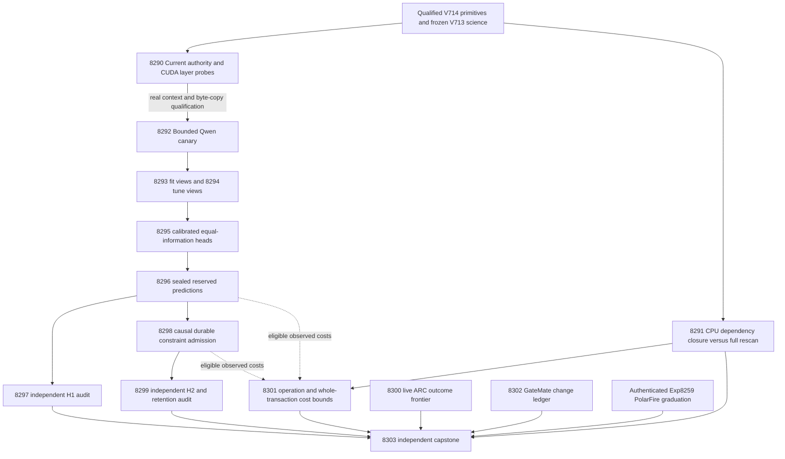
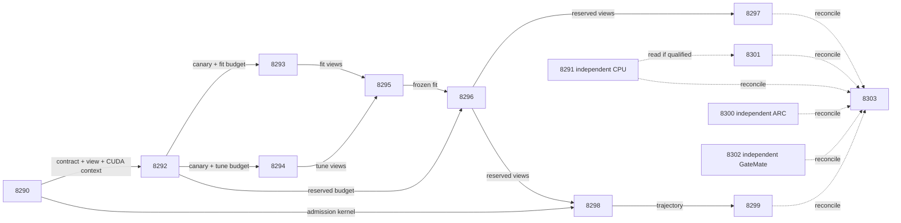

# Research roadmap V716 — CUDA fault isolation, dependency-scoped learning checks, and evidence-conditioned decisions

Milestone: **2026.10.716**. Planning date: **2026-10-08**.
Status: staged proposal; not activated and no proposed experiment has run.
Execution authority: `research-roadmap-next.yaml`.
There are **14 tasks, exp8290 through exp8303, in exactly that order**, across
four phases. The table and complete JSON contract below describe those same
fourteen tasks, including prompts, gates, model declarations and prior failures.

## Goal and decision

Establish whether source-conditioned verification can improve typed decisions,
whether admitted feedback can help later decisions without damaging retention,
and whether complete dependency checks can reduce continual-update cost.
Keep the unmeasured natural experiment frozen. First isolate the actual CUDA
failure; independently test a bounded CPU constraint mechanism. A repeated
hardware block must not consume all the milestone's scientific opportunity.

This follows `research-program.md`: correctness-first EBM verification,
continuous self-learning through persistent constraints, deployable small
energy heads, and measured hardware boundaries. Generator weights remain
frozen. No new general-purpose EBM generator, unconstrained repair stack,
public ARC re-solve, or hardware purchase is proposed.

## What milestone 2026.10.715 proved

The user reports the milestone complete. Execution completion does not imply
scientific success. At planning, `research-complete.yaml` was archived through
V714; V715 evidence comes from its active YAML, primaries, conductor log and
preserved design `research-roadmap-v715-preserved-20261008.md`. That design's
SHA-256 is `fb6cb87fa2529a34044907f71046bd1b3c36b1c6d2cdae5b33e4fb7da6754d74`.

| Evidence | Qualified conclusion | Remaining gap |
|---|---|---|
| Exp8276 current contract | Contract, durable coverage, focal tokenizer and typed-admission readiness fields were 1; mechanics were circular-positive. | Readiness is not measured verification or learning benefit. |
| Exp8277 leased native backend | Native `llama-server --list-devices` failed with `invalid device ordinal`, even with the permitted UUID in a fresh child. Zero model loads and generations occurred. | The failure is not confined to a PyTorch precheck. Its root cause is unproved. Repeating the same UUID mapping is not a repair. |
| Exp8278–Exp8285 science chain | One bound pre-gate record and seven absent producer outputs; eight science tasks did not execute. | H1/H2 remain unmeasured, not null. |
| Exp8286 ARC frontier | Authority and changed-code coverage checks passed, but the affected-consumer child timed out at 180 seconds, exit -9. Verdict: `complete_disqualified_owned_checks`. | Require the same consumer tests with explicit per-file receipts and realistic total budget. Do not promote this to a qualified no-outcomes null. |
| Exp8287 KV260 costs | `complete_blocked_capture`; no current intervention costs existed. | Add current independent CPU costs while retaining unavailable live costs explicitly. |
| Exp8288 GateMate | `complete_blocked_gatemate_physical_change`; unchanged `0xffffffff`. | A dated physical setup change is needed before reopening a probe. |
| Exp8289 capstone | `complete_blocked_upstream_evidence`; historical branch_8286 cold replay exited 1. | Distinguish authenticated failed evidence from a current reader error. |

Six producer primaries executed; a seventh slot has only the pre-gate record;
seven slots have no producer primary. Never manufacture their verdict strings.
The V712 margin experiment's mean gain was -0.01953125 with lower bound
-0.04296875; its delayed correction had no incremental benefit. These motivate
new evidence inputs, not a rerun of retired margin tuning. Exp8259 already
qualified PolarFire board-local Linux CPU dispatch and output parity; retain
that authenticated graduation without claiming FPGA fabric acceleration.

## Three largest PRD gaps

| Gap | PRD connection | This milestone's falsifiable step |
|---|---|---|
| Independent verification benefit remains unproved | FR-06 training pipelines and FR-12 verifiable reasoning need faithful evidence and useful accept/reject/escalate decisions. | Frozen source interventions; matched equal-information heads; sealed predictions; independent H1 audit with all intended sources. |
| Useful persistent learning remains unproved | FR-11 requires validated autonomous improvement; the research program prioritizes persistent constraint updates that help later decisions and survive restart. | H2 delayed natural admission/retention plus independent H3 dependency-closure, contradiction, invalidation and crash tests. |
| End-to-end execution and deployment evidence remain incomplete | FR-05 dual-language implementation, FR-08 interoperability and NFR-01 performance need real execution and complete-service costs, not device enumeration or kernel-only estimates. | Direct CUDA fault localization, realistic validation budgets, independent CPU cost accounting and precise remaining board obligations. |

The first two gaps are scientific. Runtime diagnosis is a prerequisite and
may end blocked; it is not counted as verification accuracy or learning gain.
Independent generalization remains outside these exposed development cohorts.

## Research informing the design

The dated V716 section was added to `research-references.md` before designing
these tasks. It records all eight requested topic areas and every secondary
source, including failed access. Promising primary findings are:

- [GRACE v2, July/September 2026](https://arxiv.org/html/2607.09175v2): typed
  dependencies and scoped checks motivate Exp8291. Carnot tests full dependency
  closure and conservative fallback, not unchecked k-hop pruning. The paper's
  one-harness scope and unmatched internal budgets prevent importing its gains.
- [Evidence-aligned verification, September 2026](https://arxiv.org/abs/2609.08267)
  supports retaining selected/control source perturbations in Exp8292–Exp8297.
  Sensitivity is a feature, not an independent truth label.
- [Delayed-feedback ACI, September 2026](https://arxiv.org/abs/2609.07251) informs
  causal feedback timing in Exp8298–Exp8299. Carnot's Beta-count learner is not
  ACI and obtains no conformal guarantee from this citation.
- [Local online KAN learning](https://arxiv.org/abs/2602.02056) and
  [hard/soft constraint acquisition](https://arxiv.org/abs/2609.29876) motivate
  touched-state measurements and immutable hard constraints in Exp8291/Exp8301.
- [FPGA–ASIC co-design](https://arxiv.org/abs/2602.15985),
  [thermodynamic AI](https://arxiv.org/abs/2607.00170) and
  [Extropic Z1T](https://extropic.ai/writing/z1t/) motivate explicit compatible
  operations and whole-service boundaries. Vendor estimates are not local data.

EBT, ARM/EBM, Neural Ising Machines, HardNet++, energy-guided decoding and
constraint-acquisition benchmarks remain useful references. They do not
justify reopening retired repair or generator-training paths before useful
verification qualifies. OpenReview and Hugging Face were checked; GRACE was
followed to its primary v2. Semantic Scholar citation-list API reads for both
requested anchors failed, so citation coverage is incomplete. GitHub Trending
returned stale snapshots, so no current ranking is claimed. Kona supplied no
inspected local training recipe. These limits are recorded, not filled by guesses.

## Architecture



Solid scientific-chain arrows are eligibility dependencies, not requirements
for positive effect. The capstone and hardware/ARC audits run unconditionally.
Exp8291 authenticates historical qualified components directly and has no CUDA
gate. It never changes the preregistered natural learner or supplies its labels.

## Phase 1 — Qualify execution and test an independent mechanism

**Exp8290–Exp8292, three tasks.** Exp8290 binds current authority and reuses
qualified V714 checks. It compares driver initialization, actual context and
small device-memory copy parity, runtime enumeration and native enumeration in
fresh leased children. No weights load in this task. Each child has a 60-second
deadline and the matrix a 360-second budget. A narrow child-local correction is
allowed only when a measured difference fixes a failure; no reset or install.
Contract/view/admission readiness remain independent of the CUDA score.

Exp8291 tests H3 on CPU: 3 seeds × 2 graph sizes × 4 topologies = 24 graph
units, 64 updates each. Full rescan, complete dependency closure and deliberately
unsafe one-hop checks receive identical ordered updates. Hard constraints are
immutable. Missing dependency metadata causes full rescan. Transitive/cyclic
closure, contradictory additions, retractions, duplicate/stale feedback and
invalidation are explicit. Issue-before-feedback delay is eight events; actual
owned-child crashes at events 24/48 must resume exactly. Five paired timing
repetitions with alternating arm order follow one warm-up; repetitions are not
independent units. CPU measurement ≤600s; validation ≤900s.

H3 soundness requires zero disagreements with full rescan and exact crash/state
parity on every event, plus detection of planted transitive conflicts. The
negative one-hop control must miss a planted conflict. An efficiency signal
also requires median evaluated-constraint fraction ≤0.5 on sparse chain/DAG
units and paired median complete-transaction time no greater than full scan.
Dense, cyclic and fallback costs remain in the report. This is fixture evidence:
a success is `circular_positive`; a sound but slower method is an informative
mechanism null; a false acceptance disqualifies it. No semantic-extraction,
natural-learning or independent-generalization claim follows.

Exp8292 combines actual GGUF load qualification with at most 36 bounded view
requests on the first 12 label-blind eligible fit slots. Require at least nine
complete triplets and zero custody/cross-talk failures. Readiness cannot depend
on a favorable effect. It forecasts separate fit/tune/reserved budgets before
any larger capture starts. A zero-effect canary may qualify transport.

## Phase 2 — Capture evidence and freeze fair heads

**Exp8293–Exp8296, four tasks.** Fit and tune captures are separate bounded
invocations with original membership: 128 fit and 64 tune sources, including
32 calibration and 32 comparator-selection slots. Preserve missing rows.
Exp8295 trains calibrated typed decisions with identical inputs and coefficient
budgets across energy and simple heads. Exp8296 captures and seals all 128
reserved sources only after heads and comparator are frozen; it separates the
96-source stream and 32-source retention panel before accessing targets.

## Phase 3 — Test benefit and continuous self-learning

**Exp8297–Exp8299, three tasks.** H1 independently checks reserved decisions.
Exp8298 admits bounded source-dependence constraints using due feedback, writes
predictions before release, performs real crash/resume and records later
state use. Exp8299 independently tests H2 and retention. An H1 null does not
block H2; both depend on qualified predictions/mechanics, not a science win.
These tasks fulfill the continuous self-learning priority without changing
base-model weights. Exp8291 is a separate mechanism question, not a new H2 arm.

## Phase 4 — Preserve live and hardware obligations, then reconcile

**Exp8300–Exp8303, four tasks.** ARC reads only new authenticated supervisor
outcomes after the last qualified Exp8272 frontier; it carries the failed
Exp8286 checks separately. Run its identical seven consumer files individually,
240 seconds each, 1800 seconds total; prove collection equivalence. Owned
failure still disqualifies. No new game solve or model call is proposed.
No-outcome nulls require passing validation; eligible observational cross-game
arm analysis requires ≥3 games, ≥2 arms and ≥5 firings per overlapping arm.

KV260 accounting reduces current Exp8291 CPU costs even when current Qwen
capture is missing. Separate CPU readiness and live-cost readiness. GateMate
only inspects dated physical change since Exp8288; unchanged evidence produces
one blocked record and no JTAG retry. The capstone independently reduces all
14 dispositions, H1/H2/H3 and board obligations. It distinguishes historical
failed evidence, missing evidence, pre-gates and current reader failures.

## Frozen scientific contract and decision rules

`openspec/change-proposals/v713-evidence-intervention-protocol.json` is immutable:
SHA-256 `f4c06e17a9f8eb72f1be80b265ab7e3507cbc5f6f3b918df6421fe49dae02018`.
Exp8290 creates a separate `v716-evidence-execution-contract.json`; it may bind
paths and receipts, never revise the following scientific choices.

- Source roles remain fit128/tune64/eval128, stream96/retention32. Historical
  eligibility counts105/53/97 are feasibility evidence, not completed inference.
- Select the entire focal answer sentence by maximum cached V707 unsupported
  probability, tie by index. Select the entire source sentence by maximum
  Unicode-word Jaccard overlap, tie by index. The control is a different whole
  source sentence nearest in exact embedded-tokenizer length. It is not assumed
  semantically irrelevant. Preserve answer bytes and all missing-control rows.
- Original, selected-deletion and control-deletion requests use one focal-only
  response, temperature0, seed7138250 and ≤64 generated tokens. Five new
  features join the old16: original p, selected delta, control delta, delta
  difference and signed removed-length mismatch/original tokens.
- Fit energy21/logistic21/additive21 with22 coefficients each, plus energy16
  and control-only energy19 ablations with their own fit geometry. Preserve
  frozen ridge/optimizer choices. Calibrate on32; select the simple comparator
  on the other32 by cost, then Brier, then frozen order. No reserved retuning.
- Unsupported y=1 has costs accept5y/reject1-y/escalate0.5. Accept only where
  V707 permitted acceptance; ties escalate. Missing views use the same frozen
  V707 probability/action in every arm, or escalation if unavailable. Every
  intended row remains in the decision denominator, with zero missing-row gain.
- H1 requires ≥72 complete reserved sources, ≥12/class, ≥5 improved sources,
  no extra false accepts and frozen Brier/cost tolerances ≤0.01/0.02. Use10,000
  source-cluster draws, seed7138248, ≥9500 valid, one-sided alpha0.025; lower
  cost-gain bound must exceed0.02 against the preselected simple comparator.
  An energy-specific claim separately needs lower gain>0 against both equally
  informed simple heads. Decision benefit and representation advantage differ.
- H2 keeps Beta(1,1) global/eight-group counts, shrinkage n/(n+16), ≥8 distinct
  feedback sources before group use, and random-group seeds101/102/103. Group
  bits remain cached energy/nonenergy choice, selected delta>0.1 and
  abs(control delta)>0.1. Issue/fsync at t precedes release of t-8; missing views
  update global only. Retention never updates; not-yet-due feedback stays pending.
  Genuine child crashes at slots40/72 must reproduce uninterrupted state.
- H2 requires ≥64 complete stream sources, ≥8/class, ≥8 nonoverlapping8-slot
  blocks and ≥5 improvements. Average seeds per source;10,000 circular moving
  block draws, block8 with4/16 sensitivities, seed7138256, ≥9500 valid,
  alpha0.025 lower gain>0.02 against global, no extra false accepts including
  by seed, and the same Brier/cost bounds. Keep frozen and random controls.
  Retention needs ≥20 complete sources, ≥5/class, no extra false accepts and
  the same bounds against frozen/global. Demonstrate changed later decisions
  on distinct sources, not just changed counters.
- Retire a scientific mechanism after a null only when its support, actual
  learnable typed-action control and permitted-action oracle headroom (>0.02,
  ≥5 improvable sources) qualify. Oracle headroom is audit-only. Unavailable
  execution is not a null finding about the hypothesis. Respect mechanical
  same-verdict retirement independently; new scope must document a real change.

H1/H2 thresholds are unchanged. H3 is new and separate; its deterministic
fixture efficiency criterion is not a third natural-benefit significance test.
Both `independent_generalization_score` and `generalized_learning_benefit_score`
remain zero throughout this milestone's exposed development and fixture work.

## Dependency graph and gate custody



The YAML is authoritative for exact `gated_on` field names and operators. All
15 gate entries name earlier tasks in this milestone and fields in their own
REQUIRED ARTIFACT FIELDS blocks. Capstone, ARC, KV260 and GateMate have no
scientific-success gates. Every block records `gate_check_summary` with the
actual path/hash, field, operator, expected value and observation. A missing
artifact or missing field is a contract failure, distinct from a measured zero.

## Hardware and model requirements

| Resource | Actual boundary | Planned use |
|---|---|---|
| Host CPU, RAM and local disk | Existing environment; no new purchase | All audits, small heads, causal replay and independent H3 study. Private fixtures outside results; scratch in /tmp. |
| RTX3090 | Planning inventory exposed one24GB GPU; recheck permitted UUID/free VRAM. Historical two-card ordinals are not authority. CUDA failed natively in V715. | Exp8290 direct context/copy diagnostics; one leased owned Qwen server only after qualification. |
| Qwen3.8-27B Q4_K_M GGUF | Cached `unsloth/Qwen3.8-27B-GGUF`; resolve exact file/hash and embedded tokenizer. | Exp8292,8293,8294,8296 all explicitly declare MODEL_SPECS and `model_bounded_generation`,10s floor, ≤64 output tokens/call. |
| KV260 | Existing SSH-only path `ssh kria`, historical quadratic fabric scope k≤5 | Exp8301 CPU/whole-service compatibility bounds only; no new RTL/flash/probe or host SD prerequisite. |
| PolarFire | Exp8259 authenticated board-local Linux CPU dispatch/parity reached its defined terminal condition | Exp8303 reauthenticates graduation; no new board task, no FPGA acceleration claim. |
| GateMate | Repeated0xffffffff; physical setup unchanged | Exp8302 dated change ledger and exact reopen condition: changed setup, valid GM1Ax IDCODE, flashed n16 smoke/hash. No blind JTAG attempt. |
| NPU/TSU | No qualified local execution/access in this plan | References and deferred integration only; no vendor-to-local performance conversion. |

Only four tasks load an LLM or generate. All other tasks declare
`no_model_load`, `MODEL_SPECS=[]` and zero current LLM calls, including direct
CUDA probes and tokenizer-vocabulary reads. No new task is full generation or
load-only inference. Legacy small models may be CPU smoke fixtures only; they
cannot supply headline results. No cached old model call becomes current work.

Budget each fit/tune/reserved capture at ≤2400s measurement, ≤900s validation
and ≤1200s implementation/closeout:4500s planned total, below4800s hard cap.
Canary tail timings must include cold load, setup, shutdown and retry allowance;
use separate affordability gates, never shrink the source roster to fit.
Fit max384, tune max192, reserved max384 calls; canary max36. Import canary
rows only when protocol/source/view/model bytes match, counting calls once.
Fit support is ≥80 complete and ≥12/class. Tune support is ≥40 complete with
≥8/class in each calibration/selection half. These are eligibility gates.

Every prompt contains a numbered step requiring flushed progress at phase
boundaries and before/after load, generation, benchmark and subprocess calls,
inside loops, and at least60-second heartbeats for children. Keep gaps below
600s. Break files over about200 lines into tool calls of at most about150
lines with progress messages between calls. Longer estimates or stall grace
cannot replace output. No artificial sleeps or padding meet duration floors.

Use Opus/100 turns for Exp8290 runtime/schema coordination, Exp8292 model
integration, Exp8301 hardware boundaries and Exp8303 multi-branch capstone.
Routine research uses the default Claude backend/50 turns. GateMate's read-only
ledger uses20. No weak-model experimental claim or unnecessary backend switch
is proposed. The inherited scientifically qualified modules keep work bounded.

## Validation, failure discipline and acceptance

Each task has a concrete primary JSON path and thin runner path in its prompt.
Per-unit rows carry complete denominators and all arms; source/graph, not seed
or repeat, is the independent unit. Every task declares the closed
`verdict_class` enum next to free-text `honest_verdict`. External unchanged
blocks are terminal `blocked`; `partial` is reserved for unfinished owned work.
Oracle-defined successes are `circular_positive`. Failed owned validation is
`disqualified`, regardless of historical readiness.

All14 tasks declare four-field `prior_failures` lineage with
`retire_if_same_verdict: true`. No retired ID is reused or required upstream;
no operator override is invented. Exp8291 names the actual prior primitive
custody failure it depends on, not a fictitious previous H3 scientific failure.
Current gates reference only current task IDs. Frozen historical primaries,
science bytes and qualified component receipts are never rewritten.

Implementation tasks must add REQ/SCENARIO coverage and failing focused tests
before code, then scoped Ruff/format, strict mypy, relevant unit/consumer tests,
100-percent changed-code statement coverage including CLI/children, and scoped
spec coverage. Run applicable private E2E-015/019 and capstone E2E-018/021 as
specified in `ops/e2e-test-plan.md`; use private scratch, real normal-exit
publication, independent cold replay and rehashed negative controls. Record
repository-health failures separately, never turn a scoped pass into a global
pass. Exp8300 must retain all seven consumer files despite the old timeout.

Planning validation checks the existing schema, gate audit, exclusion lint,
execution-fit lint, ARC floor, overdue-priority audit, exact table/JSON/YAML
agreement, all prompt contracts, scoped spec coverage and the private authority
lifecycle CLI tests. Historical current-output publication is not rerun for a
staged plan. No generator/server, physical board experiment or conductor task
is activated by these checks. Preserve active YAML and conductor byte hashes.

The capstone distinguishes administrative completion, eligible science, H1/H2
signals, H3 fixture mechanics and deployment obligations. Each branch ends with
one falsifiable next evidence condition, including a specific external blocker
when appropriate. Keep OpenSpec, traceability, status and changelog aligned.
Publication eligibility is recomputed with the existing gate, not claimed in
advance; no external publication or push is part of this milestone design.

## Exact task contract

Exactly **14 tasks, exp8290 through exp8303**, in this order.

| Order | ID | Title | Phase | Deliverable |
|---|---|---|---|---|
| 1 | exp8290-runtime-localization | Localize CUDA failure and bind the current qualified execution contract | 1 | results/experiment_8290_v716_runtime_localization.json |
| 2 | exp8291-dependency-scoped-admission | Test dependency-scoped checks for continuous constraint admission | 1 | results/experiment_8291_v716_dependency_scoped_admission.json |
| 3 | exp8292-evidence-view-canary | Measure bounded Qwen response to selected and length-controlled deletions | 1 | results/experiment_8292_v716_evidence_view_canary.json |
| 4 | exp8293-fit-view-capture | Capture evidence views on one hundred twenty-eight frozen fit sources | 2 | results/experiment_8293_v716_fit_view_capture.json |
| 5 | exp8294-tune-view-capture | Capture calibration and selection views on sixty-four frozen tune sources | 2 | results/experiment_8294_v716_tune_view_capture.json |
| 6 | exp8295-intervention-energy-fit | Train calibrated energy decisions from evidence-dependence features | 2 | results/experiment_8295_v716_intervention_energy_fit.json |
| 7 | exp8296-reserved-view-seal | Capture and seal intervention decisions for every reserved source | 2 | results/experiment_8296_v716_reserved_view_seal.json |
| 8 | exp8297-intervention-benefit-audit | Independently test source-intervention decision benefit | 3 | results/experiment_8297_v716_intervention_benefit_audit.json |
| 9 | exp8298-continuous-constraint-admission | Learn reusable soft constraints from delayed attribution feedback | 3 | results/experiment_8298_v716_continuous_constraint_admission.json |
| 10 | exp8299-constraint-learning-audit | Audit later constraint benefit and sealed retention | 3 | results/experiment_8299_v716_constraint_learning_audit.json |
| 11 | exp8300-arc-outcome-frontier | Validate the live ARC outcome frontier with bounded consumer receipts | 4 | results/experiment_8300_v716_arc_outcome_frontier.json |
| 12 | exp8301-kv260-evidence-cost-boundary | Bound new evidence and learning costs against the KV260 operation set | 4 | results/experiment_8301_v716_kv260_evidence_cost_boundary.json |
| 13 | exp8302-gatemate-physical-delta | Carry GateMate physical-change evidence and its exact reopening condition | 4 | results/experiment_8302_v716_gatemate_physical_delta.json |
| 14 | exp8303-capstone | Reconcile fourteen outcomes and decide whether evidence or learning improved | 4 | results/experiment_8303_v716_capstone.json |

Canonical task digest: `1631010541a7298fa4908b9fcbe21576b4b333b81248b52c8643b0aaf44b71ed`.
Computed as SHA-256 of UTF-8 json.dumps(tasks, sort_keys=True, separators=(",", ":")), with default ensure_ascii=True.
The JSON contains complete task objects, not a shortened wish list.

<!-- V716_TASK_CONTRACT_START -->
```json
{
  "milestone": "2026.10.716",
  "canonical_tasks_sha256": "1631010541a7298fa4908b9fcbe21576b4b333b81248b52c8643b0aaf44b71ed",
  "tasks": [
    {
      "id": "exp8290-runtime-localization",
      "title": "Localize CUDA failure and bind the current qualified execution contract",
      "phase": 1,
      "track": "infrastructure",
      "priority": "high",
      "requires_gpu": true,
      "max_turns": 100,
      "estimated_wall_time_min": 70,
      "per_unit_rows": true,
      "milestone": "2026.10.716",
      "deliverable": "results/experiment_8290_v716_runtime_localization.json",
      "inference_substrate_class": "no_model_load",
      "MODEL_SPECS": [],
      "gated_on": [],
      "model": "opus",
      "prior_failures": [
        {
          "experiment_id": "exp8249-evidence-view-kernel",
          "verdict": "complete_disqualified_evidence_view_kernel",
          "addressed_by": "V714 shipped durable coverage custody and conforming focal/typed-action adapters. Reuse and authenticate those bytes, with current execution bindings only; do not repeat the failed private-path reader.",
          "retire_if_same_verdict": true
        },
        {
          "experiment_id": "exp8275-capstone",
          "verdict": "complete_blocked_upstream_evidence",
          "addressed_by": "Freeze all fourteen V714 dispositions and distinguish seven absent cascade outputs from measured results. Current readiness does not demand upstream science success.",
          "retire_if_same_verdict": true
        },
        {
          "experiment_id": "exp8277-lease-backend-qualification",
          "verdict": "complete_blocked_gguf_backend",
          "addressed_by": "The leased native enumeration already failed. Compare direct driver context/copy, runtime enumeration and native enumeration in bounded fresh children; only a measured corrected binding can unlock model work. An unchanged environment terminates blocked without another load attempt.",
          "retire_if_same_verdict": true
        }
      ],
      "prompt": "CONTEXT:\nWork in {project_root} on {date}. V715 authenticated the V714 kernels. Exp8277 then failed native llama-server --list-devices with invalid device ordinal despite an explicit leased UUID; no model loaded. The same UUID recipe is not a new intervention. Locate the failing driver/runtime layer before permitting generation. Root cause remains unproved.\nEXISTING CODE TO READ FIRST:\nresults/experiment_8276_v715_current_contract_readiness.json; results/experiment_8277_v715_lease_backend_qualification.json; scripts/experiments/experiment_8277_v715_lease_backend_qualification.py; python/carnot/inference/llama_cpp_process.py; CLAUDE.md; CODEX.md; ops/e2e-test-plan.md; openspec/capabilities/research-reporting/spec.md; openspec/capabilities/verification/spec.md; scripts/experiment_template.py; python/carnot/reporting/primary_publication.py; ops/exclusion_manifest.yaml; openspec/change-proposals/research-roadmap-vNEXT.md; research-references.md; python/carnot/reporting/roadmap_contract.py; python/carnot/reporting/evidence_intervention_methods_8248.py; python/carnot/reporting/coverage_custody_8262.py; python/carnot/verify/protocol_conformance_8263.py; python/carnot/verify/focal_capture_8263.py; python/carnot/verify/typed_admission_8263.py; tests/python/test_protocol_conformance_8263.py; results/experiment_8262_v714_coverage_custody.json; results/experiment_8263_v714_protocol_conformance.json; results/experiment_8264_v714_evidence_view_canary.json; results/experiment_8275_v714_capstone.json; openspec/change-proposals/v713-evidence-intervention-protocol.json\nTASK:\nDeliver results/experiment_8290_v716_runtime_localization.json. Create the thin runner scripts/experiments/experiment_8290_v716_runtime_localization.py. Store primitive evidence under results/raw/experiment_8290_v716_runtime_localization/.\nCONCRETE STEPS:\n0. Emit a flushed start line. Authenticate inputs and bound terminal sidecars. Missing external operands yield complete_blocked_<operand>, verdict_class=blocked, and gate_check_summary with exact failed values. Failed owned checks disqualify readiness. Do not fabricate missing data.\n1. Emit a flushed progress line at every phase boundary, and before and after every model load, generation, benchmark and subprocess. Print completed/pending counts inside long loops and a heartbeat at least every 60 seconds while children run. Keep every output gap below 600 seconds. Use unbuffered output, bounded deadlines and process-group cleanup. Write any file over about 200 lines in several tool calls of at most about 150 lines, with a progress message between calls. Split work into resumable batches; no single huge tool call. Do not pad runtime.\n2. Add relevant REQ-* and SCENARIO-* before implementation, then focused failing tests. Preserve existing assertions. Reuse qualified modules through thin adapters. Freeze owned validation commands. Put private fixtures outside results/ and scratch outside the repository root. Keep generator weights frozen.\n3. Declare no_model_load, MODEL_SPECS=[] and deterministic_runtime_receipt_validation_no_llm. Record zero current LLM calls. Separate newly executed CUDA probe receipts from imported contract evidence. Embedded-tokenizer vocabulary access does not load neural weights.\n4. Bind the design table and full JSON task contract to all fourteen staged/activated tasks Exp8290 through Exp8303, in order. Use the existing reader with explicit current milestone and range. Snapshot original authorities, code and configurations. Cold replay reads frozen snapshots, never demands that a later live roadmap still has this milestone. Staged agreement is not activation. Do not edit the conductor or validators.\n5. Write openspec/change-proposals/v716-evidence-execution-contract.json as an execution binding. Preserve openspec/change-proposals/v713-evidence-intervention-protocol.json SHA-256 f4c06e17a9f8eb72f1be80b265ab7e3507cbc5f6f3b918df6421fe49dae02018. Map every gate to the current task and exact declared artifact path. Import historical qualified components with byte-bound sidecars; current readiness must not be copied from a stale success flag.\n6. Run the existing private coverage-custody and protocol-conformance tests with current thin bindings, without redesigning their scientific controls. Verify durable coverage after private scratch deletion, actual embedded-token counts, exactly one focal response at <=64 tokens, independent view/admission validation, causal issue-before-release and genuine crash resume. Reuse the natural-shape and learnable typed-action fixtures; fixture success is circular_positive only.\n7. Emit current_contract_ready_score, coverage_custody_ready_score, view_kernel_ready_score and admission_kernel_ready_score independently. Each requires applicable owned checks and authenticated primitives; set only the affected field to zero on failure. Freeze source-role manifests and all intended units. Record the V714 and V715 native/runtime failures and each cascade skip without inventing honest_verdict strings for missing primaries.\n8. Declare no_model_load and MODEL_SPECS=[] for this direct CUDA diagnostic: do not load neural weights, generate tokens, or call embeddings. Preserve original Error 101 and native stderr, argv, library and binary hashes. Inventory the currently permitted GPU UUID, driver/library versions and device-node access; capture only relevant mask/library variables, never the full environment. A fresh nvidia-smi inventory is observation, not a CUDA execution pass.\n9. Use the existing GPU lease. In fresh bounded children compare the existing permitted environment and its explicit UUID mapping. Probe driver initialization, device count/UUID, context creation, a small device allocation and host-device-host byte-copy parity; probe runtime enumeration separately and native llama-server --list-devices. Capture each API return code, resolved library path/hash, local ordinal, PID/start-time, cleanup, stdout and stderr. Finish each child within 60 seconds, entire diagnostic matrix within 360 seconds. Do not infer root cause from a single error code.\n10. Test stale ordinals, intentional masks, missing device node, stub library, occupied lease, CPU-only native build, context/copy failures and timeouts using private subprocess fixtures. Compare layers without replacing real probes with fixtures. No driver reset, install, reboot, bus rescan, device permission change or killing unowned processes. A narrow child-only launch adapter is permitted only when a measured environment/binding difference fixes the failing layer; otherwise record the external blocker once.\n11. Emit cuda_context_ready_score=1 only for actual permitted context creation, allocation/copy parity, compatible native device enumeration, owned cleanup and passing validation. Store runtime_binding_path and runtime_binding_sha256. Enumeration alone fails this gate. Keep current_contract_ready_score, coverage_custody_ready_score, view_kernel_ready_score and admission_kernel_ready_score independent of CUDA. No same-configuration repeated probing; unchanged Error 101 ends blocked. Run private E2E-015/019 and current authority checks; the current contract can qualify even when CUDA is blocked.\n12. Run applicable private E2E-015/019 checks from ops/e2e-test-plan.md, plus task-specific checks below. Run focused unit and consumer tests, 100 percent changed-code statement coverage including CLI/child statements, scoped Ruff check/format, strict mypy and scripts/check_spec_coverage.py --files <owned-test-files>. Preserve actual argv, exits, clocks and stdout/stderr hashes. Keep repository-health diagnostics separate; never report a global pass from scoped checks.\n13. Cold-replay primitives in a fresh process, including rehashed-tamper and negative controls. Validate a private candidate with unchanged primary_publication terminal checks, scripts/adversarial_verify.py --json <private-candidate> and scripts/verdict_row_consistency_lint.py --strict <private-candidate>. Publish atomically after normal exit and owned validation. Preserve historical primaries. Reconcile openspec/, _bmad/traceability.md, ops/status.md and ops/changelog.md. Do not modify research-roadmap.yaml.\nREQUIRED ARTIFACT FIELDS:\nexperiment_id, task_id, milestone, run_date: principle: Identify the actual invocation.\nhonest_verdict, verdict_class: principle: Use complete_* terminal verdicts and one of positive | circular_positive | null | blocked | disqualified | partial. Partial means unfinished owned work. Unchanged external failures mean blocked.\ngate_check_summary: principle: Each block names the upstream, actual path/hash, exact field, operator, expected value and observed value. Missing evidence differs from a measured zero.\ninference_substrate, inference_substrate_class, MODEL_SPECS, model_invocation_counts: principle: Record actual current calls separately from historical model provenance.\nrows, intended_count, completed_count, failed_count, censored_count, excluded_count, independent_count: principle: Preserve every source, condition and arm, including missing units. Record metric numerators and denominators. Repeats and seeds do not add independent sources.\nverifier_is_oracle, exposure_scope, independent_generalization_score, generalized_learning_benefit_score: principle: Oracle-defined success is circular_positive. All reused sources are exposed development. Both generalization scores remain zero in this milestone.\nrequired_checks_passed, flagged_adversarial, acceptance_gates, validation_receipts, terminal_validation_sidecar_path: principle: Failed owned checks disqualify the result and set readiness to zero. Readiness does not imply benefit.\npreconditions_checked, duration_s, random_seed, reproducibility_checksum, source_artifact_hashes, code_config_hashes, raw_shard_hashes, phase_spans: principle: Bind real work to replayable primitive evidence and actual code/configuration bytes.\ncited_upstream_artifacts, field_principles: principle: Name each imported field and hash. Explain the evidentiary purpose of each added field.\ncurrent_contract_ready_score, coverage_custody_ready_score, view_kernel_ready_score, admission_kernel_ready_score: principle: Separate current authority from independent qualified components.\ncanonical_tasks_sha256, authority_snapshots, historical_dispositions, frozen_science_sha256, execution_contract_sha256, component_validation_receipts: principle: Keep original science and historical results immutable while binding new execution.\ncuda_context_ready_score, runtime_binding_path, runtime_binding_sha256, cuda_probe_rows, failure_layer, root_cause_status, device_inventory, lease_receipt, cleanup_receipt: principle: Actual context and byte-copy execution must precede any GGUF attempt; an unresolved cause remains explicit.\nRun command: cd {project_root} && PYTHONPATH=python:. PYTHONUNBUFFERED=1 .venv/bin/python -u scripts/experiments/experiment_8290_v716_runtime_localization.py --date {date}\nDo NOT push. Do NOT modify scripts/research_conductor.py."
    },
    {
      "id": "exp8291-dependency-scoped-admission",
      "title": "Test dependency-scoped checks for continuous constraint admission",
      "phase": 1,
      "track": "learning",
      "priority": "high",
      "requires_gpu": false,
      "max_turns": 50,
      "estimated_wall_time_min": 40,
      "per_unit_rows": true,
      "milestone": "2026.10.716",
      "deliverable": "results/experiment_8291_v716_dependency_scoped_admission.json",
      "inference_substrate_class": "no_model_load",
      "MODEL_SPECS": [],
      "gated_on": [],
      "prompt": "CONTEXT:\nWork in {project_root} on {date}. GRACE arXiv:2607.09175v2 motivates local typed-memory checks but does not establish soundness for Carnot. Test dependency closure against full rescanning on explicit deterministic constraints. This is a new CPU mechanism study, independent of CUDA and of the unchanged H1/H2 natural protocol. Fixtures and exact-oracle labels support mechanics only, with verdict_class=circular_positive for success and both generalization scores zero.\nEXISTING CODE TO READ FIRST:\nCLAUDE.md; CODEX.md; ops/e2e-test-plan.md; openspec/capabilities/research-reporting/spec.md; openspec/capabilities/verification/spec.md; scripts/experiment_template.py; python/carnot/reporting/primary_publication.py; ops/exclusion_manifest.yaml; openspec/change-proposals/research-roadmap-vNEXT.md; research-references.md; python/carnot/verify/typed_admission_8263.py; tests/python/test_protocol_conformance_8263.py; python/carnot/reporting/coverage_custody_8262.py; results/experiment_8263_v714_protocol_conformance.json; openspec/change-proposals/v713-evidence-intervention-protocol.json; https://arxiv.org/html/2607.09175v2\nTASK:\nDeliver results/experiment_8291_v716_dependency_scoped_admission.json. Create the thin runner scripts/experiments/experiment_8291_v716_dependency_scoped_admission.py. Store primitives under results/raw/experiment_8291_v716_dependency_scoped_admission/.\nCONCRETE STEPS:\n0. Emit a flushed start line. Authenticate input bytes and terminal sidecars. Missing external operands produce complete_blocked_<operand>, verdict_class=blocked and gate_check_summary with exact observations. Owned validation failures are disqualified; readiness stays zero.\n1. Emit a flushed progress line at every phase boundary and before and after every model load, generation, benchmark and subprocess. Print completed/pending counts inside long loops. Emit a heartbeat at least every 60 seconds while children run. Keep every output gap below 600 seconds. Use unbuffered output, bounded deadlines and owned process-group cleanup. Write any file over about 200 lines in several tool calls of at most about 150 lines. Send a progress message between calls. No single huge tool call; checkpoint resumable batches. Do not pad runtime.\n2. Add relevant REQ-* and SCENARIO-* before implementation. Write failing tests first. Preserve all existing assertions. Keep private fixtures outside results/ and scratch outside the repository root. Freeze generator weights.\n3. Declare no_model_load, MODEL_SPECS=[] and deterministic_exact_verifier_and_versioned_external_state_no_llm with zero LLM calls. Authenticate the V714 typed-admission and durable-coverage primitives directly; no gate on Exp8290 or any live model task. Implement a small separate python/carnot/verify/dependency_scoped_admission_8291.py with an independent full-rescan reference. Do not change V713/V714 natural admission semantics or use this experiment to select its groups.\n4. Before measurement freeze a manifest with seeds 7161,7162,7163; graph sizes 32 and 128 constraints; chain, sparse DAG, cyclic and dense topologies: 24 graph units. Use 64 ordered proposed updates per graph, including contradictory soft additions, hard conflicts, invalidations, duplicate/stale feedback, missing read/write metadata and delayed labels. Declare Boolean/equality/implication constraint types and every read/write dependency explicitly. Keep a fixed immutable set of hard constraints; no semantic text extraction or LLM judging.\n5. Compare three arms on the identical event stream: full rescan; dependency closure to a fixed point with conservative full-rescan fallback when metadata is absent; deliberately truncated one-hop checks as a negative control. Dependencies propagate through transitive and cyclic components, invalidations and derived state. Accept soft updates only when eligible delayed feedback arrives and all affected hard constraints remain valid. Preserve existing issue-before-release delay=8 and durable admission/retraction. Rejected updates must not mutate committed state.\n6. Issue and fsync each event decision before releasing due feedback. Count unique feedback sources, never duplicates. On events 24 and 48 kill a real owned child after the committed issue record and before feedback commit, then resume; compare against uninterrupted execution, including event IDs, admitted set, retractions, conflicts and next-event decisions. Retention constraints receive no updates. Missing dependencies trigger the conservative arm, not a silently smaller neighborhood.\n7. Freeze H3 as zero admissibility/state/decision disagreements with full rescan on every event plus exact crash parity and successful planted transitive-conflict detection. On sparse chain/DAG units, require median evaluated-constraint fraction <=0.5 and paired median whole-transaction time <=full-rescan time to report an efficiency signal. Report all dense/cyclic/fallback costs even when slower. Time 5 paired repetitions with alternating arm order after one uncounted warm-up; graph is the independent unit, not repetition or event. No confidence claim or natural-learning headline from these 24 fixtures.\n8. Publish per-graph/per-event/per-arm rows with unique source, dependencies, closure size, fallback reason, eligible time, actual admission/retraction, conflict identities, later decisions, scan counts, closure/replay/persistence/total monotonic spans and byte hashes. Derive every aggregate from rows in a fresh process. The unsafe one-hop arm must miss a planted conflict to demonstrate test sensitivity, and it can never become the live implementation. Record null if sound scoped checking has no measured cost advantage; disqualify any false acceptance.\n9. Freeze the manifest and record hash in docs/research-notes/v716-dependency-scoped-admission.md before benchmarking. Cap CPU measurement at 600 seconds and validation at 900; no size or threshold tuning after timings. Run applicable private E2E-015/019 checks. Report soundness_ready_score separately from dependency_efficiency_signal_score. H3 success remains software fixture evidence; adoption into a future natural stream requires a separate preregistration.\n10. Run focused unit and affected-consumer tests. Measure 100 percent changed-code statement coverage including CLI and child processes. Run scoped Ruff check/format, strict mypy and scripts/check_spec_coverage.py --files <owned-test-files>. Freeze required argv and deadlines before measurement. Record exits, clocks and log hashes. Keep repository-health diagnostics separate; scoped passes are not a global pass.\n11. Cold-replay primitives in a fresh process. Include rehashed-tamper and negative controls. Validate a private candidate with unchanged primary_publication terminal checks, scripts/adversarial_verify.py --json <private-candidate> and scripts/verdict_row_consistency_lint.py --strict <private-candidate>. Publish atomically after normal exit and owned validation. Preserve historical primaries. Reconcile openspec/, _bmad/traceability.md, ops/status.md and ops/changelog.md. Do not modify research-roadmap.yaml.\nREQUIRED ARTIFACT FIELDS:\nexperiment_id, task_id, milestone, run_date: principle: Identify the actual invocation.\nhonest_verdict, verdict_class: principle: Use complete_* terminal verdicts and one of positive | circular_positive | null | blocked | disqualified | partial. Partial means unfinished owned work. Unchanged external failures mean blocked.\ngate_check_summary: principle: Each block names the upstream, actual path/hash, exact field, operator, expected value and observed value. Missing evidence differs from a measured zero.\ninference_substrate, inference_substrate_class, MODEL_SPECS, model_invocation_counts: principle: Record actual current calls separately from historical model provenance.\nrows, intended_count, completed_count, failed_count, censored_count, excluded_count, independent_count: principle: Preserve every source, condition and arm, including missing units. Record metric numerators and denominators. Repeats and seeds do not add independent sources.\nverifier_is_oracle, exposure_scope, independent_generalization_score, generalized_learning_benefit_score: principle: Oracle-defined success is circular_positive. All reused sources are exposed development. Both generalization scores remain zero in this milestone.\nrequired_checks_passed, flagged_adversarial, acceptance_gates, validation_receipts, terminal_validation_sidecar_path: principle: Failed owned checks disqualify the result and set readiness to zero. Readiness does not imply benefit.\npreconditions_checked, duration_s, random_seed, reproducibility_checksum, source_artifact_hashes, code_config_hashes, raw_shard_hashes, phase_spans: principle: Bind real work to replayable primitive evidence and actual code/configuration bytes.\ncited_upstream_artifacts, field_principles: principle: Name each imported field and hash. Explain the evidentiary purpose of each added field.\nsoundness_ready_score, dependency_efficiency_signal_score, full_scan_disagreements, hard_constraint_violations, actual_crash_receipts, per_event_rows, per_graph_rows, operation_cost_rows, negative_control_detected, manifest_path, manifest_sha256, later_decision_rows, fallback_counts: principle: Establish causal durable state mechanics and measured checking cost without treating fixture truth as independent generalization.\nRun command: cd {project_root} && PYTHONPATH=python:. PYTHONUNBUFFERED=1 .venv/bin/python -u scripts/experiments/experiment_8291_v716_dependency_scoped_admission.py --date {date}\nDo NOT push. Do NOT modify scripts/research_conductor.py.",
      "prior_failures": [
        {
          "experiment_id": "exp8249-evidence-view-kernel",
          "verdict": "complete_disqualified_evidence_view_kernel",
          "addressed_by": "The new dependency-closure question uses directly authenticated V714 typed-action and durable-coverage primitives rather than the failed deleted coverage path. This is a new fixture study, not a retry of natural H1/H2 or a claim that those priors were solved.",
          "retire_if_same_verdict": true
        }
      ]
    },
    {
      "id": "exp8292-evidence-view-canary",
      "title": "Measure bounded Qwen response to selected and length-controlled deletions",
      "phase": 1,
      "track": "verification",
      "priority": "high",
      "requires_gpu": true,
      "max_turns": 100,
      "estimated_wall_time_min": 70,
      "per_unit_rows": true,
      "milestone": "2026.10.716",
      "deliverable": "results/experiment_8292_v716_evidence_view_canary.json",
      "inference_substrate_class": "model_bounded_generation",
      "MODEL_SPECS": [
        {
          "hf_id": "unsloth/Qwen3.8-27B-GGUF",
          "quantization": "Q4_K_M"
        }
      ],
      "gated_on": [
        {
          "upstream": "exp8290-runtime-localization",
          "artifact_field": "current_contract_ready_score",
          "op": "==",
          "value": 1
        },
        {
          "upstream": "exp8290-runtime-localization",
          "artifact_field": "view_kernel_ready_score",
          "op": "==",
          "value": 1
        },
        {
          "upstream": "exp8290-runtime-localization",
          "artifact_field": "cuda_context_ready_score",
          "op": "==",
          "value": 1
        }
      ],
      "prior_failures": [
        {
          "experiment_id": "exp7854-intervention-protocol",
          "verdict": "complete_disqualified_required_checks",
          "addressed_by": "Live transport now uses the qualified V707 parser and the current pure view kernel, with complete owned validation before capture.",
          "retire_if_same_verdict": true
        },
        {
          "experiment_id": "exp8249-evidence-view-kernel",
          "verdict": "complete_disqualified_evidence_view_kernel",
          "addressed_by": "Exp8249 read raw/logs/changed_code_coverage.json while its manifest wrote temporary coverage.json, then deleted it. Persist and authenticate the actual receipt output before cleanup; independently correct tokenizer, focal response and typed-decision controls. Never lower coverage or upgrade the historical primary.",
          "retire_if_same_verdict": true
        },
        {
          "experiment_id": "exp8250-evidence-view-canary",
          "verdict": "blocked_gate_check_failed",
          "addressed_by": "The current prerequisite proves durable coverage and exact focal requests. Gate on the new declared producer fields; preserve the old pre-gate artifact as a block, not a measurement.",
          "retire_if_same_verdict": true
        },
        {
          "experiment_id": "exp8264-evidence-view-canary",
          "verdict": "complete_blocked_CUDA_runtime_available",
          "addressed_by": "V716 requires direct context/copy qualification before its canary qualifies the actual llama.cpp backend under a leased GPU UUID after the PyTorch Error 101. Exp8290 authenticates the V714 qualified kernels. Resume unchanged science only behind current readiness gates; absent V714 downstream primaries are unmeasured, not fabricated prior verdicts.",
          "retire_if_same_verdict": true
        },
        {
          "experiment_id": "exp8277-lease-backend-qualification",
          "verdict": "complete_blocked_gguf_backend",
          "addressed_by": "Require the new direct context/copy and native enumeration gate from Exp8290; perform model load and bounded canary in one owned lifecycle only after that evidence qualifies. Merely repeating the old UUID mapping is prohibited.",
          "retire_if_same_verdict": true
        },
        {
          "experiment_id": "exp8278-evidence-view-canary",
          "verdict": "blocked_gate_check_failed",
          "addressed_by": "Current gates explicitly bind the new direct-runtime producer and exact field names; preserve the old pre-gate receipt as unmeasured. No generation is attempted on an unchanged runtime block.",
          "retire_if_same_verdict": true
        }
      ],
      "prompt": "CONTEXT:\nV715 confirmed native CUDA failure under a leased UUID in Exp8277; Exp8278 was pre-gated and Exp8279 through Exp8285 have no producer primary. No intervention effect was measured. This is a gated execution continuation of frozen science, not a measured null rerun.\nWork in {project_root} on {date}. The source-view mechanism needs current live evidence. V707 transport success does not establish useful evidence sensitivity. This canary measures syntax and feasible acquisition cost before scaling.\nEXISTING CODE TO READ FIRST:\nresults/experiment_8290_v716_runtime_localization.json; python/carnot/verify/evidence_view_live_8264.py; python/carnot/verify/evidence_view_execution_8264.py; openspec/change-proposals/v713-evidence-intervention-protocol.json; openspec/change-proposals/v716-evidence-execution-contract.json; CLAUDE.md; CODEX.md; ops/e2e-test-plan.md; openspec/capabilities/research-reporting/spec.md; openspec/capabilities/verification/spec.md; scripts/experiment_template.py; python/carnot/reporting/primary_publication.py; ops/exclusion_manifest.yaml; openspec/change-proposals/research-roadmap-vNEXT.md; python/carnot/verify/sentence_transport_canary_8181.py; python/carnot/verify/sentence_transport_8179.py; python/carnot/inference/sota_models.py; scripts/experiments/experiment_8236_v712_qualified_concurrency_canary.py; results/experiment_8290_v716_runtime_localization.json; results/experiment_8290_v716_runtime_localization.json\nTASK:\nMeasure bounded Qwen response to selected and length-controlled deletions. Deliver results/experiment_8292_v716_evidence_view_canary.json. Create the thin runner scripts/experiments/experiment_8292_v716_evidence_view_canary.py. Store primitive evidence under results/raw/experiment_8292_v716_evidence_view_canary/. Keep execution readiness separate from scientific benefit.\nCONCRETE STEPS:\n0. PRECONDITIONS: Emit a flushed start line. Authenticate required inputs and qualified terminal sidecars. Check private scratch and required tools before measurement. Missing external resources produce complete_blocked_<operand>, verdict_class=blocked. Record failed operands in gate_check_summary. Do not invent data or replace missing units.\n1. Emit a flushed progress line at every phase boundary. Emit one before and after every model load, generation, benchmark and subprocess. Print completed/pending counts inside long loops. Print a heartbeat at least every 60 seconds while children run. Keep every output gap below 600 seconds. Use unbuffered output, bounded deadlines and process-group cleanup. Write any file over about 200 lines in several tool calls of at most about 150 lines. Send a progress message between calls. Split work into resumable batches; no single huge tool call. Do not pad runtime.\n2. Add relevant REQ-* and SCENARIO-* before implementation. Write focused failing tests first. Preserve existing tests and assertions. Reuse qualified modules through small adapters. Freeze owned validation commands before measurement. Use private fixtures outside results/ and scratch outside the repository root. Do not update generator weights or publish externally.\n3. Declare MODEL_SPECS with unsloth/Qwen3.8-27B-GGUF, Q4_K_M and its resolved GGUF hash. Use cached_current_model(), the embedded tokenizer/chat template and an owned CUDA GPU lease. Set CARNOT_FORCE_LIVE=1. Record live_gpu_gguf and model_bounded_generation: each call has a fixed small output budget. The duration floor is 10 seconds; never pad it. Block on unavailable model/CUDA or an unqualified lease. Record load/generation counts, response bytes, tokens, monotonic clocks and in-flight GPU telemetry. No simulated or small-model headline fallback.\n4. Load the current Exp8290 runtime binding and require cuda_context_ready_score=1. Revalidate UUID lease and native lifecycle; do not reintroduce the failed PyTorch-only precondition. Within a 600-second owned load deadline authenticate the exact Qwen GGUF and backend, nonzero GPU offload, PID-bound residency, health and loaded library identity before the first generation; a CPU fallback blocks. Test wrong-model server, stale lease and load failure. Record cold load and owned shutdown separately. Persist backend_binding_path and backend_binding_sha256 for the qualified launch adapter and current load_qualification_rows; later captures must recheck lease, identity and residency, never trust an old running PID. This task combines load qualification with actual bounded generation, so its substrate remains model_bounded_generation (10 seconds), never model_load_no_generation. Use the first twelve label-blind eligible fit slots in ascending original source_cluster_id order. Retain the full intended twelve-slot roster even if a source lacks a matched control. Run all three views for the one focal sentence, at most 36 calls. Use temperature zero, seed 7138250 and at most 64 generated tokens per call. Derive the grammar bound with the embedded tokenizer first; an insufficient budget blocks that slot instead of truncating its answer.\n5. Reuse qualified transport and owned server lifecycle. Each view gets a unique request ID, fresh request state, unchanged answer bytes and source-view hash. Rotate the three view orders by source index. Preserve error responses and no-op interventions. Do not tune prompts, thresholds, control matching or source selection after observing outputs.\n6. Require at least nine complete source triplets, no request cross-talk and exact view/answer custody. Record missing-control frequency, syntax yield and probability-change distributions without reading human labels. Readiness depends on transport and custody, never on favorable effect direction. An all-zero effect is qualified null evidence.\n7. Measure current cold load, prefill, generation, serialization and shutdown spans. Forecast separate fit=128, tune=64 and reserved=128 capture times from token counts and conservative canary timings. Set separate fit_capture_budget_ready_score, tune_capture_budget_ready_score and reserved_capture_budget_ready_score to 1 only when the corresponding roster fits a 2400-second measurement budget plus at most 900 seconds validation. Reserve 1200 seconds for implementation, tests and closeout, giving a planned total of 4500 seconds. Exp8290 must prequalify the shared capture adapter; capture tasks only bind roles and paths. Before starting each capture, recheck the total elapsed budget and stop if its remaining allowance cannot fit the frozen roster. Otherwise block scale-up and retain a concrete cost estimate. Do not silently shrink a cohort or declare a larger wall-time estimate.\n8. Authenticate the unchanged science protocol openspec/change-proposals/v713-evidence-intervention-protocol.json (SHA-256 f4c06e17a9f8eb72f1be80b265ab7e3507cbc5f6f3b918df6421fe49dae02018) and the current execution contract. Import only current qualified producer fields at their declared paths. Preserve historical failed primaries. Current gate readiness is separate from positive scientific benefit.\n9. Bind all budgets to the actual focal-only response schema and embedded-token counts. Forecast with the slower conservative tail timing plus load/setup/shutdown and retry allowance; cannot use byte lengths or all-sentence historical timings as a focal measurement. A budget failure blocks only that capture branch. Successful syntax and a zero intervention effect can both be reported honestly.\n10. Run applicable private E2E-015/019 checks from ops/e2e-test-plan.md. Run relevant unit and consumer tests. Measure 100 percent changed-code statement coverage, including real CLI and child statements. Run scoped Ruff check/format, strict mypy and scripts/check_spec_coverage.py --files <owned-test-files>. Preserve actual argv, exits, clocks and stdout/stderr hashes. Keep bounded repository-health diagnostics separate; known failures do not establish a global pass.\n11. Cold-replay primitive evidence in a fresh process. Include negative and rehashed-tamper cases. Validate a private candidate with unchanged primary_publication terminal checks, scripts/adversarial_verify.py --json <private-candidate> and scripts/verdict_row_consistency_lint.py --strict <private-candidate>. Publish atomically after normal exit and required checks. Preserve historical primary bytes and honest failure artifacts. Reconcile openspec/, _bmad/traceability.md, ops/status.md and ops/changelog.md. Do not modify research-roadmap.yaml.\nREQUIRED ARTIFACT FIELDS:\nexperiment_id, task_id, milestone, run_date: principle: Identify the actual invocation.\nhonest_verdict, verdict_class: principle: Use complete_* terminal verdicts and one of positive | circular_positive | null | blocked | disqualified | partial. Partial means unfinished owned work. Unchanged external failures mean blocked.\ngate_check_summary: principle: Each block names the upstream, actual path/hash, exact field, operator, expected value and observed value. Missing evidence differs from a measured zero.\ninference_substrate, inference_substrate_class, MODEL_SPECS, model_invocation_counts: principle: Record actual current calls separately from historical model provenance.\nrows, intended_count, completed_count, failed_count, censored_count, excluded_count, independent_count: principle: Preserve every source, condition and arm, including missing units. Record metric numerators and denominators. Repeats and seeds do not add independent sources.\nverifier_is_oracle, exposure_scope, independent_generalization_score, generalized_learning_benefit_score: principle: Oracle-defined success is circular_positive. All reused sources are exposed development. Both generalization scores remain zero in this milestone.\nrequired_checks_passed, flagged_adversarial, acceptance_gates, validation_receipts, terminal_validation_sidecar_path: principle: Failed owned checks disqualify the result and set readiness to zero. Readiness does not imply benefit.\npreconditions_checked, duration_s, random_seed, reproducibility_checksum, source_artifact_hashes, code_config_hashes, raw_shard_hashes, phase_spans: principle: Bind real work to replayable primitive evidence and actual code/configuration bytes.\ncited_upstream_artifacts, field_principles: principle: Name each imported field and hash. Explain the evidentiary purpose of each added field.\nview_canary_ready_score, fit_capture_budget_ready_score, tune_capture_budget_ready_score, reserved_capture_budget_ready_score, request_rows, complete_triplets, projected_capture_seconds: principle: Separate transport success from affordability and semantic benefit.\nmodel_path_sha256, server_argv, generated_tokens, active_gpu_telemetry, service_phase_spans: principle: Authenticate actual bounded local generation and every cost component.\nfrozen_science_sha256, execution_contract_sha256: principle: Keep unchanged scientific choices distinct from repaired execution bindings.\nbackend_binding_path, backend_binding_sha256, load_qualification_rows: principle: Bind the current qualified launch adapter consumed by fit, tune and reserved captures; the receipt never promises future capacity.\nRun command: cd {project_root} && PYTHONPATH=python:. PYTHONUNBUFFERED=1 .venv/bin/python -u scripts/experiments/experiment_8292_v716_evidence_view_canary.py --date {date}\nDo NOT push. Do NOT modify scripts/research_conductor.py.",
      "model": "opus"
    },
    {
      "id": "exp8293-fit-view-capture",
      "title": "Capture evidence views on one hundred twenty-eight frozen fit sources",
      "phase": 2,
      "track": "verification",
      "priority": "high",
      "requires_gpu": true,
      "max_turns": 50,
      "estimated_wall_time_min": 75,
      "per_unit_rows": true,
      "milestone": "2026.10.716",
      "deliverable": "results/experiment_8293_v716_fit_view_capture.json",
      "inference_substrate_class": "model_bounded_generation",
      "MODEL_SPECS": [
        {
          "hf_id": "unsloth/Qwen3.8-27B-GGUF",
          "quantization": "Q4_K_M"
        }
      ],
      "gated_on": [
        {
          "upstream": "exp8292-evidence-view-canary",
          "artifact_field": "view_canary_ready_score",
          "op": "==",
          "value": 1
        },
        {
          "upstream": "exp8292-evidence-view-canary",
          "artifact_field": "fit_capture_budget_ready_score",
          "op": "==",
          "value": 1
        }
      ],
      "prior_failures": [
        {
          "experiment_id": "exp8185-sentence-decision-audit",
          "verdict": "complete_null_sentence_decision_null",
          "addressed_by": "Collect targeted cited-versus-matched deletion differences for every eligible source, replacing descriptive source-removal probes with features used by the decision model.",
          "retire_if_same_verdict": true
        },
        {
          "experiment_id": "exp8249-evidence-view-kernel",
          "verdict": "complete_disqualified_evidence_view_kernel",
          "addressed_by": "Exp8249 read raw/logs/changed_code_coverage.json while its manifest wrote temporary coverage.json, then deleted it. Persist and authenticate the actual receipt output before cleanup; independently correct tokenizer, focal response and typed-decision controls. Never lower coverage or upgrade the historical primary.",
          "retire_if_same_verdict": true
        },
        {
          "experiment_id": "exp8250-evidence-view-canary",
          "verdict": "blocked_gate_check_failed",
          "addressed_by": "Capture uses the repaired prerequisite and its own independently forecast role budget. The old combined 192-source task never ran; splitting fit and tune preserves frozen membership and prevents an oversized invocation.",
          "retire_if_same_verdict": true
        },
        {
          "experiment_id": "exp8264-evidence-view-canary",
          "verdict": "complete_blocked_CUDA_runtime_available",
          "addressed_by": "V716 requires direct context/copy qualification before its canary qualifies the actual llama.cpp backend under a leased GPU UUID after the PyTorch Error 101. Exp8290 authenticates the V714 qualified kernels. Resume unchanged science only behind current readiness gates; absent V714 downstream primaries are unmeasured, not fabricated prior verdicts.",
          "retire_if_same_verdict": true
        },
        {
          "experiment_id": "exp8277-lease-backend-qualification",
          "verdict": "complete_blocked_gguf_backend",
          "addressed_by": "V715 disproved that changing only the UUID/native wrapper fixes Error 101. New captures depend on direct context/copy qualification and current bounded canary evidence; unchanged external failure stays blocked. The scientific protocol and intended source sets remain frozen.",
          "retire_if_same_verdict": true
        }
      ],
      "prompt": "CONTEXT:\nV715 native llama.cpp enumeration failed in Exp8277; Exp8278 was pre-gated and Exp8279 through Exp8285 have no producer primaries. H1/H2 remain unmeasured. Require newly qualified current execution evidence. This is a gated execution continuation of frozen science, not a measured null rerun.\nWork in {project_root} on {date}. The view canary established a bounded route and a measured budget. Capture new features without changing the original source roles or inferring correctness from a perturbation.\nEXISTING CODE TO READ FIRST:\nresults/experiment_8292_v716_evidence_view_canary.json; python/carnot/verify/evidence_view_live_8264.py; python/carnot/verify/evidence_view_execution_8264.py; openspec/change-proposals/v713-evidence-intervention-protocol.json; openspec/change-proposals/v716-evidence-execution-contract.json; CLAUDE.md; CODEX.md; ops/e2e-test-plan.md; openspec/capabilities/research-reporting/spec.md; openspec/capabilities/verification/spec.md; scripts/experiment_template.py; python/carnot/reporting/primary_publication.py; ops/exclusion_manifest.yaml; openspec/change-proposals/research-roadmap-vNEXT.md; python/carnot/verify/fit_sentence_capture_8182.py; python/carnot/verify/sentence_transport_8179.py; python/carnot/verify/sentence_energy_8183.py; results/experiment_8182_v707_fit_sentence_capture.json; results/experiment_8292_v716_evidence_view_canary.json; results/experiment_8290_v716_runtime_localization.json\nTASK:\nCapture evidence views on one hundred twenty-eight frozen fit sources. Deliver results/experiment_8293_v716_fit_view_capture.json. Create the thin runner scripts/experiments/experiment_8293_v716_fit_view_capture.py. Store primitive evidence under results/raw/experiment_8293_v716_fit_view_capture/. Keep execution readiness separate from scientific benefit.\nCONCRETE STEPS:\n0. PRECONDITIONS: Emit a flushed start line. Authenticate required inputs and qualified terminal sidecars. Check private scratch and required tools before measurement. Missing external resources produce complete_blocked_<operand>, verdict_class=blocked. Record failed operands in gate_check_summary. Do not invent data or replace missing units.\n1. Emit a flushed progress line at every phase boundary. Emit one before and after every model load, generation, benchmark and subprocess. Print completed/pending counts inside long loops. Print a heartbeat at least every 60 seconds while children run. Keep every output gap below 600 seconds. Use unbuffered output, bounded deadlines and process-group cleanup. Write any file over about 200 lines in several tool calls of at most about 150 lines. Send a progress message between calls. Split work into resumable batches; no single huge tool call. Do not pad runtime.\n2. Add relevant REQ-* and SCENARIO-* before implementation. Write focused failing tests first. Preserve existing tests and assertions. Reuse qualified modules through small adapters. Freeze owned validation commands before measurement. Use private fixtures outside results/ and scratch outside the repository root. Do not update generator weights or publish externally.\n3. Declare MODEL_SPECS with unsloth/Qwen3.8-27B-GGUF, Q4_K_M and its resolved GGUF hash. Authenticate Exp8292 backend_binding_path and backend_binding_sha256, then use that backend adapter and recheck its owned UUID lease in a fresh child. Use cached_current_model(), the embedded tokenizer/chat template and an owned CUDA GPU lease. Set CARNOT_FORCE_LIVE=1. Record live_gpu_gguf and model_bounded_generation: each call has a fixed small output budget. The duration floor is 10 seconds; never pad it. Block on unavailable model/CUDA or an unqualified lease. Record load/generation counts, response bytes, tokens, monotonic clocks and in-flight GPU telemetry. No simulated or small-model headline fallback.\n4. Capture three focal-sentence views for each original fit=128 slot, at most 384 bounded calls. Bind only this role; the other role is a separate task. Use the frozen canary configuration, at most 64 output tokens, one owned server and fixed view rotation. Check exact context lengths before each call. Never truncate natural text, inject retries selected by quality, or substitute source IDs.\n5. Write a durable request issue row before dispatch. Checkpoint completed triplets after each eight-source batch. Resume only identical source/view/model/configuration hashes. End measurement by the smaller of 2400 seconds and the remaining total-task budget minus 1200 seconds; retain all unstarted or incomplete source rows. Keep each output gap below 600 seconds even during prefill. Do not open reserved labels or sources in this task.\n6. Join the five new features to the original sixteen by source identity and role. Use the qualified source-level human target only for this fit role after label-blind requests and features are sealed. Any missing required view leaves all new treatment features unavailable. Every current head uses the same frozen V707 probability/action on that source, or escalates if the frozen result is unavailable. Preserve both intent-to-measure and complete-case counts. Require at least 80 complete fit sources and twelve of each class. Low support is an external evidence block, not a syntax failure.\n7. Record complete acquisition costs, including startup, context preparation, source intervention, queueing, generation, durable writes and shutdown. Reuse existing durable Python/Rust receipt formats where applicable; do not label cached scoring as an independent request. Save primitive feature and clock shards for the later hardware boundary.\n8. Authenticate the unchanged science protocol openspec/change-proposals/v713-evidence-intervention-protocol.json (SHA-256 f4c06e17a9f8eb72f1be80b265ab7e3507cbc5f6f3b918df6421fe49dae02018) and the current execution contract. Import only current qualified producer fields at their declared paths. Preserve historical failed primaries. Current gate readiness is separate from positive scientific benefit.\n9. Reuse qualified canary rows for an overlapping source only when complete source/view/model/config hashes and the public predeclared request match byte-for-byte; mark them imported and never count them as new GPU work or extra independent sources. Preserve failed/absent rows. Distinguish all intended slots from eligible, newly attempted and imported calls in cost accounting.\n10. Run applicable private E2E-015/019 checks from ops/e2e-test-plan.md. Run relevant unit and consumer tests. Measure 100 percent changed-code statement coverage, including real CLI and child statements. Run scoped Ruff check/format, strict mypy and scripts/check_spec_coverage.py --files <owned-test-files>. Preserve actual argv, exits, clocks and stdout/stderr hashes. Keep bounded repository-health diagnostics separate; known failures do not establish a global pass.\n11. Cold-replay primitive evidence in a fresh process. Include negative and rehashed-tamper cases. Validate a private candidate with unchanged primary_publication terminal checks, scripts/adversarial_verify.py --json <private-candidate> and scripts/verdict_row_consistency_lint.py --strict <private-candidate>. Publish atomically after normal exit and required checks. Preserve historical primary bytes and honest failure artifacts. Reconcile openspec/, _bmad/traceability.md, ops/status.md and ops/changelog.md. Do not modify research-roadmap.yaml.\nREQUIRED ARTIFACT FIELDS:\nexperiment_id, task_id, milestone, run_date: principle: Identify the actual invocation.\nhonest_verdict, verdict_class: principle: Use complete_* terminal verdicts and one of positive | circular_positive | null | blocked | disqualified | partial. Partial means unfinished owned work. Unchanged external failures mean blocked.\ngate_check_summary: principle: Each block names the upstream, actual path/hash, exact field, operator, expected value and observed value. Missing evidence differs from a measured zero.\ninference_substrate, inference_substrate_class, MODEL_SPECS, model_invocation_counts: principle: Record actual current calls separately from historical model provenance.\nrows, intended_count, completed_count, failed_count, censored_count, excluded_count, independent_count: principle: Preserve every source, condition and arm, including missing units. Record metric numerators and denominators. Repeats and seeds do not add independent sources.\nverifier_is_oracle, exposure_scope, independent_generalization_score, generalized_learning_benefit_score: principle: Oracle-defined success is circular_positive. All reused sources are exposed development. Both generalization scores remain zero in this milestone.\nrequired_checks_passed, flagged_adversarial, acceptance_gates, validation_receipts, terminal_validation_sidecar_path: principle: Failed owned checks disqualify the result and set readiness to zero. Readiness does not imply benefit.\npreconditions_checked, duration_s, random_seed, reproducibility_checksum, source_artifact_hashes, code_config_hashes, raw_shard_hashes, phase_spans: principle: Bind real work to replayable primitive evidence and actual code/configuration bytes.\ncited_upstream_artifacts, field_principles: principle: Name each imported field and hash. Explain the evidentiary purpose of each added field.\nfit_views_ready_score, fit_view_rows_path, feature_schema, role_counts, class_support: principle: Eligible feature support is explicit and independent of benefit.\nrequest_rows, service_phase_spans, acquisition_seconds, missing_control_rows: principle: Record cost and every intended source, including failed or unmatched views.\nfrozen_science_sha256, execution_contract_sha256: principle: Keep unchanged scientific choices distinct from repaired execution bindings.\nRun command: cd {project_root} && PYTHONPATH=python:. PYTHONUNBUFFERED=1 .venv/bin/python -u scripts/experiments/experiment_8293_v716_fit_view_capture.py --date {date}\nDo NOT push. Do NOT modify scripts/research_conductor.py."
    },
    {
      "id": "exp8294-tune-view-capture",
      "title": "Capture calibration and selection views on sixty-four frozen tune sources",
      "phase": 2,
      "track": "verification",
      "priority": "high",
      "requires_gpu": true,
      "max_turns": 50,
      "estimated_wall_time_min": 55,
      "per_unit_rows": true,
      "milestone": "2026.10.716",
      "deliverable": "results/experiment_8294_v716_tune_view_capture.json",
      "inference_substrate_class": "model_bounded_generation",
      "MODEL_SPECS": [
        {
          "hf_id": "unsloth/Qwen3.8-27B-GGUF",
          "quantization": "Q4_K_M"
        }
      ],
      "gated_on": [
        {
          "upstream": "exp8292-evidence-view-canary",
          "artifact_field": "view_canary_ready_score",
          "op": "==",
          "value": 1
        },
        {
          "upstream": "exp8292-evidence-view-canary",
          "artifact_field": "tune_capture_budget_ready_score",
          "op": "==",
          "value": 1
        }
      ],
      "prior_failures": [
        {
          "experiment_id": "exp8185-sentence-decision-audit",
          "verdict": "complete_null_sentence_decision_null",
          "addressed_by": "Collect targeted cited-versus-matched deletion differences for every eligible source, replacing descriptive source-removal probes with features used by the decision model.",
          "retire_if_same_verdict": true
        },
        {
          "experiment_id": "exp8249-evidence-view-kernel",
          "verdict": "complete_disqualified_evidence_view_kernel",
          "addressed_by": "Exp8249 read raw/logs/changed_code_coverage.json while its manifest wrote temporary coverage.json, then deleted it. Persist and authenticate the actual receipt output before cleanup; independently correct tokenizer, focal response and typed-decision controls. Never lower coverage or upgrade the historical primary.",
          "retire_if_same_verdict": true
        },
        {
          "experiment_id": "exp8250-evidence-view-canary",
          "verdict": "blocked_gate_check_failed",
          "addressed_by": "Capture uses the repaired prerequisite and its own independently forecast role budget. The old combined 192-source task never ran; splitting fit and tune preserves frozen membership and prevents an oversized invocation.",
          "retire_if_same_verdict": true
        },
        {
          "experiment_id": "exp8264-evidence-view-canary",
          "verdict": "complete_blocked_CUDA_runtime_available",
          "addressed_by": "V716 requires direct context/copy qualification before its canary qualifies the actual llama.cpp backend under a leased GPU UUID after the PyTorch Error 101. Exp8290 authenticates the V714 qualified kernels. Resume unchanged science only behind current readiness gates; absent V714 downstream primaries are unmeasured, not fabricated prior verdicts.",
          "retire_if_same_verdict": true
        },
        {
          "experiment_id": "exp8277-lease-backend-qualification",
          "verdict": "complete_blocked_gguf_backend",
          "addressed_by": "V715 disproved that changing only the UUID/native wrapper fixes Error 101. New captures depend on direct context/copy qualification and current bounded canary evidence; unchanged external failure stays blocked. The scientific protocol and intended source sets remain frozen.",
          "retire_if_same_verdict": true
        }
      ],
      "prompt": "CONTEXT:\nV715 native llama.cpp enumeration failed in Exp8277; Exp8278 was pre-gated and Exp8279 through Exp8285 have no producer primaries. H1/H2 remain unmeasured. Require newly qualified current execution evidence. This is a gated execution continuation of frozen science, not a measured null rerun.\nWork in {project_root} on {date}. The view canary established a bounded route and a measured budget. Capture new features without changing the original source roles or inferring correctness from a perturbation.\nEXISTING CODE TO READ FIRST:\nresults/experiment_8292_v716_evidence_view_canary.json; python/carnot/verify/evidence_view_live_8264.py; python/carnot/verify/evidence_view_execution_8264.py; openspec/change-proposals/v713-evidence-intervention-protocol.json; openspec/change-proposals/v716-evidence-execution-contract.json; CLAUDE.md; CODEX.md; ops/e2e-test-plan.md; openspec/capabilities/research-reporting/spec.md; openspec/capabilities/verification/spec.md; scripts/experiment_template.py; python/carnot/reporting/primary_publication.py; ops/exclusion_manifest.yaml; openspec/change-proposals/research-roadmap-vNEXT.md; python/carnot/verify/fit_sentence_capture_8182.py; python/carnot/verify/sentence_transport_8179.py; python/carnot/verify/sentence_energy_8183.py; results/experiment_8182_v707_fit_sentence_capture.json; results/experiment_8292_v716_evidence_view_canary.json; results/experiment_8290_v716_runtime_localization.json\nTASK:\nCapture calibration and selection views on sixty-four frozen tune sources. Deliver results/experiment_8294_v716_tune_view_capture.json. Create the thin runner scripts/experiments/experiment_8294_v716_tune_view_capture.py. Store primitive evidence under results/raw/experiment_8294_v716_tune_view_capture/. Keep execution readiness separate from scientific benefit.\nCONCRETE STEPS:\n0. PRECONDITIONS: Emit a flushed start line. Authenticate required inputs and qualified terminal sidecars. Check private scratch and required tools before measurement. Missing external resources produce complete_blocked_<operand>, verdict_class=blocked. Record failed operands in gate_check_summary. Do not invent data or replace missing units.\n1. Emit a flushed progress line at every phase boundary. Emit one before and after every model load, generation, benchmark and subprocess. Print completed/pending counts inside long loops. Print a heartbeat at least every 60 seconds while children run. Keep every output gap below 600 seconds. Use unbuffered output, bounded deadlines and process-group cleanup. Write any file over about 200 lines in several tool calls of at most about 150 lines. Send a progress message between calls. Split work into resumable batches; no single huge tool call. Do not pad runtime.\n2. Add relevant REQ-* and SCENARIO-* before implementation. Write focused failing tests first. Preserve existing tests and assertions. Reuse qualified modules through small adapters. Freeze owned validation commands before measurement. Use private fixtures outside results/ and scratch outside the repository root. Do not update generator weights or publish externally.\n3. Declare MODEL_SPECS with unsloth/Qwen3.8-27B-GGUF, Q4_K_M and its resolved GGUF hash. Authenticate Exp8292 backend_binding_path and backend_binding_sha256, then use that backend adapter and recheck its owned UUID lease in a fresh child. Use cached_current_model(), the embedded tokenizer/chat template and an owned CUDA GPU lease. Set CARNOT_FORCE_LIVE=1. Record live_gpu_gguf and model_bounded_generation: each call has a fixed small output budget. The duration floor is 10 seconds; never pad it. Block on unavailable model/CUDA or an unqualified lease. Record load/generation counts, response bytes, tokens, monotonic clocks and in-flight GPU telemetry. No simulated or small-model headline fallback.\n4. Capture three focal-sentence views for each original tune=64 slot, at most 192 bounded calls. Bind only this role; the other role is a separate task. Use the frozen canary configuration, at most 64 output tokens, one owned server and fixed view rotation. Check exact context lengths before each call. Never truncate natural text, inject retries selected by quality, or substitute source IDs.\n5. Write a durable request issue row before dispatch. Checkpoint completed triplets after each eight-source batch. Resume only identical source/view/model/configuration hashes. End measurement by the smaller of 2400 seconds and the remaining total-task budget minus 1200 seconds; retain all unstarted or incomplete source rows. Keep each output gap below 600 seconds even during prefill. Do not open reserved labels or sources in this task.\n6. Join the five new features to the original sixteen by source identity and role. Use the qualified source-level human target only for this tune role after label-blind requests and features are sealed. Any missing required view leaves all new treatment features unavailable. Every current head uses the same frozen V707 probability/action on that source, or escalates if the frozen result is unavailable. Preserve both intent-to-measure and complete-case counts. Require at least 40 complete tune sources, with eight of each class in each frozen 32-source calibration and selection half. Never reshuffle the halves to obtain support. Low support is an external evidence block, not a syntax failure.\n7. Record complete acquisition costs, including startup, context preparation, source intervention, queueing, generation, durable writes and shutdown. Reuse existing durable Python/Rust receipt formats where applicable; do not label cached scoring as an independent request. Save primitive feature and clock shards for the later hardware boundary.\n8. Authenticate the unchanged science protocol openspec/change-proposals/v713-evidence-intervention-protocol.json (SHA-256 f4c06e17a9f8eb72f1be80b265ab7e3507cbc5f6f3b918df6421fe49dae02018) and the current execution contract. Import only current qualified producer fields at their declared paths. Preserve historical failed primaries. Current gate readiness is separate from positive scientific benefit.\n9. Reuse qualified canary rows for an overlapping source only when complete source/view/model/config hashes and the public predeclared request match byte-for-byte; mark them imported and never count them as new GPU work or extra independent sources. Preserve failed/absent rows. Distinguish all intended slots from eligible, newly attempted and imported calls in cost accounting.\n10. Run applicable private E2E-015/019 checks from ops/e2e-test-plan.md. Run relevant unit and consumer tests. Measure 100 percent changed-code statement coverage, including real CLI and child statements. Run scoped Ruff check/format, strict mypy and scripts/check_spec_coverage.py --files <owned-test-files>. Preserve actual argv, exits, clocks and stdout/stderr hashes. Keep bounded repository-health diagnostics separate; known failures do not establish a global pass.\n11. Cold-replay primitive evidence in a fresh process. Include negative and rehashed-tamper cases. Validate a private candidate with unchanged primary_publication terminal checks, scripts/adversarial_verify.py --json <private-candidate> and scripts/verdict_row_consistency_lint.py --strict <private-candidate>. Publish atomically after normal exit and required checks. Preserve historical primary bytes and honest failure artifacts. Reconcile openspec/, _bmad/traceability.md, ops/status.md and ops/changelog.md. Do not modify research-roadmap.yaml.\nREQUIRED ARTIFACT FIELDS:\nexperiment_id, task_id, milestone, run_date: principle: Identify the actual invocation.\nhonest_verdict, verdict_class: principle: Use complete_* terminal verdicts and one of positive | circular_positive | null | blocked | disqualified | partial. Partial means unfinished owned work. Unchanged external failures mean blocked.\ngate_check_summary: principle: Each block names the upstream, actual path/hash, exact field, operator, expected value and observed value. Missing evidence differs from a measured zero.\ninference_substrate, inference_substrate_class, MODEL_SPECS, model_invocation_counts: principle: Record actual current calls separately from historical model provenance.\nrows, intended_count, completed_count, failed_count, censored_count, excluded_count, independent_count: principle: Preserve every source, condition and arm, including missing units. Record metric numerators and denominators. Repeats and seeds do not add independent sources.\nverifier_is_oracle, exposure_scope, independent_generalization_score, generalized_learning_benefit_score: principle: Oracle-defined success is circular_positive. All reused sources are exposed development. Both generalization scores remain zero in this milestone.\nrequired_checks_passed, flagged_adversarial, acceptance_gates, validation_receipts, terminal_validation_sidecar_path: principle: Failed owned checks disqualify the result and set readiness to zero. Readiness does not imply benefit.\npreconditions_checked, duration_s, random_seed, reproducibility_checksum, source_artifact_hashes, code_config_hashes, raw_shard_hashes, phase_spans: principle: Bind real work to replayable primitive evidence and actual code/configuration bytes.\ncited_upstream_artifacts, field_principles: principle: Name each imported field and hash. Explain the evidentiary purpose of each added field.\ntune_views_ready_score, tune_view_rows_path, feature_schema, role_counts, class_support: principle: Eligible feature support is explicit and independent of benefit.\nrequest_rows, service_phase_spans, acquisition_seconds, missing_control_rows: principle: Record cost and every intended source, including failed or unmatched views.\nfrozen_science_sha256, execution_contract_sha256: principle: Keep unchanged scientific choices distinct from repaired execution bindings.\nRun command: cd {project_root} && PYTHONPATH=python:. PYTHONUNBUFFERED=1 .venv/bin/python -u scripts/experiments/experiment_8294_v716_tune_view_capture.py --date {date}\nDo NOT push. Do NOT modify scripts/research_conductor.py."
    },
    {
      "id": "exp8295-intervention-energy-fit",
      "title": "Train calibrated energy decisions from evidence-dependence features",
      "phase": 2,
      "track": "learning",
      "priority": "high",
      "requires_gpu": false,
      "max_turns": 50,
      "estimated_wall_time_min": 45,
      "per_unit_rows": true,
      "milestone": "2026.10.716",
      "deliverable": "results/experiment_8295_v716_intervention_energy_fit.json",
      "inference_substrate_class": "no_model_load",
      "MODEL_SPECS": [],
      "gated_on": [
        {
          "upstream": "exp8293-fit-view-capture",
          "artifact_field": "fit_views_ready_score",
          "op": "==",
          "value": 1
        },
        {
          "upstream": "exp8294-tune-view-capture",
          "artifact_field": "tune_views_ready_score",
          "op": "==",
          "value": 1
        }
      ],
      "prior_failures": [
        {
          "experiment_id": "exp8239-margin-decision-audit",
          "verdict": "complete_null_margin_decision_audit",
          "addressed_by": "Unweighted training now receives measured evidence-dependence features and matched equal-information simple heads; the retired margin-only objective stays closed.",
          "retire_if_same_verdict": true
        },
        {
          "experiment_id": "exp8249-evidence-view-kernel",
          "verdict": "complete_disqualified_evidence_view_kernel",
          "addressed_by": "Exp8249 read raw/logs/changed_code_coverage.json while its manifest wrote temporary coverage.json, then deleted it. Persist and authenticate the actual receipt output before cleanup; independently correct tokenizer, focal response and typed-decision controls. Never lower coverage or upgrade the historical primary.",
          "retire_if_same_verdict": true
        },
        {
          "experiment_id": "exp8264-evidence-view-canary",
          "verdict": "complete_blocked_CUDA_runtime_available",
          "addressed_by": "V716 requires direct context/copy qualification before its canary qualifies the actual llama.cpp backend under a leased GPU UUID after the PyTorch Error 101. Exp8290 authenticates the V714 qualified kernels. Resume unchanged science only behind current readiness gates; absent V714 downstream primaries are unmeasured, not fabricated prior verdicts.",
          "retire_if_same_verdict": true
        },
        {
          "experiment_id": "exp8277-lease-backend-qualification",
          "verdict": "complete_blocked_gguf_backend",
          "addressed_by": "V715 disproved that changing only the UUID/native wrapper fixes Error 101. New captures depend on direct context/copy qualification and current bounded canary evidence; unchanged external failure stays blocked. The scientific protocol and intended source sets remain frozen.",
          "retire_if_same_verdict": true
        }
      ],
      "prompt": "CONTEXT:\nV715 native llama.cpp enumeration failed in Exp8277; Exp8278 was pre-gated and Exp8279 through Exp8285 have no producer primaries. H1/H2 remain unmeasured. Require newly qualified current execution evidence. This is a gated execution continuation of frozen science, not a measured null rerun.\nWork in {project_root} on {date}. V712 margin-only fitting is retired. This task changes observable evidence while holding the training objective fixed. It satisfies the calibrated typed-decision training floor.\nEXISTING CODE TO READ FIRST:\nopenspec/change-proposals/v713-evidence-intervention-protocol.json; openspec/change-proposals/v716-evidence-execution-contract.json; CLAUDE.md; CODEX.md; ops/e2e-test-plan.md; openspec/capabilities/research-reporting/spec.md; openspec/capabilities/verification/spec.md; scripts/experiment_template.py; python/carnot/reporting/primary_publication.py; ops/exclusion_manifest.yaml; openspec/change-proposals/research-roadmap-vNEXT.md; python/carnot/verify/sentence_energy_8183.py; python/carnot/verify/sentence_energy_fit_8183.py; python/carnot/verify/evidence_energy_8154.py; results/experiment_8293_v716_fit_view_capture.json; results/experiment_8290_v716_runtime_localization.json; results/experiment_8239_v712_margin_decision_audit.json\nTASK:\nTrain calibrated energy decisions from evidence-dependence features. Deliver results/experiment_8295_v716_intervention_energy_fit.json. Create the thin runner scripts/experiments/experiment_8295_v716_intervention_energy_fit.py. Store primitive evidence under results/raw/experiment_8295_v716_intervention_energy_fit/. Keep execution readiness separate from scientific benefit.\nCONCRETE STEPS:\n0. PRECONDITIONS: Emit a flushed start line. Authenticate required inputs and qualified terminal sidecars. Check private scratch and required tools before measurement. Missing external resources produce complete_blocked_<operand>, verdict_class=blocked. Record failed operands in gate_check_summary. Do not invent data or replace missing units.\n1. Emit a flushed progress line at every phase boundary. Emit one before and after every model load, generation, benchmark and subprocess. Print completed/pending counts inside long loops. Print a heartbeat at least every 60 seconds while children run. Keep every output gap below 600 seconds. Use unbuffered output, bounded deadlines and process-group cleanup. Write any file over about 200 lines in several tool calls of at most about 150 lines. Send a progress message between calls. Split work into resumable batches; no single huge tool call. Do not pad runtime.\n2. Add relevant REQ-* and SCENARIO-* before implementation. Write focused failing tests first. Preserve existing tests and assertions. Reuse qualified modules through small adapters. Freeze owned validation commands before measurement. Use private fixtures outside results/ and scratch outside the repository root. Do not update generator weights or publish externally.\n3. Declare no_model_load, MODEL_SPECS=[] and zero current LLM calls. Use aggregation_from_upstream_artifacts for reductions or verifier_ensemble_against_cached_candidates for small-head fitting/scoring. Record trained_head_specs separately. Reading the embedded vocabulary without neural weights is tokenizer-only work, not a model inference call.\n4. ARM-EBM (arXiv:2512.15605) motivates equal-information probability controls; this is not a reproduction. Fit the three twenty-one-input heads exactly as frozen: radial energy, linear logistic and additive, each with 22 coefficients. Construct centers, scaling and additive basis statistics from fit sources only. Reuse the qualified solver, ridge grid and convergence criteria from V707. Use the exact inherited grid frozen by Exp8290; do not edit the protocol after capture. Preserve source-cluster folds. No label-derived view selection or generator weight updates.\n5. Fit the sixteen-feature radial ablation and the nineteen-feature control-deletion-only radial arm using their independent fit-only geometry and twenty-one centers. Run the identical trainer, calibrator and action decoder on a private learnable fixture before natural fitting; require known informative features to reduce decision cost by more than .02 versus the no-signal ablation. Also run a shuffled-feature negative control. Record actual deltas. Fixture success is circular_positive mechanics only. Include frozen V707, raw Qwen probability, always-escalate and probability-equivalent energy controls. Use the same eligible training rows and optimization budgets for matched arms. Report coefficients before/after, train losses, convergence, parameter counts and normalized energy/probability parity.\n6. Calibrate on the frozen 32-source calibration role. Select the primary simple comparator only on the separate 32-source selection role, using cost then Brier then fixed order. Fix the energy treatment in advance. Never use evaluation targets, update the allowed accept set, or reintroduce margin weights. If a tune half lacks frozen class support, publish blocked with exact counts.\n7. Seal all head parameters, comparator choice, feature order, action rule and hashes. Emit fit readiness when numerical and validation checks pass even if tune benefit is null. Record tune results as development diagnostics only. Store head artifacts under results/raw/experiment_8295_v716_intervention_energy_fit/heads/.\n8. Authenticate the unchanged science protocol openspec/change-proposals/v713-evidence-intervention-protocol.json (SHA-256 f4c06e17a9f8eb72f1be80b265ab7e3507cbc5f6f3b918df6421fe49dae02018) and the current execution contract. Import only current qualified producer fields at their declared paths. Preserve historical failed primaries. Current gate readiness is separate from positive scientific benefit.\n9. Authenticate fit rows from results/experiment_8293_v716_fit_view_capture.json and tune rows from results/experiment_8294_v716_tune_view_capture.json separately. Require disjoint original source hashes and full 128/64 intended rosters. Join the two producer schemas explicitly. The trained typed-decision heads satisfy the calibrated-decision floor; no generator parameters change.\n10. Run applicable private E2E-015/019 checks from ops/e2e-test-plan.md. Run relevant unit and consumer tests. Measure 100 percent changed-code statement coverage, including real CLI and child statements. Run scoped Ruff check/format, strict mypy and scripts/check_spec_coverage.py --files <owned-test-files>. Preserve actual argv, exits, clocks and stdout/stderr hashes. Keep bounded repository-health diagnostics separate; known failures do not establish a global pass.\n11. Cold-replay primitive evidence in a fresh process. Include negative and rehashed-tamper cases. Validate a private candidate with unchanged primary_publication terminal checks, scripts/adversarial_verify.py --json <private-candidate> and scripts/verdict_row_consistency_lint.py --strict <private-candidate>. Publish atomically after normal exit and required checks. Preserve historical primary bytes and honest failure artifacts. Reconcile openspec/, _bmad/traceability.md, ops/status.md and ops/changelog.md. Do not modify research-roadmap.yaml.\nREQUIRED ARTIFACT FIELDS:\nexperiment_id, task_id, milestone, run_date: principle: Identify the actual invocation.\nhonest_verdict, verdict_class: principle: Use complete_* terminal verdicts and one of positive | circular_positive | null | blocked | disqualified | partial. Partial means unfinished owned work. Unchanged external failures mean blocked.\ngate_check_summary: principle: Each block names the upstream, actual path/hash, exact field, operator, expected value and observed value. Missing evidence differs from a measured zero.\ninference_substrate, inference_substrate_class, MODEL_SPECS, model_invocation_counts: principle: Record actual current calls separately from historical model provenance.\nrows, intended_count, completed_count, failed_count, censored_count, excluded_count, independent_count: principle: Preserve every source, condition and arm, including missing units. Record metric numerators and denominators. Repeats and seeds do not add independent sources.\nverifier_is_oracle, exposure_scope, independent_generalization_score, generalized_learning_benefit_score: principle: Oracle-defined success is circular_positive. All reused sources are exposed development. Both generalization scores remain zero in this milestone.\nrequired_checks_passed, flagged_adversarial, acceptance_gates, validation_receipts, terminal_validation_sidecar_path: principle: Failed owned checks disqualify the result and set readiness to zero. Readiness does not imply benefit.\npreconditions_checked, duration_s, random_seed, reproducibility_checksum, source_artifact_hashes, code_config_hashes, raw_shard_hashes, phase_spans: principle: Bind real work to replayable primitive evidence and actual code/configuration bytes.\ncited_upstream_artifacts, field_principles: principle: Name each imported field and hash. Explain the evidentiary purpose of each added field.\nintervention_fit_ready_score, heads_path, heads_sha256, primary_comparator, comparator_sha256, calibration_split_hash: principle: Freeze all choices before reserved inference.\ntrained_head_specs, coefficient_rows, tune_rows, equivalence_error: principle: Verify actual small-head learning and fair comparisons without asserting an energy advantage from representation alone.\npositive_control_rows, positive_control_passed, oracle_headroom, informative_null_qualified: principle: Qualify controls and action headroom before interpreting or retiring null findings. Oracle values are audit-only; producers record not_evaluated when unavailable.\nfrozen_science_sha256, execution_contract_sha256: principle: Keep unchanged scientific choices distinct from repaired execution bindings.\nRun command: cd {project_root} && PYTHONPATH=python:. PYTHONUNBUFFERED=1 .venv/bin/python -u scripts/experiments/experiment_8295_v716_intervention_energy_fit.py --date {date}\nDo NOT push. Do NOT modify scripts/research_conductor.py."
    },
    {
      "id": "exp8296-reserved-view-seal",
      "title": "Capture and seal intervention decisions for every reserved source",
      "phase": 2,
      "track": "verification",
      "priority": "high",
      "requires_gpu": true,
      "max_turns": 50,
      "estimated_wall_time_min": 75,
      "per_unit_rows": true,
      "milestone": "2026.10.716",
      "deliverable": "results/experiment_8296_v716_reserved_view_seal.json",
      "inference_substrate_class": "model_bounded_generation",
      "MODEL_SPECS": [
        {
          "hf_id": "unsloth/Qwen3.8-27B-GGUF",
          "quantization": "Q4_K_M"
        }
      ],
      "gated_on": [
        {
          "upstream": "exp8295-intervention-energy-fit",
          "artifact_field": "intervention_fit_ready_score",
          "op": "==",
          "value": 1
        },
        {
          "upstream": "exp8292-evidence-view-canary",
          "artifact_field": "reserved_capture_budget_ready_score",
          "op": "==",
          "value": 1
        }
      ],
      "prior_failures": [
        {
          "experiment_id": "exp8239-margin-decision-audit",
          "verdict": "complete_null_margin_decision_audit",
          "addressed_by": "The reserved panel tests a different extraction signal with frozen models; it does not rerun the retired margin-only fit.",
          "retire_if_same_verdict": true
        },
        {
          "experiment_id": "exp8249-evidence-view-kernel",
          "verdict": "complete_disqualified_evidence_view_kernel",
          "addressed_by": "Exp8249 read raw/logs/changed_code_coverage.json while its manifest wrote temporary coverage.json, then deleted it. Persist and authenticate the actual receipt output before cleanup; independently correct tokenizer, focal response and typed-decision controls. Never lower coverage or upgrade the historical primary.",
          "retire_if_same_verdict": true
        },
        {
          "experiment_id": "exp8264-evidence-view-canary",
          "verdict": "complete_blocked_CUDA_runtime_available",
          "addressed_by": "V716 requires direct context/copy qualification before its canary qualifies the actual llama.cpp backend under a leased GPU UUID after the PyTorch Error 101. Exp8290 authenticates the V714 qualified kernels. Resume unchanged science only behind current readiness gates; absent V714 downstream primaries are unmeasured, not fabricated prior verdicts.",
          "retire_if_same_verdict": true
        },
        {
          "experiment_id": "exp8277-lease-backend-qualification",
          "verdict": "complete_blocked_gguf_backend",
          "addressed_by": "V715 disproved that changing only the UUID/native wrapper fixes Error 101. New captures depend on direct context/copy qualification and current bounded canary evidence; unchanged external failure stays blocked. The scientific protocol and intended source sets remain frozen.",
          "retire_if_same_verdict": true
        }
      ],
      "prompt": "CONTEXT:\nV715 native llama.cpp enumeration failed in Exp8277; Exp8278 was pre-gated and Exp8279 through Exp8285 have no producer primaries. H1/H2 remain unmeasured. Require newly qualified current execution evidence. This is a gated execution continuation of frozen science, not a measured null rerun.\nWork in {project_root} on {date}. The fit task sealed heads without reserved labels. Capture new views on all original evaluation slots and prepare the public feature stream for delayed learning.\nEXISTING CODE TO READ FIRST:\nresults/experiment_8292_v716_evidence_view_canary.json; python/carnot/verify/evidence_view_live_8264.py; python/carnot/verify/evidence_view_execution_8264.py; openspec/change-proposals/v713-evidence-intervention-protocol.json; openspec/change-proposals/v716-evidence-execution-contract.json; CLAUDE.md; CODEX.md; ops/e2e-test-plan.md; openspec/capabilities/research-reporting/spec.md; openspec/capabilities/verification/spec.md; scripts/experiment_template.py; python/carnot/reporting/primary_publication.py; ops/exclusion_manifest.yaml; openspec/change-proposals/research-roadmap-vNEXT.md; python/carnot/verify/reserved_sentence_capture_8184.py; python/carnot/verify/fit_sentence_capture_8182.py; python/carnot/verify/sentence_energy_8183.py; results/experiment_8295_v716_intervention_energy_fit.json; results/experiment_8290_v716_runtime_localization.json; results/experiment_8184_v707_reserved_sentence_capture.json\nTASK:\nCapture and seal intervention decisions for every reserved source. Deliver results/experiment_8296_v716_reserved_view_seal.json. Create the thin runner scripts/experiments/experiment_8296_v716_reserved_view_seal.py. Store primitive evidence under results/raw/experiment_8296_v716_reserved_view_seal/. Keep execution readiness separate from scientific benefit.\nCONCRETE STEPS:\n0. PRECONDITIONS: Emit a flushed start line. Authenticate required inputs and qualified terminal sidecars. Check private scratch and required tools before measurement. Missing external resources produce complete_blocked_<operand>, verdict_class=blocked. Record failed operands in gate_check_summary. Do not invent data or replace missing units.\n1. Emit a flushed progress line at every phase boundary. Emit one before and after every model load, generation, benchmark and subprocess. Print completed/pending counts inside long loops. Print a heartbeat at least every 60 seconds while children run. Keep every output gap below 600 seconds. Use unbuffered output, bounded deadlines and process-group cleanup. Write any file over about 200 lines in several tool calls of at most about 150 lines. Send a progress message between calls. Split work into resumable batches; no single huge tool call. Do not pad runtime.\n2. Add relevant REQ-* and SCENARIO-* before implementation. Write focused failing tests first. Preserve existing tests and assertions. Reuse qualified modules through small adapters. Freeze owned validation commands before measurement. Use private fixtures outside results/ and scratch outside the repository root. Do not update generator weights or publish externally.\n3. Declare MODEL_SPECS with unsloth/Qwen3.8-27B-GGUF, Q4_K_M and its resolved GGUF hash. Authenticate Exp8292 backend_binding_path and backend_binding_sha256, then use that backend adapter and recheck its owned UUID lease in a fresh child. Use cached_current_model(), the embedded tokenizer/chat template and an owned CUDA GPU lease. Set CARNOT_FORCE_LIVE=1. Record live_gpu_gguf and model_bounded_generation: each call has a fixed small output budget. The duration floor is 10 seconds; never pad it. Block on unavailable model/CUDA or an unqualified lease. Record load/generation counts, response bytes, tokens, monotonic clocks and in-flight GPU telemetry. No simulated or small-model headline fallback.\n4. Use a public-input worker with no label-file access. Capture original, selected-deletion and nonselected control-deletion views for all 128 frozen evaluation slots, at most 384 calls. Use the unchanged bounded configuration and grammar. Retain the original incomplete and excluded sources; do not silently replace the roster.\n5. Apply every sealed head to identical available features. Action ties escalate. Missing views use the same frozen V707 probability/action for every current head, or shared escalation if the frozen result is unavailable. Write probability, permitted actions, expected costs and actual selected action for every source and arm. Seal prediction bytes before any audit reads evaluation targets. No fitting, calibration, prompt changes or selective retries are permitted.\n6. Export label-free feature records for the frozen 96-source stream and 32-source retention panel. Keep both panels disjoint from fit/tune. Preserve original timestamps and label authority in a separate release interface. Current role separation does not erase earlier development exposure.\n7. Checkpoint after each eight-source batch. Stop measurement by the smaller of 2400 seconds and the remaining total-task budget minus 1200 seconds and retain unstarted rows. Record exact current service spans and cold costs for all views. Emit reserved_views_ready_score when the sealed roster and custody are complete, even with unavailable features. Report completeness separately so scientific support gates remain auditable.\n8. Authenticate the unchanged science protocol openspec/change-proposals/v713-evidence-intervention-protocol.json (SHA-256 f4c06e17a9f8eb72f1be80b265ab7e3507cbc5f6f3b918df6421fe49dae02018) and the current execution contract. Import only current qualified producer fields at their declared paths. Preserve historical failed primaries. Current gate readiness is separate from positive scientific benefit.\n9. Run applicable private E2E-015/019 checks from ops/e2e-test-plan.md. Run relevant unit and consumer tests. Measure 100 percent changed-code statement coverage, including real CLI and child statements. Run scoped Ruff check/format, strict mypy and scripts/check_spec_coverage.py --files <owned-test-files>. Preserve actual argv, exits, clocks and stdout/stderr hashes. Keep bounded repository-health diagnostics separate; known failures do not establish a global pass.\n10. Cold-replay primitive evidence in a fresh process. Include negative and rehashed-tamper cases. Validate a private candidate with unchanged primary_publication terminal checks, scripts/adversarial_verify.py --json <private-candidate> and scripts/verdict_row_consistency_lint.py --strict <private-candidate>. Publish atomically after normal exit and required checks. Preserve historical primary bytes and honest failure artifacts. Reconcile openspec/, _bmad/traceability.md, ops/status.md and ops/changelog.md. Do not modify research-roadmap.yaml.\nREQUIRED ARTIFACT FIELDS:\nexperiment_id, task_id, milestone, run_date: principle: Identify the actual invocation.\nhonest_verdict, verdict_class: principle: Use complete_* terminal verdicts and one of positive | circular_positive | null | blocked | disqualified | partial. Partial means unfinished owned work. Unchanged external failures mean blocked.\ngate_check_summary: principle: Each block names the upstream, actual path/hash, exact field, operator, expected value and observed value. Missing evidence differs from a measured zero.\ninference_substrate, inference_substrate_class, MODEL_SPECS, model_invocation_counts: principle: Record actual current calls separately from historical model provenance.\nrows, intended_count, completed_count, failed_count, censored_count, excluded_count, independent_count: principle: Preserve every source, condition and arm, including missing units. Record metric numerators and denominators. Repeats and seeds do not add independent sources.\nverifier_is_oracle, exposure_scope, independent_generalization_score, generalized_learning_benefit_score: principle: Oracle-defined success is circular_positive. All reused sources are exposed development. Both generalization scores remain zero in this milestone.\nrequired_checks_passed, flagged_adversarial, acceptance_gates, validation_receipts, terminal_validation_sidecar_path: principle: Failed owned checks disqualify the result and set readiness to zero. Readiness does not imply benefit.\npreconditions_checked, duration_s, random_seed, reproducibility_checksum, source_artifact_hashes, code_config_hashes, raw_shard_hashes, phase_spans: principle: Bind real work to replayable primitive evidence and actual code/configuration bytes.\ncited_upstream_artifacts, field_principles: principle: Name each imported field and hash. Explain the evidentiary purpose of each added field.\nreserved_views_ready_score, prediction_seal_path, prediction_seal_sha256, feature_rows_path, stream_manifest_hash, retention_manifest_hash: principle: Freeze predictions and separate feedback roles before target access.\nrequest_rows, service_phase_spans, arm_decisions, unavailable_feature_rows: principle: Reconstruct all decisions and complete acquisition cost from actual evidence.\nfrozen_science_sha256, execution_contract_sha256: principle: Keep unchanged scientific choices distinct from repaired execution bindings.\nRun command: cd {project_root} && PYTHONPATH=python:. PYTHONUNBUFFERED=1 .venv/bin/python -u scripts/experiments/experiment_8296_v716_reserved_view_seal.py --date {date}\nDo NOT push. Do NOT modify scripts/research_conductor.py."
    },
    {
      "id": "exp8297-intervention-benefit-audit",
      "title": "Independently test source-intervention decision benefit",
      "phase": 3,
      "track": "verification",
      "priority": "high",
      "requires_gpu": false,
      "max_turns": 50,
      "estimated_wall_time_min": 40,
      "per_unit_rows": true,
      "milestone": "2026.10.716",
      "deliverable": "results/experiment_8297_v716_intervention_benefit_audit.json",
      "inference_substrate_class": "no_model_load",
      "MODEL_SPECS": [],
      "gated_on": [
        {
          "upstream": "exp8296-reserved-view-seal",
          "artifact_field": "reserved_views_ready_score",
          "op": "==",
          "value": 1
        }
      ],
      "prior_failures": [
        {
          "experiment_id": "exp8239-margin-decision-audit",
          "verdict": "complete_null_margin_decision_audit",
          "addressed_by": "Audit new source intervention features with equal-information controls; preserve the prior negative objective as retired.",
          "retire_if_same_verdict": true
        },
        {
          "experiment_id": "exp8249-evidence-view-kernel",
          "verdict": "complete_disqualified_evidence_view_kernel",
          "addressed_by": "Exp8249 read raw/logs/changed_code_coverage.json while its manifest wrote temporary coverage.json, then deleted it. Persist and authenticate the actual receipt output before cleanup; independently correct tokenizer, focal response and typed-decision controls. Never lower coverage or upgrade the historical primary.",
          "retire_if_same_verdict": true
        },
        {
          "experiment_id": "exp8264-evidence-view-canary",
          "verdict": "complete_blocked_CUDA_runtime_available",
          "addressed_by": "V716 requires direct context/copy qualification before its canary qualifies the actual llama.cpp backend under a leased GPU UUID after the PyTorch Error 101. Exp8290 authenticates the V714 qualified kernels. Resume unchanged science only behind current readiness gates; absent V714 downstream primaries are unmeasured, not fabricated prior verdicts.",
          "retire_if_same_verdict": true
        },
        {
          "experiment_id": "exp8277-lease-backend-qualification",
          "verdict": "complete_blocked_gguf_backend",
          "addressed_by": "V715 disproved that changing only the UUID/native wrapper fixes Error 101. New captures depend on direct context/copy qualification and current bounded canary evidence; unchanged external failure stays blocked. The scientific protocol and intended source sets remain frozen.",
          "retire_if_same_verdict": true
        }
      ],
      "prompt": "CONTEXT:\nV715 native llama.cpp enumeration failed in Exp8277; Exp8278 was pre-gated and Exp8279 through Exp8285 have no producer primaries. H1/H2 remain unmeasured. Require newly qualified current execution evidence. This is a gated execution continuation of frozen science, not a measured null rerun.\nWork in {project_root} on {date}. Prediction seals exist before target access. The independent reader must distinguish useful new information from an energy-specific advantage and from response sensitivity alone.\nEXISTING CODE TO READ FIRST:\nopenspec/change-proposals/v713-evidence-intervention-protocol.json; openspec/change-proposals/v716-evidence-execution-contract.json; CLAUDE.md; CODEX.md; ops/e2e-test-plan.md; openspec/capabilities/research-reporting/spec.md; openspec/capabilities/verification/spec.md; scripts/experiment_template.py; python/carnot/reporting/primary_publication.py; ops/exclusion_manifest.yaml; openspec/change-proposals/research-roadmap-vNEXT.md; python/carnot/verify/sentence_decision_audit_8185.py; scripts/experiments/experiment_8239_v712_margin_decision_audit.py; python/carnot/verify/sentence_labels_7942.py; results/experiment_8296_v716_reserved_view_seal.json; results/experiment_8295_v716_intervention_energy_fit.json; results/experiment_8290_v716_runtime_localization.json\nTASK:\nIndependently test source-intervention decision benefit. Deliver results/experiment_8297_v716_intervention_benefit_audit.json. Create the thin runner scripts/experiments/experiment_8297_v716_intervention_benefit_audit.py. Store primitive evidence under results/raw/experiment_8297_v716_intervention_benefit_audit/. Keep execution readiness separate from scientific benefit.\nCONCRETE STEPS:\n0. PRECONDITIONS: Emit a flushed start line. Authenticate required inputs and qualified terminal sidecars. Check private scratch and required tools before measurement. Missing external resources produce complete_blocked_<operand>, verdict_class=blocked. Record failed operands in gate_check_summary. Do not invent data or replace missing units.\n1. Emit a flushed progress line at every phase boundary. Emit one before and after every model load, generation, benchmark and subprocess. Print completed/pending counts inside long loops. Print a heartbeat at least every 60 seconds while children run. Keep every output gap below 600 seconds. Use unbuffered output, bounded deadlines and process-group cleanup. Write any file over about 200 lines in several tool calls of at most about 150 lines. Send a progress message between calls. Split work into resumable batches; no single huge tool call. Do not pad runtime.\n2. Add relevant REQ-* and SCENARIO-* before implementation. Write focused failing tests first. Preserve existing tests and assertions. Reuse qualified modules through small adapters. Freeze owned validation commands before measurement. Use private fixtures outside results/ and scratch outside the repository root. Do not update generator weights or publish externally.\n3. Declare no_model_load, MODEL_SPECS=[] and zero current LLM calls. Use aggregation_from_upstream_artifacts for reductions or verifier_ensemble_against_cached_candidates for small-head fitting/scoring. Record trained_head_specs separately. Reading the embedded vocabulary without neural weights is tokenizer-only work, not a model inference call.\n4. Authenticate the frozen predictions, their independent human targets and source identities. Recompute all twenty-one features from raw view probabilities. Reject target-derived feature selection, view hash mismatch, incomplete source joins and any producer-reported aggregate that differs from the rows. Use an audit-specific replay entrypoint.\n5. Recompute H1 on all 128 intended slots using the frozen .025 alpha, 10,000 source-cluster bootstrap draws and the frozen shared-baseline missing-slot costs. Report complete-case estimates separately. Test the frozen treatment against the calibration-selected simple comparator and every mandatory control. Preserve both positive and negative source deltas; do not count conditions or seeds as independent examples.\n6. Report whether source interventions help any head, and separately whether the energy head beats equally informed simple heads. Recompute Brier, log loss, false accepts, false rejects, abstention, coverage and action-switch matrices with separate class denominators. Verify to Amplify (arXiv:2603.03538v5) motivates this asymmetric-error breakdown; it grants no theorem to this experiment. Report changes versus the no-intervention ablation, matched control deletion and frozen V707 baseline. Report removal-length mismatch and lexical-overlap strata without outcome-based exclusions. A different source sentence is not certified irrelevant. Evidence sensitivity alone is not factual correctness. Set energy_specific_advantage_score=1 only if H1 passes and one-sided 97.5 percent lower cost gains exceed zero versus both equal-information simple heads. This is a conjunction, not a post-hoc winner claim.\n7. Run adversarial controls: exchange human labels while freezing features, perturb a source map, rehash a wrong aggregate, and test all-escalate and all-zero-delta fixtures. Compute oracle cost under the SAME allowed actions solely in the independent audit. Never feed oracle actions to training or inference. If H1 fails with qualified support, a passing learnable control and sufficient oracle headroom, publish complete_null_intervention_decision_benefit. If controls or headroom cannot qualify an informative test, publish complete_null_noninformative_intervention with explicit operands and no scientific retirement. If support is insufficient, publish complete_blocked_intervention_support with exact failed values. Do not gate continuous-learning execution on a positive H1.\n8. Write docs/research-notes/v716-intervention-audit.md. State that this is exposed-development evidence. If the mechanism is null, retire this exact extraction-plus-head construction only when both its learnable control passes and permissible-action oracle headroom exceeds .02 with at least five improvable sources; otherwise record a non-informative null and the missing condition; no renamed threshold sweep.\n9. Authenticate the unchanged science protocol openspec/change-proposals/v713-evidence-intervention-protocol.json (SHA-256 f4c06e17a9f8eb72f1be80b265ab7e3507cbc5f6f3b918df6421fe49dae02018) and the current execution contract. Import only current qualified producer fields at their declared paths. Preserve historical failed primaries. Current gate readiness is separate from positive scientific benefit.\n10. Missing-view rows use the shared frozen V707 probability AND actual action, or escalation only if that baseline is absent. Do not charge every missing row an invented escalation cost. Recompute fallback parity across arms; the primary numerator includes all 128 intended units, each fallback treatment gain exactly zero.\n11. Run applicable private E2E-019/021 checks from ops/e2e-test-plan.md. Run relevant unit and consumer tests. Measure 100 percent changed-code statement coverage, including real CLI and child statements. Run scoped Ruff check/format, strict mypy and scripts/check_spec_coverage.py --files <owned-test-files>. Preserve actual argv, exits, clocks and stdout/stderr hashes. Keep bounded repository-health diagnostics separate; known failures do not establish a global pass.\n12. Cold-replay primitive evidence in a fresh process. Include negative and rehashed-tamper cases. Validate a private candidate with unchanged primary_publication terminal checks, scripts/adversarial_verify.py --json <private-candidate> and scripts/verdict_row_consistency_lint.py --strict <private-candidate>. Publish atomically after normal exit and required checks. Preserve historical primary bytes and honest failure artifacts. Reconcile openspec/, _bmad/traceability.md, ops/status.md and ops/changelog.md. Do not modify research-roadmap.yaml.\nREQUIRED ARTIFACT FIELDS:\nexperiment_id, task_id, milestone, run_date: principle: Identify the actual invocation.\nhonest_verdict, verdict_class: principle: Use complete_* terminal verdicts and one of positive | circular_positive | null | blocked | disqualified | partial. Partial means unfinished owned work. Unchanged external failures mean blocked.\ngate_check_summary: principle: Each block names the upstream, actual path/hash, exact field, operator, expected value and observed value. Missing evidence differs from a measured zero.\ninference_substrate, inference_substrate_class, MODEL_SPECS, model_invocation_counts: principle: Record actual current calls separately from historical model provenance.\nrows, intended_count, completed_count, failed_count, censored_count, excluded_count, independent_count: principle: Preserve every source, condition and arm, including missing units. Record metric numerators and denominators. Repeats and seeds do not add independent sources.\nverifier_is_oracle, exposure_scope, independent_generalization_score, generalized_learning_benefit_score: principle: Oracle-defined success is circular_positive. All reused sources are exposed development. Both generalization scores remain zero in this milestone.\nrequired_checks_passed, flagged_adversarial, acceptance_gates, validation_receipts, terminal_validation_sidecar_path: principle: Failed owned checks disqualify the result and set readiness to zero. Readiness does not imply benefit.\npreconditions_checked, duration_s, random_seed, reproducibility_checksum, source_artifact_hashes, code_config_hashes, raw_shard_hashes, phase_spans: principle: Bind real work to replayable primitive evidence and actual code/configuration bytes.\ncited_upstream_artifacts, field_principles: principle: Name each imported field and hash. Explain the evidentiary purpose of each added field.\nintervention_audit_ready_score, h1_development_signal_score, energy_specific_advantage_score, H1, bootstrap_diagnostics: principle: Separate a valid audit from decision benefit and from an energy-specific effect.\nper_source_deltas, action_switch_rows, calibration_rows, mechanism_disposition: principle: Make every comparative claim reducible from paired source rows.\npositive_control_rows, positive_control_passed, oracle_headroom, informative_null_qualified: principle: Qualify controls and action headroom before interpreting or retiring null findings. Oracle values are audit-only; producers record not_evaluated when unavailable.\nfrozen_science_sha256, execution_contract_sha256: principle: Keep unchanged scientific choices distinct from repaired execution bindings.\nRun command: cd {project_root} && PYTHONPATH=python:. PYTHONUNBUFFERED=1 .venv/bin/python -u scripts/experiments/experiment_8297_v716_intervention_benefit_audit.py --date {date}\nDo NOT push. Do NOT modify scripts/research_conductor.py."
    },
    {
      "id": "exp8298-continuous-constraint-admission",
      "title": "Learn reusable soft constraints from delayed attribution feedback",
      "phase": 3,
      "track": "learning",
      "priority": "high",
      "requires_gpu": false,
      "max_turns": 50,
      "estimated_wall_time_min": 60,
      "per_unit_rows": true,
      "milestone": "2026.10.716",
      "deliverable": "results/experiment_8298_v716_continuous_constraint_admission.json",
      "inference_substrate_class": "no_model_load",
      "MODEL_SPECS": [],
      "gated_on": [
        {
          "upstream": "exp8290-runtime-localization",
          "artifact_field": "admission_kernel_ready_score",
          "op": "==",
          "value": 1
        },
        {
          "upstream": "exp8296-reserved-view-seal",
          "artifact_field": "reserved_views_ready_score",
          "op": "==",
          "value": 1
        }
      ],
      "prior_failures": [
        {
          "experiment_id": "exp8241-delayed-benefit-audit",
          "verdict": "complete_null_delayed_decision_benefit",
          "addressed_by": "Replace utility-bin residual correction with new evidence-dependence group admission and fresh current features; compare against global and equally sized random groups with held retention.",
          "retire_if_same_verdict": true
        },
        {
          "experiment_id": "exp8249-evidence-view-kernel",
          "verdict": "complete_disqualified_evidence_view_kernel",
          "addressed_by": "Exp8249 read raw/logs/changed_code_coverage.json while its manifest wrote temporary coverage.json, then deleted it. Persist and authenticate the actual receipt output before cleanup; independently correct tokenizer, focal response and typed-decision controls. Never lower coverage or upgrade the historical primary.",
          "retire_if_same_verdict": true
        },
        {
          "experiment_id": "exp8264-evidence-view-canary",
          "verdict": "complete_blocked_CUDA_runtime_available",
          "addressed_by": "V716 requires direct context/copy qualification before its canary qualifies the actual llama.cpp backend under a leased GPU UUID after the PyTorch Error 101. Exp8290 authenticates the V714 qualified kernels. Resume unchanged science only behind current readiness gates; absent V714 downstream primaries are unmeasured, not fabricated prior verdicts.",
          "retire_if_same_verdict": true
        },
        {
          "experiment_id": "exp8277-lease-backend-qualification",
          "verdict": "complete_blocked_gguf_backend",
          "addressed_by": "V715 disproved that changing only the UUID/native wrapper fixes Error 101. New captures depend on direct context/copy qualification and current bounded canary evidence; unchanged external failure stays blocked. The scientific protocol and intended source sets remain frozen.",
          "retire_if_same_verdict": true
        }
      ],
      "prompt": "CONTEXT:\nV715 native llama.cpp enumeration failed in Exp8277; Exp8278 was pre-gated and Exp8279 through Exp8285 have no producer primaries. H1/H2 remain unmeasured. Require newly qualified current execution evidence. This is a gated execution continuation of frozen science, not a measured null rerun.\nWork in {project_root} on {date}. Exp8241 found no incremental gain from global-plus-group utility corrections. This attempt adds bounded evidence-dependence constraints from current source interventions, with prequential predictions and unchanged independent human labels. It is causal replay on exposed development, not a live user-learning claim.\nEXISTING CODE TO READ FIRST:\nopenspec/change-proposals/v713-evidence-intervention-protocol.json; openspec/change-proposals/v716-evidence-execution-contract.json; CLAUDE.md; CODEX.md; ops/e2e-test-plan.md; openspec/capabilities/research-reporting/spec.md; openspec/capabilities/verification/spec.md; scripts/experiment_template.py; python/carnot/reporting/primary_publication.py; ops/exclusion_manifest.yaml; openspec/change-proposals/research-roadmap-vNEXT.md; scripts/experiments/experiment_8240_v712_qualified_delayed_learning.py; scripts/experiments/experiment_8235_v712_learning_validation.py; python/carnot/verify/sentence_energy_8183.py; results/experiment_8290_v716_runtime_localization.json; results/experiment_8296_v716_reserved_view_seal.json; results/experiment_8290_v716_runtime_localization.json; results/experiment_8241_v712_delayed_benefit_audit.json\nTASK:\nLearn reusable soft constraints from delayed attribution feedback. Deliver results/experiment_8298_v716_continuous_constraint_admission.json. Create the thin runner scripts/experiments/experiment_8298_v716_continuous_constraint_admission.py. Store primitive evidence under results/raw/experiment_8298_v716_continuous_constraint_admission/. Keep execution readiness separate from scientific benefit.\nCONCRETE STEPS:\n0. PRECONDITIONS: Emit a flushed start line. Authenticate required inputs and qualified terminal sidecars. Check private scratch and required tools before measurement. Missing external resources produce complete_blocked_<operand>, verdict_class=blocked. Record failed operands in gate_check_summary. Do not invent data or replace missing units.\n1. Emit a flushed progress line at every phase boundary. Emit one before and after every model load, generation, benchmark and subprocess. Print completed/pending counts inside long loops. Print a heartbeat at least every 60 seconds while children run. Keep every output gap below 600 seconds. Use unbuffered output, bounded deadlines and process-group cleanup. Write any file over about 200 lines in several tool calls of at most about 150 lines. Send a progress message between calls. Split work into resumable batches; no single huge tool call. Do not pad runtime.\n2. Add relevant REQ-* and SCENARIO-* before implementation. Write focused failing tests first. Preserve existing tests and assertions. Reuse qualified modules through small adapters. Freeze owned validation commands before measurement. Use private fixtures outside results/ and scratch outside the repository root. Do not update generator weights or publish externally.\n3. Declare no_model_load, MODEL_SPECS=[] and zero current LLM calls. Use aggregation_from_upstream_artifacts for reductions or verifier_ensemble_against_cached_candidates for small-head fitting/scoring. Record trained_head_specs separately. Reading the embedded vocabulary without neural weights is tokenizer-only work, not a model inference call.\n4. Use the frozen 96-source stream from Exp8296. Load the sealed static energy head. Create a fresh durable state for each seed 101, 102 and 103. The seeds define only the random-group negative control; source order remains fixed. Preserve all missing slots and original source identities. Do not read retention labels.\n5. Use the qualified Exp8263 typed-admission implementation imported and independently validated by current Exp8290. At each stream slot, record every arm prediction and issued state before releasing feedback from eight slots earlier. A private release service may expose only the due independent human label. The learner cannot access unreleased labels. Apply the qualified Beta-count admission kernel from Exp8290. At least eight distinct released sources must precede a new group constraint. Keep an append-only admission/deactivation ledger and exact source deduplication.\n6. Compare frozen energy, global-only adaptation, global-plus-evidence-group admission and global-plus-random-group admission. Random keys are drawn from public source hash and seed before labels; use the same eight-bin size, prior, admission threshold and memory cap. A source hash selects a random negative-control bucket only; it cannot be a fitted feature or a per-source memory key. Every adaptive arm sees identical released labels and cost limits. Due labels from missing-feature slots update only global counts, never group counts. Missing new views share the frozen V707 fallback across all arms; absent frozen results escalate. Retention never updates state.\n7. Record whether an admitted constraint fires on a later distinct source and changes its decision. A counter update alone does not establish structural or predictive benefit. Log per-update coefficient/counter touches, bytes, CPU compute time and durable transaction time. Separate pure counter latency from persistence and GPU acquisition. This provides the CPU-now and hardware-later path for FR-11.\n8. Run the frozen private learnable-stream control through the same actual runtime and record later-cost and retention operands separately. Run genuine process exits at slots 40 and 72 using the qualified Coverage.py hard-exit method. Resume into exact state, pending feedback and prediction parity against uninterrupted runs. Preserve failed crash attempts. Seal the final states and all prequential predictions. The independent audit owns H2 and retention conclusions; this task cannot tune against them.\n9. Authenticate the unchanged science protocol openspec/change-proposals/v713-evidence-intervention-protocol.json (SHA-256 f4c06e17a9f8eb72f1be80b265ab7e3507cbc5f6f3b918df6421fe49dae02018) and the current execution contract. Import only current qualified producer fields at their declared paths. Preserve historical failed primaries. Current gate readiness is separate from positive scientific benefit.\n10. The learnable fixture and natural run must call the same typed-action function and seed-hash group assignment qualified in Exp8290. End the natural stream with not-yet-due feedback still pending; neither flush it into the learned state nor read retention targets. Mechanistic admission and changed later decisions are reported even when the independent H2 gain is null.\n11. Run applicable private E2E-019/020 checks from ops/e2e-test-plan.md. Run relevant unit and consumer tests. Measure 100 percent changed-code statement coverage, including real CLI and child statements. Run scoped Ruff check/format, strict mypy and scripts/check_spec_coverage.py --files <owned-test-files>. Preserve actual argv, exits, clocks and stdout/stderr hashes. Keep bounded repository-health diagnostics separate; known failures do not establish a global pass.\n12. Cold-replay primitive evidence in a fresh process. Include negative and rehashed-tamper cases. Validate a private candidate with unchanged primary_publication terminal checks, scripts/adversarial_verify.py --json <private-candidate> and scripts/verdict_row_consistency_lint.py --strict <private-candidate>. Publish atomically after normal exit and required checks. Preserve historical primary bytes and honest failure artifacts. Reconcile openspec/, _bmad/traceability.md, ops/status.md and ops/changelog.md. Do not modify research-roadmap.yaml.\nREQUIRED ARTIFACT FIELDS:\nfeedback_timing_rows: principle: Record issue, release, admission and first later distinct-source use; delay-to-memory diagnostics from arXiv:2609.07251 never retune the registered lag or source order.\nexperiment_id, task_id, milestone, run_date: principle: Identify the actual invocation.\nhonest_verdict, verdict_class: principle: Use complete_* terminal verdicts and one of positive | circular_positive | null | blocked | disqualified | partial. Partial means unfinished owned work. Unchanged external failures mean blocked.\ngate_check_summary: principle: Each block names the upstream, actual path/hash, exact field, operator, expected value and observed value. Missing evidence differs from a measured zero.\ninference_substrate, inference_substrate_class, MODEL_SPECS, model_invocation_counts: principle: Record actual current calls separately from historical model provenance.\nrows, intended_count, completed_count, failed_count, censored_count, excluded_count, independent_count: principle: Preserve every source, condition and arm, including missing units. Record metric numerators and denominators. Repeats and seeds do not add independent sources.\nverifier_is_oracle, exposure_scope, independent_generalization_score, generalized_learning_benefit_score: principle: Oracle-defined success is circular_positive. All reused sources are exposed development. Both generalization scores remain zero in this milestone.\nrequired_checks_passed, flagged_adversarial, acceptance_gates, validation_receipts, terminal_validation_sidecar_path: principle: Failed owned checks disqualify the result and set readiness to zero. Readiness does not imply benefit.\npreconditions_checked, duration_s, random_seed, reproducibility_checksum, source_artifact_hashes, code_config_hashes, raw_shard_hashes, phase_spans: principle: Bind real work to replayable primitive evidence and actual code/configuration bytes.\ncited_upstream_artifacts, field_principles: principle: Name each imported field and hash. Explain the evidentiary purpose of each added field.\nconstraint_trajectory_ready_score, trajectory_path, trajectory_sha256, final_state_hashes, admission_ledger_path: principle: Prove causal structural admission and exact recovery without inferring benefit.\nissued_prediction_rows, feedback_release_rows, later_constraint_use_rows, update_cost_rows, restart_parity: principle: Show what changed before each later decision and its full update cost.\npositive_control_rows, positive_control_passed, oracle_headroom, informative_null_qualified: principle: Qualify controls and action headroom before interpreting or retiring null findings. Oracle values are audit-only; producers record not_evaluated when unavailable.\nfrozen_science_sha256, execution_contract_sha256: principle: Keep unchanged scientific choices distinct from repaired execution bindings.\nRun command: cd {project_root} && PYTHONPATH=python:. PYTHONUNBUFFERED=1 .venv/bin/python -u scripts/experiments/experiment_8298_v716_continuous_constraint_admission.py --date {date}\nDo NOT push. Do NOT modify scripts/research_conductor.py."
    },
    {
      "id": "exp8299-constraint-learning-audit",
      "title": "Audit later constraint benefit and sealed retention",
      "phase": 3,
      "track": "learning",
      "priority": "high",
      "requires_gpu": false,
      "max_turns": 50,
      "estimated_wall_time_min": 40,
      "per_unit_rows": true,
      "milestone": "2026.10.716",
      "deliverable": "results/experiment_8299_v716_constraint_learning_audit.json",
      "inference_substrate_class": "no_model_load",
      "MODEL_SPECS": [],
      "gated_on": [
        {
          "upstream": "exp8298-continuous-constraint-admission",
          "artifact_field": "constraint_trajectory_ready_score",
          "op": "==",
          "value": 1
        }
      ],
      "prior_failures": [
        {
          "experiment_id": "exp8241-delayed-benefit-audit",
          "verdict": "complete_null_delayed_decision_benefit",
          "addressed_by": "Evaluate the new evidence-dependence admission trajectory with a sealed retention panel; do not replay the unchanged utility-correction null.",
          "retire_if_same_verdict": true
        },
        {
          "experiment_id": "exp8249-evidence-view-kernel",
          "verdict": "complete_disqualified_evidence_view_kernel",
          "addressed_by": "Exp8249 read raw/logs/changed_code_coverage.json while its manifest wrote temporary coverage.json, then deleted it. Persist and authenticate the actual receipt output before cleanup; independently correct tokenizer, focal response and typed-decision controls. Never lower coverage or upgrade the historical primary.",
          "retire_if_same_verdict": true
        },
        {
          "experiment_id": "exp8264-evidence-view-canary",
          "verdict": "complete_blocked_CUDA_runtime_available",
          "addressed_by": "V716 requires direct context/copy qualification before its canary qualifies the actual llama.cpp backend under a leased GPU UUID after the PyTorch Error 101. Exp8290 authenticates the V714 qualified kernels. Resume unchanged science only behind current readiness gates; absent V714 downstream primaries are unmeasured, not fabricated prior verdicts.",
          "retire_if_same_verdict": true
        },
        {
          "experiment_id": "exp8277-lease-backend-qualification",
          "verdict": "complete_blocked_gguf_backend",
          "addressed_by": "V715 disproved that changing only the UUID/native wrapper fixes Error 101. New captures depend on direct context/copy qualification and current bounded canary evidence; unchanged external failure stays blocked. The scientific protocol and intended source sets remain frozen.",
          "retire_if_same_verdict": true
        }
      ],
      "prompt": "CONTEXT:\nV715 native llama.cpp enumeration failed in Exp8277; Exp8278 was pre-gated and Exp8279 through Exp8285 have no producer primaries. H1/H2 remain unmeasured. Require newly qualified current execution evidence. This is a gated execution continuation of frozen science, not a measured null rerun.\nWork in {project_root} on {date}. The online trajectory is sealed. Its valid execution does not prove that learned group structure helps later decisions. Retention targets have not been available to the learner.\nEXISTING CODE TO READ FIRST:\nopenspec/change-proposals/v713-evidence-intervention-protocol.json; openspec/change-proposals/v716-evidence-execution-contract.json; CLAUDE.md; CODEX.md; ops/e2e-test-plan.md; openspec/capabilities/research-reporting/spec.md; openspec/capabilities/verification/spec.md; scripts/experiment_template.py; python/carnot/reporting/primary_publication.py; ops/exclusion_manifest.yaml; openspec/change-proposals/research-roadmap-vNEXT.md; scripts/experiments/experiment_8241_v712_delayed_benefit_audit.py; python/carnot/reporting/primary_publication.py; results/experiment_8298_v716_continuous_constraint_admission.json; results/experiment_8296_v716_reserved_view_seal.json; results/experiment_8290_v716_runtime_localization.json\nTASK:\nAudit later constraint benefit and sealed retention. Deliver results/experiment_8299_v716_constraint_learning_audit.json. Create the thin runner scripts/experiments/experiment_8299_v716_constraint_learning_audit.py. Store primitive evidence under results/raw/experiment_8299_v716_constraint_learning_audit/. Keep execution readiness separate from scientific benefit.\nCONCRETE STEPS:\n0. PRECONDITIONS: Emit a flushed start line. Authenticate required inputs and qualified terminal sidecars. Check private scratch and required tools before measurement. Missing external resources produce complete_blocked_<operand>, verdict_class=blocked. Record failed operands in gate_check_summary. Do not invent data or replace missing units.\n1. Emit a flushed progress line at every phase boundary. Emit one before and after every model load, generation, benchmark and subprocess. Print completed/pending counts inside long loops. Print a heartbeat at least every 60 seconds while children run. Keep every output gap below 600 seconds. Use unbuffered output, bounded deadlines and process-group cleanup. Write any file over about 200 lines in several tool calls of at most about 150 lines. Send a progress message between calls. Split work into resumable batches; no single huge tool call. Do not pad runtime.\n2. Add relevant REQ-* and SCENARIO-* before implementation. Write focused failing tests first. Preserve existing tests and assertions. Reuse qualified modules through small adapters. Freeze owned validation commands before measurement. Use private fixtures outside results/ and scratch outside the repository root. Do not update generator weights or publish externally.\n3. Declare no_model_load, MODEL_SPECS=[] and zero current LLM calls. Use aggregation_from_upstream_artifacts for reductions or verifier_ensemble_against_cached_candidates for small-head fitting/scoring. Record trained_head_specs separately. Reading the embedded vocabulary without neural weights is tokenizer-only work, not a model inference call.\n4. Replay issuance and release order from primitives in a fresh process. Reject future labels, duplicate updates, per-source keys and a constraint credited before admission. Recompute later distinct-source uses and every arm decision from the exact prior state. Verify every crash/resume hash.\n5. Evaluate the frozen final states on the 32 retention sources through a worker with public features only. Seal those predictions before the independent reader accesses retention labels. Do not use retention to select groups, seeds, thresholds, epochs or model states. Record retention read boundaries.\n6. Verify the actual learnable-control result. Compute allowed-action oracle headroom only in this audit, retaining it as an upper bound. Require gain above .02 and five potentially improvable later sources before interpreting a null. Compute registered H2 on all 96 stream slots. Average seeds within source before block resampling. Use block length eight, lengths four and sixteen as sensitivity analyses, 10,000 draws, seed 7138256 and alpha=.025. Require the frozen support floors, lower gain >.02 versus global-only, five improved sources, zero extra false accepts and all Brier/cost controls. Enforce the same no-extra-false-accept rule per seed. Report random-group and frozen comparisons separately.\n7. Enforce the 32-source retention gate: at least 20 complete and five per class, Brier worsening <=.01, cost worsening <=.02 and zero extra false accepts versus frozen and global-only. Require at least one admitted group to affect a later distinct-source decision before any structural-learning claim. H2 must pass both later benefit and retention. An unchanged external support shortage is blocked, never partial.\n8. Write docs/research-notes/v716-continuous-learning-audit.md. Compare complete counter, persistence and acquisition costs. Keep generalized_learning_benefit_score=0 because the cohort is exposed development. Retire this exact group/admission mechanism only after a passing learnable delayed-feedback control, sufficient allowed-action oracle headroom and qualified natural support. Otherwise emit complete_null_noninformative_learning and retain the exact missing condition; do not infer a learning limitation.\n9. Authenticate the unchanged science protocol openspec/change-proposals/v713-evidence-intervention-protocol.json (SHA-256 f4c06e17a9f8eb72f1be80b265ab7e3507cbc5f6f3b918df6421fe49dae02018) and the current execution contract. Import only current qualified producer fields at their declared paths. Preserve historical failed primaries. Current gate readiness is separate from positive scientific benefit.\n10. Run applicable private E2E-019/020/021 checks from ops/e2e-test-plan.md. Run relevant unit and consumer tests. Measure 100 percent changed-code statement coverage, including real CLI and child statements. Run scoped Ruff check/format, strict mypy and scripts/check_spec_coverage.py --files <owned-test-files>. Preserve actual argv, exits, clocks and stdout/stderr hashes. Keep bounded repository-health diagnostics separate; known failures do not establish a global pass.\n11. Cold-replay primitive evidence in a fresh process. Include negative and rehashed-tamper cases. Validate a private candidate with unchanged primary_publication terminal checks, scripts/adversarial_verify.py --json <private-candidate> and scripts/verdict_row_consistency_lint.py --strict <private-candidate>. Publish atomically after normal exit and required checks. Preserve historical primary bytes and honest failure artifacts. Reconcile openspec/, _bmad/traceability.md, ops/status.md and ops/changelog.md. Do not modify research-roadmap.yaml.\nREQUIRED ARTIFACT FIELDS:\nasymmetric_error_rows, admission_to_use_intervals: principle: Audit false acceptance separately from missed detections and show whether information arrives while still useful. Use arXiv:2603.03538v5 and 2609.07251 as diagnostic motivation, without importing their guarantees.\nexperiment_id, task_id, milestone, run_date: principle: Identify the actual invocation.\nhonest_verdict, verdict_class: principle: Use complete_* terminal verdicts and one of positive | circular_positive | null | blocked | disqualified | partial. Partial means unfinished owned work. Unchanged external failures mean blocked.\ngate_check_summary: principle: Each block names the upstream, actual path/hash, exact field, operator, expected value and observed value. Missing evidence differs from a measured zero.\ninference_substrate, inference_substrate_class, MODEL_SPECS, model_invocation_counts: principle: Record actual current calls separately from historical model provenance.\nrows, intended_count, completed_count, failed_count, censored_count, excluded_count, independent_count: principle: Preserve every source, condition and arm, including missing units. Record metric numerators and denominators. Repeats and seeds do not add independent sources.\nverifier_is_oracle, exposure_scope, independent_generalization_score, generalized_learning_benefit_score: principle: Oracle-defined success is circular_positive. All reused sources are exposed development. Both generalization scores remain zero in this milestone.\nrequired_checks_passed, flagged_adversarial, acceptance_gates, validation_receipts, terminal_validation_sidecar_path: principle: Failed owned checks disqualify the result and set readiness to zero. Readiness does not imply benefit.\npreconditions_checked, duration_s, random_seed, reproducibility_checksum, source_artifact_hashes, code_config_hashes, raw_shard_hashes, phase_spans: principle: Bind real work to replayable primitive evidence and actual code/configuration bytes.\ncited_upstream_artifacts, field_principles: principle: Name each imported field and hash. Explain the evidentiary purpose of each added field.\nconstraint_learning_audit_ready_score, h2_development_signal_score, H2, retention_gate, block_bootstrap_diagnostics: principle: Later benefit and retention must both qualify independently.\nper_source_deltas, retention_rows, causal_violation_rows, later_constraint_use_count, mechanism_disposition: principle: Trace every learning claim to later distinct sources and unchanged held retention.\npositive_control_rows, positive_control_passed, oracle_headroom, informative_null_qualified: principle: Qualify controls and action headroom before interpreting or retiring null findings. Oracle values are audit-only; producers record not_evaluated when unavailable.\nfrozen_science_sha256, execution_contract_sha256: principle: Keep unchanged scientific choices distinct from repaired execution bindings.\nRun command: cd {project_root} && PYTHONPATH=python:. PYTHONUNBUFFERED=1 .venv/bin/python -u scripts/experiments/experiment_8299_v716_constraint_learning_audit.py --date {date}\nDo NOT push. Do NOT modify scripts/research_conductor.py."
    },
    {
      "id": "exp8300-arc-outcome-frontier",
      "title": "Validate the live ARC outcome frontier with bounded consumer receipts",
      "phase": 4,
      "track": "arc",
      "priority": "high",
      "requires_gpu": false,
      "max_turns": 50,
      "estimated_wall_time_min": 70,
      "per_unit_rows": true,
      "milestone": "2026.10.716",
      "deliverable": "results/experiment_8300_v716_arc_outcome_frontier.json",
      "inference_substrate_class": "no_model_load",
      "MODEL_SPECS": [],
      "gated_on": [],
      "prior_failures": [
        {
          "experiment_id": "exp8272-arc-outcome-frontier",
          "verdict": "complete_null_no_new_outcomes",
          "addressed_by": "Only inspect newly authenticated supervisor outcomes after the exact V714 frontier; unchanged evidence takes the cheap no-game/no-model null path. This preserves the standing ARC floor without rerunning a solve or changing the curated arm table.",
          "retire_if_same_verdict": true
        },
        {
          "experiment_id": "exp8286-arc-outcome-frontier",
          "verdict": "complete_disqualified_owned_checks",
          "addressed_by": "The identical seven consumer test files now have separate monitored subprocess receipts and an explicit aggregate 1800-second budget; no tests or assertions are dropped. Preserve the old -9 timeout, and disqualify again if this required validation still fails.",
          "retire_if_same_verdict": true
        }
      ],
      "prompt": "CONTEXT:\nWork in {project_root} on {date}. Exp8286 retained the frontier but was disqualified: its affected-consumer subprocess hit 180 seconds and exited -9. That failure is not a qualified no-new-outcomes result. The ARC standing floor permits a zero-work null when no redirects fired. Only new authenticated environment outcomes can support cross-game selection.\nEXISTING CODE TO READ FIRST:\nresults/experiment_8286_v715_arc_outcome_frontier.json; results/experiment_8272_v714_arc_outcome_frontier.json; scripts/experiments/experiment_8286_v715_arc_outcome_frontier.py; CLAUDE.md; CODEX.md; ops/e2e-test-plan.md; openspec/capabilities/research-reporting/spec.md; openspec/capabilities/verification/spec.md; scripts/experiment_template.py; python/carnot/reporting/primary_publication.py; ops/exclusion_manifest.yaml; openspec/change-proposals/research-roadmap-vNEXT.md; scripts/experiments/experiment_8243_v712_arc_supervisor_frontier.py; python/carnot/reporting/arc_supervisor_v707_frontier.py; python/carnot/agentic/arc_competition_agent.py; ops/arc_solve_registry.yaml; openspec/capabilities/arc-world-model-trust-energy/spec.md; results/experiment_8243_v712_arc_supervisor_frontier.json; ops/north-star.md\nTASK:\nInspect new live supervisor outcomes for cross-game arm selection. Deliver results/experiment_8300_v716_arc_outcome_frontier.json. Create the thin runner scripts/experiments/experiment_8300_v716_arc_outcome_frontier.py. Store primitive evidence under results/raw/experiment_8300_v716_arc_outcome_frontier/. Keep execution readiness separate from scientific benefit.\nCONCRETE STEPS:\n0. PRECONDITIONS: Emit a flushed start line. Authenticate required inputs and qualified terminal sidecars. Check private scratch and required tools before measurement. Missing external resources produce complete_blocked_<operand>, verdict_class=blocked. Record failed operands in gate_check_summary. Do not invent data or replace missing units.\n1. Emit a flushed progress line at every phase boundary. Emit one before and after every model load, generation, benchmark and subprocess. Print completed/pending counts inside long loops. Print a heartbeat at least every 60 seconds while children run. Keep every output gap below 600 seconds. Use unbuffered output, bounded deadlines and process-group cleanup. Write any file over about 200 lines in several tool calls of at most about 150 lines. Send a progress message between calls. Split work into resumable batches; no single huge tool call. Do not pad runtime.\n2. Add relevant REQ-* and SCENARIO-* before implementation. Write focused failing tests first. Preserve existing tests and assertions. Reuse qualified modules through small adapters. Freeze owned validation commands before measurement. Use private fixtures outside results/ and scratch outside the repository root. Do not update generator weights or publish externally.\n3. Declare no_model_load, MODEL_SPECS=[] and zero current LLM calls. Use aggregation_from_upstream_artifacts for reductions or verifier_ensemble_against_cached_candidates for small-head fitting/scoring. Record trained_head_specs separately. Reading the embedded vocabulary without neural weights is tokenizer-only work, not a model inference call.\n4. Preserve the disqualified Exp8286 primary and logs. Use Exp8272 as the last qualified frontier authority, not an inferred successful Exp8286 frontier. Reuse its qualified reader and exact receipt authority. Scan only bytes after its stored frontier; read results/experiment_8272_v714_arc_outcome_frontier.json and its authenticated receipts first. Inspect trajectory_supervisor redirects, resolved_by_levelup, actions_to_levelup and stagnations_unredirected. Authenticate game/run identities and timestamps. Do not launch games or load a model for this audit.\n5. If no new outcomes exist, emit complete_null_no_new_outcomes only after every required bounded consumer check passes. This satisfies the generalization floor. Do not create a new generic reader, infer success from action counts or manufacture an arm proposal.\n6. When outcomes exist, emit per-game/per-arm rows with support and missingness. Estimate leave-one-game-out arm ordering only when at least three games and two arms with at least five firings per arm overlap. Otherwise report insufficient support without selecting an arm. Outcomes are observational; no causal improvement claim follows.\n7. Write docs/research-notes/v716-arc-outcome-frontier.md with one falsifiable future arm-selection change if supported. Keep the actual live arm table unchanged in this read-only task. Carry the Qwen3.8 generator pin and AVO supervision/memory rationale. Grant no level-solve credit, registry increment or leaderboard submission.\n8. Read ops/arc_solve_registry.yaml before classifying any live outcome. Do not re-solve a reached level or credit source inspection, offline ground-truth BFS or a hand GameAdapter. This is an observational cross-game supervisory audit with credited_new_levels=0, not a live generator run.\n9. Before measurement freeze the SAME seven affected-consumer files from Exp8286: tests/python/test_arc_supervisor_frontier_8189.py, tests/python/test_arc_supervisor_frontier_8202.py, tests/python/test_arc_supervisor_refinement.py, tests/python/test_primary_publication_7928.py, tests/python/test_arc_outcome_delta_8229.py, tests/python/test_arc_outcome_frontier_8257.py and tests/python/test_arc_outcome_frontier_8272.py. Run each in its own monitored unbuffered child, 240 seconds each and 1800 seconds total consumer allowance; record collected/passed test identities, per-file exits, elapsed clocks and log hashes. No assertion deletion, test omission or coverage dilution. Kill only an owned timed-out process group. Any remaining consumer failure disqualifies current readiness. Keep the historical broad-suite 180-second health timeout separate from these owned checks.\n10. Cap implementation plus measurement at 1800 seconds, consumer validation at 1800 and closeout at 900, total <=4500. Reuse existing readers. Record collection equivalence across split commands; process isolation and explicit timing are the changed execution condition, not proof that tests pass. Do not expand a known failing test beyond the milestone hard cap.\n11. Run applicable private E2E-015/019 checks from ops/e2e-test-plan.md. Run relevant unit and consumer tests. Measure 100 percent changed-code statement coverage, including real CLI and child statements. Run scoped Ruff check/format, strict mypy and scripts/check_spec_coverage.py --files <owned-test-files>. Preserve actual argv, exits, clocks and stdout/stderr hashes. Keep bounded repository-health diagnostics separate; known failures do not establish a global pass.\n12. Cold-replay primitive evidence in a fresh process. Include negative and rehashed-tamper cases. Validate a private candidate with unchanged primary_publication terminal checks, scripts/adversarial_verify.py --json <private-candidate> and scripts/verdict_row_consistency_lint.py --strict <private-candidate>. Publish atomically after normal exit and required checks. Preserve historical primary bytes and honest failure artifacts. Reconcile openspec/, _bmad/traceability.md, ops/status.md and ops/changelog.md. Do not modify research-roadmap.yaml.\nREQUIRED ARTIFACT FIELDS:\nexperiment_id, task_id, milestone, run_date: principle: Identify the actual invocation.\nhonest_verdict, verdict_class: principle: Use complete_* terminal verdicts and one of positive | circular_positive | null | blocked | disqualified | partial. Partial means unfinished owned work. Unchanged external failures mean blocked.\ngate_check_summary: principle: Each block names the upstream, actual path/hash, exact field, operator, expected value and observed value. Missing evidence differs from a measured zero.\ninference_substrate, inference_substrate_class, MODEL_SPECS, model_invocation_counts: principle: Record actual current calls separately from historical model provenance.\nrows, intended_count, completed_count, failed_count, censored_count, excluded_count, independent_count: principle: Preserve every source, condition and arm, including missing units. Record metric numerators and denominators. Repeats and seeds do not add independent sources.\nverifier_is_oracle, exposure_scope, independent_generalization_score, generalized_learning_benefit_score: principle: Oracle-defined success is circular_positive. All reused sources are exposed development. Both generalization scores remain zero in this milestone.\nrequired_checks_passed, flagged_adversarial, acceptance_gates, validation_receipts, terminal_validation_sidecar_path: principle: Failed owned checks disqualify the result and set readiness to zero. Readiness does not imply benefit.\npreconditions_checked, duration_s, random_seed, reproducibility_checksum, source_artifact_hashes, code_config_hashes, raw_shard_hashes, phase_spans: principle: Bind real work to replayable primitive evidence and actual code/configuration bytes.\ncited_upstream_artifacts, field_principles: principle: Name each imported field and hash. Explain the evidentiary purpose of each added field.\narc_delta_ready_score, arc_evidence_ready_score, new_outcome_count, receipt_frontier, per_game_results: principle: Distinguish reader readiness from new cross-game evidence.\nsolve_provenance, credited_new_levels, proposed_arm_change: principle: This task claims zero new solves. Retained live outcomes use live_agent_self_discovery only when authenticated; development proxies retain development_proxy.\nRun command: cd {project_root} && PYTHONPATH=python:. PYTHONUNBUFFERED=1 .venv/bin/python -u scripts/experiments/experiment_8300_v716_arc_outcome_frontier.py --date {date}\nDo NOT push. Do NOT modify scripts/research_conductor.py."
    },
    {
      "id": "exp8301-kv260-evidence-cost-boundary",
      "title": "Bound new evidence and learning costs against the KV260 operation set",
      "phase": 4,
      "track": "hardware",
      "priority": "high",
      "requires_gpu": false,
      "max_turns": 100,
      "estimated_wall_time_min": 30,
      "per_unit_rows": true,
      "milestone": "2026.10.716",
      "deliverable": "results/experiment_8301_v716_kv260_evidence_cost_boundary.json",
      "inference_substrate_class": "no_model_load",
      "MODEL_SPECS": [],
      "gated_on": [],
      "prior_failures": [
        {
          "experiment_id": "exp8273-kv260-evidence-cost-boundary",
          "verdict": "complete_blocked_capture",
          "addressed_by": "Current native backend qualification can supply new load/capture spans. Reduce whatever new branches actually completed; preserve historical operands separately and return one blocked record when costs remain unavailable. No repeat board probe.",
          "retire_if_same_verdict": true
        },
        {
          "experiment_id": "exp8287-kv260-evidence-cost-boundary",
          "verdict": "complete_blocked_capture",
          "addressed_by": "Add an independently runnable measured CPU dependency-check cost branch from Exp8291 and separate its readiness from unavailable live capture; retain board obligations without another hardware probe.",
          "retire_if_same_verdict": true
        }
      ],
      "prompt": "CONTEXT:\nWork in {project_root} on {date}. V712 qualified a numerical boundary without new device work. V715 had no current intervention capture; its cost reduction blocked. The independent Exp8291 CPU study can now supply measured closure, checking and persistence costs even if CUDA remains unavailable. Sparse memory updates need a separate operation map; a Gaussian energy head is not a quadratic Ising workload.\nEXISTING CODE TO READ FIRST:\nresults/experiment_8287_v715_kv260_evidence_cost_boundary.json; results/experiment_8291_v716_dependency_scoped_admission.json; CLAUDE.md; CODEX.md; ops/e2e-test-plan.md; openspec/capabilities/research-reporting/spec.md; openspec/capabilities/verification/spec.md; scripts/experiment_template.py; python/carnot/reporting/primary_publication.py; ops/exclusion_manifest.yaml; openspec/change-proposals/research-roadmap-vNEXT.md; scripts/experiments/experiment_8244_v712_kv260_decision_boundary.py; results/experiment_8244_v712_kv260_decision_boundary.json; results/experiment_8242_v712_independent_concurrent_service.json; results/experiment_8293_v716_fit_view_capture.json; results/experiment_8296_v716_reserved_view_seal.json; results/experiment_8298_v716_continuous_constraint_admission.json; research-hardware-wishlist.md; ops/hardware-bringup-prep.md\nTASK:\nBound new evidence and learning costs against the KV260 operation set. Deliver results/experiment_8301_v716_kv260_evidence_cost_boundary.json. Create the thin runner scripts/experiments/experiment_8301_v716_kv260_evidence_cost_boundary.py. Store primitive evidence under results/raw/experiment_8301_v716_kv260_evidence_cost_boundary/. Keep execution readiness separate from scientific benefit.\nCONCRETE STEPS:\n0. PRECONDITIONS: Emit a flushed start line. Authenticate required inputs and qualified terminal sidecars. Check private scratch and required tools before measurement. Missing external resources produce complete_blocked_<operand>, verdict_class=blocked. Record failed operands in gate_check_summary. Do not invent data or replace missing units.\n1. Emit a flushed progress line at every phase boundary. Emit one before and after every model load, generation, benchmark and subprocess. Print completed/pending counts inside long loops. Print a heartbeat at least every 60 seconds while children run. Keep every output gap below 600 seconds. Use unbuffered output, bounded deadlines and process-group cleanup. Write any file over about 200 lines in several tool calls of at most about 150 lines. Send a progress message between calls. Split work into resumable batches; no single huge tool call. Do not pad runtime.\n2. Add relevant REQ-* and SCENARIO-* before implementation. Write focused failing tests first. Preserve existing tests and assertions. Reuse qualified modules through small adapters. Freeze owned validation commands before measurement. Use private fixtures outside results/ and scratch outside the repository root. Do not update generator weights or publish externally.\n3. Declare no_model_load, MODEL_SPECS=[] and zero current LLM calls. Use aggregation_from_upstream_artifacts for reductions or verifier_ensemble_against_cached_candidates for small-head fitting/scoring. Record trained_head_specs separately. Reading the embedded vocabulary without neural weights is tokenizer-only work, not a model inference call.\n4. Run unconditionally. Reuse qualified hardware evidence and numerical boundary readers. Resolve current capture, small-head and counter-update primitives when eligible. Missing current science operands must yield named boundary rows, while the KV260 obligation remains readable. Do not gate hardware accounting on a scientific win.\n5. Build an operation ledger for source segmentation, three Qwen requests, scalar features, Gaussian/additive heads, count lookup, counter update, persistence and transfers. Mark the historically supported KV260 quadratic fabric scope k_max<=5. Do not map Gaussian bases, token generation or durable database commits to that fabric without implemented numerical evidence.\n6. Recompute whole-request phase shares from actual current spans, counting each cold start once. Report sequential latency and observed parallel makespan separately; do not sum overlapping requests. Bound ideal compatible-kernel acceleration by 1/(1-f), with f from measured eligible spans. If no compatible measured span exists, report f=0 and the resulting bound, or unavailable when clocks are absent. Keep the NFR-01 Rust/Python 10x target unmet unless measured matched evidence already proves it.\n7. Use actual coefficients and admitted state for bounded fixed-point error checks at Q8.8 and Q16.16. Report overflow, probability error, action flips and CPU fallback. Run synthetic fixtures separately when no eligible natural state exists. The fixture is a numerical mechanics result, not natural head benefit or an FPGA measurement.\n8. Write docs/research-notes/v716-kv260-evidence-cost.md. Retain the exact existing board transcript/hash and SSH-only access path ssh kria. This task schedules no probe, new RTL, synthesis or flash. State the exact useful compatible workload needed to reopen device timing. Preserve NPU/TSU access limits and vendor estimate boundaries.\n9. Separate imported canary rows, actual new fit/tune/reserved requests, cold loads and audit-only cached scoring. Bind each cost row to its invocation. Exp8273 used historical Exp8242 spans because current captures did not exist; retain that scope instead of reporting their f=0 bound as current. A complete current request includes tokenization, three view requests, head scoring, durable feedback, host/transfer and shutdown costs. The FPGA-ASIC co-design (arXiv:2602.15985) and Extropic Z1T sparse/digital partitioning motivate this boundary, not a claimed board speedup.\n10. Reduce Exp8291 operation_cost_rows independently of the live branch. Separate graph closure, integer counters, typed constraint checks, persistence and host overhead from any actual quadratic k<=5 operation; no graph/constraint check maps to an Ising tile by name alone. Publish scoped_cpu_boundary_ready_score and live_request_boundary_ready_score separately. Current CPU fixture costs remain available when live_request_boundary_ready_score=0; neither is current board execution. Add per-condition f and bound rows and expose missing current live spans in gate_check_summary. Synthetic success is circular_positive, never a board speedup. No probe is required to reduce authenticated CPU evidence.\n11. Run applicable private E2E-015/019 checks from ops/e2e-test-plan.md. Run relevant unit and consumer tests. Measure 100 percent changed-code statement coverage, including real CLI and child statements. Run scoped Ruff check/format, strict mypy and scripts/check_spec_coverage.py --files <owned-test-files>. Preserve actual argv, exits, clocks and stdout/stderr hashes. Keep bounded repository-health diagnostics separate; known failures do not establish a global pass.\n12. Cold-replay primitive evidence in a fresh process. Include negative and rehashed-tamper cases. Validate a private candidate with unchanged primary_publication terminal checks, scripts/adversarial_verify.py --json <private-candidate> and scripts/verdict_row_consistency_lint.py --strict <private-candidate>. Publish atomically after normal exit and required checks. Preserve historical primary bytes and honest failure artifacts. Reconcile openspec/, _bmad/traceability.md, ops/status.md and ops/changelog.md. Do not modify research-roadmap.yaml.\nREQUIRED ARTIFACT FIELDS:\nexperiment_id, task_id, milestone, run_date: principle: Identify the actual invocation.\nhonest_verdict, verdict_class: principle: Use complete_* terminal verdicts and one of positive | circular_positive | null | blocked | disqualified | partial. Partial means unfinished owned work. Unchanged external failures mean blocked.\ngate_check_summary: principle: Each block names the upstream, actual path/hash, exact field, operator, expected value and observed value. Missing evidence differs from a measured zero.\ninference_substrate, inference_substrate_class, MODEL_SPECS, model_invocation_counts: principle: Record actual current calls separately from historical model provenance.\nrows, intended_count, completed_count, failed_count, censored_count, excluded_count, independent_count: principle: Preserve every source, condition and arm, including missing units. Record metric numerators and denominators. Repeats and seeds do not add independent sources.\nverifier_is_oracle, exposure_scope, independent_generalization_score, generalized_learning_benefit_score: principle: Oracle-defined success is circular_positive. All reused sources are exposed development. Both generalization scores remain zero in this milestone.\nrequired_checks_passed, flagged_adversarial, acceptance_gates, validation_receipts, terminal_validation_sidecar_path: principle: Failed owned checks disqualify the result and set readiness to zero. Readiness does not imply benefit.\npreconditions_checked, duration_s, random_seed, reproducibility_checksum, source_artifact_hashes, code_config_hashes, raw_shard_hashes, phase_spans: principle: Bind real work to replayable primitive evidence and actual code/configuration bytes.\ncited_upstream_artifacts, field_principles: principle: Name each imported field and hash. Explain the evidentiary purpose of each added field.\nkv260_boundary_ready_score, operation_rows, phase_cost_rows, fixed_point_rows, ideal_whole_request_bound: principle: Bound compatible computation within complete observed request costs.\nkv260_obligation, current_device_execution_count, nfr01_met, source_cost_scope: principle: Retain hardware obligations and separate historical fabric evidence from current host measurements.\nscoped_cpu_boundary_ready_score, live_request_boundary_ready_score, scoped_operation_rows: principle: Preserve independent current CPU measurements while unavailable live costs remain unavailable.\nRun command: cd {project_root} && PYTHONPATH=python:. PYTHONUNBUFFERED=1 .venv/bin/python -u scripts/experiments/experiment_8301_v716_kv260_evidence_cost_boundary.py --date {date}\nDo NOT push. Do NOT modify scripts/research_conductor.py.",
      "model": "opus"
    },
    {
      "id": "exp8302-gatemate-physical-delta",
      "title": "Carry GateMate physical-change evidence and its exact reopening condition",
      "phase": 4,
      "track": "hardware",
      "priority": "high",
      "requires_gpu": false,
      "max_turns": 20,
      "estimated_wall_time_min": 10,
      "per_unit_rows": true,
      "milestone": "2026.10.716",
      "deliverable": "results/experiment_8302_v716_gatemate_physical_delta.json",
      "inference_substrate_class": "no_model_load",
      "MODEL_SPECS": [],
      "gated_on": [],
      "prior_failures": [
        {
          "experiment_id": "exp8274-gatemate-physical-delta",
          "verdict": "complete_blocked_gatemate_physical_change",
          "addressed_by": "Inspect only new dated physical-change evidence after the V714 frontier. No JTAG retry occurs without change. The required continuity audit retains the obligation even if its own blocked ID retires.",
          "retire_if_same_verdict": true
        },
        {
          "experiment_id": "exp8288-gatemate-physical-delta",
          "verdict": "complete_blocked_gatemate_physical_change",
          "addressed_by": "Inspect only dated setup evidence after the V715 frontier; absent such evidence record the required continuity obligation once without another JTAG detect. This is an anti-churn audit, not permission to retry the retired probe.",
          "retire_if_same_verdict": true
        }
      ],
      "prompt": "CONTEXT:\nWork in {project_root} on {date}. Exp8288 retained the unchanged 0xffffffff JTAG block. Mandatory hardware continuity requires a visible obligation, not another identical detect attempt.\nEXISTING CODE TO READ FIRST:\nCLAUDE.md; CODEX.md; ops/e2e-test-plan.md; openspec/capabilities/research-reporting/spec.md; openspec/capabilities/verification/spec.md; scripts/experiment_template.py; python/carnot/reporting/primary_publication.py; ops/exclusion_manifest.yaml; openspec/change-proposals/research-roadmap-vNEXT.md; scripts/experiments/experiment_8246_v712_gatemate_change_ledger.py; results/experiment_8246_v712_gatemate_change_ledger.json; docs/research-notes/v712-gatemate-change-ledger.md; docs/jtag-wiring-gatemate-dirtyjtag.md; ops/operator-followup.md; ops/hardware-bringup-prep.md; research-hardware-wishlist.md\nTASK:\nCarry GateMate physical-change evidence and its exact reopening condition. Deliver results/experiment_8302_v716_gatemate_physical_delta.json. Create the thin runner scripts/experiments/experiment_8302_v716_gatemate_physical_delta.py. Store primitive evidence under results/raw/experiment_8302_v716_gatemate_physical_delta/. Keep execution readiness separate from scientific benefit.\nCONCRETE STEPS:\n0. PRECONDITIONS: Emit a flushed start line. Authenticate required inputs and qualified terminal sidecars. Check private scratch and required tools before measurement. Missing external resources produce complete_blocked_<operand>, verdict_class=blocked. Record failed operands in gate_check_summary. Do not invent data or replace missing units.\n1. Emit a flushed progress line at every phase boundary. Emit one before and after every model load, generation, benchmark and subprocess. Print completed/pending counts inside long loops. Print a heartbeat at least every 60 seconds while children run. Keep every output gap below 600 seconds. Use unbuffered output, bounded deadlines and process-group cleanup. Write any file over about 200 lines in several tool calls of at most about 150 lines. Send a progress message between calls. Split work into resumable batches; no single huge tool call. Do not pad runtime.\n2. Add relevant REQ-* and SCENARIO-* before implementation. Write focused failing tests first. Preserve existing tests and assertions. Reuse qualified modules through small adapters. Freeze owned validation commands before measurement. Use private fixtures outside results/ and scratch outside the repository root. Do not update generator weights or publish externally.\n3. Declare no_model_load, MODEL_SPECS=[] and zero current LLM calls. Use aggregation_from_upstream_artifacts for reductions or verifier_ensemble_against_cached_candidates for small-head fitting/scoring. Record trained_head_specs separately. Reading the embedded vocabulary without neural weights is tokenizer-only work, not a model inference call.\n4. Reuse the qualified physical-change ledger. Inspect only dated operator cable, port, power or board changes after the Exp8288 evidence frontier, read from results/experiment_8288_v715_gatemate_physical_delta.json. Preserve its exact original transcript/hash. Passage of time or a new milestone is not a physical change.\n5. Write docs/research-notes/v716-gatemate-physical-delta.md with a changed/unchanged row and explicit reopening condition. The condition is a documented setup change, authenticated GM1Ax IDCODE, then a flashed n16 tile with sample/hash smoke evidence. A host bitstream is not board execution.\n6. If no new physical evidence exists, emit complete_blocked_gatemate_physical_change with verdict_class=blocked once. If evidence exists, freeze the next probe contract and label the physical change separately from successful bring-up. This task runs no JTAG retries and makes no new device claim.\n7. Run applicable private E2E-015/019 checks from ops/e2e-test-plan.md. Run relevant unit and consumer tests. Measure 100 percent changed-code statement coverage, including real CLI and child statements. Run scoped Ruff check/format, strict mypy and scripts/check_spec_coverage.py --files <owned-test-files>. Preserve actual argv, exits, clocks and stdout/stderr hashes. Keep bounded repository-health diagnostics separate; known failures do not establish a global pass.\n8. Cold-replay primitive evidence in a fresh process. Include negative and rehashed-tamper cases. Validate a private candidate with unchanged primary_publication terminal checks, scripts/adversarial_verify.py --json <private-candidate> and scripts/verdict_row_consistency_lint.py --strict <private-candidate>. Publish atomically after normal exit and required checks. Preserve historical primary bytes and honest failure artifacts. Reconcile openspec/, _bmad/traceability.md, ops/status.md and ops/changelog.md. Do not modify research-roadmap.yaml.\nREQUIRED ARTIFACT FIELDS:\nexperiment_id, task_id, milestone, run_date: principle: Identify the actual invocation.\nhonest_verdict, verdict_class: principle: Use complete_* terminal verdicts and one of positive | circular_positive | null | blocked | disqualified | partial. Partial means unfinished owned work. Unchanged external failures mean blocked.\ngate_check_summary: principle: Each block names the upstream, actual path/hash, exact field, operator, expected value and observed value. Missing evidence differs from a measured zero.\ninference_substrate, inference_substrate_class, MODEL_SPECS, model_invocation_counts: principle: Record actual current calls separately from historical model provenance.\nrows, intended_count, completed_count, failed_count, censored_count, excluded_count, independent_count: principle: Preserve every source, condition and arm, including missing units. Record metric numerators and denominators. Repeats and seeds do not add independent sources.\nverifier_is_oracle, exposure_scope, independent_generalization_score, generalized_learning_benefit_score: principle: Oracle-defined success is circular_positive. All reused sources are exposed development. Both generalization scores remain zero in this milestone.\nrequired_checks_passed, flagged_adversarial, acceptance_gates, validation_receipts, terminal_validation_sidecar_path: principle: Failed owned checks disqualify the result and set readiness to zero. Readiness does not imply benefit.\npreconditions_checked, duration_s, random_seed, reproducibility_checksum, source_artifact_hashes, code_config_hashes, raw_shard_hashes, phase_spans: principle: Bind real work to replayable primitive evidence and actual code/configuration bytes.\ncited_upstream_artifacts, field_principles: principle: Name each imported field and hash. Explain the evidentiary purpose of each added field.\ngatemate_obligation_ready_score, gatemate_obligation, physical_change_evidence, reopen_contract_path, current_device_execution_count: principle: Preserve a falsifiable board obligation without inventing physical progress.\nRun command: cd {project_root} && PYTHONPATH=python:. PYTHONUNBUFFERED=1 .venv/bin/python -u scripts/experiments/experiment_8302_v716_gatemate_physical_delta.py --date {date}\nDo NOT push. Do NOT modify scripts/research_conductor.py."
    },
    {
      "id": "exp8303-capstone",
      "title": "Reconcile fourteen outcomes and decide whether evidence or learning improved",
      "phase": 4,
      "track": "synthesis",
      "priority": "high",
      "requires_gpu": false,
      "max_turns": 100,
      "estimated_wall_time_min": 70,
      "per_unit_rows": true,
      "milestone": "2026.10.716",
      "deliverable": "results/experiment_8303_v716_capstone.json",
      "inference_substrate_class": "no_model_load",
      "MODEL_SPECS": [],
      "gated_on": [],
      "prior_failures": [
        {
          "experiment_id": "exp8275-capstone",
          "verdict": "complete_blocked_upstream_evidence",
          "addressed_by": "The current chain separates native backend qualification from scientific acquisition and reuses V714 validated mechanics. Always reconcile all fourteen current slots and exact absent/pregate evidence; external incompleteness is blocked, never partial.",
          "retire_if_same_verdict": true
        },
        {
          "experiment_id": "exp8289-capstone",
          "verdict": "complete_blocked_upstream_evidence",
          "addressed_by": "Add independent CPU evidence and distinguish authenticated historical failure from a failing current branch reader; preserve branch_8286 exit=1 and test each disposition in the thin adapter. External H1/H2 incompleteness remains blocked, never partial.",
          "retire_if_same_verdict": true
        }
      ],
      "prompt": "CONTEXT:\nWork in {project_root} on {date}. V715 had six executed producer primaries, one separate pre-gate record and seven absent cascade-skipped downstream producer primaries. Exp8277 is an executed native CUDA block; H1/H2 remain unmeasured. Exp8259 qualified real board-local CPU dispatch and reached the defined PolarFire terminal condition. The current capstone must preserve each evidence scope and never describe missing work as a measured null.\nEXISTING CODE TO READ FIRST:\nresults/experiment_8289_v715_capstone.json; results/experiment_8286_v715_arc_outcome_frontier.json; results/experiment_8291_v716_dependency_scoped_admission.json; openspec/change-proposals/research-roadmap-v715-preserved-20261008.md; CLAUDE.md; CODEX.md; ops/e2e-test-plan.md; openspec/capabilities/research-reporting/spec.md; openspec/capabilities/verification/spec.md; scripts/experiment_template.py; python/carnot/reporting/primary_publication.py; ops/exclusion_manifest.yaml; openspec/change-proposals/research-roadmap-vNEXT.md; openspec/change-proposals/v713-evidence-intervention-protocol.json; python/carnot/reporting/v713_capstone.py; python/carnot/reporting/roadmap_contract.py; python/carnot/reporting/primary_publication.py; scripts/publication_gate.py; results/experiment_8261_v713_capstone.json; results/experiment_8250_evidence_view_canary.json; results/experiment_8259_v713_polarfire_dispatch_qualification.json; ops/arc_solve_registry.yaml; research-hardware-wishlist.md\nTASK:\nReconcile fourteen outcomes and decide whether evidence or learning improved. Deliver results/experiment_8303_v716_capstone.json. Create the thin runner scripts/experiments/experiment_8303_v716_capstone.py. Store primitive evidence under results/raw/experiment_8303_v716_capstone/. Keep execution readiness separate from scientific benefit.\nCONCRETE STEPS:\n0. PRECONDITIONS: Emit a flushed start line. Authenticate required inputs and qualified terminal sidecars. Check private scratch and required tools before measurement. Missing external resources produce complete_blocked_<operand>, verdict_class=blocked. Record failed operands in gate_check_summary. Do not invent data or replace missing units.\n1. Emit a flushed progress line at every phase boundary. Emit one before and after every model load, generation, benchmark and subprocess. Print completed/pending counts inside long loops. Print a heartbeat at least every 60 seconds while children run. Keep every output gap below 600 seconds. Use unbuffered output, bounded deadlines and process-group cleanup. Write any file over about 200 lines in several tool calls of at most about 150 lines. Send a progress message between calls. Split work into resumable batches; no single huge tool call. Do not pad runtime.\n2. Add relevant REQ-* and SCENARIO-* before implementation. Write focused failing tests first. Preserve existing tests and assertions. Reuse qualified modules through small adapters. Freeze owned validation commands before measurement. Use private fixtures outside results/ and scratch outside the repository root. Do not update generator weights or publish externally.\n3. Declare no_model_load, MODEL_SPECS=[] and zero current LLM calls. Use aggregation_from_upstream_artifacts for reductions or verifier_ensemble_against_cached_candidates for small-head fitting/scoring. Record trained_head_specs separately. Reading the embedded vocabulary without neural weights is tokenizer-only work, not a model inference call.\n4. Run unconditionally. Enumerate exactly Exp8290 through Exp8303: thirteen upstream tasks and this capstone. Resolve declared primary paths first; when a pre-gate artifact has another name, verify task_id or exact experiment ID plus bound conductor gate receipt, preserve the actual path/hash and mark the evidence type. Never invent a producer honest_verdict for an absent primary. Reconcile archive lag separately: research-complete.yaml stopped at V714 at planning, so V715 history comes from openspec/change-proposals/research-roadmap-v715-preserved-20261008.md, the active-roadmap planning hash, primaries and conductor log.\n5. Check full task equality, visible table, canonical digest and activation snapshot with the existing reader. Keep current contract readiness independent from upstream positive verdicts. Use each branch audit entrypoint for independent fresh-process replay, including valid and rehashed-tamper controls. If an external upstream is absent or unchanged gate-blocked, publish terminal blocked, not partial; failed owned validation disqualifies.\n6. Recompute H1 and H2 only where independent audits and primitives qualify. Preserve all intended denominators, shared fallback, selected comparator and registered alpha=.025 each. Separate information gain, energy-specific advantage, later distinct-source constraint use, and retention. Both generalization scores remain zero on exposed development. Support-qualified scientific nulls are terminal; no outcome-dependent replacement cohort or retuning.\n7. Reconcile bounded Qwen load/generation counts and complete acquisition/update costs across the zero-model direct-runtime task and four bounded-generation tasks, counting imported canary evidence once. Record unavailable current spans as unavailable. Read independent ARC, KV260 and GateMate reports even if science is blocked; these tasks have no science-success gates.\n8. Authenticate the unchanged Exp8259 primary and byte-bound terminal/adversarial sidecars before confirming PolarFire graduation: required_checks_passed=true, flagged_adversarial=false, polarfire_workload_validated=true, actual device dispatch and output hash parity. Record board-local Linux CPU scope, not FPGA fabric acceleration or scientific benefit. If its evidence cannot authenticate, retain an unmet obligation and exact failed operand; do not silently graduate or rerun hardware in this task.\n9. For KV260 and GateMate retain their precise remaining terminal conditions, historical transcript hashes and current physical-change requirements. No host storage prerequisite for KV260, no GateMate probe absent real setup change. Reconcile the three PRD gaps, all current task dispositions and inherited hardware status independently.\n10. Apply same-verdict retirement entries honestly. Retire an exact science mechanism for an informative null only when support, actual typed-action positive control and permissible-action oracle headroom qualify; external missing evidence is not a limitation of the hypothesis. ARC/hardware anti-churn audits may retain an obligation without repeating the retired probe. Do not change the exclusion/conductor machinery.\n11. Run scripts/publication_gate.py --json with bounded child monitoring; retain g1,g2,g3,g4,paper_ready,unmet_gates and the actual gate output hash. A historical or current paper_ready flag does not establish new scientific benefit. Write docs/research-notes/v716-outcomes.md with one falsifiable next evidence condition per branch. Reconcile specs and ops documentation without external publication.\n12. Reconcile H3 separately from H1/H2. Require independent reconstruction from Exp8291 primitive event rows, actual crash/resume receipts, full-scan and negative controls, soundness and complete paired costs. Fixture efficiency does not establish semantic extraction, natural continual-learning benefit, independent generalization or energy-specific advantage. A sound but slower closure is an informative H3 null. Preserve hard-constraint violations as disqualified.\n13. The V715 capstone recorded branch_8286 cold replay exit=1. Preserve that log and the disqualified upstream instead of converting either to a null. Regression-test authenticated historical failure, authenticated successful branch, absent producer, bound pre-gate record, corrupted artifact and reader exception as distinct dispositions. Fix only a thin current reader adapter if needed; no validator weakening. An authenticated upstream failure may be reported by a successful reader; a current owned reader exception disqualifies the capstone. Do not use partial for any unchanged external failure.\n14. Run applicable private E2E-018/021 checks from ops/e2e-test-plan.md. Run relevant unit and consumer tests. Measure 100 percent changed-code statement coverage, including real CLI and child statements. Run scoped Ruff check/format, strict mypy and scripts/check_spec_coverage.py --files <owned-test-files>. Preserve actual argv, exits, clocks and stdout/stderr hashes. Keep bounded repository-health diagnostics separate; known failures do not establish a global pass.\n15. Cold-replay primitive evidence in a fresh process. Include negative and rehashed-tamper cases. Validate a private candidate with unchanged primary_publication terminal checks, scripts/adversarial_verify.py --json <private-candidate> and scripts/verdict_row_consistency_lint.py --strict <private-candidate>. Publish atomically after normal exit and required checks. Preserve historical primary bytes and honest failure artifacts. Reconcile openspec/, _bmad/traceability.md, ops/status.md and ops/changelog.md. Do not modify research-roadmap.yaml.\nREQUIRED ARTIFACT FIELDS:\nexperiment_id, task_id, milestone, run_date: principle: Identify the actual invocation.\nhonest_verdict, verdict_class: principle: Use complete_* terminal verdicts and one of positive | circular_positive | null | blocked | disqualified | partial. Partial means unfinished owned work. Unchanged external failures mean blocked.\ngate_check_summary: principle: Each block names the upstream, actual path/hash, exact field, operator, expected value and observed value. Missing evidence differs from a measured zero.\ninference_substrate, inference_substrate_class, MODEL_SPECS, model_invocation_counts: principle: Record actual current calls separately from historical model provenance.\nrows, intended_count, completed_count, failed_count, censored_count, excluded_count, independent_count: principle: Preserve every source, condition and arm, including missing units. Record metric numerators and denominators. Repeats and seeds do not add independent sources.\nverifier_is_oracle, exposure_scope, independent_generalization_score, generalized_learning_benefit_score: principle: Oracle-defined success is circular_positive. All reused sources are exposed development. Both generalization scores remain zero in this milestone.\nrequired_checks_passed, flagged_adversarial, acceptance_gates, validation_receipts, terminal_validation_sidecar_path: principle: Failed owned checks disqualify the result and set readiness to zero. Readiness does not imply benefit.\npreconditions_checked, duration_s, random_seed, reproducibility_checksum, source_artifact_hashes, code_config_hashes, raw_shard_hashes, phase_spans: principle: Bind real work to replayable primitive evidence and actual code/configuration bytes.\ncited_upstream_artifacts, field_principles: principle: Name each imported field and hash. Explain the evidentiary purpose of each added field.\ncapstone_execution_ready_score, science_ready_score, h1_development_signal_score, h2_development_signal_score: principle: Administrative completion, eligible science and positive findings are separate.\ntask_dispositions, three_prd_gaps, board_obligations, polarfire_graduation, polarfire_terminal_evidence_hashes, retirements, g1, g2, g3, g4, paper_ready, unmet_gates: principle: Account for every current task and board using authenticated evidence without inflating claims.\nactual_executed_task_count, pre_gate_count, missing_output_count, live_call_accounting, current_capture_cost_scope: principle: Missing primary outputs are not null results and imported calls are not new execution.\nh3_fixture_soundness_score, h3_fixture_efficiency_signal_score, historical_failure_dispositions, branch_replay_receipts: principle: Distinguish independent CPU mechanics and historical authentication from natural benefit and current owned-reader health.\nRun command: cd {project_root} && PYTHONPATH=python:. PYTHONUNBUFFERED=1 .venv/bin/python -u scripts/experiments/experiment_8303_v716_capstone.py --date {date}\nDo NOT push. Do NOT modify scripts/research_conductor.py.",
      "model": "opus"
    }
  ]
}
```
<!-- V716_TASK_CONTRACT_END -->
