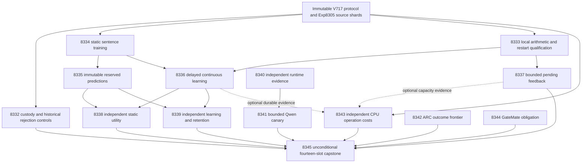

# Carnot research roadmap V719: Independent local evidence and continuous decision learning

**Created:** 2026-10-09. **Milestone:** 2026.10.719.
**Status:** Planned; execution and activation are pending.
**Supersedes:** V718 scheduling, with its complete design preserved at
`openspec/change-proposals/research-roadmap-v718-preserved-20261009.md`.
**Execution file:** `research-roadmap-next.yaml`.
**Contract:** Exactly fourteen tasks, Exp8332 through Exp8345, in the order below.

## Goal and planning decision

Measure whether the existing local sentence energy improves typed decisions.
Then test whether delayed updates help later sources without harming retention.
Keep the scientific protocol frozen. Qualify the specific failed execution
paths before depending on their evidence.

V718 linked independent inputs to one historical-reader success gate. That
reader missed one coverage branch. Nine tasks never executed. V719 removes
that coupling: static fitting, local numerical qualification and runtime
reading authenticate their own inputs. They retain all required checks.
Historical failure remains recorded in a separate task and in the capstone.

This is a bounded continuation of unmeasured science. It does not repeat a
settled positive or call an absent result a null. No new corpus, generator
training, threshold search, production rollout or publication is proposed.

## What milestone 2026.10.718 proved

The active roadmap and conductor log define fourteen scheduled dispositions.
The completion archive ends at V717 at planning time. Primary artifacts,
pre-gate receipts and logs therefore supply the newer evidence. The artifact
summarizer checked verdicts, current adversarial findings and acceptance gates
before any metrics were used below.

| Evidence | What happened | Supported conclusion |
|---|---|---|
| Exp8318 contract replay | Its owned coverage report was 492/493 statements; `v718_contract_replay.py:357` was uncovered | Current readiness is disqualified. The rejection branch needs a real mismatched-operand test. |
| Historical replay within Exp8318 | The first old reduction difference was `gate_check_summary[15].hash` | Receipt operands differ. Preserve both hashes; do not promote the old capstone. |
| Exp8319, Exp8320, Exp8326 | Three bound pre-gate artifacts record readiness zero | Local qualification, fitting and runtime qualification did not execute. |
| Exp8321–Exp8325, Exp8327 | Six producer primaries are absent after upstream retirement | H1, H2, capacity and canary outcomes remain unmeasured. |
| Exp8328 ARC frontier | Assertions passed; coverage missed five executor statements | The reader is disqualified. No generalization benefit follows. |
| Exp8329 hardware costs | All three named current workload producers were absent | Neither local-update cost nor board acceleration was measured. |
| Exp8330 GateMate | No dated physical change | The external reopening obligation remains blocked. |
| Exp8331 capstone | Nine tests passed, but mixed-history teardown failed the memory guard at +596MB | Accounting exists; qualified synthesis does not. The current child-isolation change needs explicit memory qualification. |

There are **five producer primaries, three pre-gate receipts and six absent
producer primaries**. A conductor `OK` is completion accounting, not scientific
validity. Current live adversarial checks were clean for the five inspected
primaries; their own failed acceptance gates still govern their status.

The memory symptom does not establish a retained-object leak. The repository
watchdog measures peak RSS growth. V719 measures both parent and child memory
and keeps the guard active. Moving work to an unchecked child is insufficient.

## The three largest gaps from the PRD

| Gap | PRD link | Evidence that can move it |
|---|---|---|
| Extracted evidence has not earned useful calibrated decisions | FR-06, FR-12 | Frozen local heads against same-input RBF, linear and scalar controls; independently reduced typed-action costs |
| Continuous updates have not earned later-request benefit | FR-11 | Issue-before-feedback trajectories, distinct later-source changes, fixed retention, bounded pending state and restart parity |
| Production claims lack complete compatible execution costs | FR-05, FR-08, NFR-01 | Qualified readers, measured CPU operations, actual Qwen runtime readiness, and explicit board operation boundaries |

The cohort is exposed development. It can answer a local diagnostic question.
It cannot establish independent generalization. Both generalization scores stay
zero. Constructed numerical and capacity evidence is scoped separately.

## Research incorporated before experiment design

`research-references.md` contains the dated V719 scan, written before this plan.
It covers all requested arXiv topics and secondary sources, including access
limits. These are local adaptations and boundaries, not paper replications.

| Source | Experiment consequence |
|---|---|
| [Online KAN, 2602.02056v4](https://arxiv.org/abs/2602.02056v4) | Exp8333 qualifies locality; Exp8336 tests delayed updates; Exp8343 measures coefficient touches and operation cost. |
| [Capacity-constrained OCO, 2606.11711](https://arxiv.org/abs/2606.11711) | Exp8337 compares finite pending-feedback policies. Log actual lost feedback; do not claim the paper's regret bounds. |
| [SURE-RAG, 2605.03534v2](https://arxiv.org/abs/2605.03534v2) | Exp8334/8338 test local evidence features with matched information and calibration controls. |
| [Verification Without Sufficiency, 2608.00585](https://arxiv.org/abs/2608.00585) | A local-feature null cannot retire joint or multi-hop reasoning. No post-exposure expansion of H1/H2. |
| [ARM–EBM equivalence, 2512.15605v4](https://arxiv.org/abs/2512.15605v4) | Keep exact sigmoid equivalence visible; parameterization alone cannot establish an energy-specific advantage. |
| [Dual-BRAM Ising, 2602.16143](https://arxiv.org/abs/2602.16143) | Exp8343 separates memory, transfer, numerical work and incompatible fabric operations. |

EBT, distributional EBMs, HardNet++, CAffNet and visual guided decoding remain
context or deferred branches. SIRIN is an interoperability lead. The retired
generic external-text ranker family stays closed. The plan adds no TSU or NPU
execution. Extropic's Z1T estimates motivate complete cost boundaries, not local
speed claims. Kona's retrieved page supplied no reproducible method delta.
Semantic Scholar citation endpoints failed; citation coverage is incomplete.
OpenReview challenged one inspected URL. GitHub Trending snapshots were stale.

## Architecture



Solid arrows into the capstone describe evidence collection, not success gates.
Static training has no success dependency on historical replay or durable state.
The runtime branch has no dependency on CPU science. The cost task always has
its own qualified constructed arithmetic branch, even if optional inputs fail.
No historical result gains readiness merely because its bytes authenticate.

## Phase 1 — Independent evidence and static training

- **Exp8332:** Cover the exact rehashed-operand rejection branch. Bind current
  authority and raw cached source support. Reuse immutable historical replay.
- **Exp8333:** Qualify the existing local kernel with independent dense/SciPy
  references, deliberate false-zero rejection and real process-kill recovery.
- **Exp8334:** Train the frozen spline, RBF, linear and scalar heads. Authenticate
  its own Exp8305 inputs. Qualify pure numerical computation within this task.

A failure in historical reconciliation cannot suppress these independent
numerical or static questions. No coverage exclusion or validator exemption is
allowed. Failed numerical checks still prevent dependent scientific claims.

## Phase 2 — Seal decisions and measure continuous learning

- **Exp8335:** Seal all 128 intended reserved predictions. The predictor receives
  no evaluator labels. Preserve unavailable source slots as escalations.
- **Exp8336:** Run the unchanged 96-slot delayed-feedback trajectory. Seal all
  retention predictions before evaluator access. Test exact restart recovery.
- **Exp8337:** Test finite pending-feedback capacity on three constructed streams.
  Compare unlimited tracking, first admission and random-priority admission.

Exp8336 is the mandatory continuous self-learning experiment. It updates small
local energy coefficients after feedback, then measures their effect on later
sources. Persistent state provides the Tier 2 path. It does not acquire new
semantic constraint types or update Qwen's weights.

## Phase 3 — Independent utility audits and bounded runtime reopening

- **Exp8338:** Independently reduce static action utility after both static and
  online seals exist. Keep matched controls and original H1 thresholds.
- **Exp8339:** Independently reduce later-source benefit and every retention
  window. Keep original H2 thresholds and report reachable action headroom.
- **Exp8340:** Qualify versioned runtime readers locally. Require authenticated
  device/library change before repeating CUDA context and copy checks.
- **Exp8341:** If both runtime gates pass, run one bounded Qwen canary. It cannot
  expand the frozen CPU study or automatically reopen full V713 acquisition.

Utility audits require valid controls, not a desired outcome. Missing upstream
artifacts yield a terminal blocked class. An informative null requires usable
support and a working mechanism. Small or exposed samples retain those limits.

## Phase 4 — Generalization evidence, cost boundaries and reconciliation

- **Exp8342:** Cover the five known ARC reader branches. Inspect only new live
  supervisor outcomes beyond the last qualified frontier. An empty ledger
  requires no policy change and satisfies the standing generalization slot.
- **Exp8343:** Independently validate and time constructed spline arithmetic.
  Add durable or natural costs only when qualified current producers exist.
  Map actual operations to KV260 and authenticate PolarFire terminal evidence.
- **Exp8344:** Carry the GateMate reopening obligation through a bounded evidence
  delta. Make no physical probe without a documented physical change.
- **Exp8345:** Reconcile all fourteen dispositions with bounded historical memory.
  Recompute scientific claims only from qualified sealed current primitives.
  Preserve the exact stable G1–G4 publication gate.

## Frozen scientific protocol and falsifiable outcomes

The authority remains `openspec/change-proposals/v717-local-learning-protocol.json`.
Its SHA-256 is `853709123024de763e96dd688e819f0430205ae6d97d6561a2b95cca23b81c6f`.
Do not change its bytes, cohort, optimizer, thresholds or seeds during execution.

**Inputs and support.** There are 128 intended fit sources, 64 tune sources and
128 reserved sources. Existing authenticated counts are 104 labeled usable fit
sources, 25 calibration sources, 28 comparator-selection sources and 97 reserved
sources. The 96-slot stream has 74 usable sources; its later 88 slots have 67.
The fixed retention panel has 23 usable sources among 32 intended, with labels
9/14. Keep all unavailable slots. No replacement or post-hoc resplitting.

**Static heads.** Compare spline34 with RBF34, linear6, scalar2 and the frozen
holistic probability. All learned controls receive the same inputs. Use four
local features, fixed cubic knots, 400 full-batch logistic steps, learning rate
0.01, static L2 0.001 and the original coordinate projections. Temperature is
chosen from 0.5/1/2 on the first 32 tune slots. Select the comparator on the next
32. Verify exact sigmoid34 equivalence; it is not an independent baseline.

**Decision policy.** Wrong accept/reject costs 1, correct actions cost 0, and
escalation costs 0.5. Accept below unsupported probability 0.25; reject above
0.75; ties escalate. These are fixed conservative thresholds, not an optimal
policy for this symmetric cost. Missing features escalate for every arm.

**H1.** Compare intended-slot cost of the selected comparator minus spline34
cost across all 128 reserved slots. The development-signal gate is mean gain
at least 0.02, nominal one-sided 97.5% bootstrap lower bound above zero, and
Brier degradation at most 0.01. Require at least 80 qualified sources and 8 per
class, a working action/optimizer control, and positive permissible-action
oracle headroom before treating a null as informative. Use 10,000 source-cluster
resamples and the original seed. The exposed cohort makes intervals descriptive.

**Continuous updates.** Issue each prediction before releasing feedback from
slot t−8. Compare frozen, sparse local, equivalent dense local, intercept-only
and released-label-shuffle arms. Update only active local coefficients at step
0.01, gradient norm cap 1, without online L2. Freeze knots, holistic slope,
intercept and temperature for sparse/dense arms. Kill and resume at slots 32/64.
Seal retention windows 0/32/64/96. A fit-only exact-budget control must show an
attainable typed-action crossing; do not retune after that diagnostic.

**H2.** Compare frozen minus online cost on intended stream slots 9–96. Require
mean gain at least 0.02 and a positive nominal one-sided 97.5% moving-block
bootstrap lower bound, with block length 8 and 10,000 resamples. Require at least
64 qualified later sources and 8 per label for informative utility evidence.
Final retention cost degradation must be at most 0.02 and Brier degradation at
most 0.01, with at least 20 sources and 4 per label. Show every window and all
controls. A gain over frozen alone does not establish locality-specific value.

**Capacity study.** This separate constructed protocol uses three 512-event
streams, capacities 4/16/64 and admission seeds 11/22/33. Local feature j is
`((17*t+13*j)%101)/100`; the fixed linear-label sign reverses after slot 256.
Delays are constant 8, repeating 1/8/32/64, or 64 during slots 129–256 and 8
otherwise. Issue and admit before processing due feedback. Lost feedback never
returns to the learner. Random priority keeps the C smallest pending priorities.
No inverse-propensity weighting or theoretical-regret claim is permitted.
These are three constructed traces; repeated seeds are not independent datasets.

Capacity readiness requires the memory bound at every tick, restart parity and
working overflow/leakage controls. It does not require one policy to win.
The CPU arithmetic cost branch uses 128 constructed vectors, one warmup and five
paired repetitions. It cannot establish durable, natural or whole-service cost.

## Dependency and gate contract

Only the following ten gates can pre-skip conductor calls. All gate fields
appear verbatim in the upstream prompt's REQUIRED ARTIFACT FIELDS.

| Consumer | Required current fields |
|---|---|
| Exp8335 | Exp8334 `heads_ready_score == 1` |
| Exp8336 | Exp8334 `heads_ready_score == 1`; Exp8333 `local_kernel_ready_score == 1` |
| Exp8337 | Exp8333 `local_kernel_ready_score == 1` |
| Exp8338 | Exp8335 `predictions_ready_score == 1`; Exp8336 `trajectory_ready_score == 1` |
| Exp8339 | Exp8335 `predictions_ready_score == 1`; Exp8336 `trajectory_ready_score == 1` |
| Exp8341 | Exp8340 `runtime_changed_score == 1`; Exp8340 `cuda_context_ready_score == 1` |

The table contains ten field conditions across six consumers. The authoritative
machine count is ten. Exp8332/8333/8334/8340/8342/8343/8344/8345 have no structured
gates. Neither H1 success nor runtime readiness gates continuous CPU learning.
All task inputs still require local authentication and current validation.

## Hardware requirements and model substrate

| Resource | Use and hard boundary |
|---|---|
| Host CPU, RAM and local disk | Cached fitting, numerical qualification, causal replay, audits and complete evidence storage. No GPU needed for these branches. |
| Dual RTX 3090, 48GB total inventory | Exp8341 only, after actual runtime change/context gates. Use the existing lease and authenticated device mapping. Availability is measured, not inferred from inventory. |
| `unsloth/Qwen3.8-27B-GGUF`, Q4_K_M | Mandatory sole current LLM. One load, at most 36 requests, 64 output tokens each. `model_bounded_generation`, 10s plausibility floor. No artificial padding. |
| KV260 | SSH via `kria` only when a compatible workload exists. Preserve `k_max<=5`. Current Ising fabric does not implement spline updates or persistence. |
| PolarFire | Authenticate Exp8259 board-local Linux CPU dispatch and parity. Terminal CPU evidence does not establish FPGA execution. |
| GateMate | Carry `0xffffffff` physical/JTAG evidence. Reopen after dated physical change, GM1Ax IDCODE `0x20000001`, then n16 flash/sample smoke. |
| NPU, Extropic TSU, larger FPGA | Deferred. No access, purchase or speed claim follows from papers or inventory. |

Exp8341 bounds load at 180s, requests at 60s and inference at 900s. Readiness
needs at least nine complete triplets and actual CUDA offload evidence. A block
before loading records actual `no_model_load` with zero calls. Full generation
would require `model_full_generation` (60s); embedding/load-only work would use
`model_load_no_generation` (2s). Neither is this canary's scope. Cached historical
Qwen provenance is stored separately from current invocation counts. Legacy
small models can only supply CPU smoke checks, never headline results.

The wishlist motivates sparse fixed-point arithmetic and future fabric work.
The 100x learning target and NFR-01 tenfold production target remain unproved.
Amdahl bounds require measured complete-service operands; missing costs stay null.

## Execution budget, validation and retirement

Every prompt includes numbered requirements for flushed phase progress and
before/after lines around slow calls. Owned subprocesses and loops emit progress
at least every 60 seconds. No gap may reach 600 seconds. Files over about 200
lines are written in separate bounded calls, with progress between calls.
No task relies on a wall-time estimate to override the conductor's stall rules.

Schema, historical-reader and hardware coordination tasks use Opus with 100
turns under the current operator routing. Formulaic capacity and ARC test work
use Codex `gpt-6.1-sol`. Routine science keeps Sonnet with at most 50 turns.
The simple seal uses 30 turns; GateMate uses 20. No Luna experiment is proposed.
Budgets reserve time for validation within the 4800s hard cap. A long benchmark
must checkpoint before its fixed deadline. Any remaining owned work is explicit;
unchanged external missingness is `blocked`, never retryable `partial`.

Each task has a concrete primary JSON and thin runner path in its prompt.
Primitive rows live beneath the matching `results/raw/experiment_*` directory.
Checks use private scratch. Required scoped unit, lint, typing and spec checks
remain in every prompt. Owned coverage includes actual CLI and error branches.
Terminal publication follows cold replay, unchanged adversarial verification and
strict row consistency. This plan does not edit conductor or validator policy.

Execution tests map to `ops/e2e-test-plan.md`: E2E-018 for authority lifecycle,
E2E-020 for owned delayed-state recovery, E2E-021 for frozen cold replay, and
E2E-017 for applicable ARC evidence readers. A task records what actually ran.
Constructed checks cannot satisfy a live inference or hardware claim.

All tasks carry complete prior-failure entries, including the latest V718
producer or pre-gate disposition. Entries for absent producers say so explicitly;
there is no invented producer `honest_verdict`. Same-verdict retirement remains
mechanical. It retires the repeated execution method or measured narrow mechanism,
not an unmeasured scientific hypothesis. GateMate and capstone have explicit
standing 2026-05-29 continuation authority for retired-scope matches. They do not
reuse retired experiment IDs or require a retired upstream execution.

The two V718 retirement entries do not license another unsupported
science decision. Exp8345 reports science only if new sealed H1/H2 primitives
qualify. Otherwise it preserves blocked science and accounts for all slots.
No model update, external publication, push or active-roadmap edit is authorized.

## Exact task contract

The visible order and complete JSON objects below are generated from the same
staged YAML. Complete equality includes prompts, routing and failure lineage.
At planning time, comparison uses staged bytes on both input sides. Activation
must compare against the then-active bytes. Staged validation is not activation.

| Order | Task ID | Title | Phase | Deliverable |
|---|---|---|---|---|
| 1 | `exp8332-contract-replay` | Qualify current source custody and cover the historical replay rejection branch | 1 | `results/experiment_8332_v719_contract_replay.json` |
| 2 | `exp8333-local-evidence-qualification` | Qualify local updates with independent arithmetic and real restart controls | 1 | `results/experiment_8333_v719_local_evidence_qualification.json` |
| 3 | `exp8334-sentence-spline-fit` | Train the frozen sentence decision heads on directly authenticated cached sources | 1 | `results/experiment_8334_v719_sentence_spline_fit.json` |
| 4 | `exp8335-reserved-prediction-seal` | Seal all reserved decisions under the unchanged source contract | 2 | `results/experiment_8335_v719_reserved_prediction_seal.json` |
| 5 | `exp8336-continuous-local-learning` | Measure delayed local learning and seal every retention window | 2 | `results/experiment_8336_v719_continuous_local_learning.json` |
| 6 | `exp8337-bounded-feedback-capacity` | Test pending feedback capacity and delayed learning under bounded memory | 2 | `results/experiment_8337_v719_bounded_feedback_capacity.json` |
| 7 | `exp8338-static-benefit-audit` | Audit static decision benefit after all prediction windows are sealed | 3 | `results/experiment_8338_v719_static_benefit_audit.json` |
| 8 | `exp8339-learning-retention-audit` | Audit later learning utility and every fixed retention window | 3 | `results/experiment_8339_v719_learning_retention_audit.json` |
| 9 | `exp8340-runtime-reader-qualification` | Qualify versioned runtime evidence independently and require a real CUDA change | 3 | `results/experiment_8340_v719_runtime_reader_qualification.json` |
| 10 | `exp8341-changed-runtime-canary` | Run the bounded Qwen canary only after changed runtime passes | 3 | `results/experiment_8341_v719_changed_runtime_canary.json` |
| 11 | `exp8342-arc-supervisor-frontier` | Cover ARC reader failure branches and inspect only new supervisor outcomes | 4 | `results/experiment_8342_v719_arc_supervisor_frontier.json` |
| 12 | `exp8343-kv260-workload-cost` | Measure independent spline operation costs and retain exact board boundaries | 4 | `results/experiment_8343_v719_kv260_workload_cost.json` |
| 13 | `exp8344-gatemate-change-ledger` | Carry the GateMate physical reopening obligation through a bounded evidence delta | 4 | `results/experiment_8344_v719_gatemate_change_ledger.json` |
| 14 | `exp8345-capstone` | Reconcile fourteen outcomes with bounded historical memory and independent science gates | 4 | `results/experiment_8345_v719_capstone.json` |

Canonical tasks SHA-256: `a66343ee94e1ae37eb5f7865f546c0602ea716bc7c9706b034d9c5c0ba35d4f7`.

<!-- V719_TASK_CONTRACT_START -->
```json
{
  "milestone": "2026.10.719",
  "tasks": [
    {
      "id": "exp8332-contract-replay",
      "title": "Qualify current source custody and cover the historical replay rejection branch",
      "phase": 1,
      "track": "methods",
      "priority": "high",
      "requires_gpu": false,
      "max_turns": 100,
      "estimated_wall_time_min": 65,
      "per_unit_rows": true,
      "milestone": "2026.10.719",
      "deliverable": "results/experiment_8332_v719_contract_replay.json",
      "inference_substrate_class": "no_model_load",
      "MODEL_SPECS": [],
      "gated_on": [],
      "prior_failures": [
        {
          "experiment_id": "exp8317-capstone",
          "verdict": "complete_disqualified_owned_validation",
          "addressed_by": "Reproduce reduction_drift and qualify deterministic reduction with explicit historical authority before current aggregation. Historical failure remains immutable.",
          "retire_if_same_verdict": true
        },
        {
          "experiment_id": "exp8307-runtime-change-boundary",
          "verdict": "complete_disqualified_cuda_runtime",
          "addressed_by": "The runtime consumer used V716 parser expectations against mutable vNEXT. Use explicit versioned private fixtures; no GPU probe is needed for this reader fix.",
          "retire_if_same_verdict": true
        },
        {
          "experiment_id": "exp8318-contract-replay",
          "verdict": "complete_disqualified_contract_replay",
          "addressed_by": "The sole failed owned command was coverage: line357 rejects mismatched replay operands. Add a real rehashed-operand rejection case, reuse stable snapshots, and authenticate Exp8305 support directly rather than inheriting failed historical synthesis.",
          "retire_if_same_verdict": true
        }
      ],
      "prompt": "CONTEXT:\nWork in {project_root} on {date}. V718 has five producer primaries, three conductor pre-gate receipts and six absent producer primaries. Nine science/runtime tasks did not execute. Exp8318 failed 100-percent coverage at v718_contract_replay.py:357; Exp8328 missed five executor branches; Exp8331 failed the unchanged memory-leak guard (+596MB) at test_actual_mixed_history teardown. Historical reduction drift was localized to gate_check_summary[15].hash. These are execution findings, not H1/H2 nulls. V719 preserves the frozen V717 scientific protocol and exposed-development scope, fixes named execution defects, and separates independent inputs from historical synthesis. Never recast missing observations as negative science.\nEXISTING CODE TO READ FIRST:\nCLAUDE.md; CODEX.md; ops/e2e-test-plan.md; ops/exclusion_manifest.yaml; openspec/capabilities/research-reporting/spec.md; openspec/capabilities/verification/spec.md; scripts/experiment_template.py; python/carnot/reporting/primary_publication.py; openspec/change-proposals/research-roadmap-vNEXT.md; openspec/change-proposals/v717-local-learning-protocol.json; python/carnot/reporting/roadmap_contract.py; python/carnot/reporting/v717_capstone.py; python/carnot/reporting/v717_capstone_evidence.py; results/experiment_8317_v717_capstone.json; results/experiment_8304_v717_contract_methods.json; results/experiment_8305_v717_cached_sentence_custody.json; scripts/adversarial_verify.py; research-references.md; research-studying.md; python/carnot/reporting/v718_contract_replay.py; python/carnot/reporting/v718_replay_history.py; python/carnot/reporting/v718_replay_runner.py; tests/python/test_v718_contract_replay_8318.py; results/experiment_8318_v718_contract_replay.json; openspec/change-proposals/research-roadmap-v718-preserved-20261009.md\nTASK:\nQualify current source custody and cover the historical replay rejection branch. Deliver results/experiment_8332_v719_contract_replay.json. Create the thin runner scripts/experiments/experiment_8332_v719_contract_replay.py. Store primitive evidence under results/raw/experiment_8332_v719_contract_replay/. Read current producers by exact declared deliverables. Future output paths are dependencies, not existing inputs.\nCONCRETE STEPS:\n1. PRECONDITIONS: Emit a flushed start line. Authenticate source bytes, terminal sidecars and actual authority. Check private scratch, tools and resources before measurement. Record missing external operands as complete_blocked_<operand> with verdict_class=blocked and exact gate_check_summary. Never replace missing observations with fixtures.\n2. Emit a flushed progress line at every phase boundary. Emit one before and after every model load, generation, benchmark and subprocess. Print completed/pending counts inside long loops. Poll owned children with a heartbeat at least every 60 seconds. Keep every silence gap below 600 seconds. Use unbuffered output and bounded child deadlines. Write any file over about 200 lines in several tool calls of at most about 150 lines. Send a progress message between calls. No single huge tool call. Use bounded child deadlines and poll commands in intervals of at most 60 seconds. Do not pad elapsed time.\n3. Spec first: add relevant REQ-* and SCENARIO-* before implementation. Write focused failing tests first. Reuse qualified modules through small adapters. Preserve old tests, source evidence and validator enforcement. Freeze execution argv and timeouts separately from scientific parameters. Use /tmp for scratch and scripts/experiments/ for real runners. Do not modify research-roadmap.yaml.\n4. Use no_model_load, inference_substrate=aggregation_from_upstream_artifacts, MODEL_SPECS=[] and zero model calls. Compare the V719 staged table, complete JSON tasks and YAML. Bind activated authority only after conductor activation. Preserve the V717 design snapshot and frozen protocol bytes.\n5. Read the V719 reference scan and full methods for 2602.02056v4 and 2606.11711v1. Reuse the authenticated V718 method-ingestion files when their hashes match; add only verified deltas to docs/research-notes/v719-method-ingestion.md and research-studying.md. Freeze a methods manifest binding unchanged V717 science and the separate constructed capacity protocol. Do not introduce new algorithms into H1/H2.\n6. Authenticate Exp8304/8305 custody and existing predictor/evaluator shards directly, without making Exp8318 or Exp8331 success a prerequisite. Recount intended and usable role support. Bind a CURRENT support receipt to hashes and the immutable V717 protocol. cached_support_ready_score requires authentic support, current task agreement and all owned checks; no requirement for a scientific win or successful historical primary. Preserve any failed historical disposition separately. Do not reopen reserved targets or recapture data.\n7. Reproduce the exact uncovered rejection at python/carnot/reporting/v718_contract_replay.py:357 using a self-consistently rehashed private candidate with a changed refs list or replay operand. Assert the real cold CLI rejects it. Preserve all existing tests and the 100-percent threshold; do not mark or exclude the line. The localized historical mismatch is gate_check_summary[15].hash, caused by differing bound receipt operands; retain both hashes and the failed historical verdict. Reuse deterministic snapshot replay instead of building another reducer. If further disagreement appears, report its exact field and stop that branch.\n8. Qualify explicit milestone arguments and historical design snapshots. A V716 reader must use V716 bytes even when vNEXT says V719. Add positive and negative subprocess controls for current/old authority, changed prompts, missing primaries, pre-gate receipts and rehashed reduction tampering. Treat a qualified reader of a disqualified artifact as authenticated failure, not successful science.\n9. Freeze the finding-consumer contract before local qualification: adversarial CLI exit1 means findings, not necessarily critical failure. Require a parsed report bound to candidate hash and verifier version. Fail closed on process errors, unknown severity, warn/critical findings or missing reports. An info finding can be resolved only by independent primitive recomputation and a passing deliberate-error control. Preserve the finding and its disposition. Do not edit adversarial_verify.py, its exemption tables, or primary_publication.py. Test exact-zero legitimate evidence and false-zero evidence; both must still be reported by the unchanged verifier.\n10. Set current_contract_ready_score only on exact fourteen-task agreement. Set history_reader_ready_score only on passed historical replay controls. Keep cached support and historical verdicts distinct. Run private E2E-018 authority and E2E-021 replay cases. Cover owned rejection branches before the final qualification run. No scientific win is required. Exp8333 and Exp8340 perform their own scoped authentication and do not depend on this historical-reader gate.\n11. Run relevant unit and consumer tests, scoped Ruff check/format, strict mypy and scripts/check_spec_coverage.py --files <owned-test-files>. Require 100 percent newly owned statement coverage including actual CLI, child, failure and recovery paths. Use pytest -n 0 -o addopts= with private scratch. Record exact argv, exit codes, timing and output hashes. Do not launch the full repository suite inside an experiment.\n12. Cold-replay primitive evidence in a fresh process. Test valid, negative and rehashed-tamper cases. Run unchanged primary_publication checks, scripts/adversarial_verify.py --json <private-candidate> and scripts/verdict_row_consistency_lint.py --strict <private-candidate>. Keep every finding. Qualify the existing finding-consumer implementation within this task before using it; a raw nonzero exit never proves a clean result. Errors, unknown findings and unadjudicated warnings block readiness. Publish the terminal primary atomically after required checks. Failed owned checks disqualify. Unchanged external missingness is blocked, never partial. Reconcile openspec/, _bmad/traceability.md, ops/status.md and ops/changelog.md. No generator-weight updates or external publication.\nREQUIRED ARTIFACT FIELDS:\nexperiment_id, task_id, milestone, run_date: principle: Identify the invocation and exact execution authority.\nhonest_verdict, verdict_class: principle: honest_verdict starts complete_; class is positive | circular_positive | null | blocked | disqualified | partial. Partial means retryable unfinished owned work only.\ngate_check_summary: principle: Each block names upstream, path/hash, exact field, operator, expected and observed values. Missing evidence differs from zero.\ninference_substrate, inference_substrate_class, MODEL_SPECS, model_invocation_counts, historical_model_provenance: principle: Count only current model work and retain imported provenance separately.\nrows, intended_count, completed_count, failed_count, censored_count, excluded_count, independent_count, sample_size_budget: principle: Preserve every intended unit and condition; repetitions do not create independent sources.\nverifier_is_oracle, exposure_scope, independent_generalization_score, generalized_learning_benefit_score: principle: Constructed oracle success is circular_positive. Exposed development keeps both generalization scores zero.\nrequired_checks_passed, flagged_adversarial, acceptance_gates, validation_receipts, terminal_validation_sidecar_path, adversarial_findings: principle: Readiness requires complete byte-bound validation; it never requires a scientific win.\npreconditions_checked, duration_s, phase_spans, random_seed, reproducibility_checksum, source_artifact_hashes, code_config_hashes, raw_shard_hashes: principle: Bind each conclusion to actual work and replayable configuration.\ncited_upstream_artifacts, field_principles: principle: Record imported fields and hashes; explain the evidentiary purpose of every added field.\ncurrent_contract_ready_score, history_reader_ready_score, cached_support_ready_score, canonical_tasks_sha256: principle: Current authority, valid historical readers and sufficient cached data are separate gates.\nprotocol_path, protocol_sha256, methods_manifest, authority_snapshots, first_reduction_mismatch, historical_dispositions: principle: Preserve old outcomes and bind the changed execution contract.\nfinding_consumer_policy, finding_dispositions, policy_negative_controls: principle: A finding is resolved by evidence, never by deleting it or ignoring a failing command.\nRun command: cd {project_root} && PYTHONPATH=python:. PYTHONUNBUFFERED=1 .venv/bin/python -u scripts/experiments/experiment_8332_v719_contract_replay.py --date {date}\nDo NOT push. Do NOT modify scripts/research_conductor.py.",
      "model": "opus"
    },
    {
      "id": "exp8333-local-evidence-qualification",
      "title": "Qualify local updates with independent arithmetic and real restart controls",
      "phase": 1,
      "track": "self_learning",
      "priority": "high",
      "requires_gpu": false,
      "max_turns": 100,
      "estimated_wall_time_min": 65,
      "per_unit_rows": true,
      "milestone": "2026.10.719",
      "deliverable": "results/experiment_8333_v719_local_evidence_qualification.json",
      "inference_substrate_class": "no_model_load",
      "MODEL_SPECS": [],
      "gated_on": [],
      "prior_failures": [
        {
          "experiment_id": "exp8306-local-update-isolation",
          "verdict": "complete_disqualified_owned_checks",
          "addressed_by": "The sole failed terminal command returned exit1 for an informational exact-zero metric. Preserve it; independently verify dense parity and qualify strict typed finding consumption with false-zero controls.",
          "retire_if_same_verdict": true
        },
        {
          "experiment_id": "exp8319-local-evidence-qualification",
          "verdict": "blocked_gate_check_failed",
          "addressed_by": "The kernel never ran: unrelated historical-reader readiness was zero. Remove that edge, authenticate this task directly, and test the existing finding consumer locally before the unchanged 48-trajectory numerical/restart study.",
          "retire_if_same_verdict": true
        }
      ],
      "prompt": "CONTEXT:\nWork in {project_root} on {date}. V718 has five producer primaries, three conductor pre-gate receipts and six absent producer primaries. Nine science/runtime tasks did not execute. Exp8318 failed 100-percent coverage at v718_contract_replay.py:357; Exp8328 missed five executor branches; Exp8331 failed the unchanged memory-leak guard (+596MB) at test_actual_mixed_history teardown. Historical reduction drift was localized to gate_check_summary[15].hash. These are execution findings, not H1/H2 nulls. V719 preserves the frozen V717 scientific protocol and exposed-development scope, fixes named execution defects, and separates independent inputs from historical synthesis. Never recast missing observations as negative science.\nEXISTING CODE TO READ FIRST:\nCLAUDE.md; CODEX.md; ops/e2e-test-plan.md; ops/exclusion_manifest.yaml; openspec/capabilities/research-reporting/spec.md; openspec/capabilities/verification/spec.md; scripts/experiment_template.py; python/carnot/reporting/primary_publication.py; openspec/change-proposals/research-roadmap-vNEXT.md; openspec/change-proposals/v717-local-learning-protocol.json; python/carnot/verify/local_update_isolation_8306.py; python/carnot/reporting/local_update_isolation_8306.py; python/carnot/reporting/local_update_execution_8306.py; tests/python/test_local_update_isolation_8306.py; results/experiment_8306_v717_local_update_isolation.json; python/carnot/reporting/v718_replay_history.py; results/experiment_8319_local_evidence_qualification.json\nTASK:\nQualify local updates with independent arithmetic and real restart controls. Deliver results/experiment_8333_v719_local_evidence_qualification.json. Create the thin runner scripts/experiments/experiment_8333_v719_local_evidence_qualification.py. Store primitive evidence under results/raw/experiment_8333_v719_local_evidence_qualification/. Read current producers by exact declared deliverables. Future output paths are dependencies, not existing inputs.\nCONCRETE STEPS:\n1. PRECONDITIONS: Emit a flushed start line. Authenticate source bytes, terminal sidecars and actual authority. Check private scratch, tools and resources before measurement. Record missing external operands as complete_blocked_<operand> with verdict_class=blocked and exact gate_check_summary. Never replace missing observations with fixtures.\n2. Emit a flushed progress line at every phase boundary. Emit one before and after every model load, generation, benchmark and subprocess. Print completed/pending counts inside long loops. Poll owned children with a heartbeat at least every 60 seconds. Keep every silence gap below 600 seconds. Use unbuffered output and bounded child deadlines. Write any file over about 200 lines in several tool calls of at most about 150 lines. Send a progress message between calls. No single huge tool call. Use bounded child deadlines and poll commands in intervals of at most 60 seconds. Do not pad elapsed time.\n3. Spec first: add relevant REQ-* and SCENARIO-* before implementation. Write focused failing tests first. Reuse qualified modules through small adapters. Preserve old tests, source evidence and validator enforcement. Freeze execution argv and timeouts separately from scientific parameters. Use /tmp for scratch and scripts/experiments/ for real runners. Do not modify research-roadmap.yaml.\n4. Use no_model_load, inference_substrate=verifier_ensemble_against_cached_candidates and MODEL_SPECS=[]. This independent kernel qualification has no Exp8332/history-reader success gate. Bind its own current task and frozen V717 protocol through the existing roadmap reader. Reuse Exp8306 numeric code and the existing v718_replay_history finding consumer; qualify the consumer locally with valid, false-zero and unknown-severity cases. Reading old failure evidence never promotes it to readiness.\n5. Authenticate Exp8306 primitive trajectories and its original disqualified terminal. Reproduce the informational IMPLAUSIBLE_PERFECT on dense_sparse_error_max=0.0. It is not evidence of scientific improvement. Independently recompute every dense and sparse update with a separate dense reference. Require a deliberately corrupted coefficient and a fabricated zero metric to fail. Retain the original flag in the current artifact.\n6. Run the frozen48 constructed trajectories: four locality patterns, four fault patterns and three seeds. Preserve64 events per trajectory. Check partition of unity, boundary knots, finite-difference gradients, temperature derivative, active coordinates and unissued-cache invalidation. Require sparse/dense probability difference<=1e-10, identical typed actions and zero stale predictions. Inspect primitive coefficient arrays rather than trusting aggregate zero.\n7. Exercise actual process kills and durable recovery under the existing execution harness. Compare coefficients, pending feedback, consumed IDs, reverse dependencies and issued predictions. Include duplicate and out-of-order feedback. Cover every owned CLI and failure branch under real coverage. Use independent receipts to resolve an info flag; any unresolved finding keeps readiness zero.\n8. Publish a NEW qualification receipt, never rewrite Exp8306 or rename its zero metric. Set local_kernel_ready_score=1 only when numerical, crash, finding-consumer and coverage controls all pass. Constructed positive evidence is circular_positive. Write docs/research-notes/v719-local-qualification.md. Run private E2E-020 and E2E-021.\n9. Run relevant unit and consumer tests, scoped Ruff check/format, strict mypy and scripts/check_spec_coverage.py --files <owned-test-files>. Require 100 percent newly owned statement coverage including actual CLI, child, failure and recovery paths. Use pytest -n 0 -o addopts= with private scratch. Record exact argv, exit codes, timing and output hashes. Do not launch the full repository suite inside an experiment.\n10. Cold-replay primitive evidence in a fresh process. Test valid, negative and rehashed-tamper cases. Run unchanged primary_publication checks, scripts/adversarial_verify.py --json <private-candidate> and scripts/verdict_row_consistency_lint.py --strict <private-candidate>. Keep every finding. Qualify the existing finding-consumer implementation within this task before using it; a raw nonzero exit never proves a clean result. Errors, unknown findings and unadjudicated warnings block readiness. Publish the terminal primary atomically after required checks. Failed owned checks disqualify. Unchanged external missingness is blocked, never partial. Reconcile openspec/, _bmad/traceability.md, ops/status.md and ops/changelog.md. No generator-weight updates or external publication.\nREQUIRED ARTIFACT FIELDS:\nexperiment_id, task_id, milestone, run_date: principle: Identify the invocation and exact execution authority.\nhonest_verdict, verdict_class: principle: honest_verdict starts complete_; class is positive | circular_positive | null | blocked | disqualified | partial. Partial means retryable unfinished owned work only.\ngate_check_summary: principle: Each block names upstream, path/hash, exact field, operator, expected and observed values. Missing evidence differs from zero.\ninference_substrate, inference_substrate_class, MODEL_SPECS, model_invocation_counts, historical_model_provenance: principle: Count only current model work and retain imported provenance separately.\nrows, intended_count, completed_count, failed_count, censored_count, excluded_count, independent_count, sample_size_budget: principle: Preserve every intended unit and condition; repetitions do not create independent sources.\nverifier_is_oracle, exposure_scope, independent_generalization_score, generalized_learning_benefit_score: principle: Constructed oracle success is circular_positive. Exposed development keeps both generalization scores zero.\nrequired_checks_passed, flagged_adversarial, acceptance_gates, validation_receipts, terminal_validation_sidecar_path, adversarial_findings: principle: Readiness requires complete byte-bound validation; it never requires a scientific win.\npreconditions_checked, duration_s, phase_spans, random_seed, reproducibility_checksum, source_artifact_hashes, code_config_hashes, raw_shard_hashes: principle: Bind each conclusion to actual work and replayable configuration.\ncited_upstream_artifacts, field_principles: principle: Record imported fields and hashes; explain the evidentiary purpose of every added field.\nlocal_kernel_ready_score, dense_sparse_error_max, numeric_audit, crash_replay_rows: principle: Qualify arithmetic and durability independently of natural decision benefit.\nfinding_dispositions, independent_dense_reference, false_zero_control, owned_coverage_reference: principle: Exact parity requires auditable primitive evidence and a test that rejects a false claim.\nRun command: cd {project_root} && PYTHONPATH=python:. PYTHONUNBUFFERED=1 .venv/bin/python -u scripts/experiments/experiment_8333_v719_local_evidence_qualification.py --date {date}\nDo NOT push. Do NOT modify scripts/research_conductor.py.",
      "model": "opus"
    },
    {
      "id": "exp8334-sentence-spline-fit",
      "title": "Train the frozen sentence decision heads on directly authenticated cached sources",
      "phase": 1,
      "track": "calibrated_decision",
      "priority": "high",
      "requires_gpu": false,
      "max_turns": 50,
      "estimated_wall_time_min": 60,
      "per_unit_rows": true,
      "milestone": "2026.10.719",
      "deliverable": "results/experiment_8334_v719_sentence_spline_fit.json",
      "inference_substrate_class": "no_model_load",
      "MODEL_SPECS": [],
      "gated_on": [],
      "prior_failures": [
        {
          "experiment_id": "exp8308-sentence-spline-fit",
          "verdict": "blocked_gate_check_failed",
          "addressed_by": "Static fitting never ran because it depended on durable-update qualification. Separate pure static numeric checks from crash recovery; retain the same frozen scientific procedure.",
          "retire_if_same_verdict": true
        },
        {
          "experiment_id": "exp8320-sentence-spline-fit",
          "verdict": "blocked_gate_check_failed",
          "addressed_by": "Fitting never ran because cached_support_ready_score inherited Exp8318 coverage failure. Exp8332 targets that exact rejection branch and binds raw Exp8305 support; static numerical validation remains local and has no crash-recovery gate.",
          "retire_if_same_verdict": true
        },
        {
          "experiment_id": "exp8318-contract-replay",
          "verdict": "complete_disqualified_contract_replay",
          "addressed_by": "Remove the unrelated historical-reader gate entirely from static science. This task authenticates source custody and current authority itself; all numerical and publication checks remain mandatory.",
          "retire_if_same_verdict": true
        }
      ],
      "prompt": "CONTEXT:\nWork in {project_root} on {date}. V718 has five producer primaries, three conductor pre-gate receipts and six absent producer primaries. Nine science/runtime tasks did not execute. Exp8318 failed 100-percent coverage at v718_contract_replay.py:357; Exp8328 missed five executor branches; Exp8331 failed the unchanged memory-leak guard (+596MB) at test_actual_mixed_history teardown. Historical reduction drift was localized to gate_check_summary[15].hash. These are execution findings, not H1/H2 nulls. V719 preserves the frozen V717 scientific protocol and exposed-development scope, fixes named execution defects, and separates independent inputs from historical synthesis. Never recast missing observations as negative science.\nEXISTING CODE TO READ FIRST:\nCLAUDE.md; CODEX.md; ops/e2e-test-plan.md; ops/exclusion_manifest.yaml; openspec/capabilities/research-reporting/spec.md; openspec/capabilities/verification/spec.md; scripts/experiment_template.py; python/carnot/reporting/primary_publication.py; openspec/change-proposals/research-roadmap-vNEXT.md; openspec/change-proposals/v717-local-learning-protocol.json; python/carnot/verify/sentence_energy_8183.py; python/carnot/verify/sparse_energy_7996.py; results/experiment_8183_v707_sentence_energy_fit.json; results/experiment_7996_v693_sparse_energy_training.json; openspec/capabilities/kan/spec.md; python/carnot/verify/local_update_isolation_8306.py; results/experiment_8320_sentence_spline_fit.json\nTASK:\nTrain the frozen sentence decision heads on directly authenticated cached sources. Deliver results/experiment_8334_v719_sentence_spline_fit.json. Create the thin runner scripts/experiments/experiment_8334_v719_sentence_spline_fit.py. Store primitive evidence under results/raw/experiment_8334_v719_sentence_spline_fit/. Read current producers by exact declared deliverables. Future output paths are dependencies, not existing inputs.\nCONCRETE STEPS:\n1. PRECONDITIONS: Emit a flushed start line. Authenticate source bytes, terminal sidecars and actual authority. Check private scratch, tools and resources before measurement. Record missing external operands as complete_blocked_<operand> with verdict_class=blocked and exact gate_check_summary. Never replace missing observations with fixtures.\n2. Emit a flushed progress line at every phase boundary. Emit one before and after every model load, generation, benchmark and subprocess. Print completed/pending counts inside long loops. Poll owned children with a heartbeat at least every 60 seconds. Keep every silence gap below 600 seconds. Use unbuffered output and bounded child deadlines. Write any file over about 200 lines in several tool calls of at most about 150 lines. Send a progress message between calls. No single huge tool call. Use bounded child deadlines and poll commands in intervals of at most 60 seconds. Do not pad elapsed time.\n3. Spec first: add relevant REQ-* and SCENARIO-* before implementation. Write focused failing tests first. Reuse qualified modules through small adapters. Preserve old tests, source evidence and validator enforcement. Freeze execution argv and timeouts separately from scientific parameters. Use /tmp for scratch and scripts/experiments/ for real runners. Do not modify research-roadmap.yaml.\n4. This static task does not depend on durable online recovery or historical capstone success. Use the frozen spline equations and qualify the pure basis/gradient against SciPy and finite differences within this task. Import the numerical module python/carnot/verify/local_update_isolation_8306.py directly, not the Exp8333 result. Numerical failure disqualifies this fit. Preserve V717 protocol bytes, seed7178308 and optimizer choices.\n5. Authenticate Exp8305 primary, terminal sidecar, predictor/evaluator fit-tune shards and the frozen V717 protocol directly. Recount support using the original manifest. A qualified Exp8332 receipt may save duplicate parsing but is not a required input. No recapture or reserved-label inspection. Do not gate this task on Exp8332, Exp8333, CUDA or natural benefit.\n6. Declare no_model_load, inference_substrate=verifier_ensemble_against_cached_candidates and MODEL_SPECS=[]. Train small heads only and record trained_head_specs. Bind the existing Exp8305 source manifest and V717 protocol inside this task. Require current contract agreement, source/label custody and local static numerical checks. Publish source_manifest_reference and protocol_reference with the frozen_head_manifest so descendants need no Exp8332 manifest.\n7. Fit on128 intended fit sources only. For spline34 use frozen cubic basis from local_update_isolation_8306.py with shared eta=a*x[0]+b+sum(theta*B); compare RBF34 using32 label-blind farthest-point centers on the same four local inputs (start smallest source ID, ties by ID, width=median nonzero center distance, basis_j=exp(-squared_distance/(2*width**2)); fewer than32 distinct fit vectors is insufficient geometry), linear6 with eta=a*x[0]+b+w dot local_features, scalar2 with eta=a*x[0]+b and frozen holistic probability. Equivalent sigmoid34 is an exact re-expression of spline34, not an independent method.\n8. Freeze seed7178308, full-batch logistic loss, 400 steps at learning rate0.01 and L2=.001 applied only during static fitting. Initialize a=1 and all other coefficients0. Project a to[0,2] and other coefficients to[-4,4]. L2 applies to local coefficients and(a-1), not intercept. Record loss, gradient and projected-gradient residual at start/end. If compared optimizers have not converged, scope differences to the frozen training procedures, not geometry alone. No per-arm hyperparameter search. RBF and spline each have34 parameters; report linear/scalar parameter differences.\n9. On the first32 tune slots choose temperature from[.5,1,2] by mean log loss, ties closest to1 then smaller. On the next32 choose the simple comparator among RBF34/linear6/scalar2 by cost, then Brier, then that fixed order. Missing rows escalate for all arms and cost.5; never choose comparator on reserved labels.\n10. Use cost wrong accept=1, wrong reject=1, correct action=0, escalate=.5. Lock acceptance p<.25 and rejection p>.75 with boundary ties escalating; report that these conservative thresholds are a fixed policy, not optimal under this cost. y=1 means unsupported. Freeze fitted parameters, temperatures, selected comparator, role hashes and whole-model hash before reserved evaluation. Before natural measurement, use a separate fit-only constructed control to prove the exact400-step budget reduces loss and changes a typed action. Record initial/final projected-gradient residuals and saturated-logit counts. Failure is complete_null_optimizer_control, not informative evidence against sentence features. Set heads_ready_score on finite trained heads, passed optimizer control and owned checks, never on improved natural fit/tune scores.\n11. Export checkpoint and predictor-only API under results/raw/experiment_8334_v719_sentence_spline_fit/. Mutate labels and source identity in negative tests to prove they cannot reach prediction input. Do not rewrite V713 H1/H2 or invoke model capture.\n12. Run relevant unit and consumer tests, scoped Ruff check/format, strict mypy and scripts/check_spec_coverage.py --files <owned-test-files>. Require 100 percent newly owned statement coverage including actual CLI, child, failure and recovery paths. Use pytest -n 0 -o addopts= with private scratch. Record exact argv, exit codes, timing and output hashes. Do not launch the full repository suite inside an experiment.\n13. Cold-replay primitive evidence in a fresh process. Test valid, negative and rehashed-tamper cases. Run unchanged primary_publication checks, scripts/adversarial_verify.py --json <private-candidate> and scripts/verdict_row_consistency_lint.py --strict <private-candidate>. Keep every finding. Qualify the existing finding-consumer implementation within this task before using it; a raw nonzero exit never proves a clean result. Errors, unknown findings and unadjudicated warnings block readiness. Publish the terminal primary atomically after required checks. Failed owned checks disqualify. Unchanged external missingness is blocked, never partial. Reconcile openspec/, _bmad/traceability.md, ops/status.md and ops/changelog.md. No generator-weight updates or external publication.\nREQUIRED ARTIFACT FIELDS:\nexperiment_id, task_id, milestone, run_date: principle: Identify the invocation and exact execution authority.\nhonest_verdict, verdict_class: principle: honest_verdict starts complete_; class is positive | circular_positive | null | blocked | disqualified | partial. Partial means retryable unfinished owned work only.\ngate_check_summary: principle: Each block names upstream, path/hash, exact field, operator, expected and observed values. Missing evidence differs from zero.\ninference_substrate, inference_substrate_class, MODEL_SPECS, model_invocation_counts, historical_model_provenance: principle: Count only current model work and retain imported provenance separately.\nrows, intended_count, completed_count, failed_count, censored_count, excluded_count, independent_count, sample_size_budget: principle: Preserve every intended unit and condition; repetitions do not create independent sources.\nverifier_is_oracle, exposure_scope, independent_generalization_score, generalized_learning_benefit_score: principle: Constructed oracle success is circular_positive. Exposed development keeps both generalization scores zero.\nrequired_checks_passed, flagged_adversarial, acceptance_gates, validation_receipts, terminal_validation_sidecar_path, adversarial_findings: principle: Readiness requires complete byte-bound validation; it never requires a scientific win.\npreconditions_checked, duration_s, phase_spans, random_seed, reproducibility_checksum, source_artifact_hashes, code_config_hashes, raw_shard_hashes: principle: Bind each conclusion to actual work and replayable configuration.\ncited_upstream_artifacts, field_principles: principle: Record imported fields and hashes; explain the evidentiary purpose of every added field.\ncited_upstream_artifacts, field_principles: principle: Name imported fields and hashes and explain every added field's evidentiary purpose.\nheads_ready_score, frozen_head_manifest, selected_comparator, fit_loss_rows, calibration_rows, trained_head_specs, coefficient_counts: principle: Training, calibration and comparator selection use disjoint declared roles.\nsigmoid_equivalence_error, feature_information_parity, checkpoint_hashes: principle: Logistic reparameterization cannot establish a uniquely energy-based advantage.\nsource_manifest_reference, protocol_reference: principle: Carry authenticated input custody with the fitted head, independently of historical replay readiness.\nRun command: cd {project_root} && PYTHONPATH=python:. PYTHONUNBUFFERED=1 .venv/bin/python -u scripts/experiments/experiment_8334_v719_sentence_spline_fit.py --date {date}\nDo NOT push. Do NOT modify scripts/research_conductor.py.",
      "model": "sonnet"
    },
    {
      "id": "exp8335-reserved-prediction-seal",
      "title": "Seal all reserved decisions under the unchanged source contract",
      "phase": 2,
      "track": "calibrated_decision",
      "priority": "high",
      "requires_gpu": false,
      "max_turns": 30,
      "estimated_wall_time_min": 60,
      "per_unit_rows": true,
      "milestone": "2026.10.719",
      "deliverable": "results/experiment_8335_v719_reserved_prediction_seal.json",
      "inference_substrate_class": "no_model_load",
      "MODEL_SPECS": [],
      "gated_on": [
        {
          "upstream": "exp8334-sentence-spline-fit",
          "artifact_field": "heads_ready_score",
          "op": "==",
          "value": 1
        }
      ],
      "prior_failures": [
        {
          "experiment_id": "exp8238-margin-prediction-seal",
          "verdict": "complete_null_margin_prediction_seal",
          "addressed_by": "Seal predictions from newly frozen sentence-spline heads without recapturing or tuning an already exposed reserved set. The task measures eligibility, not benefit.",
          "retire_if_same_verdict": true
        },
        {
          "experiment_id": "exp8309-reserved-prediction-seal",
          "verdict": "GATE_BLOCK (producer absent)",
          "addressed_by": "No producer existed after the upstream fit skip. A current qualified static head replaces that dead chain; no historical verdict is invented.",
          "retire_if_same_verdict": true
        },
        {
          "experiment_id": "exp8321-reserved-prediction-seal",
          "verdict": "GATE_BLOCK (producer absent)",
          "addressed_by": "The producer was absent after Exp8320 retirement. Use the current directly qualified static head and preserve the original prediction-before-target protocol.",
          "retire_if_same_verdict": true
        }
      ],
      "prompt": "CONTEXT:\nWork in {project_root} on {date}. V718 has five producer primaries, three conductor pre-gate receipts and six absent producer primaries. Nine science/runtime tasks did not execute. Exp8318 failed 100-percent coverage at v718_contract_replay.py:357; Exp8328 missed five executor branches; Exp8331 failed the unchanged memory-leak guard (+596MB) at test_actual_mixed_history teardown. Historical reduction drift was localized to gate_check_summary[15].hash. These are execution findings, not H1/H2 nulls. V719 preserves the frozen V717 scientific protocol and exposed-development scope, fixes named execution defects, and separates independent inputs from historical synthesis. Never recast missing observations as negative science.\nEXISTING CODE TO READ FIRST:\nCLAUDE.md; CODEX.md; ops/e2e-test-plan.md; ops/exclusion_manifest.yaml; openspec/capabilities/research-reporting/spec.md; openspec/capabilities/verification/spec.md; scripts/experiment_template.py; python/carnot/reporting/primary_publication.py; openspec/change-proposals/research-roadmap-vNEXT.md; openspec/change-proposals/v717-local-learning-protocol.json; python/carnot/verify/reserved_sentence_capture_8184.py; results/experiment_8184_v707_reserved_sentence_capture.json; python/carnot/verify/sentence_energy_8183.py; python/carnot/reporting/current_work_receipt.py\nTASK:\nSeal all reserved decisions under the unchanged source contract. Deliver results/experiment_8335_v719_reserved_prediction_seal.json. Create the thin runner scripts/experiments/experiment_8335_v719_reserved_prediction_seal.py. Store primitive evidence under results/raw/experiment_8335_v719_reserved_prediction_seal/. Read current producers by exact declared deliverables. Future output paths are dependencies, not existing inputs.\nCONCRETE STEPS:\n1. PRECONDITIONS: Emit a flushed start line. Authenticate source bytes, terminal sidecars and actual authority. Check private scratch, tools and resources before measurement. Record missing external operands as complete_blocked_<operand> with verdict_class=blocked and exact gate_check_summary. Never replace missing observations with fixtures.\n2. Emit a flushed progress line at every phase boundary. Emit one before and after every model load, generation, benchmark and subprocess. Print completed/pending counts inside long loops. Poll owned children with a heartbeat at least every 60 seconds. Keep every silence gap below 600 seconds. Use unbuffered output and bounded child deadlines. Write any file over about 200 lines in several tool calls of at most about 150 lines. Send a progress message between calls. No single huge tool call. Use bounded child deadlines and poll commands in intervals of at most 60 seconds. Do not pad elapsed time.\n3. Spec first: add relevant REQ-* and SCENARIO-* before implementation. Write focused failing tests first. Reuse qualified modules through small adapters. Preserve old tests, source evidence and validator enforcement. Freeze execution argv and timeouts separately from scientific parameters. Use /tmp for scratch and scripts/experiments/ for real runners. Do not modify research-roadmap.yaml.\n4. Reuse the ready current head and Exp8305 immutable reserved predictor shard. This task must not read evaluator targets. Gate static audit only after both this seal and the online trajectory seal exist, so evaluator access cannot influence later predictions.\n5. Use no_model_load, inference_substrate=verifier_ensemble_against_cached_candidates, MODEL_SPECS=[] and zero current LLM calls. Consume only the Exp8305 predictor shards authenticated by Exp8334 and frozen head manifest from Exp8334; enforce an allowlist of input fields.\n6. In a fresh child that receives no evaluator shard, score all128 original reserved slots with every fitted arm and the fixed comparator. Preserve97 historical usable feature rows and31 unavailable slots unless authenticated reconstruction explains a discrepancy. Emit missing rows as p=null, action=escalate and unavailable status, never zero probability.\n7. Write source ID, ordered slot, arm, probability, action, feature/head/protocol hash and issue timestamp for each intended row. Create one immutable seal manifest before any evaluator target is opened. Keep stream96 and retention32 in separate predictor-only files; the retention labels remain unavailable to online learning.\n8. Replay prediction bytes and exact sigmoid34 parity independently, then test label injection, changed head hash and changed source bytes. Set predictions_ready_score=1 only on all intended rows accounted for and passed checks. This is exposed-development prediction reconstruction, not a newly blinded external test.\n9. Run relevant unit and consumer tests, scoped Ruff check/format, strict mypy and scripts/check_spec_coverage.py --files <owned-test-files>. Require 100 percent newly owned statement coverage including actual CLI, child, failure and recovery paths. Use pytest -n 0 -o addopts= with private scratch. Record exact argv, exit codes, timing and output hashes. Do not launch the full repository suite inside an experiment.\n10. Cold-replay primitive evidence in a fresh process. Test valid, negative and rehashed-tamper cases. Run unchanged primary_publication checks, scripts/adversarial_verify.py --json <private-candidate> and scripts/verdict_row_consistency_lint.py --strict <private-candidate>. Keep every finding. Qualify the existing finding-consumer implementation within this task before using it; a raw nonzero exit never proves a clean result. Errors, unknown findings and unadjudicated warnings block readiness. Publish the terminal primary atomically after required checks. Failed owned checks disqualify. Unchanged external missingness is blocked, never partial. Reconcile openspec/, _bmad/traceability.md, ops/status.md and ops/changelog.md. No generator-weight updates or external publication.\nREQUIRED ARTIFACT FIELDS:\nexperiment_id, task_id, milestone, run_date: principle: Identify the invocation and exact execution authority.\nhonest_verdict, verdict_class: principle: honest_verdict starts complete_; class is positive | circular_positive | null | blocked | disqualified | partial. Partial means retryable unfinished owned work only.\ngate_check_summary: principle: Each block names upstream, path/hash, exact field, operator, expected and observed values. Missing evidence differs from zero.\ninference_substrate, inference_substrate_class, MODEL_SPECS, model_invocation_counts, historical_model_provenance: principle: Count only current model work and retain imported provenance separately.\nrows, intended_count, completed_count, failed_count, censored_count, excluded_count, independent_count, sample_size_budget: principle: Preserve every intended unit and condition; repetitions do not create independent sources.\nverifier_is_oracle, exposure_scope, independent_generalization_score, generalized_learning_benefit_score: principle: Constructed oracle success is circular_positive. Exposed development keeps both generalization scores zero.\nrequired_checks_passed, flagged_adversarial, acceptance_gates, validation_receipts, terminal_validation_sidecar_path, adversarial_findings: principle: Readiness requires complete byte-bound validation; it never requires a scientific win.\npreconditions_checked, duration_s, phase_spans, random_seed, reproducibility_checksum, source_artifact_hashes, code_config_hashes, raw_shard_hashes: principle: Bind each conclusion to actual work and replayable configuration.\ncited_upstream_artifacts, field_principles: principle: Record imported fields and hashes; explain the evidentiary purpose of every added field.\npredictions_ready_score, prediction_manifest, prediction_rows, label_access_ledger, stream_predictor_path, retention_predictor_path: principle: Predictions must be fixed before evaluator use and every intended slot retained.\nsealed_head_hash, sealed_protocol_hash, input_allowlist: principle: Cached prediction reuse cannot silently revise the evaluated policy.\nRun command: cd {project_root} && PYTHONPATH=python:. PYTHONUNBUFFERED=1 .venv/bin/python -u scripts/experiments/experiment_8335_v719_reserved_prediction_seal.py --date {date}\nDo NOT push. Do NOT modify scripts/research_conductor.py.",
      "model": "sonnet"
    },
    {
      "id": "exp8336-continuous-local-learning",
      "title": "Measure delayed local learning and seal every retention window",
      "phase": 2,
      "track": "self_learning",
      "priority": "high",
      "requires_gpu": false,
      "max_turns": 50,
      "estimated_wall_time_min": 60,
      "per_unit_rows": true,
      "milestone": "2026.10.719",
      "deliverable": "results/experiment_8336_v719_continuous_local_learning.json",
      "inference_substrate_class": "no_model_load",
      "MODEL_SPECS": [],
      "gated_on": [
        {
          "upstream": "exp8334-sentence-spline-fit",
          "artifact_field": "heads_ready_score",
          "op": "==",
          "value": 1
        },
        {
          "upstream": "exp8333-local-evidence-qualification",
          "artifact_field": "local_kernel_ready_score",
          "op": "==",
          "value": 1
        }
      ],
      "prior_failures": [
        {
          "experiment_id": "exp7998-selective-feedback-learning",
          "verdict": "complete_null_selective_feedback_learning",
          "addressed_by": "Use authenticated sentence-local relations and a fixed local correction objective, rather than the nine-input selectively sampled spline chain. Feedback is released uniformly after eight slots with no selection bias or inverse-propensity estimate.",
          "retire_if_same_verdict": true
        },
        {
          "experiment_id": "exp8240-qualified-delayed-learning",
          "verdict": "complete_null_utility_trajectory_benefit_reserved_for_8241",
          "addressed_by": "Replace globally supported radial/Beta utility patches with bounded active spline-coordinate updates; freeze intercept and temperature online and independently compare actual later decisions.",
          "retire_if_same_verdict": true
        },
        {
          "experiment_id": "exp7427-randomized-feedback",
          "verdict": "complete_null_no_registered_online_value",
          "addressed_by": "Changes the representation to local sentence relations, freezes global parameters after static calibration, and tests exact delayed local writes against dense, frozen and calibration-only controls on a fixed source stream.",
          "retire_if_same_verdict": true
        },
        {
          "experiment_id": "exp8310-continuous-local-learning",
          "verdict": "GATE_BLOCK (producer absent)",
          "addressed_by": "The prior trajectory was never run. Current local evidence qualification resolves the exact-info consumer failure, and current static fitting supplies the previously absent head.",
          "retire_if_same_verdict": true
        },
        {
          "experiment_id": "exp8322-continuous-local-learning",
          "verdict": "GATE_BLOCK (producer absent)",
          "addressed_by": "The producer was absent after both prerequisites retired. Current static fitting and independently qualified local updates replace that dead chain; the causal scientific protocol stays frozen.",
          "retire_if_same_verdict": true
        }
      ],
      "prompt": "CONTEXT:\nWork in {project_root} on {date}. V718 has five producer primaries, three conductor pre-gate receipts and six absent producer primaries. Nine science/runtime tasks did not execute. Exp8318 failed 100-percent coverage at v718_contract_replay.py:357; Exp8328 missed five executor branches; Exp8331 failed the unchanged memory-leak guard (+596MB) at test_actual_mixed_history teardown. Historical reduction drift was localized to gate_check_summary[15].hash. These are execution findings, not H1/H2 nulls. V719 preserves the frozen V717 scientific protocol and exposed-development scope, fixes named execution defects, and separates independent inputs from historical synthesis. Never recast missing observations as negative science.\nEXISTING CODE TO READ FIRST:\nCLAUDE.md; CODEX.md; ops/e2e-test-plan.md; ops/exclusion_manifest.yaml; openspec/capabilities/research-reporting/spec.md; openspec/capabilities/verification/spec.md; scripts/experiment_template.py; python/carnot/reporting/primary_publication.py; openspec/change-proposals/research-roadmap-vNEXT.md; openspec/change-proposals/v717-local-learning-protocol.json; python/carnot/verify/sparse_energy_7996.py; python/carnot/verify/dependency_scoped_admission_8291.py; python/carnot/verify/calibrated_memory_trajectory_8211.py; results/experiment_7998_v693_selective_feedback_learning.json; results/experiment_8240_v712_qualified_delayed_learning.json; openspec/capabilities/self-learning/spec.md\nTASK:\nMeasure delayed local learning and seal every retention window. Deliver results/experiment_8336_v719_continuous_local_learning.json. Create the thin runner scripts/experiments/experiment_8336_v719_continuous_local_learning.py. Store primitive evidence under results/raw/experiment_8336_v719_continuous_local_learning/. Read current producers by exact declared deliverables. Future output paths are dependencies, not existing inputs.\nCONCRETE STEPS:\n1. PRECONDITIONS: Emit a flushed start line. Authenticate source bytes, terminal sidecars and actual authority. Check private scratch, tools and resources before measurement. Record missing external operands as complete_blocked_<operand> with verdict_class=blocked and exact gate_check_summary. Never replace missing observations with fixtures.\n2. Emit a flushed progress line at every phase boundary. Emit one before and after every model load, generation, benchmark and subprocess. Print completed/pending counts inside long loops. Poll owned children with a heartbeat at least every 60 seconds. Keep every silence gap below 600 seconds. Use unbuffered output and bounded child deadlines. Write any file over about 200 lines in several tool calls of at most about 150 lines. Send a progress message between calls. No single huge tool call. Use bounded child deadlines and poll commands in intervals of at most 60 seconds. Do not pad elapsed time.\n3. Spec first: add relevant REQ-* and SCENARIO-* before implementation. Write focused failing tests first. Reuse qualified modules through small adapters. Preserve old tests, source evidence and validator enforcement. Freeze execution argv and timeouts separately from scientific parameters. Use /tmp for scratch and scripts/experiments/ for real runners. Do not modify research-roadmap.yaml.\n4. This task is the required continuous self-learning experiment. Keep the entire frozen V717 delay8 study unchanged. Use the current Exp8333 qualification instead of the disqualified Exp8306 primary. The separate capacity experiment cannot change this trajectory or its labels.\n5. Seal all online issue rows and retention-window predictions before Exp8338 or Exp8339 opens evaluator targets. Expose only due stream labels through the release API. Include a mutation test that changes future labels and leaves all prior decisions unchanged.\n6. Declare no_model_load, inference_substrate=verifier_ensemble_against_cached_candidates, MODEL_SPECS=[] and generator_weight_updates=0. This is Tier1 continuous online learning on replayed natural observations, with Tier2 durable state; it is not autonomous acquisition of new semantic constraint types.\n7. Read only fit/tune-trained checkpoints and the stream96 predictor shard. Start each arm from the same frozen spline head. Arms: frozen_spline, online_sparse, mathematically identical online_dense, calibration_only (intercept update only), and shuffled_due_feedback negative control (seed7178310, draw with replacement only from labels already released at that slot; never build a permutation from future feedback). All arms receive the same available due feedback; no acceptance-selected labeling or future labels.\n8. For slot t, issue and durably record every arm's prediction and state hash FIRST; then release only the label from slot t-8. Apply at most one stable logistic SGD step with learning rate.01, active-coefficient gradient norm cap1 and coordinate bounds[-4,4]. Online sparse/dense freeze the intercept, temperature, holistic slope and knots; only active spline coordinates change. Use derivative of the deployed temperature-scaled logit. No online L2 decay, future-driven refit or parameter search. Before the natural trajectory, use a separate fit-only control with the exact <=88-update budget to demonstrate a typed-action crossing; record attainable logit-change bounds and starting margins for every real source. This diagnostic cannot retune the method. Failure limits interpretation to an update-budget null, not evidence that natural learning is impossible. Calibration-only uses the same clipping/step budget but updates its intercept.\n9. Index cached unissued predictions by actual active coefficients; reject duplicate/stale feedback IDs, preserve hard invariants, and use full recomputation when metadata is incomplete. Issued decisions never change after release. Missing source features imply escalation and no parameter update. Persist coefficients, pending issues, feedback IDs and index version before acknowledging a release.\n10. Use the frozen source order, delay8 and no cohort replacement. Kill owned children after durable updates at slots32/64, resume, and compare all semantic state and issued predictions against an uninterrupted run. Future-label mutation must not change earlier decisions; the sparse/dense paths must remain within1e-10 with identical typed decisions. Preserve out-of-support and global-invalidation rows.\n11. For each admitted change, record its source, basis support, coefficient delta and whether a LATER distinct source's probability/action changed. Produce shadow predictions on the retention32 features at windows0/32/64/96 without opening retention targets. Measure memory bytes and complete durable-update latency; learning benefit is reserved for Exp8339.\n12. Set trajectory_ready_score only on issue/release causality, exact restart, complete accounting and passed checks. Self-learning may qualify mechanically with zero decision gain. Store raw issued/update/checkpoint/retention events under the declared raw directory and write docs/research-notes/v719-learning-trajectory.md.\n13. Run relevant unit and consumer tests, scoped Ruff check/format, strict mypy and scripts/check_spec_coverage.py --files <owned-test-files>. Require 100 percent newly owned statement coverage including actual CLI, child, failure and recovery paths. Use pytest -n 0 -o addopts= with private scratch. Record exact argv, exit codes, timing and output hashes. Do not launch the full repository suite inside an experiment.\n14. Cold-replay primitive evidence in a fresh process. Test valid, negative and rehashed-tamper cases. Run unchanged primary_publication checks, scripts/adversarial_verify.py --json <private-candidate> and scripts/verdict_row_consistency_lint.py --strict <private-candidate>. Keep every finding. Qualify the existing finding-consumer implementation within this task before using it; a raw nonzero exit never proves a clean result. Errors, unknown findings and unadjudicated warnings block readiness. Publish the terminal primary atomically after required checks. Failed owned checks disqualify. Unchanged external missingness is blocked, never partial. Reconcile openspec/, _bmad/traceability.md, ops/status.md and ops/changelog.md. No generator-weight updates or external publication.\nREQUIRED ARTIFACT FIELDS:\nexperiment_id, task_id, milestone, run_date: principle: Identify the invocation and exact execution authority.\nhonest_verdict, verdict_class: principle: honest_verdict starts complete_; class is positive | circular_positive | null | blocked | disqualified | partial. Partial means retryable unfinished owned work only.\ngate_check_summary: principle: Each block names upstream, path/hash, exact field, operator, expected and observed values. Missing evidence differs from zero.\ninference_substrate, inference_substrate_class, MODEL_SPECS, model_invocation_counts, historical_model_provenance: principle: Count only current model work and retain imported provenance separately.\nrows, intended_count, completed_count, failed_count, censored_count, excluded_count, independent_count, sample_size_budget: principle: Preserve every intended unit and condition; repetitions do not create independent sources.\nverifier_is_oracle, exposure_scope, independent_generalization_score, generalized_learning_benefit_score: principle: Constructed oracle success is circular_positive. Exposed development keeps both generalization scores zero.\nrequired_checks_passed, flagged_adversarial, acceptance_gates, validation_receipts, terminal_validation_sidecar_path, adversarial_findings: principle: Readiness requires complete byte-bound validation; it never requires a scientific win.\npreconditions_checked, duration_s, phase_spans, random_seed, reproducibility_checksum, source_artifact_hashes, code_config_hashes, raw_shard_hashes: principle: Bind each conclusion to actual work and replayable configuration.\ncited_upstream_artifacts, field_principles: principle: Record imported fields and hashes; explain the evidentiary purpose of every added field.\ncited_upstream_artifacts, field_principles: principle: Name imported fields and hashes and explain every added field's evidentiary purpose.\ntrajectory_ready_score, issued_prediction_rows, due_feedback_rows, update_rows, later_distinct_source_rows, retention_shadow_rows: principle: Parameter changes count as learning mechanics only; later decisions and retention establish utility.\nsparse_dense_error_max, crash_parity, future_label_invariance, hard_constraint_violations, learning_scope, hardware_path: principle: Local adaptation must preserve causal and durable semantics with a CPU/FPGA placement path.\nRun command: cd {project_root} && PYTHONPATH=python:. PYTHONUNBUFFERED=1 .venv/bin/python -u scripts/experiments/experiment_8336_v719_continuous_local_learning.py --date {date}\nDo NOT push. Do NOT modify scripts/research_conductor.py.",
      "model": "sonnet"
    },
    {
      "id": "exp8337-bounded-feedback-capacity",
      "title": "Test pending feedback capacity and delayed learning under bounded memory",
      "phase": 2,
      "track": "self_learning",
      "priority": "high",
      "requires_gpu": false,
      "max_turns": 50,
      "estimated_wall_time_min": 60,
      "per_unit_rows": true,
      "milestone": "2026.10.719",
      "deliverable": "results/experiment_8337_v719_bounded_feedback_capacity.json",
      "inference_substrate_class": "no_model_load",
      "MODEL_SPECS": [],
      "gated_on": [
        {
          "upstream": "exp8333-local-evidence-qualification",
          "artifact_field": "local_kernel_ready_score",
          "op": "==",
          "value": 1
        }
      ],
      "prior_failures": [
        {
          "experiment_id": "exp8306-local-update-isolation",
          "verdict": "complete_disqualified_owned_checks",
          "addressed_by": "Use current qualified numerical evidence and a separate capacity/lost-feedback question. The prior study tested locality and crashes without a hard pending-memory bound.",
          "retire_if_same_verdict": true
        },
        {
          "experiment_id": "exp8323-bounded-feedback-capacity",
          "verdict": "GATE_BLOCK (producer absent)",
          "addressed_by": "The constructed capacity producer was absent after an unrelated historical gate skipped kernel qualification. It now depends only on the independently qualified local kernel.",
          "retire_if_same_verdict": true
        }
      ],
      "prompt": "CONTEXT:\nWork in {project_root} on {date}. V718 has five producer primaries, three conductor pre-gate receipts and six absent producer primaries. Nine science/runtime tasks did not execute. Exp8318 failed 100-percent coverage at v718_contract_replay.py:357; Exp8328 missed five executor branches; Exp8331 failed the unchanged memory-leak guard (+596MB) at test_actual_mixed_history teardown. Historical reduction drift was localized to gate_check_summary[15].hash. These are execution findings, not H1/H2 nulls. V719 preserves the frozen V717 scientific protocol and exposed-development scope, fixes named execution defects, and separates independent inputs from historical synthesis. Never recast missing observations as negative science.\nEXISTING CODE TO READ FIRST:\nCLAUDE.md; CODEX.md; ops/e2e-test-plan.md; ops/exclusion_manifest.yaml; openspec/capabilities/research-reporting/spec.md; openspec/capabilities/verification/spec.md; scripts/experiment_template.py; python/carnot/reporting/primary_publication.py; openspec/change-proposals/research-roadmap-vNEXT.md; openspec/change-proposals/v717-local-learning-protocol.json; python/carnot/verify/local_update_isolation_8306.py; python/carnot/verify/hard_exit_learning_qualification_8206.py; results/experiment_8306_v717_local_update_isolation.json; research-references.md\nTASK:\nTest pending feedback capacity and delayed learning under bounded memory. Deliver results/experiment_8337_v719_bounded_feedback_capacity.json. Create the thin runner scripts/experiments/experiment_8337_v719_bounded_feedback_capacity.py. Store primitive evidence under results/raw/experiment_8337_v719_bounded_feedback_capacity/. Read current producers by exact declared deliverables. Future output paths are dependencies, not existing inputs.\nCONCRETE STEPS:\n1. PRECONDITIONS: Emit a flushed start line. Authenticate source bytes, terminal sidecars and actual authority. Check private scratch, tools and resources before measurement. Record missing external operands as complete_blocked_<operand> with verdict_class=blocked and exact gate_check_summary. Never replace missing observations with fixtures.\n2. Emit a flushed progress line at every phase boundary. Emit one before and after every model load, generation, benchmark and subprocess. Print completed/pending counts inside long loops. Poll owned children with a heartbeat at least every 60 seconds. Keep every silence gap below 600 seconds. Use unbuffered output and bounded child deadlines. Write any file over about 200 lines in several tool calls of at most about 150 lines. Send a progress message between calls. No single huge tool call. Use bounded child deadlines and poll commands in intervals of at most 60 seconds. Do not pad elapsed time.\n3. Spec first: add relevant REQ-* and SCENARIO-* before implementation. Write focused failing tests first. Reuse qualified modules through small adapters. Preserve old tests, source evidence and validator enforcement. Freeze execution argv and timeouts separately from scientific parameters. Use /tmp for scratch and scripts/experiments/ for real runners. Do not modify research-roadmap.yaml.\n4. Use no_model_load, inference_substrate=verifier_ensemble_against_cached_candidates and MODEL_SPECS=[]. This is a constructed systems experiment inspired by2606.11711. It does not reproduce DW-FTRL and cannot claim its regret guarantee. It does not change H1/H2 or inspect their reserved targets.\n5. Freeze three512-event constructed trajectories before running. Use slots t=1..512. Local input j=0..3 is ((17*t+13*j)%101)/100. Put these in x[12:16] and set other16-dimensional features to0. Set y=1 when s*(2*x[12]-x[13]+x[14]-2*x[15]+.1)>=0; s=1 through256 and-1 afterward. These are constructed labels, never natural annotations. Delays are constant8, repeating[1,8,32,64], or64 during slots129..256 and8 otherwise. Expose a delay only when it expires. The evaluator retains lost labels; the learner cannot read them.\n6. Compare unlimited tracking, first-admit/no-preemption, and admission by a fixed random priority at capacities4/16/64. At each issue draw an independent continuous priority; keep the C smallest among pending items and the new issue. A dropped item permanently loses learner feedback. Log priorities and membership, not invented marginal retention probabilities. Do not use inverse-propensity weighting: retention depends on future competition. This is a systems adaptation, not the paper scheduler or DW-FTRL. Compare sparse and dense implementations on identical retained labels. Reuse frozen basis and step.01, cap1; initialize all coefficients0, slope1, intercept0,T1. Log every issue, drop, due event and update.\n7. For each tick, issue prediction and admission before processing due labels. This ordering makes capacity64 insufficient for a full64-delay pipeline at its boundary; preserve that effect. After slot512, drain eligible feedback without scoring additional predictions. Run capacities on three traces and seeds11/22/33. Seeds randomize admission only; there are three constructed traces, not27 independent natural datasets.\n8. Measure maximum pending count, feedback retained/lost, log loss, typed-action cost, coefficient touches, bytes written and full update time. Require count<=C at every tick. Kill after durable state at128/256 and resume with identical random-generator state and semantic output. Negative controls include future-label leakage, lost-label resurrection and capacity overflow.\n9. Publish all unit rows and descriptive contrasts. A passing systems gate requires every capacity/order/restart invariant and a deliberate-overflow control that fails. No requirement that random admission beats first-admit. Set capacity_ready_score from invariants only. A utility difference is constructed evidence, never a natural learning benefit. Run private E2E-020 recovery checks.\n10. Run relevant unit and consumer tests, scoped Ruff check/format, strict mypy and scripts/check_spec_coverage.py --files <owned-test-files>. Require 100 percent newly owned statement coverage including actual CLI, child, failure and recovery paths. Use pytest -n 0 -o addopts= with private scratch. Record exact argv, exit codes, timing and output hashes. Do not launch the full repository suite inside an experiment.\n11. Cold-replay primitive evidence in a fresh process. Test valid, negative and rehashed-tamper cases. Run unchanged primary_publication checks, scripts/adversarial_verify.py --json <private-candidate> and scripts/verdict_row_consistency_lint.py --strict <private-candidate>. Keep every finding. Qualify the existing finding-consumer implementation within this task before using it; a raw nonzero exit never proves a clean result. Errors, unknown findings and unadjudicated warnings block readiness. Publish the terminal primary atomically after required checks. Failed owned checks disqualify. Unchanged external missingness is blocked, never partial. Reconcile openspec/, _bmad/traceability.md, ops/status.md and ops/changelog.md. No generator-weight updates or external publication.\nREQUIRED ARTIFACT FIELDS:\nexperiment_id, task_id, milestone, run_date: principle: Identify the invocation and exact execution authority.\nhonest_verdict, verdict_class: principle: honest_verdict starts complete_; class is positive | circular_positive | null | blocked | disqualified | partial. Partial means retryable unfinished owned work only.\ngate_check_summary: principle: Each block names upstream, path/hash, exact field, operator, expected and observed values. Missing evidence differs from zero.\ninference_substrate, inference_substrate_class, MODEL_SPECS, model_invocation_counts, historical_model_provenance: principle: Count only current model work and retain imported provenance separately.\nrows, intended_count, completed_count, failed_count, censored_count, excluded_count, independent_count, sample_size_budget: principle: Preserve every intended unit and condition; repetitions do not create independent sources.\nverifier_is_oracle, exposure_scope, independent_generalization_score, generalized_learning_benefit_score: principle: Constructed oracle success is circular_positive. Exposed development keeps both generalization scores zero.\nrequired_checks_passed, flagged_adversarial, acceptance_gates, validation_receipts, terminal_validation_sidecar_path, adversarial_findings: principle: Readiness requires complete byte-bound validation; it never requires a scientific win.\npreconditions_checked, duration_s, phase_spans, random_seed, reproducibility_checksum, source_artifact_hashes, code_config_hashes, raw_shard_hashes: principle: Bind each conclusion to actual work and replayable configuration.\ncited_upstream_artifacts, field_principles: principle: Record imported fields and hashes; explain the evidentiary purpose of every added field.\ncapacity_ready_score, capacity_rows, pending_max, retained_feedback_ids, lost_feedback_ids, admission_rng_state: principle: A memory bound must survive both ordinary execution and restart.\nconstructed_trace_hashes, delay_exposure_rows, sparse_dense_parity, capacity_negative_controls: principle: Separate scheduler effects from label leakage and numerical differences.\nregret_guarantee_claimed, natural_benefit_claimed: principle: Both remain false; this adaptation tests systems behavior only.\nRun command: cd {project_root} && PYTHONPATH=python:. PYTHONUNBUFFERED=1 .venv/bin/python -u scripts/experiments/experiment_8337_v719_bounded_feedback_capacity.py --date {date}\nDo NOT push. Do NOT modify scripts/research_conductor.py.",
      "model": "gpt-6.1-sol",
      "agent_type": "codex"
    },
    {
      "id": "exp8338-static-benefit-audit",
      "title": "Audit static decision benefit after all prediction windows are sealed",
      "phase": 3,
      "track": "evaluation",
      "priority": "high",
      "requires_gpu": false,
      "max_turns": 50,
      "estimated_wall_time_min": 60,
      "per_unit_rows": true,
      "milestone": "2026.10.719",
      "deliverable": "results/experiment_8338_v719_static_benefit_audit.json",
      "inference_substrate_class": "no_model_load",
      "MODEL_SPECS": [],
      "gated_on": [
        {
          "upstream": "exp8335-reserved-prediction-seal",
          "artifact_field": "predictions_ready_score",
          "op": "==",
          "value": 1
        },
        {
          "upstream": "exp8336-continuous-local-learning",
          "artifact_field": "trajectory_ready_score",
          "op": "==",
          "value": 1
        }
      ],
      "prior_failures": [
        {
          "experiment_id": "exp8185-sentence-decision-audit",
          "verdict": "complete_null_sentence_decision_null",
          "addressed_by": "Audit the frozen local spline representation against a comparator selected on separate tune slots. No new evidence or generalization is claimed; a same-mechanism null retires this four-feature static head.",
          "retire_if_same_verdict": true
        },
        {
          "experiment_id": "exp7428-decision-audit",
          "verdict": "complete_null_static_and_online_audits_reproduce_no_registered_benefit",
          "addressed_by": "The current inputs include authenticated Qwen sentence relations, absent from the earlier lexical/scalar spline study; report earlier negative evidence explicitly.",
          "retire_if_same_verdict": true
        },
        {
          "experiment_id": "exp8311-static-benefit-audit",
          "verdict": "GATE_BLOCK (producer absent)",
          "addressed_by": "The prior static and online seals were absent. Require current complete seals, then run the unchanged H1 audit; this is first measurement, not a null rerun.",
          "retire_if_same_verdict": true
        },
        {
          "experiment_id": "exp8324-static-benefit-audit",
          "verdict": "GATE_BLOCK (producer absent)",
          "addressed_by": "No audit producer existed because prediction producers were skipped. Use both current immutable seals; a missing seal remains blocked, never a scientific null.",
          "retire_if_same_verdict": true
        }
      ],
      "prompt": "CONTEXT:\nWork in {project_root} on {date}. V718 has five producer primaries, three conductor pre-gate receipts and six absent producer primaries. Nine science/runtime tasks did not execute. Exp8318 failed 100-percent coverage at v718_contract_replay.py:357; Exp8328 missed five executor branches; Exp8331 failed the unchanged memory-leak guard (+596MB) at test_actual_mixed_history teardown. Historical reduction drift was localized to gate_check_summary[15].hash. These are execution findings, not H1/H2 nulls. V719 preserves the frozen V717 scientific protocol and exposed-development scope, fixes named execution defects, and separates independent inputs from historical synthesis. Never recast missing observations as negative science.\nEXISTING CODE TO READ FIRST:\nCLAUDE.md; CODEX.md; ops/e2e-test-plan.md; ops/exclusion_manifest.yaml; openspec/capabilities/research-reporting/spec.md; openspec/capabilities/verification/spec.md; scripts/experiment_template.py; python/carnot/reporting/primary_publication.py; openspec/change-proposals/research-roadmap-vNEXT.md; openspec/change-proposals/v717-local-learning-protocol.json; python/carnot/verify/sentence_decision_audit_8185.py; results/experiment_8185_v707_sentence_decision_audit.json; results/experiment_7428_v651_decision_audit.json; scripts/verdict_row_consistency_lint.py\nTASK:\nAudit static decision benefit after all prediction windows are sealed. Deliver results/experiment_8338_v719_static_benefit_audit.json. Create the thin runner scripts/experiments/experiment_8338_v719_static_benefit_audit.py. Store primitive evidence under results/raw/experiment_8338_v719_static_benefit_audit/. Read current producers by exact declared deliverables. Future output paths are dependencies, not existing inputs.\nCONCRETE STEPS:\n1. PRECONDITIONS: Emit a flushed start line. Authenticate source bytes, terminal sidecars and actual authority. Check private scratch, tools and resources before measurement. Record missing external operands as complete_blocked_<operand> with verdict_class=blocked and exact gate_check_summary. Never replace missing observations with fixtures.\n2. Emit a flushed progress line at every phase boundary. Emit one before and after every model load, generation, benchmark and subprocess. Print completed/pending counts inside long loops. Poll owned children with a heartbeat at least every 60 seconds. Keep every silence gap below 600 seconds. Use unbuffered output and bounded child deadlines. Write any file over about 200 lines in several tool calls of at most about 150 lines. Send a progress message between calls. No single huge tool call. Use bounded child deadlines and poll commands in intervals of at most 60 seconds. Do not pad elapsed time.\n3. Spec first: add relevant REQ-* and SCENARIO-* before implementation. Write focused failing tests first. Reuse qualified modules through small adapters. Preserve old tests, source evidence and validator enforcement. Freeze execution argv and timeouts separately from scientific parameters. Use /tmp for scratch and scripts/experiments/ for real runners. Do not modify research-roadmap.yaml.\n4. Authenticate both current static and online seals before opening reserved evaluator targets. If either seal is absent, record blocked. Do not regenerate predictions after any evaluator access. Reuse the unchanged frozen H1 costs, support and nominal interval rule.\n5. Use no_model_load, inference_substrate=aggregation_from_upstream_artifacts and MODEL_SPECS=[]. Open the evaluator shard only after authenticating Exp8335's static seal and Exp8336's complete learning and four-window retention seals. Targets may be read by this audit after all learner outputs are immutable; no target feedback enters the learner from this audit. Independently reduce rows rather than importing upstream means.\n6. H1 primary: mean intended-slot cost(selected comparator)-cost(spline34) across128 reserved sources. Missing features use the same escalation and .5 cost for all arms; unresolved targets cannot establish a correct accept/reject and receive explicit bounds. Report paired complete-case and all-intended results, Brier/log loss on qualified labels, risk at achieved coverage, and counts of changed decisions.\n7. Use10000 source-cluster bootstrap resamples with seed7178311 and nominal one-sided97.5 percent lower bound. These are descriptive development intervals because the cohort is already exposed; alpha=.025 is a frozen reporting threshold, not a fresh confirmatory test. Require >=80 qualified sources, >=8 per binary label, a working typed-action positive control and positive permissible-action oracle headroom before calling a scientific null informative.\n8. A representation-level informative null also requires the exact optimizer positive control and meaningful optimization residuals; otherwise classify optimization-limited evidence. A development signal requires mean cost gain>=.02, lower bound>0 and Brier degradation<=.01 versus the preselected comparator. Also show frozen-holistic, linear6, scalar2 and RBF34 results with no post-hoc comparator substitution. Equal-input gains over RBF concern the frozen training procedures; only qualified optimization can further support a geometry interpretation. Neither establishes independent truth, and sigmoid34 parity precludes energy-specific novelty.\n9. Audit input independence by varying withheld targets, source IDs and feature masks without changing issued predictions; run a label-only forbidden-feature control that must fail. Record all denominators and per-source paired costs. Set static_audit_ready_score=1 for a valid audit even when H1 is null; scientific support insufficiency is null_insufficient_support, while missing external artifacts are blocked.\n10. Write docs/research-notes/v719-static-benefit.md. Do not choose new features, knots, thresholds, role splits or samples after viewing these results. H1 cannot gate the online task.\n11. Run relevant unit and consumer tests, scoped Ruff check/format, strict mypy and scripts/check_spec_coverage.py --files <owned-test-files>. Require 100 percent newly owned statement coverage including actual CLI, child, failure and recovery paths. Use pytest -n 0 -o addopts= with private scratch. Record exact argv, exit codes, timing and output hashes. Do not launch the full repository suite inside an experiment.\n12. Cold-replay primitive evidence in a fresh process. Test valid, negative and rehashed-tamper cases. Run unchanged primary_publication checks, scripts/adversarial_verify.py --json <private-candidate> and scripts/verdict_row_consistency_lint.py --strict <private-candidate>. Keep every finding. Qualify the existing finding-consumer implementation within this task before using it; a raw nonzero exit never proves a clean result. Errors, unknown findings and unadjudicated warnings block readiness. Publish the terminal primary atomically after required checks. Failed owned checks disqualify. Unchanged external missingness is blocked, never partial. Reconcile openspec/, _bmad/traceability.md, ops/status.md and ops/changelog.md. No generator-weight updates or external publication.\nREQUIRED ARTIFACT FIELDS:\nexperiment_id, task_id, milestone, run_date: principle: Identify the invocation and exact execution authority.\nhonest_verdict, verdict_class: principle: honest_verdict starts complete_; class is positive | circular_positive | null | blocked | disqualified | partial. Partial means retryable unfinished owned work only.\ngate_check_summary: principle: Each block names upstream, path/hash, exact field, operator, expected and observed values. Missing evidence differs from zero.\ninference_substrate, inference_substrate_class, MODEL_SPECS, model_invocation_counts, historical_model_provenance: principle: Count only current model work and retain imported provenance separately.\nrows, intended_count, completed_count, failed_count, censored_count, excluded_count, independent_count, sample_size_budget: principle: Preserve every intended unit and condition; repetitions do not create independent sources.\nverifier_is_oracle, exposure_scope, independent_generalization_score, generalized_learning_benefit_score: principle: Constructed oracle success is circular_positive. Exposed development keeps both generalization scores zero.\nrequired_checks_passed, flagged_adversarial, acceptance_gates, validation_receipts, terminal_validation_sidecar_path, adversarial_findings: principle: Readiness requires complete byte-bound validation; it never requires a scientific win.\npreconditions_checked, duration_s, phase_spans, random_seed, reproducibility_checksum, source_artifact_hashes, code_config_hashes, raw_shard_hashes: principle: Bind each conclusion to actual work and replayable configuration.\ncited_upstream_artifacts, field_principles: principle: Record imported fields and hashes; explain the evidentiary purpose of every added field.\nstatic_audit_ready_score, h1_development_signal_score, paired_cost_gain, h1_lower_bound, brier_delta, support_checks, permissible_action_headroom: principle: A reproducible finite-cohort signal is separate from audit readiness and external generalization.\nper_source_comparisons, negative_control_rows, independent_reduction_rows, interval_scope: principle: The headline must be recoverable from every intended source and explicit exposure limits.\nRun command: cd {project_root} && PYTHONPATH=python:. PYTHONUNBUFFERED=1 .venv/bin/python -u scripts/experiments/experiment_8338_v719_static_benefit_audit.py --date {date}\nDo NOT push. Do NOT modify scripts/research_conductor.py.",
      "model": "sonnet"
    },
    {
      "id": "exp8339-learning-retention-audit",
      "title": "Audit later learning utility and every fixed retention window",
      "phase": 3,
      "track": "evaluation",
      "priority": "high",
      "requires_gpu": false,
      "max_turns": 50,
      "estimated_wall_time_min": 60,
      "per_unit_rows": true,
      "milestone": "2026.10.719",
      "deliverable": "results/experiment_8339_v719_learning_retention_audit.json",
      "inference_substrate_class": "no_model_load",
      "MODEL_SPECS": [],
      "gated_on": [
        {
          "upstream": "exp8335-reserved-prediction-seal",
          "artifact_field": "predictions_ready_score",
          "op": "==",
          "value": 1
        },
        {
          "upstream": "exp8336-continuous-local-learning",
          "artifact_field": "trajectory_ready_score",
          "op": "==",
          "value": 1
        }
      ],
      "prior_failures": [
        {
          "experiment_id": "exp7999-learning-causal-audit",
          "verdict": "complete_null_learning_causal_audit",
          "addressed_by": "Reduce the new uniformly delayed local-feature trajectory and exact sparse/dense control instead of the earlier selective-feedback trajectory.",
          "retire_if_same_verdict": true
        },
        {
          "experiment_id": "exp8241-delayed-benefit-audit",
          "verdict": "complete_null_delayed_decision_benefit",
          "addressed_by": "Test a changed local parameter-update mechanism with a frozen-intercept arm, later-source attribution and four fixed retention windows; no Beta-margin retuning.",
          "retire_if_same_verdict": true
        },
        {
          "experiment_id": "exp8312-learning-retention-audit",
          "verdict": "GATE_BLOCK (producer absent)",
          "addressed_by": "Qualified current local mechanics and a current natural trajectory replace the absent predecessor. No H2 finding existed to repeat.",
          "retire_if_same_verdict": true
        },
        {
          "experiment_id": "exp8325-learning-retention-audit",
          "verdict": "GATE_BLOCK (producer absent)",
          "addressed_by": "No audit producer existed after upstream retirement. Current causal and retention seals replace the dead chain; retain all thresholds and exposed-development limits.",
          "retire_if_same_verdict": true
        }
      ],
      "prompt": "CONTEXT:\nWork in {project_root} on {date}. V718 has five producer primaries, three conductor pre-gate receipts and six absent producer primaries. Nine science/runtime tasks did not execute. Exp8318 failed 100-percent coverage at v718_contract_replay.py:357; Exp8328 missed five executor branches; Exp8331 failed the unchanged memory-leak guard (+596MB) at test_actual_mixed_history teardown. Historical reduction drift was localized to gate_check_summary[15].hash. These are execution findings, not H1/H2 nulls. V719 preserves the frozen V717 scientific protocol and exposed-development scope, fixes named execution defects, and separates independent inputs from historical synthesis. Never recast missing observations as negative science.\nEXISTING CODE TO READ FIRST:\nCLAUDE.md; CODEX.md; ops/e2e-test-plan.md; ops/exclusion_manifest.yaml; openspec/capabilities/research-reporting/spec.md; openspec/capabilities/verification/spec.md; scripts/experiment_template.py; python/carnot/reporting/primary_publication.py; openspec/change-proposals/research-roadmap-vNEXT.md; openspec/change-proposals/v717-local-learning-protocol.json; results/experiment_7999_v693_learning_causal_audit.json; results/experiment_8241_v712_delayed_benefit_audit.json; python/carnot/verify/calibrated_memory_trajectory_8211.py; scripts/verdict_row_consistency_lint.py\nTASK:\nAudit later learning utility and every fixed retention window. Deliver results/experiment_8339_v719_learning_retention_audit.json. Create the thin runner scripts/experiments/experiment_8339_v719_learning_retention_audit.py. Store primitive evidence under results/raw/experiment_8339_v719_learning_retention_audit/. Read current producers by exact declared deliverables. Future output paths are dependencies, not existing inputs.\nCONCRETE STEPS:\n1. PRECONDITIONS: Emit a flushed start line. Authenticate source bytes, terminal sidecars and actual authority. Check private scratch, tools and resources before measurement. Record missing external operands as complete_blocked_<operand> with verdict_class=blocked and exact gate_check_summary. Never replace missing observations with fixtures.\n2. Emit a flushed progress line at every phase boundary. Emit one before and after every model load, generation, benchmark and subprocess. Print completed/pending counts inside long loops. Poll owned children with a heartbeat at least every 60 seconds. Keep every silence gap below 600 seconds. Use unbuffered output and bounded child deadlines. Write any file over about 200 lines in several tool calls of at most about 150 lines. Send a progress message between calls. No single huge tool call. Use bounded child deadlines and poll commands in intervals of at most 60 seconds. Do not pad elapsed time.\n3. Spec first: add relevant REQ-* and SCENARIO-* before implementation. Write focused failing tests first. Reuse qualified modules through small adapters. Preserve old tests, source evidence and validator enforcement. Freeze execution argv and timeouts separately from scientific parameters. Use /tmp for scratch and scripts/experiments/ for real runners. Do not modify research-roadmap.yaml.\n4. Use only the sealed current natural trajectory and evaluator targets. The capacity experiment is a distinct constructed workload and cannot enter H2. Retain88 intended later slots and32 intended retention slots. No new window selection, seed selection or model refit.\n5. Declare no_model_load, inference_substrate=aggregation_from_upstream_artifacts and MODEL_SPECS=[]. Reconstruct the issued trajectory, updates and checkpoint states independently. Do not import the learner's claimed gains. Read retention targets only in evaluator processes after all four shadow windows are sealed. Exp8338 may already have read these targets after the same seal; disclose that prior evaluator exposure. The learner must never receive them.\n6. H2 primary is intended-slot cost(frozen_spline)-cost(online_sparse) on stream slots9..96, including missing-feature escalations. Use10000 moving-block bootstrap resamples, block length8, seed7178312, nominal one-sided97.5 percent lower bound. State explicitly that fixed exposed trajectory intervals are descriptive and do not establish an IID or conformal guarantee.\n7. Report every arm on the same88 later slots, Brier, wrong-accept rate, coverage, later distinct-source probability/action changes and exact dense/sparse parity. Require >=64 qualified later sources, >=8 per label, real admitted updates, working exact-step-budget and typed-action controls, reachable margins under the actual update rule, and positive action-oracle headroom for an informative utility null. If action changes are unreachable under the fixed update budget, report complete_null_update_budget_no_headroom and limit the retirement to that update rule. No changed actions is a meaningful no-utility result when the full support/reachability conditions hold; parameter motion is not benefit.\n8. A development learning signal requires mean gain>=.02 and lower bound>0 against frozen_spline, plus final retention mean cost degradation<=.02 and Brier degradation<=.01 on all available retention labels; require >=20 qualified retention sources and >=4 per label. The frozen panel has23 qualified sources,9 supported/14 unsupported; report this small exploratory panel and all9 missing slots without replacement. Show all windows0/32/64/96 and all missing bounds, without selecting a favorable window. Compare calibration_only descriptively; a win only over frozen does not establish locality-specific advantage.\n9. Prove future-label invariance, duplicate/stale rejection, source separation and restart parity from primitives. Recompute one real update in a scalar reference and verify later-source attribution by substituting the before-update state. No claim of generalized learning or newly learned hard constraints.\n10. Set learning_audit_ready_score for a valid reduction regardless of H2 outcome. Use complete_null_delayed_decision_benefit if supported and no gain, complete_null_insufficient_support if underpowered, blocked for absent external input, disqualified for failed owned checks. Retire the exact four-feature/fixed-knot/.01-update combination if its prior failure verdict repeats; record all mechanism limits.\n11. Run relevant unit and consumer tests, scoped Ruff check/format, strict mypy and scripts/check_spec_coverage.py --files <owned-test-files>. Require 100 percent newly owned statement coverage including actual CLI, child, failure and recovery paths. Use pytest -n 0 -o addopts= with private scratch. Record exact argv, exit codes, timing and output hashes. Do not launch the full repository suite inside an experiment.\n12. Cold-replay primitive evidence in a fresh process. Test valid, negative and rehashed-tamper cases. Run unchanged primary_publication checks, scripts/adversarial_verify.py --json <private-candidate> and scripts/verdict_row_consistency_lint.py --strict <private-candidate>. Keep every finding. Qualify the existing finding-consumer implementation within this task before using it; a raw nonzero exit never proves a clean result. Errors, unknown findings and unadjudicated warnings block readiness. Publish the terminal primary atomically after required checks. Failed owned checks disqualify. Unchanged external missingness is blocked, never partial. Reconcile openspec/, _bmad/traceability.md, ops/status.md and ops/changelog.md. No generator-weight updates or external publication.\nREQUIRED ARTIFACT FIELDS:\nexperiment_id, task_id, milestone, run_date: principle: Identify the invocation and exact execution authority.\nhonest_verdict, verdict_class: principle: honest_verdict starts complete_; class is positive | circular_positive | null | blocked | disqualified | partial. Partial means retryable unfinished owned work only.\ngate_check_summary: principle: Each block names upstream, path/hash, exact field, operator, expected and observed values. Missing evidence differs from zero.\ninference_substrate, inference_substrate_class, MODEL_SPECS, model_invocation_counts, historical_model_provenance: principle: Count only current model work and retain imported provenance separately.\nrows, intended_count, completed_count, failed_count, censored_count, excluded_count, independent_count, sample_size_budget: principle: Preserve every intended unit and condition; repetitions do not create independent sources.\nverifier_is_oracle, exposure_scope, independent_generalization_score, generalized_learning_benefit_score: principle: Constructed oracle success is circular_positive. Exposed development keeps both generalization scores zero.\nrequired_checks_passed, flagged_adversarial, acceptance_gates, validation_receipts, terminal_validation_sidecar_path, adversarial_findings: principle: Readiness requires complete byte-bound validation; it never requires a scientific win.\npreconditions_checked, duration_s, phase_spans, random_seed, reproducibility_checksum, source_artifact_hashes, code_config_hashes, raw_shard_hashes: principle: Bind each conclusion to actual work and replayable configuration.\ncited_upstream_artifacts, field_principles: principle: Record imported fields and hashes; explain the evidentiary purpose of every added field.\nlearning_audit_ready_score, h2_development_signal_score, later_cost_gain, h2_lower_bound, retention_cost_delta, retention_brier_delta, support_checks: principle: Later utility and retained quality are required independently of parameter movement.\nper_source_comparisons, retention_window_rows, causal_substitution_rows, interval_scope, exact_mechanism_disposition: principle: Preserve fixed windows and causal evidence; no outcome-dependent selection.\nRun command: cd {project_root} && PYTHONPATH=python:. PYTHONUNBUFFERED=1 .venv/bin/python -u scripts/experiments/experiment_8339_v719_learning_retention_audit.py --date {date}\nDo NOT push. Do NOT modify scripts/research_conductor.py.",
      "model": "sonnet"
    },
    {
      "id": "exp8340-runtime-reader-qualification",
      "title": "Qualify versioned runtime evidence independently and require a real CUDA change",
      "phase": 3,
      "track": "runtime",
      "priority": "high",
      "requires_gpu": false,
      "max_turns": 100,
      "estimated_wall_time_min": 50,
      "per_unit_rows": true,
      "milestone": "2026.10.719",
      "deliverable": "results/experiment_8340_v719_runtime_reader_qualification.json",
      "inference_substrate_class": "no_model_load",
      "MODEL_SPECS": [],
      "gated_on": [],
      "prior_failures": [
        {
          "experiment_id": "exp8307-runtime-change-boundary",
          "verdict": "complete_disqualified_cuda_runtime",
          "addressed_by": "Fix the observed mutable-design test dependency with explicit V716 fixture authority. Probe CUDA only after new authenticated environment evidence; no root-cause guess.",
          "retire_if_same_verdict": true
        },
        {
          "experiment_id": "exp8326-runtime-reader-qualification",
          "verdict": "blocked_gate_check_failed",
          "addressed_by": "Runtime qualification was skipped on unrelated Exp8318 history coverage. Bind immutable V716 fixtures locally, qualify current authority separately, and require dated device/library change before any real CUDA reprobe.",
          "retire_if_same_verdict": true
        }
      ],
      "prompt": "CONTEXT:\nWork in {project_root} on {date}. V718 has five producer primaries, three conductor pre-gate receipts and six absent producer primaries. Nine science/runtime tasks did not execute. Exp8318 failed 100-percent coverage at v718_contract_replay.py:357; Exp8328 missed five executor branches; Exp8331 failed the unchanged memory-leak guard (+596MB) at test_actual_mixed_history teardown. Historical reduction drift was localized to gate_check_summary[15].hash. These are execution findings, not H1/H2 nulls. V719 preserves the frozen V717 scientific protocol and exposed-development scope, fixes named execution defects, and separates independent inputs from historical synthesis. Never recast missing observations as negative science.\nEXISTING CODE TO READ FIRST:\nCLAUDE.md; CODEX.md; ops/e2e-test-plan.md; ops/exclusion_manifest.yaml; openspec/capabilities/research-reporting/spec.md; openspec/capabilities/verification/spec.md; scripts/experiment_template.py; python/carnot/reporting/primary_publication.py; openspec/change-proposals/research-roadmap-vNEXT.md; openspec/change-proposals/v717-local-learning-protocol.json; python/carnot/verify/runtime_change_boundary_8307.py; python/carnot/verify/runtime_change_execution_8307.py; tests/python/test_runtime_localization_8290.py; tests/python/test_runtime_change_boundary_8307.py; results/experiment_8307_v717_runtime_change_boundary.json; openspec/change-proposals/research-roadmap-v716-preserved-20261008.md; results/experiment_8326_runtime_reader_qualification.json; python/carnot/reporting/v718_replay_history.py\nTASK:\nQualify versioned runtime evidence independently and require a real CUDA change. Deliver results/experiment_8340_v719_runtime_reader_qualification.json. Create the thin runner scripts/experiments/experiment_8340_v719_runtime_reader_qualification.py. Store primitive evidence under results/raw/experiment_8340_v719_runtime_reader_qualification/. Read current producers by exact declared deliverables. Future output paths are dependencies, not existing inputs.\nCONCRETE STEPS:\n1. PRECONDITIONS: Emit a flushed start line. Authenticate source bytes, terminal sidecars and actual authority. Check private scratch, tools and resources before measurement. Record missing external operands as complete_blocked_<operand> with verdict_class=blocked and exact gate_check_summary. Never replace missing observations with fixtures.\n2. Emit a flushed progress line at every phase boundary. Emit one before and after every model load, generation, benchmark and subprocess. Print completed/pending counts inside long loops. Poll owned children with a heartbeat at least every 60 seconds. Keep every silence gap below 600 seconds. Use unbuffered output and bounded child deadlines. Write any file over about 200 lines in several tool calls of at most about 150 lines. Send a progress message between calls. No single huge tool call. Use bounded child deadlines and poll commands in intervals of at most 60 seconds. Do not pad elapsed time.\n3. Spec first: add relevant REQ-* and SCENARIO-* before implementation. Write focused failing tests first. Reuse qualified modules through small adapters. Preserve old tests, source evidence and validator enforcement. Freeze execution argv and timeouts separately from scientific parameters. Use /tmp for scratch and scripts/experiments/ for real runners. Do not modify research-roadmap.yaml.\n4. Use no_model_load, inference_substrate=aggregation_from_upstream_artifacts and MODEL_SPECS=[]. Reproduce the failed Exp8307 consumer test in private scratch: test_runtime_localization_8290 expected V716 but read mutable V717 design bytes. Bind that test and historical readers to the preserved V716 snapshot. Add explicit current-authority tests without changing the historical scientific result.\n5. Qualify valid current authority, valid old authority, wrong milestone and corrupted contract in real child commands. Use the preserved V716 snapshot for historical tests. Authenticate this task directly; do not require Exp8332 history_reader_ready_score. Preserve all old assertions and 100 percent owned coverage. An unchanged environment is blocked. An owned reader failure is disqualified.\n6. Authenticate only new driver/library/device/lease identity evidence since Exp8307. New date, renamed path or cached old success is not a change. Do not rerun the unchanged CUDA diagnostic matrix. When no authenticated change exists, record runtime_changed_score=0 and cuda_context_ready_score=0 with complete_blocked_cuda_environment_unchanged.\n7. If a real change exists, use the existing exclusive lease and bounded driver/context/allocation/copy checks under the actual child environment. Record GPU UUID and device mapping. No reboot, driver installation, device reset or termination of unrelated workers. Set runtime_changed_score=1 on changed evidence; cuda_context_ready_score=1 only on actual context and copy parity. Keep root cause unproved unless discriminating evidence establishes it.\n8. Write docs/research-notes/v719-runtime-readiness.md with exact remaining operands. A passing reader is not a working GPU. Run private E2E-018 and runtime consumers with immutable versioned fixtures.\n9. Run relevant unit and consumer tests, scoped Ruff check/format, strict mypy and scripts/check_spec_coverage.py --files <owned-test-files>. Require 100 percent newly owned statement coverage including actual CLI, child, failure and recovery paths. Use pytest -n 0 -o addopts= with private scratch. Record exact argv, exit codes, timing and output hashes. Do not launch the full repository suite inside an experiment.\n10. Cold-replay primitive evidence in a fresh process. Test valid, negative and rehashed-tamper cases. Run unchanged primary_publication checks, scripts/adversarial_verify.py --json <private-candidate> and scripts/verdict_row_consistency_lint.py --strict <private-candidate>. Keep every finding. Qualify the existing finding-consumer implementation within this task before using it; a raw nonzero exit never proves a clean result. Errors, unknown findings and unadjudicated warnings block readiness. Publish the terminal primary atomically after required checks. Failed owned checks disqualify. Unchanged external missingness is blocked, never partial. Reconcile openspec/, _bmad/traceability.md, ops/status.md and ops/changelog.md. No generator-weight updates or external publication.\nREQUIRED ARTIFACT FIELDS:\nexperiment_id, task_id, milestone, run_date: principle: Identify the invocation and exact execution authority.\nhonest_verdict, verdict_class: principle: honest_verdict starts complete_; class is positive | circular_positive | null | blocked | disqualified | partial. Partial means retryable unfinished owned work only.\ngate_check_summary: principle: Each block names upstream, path/hash, exact field, operator, expected and observed values. Missing evidence differs from zero.\ninference_substrate, inference_substrate_class, MODEL_SPECS, model_invocation_counts, historical_model_provenance: principle: Count only current model work and retain imported provenance separately.\nrows, intended_count, completed_count, failed_count, censored_count, excluded_count, independent_count, sample_size_budget: principle: Preserve every intended unit and condition; repetitions do not create independent sources.\nverifier_is_oracle, exposure_scope, independent_generalization_score, generalized_learning_benefit_score: principle: Constructed oracle success is circular_positive. Exposed development keeps both generalization scores zero.\nrequired_checks_passed, flagged_adversarial, acceptance_gates, validation_receipts, terminal_validation_sidecar_path, adversarial_findings: principle: Readiness requires complete byte-bound validation; it never requires a scientific win.\npreconditions_checked, duration_s, phase_spans, random_seed, reproducibility_checksum, source_artifact_hashes, code_config_hashes, raw_shard_hashes: principle: Bind each conclusion to actual work and replayable configuration.\ncited_upstream_artifacts, field_principles: principle: Record imported fields and hashes; explain the evidentiary purpose of every added field.\nruntime_reader_ready_score, runtime_changed_score, cuda_context_ready_score, root_cause_status: principle: Reader correctness, environment change and actual device health are separate facts.\nchange_evidence, device_identity, lease_binding, runtime_library_hashes, historical_fixture_hashes: principle: A live canary requires changed authenticated runtime evidence, not a new milestone name.\nRun command: cd {project_root} && PYTHONPATH=python:. PYTHONUNBUFFERED=1 .venv/bin/python -u scripts/experiments/experiment_8340_v719_runtime_reader_qualification.py --date {date}\nDo NOT push. Do NOT modify scripts/research_conductor.py.",
      "model": "opus"
    },
    {
      "id": "exp8341-changed-runtime-canary",
      "title": "Run the bounded Qwen canary only after changed runtime passes",
      "phase": 3,
      "track": "live_inference",
      "priority": "high",
      "requires_gpu": true,
      "max_turns": 50,
      "estimated_wall_time_min": 50,
      "per_unit_rows": true,
      "milestone": "2026.10.719",
      "deliverable": "results/experiment_8341_v719_changed_runtime_canary.json",
      "inference_substrate_class": "model_bounded_generation",
      "MODEL_SPECS": [
        "unsloth/Qwen3.8-27B-GGUF"
      ],
      "gated_on": [
        {
          "upstream": "exp8340-runtime-reader-qualification",
          "artifact_field": "runtime_changed_score",
          "op": "==",
          "value": 1
        },
        {
          "upstream": "exp8340-runtime-reader-qualification",
          "artifact_field": "cuda_context_ready_score",
          "op": "==",
          "value": 1
        }
      ],
      "prior_failures": [
        {
          "experiment_id": "exp8313-changed-runtime-canary",
          "verdict": "blocked_gate_check_failed",
          "addressed_by": "The historical-authority consumer is repaired upstream, but live execution still requires a real environment delta and context/copy success. No unchanged runtime rerun.",
          "retire_if_same_verdict": true
        },
        {
          "experiment_id": "exp8327-changed-runtime-canary",
          "verdict": "GATE_BLOCK (producer absent)",
          "addressed_by": "No canary producer existed after runtime-reader retirement. A current independently qualified runtime reader supplies exact change/context fields; unchanged hardware still pre-gates this canary.",
          "retire_if_same_verdict": true
        }
      ],
      "prompt": "CONTEXT:\nWork in {project_root} on {date}. V718 has five producer primaries, three conductor pre-gate receipts and six absent producer primaries. Nine science/runtime tasks did not execute. Exp8318 failed 100-percent coverage at v718_contract_replay.py:357; Exp8328 missed five executor branches; Exp8331 failed the unchanged memory-leak guard (+596MB) at test_actual_mixed_history teardown. Historical reduction drift was localized to gate_check_summary[15].hash. These are execution findings, not H1/H2 nulls. V719 preserves the frozen V717 scientific protocol and exposed-development scope, fixes named execution defects, and separates independent inputs from historical synthesis. Never recast missing observations as negative science.\nEXISTING CODE TO READ FIRST:\nCLAUDE.md; CODEX.md; ops/e2e-test-plan.md; ops/exclusion_manifest.yaml; openspec/capabilities/research-reporting/spec.md; openspec/capabilities/verification/spec.md; scripts/experiment_template.py; python/carnot/reporting/primary_publication.py; openspec/change-proposals/research-roadmap-vNEXT.md; openspec/change-proposals/v717-local-learning-protocol.json; python/carnot/inference/sota_models.py; scripts/experiments/experiment_8264_v714_evidence_view_canary.py; openspec/change-proposals/v713-evidence-intervention-protocol.json; results/experiment_8313_changed_runtime_canary.json\nTASK:\nRun the bounded Qwen canary only after changed runtime passes. Deliver results/experiment_8341_v719_changed_runtime_canary.json. Create the thin runner scripts/experiments/experiment_8341_v719_changed_runtime_canary.py. Store primitive evidence under results/raw/experiment_8341_v719_changed_runtime_canary/. Read current producers by exact declared deliverables. Future output paths are dependencies, not existing inputs.\nCONCRETE STEPS:\n1. PRECONDITIONS: Emit a flushed start line. Authenticate source bytes, terminal sidecars and actual authority. Check private scratch, tools and resources before measurement. Record missing external operands as complete_blocked_<operand> with verdict_class=blocked and exact gate_check_summary. Never replace missing observations with fixtures.\n2. Emit a flushed progress line at every phase boundary. Emit one before and after every model load, generation, benchmark and subprocess. Print completed/pending counts inside long loops. Poll owned children with a heartbeat at least every 60 seconds. Keep every silence gap below 600 seconds. Use unbuffered output and bounded child deadlines. Write any file over about 200 lines in several tool calls of at most about 150 lines. Send a progress message between calls. No single huge tool call. Use bounded child deadlines and poll commands in intervals of at most 60 seconds. Do not pad elapsed time.\n3. Spec first: add relevant REQ-* and SCENARIO-* before implementation. Write focused failing tests first. Reuse qualified modules through small adapters. Preserve old tests, source evidence and validator enforcement. Freeze execution argv and timeouts separately from scientific parameters. Use /tmp for scratch and scripts/experiments/ for real runners. Do not modify research-roadmap.yaml.\n4. Declare MODEL_SPECS=[unsloth/Qwen3.8-27B-GGUF], Q4_K_M, inference_substrate=live_llm_inference and inference_substrate_class=model_bounded_generation. The honest duration floor is10s for this fixed small token budget, not60s full generation. Record planned versus actual class; a block before weights load records no_model_load with zero calls. Never substitute CPU or a smaller headline model.\n5. Authenticate current Exp8340 readiness, lease binding and runtime/library hashes. Acquire the existing exclusive lease, repeat only the immediate context/copy health check and abort on drift before loading. Confirm cache file/hash and GPU memory headroom; preserve unrelated workers. No generator training or driver operations.\n6. Reuse the qualified V714 focal-tokenizer/intervention runner and frozen V713 request semantics. Load Qwen once, CUDA offload required with PID/device memory and layer receipts. Select the first12 label-blind eligible fit sources and at most36 original/selected-deletion/length-controlled deletion requests, max64 output tokens each, temperature0 and seed7138250. Keep answer bytes fixed. No label-driven selection.\n7. Bound load at180 seconds, each request at60 seconds, inference at900 seconds total. Checkpoint after each triplet with progress inside generation polling; preserve all timeouts and intended units. Count model loads, generated tokens and GPU-active telemetry separately from cached prior evidence.\n8. Require >=9 complete triplets, zero custody/cross-talk failures and authenticated live-GPU execution for bounded_canary_ready_score=1; readiness is independent of direction or magnitude of deletion effects. Missing support is a terminal null/block with exact operands, never fabricated completion.\n9. Write docs/research-notes/v719-live-reopen-evidence.md with measured throughput and prospective separate fit/tune/reserved budget estimates. The V713 full study remains parked for a future plan even if this canary passes. These observations cannot augment the current CPU study after its protocol is frozen.\n10. Run relevant unit and consumer tests, scoped Ruff check/format, strict mypy and scripts/check_spec_coverage.py --files <owned-test-files>. Require 100 percent newly owned statement coverage including actual CLI, child, failure and recovery paths. Use pytest -n 0 -o addopts= with private scratch. Record exact argv, exit codes, timing and output hashes. Do not launch the full repository suite inside an experiment.\n11. Cold-replay primitive evidence in a fresh process. Test valid, negative and rehashed-tamper cases. Run unchanged primary_publication checks, scripts/adversarial_verify.py --json <private-candidate> and scripts/verdict_row_consistency_lint.py --strict <private-candidate>. Keep every finding. Qualify the existing finding-consumer implementation within this task before using it; a raw nonzero exit never proves a clean result. Errors, unknown findings and unadjudicated warnings block readiness. Publish the terminal primary atomically after required checks. Failed owned checks disqualify. Unchanged external missingness is blocked, never partial. Reconcile openspec/, _bmad/traceability.md, ops/status.md and ops/changelog.md. No generator-weight updates or external publication.\nREQUIRED ARTIFACT FIELDS:\nexperiment_id, task_id, milestone, run_date: principle: Identify the invocation and exact execution authority.\nhonest_verdict, verdict_class: principle: honest_verdict starts complete_; class is positive | circular_positive | null | blocked | disqualified | partial. Partial means retryable unfinished owned work only.\ngate_check_summary: principle: Each block names upstream, path/hash, exact field, operator, expected and observed values. Missing evidence differs from zero.\ninference_substrate, inference_substrate_class, MODEL_SPECS, model_invocation_counts, historical_model_provenance: principle: Count only current model work and retain imported provenance separately.\nrows, intended_count, completed_count, failed_count, censored_count, excluded_count, independent_count, sample_size_budget: principle: Preserve every intended unit and condition; repetitions do not create independent sources.\nverifier_is_oracle, exposure_scope, independent_generalization_score, generalized_learning_benefit_score: principle: Constructed oracle success is circular_positive. Exposed development keeps both generalization scores zero.\nrequired_checks_passed, flagged_adversarial, acceptance_gates, validation_receipts, terminal_validation_sidecar_path, adversarial_findings: principle: Readiness requires complete byte-bound validation; it never requires a scientific win.\npreconditions_checked, duration_s, phase_spans, random_seed, reproducibility_checksum, source_artifact_hashes, code_config_hashes, raw_shard_hashes: principle: Bind each conclusion to actual work and replayable configuration.\ncited_upstream_artifacts, field_principles: principle: Record imported fields and hashes; explain the evidentiary purpose of every added field.\nbounded_canary_ready_score, completed_triplets, intended_triplets, gpu_execution_receipts: principle: A usable bounded run needs actual model and device evidence, not simulated substitutions.\nload_duration_s, inference_duration_s, generated_tokens, request_rows, future_capture_budget: principle: Separate current fixed-budget generation from import and from a future full study.\nRun command: cd {project_root} && PYTHONPATH=python:. PYTHONUNBUFFERED=1 .venv/bin/python -u scripts/experiments/experiment_8341_v719_changed_runtime_canary.py --date {date}\nDo NOT push. Do NOT modify scripts/research_conductor.py.",
      "model": "sonnet"
    },
    {
      "id": "exp8342-arc-supervisor-frontier",
      "title": "Cover ARC reader failure branches and inspect only new supervisor outcomes",
      "phase": 4,
      "track": "arc",
      "priority": "high",
      "requires_gpu": false,
      "max_turns": 50,
      "estimated_wall_time_min": 25,
      "per_unit_rows": true,
      "milestone": "2026.10.719",
      "deliverable": "results/experiment_8342_v719_arc_supervisor_frontier.json",
      "inference_substrate_class": "no_model_load",
      "MODEL_SPECS": [],
      "gated_on": [],
      "prior_failures": [
        {
          "experiment_id": "exp8314-arc-coverage-frontier",
          "verdict": "complete_null_no_supervisor_outcomes",
          "addressed_by": "Reuse the now-qualified reader and inspect only evidence after its frontier. No outcomes means a terminal no-change report, not another coverage rebuild or re-solve.",
          "retire_if_same_verdict": true
        },
        {
          "experiment_id": "exp8328-arc-supervisor-frontier",
          "verdict": "complete_disqualified_supervisor_frontier",
          "addressed_by": "The sole failed check was five uncovered executor branches. Exercise real return, publish rejection and optional coverage-persistence paths using immutable history before reading new supervisor outcomes.",
          "retire_if_same_verdict": true
        }
      ],
      "prompt": "CONTEXT:\nWork in {project_root} on {date}. V718 has five producer primaries, three conductor pre-gate receipts and six absent producer primaries. Nine science/runtime tasks did not execute. Exp8318 failed 100-percent coverage at v718_contract_replay.py:357; Exp8328 missed five executor branches; Exp8331 failed the unchanged memory-leak guard (+596MB) at test_actual_mixed_history teardown. Historical reduction drift was localized to gate_check_summary[15].hash. These are execution findings, not H1/H2 nulls. V719 preserves the frozen V717 scientific protocol and exposed-development scope, fixes named execution defects, and separates independent inputs from historical synthesis. Never recast missing observations as negative science.\nEXISTING CODE TO READ FIRST:\nCLAUDE.md; CODEX.md; ops/e2e-test-plan.md; ops/exclusion_manifest.yaml; openspec/capabilities/research-reporting/spec.md; openspec/capabilities/verification/spec.md; scripts/experiment_template.py; python/carnot/reporting/primary_publication.py; openspec/change-proposals/research-roadmap-vNEXT.md; openspec/change-proposals/v717-local-learning-protocol.json; python/carnot/agentic/arc_competition_agent.py; ops/arc_solve_registry.yaml; results/experiment_8314_v717_arc_coverage_frontier.json; scripts/experiments/experiment_8314_v717_arc_coverage_frontier.py; ops/north-star.md; python/carnot/reporting/arc_supervisor_execution_8328.py; python/carnot/reporting/arc_supervisor_frontier_8328.py; tests/python/test_arc_supervisor_frontier_8328.py; results/experiment_8328_v718_arc_supervisor_frontier.json\nTASK:\nCover ARC reader failure branches and inspect only new supervisor outcomes. Deliver results/experiment_8342_v719_arc_supervisor_frontier.json. Create the thin runner scripts/experiments/experiment_8342_v719_arc_supervisor_frontier.py. Store primitive evidence under results/raw/experiment_8342_v719_arc_supervisor_frontier/. Read current producers by exact declared deliverables. Future output paths are dependencies, not existing inputs.\nCONCRETE STEPS:\n1. PRECONDITIONS: Emit a flushed start line. Authenticate source bytes, terminal sidecars and actual authority. Check private scratch, tools and resources before measurement. Record missing external operands as complete_blocked_<operand> with verdict_class=blocked and exact gate_check_summary. Never replace missing observations with fixtures.\n2. Emit a flushed progress line at every phase boundary. Emit one before and after every model load, generation, benchmark and subprocess. Print completed/pending counts inside long loops. Poll owned children with a heartbeat at least every 60 seconds. Keep every silence gap below 600 seconds. Use unbuffered output and bounded child deadlines. Write any file over about 200 lines in several tool calls of at most about 150 lines. Send a progress message between calls. No single huge tool call. Use bounded child deadlines and poll commands in intervals of at most 60 seconds. Do not pad elapsed time.\n3. Spec first: add relevant REQ-* and SCENARIO-* before implementation. Write focused failing tests first. Reuse qualified modules through small adapters. Preserve old tests, source evidence and validator enforcement. Freeze execution argv and timeouts separately from scientific parameters. Use /tmp for scratch and scripts/experiments/ for real runners. Do not modify research-roadmap.yaml.\n4. Use no_model_load, inference_substrate=aggregation_from_upstream_artifacts, MODEL_SPECS=[] and zero current game/model calls. Exp8328 failed coverage at arc_supervisor_execution_8328.py lines67,95,100,131,198 despite passed assertions. Add focused real-child and publication-failure controls for those exact branches. Preserve the existing reader and all assertions. Do not create a new coverage executor. Bind historical tests to preserved V718 authority. Authenticate the last qualified Exp8314 frontier; Exp8328 is failed evidence, not the frontier authority.\n5. Read ops/arc_solve_registry.yaml first. Inspect only new authenticated live-agent trajectory_supervisor receipts after the frontier. Authenticate unchanged readers without recompiling their old mutable authority. This is cross-game generalization research through supervisor selection. Use resolved_by_levelup, actions_to_levelup, per-arm fired/helped and stagnations_unredirected. Preserve game/PID/run hashes and exclude proxy or outer-loop solves.\n6. If no new firings exist, write complete_null_no_supervisor_outcomes once. No arm change or game rerun is required. If outcomes exist, retain all per_game_results. A comparative recommendation requires at least3 overlapping games and at least5 firings in each of2 shared arm cells. Missing propensity makes the comparison descriptive, not causal.\n7. Compare supported arms by game-level progress and action cost. Recommend selection within the existing curated arm set only. Do not generate new arms, read hidden game source, invoke an off-path solver or claim a new level solve. A future live trial must disable per-game adapters and declare solve_provenance=live_agent_self_discovery.\n8. Set arc_reader_ready_score only on qualified reused consumers. Set arc_outcome_support_score only on actual new outcome support. Write docs/research-notes/v719-arc-outcomes.md with the unchanged or advanced frontier and a falsifiable continuation condition. Run private E2E-017/018; no benchmark subprocess.\n9. Run relevant unit and consumer tests, scoped Ruff check/format, strict mypy and scripts/check_spec_coverage.py --files <owned-test-files>. Require 100 percent newly owned statement coverage including actual CLI, child, failure and recovery paths. Use pytest -n 0 -o addopts= with private scratch. Record exact argv, exit codes, timing and output hashes. Do not launch the full repository suite inside an experiment.\n10. Cold-replay primitive evidence in a fresh process. Test valid, negative and rehashed-tamper cases. Run unchanged primary_publication checks, scripts/adversarial_verify.py --json <private-candidate> and scripts/verdict_row_consistency_lint.py --strict <private-candidate>. Keep every finding. Qualify the existing finding-consumer implementation within this task before using it; a raw nonzero exit never proves a clean result. Errors, unknown findings and unadjudicated warnings block readiness. Publish the terminal primary atomically after required checks. Failed owned checks disqualify. Unchanged external missingness is blocked, never partial. Reconcile openspec/, _bmad/traceability.md, ops/status.md and ops/changelog.md. No generator-weight updates or external publication.\nREQUIRED ARTIFACT FIELDS:\nexperiment_id, task_id, milestone, run_date: principle: Identify the invocation and exact execution authority.\nhonest_verdict, verdict_class: principle: honest_verdict starts complete_; class is positive | circular_positive | null | blocked | disqualified | partial. Partial means retryable unfinished owned work only.\ngate_check_summary: principle: Each block names upstream, path/hash, exact field, operator, expected and observed values. Missing evidence differs from zero.\ninference_substrate, inference_substrate_class, MODEL_SPECS, model_invocation_counts, historical_model_provenance: principle: Count only current model work and retain imported provenance separately.\nrows, intended_count, completed_count, failed_count, censored_count, excluded_count, independent_count, sample_size_budget: principle: Preserve every intended unit and condition; repetitions do not create independent sources.\nverifier_is_oracle, exposure_scope, independent_generalization_score, generalized_learning_benefit_score: principle: Constructed oracle success is circular_positive. Exposed development keeps both generalization scores zero.\nrequired_checks_passed, flagged_adversarial, acceptance_gates, validation_receipts, terminal_validation_sidecar_path, adversarial_findings: principle: Readiness requires complete byte-bound validation; it never requires a scientific win.\npreconditions_checked, duration_s, phase_spans, random_seed, reproducibility_checksum, source_artifact_hashes, code_config_hashes, raw_shard_hashes: principle: Bind each conclusion to actual work and replayable configuration.\ncited_upstream_artifacts, field_principles: principle: Record imported fields and hashes; explain the evidentiary purpose of every added field.\narc_reader_ready_score, arc_outcome_support_score, per_game_results, new_outcome_count, frontier_before, frontier_after: principle: Current observations differ from rereading old receipts.\nsolve_provenance, solve_claims, selection_propensity, selection_recommendations: principle: Live provenance and observational limits travel with every ARC claim; solve_claims stays empty here.\nRun command: cd {project_root} && PYTHONPATH=python:. PYTHONUNBUFFERED=1 .venv/bin/python -u scripts/experiments/experiment_8342_v719_arc_supervisor_frontier.py --date {date}\nDo NOT push. Do NOT modify scripts/research_conductor.py.",
      "model": "gpt-6.1-sol",
      "agent_type": "codex"
    },
    {
      "id": "exp8343-kv260-workload-cost",
      "title": "Measure independent spline operation costs and retain exact board boundaries",
      "phase": 4,
      "track": "hardware",
      "priority": "high",
      "requires_gpu": false,
      "max_turns": 100,
      "estimated_wall_time_min": 55,
      "per_unit_rows": true,
      "milestone": "2026.10.719",
      "deliverable": "results/experiment_8343_v719_kv260_workload_cost.json",
      "inference_substrate_class": "no_model_load",
      "MODEL_SPECS": [],
      "gated_on": [],
      "prior_failures": [
        {
          "experiment_id": "exp8315-kv260-local-cost-boundary",
          "verdict": "complete_blocked_experiment_8306_v717_local_update_isolation",
          "addressed_by": "Use the current qualified primitive receipt, and measure each available branch independently. Do not make constructed cost measurement depend on missing natural learning or unsupported FPGA operations.",
          "retire_if_same_verdict": true
        },
        {
          "experiment_id": "exp8329-kv260-workload-cost",
          "verdict": "complete_blocked_experiment_8319_v718_local_evidence_qualification",
          "addressed_by": "All named producers were absent. Add an independently validated constructed arithmetic branch from frozen equations, while optional durable/natural branches retain their own gates and missing costs. No whole-service claim from arithmetic timing.",
          "retire_if_same_verdict": true
        }
      ],
      "prompt": "CONTEXT:\nWork in {project_root} on {date}. V718 has five producer primaries, three conductor pre-gate receipts and six absent producer primaries. Nine science/runtime tasks did not execute. Exp8318 failed 100-percent coverage at v718_contract_replay.py:357; Exp8328 missed five executor branches; Exp8331 failed the unchanged memory-leak guard (+596MB) at test_actual_mixed_history teardown. Historical reduction drift was localized to gate_check_summary[15].hash. These are execution findings, not H1/H2 nulls. V719 preserves the frozen V717 scientific protocol and exposed-development scope, fixes named execution defects, and separates independent inputs from historical synthesis. Never recast missing observations as negative science.\nEXISTING CODE TO READ FIRST:\nCLAUDE.md; CODEX.md; ops/e2e-test-plan.md; ops/exclusion_manifest.yaml; openspec/capabilities/research-reporting/spec.md; openspec/capabilities/verification/spec.md; scripts/experiment_template.py; python/carnot/reporting/primary_publication.py; openspec/change-proposals/research-roadmap-vNEXT.md; openspec/change-proposals/v717-local-learning-protocol.json; results/experiment_8315_v717_kv260_local_cost_boundary.json; scripts/experiments/experiment_8315_v717_kv260_local_cost_boundary.py; results/experiment_8259_v713_polarfire_dispatch_qualification.json; research-hardware-wishlist.md; ops/hardware-bringup-prep.md; python/carnot/verify/local_update_isolation_8306.py; results/experiment_8329_v718_kv260_workload_cost.json\nTASK:\nMeasure independent spline operation costs and retain exact board boundaries. Deliver results/experiment_8343_v719_kv260_workload_cost.json. Create the thin runner scripts/experiments/experiment_8343_v719_kv260_workload_cost.py. Store primitive evidence under results/raw/experiment_8343_v719_kv260_workload_cost/. Read current producers by exact declared deliverables. Future output paths are dependencies, not existing inputs.\nCONCRETE STEPS:\n1. PRECONDITIONS: Emit a flushed start line. Authenticate source bytes, terminal sidecars and actual authority. Check private scratch, tools and resources before measurement. Record missing external operands as complete_blocked_<operand> with verdict_class=blocked and exact gate_check_summary. Never replace missing observations with fixtures.\n2. Emit a flushed progress line at every phase boundary. Emit one before and after every model load, generation, benchmark and subprocess. Print completed/pending counts inside long loops. Poll owned children with a heartbeat at least every 60 seconds. Keep every silence gap below 600 seconds. Use unbuffered output and bounded child deadlines. Write any file over about 200 lines in several tool calls of at most about 150 lines. Send a progress message between calls. No single huge tool call. Use bounded child deadlines and poll commands in intervals of at most 60 seconds. Do not pad elapsed time.\n3. Spec first: add relevant REQ-* and SCENARIO-* before implementation. Write focused failing tests first. Reuse qualified modules through small adapters. Preserve old tests, source evidence and validator enforcement. Freeze execution argv and timeouts separately from scientific parameters. Use /tmp for scratch and scripts/experiments/ for real runners. Do not modify research-roadmap.yaml.\n4. Use no_model_load and MODEL_SPECS=[]. Run unconditionally. V718 had no cost branch because all three named producers were absent. Define a self-contained constructed CPU arithmetic branch from the frozen V717 cubic basis. Validate it locally against SciPy and finite differences before timing; it is not a promotion of the disqualified Exp8306 receipt. Current Exp8333/8337/8336 inputs are optional and independently authenticated. Mark absent natural/durable branches explicitly. Use cached-candidate substrate for CPU work and hardware_smoke only for actual board execution.\n5. Freeze 128 constructed feature vectors x_j=((17*i+13*j)%101)/100 for i=1..128,j=0..3, alternating binary targets and the V717 step rule. Compare direct dense and active-coordinate updates on the same arrays. Require <=1e-10 probability error and identical typed actions against the independent reference. Run one warmup plus five paired timing repetitions with alternating arm order. Report basis evaluation, gradient, coefficient touches and wall time separately. Add invalidation, serialization, durable-write, recovery and dispatch timing ONLY for a qualified available producer. Never label the arithmetic branch complete-service or natural-source cost. Rows preserve repetition IDs; repeated timings are not independent workloads.\n6. Map measured operations to the current KV260 overlay. Preserve k_max<=5 and use ssh kria for actual board access. The existing Ising fabric does not implement spline basis evaluation, coefficient updates or database persistence. Report unsupported operations explicitly. No fake Ising encoding or projected hardware speedup may substitute for these operations.\n7. If an existing authenticated compatible kernel exists, use a bounded SSH operation transcript and compare identical inputs/outputs. Otherwise retain a blocked board-execution obligation and report CPU costs only. Keep host transfer and CPU portions in the denominator. Derive an Amdahl upper bound from measured compatible fractions; if no compatible fraction exists, the accelerator benefit is unproved.\n8. Authenticate PolarFire Exp8259 primary, terminal/adversarial sidecars, dispatch hash and output parity before retaining polarfire_workload_validated=true. Its terminal scope is board-local Linux CPU, not FPGA fabric. An authentication failure is an unmet PolarFire obligation. No redundant probe if terminal evidence authenticates.\n9. Write docs/research-notes/v719-hardware-cost-boundary.md. Set arithmetic_cost_ready_score on the independent branch. cpu_cost_ready_score records any valid measured CPU branch and must name its scope. durable_cost_ready_score, natural_cost_ready_score and kv260_execution_ready_score remain separate. If only arithmetic ran, full-service speedup and Amdahl fractions are null. Require complete empirical costs before NFR-01 tenfold or Tier1 100x claims. Run private E2E-018/020 only for operations actually exercised, plus compatibility tests.\n10. Run relevant unit and consumer tests, scoped Ruff check/format, strict mypy and scripts/check_spec_coverage.py --files <owned-test-files>. Require 100 percent newly owned statement coverage including actual CLI, child, failure and recovery paths. Use pytest -n 0 -o addopts= with private scratch. Record exact argv, exit codes, timing and output hashes. Do not launch the full repository suite inside an experiment.\n11. Cold-replay primitive evidence in a fresh process. Test valid, negative and rehashed-tamper cases. Run unchanged primary_publication checks, scripts/adversarial_verify.py --json <private-candidate> and scripts/verdict_row_consistency_lint.py --strict <private-candidate>. Keep every finding. Qualify the existing finding-consumer implementation within this task before using it; a raw nonzero exit never proves a clean result. Errors, unknown findings and unadjudicated warnings block readiness. Publish the terminal primary atomically after required checks. Failed owned checks disqualify. Unchanged external missingness is blocked, never partial. Reconcile openspec/, _bmad/traceability.md, ops/status.md and ops/changelog.md. No generator-weight updates or external publication.\nREQUIRED ARTIFACT FIELDS:\nexperiment_id, task_id, milestone, run_date: principle: Identify the invocation and exact execution authority.\nhonest_verdict, verdict_class: principle: honest_verdict starts complete_; class is positive | circular_positive | null | blocked | disqualified | partial. Partial means retryable unfinished owned work only.\ngate_check_summary: principle: Each block names upstream, path/hash, exact field, operator, expected and observed values. Missing evidence differs from zero.\ninference_substrate, inference_substrate_class, MODEL_SPECS, model_invocation_counts, historical_model_provenance: principle: Count only current model work and retain imported provenance separately.\nrows, intended_count, completed_count, failed_count, censored_count, excluded_count, independent_count, sample_size_budget: principle: Preserve every intended unit and condition; repetitions do not create independent sources.\nverifier_is_oracle, exposure_scope, independent_generalization_score, generalized_learning_benefit_score: principle: Constructed oracle success is circular_positive. Exposed development keeps both generalization scores zero.\nrequired_checks_passed, flagged_adversarial, acceptance_gates, validation_receipts, terminal_validation_sidecar_path, adversarial_findings: principle: Readiness requires complete byte-bound validation; it never requires a scientific win.\npreconditions_checked, duration_s, phase_spans, random_seed, reproducibility_checksum, source_artifact_hashes, code_config_hashes, raw_shard_hashes: principle: Bind each conclusion to actual work and replayable configuration.\ncited_upstream_artifacts, field_principles: principle: Record imported fields and hashes; explain the evidentiary purpose of every added field.\ncpu_cost_ready_score, natural_cost_ready_score, kv260_execution_ready_score, operation_rows, timing_rows: principle: Available CPU science survives an unrelated missing branch; device claims require real supported operations.\nboard_obligations, polarfire_graduation, polarfire_terminal_evidence_hashes, compatible_fraction, amdahl_upper_bound, nfr01_met: principle: Terminal CPU dispatch is not fabric acceleration, and kernel timing is not service timing.\narithmetic_cost_ready_score, arithmetic_rows, durable_cost_ready_score, unmeasured_operations: principle: An available arithmetic measurement cannot imply complete durable or natural service cost.\nRun command: cd {project_root} && PYTHONPATH=python:. PYTHONUNBUFFERED=1 .venv/bin/python -u scripts/experiments/experiment_8343_v719_kv260_workload_cost.py --date {date}\nDo NOT push. Do NOT modify scripts/research_conductor.py.",
      "model": "opus"
    },
    {
      "id": "exp8344-gatemate-change-ledger",
      "title": "Carry the GateMate physical reopening obligation through a bounded evidence delta",
      "phase": 4,
      "track": "hardware",
      "priority": "high",
      "requires_gpu": false,
      "max_turns": 20,
      "estimated_wall_time_min": 15,
      "per_unit_rows": true,
      "milestone": "2026.10.719",
      "deliverable": "results/experiment_8344_v719_gatemate_change_ledger.json",
      "inference_substrate_class": "no_model_load",
      "MODEL_SPECS": [],
      "gated_on": [],
      "prior_failures": [
        {
          "experiment_id": "exp8316-gatemate-obligation",
          "verdict": "complete_blocked_gatemate_physical_change",
          "addressed_by": "No physical remedy is asserted. Carry the mandatory board obligation with the qualified reader, checking only new dated evidence and making zero JTAG retries.",
          "retire_if_same_verdict": true
        },
        {
          "experiment_id": "exp8330-gatemate-change-ledger",
          "verdict": "complete_blocked_gatemate_physical_change",
          "addressed_by": "Standing hardware continuity requires an evidence-only obligation until physical change. Reuse the terminal ledger and inspect new dated inputs only; no repeat JTAG diagnosis or claim of newly unblocked hardware.",
          "retire_if_same_verdict": true
        }
      ],
      "prompt": "CONTEXT:\nWork in {project_root} on {date}. V718 has five producer primaries, three conductor pre-gate receipts and six absent producer primaries. Nine science/runtime tasks did not execute. Exp8318 failed 100-percent coverage at v718_contract_replay.py:357; Exp8328 missed five executor branches; Exp8331 failed the unchanged memory-leak guard (+596MB) at test_actual_mixed_history teardown. Historical reduction drift was localized to gate_check_summary[15].hash. These are execution findings, not H1/H2 nulls. V719 preserves the frozen V717 scientific protocol and exposed-development scope, fixes named execution defects, and separates independent inputs from historical synthesis. Never recast missing observations as negative science.\nEXISTING CODE TO READ FIRST:\nCLAUDE.md; CODEX.md; ops/e2e-test-plan.md; ops/exclusion_manifest.yaml; openspec/capabilities/research-reporting/spec.md; openspec/capabilities/verification/spec.md; scripts/experiment_template.py; python/carnot/reporting/primary_publication.py; openspec/change-proposals/research-roadmap-vNEXT.md; openspec/change-proposals/v717-local-learning-protocol.json; results/experiment_8316_v717_gatemate_obligation.json; scripts/experiments/experiment_8316_v717_gatemate_obligation.py; docs/jtag-wiring-gatemate-dirtyjtag.md; ops/operator-followup.md; research-hardware-wishlist.md; results/experiment_8330_v718_gatemate_change_ledger.json; python/carnot/reporting/gatemate_change_ledger_8330.py\nTASK:\nCarry the GateMate physical reopening obligation through a bounded evidence delta. Deliver results/experiment_8344_v719_gatemate_change_ledger.json. Create the thin runner scripts/experiments/experiment_8344_v719_gatemate_change_ledger.py. Store primitive evidence under results/raw/experiment_8344_v719_gatemate_change_ledger/. Read current producers by exact declared deliverables. Future output paths are dependencies, not existing inputs.\nCONCRETE STEPS:\n1. PRECONDITIONS: Emit a flushed start line. Authenticate source bytes, terminal sidecars and actual authority. Check private scratch, tools and resources before measurement. Record missing external operands as complete_blocked_<operand> with verdict_class=blocked and exact gate_check_summary. Never replace missing observations with fixtures.\n2. Emit a flushed progress line at every phase boundary. Emit one before and after every model load, generation, benchmark and subprocess. Print completed/pending counts inside long loops. Poll owned children with a heartbeat at least every 60 seconds. Keep every silence gap below 600 seconds. Use unbuffered output and bounded child deadlines. Write any file over about 200 lines in several tool calls of at most about 150 lines. Send a progress message between calls. No single huge tool call. Use bounded child deadlines and poll commands in intervals of at most 60 seconds. Do not pad elapsed time.\n3. Spec first: add relevant REQ-* and SCENARIO-* before implementation. Write focused failing tests first. Reuse qualified modules through small adapters. Preserve old tests, source evidence and validator enforcement. Freeze execution argv and timeouts separately from scientific parameters. Use /tmp for scratch and scripts/experiments/ for real runners. Do not modify research-roadmap.yaml.\n4. Use no_model_load, inference_substrate=aggregation_from_upstream_artifacts and MODEL_SPECS=[]. Reuse the qualified physical-change reader and immutable Exp8330 primary. Inspect only dated operator evidence after its frontier. Reuse bound unchanged evidence hashes; do not clone another validator stack. Make zero JTAG or board calls. This mandatory continuity record preserves an external obligation, not a repeated bring-up experiment.\n5. Check only documented cable, port, power or board changes. New milestone dates, host rebuilds and restated instructions are not physical changes. Preserve the original0xffffffff transcript and its hash. Emit one obligation row with actual evidence paths.\n6. Write docs/research-notes/v719-gatemate-obligation.md. The exact reopen sequence is documented physical change, authenticated GM1Ax IDCODE0x20000001, then n16 tile flash and device sample/hash smoke. Even when new evidence appears, this task only prepares that bounded next step.\n7. When unchanged, emit complete_blocked_gatemate_physical_change with verdict_class=blocked once. Set gatemate_obligation_ready_score on authenticated ledger quality; execution_ready_score remains0 without terminal board evidence. Run private E2E-018 history checks.\n8. Run relevant unit and consumer tests, scoped Ruff check/format, strict mypy and scripts/check_spec_coverage.py --files <owned-test-files>. Require 100 percent newly owned statement coverage including actual CLI, child, failure and recovery paths. Use pytest -n 0 -o addopts= with private scratch. Record exact argv, exit codes, timing and output hashes. Do not launch the full repository suite inside an experiment.\n9. Cold-replay primitive evidence in a fresh process. Test valid, negative and rehashed-tamper cases. Run unchanged primary_publication checks, scripts/adversarial_verify.py --json <private-candidate> and scripts/verdict_row_consistency_lint.py --strict <private-candidate>. Keep every finding. Qualify the existing finding-consumer implementation within this task before using it; a raw nonzero exit never proves a clean result. Errors, unknown findings and unadjudicated warnings block readiness. Publish the terminal primary atomically after required checks. Failed owned checks disqualify. Unchanged external missingness is blocked, never partial. Reconcile openspec/, _bmad/traceability.md, ops/status.md and ops/changelog.md. No generator-weight updates or external publication.\nREQUIRED ARTIFACT FIELDS:\nexperiment_id, task_id, milestone, run_date: principle: Identify the invocation and exact execution authority.\nhonest_verdict, verdict_class: principle: honest_verdict starts complete_; class is positive | circular_positive | null | blocked | disqualified | partial. Partial means retryable unfinished owned work only.\ngate_check_summary: principle: Each block names upstream, path/hash, exact field, operator, expected and observed values. Missing evidence differs from zero.\ninference_substrate, inference_substrate_class, MODEL_SPECS, model_invocation_counts, historical_model_provenance: principle: Count only current model work and retain imported provenance separately.\nrows, intended_count, completed_count, failed_count, censored_count, excluded_count, independent_count, sample_size_budget: principle: Preserve every intended unit and condition; repetitions do not create independent sources.\nverifier_is_oracle, exposure_scope, independent_generalization_score, generalized_learning_benefit_score: principle: Constructed oracle success is circular_positive. Exposed development keeps both generalization scores zero.\nrequired_checks_passed, flagged_adversarial, acceptance_gates, validation_receipts, terminal_validation_sidecar_path, adversarial_findings: principle: Readiness requires complete byte-bound validation; it never requires a scientific win.\npreconditions_checked, duration_s, phase_spans, random_seed, reproducibility_checksum, source_artifact_hashes, code_config_hashes, raw_shard_hashes: principle: Bind each conclusion to actual work and replayable configuration.\ncited_upstream_artifacts, field_principles: principle: Record imported fields and hashes; explain the evidentiary purpose of every added field.\ngatemate_obligation_ready_score, execution_ready_score, physical_change_rows, physical_change_frontier, current_jtag_retry_count: principle: A verified unmet obligation does not become a completed hardware experiment.\noriginal_transcript_sha256, reopen_contract_path: principle: Reopening requires concrete physical evidence rather than another unchanged retry.\nRun command: cd {project_root} && PYTHONPATH=python:. PYTHONUNBUFFERED=1 .venv/bin/python -u scripts/experiments/experiment_8344_v719_gatemate_change_ledger.py --date {date}\nDo NOT push. Do NOT modify scripts/research_conductor.py.",
      "model": "sonnet",
      "operator_override": "2026-05-29 operator directive (standing): active hardware continuity; scope-match exp8330 and v717_exact_repeat_3a148a33941996ca. Preserve the external GateMate obligation by evidence delta only, with zero physical probes."
    },
    {
      "id": "exp8345-capstone",
      "title": "Reconcile fourteen outcomes with bounded historical memory and independent science gates",
      "phase": 4,
      "track": "synthesis",
      "priority": "high",
      "requires_gpu": false,
      "max_turns": 100,
      "estimated_wall_time_min": 60,
      "per_unit_rows": true,
      "milestone": "2026.10.719",
      "deliverable": "results/experiment_8345_v719_capstone.json",
      "inference_substrate_class": "no_model_load",
      "MODEL_SPECS": [],
      "gated_on": [],
      "prior_failures": [
        {
          "experiment_id": "exp8317-capstone",
          "verdict": "complete_disqualified_owned_validation",
          "addressed_by": "Use a current deterministic reducer qualified against the observed reduction_drift before aggregation. Reuse the legacy-retirement compatibility repair and preserve the failed historical primary.",
          "retire_if_same_verdict": true
        },
        {
          "experiment_id": "exp8331-capstone",
          "verdict": "complete_disqualified_owned_validation",
          "addressed_by": "The frozen owned test failed its memory guard (+596MB) after assertions. Qualify the already shipped child isolation with measured child memory, reduce artifact payloads sequentially, preserve guard thresholds, and bind historical tests to immutable V718 authority.",
          "retire_if_same_verdict": true
        }
      ],
      "prompt": "CONTEXT:\nWork in {project_root} on {date}. V718 has five producer primaries, three conductor pre-gate receipts and six absent producer primaries. Nine science/runtime tasks did not execute. Exp8318 failed 100-percent coverage at v718_contract_replay.py:357; Exp8328 missed five executor branches; Exp8331 failed the unchanged memory-leak guard (+596MB) at test_actual_mixed_history teardown. Historical reduction drift was localized to gate_check_summary[15].hash. These are execution findings, not H1/H2 nulls. V719 preserves the frozen V717 scientific protocol and exposed-development scope, fixes named execution defects, and separates independent inputs from historical synthesis. Never recast missing observations as negative science.\nEXISTING CODE TO READ FIRST:\nCLAUDE.md; CODEX.md; ops/e2e-test-plan.md; ops/exclusion_manifest.yaml; openspec/capabilities/research-reporting/spec.md; openspec/capabilities/verification/spec.md; scripts/experiment_template.py; python/carnot/reporting/primary_publication.py; openspec/change-proposals/research-roadmap-vNEXT.md; openspec/change-proposals/v717-local-learning-protocol.json; python/carnot/reporting/v717_capstone.py; python/carnot/reporting/v717_capstone_evidence.py; python/carnot/reporting/roadmap_contract.py; results/experiment_8317_v717_capstone.json; scripts/publication_gate.py; ops/north-star.md; python/carnot/reporting/v718_capstone.py; python/carnot/reporting/v718_capstone_evidence.py; python/carnot/reporting/v718_capstone_reduction.py; tests/python/test_v718_capstone_8331.py; python/carnot/testing/pytest_memory_watchdog.py; results/experiment_8331_v718_capstone.json\nTASK:\nReconcile fourteen outcomes with bounded historical memory and independent science gates. Deliver results/experiment_8345_v719_capstone.json. Create the thin runner scripts/experiments/experiment_8345_v719_capstone.py. Store primitive evidence under results/raw/experiment_8345_v719_capstone/. Read current producers by exact declared deliverables. Future output paths are dependencies, not existing inputs.\nCONCRETE STEPS:\n1. PRECONDITIONS: Emit a flushed start line. Authenticate source bytes, terminal sidecars and actual authority. Check private scratch, tools and resources before measurement. Record missing external operands as complete_blocked_<operand> with verdict_class=blocked and exact gate_check_summary. Never replace missing observations with fixtures.\n2. Emit a flushed progress line at every phase boundary. Emit one before and after every model load, generation, benchmark and subprocess. Print completed/pending counts inside long loops. Poll owned children with a heartbeat at least every 60 seconds. Keep every silence gap below 600 seconds. Use unbuffered output and bounded child deadlines. Write any file over about 200 lines in several tool calls of at most about 150 lines. Send a progress message between calls. No single huge tool call. Use bounded child deadlines and poll commands in intervals of at most 60 seconds. Do not pad elapsed time.\n3. Spec first: add relevant REQ-* and SCENARIO-* before implementation. Write focused failing tests first. Reuse qualified modules through small adapters. Preserve old tests, source evidence and validator enforcement. Freeze execution argv and timeouts separately from scientific parameters. Use /tmp for scratch and scripts/experiments/ for real runners. Do not modify research-roadmap.yaml.\n4. Use no_model_load, inference_substrate=aggregation_from_upstream_artifacts and MODEL_SPECS=[]. Run unconditionally. Reuse the existing parameterized readers and reducer. Exp8331 assertions passed but its frozen owned run failed teardown with +596MB. Current test_actual_mixed_history already isolates a child; authenticate this code change before reusing it. Profile parent and child peak/current RSS and retained payloads. Reduce one bound artifact at a time and persist compact references instead of repeated nested copies. Keep the memory watchdog, thresholds and all original assertions enabled. Do not just move unchecked growth into an unmeasured child. If memory remains unqualified, preserve the failed receipt and do not claim capstone readiness.\n5. Enumerate exactly Exp8332 through Exp8345: thirteen upstreams plus this capstone. Compare all task objects, visible order and canonical digest. Read each exact declared primary or bound conductor pre-gate receipt. Preserve absent producer verdicts as absent. Classify historical disqualification separately from current reader failure.\n6. Independently recompute H1/H2 from sealed primitive rows and the unchanged V717 protocol. Report every intended denominator, all arm comparisons and every retention window. Keep constructive controls, informative nulls, insufficient support, scientific development signals and external blocks distinct. Missing science is blocked, never partial. A current owned replay failure is disqualified.\n7. Keep the finite-capacity constructed experiment outside H1/H2. Compare its memory invariants and feedback-loss controls without attributing natural benefit or a regret guarantee. Separate static readiness, durable local correctness and actual later-source decision improvement.\n8. Authenticate runtime/canary and model invocation counts. Imported Qwen observations are not current calls. Do not reopen V713 capture after a canary or allow canary observations to enter the frozen cached study. Preserve ARC support, KV260 operation limits, GateMate obligations and PolarFire CPU-only terminal scope.\n9. Run scripts/publication_gate.py --json as a bounded monitored child. Keep g1,g2,g3,g4,paper_ready,unmet_gates exactly as computed. Write docs/research-notes/v719-outcomes.md with fourteen dispositions, three PRD gaps and one falsifiable next condition per branch. No external publication.\n10. Compare actual current verdicts with complete prior_failures entries. Reconcile same-verdict retirement through the existing append-only manifest policy. Preserve historical rows without id using the shipped compatibility repair. Do not retire an unmeasured scientific hypothesis for a missing runtime. Do not invent operator_override authority.\n11. Cold-replay the final candidate after owned checks and again after publication. Run the unchanged mixed-history assertions under immutable V718 authority, then a current fourteen-slot case under V719 authority. Measure worker and parent memory with explicit bounds no weaker than the existing applicable guard. Include mutated self-row, validation disposition and rehashed primitive controls. Current checks must pass before capstone_execution_ready_score=1. Missing external science is blocked, never partial. A scientific null needs the protocol controls. Run private E2E-018/021.\n12. Run relevant unit and consumer tests, scoped Ruff check/format, strict mypy and scripts/check_spec_coverage.py --files <owned-test-files>. Require 100 percent newly owned statement coverage including actual CLI, child, failure and recovery paths. Use pytest -n 0 -o addopts= with private scratch. Record exact argv, exit codes, timing and output hashes. Do not launch the full repository suite inside an experiment.\n13. Cold-replay primitive evidence in a fresh process. Test valid, negative and rehashed-tamper cases. Run unchanged primary_publication checks, scripts/adversarial_verify.py --json <private-candidate> and scripts/verdict_row_consistency_lint.py --strict <private-candidate>. Keep every finding. Qualify the existing finding-consumer implementation within this task before using it; a raw nonzero exit never proves a clean result. Errors, unknown findings and unadjudicated warnings block readiness. Publish the terminal primary atomically after required checks. Failed owned checks disqualify. Unchanged external missingness is blocked, never partial. Reconcile openspec/, _bmad/traceability.md, ops/status.md and ops/changelog.md. No generator-weight updates or external publication.\nREQUIRED ARTIFACT FIELDS:\nexperiment_id, task_id, milestone, run_date: principle: Identify the invocation and exact execution authority.\nhonest_verdict, verdict_class: principle: honest_verdict starts complete_; class is positive | circular_positive | null | blocked | disqualified | partial. Partial means retryable unfinished owned work only.\ngate_check_summary: principle: Each block names upstream, path/hash, exact field, operator, expected and observed values. Missing evidence differs from zero.\ninference_substrate, inference_substrate_class, MODEL_SPECS, model_invocation_counts, historical_model_provenance: principle: Count only current model work and retain imported provenance separately.\nrows, intended_count, completed_count, failed_count, censored_count, excluded_count, independent_count, sample_size_budget: principle: Preserve every intended unit and condition; repetitions do not create independent sources.\nverifier_is_oracle, exposure_scope, independent_generalization_score, generalized_learning_benefit_score: principle: Constructed oracle success is circular_positive. Exposed development keeps both generalization scores zero.\nrequired_checks_passed, flagged_adversarial, acceptance_gates, validation_receipts, terminal_validation_sidecar_path, adversarial_findings: principle: Readiness requires complete byte-bound validation; it never requires a scientific win.\npreconditions_checked, duration_s, phase_spans, random_seed, reproducibility_checksum, source_artifact_hashes, code_config_hashes, raw_shard_hashes: principle: Bind each conclusion to actual work and replayable configuration.\ncited_upstream_artifacts, field_principles: principle: Record imported fields and hashes; explain the evidentiary purpose of every added field.\ncapstone_execution_ready_score, science_ready_score, h1_development_signal_score, h2_development_signal_score: principle: Administrative completion is separate from valid measurement and scientific utility.\ntask_dispositions, three_prd_gaps, actual_executed_task_count, pre_gate_count, missing_output_count, branch_replay_receipts: principle: Every planned task has an honest disposition, including missing producers.\nboard_obligations, live_call_accounting, retirements, next_evidence_conditions, capacity_scope: principle: Preserve hardware and scope limits without rerunning unchanged work.\ng1, g2, g3, g4, paper_ready, unmet_gates: principle: Use stable publication gates; readiness never authorizes external publication.\nmemory_measurements, memory_bounds, historical_fixture_hashes: principle: Process isolation must preserve assertions and expose child memory rather than hiding growth from validation.\nRun command: cd {project_root} && PYTHONPATH=python:. PYTHONUNBUFFERED=1 .venv/bin/python -u scripts/experiments/experiment_8345_v719_capstone.py --date {date}\nDo NOT push. Do NOT modify scripts/research_conductor.py.",
      "model": "opus",
      "operator_override": "2026-05-29 operator directive (standing): routine capstone continuation vs exp8331/v717_exact_repeat_a9b651ee703e4eb9. New bounded-memory qualification and current fourteen-slot accounting; science decisions remain blocked unless current sealed H1/H2 primitives qualify."
    }
  ]
}
```
<!-- V719_TASK_CONTRACT_END -->
