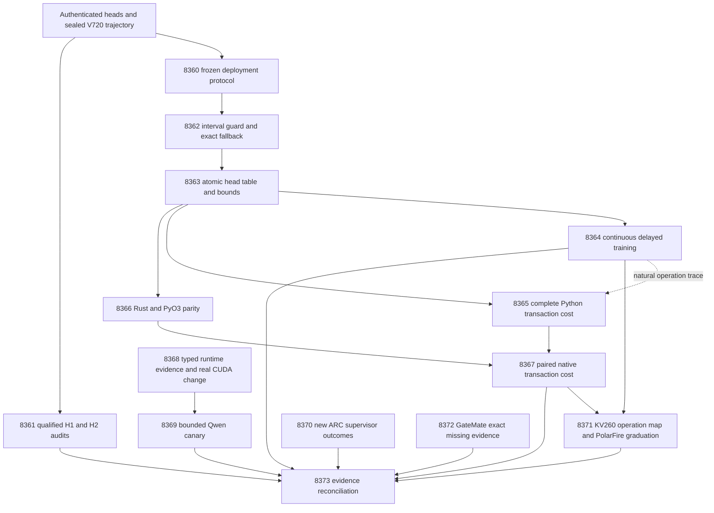

# Carnot Research Roadmap v721: Decision-Preserving Online Table Deployment

**Created:** 2026-10-09  
**Milestone:** 2026.10.721  
**Status:** Planned; not activated  
**Supersedes:** 2026.10.720, Exp8346–Exp8359  
**Informed by:** actual V720 producer artifacts, conductor pre-gate receipts,
V717 frozen methods, PRD FR-05/06/08/11/12 and NFR-01, and the dated V721 scan.

**Activation-refusal correction:** Exp8367 now declares all nine prior failures
matched by the unchanged guard. Each entry records the original verdict,
the changed prerequisite or local transaction scope, and mandatory retirement
on the same verdict. Seven predecessors were pre-gated; two lacked a qualified
fit or current acquisition evidence. Exp8367 retains its qualified local-cost
and native-parity gates. All fourteen IDs, prompts, gates and deliverables stay
as proposed. The full task contract below includes the added lineage.

## What v720 proved

Completion is a scheduling state, not a positive research finding. V720 has
thirteen producer primaries and one pre-gated canary. The completed archive
ends at V719 at planning time; V720 evidence comes from its active task list,
actual artifacts and conductor log. Historical failures remain intact.

| Evidence | Established result | Claim boundary |
|---|---|---|
| Exp8346 | Current contract, frozen heads and static prediction seals qualified. | Administrative custody is not decision benefit. |
| Exp8347 | Local sparse/dense arithmetic and real restart controls qualified. | Constructed reference-oracle correctness. |
| Exp8348 | Delayed local training ran and sealed its trajectory; `trajectory_ready_score=1`. | Its null trajectory result does not substitute for an independently qualified benefit audit. |
| Exp8349 | Constructed finite-capacity tracking/loss study qualified. | No natural learning benefit or inherited OCO regret theorem. |
| Exp8350 | Replayed descriptive H1 gain is -0.00390625 across all128 intended slots. | Reporting line599 was uncovered; audit remains disqualified and flagged. |
| Exp8351 | Replayed descriptive H2 later gain is zero. | Reporting line517 was uncovered; audit remains disqualified and flagged. |
| Exp8352 | Selected65-point int16 linear table uses520 table bytes; measured maximum probability error0.0001468676886899889. | Three threshold-near action flips remain. Bounds, metadata and durable state are additional bytes. Sparse refresh already exists. |
| Exp8353/8354 | Runtime reader failures were recorded; canary was pre-gated. | Two consumer assertions failed on annotation prose interpreted as a path; strict mypy also failed. No new current generation. |
| Exp8355 | ARC reader qualified; no new supervisor outcomes were found. | No cross-game benefit or live solve claim. |
| Exp8356 | CPU arithmetic and table timings qualified; duplicate-repeat validation was later repaired. | Natural/durable cost fields are absent; KV260 has no compatible spline kernel. |
| Exp8357/8358 | Exact missing GateMate source hashes were recorded. | History and branch replay remain blocked; no physical change. |
| Exp8359 | Fourteen dispositions and bounded memory evidence were recorded. | Two branch replays failed; capstone remains disqualified. |

Source: `results/experiment_8346_v720_frozen_input_contract.json` through the
named V720 primaries, including `results/experiment_8354_changed_runtime_canary.json`
(the conductor pre-gate receipt), and `ops/conductor-log.md`.
The complete prior design is preserved at
`openspec/change-proposals/research-roadmap-v720-preserved-20261009.md`.

The new opportunity is narrow and testable: a cheap lookup can approximate a
calibrated head, but approximation is not yet safe at decision thresholds or
qualified as a durable online service. Do not repeat sparse arithmetic,
static fitting, unchanged scheduler sweeps or empty ARC inventories.

## Three largest gaps to the PRD

1. **FR-06/12: useful calibrated decisions beyond reference oracles.** The
   frozen local policy's descriptive results show no benefit. Qualify the two
   exact audit failure paths, retain all denominators, then close or delimit
   this development mechanism. Matching a numerical reference never proves
   semantic truth or broad verifier superiority.
2. **FR-11: deployable continuous learning.** Local updates and causal feedback
   work, but serving a table during updates can expose mixed versions, stale
   error bounds or duplicate feedback after a crash. Train the small selector
   through an atomic service and test complete recovery. This advances Tier1
   learning and Tier2 durable state; it does not claim a new learning gain.
3. **FR-05/08 and NFR-01: measured native deployment cost.** Small CPU arithmetic
   timings omit bindings, fallback, refresh and persistence. Establish parity
   through an actual Rust/PyO3 extension and compare full local transactions.
   Keep LLM acquisition and unsupported FPGA operations explicit.

ARC remains the live hidden-game self-discovery north star. This milestone
can reduce the cost and risk of future small decision services; it does not
install this sentence head in the ARC agent or claim an ARC improvement.
A reserved task inspects only new supervisor outcomes.

## Literature incorporated before design

The V721 entry in `research-references.md` was written before task design.
It records arXiv and all requested secondary-source checks, including limits.

- [KANELÉ v3](https://arxiv.org/html/2512.12850v3) motivates lookup deployment.
  Our added threshold guard and atomic state are adaptations to Carnot.
- [Online KAN v4](https://arxiv.org/html/2602.02056v4) motivates compact-support
  updates. Existing sparse refresh is reused; durable publication is new work.
- [Delayed-capacity OCO](https://arxiv.org/abs/2606.11711) motivates retaining
  feedback-loss semantics. No repeated scheduler sweep or regret claim.
- [OpenHalDet](https://arxiv.org/abs/2606.06959) is a future external-evaluation
  lead. Dataset access, license, overlap and generation costs need a later
  protocol; it is not added to the exposed frozen cohort.
- [Certified neural constraint reasoning](https://arxiv.org/abs/2608.14569)
  supports keeping numerical certification distinct from semantic verification.
- EBT, ARM–EBM equivalence, distributional verification, ETS, Ising decomposition,
  Extropic Z1T/Torx and Kona were checked. They do not justify broadening this
  milestone to foundation-model training, decoding or new hardware purchases.

The Semantic Scholar citation endpoints failed to retrieve. OpenReview's forum
returned a browser challenge. Trending snapshots were weeks old. This is not
an exhaustive citation survey or a claim about current repository rankings.

## Architecture



Arrows indicate input flow. Only the structured gates below suppress a task.
Historical audit or hardware failure cannot disable independent CPU mechanics.
The capstone runs after all terminal dispositions, including skips and absence.

## Phase 1: Freeze methods and finish the utility audits

**Exp8360–Exp8361.** Reuse successful heads, prediction seals and delayed
trajectories. Freeze the new deployment protocol in
`openspec/change-proposals/v721-deployment-protocol.json` during Exp8360.
Do not alter `v717-local-learning-protocol.json`.

Exp8361 targets two known failures, each one uncovered statement. Static audit
line599 rejects a primitive/config mismatch. Learning audit line517 rejects a
recomputed gate/failure mismatch. Exercise real replay with repaired hashes,
preserve all assertions, and qualify the complete old scientific reduction.
Original flagged artifacts stay unchanged. A new qualified null retires only
the frozen development mechanism if its support and action-headroom checks
make the null informative. It does not retire all joint constraint reasoning.

H1 retains128 intended/97 complete sources, mean gain>=.02, positive lower
97.5-percent bound and Brier regression<=.01. H2 retains88 later intended/67
complete sources and the registered block bootstrap. Retention uses windows
0/32/64/96,32 intended/23 usable sources, minimum20 sources with4 per class,
final cost regression<=.02 and Brier regression<=.01. The exact V717 protocol
also governs class support, missing bounds and comparator selection.
All intervals remain descriptive exposed-development results.

## Phase 2: Preserve decisions during online table updates

**Exp8362–Exp8364.** Exp8362 bounds interpolation and quantization error per
cell. Split at knots and include derivative extrema and floating-point error.
A sampled maximum is not an analytic bound. Sum the four local intervals,
retain the exact holistic term and temperature, then transform monotonically
to a probability interval. Use a table action only when the entire interval
lies in one exact decision region. Otherwise run the original direct policy.
Ties still escalate. Bad inputs, saturated values and stale bounds never earn
a fast-path certification.

The guard's safety gates are zero interval escapes and zero action differences
on the frozen panel, plus an independently checked bound derivation. Its
usefulness gate is separate: at least50 percent fast path on the4096 seeded
random vectors. The520-byte prior figure covers table entries only; bound and
transaction storage must be measured. A safe but always-fallback guard is a
valid engineering null, not a reason to weaken the bound.

Exp8363 reuses existing sparse refresh and publishes one immutable version of
coefficients, tables, bounds, cursor and feedback IDs. A single writer and two
readers exercise concurrent version pinning. Four real process-kill barriers
cover writes, fsync, pointer replacement and acknowledgment. Process crashes
are not a power-loss hardware certification. Eventual state must match an
uninterrupted run, with no duplicate update, mixed-version read or stale action.

Exp8364 performs actual continuous small-head training on96 source slots with
feedback delayed by8. Direct, full-rebuild guarded and sparse guarded arms
share the exact optimizer. Gradients always use direct probabilities; table
approximation cannot quietly change the learning algorithm. Keep22 missing
slots, all288 intended arm-slot rows, and every retention shadow. Hard exits
at32/64 test restart. These are deployment-fidelity comparisons on exposed
observations, not a second attempt to claim H2 benefit.

## Phase 3: Measure deployment cost and qualify the live boundary

**Exp8365–Exp8369.** Use one request harness for Python and Rust, with batches
1/8/32 and1/8/64 predictions per update. Separate ordinary, boundary-heavy and
natural workloads. Use one warmup and five distinct paired measured repeats,
alternating arm order. Include validation, bindings/copies, scoring/fallback,
updates, bound refresh, serialization, file/directory fsync and response work.
Keep cold import/build costs separate and amortize only over stated counts.

Exp8366 builds and imports the actual task-owned PyO3 extension. Require
probability/coefficient agreement<=1e-12, identical actions including threshold
neighbors, exact int16 table bytes and valid bound containment. Floating-point
boundary disagreement fails; it is not resolved by widening thresholds.
The initial native implementation shares the Python transaction coordinator,
which isolates numeric/backend changes from storage-policy changes.

Exp8367 evaluates the10x NFR-01 target on the predeclared batch1/eight-predictions-
per-update natural condition. Every paired repeat must reach10x with identical
decisions. All other cells stay visible. This is a local-selector deployment
scope: it excludes model acquisition and cannot establish total LLM-service
speedup. Missing natural evidence means unmeasured, not a borrowed synthetic
claim. Tier1 sub-microsecond and100x hardware targets remain measured questions.

Exp8368 targets a concrete runtime-reader defect: annotation text was treated
as a path, and an indirect sidecar import failed typing. Current source already
contains an annotation exclusion; qualify that change and use typed references
before proposing another patch. A new reader hash is not a CUDA change.
Only authenticated relevant environment change permits a direct context/copy
probe. No resets, driver changes or interference with other workloads.

Exp8369 is the only LLM task. It requires three explicit upstream scores and
rechecks the binding before a single model load. Use mandated
`unsloth/Qwen3.8-27B-GGUF`, Q4_K_M, with four fit-side sources, two evidence
views and at most128 output tokens per call: eight calls maximum. Declare
`model_bounded_generation`,10-second floor. There are no full-generation or
embedding tasks in this milestone. Duration is measured, never padded.
Legacy small models are CPU smoke tests only and supply no headline result.

## Phase 4: Preserve live and hardware obligations and close the evidence

**Exp8370–Exp8373.** Exp8370 uses the qualified ARC reader only beyond its
recorded outcome frontier. No new outcomes means no refinement. With outcomes,
retain per-game/per-arm support and distinguish observational evidence from
causality. No current game or model calls, no new solve claim, no live-policy
change. Imported solve provenance remains explicit.

Exp8371 maps actual measured operations to KV260 capabilities. The existing
Ising overlay with k_max<=5 is not a spline accelerator. Only a new authenticated
compatible kernel and complete transfer protocol allow a bounded SSH device
check. PolarFire retains authenticated board-local Linux CPU graduation; that
is not fabric acceleration. NPU and TSU remain unqualified.

Exp8372 is a cheap read-only GateMate obligation task. Exact source bytes
required by historical replay are unavailable; planning checked reachable
commits without finding matching hashes. Preserve that fact and inspect only
newly supplied evidence. Do not repeat failed recovery or JTAG probes. A dated
physical change, valid IDCODE, n16 flash and sample/hash smoke remain future
conditions. Never synthesize source bytes to match a desired historical hash.

Exp8373 records all fourteen dispositions, reproduces eligible current branches
using their immutable input roots and keeps external missing history separate.
A historical failure can be reproduced without becoming ready evidence. The
capstone computes the unchanged G1–G4 publication gate and narrow continuation
conditions. It never publishes externally or retries unchanged upstream blocks.

## Dependency graph and gate contract

All eleven gates use `== 1` and reference earlier tasks in this roadmap.
Each field appears with the same spelling in its producer's required fields.

| Consumer | Required producer fields |
|---|---|
| Exp8362 | Exp8360.frozen_heads_ready_score |
| Exp8363 | Exp8362.guard_ready_score |
| Exp8364 | Exp8360.frozen_trajectory_ready_score; Exp8363.atomic_table_ready_score |
| Exp8365 | Exp8363.atomic_table_ready_score |
| Exp8366 | Exp8363.atomic_table_ready_score |
| Exp8367 | Exp8365.local_cost_ready_score; Exp8366.native_parity_ready_score |
| Exp8369 | Exp8368.runtime_reader_ready_score; runtime_changed_score; cuda_context_ready_score |

Exp8361,8368,8370,8371,8372 and8373 have no conductor success gates. Missing
natural traces in cost/hardware work block only the natural branch. Gate scores
represent qualified execution, not a scientific positive. This avoids the old
pattern in which an unrelated historical failure suppressed all CPU research.

## Hardware, resources and model requirements

| Resource | Requirement and boundary |
|---|---|
| Host CPU and disk | All scientific-audit and table work; private disk-backed scratch, bounded subprocesses, measured RSS and durable writes. Check quota before work. |
| Rust/PyO3 toolchain | Real task-owned extension and coverage support; missing tools block the native branch. No system-wide install in this plan. |
| CUDA RTX3090 pool | Only the gated bounded canary. Inventory and lease actual available devices;48GB aggregate inventory is not one contiguous device. |
| KV260 | SSH via `kria`; existing authenticated fabric only, k_max<=5. No new synthesis, reflash or purchase is scheduled. |
| GateMate | Read-only missing-evidence/physical obligation until changed evidence arrives. |
| PolarFire | Authenticated Linux CPU dispatch graduation retained; optional future work only. |
| XDNA NPU, Extropic TSU, larger FPGA | Deferred. Paper/vendor estimates cannot substitute for local measurements. |

The wishlist favors using attached equipment. New hardware is not the current
blocker: missing compatible operations and complete service evidence are.
Every task is scoped below the4800-second cap. Flushed progress must keep gaps
below600 seconds; phase-only logging is insufficient for long loops. Every
prompt requires split file writes and bounded tool calls. Native compilation,
benchmarking and private child validation have explicit budget boundaries.

## Acceptance, retirement and validation

Success is qualified answers to the three gaps, including informative nulls.
No semantic or generalization claim follows from arithmetic/control success.
Reference-oracle engineering positives use `circular_positive`; a natural
benefit null uses `null`; external absence uses `blocked`; owned validation
failure uses `disqualified`. `partial` is only unfinished retryable owned work.
Every comparison retains per-unit rows and all intended denominators.

Prior failures name the changed mechanism or exact diagnosed repair. Repeated
identical verdicts retire only the stated failed scope. GateMate and ARC
continuity overrides cite existing standing directives and do not authorize
unchanged expensive probes. Exclusion checks precede activation.

Planning checks schema, full table/JSON/YAML equality, digest, gate spelling/order,
input paths, lineage, substrate declarations and negative authority controls.
Run relevant existing tests/lints/spec coverage and private E2E-018; record global
repository-health failures separately. Future experiments require spec first,
failing tests first,100-percent owned coverage and the E2Es in their prompts.
The active roadmap, conductor and V717 protocol remain hash-identical.

**Decentralization implications:** local open weights, CPU/Rust implementations
and portable snapshots preserve independent operation. No closed-model dependency,
external publication, paid service or generator weight change is introduced.

## Exact task contract

Exactly **14 tasks, Exp8360 through Exp8373**, in the order below. This table and
the complete JSON task objects are the contract for `research-roadmap-next.yaml`.
The full-task digest includes every prompt, gate, model and failure entry.

| Order | ID | Title | Phase | Deliverable |
|---|---|---|---|---|
| 1 | `exp8360-contract-methods` | Bind fourteen tasks and freeze the decision-preserving deployment protocol | 1 | `results/experiment_8360_v721_contract_methods.json` |
| 2 | `exp8361-utility-audit-qualification` | Qualify the two missed utility-audit rejection branches without changing science | 1 | `results/experiment_8361_v721_utility_audit_qualification.json` |
| 3 | `exp8362-threshold-guard` | Bound table interpolation error and preserve direct typed decisions at thresholds | 2 | `results/experiment_8362_v721_threshold_guard.json` |
| 4 | `exp8363-atomic-table-state` | Publish coefficients tables and error bounds as one recoverable version | 2 | `results/experiment_8363_v721_atomic_table_state.json` |
| 5 | `exp8364-continuous-table-learning` | Run causal delayed learning through the guarded table service and exact fallback | 2 | `results/experiment_8364_v721_continuous_table_learning.json` |
| 6 | `exp8365-local-service-cost` | Measure guarded inference refresh and durable commit as one local service | 3 | `results/experiment_8365_v721_local_service_cost.json` |
| 7 | `exp8366-native-table-parity` | Implement the guarded table evaluator and update arithmetic through Rust and PyO3 | 3 | `results/experiment_8366_v721_native_table_parity.json` |
| 8 | `exp8367-native-service-cost` | Compare Python and Rust local transactions including bindings and persistence | 3 | `results/experiment_8367_v721_native_service_cost.json` |
| 9 | `exp8368-typed-runtime-closure` | Qualify typed runtime references without treating annotation prose as paths | 3 | `results/experiment_8368_v721_typed_runtime_closure.json` |
| 10 | `exp8369-changed-runtime-canary` | Run a bounded Qwen canary only after typed runtime and changed CUDA qualification | 3 | `results/experiment_8369_v721_changed_runtime_canary.json` |
| 11 | `exp8370-arc-outcome-delta` | Read only new live supervisor outcomes for cross-game generalization | 4 | `results/experiment_8370_v721_arc_outcome_delta.json` |
| 12 | `exp8371-hardware-operation-boundary` | Map measured local transactions to KV260 operations and preserve PolarFire graduation | 4 | `results/experiment_8371_v721_hardware_operation_boundary.json` |
| 13 | `exp8372-gatemate-missing-evidence` | Carry exact missing GateMate source bytes and the physical reopening obligation | 4 | `results/experiment_8372_v721_gatemate_missing_evidence.json` |
| 14 | `exp8373-capstone` | Reconcile fourteen outcomes and decide utility and deployment continuation | 4 | `results/experiment_8373_v721_capstone.json` |

Canonical full-task SHA-256: `1aad6d956e5239e2466fb4f3eac2f0231dcf53cd02c592a633d5068dd5bd9ec0`

<!-- V721_TASK_CONTRACT_START -->
```json
{
  "milestone": "2026.10.721",
  "tasks": [
    {
      "id": "exp8360-contract-methods",
      "title": "Bind fourteen tasks and freeze the decision-preserving deployment protocol",
      "phase": 1,
      "track": "infrastructure",
      "priority": "high",
      "requires_gpu": false,
      "max_turns": 100,
      "estimated_wall_time_min": 45,
      "per_unit_rows": true,
      "milestone": "2026.10.721",
      "deliverable": "results/experiment_8360_v721_contract_methods.json",
      "inference_substrate_class": "no_model_load",
      "MODEL_SPECS": [],
      "gated_on": [],
      "prior_failures": [
        {
          "experiment_id": "exp8318-contract-replay",
          "verdict": "complete_disqualified_contract_replay",
          "addressed_by": "Reuse qualified Exp8346 direct-input custody; new contract freezes deployment fidelity rather than repeating failed history replay.",
          "retire_if_same_verdict": true
        }
      ],
      "model": "opus",
      "prompt": "CONTEXT:\nWork in {project_root} on {date}. V720 completed thirteen producer tasks and one pre-gated canary. Exp8347 qualified local arithmetic and recovery; Exp8348 sealed a real delayed-learning trajectory. Exp8350/8351 each missed one replay rejection statement and remain disqualified; descriptive H1 gain is -0.00390625 and H2 gain is zero. Exp8352 qualified tables but its selected 65-int16-linear candidate flips three boundary actions. Exp8356 qualifies CPU arithmetic only. Runtime readers, GateMate history and final replay still fail. Preserve all original outcomes and V717 protocol bytes. Cached observations are exposed development, not current LLM inference.\nEXISTING CODE TO READ FIRST:\nCLAUDE.md; CODEX.md; ops/e2e-test-plan.md; ops/exclusion_manifest.yaml; openspec/capabilities/research-reporting/spec.md; openspec/capabilities/verification/spec.md; scripts/experiment_template.py; python/carnot/reporting/primary_publication.py; openspec/change-proposals/research-roadmap-vNEXT.md; openspec/change-proposals/research-roadmap-v720-preserved-20261009.md; openspec/change-proposals/v717-local-learning-protocol.json; python/carnot/reporting/roadmap_contract.py; python/carnot/reporting/v685_authority_lifecycle.py; research-references.md; research-studying.md; results/experiment_8346_v720_frozen_input_contract.json; results/experiment_8347_v720_local_consumer_qualification.json; results/experiment_8348_v720_continuous_local_learning.json; results/experiment_8352_v720_spline_table_fidelity.json; results/experiment_8356_v720_kv260_workload_cost.json; results/experiment_8359_v720_capstone.json\nTASK:\nBind fourteen tasks and freeze the decision-preserving deployment protocol. Deliver results/experiment_8360_v721_contract_methods.json. Create thin runner scripts/experiments/experiment_8360_v721_contract_methods.py; keep primitive evidence in results/raw/experiment_8360_v721_contract_methods/. Future task outputs are dependencies, not pre-existing files.\nCONCRETE STEPS:\n1. PRECONDITIONS: Emit a flushed start line. Authenticate authority, input hashes and terminal sidecars. Check private scratch, required tools and bounded resources. Record missing external inputs in gate_check_summary. Never replace natural evidence with fixtures.\n2. Emit a flushed progress line at every phase boundary and before and after each model load, generation, benchmark and subprocess. Emit completed/pending counts inside long loops; poll owned children at least every 60 seconds. Keep every silence gap below 600 seconds. Use unbuffered output and per-child deadlines inside a 4800-second task cap. Write any file over about 200 lines in several tool calls of at most about 150 lines, with a progress message between calls. Do not make one huge tool call or pad elapsed time.\n3. Spec first: add relevant REQ-* and SCENARIO-* before implementation. Write focused failing tests first. Preserve existing assertions, guard thresholds and historical artifacts. Use small adapters to existing modules. Keep throwaway probes in /tmp and experiment runners in scripts/experiments/. Do not modify research-roadmap.yaml. Freeze the validation command manifest before measurement.\n4. Declare no_model_load, MODEL_SPECS=[] and zero current LLM calls. Use aggregation_from_upstream_artifacts for readers, or verifier_ensemble_against_cached_candidates for numeric cached-head work. Small numeric training is not an LLM load. Bind imported model provenance separately.\n5. Compare all fourteen visible task rows, full JSON objects and staged YAML, including prompt and lineage hashes. Bind activated authority only after activation. Preserve V720 snapshots; do not activate a roadmap. Authenticate successful Exp8334 heads, Exp8335 seals, Exp8347 kernel and Exp8348 trajectory directly. Separate head, trajectory and contract readiness; unrelated historical failures cannot gate valid inputs.\n6. Ingest the dated V721 scan before implementation. Read full KANELE 2512.12850v3 and online KAN 2602.02056v4 methods. Record assumptions, versions, URLs, hashes and adoption/defer decisions in docs/research-notes/v721-method-ingestion.md and research-studying.md. OpenHalDet is a deferred external-evaluation lead; no new dataset, generator training or new scheduler sweep.\n7. Write openspec/change-proposals/v721-deployment-protocol.json. Freeze the existing 34-coefficient spline head, temperature, knots, actions p<.25 accept/p>.75 reject/otherwise escalate, and 65-point signed-int16 table with 11 fractional bits. Freeze direct float64 reference and exactly equivalent sigmoid control. Keep V717 H1/H2, data roles and thresholds immutable; both targets are already exposed.\n8. Freeze 4096 seeded label-free vectors plus every knot and both action boundaries, with nextafter neighbors. Freeze seeds11/22/33 for constructed update/fault panels, natural stream96 including22 missing slots, retention windows0/32/64/96, and later-source67 support. Freeze batches1/8/32, predictions per update1/8/64, one warmup plus five paired repeats; timings are descriptive.\n9. Freeze complete transaction scope: input validation, direct or guarded scoring, delayed feedback, coefficient update, table/bound refresh, serialization, durable commit and response. Local service excludes LLM acquisition explicitly. Freeze primary engineering gates: zero unsafe interval escapes, zero action disagreements, exact same-version state, zero stale/mixed reads and exact crash resume. Speed is measured, never a readiness prerequisite.\n10. Run private E2E-018 matching, mutation, deletion and reorder controls. Seal execution/input manifests before any new measurements. Record all thirteen V720 primaries and the pre-gate receipt, preserving disqualified audit outcomes.\n11. Run relevant unit and consumer tests, scoped Ruff check/format, strict mypy and scripts/check_spec_coverage.py --files <owned-test-files>. Require 100 percent newly owned statements including CLI, real children and failure branches. Use pytest -n 0 -o addopts= with private disk-backed scratch. Record argv, exits, timings and log hashes. Run the applicable private E2E checks named above; do not run the full repository suite inside this experiment.\n12. Cold-replay primitive evidence in a fresh process. Run valid, negative and self-consistently rehashed tamper controls. Use unchanged primary_publication checks, scripts/adversarial_verify.py --json <private-candidate> and scripts/verdict_row_consistency_lint.py --strict <private-candidate>. Keep every finding. Only the existing typed finding consumer may resolve independently recomputed informational findings with deliberate-error controls; unknown, warning and critical findings block readiness. Do not edit validators or exemptions. Publish a terminal primary atomically after checks. Owned failures are disqualified; unchanged external blocks are blocked, never partial. Reconcile openspec/, _bmad/traceability.md, ops/status.md and ops/changelog.md. No generator weight updates or external publication.\nREQUIRED ARTIFACT FIELDS:\nexperiment_id, task_id, milestone, run_date: principle: Bind this invocation to exact task authority.\nhonest_verdict, verdict_class: principle: Use a complete_ terminal prefix. Class is positive | circular_positive | null | blocked | disqualified | partial. Partial means unfinished retryable owned work only.\ngate_check_summary: principle: Every block names upstream, path/hash, field, operator, expected and observed values; missing differs from zero, including every blocked_* verdict.\ninference_substrate, inference_substrate_class, MODEL_SPECS, model_invocation_counts, historical_model_provenance: principle: Distinguish current model calls from imported observations.\nrows, intended_count, completed_count, failed_count, censored_count, excluded_count, independent_count, sample_size_budget: principle: Keep metrics for every intended unit and arm. Repeated timing rows are not independent examples.\nverifier_is_oracle, exposure_scope, independent_generalization_score, generalized_learning_benefit_score: principle: Reference-oracle positives use circular_positive. Both generalization scores stay zero on exposed or constructed data.\nrequired_checks_passed, flagged_adversarial, acceptance_gates, validation_receipts, terminal_validation_sidecar_path, adversarial_findings: principle: Qualification and scientific benefit are separate.\npreconditions_checked, duration_s, phase_spans, random_seed, reproducibility_checksum, source_artifact_hashes, code_config_hashes, raw_shard_hashes: principle: Bind every claim to replayable measured evidence.\ncited_upstream_artifacts, field_principles: principle: Identify imported fields and hashes; explain each added artifact field.\ncurrent_contract_ready_score, frozen_heads_ready_score, frozen_trajectory_ready_score, canonical_tasks_sha256: principle: Qualify authority and reusable inputs separately.\nprotocol_path, protocol_sha256, methods_manifest, execution_manifest, historical_dispositions: principle: Freeze adaptations before measurement; do not rewrite V717 science.\nRun command: cd {project_root} && PYTHONPATH=python:. PYTHONUNBUFFERED=1 .venv/bin/python -u scripts/experiments/experiment_8360_v721_contract_methods.py --date {date}\nDo NOT push. Do NOT modify scripts/research_conductor.py."
    },
    {
      "id": "exp8361-utility-audit-qualification",
      "title": "Qualify the two missed utility-audit rejection branches without changing science",
      "phase": 1,
      "track": "infrastructure",
      "priority": "high",
      "requires_gpu": false,
      "max_turns": 50,
      "estimated_wall_time_min": 60,
      "per_unit_rows": true,
      "milestone": "2026.10.721",
      "deliverable": "results/experiment_8361_v721_utility_audit_qualification.json",
      "inference_substrate_class": "no_model_load",
      "MODEL_SPECS": [],
      "gated_on": [],
      "prior_failures": [
        {
          "experiment_id": "exp8350-static-benefit-audit",
          "verdict": "complete_disqualified_owned_validation",
          "addressed_by": "Exercise the exact primitive/config mismatch rejection at line599 with rehashed evidence; keep scientific operands unchanged.",
          "retire_if_same_verdict": true
        },
        {
          "experiment_id": "exp8351-learning-retention-audit",
          "verdict": "complete_disqualified_owned_validation",
          "addressed_by": "Exercise the exact recomputed gate/failure mismatch at line517; retain all windows and original coverage threshold.",
          "retire_if_same_verdict": true
        }
      ],
      "prompt": "CONTEXT:\nWork in {project_root} on {date}. V720 completed thirteen producer tasks and one pre-gated canary. Exp8347 qualified local arithmetic and recovery; Exp8348 sealed a real delayed-learning trajectory. Exp8350/8351 each missed one replay rejection statement and remain disqualified; descriptive H1 gain is -0.00390625 and H2 gain is zero. Exp8352 qualified tables but its selected 65-int16-linear candidate flips three boundary actions. Exp8356 qualifies CPU arithmetic only. Runtime readers, GateMate history and final replay still fail. Preserve all original outcomes and V717 protocol bytes. Cached observations are exposed development, not current LLM inference.\nEXISTING CODE TO READ FIRST:\nCLAUDE.md; CODEX.md; ops/e2e-test-plan.md; ops/exclusion_manifest.yaml; openspec/capabilities/research-reporting/spec.md; openspec/capabilities/verification/spec.md; scripts/experiment_template.py; python/carnot/reporting/primary_publication.py; openspec/change-proposals/research-roadmap-vNEXT.md; openspec/change-proposals/research-roadmap-v720-preserved-20261009.md; openspec/change-proposals/v717-local-learning-protocol.json; python/carnot/reporting/static_benefit_audit_8350.py; python/carnot/verify/static_benefit_audit_8350.py; tests/python/test_static_benefit_audit_8350.py; python/carnot/reporting/learning_retention_audit_8351.py; python/carnot/verify/learning_retention_audit_8351.py; tests/python/test_learning_retention_audit_8351.py; results/experiment_8350_v720_static_benefit_audit.json; results/experiment_8351_v720_learning_retention_audit.json; results/experiment_8348_v720_continuous_local_learning.json\nTASK:\nQualify the two missed utility-audit rejection branches without changing science. Deliver results/experiment_8361_v721_utility_audit_qualification.json. Create thin runner scripts/experiments/experiment_8361_v721_utility_audit_qualification.py; keep primitive evidence in results/raw/experiment_8361_v721_utility_audit_qualification/. Future task outputs are dependencies, not pre-existing files.\nCONCRETE STEPS:\n1. PRECONDITIONS: Emit a flushed start line. Authenticate authority, input hashes and terminal sidecars. Check private scratch, required tools and bounded resources. Record missing external inputs in gate_check_summary. Never replace natural evidence with fixtures.\n2. Emit a flushed progress line at every phase boundary and before and after each model load, generation, benchmark and subprocess. Emit completed/pending counts inside long loops; poll owned children at least every 60 seconds. Keep every silence gap below 600 seconds. Use unbuffered output and per-child deadlines inside a 4800-second task cap. Write any file over about 200 lines in several tool calls of at most about 150 lines, with a progress message between calls. Do not make one huge tool call or pad elapsed time.\n3. Spec first: add relevant REQ-* and SCENARIO-* before implementation. Write focused failing tests first. Preserve existing assertions, guard thresholds and historical artifacts. Use small adapters to existing modules. Keep throwaway probes in /tmp and experiment runners in scripts/experiments/. Do not modify research-roadmap.yaml. Freeze the validation command manifest before measurement.\n4. Declare no_model_load, MODEL_SPECS=[] and zero current LLM calls. Use aggregation_from_upstream_artifacts for readers, or verifier_ensemble_against_cached_candidates for numeric cached-head work. Small numeric training is not an LLM load. Bind imported model provenance separately.\n5. Reproduce the exact misses before edits: reporting/static_benefit_audit_8350.py line599 rejects drift between primitive rows/config and work; reporting/learning_retention_audit_8351.py line517 rejects recomputed gate/failure mismatch. Each prior coverage report missed one statement. Add private real-replay tests that reach those branches using self-consistently rehashed evidence. Preserve all existing assertions and 100-percent thresholds.\n6. Authenticate immutable producer authority and operands; never swap research-roadmap.yaml. Cover real CLI/child code and both rejection statements. Recompute H1 and H2 from original sealed predictions/targets and Exp8348 trajectories. Do not refit, retune, reseal predictions, relabel missing slots or rerun generation. Keep each prior flagged primary intact; this new artifact reports a separate qualification.\n7. Keep all128 H1 slots,97 complete sources,88 later intended slots with67 complete sources, and every retention window0/32/64/96 with32 intended/23 usable sources. Preserve H1 gain>=.02, lower97.5%>0 and Brier regression<=.01; preserve H2 gain>=.02, positive lower bound and retention cost<=.02/Brier<=.01. No changed comparator, support gate or correction budget.\n8. Use independently reconstructed row reductions, all-intended and complete-case summaries, class support, action headroom and budget-reachability checks. The prior diagnostics show H1 -0.00390625 and H2 zero; verify, do not copy. An informative qualified null closes only this frozen development mechanism. Uninformative or unreachable-action nulls retain their narrower boundary.\n9. Run private E2E-018 and E2E-021 with explicit frozen historical inputs. Emit static_audit_ready_score and learning_audit_ready_score separately from h1_development_signal_score and h2_development_signal_score. Write docs/research-notes/v721-qualified-utility-audits.md. Downstream deployment may proceed on arithmetic qualification regardless of a utility null.\n10. Run relevant unit and consumer tests, scoped Ruff check/format, strict mypy and scripts/check_spec_coverage.py --files <owned-test-files>. Require 100 percent newly owned statements including CLI, real children and failure branches. Use pytest -n 0 -o addopts= with private disk-backed scratch. Record argv, exits, timings and log hashes. Run the applicable private E2E checks named above; do not run the full repository suite inside this experiment.\n11. Cold-replay primitive evidence in a fresh process. Run valid, negative and self-consistently rehashed tamper controls. Use unchanged primary_publication checks, scripts/adversarial_verify.py --json <private-candidate> and scripts/verdict_row_consistency_lint.py --strict <private-candidate>. Keep every finding. Only the existing typed finding consumer may resolve independently recomputed informational findings with deliberate-error controls; unknown, warning and critical findings block readiness. Do not edit validators or exemptions. Publish a terminal primary atomically after checks. Owned failures are disqualified; unchanged external blocks are blocked, never partial. Reconcile openspec/, _bmad/traceability.md, ops/status.md and ops/changelog.md. No generator weight updates or external publication.\nREQUIRED ARTIFACT FIELDS:\nexperiment_id, task_id, milestone, run_date: principle: Bind this invocation to exact task authority.\nhonest_verdict, verdict_class: principle: Use a complete_ terminal prefix. Class is positive | circular_positive | null | blocked | disqualified | partial. Partial means unfinished retryable owned work only.\ngate_check_summary: principle: Every block names upstream, path/hash, field, operator, expected and observed values; missing differs from zero, including every blocked_* verdict.\ninference_substrate, inference_substrate_class, MODEL_SPECS, model_invocation_counts, historical_model_provenance: principle: Distinguish current model calls from imported observations.\nrows, intended_count, completed_count, failed_count, censored_count, excluded_count, independent_count, sample_size_budget: principle: Keep metrics for every intended unit and arm. Repeated timing rows are not independent examples.\nverifier_is_oracle, exposure_scope, independent_generalization_score, generalized_learning_benefit_score: principle: Reference-oracle positives use circular_positive. Both generalization scores stay zero on exposed or constructed data.\nrequired_checks_passed, flagged_adversarial, acceptance_gates, validation_receipts, terminal_validation_sidecar_path, adversarial_findings: principle: Qualification and scientific benefit are separate.\npreconditions_checked, duration_s, phase_spans, random_seed, reproducibility_checksum, source_artifact_hashes, code_config_hashes, raw_shard_hashes: principle: Bind every claim to replayable measured evidence.\ncited_upstream_artifacts, field_principles: principle: Identify imported fields and hashes; explain each added artifact field.\nstatic_audit_ready_score, learning_audit_ready_score, h1_development_signal_score, h2_development_signal_score: principle: Complete audit execution differs from a benefit result.\nH1, H2, retention_windows, source_support, missing_bounds, action_headroom, budget_reachability, qualified_scope_decision: principle: Preserve the entire frozen protocol and delimit what an informative null retires.\nRun command: cd {project_root} && PYTHONPATH=python:. PYTHONUNBUFFERED=1 .venv/bin/python -u scripts/experiments/experiment_8361_v721_utility_audit_qualification.py --date {date}\nDo NOT push. Do NOT modify scripts/research_conductor.py."
    },
    {
      "id": "exp8362-threshold-guard",
      "title": "Bound table interpolation error and preserve direct typed decisions at thresholds",
      "phase": 2,
      "track": "verification",
      "priority": "high",
      "requires_gpu": false,
      "max_turns": 50,
      "estimated_wall_time_min": 60,
      "per_unit_rows": true,
      "milestone": "2026.10.721",
      "deliverable": "results/experiment_8362_v721_threshold_guard.json",
      "inference_substrate_class": "no_model_load",
      "MODEL_SPECS": [],
      "gated_on": [
        {
          "upstream": "exp8360-contract-methods",
          "artifact_field": "frozen_heads_ready_score",
          "op": "==",
          "value": 1
        }
      ],
      "model": "gpt-6.1-sol",
      "agent_type": "codex",
      "prompt": "CONTEXT:\nWork in {project_root} on {date}. V720 completed thirteen producer tasks and one pre-gated canary. Exp8347 qualified local arithmetic and recovery; Exp8348 sealed a real delayed-learning trajectory. Exp8350/8351 each missed one replay rejection statement and remain disqualified; descriptive H1 gain is -0.00390625 and H2 gain is zero. Exp8352 qualified tables but its selected 65-int16-linear candidate flips three boundary actions. Exp8356 qualifies CPU arithmetic only. Runtime readers, GateMate history and final replay still fail. Preserve all original outcomes and V717 protocol bytes. Cached observations are exposed development, not current LLM inference.\nEXISTING CODE TO READ FIRST:\nCLAUDE.md; CODEX.md; ops/e2e-test-plan.md; ops/exclusion_manifest.yaml; openspec/capabilities/research-reporting/spec.md; openspec/capabilities/verification/spec.md; scripts/experiment_template.py; python/carnot/reporting/primary_publication.py; openspec/change-proposals/research-roadmap-vNEXT.md; openspec/change-proposals/research-roadmap-v720-preserved-20261009.md; openspec/change-proposals/v717-local-learning-protocol.json; python/carnot/verify/spline_table_fidelity_8352.py; python/carnot/verify/local_update_isolation_8306.py; tests/python/test_spline_table_fidelity_8352.py; results/experiment_8352_v720_spline_table_fidelity.json\nTASK:\nBound table interpolation error and preserve direct typed decisions at thresholds. Deliver results/experiment_8362_v721_threshold_guard.json. Create thin runner scripts/experiments/experiment_8362_v721_threshold_guard.py; keep primitive evidence in results/raw/experiment_8362_v721_threshold_guard/. Future task outputs are dependencies, not pre-existing files.\nCONCRETE STEPS:\n1. PRECONDITIONS: Emit a flushed start line. Authenticate authority, input hashes and terminal sidecars. Check private scratch, required tools and bounded resources. Record missing external inputs in gate_check_summary. Never replace natural evidence with fixtures.\n2. Emit a flushed progress line at every phase boundary and before and after each model load, generation, benchmark and subprocess. Emit completed/pending counts inside long loops; poll owned children at least every 60 seconds. Keep every silence gap below 600 seconds. Use unbuffered output and per-child deadlines inside a 4800-second task cap. Write any file over about 200 lines in several tool calls of at most about 150 lines, with a progress message between calls. Do not make one huge tool call or pad elapsed time.\n3. Spec first: add relevant REQ-* and SCENARIO-* before implementation. Write focused failing tests first. Preserve existing assertions, guard thresholds and historical artifacts. Use small adapters to existing modules. Keep throwaway probes in /tmp and experiment runners in scripts/experiments/. Do not modify research-roadmap.yaml. Freeze the validation command manifest before measurement.\n4. Declare no_model_load, MODEL_SPECS=[] and zero current LLM calls. Use aggregation_from_upstream_artifacts for readers, or verifier_ensemble_against_cached_candidates for numeric cached-head work. Small numeric training is not an LLM load. Bind imported model provenance separately.\n5. Reuse the selected65-int16-linear table and existing sparse refresh. Its520-byte table passed the .001 probability tolerance yet flipped three boundary actions. Reproduce those flips as a positive control. The new question is exact typed-action preservation, not a looser average-error rerun. Keep training and thresholds unchanged.\n6. Derive conservative per-cell local logit error bounds: split cells at spline knots; include the linear-interpolation h^2*sup(abs(second derivative))/8 term, signed-int16 rounding and outward float64 rounding. Validate derivative extrema independently with SciPy piecewise polynomials. Sum four local intervals and include unchanged holistic/intercept/temperature arithmetic. Never use observed test max-error as a universal bound.\n7. Produce a probability interval by monotone sigmoid. Return a table action only when the entire interval lies in one of the exact reference action regions, respecting strict threshold ties. Otherwise evaluate the original direct float64 policy and return that action. Nonfinite features, invalid temperature, overflow, saturation, missing bounds or stale version must trigger explicit rejection or direct fallback, never an uncertified fast result. Claims are relative to the direct numerical policy, not language truth.\n8. Run the frozen4096 vectors, knots, thresholds and nextafter neighbors plus deliberate underbound, swapped-table and saturated-table controls. Report every vector, interval, direct/table/guarded action and fallback reason. Require zero observed interval escapes and zero guarded-action differences. Prove the mathematical bound separately from sampled validation; if the proof assumptions cannot be met, report an empirical guard only and guard_ready_score=0.\n9. Set guard_ready_score=1 only after arithmetic proof, independent reference, typed invalid-input tests and all required checks. Report fast_path_fraction and guard_useful_score separately; useful means at least50 percent fast path on the frozen random panel, never a safety relaxation. Run private E2E-018 publication/reader controls. Add docs/research-notes/v721-threshold-error-bound.md.\n10. Run relevant unit and consumer tests, scoped Ruff check/format, strict mypy and scripts/check_spec_coverage.py --files <owned-test-files>. Require 100 percent newly owned statements including CLI, real children and failure branches. Use pytest -n 0 -o addopts= with private disk-backed scratch. Record argv, exits, timings and log hashes. Run the applicable private E2E checks named above; do not run the full repository suite inside this experiment.\n11. Cold-replay primitive evidence in a fresh process. Run valid, negative and self-consistently rehashed tamper controls. Use unchanged primary_publication checks, scripts/adversarial_verify.py --json <private-candidate> and scripts/verdict_row_consistency_lint.py --strict <private-candidate>. Keep every finding. Only the existing typed finding consumer may resolve independently recomputed informational findings with deliberate-error controls; unknown, warning and critical findings block readiness. Do not edit validators or exemptions. Publish a terminal primary atomically after checks. Owned failures are disqualified; unchanged external blocks are blocked, never partial. Reconcile openspec/, _bmad/traceability.md, ops/status.md and ops/changelog.md. No generator weight updates or external publication.\nREQUIRED ARTIFACT FIELDS:\nexperiment_id, task_id, milestone, run_date: principle: Bind this invocation to exact task authority.\nhonest_verdict, verdict_class: principle: Use a complete_ terminal prefix. Class is positive | circular_positive | null | blocked | disqualified | partial. Partial means unfinished retryable owned work only.\ngate_check_summary: principle: Every block names upstream, path/hash, field, operator, expected and observed values; missing differs from zero, including every blocked_* verdict.\ninference_substrate, inference_substrate_class, MODEL_SPECS, model_invocation_counts, historical_model_provenance: principle: Distinguish current model calls from imported observations.\nrows, intended_count, completed_count, failed_count, censored_count, excluded_count, independent_count, sample_size_budget: principle: Keep metrics for every intended unit and arm. Repeated timing rows are not independent examples.\nverifier_is_oracle, exposure_scope, independent_generalization_score, generalized_learning_benefit_score: principle: Reference-oracle positives use circular_positive. Both generalization scores stay zero on exposed or constructed data.\nrequired_checks_passed, flagged_adversarial, acceptance_gates, validation_receipts, terminal_validation_sidecar_path, adversarial_findings: principle: Qualification and scientific benefit are separate.\npreconditions_checked, duration_s, phase_spans, random_seed, reproducibility_checksum, source_artifact_hashes, code_config_hashes, raw_shard_hashes: principle: Bind every claim to replayable measured evidence.\ncited_upstream_artifacts, field_principles: principle: Identify imported fields and hashes; explain each added artifact field.\nguard_ready_score, guard_useful_score, interval_escape_count, guarded_action_mismatch_count: principle: Safety qualification is independent of fast-path usefulness.\nbound_derivation, assumptions, per_vector_rows, fallback_counts, fast_path_fraction, probability_error_max: principle: Distinguish analytic bounds from sampled error and expose boundary cases.\nRun command: cd {project_root} && PYTHONPATH=python:. PYTHONUNBUFFERED=1 .venv/bin/python -u scripts/experiments/experiment_8362_v721_threshold_guard.py --date {date}\nDo NOT push. Do NOT modify scripts/research_conductor.py."
    },
    {
      "id": "exp8363-atomic-table-state",
      "title": "Publish coefficients tables and error bounds as one recoverable version",
      "phase": 2,
      "track": "self_learning",
      "priority": "high",
      "requires_gpu": false,
      "max_turns": 50,
      "estimated_wall_time_min": 65,
      "per_unit_rows": true,
      "milestone": "2026.10.721",
      "deliverable": "results/experiment_8363_v721_atomic_table_state.json",
      "inference_substrate_class": "no_model_load",
      "MODEL_SPECS": [],
      "gated_on": [
        {
          "upstream": "exp8362-threshold-guard",
          "artifact_field": "guard_ready_score",
          "op": "==",
          "value": 1
        }
      ],
      "prompt": "CONTEXT:\nWork in {project_root} on {date}. V720 completed thirteen producer tasks and one pre-gated canary. Exp8347 qualified local arithmetic and recovery; Exp8348 sealed a real delayed-learning trajectory. Exp8350/8351 each missed one replay rejection statement and remain disqualified; descriptive H1 gain is -0.00390625 and H2 gain is zero. Exp8352 qualified tables but its selected 65-int16-linear candidate flips three boundary actions. Exp8356 qualifies CPU arithmetic only. Runtime readers, GateMate history and final replay still fail. Preserve all original outcomes and V717 protocol bytes. Cached observations are exposed development, not current LLM inference.\nEXISTING CODE TO READ FIRST:\nCLAUDE.md; CODEX.md; ops/e2e-test-plan.md; ops/exclusion_manifest.yaml; openspec/capabilities/research-reporting/spec.md; openspec/capabilities/verification/spec.md; scripts/experiment_template.py; python/carnot/reporting/primary_publication.py; openspec/change-proposals/research-roadmap-vNEXT.md; openspec/change-proposals/research-roadmap-v720-preserved-20261009.md; openspec/change-proposals/v717-local-learning-protocol.json; python/carnot/verify/spline_table_fidelity_8352.py; python/carnot/verify/continuous_local_learning_8348.py; python/carnot/reporting/current_work_receipt.py; python/carnot/verify/hard_exit_learning_qualification_8206.py; tests/python/test_hard_exit_learning_qualification_8206.py; results/experiment_8347_v720_local_consumer_qualification.json; results/experiment_8352_v720_spline_table_fidelity.json\nTASK:\nPublish coefficients tables and error bounds as one recoverable version. Deliver results/experiment_8363_v721_atomic_table_state.json. Create thin runner scripts/experiments/experiment_8363_v721_atomic_table_state.py; keep primitive evidence in results/raw/experiment_8363_v721_atomic_table_state/. Future task outputs are dependencies, not pre-existing files.\nCONCRETE STEPS:\n1. PRECONDITIONS: Emit a flushed start line. Authenticate authority, input hashes and terminal sidecars. Check private scratch, required tools and bounded resources. Record missing external inputs in gate_check_summary. Never replace natural evidence with fixtures.\n2. Emit a flushed progress line at every phase boundary and before and after each model load, generation, benchmark and subprocess. Emit completed/pending counts inside long loops; poll owned children at least every 60 seconds. Keep every silence gap below 600 seconds. Use unbuffered output and per-child deadlines inside a 4800-second task cap. Write any file over about 200 lines in several tool calls of at most about 150 lines, with a progress message between calls. Do not make one huge tool call or pad elapsed time.\n3. Spec first: add relevant REQ-* and SCENARIO-* before implementation. Write focused failing tests first. Preserve existing assertions, guard thresholds and historical artifacts. Use small adapters to existing modules. Keep throwaway probes in /tmp and experiment runners in scripts/experiments/. Do not modify research-roadmap.yaml. Freeze the validation command manifest before measurement.\n4. Declare no_model_load, MODEL_SPECS=[] and zero current LLM calls. Use aggregation_from_upstream_artifacts for readers, or verifier_ensemble_against_cached_candidates for numeric cached-head work. Small numeric training is not an LLM load. Bind imported model provenance separately.\n5. Reuse Exp8352.refresh: it already recomputes changed support entries and compares against full rebuild. Do not claim sparse refresh as new. Add a versioned immutable state containing coefficients, temperature, knots, quantization, complete table, per-cell bounds, pending feedback IDs, stream cursor and a checksum. Write a new snapshot, fsync file, atomically publish its manifest pointer, then fsync its directory. Acknowledge only the durable version.\n6. Run one writer and two owned readers. Each reader pins one committed version for an entire request. Recompute dirty bounds whenever affected coefficients change. Unaffected bytes remain identical. On corruption or missing state refuse the candidate and preserve the last authenticated version. Never mix a new head with an old table or bound. Reuse direct fallback from Exp8362.\n7. Build a deterministic192-update constructed panel:64 events each for seeds11/22/33, with fixed delays8 and predeclared boundary/ordinary inputs. Compare direct state, full rebuild and incremental publication. Include skipped-dirty-entry, stale-bound, duplicate-feedback and invalid-version controls. Record coefficient/table/bound bytes touched and actual write amplification.\n8. Kill real owned children at four barriers: after snapshot write before fsync; after snapshot fsync before pointer publish; after pointer replacement before directory fsync; after durable commit before acknowledgment. The test coordinates barriers without relying on sleep. On restart require an intact old or new version as permitted by the recorded commit boundary, exactly-once feedback and the same eventual state as uninterrupted execution. Process-kill evidence is not power-loss hardware certification.\n9. Run private E2E-020/021 and the real CLI with explicit immutable historical fixtures. Set atomic_table_ready_score=1 only for zero mixed-version reads, zero stale served decisions, exact eventual state and all checks. Write docs/research-notes/v721-atomic-table-state.md; leave the production API default unchanged.\n10. Run relevant unit and consumer tests, scoped Ruff check/format, strict mypy and scripts/check_spec_coverage.py --files <owned-test-files>. Require 100 percent newly owned statements including CLI, real children and failure branches. Use pytest -n 0 -o addopts= with private disk-backed scratch. Record argv, exits, timings and log hashes. Run the applicable private E2E checks named above; do not run the full repository suite inside this experiment.\n11. Cold-replay primitive evidence in a fresh process. Run valid, negative and self-consistently rehashed tamper controls. Use unchanged primary_publication checks, scripts/adversarial_verify.py --json <private-candidate> and scripts/verdict_row_consistency_lint.py --strict <private-candidate>. Keep every finding. Only the existing typed finding consumer may resolve independently recomputed informational findings with deliberate-error controls; unknown, warning and critical findings block readiness. Do not edit validators or exemptions. Publish a terminal primary atomically after checks. Owned failures are disqualified; unchanged external blocks are blocked, never partial. Reconcile openspec/, _bmad/traceability.md, ops/status.md and ops/changelog.md. No generator weight updates or external publication.\nREQUIRED ARTIFACT FIELDS:\nexperiment_id, task_id, milestone, run_date: principle: Bind this invocation to exact task authority.\nhonest_verdict, verdict_class: principle: Use a complete_ terminal prefix. Class is positive | circular_positive | null | blocked | disqualified | partial. Partial means unfinished retryable owned work only.\ngate_check_summary: principle: Every block names upstream, path/hash, field, operator, expected and observed values; missing differs from zero, including every blocked_* verdict.\ninference_substrate, inference_substrate_class, MODEL_SPECS, model_invocation_counts, historical_model_provenance: principle: Distinguish current model calls from imported observations.\nrows, intended_count, completed_count, failed_count, censored_count, excluded_count, independent_count, sample_size_budget: principle: Keep metrics for every intended unit and arm. Repeated timing rows are not independent examples.\nverifier_is_oracle, exposure_scope, independent_generalization_score, generalized_learning_benefit_score: principle: Reference-oracle positives use circular_positive. Both generalization scores stay zero on exposed or constructed data.\nrequired_checks_passed, flagged_adversarial, acceptance_gates, validation_receipts, terminal_validation_sidecar_path, adversarial_findings: principle: Qualification and scientific benefit are separate.\npreconditions_checked, duration_s, phase_spans, random_seed, reproducibility_checksum, source_artifact_hashes, code_config_hashes, raw_shard_hashes: principle: Bind every claim to replayable measured evidence.\ncited_upstream_artifacts, field_principles: principle: Identify imported fields and hashes; explain each added artifact field.\natomic_table_ready_score, snapshot_schema, commit_protocol, mixed_version_read_count, stale_decision_count, duplicate_update_count: principle: A sparse update must be visible as one committed state.\ncrash_rows, recovery_rows, full_rebuild_parity, coefficient_bytes, table_bytes, bound_bytes, persisted_bytes: principle: Record actual kills and total durable work; process tests do not prove power-loss safety.\nRun command: cd {project_root} && PYTHONPATH=python:. PYTHONUNBUFFERED=1 .venv/bin/python -u scripts/experiments/experiment_8363_v721_atomic_table_state.py --date {date}\nDo NOT push. Do NOT modify scripts/research_conductor.py."
    },
    {
      "id": "exp8364-continuous-table-learning",
      "title": "Run causal delayed learning through the guarded table service and exact fallback",
      "phase": 2,
      "track": "self_learning",
      "priority": "high",
      "requires_gpu": false,
      "max_turns": 50,
      "estimated_wall_time_min": 65,
      "per_unit_rows": true,
      "milestone": "2026.10.721",
      "deliverable": "results/experiment_8364_v721_continuous_table_learning.json",
      "inference_substrate_class": "no_model_load",
      "MODEL_SPECS": [],
      "gated_on": [
        {
          "upstream": "exp8360-contract-methods",
          "artifact_field": "frozen_trajectory_ready_score",
          "op": "==",
          "value": 1
        },
        {
          "upstream": "exp8363-atomic-table-state",
          "artifact_field": "atomic_table_ready_score",
          "op": "==",
          "value": 1
        }
      ],
      "prior_failures": [
        {
          "experiment_id": "exp8348-continuous-local-learning",
          "verdict": "complete_null_continuous_local_learning",
          "addressed_by": "Change the question to serving fidelity and durable table publication under actual delayed training; preserve the prior utility null and frozen optimizer, without another benefit claim.",
          "retire_if_same_verdict": true
        }
      ],
      "prompt": "CONTEXT:\nWork in {project_root} on {date}. V720 completed thirteen producer tasks and one pre-gated canary. Exp8347 qualified local arithmetic and recovery; Exp8348 sealed a real delayed-learning trajectory. Exp8350/8351 each missed one replay rejection statement and remain disqualified; descriptive H1 gain is -0.00390625 and H2 gain is zero. Exp8352 qualified tables but its selected 65-int16-linear candidate flips three boundary actions. Exp8356 qualifies CPU arithmetic only. Runtime readers, GateMate history and final replay still fail. Preserve all original outcomes and V717 protocol bytes. Cached observations are exposed development, not current LLM inference.\nEXISTING CODE TO READ FIRST:\nCLAUDE.md; CODEX.md; ops/e2e-test-plan.md; ops/exclusion_manifest.yaml; openspec/capabilities/research-reporting/spec.md; openspec/capabilities/verification/spec.md; scripts/experiment_template.py; python/carnot/reporting/primary_publication.py; openspec/change-proposals/research-roadmap-vNEXT.md; openspec/change-proposals/research-roadmap-v720-preserved-20261009.md; openspec/change-proposals/v717-local-learning-protocol.json; python/carnot/verify/continuous_local_learning_8348.py; python/carnot/reporting/continuous_local_learning_8348.py; tests/python/test_continuous_local_learning_8348.py; results/experiment_8348_v720_continuous_local_learning.json; results/experiment_8349_v720_bounded_feedback_capacity.json; python/carnot/verify/local_update_isolation_8306.py\nTASK:\nRun causal delayed learning through the guarded table service and exact fallback. Deliver results/experiment_8364_v721_continuous_table_learning.json. Create thin runner scripts/experiments/experiment_8364_v721_continuous_table_learning.py; keep primitive evidence in results/raw/experiment_8364_v721_continuous_table_learning/. Future task outputs are dependencies, not pre-existing files.\nCONCRETE STEPS:\n1. PRECONDITIONS: Emit a flushed start line. Authenticate authority, input hashes and terminal sidecars. Check private scratch, required tools and bounded resources. Record missing external inputs in gate_check_summary. Never replace natural evidence with fixtures.\n2. Emit a flushed progress line at every phase boundary and before and after each model load, generation, benchmark and subprocess. Emit completed/pending counts inside long loops; poll owned children at least every 60 seconds. Keep every silence gap below 600 seconds. Use unbuffered output and per-child deadlines inside a 4800-second task cap. Write any file over about 200 lines in several tool calls of at most about 150 lines, with a progress message between calls. Do not make one huge tool call or pad elapsed time.\n3. Spec first: add relevant REQ-* and SCENARIO-* before implementation. Write focused failing tests first. Preserve existing assertions, guard thresholds and historical artifacts. Use small adapters to existing modules. Keep throwaway probes in /tmp and experiment runners in scripts/experiments/. Do not modify research-roadmap.yaml. Freeze the validation command manifest before measurement.\n4. Declare no_model_load, MODEL_SPECS=[] and zero current LLM calls. Use aggregation_from_upstream_artifacts for readers, or verifier_ensemble_against_cached_candidates for numeric cached-head work. Small numeric training is not an LLM load. Bind imported model provenance separately.\n5. Train the small sentence selector continuously from released feedback using Exp8348.learn and its frozen step, clipping, objective, temperature and intercept. Do not train the generator. Compare direct float64, full table rebuild with guard, and atomic sparse refresh with guard on the same96-slot natural stream. Missing22 slots remain explicit; original prediction-before-release and eight-slot delay remain unchanged.\n6. Keep gradient computation and training probabilities on the exact direct reference. Approximate table probabilities may serve a request only through the guard and must never feed back into the optimizer. This isolates deployment fidelity from a new learning algorithm. Require exact coefficient trajectories, identical typed decisions, and probability deviation within the certified bound at every step.\n7. Rerun only the changed serving path; import authenticated frozen comparator and original trajectory for numerical comparison. Record all288 intended arm-slot rows, retention shadows at0/32/64/96 and every feedback issue/release. Retention labels cannot influence updates. Existing H1/H2 remain the Exp8361 audit; new rows are paired engineering observations on exposed data, not a fresh independent benefit test.\n8. Use actual hard exits at slots32 and64 and resume in fresh processes. Mutate future labels only in a private negative-control copy; earlier predictions must remain unchanged. Delete a bound or inject an old pointer and require refusal/fallback. Preserve fixed capacity/loss semantics rather than inventing recovered feedback.\n9. Run private E2E-020/021. Set online_table_ready_score=1 only if every natural/missing slot is accounted for, issue-before-release holds, no stale decisions occur, exact eventual state matches and owned checks pass. Emit both engineering parity and Brier/cost differences relative to direct; zero action difference is intended fidelity, not an oracle-distinct win. Write docs/research-notes/v721-online-table-learning.md.\n10. Run relevant unit and consumer tests, scoped Ruff check/format, strict mypy and scripts/check_spec_coverage.py --files <owned-test-files>. Require 100 percent newly owned statements including CLI, real children and failure branches. Use pytest -n 0 -o addopts= with private disk-backed scratch. Record argv, exits, timings and log hashes. Run the applicable private E2E checks named above; do not run the full repository suite inside this experiment.\n11. Cold-replay primitive evidence in a fresh process. Run valid, negative and self-consistently rehashed tamper controls. Use unchanged primary_publication checks, scripts/adversarial_verify.py --json <private-candidate> and scripts/verdict_row_consistency_lint.py --strict <private-candidate>. Keep every finding. Only the existing typed finding consumer may resolve independently recomputed informational findings with deliberate-error controls; unknown, warning and critical findings block readiness. Do not edit validators or exemptions. Publish a terminal primary atomically after checks. Owned failures are disqualified; unchanged external blocks are blocked, never partial. Reconcile openspec/, _bmad/traceability.md, ops/status.md and ops/changelog.md. No generator weight updates or external publication.\nREQUIRED ARTIFACT FIELDS:\nexperiment_id, task_id, milestone, run_date: principle: Bind this invocation to exact task authority.\nhonest_verdict, verdict_class: principle: Use a complete_ terminal prefix. Class is positive | circular_positive | null | blocked | disqualified | partial. Partial means unfinished retryable owned work only.\ngate_check_summary: principle: Every block names upstream, path/hash, field, operator, expected and observed values; missing differs from zero, including every blocked_* verdict.\ninference_substrate, inference_substrate_class, MODEL_SPECS, model_invocation_counts, historical_model_provenance: principle: Distinguish current model calls from imported observations.\nrows, intended_count, completed_count, failed_count, censored_count, excluded_count, independent_count, sample_size_budget: principle: Keep metrics for every intended unit and arm. Repeated timing rows are not independent examples.\nverifier_is_oracle, exposure_scope, independent_generalization_score, generalized_learning_benefit_score: principle: Reference-oracle positives use circular_positive. Both generalization scores stay zero on exposed or constructed data.\nrequired_checks_passed, flagged_adversarial, acceptance_gates, validation_receipts, terminal_validation_sidecar_path, adversarial_findings: principle: Qualification and scientific benefit are separate.\npreconditions_checked, duration_s, phase_spans, random_seed, reproducibility_checksum, source_artifact_hashes, code_config_hashes, raw_shard_hashes: principle: Bind every claim to replayable measured evidence.\ncited_upstream_artifacts, field_principles: principle: Identify imported fields and hashes; explain each added artifact field.\nonline_table_ready_score, continuous_self_learning_task, causal_order_violations, coefficient_parity, served_action_mismatches, probability_bound_violations: principle: Actual delayed training must preserve the direct learner's semantics.\nrows, update_rows, retention_shadow_rows, crash_receipts, operation_level_workload_reference: principle: Expose every event and a complete authenticated operation trace for downstream costs.\nRun command: cd {project_root} && PYTHONPATH=python:. PYTHONUNBUFFERED=1 .venv/bin/python -u scripts/experiments/experiment_8364_v721_continuous_table_learning.py --date {date}\nDo NOT push. Do NOT modify scripts/research_conductor.py."
    },
    {
      "id": "exp8365-local-service-cost",
      "title": "Measure guarded inference refresh and durable commit as one local service",
      "phase": 3,
      "track": "performance",
      "priority": "high",
      "requires_gpu": false,
      "max_turns": 50,
      "estimated_wall_time_min": 55,
      "per_unit_rows": true,
      "milestone": "2026.10.721",
      "deliverable": "results/experiment_8365_v721_local_service_cost.json",
      "inference_substrate_class": "no_model_load",
      "MODEL_SPECS": [],
      "gated_on": [
        {
          "upstream": "exp8363-atomic-table-state",
          "artifact_field": "atomic_table_ready_score",
          "op": "==",
          "value": 1
        }
      ],
      "prior_failures": [
        {
          "experiment_id": "exp8356-kv260-workload-cost",
          "verdict": "complete_blocked_CPU_cost_and_KV260_boundary",
          "addressed_by": "Add a versioned local serving transaction with explicit scoring, bounds, persistence and natural operation traces; old arithmetic rows could not measure these operations.",
          "retire_if_same_verdict": true
        }
      ],
      "prompt": "CONTEXT:\nWork in {project_root} on {date}. V720 completed thirteen producer tasks and one pre-gated canary. Exp8347 qualified local arithmetic and recovery; Exp8348 sealed a real delayed-learning trajectory. Exp8350/8351 each missed one replay rejection statement and remain disqualified; descriptive H1 gain is -0.00390625 and H2 gain is zero. Exp8352 qualified tables but its selected 65-int16-linear candidate flips three boundary actions. Exp8356 qualifies CPU arithmetic only. Runtime readers, GateMate history and final replay still fail. Preserve all original outcomes and V717 protocol bytes. Cached observations are exposed development, not current LLM inference.\nEXISTING CODE TO READ FIRST:\nCLAUDE.md; CODEX.md; ops/e2e-test-plan.md; ops/exclusion_manifest.yaml; openspec/capabilities/research-reporting/spec.md; openspec/capabilities/verification/spec.md; scripts/experiment_template.py; python/carnot/reporting/primary_publication.py; openspec/change-proposals/research-roadmap-vNEXT.md; openspec/change-proposals/research-roadmap-v720-preserved-20261009.md; openspec/change-proposals/v717-local-learning-protocol.json; python/carnot/reporting/kv260_workload_cost_8356.py; python/carnot/verify/spline_table_fidelity_8352.py; results/experiment_8356_v720_kv260_workload_cost.json; results/experiment_8352_v720_spline_table_fidelity.json\nTASK:\nMeasure guarded inference refresh and durable commit as one local service. Deliver results/experiment_8365_v721_local_service_cost.json. Create thin runner scripts/experiments/experiment_8365_v721_local_service_cost.py; keep primitive evidence in results/raw/experiment_8365_v721_local_service_cost/. Future task outputs are dependencies, not pre-existing files.\nCONCRETE STEPS:\n1. PRECONDITIONS: Emit a flushed start line. Authenticate authority, input hashes and terminal sidecars. Check private scratch, required tools and bounded resources. Record missing external inputs in gate_check_summary. Never replace natural evidence with fixtures.\n2. Emit a flushed progress line at every phase boundary and before and after each model load, generation, benchmark and subprocess. Emit completed/pending counts inside long loops; poll owned children at least every 60 seconds. Keep every silence gap below 600 seconds. Use unbuffered output and per-child deadlines inside a 4800-second task cap. Write any file over about 200 lines in several tool calls of at most about 150 lines, with a progress message between calls. Do not make one huge tool call or pad elapsed time.\n3. Spec first: add relevant REQ-* and SCENARIO-* before implementation. Write focused failing tests first. Preserve existing assertions, guard thresholds and historical artifacts. Use small adapters to existing modules. Keep throwaway probes in /tmp and experiment runners in scripts/experiments/. Do not modify research-roadmap.yaml. Freeze the validation command manifest before measurement.\n4. Declare no_model_load, MODEL_SPECS=[] and zero current LLM calls. Use aggregation_from_upstream_artifacts for readers, or verifier_ensemble_against_cached_candidates for numeric cached-head work. Small numeric training is not an LLM load. Bind imported model provenance separately.\n5. Build one bounded local-selector request harness around the qualified Exp8363 service. Measure direct evaluation, full table rebuild with guard, and sparse table refresh with guard. Keep input validation, Python dispatch, response encoding, feedback release, update, bounds, file/directory fsync and serialization inside each complete timing. Report LLM acquisition as unmeasured and excluded; do not call this full LLM-service speedup.\n6. Use the frozen Cartesian grid batches1/8/32 and predictions per update1/8/64, with ordinary, boundary-heavy and natural-stream workload classes reported separately. Reset identical coefficients, pending queues and storage for each arm. Use one untimed warmup and five distinct paired measured repeats, alternating arm order. Bind repeat IDs and configuration names; reject duplicate repeats as Exp8356 now does.\n7. Construct boundary-heavy inputs without human labels. Use Exp8364 natural operation traces only if they exist and qualify; otherwise still execute constructed costs and report the natural branch blocked with its exact missing field. A missing natural trace must not zero out the independent constructed branch.\n8. Record paired request timings, update counts, fallback fraction, table/bound refresh time, fsync time, CPU affinity, bytes and process memory. Verify clock nesting and that phase totals do not exceed the parent except documented concurrency. Include deliberate mislabeled-arm and duplicate-repeat rejection.\n9. Derive break-even predictions per update from measured total costs and show all conditions, including slowdowns. Compare sparse against both full rebuild and a same-budget direct baseline; no ratio from kernel-only medians may be labeled complete service. Run private E2E-018/020 consumers. Set local_cost_ready_score only on complete paired rows and checks. Write docs/research-notes/v721-local-service-cost.md.\n10. Run relevant unit and consumer tests, scoped Ruff check/format, strict mypy and scripts/check_spec_coverage.py --files <owned-test-files>. Require 100 percent newly owned statements including CLI, real children and failure branches. Use pytest -n 0 -o addopts= with private disk-backed scratch. Record argv, exits, timings and log hashes. Run the applicable private E2E checks named above; do not run the full repository suite inside this experiment.\n11. Cold-replay primitive evidence in a fresh process. Run valid, negative and self-consistently rehashed tamper controls. Use unchanged primary_publication checks, scripts/adversarial_verify.py --json <private-candidate> and scripts/verdict_row_consistency_lint.py --strict <private-candidate>. Keep every finding. Only the existing typed finding consumer may resolve independently recomputed informational findings with deliberate-error controls; unknown, warning and critical findings block readiness. Do not edit validators or exemptions. Publish a terminal primary atomically after checks. Owned failures are disqualified; unchanged external blocks are blocked, never partial. Reconcile openspec/, _bmad/traceability.md, ops/status.md and ops/changelog.md. No generator weight updates or external publication.\nREQUIRED ARTIFACT FIELDS:\nexperiment_id, task_id, milestone, run_date: principle: Bind this invocation to exact task authority.\nhonest_verdict, verdict_class: principle: Use a complete_ terminal prefix. Class is positive | circular_positive | null | blocked | disqualified | partial. Partial means unfinished retryable owned work only.\ngate_check_summary: principle: Every block names upstream, path/hash, field, operator, expected and observed values; missing differs from zero, including every blocked_* verdict.\ninference_substrate, inference_substrate_class, MODEL_SPECS, model_invocation_counts, historical_model_provenance: principle: Distinguish current model calls from imported observations.\nrows, intended_count, completed_count, failed_count, censored_count, excluded_count, independent_count, sample_size_budget: principle: Keep metrics for every intended unit and arm. Repeated timing rows are not independent examples.\nverifier_is_oracle, exposure_scope, independent_generalization_score, generalized_learning_benefit_score: principle: Reference-oracle positives use circular_positive. Both generalization scores stay zero on exposed or constructed data.\nrequired_checks_passed, flagged_adversarial, acceptance_gates, validation_receipts, terminal_validation_sidecar_path, adversarial_findings: principle: Qualification and scientific benefit are separate.\npreconditions_checked, duration_s, phase_spans, random_seed, reproducibility_checksum, source_artifact_hashes, code_config_hashes, raw_shard_hashes: principle: Bind every claim to replayable measured evidence.\ncited_upstream_artifacts, field_principles: principle: Identify imported fields and hashes; explain each added artifact field.\nlocal_cost_ready_score, natural_cost_ready_score, operation_level_workload_reference, timing_rows, per_configuration_results: principle: Distinguish complete local transactions from isolated arithmetic and missing natural traces.\nlocal_service_speedup, crossover_predictions_per_update, fallback_fraction, update_cost_ns, persistence_cost_ns, acquisition_cost_measured: principle: Expose both accelerator-eligible work and irreducible overhead.\nRun command: cd {project_root} && PYTHONPATH=python:. PYTHONUNBUFFERED=1 .venv/bin/python -u scripts/experiments/experiment_8365_v721_local_service_cost.py --date {date}\nDo NOT push. Do NOT modify scripts/research_conductor.py."
    },
    {
      "id": "exp8366-native-table-parity",
      "title": "Implement the guarded table evaluator and update arithmetic through Rust and PyO3",
      "phase": 3,
      "track": "deployment",
      "priority": "high",
      "requires_gpu": false,
      "max_turns": 50,
      "estimated_wall_time_min": 65,
      "per_unit_rows": true,
      "milestone": "2026.10.721",
      "deliverable": "results/experiment_8366_v721_native_table_parity.json",
      "inference_substrate_class": "no_model_load",
      "MODEL_SPECS": [],
      "gated_on": [
        {
          "upstream": "exp8363-atomic-table-state",
          "artifact_field": "atomic_table_ready_score",
          "op": "==",
          "value": 1
        }
      ],
      "model": "gpt-6.1-sol",
      "agent_type": "codex",
      "prompt": "CONTEXT:\nWork in {project_root} on {date}. V720 completed thirteen producer tasks and one pre-gated canary. Exp8347 qualified local arithmetic and recovery; Exp8348 sealed a real delayed-learning trajectory. Exp8350/8351 each missed one replay rejection statement and remain disqualified; descriptive H1 gain is -0.00390625 and H2 gain is zero. Exp8352 qualified tables but its selected 65-int16-linear candidate flips three boundary actions. Exp8356 qualifies CPU arithmetic only. Runtime readers, GateMate history and final replay still fail. Preserve all original outcomes and V717 protocol bytes. Cached observations are exposed development, not current LLM inference.\nEXISTING CODE TO READ FIRST:\nCLAUDE.md; CODEX.md; ops/e2e-test-plan.md; ops/exclusion_manifest.yaml; openspec/capabilities/research-reporting/spec.md; openspec/capabilities/verification/spec.md; scripts/experiment_template.py; python/carnot/reporting/primary_publication.py; openspec/change-proposals/research-roadmap-vNEXT.md; openspec/change-proposals/research-roadmap-v720-preserved-20261009.md; openspec/change-proposals/v717-local-learning-protocol.json; crates/carnot-core/src/record_decision.rs; crates/carnot-python/src/lib.rs; crates/carnot-core/src/lib.rs; python/carnot/verify/spline_table_fidelity_8352.py; python/carnot/verify/continuous_local_learning_8348.py; python/carnot/verify/local_update_isolation_8306.py; openspec/capabilities/kan/spec.md\nTASK:\nImplement the guarded table evaluator and update arithmetic through Rust and PyO3. Deliver results/experiment_8366_v721_native_table_parity.json. Create thin runner scripts/experiments/experiment_8366_v721_native_table_parity.py; keep primitive evidence in results/raw/experiment_8366_v721_native_table_parity/. Future task outputs are dependencies, not pre-existing files.\nCONCRETE STEPS:\n1. PRECONDITIONS: Emit a flushed start line. Authenticate authority, input hashes and terminal sidecars. Check private scratch, required tools and bounded resources. Record missing external inputs in gate_check_summary. Never replace natural evidence with fixtures.\n2. Emit a flushed progress line at every phase boundary and before and after each model load, generation, benchmark and subprocess. Emit completed/pending counts inside long loops; poll owned children at least every 60 seconds. Keep every silence gap below 600 seconds. Use unbuffered output and per-child deadlines inside a 4800-second task cap. Write any file over about 200 lines in several tool calls of at most about 150 lines, with a progress message between calls. Do not make one huge tool call or pad elapsed time.\n3. Spec first: add relevant REQ-* and SCENARIO-* before implementation. Write focused failing tests first. Preserve existing assertions, guard thresholds and historical artifacts. Use small adapters to existing modules. Keep throwaway probes in /tmp and experiment runners in scripts/experiments/. Do not modify research-roadmap.yaml. Freeze the validation command manifest before measurement.\n4. Declare no_model_load, MODEL_SPECS=[] and zero current LLM calls. Use aggregation_from_upstream_artifacts for readers, or verifier_ensemble_against_cached_candidates for numeric cached-head work. Small numeric training is not an LLM load. Bind imported model provenance separately.\n5. Use the frozen Exp8362/8363 numerical protocol. Add a small safe Rust evaluator/update core and a PyO3 entrypoint; reuse existing crate and binding conventions. Implement direct fallback, guarded65-int16-linear lookup, affected-entry refresh and bound refresh. Keep the same Python transaction coordinator for the first native comparison so storage semantics cannot confound language cost.\n6. Build the actual task-owned extension in private scratch and record compiler, target, extension hash and imports. Do not accept source-only or build-only evidence. Serialize the same versioned snapshot in both directions; reject wrong schema, hash, quantization, nonfinite inputs, invalid domains and stale versions with matching typed errors. No unsafe public APIs.\n7. Run all frozen vectors and exact threshold neighbors through actual Python-to-Rust calls. Require probability and coefficient error<=1e-12, identical typed actions, exact int16 table bytes and matching conservative-bound containment. FP disagreement at a threshold fails parity; do not silently broaden the threshold or exclude the row. Test native fallback against the original reference.\n8. Run the192 constructed updates and all available natural slots through both implementations. Require exact feedback identity/order, identical update counts, matching schema round trips and the same acceptable durable restart version. Include tampered bounds, endian mismatch and wrong-knot negative controls.\n9. Run applicable Rust tests, cargo fmt/clippy, PyO3 binding tests and private E2E-003/004/020. Require100 percent newly owned Rust/Python statements with real binding coverage; freeze the available coverage tool before measurement and block if unavailable. Set native_parity_ready_score only after a real extension round trip and every gate. Write docs/research-notes/v721-native-table-parity.md.\n10. Run relevant unit and consumer tests, scoped Ruff check/format, strict mypy and scripts/check_spec_coverage.py --files <owned-test-files>. Require 100 percent newly owned statements including CLI, real children and failure branches. Use pytest -n 0 -o addopts= with private disk-backed scratch. Record argv, exits, timings and log hashes. Run the applicable private E2E checks named above; do not run the full repository suite inside this experiment.\n11. Cold-replay primitive evidence in a fresh process. Run valid, negative and self-consistently rehashed tamper controls. Use unchanged primary_publication checks, scripts/adversarial_verify.py --json <private-candidate> and scripts/verdict_row_consistency_lint.py --strict <private-candidate>. Keep every finding. Only the existing typed finding consumer may resolve independently recomputed informational findings with deliberate-error controls; unknown, warning and critical findings block readiness. Do not edit validators or exemptions. Publish a terminal primary atomically after checks. Owned failures are disqualified; unchanged external blocks are blocked, never partial. Reconcile openspec/, _bmad/traceability.md, ops/status.md and ops/changelog.md. No generator weight updates or external publication.\nREQUIRED ARTIFACT FIELDS:\nexperiment_id, task_id, milestone, run_date: principle: Bind this invocation to exact task authority.\nhonest_verdict, verdict_class: principle: Use a complete_ terminal prefix. Class is positive | circular_positive | null | blocked | disqualified | partial. Partial means unfinished retryable owned work only.\ngate_check_summary: principle: Every block names upstream, path/hash, field, operator, expected and observed values; missing differs from zero, including every blocked_* verdict.\ninference_substrate, inference_substrate_class, MODEL_SPECS, model_invocation_counts, historical_model_provenance: principle: Distinguish current model calls from imported observations.\nrows, intended_count, completed_count, failed_count, censored_count, excluded_count, independent_count, sample_size_budget: principle: Keep metrics for every intended unit and arm. Repeated timing rows are not independent examples.\nverifier_is_oracle, exposure_scope, independent_generalization_score, generalized_learning_benefit_score: principle: Reference-oracle positives use circular_positive. Both generalization scores stay zero on exposed or constructed data.\nrequired_checks_passed, flagged_adversarial, acceptance_gates, validation_receipts, terminal_validation_sidecar_path, adversarial_findings: principle: Qualification and scientific benefit are separate.\npreconditions_checked, duration_s, phase_spans, random_seed, reproducibility_checksum, source_artifact_hashes, code_config_hashes, raw_shard_hashes: principle: Bind every claim to replayable measured evidence.\ncited_upstream_artifacts, field_principles: principle: Identify imported fields and hashes; explain each added artifact field.\nnative_parity_ready_score, extension_reference, toolchain, per_vector_rows, native_probability_error_max, native_action_mismatch_count: principle: Native execution must match the frozen policy through the actual binding.\nserialization_rows, native_update_rows, native_operation_level_workload_reference, native_state_parity: principle: Bind updates and complete snapshot round trips before timing native work.\nRun command: cd {project_root} && PYTHONPATH=python:. PYTHONUNBUFFERED=1 .venv/bin/python -u scripts/experiments/experiment_8366_v721_native_table_parity.py --date {date}\nDo NOT push. Do NOT modify scripts/research_conductor.py."
    },
    {
      "id": "exp8367-native-service-cost",
      "title": "Compare Python and Rust local transactions including bindings and persistence",
      "phase": 3,
      "track": "performance",
      "priority": "high",
      "requires_gpu": false,
      "max_turns": 50,
      "estimated_wall_time_min": 55,
      "per_unit_rows": true,
      "milestone": "2026.10.721",
      "deliverable": "results/experiment_8367_v721_native_service_cost.json",
      "inference_substrate_class": "no_model_load",
      "MODEL_SPECS": [],
      "gated_on": [
        {
          "upstream": "exp8365-local-service-cost",
          "artifact_field": "local_cost_ready_score",
          "op": "==",
          "value": 1
        },
        {
          "upstream": "exp8366-native-table-parity",
          "artifact_field": "native_parity_ready_score",
          "op": "==",
          "value": 1
        }
      ],
      "prior_failures": [
        {
          "experiment_id": "exp7711-whole-service-cost",
          "verdict": "blocked_gate_check_failed",
          "addressed_by": "Exp7710.native_record_ready_score was 0. Replace that blocked record-contract chain with the new guarded spline extension; execute only after Exp8365.local_cost_ready_score=1 and Exp8366.native_parity_ready_score=1, including actual PyO3 import and complete durable requests.",
          "retire_if_same_verdict": true
        },
        {
          "experiment_id": "exp7724-complete-service-cost",
          "verdict": "blocked_gate_check_failed",
          "addressed_by": "Exp7723.native_service_ready_score was 0. The new Exp8366 must qualify actual Rust/PyO3 spline parity before this comparison; Exp8365 must separately qualify the shared Python transaction harness. No failed native-service readiness is reused.",
          "retire_if_same_verdict": true
        },
        {
          "experiment_id": "exp7737-set-service-cost",
          "verdict": "blocked_gate_check_failed",
          "addressed_by": "Exp7730.set_heads_ready_score was 0. Reuse the completed Exp8334 sentence heads through Exp8360 custody and the new atomic table service, replacing the blocked evidence-set fit. Keep explicit Exp8365 cost and Exp8366 parity gates.",
          "retire_if_same_verdict": true
        },
        {
          "experiment_id": "exp7765-v675-service-cost",
          "verdict": "complete_blocked_missing_qualified_fit",
          "addressed_by": "Exp7757 supplied a pre-gate receipt instead of qualified fitted heads. Use the completed Exp8334 heads and Exp8348 delayed trajectory through current custody; qualify guarded local transactions in Exp8365 and native parity in Exp8366. Historical hardware-reference drift supplies no current readiness.",
          "retire_if_same_verdict": true
        },
        {
          "experiment_id": "exp7900-service-cost",
          "verdict": "blocked_gate_check_failed",
          "addressed_by": "Exp7894.energy_fit_ready_score was 0. The current spline deployment reuses qualified Exp8334 heads instead of the failed fit chain, and requires current Exp8365 local-cost and Exp8366 native-parity readiness before measuring complete requests.",
          "retire_if_same_verdict": true
        },
        {
          "experiment_id": "exp7937-service-cost",
          "verdict": "blocked_gate_check_failed",
          "addressed_by": "Exp7930.energy_fit_ready_score was 0. Replace the unqualified energy-fit dependency with completed Exp8334 sentence heads, atomic guarded updates and actual PyO3 parity; both current Exp8365 and Exp8366 readiness gates must pass.",
          "retire_if_same_verdict": true
        },
        {
          "experiment_id": "exp7950-service-cost",
          "verdict": "blocked_gate_check_failed",
          "addressed_by": "Exp7943.energy_fit_ready_score was 0. Use completed Exp8334 heads and qualified current table-service operands; require Exp8365.local_cost_ready_score=1 and Exp8366.native_parity_ready_score=1. Measure binding, fallback, refresh and fsync in matched requests.",
          "retire_if_same_verdict": true
        },
        {
          "experiment_id": "exp8106-v701-radial-service-cost",
          "verdict": "complete_blocked_changed_content_current_capture",
          "addressed_by": "Changed-content acquisition lacked qualified matching Exp8099 receipts and had a stale primary hash. This task measures a new guarded spline local-selector transaction only; LLM acquisition remains explicitly unmeasured. Require current Exp8365 cost and Exp8366 parity; do not reopen the failed acquisition claim.",
          "retire_if_same_verdict": true
        },
        {
          "experiment_id": "exp8201-observed-service-cost",
          "verdict": "blocked_gate_check_failed",
          "addressed_by": "Exp8200.request_trace_ready_score was 0. Replace that blocked census with the frozen Exp8365 local request grid and authenticated Exp8364 continuous-table trace. Require Exp8365 cost and Exp8366 parity; if the natural trace is absent, leave its NFR-01 claim unmeasured.",
          "retire_if_same_verdict": true
        }
      ],
      "prompt": "CONTEXT:\nWork in {project_root} on {date}. V720 completed thirteen producer tasks and one pre-gated canary. Exp8347 qualified local arithmetic and recovery; Exp8348 sealed a real delayed-learning trajectory. Exp8350/8351 each missed one replay rejection statement and remain disqualified; descriptive H1 gain is -0.00390625 and H2 gain is zero. Exp8352 qualified tables but its selected 65-int16-linear candidate flips three boundary actions. Exp8356 qualifies CPU arithmetic only. Runtime readers, GateMate history and final replay still fail. Preserve all original outcomes and V717 protocol bytes. Cached observations are exposed development, not current LLM inference.\nEXISTING CODE TO READ FIRST:\nCLAUDE.md; CODEX.md; ops/e2e-test-plan.md; ops/exclusion_manifest.yaml; openspec/capabilities/research-reporting/spec.md; openspec/capabilities/verification/spec.md; scripts/experiment_template.py; python/carnot/reporting/primary_publication.py; openspec/change-proposals/research-roadmap-vNEXT.md; openspec/change-proposals/research-roadmap-v720-preserved-20261009.md; openspec/change-proposals/v717-local-learning-protocol.json; crates/carnot-python/src/lib.rs; crates/carnot-core/src/record_decision.rs; results/experiment_8356_v720_kv260_workload_cost.json; python/carnot/reporting/current_work_receipt.py\nTASK:\nCompare Python and Rust local transactions including bindings and persistence. Deliver results/experiment_8367_v721_native_service_cost.json. Create thin runner scripts/experiments/experiment_8367_v721_native_service_cost.py; keep primitive evidence in results/raw/experiment_8367_v721_native_service_cost/. Future task outputs are dependencies, not pre-existing files.\nCONCRETE STEPS:\n1. PRECONDITIONS: Emit a flushed start line. Authenticate authority, input hashes and terminal sidecars. Check private scratch, required tools and bounded resources. Record missing external inputs in gate_check_summary. Never replace natural evidence with fixtures.\n2. Emit a flushed progress line at every phase boundary and before and after each model load, generation, benchmark and subprocess. Emit completed/pending counts inside long loops; poll owned children at least every 60 seconds. Keep every silence gap below 600 seconds. Use unbuffered output and per-child deadlines inside a 4800-second task cap. Write any file over about 200 lines in several tool calls of at most about 150 lines, with a progress message between calls. Do not make one huge tool call or pad elapsed time.\n3. Spec first: add relevant REQ-* and SCENARIO-* before implementation. Write focused failing tests first. Preserve existing assertions, guard thresholds and historical artifacts. Use small adapters to existing modules. Keep throwaway probes in /tmp and experiment runners in scripts/experiments/. Do not modify research-roadmap.yaml. Freeze the validation command manifest before measurement.\n4. Declare no_model_load, MODEL_SPECS=[] and zero current LLM calls. Use aggregation_from_upstream_artifacts for readers, or verifier_ensemble_against_cached_candidates for numeric cached-head work. Small numeric training is not an LLM load. Bind imported model provenance separately.\n5. Reuse the exact Exp8365 harness and configuration grid; substitute only the qualified Exp8366 extension. Keep the common transaction coordinator, file system, snapshot format, natural/constructed cohorts and all response work identical. Measure Python direct, Python guarded sparse and Rust guarded sparse; report Rust direct when implemented as the guard fallback. Revalidate parity before every timed repeat.\n6. Use the frozen one-warmup/five-paired-repeat schedule. Include bindings, array conversion/copies, validation, direct fallback, update, bound refresh and durable commit. Record cold extension import and initial table build separately and amortize only with an explicit measured request count. Never compare a batched native kernel with unbatched Python and call it language speedup.\n7. Report every paired configuration and process repeat, throughput, p50/p95 request latency, fallback counts and total bytes. Test stale extension hash, duplicate repeat and dropped fallback-time controls in private copies. Replay costs from raw clocks; benchmark noise and small repeat count limit precision.\n8. Evaluate NFR-01 on the declared local-selector scope: require>=10x complete paired throughput gain in every five-repeat pair of the predeclared batch1/eight-predictions-per-update natural condition, with unchanged decisions. If the natural condition is unavailable, report unmeasured rather than borrowing constructed timings. Other configurations remain descriptive; do not choose a winning condition after measurement.\n9. Report the Tier1<1 microsecond and100x hardware targets as measured met, unmet or unmeasured with scope. A native kernel result cannot establish full LLM service or FPGA performance. Run private E2E-003/004/018/020 and write docs/research-notes/v721-native-service-cost.md.\n10. Run relevant unit and consumer tests, scoped Ruff check/format, strict mypy and scripts/check_spec_coverage.py --files <owned-test-files>. Require 100 percent newly owned statements including CLI, real children and failure branches. Use pytest -n 0 -o addopts= with private disk-backed scratch. Record argv, exits, timings and log hashes. Run the applicable private E2E checks named above; do not run the full repository suite inside this experiment.\n11. Cold-replay primitive evidence in a fresh process. Run valid, negative and self-consistently rehashed tamper controls. Use unchanged primary_publication checks, scripts/adversarial_verify.py --json <private-candidate> and scripts/verdict_row_consistency_lint.py --strict <private-candidate>. Keep every finding. Only the existing typed finding consumer may resolve independently recomputed informational findings with deliberate-error controls; unknown, warning and critical findings block readiness. Do not edit validators or exemptions. Publish a terminal primary atomically after checks. Owned failures are disqualified; unchanged external blocks are blocked, never partial. Reconcile openspec/, _bmad/traceability.md, ops/status.md and ops/changelog.md. No generator weight updates or external publication.\nREQUIRED ARTIFACT FIELDS:\nexperiment_id, task_id, milestone, run_date: principle: Bind this invocation to exact task authority.\nhonest_verdict, verdict_class: principle: Use a complete_ terminal prefix. Class is positive | circular_positive | null | blocked | disqualified | partial. Partial means unfinished retryable owned work only.\ngate_check_summary: principle: Every block names upstream, path/hash, field, operator, expected and observed values; missing differs from zero, including every blocked_* verdict.\ninference_substrate, inference_substrate_class, MODEL_SPECS, model_invocation_counts, historical_model_provenance: principle: Distinguish current model calls from imported observations.\nrows, intended_count, completed_count, failed_count, censored_count, excluded_count, independent_count, sample_size_budget: principle: Keep metrics for every intended unit and arm. Repeated timing rows are not independent examples.\nverifier_is_oracle, exposure_scope, independent_generalization_score, generalized_learning_benefit_score: principle: Reference-oracle positives use circular_positive. Both generalization scores stay zero on exposed or constructed data.\nrequired_checks_passed, flagged_adversarial, acceptance_gates, validation_receipts, terminal_validation_sidecar_path, adversarial_findings: principle: Qualification and scientific benefit are separate.\npreconditions_checked, duration_s, phase_spans, random_seed, reproducibility_checksum, source_artifact_hashes, code_config_hashes, raw_shard_hashes: principle: Bind every claim to replayable measured evidence.\ncited_upstream_artifacts, field_principles: principle: Identify imported fields and hashes; explain each added artifact field.\nnative_cost_ready_score, timing_rows, per_configuration_results, binding_cost_ns, durable_cost_ns, local_service_speedup: principle: Whole local requests include the language boundary and persistence.\nnfr01_local_scope_met, nfr01_status, tier1_latency_status, tier1_100x_status, acquisition_cost_measured: principle: Scope-specific targets never imply a full LLM-service or hardware result.\nRun command: cd {project_root} && PYTHONPATH=python:. PYTHONUNBUFFERED=1 .venv/bin/python -u scripts/experiments/experiment_8367_v721_native_service_cost.py --date {date}\nDo NOT push. Do NOT modify scripts/research_conductor.py."
    },
    {
      "id": "exp8368-typed-runtime-closure",
      "title": "Qualify typed runtime references without treating annotation prose as paths",
      "phase": 3,
      "track": "infrastructure",
      "priority": "high",
      "requires_gpu": false,
      "max_turns": 100,
      "estimated_wall_time_min": 60,
      "per_unit_rows": true,
      "milestone": "2026.10.721",
      "deliverable": "results/experiment_8368_v721_typed_runtime_closure.json",
      "inference_substrate_class": "no_model_load",
      "MODEL_SPECS": [],
      "gated_on": [],
      "prior_failures": [
        {
          "experiment_id": "exp8353-runtime-reader-qualification",
          "verdict": "complete_disqualified_owned_checks",
          "addressed_by": "Qualify the current metadata exclusion using typed reference records; repair the indirect sidecar-reader import and require both previously failed assertions.",
          "retire_if_same_verdict": true
        }
      ],
      "model": "opus",
      "prompt": "CONTEXT:\nWork in {project_root} on {date}. V720 completed thirteen producer tasks and one pre-gated canary. Exp8347 qualified local arithmetic and recovery; Exp8348 sealed a real delayed-learning trajectory. Exp8350/8351 each missed one replay rejection statement and remain disqualified; descriptive H1 gain is -0.00390625 and H2 gain is zero. Exp8352 qualified tables but its selected 65-int16-linear candidate flips three boundary actions. Exp8356 qualifies CPU arithmetic only. Runtime readers, GateMate history and final replay still fail. Preserve all original outcomes and V717 protocol bytes. Cached observations are exposed development, not current LLM inference.\nEXISTING CODE TO READ FIRST:\nCLAUDE.md; CODEX.md; ops/e2e-test-plan.md; ops/exclusion_manifest.yaml; openspec/capabilities/research-reporting/spec.md; openspec/capabilities/verification/spec.md; scripts/experiment_template.py; python/carnot/reporting/primary_publication.py; openspec/change-proposals/research-roadmap-vNEXT.md; openspec/change-proposals/research-roadmap-v720-preserved-20261009.md; openspec/change-proposals/v717-local-learning-protocol.json; python/carnot/verify/runtime_reader_8353.py; tests/python/test_runtime_reader_8353.py; results/experiment_8353_v720_runtime_reader_qualification.json; python/carnot/verify/runtime_change_boundary_8307.py; results/experiment_8307_v717_runtime_change_boundary.json\nTASK:\nQualify typed runtime references without treating annotation prose as paths. Deliver results/experiment_8368_v721_typed_runtime_closure.json. Create thin runner scripts/experiments/experiment_8368_v721_typed_runtime_closure.py; keep primitive evidence in results/raw/experiment_8368_v721_typed_runtime_closure/. Future task outputs are dependencies, not pre-existing files.\nCONCRETE STEPS:\n1. PRECONDITIONS: Emit a flushed start line. Authenticate authority, input hashes and terminal sidecars. Check private scratch, required tools and bounded resources. Record missing external inputs in gate_check_summary. Never replace natural evidence with fixtures.\n2. Emit a flushed progress line at every phase boundary and before and after each model load, generation, benchmark and subprocess. Emit completed/pending counts inside long loops; poll owned children at least every 60 seconds. Keep every silence gap below 600 seconds. Use unbuffered output and per-child deadlines inside a 4800-second task cap. Write any file over about 200 lines in several tool calls of at most about 150 lines, with a progress message between calls. Do not make one huge tool call or pad elapsed time.\n3. Spec first: add relevant REQ-* and SCENARIO-* before implementation. Write focused failing tests first. Preserve existing assertions, guard thresholds and historical artifacts. Use small adapters to existing modules. Keep throwaway probes in /tmp and experiment runners in scripts/experiments/. Do not modify research-roadmap.yaml. Freeze the validation command manifest before measurement.\n4. Declare no_model_load, MODEL_SPECS=[] and zero current LLM calls. Use aggregation_from_upstream_artifacts for readers, or verifier_ensemble_against_cached_candidates for numeric cached-head work. Small numeric training is not an LLM load. Bind imported model provenance separately.\n5. Reproduce the Exp8353 failed consumer first: its recursive closure walker treated field_principles runtime_binding_path prose as an actual path, then missed terminal_rejected. Current source already contains a field_principles exclusion; inspect its byte difference from the failed receipt and qualify it before adding another patch. Fix the indirect old.read_bound_sidecar import through its defining module for strict typing.\n6. Parse only documented typed reference records and explicit provenance fields, with a valid SHA-256 and path type. Do not infer a reference merely from arbitrary keys ending in _path/_sha256. Test annotation prose, malformed digests, genuine absent bytes, nested valid references, rejected sidecars and rehashed reference substitution. Preserve every old assertion, live child and fail-closed behavior; metadata exclusion must not hide a true required operand.\n7. Authenticate historical failed results with their original source/authority closure in private roots and preserve their dispositions. Require the two formerly failed tests,100 percent owned/child coverage, strict mypy and private E2E-018. A qualified reader may report an unchanged blocked runtime; historical-reader success is not CUDA readiness.\n8. Only after reader qualification compare current driver, library, device identity, permissions and lease facts with the authenticated failed binding. A new software-reader hash alone is not an environment change. With no relevant CUDA substrate change, record runtime_changed_score=0 and zero device retries.\n9. If a real runtime change exists, use the established exclusive GPU lease and bounded direct enumeration/context/allocation/copy checks. Do not reset GPUs, kill other workloads, change drivers or load an LLM. Require real context/copy completion before cuda_context_ready_score=1. Bind exact environment evidence for Exp8369 to recheck immediately before load. Write docs/research-notes/v721-runtime-closure.md.\n10. Run relevant unit and consumer tests, scoped Ruff check/format, strict mypy and scripts/check_spec_coverage.py --files <owned-test-files>. Require 100 percent newly owned statements including CLI, real children and failure branches. Use pytest -n 0 -o addopts= with private disk-backed scratch. Record argv, exits, timings and log hashes. Run the applicable private E2E checks named above; do not run the full repository suite inside this experiment.\n11. Cold-replay primitive evidence in a fresh process. Run valid, negative and self-consistently rehashed tamper controls. Use unchanged primary_publication checks, scripts/adversarial_verify.py --json <private-candidate> and scripts/verdict_row_consistency_lint.py --strict <private-candidate>. Keep every finding. Only the existing typed finding consumer may resolve independently recomputed informational findings with deliberate-error controls; unknown, warning and critical findings block readiness. Do not edit validators or exemptions. Publish a terminal primary atomically after checks. Owned failures are disqualified; unchanged external blocks are blocked, never partial. Reconcile openspec/, _bmad/traceability.md, ops/status.md and ops/changelog.md. No generator weight updates or external publication.\nREQUIRED ARTIFACT FIELDS:\nexperiment_id, task_id, milestone, run_date: principle: Bind this invocation to exact task authority.\nhonest_verdict, verdict_class: principle: Use a complete_ terminal prefix. Class is positive | circular_positive | null | blocked | disqualified | partial. Partial means unfinished retryable owned work only.\ngate_check_summary: principle: Every block names upstream, path/hash, field, operator, expected and observed values; missing differs from zero, including every blocked_* verdict.\ninference_substrate, inference_substrate_class, MODEL_SPECS, model_invocation_counts, historical_model_provenance: principle: Distinguish current model calls from imported observations.\nrows, intended_count, completed_count, failed_count, censored_count, excluded_count, independent_count, sample_size_budget: principle: Keep metrics for every intended unit and arm. Repeated timing rows are not independent examples.\nverifier_is_oracle, exposure_scope, independent_generalization_score, generalized_learning_benefit_score: principle: Reference-oracle positives use circular_positive. Both generalization scores stay zero on exposed or constructed data.\nrequired_checks_passed, flagged_adversarial, acceptance_gates, validation_receipts, terminal_validation_sidecar_path, adversarial_findings: principle: Qualification and scientific benefit are separate.\npreconditions_checked, duration_s, phase_spans, random_seed, reproducibility_checksum, source_artifact_hashes, code_config_hashes, raw_shard_hashes: principle: Bind every claim to replayable measured evidence.\ncited_upstream_artifacts, field_principles: principle: Identify imported fields and hashes; explain each added artifact field.\nruntime_reader_ready_score, runtime_changed_score, cuda_context_ready_score, typed_reference_rows: principle: Reader qualification, relevant environment change and CUDA execution are separate gates.\nruntime_binding_path, runtime_binding_sha256, current_probe_count, historical_dispositions, first_failed_operand: principle: No unchanged hardware retry or annotation string can masquerade as execution evidence.\nRun command: cd {project_root} && PYTHONPATH=python:. PYTHONUNBUFFERED=1 .venv/bin/python -u scripts/experiments/experiment_8368_v721_typed_runtime_closure.py --date {date}\nDo NOT push. Do NOT modify scripts/research_conductor.py."
    },
    {
      "id": "exp8369-changed-runtime-canary",
      "title": "Run a bounded Qwen canary only after typed runtime and changed CUDA qualification",
      "phase": 3,
      "track": "runtime",
      "priority": "high",
      "requires_gpu": true,
      "max_turns": 50,
      "estimated_wall_time_min": 35,
      "per_unit_rows": true,
      "milestone": "2026.10.721",
      "deliverable": "results/experiment_8369_v721_changed_runtime_canary.json",
      "inference_substrate_class": "model_bounded_generation",
      "MODEL_SPECS": [
        {
          "repo_id": "unsloth/Qwen3.8-27B-GGUF",
          "quantization": "Q4_K_M"
        }
      ],
      "gated_on": [
        {
          "upstream": "exp8368-typed-runtime-closure",
          "artifact_field": "runtime_reader_ready_score",
          "op": "==",
          "value": 1
        },
        {
          "upstream": "exp8368-typed-runtime-closure",
          "artifact_field": "runtime_changed_score",
          "op": "==",
          "value": 1
        },
        {
          "upstream": "exp8368-typed-runtime-closure",
          "artifact_field": "cuda_context_ready_score",
          "op": "==",
          "value": 1
        }
      ],
      "prior_failures": [
        {
          "experiment_id": "exp8313-changed-runtime-canary",
          "verdict": "blocked_gate_check_failed",
          "addressed_by": "The historical-authority consumer is repaired upstream, but live execution still requires a real environment delta and context/copy success. No unchanged runtime rerun.",
          "retire_if_same_verdict": true
        },
        {
          "experiment_id": "exp8327-changed-runtime-canary",
          "verdict": "GATE_BLOCK (producer absent)",
          "addressed_by": "No canary producer existed after runtime-reader retirement. A current independently qualified runtime reader supplies exact change/context fields; unchanged hardware still pre-gates this canary.",
          "retire_if_same_verdict": true
        },
        {
          "experiment_id": "exp8341-changed-runtime-canary",
          "verdict": "blocked_gate_check_failed",
          "addressed_by": "Exp8353 first repairs the exact historical authority failures and still requires authenticated environment change plus actual context/copy parity.",
          "retire_if_same_verdict": true
        },
        {
          "experiment_id": "exp8354-changed-runtime-canary",
          "verdict": "blocked_gate_check_failed",
          "addressed_by": "Only a newly qualified typed reader and authenticated CUDA substrate change can reopen the same bounded canary; unchanged runtime causes pre-gate skip.",
          "retire_if_same_verdict": true
        }
      ],
      "prompt": "CONTEXT:\nWork in {project_root} on {date}. V720 completed thirteen producer tasks and one pre-gated canary. Exp8347 qualified local arithmetic and recovery; Exp8348 sealed a real delayed-learning trajectory. Exp8350/8351 each missed one replay rejection statement and remain disqualified; descriptive H1 gain is -0.00390625 and H2 gain is zero. Exp8352 qualified tables but its selected 65-int16-linear candidate flips three boundary actions. Exp8356 qualifies CPU arithmetic only. Runtime readers, GateMate history and final replay still fail. Preserve all original outcomes and V717 protocol bytes. Cached observations are exposed development, not current LLM inference.\nEXISTING CODE TO READ FIRST:\nCLAUDE.md; CODEX.md; ops/e2e-test-plan.md; ops/exclusion_manifest.yaml; openspec/capabilities/research-reporting/spec.md; openspec/capabilities/verification/spec.md; scripts/experiment_template.py; python/carnot/reporting/primary_publication.py; openspec/change-proposals/research-roadmap-vNEXT.md; openspec/change-proposals/research-roadmap-v720-preserved-20261009.md; openspec/change-proposals/v717-local-learning-protocol.json; openspec/change-proposals/research-roadmap-v719-preserved-20261009.md; python/carnot/inference/sota_models.py; scripts/experiments/experiment_8264_v714_evidence_view_canary.py; openspec/change-proposals/v713-evidence-intervention-protocol.json; results/experiment_8313_changed_runtime_canary.json; results/experiment_8353_v720_runtime_reader_qualification.json\nTASK:\nRun a bounded Qwen canary only after typed runtime and changed CUDA qualification. Deliver results/experiment_8369_v721_changed_runtime_canary.json. Create thin runner scripts/experiments/experiment_8369_v721_changed_runtime_canary.py; keep primitive evidence in results/raw/experiment_8369_v721_changed_runtime_canary/. Future task outputs are dependencies, not pre-existing files.\nCONCRETE STEPS:\n1. PRECONDITIONS: Emit a flushed start line. Authenticate authority, input hashes and terminal sidecars. Check private scratch, required tools and bounded resources. Record missing external inputs in gate_check_summary. Never replace natural evidence with fixtures.\n2. Emit a flushed progress line at every phase boundary and before and after each model load, generation, benchmark and subprocess. Emit completed/pending counts inside long loops; poll owned children at least every 60 seconds. Keep every silence gap below 600 seconds. Use unbuffered output and per-child deadlines inside a 4800-second task cap. Write any file over about 200 lines in several tool calls of at most about 150 lines, with a progress message between calls. Do not make one huge tool call or pad elapsed time.\n3. Spec first: add relevant REQ-* and SCENARIO-* before implementation. Write focused failing tests first. Preserve existing assertions, guard thresholds and historical artifacts. Use small adapters to existing modules. Keep throwaway probes in /tmp and experiment runners in scripts/experiments/. Do not modify research-roadmap.yaml. Freeze the validation command manifest before measurement.\n4. Declare MODEL_SPECS=[unsloth/Qwen3.8-27B-GGUF Q4_K_M], inference_substrate=live_llm_inference and inference_substrate_class=model_bounded_generation (10-second floor). Never use model_full_generation for this canary. Authenticate exact GGUF bytes and report actual calls/tokens/duration; no legacy-model headline or CPU substitute.\n5. Require all three structured Exp8368 gates. Immediately reauthenticate the environment binding, GPU UUIDs, backend library hashes, available memory and exclusive lease. If any changed operand is missing or stale, emit blocked with the exact check before model load.\n6. Use the established cached_sota_pair resolver pattern solely to resolve mandated unsloth/Qwen3.8-27B-GGUF Q4_K_M. No replacement model or remote inference. Preserve the V713 canary pair protocol: four fit-side sources, selected evidence and length-matched random evidence, maximum8 calls at128 output tokens each with thinking disabled. This is a fixed small budget and model_bounded_generation.\n7. Load at most once. Bound load to300 seconds and every request to60 seconds; retain all eight intended rows including timeouts. Capture native stdout, actual device placement, call payload/response hashes, token counts, truncation, successful context, load and generation timings. A fixture, cached answer or synthesized CUDA log cannot satisfy readiness.\n8. Reuse qualified canary parsing and transport checks. Report fidelity/contrast descriptively, not oracle-distinct verification benefit. No expanded capture, new model download, generator training or driver repair belongs in this task. Stop honestly when any fixed budget is exhausted.\n9. Run applicable bounded runtime private consumers and E2E-018. Bind complete request accounting and write docs/research-notes/v721-bounded-qwen-canary.md. readiness means this exact bounded protocol ran; it does not reopen V713 full capture automatically.\n10. Run relevant unit and consumer tests, scoped Ruff check/format, strict mypy and scripts/check_spec_coverage.py --files <owned-test-files>. Require 100 percent newly owned statements including CLI, real children and failure branches. Use pytest -n 0 -o addopts= with private disk-backed scratch. Record argv, exits, timings and log hashes. Run the applicable private E2E checks named above; do not run the full repository suite inside this experiment.\n11. Cold-replay primitive evidence in a fresh process. Run valid, negative and self-consistently rehashed tamper controls. Use unchanged primary_publication checks, scripts/adversarial_verify.py --json <private-candidate> and scripts/verdict_row_consistency_lint.py --strict <private-candidate>. Keep every finding. Only the existing typed finding consumer may resolve independently recomputed informational findings with deliberate-error controls; unknown, warning and critical findings block readiness. Do not edit validators or exemptions. Publish a terminal primary atomically after checks. Owned failures are disqualified; unchanged external blocks are blocked, never partial. Reconcile openspec/, _bmad/traceability.md, ops/status.md and ops/changelog.md. No generator weight updates or external publication.\nREQUIRED ARTIFACT FIELDS:\nexperiment_id, task_id, milestone, run_date: principle: Bind this invocation to exact task authority.\nhonest_verdict, verdict_class: principle: Use a complete_ terminal prefix. Class is positive | circular_positive | null | blocked | disqualified | partial. Partial means unfinished retryable owned work only.\ngate_check_summary: principle: Every block names upstream, path/hash, field, operator, expected and observed values; missing differs from zero, including every blocked_* verdict.\ninference_substrate, inference_substrate_class, MODEL_SPECS, model_invocation_counts, historical_model_provenance: principle: Distinguish current model calls from imported observations.\nrows, intended_count, completed_count, failed_count, censored_count, excluded_count, independent_count, sample_size_budget: principle: Keep metrics for every intended unit and arm. Repeated timing rows are not independent examples.\nverifier_is_oracle, exposure_scope, independent_generalization_score, generalized_learning_benefit_score: principle: Reference-oracle positives use circular_positive. Both generalization scores stay zero on exposed or constructed data.\nrequired_checks_passed, flagged_adversarial, acceptance_gates, validation_receipts, terminal_validation_sidecar_path, adversarial_findings: principle: Qualification and scientific benefit are separate.\npreconditions_checked, duration_s, phase_spans, random_seed, reproducibility_checksum, source_artifact_hashes, code_config_hashes, raw_shard_hashes: principle: Bind every claim to replayable measured evidence.\ncited_upstream_artifacts, field_principles: principle: Identify imported fields and hashes; explain each added artifact field.\nbounded_canary_ready_score, runtime_binding_recheck, load_receipts, device_placement, request_rows: principle: Current generation requires authenticated live native evidence.\nactual_call_count, actual_prompt_tokens, actual_generated_tokens, truncation_count, deadline_rows: principle: Preserve the fixed canary denominator and correctly declare bounded generation.\nRun command: cd {project_root} && PYTHONPATH=python:. PYTHONUNBUFFERED=1 .venv/bin/python -u scripts/experiments/experiment_8369_v721_changed_runtime_canary.py --date {date}\nDo NOT push. Do NOT modify scripts/research_conductor.py."
    },
    {
      "id": "exp8370-arc-outcome-delta",
      "title": "Read only new live supervisor outcomes for cross-game generalization",
      "phase": 4,
      "track": "arc",
      "priority": "high",
      "requires_gpu": false,
      "max_turns": 20,
      "estimated_wall_time_min": 20,
      "per_unit_rows": true,
      "milestone": "2026.10.721",
      "deliverable": "results/experiment_8370_v721_arc_outcome_delta.json",
      "inference_substrate_class": "no_model_load",
      "MODEL_SPECS": [],
      "gated_on": [],
      "prior_failures": [
        {
          "experiment_id": "exp8314-arc-coverage-frontier",
          "verdict": "complete_null_no_supervisor_outcomes",
          "addressed_by": "Reuse the now-qualified reader and inspect only evidence after its frontier. No outcomes means a terminal no-change report, not another coverage rebuild or re-solve.",
          "retire_if_same_verdict": true
        },
        {
          "experiment_id": "exp8328-arc-supervisor-frontier",
          "verdict": "complete_disqualified_supervisor_frontier",
          "addressed_by": "The sole failed check was five uncovered executor branches. Exercise real return, publish rejection and optional coverage-persistence paths using immutable history before reading new supervisor outcomes.",
          "retire_if_same_verdict": true
        },
        {
          "experiment_id": "exp8342-arc-supervisor-frontier",
          "verdict": "complete_disqualified_supervisor_frontier",
          "addressed_by": "Fix the specific indirect native import rejected by strict mypy. Replay a new current receipt against immutable authority, retaining the old failed primary.",
          "retire_if_same_verdict": true
        },
        {
          "experiment_id": "exp8355-arc-supervisor-frontier",
          "verdict": "complete_null_no_supervisor_outcomes",
          "addressed_by": "Use the qualified reader only beyond its recorded frontier; with no new events emit a cheap no-change receipt rather than rerun the retired inventory.",
          "retire_if_same_verdict": true
        }
      ],
      "operator_override": "2026-05-29 standing directive: versioned continuation of exp8355 under the ARC generalization floor; inspect only new authenticated outcomes and reuse the qualified reader.",
      "prompt": "CONTEXT:\nWork in {project_root} on {date}. V720 completed thirteen producer tasks and one pre-gated canary. Exp8347 qualified local arithmetic and recovery; Exp8348 sealed a real delayed-learning trajectory. Exp8350/8351 each missed one replay rejection statement and remain disqualified; descriptive H1 gain is -0.00390625 and H2 gain is zero. Exp8352 qualified tables but its selected 65-int16-linear candidate flips three boundary actions. Exp8356 qualifies CPU arithmetic only. Runtime readers, GateMate history and final replay still fail. Preserve all original outcomes and V717 protocol bytes. Cached observations are exposed development, not current LLM inference.\nEXISTING CODE TO READ FIRST:\nCLAUDE.md; CODEX.md; ops/e2e-test-plan.md; ops/exclusion_manifest.yaml; openspec/capabilities/research-reporting/spec.md; openspec/capabilities/verification/spec.md; scripts/experiment_template.py; python/carnot/reporting/primary_publication.py; openspec/change-proposals/research-roadmap-vNEXT.md; openspec/change-proposals/research-roadmap-v720-preserved-20261009.md; openspec/change-proposals/v717-local-learning-protocol.json; openspec/change-proposals/research-roadmap-v719-preserved-20261009.md; results/experiment_8342_v719_arc_supervisor_frontier.json; python/carnot/reporting/arc_supervisor_frontier_8342.py; tests/python/test_arc_supervisor_frontier_8342.py; python/carnot/agentic/arc_competition_agent.py; ops/arc_solve_registry.yaml; results/experiment_8314_v717_arc_coverage_frontier.json; scripts/experiments/experiment_8314_v717_arc_coverage_frontier.py; ops/north-star.md; python/carnot/reporting/arc_supervisor_execution_8328.py; python/carnot/reporting/arc_supervisor_frontier_8328.py; tests/python/test_arc_supervisor_frontier_8328.py; results/experiment_8328_v718_arc_supervisor_frontier.json; results/experiment_8355_v720_arc_supervisor_frontier.json\nTASK:\nRead only new live supervisor outcomes for cross-game generalization. Deliver results/experiment_8370_v721_arc_outcome_delta.json. Create thin runner scripts/experiments/experiment_8370_v721_arc_outcome_delta.py; keep primitive evidence in results/raw/experiment_8370_v721_arc_outcome_delta/. Future task outputs are dependencies, not pre-existing files.\nCONCRETE STEPS:\n1. PRECONDITIONS: Emit a flushed start line. Authenticate authority, input hashes and terminal sidecars. Check private scratch, required tools and bounded resources. Record missing external inputs in gate_check_summary. Never replace natural evidence with fixtures.\n2. Emit a flushed progress line at every phase boundary and before and after each model load, generation, benchmark and subprocess. Emit completed/pending counts inside long loops; poll owned children at least every 60 seconds. Keep every silence gap below 600 seconds. Use unbuffered output and per-child deadlines inside a 4800-second task cap. Write any file over about 200 lines in several tool calls of at most about 150 lines, with a progress message between calls. Do not make one huge tool call or pad elapsed time.\n3. Spec first: add relevant REQ-* and SCENARIO-* before implementation. Write focused failing tests first. Preserve existing assertions, guard thresholds and historical artifacts. Use small adapters to existing modules. Keep throwaway probes in /tmp and experiment runners in scripts/experiments/. Do not modify research-roadmap.yaml. Freeze the validation command manifest before measurement.\n4. Declare no_model_load, MODEL_SPECS=[] and zero current LLM calls. Use aggregation_from_upstream_artifacts for readers, or verifier_ensemble_against_cached_candidates for numeric cached-head work. Small numeric training is not an LLM load. Bind imported model provenance separately.\n5. Reuse the now-qualified Exp8355 reader and exact authority/import boundary. Registry-precheck ops/arc_solve_registry.yaml before any claim. Bind Exp8355 frontier hash and finished-at cutoff; inspect only outcome-bearing receipts after that frontier. Do not repeat an inventory of unchanged historical outcomes.\n6. If there are no new completed redirect outcomes, write one authenticated no-change receipt with zero current game/model calls and no arm change. This satisfies the standing generalization slot. Do not refit the supervisor, modify the live cascade, manufacture firings or solve an already-cleared level.\n7. If new outcomes exist, retain every intended game/arm/event including failure, censorship and unsupported overlap. Report fired/helped, resolved_by_levelup, actions_to_levelup and stagnations_unredirected. Require at least8 games with shared-arm support and20 resolved events per compared arm for descriptive leave-one-game-out analysis. Report selection propensities as unknown when absent; observational arm comparisons are not causal.\n8. Propose only a curated arm-selection change supported by the new evidence; do not generate arms with an LLM or apply untested live changes. This task makes no game-level solve claim. Preserve solve_provenance on imported solve rows and never credit development_proxy or outer_loop_re as live_agent_self_discovery.\n9. Run the qualified private ARC reader/CLI tests and E2E-018 against new receipt fixtures, including repeated and non-outcome receipts. Set arc_reader_ready_score independently from arc_outcome_support_score. Write docs/research-notes/v721-arc-outcome-delta.md.\n10. Run relevant unit and consumer tests, scoped Ruff check/format, strict mypy and scripts/check_spec_coverage.py --files <owned-test-files>. Require 100 percent newly owned statements including CLI, real children and failure branches. Use pytest -n 0 -o addopts= with private disk-backed scratch. Record argv, exits, timings and log hashes. Run the applicable private E2E checks named above; do not run the full repository suite inside this experiment.\n11. Cold-replay primitive evidence in a fresh process. Run valid, negative and self-consistently rehashed tamper controls. Use unchanged primary_publication checks, scripts/adversarial_verify.py --json <private-candidate> and scripts/verdict_row_consistency_lint.py --strict <private-candidate>. Keep every finding. Only the existing typed finding consumer may resolve independently recomputed informational findings with deliberate-error controls; unknown, warning and critical findings block readiness. Do not edit validators or exemptions. Publish a terminal primary atomically after checks. Owned failures are disqualified; unchanged external blocks are blocked, never partial. Reconcile openspec/, _bmad/traceability.md, ops/status.md and ops/changelog.md. No generator weight updates or external publication.\nREQUIRED ARTIFACT FIELDS:\nexperiment_id, task_id, milestone, run_date: principle: Bind this invocation to exact task authority.\nhonest_verdict, verdict_class: principle: Use a complete_ terminal prefix. Class is positive | circular_positive | null | blocked | disqualified | partial. Partial means unfinished retryable owned work only.\ngate_check_summary: principle: Every block names upstream, path/hash, field, operator, expected and observed values; missing differs from zero, including every blocked_* verdict.\ninference_substrate, inference_substrate_class, MODEL_SPECS, model_invocation_counts, historical_model_provenance: principle: Distinguish current model calls from imported observations.\nrows, intended_count, completed_count, failed_count, censored_count, excluded_count, independent_count, sample_size_budget: principle: Keep metrics for every intended unit and arm. Repeated timing rows are not independent examples.\nverifier_is_oracle, exposure_scope, independent_generalization_score, generalized_learning_benefit_score: principle: Reference-oracle positives use circular_positive. Both generalization scores stay zero on exposed or constructed data.\nrequired_checks_passed, flagged_adversarial, acceptance_gates, validation_receipts, terminal_validation_sidecar_path, adversarial_findings: principle: Qualification and scientific benefit are separate.\npreconditions_checked, duration_s, phase_spans, random_seed, reproducibility_checksum, source_artifact_hashes, code_config_hashes, raw_shard_hashes: principle: Bind every claim to replayable measured evidence.\ncited_upstream_artifacts, field_principles: principle: Identify imported fields and hashes; explain each added artifact field.\narc_reader_ready_score, arc_outcome_support_score, prior_frontier, frontier_after, new_outcome_count: principle: New evidence differs from an unchanged inventory.\nper_game_results, per_game_arm_rows, selection_propensity, proposed_generalization_change, solve_provenance, solve_credit_claimed: principle: Preserve live-path provenance and observational limits; no new solve credit.\nRun command: cd {project_root} && PYTHONPATH=python:. PYTHONUNBUFFERED=1 .venv/bin/python -u scripts/experiments/experiment_8370_v721_arc_outcome_delta.py --date {date}\nDo NOT push. Do NOT modify scripts/research_conductor.py."
    },
    {
      "id": "exp8371-hardware-operation-boundary",
      "title": "Map measured local transactions to KV260 operations and preserve PolarFire graduation",
      "phase": 4,
      "track": "hardware",
      "priority": "high",
      "requires_gpu": false,
      "max_turns": 100,
      "estimated_wall_time_min": 40,
      "per_unit_rows": true,
      "milestone": "2026.10.721",
      "deliverable": "results/experiment_8371_v721_hardware_operation_boundary.json",
      "inference_substrate_class": "no_model_load",
      "MODEL_SPECS": [],
      "gated_on": [],
      "prior_failures": [
        {
          "experiment_id": "exp8356-kv260-workload-cost",
          "verdict": "complete_blocked_CPU_cost_and_KV260_boundary",
          "addressed_by": "Consume new complete local transaction and native traces where qualified; compare their real operations with existing firmware instead of requiring missing operation fields from old arithmetic artifacts.",
          "retire_if_same_verdict": true
        }
      ],
      "model": "opus",
      "prompt": "CONTEXT:\nWork in {project_root} on {date}. V720 completed thirteen producer tasks and one pre-gated canary. Exp8347 qualified local arithmetic and recovery; Exp8348 sealed a real delayed-learning trajectory. Exp8350/8351 each missed one replay rejection statement and remain disqualified; descriptive H1 gain is -0.00390625 and H2 gain is zero. Exp8352 qualified tables but its selected 65-int16-linear candidate flips three boundary actions. Exp8356 qualifies CPU arithmetic only. Runtime readers, GateMate history and final replay still fail. Preserve all original outcomes and V717 protocol bytes. Cached observations are exposed development, not current LLM inference.\nEXISTING CODE TO READ FIRST:\nCLAUDE.md; CODEX.md; ops/e2e-test-plan.md; ops/exclusion_manifest.yaml; openspec/capabilities/research-reporting/spec.md; openspec/capabilities/verification/spec.md; scripts/experiment_template.py; python/carnot/reporting/primary_publication.py; openspec/change-proposals/research-roadmap-vNEXT.md; openspec/change-proposals/research-roadmap-v720-preserved-20261009.md; openspec/change-proposals/v717-local-learning-protocol.json; results/experiment_8356_v720_kv260_workload_cost.json; python/carnot/reporting/kv260_workload_cost_8356.py; python/carnot/reporting/kv260_table_cost_8356.py; tests/python/test_kv260_workload_cost_8356.py; research-hardware-wishlist.md; ops/hardware-bringup-prep.md\nTASK:\nMap measured local transactions to KV260 operations and preserve PolarFire graduation. Deliver results/experiment_8371_v721_hardware_operation_boundary.json. Create thin runner scripts/experiments/experiment_8371_v721_hardware_operation_boundary.py; keep primitive evidence in results/raw/experiment_8371_v721_hardware_operation_boundary/. Future task outputs are dependencies, not pre-existing files.\nCONCRETE STEPS:\n1. PRECONDITIONS: Emit a flushed start line. Authenticate authority, input hashes and terminal sidecars. Check private scratch, required tools and bounded resources. Record missing external inputs in gate_check_summary. Never replace natural evidence with fixtures.\n2. Emit a flushed progress line at every phase boundary and before and after each model load, generation, benchmark and subprocess. Emit completed/pending counts inside long loops; poll owned children at least every 60 seconds. Keep every silence gap below 600 seconds. Use unbuffered output and per-child deadlines inside a 4800-second task cap. Write any file over about 200 lines in several tool calls of at most about 150 lines, with a progress message between calls. Do not make one huge tool call or pad elapsed time.\n3. Spec first: add relevant REQ-* and SCENARIO-* before implementation. Write focused failing tests first. Preserve existing assertions, guard thresholds and historical artifacts. Use small adapters to existing modules. Keep throwaway probes in /tmp and experiment runners in scripts/experiments/. Do not modify research-roadmap.yaml. Freeze the validation command manifest before measurement.\n4. Declare no_model_load, MODEL_SPECS=[] and zero current LLM calls. Use aggregation_from_upstream_artifacts for readers, or verifier_ensemble_against_cached_candidates for numeric cached-head work. Small numeric training is not an LLM load. Bind imported model provenance separately.\n5. Authenticate Exp8356 historical board evidence and current Exp8364/8365/8367 operation traces when present. A missing natural, native or cost producer blocks only that branch. Use the actual declared operation_level_workload_reference fields; report absent distinctly from zero.\n6. Map coefficient reads, int16 table reads, interpolation, derivative-bound refresh, direct fallback, state persistence and transport to actual KV260 fabric capabilities. Existing Ising k_max<=5 firmware does not implement cubic splines or durable files. Keep unsupported work on host and compute a measured compatible fraction only when every cost is available. Otherwise report an interval or unmeasured, not a fabricated Amdahl estimate.\n7. Do not repeat unchanged board timings. Only if an authenticated new compatible kernel and complete request/transfer protocol exist may a bounded device check run; first require ssh -o ConnectTimeout=5 -o BatchMode=yes kria true, then lease ownership and exact firmware identity. Use an owned reversible job, no reflash in this task. Record real dispatch, returned samples/hashes and transfer clocks. No CPU fallback can claim fabric execution.\n8. Reauthenticate PolarFire terminal dispatch/output hashes from Exp8356: polarfire_workload_validated is true for board-local Linux CPU only. Keep that graduation and do not reopen an unnecessary board task. GateMate remains a separate physical obligation in Exp8372. NPU/TSU are unqualified; no acquisition is required for V721.\n9. Run private E2E-018/020 consumers and typed operation-map rejection controls. Preserve the recent five-distinct-repeat fix. Write docs/research-notes/v721-hardware-operation-boundary.md with exact missing kernel/transport prerequisites and hardware-wishlist relevance. A CPU10x result does not establish fabric acceleration or total LLM-service savings.\n10. Run relevant unit and consumer tests, scoped Ruff check/format, strict mypy and scripts/check_spec_coverage.py --files <owned-test-files>. Require 100 percent newly owned statements including CLI, real children and failure branches. Use pytest -n 0 -o addopts= with private disk-backed scratch. Record argv, exits, timings and log hashes. Run the applicable private E2E checks named above; do not run the full repository suite inside this experiment.\n11. Cold-replay primitive evidence in a fresh process. Run valid, negative and self-consistently rehashed tamper controls. Use unchanged primary_publication checks, scripts/adversarial_verify.py --json <private-candidate> and scripts/verdict_row_consistency_lint.py --strict <private-candidate>. Keep every finding. Only the existing typed finding consumer may resolve independently recomputed informational findings with deliberate-error controls; unknown, warning and critical findings block readiness. Do not edit validators or exemptions. Publish a terminal primary atomically after checks. Owned failures are disqualified; unchanged external blocks are blocked, never partial. Reconcile openspec/, _bmad/traceability.md, ops/status.md and ops/changelog.md. No generator weight updates or external publication.\nREQUIRED ARTIFACT FIELDS:\nexperiment_id, task_id, milestone, run_date: principle: Bind this invocation to exact task authority.\nhonest_verdict, verdict_class: principle: Use a complete_ terminal prefix. Class is positive | circular_positive | null | blocked | disqualified | partial. Partial means unfinished retryable owned work only.\ngate_check_summary: principle: Every block names upstream, path/hash, field, operator, expected and observed values; missing differs from zero, including every blocked_* verdict.\ninference_substrate, inference_substrate_class, MODEL_SPECS, model_invocation_counts, historical_model_provenance: principle: Distinguish current model calls from imported observations.\nrows, intended_count, completed_count, failed_count, censored_count, excluded_count, independent_count, sample_size_budget: principle: Keep metrics for every intended unit and arm. Repeated timing rows are not independent examples.\nverifier_is_oracle, exposure_scope, independent_generalization_score, generalized_learning_benefit_score: principle: Reference-oracle positives use circular_positive. Both generalization scores stay zero on exposed or constructed data.\nrequired_checks_passed, flagged_adversarial, acceptance_gates, validation_receipts, terminal_validation_sidecar_path, adversarial_findings: principle: Qualification and scientific benefit are separate.\npreconditions_checked, duration_s, phase_spans, random_seed, reproducibility_checksum, source_artifact_hashes, code_config_hashes, raw_shard_hashes: principle: Bind every claim to replayable measured evidence.\ncited_upstream_artifacts, field_principles: principle: Identify imported fields and hashes; explain each added artifact field.\noperation_level_workload_reference, operation_rows, compatible_fraction, unmeasured_operations, kv260_execution_ready_score: principle: Match actual board operations before any speed claim.\nboard_obligations, polarfire_workload_validated, polarfire_terminal_evidence_hashes, actual_substrate, current_device_execution_count: principle: Preserve authenticated CPU-only graduation and distinguish history from device execution.\nfull_service_speedup, acquisition_relevance, NPU_qualified, TSU_qualified: principle: No unmeasured service ratio or vendor hardware availability claim.\nRun command: cd {project_root} && PYTHONPATH=python:. PYTHONUNBUFFERED=1 .venv/bin/python -u scripts/experiments/experiment_8371_v721_hardware_operation_boundary.py --date {date}\nDo NOT push. Do NOT modify scripts/research_conductor.py."
    },
    {
      "id": "exp8372-gatemate-missing-evidence",
      "title": "Carry exact missing GateMate source bytes and the physical reopening obligation",
      "phase": 4,
      "track": "hardware",
      "priority": "high",
      "requires_gpu": false,
      "max_turns": 20,
      "estimated_wall_time_min": 15,
      "per_unit_rows": true,
      "milestone": "2026.10.721",
      "deliverable": "results/experiment_8372_v721_gatemate_missing_evidence.json",
      "inference_substrate_class": "no_model_load",
      "MODEL_SPECS": [],
      "gated_on": [],
      "prior_failures": [
        {
          "experiment_id": "exp8357-gatemate-change-ledger",
          "verdict": "complete_blocked_gatemate_history",
          "addressed_by": "Replace repeated impossible recovery with a bounded exact-hash evidence request; inspect only newly supplied bytes and preserve the independent physical obligation.",
          "retire_if_same_verdict": true
        }
      ],
      "operator_override": "2026-05-29 standing directive: mandatory GateMate hardware continuity versus exp8357; record exact missing bytes and inspect only supplied evidence, with no repeated recovery or JTAG probe.",
      "prompt": "CONTEXT:\nWork in {project_root} on {date}. V720 completed thirteen producer tasks and one pre-gated canary. Exp8347 qualified local arithmetic and recovery; Exp8348 sealed a real delayed-learning trajectory. Exp8350/8351 each missed one replay rejection statement and remain disqualified; descriptive H1 gain is -0.00390625 and H2 gain is zero. Exp8352 qualified tables but its selected 65-int16-linear candidate flips three boundary actions. Exp8356 qualifies CPU arithmetic only. Runtime readers, GateMate history and final replay still fail. Preserve all original outcomes and V717 protocol bytes. Cached observations are exposed development, not current LLM inference.\nEXISTING CODE TO READ FIRST:\nCLAUDE.md; CODEX.md; ops/e2e-test-plan.md; ops/exclusion_manifest.yaml; openspec/capabilities/research-reporting/spec.md; openspec/capabilities/verification/spec.md; scripts/experiment_template.py; python/carnot/reporting/primary_publication.py; openspec/change-proposals/research-roadmap-vNEXT.md; openspec/change-proposals/research-roadmap-v720-preserved-20261009.md; openspec/change-proposals/v717-local-learning-protocol.json; results/experiment_8357_v720_gatemate_change_ledger.json; results/experiment_8358_v720_terminal_replay_qualification.json; python/carnot/reporting/gatemate_change_ledger_8357.py; results/experiment_6559_gatemate_changed_state_continuity.json; research-hardware-wishlist.md\nTASK:\nCarry exact missing GateMate source bytes and the physical reopening obligation. Deliver results/experiment_8372_v721_gatemate_missing_evidence.json. Create thin runner scripts/experiments/experiment_8372_v721_gatemate_missing_evidence.py; keep primitive evidence in results/raw/experiment_8372_v721_gatemate_missing_evidence/. Future task outputs are dependencies, not pre-existing files.\nCONCRETE STEPS:\n1. PRECONDITIONS: Emit a flushed start line. Authenticate authority, input hashes and terminal sidecars. Check private scratch, required tools and bounded resources. Record missing external inputs in gate_check_summary. Never replace natural evidence with fixtures.\n2. Emit a flushed progress line at every phase boundary and before and after each model load, generation, benchmark and subprocess. Emit completed/pending counts inside long loops; poll owned children at least every 60 seconds. Keep every silence gap below 600 seconds. Use unbuffered output and per-child deadlines inside a 4800-second task cap. Write any file over about 200 lines in several tool calls of at most about 150 lines, with a progress message between calls. Do not make one huge tool call or pad elapsed time.\n3. Spec first: add relevant REQ-* and SCENARIO-* before implementation. Write focused failing tests first. Preserve existing assertions, guard thresholds and historical artifacts. Use small adapters to existing modules. Keep throwaway probes in /tmp and experiment runners in scripts/experiments/. Do not modify research-roadmap.yaml. Freeze the validation command manifest before measurement.\n4. Declare no_model_load, MODEL_SPECS=[] and zero current LLM calls. Use aggregation_from_upstream_artifacts for readers, or verifier_ensemble_against_cached_candidates for numeric cached-head work. Small numeric training is not an LLM load. Bind imported model provenance separately.\n5. Read the authenticated V720 history failure once. Preserve the exact missing hashes: reporting/gatemate_change_ledger_8344.py expected4034850aa978b9fc3f63fe960ad2c586069a46eee826923cc9cfae94bca73f03; test_gatemate_change_ledger_8344.py expected72a713565f099e2885ecb73c72c44305270bf950e89a6079ae2c9a6acde206e6. Planning found no matching bytes among reachable commits for either file. Do not regenerate equivalent text or repeatedly search unchanged repositories.\n6. Create a small content-addressed reopening request naming those exact missing bytes, their producer receipts and authorized external evidence locations. Check only an explicitly newly supplied receipt or snapshot since the prior frontier. Without one, preserve history_authentication=false and report the external block once; do not retry the failed history recovery.\n7. Carry the physical obligation independently of unavailable source history: dated cable/port/power change, original0xffffffff transcript, then a future IDCODE0x20000001, n16 bitstream flash and sample/hash smoke. This task is read-only; it performs no JTAG retry or flash. A new physical receipt is queued for the next bounded hardware task, not promoted by this ledger.\n8. Run private positive/missing/corrupt receipt consumers and E2E-018, with no full history replay. Set obligation_recorded_score for a correct obligation record only; execution_ready_score stays zero. Do not call the block partial. Write docs/research-notes/v721-gatemate-reopen-condition.md.\n9. Run relevant unit and consumer tests, scoped Ruff check/format, strict mypy and scripts/check_spec_coverage.py --files <owned-test-files>. Require 100 percent newly owned statements including CLI, real children and failure branches. Use pytest -n 0 -o addopts= with private disk-backed scratch. Record argv, exits, timings and log hashes. Run the applicable private E2E checks named above; do not run the full repository suite inside this experiment.\n10. Cold-replay primitive evidence in a fresh process. Run valid, negative and self-consistently rehashed tamper controls. Use unchanged primary_publication checks, scripts/adversarial_verify.py --json <private-candidate> and scripts/verdict_row_consistency_lint.py --strict <private-candidate>. Keep every finding. Only the existing typed finding consumer may resolve independently recomputed informational findings with deliberate-error controls; unknown, warning and critical findings block readiness. Do not edit validators or exemptions. Publish a terminal primary atomically after checks. Owned failures are disqualified; unchanged external blocks are blocked, never partial. Reconcile openspec/, _bmad/traceability.md, ops/status.md and ops/changelog.md. No generator weight updates or external publication.\nREQUIRED ARTIFACT FIELDS:\nexperiment_id, task_id, milestone, run_date: principle: Bind this invocation to exact task authority.\nhonest_verdict, verdict_class: principle: Use a complete_ terminal prefix. Class is positive | circular_positive | null | blocked | disqualified | partial. Partial means unfinished retryable owned work only.\ngate_check_summary: principle: Every block names upstream, path/hash, field, operator, expected and observed values; missing differs from zero, including every blocked_* verdict.\ninference_substrate, inference_substrate_class, MODEL_SPECS, model_invocation_counts, historical_model_provenance: principle: Distinguish current model calls from imported observations.\nrows, intended_count, completed_count, failed_count, censored_count, excluded_count, independent_count, sample_size_budget: principle: Keep metrics for every intended unit and arm. Repeated timing rows are not independent examples.\nverifier_is_oracle, exposure_scope, independent_generalization_score, generalized_learning_benefit_score: principle: Reference-oracle positives use circular_positive. Both generalization scores stay zero on exposed or constructed data.\nrequired_checks_passed, flagged_adversarial, acceptance_gates, validation_receipts, terminal_validation_sidecar_path, adversarial_findings: principle: Qualification and scientific benefit are separate.\npreconditions_checked, duration_s, phase_spans, random_seed, reproducibility_checksum, source_artifact_hashes, code_config_hashes, raw_shard_hashes: principle: Bind every claim to replayable measured evidence.\ncited_upstream_artifacts, field_principles: principle: Identify imported fields and hashes; explain each added artifact field.\nobligation_recorded_score, history_authentication, missing_source_hashes, supplied_evidence_rows, physical_change_frontier: principle: Recording an external obligation does not recover missing historical bytes.\nexecution_ready_score, current_jtag_retry_count, original_transcript_sha256, reopen_contract_path: principle: No unchanged device retry, fabricated source or physical completion claim.\nRun command: cd {project_root} && PYTHONPATH=python:. PYTHONUNBUFFERED=1 .venv/bin/python -u scripts/experiments/experiment_8372_v721_gatemate_missing_evidence.py --date {date}\nDo NOT push. Do NOT modify scripts/research_conductor.py."
    },
    {
      "id": "exp8373-capstone",
      "title": "Reconcile fourteen outcomes and decide utility and deployment continuation",
      "phase": 4,
      "track": "reporting",
      "priority": "high",
      "requires_gpu": false,
      "max_turns": 100,
      "estimated_wall_time_min": 65,
      "per_unit_rows": true,
      "milestone": "2026.10.721",
      "deliverable": "results/experiment_8373_v721_capstone.json",
      "inference_substrate_class": "no_model_load",
      "MODEL_SPECS": [],
      "gated_on": [],
      "prior_failures": [
        {
          "experiment_id": "exp8359-capstone",
          "verdict": "complete_disqualified_owned_validation",
          "addressed_by": "Use explicit immutable current branch roots and the qualified audit repair; retain historical8356/8358 failed replay dispositions instead of replaying them against changed source.",
          "retire_if_same_verdict": true
        },
        {
          "experiment_id": "exp8358-terminal-replay-qualification",
          "verdict": "complete_blocked_terminal_replay_qualification",
          "addressed_by": "Keep unavailable historical source bytes as an external branch block; qualify fresh current producer snapshots with real negative controls rather than repeating recovery.",
          "retire_if_same_verdict": true
        }
      ],
      "model": "opus",
      "prompt": "CONTEXT:\nWork in {project_root} on {date}. V720 completed thirteen producer tasks and one pre-gated canary. Exp8347 qualified local arithmetic and recovery; Exp8348 sealed a real delayed-learning trajectory. Exp8350/8351 each missed one replay rejection statement and remain disqualified; descriptive H1 gain is -0.00390625 and H2 gain is zero. Exp8352 qualified tables but its selected 65-int16-linear candidate flips three boundary actions. Exp8356 qualifies CPU arithmetic only. Runtime readers, GateMate history and final replay still fail. Preserve all original outcomes and V717 protocol bytes. Cached observations are exposed development, not current LLM inference.\nEXISTING CODE TO READ FIRST:\nCLAUDE.md; CODEX.md; ops/e2e-test-plan.md; ops/exclusion_manifest.yaml; openspec/capabilities/research-reporting/spec.md; openspec/capabilities/verification/spec.md; scripts/experiment_template.py; python/carnot/reporting/primary_publication.py; openspec/change-proposals/research-roadmap-vNEXT.md; openspec/change-proposals/research-roadmap-v720-preserved-20261009.md; openspec/change-proposals/v717-local-learning-protocol.json; python/carnot/reporting/v720_capstone.py; python/carnot/reporting/v720_capstone_evidence.py; python/carnot/reporting/v720_terminal_replay.py; python/carnot/reporting/v720_replay_closure.py; tests/python/test_v720_capstone_8359.py; results/experiment_8359_v720_capstone.json; scripts/publication_gate.py; ops/north-star.md; ops/verifier_gaps.md\nTASK:\nReconcile fourteen outcomes and decide utility and deployment continuation. Deliver results/experiment_8373_v721_capstone.json. Create thin runner scripts/experiments/experiment_8373_v721_capstone.py; keep primitive evidence in results/raw/experiment_8373_v721_capstone/. Future task outputs are dependencies, not pre-existing files.\nCONCRETE STEPS:\n1. PRECONDITIONS: Emit a flushed start line. Authenticate authority, input hashes and terminal sidecars. Check private scratch, required tools and bounded resources. Record missing external inputs in gate_check_summary. Never replace natural evidence with fixtures.\n2. Emit a flushed progress line at every phase boundary and before and after each model load, generation, benchmark and subprocess. Emit completed/pending counts inside long loops; poll owned children at least every 60 seconds. Keep every silence gap below 600 seconds. Use unbuffered output and per-child deadlines inside a 4800-second task cap. Write any file over about 200 lines in several tool calls of at most about 150 lines, with a progress message between calls. Do not make one huge tool call or pad elapsed time.\n3. Spec first: add relevant REQ-* and SCENARIO-* before implementation. Write focused failing tests first. Preserve existing assertions, guard thresholds and historical artifacts. Use small adapters to existing modules. Keep throwaway probes in /tmp and experiment runners in scripts/experiments/. Do not modify research-roadmap.yaml. Freeze the validation command manifest before measurement.\n4. Declare no_model_load, MODEL_SPECS=[] and zero current LLM calls. Use aggregation_from_upstream_artifacts for readers, or verifier_ensemble_against_cached_candidates for numeric cached-head work. Small numeric training is not an LLM load. Bind imported model provenance separately.\n5. Account for exactly fourteen current tasks in order using actual primaries, conductor pre-gate receipts and absence. A failed gate is not an executed experiment. Verify full task-object/digest equality. The capstone has no success gate and must record terminal blocked branches without retrying them.\n6. Reuse bounded chunked custody and per-branch workers. New producers must provide explicit immutable authority and input roots. Never replay historical code against the mutable V721 roadmap or current source tree. Exp8356 replay drift and Exp8358 missing source closure remain historical failures; use their original receipts for disposition, never promote them through a current patched replay.\n7. Cold-replay each eligible current producer from its frozen primitive inputs. Exercise private valid, actual failed-child, absent-input, changed-source, rehashed-result and wrong-authority controls. Record parent and child peak RSS with explicit bounds; stream large files. Missing external historical bytes produce blocked branch receipts and cannot make independent current branch metrics disappear.\n8. Adopt qualified H1/H2 only from Exp8361 and independently reduce its source rows under the unchanged V717 protocol. Report the original disqualified outcomes alongside new qualification. A verified development null cannot be retuned into a positive or retire all joint evidence reasoning. Both independent_generalization_score and generalized_learning_benefit_score remain zero.\n9. Reconcile guard/fallback, atomic recovery, actual continuous training, native parity and complete local service costs. State all14 outcomes and the three PRD gaps separately. Never equate zero policy disagreement with semantic correctness, claim whole-service benefit from a kernel, or call constructed tests natural learning gains. Carry ARC and each board obligation.\n10. Apply prior_failures exact-verdict retirement only after authenticating both predecessor and current evidence; retain existing manifest entries and append narrowly scoped records with explicit reopening conditions. Do not retire an unmeasured hypothesis because a runtime gate or audit failed. Do not set partial for unchanged upstream absence; use blocked when the core externally missing input prevents completion.\n11. Run scripts/publication_gate.py --json and preserve G1–G4/paper_ready/unmet_gates. No publication is authorized. Run private E2E-018/021, current consumer checks and full contract negative controls. Do not repeat the repository-wide suite that exceeded quota in V720; cite repository health separately. Write docs/research-notes/v721-capstone.md with continue/retire/defer conditions and reconcile specs/traceability/ops.\n12. Run relevant unit and consumer tests, scoped Ruff check/format, strict mypy and scripts/check_spec_coverage.py --files <owned-test-files>. Require 100 percent newly owned statements including CLI, real children and failure branches. Use pytest -n 0 -o addopts= with private disk-backed scratch. Record argv, exits, timings and log hashes. Run the applicable private E2E checks named above; do not run the full repository suite inside this experiment.\n13. Cold-replay primitive evidence in a fresh process. Run valid, negative and self-consistently rehashed tamper controls. Use unchanged primary_publication checks, scripts/adversarial_verify.py --json <private-candidate> and scripts/verdict_row_consistency_lint.py --strict <private-candidate>. Keep every finding. Only the existing typed finding consumer may resolve independently recomputed informational findings with deliberate-error controls; unknown, warning and critical findings block readiness. Do not edit validators or exemptions. Publish a terminal primary atomically after checks. Owned failures are disqualified; unchanged external blocks are blocked, never partial. Reconcile openspec/, _bmad/traceability.md, ops/status.md and ops/changelog.md. No generator weight updates or external publication.\nREQUIRED ARTIFACT FIELDS:\nexperiment_id, task_id, milestone, run_date: principle: Bind this invocation to exact task authority.\nhonest_verdict, verdict_class: principle: Use a complete_ terminal prefix. Class is positive | circular_positive | null | blocked | disqualified | partial. Partial means unfinished retryable owned work only.\ngate_check_summary: principle: Every block names upstream, path/hash, field, operator, expected and observed values; missing differs from zero, including every blocked_* verdict.\ninference_substrate, inference_substrate_class, MODEL_SPECS, model_invocation_counts, historical_model_provenance: principle: Distinguish current model calls from imported observations.\nrows, intended_count, completed_count, failed_count, censored_count, excluded_count, independent_count, sample_size_budget: principle: Keep metrics for every intended unit and arm. Repeated timing rows are not independent examples.\nverifier_is_oracle, exposure_scope, independent_generalization_score, generalized_learning_benefit_score: principle: Reference-oracle positives use circular_positive. Both generalization scores stay zero on exposed or constructed data.\nrequired_checks_passed, flagged_adversarial, acceptance_gates, validation_receipts, terminal_validation_sidecar_path, adversarial_findings: principle: Qualification and scientific benefit are separate.\npreconditions_checked, duration_s, phase_spans, random_seed, reproducibility_checksum, source_artifact_hashes, code_config_hashes, raw_shard_hashes: principle: Bind every claim to replayable measured evidence.\ncited_upstream_artifacts, field_principles: principle: Identify imported fields and hashes; explain each added artifact field.\ntask_dispositions, actual_executed_task_count, pre_gate_count, missing_output_count, canonical_tasks_sha256: principle: Preserve all fourteen slots and separate execution from terminal scheduling.\nH1, H2, deployment_results, three_prd_gaps, branch_replay_receipts, memory_measurements: principle: Authenticate current results without importing historical readiness.\nretirements, next_evidence_conditions, g1, g2, g3, g4, paper_ready, unmet_gates: principle: Stable publication and narrow retirement decisions cannot be redefined to manufacture progress.\nRun command: cd {project_root} && PYTHONPATH=python:. PYTHONUNBUFFERED=1 .venv/bin/python -u scripts/experiments/experiment_8373_v721_capstone.py --date {date}\nDo NOT push. Do NOT modify scripts/research_conductor.py."
    }
  ]
}
```
<!-- V721_TASK_CONTRACT_END -->
