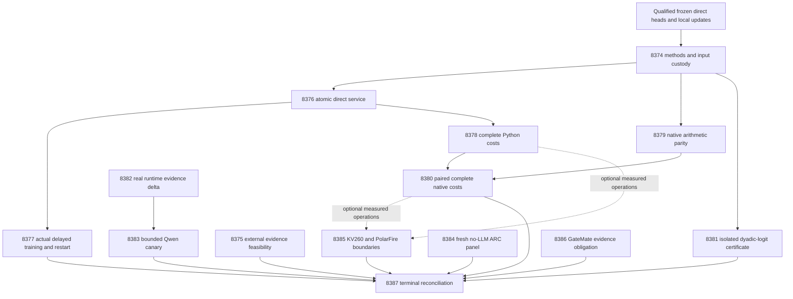

# Carnot Research Roadmap v722: Direct Continuous Decision Services

**Created:** 2026-10-10  
**Milestone:** 2026.10.722  
**Status:** Planned; not activated  
**Supersedes:** 2026.10.721, Exp8360–Exp8373  
**Task contract:** Exactly 14 tasks, Exp8374–Exp8387, in the order below.  
**Execution file:** `research-roadmap-next.yaml`

## What v721 proved

V721 finished scheduling all fourteen slots. Its capstone records eight executed
producers, two pre-gate receipts and four absent primaries. The conductor log
also records the associated cascade skips. Completion does not mean every
experiment ran. The archive currently ends at V720. Actual V721 primaries and
`ops/conductor-log.md` therefore supply the latest evidence.

| Evidence | Established result | Boundary |
|---|---|---|
| Exp8360 | Qualified direct heads, local arithmetic, trajectory and current authority. | Historical replay readiness remains separate. |
| Exp8361 | Qualified H1 gain -0.00390625 and H2 gain 0. Both utility signals are zero. | Exposed development; H1 optimizer geometry remains unqualified. H2 has only two reachable action witnesses among 67 usable later sources. |
| Exp8362 | Analytic spline bounds; 4,218 tested vectors; zero observed interval escapes and guarded action differences. | Every actual action used direct fallback. The SciPy expit contract remains unproved; fast-path fraction and guard readiness are zero. |
| Exp8363–8367 | The table-dependent chain did not execute. | Atomic tables, table learning, native parity and transaction costs remain unmeasured. |
| Exp8368/8369 | Typed runtime reader qualifies; CUDA environment change and context readiness remain zero. | Canary was pre-gated. No current generation. |
| Exp8370 | Qualified reader found no new supervisor outcomes. | The unchanged inventory scope is retired. No solve or cross-game benefit. |
| Exp8371 | Preserved operation boundaries and PolarFire dispatch evidence. | Owned coverage missed source-drift rejection line 439; primary remains disqualified. |
| Exp8372 | Preserved exact missing source hashes and GateMate physical conditions. | No recovered history, changed wiring or hardware run. |
| Exp8373 | Qualified bounded capstone execution after source-alias, scratch and worker-memory repairs. | Terminal verdict remains blocked; engineering and external evidence gaps remain. |

Primary sources are the named `results/experiment_*_v721_*.json` files.
`results/experiment_8363_atomic_table_state.json` and
`results/experiment_8369_changed_runtime_canary.json` are conductor receipts.
Exp8361 is the qualified utility authority; original Exp8350/8351 remain
flagged. The full V721 design is preserved verbatim at
`openspec/change-proposals/research-roadmap-v721-preserved-20261010.md`.

V722 follows the useful part of this evidence. Direct evaluation already
works and can support durable serving. Approximate-table proof remains an
independent research problem. The plan does not retry H1/H2, refit their heads,
change their targets or reinterpret their nulls as broad representation limits.

## Three largest gaps to the PRD

1. **FR-12: useful verification beyond an exposed development cohort.** The
   current small policy has qualified utility nulls. An independent source
   must supply actual outputs, evidence and credible labels before a new
   semantic study can be designed. Exp8375 measures this feasibility. It does
   not claim that importing a benchmark establishes detector quality.
2. **FR-11: continuous learning with reliable serving and recovery.** Delayed
   updates exist, but transaction consistency has not been measured through
   an always-available direct service. Exp8376/8377 test actual learning,
   immutable issued decisions, concurrent readers and crash recovery. They
   advance deployment fidelity and calibrated-decision training, while keeping
   the existing zero utility benefit explicit.
3. **FR-05/08 and NFR-01: complete native deployment cost.** CPU kernel timings
   omit copies, bindings, durable publication and response work. Exp8378–8380
   measure those costs. Exp8381 separately tests whether action certificates
   can avoid a transcendental proof obligation under a new mathematical policy.

ARC remains the live hidden-game discovery objective. Exp8384 collects fresh
adapter-withheld observations through the scored wrapper. It makes no hidden
leaderboard claim and grants no new credit for already-cleared public levels.

## Research incorporated before design

The dated V722 entry in `research-references.md` was added before these tasks.
It covers all requested topics and secondary sources, with retrieval limits.

| Source | Use in V722 | Limit |
|---|---|---|
| [Online KAN, 2602.02056v4](https://arxiv.org/html/2602.02056v4) | Sparse continuous updates and complete durable-write measurements. | Published FPGA results are not local service timings. |
| [KANELÉ, 2512.12850v3](https://arxiv.org/html/2512.12850v3) | Isolated table/action-certificate research. | No silent change to the frozen probability policy. |
| [OpenHalDet, 2606.06959](https://arxiv.org/abs/2606.06959) | Inspect actual released outputs, signal access and label authority. | Model-judge targets are not independent human truth. |
| [Verification Without Sufficiency, 2608.00585](https://arxiv.org/abs/2608.00585) | Compare evidence availability for single and multi-hop evaluation. | Gold decomposition is an oracle ceiling. |
| [Delayed-capacity OCO, 2606.11711](https://arxiv.org/abs/2606.11711) | Preserve pending and lost feedback in durable state. | No new scheduling sweep or inherited regret theorem. |
| [Extropic research-agent update, October 1](https://extropic.ai/writing/baby-thermo-rsi/) | Separate execution correctness from task benefit in methods ingestion. | No generator post-training, TSU-access claim or adoption of vendor speed figures. |

[Safe-by-Design EBM learning, 2609.36942v2](https://arxiv.org/abs/2609.36942v2)
is a new September lead, deferred because dynamical-system invariance does not
certify sentence truth or the existing sigmoid implementation. EBT, ARM–EBM,
neural constraint certification, guided decoding and Ising decomposition were
checked. They remain context; the retired external-text ranker family stays closed.

Semantic Scholar citation endpoints failed for both requested anchor papers.
The OpenReview EBT forum returned a browser challenge; its PDF was discoverable.
GitHub Trending snapshots were four weeks old. Kona's current page supplies no
reproducible new implementation. These limits prevent an exhaustive-survey claim.

## Architecture

The table prototype never gates the direct service. Native arithmetic can
qualify independently of storage. External-corpus and runtime failures cannot
block CPU work. Dashed arrows are optional inputs, not conductor gates.
The capstone has no success gate and records every disposition.

## Phase 1: Freeze methods and inspect independent evidence

**Exp8374–Exp8375.** Bind full task objects and freeze the direct-service protocol.
Reuse qualified inputs rather than copying historical readiness claims. Ingest
methods before measurement. Keep V717 and V721 protocol bytes immutable.

Exp8375 inspects pinned author releases in three fixed lanes: grounded QA,
multi-hop QA and executable code. A deterministic hash order chooses at most
32 released examples per lane for structural inspection. Retrieval is capped
at 200 MiB and 15 minutes. Every unavailable operand stays in the denominator.
No paid annotation, generator load or default external pipeline runs.

Readiness requires at least 80 disjoint independently labeled source clusters,
with eight per class, verified through the actual release manifest. The small
inspection panel cannot establish detector benefit. The future study must
separate labels, train/tune roles, generator family, overlap and evidence access.
No other V722 task depends on this feasibility result.

## Phase 2: Serve and learn through exact direct evaluation

**Exp8376–Exp8378.** A single writer publishes coefficients, pending predictions,
feedback IDs and cursor as one immutable version. Two readers pin versions.
Real process kills exercise temporary-write, file-fsync, pointer-publication
and acknowledgment barriers. Directory fsync is included. Recovery must match
an uninterrupted run exactly. This is process-crash evidence, not power-loss
certification. Bad inputs and stale or duplicate feedback have explicit tests.

Exp8377 performs actual small-head coefficient updates through that service.
Its three arms are uninterrupted direct reference, durable sparse and durable
dense. All 96 source slots remain, including 22 missing slots. Feedback delay
is eight; hard exits occur at slots 32 and 64. The resulting 288 arm-slot rows
retain probabilities, actions, releases and state hashes. Retention shadows
remain at windows 0/32/64/96, with evaluator-only labels.

This is the continuous self-learning experiment and the calibrated-decision
training slot. It measures serving fidelity and Brier while preserving the
closed H2 result. It claims neither generalized learning benefit nor fresh
statistical utility. Hardware work starts from sparse coefficient touches and
measured CPU transactions, with FPGA mapping conditional on a real kernel.

Exp8378 measures Python transactions across batches 1/8/32 and prediction/update
ratios 1/8/64. Ordinary, boundary and natural workloads remain separate. Each
cell has one warmup and five distinct measured repeats. Validation, scoring,
feedback, updates, serialization, file/directory fsync, publication and response
all contribute. Current model acquisition is explicitly outside this scope.
