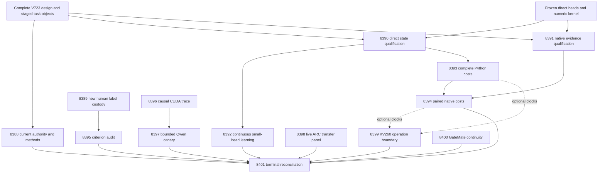

# Carnot Research Roadmap v723: Independent Labels and Continuous Direct Services

**Created:** 2026-10-10  
**Milestone:** 2026.10.723  
**Status:** Planned; not activated  
**Supersedes:** 2026.10.722, Exp8374–Exp8387  
**Task contract:** Exactly 14 tasks, Exp8388–Exp8401, in the order below.  
**Execution file:** `research-roadmap-next.yaml`

## What v722 proved

The conductor completed all fourteen scheduling slots. Ten primaries exist,
including the capstone. Three slots have pre-gate receipts. One cascade skip
has no producer primary. The archive still ends at V721 at planning time.
These conclusions use actual V722 files and `ops/conductor-log.md`, not archive
completion labels. A conductor `OK` does not imply scientific success.

The V722 design ends after Phase 2, at line 163. It has no exact task table or
machine contract. Its missing independent authority blocked direct state and
other branches. The original bytes are preserved at
`openspec/change-proposals/research-roadmap-v722-preserved-20261010.md`.
V723 supplies its own complete contract; it cannot repair missing V722 authority
retroactively. No historical artifact or frozen protocol is changed by planning.

| Evidence | Finding | Limit and next condition |
|---|---|---|
| Exp8374 | Direct inputs qualify; current authority and history do not. | Missing full design. Two historical replay tests also failed in the capstone. |
| Exp8375 | No independently usable response labels in the inspected old releases. Multi-hop traces exist for 32 slots. | EM/F1 proxies do not establish human response truth. A different actual release is needed. |
| Exp8376 | Exact recovery and owned checks passed. | `direct_state_ready_score=0` because design authority was absent. Requalify under current authority. |
| Exp8377/8378/8380 | Continuous service training and complete service costs did not execute. | Three branches cannot be called measured nulls. |
| Exp8379 | Finite native arithmetic checks passed, but the primary is disqualified. | Coverage combine returned `No data to combine`. Old consumer authority also failed. |
| Exp8381 | Separate dyadic-logit certificate qualified; observed fast-path fraction was 1.0. | `circular_positive`, finite numerical evidence. It does not replace the frozen SciPy policy or show semantic benefit. |
| Exp8382/8383 | Typed runtime reader qualifies; CUDA remains unchanged. Canary did not run. | The unchanged inspection scope is retired. Diagnose the cause before another load. |
| Exp8384 | ARC panel implementation and owned controls qualify. | Missing authority prevented the fixed live panel from qualifying. No new solve credit. |
| Exp8385/8386 | Board reader qualifies; physical and source obligations remain explicit. | No spline kernel or GateMate change. PolarFire evidence remains board-local CPU dispatch. |
| Exp8387 | Bounded workers stayed within measured memory limits. | Capstone is disqualified: two Exp8374 replay tests failed. Global suite also timed out separately. |

Qualified Exp8361 remains the utility authority: H1 gain is -0.00390625 and
H2 gain is zero on exposed development data. V723 does not retune these tests.
The complete-service experiments address deployment fidelity and cost.

## Three largest gaps to the PRD

1. **FR-12: independent targets for useful verification.** Current semantic
   evidence is exposed or has weak target authority. The new October human
   label release permits a bounded study of what labels actually measure.
   Exp8389 and Exp8395 establish source custody and criterion validity. They
   do not claim that Carnot already detects factual errors better.
2. **FR-11: continuous learning through a recoverable service.** The local
   update kernel exists, but live serving, delayed feedback and restart must
   preserve the same learning trajectory. Exp8390 and Exp8392 measure this.
   Actual small-head updates and calibration satisfy the training floor.
3. **FR-05/FR-08/NFR-01: complete native deployment performance.** A compiled
   kernel and a numerical match do not prove a tenfold service improvement.
   Exp8391, Exp8393 and Exp8394 include bindings, copies and durable storage.
   Runtime diagnosis tests the distinct blocker to future local generation.

The ARC hidden-game agent remains the north star. Exp8398 measures transfer
through the actual scored wrapper with per-game adapters withheld. It preserves
public-game exposure limits and does not re-solve cleared games for credit.

## Research incorporated before design

The V723 entry in `research-references.md` was written before task design.
It covers all eight primary topics and all six secondary channels.

| Research | Application | Boundary |
|---|---|---|
| [Labeling Problem, 2610.08026v1](https://arxiv.org/html/2610.08026v1), October 6 | Explicit factuality targets and question-clustered, structure-controlled error analysis. | Released historical generators are not current Qwen results. |
| [Author LPHB release](https://github.com/jova486/LPHB) | Pin the actual CSV, dictionary, human annotations and factorial labels. | Dataverse failed retrieval; authenticate public mirror and distinct data/model licenses. |
| [Online KAN, 2602.02056v4](https://arxiv.org/abs/2602.02056) | Sparse updates through real durable serving. | FPGA paper timings are not local complete-service costs. |
| [Delayed-capacity OCO, 2606.11711](https://arxiv.org/abs/2606.11711) | Preserve causal release order and lost feedback. | No inherited regret guarantee or new scheduling sweep. |
| [KANELÉ, 2512.12850v3](https://arxiv.org/abs/2512.12850) | Preserve the numerical deployment lead for later integration. | Direct service remains independent of table certificates. |
| [FPGA decomposition, 2602.15985](https://arxiv.org/abs/2602.15985) | Count preparation, transfer and unsupported host work. | No unsupported spline-to-Ising mapping or borrowed speedup. |

EBT, ARM–EBM, structured energy verification, neural constraint certification
and energy-guided decoding were checked. They do not justify reopening retired
text ranking or generator-training mechanisms. Extropic's research-agent update
retains a future hardware-loop plan, not local TSU access. Kona remains product
context. OpenReview's forum challenge and failed Semantic Scholar citation
queries limit coverage. Trending snapshots were four weeks old. The scan makes
no exhaustive or current-ranking claim.

## Architecture



Solid experiment-to-experiment arrows are the eight structured gates listed
below, except terminal aggregation arrows. Shared source arrows identify input
custody, not success gates. Dashed cost inputs are optional. The capstone always
runs. No success gate depends on a retired upstream experiment. Historical
replay failure cannot erase current numerical input readiness.

## Phase 1: Current authority and independent evidence

**Exp8388–Exp8391.** Bind the complete plan, freeze methods and reproduce the
named historical replay failures privately. Preserve missing historical authority
as blocked. Qualify direct state and native arithmetic independently against
current authority and their own numeric operands. Avoid a global replay gate.

Exp8389 retrieves at most 50 MiB from the pinned author release within ten minutes.
It accounts for all advertised rows, question clusters, source overlap and label
provenance. Readiness requires at least 80 disjoint question clusters and eight
per class, with real released labels, outputs and confirmed permitted use.
A changed label column, duplicate question or generator misjoin must fail.

Exp8390 exercises actual kills around writes, fsync, publication and acknowledgment.
Two readers pin versions. Zero mixed reads, duplicate updates, lost acknowledged
updates and recovery differences are required. This is process-crash evidence.
Exp8391 records genuine coverage files before combining. It retains the finite
native panel, binding identity and strict existing numerical tolerances.

## Phase 2: Continuous service and falsifiable measurements

**Exp8392–Exp8395.** Exp8392 performs real local parameter updates, not just
memory bookkeeping. Three arms follow 96 slots for three seeds: 864 rows.
Keep all 22 missing slots per arm and seed. The seeds repeat existing sources;
they do not increase the independent sample size. Delay is eight. Durable arms
restart at slots 32 and 64. Retention windows remain 0/32/64/96. Record Brier,
typed actions, coefficient touches, pending feedback and immutable issued
predictions. This is continuous self-learning Tier 1/2 deployment evidence.
It keeps the qualified zero H2 benefit explicit.

Exp8393 measures 27 workload/batch/ratio cells with five distinct repeats each,
after one warmup. Each transaction includes the full service and persistence
boundary. Exp8394 remeasures both Python and native arms in paired blocks:
270 arm-cell-repeat summaries plus primitive transaction rows. The primary
cell is natural workload, batch one, eight predictions per update. The NFR-01
claim requires the lower 95% interval for native/Python complete throughput
to exceed 10. Five repeats support a host-specific descriptive result, not
hardware generality. Every secondary cell is reported without winner selection.

Exp8395 audits existing human/automatic labels. The primary factorial contrast
averages over prompt structure, preserving all generator answers within each
question cluster. It measures false positives against human factuality labels;
a positive difference means fewer false positives under the factuality criterion.
Use 10,000 cluster bootstrap replicates and require the primary 95% interval
above zero. Keep missing pairs and annotation disagreements visible. Missing
factorial data blocks the comparison; it cannot be replaced by a confounded
contrast. No Carnot detector-superiority or current-model inference claim follows.

## Phase 3: Causal runtime diagnosis and live-agent transfer

**Exp8396–Exp8398.** The runtime diagnosis adds observations that Exp8290 did
not collect: relevant device-open/ioctl returns, loaded libraries and namespace
visibility from one owned driver child. It does not repeat the old six-cell API
matrix. A trace-supported installed-library or child-local binding correction
may be tested once. System-level driver changes, service edits and GPU resets
are outside scope. Unknown cause remains blocked with a precise remedy condition.

The sole LLM task is Exp8397. It requires typed runtime custody, authenticated
causal change and successful context/copy evidence from Exp8396. It uses
`unsloth/Qwen3.8-27B-GGUF`, Q4_K_M, on the leased local CUDA device. Its eight
requests have at most 128 output tokens each. This is
`model_bounded_generation` with the 10-second classification floor. No task
loads an embedding model or performs a full generative benchmark. A future
embedding/load-only task would use `model_load_no_generation` (2 seconds);
a genuine full-generation task would use `model_full_generation` (60 seconds).
These floors classify work and must never be met by artificial delay.

Exp8398 preserves the previously frozen two-game panel, two seeds and two arms.
It runs eight real SDK episodes through `make_carnot_agent(cascade=True)`.
Per-game adapters and stored routes are withheld. Model induction is disabled
and guarded before load. Each episode has 256 actions and 180 seconds. Zero
supervisor firings is a valid null. All incidental level transitions retain
`solve_provenance=live_agent_self_discovery`, registry checks and zero new
headline credit on exposed public games. Submitted defaults remain unchanged.

## Phase 4: Hardware boundaries and terminal reconciliation

**Exp8399–Exp8401.** Map actual complete-service operations to the KV260 boundary.
If cost inputs are absent, report unknown eligibility rather than a fabricated
zero. Preserve PolarFire's authenticated board-local CPU graduation. GateMate
gets a bounded continuity record, not another unchanged physical probe. Its
missing source hashes and physical-change prerequisites remain visible.

The capstone records all fourteen slots, including itself. It distinguishes
producer results, conductor pre-gates, cascade skips and absent primaries.
Each eligible branch replays in a fresh process. Worker limits stay at 1,500 MiB
peak and 500 MiB growth. Parent current RSS is separate from historical peak.
G1–G4 and `paper_ready` come from the unchanged publication gate. A current
numerical or label-audit success cannot upgrade a circular result to a verifier
advantage. External blockage is terminal `blocked`, not retryable `partial`.

## Dependencies and conductor order

| Consumer | Earlier producer field | Required value |
|---|---|---|
| Exp8392 | Exp8390.direct_state_ready_score | 1 |
| Exp8393 | Exp8390.direct_state_ready_score | 1 |
| Exp8394 | Exp8391.native_parity_ready_score | 1 |
| Exp8394 | Exp8393.python_cost_ready_score | 1 |
| Exp8395 | Exp8389.released_label_panel_ready_score | 1 |
| Exp8397 | Exp8396.runtime_reader_ready_score | 1 |
| Exp8397 | Exp8396.runtime_changed_score | 1 |
| Exp8397 | Exp8396.cuda_context_ready_score | 1 |

All producer fields occur verbatim in their own REQUIRED ARTIFACT FIELDS.
Each consumer authenticates the producer hash again. Contract, native, label,
ARC and board work do not depend on the old missing V722 design qualifying.
No readiness field is inferred from free-text verdict wording.

## Hardware and execution requirements

| Resource | Use | Honest limit |
|---|---|---|
| Host CPU, RAM and private disk-backed scratch | Label audit, sparse learning, crash recovery, native costs, no-LLM ARC | Timings include durable storage. No fresh GPU claim. |
| Rust/PyO3 toolchain | Exp8391/8394 compiled execution | Binary, ABI, copies and actual native calls must be measured. |
| Two installed RTX 3090s, 48 GB nominal total | Exp8396 diagnosis; one leased device for cached ~16 GB Qwen canary | Inventory is not CUDA readiness. No concurrent multi-GPU benchmark. |
| KV260 via `ssh kria` | Exp8399 operation mapping | Existing quadratic Ising operations, k<=5. No installed spline kernel assumed. |
| GateMate A1-EVB-2M | Exp8400 source/physical obligation | No new device command. Reopen with changed physical evidence and correct IDCODE. |
| PolarFire SoC | Preserve authenticated graduation | Linux CPU dispatch is not FPGA-fabric execution. |
| Extropic TSU, AMD NPU, larger FPGA | Wishlist context only | No local qualification, acquisition or performance claim. |

Sparse CPU updates provide the current learning path. Future acceleration needs
a supported kernel plus complete preparation, transfer and persistence costs.
No hardware purchase or deployment is authorized by this plan.

Every task requires flushed progress before/after slow work and inside loops.
Owned children are polled within 60 seconds. Keep silence below 600 seconds and
stay inside the 4,800-second cap. Files over about 200 lines are written in
separate tool calls with progress messages. No artificial duration padding.
Use at most 50 turns for ordinary work, 20 for bounded continuity notes, and
100 with Opus for the specified coordination or hardware-diagnosis tasks.
Formulaic dataset and native evidence work uses Codex `gpt-6.1-sol`. The current
user routing directive takes precedence over older model defaults in CLAUDE.md.

## Validation and stopping rules

Planning validates exact table/object/digest equality, schema, field spelling,
producer order, failure lineage and model classes. Private mutations must reject
changed, removed, reordered and truncated contracts. Run existing unit checks,
scoped lint/spec coverage and private E2E-018 before reporting the plan complete.
Keep global baseline failures separate. Preserve active roadmap and conductor
bytes. Do not activate, execute proposed experiments, commit or push this plan.

Each experimental phase includes a runnable prototype, fixed numerical checks
and adversarial controls. Use existing publication and row-consistency guards.
Keep required artifact fields principle-annotated. Preserve all intended units,
including blocked or missing rows. Do not amend validators to pass a result.
All prior-failure entries name a changed mechanism or prerequisite and require
retirement on the same verdict. Only unchanged scopes retire; an unmeasured
scientific hypothesis cannot be declared refuted by absent inputs.

## Exact task contract

The following table and complete JSON task objects are the contract. They must
match `research-roadmap-next.yaml`, including all prompt text and optional fields.
| Order | Task ID | Title | Phase | Deliverable |
|---|---|---|---|---|
| 1 | `exp8388-contract-methods` | Bind complete task authority and isolate historical replay failures | 1 | `results/experiment_8388_v723_contract_methods.json` |
| 2 | `exp8389-human-label-custody` | Acquire the new human label release with question-level source custody | 1 | `results/experiment_8389_v723_human_label_custody.json` |
| 3 | `exp8390-direct-state-qualification` | Qualify the existing direct state under complete current authority | 1 | `results/experiment_8390_v723_direct_state_qualification.json` |
| 4 | `exp8391-native-evidence-qualification` | Qualify native direct arithmetic with real coverage shards and immutable consumers | 1 | `results/experiment_8391_v723_native_evidence_qualification.json` |
| 5 | `exp8392-continuous-direct-learning` | Train calibrated decision heads through durable delayed feedback | 2 | `results/experiment_8392_v723_continuous_direct_learning.json` |
| 6 | `exp8393-python-transaction-cost` | Measure complete Python decision transactions including durable writes | 2 | `results/experiment_8393_v723_python_transaction_cost.json` |
| 7 | `exp8394-native-transaction-cost` | Compare native and Python transactions with matched storage and bindings | 2 | `results/experiment_8394_v723_native_transaction_cost.json` |
| 8 | `exp8395-label-criterion-audit` | Measure factuality label errors while controlling prompt structure and shared questions | 2 | `results/experiment_8395_v723_label_criterion_audit.json` |
| 9 | `exp8396-cuda-failure-cause` | Locate the CUDA initialization failure through bounded system-call evidence | 3 | `results/experiment_8396_v723_cuda_failure_cause.json` |
| 10 | `exp8397-bounded-qwen-canary` | Run a bounded Qwen canary after causal CUDA qualification | 3 | `results/experiment_8397_v723_bounded_qwen_canary.json` |
| 11 | `exp8398-arc-generalization-panel` | Measure adapter-withheld supervisor behavior through the live ARC wrapper | 3 | `results/experiment_8398_v723_arc_generalization_panel.json` |
| 12 | `exp8399-board-operation-boundary` | Map complete transactions to KV260 operations and retain PolarFire graduation | 4 | `results/experiment_8399_v723_board_operation_boundary.json` |
| 13 | `exp8400-gatemate-continuity` | Preserve the exact GateMate evidence obligation without another unchanged probe | 4 | `results/experiment_8400_v723_gatemate_continuity.json` |
| 14 | `exp8401-capstone` | Reconcile fourteen outcomes and decide continuation from qualified evidence | 4 | `results/experiment_8401_v723_capstone.json` |

<!-- V723_TASK_CONTRACT_START -->
```json
{
  "milestone": "2026.10.723",
  "milestone_title": "Independent label criteria, continuous direct learning, and complete deployment cost",
  "milestone_doc": "openspec/change-proposals/research-roadmap-vNEXT.md",
  "tasks": [
    {
      "id": "exp8388-contract-methods",
      "title": "Bind complete task authority and isolate historical replay failures",
      "phase": 1,
      "track": "infrastructure",
      "priority": "high",
      "requires_gpu": false,
      "max_turns": 100,
      "estimated_wall_time_min": 65,
      "per_unit_rows": true,
      "milestone": "2026.10.723",
      "deliverable": "results/experiment_8388_v723_contract_methods.json",
      "inference_substrate_class": "no_model_load",
      "MODEL_SPECS": [],
      "gated_on": [],
      "prompt": "CONTEXT:\nWork in {project_root} on {date}. V722 completed scheduling, not every measurement. Its design ended after Phase 2 without an exact task contract. Direct state controls passed but authority stayed blocked. Native evidence failed coverage combination; the capstone failed two historical replay tests. H1=-0.00390625 and H2=0 remain closed exposed-development findings. The dyadic-logit certificate is a separate numerical policy, not a semantic win. Preserve original artifacts and frozen V717/V721/V722 protocols.\nEXISTING CODE TO READ FIRST:\nCLAUDE.md; CODEX.md; ops/e2e-test-plan.md; ops/exclusion_manifest.yaml; openspec/capabilities/research-reporting/spec.md; openspec/capabilities/verification/spec.md; scripts/experiment_template.py; python/carnot/reporting/primary_publication.py; openspec/change-proposals/research-roadmap-vNEXT.md; research-references.md; research-studying.md; python/carnot/reporting/roadmap_contract.py; python/carnot/reporting/v685_authority_lifecycle.py; python/carnot/reporting/v722_contract_methods.py; tests/python/test_v722_contract_methods_8374.py; results/experiment_8374_v722_contract_methods.json; results/experiment_8387_v722_capstone.json; openspec/change-proposals/v722-direct-service-protocol.json\nTASK:\nBind complete task authority and isolate historical replay failures. Deliver results/experiment_8388_v723_contract_methods.json. Create thin runner scripts/experiments/experiment_8388_v723_contract_methods.py. Keep primitive evidence in results/raw/experiment_8388_v723_contract_methods/. Future producer paths are dependencies, not existing inputs.\nCONCRETE STEPS:\n1. PRECONDITIONS: Print a flushed start line. Authenticate this task, current design and actual input hashes. Check tools, private disk-backed scratch, memory and deadlines before work. Record missing external inputs in gate_check_summary. Never fabricate observations.\n2. Print a flushed progress line at each phase boundary and before and after every model load, generation, benchmark and subprocess. Emit completed/pending counts inside long loops. Poll owned children at least every 60 seconds. Keep every output gap below 600 seconds, including synthesis. Use unbuffered output and per-call deadlines inside the 4800-second task cap. Write files over about 200 lines in several tool calls of at most about 150 lines. Send a progress message between calls. Never use one huge write or pad elapsed time.\n3. Spec first: add relevant REQ-* and SCENARIO-* before implementation. Write focused failing tests first. Preserve existing assertions and validation thresholds. Reuse shipped modules through small adapters. Put real runners in scripts/experiments/ and probes in /tmp. Freeze scoped validation commands before measurement. Do not modify research-roadmap.yaml.\n4. Declare no_model_load, MODEL_SPECS=[] and zero current LLM calls. Use aggregation_from_upstream_artifacts for readers, verifier_ensemble_against_cached_candidates for numeric work, or the named no-LLM ARC runtime substrate. Small numeric training is not an LLM load.\n5. Validate fourteen visible task rows, complete JSON objects, staged YAML and canonical digest. Bind activation only to actual active authority after activation. Reject removed, reordered, edited and truncated contracts. Preserve the incomplete V722 design at openspec/change-proposals/research-roadmap-v722-preserved-20261010.md. Never synthesize missing historical design authority from active YAML.\n6. Reproduce the two named V722 failures, test_natural and test_missing_and_failure, in private copies. Locate the first replay mismatch from primitive operands. Repair only the adapter that fails to replay an honestly blocked receipt. Keep its missing-design verdict blocked. Require existing tamper checks and fresh-process replay to reject changed source aliases. Keep historical replay readiness separate from current_contract_ready_score; a historical block must not erase qualified current direct inputs.\n7. Ingest the V723 reference scan. Read full methods for 2610.08026, online KAN 2602.02056 and delayed-capacity learning 2606.11711. Record versions, hashes, assumptions and adoption limits in docs/research-notes/v723-method-ingestion.md and research-studying.md. Separate label validity, numerical fidelity and semantic utility.\n8. Freeze openspec/change-proposals/v723-service-and-label-protocol.json before measurement. Reuse unchanged V722 direct arithmetic, spline34 coefficients, temperature, knots, strict .25/.75 decisions, delay 8, natural 96 slots including 22 missing, seeds 11/22/33 and retention windows 0/32/64/96. Do not rerun or retune closed H1/H2. Keep Exp8381 dyadic-logit policy separate and undeployed.\n9. Freeze cost cells: batches 1/8/32, predictions-per-update 1/8/64, ordinary/boundary/natural workloads, one warmup and five distinct measured repeats. Primary NFR-01 cell is natural batch 1 / ratio 8. Complete cost includes validation, snapshot, scoring, update, serialization, file and directory fsync, publication and response. Use paired block order and report all cells. Freeze label-audit criteria before reading its human targets. Run private E2E-018 and E2E-021 rejection controls.\n10. Run scoped unit tests and real consumer/CLI checks. Run scoped Ruff check/format, strict mypy and scripts/check_spec_coverage.py --files <owned-test-files>. Require 100 percent newly owned statements, including failure and real child paths. Use pytest -n 0 -o addopts= with private disk-backed scratch. Record commands, exits, duration and log hashes. Run applicable named private E2E checks. Do not launch the full repository suite in every task; report global health separately from owned validation.\n11. Cold-replay primitive rows in a fresh process. Exercise positive, missing-input, deliberate-error and self-consistently rehashed tamper controls. Use unchanged primary_publication, scripts/adversarial_verify.py --json <private-candidate> and scripts/verdict_row_consistency_lint.py --strict <private-candidate>. Retain every finding. Only an existing typed consumer may resolve independently recomputed informational findings. Unknown, warning and critical findings block readiness. Do not alter validators or exemptions. Publish checked terminal bytes atomically. Owned validation failure is disqualified; unchanged external absence is blocked. Reserve partial for retryable unfinished owned work. Reconcile openspec/, _bmad/traceability.md, ops/status.md and ops/changelog.md. Do not update generator weights or publish externally.\nREQUIRED ARTIFACT FIELDS:\nexperiment_id, task_id, milestone, run_date: principle: Bind evidence to the actual invocation and authority.\nhonest_verdict, verdict_class: principle: Use a complete_ terminal verdict. Closed class: positive | circular_positive | null | blocked | disqualified | partial. External absence is blocked, never partial.\ngate_check_summary: principle: For blocked_* or complete_blocked_* verdicts, name the check, upstream, path/hash, field, operator, expected and observed values. Distinguish absence from zero.\ninference_substrate, inference_substrate_class, MODEL_SPECS, model_invocation_counts, historical_model_provenance: principle: Distinguish current LLM calls, cached signals and small numeric heads.\nrows, intended_count, completed_count, failed_count, censored_count, excluded_count, independent_count, sample_size_budget: principle: Preserve every intended unit and arm with its own metric and missing reason. Repeated timings are not independent examples.\nverifier_is_oracle, exposure_scope, independent_generalization_score, generalized_learning_benefit_score: principle: Oracle-checked positives use circular_positive. Exposed data, feasibility and deployment fidelity keep both generalization scores zero.\nrequired_checks_passed, flagged_adversarial, acceptance_gates, validation_receipts, terminal_validation_sidecar_path, adversarial_findings: principle: Successful execution does not establish scientific benefit.\npreconditions_checked, duration_s, phase_spans, random_seed, reproducibility_checksum, source_artifact_hashes, code_config_hashes, raw_shard_hashes: principle: Recompute measurements from sealed operands, not pooled claims.\ncited_upstream_artifacts, field_principles: principle: Name imported fields and producer hashes. Explain every added field.\ncurrent_contract_ready_score, direct_inputs_ready_score, historical_replay_ready_score, canonical_tasks_sha256: principle: Current authority, numeric custody and historical replay qualify separately.\nprotocol_path, protocol_sha256, methods_manifest, first_replay_mismatch, historical_dispositions: principle: Freeze choices before measurement and preserve historical failure evidence.\nRun command: cd {project_root} && PYTHONPATH=python:. PYTHONUNBUFFERED=1 .venv/bin/python -u scripts/experiments/experiment_8388_v723_contract_methods.py --date {date}\nDo NOT push. Do NOT modify scripts/research_conductor.py.\n",
      "prior_failures": [
        {
          "experiment_id": "exp8374-contract-methods",
          "verdict": "complete_blocked_direct_contract_methods",
          "addressed_by": "V723 supplies the missing full design/table/digest and tests blocked historical receipts without reconstructing absent V722 authority.",
          "retire_if_same_verdict": true
        },
        {
          "experiment_id": "exp8318-contract-replay",
          "verdict": "complete_disqualified_contract_replay",
          "addressed_by": "Use bounded immutable source aliases and independently qualify current inputs; no recursive historical success gate.",
          "retire_if_same_verdict": true
        }
      ],
      "model": "opus"
    },
    {
      "id": "exp8389-human-label-custody",
      "title": "Acquire the new human label release with question-level source custody",
      "phase": 1,
      "track": "research",
      "priority": "high",
      "requires_gpu": false,
      "max_turns": 50,
      "estimated_wall_time_min": 40,
      "per_unit_rows": true,
      "milestone": "2026.10.723",
      "deliverable": "results/experiment_8389_v723_human_label_custody.json",
      "inference_substrate_class": "no_model_load",
      "MODEL_SPECS": [],
      "gated_on": [],
      "prompt": "CONTEXT:\nWork in {project_root} on {date}. V722 completed scheduling, not every measurement. Its design ended after Phase 2 without an exact task contract. Direct state controls passed but authority stayed blocked. Native evidence failed coverage combination; the capstone failed two historical replay tests. H1=-0.00390625 and H2=0 remain closed exposed-development findings. The dyadic-logit certificate is a separate numerical policy, not a semantic win. Preserve original artifacts and frozen V717/V721/V722 protocols.\nEXISTING CODE TO READ FIRST:\nCLAUDE.md; CODEX.md; ops/e2e-test-plan.md; ops/exclusion_manifest.yaml; openspec/capabilities/research-reporting/spec.md; openspec/capabilities/verification/spec.md; scripts/experiment_template.py; python/carnot/reporting/primary_publication.py; openspec/change-proposals/research-roadmap-vNEXT.md; research-references.md; python/carnot/reporting/external_evidence_8375.py; python/carnot/reporting/current_work_receipt.py; results/experiment_8375_v722_external_evidence_readiness.json\nTASK:\nAcquire the new human label release with question-level source custody. Deliver results/experiment_8389_v723_human_label_custody.json. Create thin runner scripts/experiments/experiment_8389_v723_human_label_custody.py. Keep primitive evidence in results/raw/experiment_8389_v723_human_label_custody/. Future producer paths are dependencies, not existing inputs.\nCONCRETE STEPS:\n1. PRECONDITIONS: Print a flushed start line. Authenticate this task, current design and actual input hashes. Check tools, private disk-backed scratch, memory and deadlines before work. Record missing external inputs in gate_check_summary. Never fabricate observations.\n2. Print a flushed progress line at each phase boundary and before and after every model load, generation, benchmark and subprocess. Emit completed/pending counts inside long loops. Poll owned children at least every 60 seconds. Keep every output gap below 600 seconds, including synthesis. Use unbuffered output and per-call deadlines inside the 4800-second task cap. Write files over about 200 lines in several tool calls of at most about 150 lines. Send a progress message between calls. Never use one huge write or pad elapsed time.\n3. Spec first: add relevant REQ-* and SCENARIO-* before implementation. Write focused failing tests first. Preserve existing assertions and validation thresholds. Reuse shipped modules through small adapters. Put real runners in scripts/experiments/ and probes in /tmp. Freeze scoped validation commands before measurement. Do not modify research-roadmap.yaml.\n4. Declare no_model_load, MODEL_SPECS=[] and zero current LLM calls. Use aggregation_from_upstream_artifacts for readers, verifier_ensemble_against_cached_candidates for numeric work, or the named no-LLM ARC runtime substrate. Small numeric training is not an LLM load.\n5. Use the author repository https://github.com/jova486/LPHB for 2610.08026. Pin reviewed commit c2cf053567d5ae458656ee0e420509e35d73406d before retrieval. Read README.md, LICENSE-DATA, THIRD_PARTY_NOTICES.md, data/README.md and the column dictionary. Dataverse DOI10.7910/DVN/PCHISZ returned403 during planning; record this limit. Use the public author mirror, without circumventing restrictions. Cap acquisition at 50 MiB and 600 seconds. Do not run external installation or label-regeneration code.\n6. Authenticate data/human_judge_release_master.csv and audits/factorial_prompt_run/gpt5mini_factorial_v3/labels.csv for the audit. Keep all 900 advertised responses and 300 question clusters in the manifest, including missing rows. Authenticate actual counts instead of copying publication numbers. Record source dataset, question identity, generator identity, response hash and A1/A2 label provenance. Cluster all generator answers to the same question together.\n7. Read targets only inside the manifest validator after freezing the target mapping. A1 factual-correctness annotations are primary; A2 is a sensitivity subset. Keep released automatic judgments and reference-faithfulness scores distinct. Do not substitute EM/F1, reference matching or an LLM judge for human authority. Record partial annotation and disagreement explicitly.\n8. Compare normalized question IDs/hashes with existing Carnot source manifests. Write a concrete read-only adapter and results/raw/experiment_8389_v723_human_label_custody/source_manifest.json. Require complete release identity, permitted use, actual response/label alignment and at least 80 disjoint questions with 8 each-class clusters for released_label_panel_ready_score=1. Unknown overlap or unavailable bytes is blocked, not a zero-benefit result.\n9. Historical Llama/Gemma/Mistral answers are cached third-party data, never current mandated-model results. Keep both generalization scores zero. Test swapped human/automatic columns, duplicate questions, wrong generator joins, truncation and rehashed contamination. Run private E2E-018. No learned detector, new model call or public redistribution is part of this task.\n10. Run scoped unit tests and real consumer/CLI checks. Run scoped Ruff check/format, strict mypy and scripts/check_spec_coverage.py --files <owned-test-files>. Require 100 percent newly owned statements, including failure and real child paths. Use pytest -n 0 -o addopts= with private disk-backed scratch. Record commands, exits, duration and log hashes. Run applicable named private E2E checks. Do not launch the full repository suite in every task; report global health separately from owned validation.\n11. Cold-replay primitive rows in a fresh process. Exercise positive, missing-input, deliberate-error and self-consistently rehashed tamper controls. Use unchanged primary_publication, scripts/adversarial_verify.py --json <private-candidate> and scripts/verdict_row_consistency_lint.py --strict <private-candidate>. Retain every finding. Only an existing typed consumer may resolve independently recomputed informational findings. Unknown, warning and critical findings block readiness. Do not alter validators or exemptions. Publish checked terminal bytes atomically. Owned validation failure is disqualified; unchanged external absence is blocked. Reserve partial for retryable unfinished owned work. Reconcile openspec/, _bmad/traceability.md, ops/status.md and ops/changelog.md. Do not update generator weights or publish externally.\nREQUIRED ARTIFACT FIELDS:\nexperiment_id, task_id, milestone, run_date: principle: Bind evidence to the actual invocation and authority.\nhonest_verdict, verdict_class: principle: Use a complete_ terminal verdict. Closed class: positive | circular_positive | null | blocked | disqualified | partial. External absence is blocked, never partial.\ngate_check_summary: principle: For blocked_* or complete_blocked_* verdicts, name the check, upstream, path/hash, field, operator, expected and observed values. Distinguish absence from zero.\ninference_substrate, inference_substrate_class, MODEL_SPECS, model_invocation_counts, historical_model_provenance: principle: Distinguish current LLM calls, cached signals and small numeric heads.\nrows, intended_count, completed_count, failed_count, censored_count, excluded_count, independent_count, sample_size_budget: principle: Preserve every intended unit and arm with its own metric and missing reason. Repeated timings are not independent examples.\nverifier_is_oracle, exposure_scope, independent_generalization_score, generalized_learning_benefit_score: principle: Oracle-checked positives use circular_positive. Exposed data, feasibility and deployment fidelity keep both generalization scores zero.\nrequired_checks_passed, flagged_adversarial, acceptance_gates, validation_receipts, terminal_validation_sidecar_path, adversarial_findings: principle: Successful execution does not establish scientific benefit.\npreconditions_checked, duration_s, phase_spans, random_seed, reproducibility_checksum, source_artifact_hashes, code_config_hashes, raw_shard_hashes: principle: Recompute measurements from sealed operands, not pooled claims.\ncited_upstream_artifacts, field_principles: principle: Name imported fields and producer hashes. Explain every added field.\nreleased_label_panel_ready_score, release_commit, release_file_hashes, source_manifest_path, license_manifest: principle: Only actual authorized release bytes support downstream analysis.\nquestion_cluster_count, response_count, label_authority_counts, overlap_rows, missing_slots: principle: Multiple generators on one question do not create independent questions.\nRun command: cd {project_root} && PYTHONPATH=python:. PYTHONUNBUFFERED=1 .venv/bin/python -u scripts/experiments/experiment_8389_v723_human_label_custody.py --date {date}\nDo NOT push. Do NOT modify scripts/research_conductor.py.\n",
      "prior_failures": [
        {
          "experiment_id": "exp8375-external-evidence-readiness",
          "verdict": "complete_blocked_external_evidence_readiness",
          "addressed_by": "Change the corpus to the newly discovered author-released LPHB CSV with human response labels; old OpenHalDet and sufficiency lanes remain blocked.",
          "retire_if_same_verdict": true
        }
      ],
      "model": "gpt-6.1-sol",
      "agent_type": "codex"
    },
    {
      "id": "exp8390-direct-state-qualification",
      "title": "Qualify the existing direct state under complete current authority",
      "phase": 1,
      "track": "infrastructure",
      "priority": "high",
      "requires_gpu": false,
      "max_turns": 100,
      "estimated_wall_time_min": 65,
      "per_unit_rows": true,
      "milestone": "2026.10.723",
      "deliverable": "results/experiment_8390_v723_direct_state_qualification.json",
      "inference_substrate_class": "no_model_load",
      "MODEL_SPECS": [],
      "gated_on": [],
      "prompt": "CONTEXT:\nWork in {project_root} on {date}. V722 completed scheduling, not every measurement. Its design ended after Phase 2 without an exact task contract. Direct state controls passed but authority stayed blocked. Native evidence failed coverage combination; the capstone failed two historical replay tests. H1=-0.00390625 and H2=0 remain closed exposed-development findings. The dyadic-logit certificate is a separate numerical policy, not a semantic win. Preserve original artifacts and frozen V717/V721/V722 protocols.\nEXISTING CODE TO READ FIRST:\nCLAUDE.md; CODEX.md; ops/e2e-test-plan.md; ops/exclusion_manifest.yaml; openspec/capabilities/research-reporting/spec.md; openspec/capabilities/verification/spec.md; scripts/experiment_template.py; python/carnot/reporting/primary_publication.py; openspec/change-proposals/research-roadmap-vNEXT.md; python/carnot/verify/direct_atomic_state_8376.py; python/carnot/reporting/direct_atomic_state_8376.py; python/carnot/reporting/direct_atomic_runner_8376.py; tests/python/test_direct_atomic_state_8376.py; results/experiment_8376_v722_direct_atomic_state.json; results/experiment_8347_v720_local_consumer_qualification.json; openspec/change-proposals/v722-direct-service-protocol.json\nTASK:\nQualify the existing direct state under complete current authority. Deliver results/experiment_8390_v723_direct_state_qualification.json. Create thin runner scripts/experiments/experiment_8390_v723_direct_state_qualification.py. Keep primitive evidence in results/raw/experiment_8390_v723_direct_state_qualification/. Future producer paths are dependencies, not existing inputs.\nCONCRETE STEPS:\n1. PRECONDITIONS: Print a flushed start line. Authenticate this task, current design and actual input hashes. Check tools, private disk-backed scratch, memory and deadlines before work. Record missing external inputs in gate_check_summary. Never fabricate observations.\n2. Print a flushed progress line at each phase boundary and before and after every model load, generation, benchmark and subprocess. Emit completed/pending counts inside long loops. Poll owned children at least every 60 seconds. Keep every output gap below 600 seconds, including synthesis. Use unbuffered output and per-call deadlines inside the 4800-second task cap. Write files over about 200 lines in several tool calls of at most about 150 lines. Send a progress message between calls. Never use one huge write or pad elapsed time.\n3. Spec first: add relevant REQ-* and SCENARIO-* before implementation. Write focused failing tests first. Preserve existing assertions and validation thresholds. Reuse shipped modules through small adapters. Put real runners in scripts/experiments/ and probes in /tmp. Freeze scoped validation commands before measurement. Do not modify research-roadmap.yaml.\n4. Declare no_model_load, MODEL_SPECS=[] and zero current LLM calls. Use aggregation_from_upstream_artifacts for readers, verifier_ensemble_against_cached_candidates for numeric work, or the named no-LLM ARC runtime substrate. Small numeric training is not an LLM load.\n5. Authenticate direct kernel, qualified frozen heads and original state controls directly. Independently validate this complete V723 contract. Do not require historical Exp8374 replay success or rewrite Exp8376. Its exact_recovery=true and owned_validation=true were blocked by missing design authority, not an observed state inconsistency.\n6. Reuse the existing single-writer direct state and two pinned readers. Qualify coefficients, pending predictions, feedback IDs, cursor and acknowledgments as one recoverable version. Use the unchanged ordinary and threshold fixtures. Do not introduce tables, change decision thresholds or refit any head.\n7. Execute real process-kill controls at temporary write, file fsync, pointer publication, directory fsync and acknowledgment barriers. Compare recovered state with uninterrupted state. Measure mixed-version reads, duplicate updates, lost acknowledged updates and issued-prediction mutation. All counts must be zero. State explicitly that process crash is not power-loss certification.\n8. Include stale feedback, duplicate feedback, invalid coefficients, missing operands and self-consistently rehashed state mutations. Require a fresh child to accept valid state and reject each invalid state. Set direct_state_ready_score=1 only with current authority, authenticated numeric inputs and all existing checks passed. Run private E2E-018 and E2E-020. Preserve failures as their own rows.\n9. Run scoped unit tests and real consumer/CLI checks. Run scoped Ruff check/format, strict mypy and scripts/check_spec_coverage.py --files <owned-test-files>. Require 100 percent newly owned statements, including failure and real child paths. Use pytest -n 0 -o addopts= with private disk-backed scratch. Record commands, exits, duration and log hashes. Run applicable named private E2E checks. Do not launch the full repository suite in every task; report global health separately from owned validation.\n10. Cold-replay primitive rows in a fresh process. Exercise positive, missing-input, deliberate-error and self-consistently rehashed tamper controls. Use unchanged primary_publication, scripts/adversarial_verify.py --json <private-candidate> and scripts/verdict_row_consistency_lint.py --strict <private-candidate>. Retain every finding. Only an existing typed consumer may resolve independently recomputed informational findings. Unknown, warning and critical findings block readiness. Do not alter validators or exemptions. Publish checked terminal bytes atomically. Owned validation failure is disqualified; unchanged external absence is blocked. Reserve partial for retryable unfinished owned work. Reconcile openspec/, _bmad/traceability.md, ops/status.md and ops/changelog.md. Do not update generator weights or publish externally.\nREQUIRED ARTIFACT FIELDS:\nexperiment_id, task_id, milestone, run_date: principle: Bind evidence to the actual invocation and authority.\nhonest_verdict, verdict_class: principle: Use a complete_ terminal verdict. Closed class: positive | circular_positive | null | blocked | disqualified | partial. External absence is blocked, never partial.\ngate_check_summary: principle: For blocked_* or complete_blocked_* verdicts, name the check, upstream, path/hash, field, operator, expected and observed values. Distinguish absence from zero.\ninference_substrate, inference_substrate_class, MODEL_SPECS, model_invocation_counts, historical_model_provenance: principle: Distinguish current LLM calls, cached signals and small numeric heads.\nrows, intended_count, completed_count, failed_count, censored_count, excluded_count, independent_count, sample_size_budget: principle: Preserve every intended unit and arm with its own metric and missing reason. Repeated timings are not independent examples.\nverifier_is_oracle, exposure_scope, independent_generalization_score, generalized_learning_benefit_score: principle: Oracle-checked positives use circular_positive. Exposed data, feasibility and deployment fidelity keep both generalization scores zero.\nrequired_checks_passed, flagged_adversarial, acceptance_gates, validation_receipts, terminal_validation_sidecar_path, adversarial_findings: principle: Successful execution does not establish scientific benefit.\npreconditions_checked, duration_s, phase_spans, random_seed, reproducibility_checksum, source_artifact_hashes, code_config_hashes, raw_shard_hashes: principle: Recompute measurements from sealed operands, not pooled claims.\ncited_upstream_artifacts, field_principles: principle: Name imported fields and producer hashes. Explain every added field.\ndirect_state_ready_score, state_version, crash_rows: principle: Downstream learning and costs require measured state integrity.\nmixed_version_read_count, duplicate_update_count, lost_acknowledged_update_count, issued_prediction_mutation_count, recovery_mismatch_count, power_loss_certified: principle: Exact recovery claims must identify every measured failure mode.\nRun command: cd {project_root} && PYTHONPATH=python:. PYTHONUNBUFFERED=1 .venv/bin/python -u scripts/experiments/experiment_8390_v723_direct_state_qualification.py --date {date}\nDo NOT push. Do NOT modify scripts/research_conductor.py.\n",
      "prior_failures": [
        {
          "experiment_id": "exp8376-direct-atomic-state",
          "verdict": "complete_blocked_direct_atomic_state",
          "addressed_by": "The complete V723 authority is present; retain shipped crash controls and requalify state without the historically missing design dependency.",
          "retire_if_same_verdict": true
        },
        {
          "experiment_id": "exp8363-atomic-table-state",
          "verdict": "blocked_gate_check_failed",
          "addressed_by": "Use shipped direct evaluation without the unproved SciPy table certificate; current authority and exact recovery are explicit prerequisites.",
          "retire_if_same_verdict": true
        }
      ],
      "model": "opus"
    },
    {
      "id": "exp8391-native-evidence-qualification",
      "title": "Qualify native direct arithmetic with real coverage shards and immutable consumers",
      "phase": 1,
      "track": "infrastructure",
      "priority": "high",
      "requires_gpu": false,
      "max_turns": 50,
      "estimated_wall_time_min": 65,
      "per_unit_rows": true,
      "milestone": "2026.10.723",
      "deliverable": "results/experiment_8391_v723_native_evidence_qualification.json",
      "inference_substrate_class": "no_model_load",
      "MODEL_SPECS": [],
      "gated_on": [],
      "prompt": "CONTEXT:\nWork in {project_root} on {date}. V722 completed scheduling, not every measurement. Its design ended after Phase 2 without an exact task contract. Direct state controls passed but authority stayed blocked. Native evidence failed coverage combination; the capstone failed two historical replay tests. H1=-0.00390625 and H2=0 remain closed exposed-development findings. The dyadic-logit certificate is a separate numerical policy, not a semantic win. Preserve original artifacts and frozen V717/V721/V722 protocols.\nEXISTING CODE TO READ FIRST:\nCLAUDE.md; CODEX.md; ops/e2e-test-plan.md; ops/exclusion_manifest.yaml; openspec/capabilities/research-reporting/spec.md; openspec/capabilities/verification/spec.md; scripts/experiment_template.py; python/carnot/reporting/primary_publication.py; openspec/change-proposals/research-roadmap-vNEXT.md; python/carnot/verify/native_direct_8379.py; python/carnot/reporting/native_direct_8379.py; python/carnot/reporting/native_direct_runner_8379.py; tests/python/test_native_direct_parity_8379.py; results/experiment_8379_v722_native_direct_parity.json; tests/python/test_local_consumer_qualification_8347.py\nTASK:\nQualify native direct arithmetic with real coverage shards and immutable consumers. Deliver results/experiment_8391_v723_native_evidence_qualification.json. Create thin runner scripts/experiments/experiment_8391_v723_native_evidence_qualification.py. Keep primitive evidence in results/raw/experiment_8391_v723_native_evidence_qualification/. Future producer paths are dependencies, not existing inputs.\nCONCRETE STEPS:\n1. PRECONDITIONS: Print a flushed start line. Authenticate this task, current design and actual input hashes. Check tools, private disk-backed scratch, memory and deadlines before work. Record missing external inputs in gate_check_summary. Never fabricate observations.\n2. Print a flushed progress line at each phase boundary and before and after every model load, generation, benchmark and subprocess. Emit completed/pending counts inside long loops. Poll owned children at least every 60 seconds. Keep every output gap below 600 seconds, including synthesis. Use unbuffered output and per-call deadlines inside the 4800-second task cap. Write files over about 200 lines in several tool calls of at most about 150 lines. Send a progress message between calls. Never use one huge write or pad elapsed time.\n3. Spec first: add relevant REQ-* and SCENARIO-* before implementation. Write focused failing tests first. Preserve existing assertions and validation thresholds. Reuse shipped modules through small adapters. Put real runners in scripts/experiments/ and probes in /tmp. Freeze scoped validation commands before measurement. Do not modify research-roadmap.yaml.\n4. Declare no_model_load, MODEL_SPECS=[] and zero current LLM calls. Use aggregation_from_upstream_artifacts for readers, verifier_ensemble_against_cached_candidates for numeric work, or the named no-LLM ARC runtime substrate. Small numeric training is not an LLM load.\n5. Reproduce the owned coverage_combine failure from Exp8379: the log says No data to combine. Identify the actual coverage file topology before changing orchestration. Use real parallel child shards when combining, or a declared single-process coverage file when no children were measured. Do not turn an empty combine into a success or remove required coverage.\n6. Build and import the actual Rust/PyO3 extension through the existing path. Record binary hash, ABI, toolchain and call counters. Reuse the frozen 4096 vectors, knots, threshold witnesses, nextafter neighbors and coefficient-update cases. Do not implement a Python fallback under a native name. Keep direct probability and strict action policy unchanged.\n7. Compare actions, probabilities and coefficient updates through actual binding calls. Preserve the previous numerical tolerances and arithmetic order. Record all boundary rows and binding conversion/copy bytes. This is finite-domain parity, not a universal floating-point theorem or a speed claim.\n8. Exercise current V723 authority and frozen historical consumer operands separately. A historical absent design remains blocked; no live design substitution may make it pass. Run private E2E-003 binding round-trip, E2E-018 and required source-isolation controls. Set native_parity_ready_score=1 only after finite parity, actual native execution, real coverage and owned consumers pass. Global suite timeout remains a separate record.\n9. Run scoped unit tests and real consumer/CLI checks. Run scoped Ruff check/format, strict mypy and scripts/check_spec_coverage.py --files <owned-test-files>. Require 100 percent newly owned statements, including failure and real child paths. Use pytest -n 0 -o addopts= with private disk-backed scratch. Record commands, exits, duration and log hashes. Run applicable named private E2E checks. Do not launch the full repository suite in every task; report global health separately from owned validation.\n10. Cold-replay primitive rows in a fresh process. Exercise positive, missing-input, deliberate-error and self-consistently rehashed tamper controls. Use unchanged primary_publication, scripts/adversarial_verify.py --json <private-candidate> and scripts/verdict_row_consistency_lint.py --strict <private-candidate>. Retain every finding. Only an existing typed consumer may resolve independently recomputed informational findings. Unknown, warning and critical findings block readiness. Do not alter validators or exemptions. Publish checked terminal bytes atomically. Owned validation failure is disqualified; unchanged external absence is blocked. Reserve partial for retryable unfinished owned work. Reconcile openspec/, _bmad/traceability.md, ops/status.md and ops/changelog.md. Do not update generator weights or publish externally.\nREQUIRED ARTIFACT FIELDS:\nexperiment_id, task_id, milestone, run_date: principle: Bind evidence to the actual invocation and authority.\nhonest_verdict, verdict_class: principle: Use a complete_ terminal verdict. Closed class: positive | circular_positive | null | blocked | disqualified | partial. External absence is blocked, never partial.\ngate_check_summary: principle: For blocked_* or complete_blocked_* verdicts, name the check, upstream, path/hash, field, operator, expected and observed values. Distinguish absence from zero.\ninference_substrate, inference_substrate_class, MODEL_SPECS, model_invocation_counts, historical_model_provenance: principle: Distinguish current LLM calls, cached signals and small numeric heads.\nrows, intended_count, completed_count, failed_count, censored_count, excluded_count, independent_count, sample_size_budget: principle: Preserve every intended unit and arm with its own metric and missing reason. Repeated timings are not independent examples.\nverifier_is_oracle, exposure_scope, independent_generalization_score, generalized_learning_benefit_score: principle: Oracle-checked positives use circular_positive. Exposed data, feasibility and deployment fidelity keep both generalization scores zero.\nrequired_checks_passed, flagged_adversarial, acceptance_gates, validation_receipts, terminal_validation_sidecar_path, adversarial_findings: principle: Successful execution does not establish scientific benefit.\npreconditions_checked, duration_s, phase_spans, random_seed, reproducibility_checksum, source_artifact_hashes, code_config_hashes, raw_shard_hashes: principle: Recompute measurements from sealed operands, not pooled claims.\ncited_upstream_artifacts, field_principles: principle: Name imported fields and producer hashes. Explain every added field.\nnative_parity_ready_score, extension_path, extension_sha256, native_call_counts, finite_domain_only: principle: Native readiness requires actual compiled execution and qualified scope.\ncoverage_file_manifest, coverage_combination_mode, coverage_receipts, action_mismatch_count, max_probability_error, max_coefficient_error, binding_conversion_bytes, binding_copy_bytes: principle: Missing instrumentation cannot masquerade as verified numerical parity.\nRun command: cd {project_root} && PYTHONPATH=python:. PYTHONUNBUFFERED=1 .venv/bin/python -u scripts/experiments/experiment_8391_v723_native_evidence_qualification.py --date {date}\nDo NOT push. Do NOT modify scripts/research_conductor.py.\n",
      "prior_failures": [
        {
          "experiment_id": "exp8379-native-direct-parity",
          "verdict": "complete_disqualified_finite_native_direct_parity",
          "addressed_by": "Replace the empty coverage-combine invocation with measured shard custody and current versus historical consumer isolation; preserve every original failure receipt.",
          "retire_if_same_verdict": true
        }
      ],
      "model": "gpt-6.1-sol",
      "agent_type": "codex"
    },
    {
      "id": "exp8392-continuous-direct-learning",
      "title": "Train calibrated decision heads through durable delayed feedback",
      "phase": 2,
      "track": "research",
      "priority": "high",
      "requires_gpu": false,
      "max_turns": 50,
      "estimated_wall_time_min": 60,
      "per_unit_rows": true,
      "milestone": "2026.10.723",
      "deliverable": "results/experiment_8392_v723_continuous_direct_learning.json",
      "inference_substrate_class": "no_model_load",
      "MODEL_SPECS": [],
      "gated_on": [
        {
          "upstream": "exp8390-direct-state-qualification",
          "artifact_field": "direct_state_ready_score",
          "op": "==",
          "value": 1
        }
      ],
      "prompt": "CONTEXT:\nWork in {project_root} on {date}. V722 completed scheduling, not every measurement. Its design ended after Phase 2 without an exact task contract. Direct state controls passed but authority stayed blocked. Native evidence failed coverage combination; the capstone failed two historical replay tests. H1=-0.00390625 and H2=0 remain closed exposed-development findings. The dyadic-logit certificate is a separate numerical policy, not a semantic win. Preserve original artifacts and frozen V717/V721/V722 protocols.\nEXISTING CODE TO READ FIRST:\nCLAUDE.md; CODEX.md; ops/e2e-test-plan.md; ops/exclusion_manifest.yaml; openspec/capabilities/research-reporting/spec.md; openspec/capabilities/verification/spec.md; scripts/experiment_template.py; python/carnot/reporting/primary_publication.py; openspec/change-proposals/research-roadmap-vNEXT.md; python/carnot/verify/direct_atomic_state_8376.py; python/carnot/verify/sentence_spline_fit_8334.py; results/experiment_8348_v720_continuous_local_learning.json; results/experiment_8361_v721_utility_audit_qualification.json; openspec/change-proposals/v717-local-learning-protocol.json; openspec/change-proposals/v722-direct-service-protocol.json\nTASK:\nTrain calibrated decision heads through durable delayed feedback. Deliver results/experiment_8392_v723_continuous_direct_learning.json. Create thin runner scripts/experiments/experiment_8392_v723_continuous_direct_learning.py. Keep primitive evidence in results/raw/experiment_8392_v723_continuous_direct_learning/. Future producer paths are dependencies, not existing inputs.\nCONCRETE STEPS:\n1. PRECONDITIONS: Print a flushed start line. Authenticate this task, current design and actual input hashes. Check tools, private disk-backed scratch, memory and deadlines before work. Record missing external inputs in gate_check_summary. Never fabricate observations.\n2. Print a flushed progress line at each phase boundary and before and after every model load, generation, benchmark and subprocess. Emit completed/pending counts inside long loops. Poll owned children at least every 60 seconds. Keep every output gap below 600 seconds, including synthesis. Use unbuffered output and per-call deadlines inside the 4800-second task cap. Write files over about 200 lines in several tool calls of at most about 150 lines. Send a progress message between calls. Never use one huge write or pad elapsed time.\n3. Spec first: add relevant REQ-* and SCENARIO-* before implementation. Write focused failing tests first. Preserve existing assertions and validation thresholds. Reuse shipped modules through small adapters. Put real runners in scripts/experiments/ and probes in /tmp. Freeze scoped validation commands before measurement. Do not modify research-roadmap.yaml.\n4. Declare no_model_load, MODEL_SPECS=[] and zero current LLM calls. Use aggregation_from_upstream_artifacts for readers, verifier_ensemble_against_cached_candidates for numeric work, or the named no-LLM ARC runtime substrate. Small numeric training is not an LLM load.\n5. Require Exp8390.direct_state_ready_score=1. Authenticate the original frozen heads, 96 ordered source slots and delay 8 schedule. Keep all 22 missing slots. Freeze three arms: uninterrupted direct reference, durable sparse update and durable dense update. No post-outcome threshold or learning-rate change.\n6. Run actual coefficient training for seeds 11/22/33 through issue, delayed release, update and durable commit. Each arm has 96 slots, giving 864 arm-seed-slot rows. Repeated seeds are robustness replicates, not new independent sources. Kill owned processes at slots 32 and 64 in durable arms, then resume from persisted state. Compare all issued probabilities, typed actions and state hashes against the uninterrupted reference.\n7. Preserve retention shadows at windows 0/32/64/96 with evaluator-only labels. Only released training feedback may change the small head. Issued decisions are immutable. Record sparse coefficient touches, pending/lost feedback, Brier scores, calibration bins and accept/reject/escalate counts. Require nonzero legitimate coefficient updates as evidence that learning actually occurred.\n8. Qualify service fidelity only if every available source follows the frozen trajectory and recovery is exact. Keep closed H2=0 explicit. Report observed Brier changes descriptively; no fresh generalized benefit claim follows from this exposed cohort. Run private E2E-020 restart controls and E2E-021 label-barrier replay. Hardware path is CPU sparse updates plus future supported FPGA operations; do not claim a 100x speedup without measurements.\n9. Run scoped unit tests and real consumer/CLI checks. Run scoped Ruff check/format, strict mypy and scripts/check_spec_coverage.py --files <owned-test-files>. Require 100 percent newly owned statements, including failure and real child paths. Use pytest -n 0 -o addopts= with private disk-backed scratch. Record commands, exits, duration and log hashes. Run applicable named private E2E checks. Do not launch the full repository suite in every task; report global health separately from owned validation.\n10. Cold-replay primitive rows in a fresh process. Exercise positive, missing-input, deliberate-error and self-consistently rehashed tamper controls. Use unchanged primary_publication, scripts/adversarial_verify.py --json <private-candidate> and scripts/verdict_row_consistency_lint.py --strict <private-candidate>. Retain every finding. Only an existing typed consumer may resolve independently recomputed informational findings. Unknown, warning and critical findings block readiness. Do not alter validators or exemptions. Publish checked terminal bytes atomically. Owned validation failure is disqualified; unchanged external absence is blocked. Reserve partial for retryable unfinished owned work. Reconcile openspec/, _bmad/traceability.md, ops/status.md and ops/changelog.md. Do not update generator weights or publish externally.\nREQUIRED ARTIFACT FIELDS:\nexperiment_id, task_id, milestone, run_date: principle: Bind evidence to the actual invocation and authority.\nhonest_verdict, verdict_class: principle: Use a complete_ terminal verdict. Closed class: positive | circular_positive | null | blocked | disqualified | partial. External absence is blocked, never partial.\ngate_check_summary: principle: For blocked_* or complete_blocked_* verdicts, name the check, upstream, path/hash, field, operator, expected and observed values. Distinguish absence from zero.\ninference_substrate, inference_substrate_class, MODEL_SPECS, model_invocation_counts, historical_model_provenance: principle: Distinguish current LLM calls, cached signals and small numeric heads.\nrows, intended_count, completed_count, failed_count, censored_count, excluded_count, independent_count, sample_size_budget: principle: Preserve every intended unit and arm with its own metric and missing reason. Repeated timings are not independent examples.\nverifier_is_oracle, exposure_scope, independent_generalization_score, generalized_learning_benefit_score: principle: Oracle-checked positives use circular_positive. Exposed data, feasibility and deployment fidelity keep both generalization scores zero.\nrequired_checks_passed, flagged_adversarial, acceptance_gates, validation_receipts, terminal_validation_sidecar_path, adversarial_findings: principle: Successful execution does not establish scientific benefit.\npreconditions_checked, duration_s, phase_spans, random_seed, reproducibility_checksum, source_artifact_hashes, code_config_hashes, raw_shard_hashes: principle: Recompute measurements from sealed operands, not pooled claims.\ncited_upstream_artifacts, field_principles: principle: Name imported fields and producer hashes. Explain every added field.\ncontinuous_service_ready_score, actual_update_count, coefficient_touch_rows, issue_release_update_rows, retained_window_rows: principle: A self-learning claim requires actual causal parameter updates and durable evidence.\nbrier_by_arm, typed_decision_counts, immutable_prediction_mismatch_count, recovery_mismatch_count, pending_feedback_count, lost_feedback_count, closed_H2: principle: Deployment fidelity and recalculated calibration cannot reopen a closed utility hypothesis.\nRun command: cd {project_root} && PYTHONPATH=python:. PYTHONUNBUFFERED=1 .venv/bin/python -u scripts/experiments/experiment_8392_v723_continuous_direct_learning.py --date {date}\nDo NOT push. Do NOT modify scripts/research_conductor.py.\n",
      "prior_failures": [
        {
          "experiment_id": "exp8377-continuous-direct-learning",
          "verdict": "blocked_gate_check_failed",
          "addressed_by": "Exp8390 requalifies shipped direct state with complete current authority, replacing the V722 missing-design prerequisite.",
          "retire_if_same_verdict": true
        },
        {
          "experiment_id": "exp8361-utility-audit-qualification",
          "verdict": "complete_null_utility_audit_qualification",
          "addressed_by": "Measure durable causal training fidelity only; preserve the qualified H1/H2 nulls without a new utility or generalization claim.",
          "retire_if_same_verdict": true
        }
      ]
    },
    {
      "id": "exp8393-python-transaction-cost",
      "title": "Measure complete Python decision transactions including durable writes",
      "phase": 2,
      "track": "research",
      "priority": "high",
      "requires_gpu": false,
      "max_turns": 50,
      "estimated_wall_time_min": 60,
      "per_unit_rows": true,
      "milestone": "2026.10.723",
      "deliverable": "results/experiment_8393_v723_python_transaction_cost.json",
      "inference_substrate_class": "no_model_load",
      "MODEL_SPECS": [],
      "gated_on": [
        {
          "upstream": "exp8390-direct-state-qualification",
          "artifact_field": "direct_state_ready_score",
          "op": "==",
          "value": 1
        }
      ],
      "prompt": "CONTEXT:\nWork in {project_root} on {date}. V722 completed scheduling, not every measurement. Its design ended after Phase 2 without an exact task contract. Direct state controls passed but authority stayed blocked. Native evidence failed coverage combination; the capstone failed two historical replay tests. H1=-0.00390625 and H2=0 remain closed exposed-development findings. The dyadic-logit certificate is a separate numerical policy, not a semantic win. Preserve original artifacts and frozen V717/V721/V722 protocols.\nEXISTING CODE TO READ FIRST:\nCLAUDE.md; CODEX.md; ops/e2e-test-plan.md; ops/exclusion_manifest.yaml; openspec/capabilities/research-reporting/spec.md; openspec/capabilities/verification/spec.md; scripts/experiment_template.py; python/carnot/reporting/primary_publication.py; openspec/change-proposals/research-roadmap-vNEXT.md; python/carnot/verify/direct_atomic_state_8376.py; python/carnot/reporting/direct_atomic_state_8376.py; python/carnot/reporting/kv260_workload_cost_8343.py; results/experiment_8356_v720_kv260_workload_cost.json; openspec/change-proposals/v722-direct-service-protocol.json\nTASK:\nMeasure complete Python decision transactions including durable writes. Deliver results/experiment_8393_v723_python_transaction_cost.json. Create thin runner scripts/experiments/experiment_8393_v723_python_transaction_cost.py. Keep primitive evidence in results/raw/experiment_8393_v723_python_transaction_cost/. Future producer paths are dependencies, not existing inputs.\nCONCRETE STEPS:\n1. PRECONDITIONS: Print a flushed start line. Authenticate this task, current design and actual input hashes. Check tools, private disk-backed scratch, memory and deadlines before work. Record missing external inputs in gate_check_summary. Never fabricate observations.\n2. Print a flushed progress line at each phase boundary and before and after every model load, generation, benchmark and subprocess. Emit completed/pending counts inside long loops. Poll owned children at least every 60 seconds. Keep every output gap below 600 seconds, including synthesis. Use unbuffered output and per-call deadlines inside the 4800-second task cap. Write files over about 200 lines in several tool calls of at most about 150 lines. Send a progress message between calls. Never use one huge write or pad elapsed time.\n3. Spec first: add relevant REQ-* and SCENARIO-* before implementation. Write focused failing tests first. Preserve existing assertions and validation thresholds. Reuse shipped modules through small adapters. Put real runners in scripts/experiments/ and probes in /tmp. Freeze scoped validation commands before measurement. Do not modify research-roadmap.yaml.\n4. Declare no_model_load, MODEL_SPECS=[] and zero current LLM calls. Use aggregation_from_upstream_artifacts for readers, verifier_ensemble_against_cached_candidates for numeric work, or the named no-LLM ARC runtime substrate. Small numeric training is not an LLM load.\n5. Require Exp8390.direct_state_ready_score=1. Reuse the frozen V722 workload and primary natural batch 1 / ratio 8 cost cell. Authenticate inputs without waiting for the continuous-learning experiment. Reset the same qualified state before each measured block.\n6. Measure all 27 workload/batch/ratio cells with one warmup and five distinct measured repetitions. Count validation, state pinning, scoring, delayed release, sparse update, serialization, file fsync, directory fsync, publication and response. Record stage clocks, total clock, bytes and operation counts per transaction. Include failed and censored transactions. Measure through the public service boundary.\n7. Emit 135 measured cell-repeat summaries plus primitive transaction rows. Report median, tail latency and throughput using actual completed requests. Preserve warmups separately. Verify stage accounting against end-to-end time, without assuming overlapping clocks are additive. No isolated kernel figure may become a whole-service speedup.\n8. Write a replayable cost manifest for native pairing. Check five distinct repeat IDs, exact configuration identity and cold reconstruction. Compare sparse and dense update arithmetic as a control without selecting the cheaper workload after measurement. Record scope: local decisions and persistence only; model acquisition is excluded. Run private E2E-018 and E2E-020.\n9. Run scoped unit tests and real consumer/CLI checks. Run scoped Ruff check/format, strict mypy and scripts/check_spec_coverage.py --files <owned-test-files>. Require 100 percent newly owned statements, including failure and real child paths. Use pytest -n 0 -o addopts= with private disk-backed scratch. Record commands, exits, duration and log hashes. Run applicable named private E2E checks. Do not launch the full repository suite in every task; report global health separately from owned validation.\n10. Cold-replay primitive rows in a fresh process. Exercise positive, missing-input, deliberate-error and self-consistently rehashed tamper controls. Use unchanged primary_publication, scripts/adversarial_verify.py --json <private-candidate> and scripts/verdict_row_consistency_lint.py --strict <private-candidate>. Retain every finding. Only an existing typed consumer may resolve independently recomputed informational findings. Unknown, warning and critical findings block readiness. Do not alter validators or exemptions. Publish checked terminal bytes atomically. Owned validation failure is disqualified; unchanged external absence is blocked. Reserve partial for retryable unfinished owned work. Reconcile openspec/, _bmad/traceability.md, ops/status.md and ops/changelog.md. Do not update generator weights or publish externally.\nREQUIRED ARTIFACT FIELDS:\nexperiment_id, task_id, milestone, run_date: principle: Bind evidence to the actual invocation and authority.\nhonest_verdict, verdict_class: principle: Use a complete_ terminal verdict. Closed class: positive | circular_positive | null | blocked | disqualified | partial. External absence is blocked, never partial.\ngate_check_summary: principle: For blocked_* or complete_blocked_* verdicts, name the check, upstream, path/hash, field, operator, expected and observed values. Distinguish absence from zero.\ninference_substrate, inference_substrate_class, MODEL_SPECS, model_invocation_counts, historical_model_provenance: principle: Distinguish current LLM calls, cached signals and small numeric heads.\nrows, intended_count, completed_count, failed_count, censored_count, excluded_count, independent_count, sample_size_budget: principle: Preserve every intended unit and arm with its own metric and missing reason. Repeated timings are not independent examples.\nverifier_is_oracle, exposure_scope, independent_generalization_score, generalized_learning_benefit_score: principle: Oracle-checked positives use circular_positive. Exposed data, feasibility and deployment fidelity keep both generalization scores zero.\nrequired_checks_passed, flagged_adversarial, acceptance_gates, validation_receipts, terminal_validation_sidecar_path, adversarial_findings: principle: Successful execution does not establish scientific benefit.\npreconditions_checked, duration_s, phase_spans, random_seed, reproducibility_checksum, source_artifact_hashes, code_config_hashes, raw_shard_hashes: principle: Recompute measurements from sealed operands, not pooled claims.\ncited_upstream_artifacts, field_principles: principle: Name imported fields and producer hashes. Explain every added field.\npython_cost_ready_score, cost_manifest_path, cost_manifest_sha256, primary_cost_cell: principle: Native comparison consumes the exact qualified Python workload.\ntransaction_rows, stage_clock_rows, repetition_manifest, completed_requests, total_service_ns, throughput_per_s: principle: Complete costs retain clocks and denominators for every intended cell.\nRun command: cd {project_root} && PYTHONPATH=python:. PYTHONUNBUFFERED=1 .venv/bin/python -u scripts/experiments/experiment_8393_v723_python_transaction_cost.py --date {date}\nDo NOT push. Do NOT modify scripts/research_conductor.py.\n",
      "prior_failures": [
        {
          "experiment_id": "exp8378-python-transaction-cost",
          "verdict": "blocked_gate_check_failed",
          "addressed_by": "Use newly qualified direct-state authority; no dependency on the missing historical V722 design or table guard.",
          "retire_if_same_verdict": true
        }
      ]
    },
    {
      "id": "exp8394-native-transaction-cost",
      "title": "Compare native and Python transactions with matched storage and bindings",
      "phase": 2,
      "track": "research",
      "priority": "high",
      "requires_gpu": false,
      "max_turns": 50,
      "estimated_wall_time_min": 65,
      "per_unit_rows": true,
      "milestone": "2026.10.723",
      "deliverable": "results/experiment_8394_v723_native_transaction_cost.json",
      "inference_substrate_class": "no_model_load",
      "MODEL_SPECS": [],
      "gated_on": [
        {
          "upstream": "exp8391-native-evidence-qualification",
          "artifact_field": "native_parity_ready_score",
          "op": "==",
          "value": 1
        },
        {
          "upstream": "exp8393-python-transaction-cost",
          "artifact_field": "python_cost_ready_score",
          "op": "==",
          "value": 1
        }
      ],
      "prompt": "CONTEXT:\nWork in {project_root} on {date}. V722 completed scheduling, not every measurement. Its design ended after Phase 2 without an exact task contract. Direct state controls passed but authority stayed blocked. Native evidence failed coverage combination; the capstone failed two historical replay tests. H1=-0.00390625 and H2=0 remain closed exposed-development findings. The dyadic-logit certificate is a separate numerical policy, not a semantic win. Preserve original artifacts and frozen V717/V721/V722 protocols.\nEXISTING CODE TO READ FIRST:\nCLAUDE.md; CODEX.md; ops/e2e-test-plan.md; ops/exclusion_manifest.yaml; openspec/capabilities/research-reporting/spec.md; openspec/capabilities/verification/spec.md; scripts/experiment_template.py; python/carnot/reporting/primary_publication.py; openspec/change-proposals/research-roadmap-vNEXT.md; python/carnot/verify/native_direct_8379.py; python/carnot/verify/direct_atomic_state_8376.py; python/carnot/reporting/native_direct_8379.py; results/experiment_8379_v722_native_direct_parity.json; openspec/change-proposals/v722-direct-service-protocol.json\nTASK:\nCompare native and Python transactions with matched storage and bindings. Deliver results/experiment_8394_v723_native_transaction_cost.json. Create thin runner scripts/experiments/experiment_8394_v723_native_transaction_cost.py. Keep primitive evidence in results/raw/experiment_8394_v723_native_transaction_cost/. Future producer paths are dependencies, not existing inputs.\nCONCRETE STEPS:\n1. PRECONDITIONS: Print a flushed start line. Authenticate this task, current design and actual input hashes. Check tools, private disk-backed scratch, memory and deadlines before work. Record missing external inputs in gate_check_summary. Never fabricate observations.\n2. Print a flushed progress line at each phase boundary and before and after every model load, generation, benchmark and subprocess. Emit completed/pending counts inside long loops. Poll owned children at least every 60 seconds. Keep every output gap below 600 seconds, including synthesis. Use unbuffered output and per-call deadlines inside the 4800-second task cap. Write files over about 200 lines in several tool calls of at most about 150 lines. Send a progress message between calls. Never use one huge write or pad elapsed time.\n3. Spec first: add relevant REQ-* and SCENARIO-* before implementation. Write focused failing tests first. Preserve existing assertions and validation thresholds. Reuse shipped modules through small adapters. Put real runners in scripts/experiments/ and probes in /tmp. Freeze scoped validation commands before measurement. Do not modify research-roadmap.yaml.\n4. Declare no_model_load, MODEL_SPECS=[] and zero current LLM calls. Use aggregation_from_upstream_artifacts for readers, verifier_ensemble_against_cached_candidates for numeric work, or the named no-LLM ARC runtime substrate. Small numeric training is not an LLM load.\n5. Require Exp8391.native_parity_ready_score=1 and Exp8393.python_cost_ready_score=1. Verify extension and workload hashes before timing. Reuse the same Python durable coordinator, storage medium, fsync policy, batch sizes, delays and response semantics for both arithmetic backends.\n6. Run all 27 cells with one warmup per arm and five paired measured repetitions. Alternate paired arm order with seed 11; reset state each block. Remeasure Python beside Rust, using Exp8393 as protocol authority rather than a different-day timing denominator. Include bindings, copies, validation, score/update arithmetic, storage, publication and response.\n7. Emit 270 measured arm-cell-repeat summaries and all transaction rows. Independently verify typed-action parity and acknowledged-state hashes for each pair. A faster run with different durability or missing work is disqualified. Record deterministic arithmetic versus complete transaction cost separately.\n8. Estimate paired throughput ratios with a fixed 10000-resample block bootstrap. Primary NFR-01 gate requires the lower 95-percent interval of complete-service Rust/Python throughput ratio to exceed10 in natural batch 1 / ratio 8. Five repeats support a host-specific descriptive interval only. Other cells are exploratory. A null is a terminal result; do not change the primary cell or the 10x requirement. Run private E2E-003, E2E-018 and E2E-020.\n9. Run scoped unit tests and real consumer/CLI checks. Run scoped Ruff check/format, strict mypy and scripts/check_spec_coverage.py --files <owned-test-files>. Require 100 percent newly owned statements, including failure and real child paths. Use pytest -n 0 -o addopts= with private disk-backed scratch. Record commands, exits, duration and log hashes. Run applicable named private E2E checks. Do not launch the full repository suite in every task; report global health separately from owned validation.\n10. Cold-replay primitive rows in a fresh process. Exercise positive, missing-input, deliberate-error and self-consistently rehashed tamper controls. Use unchanged primary_publication, scripts/adversarial_verify.py --json <private-candidate> and scripts/verdict_row_consistency_lint.py --strict <private-candidate>. Retain every finding. Only an existing typed consumer may resolve independently recomputed informational findings. Unknown, warning and critical findings block readiness. Do not alter validators or exemptions. Publish checked terminal bytes atomically. Owned validation failure is disqualified; unchanged external absence is blocked. Reserve partial for retryable unfinished owned work. Reconcile openspec/, _bmad/traceability.md, ops/status.md and ops/changelog.md. Do not update generator weights or publish externally.\nREQUIRED ARTIFACT FIELDS:\nexperiment_id, task_id, milestone, run_date: principle: Bind evidence to the actual invocation and authority.\nhonest_verdict, verdict_class: principle: Use a complete_ terminal verdict. Closed class: positive | circular_positive | null | blocked | disqualified | partial. External absence is blocked, never partial.\ngate_check_summary: principle: For blocked_* or complete_blocked_* verdicts, name the check, upstream, path/hash, field, operator, expected and observed values. Distinguish absence from zero.\ninference_substrate, inference_substrate_class, MODEL_SPECS, model_invocation_counts, historical_model_provenance: principle: Distinguish current LLM calls, cached signals and small numeric heads.\nrows, intended_count, completed_count, failed_count, censored_count, excluded_count, independent_count, sample_size_budget: principle: Preserve every intended unit and arm with its own metric and missing reason. Repeated timings are not independent examples.\nverifier_is_oracle, exposure_scope, independent_generalization_score, generalized_learning_benefit_score: principle: Oracle-checked positives use circular_positive. Exposed data, feasibility and deployment fidelity keep both generalization scores zero.\nrequired_checks_passed, flagged_adversarial, acceptance_gates, validation_receipts, terminal_validation_sidecar_path, adversarial_findings: principle: Successful execution does not establish scientific benefit.\npreconditions_checked, duration_s, phase_spans, random_seed, reproducibility_checksum, source_artifact_hashes, code_config_hashes, raw_shard_hashes: principle: Recompute measurements from sealed operands, not pooled claims.\ncited_upstream_artifacts, field_principles: principle: Name imported fields and producer hashes. Explain every added field.\nnative_service_cost_ready_score, nfr01_service_gate, primary_cost_cell, paired_throughput_ratio, paired_interval: principle: Arithmetic parity is separate from the PRD complete-service performance target.\npaired_transaction_rows, native_call_counts, copy_bytes, storage_policy, lost_work_count, action_mismatch_count: principle: Speed must compare equivalent completed work.\nRun command: cd {project_root} && PYTHONPATH=python:. PYTHONUNBUFFERED=1 .venv/bin/python -u scripts/experiments/experiment_8394_v723_native_transaction_cost.py --date {date}\nDo NOT push. Do NOT modify scripts/research_conductor.py.\n",
      "prior_failures": [
        {
          "experiment_id": "exp8378-python-transaction-cost",
          "verdict": "blocked_gate_check_failed",
          "addressed_by": "Both current prerequisites are explicit: real native coverage and an authority-qualified complete Python transaction manifest.",
          "retire_if_same_verdict": true
        },
        {
          "experiment_id": "exp8379-native-direct-parity",
          "verdict": "complete_disqualified_finite_native_direct_parity",
          "addressed_by": "Exp8391 must qualify actual coverage shards and native execution before any comparative native cost claim.",
          "retire_if_same_verdict": true
        }
      ]
    },
    {
      "id": "exp8395-label-criterion-audit",
      "title": "Measure factuality label errors while controlling prompt structure and shared questions",
      "phase": 2,
      "track": "research",
      "priority": "high",
      "requires_gpu": false,
      "max_turns": 50,
      "estimated_wall_time_min": 45,
      "per_unit_rows": true,
      "milestone": "2026.10.723",
      "deliverable": "results/experiment_8395_v723_label_criterion_audit.json",
      "inference_substrate_class": "no_model_load",
      "MODEL_SPECS": [],
      "gated_on": [
        {
          "upstream": "exp8389-human-label-custody",
          "artifact_field": "released_label_panel_ready_score",
          "op": "==",
          "value": 1
        }
      ],
      "prompt": "CONTEXT:\nWork in {project_root} on {date}. V722 completed scheduling, not every measurement. Its design ended after Phase 2 without an exact task contract. Direct state controls passed but authority stayed blocked. Native evidence failed coverage combination; the capstone failed two historical replay tests. H1=-0.00390625 and H2=0 remain closed exposed-development findings. The dyadic-logit certificate is a separate numerical policy, not a semantic win. Preserve original artifacts and frozen V717/V721/V722 protocols.\nEXISTING CODE TO READ FIRST:\nCLAUDE.md; CODEX.md; ops/e2e-test-plan.md; ops/exclusion_manifest.yaml; openspec/capabilities/research-reporting/spec.md; openspec/capabilities/verification/spec.md; scripts/experiment_template.py; python/carnot/reporting/primary_publication.py; openspec/change-proposals/research-roadmap-vNEXT.md; research-references.md; python/carnot/reporting/external_evidence_8375.py; python/carnot/reporting/current_work_receipt.py; results/experiment_8375_v722_external_evidence_readiness.json\nTASK:\nMeasure factuality label errors while controlling prompt structure and shared questions. Deliver results/experiment_8395_v723_label_criterion_audit.json. Create thin runner scripts/experiments/experiment_8395_v723_label_criterion_audit.py. Keep primitive evidence in results/raw/experiment_8395_v723_label_criterion_audit/. Future producer paths are dependencies, not existing inputs.\nCONCRETE STEPS:\n1. PRECONDITIONS: Print a flushed start line. Authenticate this task, current design and actual input hashes. Check tools, private disk-backed scratch, memory and deadlines before work. Record missing external inputs in gate_check_summary. Never fabricate observations.\n2. Print a flushed progress line at each phase boundary and before and after every model load, generation, benchmark and subprocess. Emit completed/pending counts inside long loops. Poll owned children at least every 60 seconds. Keep every output gap below 600 seconds, including synthesis. Use unbuffered output and per-call deadlines inside the 4800-second task cap. Write files over about 200 lines in several tool calls of at most about 150 lines. Send a progress message between calls. Never use one huge write or pad elapsed time.\n3. Spec first: add relevant REQ-* and SCENARIO-* before implementation. Write focused failing tests first. Preserve existing assertions and validation thresholds. Reuse shipped modules through small adapters. Put real runners in scripts/experiments/ and probes in /tmp. Freeze scoped validation commands before measurement. Do not modify research-roadmap.yaml.\n4. Declare no_model_load, MODEL_SPECS=[] and zero current LLM calls. Use aggregation_from_upstream_artifacts for readers, verifier_ensemble_against_cached_candidates for numeric work, or the named no-LLM ARC runtime substrate. Small numeric training is not an LLM load.\n5. Require Exp8389.released_label_panel_ready_score=1. Load only authenticated release bytes and the predeclared target mapping. Reproduce author Level1 analyses with a small independent reducer. Do not execute optional label regeneration or paid APIs. Reference faithfulness and factual correctness are distinct targets, not interchangeable names.\n6. Use all eligible released rows. Freeze the primary contrast as GPT-5-mini factuality-versus-faithfulness labeling, averaged equally across terse and structured prompts in the released 2x2 factorial. Use the pinned factorial file: p1/p1s are faithfulness terse/structured; p2t/p2 are factuality terse/structured. Require all four prompt labels on the same answer for a paired comparison. A missing factorial operand is blocked; do not silently substitute the confounded p1-versus-p2 contrast.\n7. Against A1 human factuality labels, compute false-positive rate, false-negative rate and agreement for every condition. The primary effect is mean faithfulness FPR minus mean factuality FPR; larger is better criterion alignment. Bootstrap 10000 times by question cluster, preserving all generators and prompt variants together. Emit all intended response-condition rows with targets, predictions, missing reasons and cluster IDs. Require at least 80 usable question clusters and8 each-class clusters.\n8. Use the fixed A2 overlap as a sensitivity analysis with explicit disagreement rows. Report dataset and generator strata without selecting a best group. Test swapped labels, duplicated question clusters, reordered joins and rehashed altered targets. A positive result requires the primary 95-percent interval above zero; otherwise report null or insufficient support. This is retrospective label validity, not trained Carnot detector benefit or a Qwen3.8 result.\n9. Write docs/research-notes/v723-label-criterion-audit.md and an executable audit artifact. Specify which independent target and evidence fields a future Carnot extraction study needs. Keep independent_generalization_score=0 and generalized_learning_benefit_score=0. Run private E2E-018. Preserve the old external-corpus block; a new release does not repair its missing operands.\n10. Run scoped unit tests and real consumer/CLI checks. Run scoped Ruff check/format, strict mypy and scripts/check_spec_coverage.py --files <owned-test-files>. Require 100 percent newly owned statements, including failure and real child paths. Use pytest -n 0 -o addopts= with private disk-backed scratch. Record commands, exits, duration and log hashes. Run applicable named private E2E checks. Do not launch the full repository suite in every task; report global health separately from owned validation.\n11. Cold-replay primitive rows in a fresh process. Exercise positive, missing-input, deliberate-error and self-consistently rehashed tamper controls. Use unchanged primary_publication, scripts/adversarial_verify.py --json <private-candidate> and scripts/verdict_row_consistency_lint.py --strict <private-candidate>. Retain every finding. Only an existing typed consumer may resolve independently recomputed informational findings. Unknown, warning and critical findings block readiness. Do not alter validators or exemptions. Publish checked terminal bytes atomically. Owned validation failure is disqualified; unchanged external absence is blocked. Reserve partial for retryable unfinished owned work. Reconcile openspec/, _bmad/traceability.md, ops/status.md and ops/changelog.md. Do not update generator weights or publish externally.\nREQUIRED ARTIFACT FIELDS:\nexperiment_id, task_id, milestone, run_date: principle: Bind evidence to the actual invocation and authority.\nhonest_verdict, verdict_class: principle: Use a complete_ terminal verdict. Closed class: positive | circular_positive | null | blocked | disqualified | partial. External absence is blocked, never partial.\ngate_check_summary: principle: For blocked_* or complete_blocked_* verdicts, name the check, upstream, path/hash, field, operator, expected and observed values. Distinguish absence from zero.\ninference_substrate, inference_substrate_class, MODEL_SPECS, model_invocation_counts, historical_model_provenance: principle: Distinguish current LLM calls, cached signals and small numeric heads.\nrows, intended_count, completed_count, failed_count, censored_count, excluded_count, independent_count, sample_size_budget: principle: Preserve every intended unit and arm with its own metric and missing reason. Repeated timings are not independent examples.\nverifier_is_oracle, exposure_scope, independent_generalization_score, generalized_learning_benefit_score: principle: Oracle-checked positives use circular_positive. Exposed data, feasibility and deployment fidelity keep both generalization scores zero.\nrequired_checks_passed, flagged_adversarial, acceptance_gates, validation_receipts, terminal_validation_sidecar_path, adversarial_findings: principle: Successful execution does not establish scientific benefit.\npreconditions_checked, duration_s, phase_spans, random_seed, reproducibility_checksum, source_artifact_hashes, code_config_hashes, raw_shard_hashes: principle: Recompute measurements from sealed operands, not pooled claims.\ncited_upstream_artifacts, field_principles: principle: Name imported fields and producer hashes. Explain every added field.\nlabel_audit_ready_score, primary_contrast, criterion_fpr_delta, cluster_bootstrap_interval, annotator_sensitivity: principle: A paired criterion effect must not confound prompt structure or correlated answers.\nper_question_results, per_condition_confusion, target_definition, missing_factorial_rows, future_extraction_requirements: principle: Label validity is a bounded finding, not verifier superiority.\nRun command: cd {project_root} && PYTHONPATH=python:. PYTHONUNBUFFERED=1 .venv/bin/python -u scripts/experiments/experiment_8395_v723_label_criterion_audit.py --date {date}\nDo NOT push. Do NOT modify scripts/research_conductor.py.\n",
      "prior_failures": [
        {
          "experiment_id": "exp8375-external-evidence-readiness",
          "verdict": "complete_blocked_external_evidence_readiness",
          "addressed_by": "The new author CSV provides an independent human target and paired prompt labels; execution waits for authenticated released operands.",
          "retire_if_same_verdict": true
        }
      ]
    },
    {
      "id": "exp8396-cuda-failure-cause",
      "title": "Locate the CUDA initialization failure through bounded system-call evidence",
      "phase": 3,
      "track": "hardware",
      "priority": "high",
      "requires_gpu": true,
      "max_turns": 100,
      "estimated_wall_time_min": 55,
      "per_unit_rows": true,
      "milestone": "2026.10.723",
      "deliverable": "results/experiment_8396_v723_cuda_failure_cause.json",
      "inference_substrate_class": "no_model_load",
      "MODEL_SPECS": [],
      "gated_on": [],
      "prompt": "CONTEXT:\nWork in {project_root} on {date}. V722 completed scheduling, not every measurement. Its design ended after Phase 2 without an exact task contract. Direct state controls passed but authority stayed blocked. Native evidence failed coverage combination; the capstone failed two historical replay tests. H1=-0.00390625 and H2=0 remain closed exposed-development findings. The dyadic-logit certificate is a separate numerical policy, not a semantic win. Preserve original artifacts and frozen V717/V721/V722 protocols.\nEXISTING CODE TO READ FIRST:\nCLAUDE.md; CODEX.md; ops/e2e-test-plan.md; ops/exclusion_manifest.yaml; openspec/capabilities/research-reporting/spec.md; openspec/capabilities/verification/spec.md; scripts/experiment_template.py; python/carnot/reporting/primary_publication.py; openspec/change-proposals/research-roadmap-vNEXT.md; python/carnot/verify/runtime_evidence_delta_8382.py; python/carnot/verify/runtime_evidence_execution_8382.py; scripts/experiments/experiment_8290_v716_runtime_localization.py; results/experiment_8290_v716_runtime_localization.json; results/experiment_8368_v721_typed_runtime_closure.json; results/experiment_8382_v722_runtime_evidence_delta.json; ops/known-issues.md\nTASK:\nLocate the CUDA initialization failure through bounded system-call evidence. Deliver results/experiment_8396_v723_cuda_failure_cause.json. Create thin runner scripts/experiments/experiment_8396_v723_cuda_failure_cause.py. Keep primitive evidence in results/raw/experiment_8396_v723_cuda_failure_cause/. Future producer paths are dependencies, not existing inputs.\nCONCRETE STEPS:\n1. PRECONDITIONS: Print a flushed start line. Authenticate this task, current design and actual input hashes. Check tools, private disk-backed scratch, memory and deadlines before work. Record missing external inputs in gate_check_summary. Never fabricate observations.\n2. Print a flushed progress line at each phase boundary and before and after every model load, generation, benchmark and subprocess. Emit completed/pending counts inside long loops. Poll owned children at least every 60 seconds. Keep every output gap below 600 seconds, including synthesis. Use unbuffered output and per-call deadlines inside the 4800-second task cap. Write files over about 200 lines in several tool calls of at most about 150 lines. Send a progress message between calls. Never use one huge write or pad elapsed time.\n3. Spec first: add relevant REQ-* and SCENARIO-* before implementation. Write focused failing tests first. Preserve existing assertions and validation thresholds. Reuse shipped modules through small adapters. Put real runners in scripts/experiments/ and probes in /tmp. Freeze scoped validation commands before measurement. Do not modify research-roadmap.yaml.\n4. Declare no_model_load, MODEL_SPECS=[] and zero current LLM calls. Use aggregation_from_upstream_artifacts for readers, verifier_ensemble_against_cached_candidates for numeric work, or the named no-LLM ARC runtime substrate. Small numeric training is not an LLM load.\n5. Authenticate the existing failure: both inherited and explicit-UUID bindings returned cuInit=101 in Exp8290, whose root_cause_status is unproved. Do not repeat that six-cell API matrix or the retired unchanged-receipt inventory. This task adds a bounded system-call/library/device-namespace observation that those artifacts lack. Check an exclusive GPU lease, available diagnostic tools and permission to trace only owned children.\n6. Freeze one no-model driver-initialization child. Record loaded library realpaths/hashes, kernel driver version, visible device nodes and permissions, permitted environment variables and relevant device-open/ioctl returns. Cap trace size at 10 MiB, child wall time at90 seconds and total diagnosis at15 minutes. Use existing subprocess supervision. Do not dump arbitrary environment variables or inspect unrelated process memory.\n7. Name the first causal failure supported by the trace, or keep cause_unproved. Only if evidence identifies a distinct installed-library or per-process binding error, test one reversible child-local correction against the inherited control. Do not install drivers, reboot, unload kernel modules, reset shared GPUs or modify services. Do not attempt arbitrary library/UUID combinations to obtain a pass.\n8. If a corrected child passes, bind the changed environment and library hashes and run one context/allocation 32-byte copy/cleanup probe on the leased UUID. Set runtime_changed_score=1 only for an authenticated causal change, and cuda_context_ready_score=1 only for actual context/copy evidence. Set runtime_reader_ready_score=1 only after typed custody and current authority qualify. Unknown cause, missing tracing or unchanged external configuration is blocked, never partial.\n9. Publish the exact failure trace and a minimal operator remedy description if system-level repair is needed. Do not claim the trace repairs the driver. Retain the original failed runtime evidence and no_model_load class. Run mocked success/failure branches plus real bounded child controls and private E2E-018. The canary gates must consume these exact three readiness fields.\n10. Run scoped unit tests and real consumer/CLI checks. Run scoped Ruff check/format, strict mypy and scripts/check_spec_coverage.py --files <owned-test-files>. Require 100 percent newly owned statements, including failure and real child paths. Use pytest -n 0 -o addopts= with private disk-backed scratch. Record commands, exits, duration and log hashes. Run applicable named private E2E checks. Do not launch the full repository suite in every task; report global health separately from owned validation.\n11. Cold-replay primitive rows in a fresh process. Exercise positive, missing-input, deliberate-error and self-consistently rehashed tamper controls. Use unchanged primary_publication, scripts/adversarial_verify.py --json <private-candidate> and scripts/verdict_row_consistency_lint.py --strict <private-candidate>. Retain every finding. Only an existing typed consumer may resolve independently recomputed informational findings. Unknown, warning and critical findings block readiness. Do not alter validators or exemptions. Publish checked terminal bytes atomically. Owned validation failure is disqualified; unchanged external absence is blocked. Reserve partial for retryable unfinished owned work. Reconcile openspec/, _bmad/traceability.md, ops/status.md and ops/changelog.md. Do not update generator weights or publish externally.\nREQUIRED ARTIFACT FIELDS:\nexperiment_id, task_id, milestone, run_date: principle: Bind evidence to the actual invocation and authority.\nhonest_verdict, verdict_class: principle: Use a complete_ terminal verdict. Closed class: positive | circular_positive | null | blocked | disqualified | partial. External absence is blocked, never partial.\ngate_check_summary: principle: For blocked_* or complete_blocked_* verdicts, name the check, upstream, path/hash, field, operator, expected and observed values. Distinguish absence from zero.\ninference_substrate, inference_substrate_class, MODEL_SPECS, model_invocation_counts, historical_model_provenance: principle: Distinguish current LLM calls, cached signals and small numeric heads.\nrows, intended_count, completed_count, failed_count, censored_count, excluded_count, independent_count, sample_size_budget: principle: Preserve every intended unit and arm with its own metric and missing reason. Repeated timings are not independent examples.\nverifier_is_oracle, exposure_scope, independent_generalization_score, generalized_learning_benefit_score: principle: Oracle-checked positives use circular_positive. Exposed data, feasibility and deployment fidelity keep both generalization scores zero.\nrequired_checks_passed, flagged_adversarial, acceptance_gates, validation_receipts, terminal_validation_sidecar_path, adversarial_findings: principle: Successful execution does not establish scientific benefit.\npreconditions_checked, duration_s, phase_spans, random_seed, reproducibility_checksum, source_artifact_hashes, code_config_hashes, raw_shard_hashes: principle: Recompute measurements from sealed operands, not pooled claims.\ncited_upstream_artifacts, field_principles: principle: Name imported fields and producer hashes. Explain every added field.\nruntime_reader_ready_score, runtime_changed_score, cuda_context_ready_score: principle: The canary requires qualified custody, a causal change and real CUDA context evidence.\ntrace_manifest, failure_layer, root_cause_status, intervention_rows, runtime_binding_path, runtime_binding_sha256, cleanup_receipts: principle: A new diagnostic must expose the cause rather than relabel unchanged probes.\nRun command: cd {project_root} && PYTHONPATH=python:. PYTHONUNBUFFERED=1 .venv/bin/python -u scripts/experiments/experiment_8396_v723_cuda_failure_cause.py --date {date}\nDo NOT push. Do NOT modify scripts/research_conductor.py.\n",
      "prior_failures": [
        {
          "experiment_id": "exp8290-runtime-localization",
          "verdict": "complete_blocked_cuda_runtime",
          "addressed_by": "Add previously absent system-call, library and namespace evidence; permit only a trace-supported reversible child-local intervention.",
          "retire_if_same_verdict": true
        },
        {
          "experiment_id": "exp8382-runtime-evidence-delta",
          "verdict": "complete_blocked_cuda_environment_unchanged",
          "addressed_by": "Replace unchanged evidence inspection with bounded causal tracing; no old API-matrix retry and no claimed repair without an observed causal change.",
          "retire_if_same_verdict": true
        }
      ],
      "model": "opus"
    },
    {
      "id": "exp8397-bounded-qwen-canary",
      "title": "Run a bounded Qwen canary after causal CUDA qualification",
      "phase": 3,
      "track": "research",
      "priority": "high",
      "requires_gpu": true,
      "max_turns": 50,
      "estimated_wall_time_min": 55,
      "per_unit_rows": true,
      "milestone": "2026.10.723",
      "deliverable": "results/experiment_8397_v723_bounded_qwen_canary.json",
      "inference_substrate_class": "model_bounded_generation",
      "MODEL_SPECS": [
        {
          "repo_id": "unsloth/Qwen3.8-27B-GGUF",
          "quantization": "Q4_K_M",
          "role": "sole_current_llm"
        }
      ],
      "gated_on": [
        {
          "upstream": "exp8396-cuda-failure-cause",
          "artifact_field": "runtime_reader_ready_score",
          "op": "==",
          "value": 1
        },
        {
          "upstream": "exp8396-cuda-failure-cause",
          "artifact_field": "runtime_changed_score",
          "op": "==",
          "value": 1
        },
        {
          "upstream": "exp8396-cuda-failure-cause",
          "artifact_field": "cuda_context_ready_score",
          "op": "==",
          "value": 1
        }
      ],
      "prompt": "CONTEXT:\nWork in {project_root} on {date}. V722 completed scheduling, not every measurement. Its design ended after Phase 2 without an exact task contract. Direct state controls passed but authority stayed blocked. Native evidence failed coverage combination; the capstone failed two historical replay tests. H1=-0.00390625 and H2=0 remain closed exposed-development findings. The dyadic-logit certificate is a separate numerical policy, not a semantic win. Preserve original artifacts and frozen V717/V721/V722 protocols.\nEXISTING CODE TO READ FIRST:\nCLAUDE.md; CODEX.md; ops/e2e-test-plan.md; ops/exclusion_manifest.yaml; openspec/capabilities/research-reporting/spec.md; openspec/capabilities/verification/spec.md; scripts/experiment_template.py; python/carnot/reporting/primary_publication.py; openspec/change-proposals/research-roadmap-vNEXT.md; scripts/experiment_template.py; python/carnot/verify/runtime_evidence_execution_8382.py; results/experiment_8383_changed_runtime_canary.json; openspec/change-proposals/v714-evidence-execution-contract.json; tests/python/test_prospective_request_recorder_8213.py\nTASK:\nRun a bounded Qwen canary after causal CUDA qualification. Deliver results/experiment_8397_v723_bounded_qwen_canary.json. Create thin runner scripts/experiments/experiment_8397_v723_bounded_qwen_canary.py. Keep primitive evidence in results/raw/experiment_8397_v723_bounded_qwen_canary/. Future producer paths are dependencies, not existing inputs.\nCONCRETE STEPS:\n1. PRECONDITIONS: Print a flushed start line. Authenticate this task, current design and actual input hashes. Check tools, private disk-backed scratch, memory and deadlines before work. Record missing external inputs in gate_check_summary. Never fabricate observations.\n2. Print a flushed progress line at each phase boundary and before and after every model load, generation, benchmark and subprocess. Emit completed/pending counts inside long loops. Poll owned children at least every 60 seconds. Keep every output gap below 600 seconds, including synthesis. Use unbuffered output and per-call deadlines inside the 4800-second task cap. Write files over about 200 lines in several tool calls of at most about 150 lines. Send a progress message between calls. Never use one huge write or pad elapsed time.\n3. Spec first: add relevant REQ-* and SCENARIO-* before implementation. Write focused failing tests first. Preserve existing assertions and validation thresholds. Reuse shipped modules through small adapters. Put real runners in scripts/experiments/ and probes in /tmp. Freeze scoped validation commands before measurement. Do not modify research-roadmap.yaml.\n4. Declare model_bounded_generation and inference_substrate=live_llm_inference. MODEL_SPECS must include unsloth/Qwen3.8-27B-GGUF. The 10-second floor classifies real bounded work; never sleep to satisfy it. No invocation means a blocked no_model_load artifact with zero current calls.\n5. Require all three exact Exp8396 gates. Recheck the qualified runtime binding hashes and exclusive lease. Resolve the cached mandated unsloth/Qwen3.8-27B-GGUF Q4_K_M bytes, tokenizer, chat template and actual CUDA offload. A cache miss, changed runtime or lease conflict is terminal blocked. Do not substitute another model, CPU generation or a download.\n6. Freeze four fit-side source IDs and two evidence views before execution. Run at most eight requests with 128 output tokens per request. Use 600 seconds for model load and 180 seconds per request; keep a 600-second output gap impossible through owned-child polling. The whole task remains inside 4800 seconds. Capture raw request/response bytes, actual tokens, model hashes, device memory and call counts.\n7. Emit every intended request, including parse failures, truncations and timeouts. Measure transport completeness and view effects per source. Four sources are a feasibility canary, not a powered semantic test. No resulting token or target may enter the frozen V717 evaluation or retroactively replace the new external corpus.\n8. Use model_bounded_generation, whose floor is 10 seconds, rather than model_full_generation. A load-only early failure records its actual stage and zero generated tokens. Set canary_ready_score only from qualified current CUDA-backed receipts. Run private E2E-018 and E2E-022 recording/replay controls. Mocks qualify mechanics only, never live science.\n9. Run scoped unit tests and real consumer/CLI checks. Run scoped Ruff check/format, strict mypy and scripts/check_spec_coverage.py --files <owned-test-files>. Require 100 percent newly owned statements, including failure and real child paths. Use pytest -n 0 -o addopts= with private disk-backed scratch. Record commands, exits, duration and log hashes. Run applicable named private E2E checks. Do not launch the full repository suite in every task; report global health separately from owned validation.\n10. Cold-replay primitive rows in a fresh process. Exercise positive, missing-input, deliberate-error and self-consistently rehashed tamper controls. Use unchanged primary_publication, scripts/adversarial_verify.py --json <private-candidate> and scripts/verdict_row_consistency_lint.py --strict <private-candidate>. Retain every finding. Only an existing typed consumer may resolve independently recomputed informational findings. Unknown, warning and critical findings block readiness. Do not alter validators or exemptions. Publish checked terminal bytes atomically. Owned validation failure is disqualified; unchanged external absence is blocked. Reserve partial for retryable unfinished owned work. Reconcile openspec/, _bmad/traceability.md, ops/status.md and ops/changelog.md. Do not update generator weights or publish externally.\nREQUIRED ARTIFACT FIELDS:\nexperiment_id, task_id, milestone, run_date: principle: Bind evidence to the actual invocation and authority.\nhonest_verdict, verdict_class: principle: Use a complete_ terminal verdict. Closed class: positive | circular_positive | null | blocked | disqualified | partial. External absence is blocked, never partial.\ngate_check_summary: principle: For blocked_* or complete_blocked_* verdicts, name the check, upstream, path/hash, field, operator, expected and observed values. Distinguish absence from zero.\ninference_substrate, inference_substrate_class, MODEL_SPECS, model_invocation_counts, historical_model_provenance: principle: Distinguish current LLM calls, cached signals and small numeric heads.\nrows, intended_count, completed_count, failed_count, censored_count, excluded_count, independent_count, sample_size_budget: principle: Preserve every intended unit and arm with its own metric and missing reason. Repeated timings are not independent examples.\nverifier_is_oracle, exposure_scope, independent_generalization_score, generalized_learning_benefit_score: principle: Oracle-checked positives use circular_positive. Exposed data, feasibility and deployment fidelity keep both generalization scores zero.\nrequired_checks_passed, flagged_adversarial, acceptance_gates, validation_receipts, terminal_validation_sidecar_path, adversarial_findings: principle: Successful execution does not establish scientific benefit.\npreconditions_checked, duration_s, phase_spans, random_seed, reproducibility_checksum, source_artifact_hashes, code_config_hashes, raw_shard_hashes: principle: Recompute measurements from sealed operands, not pooled claims.\ncited_upstream_artifacts, field_principles: principle: Name imported fields and producer hashes. Explain every added field.\ncanary_ready_score, runtime_binding_sha256, model_sha256, tokenizer_sha256, chat_template_sha256, gpu_uuid: principle: Current local provenance must match the qualified runtime and mandated model.\nrequest_response_rows, actual_output_tokens, token_budget, phase_durations, offload_evidence: principle: Bounded generation is measured transport, not an invented full benchmark.\nRun command: cd {project_root} && PYTHONPATH=python:. PYTHONUNBUFFERED=1 .venv/bin/python -u scripts/experiments/experiment_8397_v723_bounded_qwen_canary.py --date {date}\nDo NOT push. Do NOT modify scripts/research_conductor.py.\n",
      "prior_failures": [
        {
          "experiment_id": "exp8383-changed-runtime-canary",
          "verdict": "blocked_gate_check_failed",
          "addressed_by": "Execute only after the new causal diagnosis produces actual changed-runtime and context evidence; no unconditional same-environment load.",
          "retire_if_same_verdict": true
        }
      ]
    },
    {
      "id": "exp8398-arc-generalization-panel",
      "title": "Measure adapter-withheld supervisor behavior through the live ARC wrapper",
      "phase": 3,
      "track": "research",
      "priority": "high",
      "requires_gpu": false,
      "max_turns": 50,
      "estimated_wall_time_min": 55,
      "per_unit_rows": true,
      "milestone": "2026.10.723",
      "deliverable": "results/experiment_8398_v723_arc_generalization_panel.json",
      "inference_substrate_class": "no_model_load",
      "MODEL_SPECS": [],
      "gated_on": [],
      "prompt": "CONTEXT:\nWork in {project_root} on {date}. V722 completed scheduling, not every measurement. Its design ended after Phase 2 without an exact task contract. Direct state controls passed but authority stayed blocked. Native evidence failed coverage combination; the capstone failed two historical replay tests. H1=-0.00390625 and H2=0 remain closed exposed-development findings. The dyadic-logit certificate is a separate numerical policy, not a semantic win. Preserve original artifacts and frozen V717/V721/V722 protocols.\nEXISTING CODE TO READ FIRST:\nCLAUDE.md; CODEX.md; ops/e2e-test-plan.md; ops/exclusion_manifest.yaml; openspec/capabilities/research-reporting/spec.md; openspec/capabilities/verification/spec.md; scripts/experiment_template.py; python/carnot/reporting/primary_publication.py; openspec/change-proposals/research-roadmap-vNEXT.md; python/carnot/agentic/arc_live_panel_runtime_8384.py; python/carnot/reporting/arc_supervisor_live_panel_8384.py; python/carnot/agentic/arc_competition_agent.py; python/carnot/agentic/arc_solver_kit.py; ops/arc_solve_registry.yaml; results/experiment_8384_v722_arc_supervisor_live_panel.json; tests/python/test_arc_supervisor_live_panel_8384.py\nTASK:\nMeasure adapter-withheld supervisor behavior through the live ARC wrapper. Deliver results/experiment_8398_v723_arc_generalization_panel.json. Create thin runner scripts/experiments/experiment_8398_v723_arc_generalization_panel.py. Keep primitive evidence in results/raw/experiment_8398_v723_arc_generalization_panel/. Future producer paths are dependencies, not existing inputs.\nCONCRETE STEPS:\n1. PRECONDITIONS: Print a flushed start line. Authenticate this task, current design and actual input hashes. Check tools, private disk-backed scratch, memory and deadlines before work. Record missing external inputs in gate_check_summary. Never fabricate observations.\n2. Print a flushed progress line at each phase boundary and before and after every model load, generation, benchmark and subprocess. Emit completed/pending counts inside long loops. Poll owned children at least every 60 seconds. Keep every output gap below 600 seconds, including synthesis. Use unbuffered output and per-call deadlines inside the 4800-second task cap. Write files over about 200 lines in several tool calls of at most about 150 lines. Send a progress message between calls. Never use one huge write or pad elapsed time.\n3. Spec first: add relevant REQ-* and SCENARIO-* before implementation. Write focused failing tests first. Preserve existing assertions and validation thresholds. Reuse shipped modules through small adapters. Put real runners in scripts/experiments/ and probes in /tmp. Freeze scoped validation commands before measurement. Do not modify research-roadmap.yaml.\n4. Declare no_model_load, MODEL_SPECS=[] and zero current LLM calls. Use aggregation_from_upstream_artifacts for readers, verifier_ensemble_against_cached_candidates for numeric work, or the named no-LLM ARC runtime substrate. Small numeric training is not an LLM load.\n5. Validate current complete authority directly. Reuse the V722 frozen two-game panel and seeds 11/22; its fixed_panel=false was caused by absent design authority. Precheck the registry for existing reproduced levels and historical exposure. Do not select easier games. If either installed SDK game is absent, retain its slot as blocked.\n6. Run make_carnot_agent with cascade=True through choose_action/is_done. Disable per-game GameAdapters, stored routes and game-specific learned adapters using existing isolation. Set CARNOT_ARC_DISABLE_INDUCTION=1. Enforce fail-before-load tripwires on every LLM path. Do not read game source, build per-game models, run offline ground-truth BFS or use scripted proposers.\n7. Compare supervisor-off and supervisor-on as the only intervention. Freeze default window 120, eight episodes total, 256 actions and 180 seconds per episode. Reset actual SDK environments with paired seeds. Record actual observation/action hashes, redirects, resolved_by_levelup, actions_to_levelup, stagnations_unredirected and censored windows.\n8. Emit per-game/seed/arm rows and fresh-process reduction receipts. Zero firings is a measured null; do not sweep thresholds, arms or budgets. This is exposed-public-game transfer evidence with adapters withheld, not hidden-test generalization. Any incidental level transition has solve_provenance=live_agent_self_discovery and registry/reproduction evidence, with headline_solve_credit=0.\n9. Declare inference_substrate=offline_arcade_live_agent_runtime_self_discovery_no_llm, no_model_load and zero model calls. An induction attempt fails the no-LLM contract. Keep submitted defaults unchanged. Run private E2E-011 telemetry, E2E-017 supervisor receipt and E2E-018 authority controls.\n10. Run scoped unit tests and real consumer/CLI checks. Run scoped Ruff check/format, strict mypy and scripts/check_spec_coverage.py --files <owned-test-files>. Require 100 percent newly owned statements, including failure and real child paths. Use pytest -n 0 -o addopts= with private disk-backed scratch. Record commands, exits, duration and log hashes. Run applicable named private E2E checks. Do not launch the full repository suite in every task; report global health separately from owned validation.\n11. Cold-replay primitive rows in a fresh process. Exercise positive, missing-input, deliberate-error and self-consistently rehashed tamper controls. Use unchanged primary_publication, scripts/adversarial_verify.py --json <private-candidate> and scripts/verdict_row_consistency_lint.py --strict <private-candidate>. Retain every finding. Only an existing typed consumer may resolve independently recomputed informational findings. Unknown, warning and critical findings block readiness. Do not alter validators or exemptions. Publish checked terminal bytes atomically. Owned validation failure is disqualified; unchanged external absence is blocked. Reserve partial for retryable unfinished owned work. Reconcile openspec/, _bmad/traceability.md, ops/status.md and ops/changelog.md. Do not update generator weights or publish externally.\nREQUIRED ARTIFACT FIELDS:\nexperiment_id, task_id, milestone, run_date: principle: Bind evidence to the actual invocation and authority.\nhonest_verdict, verdict_class: principle: Use a complete_ terminal verdict. Closed class: positive | circular_positive | null | blocked | disqualified | partial. External absence is blocked, never partial.\ngate_check_summary: principle: For blocked_* or complete_blocked_* verdicts, name the check, upstream, path/hash, field, operator, expected and observed values. Distinguish absence from zero.\ninference_substrate, inference_substrate_class, MODEL_SPECS, model_invocation_counts, historical_model_provenance: principle: Distinguish current LLM calls, cached signals and small numeric heads.\nrows, intended_count, completed_count, failed_count, censored_count, excluded_count, independent_count, sample_size_budget: principle: Preserve every intended unit and arm with its own metric and missing reason. Repeated timings are not independent examples.\nverifier_is_oracle, exposure_scope, independent_generalization_score, generalized_learning_benefit_score: principle: Oracle-checked positives use circular_positive. Exposed data, feasibility and deployment fidelity keep both generalization scores zero.\nrequired_checks_passed, flagged_adversarial, acceptance_gates, validation_receipts, terminal_validation_sidecar_path, adversarial_findings: principle: Successful execution does not establish scientific benefit.\npreconditions_checked, duration_s, phase_spans, random_seed, reproducibility_checksum, source_artifact_hashes, code_config_hashes, raw_shard_hashes: principle: Recompute measurements from sealed operands, not pooled claims.\ncited_upstream_artifacts, field_principles: principle: Name imported fields and producer hashes. Explain every added field.\narc_panel_ready_score, per_game_results, supervisor_outcome_rows, registry_precheck, adapter_withheld: principle: Generalization observations must come from actual live-wrapper actions without per-game assistance.\nsolve_provenance, reproduction_evidence, headline_solve_credit, actual_wrapper_path, model_tripwire_passed: principle: Only live_agent_self_discovery is the credited mechanism; exposed public levels earn no fresh headline credit.\nRun command: cd {project_root} && PYTHONPATH=python:. PYTHONUNBUFFERED=1 .venv/bin/python -u scripts/experiments/experiment_8398_v723_arc_generalization_panel.py --date {date}\nDo NOT push. Do NOT modify scripts/research_conductor.py.\n",
      "prior_failures": [
        {
          "experiment_id": "exp8384-arc-supervisor-live-panel",
          "verdict": "complete_blocked_fresh_public_supervisor_panel",
          "addressed_by": "Supply complete current design authority and execute the already frozen panel without changing the games or budgets.",
          "retire_if_same_verdict": true
        },
        {
          "experiment_id": "exp8370-arc-outcome-delta",
          "verdict": "complete_null_no_supervisor_outcomes",
          "addressed_by": "Collect new live-wrapper episodes with adapters withheld rather than rescan the retired unchanged outcome inventory.",
          "retire_if_same_verdict": true
        }
      ]
    },
    {
      "id": "exp8399-board-operation-boundary",
      "title": "Map complete transactions to KV260 operations and retain PolarFire graduation",
      "phase": 4,
      "track": "hardware",
      "priority": "high",
      "requires_gpu": false,
      "max_turns": 20,
      "estimated_wall_time_min": 25,
      "per_unit_rows": true,
      "milestone": "2026.10.723",
      "deliverable": "results/experiment_8399_v723_board_operation_boundary.json",
      "inference_substrate_class": "no_model_load",
      "MODEL_SPECS": [],
      "gated_on": [],
      "prompt": "CONTEXT:\nWork in {project_root} on {date}. V722 completed scheduling, not every measurement. Its design ended after Phase 2 without an exact task contract. Direct state controls passed but authority stayed blocked. Native evidence failed coverage combination; the capstone failed two historical replay tests. H1=-0.00390625 and H2=0 remain closed exposed-development findings. The dyadic-logit certificate is a separate numerical policy, not a semantic win. Preserve original artifacts and frozen V717/V721/V722 protocols.\nEXISTING CODE TO READ FIRST:\nCLAUDE.md; CODEX.md; ops/e2e-test-plan.md; ops/exclusion_manifest.yaml; openspec/capabilities/research-reporting/spec.md; openspec/capabilities/verification/spec.md; scripts/experiment_template.py; python/carnot/reporting/primary_publication.py; openspec/change-proposals/research-roadmap-vNEXT.md; python/carnot/reporting/board_operation_evidence_8385.py; python/carnot/reporting/board_operation_runner_8385.py; results/experiment_8385_v722_board_operation_evidence.json; results/experiment_8371_v721_hardware_operation_boundary.json; research-hardware-wishlist.md; ops/hardware-bringup-prep.md\nTASK:\nMap complete transactions to KV260 operations and retain PolarFire graduation. Deliver results/experiment_8399_v723_board_operation_boundary.json. Create thin runner scripts/experiments/experiment_8399_v723_board_operation_boundary.py. Keep primitive evidence in results/raw/experiment_8399_v723_board_operation_boundary/. Future producer paths are dependencies, not existing inputs.\nCONCRETE STEPS:\n1. PRECONDITIONS: Print a flushed start line. Authenticate this task, current design and actual input hashes. Check tools, private disk-backed scratch, memory and deadlines before work. Record missing external inputs in gate_check_summary. Never fabricate observations.\n2. Print a flushed progress line at each phase boundary and before and after every model load, generation, benchmark and subprocess. Emit completed/pending counts inside long loops. Poll owned children at least every 60 seconds. Keep every output gap below 600 seconds, including synthesis. Use unbuffered output and per-call deadlines inside the 4800-second task cap. Write files over about 200 lines in several tool calls of at most about 150 lines. Send a progress message between calls. Never use one huge write or pad elapsed time.\n3. Spec first: add relevant REQ-* and SCENARIO-* before implementation. Write focused failing tests first. Preserve existing assertions and validation thresholds. Reuse shipped modules through small adapters. Put real runners in scripts/experiments/ and probes in /tmp. Freeze scoped validation commands before measurement. Do not modify research-roadmap.yaml.\n4. Declare no_model_load, MODEL_SPECS=[] and zero current LLM calls. Use aggregation_from_upstream_artifacts for readers, verifier_ensemble_against_cached_candidates for numeric work, or the named no-LLM ARC runtime substrate. Small numeric training is not an LLM load.\n5. Authenticate the already qualified board reader and exact historical terminal evidence. Bind current authority directly. Read Exp8393/8394 cost manifests only if present and qualified; missing optional costs cannot stop the board-obligation report. Preserve their absent-versus-zero distinction.\n6. Map every measured transaction stage to actual supported operations. KV260 exposes quadratic Ising energy operations with k<=5; direct spline arithmetic, calibration, host serialization and fsync are not supported just because an Ising overlay exists. Compute an eligible cost fraction only from complete measured stages. If costs are absent, the fraction is null.\n7. Preserve the authentic PolarFire terminal dispatch hash and its board-local Linux CPU scope. Do not call it FPGA fabric acceleration. Retain KV260 SSH reachability as the only access mechanism if a genuinely new compatible operation needs a future board run. This task performs no device command or fresh timing, so use aggregation_from_upstream_artifacts.\n8. Write docs/research-notes/v723-hardware-operation-boundary.md. State what kernel, transfer and board timing evidence would make a hardware trial meaningful. Discuss the online-KAN paper as a future hardware path, not an installed kernel. Mark NPU/TSU unavailable and keep published vendor performance separate. Run source-drift/tamper controls and private E2E-018.\n9. Run scoped unit tests and real consumer/CLI checks. Run scoped Ruff check/format, strict mypy and scripts/check_spec_coverage.py --files <owned-test-files>. Require 100 percent newly owned statements, including failure and real child paths. Use pytest -n 0 -o addopts= with private disk-backed scratch. Record commands, exits, duration and log hashes. Run applicable named private E2E checks. Do not launch the full repository suite in every task; report global health separately from owned validation.\n10. Cold-replay primitive rows in a fresh process. Exercise positive, missing-input, deliberate-error and self-consistently rehashed tamper controls. Use unchanged primary_publication, scripts/adversarial_verify.py --json <private-candidate> and scripts/verdict_row_consistency_lint.py --strict <private-candidate>. Retain every finding. Only an existing typed consumer may resolve independently recomputed informational findings. Unknown, warning and critical findings block readiness. Do not alter validators or exemptions. Publish checked terminal bytes atomically. Owned validation failure is disqualified; unchanged external absence is blocked. Reserve partial for retryable unfinished owned work. Reconcile openspec/, _bmad/traceability.md, ops/status.md and ops/changelog.md. Do not update generator weights or publish externally.\nREQUIRED ARTIFACT FIELDS:\nexperiment_id, task_id, milestone, run_date: principle: Bind evidence to the actual invocation and authority.\nhonest_verdict, verdict_class: principle: Use a complete_ terminal verdict. Closed class: positive | circular_positive | null | blocked | disqualified | partial. External absence is blocked, never partial.\ngate_check_summary: principle: For blocked_* or complete_blocked_* verdicts, name the check, upstream, path/hash, field, operator, expected and observed values. Distinguish absence from zero.\ninference_substrate, inference_substrate_class, MODEL_SPECS, model_invocation_counts, historical_model_provenance: principle: Distinguish current LLM calls, cached signals and small numeric heads.\nrows, intended_count, completed_count, failed_count, censored_count, excluded_count, independent_count, sample_size_budget: principle: Preserve every intended unit and arm with its own metric and missing reason. Repeated timings are not independent examples.\nverifier_is_oracle, exposure_scope, independent_generalization_score, generalized_learning_benefit_score: principle: Oracle-checked positives use circular_positive. Exposed data, feasibility and deployment fidelity keep both generalization scores zero.\nrequired_checks_passed, flagged_adversarial, acceptance_gates, validation_receipts, terminal_validation_sidecar_path, adversarial_findings: principle: Successful execution does not establish scientific benefit.\npreconditions_checked, duration_s, phase_spans, random_seed, reproducibility_checksum, source_artifact_hashes, code_config_hashes, raw_shard_hashes: principle: Recompute measurements from sealed operands, not pooled claims.\ncited_upstream_artifacts, field_principles: principle: Name imported fields and producer hashes. Explain every added field.\nboard_reader_ready_score, operation_rows, compatible_cost_fraction, unsupported_operations, unmeasured_operations: principle: Hardware eligibility follows measured operations, not a device name.\nboard_obligations, polarfire_workload_validated, polarfire_terminal_evidence_hashes, kv260_execution_ready_score, current_device_execution_count, acquisition_relevance: principle: Historical graduation is distinct from current fabric execution.\nRun command: cd {project_root} && PYTHONPATH=python:. PYTHONUNBUFFERED=1 .venv/bin/python -u scripts/experiments/experiment_8399_v723_board_operation_boundary.py --date {date}\nDo NOT push. Do NOT modify scripts/research_conductor.py.\n",
      "prior_failures": [
        {
          "experiment_id": "exp8385-board-operation-evidence",
          "verdict": "complete_blocked_board_operation_evidence",
          "addressed_by": "Bind complete current authority and map newly available optional complete-service clocks; preserve unsupported-kernel and absent-device limits.",
          "retire_if_same_verdict": true
        },
        {
          "experiment_id": "exp8371-hardware-operation-boundary",
          "verdict": "complete_disqualified_hardware_operation_boundary",
          "addressed_by": "Reuse the V722 reader that qualified the previously uncovered source-drift rejection branch; preserve the original disqualification.",
          "retire_if_same_verdict": true
        }
      ]
    },
    {
      "id": "exp8400-gatemate-continuity",
      "title": "Preserve the exact GateMate evidence obligation without another unchanged probe",
      "phase": 4,
      "track": "hardware",
      "priority": "high",
      "requires_gpu": false,
      "max_turns": 20,
      "estimated_wall_time_min": 20,
      "per_unit_rows": true,
      "milestone": "2026.10.723",
      "deliverable": "results/experiment_8400_v723_gatemate_continuity.json",
      "inference_substrate_class": "no_model_load",
      "MODEL_SPECS": [],
      "gated_on": [],
      "prompt": "CONTEXT:\nWork in {project_root} on {date}. V722 completed scheduling, not every measurement. Its design ended after Phase 2 without an exact task contract. Direct state controls passed but authority stayed blocked. Native evidence failed coverage combination; the capstone failed two historical replay tests. H1=-0.00390625 and H2=0 remain closed exposed-development findings. The dyadic-logit certificate is a separate numerical policy, not a semantic win. Preserve original artifacts and frozen V717/V721/V722 protocols.\nEXISTING CODE TO READ FIRST:\nCLAUDE.md; CODEX.md; ops/e2e-test-plan.md; ops/exclusion_manifest.yaml; openspec/capabilities/research-reporting/spec.md; openspec/capabilities/verification/spec.md; scripts/experiment_template.py; python/carnot/reporting/primary_publication.py; openspec/change-proposals/research-roadmap-vNEXT.md; python/carnot/reporting/gatemate_obligation_delta_8386.py; python/carnot/reporting/gatemate_obligation_runner_8386.py; results/experiment_8386_v722_gatemate_obligation_delta.json; results/experiment_8372_v721_gatemate_missing_evidence.json; research-hardware-wishlist.md; ops/hardware-bringup-prep.md\nTASK:\nPreserve the exact GateMate evidence obligation without another unchanged probe. Deliver results/experiment_8400_v723_gatemate_continuity.json. Create thin runner scripts/experiments/experiment_8400_v723_gatemate_continuity.py. Keep primitive evidence in results/raw/experiment_8400_v723_gatemate_continuity/. Future producer paths are dependencies, not existing inputs.\nCONCRETE STEPS:\n1. PRECONDITIONS: Print a flushed start line. Authenticate this task, current design and actual input hashes. Check tools, private disk-backed scratch, memory and deadlines before work. Record missing external inputs in gate_check_summary. Never fabricate observations.\n2. Print a flushed progress line at each phase boundary and before and after every model load, generation, benchmark and subprocess. Emit completed/pending counts inside long loops. Poll owned children at least every 60 seconds. Keep every output gap below 600 seconds, including synthesis. Use unbuffered output and per-call deadlines inside the 4800-second task cap. Write files over about 200 lines in several tool calls of at most about 150 lines. Send a progress message between calls. Never use one huge write or pad elapsed time.\n3. Spec first: add relevant REQ-* and SCENARIO-* before implementation. Write focused failing tests first. Preserve existing assertions and validation thresholds. Reuse shipped modules through small adapters. Put real runners in scripts/experiments/ and probes in /tmp. Freeze scoped validation commands before measurement. Do not modify research-roadmap.yaml.\n4. Declare no_model_load, MODEL_SPECS=[] and zero current LLM calls. Use aggregation_from_upstream_artifacts for readers, verifier_ensemble_against_cached_candidates for numeric work, or the named no-LLM ARC runtime substrate. Small numeric training is not an LLM load.\n5. Fulfil the unfinished GateMate board obligation with a bounded documentation task. Read the exact missing source hashes and physical-change condition from Exp8386. Independently bind the now-complete current task contract. Do not retry source reconstruction or invoke openFPGALoader against unchanged hardware.\n6. Inspect only operator-supplied new receipt paths, if any, for at most 60 seconds. An absent receipt is external blocked evidence. A retrieved source counts only if its bytes match the expected historical hash; current replacement source is not historical custody. Preserve the original IDCODE and missing-source records.\n7. Carry forward the precise physical reopening condition: dated cable/port/power change, correct GM1Ax IDCODE 0x20000001, n16 tile flash and device smoke. This task does not flash or measure hardware. Record device_command_count=0 and execution_ready_score=0. Keep obligation_recorded_score distinct from hardware readiness.\n8. Write docs/research-notes/v723-gatemate-obligation.md with source and physical prerequisites. An unchanged obligation satisfies continuity but makes no new research claim. Run the existing source-hash, missing-receipt and tamper controls plus private E2E-018. Do not create another detector sweep or claim the blocker was solved.\n9. Run scoped unit tests and real consumer/CLI checks. Run scoped Ruff check/format, strict mypy and scripts/check_spec_coverage.py --files <owned-test-files>. Require 100 percent newly owned statements, including failure and real child paths. Use pytest -n 0 -o addopts= with private disk-backed scratch. Record commands, exits, duration and log hashes. Run applicable named private E2E checks. Do not launch the full repository suite in every task; report global health separately from owned validation.\n10. Cold-replay primitive rows in a fresh process. Exercise positive, missing-input, deliberate-error and self-consistently rehashed tamper controls. Use unchanged primary_publication, scripts/adversarial_verify.py --json <private-candidate> and scripts/verdict_row_consistency_lint.py --strict <private-candidate>. Retain every finding. Only an existing typed consumer may resolve independently recomputed informational findings. Unknown, warning and critical findings block readiness. Do not alter validators or exemptions. Publish checked terminal bytes atomically. Owned validation failure is disqualified; unchanged external absence is blocked. Reserve partial for retryable unfinished owned work. Reconcile openspec/, _bmad/traceability.md, ops/status.md and ops/changelog.md. Do not update generator weights or publish externally.\nREQUIRED ARTIFACT FIELDS:\nexperiment_id, task_id, milestone, run_date: principle: Bind evidence to the actual invocation and authority.\nhonest_verdict, verdict_class: principle: Use a complete_ terminal verdict. Closed class: positive | circular_positive | null | blocked | disqualified | partial. External absence is blocked, never partial.\ngate_check_summary: principle: For blocked_* or complete_blocked_* verdicts, name the check, upstream, path/hash, field, operator, expected and observed values. Distinguish absence from zero.\ninference_substrate, inference_substrate_class, MODEL_SPECS, model_invocation_counts, historical_model_provenance: principle: Distinguish current LLM calls, cached signals and small numeric heads.\nrows, intended_count, completed_count, failed_count, censored_count, excluded_count, independent_count, sample_size_budget: principle: Preserve every intended unit and arm with its own metric and missing reason. Repeated timings are not independent examples.\nverifier_is_oracle, exposure_scope, independent_generalization_score, generalized_learning_benefit_score: principle: Oracle-checked positives use circular_positive. Exposed data, feasibility and deployment fidelity keep both generalization scores zero.\nrequired_checks_passed, flagged_adversarial, acceptance_gates, validation_receipts, terminal_validation_sidecar_path, adversarial_findings: principle: Successful execution does not establish scientific benefit.\npreconditions_checked, duration_s, phase_spans, random_seed, reproducibility_checksum, source_artifact_hashes, code_config_hashes, raw_shard_hashes: principle: Recompute measurements from sealed operands, not pooled claims.\ncited_upstream_artifacts, field_principles: principle: Name imported fields and producer hashes. Explain every added field.\nobligation_recorded_score, exact_missing_hashes, supplied_evidence_delta, physical_change_receipt, next_evidence_conditions: principle: Preserve the exact unresolved condition without manufacturing fresh observations.\nexecution_ready_score, device_command_count, required_idcode, original_idcode: principle: A continuity note is not a hardware run.\nRun command: cd {project_root} && PYTHONPATH=python:. PYTHONUNBUFFERED=1 .venv/bin/python -u scripts/experiments/experiment_8400_v723_gatemate_continuity.py --date {date}\nDo NOT push. Do NOT modify scripts/research_conductor.py.\n",
      "prior_failures": [
        {
          "experiment_id": "exp8386-gatemate-obligation-delta",
          "verdict": "complete_blocked_gatemate_obligation_delta",
          "addressed_by": "Use complete current authority for the mandated continuity record only; source and physical prerequisites remain explicit, with no repeated probe.",
          "retire_if_same_verdict": true
        },
        {
          "experiment_id": "exp8372-gatemate-missing-evidence",
          "verdict": "complete_blocked_gatemate_missing_evidence",
          "addressed_by": "Retain exact missing historical hashes rather than substitute present source bytes; inspect only supplied changed evidence.",
          "retire_if_same_verdict": true
        }
      ]
    },
    {
      "id": "exp8401-capstone",
      "title": "Reconcile fourteen outcomes and decide continuation from qualified evidence",
      "phase": 4,
      "track": "infrastructure",
      "priority": "high",
      "requires_gpu": false,
      "max_turns": 100,
      "estimated_wall_time_min": 65,
      "per_unit_rows": true,
      "milestone": "2026.10.723",
      "deliverable": "results/experiment_8401_v723_capstone.json",
      "inference_substrate_class": "no_model_load",
      "MODEL_SPECS": [],
      "gated_on": [],
      "prompt": "CONTEXT:\nWork in {project_root} on {date}. V722 completed scheduling, not every measurement. Its design ended after Phase 2 without an exact task contract. Direct state controls passed but authority stayed blocked. Native evidence failed coverage combination; the capstone failed two historical replay tests. H1=-0.00390625 and H2=0 remain closed exposed-development findings. The dyadic-logit certificate is a separate numerical policy, not a semantic win. Preserve original artifacts and frozen V717/V721/V722 protocols.\nEXISTING CODE TO READ FIRST:\nCLAUDE.md; CODEX.md; ops/e2e-test-plan.md; ops/exclusion_manifest.yaml; openspec/capabilities/research-reporting/spec.md; openspec/capabilities/verification/spec.md; scripts/experiment_template.py; python/carnot/reporting/primary_publication.py; openspec/change-proposals/research-roadmap-vNEXT.md; python/carnot/reporting/v722_capstone.py; python/carnot/reporting/v721_capstone_evidence.py; results/experiment_8387_v722_capstone.json; results/experiment_8361_v721_utility_audit_qualification.json; results/experiment_8381_v722_logit_policy_certificate.json; scripts/publication_gate.py; ops/north-star.md; research-complete.yaml; ops/conductor-log.md\nTASK:\nReconcile fourteen outcomes and decide continuation from qualified evidence. Deliver results/experiment_8401_v723_capstone.json. Create thin runner scripts/experiments/experiment_8401_v723_capstone.py. Keep primitive evidence in results/raw/experiment_8401_v723_capstone/. Future producer paths are dependencies, not existing inputs.\nCONCRETE STEPS:\n1. PRECONDITIONS: Print a flushed start line. Authenticate this task, current design and actual input hashes. Check tools, private disk-backed scratch, memory and deadlines before work. Record missing external inputs in gate_check_summary. Never fabricate observations.\n2. Print a flushed progress line at each phase boundary and before and after every model load, generation, benchmark and subprocess. Emit completed/pending counts inside long loops. Poll owned children at least every 60 seconds. Keep every output gap below 600 seconds, including synthesis. Use unbuffered output and per-call deadlines inside the 4800-second task cap. Write files over about 200 lines in several tool calls of at most about 150 lines. Send a progress message between calls. Never use one huge write or pad elapsed time.\n3. Spec first: add relevant REQ-* and SCENARIO-* before implementation. Write focused failing tests first. Preserve existing assertions and validation thresholds. Reuse shipped modules through small adapters. Put real runners in scripts/experiments/ and probes in /tmp. Freeze scoped validation commands before measurement. Do not modify research-roadmap.yaml.\n4. Declare no_model_load, MODEL_SPECS=[] and zero current LLM calls. Use aggregation_from_upstream_artifacts for readers, verifier_ensemble_against_cached_candidates for numeric work, or the named no-LLM ARC runtime substrate. Small numeric training is not an LLM load.\n5. Reconcile exactly fourteen scheduled slots, Exp8388 through Exp8401, in contract order. Distinguish executed producer, pre-gate receipt, cascade skip, absent primary and current capstone. Read actual artifacts and conductor outcomes, not archive OK labels. The completed archive ended at V721 during planning. Resolve conductor receipt filenames explicitly; never read a field from a guessed path.\n6. Replay each eligible branch in a fresh bounded child against its immutable source closure. Use repaired source_path aliases and disk-backed scratch. Enforce 1500 MiB worker peak and 500 MiB growth; measure current parent RSS separately from prior host peak. Do not recursively reconstruct all historical artifacts. Retain prior false/absent readiness and disqualifications.\n7. Qualify historical replay through Exp8388 explicit receipts. Preserve the two named V722 test failures as historical evidence unless a new scoped repair and fresh replay qualifies them. For current results, require identical full task objects, declared gate fields, row reductions, source hashes, native coverage topology and sealed label criteria. An external blocked branch does not warrant retryable partial.\n8. Report all three PRD gaps separately: independent target/extraction validity; actual causal learning and recovery; complete native performance. Carry forward closed H1/H2 and the separate dyadic-logit certificate without treating either as a general semantic finding. Require all intended units in every denominator. Never promote a circular_positive branch into a learned verifier advantage.\n9. Emit stable G1/G2/G3/G4 and paper_ready from scripts/publication_gate.py --json, alongside unmet_gates. Keep historical publication state separate from this milestone. Record a falsifiable next-evidence condition per branch. Append retirement only after exact prior-verdict and scope equality is independently recomputed; retain source-prefix bytes and freeze consumer aliases before the append.\n10. Run private E2E-018/E2E-021, full-contract mutations and qualified branch-consumer checks. Record global health separately and reuse an authenticated unchanged baseline report instead of repeating 900-second full-suite timeouts. Reconcile specs, traceability and ops. Terminal external absence is blocked once; owned validation failure is disqualified. Do not activate another plan or publish externally.\n11. Run scoped unit tests and real consumer/CLI checks. Run scoped Ruff check/format, strict mypy and scripts/check_spec_coverage.py --files <owned-test-files>. Require 100 percent newly owned statements, including failure and real child paths. Use pytest -n 0 -o addopts= with private disk-backed scratch. Record commands, exits, duration and log hashes. Run applicable named private E2E checks. Do not launch the full repository suite in every task; report global health separately from owned validation.\n12. Cold-replay primitive rows in a fresh process. Exercise positive, missing-input, deliberate-error and self-consistently rehashed tamper controls. Use unchanged primary_publication, scripts/adversarial_verify.py --json <private-candidate> and scripts/verdict_row_consistency_lint.py --strict <private-candidate>. Retain every finding. Only an existing typed consumer may resolve independently recomputed informational findings. Unknown, warning and critical findings block readiness. Do not alter validators or exemptions. Publish checked terminal bytes atomically. Owned validation failure is disqualified; unchanged external absence is blocked. Reserve partial for retryable unfinished owned work. Reconcile openspec/, _bmad/traceability.md, ops/status.md and ops/changelog.md. Do not update generator weights or publish externally.\nREQUIRED ARTIFACT FIELDS:\nexperiment_id, task_id, milestone, run_date: principle: Bind evidence to the actual invocation and authority.\nhonest_verdict, verdict_class: principle: Use a complete_ terminal verdict. Closed class: positive | circular_positive | null | blocked | disqualified | partial. External absence is blocked, never partial.\ngate_check_summary: principle: For blocked_* or complete_blocked_* verdicts, name the check, upstream, path/hash, field, operator, expected and observed values. Distinguish absence from zero.\ninference_substrate, inference_substrate_class, MODEL_SPECS, model_invocation_counts, historical_model_provenance: principle: Distinguish current LLM calls, cached signals and small numeric heads.\nrows, intended_count, completed_count, failed_count, censored_count, excluded_count, independent_count, sample_size_budget: principle: Preserve every intended unit and arm with its own metric and missing reason. Repeated timings are not independent examples.\nverifier_is_oracle, exposure_scope, independent_generalization_score, generalized_learning_benefit_score: principle: Oracle-checked positives use circular_positive. Exposed data, feasibility and deployment fidelity keep both generalization scores zero.\nrequired_checks_passed, flagged_adversarial, acceptance_gates, validation_receipts, terminal_validation_sidecar_path, adversarial_findings: principle: Successful execution does not establish scientific benefit.\npreconditions_checked, duration_s, phase_spans, random_seed, reproducibility_checksum, source_artifact_hashes, code_config_hashes, raw_shard_hashes: principle: Recompute measurements from sealed operands, not pooled claims.\ncited_upstream_artifacts, field_principles: principle: Name imported fields and producer hashes. Explain every added field.\ncanonical_tasks_sha256, task_dispositions, actual_executed_task_count, pre_gate_count, cascade_skip_count, missing_output_count: principle: Scheduling completion does not prove experiments executed.\nbranch_replay_receipts, memory_measurements, three_prd_gaps, next_evidence_conditions, retirements: principle: Continuation requires new evidence and bounded trustworthy replay.\ng1, g2, g3, g4, paper_ready, unmet_gates, repository_health: principle: Stable publication and global health cannot be redefined by a milestone capstone.\nRun command: cd {project_root} && PYTHONPATH=python:. PYTHONUNBUFFERED=1 .venv/bin/python -u scripts/experiments/experiment_8401_v723_capstone.py --date {date}\nDo NOT push. Do NOT modify scripts/research_conductor.py.\n",
      "prior_failures": [
        {
          "experiment_id": "exp8387-capstone",
          "verdict": "complete_disqualified_v722_capstone",
          "addressed_by": "V723 supplies full contract authority and a dedicated scoped historical replay repair; fresh bounded workers preserve exact failed historical receipts.",
          "retire_if_same_verdict": true
        },
        {
          "experiment_id": "exp8373-capstone",
          "verdict": "complete_blocked_v721_capstone",
          "addressed_by": "Reuse shipped worker-memory, immutable source aliases and private scratch fixes while separating new branch outcomes from historical external blocks.",
          "retire_if_same_verdict": true
        }
      ],
      "model": "opus"
    }
  ]
}
```
<!-- V723_TASK_CONTRACT_END -->

Canonical full-task SHA-256: `57a48a0ad59eac291f03434d4a576e86a525b85832a96f3cc30d405137028a52`.
