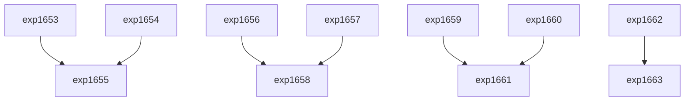

# Research Roadmap vNEXT (Milestone 2026.05.127)

## 1. What Previous Milestone Proved
Milestone 2026.05.126 successfully shipped:
- **NSVIF DSL**: Bridged external SMT formal verifiers.
- **STATIC CSR Mask**: Pre-computed structure constraint boundaries.
- **FR-11 CerCE Ledger**: Safely tracked memory updates to constraint solvers.
- **KV260 Potts Synthesis**: Confirmed our Ising formulation fits under FPGA BRAM limits.

## 2. Gaps and Phase Definitions
**Gap 1 (Execution):** The NSVIF DSL and STATIC CSR mask need integration into full pipeline execution across SOTA LLMs for E2E energy-guided decoding.
**Gap 2 (Self-Learning):** Scaling FR-11 CerCE ledger to actual continuous policy updates (SMGI certified updates) on larger datasets without catastrophic forgetting.
**Gap 3 (Hardware/EBM):** Deploying the KV260 Potts sampler inside the execution loop to rank LLM generated traces via EBRM-style trace scoring.

### Phase 0: Preflight and Archiving
- Archive `.126` and initialize `.127`.

### Phase 1: Verification & Energy-Guided Decoding
- Integrate NSVIF DSL with local SOTA GGUFs.
- Implement Energy-Guided Decoding with STATIC CSR masks.
- Validate on mandated SOTA models (Qwen3.6-35B, Gemma-4-31B).

### Phase 2: EBRM Trace Scoring & Hardware 
- Implement continuous latent trace scorer based on EBRM findings.
- Offload EBRM scoring to the synthesized KV260 Potts hardware.
- Compare CPU vs hardware scoring latencies on SOTA generation outputs.

### Phase 3: Continuous Self-Learning (SMGI)
- Integrate SMGI "certified updates" to guarantee zero-forgetting.
- Introduce LTLZinc temporal benchmark for memory retention tests.
- Run complete FR-11 self-learning cycle scaling CerCE.
- Prototype Pi-net differentiable projection as a fallback.

### Phase 4: Synthesis & Retro
- Evaluate Pi-net accuracy.
- Update E2E test plans and perform the milestone retrospective.

## 3. Dependency Graph

## 4. Hardware Requirements
- **Compute:** Dual RTX 3090 (local SOTA execution for exp1655, exp1658, exp1661).
- **FPGA:** KV260 board connected and available for `carnot-gpu` execution.