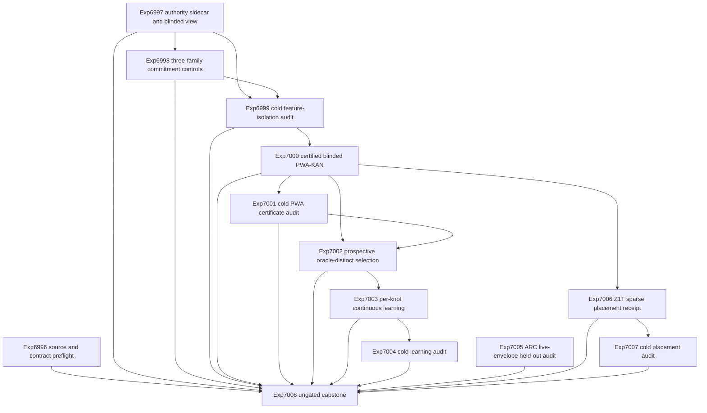

# Research Roadmap vNEXT: Blinded Constraint Energy and Sparse Placement

**Milestone:** `2026.09.613`  
**Status:** Proposed  
**Date:** 2026-09-04  
**Task contract:** 13 tasks, `exp6996` through `exp7008`, in the exact order below.

## Purpose

V612 found the first causal fault in its science branch. Mutation provenance
alone predicted exact validity with AUROC `0.9532275`. The leakage audit
therefore disqualified the feature bank. The PWA-KAN, selection, and online
learning tasks correctly stopped.

V613 removes that shortcut before fitting another model. It then tests three
claims in order:

1. A learner-facing feature table stays invariant when authority metadata
   changes or disappears.
2. A certified PWA-KAN ranks exact mappings on prospective groups without using
   exact labels or provenance as features.
3. Per-knot updates improve later exact selection without reducing prior or
   best-at-k support.

Two independent branches test live ARC engine evidence and a static Z1T-style
sparse placement. Neither branch claims a game solve or hardware execution.

## What V612 Proved

V612 completed its 12-task execution contract.

- Exp6984 froze 36 balanced exact contrast pairs.
- Exp6985 froze a 24-event chronological constraint-shift stream.
- Exp6986 scored 138 candidates with all three required GGUF families. It wrote
  414 CUDA-backed candidate-model rows.
- Exp6987 replayed the bank but found a mutation-metadata shortcut. Its
  `contrast_feature_bank_ready_score` was zero.
- Exp6988 was gate-blocked. Exp6989 through Exp6992 were cascade-blocked.
- Exp6993 made the ARC live producer write a complete evidence envelope.
- Exp6994 confirmed the envelope and route in a fresh process.
- Exp6995 confirmed document/YAML parity and stable publication gates. It
  classified the milestone science as null and named Exp6987 as the earliest
  causal boundary.

V612 also proved what not to repeat. A feature bank is not admissible because
its labels are balanced. Metadata can still encode the label. Another PWA fit
before learner-view blinding would repeat the same invalid method.

## Three Biggest Gaps to the PRD Vision

### Gap 1: Evidence isolation is incomplete

Carnot has authentic local-model features and exact authorities. It does not
yet have a learner table whose predictions are invariant to mutation
provenance, source bookkeeping, split labels, and authority records. This gap
blocks every learned verifier claim.

### Gap 2: The verifier moat is still only exact execution

Z3 and bounded enumeration can certify outputs after generation. Carnot has not
shown that a non-oracle learned energy selects a better candidate on prospective
groups. The PRD requires a reusable verification layer, not an oracle hidden in
a feature column.

### Gap 3: Verified outcomes do not yet improve future behavior

V611 prompt memory changed no decisions. V612 never reached per-knot learning.
Carnot still lacks a durable loop from exact outcome to bounded local update to
future benefit. ARC also has producer evidence but no quality result from a
real complete live envelope.

## Research Inputs

The source sweep is recorded in `research-references.md` under
`V613 Planner Refresh - 2026-09-04`.

- Self-Commitment Latency motivates a reward-free shortcut control. V613 adapts
  it to partial mapping contexts and keeps it outside the learner features.
- Isomorphic Perturbation Testing motivates sidecar permutation, replacement,
  and removal while learner tensors remain fixed.
- Unfaithful reasoning results require exact execution outside rationales and
  model self-reports.
- KAN-CL motivates local spline support and per-knot importance anchoring.
- FlowBalance motivates exact group-advantage release and no-op updates for
  tied groups.
- Z1T, Torx, and Thermalizers motivate an explicit sparse graph, typed
  operations, partition crossings, and unsupported-operation accounting.

No source supplies a drop-in Carnot verifier. V613 adapts bounded mechanisms
and tests them against exact external evidence.

## Architecture

Exp6996 and Exp7005 are infrastructure slots. Exp7005 is part of the hardware
research line, but it emits a static placement receipt only. Exp7008 has no
structured gate. It reconciles every terminal state without retrying external
blocks.

## Phase 1: Blinded Evidence

### Exp6996: V613 source delta and task-contract preflight

Freeze the execution-time source delta. Independently parse this document and
`research-roadmap-next.yaml`. Check all 13 IDs, titles, deliverables, gates,
gate producers, prior-failure entries, model rules, and artifact fields.

This task is advisory. It must not gate the science branches or edit the
conductor.

### Exp6997: Authority-only mutation sidecar and blinded learner view

Transform the V612 long feature bank into one wide candidate row per candidate.
Keep only numeric, label-blind model and parser features in the learner table.
Put exact labels, splits, source groups, mutation provenance, and authority
records in hashed authority-only sidecars.

The learner loader must accept only the learner path and a frozen feature
allowlist. It must not open a sidecar. This task reuses the completed GGUF rows;
it does not rerun model inference.

### Exp6998: Three-family self-commitment shortcut controls

Use the three required local GGUF families on 12 frozen audit pairs. Compare
clean, true-provenance-hint, and permuted-decoy-hint prompt conditions. Measure
when each model commits to its own final validity choice over partial contexts.

This is an adaptation of self-commitment latency. It is not a reproduction of
the GSM8K paper. The result is an audit-only negative control. No commitment
feature may enter PWA training or selection.

### Exp6999: Independent blinded feature isolation and shortcut audit

Start a fresh read-only process. Rebuild the wide learner rows and verify that
sidecar permutation, replacement, and removal do not change any learner tensor,
hash, or reference prediction. Rerun grouped shortcut probes.

The audit must include the Exp6998 commitment result as a prohibited-feature
control. Release the bank only if direct leakage is zero and no forbidden
metadata-only probe has an upper 95% interval at or above `0.80` AUROC.

## Phase 2: Certified Prospective Selection

### Exp7000: Certified blinded PWA-KAN constraint ranker

Train one compact KAN from the wide learner table. Use only train labels for
fitting and calibration labels for model selection. Freeze the model and PWA
abstraction before opening the 12 fixture held-out pairs.

Compare constant, mean normalized likelihood, logistic, and size-matched MLP
controls. Use a real MILP solver for bounds, irrelevant-field invariance, and
local Lipschitz claims. Exact execution evaluates the result but never ranks a
candidate.

### Exp7001: Fresh-process blinded PWA-KAN certificate audit

Load the KAN, PWA abstraction, controls, and rows read-only. Recompute every
hash, bound, MILP query, held-out metric, interval, and source readiness field.
A confirmed scientific null is a valid audit outcome.

### Exp7002: Oracle-distinct blinded constraint selection comparison

Freeze all non-oracle selections before opening labels on the 16 headroom
events in the chronological stream. Compare fixed order, likelihood, logistic,
MLP, and PWA-KAN arms. Report the 12 fixture held-out pairs and V611 transfer
groups as secondary evidence.

The exact oracle is an evaluator and ceiling. It is not an eligible arm.

## Phase 3: Continuous Self-Learning

### Exp7003: Verifier-grounded blinded per-knot continuous self-learning

Run frozen, unrestricted-update, uniform-anchor, and per-knot-anchor arms over
the 24 sealed events. Record each selection before opening the exact outcome.
Use exact group advantage for release. Do not update on all-valid or all-invalid
tied groups.

The per-knot arm may update only active spline support. It must journal and
certify each change, roll back unsafe updates, and open held-future windows only
after the stream ends. GGUF weights remain frozen and unloaded.

This task satisfies the milestone's continuous self-learning requirement. It
tests Tier 1 online constraint weights and Tier 4 local structural adaptation.

### Exp7004: Fresh-process self-learning retention and support audit

Replay all four arms without writes. Recompute chronology, updates, active
knots, certificates, rollbacks, future support, and forgetting. Confirm that no
current or future label entered an earlier decision.

This task runs after any completed learning comparison. It does not require a
positive learning verdict.

## Phase 4: Live Evidence, Sparse Placement, and Reconciliation

### Exp7005: Prospective ARC live-envelope held-out engine audit

Select only a real `live_agent_attempts` envelope created after Exp6993. Require
complete prompt, transition, engine, environment, policy, factory, and manifest
hashes. Score its engine on frozen construction and held-out transitions in a
network-disabled process. Compare it with deterministic inert and pre-engine
baselines.

If no real complete envelope exists, report `blocked` once. Do not use the
Exp6993 fixture as model-quality evidence. Do not inspect game source, solve a
level, or update the solve registry.

### Exp7006: Z1T sparse scorer placement receipt

Compile the frozen Exp7000 PWA-KAN graph to a substrate-neutral typed graph.
Classify nodes as Z1-native sparse tanh-linear, FPGA/XPU-side, unsupported, or
boundary. Count degree, quantization, state, bandwidth, and crossing costs.

Use public Z1T assumptions only as declared inputs. Do not copy the reported
speedup, estimate energy, contact hardware, or claim that the graph ran on Z1.

### Exp7007: Fresh-process Z1T placement and claim audit

Rebuild the typed graph and placement in a fresh process. Recompute node counts,
degree limits, dy4p use, crossings, unsupported operations, and hashes. Check
that every performance and hardware-execution claim is false.

This is a static compiler-receipt audit. It is not a hardware benchmark.

### Exp7008: V613 independent evidence capstone and V614 handoff

Reconcile all 13 task slots from primary artifacts. Recompute every headline
from per-unit rows. Report blinded evidence, learned energy, continuous
learning, ARC live-envelope quality, and Z1T placement as separate branches.

Use stable G1-G4 publication fields. Recommend V614 from the first causal
boundary. Do not count infrastructure completion as scientific progress.

## Exact Task Contract

This table is the execution contract for `research-roadmap-next.yaml`.

| Order | Task ID | Exact title | Deliverable | Structured gates |
|---:|---|---|---|---|
| 1 | `exp6996-v613-source-contract-preflight` | V613 source delta and task-contract preflight | `results/experiment_6996_v613_source_contract_preflight.json` | None |
| 2 | `exp6997-authority-sidecar-rebuild` | Authority-only mutation sidecar and blinded learner view | `results/experiment_6997_authority_sidecar_rebuild.json` | None |
| 3 | `exp6998-three-family-commitment-controls` | Three-family self-commitment shortcut controls | `results/experiment_6998_three_family_commitment_controls.json` | `exp6997-authority-sidecar-rebuild.blinded_learner_view_ready_score == 1` |
| 4 | `exp6999-blinded-feature-cold-audit` | Independent blinded feature isolation and shortcut audit | `results/experiment_6999_blinded_feature_cold_audit.json` | `exp6997-authority-sidecar-rebuild.blinded_learner_view_ready_score == 1`; `exp6998-three-family-commitment-controls.commitment_control_complete_score == 1` |
| 5 | `exp7000-certified-blinded-pwa-kan` | Certified blinded PWA-KAN constraint ranker | `results/experiment_7000_certified_blinded_pwa_kan.json` | `exp6999-blinded-feature-cold-audit.blinded_feature_bank_ready_score == 1` |
| 6 | `exp7001-pwa-certificate-cold-audit` | Fresh-process blinded PWA-KAN certificate audit | `results/experiment_7001_pwa_certificate_cold_audit.json` | `exp7000-certified-blinded-pwa-kan.pwa_candidate_artifact_complete_score == 1` |
| 7 | `exp7002-oracle-distinct-selection` | Oracle-distinct blinded constraint selection comparison | `results/experiment_7002_oracle_distinct_selection.json` | `exp7000-certified-blinded-pwa-kan.pwa_model_ready_score == 1`; `exp7001-pwa-certificate-cold-audit.pwa_certificate_confirmed_score == 1` |
| 8 | `exp7003-per-knot-continuous-learning` | Verifier-grounded blinded per-knot continuous self-learning | `results/experiment_7003_per_knot_continuous_learning.json` | `exp7002-oracle-distinct-selection.selection_comparison_complete_score == 1` |
| 9 | `exp7004-self-learning-cold-audit` | Fresh-process self-learning retention and support audit | `results/experiment_7004_self_learning_cold_audit.json` | `exp7003-per-knot-continuous-learning.self_learning_run_complete_score == 1` |
| 10 | `exp7005-arc-live-envelope-audit` | Prospective ARC live-envelope held-out engine audit | `results/experiment_7005_arc_live_envelope_audit.json` | None |
| 11 | `exp7006-z1t-sparse-placement` | Z1T sparse scorer placement receipt | `results/experiment_7006_z1t_sparse_placement.json` | `exp7000-certified-blinded-pwa-kan.pwa_candidate_artifact_complete_score == 1` |
| 12 | `exp7007-z1t-placement-cold-audit` | Fresh-process Z1T placement and claim audit | `results/experiment_7007_z1t_placement_cold_audit.json` | `exp7006-z1t-sparse-placement.z1t_placement_receipt_complete_score == 1` |
| 13 | `exp7008-v613-capstone` | V613 independent evidence capstone and V614 handoff | `results/experiment_7008_v613_capstone.json` | None |

No task may add an undeclared conductor gate during implementation. Internal
checks may fail closed, but they must not change conductor order.

## Dependency Graph

- Exp6996 is an independent advisory root.
- Exp6997 is the main science root.
- Exp6998 depends only on the blinded learner-view receipt.
- Exp6999 depends on the blinded view and completed commitment controls.
- Exp7000 depends on the independent blinding release.
- Exp7001 audits any complete PWA candidate, including a null or failed
  certificate.
- Exp7002 requires a ready model and a confirmed certificate.
- Exp7003 runs after any complete selection comparison. It does not require a
  positive selection result.
- Exp7004 runs after any complete self-learning comparison.
- Exp7005 is an independent ARC root.
- Exp7006 maps any complete frozen PWA candidate.
- Exp7007 depends only on the static placement receipt.
- Exp7008 is ungated and reads every available artifact.

## Hardware Requirements

| Resource | Tasks | Requirement |
|---|---|---|
| Two RTX 3090 GPUs | Exp6998 | Task-owned lease, sequential family loads, CUDA offload, checkpointing, teardown, and VRAM-return receipts |
| Required GGUFs | Exp6998 | `unsloth/Qwen3.6-35B-A3B-GGUF`, `unsloth/gemma-4-31B-it-GGUF`, and `unsloth/gemma-4-26B-A4B-it-GGUF` |
| CPU and RAM | All tasks | Wide-row transforms, grouped probes, KAN training, MILP, ARC replay, static graph placement, and cold audits |
| Local disk | Exp6997-Exp7008 | Immutable sidecars, raw rows, model hashes, PWA coefficients, journals, engine envelopes, and placement receipts |
| ARC service | None | Exp7005 consumes an existing real producer envelope with network disabled |
| FPGA boards | None | KV260 and GateMate remain terminal; PolarFire remains opportunistic; no access state changed |
| Extropic Z1 | None | No authenticated device or runner exists; Exp7006 and Exp7007 are static only |
| Kona | None | No public weights, training recipe, or reproducible local runner exists |

Legacy Qwen3.5-0.8B and Gemma-4-E4B models may run smoke tests only. They may
not enter experiment rows, comparisons, readiness fields, or headlines.

## Evidence and Stop Rules

- Every comparative task emits per-unit rows.
- Every blocked verdict emits `gate_check_summary`.
- Every task emits the closed `verdict_class` enum.
- Every no-LLM task uses an `inference_substrate` that ends in `_no_llm`.
- Every structured gate reads a bare field declared by an earlier task in this
  roadmap.
- The learner view contains no label, split, source, mutation, authority, or
  categorical model-identity field.
- Commitment controls are audit-only and prohibited from learned features.
- Exact authorities may evaluate learned ranking but may not perform it.
- Positive PWA claims require held-out paired improvement over the strongest
  matched non-oracle control.
- Positive learning claims require future gain, no lost prior successes, and
  no best-at-k support shrinkage.
- Exp7005 emits `solve_claimed=false`, `level_claimed=false`, and
  `registry_updated=false`.
- Exp7006 and Exp7007 emit `hardware_executed=false`,
  `energy_speedup_claimed=false`, and `latency_speedup_claimed=false`.
- External absence is `blocked`, not `partial`.
- Exp7008 stays runnable after any upstream block.

## Milestone Exit

V613 completes when Exp7008 writes a terminal artifact and reconciles all 13
contract rows. Scientific success is optional. Evidence isolation and contract
honesty are mandatory.
