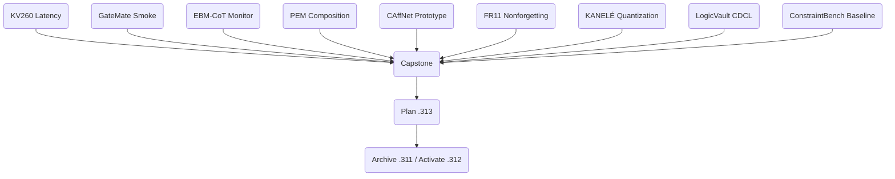

# Research Roadmap v2026.05.312

**Milestone Title:** Hardware Execution, EBM-CoT Calibration, and Nonforgetting Continuous Learning

## 1. Context and Previous Milestone (.311) Summary

Milestone `2026.05.311` successfully completed hardware and infrastructure prerequisites. We restored KV260 SSH connectivity, added AXI/UIO interfaces to the GateMate N=16 Ising RTL, scaled FR-11 counterexample repair to 100 cases, implemented LogicVault concurrent agent beliefs, and verified EBT sidecar KAN scoring.

However, three major gaps remain between our current state and the PRD vision:
1. **True Hardware Latency Evidence:** We have synthetic hardware definitions but lack real end-to-end wall-clock latency proof via the UIO registers on the KV260 and GateMate boards.
2. **Live Energy-Based Continuous Generation (Phase-3):** We need to prove that Energy-Based Models applied to reasoning traces (EBM-CoT) offer measurable superiority over pure autoregressive generation, tracking intermediate hallucination risk.
3. **Rigorous Nonforgetting Constraints:** Continuous self-learning (FR-11) currently relies on bulk replay. We lack online locality-aware bounds that prevent catastrophic forgetting of prior verifier axioms.

## 2. Theoretical Anchors (2025-2026)

This milestone integrates recent findings from arXiv (2025–2026):
*   **Energy-Based CoT Calibration & Monitoring:** Oarga & Du's Parallel Energy Minimization (PEM) and Interwhen-style verifier monitors, shifting hallucination detection to "early commitment failures" in the reasoning trajectory.
*   **HardNet++/CAffNet Differentiable Layers:** Moving beyond soft penalties to hard constraint satisfaction embedded directly into neural layer projections.
*   **KANELÉ Quantization & KAN-CL:** Utilizing LUT-based evaluation for massive KAN speedups on FPGA and applying locality anchoring for non-forgetful continual learning.

## 3. Phase Descriptions

### Phase 1: Hardware Execution & Acceleration
Convert the `.311` preparation into concrete latency numbers. Flash the `carnot_ising_v4` to the KV260, execute a sample via `/dev/uio0`, and measure real latency against a CPU fallback. Follow this with a dirtyJtag flash of the new AXI-enabled N=16 GateMate design.

### Phase 2: Live SOTA Inference with EBM-CoT
Leverage `unsloth/Qwen3.6-35B-A3B-GGUF` and `unsloth/gemma-4-31B-it-GGUF`. We will implement trajectory monitors to score intermediate reasoning tokens, enforcing global coherence via energy evaluation instead of treating CoT as purely unguided.

### Phase 3: Hard-Constraint Prototyping
Introduce differentiable constraint architectures (CAffNet) as Tier-1 prototypes, proving that we can guarantee 100% affine constraint satisfaction in the forward pass.

### Phase 4: Continuous Self-Learning Resilience
Upgrade FR-11 with KAN-CL inspired locality-aware updates to prevent forgetting. Test whether learning a new constraint violation reduces holdout accuracy, and apply Conflict-Driven Clause Learning (CDCL) paradigms to LogicVault to shorten multi-agent search cycles.

## 4. Hardware Requirements
*   **KV260 Board:** Powered on, SSH reachable (`ssh kria`), loaded with the `carnot_ising_v4` bitstream.
*   **GateMate A1-EVB-2M:** USB attached, accessible via `openFPGALoader -c dirtyJtag`.
*   **GPU:** Local RTX/ROCm setup for SOTA GGUF inference (Qwen3.6-35B, Gemma4-31B).

## 5. Dependency Graph

