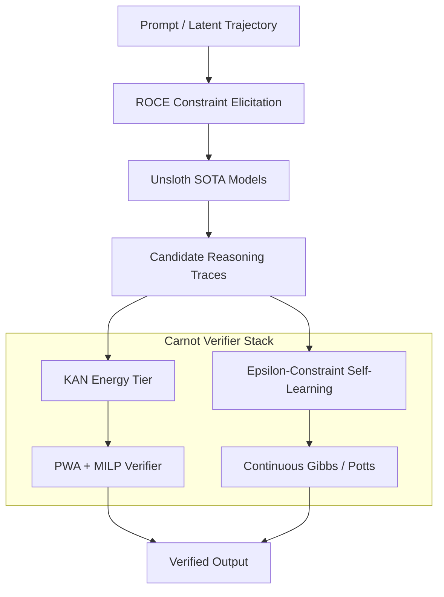

# Carnot Research Roadmap: vNEXT (Milestone 2026.05.143)

**Document:** `openspec/change-proposals/research-roadmap-vNEXT.md`
**Title:** Phase-20: Verifiable KAN Abstractions, Epsilon-Constraint Self-Learning, and SOTA Structured Output Scale
**Status:** DRAFT

## 1. What Milestone 2026.05.142 Proved

Milestone 2026.05.142 delivered on bridging energy-based latent planning and zero-violation online learning. Specifically, it showed that latent trajectory tracking can operate via Continuous Convex Optimization with Memory (COCO-M), while also setting the stage for SOTA model evaluation on MoE platforms. However, there remain key gaps:
1. **Verifiability of KANs:** While KAN components have been integrated, they lack formal verification abstractions (e.g., MILP based on piecewise-affine functions).
2. **Online Learning Drift:** Zero-violation policies alone are not sufficient to prevent forgetting; hard epsilon-constraint preservation is needed.
3. **Structured Instruction Constraints:** We lack an open-world elicitation framework to turn user intent into strict verifiable bounds dynamically.

## 2. Milestone 2026.05.143 Objectives

This milestone focuses on strictly verifiable abstractions, continuous learning without forgetting via gradient-guided epsilon constraints, and dynamically eliciting logical constraints directly from language.

### Success Criteria
- **Formal KAN Verifier:** Piecewise-affine (PWA) and MILP abstractions successfully bound the outputs of KAN energy tiers.
- **Hardware-Oriented Metrics:** Concrete RM, BOP, NABS measurements established for the KAN layer to validate FPGA readiness.
- **Non-Forgetting OCL:** FR-11 self-learning achieves zero forgetting on baseline constraints using the Gradient-Guided Epsilon Constraint Method.
- **Constraint Elicitation (ROCE):** Dynamic schema constraints generated dynamically from open-ended SOTA inference.

## 3. Architecture Overview

## 4. Phase Descriptions

### Phase 1: KAN Verification and Hardware Constraints
We adapt arXiv:2602.06737 to encode KAN safety properties via piecewise-affine approximations into an MILP, and implement arXiv:2604.03345 hardware-complexity metrics to ground FPGA targets.

### Phase 2: Open Constraint Elicitation and SOTA Integration
Implement the ROCE framework (Reasoning-Time Open Constraint Elicitation, arXiv:2605.01124) and test it strictly against our dual-GPU pipeline utilizing `unsloth/Qwen3.6-35B-A3B-GGUF` and `unsloth/gemma-4-31B-it-GGUF`.

### Phase 3: Continuous Epsilon-Constraint Learning
Deploy the Gradient-Guided Epsilon Constraint Method to resolve FR-11's memory-forgetting loop, ensuring positive utility growth.

### Phase 4: Capstone and Retrospective
Close the milestone with a complete E2E validation against the full test suite and log the standard retrospective.

## 5. Dependency Graph

- `exp1840-pwa-kan-abstraction` blocks `exp1841-milp-kan-verifier`
- `exp1844-roce-constraint-elicitation` blocks `exp1846-qwen-roce-scale` and `exp1847-gemma31-roce-scale`
- `exp1848-gemma26-epsilon-learning` (Mandatory Self-Learning)
- `exp1850-retro` must run last.

## 6. Hardware Requirements

- **Dual RTX 3090:** Mandated SOTA GGUF models (`unsloth/Qwen3.6-35B-A3B-GGUF`, `unsloth/gemma-4-31B-it-GGUF`, `unsloth/gemma-4-26B-A4B-it-GGUF`) will run distributed across the dual-GPU pipeline.
- **KV260 / Simulation:** The KAN inference metrics will remain simulation/accounting only.
