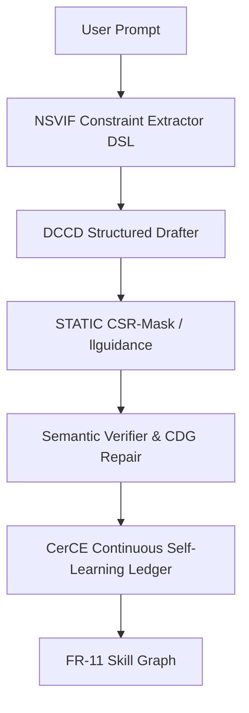

# Milestone 2026.05.122: Constraint Extraction, Scalable Repair, and Certifiable Non-Forgetting

## 1. What Previous Milestone Proved
Milestone `.121` confirmed that structured output verification (DCCD/JSONSchemaBench) runs cleanly on mandated SOTA GGUFs, producing semantic validity of 1.0 with zero false accepts. However, the bottleneck remains extracting these constraints from natural language instructions (NSVIF/RvLLM capability) and executing continuous self-learning without catastrophic forgetting (FR-11 retention collapse). Hardware parity for Z1 and KV260 requires bounded, simulated verification before hardware claims.

## 2. Architecture Diagram (Phase 3 - Phase 7)

## 3. Phases & Experiments
### Phase 1: Constraint Extraction (NSVIF/RvLLM Hook)
Address the main product gap by building an instruction-to-constraint pack.
- **Exp 1588:** Build NSVIF/RvLLM DSL parser.
- **Exp 1589:** Zero-false-accept validation on mandated SOTA GGUF models.
- **Exp 1590:** CSR-mask prototype for schema acceleration.

### Phase 2: Structured Verdict & CDG Repair
- **Exp 1591:** Upgrade DCCD to reusable structured verdict adapter.
- **Exp 1592:** Run DCCD repair on FoVer using SOTA models.
- **Exp 1593:** Constraint Dependency Graph (CDG) guided repair.

### Phase 3: Continuous Self-Learning (CerCE / SIGOOD)
- **Exp 1594:** CerCE-style certificate ledger for FR-11.
- **Exp 1595:** Pre/post constraint bounds check.
- **Exp 1596:** FR-11 v16 skill-promotion with positive utility gates.

### Phase 4: Hardware Integration & Verification
- **Exp 1597:** CPU-only inertial-update Ising ablation.
- **Exp 1598:** Z1 drift simulation bounding.
- **Exp 1599:** KANELÉ hardware LUT-complexity accounting.
- **Exp 1600:** OT framing paper-v6 revision.

## 4. Hardware Requirements
- Dual RTX 3090 (local inference for GGUFs).
- CPU-only execution for simulator tracks (Inertial Ising, Z1 drift).
- FPGA execution explicitly excluded (LUT/BRAM accounting only).
