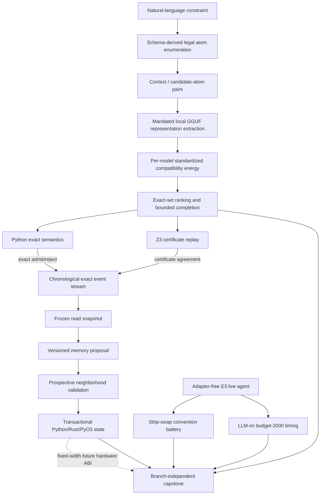

# Research Roadmap vNEXT — Milestone 2026.07.528

**Milestone title:** Discriminative Exact-Atom Acquisition, Delayed-Commit
Continuous Learning, and ARC Budget/Convention Generalization

**Status:** Pre-staged after terminal milestone `2026.07.527`

**Experiment range:** Exp5961-Exp5973

**Primary question:** Can Carnot replace retired generated-ConstraintIR
mechanisms with a discriminative exact-atom energy surface, exercise verified
continuous learning through a delayed transactional commit, and resolve the two
highest-value open ARC measurements without re-solving public games?

## What milestone 2026.07.527 proved

| Evidence | Terminal result | Consequence for `.528` |
|---|---|---|
| Exp5932 transition | `.526` identities were archived without outcome laundering; live adversarial recheck is clean | Transition mechanics are reusable, but `.528` must preserve the `.527` retirement and gate block explicitly |
| Exp5933 aggregation QA | The substrate classifier repair is task-ready; paired controls and immutable Exp5931 replay pass | Capstones may aggregate upstream GPU receipts without being misclassified as live inference |
| Exp5934 source delta | `complete_null`; no post-V527 source was accepted | The planner's V528 marker is the new source boundary |
| Exp5935 deterministic support | Non-pruning atom support, exact completion, and tamper controls are ready | The exact executor is sound; the unresolved question is how to acquire semantic atoms |
| Exp5936 all-three-model support union | `retired`; all arms and all three mandated GGUF families had zero parse, atom recall, and exact-semantic success | No more prompt/schema/multi-view generated-IR retries; a new discriminative mechanism is required |
| Exp5937 downstream CSL | Gate-blocked by Exp5936 retirement | Continuous learning must use the already-ready exact prospective stream and transactional state, not failed model-generated events |

Two outer-loop measurements landed after the `.527` plan and are also binding:

- Increasing ARC `MAX_ACTIONS` from 400 to 2000 produced roughly seven more
  LLM-off game wins, but LLM-on wall time at 2000 is unknown. No flag change is
  justified until the seven gain games fit the shared 12-hour budget.
- The frontier convention result is robust, while HUD convention-dependence is
  still undecided because roll perturbations destroy the anchor games. A
  row/column strip swap is the named targeted transform.

## The three largest gaps to the PRD vision

### Gap 1 — exact semantic acquisition remains absent

The PRD requires natural-language intent to become executable constraints.
Carnot has exact typed backends, replay, schema support, and a non-pruning atom
executor, but every recent flagship model path that *generated* the formal
object has retired. The gap is semantic identification, not syntax.

`.528` changes the direction: enumerate legal atoms deterministically, then use
output-free GGUF representations to score natural-language/atom compatibility.
The model proposes an energy over a finite typed atom set; Python/Z3 remains
the sole semantic authority. HIDE (`2506.17748`) motivates context/candidate
representation decoupling, while Solver-Hard (`2607.17047`) motivates
proof-preserving relabel and surface controls.

### Gap 2 — self-learning infrastructure exists but has not learned prospectively

Exp5920 provides a chronological exact event stream, Exp5924 provides
transactional memory, and Exp5926 proves Python/Rust/PyO3 ABI-v2 parity. The
PRD's FR11 claim still lacks an admitted, prospective, shortcut-resistant update
loop on that stack.

Memoir (`2607.20792`) reports a learning-speed penalty when a pondering step
writes to the same fast memory it reads. `.528` therefore compares frozen
read-snapshot/delayed commit against same-event write-through, fixed memory, and
no memory, then attacks the winner with poison, drift, retention, and rollback
tests. Model weights stay immutable.

### Gap 3 — ARC accuracy and efficiency policy is not measured at the live budget

All 25 public games are already cleared; replaying them is not progress.
Carnot instead needs a reusable hidden-game process whose accuracy and
efficiency survive convention changes and the official shared wall-clock
constraint. The two immediate gaps are a targeted HUD transform and LLM-on
budget-2000 feasibility. Both are measurements of the adapter-free live path,
not public-level solve tasks or registry updates.

## Research findings incorporated

| Source | Finding | `.528` use |
|---|---|---|
| HIDE, arXiv:2506.17748 | Context/output representation decoupling can detect failures in one pass | Exp5963-Exp5966 build and test exact natural-language/atom compatibility |
| Solver-Hard, arXiv:2607.17047 | Solver hardness and model difficulty dissociate; proof-preserving relabeling exposes surface sensitivity | Candidate fixtures are density/hardness controlled and contain relabel-held splits |
| Memoir, arXiv:2607.20792 | Coupled read/write fast memory slowed learning at a fixed budget | Exp5967-Exp5969 compare delayed commit to write-through |
| LTLA, arXiv:2511.16054 | Tractable future-constraint messages can steer decoding efficiently | Guarded future work only; it does not reopen grammar or finite-ID decoding |
| PAL, arXiv:2503.19466 | Exact constraint normalization can be amortized on GPUs | Reinforces exact backend separation; no semantic-acquisition claim |
| Million-p-bit and pipelined PIM, arXiv:2606.25313 / 2607.21077 | Sampling hardware needs explicit communication, precision, and throughput-quality contracts | Hardware requirements and ABI context only; no board execution claim |

## Target architecture



The architectural boundary is load-bearing:

- The GGUF model supplies a representation-derived proposal energy, never an
  acceptance label.
- Candidate atoms come from public type/operation schemas, not hidden answers.
- Exact semantics require Python/Z3 agreement.
- Memory reads a frozen version; promotion occurs only after chronological
  future-event validation.
- ARC uses the live adapter-free mechanism and may not inspect game source,
  use a per-game adapter, run offline ground-truth BFS, or mutate the solve
  registry.

## Phase A — evidence boundary and discriminative exact-atom acquisition

### Exp5961 — terminal transition into `.528`

Archive exactly the six activated `.527` identities and their terminal classes,
append the milestone at most once, and prove Exp5961-Exp5973 collision-free.
Inherited repository debt is preserved by identity and may not be amplified.

**Deliverable:** `results/experiment_5961_transition_v528.json`

### Exp5962 — post-V528 source-delta ingestion

Search only after the exact V528 reference marker. Zero accepted findings is a
valid terminal result. The task may append references but may not rewrite
activated identities, gates, exclusions, or protected files.

**Deliverable:** `results/experiment_5962_v528_source_delta_ingestion.json`

### Exp5963 — hardness-controlled context/atom pair fixture

Extend the ready Exp5868/Exp5879 hardness fixture into a candidate-pair
benchmark. Freeze legal atom enumeration, hard negatives, family-held splits,
proof-preserving relabels, paraphrases, claim flips, norm/length controls,
label permutations, and sealed reference labels before any model load.

**Deliverable:** `results/experiment_5963_exact_atom_pair_fixture.json`

### Exp5964 — gated all-three-model GGUF compatibility corpus

For every required SOTA family, extract output-free final-token embeddings for
the sealed context/candidate pairs. Standardize within model and fold; never
concatenate raw family dimensions. Qualification requires non-degenerate
positive controls and failure of norm-only, length-only, label-permutation, and
raw-model-identity shortcuts.

**Deliverable:** `results/experiment_5964_sota_atom_compatibility_corpus.json`

### Exp5965 — gated portable compatibility-energy ranker

Train and evaluate simple preregistered compatibility energies on cached
representations with family/group-held splits and at least five seeds. Compare
linear, RBF/HSIC-inspired, cosine, TF-IDF, character n-gram, norm-only,
length-only, and permutation controls. The headline is held atom ranking and
calibration, not generic hallucination detection.

**Deliverable:** `results/experiment_5965_portable_atom_energy_ranker.json`

### Exp5966 — gated end-to-end discriminative exact acquisition

Use deterministic atom enumeration plus the qualified energy to recover
multi-atom exact sets. Compare against frozen Exp5936 and structural baselines
without generating a new IR. Require exact-set success, omitted/spurious atom
counts, Python/Z3 parity, held-family intervals, abstention, and unsafe-accept
zero.

**Deliverable:** `results/experiment_5966_discriminative_constraint_acquisition.json`

## Phase B — delayed-commit continuous self-learning

### Exp5967 — delayed-commit transaction fixture

Extend Exp5924 and Exp5926 with a frozen read snapshot, versioned proposal,
post-event commit, quarantine, and rollback semantics. Compare replay traces for
same-event write-through and delayed commit without using model outputs or eval
labels as authority.

**Deliverable:** `results/experiment_5967_delayed_commit_memory_fixture.json`

### Exp5968 — gated prospective continuous self-learning A/B

Run a chronological five-seed comparison over exact events: delayed commit,
write-through, fixed validated memory, shuffled retrieval, and no memory.
Promotion uses only future semantic-neighborhood utility and protected-prefix
retention. Report prequential performance and learning speed; no same-event
credit is allowed.

**Deliverable:** `results/experiment_5968_delayed_commit_csl_prospective.json`

### Exp5969 — gated poison, drift, retention, rollback, and ABI audit

Attack the selected policy with bounded poison bursts, repeated conflicts,
distribution shifts, crash/restart, ledger tampering, and Python/Rust/PyO3
replay. A promotion requires zero unsafe accepts and exact rollback/retention.

**Deliverable:** `results/experiment_5969_csl_poison_drift_abi_audit.json`

## Phase C — ARC convention and shared-budget generalization

### Exp5970 — strip-swap sentinel

Implement row and column strip swaps that move an edge bar beyond the HUD
tolerance while preserving the rest of the grid. Static-dose and behavioral
sentinels must show that the target predicate changes without destroying the
anchor support before a full battery is allowed.

**Deliverable:** `results/experiment_5970_arc_strip_swap_sentinel.json`

### Exp5971 — gated full strip-swap convention battery

Run the preregistered 25-game × 4-arm × 5-seed battery through the live
adapter-free E3 policy. Analyze on the game unit, require anchor survival, and
refuse a HUD verdict when support is empty or statistically incapable of the
declared claim. Do not change shipped flags or the solve registry.

**Deliverable:** `results/experiment_5971_arc_strip_swap_battery.json`

### Exp5972 — LLM-on budget-2000 feasibility

Use a mandated flagship local GGUF on the seven named budget-gain games plus a
healthy rerun of the unmatched `lp85` positive-control cell. Measure true
per-game and projected 25-game wall clock under the shared 12-hour budget.
Level outcomes are scheduling measurements only, with
`solve_provenance=live_agent_self_discovery`; no public solve is credited.

**Deliverable:** `results/experiment_5972_arc_llm_on_budget2000_feasibility.json`

## Phase D — exact reconciliation

### Exp5973 — branch-independent capstone

Resolve all 12 upstream tasks strictly by declared `(task_id, deliverable)`
identity. Preserve ready, positive, null, retired, blocked-precondition,
gate-blocked, underpowered, missing, and adversarial-flagged classes
independently. Reconcile internal specs and ops docs without converting a
successful branch into proof for another.

**Deliverable:** `results/experiment_5973_v528_capstone_reconciliation.json`

## Dependency graph

```text
Exp5961 transition ───────────────────────────────────────────────┐
Exp5962 source delta ─────────────────────────────────────────────┤
Exp5963 exact atom-pair fixture                                  │
  └─[pair_fixture_ready_score == 1]─> Exp5964 GGUF corpus        │
       └─[atom_compatibility_corpus_ready_score == 1]─> Exp5965  │
            └─[portable_atom_energy_ready_score == 1]─> Exp5966  │
                                                                 ├─> Exp5973
Exp5924 + Exp5926 ─> Exp5967 delayed-commit fixture              │
  └─[delayed_commit_fixture_ready_score == 1]─> Exp5968 CSL      │
       └─[prospective_csl_ready_score == 1]─> Exp5969 audit      │
                                                                 │
Exp5970 strip-swap sentinel                                      │
  └─[strip_swap_sentinel_ready_score == 1]─> Exp5971 battery     │
Exp5972 budget-2000 feasibility ─────────────────────────────────┘
```

The capstone is intentionally ungated. It must reconcile blocked and retired
branches exactly rather than disappear behind their gates.

## Model policy

Every task that invokes an LLM must include at least one mandated local model
in `MODEL_SPECS`. The milestone uses:

- `unsloth/Qwen3.6-35B-A3B-GGUF` — flagship MoE
- `unsloth/gemma-4-31B-it-GGUF` — flagship dense
- `unsloth/gemma-4-26B-A4B-it-GGUF` — middle MoE

Exp5964 uses all three via the public llama.cpp GGUF CUDA path and embedded
tokenizers. Exp5972 uses the flagship Qwen MoE unless its precondition fails,
in which case the task blocks rather than substitutes a legacy model. Legacy
Qwen3.5-0.8B or gemma-4-E4B-it may be used only for CPU smoke tests and never
for headline metrics. No task applies `AutoTokenizer` to a GGUF repository.

All experiment tasks use `agent_type: codex` and `model: gpt-5.5` under the
repository's standing Codex-default rule.

## Failed-experiment and retirement discipline

- Exp5964 declares Exp5853, Exp5200, and Exp5213. It changes the task from
  final-answer/MMLU probing and cross-model raw dimensions to within-model
  context/atom compatibility on an exact held fixture with shortcut controls.
- Exp5965 declares the gate-blocked Exp5854 portable-energy attempt and can run
  only after the replacement corpus passes integrity.
- Exp5966 declares Exp5909, Exp5923, and Exp5936. It changes the acquisition
  technique from generated IR/support to deterministic enumeration plus
  discriminative ranking.
- Exp5967-Exp5969 declare the blocked/null transactional CSL lineage and use
  ready Exp5920/Exp5924/Exp5926 prerequisites plus delayed commit.
- Every declaration includes `retire_if_same_verdict: true`. No task depends on
  a retired experiment ID and no retired ID is reused.

## ARC provenance and non-duplication

Exp5970 and Exp5971 measure convention transfer and do not claim a level solve.
Exp5972 records `solve_provenance: live_agent_self_discovery` because level
outcomes can occur during the timing run, but the artifact must state that they
are not new solve credit. All ARC tasks must:

- precheck `ops/arc_solve_registry.yaml`;
- keep the registry byte-identical;
- use `make_carnot_agent` / `E3AgentPolicy`;
- disable game source, hand `GameAdapter`, offline ground-truth BFS,
  per-game calibration/model, registry trajectories, and hidden-game prior;
- report accuracy and efficiency on the live reachable path.

## Hardware requirements

| Resource | Use | Requirement |
|---|---|---|
| Dual RTX 3090 | Exp5964 all-family embeddings; Exp5972 flagship live policy | Preflight cached GGUF hashes, CUDA offload, per-device VRAM, thermal headroom, disk, and process cleanup before model load |
| CPU/RAM | Exact atom enumeration, Python/Z3 replay, CSL, ARC no-LLM cells | Sufficient for sealed datasets and deterministic replays; no synthetic speed claim |
| Rust/PyO3 | Exp5967/Exp5969 adaptive-state parity | Reuse ABI v2; fixed-width operations and exact ledger hashes |
| KV260, GateMate, PolarFire | No execution task | Current routes have no changed authenticated workload path; architecture mapping only |
| Extropic XTR-0/Z1 | No execution task | No authenticated local access; simulation or vendor claims are not hardware evidence |

Every compute task has a step-zero precondition and must emit an honest
`blocked:` artifact when required hardware, model files, runtime features, or
time budgets are absent. No mock model, fake row, sleep substitute, CPU
headline fallback, or claimed board receipt is permitted.

## Milestone success criteria

The milestone is successful if it produces exact evidence for all branches,
including honest nulls and blocks. Scientific promotion requires:

1. The discriminative atom path survives shortcut controls and achieves
   family-held exact-set recovery above frozen baselines with unsafe acceptance
   equal to zero.
2. The delayed-commit learner improves prospective utility or learning speed
   without protected-prefix regression, poison propagation, or rollback/ABI
   divergence.
3. The strip-swap battery either identifies convention dependence with live
   anchor support or honestly proves the transform cannot decide it.
4. The budget task produces a measured 25-game wall-clock projection and no
   flag recommendation unsupported by shared-budget evidence.
5. Exp5973 preserves every terminal class and all protected files, with fresh
   adversarial-verifier receipts and no outcome laundering.

## Non-goals

- No generated ConstraintIR, schema reprompt, atomic union, parser retry,
  finite-ID answer transport, or external generated-text/logprob scorer retry.
- No KAN adaptive-kernel revival.
- No public ARC level re-solve, offline source/BFS solve, per-game adapter,
  registry update, or operator flag flip.
- No new FPGA bitstream, unchanged board probe, TSU execution, or hardware
  speedup claim.
- No model-weight update; continuous learning is versioned external state.
- No modification of `research-roadmap.yaml` or
  `scripts/research_conductor.py`, and no push.
