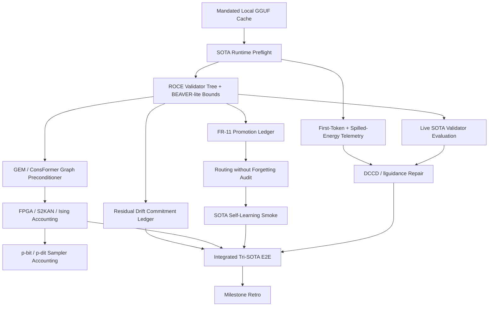
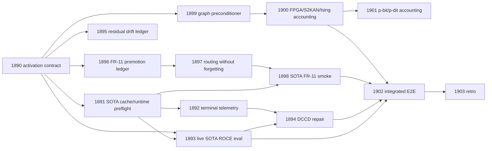

# Carnot Research Roadmap: Milestone 2026.05.148

**Status:** PROPOSED
**Doc Version:** vNEXT
**Target:** SOTA runtime readiness, terminal telemetry artifacts, continuous self-learning ledgers, and hardware-accounted validator graphs
**Supersedes:** Milestone 2026.05.147
**Execution queue:** `research-roadmap-next.yaml`

## What Milestone 2026.05.147 Proved

| Area | Experiments | Finding |
|---|---:|---|
| Milestone contract | 1876 | The `.146` evidence could be archived into explicit downstream gate fields. This removed ambiguity around which evidence was usable. |
| Artifact normalization | 1877 | ROCE/HILED outputs can be wrapped into standard schema-complete artifacts without modifying the conductor. |
| Prompt-to-validator compilation | 1878 | ROCE constraints can compile to guarded Python/PySAT/Z3 validator-tree leaves with executable acceptance authority and zero false accepts on fixtures. |
| Deterministic bounds | 1879 | BEAVER-lite bound rows can be attached to validator trees while leaving executable validators as the only acceptance authority. |
| SOTA live path | 1880 | The live SOTA route blocked honestly because the mandated GGUF cache was incomplete: `unsloth/Qwen3.6-35B-A3B-GGUF` and `unsloth/gemma-4-31B-it-GGUF` were unavailable. |
| Downstream tasks | 1881-1888 | Telemetry, repair, FR-11, graph preconditioning, hardware accounting, and integrated E2E were blocked or retired because terminal artifacts were missing or upstream gates did not satisfy the contract. |
| Operations | 1889 | The retro found 5 completed tasks and 9 blocked tasks. The next speed target is about 11 percent through same-title compute-bound terminal-state dedupe and per-experiment GPU/model-count telemetry. |

**Operational lesson:** `.147` validated the prompt-to-validator substrate, but not the live SOTA or continuous-learning claims. The next milestone should first prove local SOTA cache/runtime readiness and terminal telemetry artifacts, then use those gates to re-open repair, FR-11, and hardware-accounted integration.

## Three Biggest Gaps to PRD Vision

1. **Local SOTA runtime/provenance gap:** PRD FR-12 requires verifiable reasoning over real model outputs. `.147` could not produce headline live rows because two mandated GGUFs were missing. Carnot needs a cache/materialization/runtime preflight with clear blocked artifacts before any live SOTA evaluation.
2. **Terminal verifier telemetry and repair gap:** The validator tree and BEAVER-lite bounds exist, but downstream telemetry/repair did not leave usable terminal artifacts. Carnot needs first-token/spilled-energy telemetry and DCCD repair that are explicitly advisory and never acceptance authority.
3. **FR-11 and hardware-accounted graph gap:** Continuous self-learning and hardware portability remain unproven for the new validator-tree substrate. Carnot needs a no-forgetting promotion ledger, a SOTA self-learning smoke only when gated, and no-synthesis accounting over actual validator graphs.

## External Findings Incorporated

- **Residual Drift / DRIFT-Bench:** OpenReview ICLR 2026 workshop work shows that residual failures after solver-guided repair are mostly satisfiable drift rather than contradiction. Carnot should add a commitment ledger over validator-tree traces.
- **Routing without Forgetting:** arXiv:2603.09576 suggests energy-based associative routing as a continual-learning primitive. Carnot should model FR-11 promotion as route/subspace selection with replay retention and rollback.
- **HalluGuard / Spilled Energy / DCCD:** Recent hallucination telemetry and repair work can be useful as advisory evidence. Carnot should record these signals in artifacts but keep deterministic validators as the authority.
- **llguidance / vLLM.rs / JSONSchemaBench:** Structured generation runtime work gives fallback implementation options, but the mandated GGUF models remain required for headline rows.
- **p-dit / KAN / TSU / Kona signals:** Hardware directions are converging on energy/probabilistic sampling and constraint reasoning. Carnot should use them for accounting targets only, with no KV260/TSU/Kona execution claim.

## Architecture

## Phase Plan

### Phase 0: Activation and Runtime Readiness

Experiments 1890-1891 convert `.147` retro output into a `.148` activation contract, then run a bounded cache/runtime preflight for the mandated SOTA GGUFs. This phase exists because `.147` blocked on model availability, not on validator math. The preflight must produce a terminal artifact whether models are available, partially available, or missing.

### Phase 1: Terminal Telemetry, Live Evaluation, Repair, and Drift

Experiments 1892-1895 retry the blocked `.147` live path with stricter gates. They add terminal telemetry, run live SOTA ROCE validation only when the full cache is ready, apply DCCD repair only after validation and telemetry pass, and add a residual-drift ledger so final answers are checked against maintained commitments.

### Phase 2: Continuous Self-Learning

Experiments 1896-1898 satisfy the required continuous self-learning track. The first task builds a validator-tree promotion ledger with no-forgetting and rollback fields. The second audits a routing-without-forgetting abstraction. The third runs a SOTA FR-11 promotion smoke only if the cache and routing ledger are ready.

### Phase 3: Hardware-Accounted Validator Graphs

Experiments 1899-1901 connect validator trees to graph preconditioning and resource accounting. They test whether GEM/ConsFormer-style preconditioning improves Ising convergence, then estimate FPGA/S2KAN/Ising and p-bit/p-dit resource boundaries without making synthesis or board-execution claims.

### Phase 4: Integrated Evidence and Retro

Experiments 1902-1903 run a gated integrated tri-SOTA smoke and a retrospective. The integrated task only runs when live validation, repair, FR-11, and hardware-accounting gates are satisfied. The retro always runs and must report both technical blockers and operational timing/de-dupe results.

## Dependency Graph

## Experiment Summary

| Exp | Title | Deliverable | Primary gate |
|---:|---|---|---|
| 1890 | `.147` Completion to `.148` Activation Contract | `results/experiment_1890_147_completion_148_activation_contract.json` | none |
| 1891 | SOTA GGUF Cache and Runtime Preflight | `results/experiment_1891_sota_gguf_cache_runtime_preflight.json` | 1890 |
| 1892 | Terminal Low-Cost Telemetry Adapter | `results/experiment_1892_terminal_low_cost_telemetry_adapter.json` | 1891 any cache |
| 1893 | Live SOTA ROCE Validator Evaluation v2 | `results/experiment_1893_live_sota_roce_validator_eval_v2.json` | 1890, 1891 full cache |
| 1894 | DCCD/llguidance Repair with ROCE Validators v2 | `results/experiment_1894_dccd_roce_repair_v2.json` | 1892, 1893 |
| 1895 | Residual Drift Validator Ledger | `results/experiment_1895_residual_drift_validator_ledger.json` | 1890 |
| 1896 | FR-11 Validator-Tree Promotion Ledger v2 | `results/experiment_1896_fr11_validator_tree_promotion_ledger_v2.json` | 1890 |
| 1897 | Routing without Forgetting FR-11 Audit | `results/experiment_1897_routing_without_forgetting_fr11_audit.json` | 1896 |
| 1898 | SOTA FR-11 Promotion Smoke v2 | `results/experiment_1898_sota_fr11_promotion_smoke_v2.json` | 1891, 1897 |
| 1899 | GEM/ConsFormer Validator Graph Preconditioner v2 | `results/experiment_1899_gem_consformer_validator_graph_preconditioner_v2.json` | 1890 |
| 1900 | FPGA/S2KAN/Ising Resource Accounting v2 | `results/experiment_1900_fpga_s2kan_ising_resource_accounting_v2.json` | 1899 |
| 1901 | p-bit/p-dit Ising Sampler Accounting | `results/experiment_1901_pbit_pdit_ising_sampler_accounting.json` | 1900 |
| 1902 | Integrated Tri-SOTA E2E v2 | `results/experiment_1902_integrated_trisota_e2e_v2.json` | 1893, 1894, 1898, 1900 |
| 1903 | Milestone `.148` Retrospective | `results/experiment_1903_milestone_148_retro.json` | none |

## Hardware Requirements

| Requirement | Used by | Boundary |
|---|---|---|
| Dual RTX 3090 local GGUF runtime | 1891, 1892, 1893, 1894, 1898, 1902 | Required for headline SOTA rows. If cache/runtime is unavailable, write a blocked terminal artifact and do not claim headline accuracy. |
| CPU/JAX/PySAT/Z3 | 1890, 1895, 1896, 1897, 1899 | Sufficient for activation contracts, ledgers, and graph-preconditioning fixtures. |
| Rust/PyO3 toolchain | 1892, 1900, 1901 | Needed for structured-output runtime probes and S2KAN/accounting checks if local paths are available. |
| KV260/Vivado | none | No Vivado synthesis, bitfile, board transcript, or board-execution claim in this milestone. |
| THRML/Extropic | 1901 optional read-only comparison | Simulator/public-material comparison only; no XTR-0/Z1/TSU execution claim. |
| Logical Intelligence Kona | reference only | Architecture comparator only; no Kona-equivalent performance claim. |

## Acceptance Gates

- Every artifact used by `gated_on` must contain the exact named field in `REQUIRED ARTIFACT FIELDS`.
- Every LLM-bearing experiment must list the mandated local GGUFs in `MODEL_SPECS`: `unsloth/Qwen3.6-35B-A3B-GGUF`, `unsloth/gemma-4-31B-it-GGUF`, and `unsloth/gemma-4-26B-A4B-it-GGUF`.
- Legacy small models may be used only as CPU smoke tests and must not appear as headline-result models.
- Deterministic validators remain the only acceptance authority. First-token confidence, HalluGuard-like scores, and spilled energy are advisory telemetry.
- Continuous self-learning is satisfied by Exp 1896 and promoted to SOTA smoke only through Exp 1898 after utility and no-forgetting gates pass.
- Hardware claims are accounting-only unless an artifact contains authenticated device, bitfile, command transcript, and latency provenance. This milestone intentionally makes no board-execution claim.

## Decentralization Implications

The milestone preserves Carnot's local-first posture: headline model work is restricted to local open-weight GGUFs, validators run locally, closed providers are not required, and hardware work remains portable accounting over CPU/GPU/FPGA/TSU-style targets rather than vendor-locked execution.
