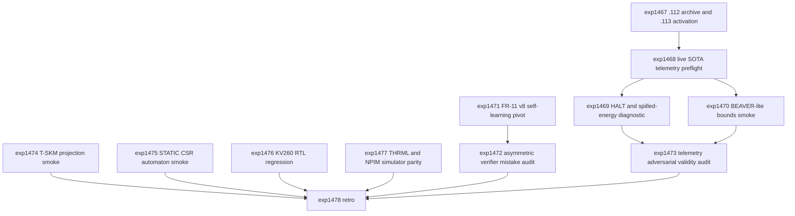

# Research Roadmap vNEXT: Milestone 2026.04.113

Planned: 2026-05-07
Status: Draft for conductor execution
Predecessor: 2026.04.112 scope reduction, local SOTA GGUF runtime repair, repair-executor retirement, self-learning pivot selection
Roadmap YAML: `research-roadmap-next.yaml`

## ID Allocation Note

Milestone `.112` used `exp1453` through `exp1466`. The next 12 conductor
tasks are `exp1467` through `exp1478`.

## What Milestone .112 Proved

| Track | Evidence | Finding |
|---|---|---|
| Scope reduction | `exp1453` through `exp1462`, `exp1466` | `.112` met all 14 criteria and satisfied the operator scope-reduction directive. |
| Artifact signal/noise | `exp1454` | 1,132 experiment artifacts were classified: 547 SIGNAL, 138 NOISE, 447 AMBIGUOUS. |
| Active priorities | `exp1455` | Mandatory priority entries were reduced from 24 to 7 active lanes. |
| Retired lineages | `exp1456`, `exp1457`, `exp1458`, `exp1464` | GRPO/VPRM, WOPR puzzle cartridges, HardNet++/DSP, and validation-error-as-context repair are retired unless explicitly reopened. |
| Self-learning | `exp1459` | The only allowed follow-up is an `exp1447`-style verified-memory-growth pivot with nonforgetting gates. |
| Hardware portfolio | `exp1460` | Active tracks are dual RTX 3090 CUDA local SOTA runtime, KV260/FPGA Discrete SB RTL lint/simulation, and THRML/Extropic TSU compatibility simulation. Board, NPU, photonic, D-Wave, and large-FPGA claims are deferred. |
| Paper claims | `exp1462` | Paper-v6 is narrowed to four artifact-backed claims; broad scaling, hardware, and self-learning claims moved to appendix/future work. |
| Local SOTA runtime | `exp1463` | `local_sota_runtime_ready=true`; `unsloth/Qwen3.6-35B-A3B-GGUF` produced a non-empty live llama.cpp GPU response. All three mandated GGUF model caches were present. |
| Repair salvage | `exp1464` | Validation-error-as-context retry did not improve acceptance, schema validity, or semantic correctness on the bounded live test; repair-executor lineage retired. |
| External benchmark | `exp1465` | Adopt exactly one BEAVER-style deterministic-bound smoke; defer VNNLIB/VNN-COMP and broad external benchmark runners. |

**Critical insight from `.112`:** the project now has a smaller active surface.
The next milestone should spend that focus on measurement and bounded proof
artifacts, not on reopening variant lineages. The repaired SOTA runtime is a
precondition for credible telemetry and bounds; the repair loop itself is not
active unless an operator reopens it.

## Research Signals Added Before Planning

The post-.112 sweep updated `research-references.md` before this roadmap was
finalized. The near-term signals are:

- HALT (`arXiv:2602.02888`) motivates top-k logprob time-series telemetry for
  live local SOTA outputs.
- Online learnability of CoT verifiers (`arXiv:2603.03538`) gives a soundness
  versus completeness mistake framework for the one allowed FR-11 follow-up.
- T-SKM-Net (`arXiv:2512.10461`) is a bounded linear-constraint projection
  baseline that does not reopen the retired HardNet++/DSP branch.
- Neural Ising Machines (`arXiv:2602.00302`) motivate a simulator-only learned
  update/schedule probe for Ising dynamics.
- STATIC (`arXiv:2602.22647`) motivates a small CSR automaton benchmark for
  certificate constraints without reviving repair generation.
- BEAVER remains the only external verifier benchmark selected by `.112`.
- Extropic/THRML and Kona remain strategic comparators, but no public source
  changes the `.112` hardware boundary: THRML simulation only, no TSU hardware
  claim, no Kona dependency.

## Three Biggest Gaps

1. **Live SOTA telemetry exists only as a smoke response.** `exp1463` proved
   that local mandated GGUF inference works. Carnot still lacks a small,
   reproducible live-SOTA telemetry artifact with per-token logprobs, energy
   diagnostics, and verifier outcomes.

2. **External verifier credibility is not yet measured.** `exp1465` selected
   BEAVER-style deterministic bounds, but no `.112` artifact ran the adopted
   smoke. A narrow BEAVER-lite run should happen before any broader benchmark
   or publication comparison.

3. **Self-learning has one positive pivot but no asymmetric mistake accounting.**
   `exp1459` allowed a single `exp1447`-style growth follow-up. The next run
   must show fresh verified growth, nonforgetting, and separate soundness and
   completeness mistake counts.

## Architecture

```
.113 Milestone Architecture
========================================================================

Phase 0 - Handoff and Activation
  exp1467: .112 completion archive + .113 activation manifest -----------.

Phase 1 - Live SOTA Telemetry and Bounds
  exp1468: Local SOTA logprob telemetry preflight -----------------------+--> live telemetry manifest
  exp1469: HALT + Spilled Energy diagnostic micro-benchmark (gated) -----+
  exp1470: BEAVER-lite deterministic-bound smoke -----------------------'

Phase 2 - Self-Learning Pivot and Verifier Governance
  exp1471: FR-11 v8 verified-memory-growth pivot -----------------------.
  exp1472: Online verifier asymmetric mistake-budget audit -------------+--> allowed self-learning decision
  exp1473: Live telemetry adversarial validity audit -------------------'

Phase 3 - Constraint, Sampler, Hardware Simulation, and Closure
  exp1474: T-SKM linear projection smoke --------------------------------.
  exp1475: STATIC CSR certificate automaton smoke -----------------------+
  exp1476: KV260 Discrete SB RTL regression pack -----------------------+
  exp1477: THRML + NPIM simulator parity micro-probe --------------------+
  exp1478: Milestone .113 retrospective --------------------------------'
```

## Phase Descriptions

**Phase 0 - handoff and activation.** `exp1467` closes the `.112` bookkeeping
gap before new research starts. It archives `.112` completion evidence,
records that `research-complete.yaml` lacks a `.112` entry, and writes a `.113`
activation manifest that preserves the retired-lineage blocks.

**Phase 1 - live SOTA telemetry and bounds.** `exp1468` uses the repaired
local GGUF runtime to capture a small, reproducible telemetry set from mandated
SOTA models. `exp1469` runs only if top-k logprobs are available; it computes
HALT-style and spilled-energy-style features without training a broad detector.
`exp1470` executes the adopted BEAVER-lite deterministic-bound smoke and labels
whether bounds used live or mock logprobs.

**Phase 2 - self-learning pivot and verifier governance.** `exp1471` is the
required continuous self-learning experiment. It reuses the `exp1447` memory
policy on fresh verified rows, may ingest `exp1449` LTLZinc cases only as
supporting benchmark feed, and must report nonforgetting. `exp1472` evaluates
the run through the online verifier soundness/completeness mistake framework.
`exp1473` adversarially audits whether the live telemetry and bounds could pass
from superficial correlations such as response length, format validity, or
mock-logprob leakage.

**Phase 3 - constraint, sampler, hardware simulation, and closure.**
`exp1474` tests a T-SKM-style linear projection baseline on toy certificate
constraints. `exp1475` benchmarks a STATIC-style CSR automaton against the
existing certificate schema path. `exp1476` keeps the KV260 track active at
source-level RTL regression only. `exp1477` keeps THRML active at simulation
parity only and tests whether NPIM-style schedule ideas improve tiny Ising
cases. `exp1478` closes the milestone with criteria, carry-forwards, and
retirement discipline.

## Dependency Graph



Structured conductor gates:

- `exp1469` requires `exp1468.topk_logprobs_available == true`.
- `exp1472` requires `exp1471.self_learning_artifact_ready == true`.

Other tasks should write terminal artifacts even when prerequisites are noisy,
because they are bounded smoke/audit tasks.

## Hardware Requirements

| Task | Hardware | Notes |
|---|---|---|
| `exp1467`, `exp1470`, `exp1472`, `exp1473`, `exp1474`, `exp1475`, `exp1476`, `exp1478` | CPU | Docs, deterministic bounds, audits, linear projection, automata, and RTL regression. |
| `exp1468`, `exp1469`, `exp1471` | Dual RTX 3090 preferred | Must use the repaired local GGUF runtime and mandated SOTA models for live-output evidence when generating new LLM samples. |
| `exp1477` | CPU or GPU if THRML/JAX is already configured | Simulation/parity only; no Extropic hardware claim. |

Mandated local SOTA GGUF models for every LLM-bearing experiment:

- `unsloth/Qwen3.6-35B-A3B-GGUF`
- `unsloth/gemma-4-31B-it-GGUF`
- `unsloth/gemma-4-26B-A4B-it-GGUF`

Legacy small models such as Qwen3.5-0.8B or gemma-4-E4B-it may be used only as
fast CPU smoke tests. They must not be reported as headline models.

## Success Criteria

| Criterion | Target |
|---|---|
| Activation | `exp1467.activation_manifest_complete=true` and `.112` completion evidence is summarized. |
| Telemetry preflight | `exp1468.live_sota_model_inference_used=true` and top-k/logprob availability is recorded. |
| HALT/energy diagnostic | If gated on, `exp1469.telemetry_diagnostic_complete=true`; if gated off, a terminal skip explains missing logprobs. |
| BEAVER smoke | `exp1470.bound_is_sound=true` for every evaluated prompt, with `mock_or_live_logprobs` labeled. |
| Self-learning pivot | `exp1471.self_learning_delta_overall > 0`, `new_promoted_count >= 1`, and `nonforgetting_rate >= 0.99`, or the pivot is retired. |
| Mistake audit | `exp1472.soundness_mistakes` and `completeness_mistakes` are reported with an asymmetric-cost decision. |
| Adversarial telemetry audit | `exp1473.telemetry_validity_verdict` is terminal and names any superficial confound. |
| T-SKM smoke | `exp1474.zero_violation_projection=true` on the toy constraint suite or a blocker is recorded. |
| STATIC automaton smoke | `exp1475.exact_acceptance_equivalent=true` and latency is reported. |
| KV260 RTL regression | `exp1476.rtl_regression_complete=true` with no board or latency claim. |
| THRML/NPIM parity | `exp1477.hardware_claim_allowed=false` and simulator parity/sample-quality fields are reported. |
| Retro | `exp1478.criteria_total=12`, all retirements/carry-forwards recorded, and `research-roadmap.yaml` plus `scripts/research_conductor.py` remain unchanged. |

Milestone threshold: 9 of 12 criteria met is a successful milestone. Honest
gate-blocks are valid terminal evidence but do not count as met criteria unless
the criterion explicitly allows a terminal skip.

## Prior Failure Summary

- `exp1442` blocked the live SOTA runtime; `exp1463` fixed that blocker.
  `exp1468` must use the fixed runtime, not rediscover old CUDA/cache failures.
- `exp1464` retired validation-error-as-context repair because all deltas were
  zero. `.113` does not include any repair-executor rerun.
- `exp1456`, `exp1457`, and `exp1458` retired GRPO/VPRM, WOPR puzzle
  cartridges, and HardNet++/DSP. `.113` does not reopen them.
- `exp1459` permits exactly one self-learning pivot. `exp1471` is that pivot
  and must retire the pivot if it cannot reproduce verified growth.
- `exp1465` selected BEAVER-lite as the single external benchmark smoke. `.113`
  does not propose VNN-COMP or broad external verifier runners.

## Decentralization and Local-First Implications

This milestone preserves CLAUDE.md rules 1-7: all LLM-bearing tasks use local
open-weight GGUF models; closed-weight systems are research references only;
hardware work remains portable and simulator-labeled unless real hardware runs;
and no vendor-specific SDK is introduced into the core verifier stack.

## Conductor Notes

- Do not modify `research-roadmap.yaml`.
- Do not modify `scripts/research_conductor.py`.
- Do not propose Gemini-routed tasks while the known rate-limit constraint is
  active.
- All tasks include a deliverable path.
- All tasks default to `agent_type: codex`, `model: gpt-5.5` per CLAUDE.md.
- `exp1469` and `exp1472` include structured `gated_on` blocks so the
  conductor can skip unnecessary agent calls.
