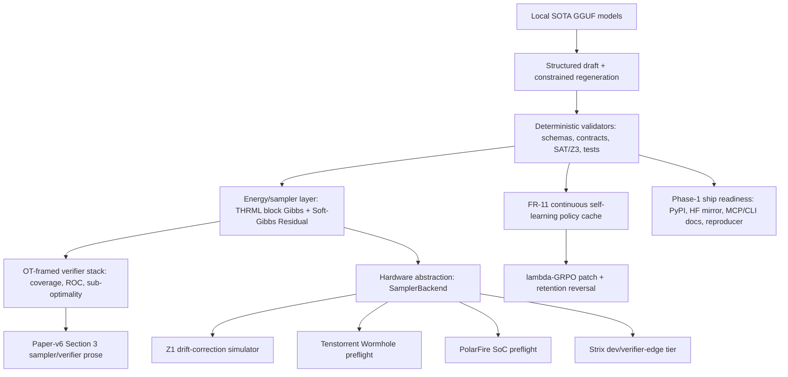
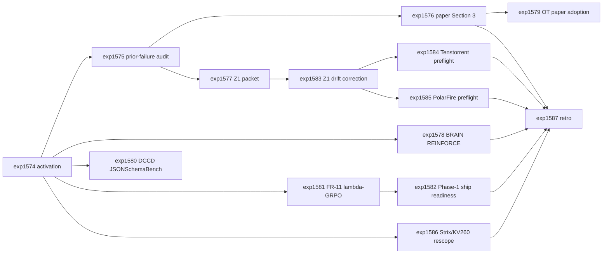

# Research Roadmap vNEXT: 2026.05.121

Milestone title: **Phase-1 Ship Readiness + BRAIN Dynamics + Hardware Portfolio Correction**

Planning date: 2026-05-08
Planner role: research planning agent
Execution queue: `research-roadmap-next.yaml`

## Previous Milestone Result

Milestone `2026.05.120` moved the sampler stack from debate to evidence:

| Finding | Evidence | Consequence for `.121` |
|---|---|---|
| THRML block Gibbs is useful software, but not security-equivalent to Carnot single-site Gibbs. | `exp1561` reported THRML hitting null-space states at MH-class rates. | Do not claim kinetic defense parity for THRML; use THRML as the reference software sampler and keep security discussion honest. |
| BRAIN+Linear-AR expressivity rescue was falsified. | `exp1562`: factorized/AR ratio collapses to about `1.00x` at k=15. | Test the missing axis: REINFORCE training dynamics and gradient starvation. |
| SpecAnn is rejected for Phase-3 inference-time argmin. | `exp1563` decision record. | Keep Gibbs-heuristic argmin on unreduced HUBO energy. |
| THRML vendoring and candidate warm-start landed, but full Python suite hang remains operational debt. | `exp1564`, `exp1566`. | Use vendored THRML in downstream publication/readiness docs; keep broad-suite hang as non-blocking but visible. |
| Soft-Gibbs Residual is now an operational contribution. | `exp1565`, `exp1570`. | Paper-v6 Section 3 should integrate the residual and bound. |
| FR-11 v14 retained policies contain at least one mode-collapse retention. | `exp1568`: one retention flagged for reversal. | `.121` must include continuous self-learning repair, not just an audit. |
| Two tasks were blocked by invalid prior-failure metadata. | `exp1569`, `exp1573`: `blocked_gate_check_failed`. | Start `.121` with prior-failure autofill/audit, then resume both tasks with exact prior failure records. |

## Three Biggest Gaps

1. **Phase-1 software shipping is still not externally reproducible.** The new
   operator directive decouples Phase 1 from paper and hardware. PyPI, HF mirror,
   MCP/CLI docs, and an external reproducer are now the highest product gap.

2. **Core research claims need final disambiguation before paper-v6 prose hardens.**
   BRAIN is not expressivity-limited at k=15, but it may still be REINFORCE-
   dynamics-limited. FR-11 v14 is useful but contaminated by mode collapse.
   Paper-v6 also needs the ICLR 2026 OT verifier framework before claiming
   verifier-stack geometry.

3. **Hardware strategy must stop treating every board as a production sampler.**
   The hardware evaluation report reframes Z1 as needing software detailed-balance
   correction, Tenstorrent and PolarFire as sovereignty candidates, Strix Point as
   dev/verifier-edge rather than production sampler, and KV260 as a Vivado-bound
   lineage to retire or re-scope.

## Architecture Target

The `.121` architecture keeps deterministic validators as acceptance authority.
Energy, sampler, OT, and hardware signals are diagnostic or ranking layers unless
a deterministic contract verifies the output.

## Phase Plan

### Phase 0: Activation and Carry-Forward Repair

- **exp1574** archives `.120`, exposes gates for BRAIN, THRML, FR-11,
  publication carry-forwards, Phase-1 ship, and hardware evaluation.
- **exp1575** runs the prior-failure autofill/audit workflow before any
  carry-forward task launches.
- **exp1576** resumes paper-v6 Section 3 sampler drafting with proper prior
  failure metadata.
- **exp1577** resumes the Extropic Z1 readiness packet update with THRML
  vendoring and analog-drift caveats.

### Phase 1: Research Claim Resolution

- **exp1578** tests BRAIN's missing REINFORCE training-dynamics axis at k=15:
  gradient norms, KL convergence, factorized vs Linear-AR.
- **exp1579** adopts the ICLR 2026 OT verification framework in paper-v6 and
  writes a conflict ledger.
- **exp1580** runs a DCCD/JSONSchemaBench structured-output smoke on mandated
  local SOTA GGUF models.
- **exp1581** satisfies the continuous self-learning requirement by applying
  lambda-GRPO and reversing the v14 mode-collapsed retention if replay confirms.

### Phase 2: Phase-1 Software Ship Readiness

- **exp1582** audits the software-only Phase-1 ship gate: PyPI packaging,
  HuggingFace and second mirror readiness, MCP/CLI docs, and independent
  reproducer path. This task must not publish credentials or push releases; it
  produces an actionable readiness ledger.

### Phase 3: Hardware Portfolio Correction and Retro

- **exp1583** builds synthetic Z1 analog drift and software detailed-balance
  correction.
- **exp1584** evaluates Tenstorrent Wormhole n150d as an open-toolchain
  block-Gibbs target via local/remote preflight.
- **exp1585** scopes a PolarFire SoC adaptive K-PCD prototype and toolchain
  feasibility.
- **exp1586** re-scopes Strix Point as dev/verifier-edge and retires or
  re-labels KV260 claims that depend on Vivado.
- **exp1587** records operational/research retro and identifies `.122`
  carry-forwards.

## Dependency Graph

## Hardware Requirements

| Tasks | Required hardware | Notes |
|---|---|---|
| `exp1574`, `exp1575`, `exp1576`, `exp1577`, `exp1579`, `exp1582`, `exp1586`, `exp1587` | CPU only | Documentation, audit, and planning tasks. |
| `exp1578`, `exp1581` | CPU acceptable; GPU optional | REINFORCE and lambda-GRPO may use PyTorch/JAX acceleration if available, but must have deterministic CPU fallback or write a blocked artifact. |
| `exp1580` | Dual RTX 3090 preferred | Must use at least one mandated SOTA GGUF model; legacy tiny models are smoke-test fallback only. |
| `exp1583` | CPU/GPU simulation only | No Z1/TSU hardware claim; synthetic drift only. |
| `exp1584` | Remote/cloud Tenstorrent optional | If no Wormhole access exists, produce a blocked/preflight artifact and acquisition path, not a fake benchmark. |
| `exp1585` | No board required for `.121` | Prototype plan and simulator/toolchain feasibility only unless hardware is already present. |

## Local SOTA Model Discipline

Any `.121` experiment that runs local LLM inference must define `MODEL_SPECS`
with at least one of:

- `unsloth/Qwen3.6-35B-A3B-GGUF`
- `unsloth/gemma-4-31B-it-GGUF`
- `unsloth/gemma-4-26B-A4B-it-GGUF`

The preferred pattern is `cached_sota_pair(gpu_indices=(0, 1))` from
`scripts/experiment_template.py`. Legacy small models may appear only as
explicit CPU smoke-test fallback with a loud artifact warning.

## Success Criteria

| Criterion | Owning task | Gate |
|---|---|---|
| `.120` terminal findings archived and `.121` gates exposed | `exp1574` | `activation_manifest_complete=true` |
| Carry-forward prior-failure metadata repaired before launch | `exp1575` | `carryforward_prior_failures_ready=true` |
| Paper-v6 Section 3 sampler draft resumed | `exp1576` | `paper_v6_sampler_section_draft_ready=true` |
| Z1 readiness packet updated with THRML and drift caveats | `exp1577` | `extropic_z1_packet_updated=true` |
| BRAIN k=15 training-dynamics verdict settled | `exp1578` | `brain_training_dynamics_verdict_ready=true` |
| OT verification framework adopted or conflict ledger written | `exp1579` | `ot_framework_adopted=true` |
| Structured-output smoke uses mandated SOTA GGUFs | `exp1580` | `dccd_jsonschema_smoke_complete=true` |
| Continuous self-learning task completed | `exp1581` | `continuous_self_learning_task=true` and `fr11_v15_decision_ready=true` |
| Phase-1 ship readiness ledger written | `exp1582` | `phase1_ship_readiness_ledger_ready=true` |
| Z1 drift-correction simulation completed | `exp1583` | `detailed_balance_correction_ready=true` |
| Tenstorrent preflight completed or honestly blocked | `exp1584` | `wormhole_preflight_ready=true` or `blocked_reason` set |
| PolarFire preflight completed or honestly blocked | `exp1585` | `polarfire_preflight_ready=true` or `blocked_reason` set |
| Strix/KV260 role corrected | `exp1586` | `hardware_portfolio_rescope_ready=true` |
| Retro captures research and operations follow-up | `exp1587` | `milestone_121_retro_complete=true` |

## Guardrails

- Do not modify `research-roadmap.yaml`.
- Do not modify `scripts/research_conductor.py`.
- Do not push.
- Do not claim Extropic Z1/XTR/TSU, Tenstorrent, PolarFire, Strix NPU, or
  KV260 board execution unless the artifact includes an authenticated device
  transcript.
- Do not promote soft energy/logprob/ARM/EBT scores to acceptance authority.
- Publication-track work remains separate from Phase-1 ship readiness.
