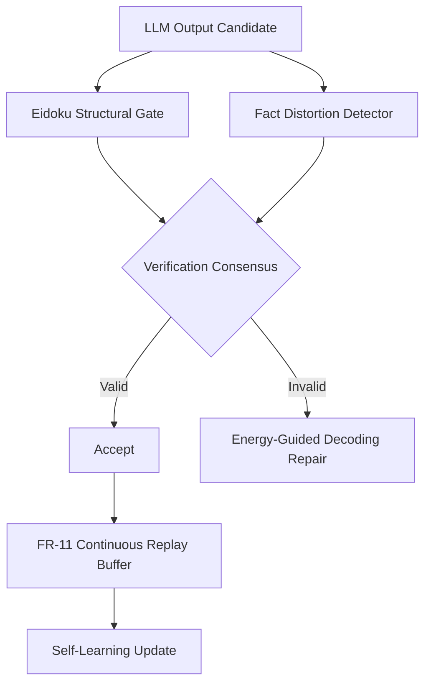

# Research Roadmap Change Proposal vNEXT (Milestone 2026.05.131)

## What the Previous Milestone (.130) Proved
Milestone `.130` successfully closed the loop on constraint self-discovery via the FR-11 ledger, formally certified the KArAt abstractions using MILP, proved monotonicity regularization with CIKAN, and exported the Potts Vivado simulator. However, we discovered two key limitations:
1. **MILP Certification Overhead:** Running MILP over KArAt is NP-hard and scales poorly for test-time verification.
2. **Reasoning-Accuracy Trade-offs in Self-Play:** As the FR-11 framework discovered more complex structural constraints, reasoning engines increasingly distorted facts to satisfy the structural gates.

## Milestone .131 Goals
1. **GloroKAN Robustness:** Implement B-spline local Lipschitz bound tracking from the ICLR 2026 GloroKAN paper to provide computationally cheap, provable robustness bounds during the forward pass.
2. **Eidoku Verification & Factuality:** Integrate the Eidoku System-2 structural verification gate (arXiv:2512.20664) and pair it with a fact-distortion detector to prevent our models from sacrificing semantic truth for structural validity.
3. **Continuous FR-11 Learning:** Introduce a replay buffer for FR-11 to support non-forgetting, continual self-learning, directly addressing the PRD's vision for autonomous constraint expansion.
4. **Hardware Acceleration:** Execute the Potts q=3 bitstream on actual KV260 hardware, moving past the Vivado source-level simulation from milestone .130.

## Architecture Diagram Update

## Phase Descriptions
- **Phase 1: Foundation Setup (Exp 1696)**
  - Archive .130 and initialize tracking logic.
- **Phase 2: Mathematical Robustness & Gates (Exp 1697-1701)**
  - Implement GloroKAN bounds for KArAt.
  - Implement the Eidoku verification gate and Fact Distortion detector to handle the reasoning-accuracy gap. Evaluate on local SOTA GGUFs (`unsloth/Qwen3.6-35B-A3B-GGUF` and `unsloth/gemma-4-31B-it-GGUF`).
- **Phase 3: Continuous Learning & Hardware (Exp 1702-1705)**
  - Implement the FR-11 continuous constraint learning replay buffer.
  - Synthesize and execute the Potts q=3 design on the KV260 FPGA.
- **Phase 4: Synthesis & Final Evaluation (Exp 1706-1708)**
  - Introduce Energy-Guided Decoding to mitigate hallucinations on the fly.
  - Connect all components for a 100-case full-pipeline `.131` run using mandated GGUF targets.
  - Conduct the milestone retrospective.

## Dependency Graph
`exp1696` -> `exp1697` -> `exp1698` -> `exp1706`
`exp1699` -> `exp1700` -> `exp1706`
`exp1701` -> `exp1706`
`exp1702` -> `exp1703` -> `exp1706`
`exp1704` -> `exp1705` -> `exp1706`
`exp1706` -> `exp1708`

## Hardware Requirements
- **Local GGUF Runtime:** 2x RTX 3090s with `libcudart.so.12` installed.
- **KV260 FPGA:** For `exp1704` and `exp1705`, hardware access is required to flash the Vivado `.bit` file and perform latency benchmarking.
- **CPU:** Standard 32-core Threadripper for GloroKAN evaluation and Eidoku graph processing.