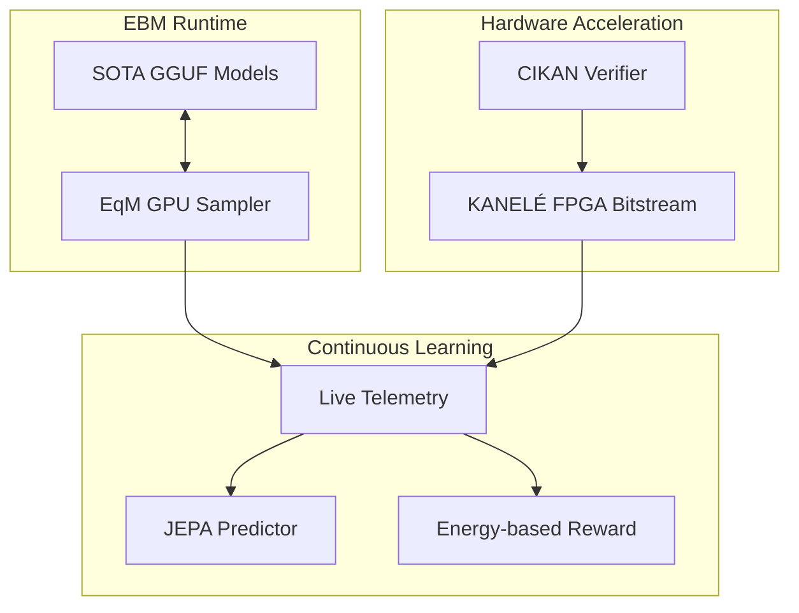

# Carnot Research Roadmap — Phase 11 (vNEXT)

**Milestone:** 2026.05.134
**Focus:** Phase-11 Live SOTA Integration, EqM Scaling, and Hardware Resolution
**Status:** PROPOSED

## 1. What Previous Milestone (.133) Proved
Milestone .133 established the theoretical and simulation foundations for Phase-10 Continuous Self-Learning, EqM System-2 Sampling, and KANELÉ Hardware. It successfully integrated FourierCSP for constraint mapping, created the Constraint-Informed KAN (CIKAN), and developed the Equilibrium Matching (EqM) sampler. It also generated the RTL for KANELÉ (LUT-based CIKAN) and tested it in simulation. 

However, critical gaps remain:
1. **Hardware Validation:** The KV260 bitfile synthesis and dual RTX 3090 runtime integration must be completed to move from simulation to live hardware execution.
2. **Scale:** EqM System-2 sampling needs to scale to full benchmarks using the mandated SOTA GGUF models.
3. **Continuous Self-Learning:** The continuous online updater needs to be deployed against live telemetry streams (Tier 3 EORM and JEPA).

## 2. Milestone Objectives
1. **Hardware Resolution:** Synthesize the KANELÉ RTL into a Vivado bitfile and execute it on the physical KV260 board. Unblock the dual RTX 3090 CUDA local SOTA runtime for inference.
2. **EqM Scaling:** Accelerate the EqM sampler using the GPU backends (wgpu/CUDA) and benchmark it against SWE-Bench Lite and the full GSM8K/MATH sets using `unsloth/Qwen3.6-35B-A3B-GGUF` and `unsloth/gemma-4-31B-it-GGUF`.
3. **Continuous Learning:** Operationalize continuous online learning by processing live failure streams into real-time JEPA and EORM updates.

## 3. Architecture Context

## 4. Phase Descriptions

### Phase 1: Hardware & Infrastructure Unblocking
*Opus-routed tasks to handle complex hardware toolchains and GPU runtime debugging.*
- **Dual RTX 3090 Bring-Up:** Resolve the local llama.cpp CUDA runtime issues to establish a reliable `usable_response=true` smoke run.
- **KV260 KANELÉ Synthesis & Bring-Up:** Convert the KANELÉ Verilog into a bitfile using Vivado, and run latency benchmarks on the KV260 board via PYNQ.

### Phase 2: Continual Self-Learning Scale-Up
*Implementing the Tier 3 continuous learning loop from live inference telemetry.*
- **Live Streamer:** Hook into the inference pipeline to stream constraint violations and energy scores.
- **Continuous EORM/JEPA Fine-tuning:** Update the predictor and reward models incrementally using the stream.

### Phase 3: EqM System-2 Scaling
*Bringing the advanced System-2 sampler to the flagship models.*
- **EqM GPU Acceleration:** Port the EqM sampler to use GPU tensors for fast parallel sampling.
- **System-2 Benchmarks:** Run GSM8K, MATH, and a subset of SWE-Bench Lite using EqM-guided generation.

### Phase 4: Synthesis & Validation
- Export updated models, summarize benchmark impact, and write the retrospective.

## 5. Hardware Requirements
- **Local GPUs:** 2x NVIDIA RTX 3090 (for SOTA model inference and EqM GPU sampling).
- **FPGA:** AMD/Xilinx Kria KV260 (for KANELÉ bitfile execution).
- **CPU/RAM:** 128GB DDR5 to host the GGUF SOTA models in system RAM before offloading.