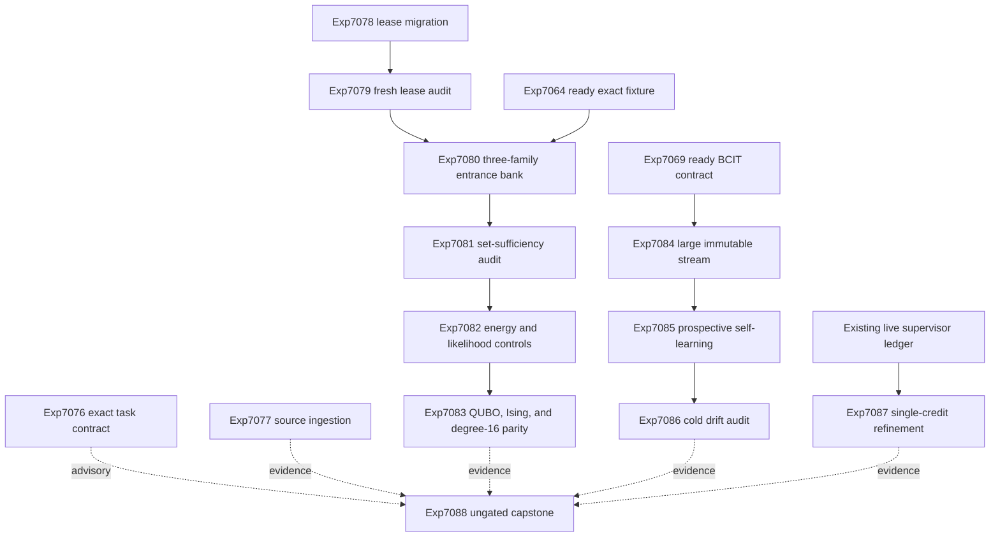

# Research Roadmap V620: Entrance Evidence Recovery, Context-Bound Learning, and Supervisor Credit

**Created:** 2026-09-06

**Milestone:** `2026.09.620`

**Status:** Planned after terminal milestone `2026.09.619`

**Execution file:** `research-roadmap-next.yaml`

**Task contract:** exactly 13 tasks, `exp7076` through `exp7088`, in the order
listed below. The Markdown and YAML IDs, titles, deliverables, structured gates,
prior-failure records, and execution order are one contract.

## What Milestone 2026.09.619 Proved

V619 completed its 13-task execution contract. Completion did not mean that
every scientific branch ran.

- Exp7063 proved that the Markdown and YAML contracts agreed on all 13 tasks.
- Exp7064 built a ready exact entrance fixture. It contains at least 96 units
  over at least 12 source groups, exhaustive first-branch labels, and replayed
  exact witnesses.
- Exp7065 stopped before model inference. Both RTX 3090 devices were idle, all
  three required GGUFs were cached, and CUDA llama.cpp was ready. Two old,
  released lease journals used schema `v1` but lacked `lease_id`. The strict
  reader correctly classified them as unreadable.
- Exp7066 then retired after three failed gates. Exp7067, Exp7068, Exp7073, and
  Exp7074 were cascade-blocked. V619 produced no entrance-energy value result
  and no Ising parity result.
- Exp7069 shipped the BCIT `use | validate | reject` contract. Exp7070 stopped
  because its frozen stream held eight events from five source groups, below
  the declared floors of 120 events and 12 groups. Exp7071 retired after the
  failed upstream gate.
- Exp7072 proved that the live ARC route and model prerequisites were present,
  but found zero eligible hidden-state or rotation units. It did not activate
  compaction and made no value claim.
- Exp7075 reconciled the branch outcomes as resource blocks. It kept every new
  mechanism default-off and provided the exact next evidence requirements.

V619 therefore proved that the next milestone should repair evidence resources
before it repeats the blocked comparisons. It did not falsify entrance energy,
BCIT, or live ARC generalization.

## The Three Biggest Gaps to the PRD Vision

### Gap 1: No oracle-distinct entrance-energy value result

Carnot has an exact entrance fixture but no authentic three-family proposal
bank. The learned energy has not faced MRV, model likelihood, frequency,
uniform, and shuffled controls on held source groups. This leaves FR-12's
learned verification value unproved.

### Gap 2: Continuous self-learning lacks a sufficient prospective stream

The BCIT state machine, transactions, no-op, and rollback are ready. The
prospective test lacks enough immutable chronological cases. FR-11 still needs
a non-circular result that shows useful transfer without harmful updates or
retention loss.

### Gap 3: Live ARC feedback has weak causal credit

The compaction A/B has no eligible units, so another immediate compaction run
would repeat a known resource block. The supervisor ledger has live redirect
receipts, but one later level-up can co-credit several pending redirects. The
next ARC step should harden this reusable live-path primitive with one-credit
arbitration instead of claiming a game solve or rerunning compaction.

## Research Findings Used in This Plan

- Same-model self-verification (`arXiv:2605.02915`) is conditional on task and
  model family. Exp7082 therefore adds average- and sum-log-likelihood controls
  and reports each required GGUF family separately. A self-score is never an
  exact verifier.
- SURE-RAG (`arXiv:2605.03534`) treats evidence sufficiency as a set-level
  property. Exp7081 checks declared entrance-family coverage and unresolved
  conflicts. A pooled support score cannot hide a missing family.
- Energy-guided Recursive Model (`arXiv:2607.10128`) still motivates an
  explicit Hopfield-style selector on a fixed candidate bank.
- SymStep (`arXiv:2607.23055`) still motivates exact atomic propagation and MRV
  as deterministic controls.
- FrOGS (`arXiv:2609.02948`) motivates common-scale finite-distribution checks
  before a sampler-readiness claim.
- BCIT (`arXiv:2608.26730`) remains the basis for context-bound experience
  authorization.
- Extropic's Z1T report provides a fixed degree-16 software mapping target. It
  does not provide attached Z1 hardware, measured Carnot power, or runtime.
- Kona remains a proprietary architecture comparator. It exposes no local
  weights or compatible runner.

The dated source receipts and secondary-source checks are in
`research-references.md` under "V620 Planner Refresh".

## V620 Architecture



The exact executor labels an entrance only after proposal or selection. It is
not a held-time feature. The BCIT policy sees only earlier committed outcomes.
The ARC task changes a default-off reusable live-path primitive and makes no
game-level solve claim.

## Exact Task Contract

| Order | ID | Title | Deliverable | Structured gate |
|---:|---|---|---|---|
| 1 | `exp7076-v620-contract-preflight` | V620 Markdown and YAML task-contract preflight | `results/experiment_7076_v620_contract_preflight.json` | none |
| 2 | `exp7077-v620-sota-ingestion` | V620 verifier, EBM, learning, and hardware source ingestion | `results/experiment_7077_v620_sota_ingestion.json` | none |
| 3 | `exp7078-gpu-lease-journal-migration` | GPU lease journal schema migration and stale-owner recovery | `results/experiment_7078_v620_gpu_lease_migration.json` | none |
| 4 | `exp7079-gpu-lease-fresh-process-audit` | Fresh-process dual-GPU lease compatibility audit | `results/experiment_7079_v620_gpu_lease_audit.json` | `exp7078-gpu-lease-journal-migration.gpu_lease_compatibility_ready_score == 1` |
| 5 | `exp7080-recovered-three-family-entrance-bank` | Recovered three-family SOTA entrance proposal bank | `results/experiment_7080_v620_three_family_entrance_bank.json` | `exp7079-gpu-lease-fresh-process-audit.gpu_lease_cold_audit_ready_score == 1` |
| 6 | `exp7081-entrance-bank-set-sufficiency-audit` | Set-level entrance-bank sufficiency and conflict audit | `results/experiment_7081_v620_entrance_bank_sufficiency_audit.json` | `exp7080-recovered-three-family-entrance-bank.entrance_proposal_bank_complete_score == 1` |
| 7 | `exp7082-entrance-energy-likelihood-controls` | Entrance energy versus likelihood and structural controls | `results/experiment_7082_v620_entrance_energy_controls.json` | `exp7081-entrance-bank-set-sufficiency-audit.entrance_support_audit_ready_score == 1` AND `entrance_selector_headroom_ready_score == 1` |
| 8 | `exp7083-entrance-ising-degree16-parity` | Entrance QUBO, Ising, distribution, and degree-16 parity | `results/experiment_7083_v620_entrance_ising_degree16_parity.json` | `exp7082-entrance-energy-likelihood-controls.entrance_energy_comparison_complete_score == 1` |
| 9 | `exp7084-large-immutable-bcit-stream` | Large immutable exact-outcome BCIT stream | `results/experiment_7084_v620_large_bcit_stream.json` | none |
| 10 | `exp7085-bcit-prospective-self-learning` | Prospective context-bound continuous self-learning comparison | `results/experiment_7085_v620_bcit_self_learning.json` | `exp7084-large-immutable-bcit-stream.bcit_stream_ready_score == 1` |
| 11 | `exp7086-bcit-cold-drift-audit` | Fresh-process BCIT retention, drift, and rollback audit | `results/experiment_7086_v620_bcit_cold_drift_audit.json` | `exp7085-bcit-prospective-self-learning.bcit_comparison_complete_score == 1` |
| 12 | `exp7087-single-credit-arc-supervisor-refinement` | Single-credit ARC supervisor redirect refinement | `results/experiment_7087_v620_arc_supervisor_refinement.json` | none |
| 13 | `exp7088-v620-capstone` | V620 evidence matrix and release-or-retire handoff | `results/experiment_7088_v620_capstone.json` | none |

## Phase 0: Contracts and Evidence Resources

### Exp7076 - V620 Markdown and YAML task-contract preflight

Parse this document and the active roadmap independently. Check the exact 13
rows, order, IDs, titles, deliverables, structured gates, producer fields,
prior failures, model policy, prompt tails, and ungated capstone. This task is
advisory. No science task gates on it.

This scope still records Exp7050 as a prior failure. The changed attempt starts
from a complete 13-row V620 contract and checks the two representations
independently.

**Deliverable:** `results/experiment_7076_v620_contract_preflight.json`

### Exp7077 - V620 verifier, EBM, learning, and hardware source ingestion

Freeze primary-source identities for the two new controls, the EBT and ARM-EBM
citation trail, Z1T, current OpenReview records, Hugging Face papers, GitHub
artifacts, and Kona. Record actionable, watch-only, duplicate, inaccessible,
and out-of-scope decisions. Do not make a science claim from search rank or a
vendor estimate.

**Deliverable:** `results/experiment_7077_v620_sota_ingestion.json`

### Exp7078 - GPU lease journal schema migration and stale-owner recovery

Add a fail-closed compatibility layer for legacy journals that declare schema
`v1` but lack `lease_id`. Accept migration only when the legacy checksum is
valid, the journal is terminal and released, the device UUID matches, no
kernel lock is held, and no recorded process identity remains live. Preserve
the old bytes and a migration receipt. Never signal, kill, or overwrite an
unknown live owner.

**Deliverable:** `results/experiment_7078_v620_gpu_lease_migration.json`

### Exp7079 - Fresh-process dual-GPU lease compatibility audit

In fresh competing processes, prove that migrated journals are readable,
same-device races admit one owner, different-device leases proceed
independently, crash recovery is fail-closed, and both devices end released
with complete phase histories. This checks lease authority only. It does not
load a model.

**Gate:**
`exp7078-gpu-lease-journal-migration.gpu_lease_compatibility_ready_score == 1`

**Deliverable:** `results/experiment_7079_v620_gpu_lease_audit.json`

## Phase 1: Entrance Support, Selection, and Sparse Parity

### Exp7080 - Recovered three-family SOTA entrance proposal bank

Rerun the V619 acquisition after the lease audit. Use exactly:

- `unsloth/Qwen3.6-35B-A3B-GGUF`
- `unsloth/gemma-4-31B-it-GGUF`
- `unsloth/gemma-4-26B-A4B-it-GGUF`

Match prompts, unit order, seeds, context, completion budgets, and CUDA
llama.cpp transport. Store raw outputs and token scores before parsing. Run
the same forced-prefix continuation panel. Legacy small models are not
headline substitutes.

This task records Exp6200 and Exp7065 as prior failures. The changed attempt
uses the ready Exp7064 fixture and a cold-audited lease compatibility path.

**Gate:**
`exp7079-gpu-lease-fresh-process-audit.gpu_lease_cold_audit_ready_score == 1`

**Deliverable:** `results/experiment_7080_v620_three_family_entrance_bank.json`

### Exp7081 - Set-level entrance-bank sufficiency and conflict audit

Recompute exact labels and witnesses in a fresh process. Audit raw hashes,
prompt parity, model identity, seed coverage, source isolation, and cleanup.
Then treat the bank as a set: every declared reachable entrance family must
have the required model and seed support, and unresolved label or parse
conflicts must be explicit. Separate authentic support from selector headroom.

This task records Exp7066's blocked gate. Exp7080 now produces the previously
missing complete bank.

**Gate:**
`exp7080-recovered-three-family-entrance-bank.entrance_proposal_bank_complete_score == 1`

**Deliverable:** `results/experiment_7081_v620_entrance_bank_sufficiency_audit.json`

### Exp7082 - Entrance energy versus likelihood and structural controls

Fit the same bounded Hopfield-style energy on calibration source groups only.
On held groups, compare it with MRV, target log probability, average log
likelihood, summed log likelihood, proposal frequency, uniform legal choice,
and shuffled energy. Keep proposal sets, ties, abstention, and total selection
budgets matched. Report every model family and source group separately.

This task records Exp1006 and the cascade-blocked Exp7067. It changes the
attempt by requiring an independently sufficient bank and by adding the new
likelihood controls from `arXiv:2605.02915`.

**Gates:**

- `exp7081-entrance-bank-set-sufficiency-audit.entrance_support_audit_ready_score == 1`
- `exp7081-entrance-bank-set-sufficiency-audit.entrance_selector_headroom_ready_score == 1`

**Deliverable:** `results/experiment_7082_v620_entrance_energy_controls.json`

### Exp7083 - Entrance QUBO, Ising, distribution, and degree-16 parity

Translate the frozen learned energy to QUBO and Ising form. Prove exact energy
equality up to one declared affine constant and prove rank parity by exhaustive
enumeration on bounded cases. Compare finite exact probabilities with CPU
sampling. Create a Z1T-style degree-16 placement receipt with native edges,
auxiliaries, crossings, unsupported operations, and software-only provenance.

This task records the cascade-blocked Exp7073 and Exp7074 scopes. It combines
their one-way chain so a null selector still receives a complete software
translation audit. It makes no Z1, FPGA, power, or speed claim.

**Gate:**
`exp7082-entrance-energy-likelihood-controls.entrance_energy_comparison_complete_score == 1`

**Deliverable:** `results/experiment_7083_v620_entrance_ising_degree16_parity.json`

## Phase 2: Context-Bound Continuous Self-Learning

### Exp7084 - Large immutable exact-outcome BCIT stream

Build at least 144 chronological events across at least 12 source groups from
the ready exact entrance fixture and other approved exact local receipts. Seal
the ordered decision view and the exact outcome sidecar separately. Include
direct use, positive transfer, conflict, drift, unknown, no-op, and harmful
transfer cases. Freeze protected retention groups before a consumer runs.

This is a new evidence-resource task. It cannot claim learning value.

**Deliverable:** `results/experiment_7084_v620_large_bcit_stream.json`

### Exp7085 - Prospective context-bound continuous self-learning comparison

Run context-bound, flat-reuse, validate-all, and no-reuse arms over the frozen
stream. Each arm sees only earlier committed outcomes. Seal each decision
before the exact current outcome opens. Match total decision and validation
budgets. Enforce no-op, atomic commit, rollback, bounded capacity, and protected
retention.

This is the milestone's required continuous self-learning experiment. It
records the null Exp6978 and Exp7021 results and Exp7070's resource block. The
changed attempt supplies 144 or more sealed events over 12 or more groups.

**Gate:**
`exp7084-large-immutable-bcit-stream.bcit_stream_ready_score == 1`

**Deliverable:** `results/experiment_7085_v620_bcit_self_learning.json`

### Exp7086 - Fresh-process BCIT retention, drift, and rollback audit

Recompute decisions and aggregates from the sealed rows in a fresh process.
Attack policy, source, schema, and support drift; forged effects; sidecar
swaps; duplicates; reorderings; interrupted commits; poison; capacity; and
rollback. A safe null remains null. External missing evidence is blocked, not
partial.

This task records Exp6979 and the gate-blocked Exp7071. It uses an explicit
`_no_llm` substrate name and the completed Exp7085 comparison.

**Gate:**
`exp7085-bcit-prospective-self-learning.bcit_comparison_complete_score == 1`

**Deliverable:** `results/experiment_7086_v620_bcit_cold_drift_audit.json`

## Phase 3: Live-Path Generalization and Handoff

### Exp7087 - Single-credit ARC supervisor redirect refinement

Harden the default-off live supervisor so at most one redirect arm is pending
for credit in a progress-free window. A level-up may resolve only that arm.
Freeze a deterministic arbitration rule before replay. Compare the old
multi-pending accounting with the new single-credit accounting on the current
ledger. Do not read game source, add a per-game adapter, or claim a solve.

This task records Exp6524's missing-receipt block and Exp6921's insufficient,
co-credit-ambiguous bank. The current ledger has live receipts, and the new
method removes simultaneous-arm co-credit. A clean no-firing result is valid
and still completes the required ARC generalization slot.

**Deliverable:** `results/experiment_7087_v620_arc_supervisor_refinement.json`

### Exp7088 - V620 evidence matrix and release-or-retire handoff

Read every planned artifact directly. Recompute task identity, gate outcomes,
comparative headlines, and source hashes. Classify each branch as positive,
circular positive, null, blocked, disqualified, or partial. Keep it ungated so
it runs after any branch failure. Recommend release, shadow-only continuation,
retirement, or a named evidence requirement. Do not publish externally.

**Deliverable:** `results/experiment_7088_v620_capstone.json`

## Dependency Graph

```text
Independent/advisory:
  exp7076
  exp7077

Entrance branch:
  exp7078 -> exp7079 -> exp7080 -> exp7081 -> exp7082 -> exp7083
                                   ^
                                   |
                      prior ready exp7064 fixture

Continuous self-learning branch:
  prior ready exp7069 contract -> exp7084 -> exp7085 -> exp7086

ARC branch:
  current supervisor ledger -> exp7087

Final synthesis:
  exp7088 is ungated and reads all available task artifacts
```

No structured gate names a task outside this V620 roadmap. Every downstream
gate names a bare top-level field declared by its producer.

## Hardware Requirements

| Tasks | Hardware | Requirement | Estimated wall time |
|---|---|---|---:|
| Exp7076-Exp7078 | CPU, network for Exp7077 | Local repository; writable result paths; no accelerator | 30-120 min each |
| Exp7079 | Dual RTX 3090 visible but no model load | Idle devices; task-owned lease tests; no signals to foreign owners | 90 min |
| Exp7080 | Dual RTX 3090, CUDA llama.cpp | All three cached mandated GGUFs; sequential or lease-safe dual-device execution; raw-first checkpoints | 6-10 h |
| Exp7081-Exp7087 | CPU | Deterministic replay, fitting, exact enumeration, sampling, and fresh processes | 2-5 h each |
| Exp7088 | CPU | Read-only synthesis of available artifacts | 2 h |

KV260 and PolarFire work already has terminal receipts. GateMate remains a
physical IDCODE block. V620 does not repeat detect-only board work. Extropic Z1
hardware is not attached. Exp7083 is software parity only.

## Exit Criteria

V620 is complete when all 13 tasks have terminal artifacts or conductor gate
artifacts and Exp7088 reconciles them. Scientific success is narrower:

- the three-family proposal bank is authentic and sufficient;
- the entrance comparison finishes with matched controls, even if its value
  verdict is null;
- QUBO, Ising, finite-distribution, and degree-16 software parity are explicit;
- the BCIT comparison uses at least 144 sealed events over at least 12 groups;
- the cold audit preserves time isolation, retention, and rollback;
- the ARC supervisor admits at most one credit-bearing redirect per window;
- no exact oracle enters a learned held-time feature;
- no task uses a legacy-small model as headline evidence;
- no task claims unattached Z1, FPGA, or other hardware execution.

## Explicitly Deferred

- Another live ARC compaction A/B. It needs at least 30 eligible paired units
  from at least two hidden or rotation source groups.
- Default-on entrance energy. It needs an oracle-distinct held improvement
  with a paired lower confidence bound above zero.
- Default-on BCIT reuse. It needs prospective value plus a clean cold audit.
- Actual Z1 execution, latency, power, or speed claims. Public access is still
  planned for 2027 and no device is attached.
- KAN PWA/MILP, external-text scorer, grammar, FSNet, and within-chain
  activation reruns. No new prerequisite reopens those retired lineages.
- External publication, release, uploads, and pushes. Those remain operator
  actions.
