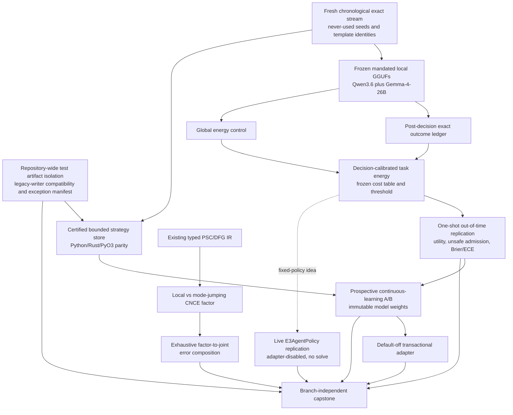

# Research Roadmap vNEXT — Milestone 2026.08.534

**Milestone title:** Decision-Calibrated Energy, Prospective Strategy Learning,
and Nontrivial Stochastic Compilation

**Status:** Planned after terminal milestone `2026.08.533`

**Experiment range:** Exp6156-Exp6168 (13 tasks, four phases)

**Primary question:** Can Carnot independently reproduce the decision value of
task-aware energy on a fresh chronological stream, use the resulting admission
policy to improve frozen flagship GGUFs through verifier-certified strategy
memory, and turn its exact typed stochastic-program result into a meaningful
nonzero-error composition test?

## What milestone 2026.08.533 proved

| Evidence | Terminal result | Consequence for `.534` |
|---|---|---|
| Exp6143 test isolation | `complete_partial:`; the shared resolver, pytest override, forbidden-write guard, quarantine preservation, and focused mutation controls worked, but 6,198 residual direct-writer census rows and unrelated full-suite failures prevented closure | Finish repository-wide compatibility enforcement and produce a resumable migration/exception manifest before using suite cleanliness as a readiness gate |
| Exp6145-Exp6146 exact stream | The deterministic shifted constraint stream and authentic Qwen3.6/Gemma-4-31B local-GGUF corpus were ready | The next verifier test can use real exact outcomes and native-chat receipts; no new parser-repair, finite-ID, or source-domain recovery line is needed |
| Exp6147 task-aware calibration | Scientific artifact was `complete_ready:` with a ready score of `1.0`; it was quarantined by a duration heuristic because analysis consumed cached live-GGUF rows | Preserve the science as non-headline evidence, fix duration/provenance classification separately, and require future artifacts to separate acquisition duration from cached analysis duration |
| Exp6148 held admission | `complete_null:` on the preregistered shifted AUROC delta because both arms reached AUROC/AUPRC `1.0`; nevertheless task-aware energy improved Brier score, ECE, and exact decision utility for both headline models | Do not relabel the null. Freeze a new decision-focused endpoint on a fresh out-of-time stream and demand independent replication before CSL promotion |
| Exp6149 strategy fixture | Transaction, rollback, poison quarantine, bounded bytes, protected retention, and Python/Rust/PyO3 fixed-width parity passed; artifact remained `complete_partial:` because repository-level tests were nonzero | Scale the proven schema across the fresh task set after evidence isolation, rather than repeating the retired exact-slot requalification |
| Exp6150-Exp6151 CSL path | Exp6150 was `blocked_gate_check_failed` on Exp6148/Exp6149 readiness; Exp6151 was pre-emptively skipped | Continuous self-learning still has no prospective utility result; `.534` must run the learner after new evidence and scientific prerequisites, not claim a skipped task |
| Exp6152-Exp6153 stochastic path | Typed PSC/DFG support, probability, seed, batching, and serialization semantics were ready. Program-level composition held, but the factor approximation had zero divergence and Exp6153 was blocked by nonzero tests | Introduce a genuinely multimodal approximate factor and local-vs-mode-jump controls so the compositional bound is non-vacuous |
| Exp6154 ARC transfer | Task-aware live transition admission improved two of three held games, regressed one, and made no solve claim | Replicate on more seeds/games with the policy frozen; no registry solve, adapter, or outer-loop RE work is eligible |
| Exp6155 capstone | `.533` closed honestly with four unflagged positives, one scientific null, three blocked/partial results, and structured skips | `.534` is a replication-and-integration milestone, not a new architecture reset |

The Exp6147/Exp6148 adversarial flags remain binding for headline aggregation.
This roadmap records their scientific fields to motivate a new experiment, not
to remove quarantine or convert a null into a win.

## The three largest gaps to the PRD vision

### Gap 1 — the verifier has a promising calibrated decision signal, but no independent decision-grade result

PRD FR12 requires verifiable reasoning that rejects unsupported strategies at
the point of use. Exp6148 showed why a ranking-only gate is insufficient: the
global and task-aware arms were both perfectly rank-separated on the shifted
set, so AUROC could not measure the large calibration and utility differences.
Those utility findings were diagnostic because the endpoint was selected after
the sealed result was visible.

`.534` therefore creates a new out-of-time event stream with never-used seeds
and template identities, freezes an unsafe-weighted decision rule before held
outcomes are materialized, and evaluates it once. The primary endpoint is
cluster-paired decision utility under an explicit cost table, with unsafe false
admission as a hard safety gate and Brier/ECE as confirmatory proper scores.
AUROC remains descriptive. This is a registered replication of a new endpoint,
not a reinterpretation of Exp6148.

### Gap 2 — continuous self-learning is mechanically safe but has not improved future live reasoning

PRD FR11 requires improvement from verified experience. Carnot has the right
transactional pieces: immutable weights, read-only decision snapshots,
post-outcome commits, idempotence, bounded memory, rollback, and exact
certificates. It does not yet have a prospective local-SOTA result because the
only `.533` A/B was gate-blocked.

`.534` scales the certified strategy store and runs a chronological A/B on
frozen `unsloth/Qwen3.6-35B-A3B-GGUF`, with
`unsloth/gemma-4-26B-A4B-it-GGUF` as an independent architecture check. The
arms are no memory, utility-only memory, certificate-only strategy memory, and
decision-calibrated strategy memory when the new admission policy qualifies.
Every arm receives the same prompts, token budgets, event order, and exact
post-decision outcomes. Positive credit requires future-event utility and no
protected-family regression; retained volume or eventual state equality is not
learning evidence.

### Gap 3 — the stochastic-program bridge is exact but scientifically vacuous under zero approximation error

PRD FR5-FR8 and the hardware-native vision require energies and samplers to
compose through a stable program boundary. Exp6152 supplies that boundary.
Exp6153's exact factor-table replacement made the observed joint divergence
zero, which is a useful correctness control but does not test whether local
factor error actually composes or whether separated modes receive correct
relative energy.

`.534` uses mode-jumping Conditional NCE on one small multimodal categorical
factor. It compares exact, local-only approximate, and local-plus-cross-mode
approximate factors under exhaustive enumeration, then lowers them through the
existing typed PSC/DFG and software sampler interfaces. The deliverable is a
nonzero factor/joint divergence receipt and a valid compositional-error audit,
not hardware execution or speedup.

Evidence isolation is the cross-cutting operational prerequisite for these
three gaps. ARC remains the required live generalization floor, but it is not
one of the three principal PRD gaps.

## Research findings incorporated

| Source | Finding | `.534` use |
|---|---|---|
| Conditional NCE by Jumping Between Modes, OpenReview `07OWUWmUHp` | Local energy differences can leave relative mode energies unidentified; deliberately sampled cross-mode pairs repair that weakness | Exp6166 constructs a nontrivial multimodal approximate factor and compares local-only with mode-jumping CNCE under exhaustive joint-divergence accounting |
| Solver-Hard Is Not Model-Hard, arXiv:2607.17047 | Solver conflict counts and LLM accuracy can dissociate; proof-preserving relabeling can dominate nominal solver hardness | Retained as a control principle only. Exp5785/Exp5786 already executed the hardness/surface deliverable, so `.534` does not repeat it |
| Geometry of Reason, arXiv:2601.00791 | Attention graph spectra may provide training-free validity signals | Watch-only: current GGUF receipts do not establish per-head attention tensor reachability |
| Sequent-Prover, OpenReview `DLMqDyHLTu` | Solver success is not semantic faithfulness; SMT agents need executable and faithful formalizations | Architecture context only: a frozen test-time feedback wrapper overlaps the retired VerIbmc line, while the paper's training recipe mutates weights |
| Hidden-Align, arXiv:2606.03234 | Verified correct rollouts can align useful hidden-state geometry during RL | Watch-only because it requires hidden-state access and weight mutation |
| TOOD, arXiv:2607.29592 | Per-task replay statistics can recalibrate energy under continual task shift | Exp6161 retains the task-aware calibration mechanism but changes the prospectively frozen endpoint from saturated AUROC to safe decision utility/proper scoring |

The dated primary/secondary source receipts, Semantic Scholar counts, negative
ecosystem results, Extropic 2027 boundary, Kona non-reproducibility, and hardware
continuity are recorded in `research-references.md` under
`V534 Planner Refresh - 20260806` before this design.

## Target architecture



Load-bearing boundaries:

- Exact Python/Z3 validators own outcomes. Current outcomes, answers, and held
  labels are absent from decision-time features by interface.
- The decision cost table, task statistics, energy transform, threshold, and
  abstention policy are frozen before any held outcome is opened.
- Exp6148 is never refit, re-gated, or re-headlined. `.534` uses new event IDs,
  seeds, template groups, model rows, and a predeclared endpoint.
- Each LLM task resolves a real `.gguf` path, uses the embedded tokenizer and
  model-native chat template, records GPU lifecycle, and keeps weights/hashes
  immutable. Legacy small models are smoke-only.
- Strategy memory is read-only within a decision and can commit only after an
  exact certificate. Duplicate/reordered delivery is idempotent; poison and
  unfamiliar families are quarantined; state stays bounded.
- CNCE work is software-only and must compare against exhaustive exact
  distributions. No FPGA, Extropic, latency, power, or hardware-speedup claim is
  permitted.
- ARC evidence uses `make_carnot_agent`/`E3AgentPolicy` and the live agent's own
  transitions with per-game adapters disabled. There is no game-source access,
  offline ground-truth BFS, hand adapter, level solve, or registry increment.
- Tests write to task-owned temporary roots. Existing user worktree changes and
  tracked evidence hashes are preserved.

## Reservation accounting

| Class | Tasks | Count |
|---|---|---:|
| Transition, evidence isolation, source ingestion | Exp6156-Exp6158 | 3 |
| Decision-calibrated verifier replication | Exp6159-Exp6162 | 4 |
| Continuous self-learning | Exp6163-Exp6165 | 3 |
| Stochastic program, ARC, closure | Exp6166-Exp6168 | 3 |
| **Total** | Exp6156-Exp6168 | **13** |

## Phase 0 — evidence-safe transition and execution substrate

### Exp6156 — exact transition into `.534`

Archive exactly the 14 activated `.533` identities, preserve every terminal,
partial, null, flagged, and gate-skipped state, append `.533` once, activate
`.534`, and prove Exp6156-Exp6168 collision-free.

**Deliverable:** `results/experiment_6156_transition_v534.json`

### Exp6157 — repository-wide artifact-isolation closure

Extend Exp6143's working resolver/guard from a focused sample to collection and
representative full-suite shards. Add a mechanically enforced compatibility
surface for legacy result writers, a reviewed exception manifest, and a
resumable call-site migration ledger. Closure requires zero tracked-result
writes during the tested shards and clear separation of unrelated suite
failures from isolation failures; it does not require mechanically rewriting
all 6,198 census rows in one task.

**Deliverable:** `results/experiment_6157_repo_wide_artifact_isolation_closure.json`

### Exp6158 — post-V534 source-delta ingestion

Search only after `V534-PLANNER-REFRESH-20260806-END`, classify new sources,
and map accepted deltas to existing tasks or defer them. Task identities and
gates remain immutable; zero accepted deltas is valid.

**Deliverable:** `results/experiment_6158_v534_source_delta_ingestion.json`

## Phase A — prospective decision-calibrated energy replication

### Exp6159 — fresh decision-calibration stream and preregistration

Using the proven Exp6145 generators but never-used seeds and base-template
identities, construct calibration, future-known, and shifted-family partitions.
Freeze the unsafe-weighted utility table, paired bootstrap unit, minimum sample
size, safety/non-inferiority margins, proper-score endpoints, and the one-shot
held loader before model inference. This is not another hardness/surface
fixture and does not use Exp6148 held rows.

**Deliverable:** `results/experiment_6159_decision_calibrated_stream.json`

### Exp6160 — gated fresh local-SOTA decision corpus

Run `unsloth/Qwen3.6-35B-A3B-GGUF` and
`unsloth/gemma-4-26B-A4B-it-GGUF` over Exp6159 with native chat, one frozen
pass per event, no memory, no correctness-conditioned retry, exact
post-decision validation, and immutable row sidecars.

**Gate:** Exp6159 `decision_calibrated_stream_ready_score == 1.0`

**Deliverable:** `results/experiment_6160_sota_decision_calibration_corpus.json`

### Exp6161 — gated decision-calibrated task-energy policy

Fit only on Exp6160 calibration rows. Compare global energy, the Exp6147
task-aware transform, a decision-calibrated task-energy policy, family-only,
shuffled-task, alias, frequency, and simple-distance controls. Freeze one policy
manifest. Readiness requires complete preregistration conformance and useful
calibration headroom; it does not claim held improvement.

**Gate:** Exp6160 `sota_decision_corpus_ready_score == 1.0`

**Deliverable:** `results/experiment_6161_decision_calibrated_energy_policy.json`

### Exp6162 — gated one-shot prospective admission replication

Open Exp6159 held outcomes once and compare the frozen decision-calibrated
policy with the global and Exp6147-style controls. Positive credit requires a
strictly positive lower 95% cluster-paired utility delta for both models, no
unsafe-admission regression, protected known-family non-inferiority, improved
Brier score, and no shortcut-control win. AUROC is descriptive.

**Gate:** Exp6161 `decision_calibrated_policy_ready_score == 1.0`

**Deliverable:** `results/experiment_6162_prospective_admission_replication.json`

## Phase B — certified continuous self-learning

### Exp6163 — gated certified strategy-store scale-up

Scale Exp6149's passed transaction/parity mechanics across every Exp6159 family
and the fixed decision-policy record. Require bounded capacity stress,
certificate versioning, family-shift quarantine, protected-prefix retention,
rollback, restart replay, and Python/Rust/PyO3 parity. The task consumes
Exp6157's isolation closure and does not reopen retired exact-slot state.

**Gates:** Exp6157 `artifact_isolation_closure_ready_score == 1.0` and Exp6159
`decision_calibrated_stream_ready_score == 1.0`

**Deliverable:** `results/experiment_6163_certified_strategy_store_scaleup.json`

### Exp6164 — mandatory prospective continuous strategy-learning A/B

Always execute this task and write an artifact; recompute Exp6162/Exp6163
prerequisites inside the experiment rather than letting the conductor erase the
mandatory CSL attempt. If prerequisites qualify, run matched chronological arms
for Qwen3.6 and a Gemma-4-26B confirmation: no memory, utility-only memory,
certificate-only strategy memory, and decision-calibrated strategy memory. If a
prerequisite does not qualify, report `blocked:` without bypassing it. Positive
credit requires future utility, retention, safety, and immutable-weight gates.

**Deliverable:** `results/experiment_6164_continuous_strategy_learning_ab.json`

### Exp6165 — gated default-off strategy-memory adapter

Only after a positive Exp6164 result, wire the winning policy behind a
default-off adapter. Prove off-path equivalence, atomic commit/rollback,
same-decision write prohibition, restart replay, duplicate suppression, bounded
bytes, model hash immutability, and cross-language parity.

**Gate:** Exp6164 `continuous_strategy_learning_ready_score == 1.0`

**Deliverable:** `results/experiment_6165_strategy_memory_shadow_adapter.json`

## Phase C — nontrivial stochastic composition, ARC replication, and closure

### Exp6166 — mode-jumping approximate-factor thermalization

Build one exactly enumerable multimodal categorical factor on Exp6152's typed
PSC/DFG surface. Compare exact table, local-only CNCE, and local-plus-mode-jump
CNCE with matched samples/parameters. Require deliberately nonzero approximation
error, correct relative mode mass, factor and joint TV/KL, compositional-bound
coverage, context control, deterministic seeds, and software-only provenance.

**Deliverable:** `results/experiment_6166_mode_jumping_factor_thermalization.json`

### Exp6167 — ARC task-aware multi-seed replication, no solve claim

Freeze Exp6154's task-aware live transition-admission policy before running at
least six registry-prechecked adapter-disabled games and at least three seeds.
Measure triggered decisions, per-game and grouped change/recall/safety/latency
metrics, and negative controls. Require the live import path and the agent's own
runtime transitions. Claim no solve and change no registry level.

**Deliverable:** `results/experiment_6167_arc_task_aware_multiseed_replication.json`

### Exp6168 — branch-independent capstone and reconciliation

Reconcile all 13 task states, structured gates, missing artifacts,
adversarial/quarantine fields, model receipts, exact-oracle boundaries,
continuous-learning evidence, stochastic substrate labels, ARC provenance, and
test-isolation results. Update durable specs/traceability/ops docs only for work
actually delivered; preserve nulls, blocks, and skips.

**Deliverable:** `results/experiment_6168_v534_capstone_reconciliation.json`

## Dependency graph

```text
Exp6156 transition ---------------------------------------------> Exp6168
Exp6157 artifact isolation -----> Exp6163 strategy scale-up -----+
Exp6158 source delta --------------------------------------------+

Exp6159 fresh stream -> Exp6160 live corpus -> Exp6161 policy -> Exp6162 held
       |                                                       |       |
       +----------------------> Exp6163 -----------------------+       |
                                      |                                |
                                      +------> Exp6164 CSL <-----------+
                                                       |
                                                       +-> Exp6165 adapter

Exp6152 prior typed IR -> Exp6166 mode-jumping composition ------> Exp6168
Exp6154 prior ARC policy -> Exp6167 multi-seed replication ------> Exp6168
All branches ----------------------------------------------------> Exp6168
```

Structured gates are conjunctive. Exp6164 is intentionally not conductor-gated
because `research-program.md` requires a continuous-self-learning attempt in
every milestone; its experiment must still block honestly rather than bypass a
failed prerequisite.

## Hardware and runtime requirements

| Task | Runtime | Requirement and claim boundary |
|---|---|---|
| Exp6156-Exp6159 | CPU, filesystem, network for ingestion | Preserve the dirty worktree, use task-owned temporary roots, low-concurrency source access; no accelerator claim |
| Exp6160 | Dual RTX 3090 preferred | Qwen3.6-35B-A3B and Gemma-4-26B-A4B resolved local GGUFs, real CUDA offload, one task-owned worker/model lease, embedded tokenizer, lifecycle cleanup |
| Exp6161-Exp6163 | CPU | Cached authentic rows, exact validators, bootstrap/calibration code, Rust/PyO3 toolchain; no LLM invocation |
| Exp6164 | Dual RTX 3090 preferred | Same frozen Qwen3.6 and Gemma-4-26B hashes, matched chronological arms, explicit GPU leases and teardown; no weight mutation |
| Exp6165 | CPU plus Rust/PyO3 | Default-off integration only; no production enablement |
| Exp6166 | CPU/JAX software simulation | Existing Torx-compatible typed IR and vendored THRML boundary; exhaustive small-state enumeration; no device execution, latency, power, or speedup claim |
| Exp6167 | CPU | Live ARC/WOPR agent path, adapter-disabled games, own-transition evidence; no LLM and no game-level solve |
| Exp6168 | CPU | Read-only evidence reconciliation and existing validation tooling |

Attached hardware continuity is unchanged: dual RTX 3090s are the only required
accelerators; KV260 is terminal, GateMate remains physically blocked, PolarFire
is opportunistic, Extropic Z1 is unavailable before the advertised 2027 early
access window, and Kona exposes no executable public baseline. No board task is
staged because the operator has not reported a changed physical state.

## Completion criteria

Milestone `.534` is complete when all 13 tasks have a terminal artifact or a
conductor-recorded structured skip and Exp6168 reconciles them honestly. The
scientific success bar is stricter than administrative completion:

1. fresh decision-calibrated energy reproduces positive held utility for both
   mandated models without unsafe-admission or known-family regression;
2. verifier-certified strategy memory improves chronological future utility
   with immutable weights and bounded, rollback-safe state;
3. mode-jumping approximate factors improve relative-mode/joint divergence over
   local-only training while respecting the preregistered composition bound;
4. the expanded ARC result reports the negative game/seed tail as prominently
   as the positive tail and claims no solve; and
5. tracked evidence remains immutable during applicable test shards.

Null, blocked, retired, quarantined, or skipped outcomes remain valid research
results. They cannot be converted into completion credit for the criteria above.
