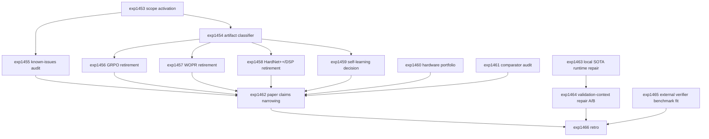

# Research Roadmap vNEXT: Milestone 2026.04.112

Planned: 2026-05-07
Status: Draft for conductor execution
Predecessor: 2026.04.111 scope-missed live-SOTA repair gate, positive FR-11 growth, Discrete SB RTL source/lint/sim
Roadmap YAML: `research-roadmap-next.yaml`

## ID Allocation Note

Milestone `.111` used `exp1439` through `exp1452`. The next 14 conductor
tasks are `exp1453` through `exp1466`.

## What Milestone .111 Proved

| Track | Evidence | Finding |
|---|---|---|
| Carry-forward discipline | `exp1439` | `.110` unresolved tracks were mapped to concrete `.111` tasks and same-verdict retirement rules. |
| Spec coverage metadata | `exp1440` | The named spec-coverage traceability cluster was fixed to zero residual debt, though the full suite still has unrelated failures. |
| Discrete SB RTL | `exp1441`, `exp1451` | `hardware/kv260/discrete_sb_256.v` and a testbench now exist, and lint/simulation completed locally. No KV260 board execution was claimed. |
| Live SOTA GGUF runtime | `exp1442` | Two RTX 3090 GPUs were idle and Qwen/Gemma flagship GGUFs were cached, but `llama_cpp` failed to load because `libcudart.so.12` was unavailable; `unsloth/gemma-4-26B-A4B-it-GGUF` was not cached. |
| Live repair chain | `exp1443`, `exp1444`, `exp1445` | Correctly gate-blocked because `exp1442.local_sota_runtime_ready=false`. Missing/gated artifacts are not success evidence. |
| FR-11 self-learning | `exp1447` | Memory-policy changes produced positive verified growth (`self_learning_delta_overall=156`) with `nonforgetting_rate=1.0`. |
| PRM process agent | `exp1448` | PRM v3 was ready but did not improve on a saturated candidate pool (`selection_improvement_pp=0.0`); repeat selector work should be retired unless the pool changes or false-acceptance reduction is targeted. |
| LTLZinc adapter | `exp1449` | Temporal continual-learning cases were generated and accepted; useful as a durable constraint-growth benchmark. |
| EBT/NRGPT baseline | `exp1450` | Energy converged at smoke scale, but decoded quality evidence was absent; keep Phase-3 energy descent smoke-only until quality improves. |
| Retro | `exp1452` | `.111` met 10 of 14 criteria, below the 11/14 threshold. Main carry-forward blocker is the local GGUF CUDA/runtime path. |

**Critical insight from `.111`:** Carnot has enough successful strands to be at
risk of accumulating noise. The active known-issues directive requires the next
milestone to reduce scope before adding new lineages. The only justified
non-scope additions are fixing the live SOTA runtime blocker and testing the
single validation-error-as-context repair salvage idea that was already queued
as a retirement decision point.

## Research Signals Added Before Planning

The post-.111 sweep updated `research-references.md` before this roadmap was
finalized. The near-term signals are:

- `Spilled Energy in Large Language Models` (`arXiv:2602.18671`) gives a
  training-free logit-energy hallucination diagnostic, useful only after live
  GGUF logits are available.
- HardNet++, KKT-Hardnet, and SnareNet validate hard output-constraint layers
  but also confirm that Carnot's existing HardNet++/DSP lineage should be
  consolidated, not variant-expanded.
- KAN verification now has a MILP-abstraction route (`arXiv:2602.06737`), so
  QuantKAN belongs in paper claims only if existing measured artifacts support
  it.
- `Large Language Models Can Take False First Steps at Inference-time Planning`
  (`arXiv:2602.02991`), Planning as Descent (`arXiv:2512.17846`), and MARS
  (`arXiv:2601.15498`) support a narrow validation-error-as-context A/B test:
  feed the concrete verifier failure back to the retry and measure acceptance.
- Graph Energy Matching (`arXiv:2603.23398`) is relevant future Phase-3 context
  but does not justify scaling EBT/NRGPT beyond `.111` smoke evidence.
- Extropic/THRML and Kona 1.0 remain strategically aligned with Carnot, but no
  public 2026 update changes the immediate hardware priority: repair the local
  GGUF CUDA runtime and narrow hardware tracks.

## Three Biggest Gaps

1. **Editorial scope is the biggest system risk.** The repo has 1,400+
   experiment artifacts, 110+ milestones, many mandatory-priority entries, and
   several noisy lineages. The next milestone must turn scattered evidence into
   a smaller set of active claims, active lineages, and active hardware tracks.

2. **Live SOTA repair remains blocked by runtime plumbing.** `.111` did not
   disprove repair; it proved `llama_cpp`/CUDA/cache readiness is not solved.
   No live-SOTA repair v3, reranker, or scale claim is allowed until a mandated
   GGUF model completes real inference.

3. **Self-learning is positive but not yet a headline thesis.** `exp1447`
   produced verified growth, but the broader self-learning lineage has many
   `_improved_non_headline` variants. `.112` must decide whether this becomes a
   paper-anchored claim or gets retired as useful but non-headline engineering.

## Scope-Reduction Compliance

`ops/known-issues.md` requires at least 8 tasks in the next milestone to reduce
scope. This roadmap allocates 10 explicit scope-reduction tasks:

| Required scope item | Task |
|---|---|
| Activation / compliance manifest | `exp1453` |
| Experiment artifact classifier | `exp1454` |
| known-issues priority audit | `exp1455` |
| GRPO/VPRM consolidation and retirement | `exp1456` |
| WOPR puzzle cartridge retirement | `exp1457` |
| HardNet++/DSP repair stack consolidation | `exp1458` |
| Self-learning non-headline lineage decision | `exp1459` |
| Hardware portfolio narrowing | `exp1460` |
| Comparator integration audit | `exp1461` |
| Paper-v6 anchored-claims narrowing | `exp1462` |

The remaining tasks are a live-runtime unblock (`exp1463`), a gated repair
validation-context salvage/retire test (`exp1464`), an external verification
benchmark fit audit (`exp1465`), and the milestone retro (`exp1466`).

## Architecture

```
.112 Milestone Architecture
========================================================================

Phase 0 - Scope-Reduction Activation
  exp1453: .112 scope-reduction activation manifest -------------------.
  exp1454: Experiment artifact classifier -----------------------------+--> scope ledgers
  exp1455: known-issues mandatory priority audit ----------------------'

Phase 1 - Lineage Retirement
  exp1456: GRPO/VPRM lineage consolidation + retirement ---------------.
  exp1457: WOPR puzzle cartridge retirement ---------------------------+
  exp1458: HardNet++/DSP repair stack consolidation -------------------+--> exclusion manifests
  exp1459: Self-learning non-headline decision + FR-11 pivot ----------'

Phase 2 - Portfolio and Claim Narrowing
  exp1460: Hardware portfolio narrowing -------------------------------.
  exp1461: Comparator integration cite/retire audit -------------------+
  exp1462: Paper-v6 anchored-claims narrowing -------------------------'

Phase 3 - Minimal Salvage and Closure
  exp1463: Local SOTA GGUF CUDA/runtime repair ------------------------.
  exp1464: Validation-error-as-context A/B repair test (gated) --------+--> repair retire/preserve decision
  exp1465: External verifier benchmark fit audit ----------------------+
  exp1466: Milestone .112 retrospective -------------------------------'
```

## Phase Descriptions

**Phase 0 - scope-reduction activation.** `exp1453` turns the `.111` retro and
the hard known-issues directive into an execution manifest. `exp1454` classifies
all experiment artifacts as SIGNAL, NOISE, or AMBIGUOUS and identifies the
highest-cost noise candidates. `exp1455` audits mandatory known-issues entries
and trims the active priority list to 10 or fewer items.

**Phase 1 - lineage retirement.** `exp1456` consolidates GRPO/VPRM into one
retirement artifact and blocks GRPO v15 proposals. `exp1457` retires the WOPR
puzzle cartridge line. `exp1458` retires the HardNet++/DSP repair stack after
recording the hard-constraint lesson. `exp1459` is the required continuous
self-learning decision task: it uses the positive `exp1447` result to choose a
headline pivot or a formal retirement rule.

**Phase 2 - portfolio and claim narrowing.** `exp1460` chooses the active
hardware portfolio and updates architecture/hardware docs. `exp1461` decides
whether each comparator integration is cited or retired. `exp1462` narrows the
paper-v6 claim set to 3-5 artifact-anchored claims and moves unsupported
territory to appendix/future work.

**Phase 3 - minimal salvage and closure.** `exp1463` repairs or conclusively
blocks the local SOTA GGUF runtime by fixing CUDA/library/cache readiness.
`exp1464` runs only if `exp1463.local_sota_runtime_ready=true`; it tests
validation-error-as-context repair retries and retires the repair-executor
lineage if no metric improves. `exp1465` decides whether external verification
benchmarks such as VNNLIB/VNN-COMP/BEAVER should be adopted now or deferred.
`exp1466` closes the milestone with honest criteria and carry-forward rules.

## Dependency Graph



Structured conductor gate:

- `exp1464` requires `exp1463.local_sota_runtime_ready == true`.

Other dependencies are execution-order dependencies rather than skip gates:
scope-reduction tasks should still write a terminal artifact even if upstream
evidence is noisy, ambiguous, or incomplete.

## Hardware Requirements

| Task | Hardware | Notes |
|---|---|---|
| `exp1453` through `exp1462`, `exp1465`, `exp1466` | CPU | Audits, docs, artifact classification, claim narrowing, and benchmark-fit decisions. |
| `exp1463` | Dual RTX 3090 preferred | Must repair or precisely block `llama_cpp`/CUDA/cache readiness for mandated local SOTA GGUF models. |
| `exp1464` | Dual RTX 3090 preferred | Runs only after `exp1463.local_sota_runtime_ready=true`; must use mandated local SOTA GGUF inference for headline repair evidence. |

Mandated local SOTA GGUF models for every LLM-bearing experiment:

- `unsloth/Qwen3.6-35B-A3B-GGUF`
- `unsloth/gemma-4-31B-it-GGUF`
- `unsloth/gemma-4-26B-A4B-it-GGUF`

Legacy small models such as Qwen3.5-0.8B or gemma-4-E4B-it may be used only as
fast CPU smoke tests. They must not be reported as headline models.

## Success Criteria

| Criterion | Target |
|---|---|
| Scope activation | `exp1453.scope_reduction_manifest_complete=true`. |
| Artifact classifier | `exp1454.classification_table_written=true` and top-50 noise candidates are identified. |
| Priority audit | `exp1455.active_priority_count <= 10` and priority count is trimmed by at least 40%. |
| GRPO retirement | `exp1456.grpo_lineage_retired=true` and GRPO v15 is manifest-blocked. |
| WOPR retirement | `exp1457.wopr_puzzle_lineage_retired=true` and future puzzle cartridges are manifest-blocked. |
| HardNet++/DSP retirement | `exp1458.hardnet_dsp_lineage_retired=true` with lessons retained. |
| Self-learning decision | `exp1459.self_learning_headline_pivot_selected=true` or `self_learning_lineage_retired=true`, and the decision cites `exp1447`. |
| Hardware narrowing | `exp1460.active_hardware_track_count <= 3` and architecture/hardware docs are updated. |
| Comparator audit | `exp1461.comparator_decision_count >= 6` and every named comparator has cite/retire status. |
| Paper claims | `exp1462.anchored_claim_count` is between 3 and 5, each with artifact references. |
| Live SOTA runtime | `exp1463.local_sota_runtime_ready=true` or a precise persistent blocker with same-verdict retirement is recorded. |
| Repair salvage | If gated on, `exp1464.acceptance_delta_pp > 0` or the repair-executor lineage is explicitly retired. |
| Verifier benchmark fit | `exp1465.benchmark_adoption_decision` is `adopt`, `defer`, or `retire`, with rationale. |
| Retro | `exp1466.criteria_total=14` and carry-forward/retirement rules are recorded. |

Milestone threshold: 11 of 14 criteria met is a successful milestone. Honest
gate-blocks are valid evidence but do not count as met criteria.

## Prior Failure Summary

- `exp1442` failed the live runtime gate because `libcudart.so.12` was missing
  from the `llama_cpp` load path and the middle MoE GGUF was not cached.
  `exp1463` addresses those exact blockers before any repair rerun.
- `exp1443`, `exp1444`, and `exp1445` were gate-blocked. `exp1464` cannot run
  unless runtime repair succeeds, and it must retire the line on no improvement.
- `exp1448` proved the PRM process-agent selector does not improve on a
  saturated candidate pool. `.112` does not repeat PRM selector work.
- The active known-issues directive says `.111` should have been scope
  reduction. `.112` corrects that by assigning 10 scope-reduction tasks.

## Decentralization and Local-First Implications

The milestone preserves Carnot's local-first thesis by routing all tasks to
Codex (`agent_type: codex`, `model: gpt-5.5`) and keeping live LLM experiments
on mandated local GGUF models. Closed hosted models are not used for headline
results. Extropic, Kona, OpenReview, HuggingFace, and Semantic Scholar research
signals are planning references, not dependencies.

## Conductor Notes

- Do not modify `research-roadmap.yaml`.
- Do not modify `scripts/research_conductor.py`.
- Do not propose Gemini-routed tasks while the known rate-limit constraint is
  active.
- All tasks include a deliverable path.
- `exp1464` includes a structured `gated_on` block so the conductor can skip the
  expensive repair prompt if `exp1463` does not fix runtime readiness.
