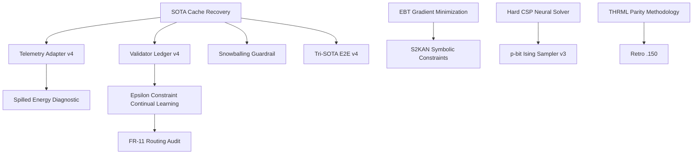

# Milestone 2026.05.150: SOTA Cache Recovery, EBT Gradient Loops, and Epsilon Continual Learning

**Milestone ID:** `2026.05.150`
**Status:** Proposed
**Sequence:** 150

## 1. What the Previous Milestone Proved (.149)

Milestone 2026.05.149 suffered a severe infrastructure disruption. The SOTA GGUF Cache and Runtime Preflight failed, which blocked terminal artifact recovery and caused an almost complete failure to execute the planned scientific tasks. 9 tasks were gate-blocked, and 2 failed due to timeouts. The retrospective confirmed that SOTA caching failures blocked terminal artifact recovery.

## 2. The 3 Biggest Gaps
1. **Infrastructure Fragility:** The SOTA caching mechanism is fragile and blocks all downstream SOTA integration tasks. We must recover the terminal artifacts and harden the cache preflight.
2. **Iterative Energy Minimization:** Standard autoregressive next-token prediction lacks the deep "System 2" thinking proposed by Energy-Based Transformers (EBTs). We need to implement iterative, gradient-based energy minimization loops (arXiv:2507.02092).
3. **Catastrophic Forgetting in Constraints:** As we add new constraints, we risk forgetting old ones. We need an explicit epsilon-constraint online continual learning mechanism to balance plasticity and stability.

## 3. Architecture Diagram

## 4. Phase Descriptions

**Phase 0: Infrastructure Recovery**
- **exp1918:** Unconditional recovery of terminal artifacts and SOTA GGUF cache preflight.

**Phase 1: Carry-forwards from .149**
- **exp1919-exp1922:** Telemetry adapter, spilled energy diagnostic, structure guardrail, and validator ledger.

**Phase 2: Continual Learning & Constraints**
- **exp1923:** Epsilon Constraint Online Learning prototype (continuous self-learning).
- **exp1924:** FR-11 Routing Audit.

**Phase 3: Symbolic & Energy Advancements**
- **exp1925:** EBT gradient minimization loop (arXiv:2507.02092).
- **exp1926:** S2KAN integration for symbolic fidelity.
- **exp1927:** Hard CSP and Neural Solver Reality Check (with increased timeout).

**Phase 4: Hardware and E2E Integration**
- **exp1928:** Corrected THRML/Carnot Parity Methodology.
- **exp1929:** p-bit Ising Sampler v3.
- **exp1930:** Integrated Tri-SOTA E2E v4.

**Phase 5: Retrospective**
- **exp1931:** Milestone .150 Retrospective.

## 5. Hardware Requirements
- Dual RTX 3090s via CUDA for Tri-SOTA E2E validation.
- Standard CPU for KAN and EBT structural prototyping.
