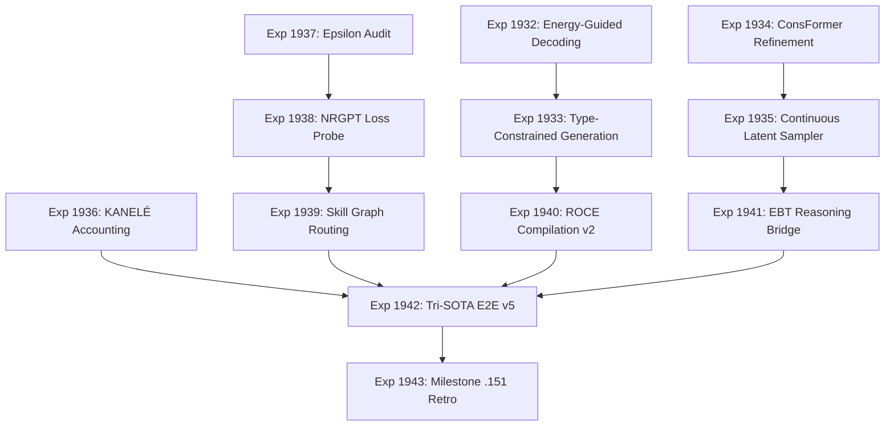

# Carnot Research Roadmap: Milestone 2026.05.151

**Status:** Proposed
**Author:** Carnot Planning Agent
**Date:** 2026-05-13

## 1. Executive Summary

Milestone `2026.05.151` transitions Carnot from recovery of foundational SOTA cache/telemetry toward advancing our verifiable reasoning, continuous self-learning, and hardware-efficiency frontiers. The `2026.05.150` milestone stabilized SOTA artifact recovery, tracked token-level spilled energy, and instituted epsilon continual learning.

This milestone integrates fresh 2026 research findings to close the largest gaps between the current state and the Product Requirements Document (PRD):
1. **Closing the Structured Generation Semantic Gap:** Using Energy-Guided Decoding and Type-constrained decoding to eliminate the semantic reasoning tax of hard constraints.
2. **Advancing Iterative Neural Solvers:** Applying ConsFormer-style self-supervised iterative refinement for verifiable reasoning without labeled data.
3. **Hardware-Efficient KAN Tiers:** Formulating our KAN constraints into LUT-based architectures (KANELÉ) to prepare for realistic KV260 deployment.
4. **Continuous Latent Exploration:** Adding FAR-style fast autoregressive continuous-latent sampling to bridge our discrete token reality and the eventual thermodynamic target.

## 2. Milestone Phases

### Phase 1: Guided & Constrained Generation
- **Focus:** Improve the reliability and semantic quality of constrained generation loops.
- **Tasks:**
  - **Exp 1932:** Energy-Guided Decoding
  - **Exp 1933:** Type-Constrained Generation

### Phase 2: Verifiable Reasoning & Hardware Efficiency
- **Focus:** Deploy iterative solvers and perform strict resource accounting for hardware execution.
- **Tasks:**
  - **Exp 1934:** ConsFormer Iterative Refinement
  - **Exp 1935:** Continuous Latent Sampler Prototype (FAR)
  - **Exp 1936:** KANELÉ Hardware Accounting

### Phase 3: Continuous Self-Learning & Audits
- **Focus:** Safely grow the system's reasoning skill graph without catastrophic forgetting.
- **Tasks:**
  - **Exp 1937:** Continual Epsilon Learning Audit
  - **Exp 1938:** NRGPT Energy-Based Loss Probe
  - **Exp 1939:** Auditable Skill Graph Routing

### Phase 4: Integration & Retrospective
- **Focus:** Close the loop with an end-to-end evaluation across the flagship models and synthesize results.
- **Tasks:**
  - **Exp 1940:** ROCE Compilation v2
  - **Exp 1941:** EBT Reasoning Bridge
  - **Exp 1942:** Integrated Tri-SOTA E2E v5
  - **Exp 1943:** Milestone .151 Retrospective

## 3. Dependency Graph

## 4. Hardware Requirements
- **Local GPUs:** Dual RTX 3090 required for Exp 1932, 1933, 1942.
- **GGUF Models:**
  - `unsloth/Qwen3.6-35B-A3B-GGUF` (Flagship MoE)
  - `unsloth/gemma-4-31B-it-GGUF` (Flagship Dense)
  - `unsloth/gemma-4-26B-A4B-it-GGUF` (Middle MoE)
- **FPGA/KV260:** Exp 1936 is no-synthesis accounting only; board deployment remains deferred.
