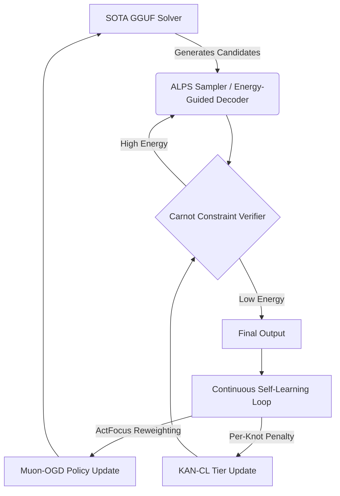

# Milestone 2026.05.210: ALPS-based Generative Inference, KAN-CL Continuous Self-Learning, and ActFocus Energy Reweighting

## High-Level Goals
This milestone addresses the three most critical gaps identified between the `.209` execution and the core PRD vision:
1. **Continuous Self-Learning Robustness:** The CSL loops have struggled with catastrophic forgetting and rigid representation scaling. We introduce KAN-CL (per-knot importance regularization) and Muon-OGD (spectral orthogonal gradient projection) to firmly guarantee non-forgetting across parameter updates, directly tackling FR-11.
2. **Generative Inference Efficiency:** While EqM established continuous sampling, Annealed Langevin Posterior Sampling (ALPS) and Energy-Guided Decoding (hidden state minimal-energy selection) offer a path to faster, more robust sampling without excessive hyperparameter tuning or continuous-space mode collapse.
3. **Action Bottleneck Mitigation:** By applying ActFocus (token-level energy reweighting), we address the imbalance where reasoning tokens overwhelm critical action tokens during policy updates. This provides dense, localized gradients explicitly for the tokens interacting with Carnot verifiers.

## Previous Milestone (.209) Accomplishments
Milestone `.209` successfully proved Equilibrium Matching (EqM) composition, deployed IRED Adaptive Optimizers, and introduced ASP-KAN-HAQ for hardware accounting. However, it revealed that CSL mechanisms still suffer from semantic drift during memory promotion and that the generative process suffers from continuous-space inefficiencies without annealed reweighting.

## Architecture

## Phase Descriptions

### Phase 1: Generative Inference via ALPS and Energy-Guided Decoding
Integrate Annealed Langevin Posterior Sampling (ALPS) to stabilize and accelerate EBM sampling by annealing static posterior distributions. Augment this with explicit Energy-Guided Decoding that leverages minimal-energy hidden states directly from the LLM representations, minimizing hallucination and avoiding mode-collapse during continuous inference.

### Phase 2: Advanced Continual Learning with KANs and Spectral Geometry
Update the continuous self-learning pipeline to use KAN-CL for the core EBM constraints, ensuring that previous constraints are retained via per-knot importance regularization. For the LLM policy side, deploy Muon-OGD to project updates orthogonally under spectral norm bounds, ensuring that updates to new symbolic concepts do not obliterate previously verified task representations.

### Phase 3: Action Bottleneck and Energy Reweighting
Introduce ActFocus to the agentic feedback loop. Instead of uniformly crediting reasoning traces, focus gradient energy on the action tokens that directly interact with the verifier, effectively eliminating the action bottleneck. Integrate NEXUS-style symbolic grounding to strictly bound probabilistic risk into deterministic constraints before ActFocus updates.

### Phase 4: Hardware Simulation & Full Integration
Simulate a NeuroRing-style bidirectional ring topology for parallel Gibbs/Ising samplers to prep for future FPGA workloads. Conclude with an exhaustive E2E benchmark verifying that the CSL loop retains previously learned constraints while acquiring new ones without performance degradation.

## Dependency Graph
Phase 1 (Generative Inference) -> Phase 2 (Continual Learning) -> Phase 3 (Feedback and Token Weighting) -> Phase 4 (Integration and Benchmark)

## Hardware Requirements
- **Execution:** Dual RTX 3090 instances for SOTA GGUF model execution (e.g., `unsloth/Qwen3.6-35B-A3B-GGUF`, `unsloth/gemma-4-31B-it-GGUF`).
- **Accounting:** CPU-only NeuroRing simulation and accounting, preserving the rule of no unauthenticated Vivado/KV260 claims.