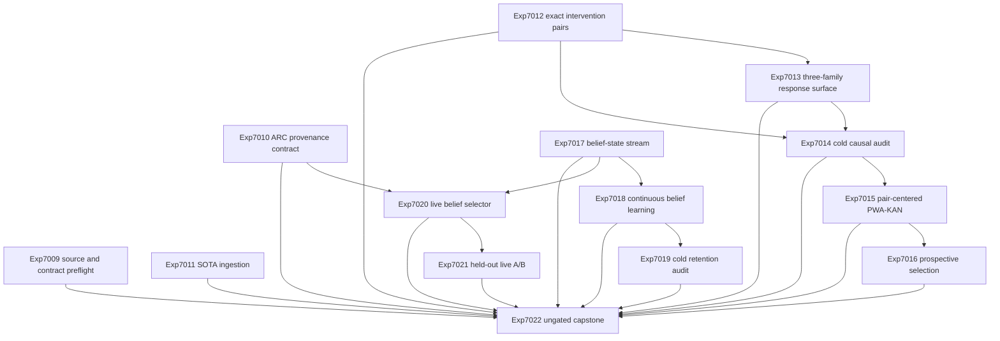

# Research Roadmap vNEXT: Causal Pair Energy, Belief-State Self-Learning, and Live ARC Selection

**Milestone:** `2026.09.614`  
**Status:** Proposed  
**Date:** 2026-09-04  
**Task contract:** 14 tasks, `exp7009` through `exp7022`, in the exact order below.

## Purpose

V613 closed an important negative result. Authentic local-model responses and
exact labels were not enough to make its absolute feature bank admissible:
mutation metadata predicted validity with AUROC `0.9537`, and the supposedly
independent commitment control also carried shortcut signal. The learned
verifier branch therefore stopped before fitting or selection. Its ARC branch
predicted held-out next frames but did not beat both inert and action-delta
controls.

V614 changes the scientific unit rather than tuning the disqualified one. The
verifier branch uses exact minimal interventions and signed within-pair model
responses, with metadata balanced inside every pair. The ARC branch separates
a current-state belief ledger from action simulation, learns only from later
observations, and exposes the mechanism through the canonical live selector.
Two infrastructure tasks first make the execution contract and ARC provenance
machine-checkable. A source-ingestion task keeps the implementation tied to the
new 2026 evidence.

The milestone tests three claims:

1. Exact minimal intervention pairs yield causal, shortcut-resistant response
   features across all three required local GGUF families.
2. A pair-centered PWA-KAN selects valid candidates prospectively without
   consulting the exact authority during selection.
3. A game-blind belief ledger improves future ARC decisions, retains useful
   evidence across attempts, and is reachable through `make_carnot_agent` and
   `E3AgentPolicy` on held-out games.

## What V613 Proved

V613 completed its 13-task contract and reported an honest terminal null.

- Exp6996 confirmed document/YAML parity and froze the V613 source delta.
- Exp6997 emitted an authority sidecar and a blinded wide learner view.
- Exp6998 ran all three required SOTA GGUF families on CUDA. Across 216 unit
  probes it found no stable self-commitment effect.
- Exp6999 found the load-bearing shortcut. Mutation metadata alone reached
  AUROC `0.9537`; the allowed table reached about `0.656`; the prohibited
  commitment control reached about `0.715`. Readiness was correctly zero.
- Exp7000 through Exp7004 were gate-blocked or preempted instead of fitting a
  model on disqualified evidence.
- Exp7005 compared four ARC engine conditions. Held-out next-frame exactness
  reached `0.70`, but the action-delta control was zero and the engine did not
  beat both controls.
- Exp7006 and Exp7007 preserved a static sparse-placement branch without
  claiming unavailable TSU execution.
- Exp7008 reconciled every terminal state and classified the milestone science
  as null.

V613 also exposed two operational facts. The live supervisor has 64 recorded
`stagnations_unredirected`, so a new selector arm has a concrete seam. And the
recent ARC evaluation artifacts do not consistently record GPU identity,
context length, server binary, lease, completion counters, and solve
provenance. V614 repairs that contract before its new live A/B.

## Three Biggest Gaps to the PRD Vision

### Gap 1: Carnot has no shortcut-safe learned verification signal

Exact authorities work, but the learned side still confuses evidence with
provenance. The PRD needs a reusable verification layer that can guide
generation before executing an oracle. Another pointwise feature model would
repeat the disqualified V613 method. V614 instead measures the signed response
to one exact, minimal constraint change while holding nuisance variables fixed.

### Gap 2: Continuous self-learning does not yet improve future decisions

Previous prompt memory and constraint-update experiments were null, blocked, or
failed cold retention. The framework has storage and transaction machinery but
no causal evidence that a pre-outcome decision improves after a bounded update.
V614 uses a chronological ARC belief ledger whose decision at time `t` is
frozen before observation `t+1`, then tests future utility, retention,
rollback, poison resistance, and deletion interventions.

### Gap 3: ARC simulation is not yet a useful, reproducible live control signal

ARC world-model predictions exist, but V613 did not show action-value gain. The
canonical agent also lacks complete evaluation provenance. V614 separates
belief from simulation, installs a supervisor arm at the current live seam, and
runs a held-out, adapter-disabled A/B with complete model, GPU, context, server,
lease, and solve-provenance records.

## Research Inputs

The pre-design sweep is recorded in `research-references.md` under
`V614 Planner Refresh - 2026-09-04`.

- **BB-WM (arXiv:2609.00455)** separates a queryable belief about current state
  from action simulation and reports complementary decision value. V614 adapts
  that separation to game-blind ARC evidence produced by the live agent's own
  attempts.
- **HIPPO (arXiv:2606.29481)** uses hint-anchored pairwise aggregation to
  distinguish reasoning from shortcut-following. V614 adapts the causal unit,
  not its benchmark: exact minimal violations and repairs become paired
  anchors, while hints, provenance, and labels remain outside learner input.
- **BatchSum / BSR (ICML 2025)** identifies reward magnitude and representation
  norm dispersion as pairwise-model shortcuts. V614 adds pair centering,
  sum-to-zero regularization, and explicit norm-only and magnitude-only
  controls.
- **IntroConformal (arXiv:2609.01375)** is retained as a watch item. Its
  layer-wise LVLM introspection contract is unavailable on Carnot's current
  llama.cpp GGUF path, and self-signals are not an exact authority.
- **Extropic Z1T** now exposes one weight release and JAX training code. V614
  records the software delta but makes no TSU latency, energy, or execution
  claim without authenticated hardware.
- Current Kona material remains an architecture comparator without public
  weights or a reproducible local runner.

No source supplies a drop-in Carnot verifier or ARC policy. The experiments
below implement narrow mechanisms and preserve exact external authorities.

## Architecture



Exp7009 and Exp7010 are the two reserved infrastructure tasks. Exp7011 is the
required SOTA-ingestion task. The verifier and ARC branches are independent
until the capstone. Exp7022 has no structured gate; it must reconcile positive,
null, blocked, disqualified, and circular outcomes without retrying unchanged
external blockers.

## Phase 1: Evidence Foundations and Causal Fixture

### Exp7009: V614 source delta and task-contract preflight

Independently parse this document and `research-roadmap-next.yaml`. Check the
14 task IDs, order, titles, deliverables, structured gates, gate-producer field
names, model declarations, prior-failure entries, and required artifact fields.
Also confirm that the V614 source delta is present before execution planning.

This is advisory infrastructure. It does not edit the conductor or gate either
science branch.

### Exp7010: ARC evaluation hardware and context provenance contract

Define and wire one shared ARC evaluation provenance schema at producer and
consumer boundaries. Every evaluation row must record GPU UUID/model, CUDA
device, model spec and hash, `n_ctx`, server binary and command hash, endpoint
and port, lease identity, request/completion counters, policy/factory hashes,
and solve provenance. Add deterministic producer and rejection fixtures.

Do not rewrite historical results or claim that missing old fields are known.
The deliverable is a forward contract and tests for new ARC evidence.

### Exp7011: V614 pairwise-verifier and belief-model SOTA ingestion

Recheck the selected 2025-2026 sources, their primary artifacts, and public
code. Write a bounded method-to-module mapping for pairwise causal evidence,
BatchSum controls, belief-state separation, and the Z1T software-only delta.
Record unsupported dependencies and explicit non-claims.

### Exp7012: Exact minimal constraint-intervention pair fixture

Build at least 48 exact candidate pairs from at least four source families.
Each matched block contains a clean candidate, one minimal exact violation or
repair, and an isomorphic surface variant. Mutation kind, serialization,
length, source bookkeeping, and label prevalence must be balanced within
blocks. Exact authorities label the sidecar only; no label, provenance, split,
or hint enters the learner input.

This is not another absolute feature table. It freezes intervention semantics,
headroom, group splits, checksums, and a no-LLM deterministic replay before any
GGUF scoring.

## Phase 2: Pairwise Causal Energy and Prospective Selection

### Exp7013: Three-family exact intervention response surface

Run the frozen pair fixture through all three mandated local SOTA GGUF families:
`unsloth/Qwen3.6-35B-A3B-GGUF`, `unsloth/gemma-4-31B-it-GGUF`, and
`unsloth/gemma-4-26B-A4B-it-GGUF`. Measure teacher-forced signed response
changes for clean, minimal-violation, minimal-repair, and isomorphic conditions
at matched prompts and token positions. Freeze every response before opening
the exact label sidecar.

The model is never asked to self-grade. Commitment timing, model rationales,
mutation metadata, source IDs, and exact labels are prohibited features.

### Exp7014: Cold causal identifiability and shortcut audit

In a fresh read-only process, recompute row hashes and run direct leakage,
serialization, length, mutation-kind, source, model-ID, norm-only, and
magnitude-only probes. Permute, replace, and delete the authority sidecar and
confirm the learner tensors do not change. Recompute signed intervention
effects by model and held source group.

Release the causal bank only when direct leakage is zero, no prohibited
metadata-only probe has an upper 95% interval at or above `0.80` AUROC, the
isomorphic invariance control passes, and the signed effect is identifiable on
at least two of the three mandated model families. Otherwise classify it
`disqualified` or `null`; do not train the PWA-KAN.

### Exp7015: BatchSum pair-centered PWA-KAN energy

Train a compact PWA-KAN on signed within-pair responses only. Use pair centering
and a BatchSum-style sum-to-zero penalty. Compare paired logistic, size-matched
MLP, absolute-score, norm-only, and magnitude-only controls under source-group
splits. Fit labels may come from exact training authorities, but selection code
must not open an authority or sidecar.

Freeze the model, PWA abstraction, feature allowlist, calibration choice, and
all candidate selections before held labels are exposed. Exact execution is an
evaluator and ceiling, never an eligible selector.

### Exp7016: Prospective oracle-distinct pair selection comparison

Run fixed-order, mean-likelihood, paired-logistic, MLP, and pair-centered
PWA-KAN arms on sealed headroom groups. Freeze selections before opening exact
outcomes. Report every event, tie, no-headroom group, model family, and source
family. The primary comparison is the PWA-KAN against the strongest eligible
non-oracle baseline; exact execution appears only after selection.

A positive classification requires a positive lower 95% confidence bound on
headroom gain, no held-source regression beyond the frozen tolerance, and no
shortcut-control win. A valid null remains publishable.

## Phase 3: Belief-State Continuous Self-Learning

### Exp7017: ARC game-blind belief-state stream fixture

Freeze at least 64 chronological decision points from at least four real ARC
attempt streams. Convert only the live agent's past observations and actions
into typed `known`, `possible`, `contradicted`, and `uncertain` facts. Per-game
adapters, game source, offline ground-truth search, future frames, and exact
level answers are forbidden.

Reuse `arc_invariant_memory.py` for lifecycle semantics. Treat transition-cycle
evidence as one soft observation rather than reviving the over-abstaining hard
veto retired after Exp5619. This task builds a game-blind current-state belief
fixture; it does not claim a solve.

### Exp7018: Prospective ARC belief-ledger continuous self-learning

Compare simulation-only frozen, belief-only, and combined simulation-plus-
belief arms over the sealed chronology. At each decision, freeze the choice
before the next observation. Only then may the ledger update. Updates are local
typed facts with support, contradiction, confidence, provenance, and a bounded
transaction journal; GGUF weights and global policy weights remain frozen.

Measure later exact transition utility, action-headroom capture, coverage,
abstention, rollback, poison rejection, and earlier-support retention. This is
the milestone's continuous self-learning experiment. It targets bounded Tier 1
constraint/state weights and Tier 4 local structural memory, not prompt memory
or cross-game learned value transfer.

### Exp7019: Fresh-process belief-ledger retention and causal audit

Replay all three arms in a fresh process with writes disabled. Recompute every
decision, update, contradiction, confidence change, rollback, and future metric.
Run restart, deletion, poison, future-permutation, and transaction-order
interventions. A useful persisted ledger must survive restart, lose its claimed
benefit when the relevant admitted fact is deleted, and never change an earlier
decision when future observations are permuted.

This audit runs after any completed Exp7018 comparison. It does not require a
positive upstream verdict.

## Phase 4: Live ARC Selection and Reconciliation

### Exp7020: Belief-aware E3 selector and supervisor arm

Add a feature-flagged belief-aware arm to the canonical `E3AgentPolicy` and
`make_carnot_agent` path. The selector consumes the game-blind belief contract,
simulation evidence, action headroom, and explicit uncertainty. Default
behavior remains unchanged. The supervisor must be able to route one of the 64
recorded `stagnations_unredirected` events into this arm.

Add import, factory, disabled-mode parity, lifecycle, and reachability tests.
The task must not add a per-game adapter, inspect game source, or claim a level
solve. It is gated on the forward provenance contract and the belief fixture,
not on a positive continuous-learning result.

### Exp7021: Held-out ARC belief-selector generalization A/B

Run the canonical live path on held-out, adapter-disabled games with matched
seeds, action budgets, prompt budgets, and model conditions. Use at least the
mandated `unsloth/Qwen3.6-35B-A3B-GGUF`; use `cached_sota_pair()` where cache and
VRAM permit to add the flagship dense replication. Compare simulation-only and
belief-aware selectors prospectively.

Record per-action progress, contradictions, redirects, support, regression,
termination, and complete Exp7010 provenance. Any game-level solve must carry
`solve_provenance=live_agent_self_discovery` and pass registry precheck. The
experiment improves the live self-discovery path; it must not use outer-loop
reverse engineering, game source, exhaustive offline search, or a hand-built
adapter.

### Exp7022: V614 independent evidence capstone and V615 handoff

Read every upstream artifact and recompute hashes, task parity, gate
interpretation, model compliance, per-unit consistency, provenance, and claim
classifications. Distinguish positive, circular-positive, null, blocked,
disqualified, and partial evidence. Trace the earliest causal boundary in each
branch and write a bounded V615 handoff.

This task is intentionally ungated. Missing or failed upstream work is an
external `blocked` condition, not retryable `partial` work. The capstone must
not promote an oracle-scored comparison, a self-signal, static Z1T software, or
an adapter/offline ARC path into a headline claim.

## Exact Task Contract

The Markdown and YAML contracts contain exactly these 14 tasks in this order.

| Order | Experiment ID | Exact title | Deliverable |
|---:|---|---|---|
| 1 | `exp7009-v614-source-contract-preflight` | V614 source delta and task-contract preflight | `results/experiment_7009_v614_source_contract_preflight.json` |
| 2 | `exp7010-arc-eval-provenance-contract` | ARC evaluation hardware and context provenance contract | `results/experiment_7010_arc_eval_provenance_contract.json` |
| 3 | `exp7011-v614-sota-ingestion` | V614 pairwise-verifier and belief-model SOTA ingestion | `results/experiment_7011_v614_sota_ingestion.json` |
| 4 | `exp7012-exact-intervention-pair-fixture` | Exact minimal constraint-intervention pair fixture | `results/experiment_7012_exact_intervention_pair_fixture.json` |
| 5 | `exp7013-three-family-intervention-surface` | Three-family exact intervention response surface | `results/experiment_7013_three_family_intervention_surface.json` |
| 6 | `exp7014-causal-feature-cold-audit` | Cold causal identifiability and shortcut audit | `results/experiment_7014_causal_feature_cold_audit.json` |
| 7 | `exp7015-pair-centered-pwa-kan` | BatchSum pair-centered PWA-KAN energy | `results/experiment_7015_pair_centered_pwa_kan.json` |
| 8 | `exp7016-oracle-distinct-pair-selection` | Prospective oracle-distinct pair selection comparison | `results/experiment_7016_oracle_distinct_pair_selection.json` |
| 9 | `exp7017-arc-belief-stream-fixture` | ARC game-blind belief-state stream fixture | `results/experiment_7017_arc_belief_stream_fixture.json` |
| 10 | `exp7018-belief-ledger-continuous-learning` | Prospective ARC belief-ledger continuous self-learning | `results/experiment_7018_belief_ledger_continuous_learning.json` |
| 11 | `exp7019-belief-csl-cold-audit` | Fresh-process belief-ledger retention and causal audit | `results/experiment_7019_belief_csl_cold_audit.json` |
| 12 | `exp7020-belief-aware-e3-selector` | Belief-aware E3 selector and supervisor arm | `results/experiment_7020_belief_aware_e3_selector.json` |
| 13 | `exp7021-heldout-arc-belief-selector-ab` | Held-out ARC belief-selector generalization A/B | `results/experiment_7021_heldout_arc_belief_selector_ab.json` |
| 14 | `exp7022-v614-capstone` | V614 independent evidence capstone and V615 handoff | `results/experiment_7022_v614_capstone.json` |

## Dependency and Gate Contract

| Task | Structured prerequisites | Exact produced field used downstream |
|---|---|---|
| Exp7009 | none; advisory | `v614_task_contract_conforms_score` |
| Exp7010 | none | `arc_eval_provenance_contract_ready_score` |
| Exp7011 | none | `v614_sota_ingestion_complete_score` |
| Exp7012 | none | `intervention_pair_fixture_ready_score` |
| Exp7013 | Exp7012 ready `== 1` | `intervention_surface_complete_score` |
| Exp7014 | Exp7012 ready `== 1`; Exp7013 complete `== 1` | `causal_feature_bank_ready_score` |
| Exp7015 | Exp7014 causal bank ready `== 1` | `pairwise_energy_model_ready_score` |
| Exp7016 | Exp7015 model ready `== 1` | `oracle_distinct_selection_positive_score` |
| Exp7017 | none | `arc_belief_stream_ready_score` |
| Exp7018 | Exp7017 ready `== 1` | `belief_csl_comparison_complete_score` |
| Exp7019 | Exp7018 comparison complete `== 1` | `belief_csl_confirmed_score` |
| Exp7020 | Exp7010 provenance ready `== 1`; Exp7017 stream ready `== 1` | `belief_selector_live_path_ready_score` |
| Exp7021 | Exp7020 live path ready `== 1` | `arc_belief_generalization_positive_score` |
| Exp7022 | none; intentionally ungated | `v614_science_positive_score` |

All structured gates are conjunctive and reference bare top-level fields that
the upstream prompt requires with identical spelling. A gated task skipped by
the conductor must write `honest_verdict` with a `blocked_*` prefix,
`verdict_class: blocked`, and `gate_check_summary` naming the failed check and
observed value.

## Evidence and Acceptance Rules

### Common artifact contract

Every artifact declares one scientific principle per required field and
includes `honest_verdict`, the closed `verdict_class` enum, `inference_substrate`,
`random_seed`, `reproducibility_checksum`, and `duration_s`. Comparative tasks
emit a per-unit `rows` list. Live GPU tasks record plausible duration and full
model/server/GPU provenance. Learned-verifier tasks declare
`verifier_is_oracle: false`; exact authorities are post-selection evaluators.

### Verifier branch

- No exact label, mutation provenance, source ID, split name, hint, authority
  record, commitment timing, or rationale may enter a learner tensor.
- All nuisance variables are balanced within matched intervention blocks.
- Exp7014 is the only release gate. Failure is terminal `disqualified` or
  `null`, not a reason to tune on held groups.
- Exp7016 freezes all selections before exact outcomes are opened and reports
  ties and no-headroom groups.

### Belief and ARC branch

- Belief facts use only observations available to the live agent before the
  current decision. Updates occur only after the next observation.
- Per-game adapters, game source, hand reverse engineering, exhaustive offline
  ground-truth search, and cross-game learned value transfer are forbidden.
- Exp7019 tests retention and causal necessity; a persisted file alone is not
  evidence of self-learning.
- Exp7021 is the milestone ARC generalization experiment. It uses the canonical
  factory and policy, adapter-disabled held-out games, per-unit rows, and
  `solve_provenance` on every row. Only `live_agent_self_discovery` is eligible
  for a game-level solve claim.

## Hardware Requirements

| Phase | Required hardware | Allocation and evidence boundary |
|---|---|---|
| Phase 1 | CPU, local storage, network for Exp7011 source refresh | Exp7009, Exp7010, and Exp7012 are deterministic no-LLM work. Exp7011 records primary-source evidence only. |
| Phase 2 | Dual RTX 3090 CUDA host, cached mandated GGUF models, local llama.cpp CUDA runtime | Exp7013 owns the conductor GPU lease while scoring. Exp7014-Exp7016 reuse frozen rows and can run CPU-side. Every live row records GPU UUID, model hash, `n_ctx`, binary, endpoint, lease, and counters. |
| Phase 3 | CPU and existing ARC attempt/evidence stores | Belief fixture, learning, and cold audit are no-LLM deterministic replays. They do not reserve the live submission generator. |
| Phase 4 | Dual RTX 3090 CUDA host, canonical ARC environment, cached Qwen3.6 flagship and optional cached dense pair | Exp7021 uses the conductor allocation and matched budgets. The iGPU-only rule applies only to the frozen live submission stack, not this offline evaluation. |

The available KV260, GateMate, and PolarFire boards have already reached their
terminal research obligations. V614 requires no board access and must not claim
TSU execution. The Extropic Z1T artifacts are software references only.

## Dependency Graph in Execution Order

```text
Independent infrastructure/source:
  7009
  7010 -------------------------------> 7020 -> 7021
  7011

Pairwise verifier:
  7012 -> 7013 -> 7014 -> 7015 -> 7016
     \--------------/

Belief and continuous learning:
  7017 -> 7018 -> 7019
    |
    +-------------------------------> 7020 -> 7021

Ungated reconciliation:
  7009..7021 -----------------------> 7022
```

## Stop, Retirement, and Publication Rules

1. Do not fit Exp7015 if Exp7014 does not release the causal bank.
2. Do not run Exp7016 if the pair-centered model is unavailable; record one
   structured block with the exact failed field.
3. Run Exp7019 after any completed Exp7018 comparison, including a scientific
   null. Gate on completion, not positivity.
4. Exp7020 and Exp7021 may proceed after a valid belief fixture even when
   continuous updating is null; use the frozen belief kernel and report the
   online learner separately.
5. Do not treat self-signals, exact-oracle selection, future observations,
   adapters, source inspection, or offline search as live-agent evidence.
6. A repeated prior verdict triggers the task's `retire_if_same_verdict: true`
   mechanic. Do not rename a failed method and rerun it unchanged.
7. `partial` is reserved for locally incomplete work that another attempt can
   finish. Missing, retired, or failed upstream evidence is `blocked` and
   terminal on the first artifact.
8. Exp7022 runs regardless of upstream outcomes and must keep the Markdown/YAML
   14-task contract exact.

## Completion Definition

V614 is complete when all 14 tasks have a terminal artifact, every structured
gate resolves from an identically named upstream field, the document and YAML
task contracts match exactly, comparative claims retain per-unit rows, ARC
claims carry complete runtime and solve provenance, and Exp7022 publishes an
honest branch-by-branch conclusion plus a bounded V615 handoff.
