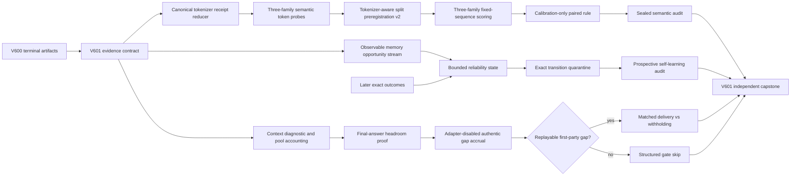

# Research Roadmap V601: Evidence-Bound Semantic Energy, Bounded Self-Learning, and Context-Safe Live Tool Credit

**Milestone:** 2026.09.601  
**Planned:** 2026-09-02  
**Experiments:** Exp6865-Exp6877  
**North star:** A live agent learns useful constraints from its own outcomes. Exact external checks remain truth authority. Learned energy and memory may select, route, update, or abstain, but may not certify themselves.

## Executive Summary

V600 completed its active task graph honestly. It preserved the V599 branch dispositions, built 100
accepted dual-side semantic contrast groups, and then found a new provenance fault before model
scoring. Qwen passed the tokenizer binding. Both Gemma models were blocked because Exp6863 compared
a frozen tokenizer hash from Exp6850 with a new hash over a larger receipt schema. The GGUF files
were byte-identical and both current Gemma tokenizers agreed with each other. Therefore the record
does not yet distinguish a real tokenizer change from a receipt-schema change. Exp6864 correctly
stopped at its structured gate.

V601 repairs this evidence contract before it resumes the semantic-energy line. One versioned
canonical reducer will re-hash archived and live tokenizer payloads. A frozen adversarial probe
matrix will compare token IDs, special-token behavior, chat-template identity, and tokenization
settings. Only a semantic match can release a new tokenizer-aware split. The 100 accepted exact
contrast groups remain frozen.

The continuous self-learning branch changes mechanism. V599's controller reported a positive
aggregate effect, but its sealed audit found 100% abstention and 13 harmful writes. V601 introduces a
bounded reliability state, inspired by Sigma-Mem, and an exact memory-transition quarantine. It
updates only between events from later exact outcomes. Prospective order replicates compare frozen,
read-only, bounded-update, and quarantine arms.

The ARC branch also changes order. Current live induction is shared-context-truncation-bound, and
its stored diagnostic clips the values needed to size the pool. Tool definitions consume the same
scarce context. A tool-use A/B now would be uninterpretable. V601 first repairs diagnostic
observability, measures prompt and generation occupancy, and proves final-answer headroom with a
mandated local GGUF model. It then accrues authentic first-party tool-gap chains on the
adapter-disabled live path. Delivery versus withholding remains gated on at least one replayable
opportunity. No task claims a game-level solve.

## What V600 Proved

1. **The branch evidence contract is executable.** Exp6861 recomputed V599 dispositions and emitted
   `v600_evidence_contract_ready_score=1`. The changed-mechanism boundaries are now machine-readable.

2. **The dual-side exact contrast bank is ready.** Exp6862 accepted 100 groups across typed
   obligation families. Structure-side and solution-side authorities agreed, negative controls
   passed, and no model score entered fixture construction.

3. **The semantic-scoring blocker is tokenizer provenance, not model availability.** Exp6863 found
   all three exact GGUF files present and loadable. Qwen passed. Both Gemma files retained their
   frozen model hashes and produced the same current tokenizer hash, but that hash differed from
   Exp6850's receipt hash.

4. **The current hash comparison is not semantically conclusive.** Exp6850 hashed a smaller
   tokenizer receipt. Exp6863 added chat-template, special-token, and tokenization-setting fields
   before hashing. Hashes over different schemas cannot establish drift or equivalence.

5. **Structured downstream gates work.** Exp6864 did not perform scoring after Exp6863 emitted
   readiness zero. Its blocked artifact names the failed upstream field.

6. **The ARC tool question has a new measured confound.** Two live adapter-free runs produced
   reasoning without the required final `engine` field. The local diagnostic identifies shared
   context-pool truncation, but a 150-character storage clip removes the observed pool size and fix
   guidance. The effect of tools cannot be separated from added prompt occupancy yet.

## Three Biggest Gaps to the PRD Vision

### Gap 1: Model-derived semantic energy is still unidentifiable

FR12 requires constraint reasoning tied to checkable structures. Exact contrast groups and local
model scoring machinery exist, but no held semantic effect is admissible while tokenizer identity
is unresolved. V601 canonicalizes the binding, freezes a new split only after all three families
pass, scores the fixed cells, calibrates one deterministic rule, and opens the held split once under
independent reduction.

This branch is not a return to the retired external generated-text scorer lane. It trains no text
scorer, generates no candidate answers, and does not compare a reward model with self-consistency.
It measures fixed-sequence paired contrasts against exact, dual-side semantic labels and matched
nuisance controls.

### Gap 2: Continuous self-learning is not both useful and safe

FR11 requires bounded online updates, persistence, validation, non-forgetting, and rollback. Carnot
has transaction mechanics, but the last policy either abstained or admitted harmful writes. V601
separates decision-time evidence from later supervision, bounds each reliability-state update, and
quarantines any transition that fails coverage, preservation, faithfulness, retention, or rollback.

A positive result requires action diversity, a nonzero admitted-update count, lower harmful-write
rate than the unsafe reference, held-future benefit over frozen and read-only controls, old-family
retention, delayed-correction safety, restart durability, and byte-exact rollback.

### Gap 3: The live ARC path lacks context-safe causal tool evidence

The first-party receipt transport is ready, but authentic live chains remain absent. The induction
tier currently loses the final answer to a shared prompt-plus-generation pool. A tool arm lengthens
the prompt and would be structurally disadvantaged.

V601 repairs the clipped diagnostic, records per-attempt pool arithmetic, refuses stale or
undersized servers, and proves final-answer headroom before tool accrual. The ARC floor is an
adapter-disabled live run with `unsloth/Qwen3.6-35B-A3B-GGUF`. It measures receipt reachability and
effect opportunities, not registry depth or solve credit.

## Research Findings That Change the Design

The complete refresh is in `research-references.md`, section **V601 Planner Refresh - 2026-09-02**.

- [The Coupling Tax](https://arxiv.org/abs/2605.07686) shows that shared budgets can let visible
  reasoning crowd out the final answer. Carnot's pool is prompt-plus-generation rather than only
  an output-token budget, so V601 adopts direct occupancy measurement instead of claiming method
  parity.
- [Sigma-Mem](https://arxiv.org/abs/2607.27958) supplies a bounded online reliability-state pattern.
  V601 applies it to evidence sources and memory actions, with later exact outcomes as update data.
- [TRUSTMEM](https://arxiv.org/abs/2606.25161) motivates coverage, preservation, and faithfulness
  checks for memory transitions. Carnot implements these as exact admission gates rather than a
  learned release authority.
- [OptiVer](https://openreview.net/forum?id=w696Vhv5B2) remains the dual-side verification source for
  the frozen semantic contrast bank.
- The requested OpenReview, Hugging Face, Semantic Scholar, GitHub, Extropic, Logical Intelligence,
  KAN, Ising, and hardware checks found no dependency or public checkpoint that removes a local
  blocker. Z1 access remains future work. Kona remains a non-executable comparator.

## Target Architecture



Exact structure checks, exact solution checks, exact memory outcomes, and exact ARC transitions stay
outside learned mechanisms. They provide labels and release authority. Token likelihoods, bounded
reliability states, and live policies are tested signals. They cannot validate themselves.

## Model Contract

Tokenizer and semantic-scoring tasks declare all three mandated local models:

- `unsloth/Qwen3.6-35B-A3B-GGUF`
- `unsloth/gemma-4-31B-it-GGUF`
- `unsloth/gemma-4-26B-A4B-it-GGUF`

The ARC context, accrual, and replay tasks declare `unsloth/Qwen3.6-35B-A3B-GGUF`. Every LLM task
uses the `cached_sota_pair()` pattern, resolves exact local paths, and records model, tokenizer,
quantization, process, context, slot, and accelerator receipts. Legacy Qwen3.5-0.8B and
Gemma-4-E4B may run CPU smoke tests only. They cannot fill a required cell or support a headline.

Model processes run serially. The semantic scorer handles one GGUF at a time. ARC tasks do not
overlap semantic scoring. A missing model, insufficient safe context, or unavailable eligible GPU
produces a blocked artifact with `gate_check_summary`; it never triggers a legacy substitution.

## Phase 1: Evidence and Tokenizer Provenance Repair

### Exp6865: V601 evidence and method-change contract

Freeze V600 artifacts, the active roadmap, conductor gate record, exclusion manifest, current ARC
truncation note, model receipts, and accepted contrast-bank hash. Recompute every terminal branch
state. Define the canonical tokenizer payload, semantic probe contract, memory observability
boundary, and ARC context-headroom contract. This is the first infrastructure slot.

### Exp6866: Canonical tokenizer binding requalification

Build a versioned reducer over semantic tokenizer fields. Recompute archived Exp6850 and live
receipts through the same reducer. Compare vocabulary metadata, special-token behavior, chat
template, add-BOS and special settings, and an adversarial Unicode, whitespace, control-token, and
normalization probe matrix. Append a correction receipt; do not rewrite old artifacts. Readiness
requires all three families to match semantically under identical settings.

### Exp6867: Tokenizer-aware nuisance and split preregistration v2

Reuse the frozen 100-group bank. Tokenize every sequence with all three requalified tokenizers.
Freeze model-specific nuisance-eligible cells, disjoint calibration and held groups, effect
definitions, confidence intervals, failure rules, and sealed hashes before scoring. Require at
least 20 calibration and 20 held groups per model.

## Phase 2: Nuisance-Controlled Semantic Energy

### Exp6868: Three-family semantic contrast scoring stream v2

Run forced-sequence scoring on every frozen eligible cell. Preserve token-level receipts, raw and
normalized log likelihoods, prompt and candidate token IDs, sequence identities, model identity,
and all missing or failed cells. Generate no answers and expose no exact labels to model processes.
Report stream completeness only.

### Exp6869: Calibration-only paired semantic rule

Open only the calibration split. Apply the preregistered paired contrast and
difference-in-differences controls. Freeze orientation, family aggregation, missing-cell handling,
confidence intervals, nuisance rejection, and cross-family replication. Do not inspect held labels.

### Exp6870: Sealed independent semantic audit

In a fresh process, verify source hashes, recompute exact labels, open the held split once, and
recompute every model, family, and pooled effect from token rows. Attack identity, order, length,
normalization, label-position, and token-count shortcuts. A positive class requires the held effect
to beat every preregistered nuisance control and replicate across declared families. Model-derived
scores never become exact authority.

## Phase 3: Bounded Continuous Self-Learning

### Exp6871: Observable reliability opportunity stream

Rebuild chronological memory opportunities from primary transaction and exact-outcome receipts,
not V599 aggregate rows. Label each field as decision-time observable or offline-only. Freeze
source, action, later outcome, old-family anchor, delayed-correction, poison, restart, and rollback
fixtures. Preserve counterfactual arms before any update.

### Exp6872: Bounded reliability controller and exact transition quarantine

Implement a small symmetric reliability state over evidence sources and memory actions. Bound each
event update. Compare frozen/no-memory, read-only, bounded-update, quarantine, and unsafe-reference
arms. Later exact outcomes update only the next event's state. Exact coverage, preservation,
faithfulness, retention, and rollback checks control admission. This is a continuous self-learning
experiment and must emit `continuous_self_learning_task=true`.

### Exp6873: Prospective sealed self-learning audit

Run at least five preregistered chronological order replicates in fresh processes. Recompute action
diversity, admitted updates, harmful writes, held-future utility, old-family retention, state
spectral bounds, delayed corrections, restart durability, and rollback. A positive class is
forbidden for an always-abstain policy, zero useful writes, a harmful-write regression, leakage, or
self-certification.

## Phase 4: Context-Safe Live ARC Evidence

### Exp6874: ARC shared-context observability and headroom qualification

Repair the clipped induction diagnostic and emit its structured values. Measure slot count, actual
server `n_ctx`, prompt tokens, requested and generated tokens, reasoning and final-channel tokens,
KV settings, VRAM, offload, and truncation reason. Refuse stale undersized servers. Run bounded
adapter-disabled Qwen3.6 canaries at measured safe configurations. Readiness requires a final
`engine` channel, no shared-pool truncation, and enough reserved headroom for both later arms. This
is the second infrastructure slot.

### Exp6875: Authentic adapter-disabled tool-gap accrual

Run the canonical live agent with tool delivery disabled but first-party gap transport enabled.
Registry-precheck every selected game and make no solve claim. Accrue gap detection, request,
response availability, delivery eligibility, next action, and exact outcome under immutable IDs.
This is the standing ARC generalization-floor task. It succeeds as evidence collection even when no
replayable chain appears.

### Exp6876: Matched tool delivery versus withholding

Run only if Exp6875 provides at least one replayable authentic first-party chain. Replay the same
pre-action state, model, prompt, context reserve, seed, action budget, and available response. The
only changed factor is delivery versus withholding. Preserve every game and seed row. Exact later
outcomes determine direction. No offline solver, source inspection, per-game adapter, registry
trajectory, or post-outcome choice may influence the live action.

### Exp6877: Independent V601 capstone

Read the live roadmap and every expected artifact. Re-run current adversarial verification and
row-consistency checks rather than trusting stored stamps. Distinguish absent, blocked, null,
partial, disqualified, circular-positive, and positive branches. Report scientific advance only
from an eligible branch. Do not synthesize a positive milestone verdict from infrastructure
readiness or procedural completeness.

## Dependency Graph

```text
Exp6865 evidence contract
├── Exp6866 tokenizer requalification
│   └── Exp6867 split preregistration v2
│       └── Exp6868 scoring stream v2
│           └── Exp6869 calibration rule
│               └── Exp6870 sealed semantic audit
├── Exp6871 observable memory stream
│   └── Exp6872 bounded controller + quarantine
│       └── Exp6873 prospective self-learning audit
└── Exp6874 ARC context headroom
    └── Exp6875 authentic tool-gap accrual
        └── Exp6876 matched delivery vs withholding

Exp6865-Exp6876 ──> Exp6877 independent capstone
```

Structured `gated_on` fields implement every dependency that can avoid an unnecessary synthesis
call. Every upstream gate field is named in that task's required artifact fields with identical
spelling. Exp6877 remains ungated so it can reconcile missing and blocked branches.

## Hardware Requirements

| Resource | Tasks | Contract |
|---|---|---|
| Dual RTX 3090, 24 GiB each | Exp6868, Exp6874-Exp6876 | Use one owned model process per task or phase. Record UUID, free and peak VRAM, process identity, lease, offload, and cleanup. Never kill unrelated processes. |
| Local GGUF cache | Exp6866-Exp6868, Exp6874-Exp6876 | Require exact paths and SHA-256 receipts for the three mandated families. No network download is part of a scientific task. |
| CPU and RAM | All tasks | Exact reducers, token probes, memory simulations, independent audits, and row lints run locally. Bound workers and record peak RSS. |
| Local disk | All tasks | Preserve frozen fixtures, token rows, live checkpoints, and replay receipts. Check free space before long runs and checkpoint atomically. |
| KV260, GateMate, PolarFire | None | All mandatory continuity gates have graduated. No changed receipt warrants a blocking slot. |
| Extropic Z1 or other TSU | None | No authenticated local device exists. Make no hardware latency, power, or availability claim. |

Exp6874 must derive context size from measured prompt occupancy, slot semantics, completion reserve,
KV format, model footprint, and safety margin. Raising completion tokens alone is explicitly
forbidden by the exclusion manifest. If a safe context cannot fit, the task blocks and records the
required versus available envelope.

## Experimental Validity and Claim Rules

- Every comparative task emits `rows` or `per_game_results` for every unit, including missing and
  failed cells. Aggregates must recompute from those rows.
- Every artifact emits the closed `verdict_class` enum: `positive`, `circular_positive`, `null`,
  `blocked`, `disqualified`, or `partial`.
- Every blocked verdict emits `gate_check_summary` with the failed check, expected value, and
  observed value.
- Every artifact field has an explicit field principle. Gate scores explain why the field exists,
  what evidence sets it, and which downstream task consumes it.
- All comparison thresholds, splits, missing-cell rules, confidence intervals, seeds, and stopping
  rules are frozen before the relevant held evidence is opened.
- Exact authorities remain external. Any self-oracle or same-path verifier result is
  `circular_positive`, never `positive`.
- The ARC tasks make no game-level solve claim and therefore claim no `solve_provenance`. If an
  incidental level advance occurs, record it as uncredited live evidence and do not update the solve
  registry in this milestone.
- No task reopens retired max-token-only induction repair, finite-ID generated-answer transport,
  external text-scorer ranking, inert-click pruning, or per-game offline solver scopes.

## Milestone Exit Criteria

V601 is complete when Exp6865-Exp6877 have terminal artifacts or structured conductor gate skips,
all required artifact fields are present, all comparative claims have per-unit rows, and Exp6877 has
recomputed the live branch states.

Scientific success is branch-specific:

- **Semantic energy:** all three tokenizer bindings pass; the held paired effect beats every frozen
  nuisance control and satisfies declared cross-family replication.
- **Continuous self-learning:** bounded updates produce useful admitted writes, reduce harmful
  writes, beat frozen and read-only controls prospectively, retain old families, and pass restart and
  rollback checks.
- **Live tool credit:** at least one authentic replayable first-party gap exists and matched delivery
  improves an exact later outcome without a context, budget, or provenance confound.

A null, blocked, partial, circular, or disqualified branch remains a valid terminal result. The
capstone must preserve that state and name the next causal blocker. Procedural completeness alone is
not a scientific advance.
