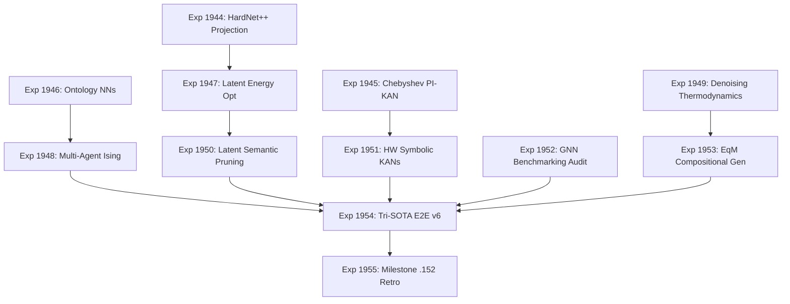

# Carnot Research Roadmap: Milestone 2026.05.152

**Status:** Proposed
**Author:** Carnot Planning Agent
**Date:** 2026-05-13

## 1. Executive Summary

Milestone `2026.05.152` advances Carnot from basic guided decoding and soft penalties toward mathematically rigorous constraint satisfaction, multi-agent consensus, and continuous self-learning in latent spaces. Milestone `2026.05.151` successfully verified energy-guided decoding and the ConsFormer refinement loop. 

This milestone integrates fresh 2025-2026 research findings to close three critical gaps in our Product Requirements Document (PRD):
1. **Hard Constraint Architectures:** Shifting from penalty-based soft constraints to differentiable closed-form projection layers (HardNet++ / $\Pi$Net) that guarantee feasibility.
2. **Continuous Verification & Ensemble Consensus:** Transitioning our discrete Ising solver validations to continuous latent space reasoning (EBM-CoT) and distributing complex constraint satisfaction across multi-agent ensembles using an Ising-based loss.
3. **Continuous Self-Learning & Memory:** Leveraging latent energy optimization to semantically prune memory traces, ensuring our constraint repositories learn continuously without catastrophic forgetting.

## 2. Milestone Phases

### Phase 1: Hard Constraints & Projection Architectures
- **Focus:** Eliminate constraint violations by design using topological and differentiable closed-form layers.
- **Tasks:**
  - **Exp 1944:** HardNet++ Differentiable Projection Integration
  - **Exp 1945:** Chebyshev PI-KAN Extrapolation
  - **Exp 1946:** Ontology NN Topological Constraints

### Phase 2: Continuous Verification & Multi-Agent Consensus
- **Focus:** Expand constraint verification from single discrete traces to continuous latent spaces and agent ensembles.
- **Tasks:**
  - **Exp 1947:** Latent Energy Optimization (Continuous Verification)
  - **Exp 1948:** Multi-Agent Ising Consensus Simulator
  - **Exp 1949:** Denoising Thermodynamic Sampling Protocol

### Phase 3: Continuous Self-Learning & Hardware Alignment
- **Focus:** Continuously curate knowledge graphs and prepare our latest algorithmic advances for deterministic evaluation.
- **Tasks:**
  - **Exp 1950:** Latent Semantic Pruning for Self-Learning
  - **Exp 1951:** Hardware-Accelerated Symbolic KANs Translation
  - **Exp 1952:** GNN vs. Classical Benchmarking Audit

### Phase 4: Capstone Evaluation & Retrospective
- **Focus:** Unify these components across our tri-SOTA flagship GGUF models.
- **Tasks:**
  - **Exp 1953:** EqM Compositional Generation Integration
  - **Exp 1954:** Integrated Tri-SOTA E2E v6
  - **Exp 1955:** Milestone .152 Retrospective

## 3. Dependency Graph

## 4. Hardware Requirements
- **Local GPUs:** Dual RTX 3090 required for Exp 1947, 1954.
- **GGUF Models:**
  - `unsloth/Qwen3.6-35B-A3B-GGUF` (Flagship MoE)
  - `unsloth/gemma-4-31B-it-GGUF` (Flagship Dense)
  - `unsloth/gemma-4-26B-A4B-it-GGUF` (Middle MoE)
- **FPGA/KV260:** Exp 1951 focuses on piecewise affine abstractions and simulation; synthesis/deployment remains gated on the board toolchain.
