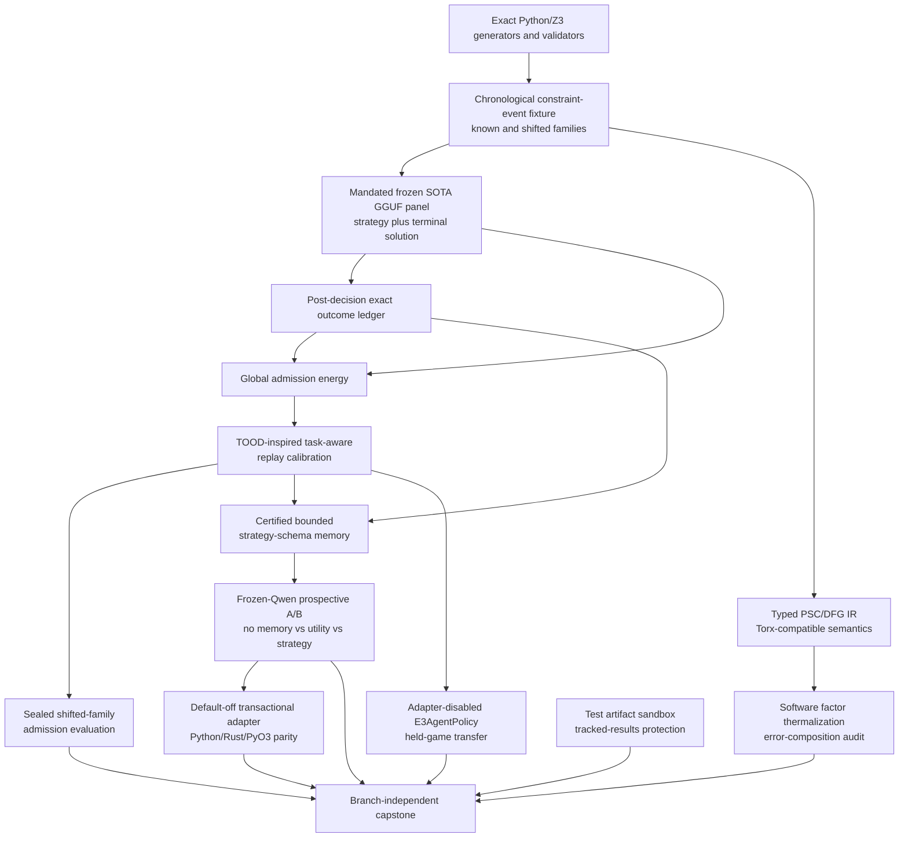

# Research Roadmap vNEXT — Milestone 2026.08.533

**Milestone title:** Task-Aware Energy Calibration, Certified Continuous
Learning, and Stochastic Program Compilation

**Status:** Planned after terminal milestone `2026.08.532`

**Experiment range:** Exp6142-Exp6155

**Architecture freshness note:** `_bmad/architecture.md` describes the durable
Rust/PyO3/JAX energy stack, verifier cascade, and SamplerBackend boundary, but
predates the `.530-.532` reduced-order CSL and Phase-D terminal evidence. It is
an architecture baseline, not evidence that proposal-only Exp6142-Exp6151 from
the former `.532` design ran. The active `.532` YAML ended at Exp6141; this
roadmap replaces those proposal-only identities with the canonical next range.

**Primary question:** Can Carnot turn exact chronological constraint outcomes
into a task-aware, oracle-distinct energy admission signal that improves a
frozen flagship GGUF through certified bounded strategy memory, while proving
that the same constraint workflow has a typed stochastic-program representation
and a quantitatively auditable software thermalization path?

## What milestone 2026.08.532 proved

| Evidence | Terminal result | Consequence for `.533` |
|---|---|---|
| Exp6138 transition | `complete:`; exactly nine `.531` identities were archived, the `.532` activation was already active, and the next-range collision count was zero | Use Exp6142 for the exact `.532 -> .533` handoff and reserve only the identities actually activated in `.532` |
| Exp6139 source delta | `complete_null:`; no accepted post-V532 delta, with references unchanged | Keep the required ingestion slot, but anchor it after the new `V533-PLANNER-REFRESH-20260805-END` marker and accept a zero delta |
| Exp6140 option psychometrics | `retired:`; saturated easy families remained position-confounded while typed choice stayed below floor, leaving inability versus distractor/position unresolved | The Exp6128 source-domain recovery is terminal. Do not generate another item bank, pilot, candidate pool, or hidden-state chain from it |
| Exp6141 item bank | Pre-emptively gate-skipped because Exp6140 readiness was not `1.0` | A skip is not a failed experiment, but the upstream scientific line is closed; no descendant may bypass or relabel that gate |
| Exp6120 inherited positive | Outcome-committed reduced-order CSL matched eventual utility with less state and exact post-outcome transaction semantics | The natural next test is prospective utility from richer certified strategy state, not another compression or exact-slot requalification |
| Exp6122 inherited null | No supported solver-kit primitive had direct causal held-out receipts | The ARC slot must measure an already-live, triggered decision surface under adapter-disabled transfer, not propose another unreachable primitive |
| Operational state | The full Python suite can rewrite tracked result artifacts and strip adversarial quarantine fields | Evidence isolation is a load-bearing prerequisite, not optional cleanup |

The former `.532` proposal described Exp6142-Exp6151, but those tasks were never
present in the activated roadmap. This `.533` plan intentionally reuses the
canonical `last_active_id + 1` range with different, post-Exp6140-terminal scope.
No completion credit or dependency is inherited from proposal-only prose.

## The three largest gaps to the PRD vision

### Gap 1 — verification has exact outcomes but no shift-aware, oracle-distinct admission energy

PRD FR12 requires verifiable reasoning that can recognize when a proposed
strategy or answer is unsupported. Carnot's external generated-text/logprob
Phase-D scorer is retired, and Exp6140 closes the attempted source-domain
recovery for the hidden-state branch. Exact Python/Z3 validators remain strong
oracles, but they act after the decision and cannot themselves be the learned
verifier without circularity.

`.533` changes the unit of analysis from a manufactured candidate pool to a
chronological stream of exact constraint events. The model proposes a strategy
and terminal solution; an independent exact executor supplies the eventual
outcome. A task-aware energy consumes only pre-outcome strategy, task, memory,
and provenance features. TOOD-inspired replay calibration then asks whether the
current event is in-support for a retrieved strategy. Exact outcomes calibrate
and evaluate the signal but are never an input at decision time.

### Gap 2 — continuous self-learning is safe and compact, but not prospectively useful

PRD FR11 calls for autonomous improvement through verified experience. Exp6120
established an important transaction primitive: read-only decision snapshots,
post-outcome commits, rollback, fixed-width state, and immutable weights. It did
not show that stored experience improves future reasoning over a no-memory or
utility-only control, especially when task families shift.

`.533` builds certified strategy schemas only from calibration events, combines
them with task-aware admission, and runs a prospective chronological A/B with
the frozen `unsloth/Qwen3.6-35B-A3B-GGUF`. The learner may retrieve memory during
a decision but may commit only after exact external validation. Duplicate and
reordered deliveries must be idempotent; poison, unfamiliar families, and
uncertain admission must be quarantined; weights and GGUF hashes stay fixed.

### Gap 3 — the energy stack lacks a program-level bridge to probabilistic hardware

Carnot has Ising/Potts samplers and a backend abstraction, but no typed
intermediate representation for an end-to-end stochastic constraint workflow.
Earlier THRML parity sweeps were retired after vendoring because they could no
longer answer a scientific question. The new Torx/thermalizer work introduces a
different missing layer: typed stochastic circuits/factor graphs, local factor
replacement, and compositional error accounting.

`.533` first proves exact support and probability semantics for one bounded
constraint workflow represented as a Torx-compatible PSC/DFG. A separate gated
experiment replaces factors with software thermodynamic kernels, measures
joint-distribution divergence, and tests whether the observed error respects a
preregistered compositional bound. This is software simulation only. It makes
no Extropic, FPGA, latency, power, or speedup claim.

The standing ARC generalization floor is handled as a cross-cutting part of Gap
1: the same task-aware admission idea is tested on live `E3AgentPolicy`
transitions from adapter-disabled held games, without claiming a level solve.

## Research findings incorporated

| Source | Finding | `.533` use |
|---|---|---|
| TOOD, arXiv:2607.29592 | Energy-based OOD detectors can lose calibration as tasks accumulate; per-task replay statistics can restore score comparability without retraining | Exp6147-Exp6148 test task-aware energy recalibration for exact constraint-event admission; Exp6154 tests cross-game transfer |
| A Framework for Stochastic Differentiable Programming, arXiv:2608.01612 | Typed PSC/DFG kernels make stochastic program structure, state types, and differentiable execution explicit | Exp6152 builds and exhaustively validates a Torx-compatible typed constraint workflow |
| Thermalizing Stochastic Programs, arXiv:2608.01615 | Factor-local EBM replacement needs compositional error accounting; context matching can reduce residual joint error | Exp6153 compares factor-local and context-matched software thermalization under a preregistered joint-divergence bound |
| `extropic-ai/torx` | A newly public JAX implementation gives an executable PSC/DFG reference surface | Exp6152-Exp6153 pin package/commit provenance and test compatibility without making hardware claims |
| ISM, arXiv:2606.31191 | Frozen models can benefit from compact strategy memories when updates are verified and actively maintained | Exp6149-Exp6151 test certified bounded strategy memory with exact outcomes and immutable GGUF weights |
| TTCD, arXiv:2608.01672 | Limited memory should be evaluated by future utility, not retained volume alone | Used only as an evaluation principle; in-place model-weight mutation is excluded |
| Black-box sentence energy, arXiv:2608.02879 | A post-hoc text EBM can approximate response attribution | Recorded but not staged because it overlaps the retired external-text scorer class |
| Pipelined p-computer, arXiv:2607.21077 | Dense probabilistic hardware benefits from a pipelined local-field architecture | Hardware context only; no new RTL or attached-board run is authorized |

The complete dated source receipts, negative results, citation-trail status,
Extropic 2027 hardware boundary, GitHub delta, and Kona non-reproducibility are
recorded before this design in `research-references.md` under
`V533 Planner Refresh - 20260805`.

## Target architecture



Load-bearing boundaries:

- Exact Python/Z3 executors are the outcome authority. Energy scores, replay
  calibration, retrieval similarity, model confidence, and memory utility are
  explicitly oracle-distinct.
- Task identity/family metadata may calibrate energy, but the current outcome,
  exact answer, and future held labels are unavailable at decision time.
- Calibration and held groups are assigned by base template before any SOTA
  inference. Variants and retries cannot cross splits.
- Every LLM experiment loads a mandated GGUF through its resolved local file
  path and llama.cpp embedded tokenizer. `AutoTokenizer` is never called on a
  GGUF repository ID.
- Memory is a read-only snapshot during a decision. A transaction commits only
  after exact outcome validation and is idempotent under duplicate/reordered
  delivery. GGUF weights never mutate.
- The typed stochastic IR must match exhaustive exact probabilities before any
  factor replacement. Thermalization is a separate software-simulation layer
  whose error is measured rather than assumed.
- ARC evidence comes from `make_carnot_agent`/`E3AgentPolicy` using its own
  attempts with per-game adapters disabled. No game source, exhaustive offline
  BFS, hand adapter, duplicate solve, or level credit is eligible.
- Tests write only to a task-owned temporary artifact root. The evidence ledger
  under tracked `results/` is immutable during test execution.

## Reservation accounting

| Class | Tasks | Count |
|---|---|---:|
| Infrastructure | Exp6142 transition, Exp6143 test-artifact isolation, Exp6155 capstone | 3 |
| SOTA ingestion | Exp6144 | 1 |
| Shift-aware verifier/admission | Exp6145-Exp6148 | 4 |
| Continuous self-learning | Exp6149-Exp6151 | 3 |
| Stochastic-program foundation | Exp6152-Exp6153 | 2 |
| ARC generalization floor | Exp6154 | 1 |
| **Total** | Exp6142-Exp6155 | **14** |

The roadmap exceeds the two-slot infrastructure minimum, includes one focused
SOTA-ingestion task, reserves one ARC generalization task, and contains a
three-experiment continuous self-learning lane.

## Phase 0 — evidence-safe transition and execution substrate

### Exp6142 — exact transition into `.533`

Archive exactly the four activated `.532` identities, preserving Exp6140's
retirement and Exp6141's structured gate skip. Append `.532` at most once,
activate `.533`, and prove Exp6142-Exp6155 collision-free. Proposal-only old
Exp6142-Exp6151 text is not completion evidence.

**Deliverable:** `results/experiment_6142_transition_v533.json`

### Exp6143 — tracked-result test artifact isolation

Implement a redirectable experiment output root and force tests to use
`tmp_path` rather than tracked `results/`. Build a sentinel matrix around the
known 45-file mutation class, preserve fabrication/quarantine fields, and prove
the focused suite changes no pre-existing result hash.

**Deliverable:** `results/experiment_6143_test_artifact_isolation.json`

### Exp6144 — post-V533 source-delta ingestion

Search only after the `V533-PLANNER-REFRESH-20260805-END` marker through the
reliable low-concurrency source path. Map accepted deltas to existing `.533`
tasks or defer them; task identities and gates remain immutable. Zero accepted
deltas is a valid `complete_null:` result.

**Deliverable:** `results/experiment_6144_v533_source_delta_ingestion.json`

## Phase A — task-aware energy admission on exact chronological events

### Exp6145 — exact shifted-family chronological stream

Create a deterministic chronological stream of at least 240 exact constraint
events across at least six families, with calibration, future-known, and sealed
shifted-family groups. Each event exposes pre-outcome task/strategy features and
a post-decision exact outcome through separate interfaces. Include controlled
family shifts, superficial aliases, contradictions, and strategy-poison cases.

**Deliverable:** `results/experiment_6145_constraint_shift_stream.json`

### Exp6146 — gated flagship-GGUF baseline event corpus

Using `unsloth/Qwen3.6-35B-A3B-GGUF` and
`unsloth/gemma-4-31B-it-GGUF`, run the frozen calibration/future stream through
model-native chat templates. Record one strategy proposal and terminal solution
per event, exact post-outcome receipts, task-owned CUDA lifecycle, and immutable
row sidecars. No memory or adaptive prompt changes are allowed.

**Gate:** Exp6145 `constraint_shift_stream_ready_score == 1.0`

**Deliverable:** `results/experiment_6146_sota_constraint_event_corpus.json`

### Exp6147 — gated TOOD-style task-aware energy calibration

On immutable Exp6146 calibration rows, compare a global admission energy with a
task-aware replay-calibrated energy, family-centering-only control, shuffled-task
control, simple distance baselines, and an exact-outcome-blind identity check.
Preregister one score/threshold and report OOD AUROC/AUPRC, calibration, false
acceptance, false rejection, and confidence-gap diagnostics by chronological
task count.

**Gate:** Exp6146 `sota_constraint_event_corpus_ready_score == 1.0`

**Deliverable:** `results/experiment_6147_task_aware_energy_calibration.json`

### Exp6148 — gated one-shot shifted-family admission evaluation

Freeze Exp6147's score, task-statistic schema, threshold, and abstention policy.
Evaluate once on sealed future-known and shifted-family groups. A positive claim
requires improved shifted-family detection and unsafe-strategy rejection without
regressing known-family safe acceptance; shuffled and alias attacks must fail.

**Gate:** Exp6147 `task_aware_energy_calibration_ready_score == 1.0`

**Deliverable:** `results/experiment_6148_shifted_family_admission_held.json`

## Phase B — certified continuous self-learning

### Exp6149 — gated certified strategy-schema and idempotence fixture

Build a bounded strategy-schema state on calibration events only, extending
Exp6120's positive post-outcome transaction primitive. Certificates bind a
strategy to exact constraints, outcome provenance, family/task statistics, and
counterexamples. Test duplicate/reordered delivery, poison quarantine,
protected-prefix retention, eviction, rollback, serialization, and fixed-width
Python/Rust/PyO3 parity. This is not the retired Exp5895 exact-slot replay.

**Gate:** Exp6145 `constraint_shift_stream_ready_score == 1.0`

**Deliverable:** `results/experiment_6149_certified_strategy_schema_fixture.json`

### Exp6150 — gated frozen-Qwen prospective CSL A/B

Run a resource-matched chronological A/B with the frozen
`unsloth/Qwen3.6-35B-A3B-GGUF`: no memory, Exp6120 utility-only state, certified
strategy memory with global admission, and certified strategy memory with the
Exp6148 task-aware admission policy. Decisions read a frozen snapshot; commits
occur only after exact outcomes. The headline is paired future-event utility,
not eventual equality or memory compression.

**Gates:** Exp6148 `shifted_family_admission_ready_score == 1.0` and Exp6149
`certified_strategy_fixture_ready_score == 1.0`

**Deliverable:** `results/experiment_6150_frozen_qwen_continuous_self_learning_ab.json`

### Exp6151 — gated default-off transactional strategy adapter

If Exp6150 is positive, wire the winning state/admission policy behind a
default-off configuration surface. Prove atomic commit/rollback, restart replay,
duplicate suppression, bounded bytes, no same-decision write, no weight
mutation, Python/Rust/PyO3 parity, and baseline-equivalent behavior when off.

**Gate:** Exp6150 `continuous_self_learning_ready_score == 1.0`

**Deliverable:** `results/experiment_6151_strategy_memory_shadow_adapter.json`

## Phase C — stochastic-program bridge, ARC transfer, and closure

### Exp6152 — typed Torx-compatible constraint PSC/DFG

Represent one bounded stochastic constraint workflow from Exp6145 as typed
binary/categorical PSC/DFG kernels. Pin Torx package/commit provenance, but keep
a dependency-light Carnot representation. Exhaustively enumerate small cases
and prove support, conditional probability, normalization, seed, batching,
serialization, and degenerate-factor semantics against the exact workflow.

**Deliverable:** `results/experiment_6152_typed_stochastic_constraint_ir.json`

### Exp6153 — gated software thermalization error-composition audit

Replace Exp6152 factors with software EBM kernels through Torx/THRML-compatible
interfaces. Compare factor-local training with context matching, calculate a
preregistered compositional total-variation/KL bound, and measure joint output
divergence over exact-enumerable and sampled cases. This is not a THRML parity
scaling sweep and never reports hardware speed, power, or execution.

**Gate:** Exp6152 `typed_stochastic_ir_ready_score == 1.0`

**Deliverable:** `results/experiment_6153_thermalized_program_error_audit.json`

### Exp6154 — ARC live-path task-aware energy generalization

Run `make_carnot_agent`/`E3AgentPolicy` on adapter-disabled leave-one-game-out
episodes across at least three public games, using only the agent's own runtime
transitions. Compare the existing global transition/world-model admission score
with training-game-only task-aware calibration. Require triggered decision
receipts, held-game isolation, action/transition metrics, safety accounting, and
live-path import reachability. Make no game-level solve claim and no registry
level increment.

**Deliverable:** `results/experiment_6154_arc_task_aware_energy_generalization.json`

### Exp6155 — branch-independent capstone and reconciliation

Reconcile every `.533` terminal state, gated skip, retirement, missing artifact,
adversarial flag, model receipt, exact-oracle boundary, stochastic substrate,
ARC provenance, and test-isolation result. Update durable specs and ops docs only
for delivered work; preserve failures and proposal-only identities exactly.

**Deliverable:** `results/experiment_6155_v533_capstone_reconciliation.json`

## Dependency graph and conductor order

```text
Exp6142 transition
  ├── Exp6143 test artifact isolation
  ├── Exp6144 source-delta ingestion
  ├── Exp6145 exact shifted-family stream
  │     ├──[stream=1] Exp6146 flagship-GGUF event corpus
  │     │     └──[corpus=1] Exp6147 task-aware calibration
  │     │           └──[calibration=1] Exp6148 held admission
  │     ├──[stream=1] Exp6149 certified strategy fixture
  │     │     └──[Exp6148=1 AND fixture=1] Exp6150 prospective CSL A/B
  │     │           └──[CSL=1] Exp6151 shadow adapter
  │     └── Exp6152 typed stochastic IR
  │           └──[IR=1] Exp6153 thermalization audit
  └── Exp6154 ARC live-path generalization

Every terminal branch + Exp6143/Exp6144 ──> Exp6155 capstone
```

Conductor execution order is exactly Exp6142 through Exp6155. Every natural-
language gated title has a matching structured `gated_on` entry in
`research-roadmap-next.yaml`. A failed gate skips the downstream agent call; it
does not become permission to bypass the prerequisite.

## Hardware and runtime requirements

| Resource | Tasks | Requirement and boundary |
|---|---|---|
| Dual RTX 3090, 24 GiB each | Exp6146, Exp6150 | Task-owned CUDA-enabled llama.cpp process; `cached_sota_pair()` or equivalent resolved file paths; one flagship per GPU or sequential eviction; `nvidia-smi` engagement; explicit load/readiness/decode/release receipts |
| Qwen flagship MoE | Exp6146, Exp6150 | `unsloth/Qwen3.6-35B-A3B-GGUF`; pinned GGUF file hash; embedded tokenizer through llama.cpp; immutable weights |
| Gemma flagship dense | Exp6146 | `unsloth/gemma-4-31B-it-GGUF`; pinned GGUF file hash; model-native chat template; task-owned lifecycle |
| CPU/Rust/PyO3 | Exp6142-Exp6145, Exp6147-Exp6149, Exp6151-Exp6155 | Exact validation, task-aware calibration, transaction/ABI parity, exhaustive enumeration, docs, and tests |
| JAX CPU + Torx/THRML software | Exp6152-Exp6153 | `JAX_PLATFORMS=cpu`; pinned package versions/commits; deterministic seeds; `software_simulation` substrate only |
| Attached FPGA boards | None | KV260 is POC/terminal for current claims, PolarFire is opportunistic without authorized terminal workload, and GateMate has no changed physical-state receipt. No board command or flash is authorized in this milestone |
| Extropic hardware | None | Z1 remains early access 2027 and Carnot has no authenticated XTR-0/Z1 route; no hardware, energy, latency, power, or speedup claim |

All LLM tasks include a user-mandated SOTA GGUF in `MODEL_SPECS`. Legacy
Qwen3.5-0.8B or Gemma4-E4B may appear only as non-headline CPU smoke controls.
No task calls `AutoTokenizer.from_pretrained()` on a GGUF repository ID.

## Preregistered gates and decision rules

1. **Evidence isolation:** Exp6143 passes only if redirected tests write to
   task-owned temporary roots, all mutation sentinels are detected, quarantine
   fields survive, and every pre-existing tracked-result hash is unchanged.
2. **Stream integrity:** Exp6145 requires exact validation, chronological split
   isolation, zero base-template leakage, both known and genuinely shifted
   families, pre/post-outcome interface separation, and deterministic rebuild.
3. **SOTA corpus authenticity:** Exp6146 requires real llama.cpp CUDA offload,
   task-owned PIDs, mandated file hashes, embedded-tokenizer receipts, complete
   lifecycle cleanup, frozen prompts, exact post-outcomes, and no fallback
   headline rows.
4. **Calibration:** Exp6147 selects at most one score/threshold on calibration
   groups. Readiness requires a non-degenerate confidence-gap diagnosis,
   improved grouped OOD/admission performance over global energy, and no
   outcome, task-alias, length, or family-frequency shortcut.
5. **Held admission:** Exp6148 is positive only if the preregistered task-aware
   score improves shifted-family unsafe rejection with a paired lower 95% bound
   above zero, preserves known-family safe acceptance within a fixed margin,
   and survives shuffle/alias/poison attacks.
6. **Certified fixture:** Exp6149 requires zero uncertified commits, zero poison
   acceptance, exact duplicate/retry state delta zero, rollback identity,
   protected-prefix retention, bounded bytes, fixed-width ABI parity, and no
   dependence on the retired Exp5895 exact-slot requalification.
7. **Continuous learning:** Exp6150 requires positive paired future-event exact
   utility over both no-memory and utility-only controls, no shifted-family
   safety regression, zero same-decision writes, bounded memory, successful
   idempotence/rollback, and unchanged GGUF hashes. Eventual equality alone is
   not readiness.
8. **Shadow integration:** Exp6151 remains default off unless every Exp6150
   scientific and transaction gate passes. Off-mode behavior must hash-match
   the baseline path.
9. **Typed stochastic IR:** Exp6152 requires exact support/probability agreement
   on exhaustively enumerable cases, explicit types, normalized kernels,
   deterministic seed semantics, and round-trip serialization.
10. **Thermalization:** Exp6153 is positive only if measured joint divergence is
    within the preregistered compositional bound and context matching improves
    or preserves a factor-local control. Any hardware/performance claim is a
    hard failure.
11. **ARC:** Exp6154 requires adapter-disabled held-game isolation, nonzero
    triggered decisions, live-entrypoint reachability, improvement in a
    preregistered transition/admission metric without safety regression, and
    zero solve/level claim. The same no-causal-receipt verdict retires this
    exact cross-game calibration construction.
12. **Lifecycle:** Any live-model task blocks rather than silently falling back
    when model hash, CUDA offload, task-owned process, GPU engagement, or cleanup
    evidence is absent.

## Explicit exclusions

- No continuation of Exp6140's retired source-domain recovery, Exp6141's skipped
  item bank, or the former proposal-only Phase-D pool/hidden-state descendants.
- No external generated-text/logprob/LoRA/reward scorer and no black-box
  sentence-EBM surrogate.
- No finite-ID, grammar, parser-only, stop-token, hidden-label retry, or
  ConstraintIR reprompt resurrection.
- No exact answer, current outcome, future label, or exact-validator result as
  a decision-time energy input.
- No weight-mutating TTCD, DPO, GRPO, fast-weight, or online fine-tuning claim.
- No rerun of the retired Exp5895/Exp5912 exact-slot requalification.
- No THRML/Carnot size-scaling or parity sweep; Exp6153 tests program-level
  error composition under a new typed prerequisite.
- No FPGA bitstream redesign, board flash, GateMate detect retry, KV260
  revalidation, PolarFire terminal workload, or Extropic hardware claim without
  new operator-authorized physical state.
- No ARC public-game re-solve, game-source read, exhaustive offline BFS,
  per-game adapter, registry-level increment, or hidden-game capability claim.
- No test writes to tracked `results/`, no modification of
  `scripts/research_conductor.py`, and no push.

## Milestone success criteria

The milestone succeeds by producing decision-grade closure, including honest
nulls and gated skips:

1. The test substrate proves that focused experiment tests cannot mutate or
   de-quarantine pre-existing tracked evidence.
2. A chronological exact constraint stream and authentic flagship-GGUF event
   corpus establish the pre/post-outcome boundary needed for oracle-distinct
   admission research.
3. TOOD-style task-aware calibration receives one sealed shifted-family test
   against global energy, with shortcut and uncertainty controls.
4. Continuous self-learning runs prospectively on a frozen mandated SOTA GGUF
   and reports future-event utility, exact certificates, admission, retries,
   poison, rollback, retention, bytes, and immutable-weight evidence.
5. One exact stochastic constraint program round-trips through a typed PSC/DFG,
   and its software thermalization either respects a quantitative error bound or
   records the missing compiler/backend discriminator.
6. ARC reports an adapter-disabled, live-path held-game generalization result
   with triggered decisions and no level-solve claim.
7. Every branch, gate, retirement, missing artifact, adversarial result,
   substrate boundary, and proposal-only identity is reconciled without
   changing the protected conductor or active roadmap during planning.
