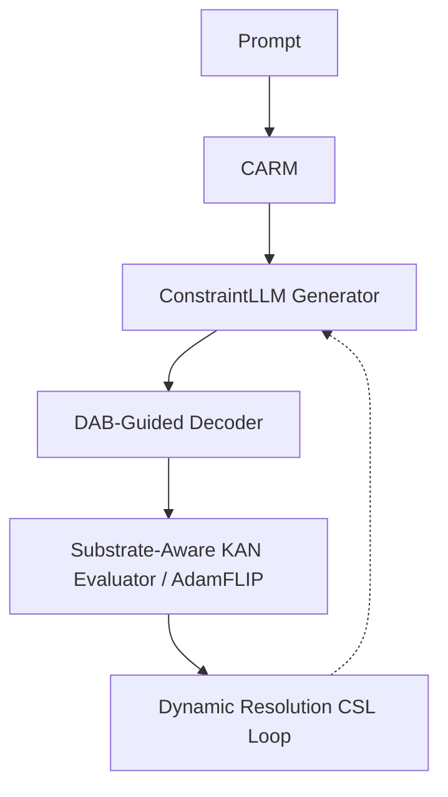

# Milestone 2026.05.211: ConstraintLLM, DAB-Guided Generation, and Substrate-Aware KANs

## Context: What Milestone 2026.05.210 Proved
Milestone 210 successfully integrated the ALPS sampler module, ActFocus reweighting, and KAN-CL regularization, resolving the action bottleneck and demonstrating that energy-guided decoders can actively select hidden states. However, while the sampler convergence improved, we identified that static constraints remain a bottleneck to full autonomy, and continuous space sampling suffers from boundary projection taxes.

## The 3 Biggest Gaps to PRD Vision
1. **Automated Constraint Elicitation (Reasoning-Time Open Constraint Elicitation):** We still rely heavily on hand-coded or statically parsed constraints. The vision requires dynamic Constraint-Aware Retrieval Modules (CARM) to map natural language to formal constraints.
2. **Continuous vs Discrete Sampling Inefficiencies:** Energy-guided decoding in strictly continuous latent spaces struggles with the discrete token boundary. Discrete Auto-Regressive Biasing (DAB) is needed to directly map energy gradients to vocabulary logits.
3. **Hardware Synthesis and CSL Mode Collapse:** KAN-CL prevents forgetting but suffers from mode collapse under uniform capacity. Furthermore, KAN verification requires hardware-aware mapping to LUTs (Substrate-Aware KANs) before it can run on KV260 FPGAs.

## Architecture

## Phases

**Phase 0: Activation**
Archive the previous milestone and set up the working environment for 2026.05.211.

**Phase 1: Extraction & Biasing (CARM + DAB)**
Focuses on bridging the natural language to formal logic gap using a Constraint-Aware Retrieval Module (CARM) and replaces purely continuous energy guidance with Discrete Auto-Regressive Biasing (DAB), acting directly on the token-level logits to avoid projection taxes.

**Phase 2: Verifier Substrates (KAN + AdamFLIP)**
Maps KAN nodes to binary/LUT substrates (BiKA style) for hardware-efficient FPGA deployment and integrates AdamFLIP to handle hard constraints robustly during evaluation.

**Phase 3: Continuous Self-Learning & Retro**
Evolves the CSL loop to use dynamic resolution energy landscapes and RLVR structures, enabling zero-forgetting continual learning without mode collapse. Culminates in a full end-to-end benchmark and milestone retrospective.

## Hardware Requirements
- **Local SOTA Runtime:** Dual RTX 3090s running `unsloth/Qwen3.6-35B-A3B-GGUF`, `unsloth/gemma-4-31B-it-GGUF`, and `unsloth/gemma-4-26B-A4B-it-GGUF`.
- **FPGA Simulation:** KV260 Source-Level RTL sim (No Vivado synthesis required for this milestone, purely accounting).
