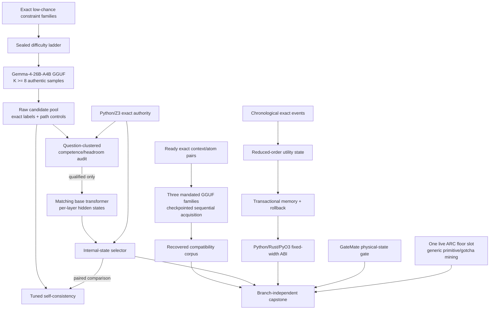

# Research Roadmap vNEXT — Milestone 2026.08.529

**Milestone title:** Calibrated Phase-D Candidate Headroom, Internal-State
Verification, and Reduced-Order Continuous Learning

**Status:** Pre-staged after terminal milestone `2026.07.528`

**Experiment range:** Exp6100-Exp6111

**Architecture freshness note:** `_bmad/architecture.md` was last reconciled on
2026-07-03, more than 30 days before this plan. It is used here as historical
architecture evidence, not silently treated as current. Exp6111 must reconcile
the architecture document against the implemented `.529` surfaces before any
new component is described as current architecture.

**Primary question:** Can Carnot create the first authentic, adequately powered
Phase-D candidate pool on which selection is both possible and non-combinatorial,
qualify a per-layer internal-state verifier against tuned self-consistency, and
improve continuous learning after write-through defeated delayed commit, while
preserving semantic-acquisition, hardware, and live ARC obligations?

## What milestone 2026.07.528 proved

| Evidence | Terminal result | Consequence for `.529` |
|---|---|---|
| Exp5961 transition | The task exhausted three wall-clock attempts and its declared transition artifact is absent | `.529` must preserve the missing-handoff class rather than fabricate a clean transition |
| Exp5962 source delta | `complete_null`; no post-V528 source was accepted | The V529 planner marker becomes the next exact search boundary |
| Exp5963 exact atom-pair fixture | Ready with 300 base contexts and 600 exact pairs | The semantic fixture is usable; the blocked step is live all-family representation acquisition |
| Exp5964 all-family atom corpus | `blocked: insufficient_free_vram`; partial per-model row files exist but readiness is zero | The hypothesis is scientifically unresolved; one changed, checkpointed VRAM-recovery attempt is warranted |
| Exp5965-Exp5966 ranker/acquisition | Preemptively gate-blocked by Exp5964 | Do not invoke downstream ranker/acquisition work in `.529`; recover the corpus first |
| Exp5967 delayed-commit fixture | Ready with frozen snapshot, transaction, rollback, and fixed-width ABI semantics | The external-state learning substrate is sound |
| Exp5968 prospective CSL | Ready, but the matched **write-through control won**; delayed-vs-fixed/no-memory AUC gain was only `0.008934` | Delayed commit is not the next lever; utility-state compression and causal credit assignment are |
| Exp5969 safety/ABI audit | Ready with zero unsafe accepts and exact Python/Rust/PyO3 replay | `.529` may change utility state while keeping this safety envelope fixed |
| Exp5970-Exp5971 ARC strip-swap | Sentinel ready, but the full battery was `complete_null` because original anchor support was empty | No more convention-transform variants without live support |
| Exp5972 ARC budget projection | Eight measured games project a conservative 25-game run below 12 hours | Budget-2000 scheduling is feasible; it does not repair the induction mechanism |
| Exp5973 capstone | `complete_with_blocks`, preserving missing, blocked, gate-blocked, ready, null, and feasible branches independently | Exact terminal-class aggregation is reusable |

Outer-loop evidence after `.528` further narrows ARC. Exp6091 showed that the
local single-shot GGUF refinement path produced no engine on any live A/B cell.
Exp6092 enumerated 23 per-game lookup sites; Exp6093 showed the development twin
fell from 24/25 to 10/25 when identity support was removed, while identity
removal was inert on the scored path; Exp6094 measured true adapter-free search
cost. The local single-shot induction line is therefore closed. The one ARC slot
in `.529` must harden a generic primitive or mine cross-game gotchas, not change
prompt, repetition, or budget.

## The three largest gaps to the PRD vision

### Gap 1 — Phase D has neither a viable domain nor an internal verifier moat

The PRD requires FR12 verifiable reasoning beyond easy exact checks. Carnot's
survey of every candidate-pool-shaped artifact found zero of seven pools that
combine a competent generator, authentic same-model diversity, unsaturated
self-consistency, and selectable oracle headroom. Existing apparent headroom is
either chance-combinatorial, saturated, or manufactured by a deterministic
builder. Training any verifier on those pools would answer the wrong question.

`.529` first constructs a difficulty ladder from exact low-chance constraint
families, then collects at least eight real temperature samples per question
from `unsloth/gemma-4-26B-A4B-it-GGUF`. It separates generator-above-chance,
all-wrong, oracle, and tuned-SC tests at the question replication unit. Only a
qualified pool may unlock matching-base per-layer extraction and a
TrajSelector-class probe. The external generated-text/logprob scorer family
remains retired.

### Gap 2 — natural-language semantic acquisition is blocked before the result

The exact atom-pair fixture is ready, but Exp5964 never acquired the full SOTA
representation corpus because free VRAM was insufficient. That is an
environmental block, not evidence that context/atom compatibility fails. The
PRD's natural-language-to-executable-constraint path remains unresolved.

`.529` makes one disciplined recovery attempt: sequential family loading,
task-owned process leases, explicit model eviction, phase timing, per-family
checkpoints, and resume from the three existing partial row files. It uses all
three mandated GGUF families. No downstream ranker is queued, so a second VRAM
block retires this recovery shape without causing another cascade.

### Gap 3 — continuous learning is safe, but its credit state is not useful enough

FR11 requires autonomous improvement from verified experience. Carnot has
chronological exact events, transactional external memory, rollback, poison
quarantine, and cross-language parity. Yet `.528` falsified the delayed-commit
advantage: immediate write-through learned faster under the matched stream.

RoMeRL (`2608.02508`) identifies a different bottleneck: trajectory-indexed
utilities dilute feedback and co-retrieved memories receive contaminated credit.
`.529` tests a fixed-dimensional reduced-order utility state against the winning
write-through policy, delayed commit, fixed memory, shuffled retrieval, and no
memory. Model weights remain immutable; promotion still depends on exact future
events and must preserve `.528` safety/rollback behavior.

## Research findings incorporated

| Source | Finding | `.529` use |
|---|---|---|
| Distributional EBMs, arXiv:2605.18871 | Learned whole-output energy and deterministic penalties are complementary; model-identity shortcuts must be causally audited | Motivates internal selection plus exact labels, but not the retired external-text scorer |
| Solver-Hard, arXiv:2607.17047 | SAT-solver hardness does not consistently predict model difficulty; proof-preserving relabeling exposes surface sensitivity | Exp6103-Exp6105 calibrate observed model accuracy separately from solver conflicts and preserve relabel controls |
| RoMeRL, arXiv:2608.02508 | Bounded utility coordinates increase feedback density and reduce memory-reward contamination | Exp6108 tests reduced-order state under Carnot's exact chronological safety envelope |
| Self-Certification of Representation Adequacy, arXiv:2608.02267 | History aliases in a compressed representation cause irreducible decision loss; adequacy must be externally certified | Exp6106 is an explicit access/adequacy gate before Exp6107 can claim a selector result |
| Right Makes Might / Hidden-Align, arXiv:2606.03234 | Correct rollouts concentrate at the pre-answer-marker anchor, with anchor position and layer depth load-bearing | Exp6106 caches that anchor explicitly; Exp6107 preregisters anchor-only versus prefix, answer-token, final-layer, norm, and length controls without importing the paper's RL claim |
| Right Answer, Wrong Method, arXiv:2608.02442 | Final-answer correctness can hide enumeration, guessing, or answer-first shortcut behavior | Exp6104-Exp6105 report path-validity and shortcut strata separately from exact correctness |
| Parallel Trajectory Tempering, arXiv:2607.27077 | Optimization-path reservoirs can maintain equilibrium and expose thermalization | Guarded future work after a viable domain exists; no `.529` PTT benchmark |
| KAN optimal abstractions, arXiv:2602.06737 | Piecewise-affine KAN abstractions permit explicit MILP error bounds | Guarded future certification; the retired adaptive-KAN accuracy line stays closed |
| FPGA Ising decomposition / dual-BRAM p-bits, arXiv:2602.15985 / 2602.16143 | Hardware claims require explicit decomposition, memory, communication, and quality accounting | Informs board receipts only; no cross-paper speedup inference |

## Target architecture



The boundaries are load-bearing:

- Exact validators label and certify candidates; no learned energy is an oracle.
- The Phase-D generator is selected by measured transport and competence, not
  by parameter count or SAT-solver conflict counts.
- The observed-`p` independence formula is diagnostic only. The preregistered
  gate uses enumerated chance floors, a numerical all-wrong-rate bound, and a
  question-clustered oracle-minus-SC interval.
- GGUF generation and matching-base hidden-state extraction are separate,
  hash-pinned substrates. The base repository is never treated as the same
  quantized execution path.
- The internal selector reads cached hidden states. It does not rerank from
  generated text, output logprobs, or a model-authored confidence field.
- Reduced-order self-learning changes external utility state only; exact future
  events, rollback, poison quarantine, and protected-prefix retention remain
  authoritative.
- ARC uses only live-agent observations and generic cross-game mechanisms. No
  game source, hand adapter, offline ground-truth BFS, registry trajectory, or
  public-level solve credit is allowed.

## Reservation and majority accounting

| Class | Tasks | Count |
|---|---|---:|
| Infrastructure reservation | Exp6100 transition, Exp6111 capstone | 2 |
| SOTA ingestion reservation | Exp6101 dated evidence refresh | 1 |
| Attached-board continuity | Exp6109 GateMate | 1 |
| ARC generalization floor | Exp6110 cross-game primitive/gotcha task | 1 |
| Discretionary Phase D | Exp6103-Exp6107 | 5 |
| Other discretionary research | Exp6102 semantic corpus recovery, Exp6108 continuous self-learning | 2 |
| **Total** | Exp6100-Exp6111 | **12** |

After the fixed reservations and one ARC floor are removed, seven discretionary
slots remain. Five of seven are Phase D, so Phase D holds the required majority.

## Phase A — exact boundary, source delta, and research prerequisites

### Exp6100 — exact transition into `.529`

Archive exactly the 13 activated `.528` task identities and their declared
deliverables. Preserve Exp5961 as a missing declared artifact after three
wall-clock failures; preserve the Exp5964 block and Exp5965/5966 conductor gate
blocks; append `.528` at most once; prove Exp6100-Exp6111 collision-free.

**Deliverable:** `results/experiment_6100_transition_v529.json`

### Exp6101 — post-V529 source-delta ingestion

Search only after the exact `V529-PLANNER-REFRESH-20260804-END` marker. Recheck
arXiv, OpenReview, Hugging Face Papers, Semantic Scholar citation trails,
GitHub, Extropic, and Kona. Zero accepted findings is a valid terminal result.

**Deliverable:** `results/experiment_6101_v529_source_delta_ingestion.json`

### Exp6102 — all-family exact-atom corpus VRAM recovery

Resume Exp5964's sealed rows with all three mandated GGUF families. Load one
family at a time, checkpoint before and after each phase, evict only task-owned
processes, verify CUDA release, and preserve raw/standardized feature separation.
No ranker training occurs. A repeated `insufficient_free_vram` verdict retires
this recovery shape.

**Deliverable:** `results/experiment_6102_sota_atom_corpus_vram_recovery.json`

### Exp6103 — Phase-D difficulty-ladder fixture

Build a sealed, exact-label, low-chance difficulty ladder from harder parameter
draws of the Exp5785/Exp5786 families. Separate solver conflicts, surface form,
answer-space floor, semantic family, and exact method-validity labels. Freeze
calibration/test instances before model inference.

**Deliverable:** `results/experiment_6103_phase_d_difficulty_ladder_fixture.json`

## Phase B — Phase-D candidate headroom and internal-state verifier moat

### Exp6104 — gated authentic same-model candidate pool

Use `unsloth/gemma-4-26B-A4B-it-GGUF`, at least eight independent temperature
samples, and an explicit `max_new_tokens >= 512` budget. Calibrate difficulty on
the sealed calibration split, then collect at least 360 held test questions.
Persist raw natural reasoning and final answers without JSON grammar, finite-ID
transport, parser retry, or deterministic candidate templates.

**Deliverable:** `results/experiment_6104_phase_d_same_model_candidate_pool.json`

### Exp6105 — gated clustered headroom and authenticity audit

Audit the candidate pool at the question unit. Qualification requires effective
`K >= 7.5`, parseability at least 95%, per-candidate accuracy in `[0.40, 0.70]`,
a question-clustered lower interval above the enumerated floor, all-wrong rate
at most `0.10` (36/360), and `oracle@K - tuned_SC >= 0.10` with a clustered
lower interval above zero. Report `1-(1-p)^K` only as a diagnostic. Detect file-
order ties, templating, decorative model identities, and answer-first shortcuts.

**Deliverable:** `results/experiment_6105_phase_d_clustered_headroom_audit.json`

### Exp6106 — gated matching-base per-layer surface qualification

Only after headroom exists, resolve `google/gemma-4-26B-A4B-it` from the GGUF
card, pin its revision, and establish `output_hidden_states=True` under a
declared precision/device map. Teacher-force the immutable Exp6104 prompts and
candidates and cache layerwise pre-answer-marker anchor, answer-token, and
prefix summaries. The artifact must distinguish base weights from the GGUF
generator and block if per-layer access, anchor/token alignment, or resource
preconditions fail.

**Deliverable:** `results/experiment_6106_phase_d_per_layer_surface.json`

### Exp6107 — gated internal-state selector against tuned SC

Train simple preregistered probes on cached per-layer features with question-
grouped train/calibration/test splits. Compare against tuned SC, a cheap
text-statistical baseline, anchor-only, prefix, answer-token, final-layer-only,
shuffled-label, norm, and length controls, plus an oracle-peeking positive
control. Report paired McNemar intervals and the identically-wrong-consensus
stratum (`n >= 30`). Promotion requires a positive paired lower interval, no
shuffled-label reproduction, and no cheap-baseline match.

**Deliverable:** `results/experiment_6107_phase_d_hidden_state_selector.json`

## Phase C — continuous learning, board continuity, and one live ARC floor

### Exp6108 — reduced-order utility continuous self-learning

Add fixed-dimensional task/polarity/dynamics utility coordinates to the ready
transactional store. Compare reduced-order write-through with the `.528`
write-through winner, delayed commit, fixed memory, shuffled retrieval, and no
memory on five chronological seeds. Credit only future-event exact utility;
preserve poison, retention, rollback, state-cap, and ABI controls.

**Deliverable:** `results/experiment_6108_reduced_order_utility_csl.json`

### Exp6109 — GateMate changed-physical-state gate

Hash the last DirtyJTAG/cable state and require a new dated operator physical-
setup receipt before one detect attempt. If unchanged, do not repeat JTAG;
emit the exact cable/port/power action packet. If changed and the GM1Ax IDCODE
appears, run the already-built non-destructive smoke path; flashing still
requires explicit authorization.

**Deliverable:** `results/experiment_6109_gatemate_physical_gate_v529.json`

### Exp6110 — live ARC cross-game gotcha primitive hardening

Mine agent-owned observation/action tapes for one generic cross-game gotcha
supported by at least three development games, encode it as a game-ID-free
`arc_solver_kit.py` primitive, and run leave-one-game-out live-path A/B on a
held game set. This task must not invoke the closed induction line or claim a
public level solve. Any incidental level outcome records
`solve_provenance: live_agent_self_discovery` and remains non-headline.

**Deliverable:** `results/experiment_6110_arc_cross_game_gotcha_primitives.json`

## Phase D — exact reconciliation

### Exp6111 — branch-independent capstone

Resolve all 11 upstream tasks by declared `(task_id, deliverable)` identity.
Preserve ready, positive, null, blocked-precondition, gate-blocked, retired,
underpowered, missing, and adversarial-flagged classes independently. Reconcile
specs, traceability, the stale architecture document, status, and changelog
without converting a successful branch into evidence for another.

**Deliverable:** `results/experiment_6111_v529_capstone_reconciliation.json`

## Dependency graph

```text
Exp6100 transition ─────────────────────────────────────────────────┐
Exp6101 source delta ───────────────────────────────────────────────┤
Exp6102 exact-atom corpus recovery ─────────────────────────────────┤
                                                                   │
Exp6103 Phase-D difficulty ladder                                  │
  └─[phase_d_ladder_fixture_ready_score == 1]─> Exp6104 pool        │
       └─[candidate_pool_integrity_score == 1]─> Exp6105 audit      │
            └─[phase_d_headroom_ready_score == 1]─> Exp6106 layers │
                 └─[per_layer_surface_ready_score == 1 AND          │
                    phase_d_headroom_ready_score == 1]─> Exp6107    ├─> Exp6111
                                                                   │
Exp5968 + Exp5969 ─> Exp6108 reduced-order CSL ────────────────────┤
Exp6109 GateMate physical gate ─────────────────────────────────────┤
Exp6092 + Exp6093 + Exp6094 ─> Exp6110 ARC generic primitive ──────┘
```

The capstone is intentionally ungated. It must reconcile blocked, skipped, and
null branches instead of disappearing behind their gates.

## Model policy

Every LLM-using task carries a literal `MODEL_SPECS` receipt containing at
least one mandated local GGUF family:

- `unsloth/Qwen3.6-35B-A3B-GGUF` — flagship MoE
- `unsloth/gemma-4-31B-it-GGUF` — flagship dense
- `unsloth/gemma-4-26B-A4B-it-GGUF` — middle MoE

Exp6102 uses all three. Exp6104 uses the 26B-A4B model because it is the only
mandated family already measured both competent and reliable on the closest
constraint stream. Exp6106 records that same GGUF as immutable generation
provenance and uses its card-declared base repository
`google/gemma-4-26B-A4B-it` solely for per-layer extraction. Base and GGUF
precision/token alignment are reported separately.

Legacy `Qwen/Qwen3.5-0.8B` and `google/gemma-4-E4B-it` are permitted only for
CPU smoke tests. They may not populate headline rows, replace a missing SOTA
model, satisfy a readiness gate, or provide Phase-D results. A missing mandated
model blocks the task. GGUF repositories use embedded llama.cpp tokenizers;
`AutoTokenizer` is never pointed at a `-GGUF` repository.

## Failed-experiment and retirement discipline

- Exp6102 declares Exp5964's exact `blocked: insufficient_free_vram` verdict.
  The difference is sequential loading, task-owned process leases, phase timing,
  explicit eviction, and checkpoint/resume. The same verdict retires this shape.
- Exp6104 declares Exp5786. The prior corpus had only one sample per model,
  order-determined SC, a dead Qwen arm, and only four selectable questions. The
  replacement uses one reliable model, `K>=8`, a non-truncating token budget,
  harder sealed instances, and no file-order baseline.
- Exp6106 and Exp6107 declare both Exp899 and Exp5178. Exp899 compressed state
  to three engineered drift features and scored chance; Exp5178 used six
  questions, final-token-only vectors, and scored hidden `0.000` versus tuned
  SC `0.333` (`delta=-0.333`). `.529` requires genuine per-layer access, a
  qualified domain, grouped splits, and falsifiable controls.
- Exp6108 declares Exp5895. It does not requalify the retired exact slot; it
  changes the mechanism to reduced-order utility credit on the ready `.528`
  stream and explicitly retains the write-through winner.
- Exp6109 is the standing non-terminal GateMate hardware-continuity continuation.
  It carries the 2026-05-29 operator override, latest cached board-state prior,
  and a concrete changed-physical-state gate. KV260 and PolarFire are omitted
  because their adversarial-clean terminal artifacts already satisfy the
  repository's graduation rule.
- Exp6110 declares the Exp6091 induction block but does not rerun induction. It
  mines cross-game live observations and hardens a generic primitive, one of the
  explicitly allowed ARC-floor task classes.
- Every genuine rerun declaration includes `retire_if_same_verdict: true`. No
  task requires a retired upstream experiment and no retired ID is reused.

## ARC provenance and non-duplication

Exp6110 is the only ARC task. It must precheck `ops/arc_solve_registry.yaml` and
keep it byte-identical. The task uses `make_carnot_agent` / `E3AgentPolicy` and
may read only agent-owned observations, action outcomes, and runtime reverse-
engineering state. It may not read game source, instantiate a hand `GameAdapter`,
run offline ground-truth BFS, create per-game calibration/model tables, reuse
registry trajectories, or use hidden-game identity as a feature.

The task does not target a level solve. Its required artifact still includes
`solve_provenance`, fixed to `live_agent_self_discovery` for any incidental
level outcome. `development_proxy` and `outer_loop_re` cannot be headline.

## Hardware requirements

| Resource | Tasks | Requirement and claim boundary |
|---|---|---|
| Dual RTX 3090, 2x24 GB | Exp6102, Exp6104, Exp6106 | Preflight cached model hashes, per-device free VRAM, thermals, disk, llama.cpp/transformers versions, task-owned PID leases, and cleanup. Sequential loading is mandatory; no unrelated process may be killed. |
| Host RAM and disk | Exp6104, Exp6106 | At least 90 GiB available RAM/swap and 120 GiB free disk before base-model download/offload; atomic checkpoints and compressed hidden-state shards. |
| CPU/Z3/Rust/PyO3 | Exp6103, Exp6105, Exp6107, Exp6108 | Exact labels, clustered statistics, transactional replay, and fixed-width ABI; no synthetic timing or oracle substitution. |
| KV260 | No `.529` task | Graduated on adversarial-clean Exp3600: synthesized Carnot overlay, `kv260_terminal_state_reached=true`, and a measured board transcript. Follow-on work is opportunistic; do not re-run continuity merely to occupy a slot. |
| PolarFire SoC | No `.529` task | Graduated on adversarial-clean Exp3867: hash-matched end-to-end dispatch with `polarfire_workload_validated=true`. Follow-on work is opportunistic. |
| GateMate A1-EVB-2M | Exp6109 | DirtyJTAG physical state. No repeated detect until a changed physical receipt; no flash without explicit authorization. |
| Extropic XTR-0/Z1 | No execution task | Official page still advertises 2026 early access, but Carnot has no authenticated route. Marketing/simulation is not board evidence. |

Every compute task has a step-zero precondition and emits an honest blocked
artifact when required hardware, model files, runtime features, or time budgets
are absent. No mock model, fake row, sleep substitute, CPU headline fallback,
or inferred board receipt is permitted.

## Milestone success criteria

The milestone is operationally complete when every task has an exact terminal
class, including honest blocks. Scientific promotion requires:

1. Exp6105 qualifies an authentic pool under all preregistered competence,
   diversity, numerical all-wrong, headroom, clustered-power, and shortcut
   controls. Otherwise Exp6106/6107 skip before expensive or unfalsifiable work.
2. Exp6106 proves a real matching-base per-layer extraction surface and Exp6107
   either beats tuned SC with paired evidence that survives all controls or
   honestly retires the selector shape.
3. Exp6102 completes all three exact-atom representation families without
   fabricating rows or evicting unrelated GPU work; a repeated VRAM block is
   recorded as terminal rather than cascaded into another ranker attempt.
4. Exp6108 improves prospective exact-event utility or feedback density over
   `.528`'s winning write-through arm without unsafe acceptance, contamination,
   retention loss, rollback failure, or ABI divergence.
5. GateMate produces a fresh changed-state or exact blocked receipt within its
   authorization boundary, and Exp6110 improves or falsifies one game-ID-free
   live primitive without solve duplication. KV260 and PolarFire terminal
   evidence remains immutable and is not re-measured.
6. Exp6111 preserves every terminal class, protected file, and adversarial
   determination and reconciles the specs and operations ledgers without
   outcome laundering.
