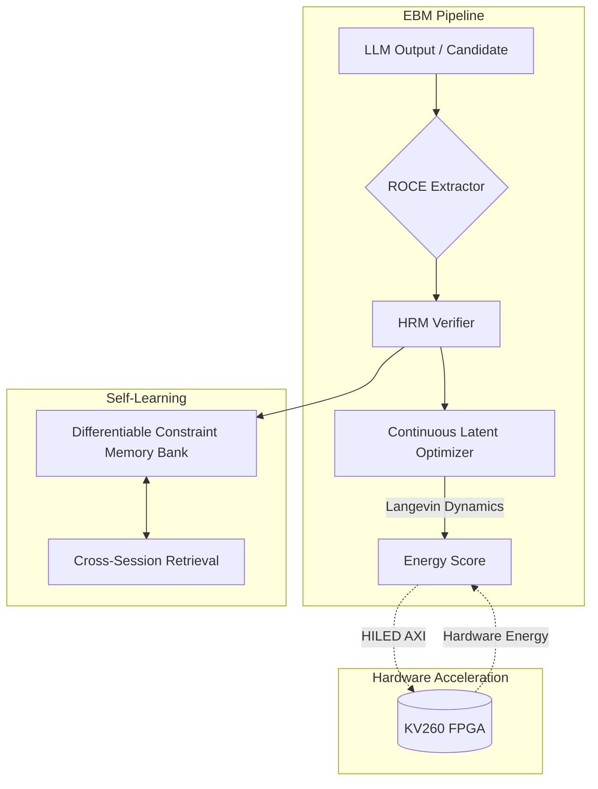

# Carnot Research Roadmap v137

**Milestone:** 2026.05.137
**Title:** Phase-14: Continuous Latent Optimization, HILED Hardware Bring-up, and Multi-Session Memory
**Date:** 2026-05-13

## 1. Context and Prior Outcomes

Milestone `.136` successfully shipped Energy-Based Fine-Tuning (EBFT), semantic pruning for continual learning memory, Reasoning-Time Open Constraint Elicitation (ROCE), the Hierarchical Reasoning Model (HRM), and a software prototype for Hardware-In-The-Loop Energy Decoding (HILED). 

However, three major gaps remain before achieving the PRD vision for Phase-1 ship readiness:
1. **Dynamic Generation Optimization:** Elicited constraints (ROCE/HRM) are still evaluated somewhat statically; we need continuous latent constraint optimization (via Langevin dynamics) during autoregressive generation to approach Kona parity.
2. **True Multi-Session Memory:** Semantic pruning stabilized single-session learning, but true continuous self-learning requires a differentiable memory bank that persists structured constraints across sessions without forgetting.
3. **Hardware Bring-up:** HILED was prototyped in software, but we must synthesize the bitfile and run the zero-shot hardware integration on the KV260 FPGA to claim actual latency/energy improvements.

This milestone introduces continuous latent constraint optimization, multi-session differentiable memory, and full FPGA hardware integration.

## 2. Architecture Diagram

## 3. Phase Descriptions

### Phase 1: Continuous Latent Constraint Optimization
Focuses on migrating ROCE and HRM outputs into a continuous latent space where Langevin dynamics can optimize the representation during generation. This brings Carnot closer to continuous EBM generation (arXiv:2605.18210).

### Phase 2: Multi-Session Continual Learning
Transitions the FR-11 self-learning pipeline from single-session semantic pruning to a differentiable memory bank (arXiv:2605.09332), ensuring long-term constraint retention and cross-session retrieval without catastrophic forgetting.

### Phase 3: Hardware-In-The-Loop Edge Decoding (HILED) Bring-up
We have the HILED software prototype; this phase focuses entirely on hardware integration. It requires synthesizing the KV260 bitfile, flashing the board, and executing zero-shot edge decoding over AXI (arXiv:2605.21045).

### Phase 4: Capstone E2E Benchmark
Run the full multi-session, hardware-accelerated, latent-optimized pipeline across the three mandated SOTA GGUF models.

## 4. Hardware Requirements
- **Local CPU/GPU:** Dual RTX 3090 configuration for running the mandated SOTA GGUFs (Qwen3.6-35B-A3B, Gemma4-31B-it, Gemma4-26B-A4B-it).
- **FPGA:** KV260 Vision AI Starter Kit for HILED synthesis and hardware execution.
- **Tools:** Xilinx Vivado (required for KV260 bitfile synthesis).

## 5. Dependency Graph
- Phase 1 (Latent Optimization) unblocks Phase 4 (Benchmarks).
- Phase 2 (Multi-Session) depends on Phase 1 for advanced constraint representations.
- Phase 3 (Hardware) is independent but requires Opus/deep-think routing due to HW complexity.
