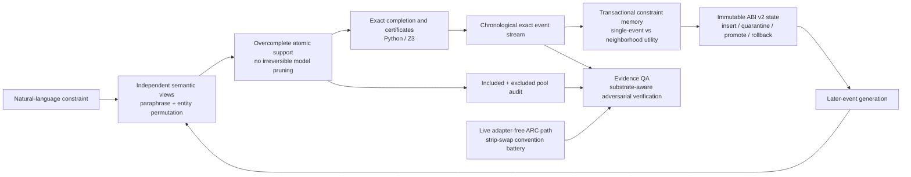
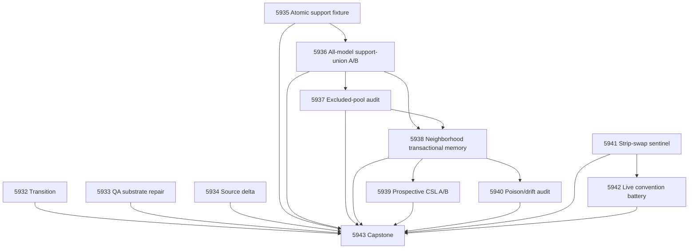

# Carnot Research Roadmap vNEXT — Milestone 2026.07.527

**Milestone:** 2026.07.527  
**Title:** Non-Pruning Semantic Constraint Acquisition, Prospective Neighborhood Learning, and ARC Convention Generalization  
**Status:** Proposed  
**Task range:** Exp5932-Exp5943 (12 experiments)  
**Execution file:** `research-roadmap-next.yaml`  
**Date planned:** 2026-07-26

---

## What Milestone 2026.07.526 Actually Proved

Milestone `.526` reached a terminal conductor state with all 14 activated
identities classified. It delivered several reusable interfaces, but its
headline schema-decoding mechanism failed exactly where Carnot's PRD requires
success: executable semantics.

| Area | Terminal evidence from `.526` | Consequence for `.527` |
|---|---|---|
| Evidence integrity | Exp5918 blocked because it treated unrelated full-suite/spec/root-clutter debt as a transition precondition. Exp5931 still reconciled all exact declared deliverables, but its own aggregation artifact was later CRITICAL-flagged as `DURATION_TOO_SHORT` merely because it quoted upstream GGUF/CUDA evidence. | Exp5932 changes the transition gate to task-owned tests plus exact global-debt non-amplification. Exp5933 repairs the aggregation-substrate classifier without weakening real live-inference checks. |
| Constraint structure | Exp5921 qualified a mechanically derived ConstraintIR grammar/type/scope fixture. Exp5922 qualified all three embedded GGUF tokenizers and the public llama.cpp bridge. | These are reusable structural supports, not semantic evidence. `.527` preserves them as proposal-language infrastructure. |
| Exact semantic acquisition | Exp5923 ran all three mandated model families. Both schema-supported arms achieved zero exact semantic successes; the mechanism was retired. Structural validity did not bridge attribute/value semantics. | No schema-supported reprompt, diagnostic reprompt, one-shot typed-IR formatting, or finite-answer transport may be retried. `.527` changes the proposal shape to an overcomplete, non-pruning atomic support followed by exact completion. |
| Continuous self-learning | Exp5920 admitted a fresh chronological stream; Exp5924 qualified transactional read-before-write memory; Exp5926 qualified Python/Rust/PyO3 ABI-v2 parity. Exp5925 never ran because its semantic-source gate depended on retired Exp5923. | The operational pieces exist, but FR11 still lacks a prospective current-model lift. `.527` creates a new independent event stream and tests future-event, neighborhood-utility admission with immutable weights. |
| ARC click routing | Exp5927 confirmed coordinate information exists but produced only 27 hard-progress positives, below the preregistered floor of 30. | Do not promote or rerun the underpowered coordinate route. It remains bounded evidence only. |
| ARC live memory | Exp5928 qualified execution-binding machinery. Exp5929 still produced zero live rows because the conductor did not supply a bound live E3 environment. | Do not retry the same externally blocked live-memory experiment. Satisfy the ARC generalization floor through the already reachable live adapter-free path and a new convention perturbation. |
| Hardware | Exp5930 mapped ABI-v2 operations statically to CPU/Rust, KV260, PolarFire, GateMate, and TSU-shaped capabilities without physical execution. No authenticated route changed. | No unchanged board probe or speedup claim belongs in `.527`. CPU/Rust and the static ABI mapping remain the portability path. |

The central `.526` lesson is sharper than “constrained decoding did not work.”
The model was allowed to commit to a semantically incomplete proposal before
the exact system could help. Once a required atom was absent, grammar, repair,
and search could not recover it. `.527` therefore treats semantic coverage as
the first-class quantity: preserve an overcomplete atom support, union
independent semantic views, audit what was excluded, and invoke the exact
executor only after that support is sealed.

---

## The Three Largest Gaps to the PRD Vision

### Gap 1 — Natural language still does not become executable constraints

Carnot has exact parsing, type/scope checks, Python/Z3 replay, certificates, and
tokenizer-aware structural support. It still has zero demonstrated exact
semantic acquisitions from the mandated current models on the `.526` held
fixture. This blocks the PRD's verified reasoning loop before energy-guided
selection or repair can matter.

**Milestone response:** Exp5935 builds a high-recall atomic support and exact
completion contract that forbids model-side irreversible pruning. Exp5936
compares direct one-shot IR, single-view atomic support, and a budget-matched
multi-view union across all three mandated GGUF families. Exp5937 audits both
included and excluded atom pools with exact finite-sample bounds.

### Gap 2 — Continuous self-learning has components but no prospective lift

The event schema, transaction protocol, rollback, retention rules, and
backend-neutral ABI are qualified independently. The missing evidence is
whether verified experience from earlier events improves later exact outcomes
without same-event leakage, memory pollution, or forgetting.

**Milestone response:** Exp5938 adds exact failure-atom attribution and
semantic-neighborhood utility to transactional admission. Exp5939 runs a
chronological all-three-model five-arm comparison. Exp5940 separately attacks
the learner with poison bursts, stale conflicts, restarts, and rollback. Model
weights remain immutable throughout.

### Gap 3 — ARC needs generalization evidence on a reachable live path

The externally bound structured-memory route produced no live rows, and the
coordinate-router progress slice is underpowered. Meanwhile, current
outer-loop evidence leaves a concrete live-path question undecided: whether the
HUD edge-bar lever depends on the bar being at the edge. Existing roll
perturbations either do not change the detector or destroy the task.

**Milestone response:** Exp5941 adds and statically qualifies a row/column
strip-swap sentinel that moves the bar off-edge without wrapping the playfield.
Exp5942 runs the full 25-game, four-arm, five-seed battery through
`make_carnot_agent` / `E3AgentPolicy`, uses games as the replication unit, and
claims no public solve credit. This is a reusable live-path convention
generalization test, not a level-solving task.

---

## Research Findings Incorporated

The dated evidence ledger is
`research-references.md#v527-planner-refresh---20260726`.

| Finding | Use in `.527` | Authority boundary |
|---|---|---|
| Finite-Sample Coverage Audits (`arXiv:2607.21480`) | Exp5935 preregisters atom-generator families and an excluded pool. Exp5937 uses exact binomial/hypergeometric inversion to bound omitted relevant mass. | Auditing only accepted atoms cannot certify recall. Hidden exact fixture semantics supply labels; no model or judge labels the audit. |
| Anatomy of a Sound Neural Reasoner (`arXiv:2607.19635`) | Exp5935 forbids first-pass deletion; Exp5936 unions paraphrase and entity-permutation views before exact completion and reports whether search changes accuracy or only removes repeated invalid work. | Exact search cannot recover a true atom that the proposal stage made unreachable. No one-shot neural support may become a hard mask. |
| Workflow-Localized Mechanism Learning (`arXiv:2607.20999`) | Exp5938 keys proposed memories to the smallest exact failure atom and edit target instead of storing whole-response advice. | Model-authored attribution is diagnostic only; exact future-event utility owns promotion. |
| UMEM (`OpenReview:BoiXvrwtdi`) | Exp5938-Exp5939 compare semantic-neighborhood marginal utility with single-event admission. | Carnot uses exact future events, not GRPO or an LLM judge, and never mutates GGUF weights. |
| M2Note (`arXiv:2607.00685`) | Supports external mistake memory, validation, and rollback as an architecture direction. | Same-batch improvement is insufficient. Carnot requires chronological future-event validation and protected-prefix retention. |
| AttriMem (`arXiv:2607.21106`) | Motivates logging which stored atom affected a decision in Exp5938-Exp5940. | Learned token attribution cannot admit or certify a memory. |
| Best-of-Evidence (`arXiv:2607.20950`) | Its signed factor-ledger idea informs atom-level receipts, but no partial-verification proxy is added. | The ConstraintIR fixture has full exact semantics, so the exact executor remains the sole authority. |
| Secondary-source refresh | Semantic Scholar still exposed 30 dated EBT and eight ARM-EBM citing records; Extropic has no post-October-2025 writing update; Kona remains non-reproducible locally; GitHub/Hugging Face exposed no required replacement dependency. | Discovery counts are dated receipts. No TSU, Kona, repository, or paper claim becomes local execution evidence. |

No new KAN result reopens the retired adaptive-kernel chains, and no Ising,
FPGA, or TSU route changed authentication state. Those topics remain strategic
context rather than milestone execution.

---

## Architecture After This Milestone

The LLM proposes possible semantic atoms; it does not certify them and may not
delete the exact executor's search support. The exact executor creates the only
semantic labels. The learner stores versioned external state only after
future-event validation. ARC remains a separate live-agent generalization lane.
Evidence QA classifies aggregation separately from live model inference.

---

## Phase Plan

### Phase A — Evidence Integrity and Source Boundary (Exp5932-Exp5934)

This phase makes the milestone executable and its capstone trustworthy.

| Experiment | Deliverable | Exit condition |
|---|---|---|
| Exp5932 | `results/experiment_5932_transition_v527.json` | Exact `.526` classification preserved; task-owned gates clean; existing global debt not amplified; Exp5932-Exp5943 collision-free. |
| Exp5933 | `results/experiment_5933_aggregation_substrate_qa_repair.json` | Aggregation artifacts quoting upstream compute no longer trigger live-duration/model-methodology rules; true live artifacts still do; corpus dry-run has no severity regression. |
| Exp5934 | `results/experiment_5934_v527_source_delta_ingestion.json` | Post-V527 marker sources classified and deduplicated; zero accepted deltas is an honest terminal result. |

### Phase B — Non-Pruning Semantic Acquisition (Exp5935-Exp5937)

This is the milestone's main verifiable-reasoning branch.

| Experiment | Deliverable | Exit condition |
|---|---|---|
| Exp5935 | `results/experiment_5935_non_pruning_atomic_constraint_support.json` | Generic atom universe, independent semantic transforms, non-pruning support, exact completion, tamper tests, and excluded-pool audit contract are ready without LLM inference. |
| Exp5936 | `results/experiment_5936_sota_atomic_support_union_ab.json` | All three mandated GGUF families complete direct, single-view, and multi-view-union arms on sealed held cases. Exact semantics, omissions, unsafe acceptance, diversity, and real GPU receipts own the verdict. |
| Exp5937 | `results/experiment_5937_excluded_pool_coverage_audit.json` | Included/excluded pools receive exact finite-sample coverage bounds under preregistered generator families; no accepted-pool-only recall claim survives. |

### Phase C — Prospective Continuous Self-Learning (Exp5938-Exp5940)

This phase directly targets PRD FR11 and the research program's Continuous
Self-Learning requirement.

| Experiment | Deliverable | Exit condition |
|---|---|---|
| Exp5938 | `results/experiment_5938_neighborhood_transactional_memory.json` | Exact failure-atom memories support single-event and semantic-neighborhood admission, frozen reads, deferred writes, quarantine, rollback, and ABI-v2 replay. |
| Exp5939 | `results/experiment_5939_sota_neighborhood_csl_prospective.json` | A chronological five-arm all-three-model run measures later-event exact transfer, retention, unsafe promotions, latency, and state growth. |
| Exp5940 | `results/experiment_5940_csl_poison_drift_retention_audit.json` | Bounded poison, stale/conflicting atoms, restarts, and rollback cannot corrupt a protected prefix or propagate rejected state. |

### Phase D — ARC Convention Generalization and Reconciliation (Exp5941-Exp5943)

This phase satisfies the standing ARC generalization floor without retrying an
unreachable runner or re-solving a public level.

| Experiment | Deliverable | Exit condition |
|---|---|---|
| Exp5941 | `results/experiment_5941_arc_strip_swap_sentinel.json` | Row/column strip swap is a lossless permutation, moves the target bar off-edge, preserves playfield contiguity/reachability witnesses, and is wired generically behind the perturbation harness. |
| Exp5942 | `results/experiment_5942_arc_strip_swap_convention_battery.json` | Full 25-game × four-arm × five-seed live-path battery completes or reports a powered undecidable result; game-unit inference and anchor-survival rules are enforced. |
| Exp5943 | `results/experiment_5943_v527_capstone_reconciliation.json` | All 12 exact deliverables are classified independently; adversarial verification is clean or explicitly blocked; `.527` is appended once; three next recommendations are falsifiable and exclusion-aware. |

---

## Dependency Graph

The capstone is branch-independent and is never conductor-gated. It must
classify absent, skipped, blocked, null, unsafe, underpowered, flagged, and
positive outcomes separately.

---

## Model and Inference Policy

Only Exp5936 and Exp5939 perform experimental LLM inference. Both must define
all three headline `MODEL_SPECS`:

- `unsloth/Qwen3.6-35B-A3B-GGUF`
- `unsloth/gemma-4-31B-it-GGUF`
- `unsloth/gemma-4-26B-A4B-it-GGUF`

They must use embedded GGUF tokenizers, the public local llama.cpp CUDA path,
real nonzero offload on the dual RTX 3090s, exact file hashes, checkpoint/resume,
and per-row GPU telemetry. Legacy small models may appear only in optional CPU
smoke tests and cannot supply headline rows.

Aggregation, audit, exact-executor, CSL state-machine, and ARC tasks must not
declare model inference merely because they consume artifacts that mention
models.

---

## Statistical and Evidence Discipline

- Exp5936 preregisters at least 40 held cases per model/primary arm, with paired
  rows and exact intervals. No percentage-point claim uses fewer than 30
  relevant positives.
- Exp5937 samples the excluded pool directly. Candidate generator families,
  perturbations, audit rules, and stopping conditions are frozen before exact
  labels are opened.
- Exp5939 uses chronological events and reports model-stratified as well as
  pooled paired intervals. Later-event transfer cannot be replaced by same-event
  replay or memory-hit rate.
- Exp5942 uses games—not seeds—as the generalization/replication unit. Five
  seeds measure within-game stability. A one-game HUD gain cannot establish the
  lever's general value at `p<=0.05`; convention dependence and value remain
  separate questions.
- Any unsafe exact accept, future-label leak, same-event read-after-write,
  protected-prefix loss, or registry mutation is a hard stop, not an averaged
  metric.
- Every artifact records `preconditions_checked`, `duration_s`,
  `inference_substrate`, provenance, commands, exit codes, checksum, and an
  honest terminal verdict.

---

## Failed-Experiment and Retirement Discipline

The YAML records all scope-matched failures with mandatory
`retire_if_same_verdict: true`.

- Exp5932 is a changed transition after Exp5918: it replaces global-suite zero
  with task-owned gates and exact non-amplification.
- Exp5935-Exp5936 explicitly address Exp5909, Exp5910, and retired Exp5923.
  Their changed mechanism is overcomplete atomic support plus multi-view union
  before exact completion, not another schema or diagnostic reprompt.
- Exp5938-Exp5939 address gate-blocked Exp5913/Exp5914/Exp5925 with a new
  independent stream and neighborhood utility; they do not require retired
  Exp5923.
- Exp5943 addresses Exp5931's QA flag by consuming the independently repaired
  substrate classifier and emitting explicit aggregation methodology.

No task depends on a retired experiment ID. Historical artifacts are controls
or immutable evidence only.

---

## ARC Provenance and Registry Boundary

Exp5941-Exp5942 do not claim a game-level solve. They must:

- instantiate the scored path through
  `python/carnot/agentic/arc_competition_agent.py`,
  `make_carnot_agent`, and `E3AgentPolicy`;
- keep adapters and per-game constants disabled;
- use only observations and transitions available to the live agent;
- hash `ops/arc_solve_registry.yaml` before and after and require no mutation;
- report `public_level_solve_credit_claimed=false`;
- avoid source reading, offline ground-truth BFS, hand GameAdapters, and public
  level re-credit.

If a run incidentally reaches a level, it remains live-agent behavior but is
not the experiment's deliverable and cannot mutate the registry.

---

## Hardware Requirements and Boundaries

| Resource | Required tasks | Requirement | Prohibited claim |
|---|---|---|---|
| Dual RTX 3090 CUDA host | Exp5936, Exp5939 | Both GPUs healthy; public llama.cpp CUDA runtime; mandated GGUF hashes; nonzero real offload; enough RAM/VRAM/disk; checkpoint/resume. | No live result from CPU fallback, simulated rows, unavailable models, or a side tokenizer. |
| CPU + Python/Z3 | Exp5935-Exp5940 | Exact atom labels, completion, certificates, finite-sample audit, chronology, quarantine, and rollback. | Exact executor results are not evidence that the LLM understood the source. |
| Rust/PyO3 ABI v2 | Exp5938, Exp5940 | Reuse Exp5926 fixed-width insert/lookup/quarantine/promote/supersede/rollback parity and fresh-process recovery. | No board acceleration or throughput claim from ABI parity. |
| ARC live runtime | Exp5941-Exp5942 | Reachable local `make_carnot_agent`/`E3AgentPolicy` path; deterministic seeds; 25-game corpus; atomic checkpoints. | No public solve credit, adapter route, source-derived policy, or registry mutation. |
| KV260 / PolarFire / GateMate | None | Preserve Exp5930 static mapping as context only. | No repeated unchanged probe, latency, energy, convergence, or speedup claim. |
| Extropic TSU / Kona | None | Research context only; no authenticated local interface exists. | No execution, baseline, or comparative performance claim. |

The self-learning hardware answer remains bounded and explicit: immutable model
weights, fixed-width external-state operations, CPU/Rust exact validation, and
an ABI already statically mapped to future accelerators. A 100× learning
throughput claim requires later authenticated hardware and matched
end-to-end timing.

---

## Explicit Non-Goals

- No schema-supported ConstraintIR reprompt, exact-diagnostic reprompt,
  one-shot structured prompt, or finite-ID answer transport.
- No external generated-text/logprob scorer, final-embedding scorer, or
  model-authored verifier authority.
- No GGUF weight update, LoRA, GRPO, test-time training, or same-event memory
  promotion.
- No retry of Exp5929's absent conductor-bound live environment.
- No coordinate-router promotion from Exp5927's underpowered slice.
- No public ARC level solve, registry banking, GameAdapter, source reading, or
  offline ground-truth BFS.
- No KAN mutation-chain reopening, unchanged board probe, TSU execution, Kona
  baseline, hardware speedup, energy, or power claim.
- No public publishing or external communication.

---

## Milestone Success Criteria

The milestone is scientifically successful if it produces honest terminal
evidence for all branches. The strongest positive outcome would satisfy all of:

1. Multi-view non-pruning atomic support improves held exact semantic success
   over the best matched control with a positive lower confidence bound, zero
   unsafe accepts, and an explicit excluded-pool coverage bound.
2. Neighborhood-utility transactional memory improves later-event exact
   semantics over fixed validated memory and shuffled retrieval, with retention
   `1.0`, zero unsafe promotions, and bounded state.
3. The ARC strip-swap battery yields a powered convention-dependence verdict or
   an explicitly powered “undecidable because anchor support died” result
   through the live adapter-free path.
4. Evidence QA no longer misclassifies aggregation as live inference and still
   catches intentionally too-short live-model controls.

Null, blocked, unsafe, or underpowered outcomes remain valid milestone results
when their stop rules and retirement mechanics are honored.

---

## Files Produced by the Planning Step

- `openspec/change-proposals/research-roadmap-vNEXT.md`
- `research-roadmap-next.yaml`
- `research-references.md` V527 planning refresh

`research-roadmap.yaml` and `scripts/research_conductor.py` remain unchanged.
