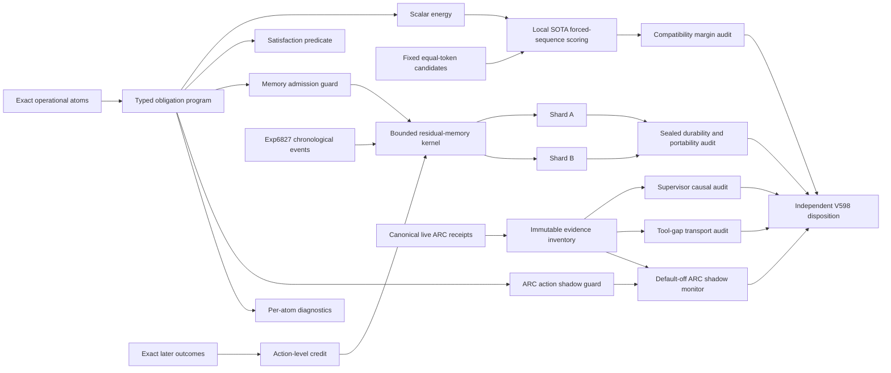

# Research Roadmap V598: Typed Constraint Energy, Executable Memory Credit, and Live ARC Attribution

**Milestone:** 2026.09.598  
**Planned:** 2026-09-01  
**Experiments:** Exp6835-Exp6847  
**North star:** A live agent discovers useful structure from its own attempts. An external energy layer checks constraints, routes feedback, and learns only from later exact outcomes.

## Executive Summary

V597 closed its four-task plan. It established a clean evidence contract, built a 150-scenario operational-obligation fixture, collected 900 local-SOTA model rows, and then found that the generated-answer corpus cannot identify semantic field preservation. The failed identifiability result is useful. It says the next milestone must leave the retired generated-answer transport lane.

V598 moves to a non-generation surface. It compiles typed obligations into one executable program. The program exposes an exact scalar energy, a satisfaction predicate, an admission guard, an action guard, and diagnostics. It then measures local-model compatibility with fixed, equal-token candidate sequences. No answer generation and no learned judge define truth.

The same typed program becomes the contract for a bounded continuous self-learning kernel. Exact later outcomes assign credit to memory actions. Two chronological shards test whether verified residual memory improves held-future decisions without leakage. A sealed audit checks durability, portability, and failure pathways.

The ARC phase does not launch another long run or claim a game solve. It freezes the evidence that exists at execution time. It keeps tool-loop, supervisor, model, and game strata separate. It audits whether supervisor and tool-gap actions have exact later outcome support. It then replays the typed program as a default-off shadow monitor at the canonical live seam.

## What V597 Proved

1. **The evidence root is usable.** Exp6831 separated CPU aggregation from live inference. It kept the flagged Exp6826 receipt quarantined. It validated the 4,320-row Exp6827 causal-edge stream without claiming that learning ran.

2. **The operational fixture is exact and broad enough for diagnosis.** Exp6832 created 150 scenarios across obligation counts 1, 2, 4, 6, and 8. Each scenario has deterministic field and joint checkers.

3. **Generated-answer transport fails before high-count semantics can be measured.** Exp6833 produced all 900 planned rows across the three mandated GGUF families. Qwen3.6 parsed 65 of 300 outputs and jointly passed 37. It parsed no rows at obligation counts 4, 6, or 8. Both Gemma families produced nonempty output but zero parsed rows.

4. **The corpus does not identify semantic field preservation.** Exp6834 observed only 395 of 18,900 target field cells. It found 18,505 missing cells, at least `2^18505` compatible preservation policies, and 290 collision witnesses. Its honest verdict was `complete_null_operational_field_preservation_not_identified`.

5. **The next experiment must change the measurement surface.** More grammar tuning, parser repair, or finite generated-answer retries would repeat a retired mechanism. V598 uses forced-sequence scalar compatibility and exact executable checks instead.

## Three Biggest Gaps to the PRD Vision

### Gap 1: Typed constraints do not yet survive the model boundary

FR12 requires a verifier that converts stated rules into checkable structure. Carnot has exact operational atoms and checkers. It does not yet have a clean, non-generation measure of whether current local models assign more support to a constraint-compatible action than to a matched violation. It also lacks one compiled object that binds the score, predicate, guard, and diagnostic.

V598 closes the measurement part of this gap. It does not claim that model compatibility is causal control.

### Gap 2: The continuous-learning loop has events but no admitted learning result

FR11 requires chronological propose, evaluate, commit, validate, persist, and roll back behavior. Exp6827 supplies 4,320 immutable causal-edge events. Exp6828 never produced a terminal artifact after two bounded attempts. Earlier factor learning was row-complete but null on held-future benefit.

V598 replaces the stalled monolith with a small deterministic kernel and two restartable shards. Exact later outcomes assign action-level credit. A sealed reducer decides whether the effect is durable and portable.

### Gap 3: Live ARC mechanisms lack clean causal attribution

The canonical live agent now has a trajectory supervisor and a self-parse tool loop. Available evidence spans different games and configurations. A supervised `ls20`/`wa30` run was still active when this roadmap was planned. Pooling loop-on and loop-off rows would be invalid. Re-solving a known game or using outer-loop reverse engineering would also miss the north star.

V598 freezes the terminal evidence available at execution time. It audits only matched or explicitly stratified cells. It credits no solve. It improves the live path by adding a default-off typed shadow monitor that the canonical agent can later reach.

## Research Findings That Change the Design

The full source notes are in `research-references.md`, section **V598 Planner Refresh - 2026-09-01**.

- [LLM Judges Verify Presence, Not Absence](https://arxiv.org/abs/2608.31016) reports that omission checks improve when a system first enumerates required facts and then checks each fact. V598 uses explicit obligation atoms and per-atom diagnostics.
- [HSRM](https://arxiv.org/abs/2608.30841) reports compact hidden-state reward models at reasoning-step boundaries. Carnot's current `llama.cpp` path exposes only a narrower final-token or final-layer surface. V598 therefore runs a method-parity precondition and does not label fixed-sequence margins as an HSRM reproduction.
- [S3Gym](https://arxiv.org/abs/2608.31100) finds that self-improvement depends on memory route and can show negative transfer. V598 includes no-memory, read-only, random-admission, and verified-residual arms plus leave-one-family-out tests.
- [SUN Programs](https://arxiv.org/abs/2608.31167) compiles typed executable programs into reusable costs, predicates, rewards, guards, and diagnostics. V598 adopts this compile-once interface for constraints, memory, and ARC shadow checks.
- [TASPO](https://arxiv.org/abs/2608.31077) separates exact outcome direction from fine-grained action credit. V598 assigns credit only after an exact later outcome and records the dose per action.
- [Causal Memory for Self-Evolving Agents](https://arxiv.org/abs/2608.30198) emphasizes persistent error pathways and joint repair. V598 audits poison, stale-credit, latent-error, and joint-failure pathways.
- [Learned Multiscale Sampling](https://arxiv.org/abs/2608.31114) is relevant to future Ising sampling work. It is a watch item, not a V598 dependency, because this milestone has no sampling bottleneck that justifies a new sampler.

Secondary checks found no execution-ready replacement. Semantic Scholar throttled the EBT and ARM-EBM citation queries. Extropic still describes 2027 developer access. Logical Intelligence does not publish Kona weights or a local runner. OpenReview, Hugging Face Papers, and GitHub discovery did not expose a better supported dependency for this milestone.

## Target Architecture



This is an evidence architecture. A lower energy is not truth. An exact checker defines task truth. A model margin is only a compatibility signal. A memory effect is causal only when a chronological comparison and later exact outcome support it. An ARC row is useful only in its own configuration stratum.

## Model Contract

Exp6837 is the only task that needs live LLM inference. Its `MODEL_SPECS` must include all three mandated local families:

- `unsloth/Qwen3.6-35B-A3B-GGUF`
- `unsloth/gemma-4-31B-it-GGUF`
- `unsloth/gemma-4-26B-A4B-it-GGUF`

The task uses one model at a time under a task-owned CUDA lease. It stores raw token identifiers, token log-probabilities, model hashes, tokenizer hashes, and fixed candidate hashes. Legacy small models may run only as CPU smoke tests. They cannot support the headline result.

## Phase 1: Typed Obligation Energy

### Exp6835: Terminal evidence freeze and omission decomposition

Reparse every Exp6833 row with fresh code. Separate protocol failure, omission, contradiction, and joint semantic failure. Preserve the Exp6834 null. This task creates the immutable evidence root for V598.

### Exp6836: Typed obligation program and matched candidate fixture

Compile the existing obligation schema into one typed executable object. Freeze equal-token correct and violating candidate sequences. Include permutation, identifier, length, and label-swap controls. The fixture contains no model output.

### Exp6837: Three-family output-free compatibility margins

Score every fixed candidate sequence with all three mandated local GGUF families. Compare exact conditional log-likelihood margins per atom and per joint program. Do not generate answers. Do not fit a probe. Do not use a learned judge.

### Exp6838: Independent shortcut and identifiability audit

Recompute margins without importing the producer reducer. Attack candidate identity, token length, prompt length, row order, labels, model scale, and score normalization. State whether any compatibility claim is identifiable.

## Phase 2: Continuous Self-Learning from Exact Outcome Credit

### Exp6839: Bounded residual-memory kernel canary

Implement a small propose, evaluate, credit, commit, persist, restart, and rollback kernel. Use exact later outcomes for direction and action-level credit for dose. The canary is deterministic and bounded. It replaces the stalled Exp6828 monolith.

### Exp6840: Chronological learner shard A

Run causal-edge orders 0-2 with no-memory, read-only, random-admission, and verified-residual arms. Freeze all decisions before their later outcomes are revealed.

### Exp6841: Chronological learner shard B

Run orders 3-4 and delayed-correction cells with the same arms. Check whether stale or jointly wrong memories are revised after exact evidence.

### Exp6842: Sealed merge, pathway, and portability audit

Use a fresh reducer. Replay both shards. Run delete, substitute, reorder, poison, restart, rollback, and leave-one-family-out attacks. A positive class requires held-future benefit, calibrated dose, durability, and no forbidden leakage.

This phase directly implements the research program's **Continuous Self-Learning** priority. It covers exact validation, bounded memory, chronological updates, durable state, rollback, and negative-transfer checks.

## Phase 3: Live ARC Attribution and Reachable Shadow Control

### Exp6843: Live evidence inventory and immutable stratum freeze

Inventory only artifacts that are terminal at execution time. Record live-process state but do not wait for or interrupt a run. Separate tool-loop on and off, supervisor applied and shadow, model, game, budget, and policy cells. This task makes no solve claim.

### Exp6844: Supervisor executable-action outcome-credit audit

Audit eligible supervisor actions against exact later trajectory outcomes. Compare only matched cells or report the result by stratum. Direction comes from the exact outcome. Credit dose belongs to the specific redirect action.

### Exp6845: Tool-gap transport and causal-support audit

Trace each tool-gap obligation to its request, tool receipt, agent-visible response, next action, and later progress. Keep transport success distinct from utility. Keep loop-on and loop-off batches separate.

### Exp6846: Typed shadow monitor at the canonical live seam

Wire the typed obligation program into the canonical supervisor and tool-gap seam in default-off shadow mode. Replay frozen receipts. Measure exact agreement, false interventions, missed violations, and latency. Do not launch a new game run. Do not claim policy benefit or a level solve.

## Phase 4: Ungated Independent Disposition

### Exp6847: V598 adversarial capstone

Read every terminal V598 artifact that exists. Recompute each branch disposition. Preserve null, blocked, partial, and disqualified results. Recommend one next action per branch and retire unchanged failures.

## Conductor Execution Order

| Order | Experiment | Phase | GPU | Headline question |
|---:|---|---:|:---:|---|
| 1 | Exp6835 | 1 | No | What exactly failed in V597 output transport? |
| 2 | Exp6836 | 1 | No | Can one typed program bind cost, truth, guards, and diagnostics? |
| 3 | Exp6837 | 1 | Yes | Do local SOTA models prefer fixed compatible actions without generation? |
| 4 | Exp6838 | 1 | No | Is that preference identifiable after shortcut attacks? |
| 5 | Exp6839 | 2 | No | Can the learning loop execute, persist, restart, and roll back? |
| 6 | Exp6840 | 2 | No | Does verified residual memory help held-future orders 0-2? |
| 7 | Exp6841 | 2 | No | Does it help later orders and survive delayed correction? |
| 8 | Exp6842 | 2 | No | Is any benefit durable, portable, and non-circular? |
| 9 | Exp6843 | 3 | No | Which live ARC cells are actually comparable? |
| 10 | Exp6844 | 3 | No | Do supervisor actions have exact later outcome support? |
| 11 | Exp6845 | 3 | No | Does tool-gap transport reach useful next actions? |
| 12 | Exp6846 | 3 | No | Can typed constraints observe the canonical live seam safely? |
| 13 | Exp6847 | 4 | No | Which branches advance, remain null, or retire? |

## Dependency Graph

```text
Exp6835 -> Exp6836 -> Exp6837 -> Exp6838
    |
    +----> Exp6839 -> Exp6840 --+
                 \-> Exp6841 --+-> Exp6842
    |
    +----> Exp6843 -> Exp6844
                    \-> Exp6845

Exp6836 -----------+
                    +-> Exp6846
Exp6843 -----------+

Exp6835..Exp6846 ----------------> Exp6847
```

Structured conductor gates use only completeness or readiness fields. They never require a positive scientific effect. Exp6847 is ungated so a blocked upstream task cannot erase the milestone disposition.

## Hardware Requirements

### Required

- CPU, RAM, and local storage for deterministic fixtures, replay, audits, and tests.
- Both available RTX 3090 GPUs for Exp6837 scheduling flexibility.
- Cached GGUF files for all three mandated model families.
- Enough free VRAM to run one model at a time under a task-owned lease.
- Local `llama.cpp` with CUDA and token log-probability support.

### Scheduling

- Exp6837 must check current GPU processes, UUIDs, free VRAM, ports, and model hashes.
- It must not interrupt an unrelated live ARC process.
- If exclusive resources are unavailable, it emits a terminal blocked artifact with `gate_check_summary`.
- It checkpoints after bounded row batches and tears down only its own processes.
- All other experiments are CPU-first and may run after their declared dependencies.

### Explicitly Outside the Blocking Path

- No FPGA bitstream work is planned. Existing FPGA paths are terminal or opportunistic.
- No Extropic hardware is required. TSU access is not available.
- No Kona weights or runner are assumed.
- No dual-GPU tensor-parallel claim is required.
- No new live ARC run is launched by this milestone.

## Evidence and Safety Rules

1. Every artifact declares `verdict_class` from the closed enum.
2. Every comparative task emits one per-unit row with arm metrics.
3. Every blocked verdict names the failed check and observed value in `gate_check_summary`.
4. Every declared artifact field has a matching principle.
5. Exact checkers define truth. The tested verifier is never its own oracle.
6. Fixed-sequence model margins are compatibility evidence, not proof of correctness.
7. Continuous-learning rows are chronological. Later outcomes cannot affect earlier proposals.
8. Memory writes are bounded, attributed, persistent, and reversible.
9. ARC rows remain separated by game, model, policy, budget, tool-loop, and supervisor configuration.
10. No task reads game source, runs offline ground-truth BFS, builds a per-game adapter, or claims a level solve.
11. Existing live processes are observed but never interrupted.
12. Every task runs focused tests, lint, OpenSpec coverage, adversarial verification, artifact audits, and root-clutter checks.

## Milestone Completion Contract

V598 is complete when all 13 tasks have terminal artifacts or explicit conductor skip records and Exp6847 has issued an evidence-preserving disposition.

A positive milestone does not require every branch to win. The strongest valid outcomes are:

- an identifiable, shortcut-resistant fixed-sequence compatibility margin;
- a held-future residual-memory benefit that survives sealed durability and portability attacks;
- a matched ARC supervisor or tool-gap action effect with exact later outcome support; or
- a safe, default-off typed ARC shadow monitor with low false-intervention rate.

A null or blocked result is also complete when it names the failed precondition, preserves per-unit evidence, and retires an unchanged failed mechanism. The milestone must not convert transport, correlation, circular verification, or development-proxy evidence into a causal or solve claim.
