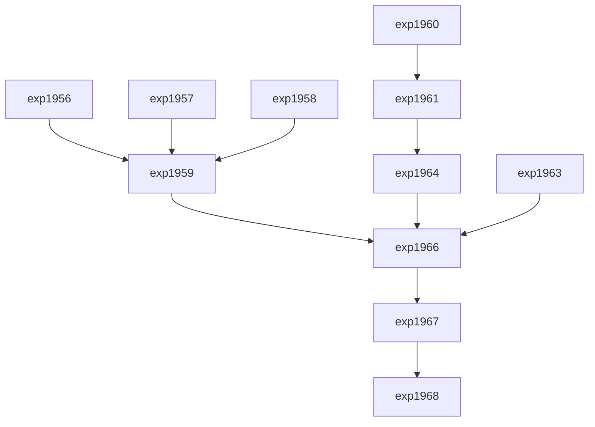

# Carnot Research Roadmap vNEXT (Milestone 2026.05.153)

**Title:** Negative Constraint Decoding, Flow Sampling Samplers, and Continuous Self-Learning Refinement

## 1. What the Previous Milestone Proved (.152)
Milestone .152 demonstrated that differentiable projection layers (HardNet++ style) and Physics-Informed KAN extensions effectively enforce hard constraints during energy-based generation. Multi-agent Ising models and denoising thermodynamics validated continuous latent sampling improvements. However, a major gap remains in handling negative constraints dynamically and handling non-autoregressive discrete diffusion, which causes our deterministic verifiers to frequently fail on token-limited or profanity-filtered structural generation.

## 2. The 3 Biggest Gaps to the PRD Vision
1. **Dynamic Negative Constraints:** We can enforce positive schemas (e.g., valid JSON), but negative constraints (e.g., specific format exclusions or length limits) lead to state explosion in our current validators.
2. **Efficient Non-Autoregressive Sampling:** Hardware execution simulation still relies on sequential block Gibbs. Recent Flow Sampling and Interleaved Gibbs Diffusion (IGD) work demonstrates orders of magnitude speedups for mixed continuous-discrete EBMs.
3. **Continual Learning without Forgetting:** While FR-11 showed memory growth, applying verified continuous updates often leads to subtle soundness or completeness degradation without robust parameter routing.

## 3. Phase Descriptions

### Phase 1: Advanced Constrained Decoding (Exp 1956 - 1959)
This phase addresses structural constraints from recent 2026 advances: NCO (Negative Constraints) and TruncProof (maximum token limitations). It integrates these filters into the local GGUF decoding logic.
- **Exp 1956:** Implement NCO Plug-in for Negative Constraints.
- **Exp 1957:** TruncProof Token-Limited LL(1) Parsing.
- **Exp 1958:** GCoT-Decoding Reasoning Paths.
- **Exp 1959:** Tri-SOTA Constrained Eval (requires Qwen3.6-35B-A3B-GGUF, gemma-4-31B-it-GGUF).

### Phase 2: Flow Sampling and Diffusion (Exp 1960 - 1962)
Explores unnormalized density sampling (Flow Sampling) and Interleaved Gibbs Diffusion (IGD) to parallelize discrete generation.
- **Exp 1960:** Flow Sampling Process.
- **Exp 1961:** Interleaved Gibbs Diffusion (IGD) Prototype.
- **Exp 1962:** NI Sampling Optimization.

### Phase 3: Continuous Self-Learning & Reasoning (Exp 1963 - 1965)
Focuses on the core self-learning objective by applying Routing without Forgetting principles, tracking utility growth while ensuring zero soundness mistakes.
- **Exp 1963:** Continual Online Learning: Routing without Forgetting.
- **Exp 1964:** Hardware-Accounted IGD Evaluation.
- **Exp 1965:** Energy-Guided NCO Benchmark.

### Phase 4: Synthesis & E2E (Exp 1966 - 1968)
End-to-end integration and retrospective accounting.
- **Exp 1966:** Tri-SOTA E2E Integration v8.
- **Exp 1967:** Milestone .153 Pre-Retro Audit.
- **Exp 1968:** Milestone .153 Retrospective.

## 4. Hardware Requirements
- **Local Host:** AMD Ryzen AI 9 HX 370 with 2x idle RTX 3090s via CUDA (as verified in .152).
- **RAM:** Minimum 64GB required for Tri-SOTA model caches.
- **FPGA:** KV260 reserved strictly for source-level RTL property evidence (no latency claims).

## 5. Dependency Graph

