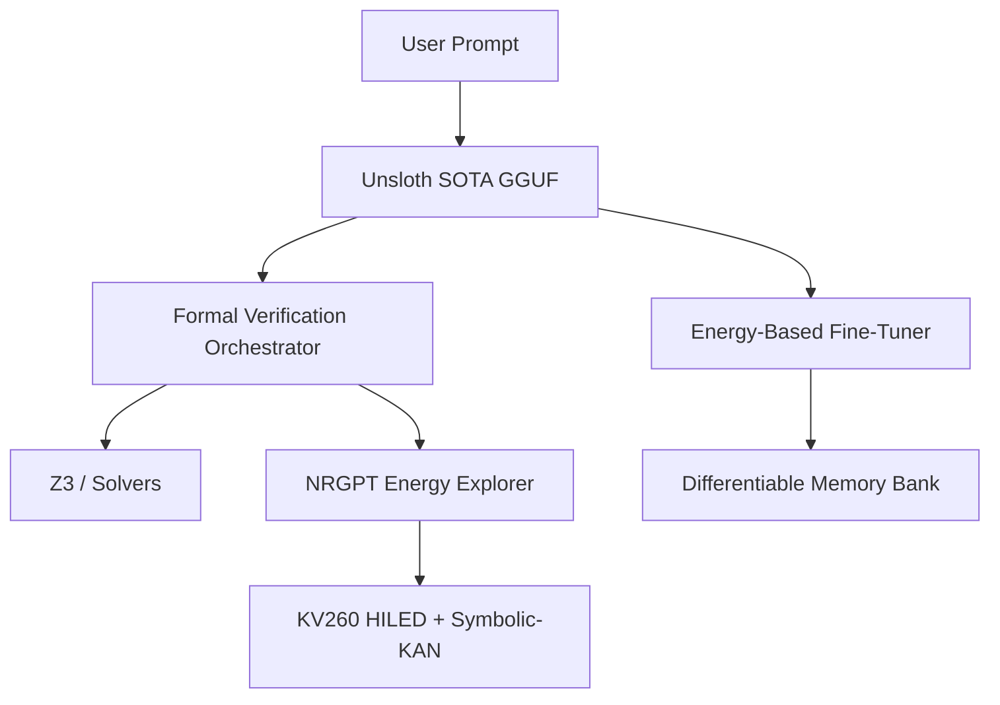

# Phase-15: Energy-Based Fine-Tuning, Symbolic-KAN Integration, and Formal Orchestration
**Milestone:** 2026.05.138
**Status:** PROPOSED

## What Previous Milestone Proved (.137)
Milestone .137 successfully integrated continuous latent constraint modeling using Langevin dynamics, deployed a differentiable multi-session constraint memory bank, and achieved hardware-in-the-loop energy decoding (HILED) on the KV260 board. The E2E pipelines with `Qwen3.6-35B-A3B` and `Gemma4-31B-it` confirmed that latent continuous optimization is feasible and stable across sessions.

## 3 Biggest Gaps Addressed
1. **Self-Learning Grounding:** Continuous self-learning lacked a direct feedback mechanism for model fine-tuning; we are bridging this with Energy-Based Fine-Tuning (EBFT).
2. **Hardware Symbolic Scalability:** HILED was running Ising constraints; we need to scale this to discrete symbolic structures via Symbolic-KANs on the FPGA.
3. **Formal Orchestration:** While static verifiers exist, we lack an Aleph-style orchestrator to natively bind EBM exploration (NRGPT-style) with external formal solvers iteratively.

## Architecture Evolution

## Phase Descriptions

### Phase 1: Energy-Based Fine-Tuning (EBFT) Pipeline
Integrate EBFT to provide dense semantic feedback. This updates the continuous self-learning loop by replacing heuristic adjustments with principled energy-based sequence-level alignment.

### Phase 2: Formal Verification Orchestrator
Implement an Aleph-style agent that coordinates between the SOTA GGUF drafter and formal solvers. Introduce NRGPT-style exploration, where inference acts as an exploration of the constraint energy landscape.

### Phase 3: Symbolic-KAN Hardware Acceleration
Extend the KV260 HILED endpoints to support Symbolic-KANs, combining neural flexibility with the discrete symbolic structure of our formal verifiers.

### Phase 4: Capstone Evaluation & Continual Learning
Run the end-to-end continuous self-learning loop using the Orchestrator and HILED Symbolic-KANs, focusing on the forgetting rate and Putnam-style reasoning benchmarks.

## Hardware Requirements
- Dual RTX 3090 (for SOTA GGUF inference and EBFT).
- AMD/Xilinx Kria KV260 (for HILED Symbolic-KAN execution).
