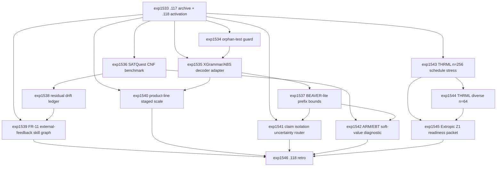

# Research Roadmap vNEXT: Milestone 2026.04.118

**Planned:** 2026-05-08
**Status:** Ready for conductor activation
**Predecessor:** Milestone 2026.04.117 completed 2026-05-08
**Roadmap YAML:** `research-roadmap-next.yaml`

## ID Allocation Note

Milestone `.117` used `exp1519` through `exp1532`. Milestone `.118`
therefore allocates `exp1533` through `exp1546`. The active execution file
`research-roadmap.yaml` and the conductor implementation are not modified by
this plan.

## What Milestone 2026.04.117 Proved

| Finding | Evidence | Impact on .118 |
| --- | --- | --- |
| Runtime contracts are now an end-to-end acceptance surface. | `exp1520` linked 458 runtime-contract cases with `runtime_contract_e2e_ready=true`, source artifacts loaded, `false_accept_rate=0.0`, and `false_reject_count=0`. | Scale the zero-false-accept contract stack into automata-guided decoding, SAT/CNF verifier tasks, prefix-risk bounds, and multi-turn commitment drift. |
| Live SOTA repair is wired but not yet useful at scale. | `exp1521` used `unsloth/Qwen3.6-35B-A3B-GGUF` but only attempted 2 repair cases, with `repair_accept_rate_delta=0.0`. | Keep mandated local SOTA in the loop, but measure concrete parse/accept/latency gains from automata and SAT-guided constraints before making stronger repair claims. |
| CDG root-cause ordering has positive signal. | `exp1522` loaded 458 E2E cases, attempted 111 root-cause cases, and improved fix efficiency from `0.188589` to `0.238739` (`delta=+0.05015`) with zero false accepts. | Add SATQuest-style deterministic oracles and residual-drift ledgers so root-cause evidence covers both contradictions and forgotten commitments. |
| Product-line rescue succeeded only on a bounded benchmark. | `exp1523` raised parse, feasibility, and oracle-agreement rates from weak baselines to `1.0`, with zero false accepts. | Scale product-line evidence to a staged benchmark pack before deciding whether the branch deserves more research time. |
| FR-11 promotion is safe but still lacks positive utility. | `exp1524` promoted one rollback-passing policy with `soundness_mistakes=0`, `no_model_weight_mutation=true`, and `utility_delta=0.0`. | The required `.118` self-learning task must use external verifier feedback and require `utility_delta > 0` for any headline positive self-learning claim. |
| Claim isolation is too small and too expensive so far. | `exp1525` ran 1 case, extracted 4 claims, preserved zero false accepts, but had `budget_delta=+3`. | Scale claim isolation behind uncertainty/prefix-risk routing; do not claim budget savings unless the routed path beats full-context verification. |
| THRML/Carnot parity is strong in software up to the next scale gate. | `exp1526` through `exp1531` passed software-only parity through n=128 and diverse n=32 topologies. | Stress n=256 schedules and diverse n=64 topologies while maintaining explicit no-TSU/no-hardware claim boundaries. |
| The planner still needs orphan-test discipline. | `.117` initially wedged on a generated pytest importing a non-existent artifact module; the outer loop deleted the orphan test, reactivated the conductor, and completed all tasks. | `.118` starts with an orphan-test/import-target guard before downstream experiments can run. |

## Research Signals Added Before Planning

The 2026-05-08 sweep was appended to `research-references.md` before this
design. Signals that materially shape `.118`:

- **XGrammar-2** (`arXiv:2601.04426`) and **ABS automata-guided beam search**
  motivate a DFA/grammar-backed contract decoder below semantic validators.
- **SATQuest** motivates a local CNF benchmark with PySAT as deterministic
  authority and format-diverse prompts for local SOTA GGUFs.
- **BEAVER** motivates deterministic prefix-risk bounds as a routing signal,
  not as a replacement for Carnot validators.
- **Residual Drift** motivates a commitment ledger that distinguishes true
  contradictions from satisfiable but forgotten constraints in multi-turn
  reasoning.
- **SkillLearnBench** and **Audited Skill-Graph Self-Improvement** motivate
  external-feedback FR-11 skill promotion with auditable lineage, replay
  evidence, and positive utility gates.
- **EBT** (`arXiv:2507.02092`) and **Autoregressive LMs as EBMs**
  (`arXiv:2512.15605`) motivate a soft-value diagnostic comparing local SOTA
  logprob/energy proxies with deterministic Carnot labels.
- **Extropic Z1/XTR-0** and **Kona** public status updates keep hardware
  planning relevant, but `.118` remains software-only unless authenticated
  device access and transcripts exist.

## Three Biggest Gaps

1. **Generation-time constraints are still mostly post-hoc.** `.117` proved
   contracts can reject outputs, but the PRD vision needs the generator itself
   constrained by automata, SAT oracles, and prefix-risk signals before repair
   loops consume expensive local SOTA cycles.

2. **Continuous self-learning is safe but not yet valuable.** FR-11 promotion
   now avoids soundness mistakes and weight mutation, but a promoted policy
   with `utility_delta=0.0` is not enough. The next milestone must prove
   positive task utility from externally verified, replay-passing skill updates
   or honestly block the claim.

3. **Hardware readiness lacks stress and handoff artifacts.** THRML software
   parity is credible through n=128 and diverse n=32, but the hardware roadmap
   needs larger schedule/topology stress plus an access packet that says exactly
   what Carnot will run when Z1/TSU access becomes real.

## Architecture

```text
                 Milestone 2026.04.118 Research Stack

   .117 archive + .118 activation + orphan-test guard
       |
       v
   runtime-contract authority from .117
   safe DSL | grammar certificates | monitors | structural contracts
       |
       v
   generation-time constraint layer
   XGrammar-2-style dynamic grammars | ABS DFA masks | SATQuest CNF oracle
       |
       +-------------------------------+
       |                               |
       v                               v
   prefix-risk + drift audits      product-line staged scale
   BEAVER-lite bounds              syntax -> feature model -> oracle feedback
   residual commitment ledger
       |
       v
   mandated local SOTA GGUF diagnostics and repair
   Qwen3.6-35B-A3B | gemma-4-31B-it | gemma-4-26B-A4B-it
       |
       +-------------------------------+
       |                               |
       v                               v
   FR-11 external-feedback        ARM/EBT soft-value diagnostic
   auditable skill graph          logits/energy proxies below validators
   positive utility required
       |
       v
   THRML/Carnot software stress
   n=256 schedule stress | diverse n=64 topology parity
       |
       v
   Extropic Z1 readiness packet + .118 retro/carry-forward gates
```

## Phase Descriptions

### Phase 0 - Archive, Activation, and Planner Guard

`exp1533` writes the `.117` completion archive and `.118` activation manifest,
including the completed `.117` criteria, live SOTA, FR-11, product-line,
claim-isolation, THRML, and orphan-test carry-forward fields. `exp1534` is a
mandatory guardrail task: it creates or updates an import-target/orphan-test
audit so generated roadmap tests cannot import non-existent implementation
modules again.

### Phase 1 - Automata, SAT, and Drift-Aware Runtime Contracts

`exp1535` adds an XGrammar-2/ABS-style contract decoder adapter and compares
generation-time constraints against the current grammar-only/post-decode path.
`exp1536` creates a bounded SATQuest-style CNF verifier benchmark with PySAT as
authority. `exp1537` adds a BEAVER-lite prefix-bound audit for high-risk
contract prefixes, keeping deterministic validators as final authority.
`exp1538` adds a residual-drift commitment ledger over multi-turn
SAT/product-line/runtime-contract cases so Carnot can distinguish
contradictions from satisfiable but forgotten commitments.

### Phase 2 - Positive-Utility Self-Learning and Product Scale

`exp1539` is the required continuous self-learning experiment. It converts
rollback-passing FR-11 updates into an auditable skill graph, promotes only
externally verified updates, forbids model-weight mutation, and treats
`utility_delta > 0` as the threshold for headline success. `exp1540` scales the
rescued product-line branch to a staged benchmark pack. `exp1541` scales claim
isolation behind uncertainty/prefix-risk routing. `exp1542` runs an ARM/EBT
soft-value diagnostic over local SOTA outputs and deterministic labels without
turning logits into acceptance authority.

### Phase 3 - THRML Stress, Hardware Readiness, and Retro

`exp1543` stresses THRML/Carnot software parity at n=256 with schedule
variation. `exp1544` scales diverse topology parity to n=64. `exp1545` writes
an Extropic Z1 access-readiness packet with benchmark manifests, transcript
schema, and no-hardware-claim boundaries. `exp1546` closes `.118` with
criteria accounting, retirements, carry-forward gates, and ops reconciliation
instructions for `.119`.

## Dependency Graph



## Hardware Requirements

| Task range | Hardware | Requirement boundary |
| --- | --- | --- |
| `exp1535`-`exp1542` | Dual RTX 3090 local workstation preferred for LLM-bearing rows | Every LLM-bearing experiment must include at least one mandated headline GGUF in `MODEL_SPECS`: `unsloth/Qwen3.6-35B-A3B-GGUF`, `unsloth/gemma-4-31B-it-GGUF`, or `unsloth/gemma-4-26B-A4B-it-GGUF`. Legacy small models may appear only as fast CPU smoke tests. |
| `exp1533`, `exp1534`, `exp1546` | CPU acceptable | Archive, planner guard, and retrospective. These tasks must not touch `research-roadmap.yaml` or `scripts/research_conductor.py`. |
| `exp1543`, `exp1544` | CPU acceptable; local JAX/THRML accelerator libraries allowed only if already available | THRML/Carnot software or simulator parity only. No Extropic TSU, Z1, XTR-0, FPGA board, synthesis, bitstream, or board-execution claim. |
| `exp1545` | CPU acceptable | Readiness packet only. It may define an access/transcript protocol but must not imply hardware execution happened. |

## Success Criteria

| Criterion | Acceptance |
| --- | --- |
| Activation | `exp1533.activation_manifest_complete=true`, `.117` criteria are recorded, and `.118` gates are explicit. |
| Planner guard | `exp1534.orphan_test_guard_ready=true` and generated roadmap import targets are audited without touching the conductor. |
| Automata decoder | `exp1535.contract_decoder_adapter_ready=true` with mandated local SOTA in `MODEL_SPECS`, false accepts reported, and latency/validity deltas measured. |
| SATQuest benchmark | `exp1536.satquest_benchmark_ready=true` with PySAT oracle authority and zero solver-oracle false accepts. |
| Prefix-risk bounds | `exp1537.beaver_bound_ready=true` with prefix-risk metrics clearly labeled as auxiliary. |
| Residual drift | `exp1538.residual_drift_ledger_ready=true` with contradiction versus satisfiable-drift counts. |
| Continuous self-learning | `exp1539.continuous_self_learning_task=true`, `no_model_weight_mutation=true`, `soundness_mistakes=0`, and positive-utility claims only if `utility_delta > 0`. |
| Product-line scale | `exp1540.product_line_scale_ready=true` or `branch_retired=true`, with parse, feasibility, oracle-agreement, and false-accept metrics. |
| Claim isolation routing | `exp1541.uncertainty_router_ready=true` with routed-case budget metrics and zero deterministic false accepts. |
| ARM/EBT diagnostic | `exp1542.arm_ebm_diagnostic_ready=true` with deterministic validators preserved as final authority. |
| THRML n=256 | `exp1543.thrml_parity_n256_schedule_ready=true` or an honest simulator-only blocker. |
| THRML diverse n=64 | `exp1544.diverse_topology_parity_n64_ready=true` or an honest simulator-only blocker. |
| Hardware readiness | `exp1545.extropic_z1_readiness_packet_ready=true`, with explicit no-hardware-claim boundary. |
| Retrospective | `exp1546.criteria_met` and `criteria_total` summarize `.118` with `.119` carry-forward gates. |

Target threshold: at least 12 of 14 tasks complete or honestly terminal with
zero unbounded hardware, verifier, or self-learning claims.

## Prior Failure and Retirement Rules

- The `.117` orphan-test wedge must be closed before downstream LLM-bearing
  tasks run. If `exp1534` cannot produce a guard, later tasks may still produce
  honest terminal artifacts, but `.118` cannot claim full activation success.
- Product-line work continues only if `exp1540` improves over the bounded
  `.117` rescue at non-trivial case count. Otherwise it must emit
  `branch_retired=true` with a replacement recommendation.
- FR-11 may claim safety if replay and soundness pass, but may claim positive
  self-learning only when externally verified promotion yields
  `utility_delta > 0`.
- BEAVER/prefix-risk and ARM/EBT soft-value signals are routing diagnostics
  only. Deterministic Carnot validators, PySAT, and runtime contracts remain
  the acceptance authority.
- THRML tasks remain software-only. Any real TSU/Z1/XTR-0, FPGA, synthesis, or
  bitstream claim is out of scope for `.118`.

## Local-First and Decentralization Implications

`.118` keeps the Carnot roadmap local-first: mandated GGUF experiments run on
local workstation hardware, deterministic validators remain local, and hardware
readiness artifacts are written before external access is assumed. The milestone
intentionally treats recent EBM, automata, SAT, and self-learning work as
interfaces around Carnot's verifier stack rather than reasons to depend on a
central hosted verifier or mutate model weights.
